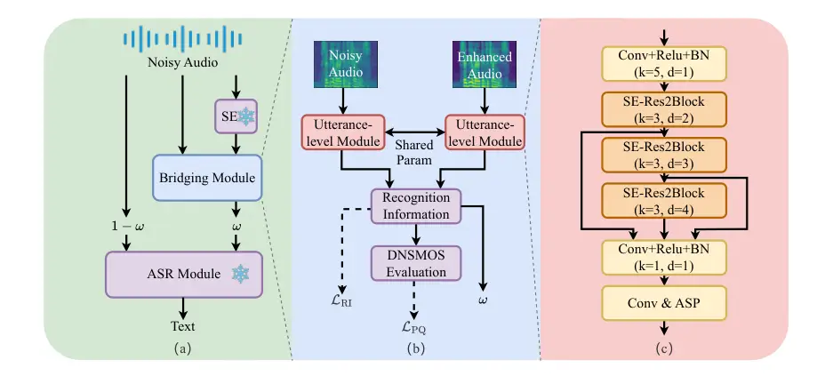
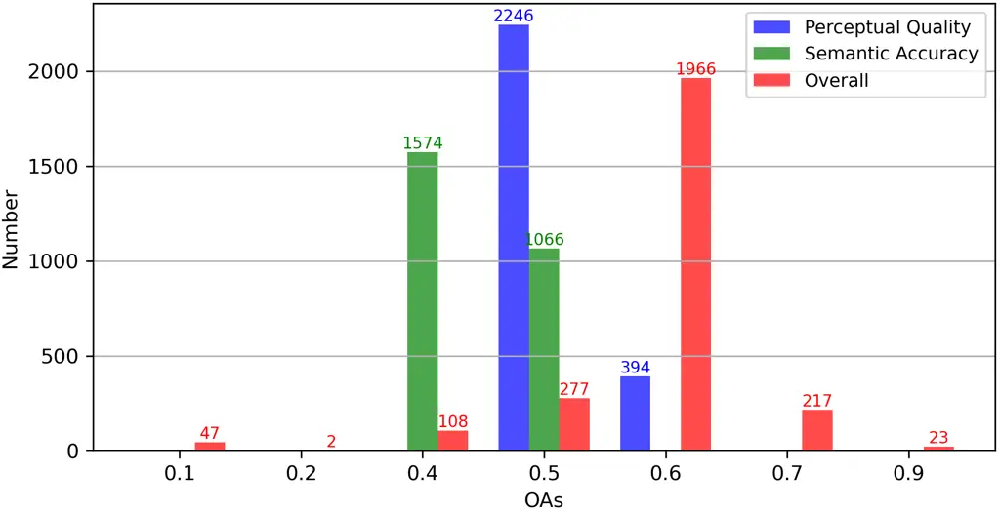

# Reducing the Gap Between Pretrained Speech Enhancement and Recognition Models Using a Real Speech-Trained Bridging Module

Zhongjian Cui¹, Chenrui Cui¹, Tianrui Wang¹, Mengnan He², Hao Shi³, Meng
Ge¹,  
Caixia Gong², Longbiao Wang^(1,4), Jianwu Dang⁵ ^(†)^(†)thanks: Mengnan
He and Longbiao Wang are corresponding authors. This work was supported
by the National Natural Science Foundation of China under Grant 62176182
and U23B2053. Affiliation:  Affiliation: ¹Tianjin Key Laboratory of
Cognitive Computing and Application,Tianjin University, Tianjin, China  
²DiDi Chuxing, Beijing, China ³Graduate School of Informatics, Kyoto
University, Kyoto, Japan  
⁴Huiyan Technology (Tianjin) Co., Ltd, Tianjin, China  
⁵Shenzhen Institute of Advanced Technology, Chinese Academy of Sciences,
Shenzhen, China

###### Abstract

The information loss or distortion caused by single-channel speech
enhancement (SE) harms the performance of automatic speech recognition
(ASR). Observation addition (OA) is an effective post-processing method
to improve ASR performance by balancing noisy and enhanced speech.
Determining the OA coefficient is crucial. However, the currently
supervised OA coefficient module, called the bridging module, only
utilizes simulated noisy speech for training, which has a severe
mismatch with real noisy speech. In this paper, we propose training
strategies to train the bridging module with real noisy speech. First,
DNSMOS is selected to evaluate the perceptual quality of real noisy
speech with no need for the corresponding clean label to train the
bridging module. Additional constraints during training are introduced
to enhance the robustness of the bridging module further. Each utterance
is evaluated by the ASR back-end using various OA coefficients to obtain
the word error rates (WERs). The WERs are used to construct a
multidimensional vector. This vector is introduced into the bridging
module with multi-task learning and is used to determine the optimal OA
coefficients. The experimental results on the CHiME-4 dataset show that
the proposed methods all had significant improvement compared with the
simulated data trained bridging module, especially under real evaluation
sets.

###### Index Terms: 

Noise-robust automatic speech recognition, distortion, observation
adding

## I Introduction

Automatic speech recognition (ASR) aims to transcribe the text from
speech \[1, 2, 3\]. Its performance is greatly degraded with the
presence of background noise \[4, 5\]. A common solution to improve the
noise-robust ASR is to incorporate a speech enhancement (SE) front-end
into the system. SE front-end can be classified into single-channel \[6,
7, 8, 9, 10, 11\] and multi-channel \[12, 13, 14, 15\] methods according
to the channel number of the speech signals. Multi-channel front-ends
often require more complex microphone arrays to pick up speech signals.
Thus, compared with multi-channel microphone arrays, single-channel
microphones are often more feasible to apply in practical scenarios.
Nevertheless, single-channel SE front-ends often cause much more speech
information distortion\[16, 17, 18\], which harms ASR performance.

The SE front-end and ASR back-end are often trained separately based on
different learning targets. The inevitable mismatches between these two
models lead to no improvement or degradation of ASR performance \[19,
20\]. Better integration of pre-trained SE front-end and ASR back-end is
crucial to constructing a noise-robust ASR system. Joint training is an
intuitive way to alleviate mismatches \[21, 22, 23, 20, 24, 25, 26\]. In
this manner, the SE front-end typically acts as a feature extractor only
for the corresponding ASR back-end, reducing the previously achieved
speech noise reduction capability \[26\]. Moreover, it is challenging to
use joint training for noise-robust ASR when the front-end and back-end
models cannot be trained or are unknown.

Existing studies \[16, 17, 18\] find ASR back-ends are more sensitive to
artifacts than noise. Observation addition (OA) is an effective
post-processing to improve ASR performance \[27\]. It adds the original
noisy speech to the enhanced speech with a certain coefficient. However,
the OA coefficient should meet the diversity of the noise and
signal-to-noise ratio (SNR) within different utterances \[28, 29\]. The
bridging module\[30\], which is according to the SNR or some other
criteria, is used to select suitable OA coefficients for noise-robust
ASR. The clean speech label for real noisy speech is unavailable, which
makes the bridging module only trained with simulated noisy speech.
However, there is a data distribution mismatch between the simulated and
real speech. Thus, the bridging system trained with simulated data
sometimes can not process real speech well.



Fig. 1: The noise-robust ASR system based on bridging module (a) Overall
framework (b) Bridging module structure: the recognition information
module and perceptual quality module consist of a fully connected layer
and a linear layer respectively (c) Utterance-level module structure

In this paper, we propose training strategies to train the bridging
module with the frozen SE and ASR model by using real noisy speech. Due
to the success of training the bridging module according to noisy speech
SNR on simulated data, speech evaluation metrics without clean labels
required are considered. DNSMOS \[31\], which measures speech quality
without clean labels, is used as evaluation metrics. To match the OA
coefficient and train the bridging module, the value estimated by DNSMOS
is linearly mapped between 0 and 1. While effective for noise-robust
ASR, DNSMOS has limitations, such as being overly smooth and less
accurate for shorter clips. To further enhance the robustness of the
bridging module, we introduce additional constraints during training. It
should be emphasized that ASR loss, i.e., joint training, is not used to
train the bridging module. WER intuitively reflects whether the OA
coefficient is appropriate for the utterance. Multiple OA coefficients
are used to post-process and then compute WERs. For each utterance, a
multidimensional vector reflects the WERs information according to
different OA coefficients. The WERs information makes the bridging
module learn a more suitable OA coefficient for the current ASR back-end
with multi-task learning.

## II Preparatory knowledge

### II-A Noise-Robust ASR with SE Front-end

Some studies \[32, 33\] show that the SE front-end still benefits from
the well-performing ASR performance. SE front-end aims to reduce the
impact of noise on downstream tasks. It transforms the noisy speech
signal $`\boldsymbol{x}`$ to enhanced speech signal
$`\boldsymbol{\widehat{y}}`$, which can be expressed as follows:

```math
\boldsymbol{\widehat{y}}=\mathrm{SE}(\boldsymbol{x}).\vskip-3.0pt \tag{1}
```

Many network structures can be used to construct SE. Here, FRCRN \[6\]
and DCCRN \[7\] are chosen as the SE front-end. ASR back-end transcribes
the enhanced speech signal $`\boldsymbol{\widehat{y}}`$ into word
sequence $`\boldsymbol{\widehat{W}}`$, which can be expressed as
follows:

```math
\boldsymbol{\widehat{W}}=\mathrm{ASR}(\boldsymbol{\widehat{y}}).\vskip-3.0pt \tag{2}
```

Whisper \[34\] is chosen as the ASR back-end.

### II-B Observation Addition

The artifacts caused by single-channel SE affect ASR performance\[17,
18, 16\]. OA is a simple and feasible way to alleviate signal artifacts.
It adds the original noisy speech signal to the enhanced speech signal,
which can be expressed as follows:

```math
\boldsymbol{\tilde{y}}=\omega\boldsymbol{x}+(1-\omega)\boldsymbol{\widehat{y}},\vskip-3.0pt \tag{3}
```

where $`\omega`$ is used to balance the noisy and the enhanced speech
signals, which is a pre-set value between 0 and 1.

### II-C Bridging Module

The existing bridging module \[30\] is based on SNR. It first predicts
the SNR-level of the speech through cosine similarity and then maps the
OA coefficient through the linear layer. Finally, the bridging module is
trained using the MSE loss between clean speech signals and the speech
balanced by the noisy speech and enhanced speech with the OA
coefficient. The lower part of Fig. 1 (a) shows the OA with the bridging
module. The bridging module is trained separately from the SE front-end
and ASR back-end. The bridging module aims to establish a connection
between the noisy and the enhanced speech signals to dynamically obtain
a more matching $`\omega`$ for different speeches, rather than a fixed
pre-set value:

```math
\widehat{\omega}=\mathrm{Bridging}(\boldsymbol{x},\boldsymbol{\widehat{y}}),\vskip-3.0pt \tag{4}
```

where $`\widehat{\omega}`$ is predicted by the bridging module.

## III Real Speech-training for Bridging Module

Fig. 1 illustrates our proposed method: a sentence-level bridging
module, supervised by recognition information and perceptual quality.
This module predicts OA coefficients from noisy and enhanced speech to
generate inputs optimized for ASR.

### III-A Training Strategies

#### III-A1 Training with Perceptual Quality

The impact of noise on speech is most directly reflected in perception.
Therefore, we introduce non-intrusive perceptual metrics to guide the
bridging module for predicting OA on real data. Specifically, we use the
normalized $`sig`$ and $`bak`$ metrics from DNSMOS as the targets for
the bridging module’s prediction, as follows:

```math
\mathcal{L}_{\mathrm{PQ}}=MSE(\hat{\omega},(norm(sig)+norm(bak))/2),\vskip-3.0pt \tag{5}
```

where $`norm`$ represents the normalization of metric ranges from 1 to
5, as $`norm(\alpha)=\frac{\alpha-1}{4}`$. The $`sig`$ metric reflects
the quality of the speech, while the $`bak`$ metric reflects the quality
of the background noise. $`\hat{\omega}`$ is the predicted result from
the bridging module, and $`MSE`$ represents the mean squared error loss
function.

#### III-A2 Training with Recognition Information

In addition to perceptual quality, factors such as artifacts, noise
residue, speech length, and disruptions in speech structure
significantly affect the performance of speech recognition models\[35,
18, 16, 17\], leading to the impact of word error rate (WER). Thus, we
use WER directly as the second supervision for the bridging module.
Specifically, we preset $`(1/k+1)`$ fixed OA coefficients with a step
size of $`k\in(0,0.1]`$ from 0 to 1, applying these OA coefficients to
the SE and ASR systems to process the training set. For each speech
sample, we calculate $`(1/k+1)`$ WER values. The precomputed OA-WER
pairs are then used to guide the training of the bridging module, as
follows:

```math
\mathcal{L}_{RI}=-\log\sigma(cs(\sigma(logits),\sigma(wers))),\vskip-3.0pt \tag{6}
```

where $`logits`$ represent an intermediate representation of the
bridging module, $`\sigma`$ is the sigmoid function, and $`cs`$ denotes
cosine similarity. $`wers=[wer_{0},wer_{1},\dots,wer_{(1/k)}]`$ are the
WER values for each speech sample, arranged in descending order based on
OA. This allows $`\mathcal{L}_{RI}`$ to guide the bridging module in
predicting the sigmoid-compressed OA-WER distribution, enabling the
module to anticipate how different OA values affect speech recognition
performance within the current SE and ASR systems.

#### III-A3 Combined Training

Training the bridging module with both perceptual quality and
recognition information is described as:

```math
\widehat{\boldsymbol{\Lambda}}=\underset{{\boldsymbol{\Lambda}=\{\boldsymbol{\theta}_{{\mathrm{BM}}}\}}}{\operatorname*{\operatorname*{\operatorname*{argmin}}}}({\mathcal{L}_{{\mathrm{PQ}}}+\mathcal{L}_{{\mathrm{RI}}}})/2,\vskip-3.0pt \tag{7}
```

where $`\boldsymbol{\Lambda}`$ represents the model parameters to be
optimized. $`\boldsymbol{\theta}_{{\mathrm{BM}}}`$ represents the
parameters of the bridging module. $`\mathcal{L}_{{\mathrm{PQ}}}`$ and
$`\mathcal{L}_{{\mathrm{RI}}}`$ represent formula (5) and formula (6)

### III-B Model Structure

Most ASR models use Fbank features for recognition. To adapt to these
models, we extracted Fbank features as inputs for the bridging module.
Considering that certain speech properties can be extracted from
different sets of frames, we employ a channel-time attention method that
leverages dependencies in the time dimension to comprehensively extract
speech features. Specifically, we adopt the architecture of ResNet and
use convolution and Attentive Stat Pooling (ASP) \[36\]. According to
\[16, 17, 18\], the OA coefficient primarily depends on two factors:
noise in noisy speech and artifacts in enhanced speech. Consequently, we
use features from both noisy and enhanced speech as inputs to the
module, and achieve an OA coefficient that balances the ratio between
noisy and enhanced speech through the perceptual quality and recognition
information. The specific module structure is illustrated in Fig. 1 (b)
and (c).

## IV Experimental

### IV-A Dataset

The experiments are conducted using the CHiME-4 dataset \[37\]. The
training set includes 1,600 real and 7,138 simulated noisy speech
samples, while the validation set comprises 1,640 real and their
simulated noisy counterparts. The evaluation set consists of 1,320 real
and 1,320 simulated noisy samples. Only Channel 5 is used for training,
validation, and testing.

|                                                                                                                                       |                                                        |         |        |          |         |        |          |         |        |          |
| ------------------------------------------------------------------------------------------------------------------------------------- | ------------------------------------------------------ | ------- | ------ | -------- | ------- | ------ | -------- | ------- | ------ | -------- |
| SE model                                                                                                                              | ASR (Whisper)                                          | et_simu |        |          | et_real |        |          | overall |        |          |
|                                                                                                                                       |                                                        | base    | small  | large-v3 | base    | small  | large-v3 | base    | small  | large-v3 |
|                                                                                                                                       | Only ASR                                               | 12.40%  | 7.51%  | 4.35%    | 18.24%  | 10.05% | 4.99%    | 15.32%  | 8.78%  | 4.66%    |
| FRCRN                                                                                                                                 | SE-ASR                                                 | 12.70%  | 11.29% | 5.28%    | 17.69%  | 14.02% | 6.89%    | 15.20%  | 12.66% | 6.19%    |
|                                                                                                                                       | SE-OA-ASR                                              | 10.41%  | 9.59%  | 4.24%    | 17.80%  | 10.16% | 4.78%    | 14.10%  | 9.88%  | 4.51%    |
|                                                                                                                                       | SE-BM-ASR(SNR-level)                                   | 12.18%  | 10.08% | 4.24%    | 17.37%  | 9.76%  | 4.82%    | 14.78%  | 9.92%  | 4.53%    |
|                                                                                                                                       | SE-BM(ours)-ASR(SNR-level)                             | 12.59%  | 11.27% | 5.45%    | 19.01%  | 13.93% | 6.90%    | 15.80%  | 12.60% | 6.18%    |
|                                                                                                                                       | SE-BM-ASR($`\mathcal{L}_{RI}`$)                        | 10.43%  | 9.60%  | 4.07%    | 16.64%  | 10.02% | 4.61%    | 13.53%  | 9.81%  | 4.30%    |
|                                                                                                                                       | SE-BM-ASR($`\mathcal{L}_{PQ}`$)                        | 11.03%  | 8.42%  | 4.07%    | 15.57%  | 8.79%  | 4.52%    | 13.30%  | 8.61%  | 4.27%    |
|                                                                                                                                       | SE-BM-ASR($`\mathcal{L}_{RI}`$ + $`\mathcal{L}_{PQ}`$) | 10.95%  | 9.55%  | 4.14%    | 15.52%  | 8.67%  | 4.36%    | 13.23%  | 9.11%  | 4.25%    |
| DCCRN                                                                                                                                 | SE-ASR                                                 | 16.63%  | 12.07% | 5.94%    | 27.17%  | 17.83% | 8.79%    | 21.90%  | 14.95% | 7.37%    |
|                                                                                                                                       | SE-OA-ASR                                              | 12.24%  | 8.61%  | 4.54%    | 19.14%  | 9.80%  | 5.25%    | 15.69%  | 9.21%  | 4.89%    |
|                                                                                                                                       | SE-BM-ASR(SNR-level)                                   | 15.93%  | 11.02% | 5.87%    | 26.46%  | 16.12% | 7.87%    | 21.20%  | 13.57% | 6.87%    |
|                                                                                                                                       | SE-BM(ours)-ASR(SNR-level)                             | 16.62%  | 12.06% | 6.11%    | 29.04%  | 17.34% | 8.74%    | 22.83%  | 14.70% | 7.46%    |
|                                                                                                                                       | SE-BM-ASR($`\mathcal{L}_{RI}`$)                        | 11.74%  | 8.69%  | 4.30%    | 17.76%  | 9.48%  | 4.89%    | 14.62%  | 9.08%  | 4.59%    |
|                                                                                                                                       | SE-BM-ASR($`\mathcal{L}_{PQ}`$)                        | 11.42%  | 8.51%  | 4.21%    | 17.19%  | 9.38%  | 4.76%    | 14.30%  | 8.95%  | 4.49%    |
|                                                                                                                                       | SE-BM-ASR($`\mathcal{L}_{RI}`$ + $`\mathcal{L}_{PQ}`$) | 11.49%  | 7.47%  | 4.18%    | 16.28%  | 9.81%  | 4.76%    | 13.98%  | 8.64%  | 4.47%    |
| Bold denotes the best performance for each fixed SE and ASR model, and underline indicates that the results outperform the baselines. |                                                        |         |        |          |         |        |          |         |        |          |

TABLE I: The WER of different pretrained SE models and different
whispers on chime4.

### IV-B Models

This paper aims to use the bridging module to bridging the well-trained
SE and ASR models. Thus, the parameters of SE and ASR models are frozen.

1.  - SE model: FRCRN and DCCRN are used.
2.  - ASR model: Whisper base, smalll, and large-v3 are used.
3.  - Bridging module: The input speech is converted into an
      80-dimensional Fbank using a 25-ms window and a 10-ms frame shift.
      For data augmentation, we applied SpecAugment \[38\], which randomly
      masks 0 to 5 frames in the time domain and 0 to 4 channels in the
      frequency domain. The number of channels in the convolutional frame
      layer is set to 256 or 384. The bottleneck dimension in the SE-Block
      and attention module is set to 256. The scale dimension $`s`$ in
      Res2Block \[39\] is set to 8. The number of nodes in the fully
      connected layer is set to 384. The fixed OA coefficient step size
      $`k`$ is set to 0.1.
4.  - Training configuration: The learning rate is 0.0005. Additionally,
      we employ a warmup supervision, with the maximum number of training
      epochs set to 45. To prevent the issue of gradient explosion, the
      maximum norm for gradient clipping is set to 10.0.
5.  - Baselines: Only ASR \[34\], SE-ASR \[6\], SE-OA-ASR \[17\], and
      SE-BM-ASR (SNR-level) \[30\] are baselines.

|     |        |     |       |     |       |     |       |
| --- | ------ | --- | ----- | --- | ----- | --- | ----- |
| OA  | WER    | OA  | WER   | OA  | WER   | OA  | WER   |
| 0   | 12.07% | 0.3 | 8.79% | 0.6 | 8.53% | 0.9 | 8.61% |
| 0.1 | 11.16% | 0.4 | 8.80% | 0.7 | 8.53% | 1.0 | 7.51% |
| 0.2 | 9.14%  | 0.5 | 8.54% | 0.8 | 8.56% |     |       |

TABLE II: The WER of frcrn and whisper small on chime4 with different OA
coefficient.

### IV-C Experiments Result

Table I presents the performance indicators regarding WER.

#### IV-C1 Importance of OA

Most “SE-ASR” combinations perform worse than “Only ASR”, indicating
that the distortion introduced by SE reduces the performance of ASR. In
the “SE-OA-ASR” combinations, we use the optimal OA coefficient from the
validation set for the evaluation set. However, this coefficient does
not consistently outperform the “Only ASR” model, such as
“FRCRN-OA-Whisper small”, suggesting that relying on the validation
set’s fixed OA coefficient is unreliable. Moreover, as shown in
Table II, for the simulated evaluation data with DCCRN as front-end, all
OA results are worse than using the ASR model alone, indicating that a
fixed OA coefficient is not appropriate.

#### IV-C2 Comparison of Different Supervision for BM

We compare three of our proposed strategies (perceptual quality,
recognition information, and combined training) with SNR-level
supervision based on our BM module. Even though SNR-level sometimes have
a positive effect, the effect is not significant. Perceptual quality and
recognition information in our training strategies effectively enhance
the overall performance. The perceptual quality captures optimal OA
coefficients compared to recognition information. Our experiment
demonstrates that the two training strategies, perceptual quality and
recognition information, have distinct focuses, resulting in different
outcomes when applied individually. However, the combined strategy
effectively compensates for the limitations of these two strategies and
further improves the performance, especially on real data.

We analyze the OA distribution with the lowest WER for this model
combination and found that it mainly falls between 0.4 and 0.7. As shown
in Fig. 2, we present the OA coefficient statistics derived from these
three training strategies, which used the FRCRN as the SE model and the
Whisper large-v3 as the ASR model. We find that perceptual quality
focuses the OA distribution between 0.5 and 0.6, while recognition
information concentrates it between 0.4 and 0.5. The combined strategy
effectively integrates the strengths of these two strategies, enabling a
more comprehensive selection of the optimal OA coefficient and achieving
better performance.

#### IV-C3 Comparison of Different ASR within Our Strategy

The performance disparity of using only ASR between the base and the
large-v3 is 13.25%. After adding the DCCRN as the SE model, the
performance disparity increases to 18.38%. However, after introducing
the proposed bridging module and combined strategy, the performance
disparity drops to 11.16%. It demonstrates that our proposed bridging
module and training strategies have greater potential for improvement,
especially when training relatively weaker ASR models.



Fig. 2: The number of utterances corresponding to different OA
coefficients in the three training strategies

#### IV-C4 Comparison of Different SE within Our Strategy

The poor-performance SE model degrades the ASR’s performance more.
However, our proposed bridging module and combined strategy effectively
narrowed this performance disparity. For instance, using the Whisper
base model as an example, the performance disparity between FRCRN and
DCCRN is 6.7% before applying the proposed bridging module and combined
strategy. After employing the proposed bridging module and combined
strategy, this performance disparity between FRCRN and DCCRN is reduced
to only 0.75%. It demonstrates that our training strategies have more
potential for improvement compared to weak-performance SE models.

## V Conclusions

In this paper, we propose three training strategies for the bridging
module, focusing on perceptual quality, recognition information, and a
combination of both, using real noisy speech without simulation speech.
Systems trained with these strategies significantly enhance the noise
robustness of ASR with frozen SE and ASR models. Our results demonstrate
that the systems trained using our strategies significantly outperform
reference methods. Moreover, our strategies substantially reduce the
performance disparity between models with varying effectiveness levels,
with the improvement being particularly prominent in the SE model.
However, further optimization is needed for the use of WER in
recognition information. We will focus on refining the recognition
information strategy and better aligning it with the needs of the ASR
models to improve the performance of the bridging module in future work.

## References

- \[1\] T. Wang, L. Zhou, Z. Zhang, Y. Wu, S. Liu, Y. Gaur, Z. Chen,
  J. Li, and F. Wei, “Viola: Conditional language models for speech
  recognition, synthesis, and translation,” _IEEE/ACM Transactions on
  Audio, Speech, and Language Processing_, 2024.
- \[2\] H. Kheddar, M. Hemis, and Y. Himeur, “Automatic speech
  recognition using advanced deep learning approaches: A survey,”
  _Information Fusion_, p. 102422, 2024.
- \[3\] N. R. Koluguri, S. Kriman, G. Zelenfroind, S. Majumdar,
  D. Rekesh, V. Noroozi, J. Balam, and B. Ginsburg, “Investigating
  end-to-end asr architectures for long form audio transcription,” in
  _ICASSP 2024-2024 IEEE International Conference on Acoustics, Speech
  and Signal Processing (ICASSP)_. IEEE, 2024, pp. 13 366–13 370.
- \[4\] J. Li, L. Deng, Y. Gong, and R. Haeb-Umbach, “An overview of
  noise-robust automatic speech recognition,” _IEEE/ACM Transactions on
  Audio, Speech, and Language Processing_, vol. 22, no. 4, pp.
  745–777, 2014.
- \[5\] A. Rodrigues, R. Santos, J. Abreu, P. Beça, P. Almeida, and
  S. Fernandes, “Analyzing the performance of asr systems: The effects
  of noise, distance to the device, age and gender,” in _Proceedings of
  the XX International Conference on Human Computer Interaction_, 2019,
  pp. 1–8.
- \[6\] S. Zhao, B. Ma, K. N. Watcharasupat, and W.-S. Gan, “Frcrn:
  Boosting feature representation using frequency recurrence for
  monaural speech enhancement,” in _ICASSP 2022-2022 IEEE International
  Conference on Acoustics, Speech and Signal Processing (ICASSP)_. IEEE,
  2022, pp. 9281–9285.
- \[7\] Y. Hu, Y. Liu, S. Lv, M. Xing, S. Zhang, Y. Fu, J. Wu, B. Zhang,
  and L. Xie, “Dccrn: Deep complex convolution recurrent network for
  phase-aware speech enhancement,” in _Interspeech 2020_, 2020, pp.
  2472–2476.
- \[8\] T. Wang, W. Zhu, Y. Gao, J. Feng, and S. Zhang, “Hgcn: Harmonic
  gated compensation network for speech enhancement,” in _ICASSP
  2022-2022 IEEE International Conference on Acoustics, Speech and
  Signal Processing (ICASSP)_. IEEE, 2022, pp. 371–375.
- \[9\] H. Shi, M. Mimura, L. Wang, J. Dang, and T. Kawahara,
  “Time-domain speech enhancement assisted by multi-resolution frequency
  encoder and decoder,” in _ICASSP 2023-2023 IEEE International
  Conference on Acoustics, Speech and Signal Processing (ICASSP)_. IEEE,
  2023, pp. 1–5.
- \[10\] T. Wang, W. Zhu, Y. Gao, S. Zhang, and J. Feng, “Harmonic
  attention for monaural speech enhancement,” _IEEE/ACM Transactions on
  Audio, Speech, and Language Processing_, vol. 31, pp. 2424–2436, 2023.
- \[11\] R. Cao, T. Wang, M. Ge, A. Li, L. Wang, J. Dang, and Y. Jia,
  “Voicor: A residual iterative voice correction framework for monaural
  speech enhancement,” in _Proc. Interspeech_, 2024, pp. 4858–4862.
- \[12\] J. Heymann, L. Drude, and R. Haeb-Umbach, “Neural network based
  spectral mask estimation for acoustic beamforming,” in _2016 IEEE
  International Conference on Acoustics, Speech and Signal Processing
  (ICASSP)_. IEEE, 2016, pp. 196–200.
- \[13\] C. Boeddeker, H. Erdogan, T. Yoshioka, and R. Haeb-Umbach,
  “Exploring practical aspects of neural mask-based beamforming for
  far-field speech recognition,” in _2018 IEEE international conference
  on acoustics, speech and signal processing (ICASSP)_. IEEE, 2018, pp.
  6697–6701.
- \[14\] J. Heymann, L. Drude, C. Boeddeker, P. Hanebrink, and
  R. Haeb-Umbach, “Beamnet: End-to-end training of a
  beamformer-supported multi-channel asr system,” in _2017 IEEE
  International Conference on Acoustics, Speech and Signal Processing
  (ICASSP)_. IEEE, 2017, pp. 5325–5329.
- \[15\] X. Wang, N. Kanda, Y. Gaur, Z. Chen, Z. Meng, and T. Yoshioka,
  “Exploring end-to-end multi-channel asr with bias information for
  meeting transcription,” in _2021 IEEE Spoken Language Technology
  Workshop (SLT)_. IEEE, 2021, pp. 833–840.
- \[16\] K. Iwamoto, T. Ochiai, M. Delcroix, R. Ikeshita, H. Sato,
  S. Araki, and S. Katagiri, “How bad are artifacts?: Analyzing the
  impact of speech enhancement errors on asr,” in _Interspeech 2022_,
  2022, pp. 5418–5422.
- \[17\] ——, “How does end-to-end speech recognition training impact
  speech enhancement artifacts?” in _ICASSP 2024-2024 IEEE International
  Conference on Acoustics, Speech and Signal Processing (ICASSP)_. IEEE,
  2024, pp. 11 031–11 035.
- \[18\] T. Ochiai, K. Iwamoto, M. Delcroix, R. Ikeshita, H. Sato,
  S. Araki, and S. Katagiri, “Rethinking processing distortions:
  Disentangling the impact of speech enhancement errors on speech
  recognition performance,” _IEEE/ACM Transactions on Audio, Speech, and
  Language Processing_, vol. 32, pp. 3589–3602, 2024.
- \[19\] H. Shi and T. Kawahara, “Exploration of adapter for noise
  robust automatic speech recognition,” _arXiv preprint
  arXiv:2402.18275_, 2024.
- \[20\] S.-J. Chen, A. S. Subramanian, H. Xu, and S. Watanabe,
  “Building state-of-the-art distant speech recognition using the
  chime-4 challenge with a setup of speech enhancement baseline,” in
  _Interspeech 2018_, 2018, pp. 1571–1575.
- \[21\] A. Narayanan and D. Wang, “Joint noise adaptive training for
  robust automatic speech recognition,” in _2014 IEEE International
  Conference on Acoustics, Speech and Signal Processing (ICASSP)_. IEEE,
  2014, pp. 2504–2508.
- \[22\] Z.-Q. Wang and D. Wang, “A joint training framework for robust
  automatic speech recognition,” _IEEE/ACM Transactions on Audio,
  Speech, and Language Processing_, vol. 24, no. 4, pp. 796–806, 2016.
- \[23\] B. Wu, K. Li, F. Ge, Z. Huang, M. Yang, S. M. Siniscalchi, and
  C.-H. Lee, “An end-to-end deep learning approach to simultaneous
  speech dereverberation and acoustic modeling for robust speech
  recognition,” _IEEE JSTSP_, vol. 11, no. 8, pp. 1289–1300, 2017.
- \[24\] H. Shi, M. Mimura, and T. Kawahara, “Waveform-domain speech
  enhancement using spectrogram encoding for robust speech recognition,”
  _IEEE/ACM Transactions on Audio, Speech, and Language
  Processing_, 2024.
- \[25\] X. Chang, T. Maekaku, Y. Fujita, and S. Watanabe, “End-to-end
  integration of speech recognition, speech enhancement, and
  self-supervised learning representation,” in _Interspeech 2022_, 2022,
  pp. 3819–3823.
- \[26\] H. Shi, L. Wang, S. Li, C. Fan, J. Dang, and T. Kawahara,
  “Spectrograms fusion-based end-to-end robust automatic speech
  recognition,” in _Proc. APSIPA ASC_. IEEE, 2021, pp. 438–442.
- \[27\] H. Sato, T. Ochiai, M. Delcroix, K. Kinoshita, N. Kamo, and
  T. Moriya, “Learning to enhance or not: Neural network-based switching
  of enhanced and observed signals for overlapping speech recognition,”
  in _ICASSP 2022-2022 IEEE International Conference on Acoustics,
  Speech and Signal Processing (ICASSP)_. IEEE, 2022, pp. 6287–6291.
- \[28\] C.-C. Lee, H.-W. Chen, C.-S. Chen, H.-M. Wang, T.-T. Liu, and
  Y. Tsao, “Lc4sv: A denoising framework learning to compensate for
  unseen speaker verification models,” in _Proc. ASRU_. IEEE, 2023, pp.
  1–8.
- \[29\] Y.-W. Chen, J. Hirschberg, and Y. Tsao, “Noise robust speech
  emotion recognition with signal-to-noise ratio adapting speech
  enhancement,” _arXiv preprint arXiv:2309.01164_, 2023.
- \[30\] K.-C. Wang, Y.-J. Li, W.-L. Chen, Y.-W. Chen, Y.-C. Wang, P.-C.
  Yeh, C. Zhang, and Y. Tsao, “Bridging the gap: Integrating pre-trained
  speech enhancement and recognition models for robust speech
  recognition,” _arXiv preprint arXiv:2406.12699_, 2024.
- \[31\] C. K. Reddy, V. Gopal, and R. Cutler, “Dnsmos p. 835: A
  non-intrusive perceptual objective speech quality metric to evaluate
  noise suppressors,” in _ICASSP 2022-2022 IEEE International Conference
  on Acoustics, Speech and Signal Processing (ICASSP)_. IEEE, 2022, pp.
  886–890.
- \[32\] J. Li _et al._, “Recent advances in end-to-end automatic speech
  recognition,” _APSIPA Transactions on Signal and Information
  Processing_, vol. 11, no. 1, 2022.
- \[33\] D. Wang, X. Wang, and S. Lv, “An overview of end-to-end
  automatic speech recognition,” _Symmetry_, vol. 11, no. 8, p.
  1018, 2019.
- \[34\] A. Radford, J. W. Kim, T. Xu, G. Brockman, C. McLeavey, and
  I. Sutskever, “Robust speech recognition via large-scale weak
  supervision,” in _International conference on machine learning_. PMLR,
  2023, pp. 28 492–28 518.
- \[35\] M. Shanthamallappa, K. Puttegowda, N. K. Hullahalli Nannappa,
  and S. K. Vasudeva Rao, “Robust automatic speech recognition using
  wavelet-based adaptive wavelet thresholding: A review,” _SN Computer
  Science_, vol. 5, no. 2, p. 248, 2024.
- \[36\] K. Okabe, T. Koshinaka, and K. Shinoda, “Attentive statistics
  pooling for deep speaker embedding,” in _Interspeech 2018_, 2018, pp.
  2252–2256.
- \[37\] E. Vincent, S. Watanabe, J. Barker, and R. Marxer, “The 4th
  chime speech separation and recognition challenge,” _URL:
  http://spandh. dcs. shef. ac. uk/chime_challenge/(last accessed on 1
  August, 2018)_, 2016.
- \[38\] D. S. Park, W. Chan, Y. Zhang, C.-C. Chiu, B. Zoph, E. D.
  Cubuk, and Q. V. Le, “Specaugment: A simple data augmentation method
  for automatic speech recognition,” in _Interspeech 2019_, 2019, pp.
  2613–2617.
- \[39\] S.-H. Gao, M.-M. Cheng, K. Zhao, X.-Y. Zhang, M.-H. Yang, and
  P. Torr, “Res2net: A new multi-scale backbone architecture,” _IEEE
  transactions on pattern analysis and machine intelligence_, vol. 43,
  no. 2, pp. 652–662, 2019.
