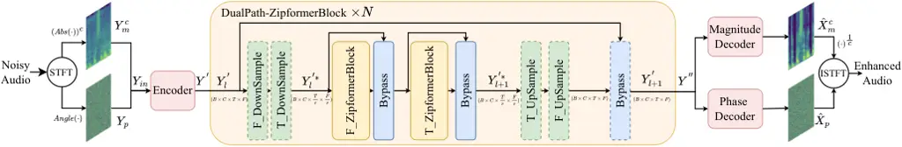
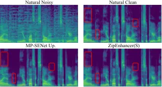

# ZipEnhancer: Dual-Path Down-Up Sampling-based Zipformer for Monaural Speech Enhancement

1^(st) Haoxu Wang Affiliation: Speech Lab  
Alibaba Group  
China  
wanghaoxu.whx@alibaba-inc.com Affiliation:  Affiliation:     2^(nd) Biao
Tian Affiliation: Speech Lab  
Alibaba Group  
China  
tianbiao.tb@alibaba-inc.com Affiliation: 

###### Abstract

In contrast to other sequence tasks modeling hidden layer features with
three axes, Dual-Path time and time-frequency domain speech enhancement
models are effective and have low parameters but are computationally
demanding due to their hidden layer features with four axes. We propose
ZipEnhancer, which is Dual-Path Down-Up Sampling-based Zipformer for
Monaural Speech Enhancement, incorporating time and frequency domain
Down-Up sampling to reduce computational costs. We introduce the
ZipformerBlock as the core block and propose the design of the Dual-Path
DownSampleStacks that symmetrically scale down and scale up. Also, we
introduce the ScaleAdam optimizer and Eden learning rate scheduler to
improve the performance further. Our model achieves new state-of-the-art
results on the DNS 2020 Challenge and Voicebank+DEMAND datasets, with a
perceptual evaluation of speech quality (PESQ) of 3.69 and 3.63, using
2.04M parameters and 62.41G FLOPS, outperforming other methods with
similar complexity levels.

###### Index Terms: 

Speech Enhancement, Down-Up Sampling, Dual-Path, ZipEnhancer, Zipformer

## I Introduction

Speech enhancement (SE) aims to improve natural speech signals captured
with devices often degraded by complex acoustic scenarios, filtering out
noise and boosting clarity for better understanding. By enhancing speech
signals, this technology contributes to the efficiency of communication
in real-world applications. In current SE methods, there are generally
two categories: time domain SE and time frequency domain (TF) SE, and
use various networks, including recurring neural network (RNN)\[1, 2\],
Transformer\[3, 4, 5\]. Time-domain models often encode the noisy
waveform into hidden-layer features, which are then processed by a
Transformer-based encoder, and then restore the estimated waveform\[6,
7, 8, 4, 5\]. TF domain methods use neural networks to predict clean
short-time Fourier transform (STFT) features from noisy audio-generated
STFT features and reconstruct the waveforms using inverse STFT
(ISTFT)\[9, 10, 11, 12, 13\]. To enhance audio quality in low
signal-to-noise ratio (SNR) scenarios, some TF domain methods implicitly
or explicitly predict clean STFT phase information using complex,
magnitude, and phase information\[14, 15, 16\] and achieve good results
in SE tasks.

Fig. 1: The overall architecture of our ZipEnhancer.

Fig. 2: (Left): The structure of T/F-ZipformerBlock. (Right): The
structure of Non-Linear Attention module.

Unlike conventional sequence tasks such as Automatic Speech Recognition
(ASR)\[17, 18, 19\], which model hidden features
$`X\in R^{B\times T\times C}`$ on the time dimension, researchers in
speech separation (SS) \[20, 21, 22, 23\] and SE\[15, 13, 16, 24, 23,
25\] retain an additional frequency dimension, constructing hidden
features $`(B,T,F,C)`$ with four axes. They commonly use RNN or
Transformer-style Dual-Path modeling on the time $`T`$ and frequency
$`F`$ dimensions. Despite SS and SE models having a parameter count of
several million (M), much smaller than ASR, their computational costs
remain high due to Dual-Path modeling. The model’s parameter quantity
does not fully reflect its modeling capability\[26, 27\]. Recent ASR
research has made efforts to develop efficient Encoders such as
Efficient Conformer\[28\], Squeezeformer\[29\], and Zipformer\[30\].
Efficient Conformer uses progressive downsampling, while Squeezeformer
uses a U-Net structure to downsample the time resolution of intermediate
hidden features to 12.5Hz. In comparison, Zipformer introduces varying
downsampling ratios at different layer levels, proposing a more
aggressive downsampled U-Net structure. This time domain downsampling
effectively reduces the computational cost and enhances the ASR
Encoder’s efficiency. Inspired by these methods, we introduce time
domain downsampling into the SE model, extending it to frequency domain
downsampling to reduce computational costs.

Therefore, based on MP-SENet\[16\], we build ZipEnhancer, a TF-Domain SE
model that incorporates different ratio downsampling of time-domain and
frequency-domain features in Dual-Path Transformer-like blocks. The
model includes an Encoder, Dual-Path ZipformerBlocks, and Decoders. The
Encoder initially models magnitude and phase to obtain hidden-layer
features. Subsequently, the Dual-Path ZipformerBlocks use
DownSampleStacks to sequentially model the time and frequency domains,
followed by the Magnitude Decoder restoring the magnitude spectrum and
the Phase Decoder explicitly restoring the phase spectrum. Compared to
the TF-Conformers or TF-GRUTransformers in MP-SENet, we modify the
dual-path Blocks to FT-ZipformerBlocks using Zipformer. Additionally, we
propose DownSampleStacks with paired Downsample and Upsample structures,
conducting symmetric scaling down and up in both time and frequency
domains to reduce the computational cost and model temporal and
frequency domain information at different resolution levels. Also, we
introduce the ScaleAdam optimizer and the Eden scheduler to improve
performance further. Extensive experiments on the DNS Challenge 2020
(DNS2020) \[31\] and VoiceBank+DEMAND\[32\] datasets demonstrate the
superiority of our ZipEnhancer. Our ZipEnhancer outperformed models of
similar scale, achieving a new state-of-the-art (SOTA) perceptual
evaluation of speech quality (PESQ) score of 3.69 on the DNS2020 dataset
and 3.63 on the Voicebank+DEMAND dataset with 2.04M parameters and
62.41G floating-point operations per second (FLOPS).

## II The proposed ZipEnhancer

### II-A The overall architecture of the model

Figure 1 shows the overall architecture of our model. We use ZipEnhancer
with codec structure to estimate the clean signal $`x\in R^{L}`$ from
the noisy audio signal $`y=x+z\in R^{L}`$, with $`L`$ representing the
audio length. Initially, we extract the TF magnitude spectrum
$`Y_{m}\in R^{T\times F}`$ and the wrapped phase spectrum
$`Y_{p}\in R^{T\times F}`$ from the noisy signal y. We then perform
power-law compression on the magnitude spectrum $`Y_{m}`$ using a scale
factor c to obtain $`Y_{m}^{c}`$, and concatenate it with $`Y_{p}`$
along a new channel dimension to obtain the input feature $`Y_{in}`$ for
the Encoder, in $`R^{2\times T\times F}`$.

The Encoder uses convolutional modeling on $`Y_{in}`$ to obtain
hidden-layer time-frequency features
$`Y^{{}^{\prime}}\in R^{C\times T\times F^{{}^{\prime}}}`$. The stacked
Dual-Path ZipformerBlocks alternately conduct sequential modeling on the
time and frequency domains, capturing global and local acoustic
information. Downsampling blocks aid in aggregating and restoring
original length information while reducing the model’s computational
cost. Subsequently, we obtain new hidden-layer features
$`Y^{{}^{\prime\prime}}\in R^{C\times T\times F^{{}^{\prime}}}`$ for
future decoding. Parallel magnitude spectrum decoder and phase spectrum
decoder reconstruct the estimated clean magnitude spectrum
$`\hat{X}_{m}`$ and clean phase spectrum $`\hat{X}_{p}`$. The estimated
enhanced waveform $`\hat{x}`$ is then reconstructed using ISTFT.

### II-B DualPathZipformerBlocks

#### II-B1 DownSampleStacks

Unlike the Single-Path downsampling blocks in ASR, the Dual-Path
structure for alternate modeling in the time-frequency domain can be
designed to include modules that simultaneously downsample in both the
time and frequency dimensions. As shown in Figure 1, within the
DownSampleStack, we use paired DownSample and UpSample modules to
achieve symmetric scaling down and up in the time or frequency length.
The module for Down-Upsampling in the time dimension is named
T*DownSample and T_UpSample, while the module for Down-Upsampling in the
frequency dimension is termed F_DownSample and F_UpSample. The sampling
ratio is denoted as $`r`$. Our sampling approach follows the simplest
method, as in Zipformer. For instance, with a factor of $`r`$, the
DownSample module averages every $`r`$ frames using $`r`$ learnable
scalar weights (after softmax normalization), and the UpSample module
repeats each frame $`r`$ times. Through this downsampling process, the
original feature $`Y^{{}^{\prime}}*{l}\in R^{C\times T\times F}`$ at
layer $`l`$ compresses to
$`Y^{{}^{\prime}*}_{l}\in R^{C\times\frac{T}{r}\times\frac{F}{r}}`$,
which then feeds into the Dual-Path Zipformerblock for modeling the time
and frequency domains at lower frame rates. Additionally, a Bypass
module, similar to a residual connection (described in Sec. II-B2),
shortens the unsampled information to enhance the modeling capability of
the model. Note that the downsampling structure of the dashed line in
Figure 1 is optional and is deleted at $`r=1`$.

#### II-B2 ZipformerBlock

In the Dual-Path structure, the F*ZipformerBlock and T_ZipformerBlock
share the same model architecture. For the compressed
$`Y^{{}^{\prime}\*}*{l}`$ within a mini-batch, with a shape of
$`B\times\frac{T}{r}\times\frac{F^{{}^{\prime}}}{r}\times C`$, where
$`B`$ is the batch size, we organize it into
$`\frac{BT}{r}\times\frac{F^{{}^{\prime}}}{r}\times C`$, and input it
into the F_ZipformerBlock to model frequency domain correlations. Then,
we organize it into
$`\frac{BF^{{}^{\prime}}}{r}\times\frac{T}{r}\times C`$ and input it
into the T_ZipformerBlock to model temporal correlations, ultimately
obtaining the output $`Y^{{}^{\prime}\*}\_{l+1}`$.

The standard ConformerBlock includes a pair of Feed-Forward Networks
(FFN), Multi-Head Self-Attention (MHSA), Convolution (CONV), and
LayerNorm (LN). ZipformerBlock includes various improvements compared to
the ConformerBlock. As shown in Figure 2, a ZipformerBlock comprises two
Conformer-like blocks, differing by excluding LN and including only
BiasNorm at the end. Also, the third FFN before the second MHSA is
removed, leaving three FFNs. To further reduce computational costs, it
uses a separate Multi-Head Attention Weight (MHAW) to compute attention
weights for sequence global modeling, reusing these weights in
Non-linear Attention (NLA) and two Self-Attention (SA) modules. In the
ZipformerBlock, the SA no longer recalculates attention weights but uses
the weights provided by MHAW. Additionally, the ZipformerBlock
introduces several Bypass modules for shortcut connections within the
block.

| Model | N   | Ratios             | C   | Heads | Para\[M\] | FLOPS\[G\] |
| ----- | --- | ------------------ | --- | ----- | --------- | ---------- |
| S     | 4   | {1, 2, 2, 1}       | 64  | 4     | 2.04      | 62.85      |
| S2    | 4   | {1, 1, 1, 1}       | 64  | 4     | 2.04      | 80.61      |
| S3    | 4   | {1, 2, 4, 1}       | 64  | 4     | 2.04      | 60.79      |
| S4    | 4   | {1, 2, 4, 2}       | 64  | 4     | 2.04      | 51.91      |
| S5    | 4   | {1, 4, 4, 2}       | 64  | 4     | 2.04      | 49.84      |
| S6    | 4   | {2, 3, 4, 2}       | 64  | 4     | 2.04      | 41.47      |
| S7    | 4   | {2, 6, 8, 2}       | 64  | 4     | 2.04      | 40.06      |
| S8    | 4   | {3, 6, 8, 3}       | 64  | 4     | 2.04      | 36.94      |
| M     | 6   | {1, 2, 3, 4, 2, 1} | 128 | 8     | 11.34     | 266.96     |

TABLE I: Different hyper-parameter configurations of the ZipEnhancer.

Non-Linear Attention. Figure 2 shows the structure of NLA. Firstly, it
maps the input features to A, B, and C using linear layers. Then, the
NLA organizes the output as
$`O=linear(A\odot attention(tanh(B)\odot C))`$, where $`\odot`$ denotes
element-wise multiplication, and attention uses the attention weights
provided by MHAW to organize $`tanh(B)\odot C`$ in the time or frequency
dimension. Finally, a linear layer is used to output the final feature.

Bypass. The Bypass Module, a novel form of residual connection, combines
the input $`x`$ and output $`y`$ of the wrapped intermediate module
using a channel-wise learnable weight $`c`$. The output is defined as
$`O=(1-c)\odot x+c\odot y`$. A smaller value of $`c`$ indicates a
greater tendency to skip the wrapped intermediate module. During
training, $`c`$ is initially constrained to the range of \[0.9, 1.0\]
for the first 2k steps and then to the range of \[0.2, 1.0\] after 2k
steps.

BiasNorm. Due to LN possibly introducing a large fixed value to a
specific channel and causing excessive small activations in some
modules, BiasNorm is used as a replacement. Its formulation is as
follows: $`BiasNorm(x)=\frac{x}{RMS[x-b]}\cdot exp(\gamma)`$, where
$`b`$ represents the learnable channel-wise bias, $`RMS[x-b]`$ denotes
the root-mean-square value calculated over the channels, with $`\gamma`$
as a scalar. Using BiasNorm with ScaleAdam can achieve more stable model
convergence.

|                     |            |            |         |      |       |        |
| ------------------- | ---------- | ---------- | ------- | ---- | ----- | ------ |
| Model               | Para.\[M\] | FLOPS\[G\] | WB-PESQ | NB   | STOI  | SI-SDR |
| FRCRN\[9\]          | 6.9        | -          | 3.23    | 3.60 | 97.69 | 19.78  |
| MFNet\[33\]         | -          | -          | 3.43    | 3.74 | 97.98 | 20.31  |
| TridentSE-L\[13\]   | 3.03       | 59.8       | 3.44    | -    | 97.86 | -      |
| USES\[24\]          | -          | -          | 3.46    | -    | 98.1  | 21.2   |
| MP-SENet Up.\[34\]  | 2.26       | 81.33^(∗)  | 3.62    | 3.92 | 98.16 | 21.03  |
| TF-Locoformer\[23\] | 14.97      | 497.24     | 3.72    | -    | 98.8  | 23.3   |
| MP-SENet Up.^(∗)    | 2.26       | 81.33      | 3.61    | 3.95 | 98.08 | 20.55  |
| ZipEnhancer(S)      | 2.04       | 62.85      | 3.69    | 3.99 | 98.32 | 21.15  |
| ZipEnhancer(M)      | 11.34      | 266.96     | 3.81    | 4.08 | 98.65 | 22.22  |

TABLE II: Comparison with other methods on the DNS Challenge 2020 test
set without reverberation. $`*`$ represents our reproduced model. Para.
and NB represent Parameters and NB-PESQ.

|                                    |      |                |            |            |         |      |      |      |       |       |        |
| ---------------------------------- | ---- | -------------- | ---------- | ---------- | ------- | ---- | ---- | ---- | ----- | ----- | ------ |
| Model                              | Year | DP             | Para.\[M\] | FLOPS\[G\] | WB-PESQ | CSIG | CBAK | COVL | STOI  | SSNR  | SI-SDR |
| DB-AIAT\[14\]                      | 2022 | -              | 2.81       | 68.0       | 3.31    | 4.61 | 3.75 | 3.96 | 95.6  | 10.79 |        |
| CMGAN\[15\]                        | 2022 | $`\checkmark`$ | 1.83       | 116        | 3.41    | 4.63 | 3.94 | 4.12 | 96    | -     | -      |
| TridentSE-L\[13\]                  | 2023 | $`\checkmark`$ | 3.03       | 59.8       | 3.47    | 4.70 | 3.81 | 4.10 | 96    | -     | -      |
| HATFANet\[35\]                     | 2024 | $`\checkmark`$ | 3.9        | -          | 3.37    | 4.66 | 3.85 | 4.11 | 95.8  | 10.15 |        |
| SE-LMA-Transformer\[36\]           | 2024 | $`\checkmark`$ | 5.60       | -          | 3.40    | 4.65 | 3.87 | 4.12 | 95.7  | 10.15 | -      |
| Spiking-S4\[37\]                   | 2024 | -              | 0.53       | 1.50       | 3.39    | 4.92 | 2.64 | 4.31 | -     | -     | -      |
| MP-SENet\[16\]                     | 2023 | $`\checkmark`$ | 2.05       | 77.79      | 3.45    | 4.73 | 3.95 | 4.22 | 96    | 10.64 | 19.94  |
| UPB-CMGAN\[38\]                    | 2024 | $`\checkmark`$ | 1.83       | 116        | 3.55    | 4.78 | -    | 4.28 | 96    | -     | -      |
| SEMamba w/o PCS\[39\]              | 2024 | $`\checkmark`$ | 2.25       | 65.46      | 3.55    | 4.77 | 3.95 | 4.26 | 96    | -     | -      |
| MP-SENet Up.\[34\]                 | 2024 | $`\checkmark`$ | 2.26       | 81.33^(∗)  | 3.60    | 4.81 | 3.99 | 4.34 | 96    | -     | 19.47  |
| ZipEnhancer(S,$`\lambda_{6}=0`$)   | 2024 | $`\checkmark`$ | 2.04       | 62.85      | 3.63    | 4.81 | 3.87 | 4.36 | 96.19 | 8.33  | 19.09  |
| ZipEnhancer(S,$`\lambda_{6}=0.2`$) | 2024 | $`\checkmark`$ | 2.04       | 62.85      | 3.61    | 4.81 | 3.97 | 4.35 | 96.22 | 10.01 | 19.96  |

TABLE III: Comparison with other methods on VoiceBank+DEMAND dataset.
$`*`$ represents the results of our reproduced model. Para., w/o, Up.
and DP represent Parameters, without, Updated and Dual-Path.

#### II-B3 Encoder and Decoders

We use an Encoder and Decoders similar to MP-SENet\[16\]. The Encoder
encodes $`Y_{in}`$ to
$`Y^{{}^{\prime}}\in R^{C\times T\times F^{{}^{\prime}}}`$, where
$`F^{{}^{\prime}}=\frac{F}{2}+1`$. It consists of two convolutional
layers with Conv2d, InstanceNorm (IN), and PRelu, along with a Dilated
DenseNet. The second convolutional layer features a stride of 2 to
reduce $`F`$ to $`F^{{}^{\prime}}`$. The dilated DenseNet includes four
convolutional layers with dilation sizes of 1, 2, 4, and 8, expanding
the receptive field along the time axis.

The Decoders consist of a Magnitude Decoder and a Phase Decoder. The
Magnitude Decoder includes a Dilated DenseNet, convolutional layers with
Sub-pixel Conv2d\[40\], IN, PRelu, and an output layer Conv2d. In this
setup, LSigmoid is removed, and Conv2d is used directly to map the
predicted compressed clean magnitude spectrum $`\hat{X}_{m}^{c}`$. The
Phase Decoder includes a Dilated DenseNet, convolutional layers with
Sub-pixel Conv2d, IN, PRelu, and two Conv2d layers with an Arctan2
component. The Phase Decoder predicts the enhanced wrapped phase
spectrum $`\hat{X}_{p}`$.

### II-C Training criteria

#### II-C1 Optimizer and Learning Sceduler

We use ScaleAdam\[30\], a parameter-scale-invariant version of Adam, to
achieve faster convergence and improved performance. ScaleAdam scales
the parameter updates based on the parameter scale, ensuring relatively
consistent parameter changes for different scales, in contrast to Adam
where the gradient scale for each parameter remains constant. It learns
the scale of parameters by adding a gradient that scales the learning
concerning the parameter scale to the original gradient, allowing each
module to more easily adjust activation values to an appropriate range.
We also use Eden\[30\] as our learning rate (LR) scheduler, controlled
by parameters such as $`\alpha_{base}`$, $`t_{warmup}`$,
$`\alpha_{step}`$, and $`\alpha_{epoch}`$. Here, $`\alpha_{base}`$ is
the maximum LR without warmup, $`t_{warmup}`$ is the number of steps for
linear warmup, and $`\alpha_{step}`$ and $`\alpha_{epoch}`$ determine
when the LR starts to decrease rapidly.

#### II-C2 Loss function

The loss function used for training ZipEnhancer follows \[34\]. It is a
linear combination of various losses, including PESQ-based GAN
discriminator $`\mathcal{L}_{pesq}`$, STFT consistency
$`\mathcal{L}_{stft}`$, magnitude $`\mathcal{L}_{mag}`$, complex
$`\mathcal{L}_{com}`$, and phase $`\mathcal{L}_{pha}`$ losses. We reuse
the time loss $`\mathcal{L}_{time}`$ from \[16\]. The final loss is
defined as:
$`\mathcal{L}=\lambda_{1}\mathcal{L}_{pesq}+\lambda_{2}\mathcal{L}_{stft}+\lambda_{3}\mathcal{L}_{mag}+\lambda_{4}\mathcal{L}_{com}+\lambda_{5}\mathcal{L}_{pha}+\lambda_{6}\mathcal{L}_{time}`$.

## III Experiments

### III-A Dataset

In this experiment, we validate the performance of our SE model using
two widely used open-source datasets: the DNS Challenge 2020 (DNS2020)
dataset and the VoiceBank+DEMAND dataset. The DNS2020 dataset\[31\]
includes 500 hours of clean audio clips from 2150 speakers and over 180
hours of noise audio clips. The clean audio clips are split into
10-second segments, and 3,000 hours of noisy audio clips with SNRs
ranging from -5dB to 15dB are generated for training, following the
official script¹¹ 1 https://github.com/microsoft/DNS-Challenge. For
model evaluation, the dataset provides non-blind test sets containing
150 noisy-clean pairs generated from audio clips spoken by 20 speakers.

The VoiceBank+DEMAND dataset\[32\] contains pairs of clean and noisy
audio clips with a sampling rate of 48 kHz. The clean audio set is
selected from the Voice Bank corpus\[41\], which includes 11,572 audio
clips from 28 speakers for training and 872 audio clips from 2 unseen
speakers for testing. These clean audio clips are mixed with 10 types of
noise (8 from the DEMAND database\[42\] and 2 artificial types) at SNRs
of 0-15 dB for the training set, and 5 types of unseen noise from the
DEMAND database at SNRs of 2.5, 7.5, 12.5, and 17.5 dB for the test set.
In the experiments, we resample all the audio clips to 16 kHz.

### III-B Expermental Setup

During training, all audio clips are segmented into 2-second segments.
To extract input features using STFT from the raw waveform, the
parameters for FFT point number, Hanning window size, and hop size are
set to 400, 400 (25 ms), and 100 (6.25 ms), resulting in the number of
frequency bins, $`F=201`$. The magnitude spectrum compression factor
$`c`$ is set to 0.3. For training ZipEnhancer, we define the batch size
(B) to 4. Details about the settings for the number of
FT-Zipformerblocks (N), number of channels (C), the number of heads in
the MHAW, and the down-sampling ratios can be seen in Table I. We can
conveniently design models at different computational levels by using
different down-sampling ratios, allowing for adaptation to various
inference conditions and achieving a trade-off between performance and
computational costs. The hyper-parameters of the final generator loss
$`\lambda_{1},\lambda_{2},...,\lambda_{6}`$ are set to 0.05, 0.1, 0.9,
0.1, 0.3, and 0.2. All models are trained for 600k steps using the
ScaleAdam optimizer. The hyper-parameters of the Eden scheduler,
$`\alpha_{base}`$, $`t_{warmup}`$, $`\alpha_{step}`$, and
$`\alpha_{epoch}`$, are set to 0.04, 4000, 2500, and 24. Training is
performed on one 32GB V100 RTX GPU. For training ZipEnhancer(M), the
audio clips are segmented into 4-second segments to ensure a fair
comparison with TF-Locoformer\[23\], the model is trained for 500k steps
using four 32GB V100 RTX GPUs.

### III-C Evaluation metrics

For the evaluation on the DNS2020 dataset, four commonly used objective
evaluation metrics are chosen to evaluate the enhanced speech quality,
including wide-band PESQ (WB-PESQ), narrowband PESQ (NB-PESQ),
short-time objective intelligibility (STOI) and the scale-invariant
signal-to-distortion ratio (SI-SDR)\[43\] to quantify the distortion
between the enhanced and clean speech signals. For VoiceBank+DEMAND
dataset, besides the WB-PESQ, STOI and SI-SDR, we use the segmental SNR
(SSNR) and three composite measures (CSIG, CBAK, and COVL) which predict
the mean opinion score (MOS) on signal distortion, background noise
intrusiveness, and overall effect, respectively. For all the metrics,
higher values indicate better performance.

### III-D Expermental Results

Fig. 3: Spectrogram visualization of the natural noisy/clean speech, and
speeches enhanced by the MP-SENet Up. and our proposed ZipEnhancer(S).

|          |            |         |         |       |        |       |
| -------- | ---------- | ------- | ------- | ----- | ------ | ----- |
| Model    | FLOPS\[G\] | WB-PESQ | NB-PESQ | STOI  | SI-SDR | SSNR  |
| S        | 62.85      | 3.69    | 3.99    | 98.32 | 21.15  | 15.06 |
| S2       | 80.61      | 3.67    | 3.98    | 98.34 | 21.35  | 15.14 |
| S3       | 60.79      | 3.68    | 3.99    | 98.31 | 21.17  | 15.00 |
| S4       | 51.91      | 3.65    | 3.98    | 98.20 | 20.76  | 14.81 |
| S5       | 49.84      | 3.64    | 3.96    | 98.18 | 20.71  | 14.49 |
| S6       | 41.47      | 3.60    | 3.95    | 98.11 | 20.53  | 14.62 |
| S7       | 40.06      | 3.58    | 3.93    | 98.06 | 20.36  | 13.45 |
| S8       | 36.94      | 3.54    | 3.91    | 97.90 | 19.83  | 13.53 |
| S(AdamW) | 62.85      | 3.65    | 3.97    | 98.19 | 20.84  | 14.75 |

TABLE IV: Results of different model configurations and Ablation study
on the DNS Challenge 2020 test set without reverberation.

#### III-D1 Comparison with other state-of-the-art models

Evaluation on the DNS2020 test set without reverberation: In Table II,
TridentSE-L\[13\], USES\[24\], MP-SENet Updated\[34\] and
TF-Locoformer\[23\] are all Dual-Path models. Our ZipEnhancer(S)
outperforms these recent SOTA models on several metrics, except
TF-Locoformer. To further analyze the impact of model complexity, we
reproduce the results of MP-SENet Up.($`\lambda_{6}=0.2`$)^(∗),
achieving comparable results to \[34\] with approximately 81.33 FLOPS.
Our model reaches a new SOTA PESQ of 3.69 while maintaining a lower
parameter count than recent models and much lower or comparable FLOPS.
This indicates the superiority of our current model and the
effectiveness of the Down-Up Sampling structure in reducing
computational costs. We also visualized the spectrograms of speeches as
shown in Fig. 3. Additionally, our ZipEnhance(M) achieves performance
similar to that of TF-Locoformer with only half the FLOPS.

Evaluation on VoiceBank+DEMAND dataset: In Table III, our ZipEnhance(S,
$`\lambda_{6}=0`$) achieves a new SOTA result in WB-PESQ on the current
dataset, with a parameter count of 2.04 and lower FLOPS of 62.85.
Compared to MP-SENet Up., our model improves several metrics, including
WB-PESQ, CSIG, COVL, and STOI. Our model achieves promising results with
a lower parameter count and reduced computational costs, demonstrating
the superiority of the ZipEnhancer. Additionally, according to \[44\],
$`\mathcal{L}_{time}`$ can improve SI-SDR but may reduce WB-PESQ. We
also implement ZipEnhance(S, $`\lambda_{6}=0.2`$), which achieves better
PESQ than MP-SENet Updated while improving SI-SDR metrics. Audio samples
processed by the proposed ZipEnhancer on the DNS2020 and
VoiceBank+DEMAND datasets can be accessed at the website.²² 2
https://zipenhancer.github.io/ZipEnhancer/

#### III-D2 Results of different model configurations

In Table IV, we compare the results of different model configurations on
the DNS2020 test set without reverberation. When setting all
down-sampling ratios to 1, we obtain S2. S maintains high performance
and gets metrics similar to those of S2, showing that the efficient
down-sampling module does not cause much information loss. S3-S8 use
more aggressive down-sampling ratios, resulting in lower FLOPS and
gradually decreasing performance while still maintaining PESQ above a
specific threshold (3.54, better than \[24, 13\]), demonstrating the
ability to achieve a trade-off between computational cost and
performance. Additionally, we conduct an ablation experiment on
ScaleAdam, replacing it with the original LR of 0.0005 for AdamW in
conjunction with the LR scheduler of \[34\]. The performance shows a
slight decrease, indicating the effectiveness of ScaleAdam.

## IV Conclusion

Compared to other sequence tasks that only model the hidden layer
features with three axes, Dual-Path time and time-frequency domain
speech enhancement models, while effective and with a small parameter
count, entail high computational costs due to their hidden layer
features with four axes. To address this, we propose ZipEnhancer, which
incorporates time and frequency domain DownSampling to reduce
computational overhead. Our model achieves new SOTA results on the DNS
2020 Challenge and Voicebank+DEMAND datasets, with a PESQ of 3.69 and
3.63, respectively, utilizing 2.04M parameters and 62.85G FLOPS. The
introduction of the ScaleAdam optimizer and the Eden learning rate
scheduler further contribute to the model’s effectiveness. The results
show the effectiveness of our ZipEnhancer, establishing our model as a
competitive solution that surpasses other models with similar complexity
levels. In the future, we plan to design a causal model using
ZipEnhancer to facilitate real-time deployment.

## References

- \[1\] Han Zhao, Shuayb Zarar, Ivan Tashev, and Chin-Hui Lee,
  “Convolutional-Recurrent Neural Networks for Speech Enhancement,” in
  Proc. ICASSP, 2018, pp. 2401–2405.
- \[2\] Jalal Abdulbaqi, Yue Gu, Shuhong Chen, and Ivan Marsic,
  “Residual Recurrent Neural Network for Speech Enhancement,” in Proc.
  ICASSP, 2020, pp. 6659–6663.
- \[3\] Xiang Hao, Changhao Shan, Yong Xu, Sining Sun, and Lei Xie, “An
  Attention-based Neural Network Approach for Single Channel Speech
  Enhancement,” in Proc. ICASSP, 2019, pp. 6895–6899.
- \[4\] Eesung Kim and Hyeji Seo, “SE-Conformer: Time-Domain Speech
  Enhancement Using Conformer,” in Proc. Interspeech, 2021, pp.
  2736–2740.
- \[5\] Zhifeng Kong, Wei Ping, Ambrish Dantrey, and Bryan Catanzaro,
  “Speech Denoising in the Waveform Domain With Self-Attention,” in
  Proc. ICASSP, 2022, pp. 7867–7871.
- \[6\] Santiago Pascual, Antonio Bonafonte, and Joan Serrà, “SEGAN:
  Speech Enhancement Generative Adversarial Network,” in Proc.
  Interspeech, 2017, pp. 3642–3646.
- \[7\] Ashutosh Pandey and DeLiang Wang, “TCNN: Temporal Convolutional
  Neural Network for Real-time Speech Enhancement in the Time Domain,”
  in Proc. ICASSP, 2019, pp. 6875–6879.
- \[8\] Alexandre Défossez, Gabriel Synnaeve, and Yossi Adi, “Real Time
  Speech Enhancement in the Waveform Domain,” in Proc. Interspeech,
  2020, pp. 3291–3295.
- \[9\] Shengkui Zhao, Bin Ma, Karn N. Watcharasupat, and Woon-Seng Gan,
  “FRCRN: Boosting Feature Representation Using Frequency Recurrence for
  Monaural Speech Enhancement,” in Proc. ICASSP, 2022, pp. 9281–9285.
- \[10\] Cassia Valentini-Botinhao and Junichi Yamagishi, “Speech
  enhancement of noisy and reverberant speech for text-to-speech,”
  IEEE/ACM Transactions on Audio, Speech, and Language Processing, vol.
  26, no. 8, pp. 1420–1433, 2018.
- \[11\] Yang Ai, Jing-Xuan Zhang, Liang Chen, and Zhen-Hua Ling,
  “Dnn-based Spectral Enhancement for Neural Waveform Generators with
  Low-bit Quantization,” in Proc ICASSP, 2019, pp. 7025–7029.
- \[12\] Feng Dang, Hangting Chen, and Pengyuan Zhang, “DPT-FSNet:
  Dual-Path Transformer Based Full-Band and Sub-Band Fusion Network for
  Speech Enhancement,” in Proc. ICASSP, 2022, pp. 6857–6861.
- \[13\] Dacheng Yin, Zhiyuan Zhao, Chuanxin Tang, Zhiwei Xiong, and
  Chong Luo, “TridentSE: Guiding Speech Enhancement with 32 Global
  Tokens,” in Proc. Interspeech, 2023, pp. 3839–3843.
- \[14\] Guochen Yu, Andong Li, Chengshi Zheng, Yinuo Guo, Yutian Wang,
  and Hui Wang, “Dual-Branch Attention-In-Attention Transformer for
  Single-Channel Speech Enhancement,” in Proc. ICASSP, 2022, pp.
  7847–7851.
- \[15\] Ruizhe Cao, Sherif Abdulatif, and Bin Yang, “CMGAN:
  Conformer-based Metric GAN for Speech Enhancement,” in Proc.
  Interspeech, 2022, pp. 936–940.
- \[16\] Ye-Xin Lu, Yang Ai, and Zhen-Hua Ling, “MP-SENet: A Speech
  Enhancement Model with Parallel Denoising of Magnitude and Phase
  Spectra,” in Proc. Interspeech, 2023, pp. 3834–3838.
- \[17\] Ashish Vaswani, Noam Shazeer, Niki Parmar, Jakob Uszkoreit,
  Llion Jones, Aidan N Gomez, Lukasz Kaiser, and Illia Polosukhin,
  “Attention Is All You Need,” in Proc. NIPS 2017, 2017, vol. 30.
- \[18\] Linhao Dong, Shuang Xu, and Bo Xu, “Speech-Transformer: A
  No-Recurrence Sequence-to-Sequence Model for Speech Recognition,” in
  Proc. ICASSP, 2018, pp. 5884–5888.
- \[19\] Niko Moritz, Takaaki Hori, and Jonathan Le, “Streaming
  Automatic Speech Recognition with the Transformer Model,” in Proc.
  ICASSP, 2020, pp. 6074–6078.
- \[20\] Yi Luo, Zhuo Chen, and Takuya Yoshioka, “Dual-Path RNN:
  Efficient Long Sequence Modeling for Time-Domain Single-Channel Speech
  Separation,” in Proc. ICASSP, 2020, pp. 46–50.
- \[21\] Cem Subakan, Mirco Ravanelli, Samuele Cornell, Mirko Bronzi,
  and Jianyuan Zhong, “Attention Is All You Need In Speech Separation,”
  in Proc. ICASSP, 2021, pp. 21–25.
- \[22\] Zhong-Qiu Wang, Samuele Cornell, Shukjae Choi, Younglo Lee,
  Byeong-Yeol Kim, and Shinji Watanabe, “TF-GRIDNET: Making
  Time-Frequency Domain Models Great Again for Monaural Speaker
  Separation,” in Proc. ICASSP, 2023, pp. 1–5.
- \[23\] Kohei Saijo, Gordon Wichern, François G. Germain, Zexu Pan, and
  Jonathan Le Roux, “TF-Locoformer: Transformer with Local Modeling by
  Convolution for Speech Separation and Enhancement,” in Proc.
  International Workshop on Acoustic Signal Enhancement (IWAENC),
  Sept. 2024.
- \[24\] Wangyou Zhang, Kohei Saijo, Zhong-Qiu Wang, Shinji Watanabe,
  and Yanmin Qian, “Toward Universal Speech Enhancement For Diverse
  Input Conditions,” in Proc. ASRU, 2023, pp. 1–6.
- \[25\] Jizhen Li, Xinmeng Xu, Weiping Tu, Yuhong Yang, and Rong Zhu,
  “Improving Speech Enhancement by Integrating Inter-Channel and Band
  Features with Dual-branch Conformer,” in Proc. Interspeech, 2024, pp.
  1720–1724.
- \[26\] Hangting Chen, Jianwei Yu, and Chao Weng, “Complexity scaling
  for speech denoising,” in Proc. ICASSP, 2024, pp. 12276–12280.
- \[27\] Wangyou Zhang, Kohei Saijo, Jee weon Jung, Chenda Li, Shinji
  Watanabe, and Yanmin Qian, “Beyond Performance Plateaus: A
  Comprehensive Study on Scalability in Speech Enhancement,” in Proc.
  Interspeech, 2024, pp. 1740–1744.
- \[28\] Maxime Burchi and Valentin Vielzeuf, “Efficient Conformer:
  Progressive Downsampling and Grouped Attention for Automatic Speech
  Recognition,” in Proc. ASRU, 2021, pp. 8–15.
- \[29\] Sehoon Kim, Amir Gholami, Albert Shaw, Nicholas Lee, Karttikeya
  Mangalam, Jitendra Malik, Michael W Mahoney, and Kurt Keutzer,
  “Squeezeformer: An efficient transformer for automatic speech
  recognition,” in Proc. NIPS, 2022, vol. 35, pp. 9361–9373.
- \[30\] Zengwei Yao, Liyong Guo, Xiaoyu Yang, Wei Kang, Fangjun Kuang,
  Yifan Yang, Zengrui Jin, Long Lin, and Daniel Povey, “Zipformer: A
  faster and better encoder for automatic speech recognition,” in Proc.
  ICLR. 2024, OpenReview.net.
- \[31\] Chandan K.A. Reddy, Vishak Gopal, Ross Cutler, Ebrahim Beyrami,
  Roger Cheng, Harishchandra Dubey, Sergiy Matusevych, Robert Aichner,
  Ashkan Aazami, Sebastian Braun, Puneet Rana, Sriram Srinivasan, and
  Johannes Gehrke, “The INTERSPEECH 2020 Deep Noise Suppression
  Challenge: Datasets, Subjective Testing Framework, and Challenge
  Results,” in Proc. Interspeech, 2020, pp. 2492–2496.
- \[32\] Cassia Valentini-Botinhao, Xin Wang, Shinji Takaki, and Junichi
  Yamagishi, “Investigating RNN-based speech enhancement methods for
  noise-robust Text-to-Speech,” in 9th ISCA Workshop on Speech Synthesis
  Workshop (SSW 9), 2016, pp. 146–152.
- \[33\] Liang Liu, Haixin Guan, Jinlong Ma, Wei Dai, Guangyong Wang,
  and Shaowei Ding, “A Mask Free Neural Network for Monaural Speech
  Enhancement,” in Proc. Interspeech, 2023, pp. 2468–2472.
- \[34\] Ye-Xin Lu, Yang Ai, and Zhen-Hua Ling, “Explicit Estimation of
  Magnitude and Phase Spectra in Parallel for High-Quality Speech
  Enhancement,” arXiv preprint arXiv:2308.08926, 2024.
- \[35\] Zehua Zhang, Xingwei Liang, Ruifeng Xu, and Mingjiang Wang,
  “Hybrid Attention Time-Frequency Analysis Network for Single-Channel
  Speech Enhancement,” in Proc. ICASSP, 2024, pp. 10426–10430.
- \[36\] Xingwei Liang, Zehua Zhang, Mingjiang Wang, and Ruifeng Xu,
  “Lightweight Multi-Axial Transformer with Frequency Prompt for Single
  Channel Speech Enhancement,” in Proc. ICASSP, 2024, pp. 10511–10515.
- \[37\] Yu Du, Xu Liu, and Yansong Chua, “Spiking Structured State
  Space Model for Monaural Speech Enhancement,” in Proc. ICASSP, 2024,
  pp. 766–770.
- \[38\] Shiqi Zhang, Zheng Qiu, Daiki Takeuchi, Noboru Harada, and
  Shoji Makino, “Unrestricted Global Phase Bias-Aware Single-Channel
  Speech Enhancement with Conformer-Based Metric Gan,” in Proc. ICASSP,
  2024, pp. 1026–1030.
- \[39\] Rong Chao, Wen-Huang Cheng, Moreno La Quatra, Sabato Marco
  Siniscalchi, Chao-Han Huck Yang, Szu-Wei Fu, and Yu Tsao, “An
  Investigation of Incorporating Mamba for Speech Enhancement,” arXiv
  preprint arXiv:2405.06573, 2024.
- \[40\] Wenzhe Shi, Jose Caballero, Ferenc Huszar, Johannes Totz,
  Andrew P. Aitken, Rob Bishop, Daniel Rueckert, and Zehan Wang,
  “Real-Time Single Image and Video Super-Resolution Using an Efficient
  Sub-Pixel Convolutional Neural Network,” in Proc. CVPR, 2016, pp.
  1874–1883.
- \[41\] Christophe Veaux, Junichi Yamagishi, and Simon King, “The voice
  bank corpus: Design, collection and data analysis of a large regional
  accent speech database,” in 2013 International Conference Oriental
  COCOSDA held jointly with 2013 Conference on Asian Spoken Language
  Research and Evaluation (O-COCOSDA/CASLRE), 2013, pp. 1–4.
- \[42\] Joachim Thiemann, Nobutaka Ito, and Emmanuel Vincent, “The
  diverse environments multi-channel acoustic noise database (demand): A
  database of multichannel environmental noise recordings,” in
  Proceedings of Meetings on Acoustics. AIP Publishing, 2013, vol. 19.
- \[43\] Jonathan Le Roux, Scott Wisdom, Hakan Erdogan, and John R.
  Hershey, “SDR – Half-baked or Well Done?,” in Proc. ICASSP, 2019, pp.
  626–630.
- \[44\] Sherif Abdulatif, Ruizhe Cao, and Bin Yang, “CMGAN:
  Conformer-Based Metric-GAN for Monaural Speech Enhancement,” IEEE/ACM
  Transactions on Audio, Speech, and Language Processing, vol. 32, pp.
  2477–2493, 2024.
