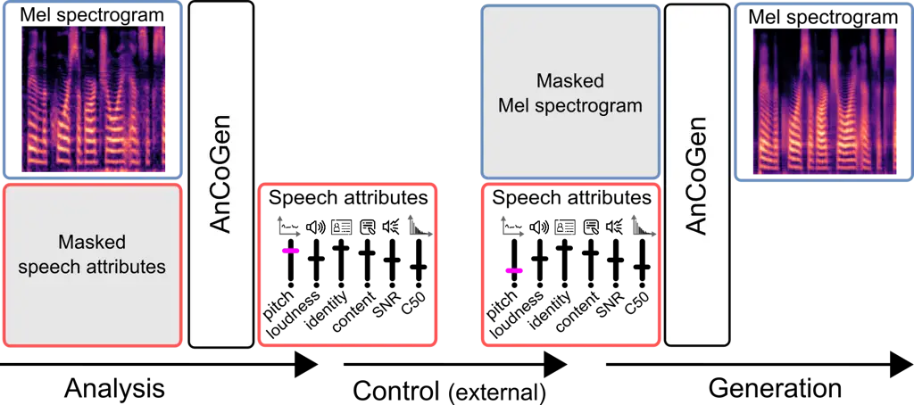
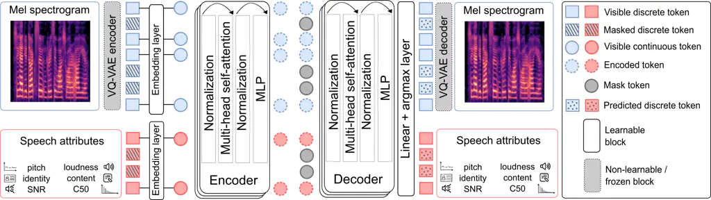

# AnCoGen: Analysis, Control and Generation of Speech with a Masked Autoencoder Thanks: This research was partly supported by the French National Research Agency (ANR) as a part of the DEGREASE project (ANR-23-CE23-0009).

Samir Sadok¹, Simon Leglaive², Laurent Girin³, Gaël Richard⁴, Xavier
Alameda-Pineda¹ Affiliation: ¹Inria at Univ. Grenoble Alpes, CNRS, LJK,
France Affiliation: ²CentraleSupélec, IETR UMR CNRS 6164, France
Affiliation: ³Univ. Grenoble Alpes, CNRS, Grenoble INP, GIPSA-lab,
France Affiliation: ⁴LTCI, Télécom Paris, Institut polytechnique de
Paris, France

###### Abstract

This article introduces AnCoGen, a novel method that leverages a masked
autoencoder to unify the analysis, control, and generation of speech
signals within a single model. AnCoGen can analyze speech by estimating
key attributes, such as speaker identity, pitch, content, loudness,
signal-to-noise ratio, and clarity index. In addition, it can generate
speech from these attributes and allow precise control of the
synthesized speech by modifying them. Extensive experiments demonstrated
the effectiveness of AnCoGen across speech analysis-resynthesis, pitch
estimation, pitch modification, and speech enhancement. Code and audio
examples are available online¹¹ 1
[https://samsad35.github.io/site-ancogen](https://samsad35.github.io/site-ancogen).

###### Index Terms: 

Speech analysis/transformation/synthesis, masked autoencoder, pitch
estimation and modification, speech enhancement.

## I Introduction

Over the years, many speech processing algorithms have been developed to
analyze, transform, and synthesize speech signals. This includes time
stretching, pitch shifting, timbre modification, and speech enhancement
in noise. Conventional parametric approaches rely on a signal model
whose parameters are estimated during the analysis stage and explicitly
modified in the transformation and synthesis stages. Examples of
well-known parametric signal models include linear predictive coding
\[1\], sinusoidal models \[2, 3\] and harmonic-plus-noise models \[4, 5,
6\]. Non-parametric methods do not require the explicit estimation and
manipulation of speech parameters. Historical examples of such methods
for pitch- and time-scale modification include PSOLA \[7\] and the phase
vocoder \[8\]. More recently, vocoders such as STRAIGHT \[9\] and WORLD
\[10\] were proposed for real-time manipulation of speech. They can be
seen as learning-free encoding/decoding-based methods in which signal
processing techniques are used to decompose (resp. synthesize) a speech
signal into (resp. from) a set of acoustic features consisting of the
fundamental frequency ($`f_{0}`$), spectral envelope, and aperiodicity.

Today, the most effective methods for manipulating speech signals are
based on deep learning. Various neural encoder-decoder models have been
proposed to encode a speech signal into a compact representation that
can then be decoded with minimal loss of quality and intelligibility.
Neural audio codecs such as SoundStream \[11\] and EnCodec \[12\] focus
on extracting low-bitrate discrete units while achieving high-quality
reconstruction. Encoders based on self-supervised learning (SSL), such
as HuBERT \[13\], have also been used to extract a representation of the
linguistic content of speech, which can then be combined with acoustic
attributes (e.g., $`f_{0}`$) and speaker identity to reconstruct the
speech signal \[14\]. Existing neural encoder-decoder models achieve
high-quality speech reconstruction but significantly lack
controllability for speech signal manipulation and robustness to noise
and reverberation.

Fig. 1: Analysis, control, and generation of speech with AnCoGen.

In this paper, we introduce AnCoGen for analyzing, controlling, and
generating speech signals. AnCoGen can decompose a speech signal into a
compact but comprehensive set of speech attributes representing not only
the linguistic content, prosody (pitch and loudness), and speaker
identity, but also the acoustic recording conditions in terms of noise
and reverberation. As in the previously proposed neural architectures
for speech manipulation, the encoded attributes can be controlled before
resynthesis, enabling various applications, including pitch
transformation, voice conversion, noise suppression, and
dereverberation. However, in the previous works, separate encoder and
decoder models were designed to estimate the speech attributes and
synthesize the speech signal, respectively. With AnCoGen, we propose a
fundamentally different approach. We draw inspiration from the masked
autoencoder (MAE) model \[15\] to learn a bidirectional mapping between
a Mel-spectrogram and the speech attributes, hence leading to _a single
model for the analysis and the resynthesis_, as illustrated in Fig. 1.
The Mel-spectrogram and the attributes can be seen as two different
representations of the uttered speech. The Mel-spectrogram is a
low-level representation close to the raw signal, while the attributes
are a higher-level representation more suitable for controlling and
manipulating speech. Following the learning strategy of the multimodal
MAE \[16\], training the AnCoGen model consists of reconstructing masked
elements in a given representation from visible elements in this same
representation and the other. In doing so, the model learns the inter-
and intra-representation dependencies. Then, by masking entirely one
representation (e.g., the Mel-spectrogram), it is possible to generate
the other (e.g., the speech attributes), and this generative process
operates in both ways, with the same MAE model (see Fig. 1). Combined
with a HiFi-GAN neural vocoder \[17\], the proposed approach allows us
to analyze, transform, and synthesize speech signals efficiently with a
single model.

Fig. 2: Overall architecture of AnCoGen, to read from left (input) to
right (output).

## II The proposed model: AnCoGen

We first provide a general overview of the proposed AnCoGen model, with
technical details in the following subsections. The model, represented
in Fig. 2, is based on an encoder-decoder Transformer model that
auto-encodes the concatenation of a speech Mel-spectrogram (MS) and
corresponding speech attributes (SAs). The general principle is that, at
training time, these two speech representations are partially masked to
learn their intra- and inter-dependencies, whereas at inference time,
the masking depends on the task: For speech analysis (resp. generation),
the SAs (resp. MS) are not available, and they are thus totally masked
at the input and estimated by the MS-to-SA (resp. SA-to-MS) mapping. For
generation, the speech waveform is reconstructed from the MS using the
pre-trained HiFi-GAN neural vocoder \[17\] (not shown in Fig. 2).

In a few more details, the general pipeline is as follows: The MS and
SAs are first separately quantized into a sequence of discrete indices
called discrete tokens (blue and red squares in Fig. 2), which are then
(partially) masked. The sequence of remaining visible discrete tokens is
converted by the embedding layer into a sequence of real-valued vectors,
called continuous tokens, taken from a learned codebook (blue and red
circles). The continuous tokens are subsequently passed to the
Transformer encoder. The resulting sequence of encoded continuous tokens
is completed with learned mask tokens (grey circles) before being
processed by the Transformer decoder. Finally, a linear + argmax layer
outputs a sequence of decoded discrete tokens, which can be used to
decode an MS and/or SAs. The model (encoder, decoder, codebooks and mask
token) is trained by computing the cross-entropy loss between the
predicted and ground-truth discrete tokens.

### II-A Speech representations

The MS computation is detailed in Section III-A. The SAs are the
following six high-level speech features. $`A_{1}`$: The output
embedding vector sequence of the pre-trained HuBERT model \[13\], which
is assumed to represent the speech signal linguistic content; $`A_{2}`$:
The pitch contour $`f_{0}`$ (in Hz), as estimated by the pre-trained
CREPE model \[18\] (we used the PyTorch implementation torchcrepe²² 2
[https://github.com/maxrmorrison/torchcrepe](https://github.com/maxrmorrison/torchcrepe));
$`A_{3}`$: The loudness, here defined as the root mean square (RMS)
signal level measured over short-time overlapping windows; $`A_{4}`$:
The speaker identity, represented by the embedding vector provided by
the pre-trained model of \[19\]; $`A_{5}`$: The signal-to-noise ratio
(SNR; in dB), as estimated from overlapping frames of the input signal
by the pre-trained Brouhaha model \[20\]; $`A_{6}`$: The clarity index
at 50 ms (C50; in dB), defined as the energy ratio of the early and late
parts of a room impulse response, also estimated frame-wise by Brouhaha
\[20\]. Note that when generating the training dataset, all the SAs are
estimated using off-the-shelf techniques (based either on signal
processing or on deep learning). When using noisy and reverberant speech
signals for training AnCoGen, we assume the availability of the
corresponding clean speech signals to estimate attributes $`A_{1}`$ to
$`A_{4}`$.

### II-B Token representations

The MS discrete tokens are obtained from the discrete latent
representation of a pre-trained and frozen vector-quantized variational
autoencoder (VQ-VAE) \[21\]. Following \[22, 16\], the VQ-VAE operates
independently on each time frame and it is fully convolutional on the
Mel-frequency axis, thus preserving the time-frequency structure of the
original MS representation. For each time frame, the VQ-VAE encoder
outputs a vector $`\mathbf{x}_{t}\in\mathbb{X}=\{1,...,C\}^{F}`$ of
discrete indices (corresponding to the set of $`F`$ quantized latent
vectors in the VQ-VAE codebooks, each codebook being of size $`C`$).
$`\mathbf{x}_{t}`$ is a blue square in Fig. 2 and a (time) sequence of
$`N`$ MS discrete tokens
$`\mathbf{x}=\left\{\mathbf{x}_{t}\in\mathbb{X}\right\}_{t=1}^{N}`$ is
the vertical set of blue squares. We also experimented using tokens
created from 2D (time-frequency) patches of indices, but the frame-based
approach led to better performance. A sequence of MS discrete tokens can
be converted back to an MS using the VQ-VAE decoder.

The SA discrete tokens result from the quantization of the six SAs
$`A_{1}`$–$`A_{6}`$. We denote by
$`\mathbf{a}_{i}=\left\{\mathbf{a}_{i,t}\in\mathbb{A}_{i}\right\}_{t=1}^{M_{i}}`$
the (time) sequence of $`M_{i}`$ discrete tokens for $`A_{i}`$,
$`i\in\{1,...,6\}`$, where one $`A_{i}`$ token corresponds to $`D_{i}`$
integer values between $`1`$ and $`K_{i}`$, i.e.,
$`\mathbb{A}_{i}=\{1,...,K_{i}\}^{D_{i}}`$. Note that in Fig. 2, due to
space limitations, we represented with red squares one single sequence
$`\mathbf{a}_{i}`$ for some index $`i`$, but we actually have 6
sequences of SAs at the input of the model. Attributes $`A_{2}`$
($`f_{0}`$), $`A_{3}`$ (loudness), $`A_{5}`$ (SNR), and $`A_{6}`$ (C50)
are 1D real-valued sequences that are normalized, resampled (if needed
to have the same length), and rounded to obtain sequences of discrete
integer values. Each token $`\mathbf{a}_{i,t}`$ for $`i\in\{2,3,5,6\}`$
is then obtained by grouping $`D_{i}`$ contiguous discrete values from
the corresponding sequence. Attributes $`A_{1}`$ (HuBERT representation)
and $`A_{4}`$ (speaker identity embedding vector) are quantized using
the k-means algorithm, as in \[23\]. The number of clusters is set to
$`K_{1}=100`$ for $`A_{1}`$ and to the number of speakers in the
training dataset for $`K_{4}`$. HuBERT already provides a sequential
representation, while for the speaker identity attribute, a sequence of
discrete tokens is obtained by repeating the cluster index. In practice,
we have $`(D_{i},K_{i})=(2,100)`$, $`(4,400)`$, $`(4,100)`$,
$`(4,251)`$, $`(4,128)`$, and $`(4,128)`$, for $`i=1,2,3,4,5,6`$.

The MS and SA discrete tokens are transformed by the embedding layers
into MS and SA continuous tokens, respectively, before being fed to the
encoder. This means that each entry of a discrete token
$`\mathbf{x}_{t}`$ or $`\mathbf{a}_{i,t}`$ is replaced by a real-valued
vector taken in a learnable codebook of fixed size (each SA token has
its own codebook), and the vectors for all the entries of a given token
are concatenated to form a continuous token. The vector dimensions are
chosen such that the resulting MS and SA continuous tokens are of the
same size, since they are fed to the same encoder model as shown in
Fig. 2. At the output of the encoder, the encoded continuous tokens
sequence is completed with a learned mask token before being sent to the
decoder. The decoder output is a “full” sequence of decoded/predicted
discrete tokens that can be used for MS and SAs estimation (using the
VQ-VAE decoder and inverse quantization, respectively).

### II-C Masking strategy

Training AnCoGen is achieved by randomly masking the input sequences of
MS and SA tokens. The masking ratio (i.e., the proportion of tokens that
are masked) for these two speech representations is drawn randomly
according to a uniform distribution on the 1-simplex. This means that if
$`p\times 100~\%`$ of the MS tokens are masked, then
$`(1-p)\times 100~\%`$ of the SA tokens are masked, where $`p`$ is
distributed uniformly between 0 and 1. Note that the masked tokens are
chosen randomly and independently for the different SAs $`A_{i}`$, even
if the masking ratio is the same. The training process involves two
consecutive phases: First, the above-described “coupled” masking
strategy is applied, which enables to learn the inter- and
intra-representation dependencies. Then an “all or nothing” masking
strategy is applied, in which one of the two speech representations (MS
or SAs) is entirely masked out and the other remains entirely visible
(i.e., $`p=0`$ or $`1`$). This helps AnCoGen to learn to estimate the
SAs from an MS (analysis) and conversely (synthesis). At inference
(analysis or synthesis), of course, only the “all or nothing” strategy
is applied.

### II-D Encoder-decoder architecture

The encoder and decoder of AnCoGen each contain 12 multi-head
self-attention (MHSA) blocks from the Vision Transformer (ViT) \[24\].
Each block comprises an MHSA module with 4 heads and a multilayer
perceptron (MLP) module, with layer normalization preceding and residual
connections following every module. This block is inspired by the
attention layer of the original Transformer \[25\]. Position embeddings
are added to the continuous tokens at the input of the encoder and
decoder.

## III Experiments

|                      |                   |                   |                     |                    |                    |                  |
| -------------------- | ----------------- | ----------------- | ------------------- | ------------------ | ------------------ | ---------------- |
|                      | PESQ $`\uparrow`$ | STOI $`\uparrow`$ | SI-SDR $`\uparrow`$ | N-MOS $`\uparrow`$ | WER $`\downarrow`$ | COS $`\uparrow`$ |
| GT waveform (seen)   | $`4.64`$          | $`1.00`$          | $`\infty`$          | 4.50               | 0.57               | 1.00             |
| GT waveform (unseen) | $`4.64`$          | $`1.00`$          | $`\infty`$          | 4.51               | 2.19               | 1.00             |
| GT MS (seen)         | 2.60              | 0.93              | -25.49              | 4.44               | 2.28               | 0.96             |
| AnCoGen (seen)       | 1.57              | 0.82              | -17.43              | 4.41               | 3.03               | 0.90             |
| GT MS (unseen)       | 2.62              | 0.93              | -28.44              | 4.43               | 2.31               | 0.95             |
| AnCoGen (unseen)     | 1.40              | 0.79              | -22.02              | 4.35               | 5.30               | 0.75             |

TABLE I: Analysis-resynthesis results.

Fig. 3: $`f_{0}`$ estimation results.

|                |                    |                    |                    |                    |                    |                    |                    |                    |
| -------------- | ------------------ | ------------------ | ------------------ | ------------------ | ------------------ | ------------------ | ------------------ | ------------------ |
|                | +50 %              |                    | +10 %              |                    | -10 %              |                    | -50 %              |                    |
|                | AAE $`\downarrow`$ | N-MOS $`\uparrow`$ | AAE $`\downarrow`$ | N-MOS $`\uparrow`$ | AAE $`\downarrow`$ | N-MOS $`\uparrow`$ | AAE $`\downarrow`$ | N-MOS $`\uparrow`$ |
| WORLD \[10\]   | 8.20               | 4.03               | 8.92               | 4.11               | 6.19               | 3.87               | 6.92               | 3.37               |
| TD-PSOLA \[7\] | 6.88               | 4.28               | 6.56               | 4.45               | 5.69               | 4.43               | 13.10              | 3.80               |
| AnCoGen (ours) | 5.91               | 4.27               | 5.54               | 4.42               | 5.36               | 4.37               | 5.82               | 4.30               |

TABLE II: Pitch shifting results (best score in each column is in bold,
second best score is underlined).

|                    |                    |                  |                  |                   |                    |                  |                       |                  |                  |                   |                    |                  |     |
| ------------------ | ------------------ | ---------------- | ---------------- | ----------------- | ------------------ | ---------------- | --------------------- | ---------------- | ---------------- | ----------------- | ------------------ | ---------------- | --- |
|                    | Matched conditions |                  |                  |                   |                    |                  | Mismatched conditions |                  |                  |                   |                    |                  |     |
|                    | N-MOS $`\uparrow`$ | SIG $`\uparrow`$ | BAK $`\uparrow`$ | OVRL $`\uparrow`$ | WER $`\downarrow`$ | COS $`\uparrow`$ | N-MOS $`\uparrow`$    | SIG $`\uparrow`$ | BAK $`\uparrow`$ | OVRL $`\uparrow`$ | WER $`\downarrow`$ | COS $`\uparrow`$ |     |
| Noisy              | 2.62               | 3.97             | 2.56             | 2.97              | 43.0               | \-               | 2.65                  | 3.94             | 1.99             | 2.78              | 50.3               | \-               |     |
| DCCRNet \[26\]     | 4.15               | 4.08             | 4.26             | 3.73              | 21.6               | 0.89             | 3.22                  | 4.10             | 3.66             | 3.26              | 30.8               | 0.74             |     |
| DCUNet \[27\]      | 4.20               | 4.14             | 4.20             | 3.71              | 19.5               | 0.91             | 2.97                  | 4.27             | 3.83             | 3.47              | 33.5               | 0.75             |     |
| DPTNet \[28\]      | 4.12               | 4.19             | 4.27             | 3.78              | 17.6               | 0.91             | 3.11                  | 4.16             | 3.08             | 3.18              | 34.2               | 0.73             |     |
| Conv-TasNet \[29\] | 4.12               | 4.18             | 4.30             | 3.78              | 18.2               | 0.91             | 3.23                  | 4.03             | 3.06             | 3.11              | 33.9               | 0.74             |     |
| AnCoGen (ours)     | 4.24               | 4.21             | 4.32             | 3.81              | 18.0               | 0.73             | 4.18                  | 4.01             | 4.20             | 3.48              | 31.9               | 0.71             |     |

TABLE III: Speech denoising results (best score in each column is in
bold, second best score is underlined).

### III-A Experimental setup

Tasks    In this work, AnCoGen is evaluated across four tasks:
Analysis-resynthesis of clean speech signals, robust $`f_{0}`$
estimation, pitch shifting, and speech denoising. As illustrated in
Fig. 1, analysis-resynthesis consists of using AnCoGen to map an MS to
the corresponding SAs (analysis) and then back to the MS (resynthesis),
whereas pitch shifting and speech denoising consist of modifying the
latent speech attributes ($`A_{2}`$ and $`A_{5}`$, respectively) before
resynthesis. $`f_{0}`$ estimation is simply a byproduct of the analysis
stage. Notice that AnCoGen could be evaluated on other tasks, such as
voice conversion and speech dereverberation, which is left for future
work (preliminary qualitative results are provided on the companion
website1).

Datasets    For the analysis-resynthesis, robust $`f_{0}`$ estimation
and pitch shifting tasks, AnCoGen is trained on synthetic noisy and
reverberant speech data. The signals are created using the 100-hour
clean speech training subset of the LibriSpeech dataset \[30\], which
involves 251 different speakers, and the noise signals from the DEMAND
dataset \[31\] (NRIVER, NPARK, TMETRO, TBUS, OOFFICE noise types). The
signal-to-noise ratio (SNR) was varied between $`0`$ and $`30`$ dB, and
synthetic reverberation was added using \[32\]. Evaluation data will be
described individually for the three tasks mentioned above in the next
subsection. For the denoising task, AnCoGen and the reference methods
are trained and evaluated (matched conditions) on the single-speaker
version of the LibriMix dataset \[33\], which is derived from
LibriSpeech clean utterances \[30\] and WHAM! noises \[34\]. To evaluate
the methods on mismatched noise conditions, we also compute the
performance on the LibriSpeech + DEMAND dataset, in which LibriSpeech
test utterances are mixed with noise signals from DEMAND at an SNR of
$`0`$ dB, using the noise types DWASHING, OHALLWAY, NFIELD, PCAFETER,
and OMEETING.

Settings    The Mel-spectrograms are computed using the short-time
Fourier transform with a 64-ms Hann window (1024 samples at 16 kHz) and
a 10-ms hop size (160 samples). The number of Mel bands is set to
$`128`$. The model is trained for 800 epochs using the AdamW optimizer
\[35\] with a learning rate of $`10^{-3}`$. One epoch takes
approximately 4 minutes on 4 A100 GPUs.

Metrics    To measure the quality of the resynthesized/denoised speech
signals, we use the following intrusive metrics: The SI-SDR (in dB)
\[36\], the wideband perceptual evaluation of speech quality (PESQ)
measure \[37\], the short-time intelligibility index (STOI) \[38\] and
the cosine similarity (COS) between speaker voice embeddings obtained
from Resemblyzer \[39\]. We also use the following non-intrusive
metrics: NORESQA-MOS, a learning-based estimate of the subjective mean
opinion score (MOS) using non-matching references \[40, 41\]
(hereinafter referred to as N-MOS), and DNSMOS P.835 \[42\], which
provides an estimate of the speech signal quality (SIG), background
noise intrusiveness (BAK), and overall quality (OVRL). For all these
metrics, a higher value indicates a better result. We also compute the
word error rate (WER, in $`\%`$) obtained from a pre-trained
speech-to-text model³³ 3
[https://huggingface.co/facebook/wav2vec2-base-960h](https://huggingface.co/facebook/wav2vec2-base-960h)
applied on the reconstructed waveforms.

### III-B Results and discussion

Analysis-resynthesis    Table I presents the analysis-resynthesis
results, obtained using clean speech utterances from the LibriSpeech
dataset. The results distinguish between cases where the speakers are
seen during training and where they are unseen. The table compares the
performance of the proposed method with that of HiFi-GAN when directly
fed with the ground-truth MS (“GT MS”). The “GT waveform” entry
corresponds to the ground-truth clean speech waveform and indicates the
best possible values. It can be seen that HiFi-GAN performs poorly on
intrusive metrics when using the ground-truth MS. This is due to a poor
phase estimation by this model, which causes misalignment with the
target waveform, significantly affecting metrics like SI-SDR. However,
subjective evaluations in \[17\] showed minimal impact on perceived
reconstruction quality. In the following sections, we will focus on the
non-intrusive metrics. The GT MS and AnCoGen achieve high N-MOS values,
close to those of the GT waveform and indicating good audio quality. The
WER is slightly higher for AnCoGen (3.03 and 5.30%) compared to the GT
MS (2.28 and 2.31%), but intelligibility remains satisfactory. However,
the COS metric for AnCoGen drops significantly (from 0.90 to 0.75) from
the seen to unseen speaker cases. This shows that AnCoGen struggles to
generalize to unseen speakers, which was actually expected. This is due
to the quantization of the speaker identity attribute, which forces
AnCoGen to output the voice of one of the 251 speakers used for
training.

Robust $`f_{0}`$ estimation    For the robust $`f_{0}`$ estimation
experiment, we mixed the clean speech signals of the PTDB-TUG database
\[43\] with cafeteria noise from the DEMAND dataset (PCAFETER noise
type, unmatched with the training conditions) \[31\], varying the SNR
from 0 to 10 dB. The $`f_{0}`$ ground-truth is obtained from
laryngograph signals. We evaluate the performance with and without
reverberation. The proposed approach is compared to the following
reference methods: (i) pYin \[44\], an enhanced version of the Yin
algorithm using Viterbi decoding; (ii) SWIPE \[45\], which is based on
frequency-domain autocorrelation (we used the pysptk implementation⁴⁴ 4
[https://github.com/r9y9/pysptk](https://github.com/r9y9/pysptk)); and
(iii) CREPE \[18\], which we already used to generate training data (see
Section II-A). The results are shown in Fig. 3 regarding average
absolute error (AAE, lower is better) for different SNRs and with or
without reverberation. AnCoGen shows very accurate $`f_{0}`$ estimation
performance, matching that of CREPE on clean data, and maintaining very
good accuracy in noisy and reverberant conditions, with an AAE that
remains lower than 6.7 Hz in all conditions. This strongly contrasts
with pYin and SWIPE, whose accuracy significantly degrades with the
SNR.

Pitch shifting    In this experiment, clean speech signals are
manipulated by shifting the original $`f_{0}`$ trajectory by $`\pm`$10%
and $`\pm`$50% in the control stage of AnCoGen (see Fig. 1). Using again
the PTDB-TUG database, we evaluate the performance in terms of AAE
between the desired and predicted $`f_{0}`$ (using CREPE), and in terms
of speech signal quality using again the N-MOS metric of \[41\]. We
compare our approach to the WORLD vocoder \[10\] and to the time-domain
PSOLA algorithm \[7\]. The results in Table II show that AnCoGen is
competitive with these reference methods. It achieves accurate $`f_{0}`$
control with a low AAE and maintains good speech quality with a high
N-MOS, even for large shifts ($`\pm`$50%).

Speech denoising    In this experiment, noisy speech signals are
denoised with AnCoGen by setting the SNR attribute $`A_{5}`$ to 40 dB in
the control stage of AnCoGen. The proposed approach is compared to the
deep complex convolution recurrent network (DCCRNet) of \[26\], the deep
complex U-net (DCUNet) of \[27\], the dual-path transformer network
(DPTNet) of \[28\], and the fully-convolutional time-domain audio
separation network (Conv-TasNet) of \[29\]. The results are presented in
Table III. AnCoGen consistently outperforms other methods in most signal
quality-related metrics (N-MOS, SIG, BAK, OVRL) under both matched and
mismatched conditions, while achieving the second-best performance in
terms of WER. This demonstrates that AnCoGen effectively balances noise
reduction, speech quality, and intelligibility. However, it ranks last
in speaker identity preservation (as measured by COS), which is
consistent with the analysis-resynthesis results discussed above.
Nevertheless, some researchers argue that it may be desirable to
prioritize overall quality over fidelity to the reference signal, such
as in terms of speaker identity \[46\]. One notable strength of AnCoGen
is its capacity to generalize its performance in noise suppression and
speech quality when the test conditions differ from the training ones.
AnCoGen maintains a very stable N-MOS and BAK performance between
matched and mismatched noise conditions (only $`-0.06`$ points of N-MOS
and $`-0.12`$ points of BAK), whereas the reference methods show a
significant drop in performance (between $`-0.89`$ and $`-1.23`$ points
of N-MOS and between $`-0.37`$ and $`-1.24`$ points of BAK). The high
quality of denoised signals is ensured by the fact that AnCoGen is a
generative model trained to generate clean signals. One drawback,
though, is that AnCoGen sometimes outputs a denoised signal with a
phonetic content that does not exactly correspond to the input noisy
signal.

## IV Conclusion

In this article, we presented AnCoGen, a bidirectional model that maps
an audio signal into controllable speech attributes (such as pitch,
loudness, identity, noise, and clarity index) and generates the
corresponding signal from those attributes. Combined with a neural
vocoder, the proposed approach allows for the analysis, control, and
generation of speech signals using a single model. Extensive experiments
showed that AnCoGen accurately estimates pitch even under noisy
conditions, enables precise pitch manipulation, and improves speech
quality in background noise, even under mismatched conditions. The main
limitation of AnCoGen is its ability to recreate a speaker’s voice for
an unseen speaker accurately. Finer quantization of speaker embeddings
could improve the voice reconstruction for new speakers, such as using a
hierarchical codebook \[47\].

## References

- \[1\] J. D. Markel and A. J. Gray, _Linear prediction of speech_. New
  York: Springer-Verlag, 1976.
- \[2\] R. McAulay and T. Quatieri, “Speech analysis/synthesis based on
  a sinusoidal representation,” _IEEE Trans. Audio, Speech, Lang.
  Proc._, vol. 34, no. 4, pp. 744–754, 1986.
- \[3\] E. B. George and M. J. Smith, “Speech analysis/synthesis and
  modification using an analysis-by-synthesis/overlap-add sinusoidal
  model,” _IEEE Trans. Audio, Speech, Lang. Proc._, vol. 5, no. 5, pp.
  389–406, 1997.
- \[4\] X. Serra and J. Smith, “Spectral modeling synthesis: A sound
  analysis/synthesis system based on a deterministic plus stochastic
  decomposition,” _Computer Music J._, vol. 14, no. 4, pp. 12–24, 1990.
- \[5\] J. Laroche, Y. Stylianou, and E. Moulines, “HNS: Speech
  modification based on a harmonic + noise model,” in _IEEE Int. Conf.
  Acoust., Speech, Sig. Proc. (ICASSP)_, 1993.
- \[6\] G. Richard and C. d’Alessandro, “Analysis/synthesis and
  modification of the speech aperiodic component,” _Speech Com._,
  vol. 19, no. 3, pp. 221–244, 1996.
- \[7\] E. Moulines and F. Charpentier, “Pitch-synchronous waveform
  processing techniques for text-to-speech synthesis using diphones,”
  _Speech Com._, vol. 9, no. 5-6, pp. 453–467, 1990.
- \[8\] J. Laroche and M. Dolson, “Improved phase vocoder time-scale
  modification of audio,” _IEEE Trans. Speech Audio Proc._, vol. 7,
  no. 3, pp. 323–332, 1999.
- \[9\] H. Kawahara, “STRAIGHT, exploitation of the other aspect of
  VOCODER: Perceptually isomorphic decomposition of speech sounds,”
  _Acoust. Science Technol._, vol. 27, no. 6, pp. 349–353, 2006.
- \[10\] M. Morise, F. Yokomori, and K. Ozawa, “World: a vocoder-based
  high-quality speech synthesis system for real-time applications,”
  _IEICE Trans. Inform. Systems_, vol. 99, no. 7, pp. 1877–1884, 2016.
- \[11\] N. Zeghidour, A. Luebs, A. Omran, J. Skoglund, and
  M. Tagliasacchi, “Soundstream: An end-to-end neural audio codec,”
  _IEEE/ACM Trans. Audio, Speech, Lang. Proc._, vol. 30, pp.
  495–507, 2021.
- \[12\] A. Défossez, J. Copet, G. Synnaeve, and Y. Adi, “High fidelity
  neural audio compression,” _Trans. Mach. Learn. Res._, 2023.
- \[13\] W.-N. Hsu, B. Bolte, Y.-H. H. Tsai, K. Lakhotia,
  R. Salakhutdinov, and A. Mohamed, “HuBERT: Self-supervised speech
  representation learning by masked prediction of hidden units,”
  _IEEE/ACM Trans. Audio, Speech, Lang. Proc._, vol. 29, pp.
  3451–3460, 2021.
- \[14\] A. Polyak, Y. Adi, J. Copet, E. Kharitonov, K. Lakhotia, W.-N.
  Hsu, A. Mohamed, and E. Dupoux, “Speech resynthesis from discrete
  disentangled self-supervised representations,”
  _arXiv:2104.00355_, 2021.
- \[15\] K. He, X. Chen, S. Xie, Y. Li, P. Dollár, and R. Girshick,
  “Masked autoencoders are scalable vision learners,” in _IEEE/CVF Conf.
  Computer Vision Pattern Recog. (CVPR)_, 2022.
- \[16\] S. Sadok, S. Leglaive, and R. Séguier, “A vector quantized
  masked autoencoder for audiovisual speech emotion recognition,” _arXiv
  preprint arXiv:2305.03568_, 2023.
- \[17\] J. Kong, J. Kim, and J. Bae, “Hifi-GAN: Generative adversarial
  networks for efficient and high fidelity speech synthesis,” in _Adv.
  Neural Inform. Proc. Syst. (NeurIPS)_, 2020.
- \[18\] J. W. Kim, J. Salamon, P. Li, and J. P. Bello, “CREPE: A
  convolutional representation for pitch estimation,” in _IEEE Int.
  Conf. Acoust., Speech, Sig. Proc. (ICASSP)_, 2018.
- \[19\] B. Desplanques, J. Thienpondt, and K. Demuynck, “Ecapa-TDNN:
  Emphasized channel attention, propagation and aggregation in TDNN
  based speaker verification,” _arXiv preprint arXiv:2005.07143_, 2020.
- \[20\] M. Lavechin, M. Métais, H. Titeux, A. Boissonnet, J. Copet,
  M. Rivière, E. Bergelson, A. Cristia, E. Dupoux, and H. Bredin,
  “Brouhaha: Multi-task training for voice activity detection,
  speech-to-noise ratio, and c50 room acoustics estimation,” in _IEEE
  Auto. Speech Recog. Underst. Work. (ASRU)_, 2023.
- \[21\] A. Van Den Oord, O. Vinyals _et al._, “Neural discrete
  representation learning,” in _Adv. Neural Inform. Proc. Syst.
  (NeurIPS)_, 2017.
- \[22\] S. Sadok, S. Leglaive, and R. Séguier, “A vector quantized
  masked autoencoder for audiovisual speech emotion recognition,” _arXiv
  preprint arXiv:2305.03568_, 2023.
- \[23\] B. van Niekerk, M.-A. Carbonneau, J. Zaïdi, M. Baas, H. Seuté,
  and H. Kamper, “A comparison of discrete and soft speech units for
  improved voice conversion,” in _IEEE Int. Conf. Acoust., Speech, Sig.
  Proc. (ICASSP)_, 2022.
- \[24\] A. Dosovitskiy, L. Beyer, A. Kolesnikov, D. Weissenborn,
  X. Zhai, T. Unterthiner, M. Dehghani, M. Minderer, G. Heigold,
  S. Gelly _et al._, “An image is worth 16x16 words: Transformers for
  image recognition at scale,” in _Int. Conf. Learn. Repres.
  (ICLR)_, 2020.
- \[25\] A. Vaswani, N. Shazeer, N. Parmar, J. Uszkoreit, L. Jones,
  A. N. Gomez, Ł. Kaiser, and I. Polosukhin, “Attention is all you
  need,” in _Adv. Neural Inform. Proc. Syst. (NeurIPS)_, 2017.
- \[26\] Y. Hu, Y. Liu, S. Lv, M. Xing, S. Zhang, Y. Fu, J. Wu,
  B. Zhang, and L. Xie, “DCCRN: Deep complex convolution recurrent
  network for phase-aware speech enhancement,” _arXiv:2008.00264_, 2020.
- \[27\] H.-S. Choi, J.-H. Kim, J. Huh, A. Kim, J.-W. Ha, and K. Lee,
  “Phase-aware speech enhancement with deep complex U-net,” in _Int.
  Conf. Learn. Repres. (ICLR)_, 2018.
- \[28\] J. Chen, Q. Mao, and D. Liu, “Dual-path transformer network:
  Direct context-aware modeling for end-to-end monaural speech
  separation,” _arXiv preprint arXiv:2007.13975_, 2020.
- \[29\] Y. Luo and N. Mesgarani, “Conv-tasnet: Surpassing ideal
  time–frequency magnitude masking for speech separation,” _IEEE/ACM
  Trans. Audio, Speech, Lang. Proc._, vol. 27, no. 8, pp.
  1256–1266, 2019.
- \[30\] V. Panayotov, G. Chen, D. Povey, and S. Khudanpur,
  “Librispeech: an asr corpus based on public domain audio books,” in
  _IEEE Int. Conf. Acoust., Speech, Sig. Proc. (ICASSP)_, 2015.
- \[31\] J. Thiemann, N. Ito, and E. Vincent, “DEMAND: a collection of
  multi-channel recordings of acoustic noise in diverse environments,”
  in _Int. Congr. Acoust. (ICA)_, 2013.
- \[32\] P. Sobot, “Pedalboard,” jul 2021, 10.5281/zenodo.7817838.
  \[Online\]. Available:
  [https://doi.org/10.5281/zenodo.7817838](https://doi.org/10.5281/zenodo.7817838)
- \[33\] J. Cosentino, M. Pariente, S. Cornell, A. Deleforge, and
  E. Vincent, “Librimix: An open-source dataset for generalizable speech
  separation,” _arXiv preprint arXiv:2005.11262_, 2020.
- \[34\] G. Wichern, J. Antognini, M. Flynn, L. R. Zhu, E. McQuinn,
  D. Crow, E. Manilow, and J. Le Roux, “Wham!: Extending speech
  separation to noisy environments,” in _Interspeech_, 2019.
- \[35\] I. Loshchilov and F. Hutter, “Decoupled weight decay
  regularization,” _arXiv preprint arXiv:1711.05101_, 2017.
- \[36\] J. Le Roux, S. Wisdom, H. Erdogan, and J. R. Hershey,
  “SDR–half-baked or well done?” in _IEEE Int. Conf. Acoust., Speech,
  Sig. Proc. (ICASSP)_, 2019.
- \[37\] A. W. Rix, J. G. Beerends, M. P. Hollier, and A. P. Hekstra,
  “Perceptual evaluation of speech quality (PESQ) – a new method for
  speech quality assessment of telephone networks and codecs,” in _IEEE
  Int. Conf. Acoust., Speech, Sig. Proc. (ICASSP)_, 2001.
- \[38\] C. Taal, R. Hendriks, R. Heusdens, and J. Jensen, “An algorithm
  for intelligibility prediction of time–frequency weighted noisy
  speech,” _IEEE Trans. Audio, Speech, Lang. Proc._, vol. 19, no. 7, pp.
  2125–2136, 2011.
- \[39\] L. Wan, Q. Wang, A. Papir, and I. L. Moreno, “Generalized
  end-to-end loss for speaker verification,” in _IEEE Int. Conf.
  Acoust., Speech, Sig. Proc. (ICASSP)_, 2018.
- \[40\] P. Manocha and A. Kumar, “Speech quality assessment through MOS
  using non-matching references,” in _Interspeech_, 2022.
- \[41\] A. Kumar, K. Tan, Z. Ni, P. Manocha, X. Zhang, E. Henderson,
  and B. Xu, “Torchaudio-Squim: Reference-less speech quality and
  intelligibility measures in Torchaudio,” in _IEEE Int. Conf. Acoust.,
  Speech, Sig. Proc. (ICASSP)_, 2023.
- \[42\] C. Reddy, V. Gopal, and R. Cutler, “DNSMOS P.835: A
  non-intrusive perceptual objective speech quality metric to evaluate
  noise suppressors,” in _IEEE Int. Conf. Acoust., Speech, Sig. Proc.
  (ICASSP)_, 2022.
- \[43\] G. Pirker, M. Wohlmayr, S. Petrik, and F. Pernkopf, “A pitch
  tracking corpus with evaluation on multipitch tracking scenario,” in
  _Interspeech_, 2011.
- \[44\] M. Mauch and S. Dixon, “pYIN: A fundamental frequency estimator
  using probabilistic threshold distributions,” in _IEEE Int. Conf.
  Acoust., Speech, Sig. Proc. (ICASSP)_, 2014.
- \[45\] A. Camacho and J. G. Harris, “A sawtooth waveform inspired
  pitch estimator for speech and music,” _J. Acoust. Soc. Am._, vol.
  124, no. 3, pp. 1638–1652, 2008.
- \[46\] W.-N. Hsu, T. Remez, B. Shi, J. Donley, and Y. Adi, “Revise:
  Self-supervised speech resynthesis with visual input for universal and
  generalized speech regeneration,” in _IEEE/CVF Conf. Computer Vision
  Pattern Recog. (CVPR)_, 2023.
- \[47\] A. Razavi, A. Van den Oord, and O. Vinyals, “Generating diverse
  high-fidelity images with VQ-VAE-2,” in _Adv. Neural Inform. Proc.
  Syst. (NeurIPS)_, 2019.
