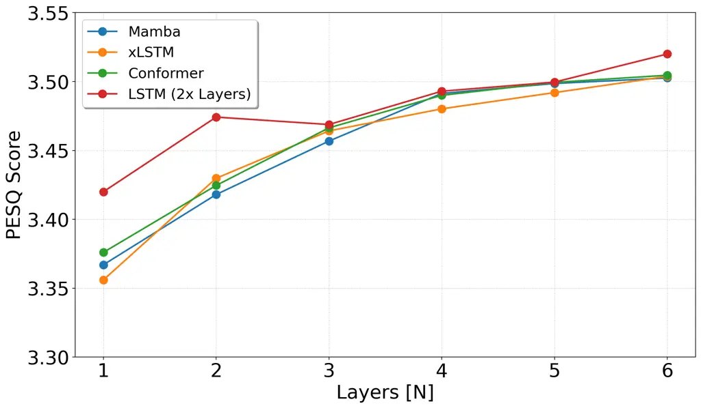

Kühne Østergaard Jensen Tan Aalborg UniversityDenmark CopenhagenDenmark

# xLSTM-SENet: xLSTM for Single-Channel Speech Enhancement

Nikolai Lund    Jan    Jesper    Zheng-Hua Affiliation: Department of
Electronic Systems Affiliation: Oticon A/S

###### Abstract

While attention-based architectures, such as Conformers, excel in speech
enhancement, they face challenges such as scalability with respect to
input sequence length. In contrast, the recently proposed Extended Long
Short-Term Memory (xLSTM) architecture offers linear scalability.
However, xLSTM-based models remain unexplored for speech enhancement.
This paper introduces xLSTM-SENet, the first xLSTM-based single-channel
speech enhancement system. A direct comparative analysis reveals that
xLSTM—and notably, even LSTM—can match or outperform state-of-the-art
Mamba- and Conformer-based systems across various model sizes in speech
enhancement on the VoiceBank+Demand dataset. Through ablation studies,
we identify key architectural design choices such as exponential gating
and bidirectionality contributing to its effectiveness. Our best
xLSTM-based model, xLSTM-SENet2, outperforms state-of-the-art Mamba- and
Conformer-based systems of similar complexity on the Voicebank+DEMAND
dataset.

###### keywords

xLSTM, speech enhancement, LSTM, Mamba

^(†)^(†)email: {nlk,jo,jje,zt}@es.aau.dk

## 1 Introduction

Real-world speech signals are often disrupted by noise, which degrades
performance in hearing assistive devices \[1\], automatic speech
recognition systems \[2\], and for speaker verification \[3\]. The
process of removing background noise and enhancing the quality and
intelligibility of the desired speech signal is known as speech
enhancement (SE). Given the wide range of applications, SE has garnered
significant research interest.

Single-channel SE methods leveraging deep learning \[1\] encompass a
selection of architectures, such as recurrent Long Short-Term Memory
(LSTM) networks \[4\], convolutional neural networks (CNNs) \[5, 6\],
generative adversarial networks (GANs) \[7, 8, 9, 10\], and diffusion
models \[11, 12, 13\]. Recently, Conformer-based models have
demonstrated impressive SE performance, achieving state-of-the-art
results \[14, 10\] on the VoiceBank+Demand dataset \[15, 16\]. However,
models based on scaled dot-product attention, such as Transformers and
Conformers, face challenges with scalability with respect to input
sequence length \[17\], and they require a lot of data to train \[18\].

To address the inherent limitations of attention-based models, Mamba
\[19\], a sequence model integrating the strengths of CNNs, RNNs, and
state space models, has recently emerged. Mamba has demonstrated
competitive or superior performance relative to Transformers across
various tasks, including audio classification \[20\] and SE \[21\].

On the other hand, recurrent neural networks (RNNs), particularly LSTMs
\[22\], also offer several advantages over attention-based models,
including: (i) linear scalability instead of quadratic, in terms of
computational complexity with respect to the input sequence length, and
(ii) reduced runtime memory requirements, as they do not require storage
of the full key-value (KV) cache. In contrast, attention-based models
such as Transformers and Conformers necessitate significant memory
overhead for KV storage. Despite these advantages, LSTMs suffer from
critical drawbacks: (i) inability to revise storage decisions, (ii)
reliance on scalar cell states, constraining storage capacity, and (iii)
memory mixing preventing parallelizability \[23\]. Consequently, LSTMs
have been less utilized in recent deep learning-based SE systems, with
only a few exceptions \[4, 24\].


Figure 1: Overall structure of our proposed xLSTM-SENet with parallel
magnitude and phase spectra denoising.

Recently, the Extended Long Short-Term Memory architecture (xLSTM)
\[23\] was proposed to overcome the limitations of LSTMs. By
incorporating exponential gating, matrix memory, and improved
normalization and stabilization mechanisms while eliminating traditional
memory mixing, xLSTM introduces two new fundamental building blocks:
sLSTM and mLSTM. The xLSTM architecture has shown competitive
performance across tasks such as natural language processing \[23\],
computer vision \[25\], and audio classification \[26\]. However, while
xLSTM adds increased memory via matrix memory and an improved ability to
revise storage decisions via exponential gating, the potential
advantages of these additions over LSTM have yet to be assessed for SE.

In this work, we propose an xLSTM-based SE system (xLSTM-SENet), which
is the first single-channel SE system utilizing xLSTM. The system
architecture is illustrated in Figure 1. Systematic comparisons of our
proposed xLSTM-SENet with Mamba-, and Conformer-based counterparts
across various model sizes, show that xLSTM-SENet matches the
performance of state-of-the-art Mamba- and Conformer-based systems on
the VoiceBank+Demand dataset \[15, 16\]. Intriguingly, upon an in depth
investigation, we find that LSTMs can match or even outperform xLSTM,
Mamba, and Conformers on the VoiceBank+Demand dataset. Additionally, we
perform detailed ablation studies to explore the importance of multiple
architectural design choices, quantifying their impact on overall
performance. Finally, our best configured xLSTM-based model,
xLSTM-SENet2, outperforms state-of-the-art Mamba- and Conformer-based
systems of similar complexity on the Voicebank+DEMAND dataset. Code is
publicly available.¹¹ 1
[https://github.com/NikolaiKyhne/xLSTM-SENet](https://github.com/NikolaiKyhne/xLSTM-SENet)

## 2 Method

### 2.1 Extended long short-term memory

As mentioned, xLSTM \[23\] introduces two novel building blocks: sLSTM
and mLSTM, to address the limitations of the original LSTM \[22\].
Following Vision-LSTM \[25\] and Audio xLSTM \[26\], we employ mLSTM as
the main building block in our SE system. Unlike the sigmoid gating used
in traditional LSTMs, mLSTM adopts exponential gating for the input and
forget gates, enabling it to better revise storage decisions.
Additionally, the scalar memory cell $`c\in\mathbb{R}`$ is replaced with
a matrix memory cell $`\bm{C}\in\mathbb{R}^{d\times d}`$ to increase
storage capacity. Each mLSTM block projects the $`D`$-dimensional input
by an expansion factor $`E_{f}\in\mathbb{N}`$ to $`d=E_{f}D`$ before
projecting it back to $`D`$-dimensions after being processed by an mLSTM
layer. The forward pass of mLSTM is given by \[23\]:

```math
\displaystyle{\bm{C}_{t}}\  \displaystyle=\ {f_{t}}\ {\bm{C}_{t-1}}\ +\ {i_{t}}\ {\bm{v}_{t}\ \bm{k}_{t}^{\top}}, \tag{1}
```

```math
\displaystyle{\bm{n}_{t}}\  \displaystyle=\ {f_{t}}\ {\bm{n}_{t-1}}\ +\ {i_{t}}\ {\bm{k}_{t}}, \tag{2}
```

```math
\displaystyle\bm{h}_{t}\  \displaystyle=\ {\bm{o}_{t}}\ \odot\ \left({\bm{C}_{t}}{\bm{q}_{t}}\ /\ \max\left\{|{\bm{n}_{t}^{\top}}{\bm{q}_{t}}|,1\right\}\right), \tag{3}
```

```math
\displaystyle\bm{q}_{t}\  \displaystyle=\ \bm{W}_{q}\ \bm{x}_{t}\ +\ \bm{b}_{q}, \tag{4}
```

```math
\displaystyle\bm{k}_{t}\  \displaystyle=\ \frac{1}{\sqrt{d}}\bm{W}_{k}\ \bm{x}_{t}\ +\ \bm{b}_{k}, \tag{5}
```

```math
\displaystyle\bm{v}_{t}\  \displaystyle=\ \bm{W}_{v}\ \bm{x}_{t}\ +\ \bm{b}_{v}, \tag{6}
```

```math
\displaystyle{i_{t}}\  \displaystyle=\ \exp{\left(\bm{w}^{\top}_{i}\ \bm{x}_{t}\ +\ b_{i}\right)}\ , \tag{7}
```

```math
\displaystyle{f_{t}}\  \displaystyle=\ \exp{\left(\bm{w}^{\top}_{f}\ \bm{x}_{t}\ +\ b_{f}\right)}, \tag{8}
```

```math
\displaystyle\bm{o}_{t}\  \displaystyle=\ \sigma\left(\bm{W_{o}}\ \bm{x}_{t}\ +\ \bm{b_{o}}\right),\mskip 5.0mu plus 5.0mu \tag{9}
```

where the cell state $`\bm{C}_{t}\in\mathbb{R}^{d\times d}`$,
$`\bm{n}_{t},\bm{h}_{t}\in\mathbb{R}^{d}`$ represent the normalizer
state and the hidden state, respectively, $`\sigma(\cdot)`$ is the
sigmoid function, and $`\odot`$ is element-wise multiplication. The
input, forget and output gates are represented by
$`i_{t},f_{t}\in\mathbb{R}`$ and $`\bm{o}_{t}\in\mathbb{R}^{d}`$,
respectively, while
$`\bm{W}_{q},\bm{W}_{k},\bm{W}_{v}\in\mathbb{R}^{d\times d}`$ are
learnable projection matrices and
$`\bm{b}_{q},\bm{b}_{k},\bm{b}_{v}\in\mathbb{R}^{d}`$ are the respective
biases for the query, key and value vectors. Finally,
$`\bm{w}_{i},\bm{w}_{f}\in\mathbb{R}^{d}`$, and
$`\bm{W_{o}}\in\mathbb{R}^{d\times d}`$ represent the weights between
the input $`\bm{x}_{t}`$ and the input, forget, and output gate,
respectively, and $`{b}_{i},b_{f}\in\mathbb{R}`$ and
$`\bm{b_{o}}\in\mathbb{R}^{d}`$ are their biases. Unlike LSTM and sLSTM,
there are no interactions between hidden states from one time step to
the following in mLSTM (i.e. no memory mixing). This means multiple
memory cells and multiple heads are equivalent, allowing the forward
pass to be parallelized.

### 2.2 xLSTM-SENet: speech enhancement with xLSTMs

For a direct comparison with the state-of-the-art dual-path \[27\] SE
systems: SEMamba \[21\] and MP-SENet \[14\], we integrate xLSTM into the
MP-SENet architecture by replacing the Conformer blocks with xLSTM
blocks as shown in Figure 1. We use the MP-SENet architecture since it
facilitates joint denoising of magnitude and phase spectra, and has
shown superior performance compared to other time-frequency (TF) domain
SE methods \[14\].

#### 2.2.1 Model structure

Model overview: As shown in Figure 1, our proposed xLSTM-SENet
architecture follows an encoder-decoder structure. Given the noisy
speech waveform $`\bm{y}\in\mathbb{R}^{D}`$, let
$`\bm{Y}=\bm{Y}_{m}\cdot\mathrm{e}^{j\bm{Y}_{p}}\in\mathbb{C}^{T\times F}`$
(where $`T`$ and $`F`$ represent time and frequency dimensions,
respectively) denote the corresponding complex spectrogram obtained
through a short-time Fourier transform (STFT). We stack the wrapped
phase spectrum $`\bm{Y}_{p}\in\mathbb{R}^{T\times F}`$ and the
compressed magnitude spectrum
$`(\bm{Y}_{m})^{c}\in\mathbb{R}^{T\times F}`$ (extracted by applying
power-law compression \[28\] with compression factor $`c=0.3`$ as in
\[14\]) to create an input
$`\bm{Y}_{in}\in\mathbb{R}^{T\times F\times 2}`$ to the feature encoder.
The feature encoder encodes the input into a compressed TF-domain
representation, which is subsequently fed to a stack of $`N`$ TF-xLSTM
blocks. Each TF-xLSTM block comprises a time and frequency xLSTM block,
capturing temporal and frequency dependencies, respectively. Similar to
SEMamba \[21\], we use a bidirectional architecture (Bi-mLSTM) for these
blocks. Hence, the output $`\bm{\upsilon}`$ of the time and frequency
xLSTM blocks is:

```math
\displaystyle\bm{\upsilon}=\mathrm{Conv1d}(\mathrm{mLSTM}(\bm{\varepsilon})\oplus\mathrm{flip}(\mathrm{mLSTM}(\mathrm{flip}(\bm{\varepsilon})))), \tag{10}
```

where $`\bm{\varepsilon}`$ is the input to the time and frequency xLSTM
blocks, and $`\mathrm{mLSTM}(\cdot)`$, $`\mathrm{flip}(\cdot)`$,
$`\oplus`$, and $`\mathrm{Conv1d}(\cdot)`$ is the unidirectional mLSTM,
the sequence flipping operation, concatenation, and the $`1`$-D
transposed convolution, respectively.

Finally, the output of the TF-xLSTM blocks is decoded by both a
magnitude mask decoder and wrapped phase decoder \[29\]. They predict
the clean compressed magnitude mask
$`\bm{M}^{c}=(\bm{X}_{m}/\bm{Y}_{m})^{c}\in\mathbb{R}^{T\times F}`$ and
the clean wrapped phase spectrum
$`\bm{X}_{p}\in\mathbb{R}^{T\times F}`$, respectively. The enhanced
magnitude spectrum $`\bm{\hat{X}}_{m}\in\mathbb{R}^{T\times F}`$ is
obtained by computing:

```math
\displaystyle\bm{\hat{X}}_{m}=((\bm{Y}_{m})^{c}\odot\bm{\hat{M}}^{c})^{1/c}, \tag{11}
```

where $`\bm{\hat{M}}^{c}`$ is the predicted clean compressed magnitude
mask. The final enhanced waveform $`\bm{\hat{x}}`$ is reconstructed by
performing an iSTFT on the enhanced magnitude spectrum
$`\bm{\hat{X}}_{m}`$ and the enhanced wrapped phase spectrum
$`\bm{\hat{X}}_{p}`$.

Similar to MP-SENet \[14\] and SEMamba \[21\], we use a linear
combination of loss functions which includes a PESQ-based GAN
discriminator, along with time, magnitude, complex, and phase losses. We
also employ the consistency loss function proposed in \[30\], as this
has been shown to improve performance \[21\].

Feature encoder: Following MP-SENet \[14\], the encoder consists of two
convolution blocks each comprising a $`2\mathrm{D}`$ convolutional
layer, an instance normalization, and parametric rectified linear unit
(PReLU) activation, sandwiching a dilated DenseNet \[31\] with dilation
sizes $`1`$, $`2`$, $`4`$, and $`8`$. The first convolutional block
increases the input channels from $`2`$ to $`C`$, while the second
convolutional block halves the frequency dimension from $`F`$ to
$`F^{\prime}=F/2`$, consequently reducing the computational complexity
in the TF-xLSTM blocks. The dilated DenseNet extends the receptive field
along the time axis, which facilitates long-range context aggregation
over different resolutions.

Magnitude mask and wrapped phase decoder: Following MP-SENet \[14\],
both the magnitude mask decoder and the wrapped phase decoder consist of
a dilated DenseNet and a 2D transposed convolution. For the magnitude
mask decoder, this is followed by a deconvolution block reducing the
output channels from $`C`$ to 1. To estimate the magnitude mask, we
employ a learnable sigmoid function with $`\beta=2`$ as in \[9\]. In the
wrapped phase decoder, the transposed convolution is followed by two
parallel 2D convolutional layers outputting the pseudo-real and
pseudo-imaginary part components. To predict the clean wrapped phase
spectrum, we use the two-argument arctangent function (Arctan2)
resulting in the enhanced wrapped phase spectrum $`\bm{\hat{X}}_{p}`$.

## 3 Experiments

### 3.1 Dataset

In this study, we perform experiments on the VoiceBank+Demand dataset,
which consists of pairs of clean and noisy audio clips sampled at
$`48\text{\mskip 5.0mu plus 5.0mu}\mathrm{k}\mathrm{H}\mathrm{z}`$. The
clean audio samples come from the VoiceBank corpus \[15\], which
comprises $`11,572`$ audio clips from $`28`$ distinct speakers for
training, and $`824`$ audio clips from $`2`$ distinct speakers for
testing. The noisy audio clips are created by mixing the clean samples
with noise from the DEMAND dataset \[16\] at four signal-to-noise ratios
(SNRs) during training (\[$`0,5,10,15`$\] dB) and testing
(\[$`2.5,7.5,12.5,17.5`$\] dB). Two speakers from the training set are
left out as a validation set.

### 3.2 Implementation details

Unless otherwise stated, experimental details and training
configurations match those presented in MP-SENet \[14\] and SEMamba
\[21\]. To reduce memory and computational resources, all models were
trained on randomly cropped $`2`$-second audio clips. Additionally, all
audio clips were downsampled to
$`16\text{\mskip 5.0mu plus 5.0mu}\mathrm{k}\mathrm{H}\mathrm{z}`$,
reducing computational complexity and ensuring compatibility with the
wide-band PESQ metric \[32\]. When performing STFTs we set the FFT
order, Hann window size, and hop size to $`400`$, $`400`$, and $`100`$,
respectively. We train all models for $`200`$ epochs and select the
checkpoint (saved every $`1000`$th step) with the best PESQ score on the
validation data. We fix $`C=64`$ channels and $`N=4`$ stacks of TF-xLSTM
blocks in our xLSTM-SENet model for direct comparison with SEMamba and
MP-SENet. All models are trained with a batchsize $`B=8`$ on four NVIDIA
L40S GPUs, and the four layer xLSTM-SENet model takes approximately
$`3`$ days to train. This is the main limitation of xLSTM compared to
Mamba and Transformers, which are roughly four times as fast to train
\[23\].

### 3.3 Evaluation metrics

We use the following commonly used evalutation metrics to assess SE
performance: wide-band PESQ \[32\] and short-time objective
intelligibility (STOI) \[33\]. To predict the signal distortion,
background intrusiveness and overall speech quality, we use the
composite measures CSIG, CBAK and COVL \[34\]. For all measures, a
higher value is better. We train all models with $`5`$ different seeds
and document the mean and standard deviation.

## 4 Results and analysis

### 4.1 Comparison with existing methods

We evaluate several architectural design choices for our xLSTM-SENet
model while limiting the parameter count to that of SEMamba. We choose
the best model based on validation performance. Our best model uses a
bidirectional architecture and we have added biases to layer
normalizations and projection layers as in \[25\]. The expansion factor
is set to $`E_{f}=4`$.

Model Params (M) PESQ CSIG CBAK COVL STOI Noisy - $`1.97`$ $`3.35`$
$`2.44`$ $`2.63`$ $`0.91`$ MetricGAN+ \[9\] - $`3.15`$ $`4.14`$ $`3.16`$
$`3.64`$ - CMGAN \[10\] $`1.83`$ $`3.41`$ $`4.63`$ $`3.94`$ $`4.12`$
$`{0.96}`$ DPT-FSNet \[35\] $`0.88`$ $`3.33`$ $`4.58`$ $`3.72`$ $`4.00`$
$`{0.96}`$ Spiking-S4 \[36\] $`0.53`$ $`3.39`$ $`{4.92}`$ $`2.64`$
$`{4.31}`$ - TridentSE \[37\] $`3.03`$ $`3.47`$ $`4.70`$ $`3.81`$
$`4.10`$ $`{0.96}`$ MP-SENet \[14\] $`2.05`$ $`3.50`$ $`4.73`$
$`{3.95}`$ $`4.22`$ $`{0.96}`$ SEMamba \[21\] $`2.25`$ $`{3.55}`$
$`4.77`$ $`{3.95}`$ $`4.26`$ $`{0.96}`$ MP-SENet^(∗) $`2.05`$
$`3.49\scriptstyle\pm 0.02`$ $`4.72\scriptstyle\pm 0.02`$
$`3.92\scriptstyle\pm 0.04`$ $`4.22\scriptstyle\pm 0.02`$
$`{0.96\scriptstyle\pm 0.00}`$ SEMamba^(∗) $`2.25`$
$`3.49\scriptstyle\pm 0.01`$ $`4.75\scriptstyle\pm 0.01`$
$`3.94\scriptstyle\pm 0.02`$ $`4.24\scriptstyle\pm 0.01`$
$`{0.96\scriptstyle\pm 0.00}`$ xLSTM-SENet $`2.20`$
$`3.48\scriptstyle\pm 0.00`$ $`4.74\scriptstyle\pm 0.01`$
$`3.93\scriptstyle\pm 0.01`$ $`4.22\scriptstyle\pm 0.01`$
$`{0.96\scriptstyle\pm 0.00}`$

Table 1: Results on the VoiceBank+Demand dataset. “-” denotes that the
result is not provided in the original paper. ^(∗) means the results are
reproduced using the original provided code.

Table 1shows that xLSTM-SENet matches the performance of the
state-of-the-art SEMamba and MP-SENet models on the VoiceBank+Demand
dataset, while outperforming other SE methods on most metrics. This
demonstrates the effectiveness of xLSTM for SE.

### 4.2 Ablation study

To evaluate our model architecture design choices, we perform ablations
on the expansion factor $`E_{f}`$ and on the biases in layer
normalizations and projection layers. Additionally, we investigate the
performance of a unidirectional architecture, by removing the transposed
convolution, flipping and the second mLSTM block within each time and
frequency xLSTM block as shown in Figure 1. Since our xLSTM-SENet is
bidirectional and thus has 2 mLSTM blocks, we double the amount of
layers $`N`$ for the unidirectional model. Finally, mLSTM adds
exponential gating to improve LSTM, hence we evaluate its effect on
speech enhancement performance by replacing it with sigmoid gating.

Model Params (M) PESQ CSIG CBAK COVL STOI Noisy - $`1.97`$ $`3.35`$
$`2.44`$ $`2.63`$ $`0.91`$ xLSTM-SENet $`2.20`$
$`{3.48\scriptstyle\pm 0.00}`$ $`{4.74\scriptstyle\pm 0.01}`$
$`{3.93\scriptstyle\pm 0.01}`$ $`{4.22\scriptstyle\pm 0.01}`$
$`{0.96\scriptstyle\pm 0.00}`$ $`E_{f}=3`$ $`1.96`$
$`3.46\scriptstyle\pm 0.01`$ $`4.72\scriptstyle\pm 0.00`$
$`{3.93\scriptstyle\pm 0.02}`$ $`{4.21\scriptstyle\pm 0.01}`$
$`{0.96\scriptstyle\pm 0.00}`$ $`E_{f}=2`$ $`1.71`$
$`3.45\scriptstyle\pm 0.01`$ $`4.71\scriptstyle\pm 0.01`$
$`{3.92\scriptstyle\pm 0.01}`$ $`4.19\scriptstyle\pm 0.01`$
$`{0.96\scriptstyle\pm 0.00}`$ w/o Biases $`2.18`$
$`3.46\scriptstyle\pm 0.00`$ $`{4.72\scriptstyle\pm 0.01}`$
$`{3.91\scriptstyle\pm 0.01}`$ $`{4.20\scriptstyle\pm 0.02}`$
$`{0.96\scriptstyle\pm 0.00}`$ Unidirectional $`2.14`$
$`3.26\scriptstyle\pm 0.02`$ $`4.57\scriptstyle\pm 0.02`$
$`3.79\scriptstyle\pm 0.01`$ $`4.00\scriptstyle\pm 0.02`$
$`0.95\scriptstyle\pm 0.00`$ w/o Exp. gating $`2.20`$
$`3.45\scriptstyle\pm 0.02`$ $`{4.72\scriptstyle\pm 0.02}`$
$`3.90\scriptstyle\pm 0.01`$ $`{4.20\scriptstyle\pm 0.03}`$
$`{0.96\scriptstyle\pm 0.00}`$

Table 2: Ablation study on the VoiceBank+Demand dataset. Default
settings for xLSTM-SENet: $`E_{f}=4`$, a bidirectional architecture, and
biases in layer normalizations and projection layers.

Table 2shows that decreasing the expansion factor $`E_{f}`$ decreases
performance. Moreover, as in Vision-LSTM \[25\], biases in layer
normalizations and projection layers improve performance. We also find
that a bidirectional architecture significantly outperforms a
unidirectional architecture. Finally, we find that exponential gating
improves performance for SE, which was not the case for learning
self-supervised audio representations with xLSTMs \[26\].

### 4.3 Comparison with LSTM

To compare the performance of xLSTM and LSTM for SE, we first replace
the mLSTM layers in xLSTM-SENet with conventional LSTM layers (this
models is referred to as: LSTM (layer)). Table 3 shows that this results
in a performance decrease even though LSTM (layer) is approximately
$`11\text{\mskip 5.0mu plus 5.0mu}\mathrm{\char 37\relax}`$ larger.
Then, we replace the entire mLSTM block with LSTM (denoted as: LSTM
(block)) and double the number of layers $`N`$ to roughly match the
parameter count of xLSTM-SENet. Table 3 shows that LSTM (block) matches
xLSTM-SENet in performance, which in Table 1 was shown to match the
performance of state-of-the-art Mamba and Conformer-based systems.

Model Params (M) PESQ CSIG CBAK COVL STOI Noisy - $`1.97`$ $`3.35`$
$`2.44`$ $`2.63`$ $`0.91`$ xLSTM-SENet $`2.20`$
$`{3.48\scriptstyle\pm 0.00}`$ $`{4.74\scriptstyle\pm 0.01}`$
$`{3.93\scriptstyle\pm 0.01}`$ $`{4.22\scriptstyle\pm 0.01}`$
$`{0.96\scriptstyle\pm 0.00}`$ LSTM (layer) $`2.44`$
$`3.44\scriptstyle\pm 0.01`$ $`4.69\scriptstyle\pm 0.02`$
$`3.90\scriptstyle\pm 0.00`$ $`4.17\scriptstyle\pm 0.01`$
$`{0.96\scriptstyle\pm 0.00}`$ LSTM (block) $`2.34`$
$`{3.49\scriptstyle\pm 0.02}`$ $`{4.76\scriptstyle\pm 0.01}`$
$`{3.95\scriptstyle\pm 0.01}`$ $`{4.24\scriptstyle\pm 0.01}`$
$`{0.96\scriptstyle\pm 0.00}`$

Table 3: Comparison of xLSTM with LSTM on the VoiceBank+Demand dataset.

### 4.4 Scaling experiments

Smaller models are preferred in real-world SE applications, like hearing
aids, due to reduced computational complexity, facilitating their use in
such devices. Additionally, it is of interest to explore the performance
achieved by increasing model sizes. Hence, we perform a comparative
analysis of xLSTM, Mamba, Conformer and LSTM across varying layer counts
$`N`$. For LSTM, $`N`$ is doubled to roughly match the parameter counts
of the xLSTM-, Mamba-, and Conformer-based models.



Figure 2: Scaling results on the VoiceBank+Demand dataset. The smallest
($`N=1`$) and largest ($`N=6`$) models are
$`1.37\text{\mskip 5.0mu plus 5.0mu}\mathrm{M}`$ and
$`2.94\text{\mskip 5.0mu plus 5.0mu}\mathrm{M}`$ parameters,
respectively.

Figure 2shows that xLSTM, Mamba, and Conformer-based models perform
similarly when scaled down, with LSTM outperforming them for $`N=1`$ and
$`N=2`$. When scaled up, all models achieve comparable performance. For
$`N=1`$, training-time is reduced by nearly
$`70\text{\mskip 5.0mu plus 5.0mu}\mathrm{\char 37\relax}`$ compared to
$`N=4`$.

### 4.5 xLSTM-SENet2

To investigate the benefits of increased depth over width in xLSTM for
SE, we propose xLSTM-SENet2, which is configured with an expansion
factor $`E_{f}=2`$ and $`N=8`$ layers. This allows for a deeper
architecture while maintaining a comparable parameter count to
xLSTM-SENet. Table 4 shows that xLSTM-SENet2 outperforms
state-of-the-art LSTM-, Mamba-, and Conformer-based models.

Model Params (M) PESQ CSIG CBAK COVL STOI Noisy - $`1.97`$ $`3.35`$
$`2.44`$ $`2.63`$ $`0.91`$ LSTM (block) $`2.34`$
$`{3.49\scriptstyle\pm 0.02}`$ $`{4.76\scriptstyle\pm 0.01}`$
$`{3.95\scriptstyle\pm 0.01}`$ $`{4.24\scriptstyle\pm 0.01}`$
$`{0.96\scriptstyle\pm 0.00}`$ MP-SENet^(∗) $`2.05`$
$`3.49\scriptstyle\pm 0.02`$ $`4.72\scriptstyle\pm 0.02`$
$`3.92\scriptstyle\pm 0.04`$ $`4.22\scriptstyle\pm 0.02`$
$`{0.96\scriptstyle\pm 0.00}`$ SEMamba^(∗) $`2.25`$
$`3.49\scriptstyle\pm 0.01`$ $`4.75\scriptstyle\pm 0.01`$
$`3.94\scriptstyle\pm 0.02`$ $`4.24\scriptstyle\pm 0.01`$
$`{0.96\scriptstyle\pm 0.00}`$ xLSTM-SENet2 $`2.27`$
$`3.53\scriptstyle\pm 0.01`$ $`4.78\scriptstyle\pm 0.01`$
$`3.98\scriptstyle\pm 0.02`$ $`4.27\scriptstyle\pm 0.01`$
$`0.96\scriptstyle\pm 0.00`$

Table 4: Speech enhancement performance of xLSTM-SENet2 on the
VoiceBank+Demand dataset. ^(∗) means the results are reproduced using
the original provided code.

## 5 Conclusion

This paper proposed xLSTM-SENet, an Extended Long Short-Term
Memory-based model for speech enhancement. Experiments on the
VoiceBank+Demand dataset show that xLSTM-SENet, and even LSTM-based
models, rival existing state-of-the-art Mamba- and Conformer-based
speech enhancement systems across several model sizes. We studied the
importance of several architectural design choices, and demonstrated
that the inclusion of exponential gating and bidirectionality is
critical to the performance of the xLSTM-SENet model. Finally, empirical
results show that our best xLSTM-based system, xLSTM-SENet2, outperforms
state-of-the-art speech enhancement systems on the VoiceBank+Demand
dataset.

## References

- \[1\] M. Kolbæk, Z.-H. Tan, and J. Jensen, “Speech intelligibility
  potential of general and specialized deep neural network based speech
  enhancement systems,” _IEEE/ACM Transactions on Audio, Speech, and
  Language Processing_, vol. 25, no. 1, pp. 153–167, 2016.
- \[2\] Z. Chen, S. Watanabe, H. Erdogan, and J. R. Hershey, “Speech
  enhancement and recognition using multi-task learning of long
  short-term memory recurrent neural networks,” in _INTERSPEECH_, 2015,
  pp. 3274–3278.
- \[3\] S. Shon, H. Tang, and J. Glass, “Voiceid loss: Speech
  enhancement for speaker verification,” in _INTERSPEECH_, 2019, pp.
  2888–2892.
- \[4\] K. Tesch, N.-H. Mohrmann, and T. Gerkmann, “On the role of
  spatial, spectral, and temporal processing for dnn-based non-linear
  multi-channel speech enhancement,” in _INTERSPEECH_, 2022, pp.
  2908–2912.
- \[5\] S.-W. Fu, Y. Tsao, X. Lu _et al._, “Snr-aware convolutional
  neural network modeling for speech enhancement.” in _INTERSPEECH_,
  2016, pp. 3768–3772.
- \[6\] M. Kolbæk, Z.-H. Tan, S. H. Jensen, and J. Jensen, “On loss
  functions for supervised monaural time-domain speech enhancement,”
  _IEEE/ACM Transactions on Audio, Speech, and Language Processing_,
  vol. 28, pp. 825–838, 2020.
- \[7\] D. Michelsanti and Z.-H. Tan, “Conditional generative
  adversarial networks for speech enhancement and noise-robust speaker
  verification,” in _INTERSPEECH_, 2017, pp. 2008–2012.
- \[8\] S.-W. Fu, C.-F. Liao, Y. Tsao, and S.-D. Lin, “Metricgan:
  Generative adversarial networks based black-box metric scores
  optimization for speech enhancement,” in _International Conference on
  Machine Learning (ICML)_, 2019, pp. 2031–2041.
- \[9\] S.-W. Fu, C. Yu, T.-A. Hsieh, P. Plantinga, M. Ravanelli, X. Lu,
  and Y. Tsao, “Metricgan+: An improved version of metricgan for speech
  enhancement,” in _INTERSPEECH_, 2021, pp. 201–205.
- \[10\] S. Abdulatif, R. Cao, and B. Yang, “Cmgan: Conformer-based
  metric-gan for monaural speech enhancement,” _IEEE/ACM Transactions on
  Audio, Speech, and Language Processing_, 2024.
- \[11\] Y.-J. Lu, Z.-Q. Wang, S. Watanabe, A. Richard, C. Yu, and Y.
  Tsao, “Conditional diffusion probabilistic model for speech
  enhancement,” in _IEEE ICASSP_, 2022, pp. 7402–7406.
- \[12\] J. Richter, S. Welker, J.-M. Lemercier, B. Lay, and T.
  Gerkmann, “Speech enhancement and dereverberation with diffusion-based
  generative models,” _IEEE/ACM Transactions on Audio, Speech, and
  Language Processing_, vol. 31, pp. 2351–2364, 2023.
- \[13\] P. Gonzalez, Z.-H. Tan, J. Østergaard, J. Jensen, T. S.
  Alstrøm, and T. May, “Investigating the design space of diffusion
  models for speech enhancement,” _IEEE/ACM Transactions on Audio,
  Speech, and Language Processing_, 2024.
- \[14\] Y.-X. Lu, Y. Ai, and Z.-H. Ling, “Mp-senet: A speech
  enhancement model with parallel denoising of magnitude and phase
  spectra,” in _INTERSPEECH_, 2023, pp. 3834–3838.
- \[15\] C. Veaux, J. Yamagishi, and S. King, “The voice bank corpus:
  Design, collection and data analysis of a large regional accent speech
  database,” in _IEEE International Conference Oriental COCOSDA held
  jointly with 2013 Conference on Asian Spoken Language Research and
  Evaluation (O-COCOSDA/CASLRE)_, 2013, pp. 1–4.
- \[16\] J. Thiemann, N. Ito, and E. Vincent, “The diverse environments
  multi-channel acoustic noise database (demand): A database of
  multichannel environmental noise recordings,” in _Proceedings of
  Meetings on Acoustics_, vol. 19, no. 1. AIP Publishing, 2013.
- \[17\] D. de Oliveira, T. Peer, and T. Gerkmann, “Efficient
  transformer-based speech enhancement using long frames and stft
  magnitudes,” in _INTERSPEECH_, 2022, pp. 2948–2952.
- \[18\] Y. Gong, Y.-A. Chung, and J. Glass, “Ast: Audio spectrogram
  transformer,” in _INTERSPEECH_, 2021, pp. 571–575.
- \[19\] A. Gu and T. Dao, “Mamba: Linear-time sequence modeling with
  selective state spaces,” in _First Conference on Language Modeling
  (COLM)_, 2024.
- \[20\] S. Yadav and Z.-H. Tan, “Audio mamba: Selective state spaces
  for self-supervised audio representations,” in _INTERSPEECH_, 2024,
  pp. 552–556.
- \[21\] R. Chao, W.-H. Cheng, M. La Quatra, S. M. Siniscalchi,
  C.-H. H. Yang, S.-W. Fu, and Y. Tsao, “An investigation of
  incorporating mamba for speech enhancement,” in _IEEE Spoken Language
  Technology Workshop_, 2024.
- \[22\] J. Schmidhuber, S. Hochreiter _et al._, “Long short-term
  memory,” _Neural Computation_, vol. 9, no. 8, pp. 1735–1780, 1997.
- \[23\] M. Beck, K. Pöppel, M. Spanring, A. Auer, O. Prudnikova, M. K.
  Kopp, G. Klambauer, J. Brandstetter, and S. Hochreiter, “xLSTM:
  Extended long short-term memory,” in _The Thirty-eighth Annual
  Conference on Neural Information Processing Systems (NeurIPS)_, 2024.
- \[24\] K. Tesch and T. Gerkmann, “Multi-channel speech separation
  using spatially selective deep non-linear filters,” _IEEE/ACM
  Transactions on Audio, Speech, and Language Processing_, vol. 32, pp.
  542–553, 2023.
- \[25\] B. Alkin, M. Beck, K. Pöppel, S. Hochreiter, and J.
  Brandstetter, “Vision-lstm: xlstm as generic vision backbone,” in _The
  Thirteenth International Conference on Learning Representations
  (ICLR)_, 2025.
- \[26\] S. Yadav, S. Theodoridis, and Z.-H. Tan, “Audio xlstms:
  Learning self-supervised audio representations with xlstms,” in
  _INTERSPEECH (Accepted)_, 2025.
- \[27\] Y. Luo, Z. Chen, and T. Yoshioka, “Dual-path rnn: efficient
  long sequence modeling for time-domain single-channel speech
  separation,” in _IEEE ICASSP_, 2020, pp. 46–50.
- \[28\] S. Wisdom, J. R. Hershey, K. Wilson, J. Thorpe, M. Chinen, B.
  Patton, and R. A. Saurous, “Differentiable consistency constraints for
  improved deep speech enhancement,” in _IEEE ICASSP_, 2019, pp.
  900–904.
- \[29\] Y. Ai and Z.-H. Ling, “Neural speech phase prediction based on
  parallel estimation architecture and anti-wrapping losses,” in _IEEE
  ICASSP_, 2023, pp. 1–5.
- \[30\] V. Zadorozhnyy, Q. Ye, and K. Koishida, “Scp-gan:
  Self-correcting discriminator optimization for training consistency
  preserving metric gan on speech enhancement tasks,” in _INTERSPEECH_,
  2023, pp. 2463–2467.
- \[31\] A. Pandey and D. Wang, “Densely connected neural network with
  dilated convolutions for real-time speech enhancement in the time
  domain,” in _IEEE ICASSP_, 2020, pp. 6629–6633.
- \[32\] A. W. Rix, J. G. Beerends, M. P. Hollier, and A. P. Hekstra,
  “Perceptual evaluation of speech quality (pesq)-a new method for
  speech quality assessment of telephone networks and codecs,” in _IEEE
  ICASSP_, vol. 2, 2001, pp. 749–752.
- \[33\] C. H. Taal, R. C. Hendriks, R. Heusdens, and J. Jensen, “An
  algorithm for intelligibility prediction of time–frequency weighted
  noisy speech,” _IEEE Transactions on audio, speech, and language
  processing_, vol. 19, no. 7, pp. 2125–2136, 2011.
- \[34\] Y. Hu and P. C. Loizou, “Evaluation of objective quality
  measures for speech enhancement,” _IEEE Transactions on audio, speech,
  and language processing_, vol. 16, no. 1, pp. 229–238, 2007.
- \[35\] F. Dang, H. Chen, and P. Zhang, “Dpt-fsnet: Dual-path
  transformer based full-band and sub-band fusion network for speech
  enhancement,” in _IEEE ICASSP_, 2022, pp. 6857–6861.
- \[36\] Y. Du, X. Liu, and Y. Chua, “Spiking structured state space
  model for monaural speech enhancement,” in _IEEE ICASSP_, 2024, pp.
  766–770.
- \[37\] D. Yin, Z. Zhao, C. Tang, Z. Xiong, and C. Luo, “Tridentse:
  Guiding speech enhancement with 32 global tokens,” in _INTERSPEECH_,
  2023, pp. 3839–3843.
