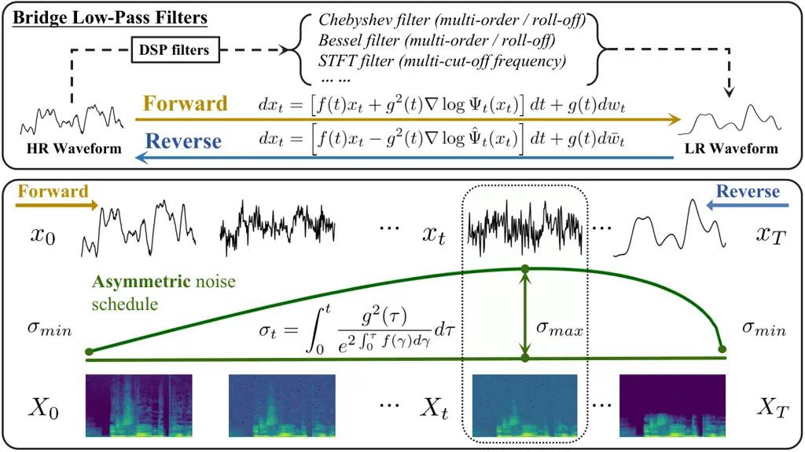
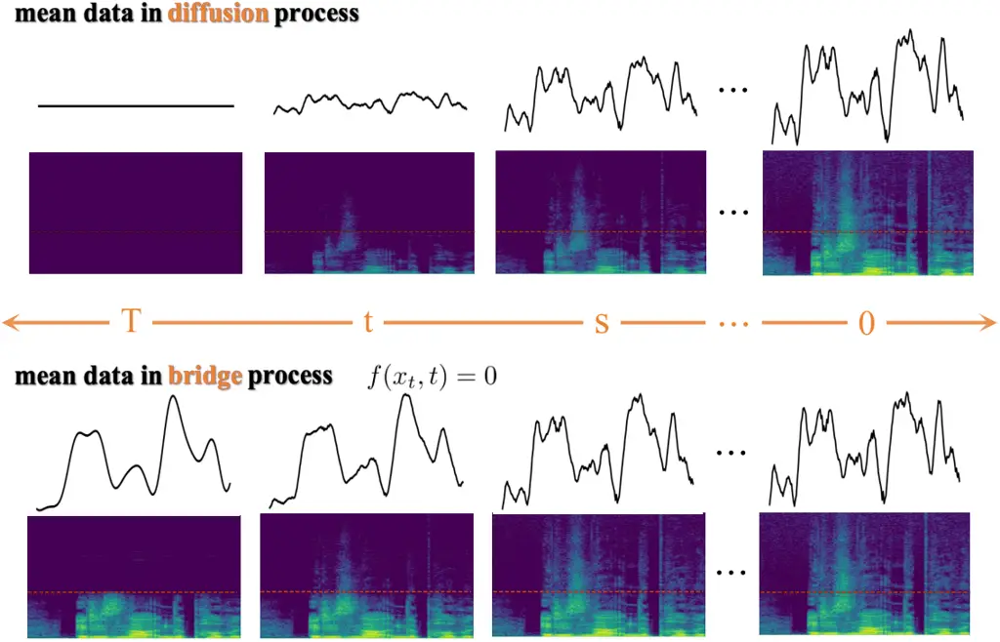

# Bridge-SR: Schrödinger Bridge for Efficient SRThanks:  This work was supported by the NSFC Projects (Nos. 62350080, 92270001, 62106120, U24A20342), Tsinghua Institute for Guo Qiang, and the High Performance Computing Center, Tsinghua University. JZ was also supported by the XPlorer Prize.

Chang Li\*^(2,3), Zehua Chen\*^(1,2), Fan Bao², Jun Zhu^(1,†)
^(†)^(†)thanks: \* Equally contributed. Work done during internship at
Shengshu AI.^(†)^(†)thanks: \$†\$ Corresponding author. e-mail:
dcszj@tsinghua.edu.cn Affiliation:  Affiliation: ¹ Department of CST,
Tsinghua University, Beijing, China Affiliation: ² Shengshu AI, Beijing,
China Affiliation: ³ University of Science & Technology of China, Hefei,
China

###### Abstract

Speech super-resolution (SR), which generates a waveform at a higher
sampling rate from its low-resolution version, is a long-standing
critical task in speech restoration. Previous works have explored speech
SR in different data spaces, but these methods either require additional
compression networks or exhibit limited synthesis quality and inference
speed. Motivated by recent advances in probabilistic generative models,
we present Bridge-SR, a novel and efficient any-to-48kHz SR system in
the speech waveform domain. Using tractable Schrödinger Bridge models,
we leverage the observed low-resolution waveform as a prior, which is
intrinsically informative for the high-resolution target. By optimizing
a lightweight network to learn the score functions from the prior to the
target, we achieve efficient waveform SR through a data-to-data
generation process that fully exploits the instructive content contained
in the low-resolution observation. Furthermore, we identify the
importance of the noise schedule, data scaling, and auxiliary loss
functions, which further improve the SR quality of bridge-based systems.
The experiments conducted on the benchmark dataset VCTK demonstrate the
efficiency of our system: (1) in terms of sample quality, Bridge-SR
outperforms several strong baseline methods under different SR settings,
using a lightweight network backbone (1.7M); (2) in terms of inference
speed, our 4-step synthesis achieves better performance than the 8-step
conditional diffusion counterpart (LSD: 0.911 vs 0.927). Demo at
https://bridge-sr.github.io.

###### Index Terms: 

Schrödinger bridge, speech super-resolution

## I Introduction

Speech signals often suffer from a limited sampling rate, which may
result from hardware limitations, transmission issues, or inherent
constraints in waveform generation models \[1, 2, 3\]. In many
application scenarios, this limited sampling rate restricts both the
objective and perceptual quality of speech signals, necessitating an
efficient super-resolution (SR) system to recover the high-frequency
information.

In recent years, various speech SR systems have been proposed in the
time domain \[4, 5, 6, 7, 8, 9\], time-frequency domain \[10, 11, 12,
13\], and compressed space \[14, 15, 16, 17, 18\]. Among them, the
methods in the time domain directly upsample the low-resolution waveform
to its high-resolution version without relying on signal
processing-based transformations (e.g., Short-Time Fourier Transform,
STFT) or compression neural networks. This avoids cascading errors \[14,
19\], adversarial training \[17, 11\], and large networks \[4, 15\]. In
waveform space, diffusion models (DMs)-based SR systems \[20, 21\] have
achieved promising quality through their iterative refinement mechanism.
For example, NU-Wave \[5\] and NU-Wave2 \[6\] condition DMs on the
low-resolution waveform to generate the high-resolution target,
achieving strong synthesis quality with a lightweight network. UDM+
\[7\] employs unconditional DMs and injects low-frequency constraints
into the inference process. However, these DMs-based SR systems rely on
a noise-to-data sampling trajectory, which is not straightforward when
generating high-resolution waveforms from low-resolution observations.
Moreover, it is challenging for generative models to efficiently
synthesize high-resolution waveforms from uninformative Gaussian noise.
However, if we could exploit the strong prior information contained in
the low-resolution waveform and leverage the advantages of the iterative
refinement mechanism in sampling, there is still room for improvement in
both synthesis quality and inference speed.



Fig. 1: Overview of Bridge-SR. As shown in the upper part, the forward
process of the Schrödinger bridge simulates low-pass filters (LPF). The
lower part shows the intermediate representations in both the waveform
and spectral domains under our asymmetric noise schedule.

Inspired by recent progress in Schrödinger Bridges \[22, 23\], we
introduce Bridge-SR to fully utilize the informative low-resolution
observation for high-resolution target generation. Specifically, we
establish a tractable Schrödinger Bridge \[22\] between paired
waveforms, using the observed low-resolution waveform as known prior
distribution and generating the high-resolution target through a
data-to-data sampling trajectory. By shifting from the noise-to-data
trajectory conditioned on the low-resolution waveform to a
straightforward data-to-data trajectory, our bridge models (BMs)-based
SR system naturally exploits the instructive information in the prior,
improving efficiency compared to DMs-based systems.

Furthermore, we investigate the noise schedules of BMs and propose a
data scaling technique, which is important for capturing high-frequency
information with small amplitudes. In addition, we introduce a
fine-tuning process to incorporate auxiliary loss functions, further
enhancing the performance of BMs on SR. In summary, we make the
following contributions:

- •
  We make the first attempt to establish a Schrödinger bridge-based SR
  system that fully exploits the instructive information contained in
  low-resolution observations.
- •
  We identify the importance of noise scheduling, data scaling, and
  auxiliary loss functions in SR, further improving the synthesis
  quality of BM-based SR systems.
- •
  We conducted experiments on the VCTK \[24\] benchmark dataset using a
  lightweight network with approximately 1.7M parameters \[25, 6\],
  achieving superior synthesis quality and faster inference speed for
  speech SR.

## II Bridge-SR

As shown in Figure 1, Bridge-SR utilizes a stochastic differential
equation (SDE) based forward process to bridge the down-sampled waveform
and its high-resolution version, and achieves the speech SR with the
corresponding reverse-time SDE in sampling. The data-to-data trajectory
with investigated noise schedule helps us exploit the information
contained in strong prior, realizing efficient SR.

### II-A Tractable Schrödinger bridge

Given a low-resolution waveform $`x_{\text{LR}}`$, SR aims to
reconstruct its high-resolution correspondence $`x_{\text{HR}}`$. During
the training stage, $`x_{\text{LR}}`$ is derived from $`x_{\text{HR}}`$
through a series of signal processing filters with randomly selected
settings. In score-based generative models (SGMs) \[26\], a forward SDE
is defined between $`x_{0}=x_{\text{HR}}\sim p_{\text{prior}}`$, and
$`x_{T}=x_{\text{LR}}\sim p_{\text{data}}`$:

```math
dx_{t}=f(x_{t},t)\,dt+g(t)\,dw_{t}, \tag{1}
```

here, $`t\in[0,T]`$ represents the current time step, with $`x_{t}`$
denoting the state of data in the process. The drift and diffusion are
given by the vector field $`f`$ and the scalar function $`g`$, $`w_{t}`$
is the standard Wiener process, and the reference path measure
$`p^{\text{ref}}`$ describes the probability of paths from
$`p_{\text{prior}}`$ and $`p_{\text{data}}`$.

Under the above framework with boundary constraints, the Schrödinger
bridge (SB) problem \[27, 22\] seeks to find a path measure $`p`$ of
specified boundary distributions that minimizes the Kullback-Leibler
divergence $`D_{\text{KL}}`$ between a path measure and reference path
measure $`p_{\text{ref}}`$:

```math
\min_{p\in\mathcal{P}_{[0,T]}}D_{\text{KL}}(p\parallel p^{\text{ref}})\quad s.t.\quad p_{0}=p_{\text{prior}},\;p_{T}=p_{\text{data}} \tag{2}
```

where $`\mathcal{P}_{[0,T]}`$ denotes the collection of all path
measures over the time interval $`{[0,T]}`$.

In SB theory \[28, 29, 22\], this specific SB problem can be expressed
as a pair of forward-backwords linear SDEs:

```math
\displaystyle dx_{t} \displaystyle=\left[f\left(x_{t},t\right)+g^{2}(t)\nabla\log\Psi_{t}\left(x_{t}\right)\right]dt+g(t)dw_{t} \tag{3}
```

```math
\displaystyle dx_{t} \displaystyle=\left[f\left(x_{t},t\right)-g^{2}(t)\nabla\log\widehat{\Psi}_{t}\left(x_{t}\right)\right]dt+g(t)d\overline{w}_{t} \tag{4}
```

where the non-linear drifts $`\nabla\log\Psi_{t}(x_{t})`$ and
$`\nabla\log\widehat{\Psi}_{t}(x_{t})`$ can be described by coupled
partial differential equations (PDEs). A closed-form solution for SB
\[22\] exists when Gaussian smoothing is applied with
$`p_{0}=\mathcal{N}\left(x_{\text{HR}},\epsilon_{0}^{2}I\right)`$ and
$`p_{T}=\mathcal{N}\left(x_{\text{LR}},\epsilon_{T}^{2}I\right)`$, to
the original Dirac distribution. By defining
$`\alpha_{t}=e^{\int_{0}^{t}f(\tau)d\tau}`$,
$`\bar{\alpha}_{t}=e^{\int_{1}^{t}f(\tau)d\tau}`$,
$`\sigma_{t}^{2}=\int_{0}^{t}\frac{g^{2}(\tau)}{\alpha_{\tau}^{2}}d\tau`$,
and
$`\bar{\sigma}_{t}^{2}=\int_{t}^{1}\frac{g^{2}(\tau)}{\alpha_{\tau}^{2}}d\tau`$,
with boundary conditions and linear Gaussian assumption, tractable form
of SB is solved as

```math
\widehat{\Psi}_{t}=\mathcal{N}\left(\alpha_{t}x_{\text{HR}},\alpha_{t}^{2}\sigma_{t}^{2}I\right),\quad\Psi_{t}=\mathcal{N}\left(\bar{\alpha}_{t}x_{\text{LR}},\alpha_{t}^{2}\bar{\sigma}_{t}^{2}I\right) \tag{5}
```

under $`\epsilon_{T}=e^{\int_{0}^{T}f(\tau)d\tau}\epsilon_{0}`$ and
$`\epsilon_{0}\rightarrow 0`$ \[22\].



Fig. 2: We show the means of the intermediate representations for the
diffusion process and the bridge process with no linear drift,
respectively. It becomes evident that, for the diffusion process, the
low-frequency components gradually vanish during the forward SDE. In
contrast, our bridge process preserves the low-frequency components.

Therefore, marginal distribution of $`x_{t}`$ at state $`t`$ is also
Gaussian:

```math
p_{t}=\Psi_{t}\widehat{\Psi}_{t}=\mathcal{N}\left(\frac{\alpha_{t}\bar{\sigma}_{t}^{2}}{\sigma_{1}^{2}}x_{0}+\frac{\bar{\alpha}_{t}\sigma_{t}^{2}}{\sigma_{1}^{2}}x_{T},\frac{\alpha_{t}^{2}\bar{\sigma}_{t}^{2}\sigma_{t}^{2}}{\sigma_{1}^{2}}I\right). \tag{6}
```

During training, we calculate the bridge loss by directly predicting
$`x_{0}`$ from randomly sampled $`x_{t}`$ from $`p_{t}`$:

```math
\mathcal{L}_{\text{bridge}}=\mathbb{E}_{x_{T}\sim p_{\text{prior}},x_{0}\sim p_{\text{data}}}\mathbb{E}_{t}\left[\left\|x_{\theta}\left(x_{t},t,x_{T}\right)-x_{0}\right\|_{2}^{2}\right]. \tag{7}
```

With uniformly sampled $`t`$, the filtering process is simulated by the
forward SDE, while simultaneously optimizing a score estimator for the
reverse solvers to execute SR.

### II-B Noise scheduling and data scaling

Bridge-TTS \[22\] and \[30\] propose several noise schedules for the
Schrödinger bridge, including Bridge-VP, Bridge-SVP,
Bridge-$`g_{\text{max}}`$, and Bridge-$`g_{\text{const}}`$. In SR tasks,
we empirically find that Bridge-$`g_{\text{max}}`$ outperforms
Bridge-$`g_{\text{const}}`$, and both perform better than Bridge-(S)VP.
From the formulas for Bridge-$`g_{\text{max}}`$ and
Bridge-$`g_{\text{const}}`$, which lack a linear drift (i.e.,
$`f(t)=0`$), it follows that $`\alpha(t)=1`$. Consequently, for any
timestep $`t\in[0,T]`$, the data interpolation coefficient
$`{\alpha_{t}\bar{\sigma}_{t}^{2}x_{0}}/{\sigma_{1}^{2}}+{\bar{\alpha}_{t}\sigma_{t}^{2}x_{T}}/{\sigma_{1}^{2}}`$
remains equal to 1. This indicates a constant low-frequency component
throughout the SDE trajectory, as illustrated in Figure 2. In contrast,
Bridge-VP \[22\] and Bridge-SVP \[30\] offer variance-preserving
processes during data trajectories, but they face similar issues as
those in diffusion processes, where low-frequency constraints are not
consistently maintained. This may impair the preservation of low
frequencies and limit their interaction with high frequencies. As a
result, fine-tuning VP processes for optimal SR outcomes becomes
challenging.

For both Bridge-$`g_{\text{max}}`$ and Bridge-$`g_{\text{const}}`$, a
linear schedule for $`g^{2}(t)=(1-t)\beta_{0}+t\beta_{1}`$ is employed,
with the noise variance
$`{\sigma_{t}^{2}\bar{\sigma}_{t}^{2}}/{\sigma_{1}^{2}}`$ reaching its
peak at $`t=t_{\text{p}}`$, where
$`2\sigma_{t_{\text{p}}}^{2}=\sigma_{1}^{2}`$. When
$`\beta_{0}=\beta_{1}`$, a symmetric schedule with
$`t_{\text{p}}/T=1/2`$ is achieved, forming Bridge-$`g_{\text{const}}`$.
Although this symmetric schedule yields favorable results in tasks such
as speech enhancement \[31\] and image translation \[23\], we found that
using an asymmetric schedule, where $`\beta_{0}\rightarrow 0`$ and
$`t_{\text{p}}/T\approx 1/\sqrt{2}`$, as in Bridge-$`g_{\text{max}}`$,
allows the model to focus more on generating high-frequency components,
leading to superior performance in the SR task compared to
Bridge-$`g_{\text{const}}`$.

Furthermore, due to the inherently low energy of the high-frequency
components, directly predicting $`x_{0}\sim p_{\text{data}}`$ from
$`x_{T}\sim p_{\text{prior}}`$ in the waveform space results in very low
loss values during training, which hampers the effective optimization of
the BMs to predict the data score function.

To address this issue, we propose a scaling strategy to improve the
model’s ability to capture the high-frequency details. Specifically, we
apply a scaling factor of
$`s=1/\sqrt{\text{Var}(x_{\text{LR}}-x_{\text{HR}})}`$ to both $`x_{0}`$
and $`x_{T}`$, controlling the variance between the low-resolution and
high-resolution waveforms to be as large as 1. This adjustment
significantly enhances the model’s performance and training stability.

### II-C Auxiliary losses

In addition to optimizing $`\mathcal{L}_{\text{bridge}}`$ to learn the
high-resolution waveform’s distribution, which has already yielded
promising results. We found that incorporating an independent
fine-tuning stage, which optimizes both the amplitude and phase of the
STFT spectrum at each timestep, leads to further performance
improvement. Specifically, we apply the perceptually weighted
multi-scale STFT(mag) loss $`\mathcal{L}_{\text{mag}}`$ following
\[32\], and the multi-scale anti-wrapping phase loss
$`\mathcal{L}_{\text{phase}}`$ following \[33\] across $`M`$ different
resolutions between estimated $`\hat{x_{0}}=x_{\theta}(x_{t},t,x_{T})`$
and $`x_{0}`$:

```math
\mathcal{L}_{\text{aux}}=\lambda_{\text{mag}}\sum_{r=1}^{M}\mathcal{L}_{\text{mag}}^{(r)}(\hat{x_{0}},x_{0})+\lambda_{\text{phase}}\sum_{r=1}^{M}\mathcal{L}_{\text{phase}}^{(r)}(\hat{x_{0}},x_{0}). \tag{8}
```

Incorporating the scaling factor in II-B, the final loss function for
fine-tuning can be summarized as
$`\mathcal{L}_{\text{final}}=\mathcal{L}_{\text{bridge}}+\mathcal{L}_{\text{aux}}`$.

|                       |     |       |                |             |                |                |            |           |
| --------------------- | --- | ----- | -------------- | ----------- | -------------- | -------------- | ---------- | --------- |
| Metrics               | SR  | Input | AudioSR \[15\] | NVSR \[19\] | mdctGAN \[11\] | NU-Wave2 \[6\] | UDM+ \[7\] | Bridge-SR |
| LSD $`\downarrow`$    | 24K | 2.997 | 0.876          | 0.845       | 0.809          | 0.740          | 0.769      | 0.716     |
| LSD-LF $`\downarrow`$ | 24K | 0.201 | 0.482          | 0.441       | 0.397          | 0.423          | 0.219      | 0.202     |
| LSD-HF $`\downarrow`$ | 24K | 4.234 | 1.132          | 1.104       | 1.070          | 1.011          | 1.064      | 0.992     |
| SISNR $`\uparrow`$    | 24K | 31.23 | 23.76          | 22.14       | 28.61          | 30.21          | 24.63      | 29.17     |
| LSD $`\downarrow`$    | 16K | 3.572 | 1.108          | 0.863       | 0.908          | 0.927          | 0.960      | 0.848     |
| LSD-LF $`\downarrow`$ | 16K | 0.198 | 0.473          | 0.232       | 0.378          | 0.387          | 0.249      | 0.195     |
| LSD-HF $`\downarrow`$ | 16K | 4.372 | 1.307          | 1.042       | 1.078          | 1.091          | 1.160      | 1.028     |
| SISNR $`\uparrow`$    | 16K | 26.74 | 18.71          | 18.53       | 23.96          | 25.03          | 19.76      | 25.04     |
| LSD $`\downarrow`$    | 12K | 3.835 | 1.177          | 0.972       | 1.006          | 1.015          | 1.081      | 0.928     |
| LSD-LF $`\downarrow`$ | 12K | 0.203 | 0.465          | 0.433       | 0.390          | 0.349          | 0.229      | 0.191     |
| LSD-HF $`\downarrow`$ | 12K | 4.428 | 1.327          | 1.091       | 1.138          | 1.148          | 1.240      | 1.065     |
| SISNR $`\uparrow`$    | 12K | 23.41 | 15.70          | 15.49       | 20.63          | 22.16          | 17.68      | 22.48     |
| LSD $`\downarrow`$    | 8K  | 4.101 | 1.271          | 1.018       | 1.051          | 1.140          | 1.251      | 1.015     |
| LSD-LF $`\downarrow`$ | 8K  | 0.188 | 0.383          | 0.370       | 0.344          | 0.290          | 0.217      | 0.184     |
| LSD-HF $`\downarrow`$ | 8K  | 4.492 | 1.379          | 1.102       | 1.139          | 1.234          | 1.367      | 1.101     |
| SISNR $`\uparrow`$    | 8K  | 20.05 | 12.97          | 12.97       | 18.41          | 19.30          | 14.78      | 19.02     |
| Params $`\downarrow`$ | -   | -     | 258.2M         | 122.1M      | 103.0M\*4      | 1.7M           | 2.3M       | 1.7M      |

TABLE I: Comparisons between Bridge-SR and baseline methods under
different SR settings on VCTK test set.  
SR denotes the sampling rate of the input waveform. The sampling rate of
target audio is 48kHz.

## III Experiments

### III-A Experimental Setup

We conducted our experiments on the benchmark dataset for speech SR,
VCTK \[24\], where around 400 sentences are read by 108 English
speakers, with each recording sampled at 48kHz. During training and
inference, we mainly follow the settings of a strong diffusion baseline,
NU-Wave2 \[6\], which is publicly available at
https://github.com/maum-ai/nuwave2. For any-to-48kHz upsampling, the
low-resolution input is uniformly sampled from 6kHz to 48kHz during
training. We use a window length of 32768 (0.682 seconds at 48kHz), a
batch size of 16, and a learning rate of $`5\times 10^{-5}`$. Bridge-SR
is trained for 1M steps with a single bridge loss, and then fine-tuned
for 70,000 steps with the auxiliary losses. The scaling factor is set to
$`s=12`$, and the noise schedule is defined as
$`g^{2}_{\text{min}}=8\times 10^{-7}`$ and
$`g^{2}_{\text{max}}=8\times 10^{-2}`$. The weights of the auxiliary
losses are set to $`\lambda_{\text{mag}}=4\times 10^{-6}`$ and
$`\lambda_{\text{phase}}=5\times 10^{-6}`$. For evaluation, we test our
system on SR tasks with 8kHz, 12kHz, 16kHz, and 24kHz input, upsampling
to 48kHz waveforms.

### III-B Baseline and Evaluation

To provide a comprehensive evaluation, we compare Bridge-SR with 5
previous works, which include AudioSR \[15\], NVSR \[19\],
mdctGAN \[11\], NU-Wave2 \[6\] and UDM+ \[7\]. All models are trained
with their official implementations \[6\] or directly tested with their
publicly available checkpoints \[15, 11, 7\]. For evaluation, we follow
previous works \[14\] to measure log-spectral distance (LSD) \[14\] at
full-band, low-frequency band (LSD-LF), and high-frequency band (LSD-HF)
respectively. Furthermore, SI-SNR \[14\] is adopted to evaluate
waveform-based synthesis quality.

### III-C Inference Schedule

Our diffusion counterpart, NU-Wave2, reports that high-quality SR is
achieved with 8 sampling steps, and the synthesis quality does not
improve further with an increase in the number of sampling steps \[6\].
In contrast, in Bridge-SR, we observe that a higher synthesis quality
can be achieved with an increasing number of sampling steps. In 50-step
and 8-step sampling, we use a linear inference schedule between
$`t_{\text{min}}=10^{-5}`$ and $`t_{\text{max}}=1`$ with the first-order
PF-ODE sampler. In few-step sampling, we test high-order samplers and
use grid-searching algorithm for the choice of inference schedule. In
4-step sampling, we employ the second-order SDE sampler with
$`t\in\{8\times 10^{-2},5\times 10^{-1},1\}`$. In 2-step and 1-step
sampling, we employ a first-order PF-ODE sampler
$`t\in\{3\times 10^{-2},9\times 10^{-1},1\}`$ and
$`t\in\{4\times 10^{-2},1\}`$ respectively. The SDE and ODE samplers
mentioned above are sourced from Bridge-TTS \[22\].

## IV results

### IV-A Results Analysis

We show the comparison results of SR quality in Table I. As shown, with
a lightweight network backbone (1.7M) \[6\], Bridge-SR achieves the best
quality in most evaluation metrics under different SR settings,
outperforming the previous gan-based method \[11\], conditional
diffusion models \[6, 15\], and unconditional diffusion models \[5\]. As
the difference between Bridge-SR and NU-Wave2 mainly lies in the forward
and reverse process, the significant improvement in SR quality achieved
by Bridge-SR can be attributed to the data-to-data process realized by
Schrödinger Bridge \[22\], which is beneficial to fully exploit the
instructive information provided by the low-resolution waveform.

### IV-B Ablation studies

Table II shows our performance under different training noise schedules
and sampling steps with 16kHz input, as well as the ablation studies for
the scaling factor and the auxiliary loss proposed in Section II-B and
Section 8.

|                                       | LSD$`\downarrow`$ | L(LF)$`\downarrow`$ | L(HF)$`\downarrow`$ | SISNR$`\uparrow`$ | SSIM$`\uparrow`$ \[14\] |
| ------------------------------------- | ----------------- | ------------------- | ------------------- | ----------------- | ----------------------- |
| NU-Wave2                              | 0.927             | 0.387               | 1.091               | 25.03             | 0.769                   |
| Ours $`g_{\text{max}}`$ (50)          | 0.848             | 0.195               | 1.028               | 25.04             | 0.800                   |
| w $`g_{\text{const}}`$ (50)           | 0.869             | 0.252               | 1.047               | 24.24             | 0.776                   |
| w SVP (50)                            | 0.900             | 0.518               | 1.028               | 23.84             | 0.773                   |
| w/o $`\mathcal{L}_{\text{aux}}`$      | 0.889             | 0.274               | 1.067               | 25.14             | 0.788                   |
| w/o SF & $`\mathcal{L}_{\text{aux}}`$ | 0.940             | 0.387               | 1.114               | 22.18             | 0.745                   |
| Ours $`g_{\text{max}}`$ (8)           | 0.913             | 0.212               | 1.107               | 23.93             | 0.787                   |
| Ours $`g_{\text{max}}`$ (4)           | 0.911             | 0.388               | 1.069               | 26.14             | 0.785                   |
| Ours $`g_{\text{max}}`$ (2)           | 0.947             | 0.560               | 1.063               | 24.27             | 0.784                   |
| Ours $`g_{\text{max}}`$ (1)           | 1.029             | 0.649               | 1.139               | 24.08             | 0.759                   |

TABLE II: Ablation studies under the setting of 16kHz to 48kHz SR.  
SF stands for the scaling factor, and we show the number of sampling
steps in parentheses.

The results demonstrate that both our scaling factor and auxiliary loss
significantly improve SR performance. Among the noise schedules, the SVP
schedule, which struggles to maintain low-frequency consistency during
training, yielded the worst performance. In contrast, both the
$`g_{\text{max}}`$ and $`g_{\text{const}}`$ schedules maintain
low-frequency consistency. However, since the $`g_{\text{max}}`$
schedule allocates more sampling steps to generate high-frequency
information compared to $`g_{\text{const}}`$, it achieves better
results. This is consistent with the observations in the TTS synthesis
\[22\]. Furthermore, as the number of sampling steps decreases,
Bridge-SR surpasses NU-Wave2 within 4 steps and remains competitive even
with only 2 steps, further demonstrating the effectiveness of BMs for
the SR task.

## V Conclusion

In this paper, we present Bridge-SR, establishing the first bridge-based
SR system. By exploiting the instructive information contained in
low-resolution waveform, we show improved synthesis quality and
inference speed in comparison with DMs.

## References

- \[1\] C. Wang, S. Chen, Y. Wu, Z. Zhang, L. Zhou, S. Liu, Z. Chen,
  Y. Liu, H. Wang, J. Li _et al._, “Neural codec language models are
  zero-shot text to speech synthesizers,” _arXiv preprint
  arXiv:2301.02111_, 2023.
- \[2\] H. Liu, Z. Chen, Y. Yuan, X. Mei, X. Liu, D. Mandic, W. Wang,
  and M. D. Plumbley, “Audioldm: text-to-audio generation with latent
  diffusion models,” in _Proceedings of the 40th International
  Conference on Machine Learning_, 2023, pp. 21 450–21 474.
- \[3\] C. Li, R. Wang, L. Liu, J. Du, Y. Sun, Z. Guo, Z. Zhang, and
  Y. Jiang, “Quality-aware masked diffusion transformer for enhanced
  music generation,” _arXiv preprint arXiv:2405.15863_, 2024.
- \[4\] K. Zhang, Y. Ren, C. Xu, and Z. Zhao, “Wsrglow: A glow-based
  waveform generative model for audio super-resolution,” _arXiv preprint
  arXiv:2106.08507_, 2021.
- \[5\] J. Lee and S. Han, “Nu-wave: A diffusion probabilistic model for
  neural audio upsampling,” _arXiv preprint arXiv:2104.02321_, 2021.
- \[6\] S. Han and J. Lee, “Nu-wave 2: A general neural audio upsampling
  model for various sampling rates,” _arXiv preprint
  arXiv:2206.08545_, 2022.
- \[7\] C.-Y. Yu, S.-L. Yeh, G. Fazekas, and H. Tang, “Conditioning and
  sampling in variational diffusion models for speech super-resolution,”
  in _ICASSP 2023-2023 IEEE International Conference on Acoustics,
  Speech and Signal Processing (ICASSP)_. IEEE, 2023, pp. 1–5.
- \[8\] G. Zhu, J.-P. Caceres, Z. Duan, and N. J. Bryan, “Musichifi:
  Fast high-fidelity stereo vocoding,” _arXiv preprint
  arXiv:2403.10493_, 2024.
- \[9\] Y. Koizumi, H. Zen, S. Karita, Y. Ding, K. Yatabe, N. Morioka,
  Y. Zhang, W. Han, A. Bapna, and M. Bacchiani, “Miipher: A robust
  speech restoration model integrating self-supervised speech and text
  representations,” in _2023 IEEE Workshop on Applications of Signal
  Processing to Audio and Acoustics (WASPAA)_. IEEE, 2023, pp. 1–5.
- \[10\] P.-J. Ku, A. H. Liu, R. Korostik, S.-F. Huang, S.-W. Fu, and
  A. Jukić, “Generative speech foundation model pretraining for
  high-quality speech extraction and restoration,” _arXiv preprint
  arXiv:2409.16117_, 2024.
- \[11\] C. Shuai, C. Shi, L. Gan, and H. Liu, “mdctgan: Taming
  transformer-based gan for speech super-resolution with modified dct
  spectra,” _arXiv preprint arXiv:2305.11104_, 2023.
- \[12\] M. Mandel, O. Tal, and Y. Adi, “Aero: Audio super resolution in
  the spectral domain,” in _ICASSP 2023-2023 IEEE International
  Conference on Acoustics, Speech and Signal Processing (ICASSP)_. IEEE,
  2023, pp. 1–5.
- \[13\] E. Moliner, J. Lehtinen, and V. Välimäki, “Solving audio
  inverse problems with a diffusion model,” in _ICASSP 2023-2023 IEEE
  International Conference on Acoustics, Speech and Signal Processing
  (ICASSP)_. IEEE, 2023, pp. 1–5.
- \[14\] H. Liu, Q. Kong, Q. Tian, Y. Zhao, D. Wang, C. Huang, and
  Y. Wang, “Voicefixer: Toward general speech restoration with neural
  vocoder,” _arXiv preprint arXiv:2109.13731_, 2021.
- \[15\] H. Liu, K. Chen, Q. Tian, W. Wang, and M. D. Plumbley,
  “Audiosr: Versatile audio super-resolution at scale,” in _ICASSP
  2024-2024 IEEE International Conference on Acoustics, Speech and
  Signal Processing (ICASSP)_. IEEE, 2024, pp. 1076–1080.
- \[16\] Y. Wang, Z. Ju, X. Tan, L. He, Z. Wu, J. Bian _et al._, “Audit:
  Audio editing by following instructions with latent diffusion models,”
  _Advances in Neural Information Processing Systems_, vol. 36, pp.
  71 340–71 357, 2023.
- \[17\] S.-B. Kim, S.-H. Lee, H.-Y. Choi, and S.-W. Lee, “Audio
  super-resolution with robust speech representation learning of masked
  autoencoder,” _IEEE/ACM Transactions on Audio, Speech, and Language
  Processing_, 2024.
- \[18\] M. Comunita, Z. Zhong, A. Takahashi, S. Yang, M. Zhao,
  K. Saito, Y. Ikemiya, T. Shibuya, S. Takahashi, and Y. Mitsufuji,
  “Specmaskgit: Masked generative modelling of audio spectrogram for
  efficient audio synthesis and beyond.”
- \[19\] H. Liu, W. Choi, X. Liu, Q. Kong, Q. Tian, and D. Wang, “Neural
  vocoder is all you need for speech super-resolution,” _arXiv preprint
  arXiv:2203.14941_, 2022.
- \[20\] J. Ho, A. Jain, and P. Abbeel, “Denoising diffusion
  probabilistic models,” _Advances in neural information processing
  systems_, vol. 33, pp. 6840–6851, 2020.
- \[21\] Z. Kong, W. Ping, J. Huang, K. Zhao, and B. Catanzaro,
  “Diffwave: A versatile diffusion model for audio synthesis,” _arXiv
  preprint arXiv:2009.09761_, 2020.
- \[22\] Z. Chen, G. He, K. Zheng, X. Tan, and J. Zhu, “Schrodinger
  bridges beat diffusion models on text-to-speech synthesis,” _arXiv
  preprint arXiv:2312.03491_, 2023.
- \[23\] G.-H. Liu, A. Vahdat, D.-A. Huang, E. A. Theodorou, W. Nie, and
  A. Anandkumar, “I2sb: Image-to-image schrödinger bridge,” _arXiv
  preprint arXiv:2302.05872_, 2023.
- \[24\] J. Yamagishi, C. Veaux, K. MacDonald _et al._, “Cstr vctk
  corpus: English multi-speaker corpus for cstr voice cloning toolkit
  (version 0.92),” _University of Edinburgh. The Centre for Speech
  Technology Research (CSTR)_, pp. 271–350, 2019.
- \[25\] A. Van Den Oord, S. Dieleman, H. Zen, K. Simonyan, O. Vinyals,
  A. Graves, N. Kalchbrenner, A. Senior, K. Kavukcuoglu _et al._,
  “Wavenet: A generative model for raw audio,” _arXiv preprint
  arXiv:1609.03499_, vol. 12, 2016.
- \[26\] Y. Song, J. Sohl-Dickstein, D. P. Kingma, A. Kumar, S. Ermon,
  and B. Poole, “Score-based generative modeling through stochastic
  differential equations,” _arXiv preprint arXiv:2011.13456_, 2020.
- \[27\] E. Schrödinger, “Sur la théorie relativiste de l’électron et
  l’interprétation de la mécanique quantique,” in _Annales de l’institut
  Henri Poincaré_, vol. 2, no. 4, 1932, pp. 269–310.
- \[28\] G. Wang, Y. Jiao, Q. Xu, Y. Wang, and C. Yang, “Deep generative
  learning via schrödinger bridge,” in _International conference on
  machine learning_. PMLR, 2021, pp. 10 794–10 804.
- \[29\] T. Chen, G.-H. Liu, and E. A. Theodorou, “Likelihood training
  of schrödinger bridge using forward-backward sdes theory,” _arXiv
  preprint arXiv:2110.11291_, 2021.
- \[30\] A. Jukić, R. Korostik, J. Balam, and B. Ginsburg, “Schrödinger
  bridge for generative speech enhancement,” _arXiv preprint
  arXiv:2407.16074_, 2024.
- \[31\] S. Wang, S. Liu, A. Harper, P. Kendrick, M. Salzmann, and
  M. Cernak, “Diffusion-based speech enhancement with schrödinger bridge
  and symmetric noise schedule,” _arXiv preprint
  arXiv:2409.05116_, 2024.
- \[32\] Z. Evans, J. D. Parker, C. Carr, Z. Zukowski, J. Taylor, and
  J. Pons, “Long-form music generation with latent diffusion,” _arXiv
  preprint arXiv:2404.10301_, 2024.
- \[33\] Y. Ai and Z.-H. Ling, “Neural speech phase prediction based on
  parallel estimation architecture and anti-wrapping losses,” in _ICASSP
  2023-2023 IEEE International Conference on Acoustics, Speech and
  Signal Processing (ICASSP)_. IEEE, 2023, pp. 1–5.
