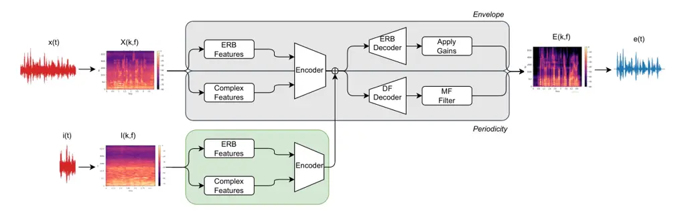

# DFingerNet: Noise-Adaptive Speech Enhancement for Hearing Aids

Iosif Tsangko Affiliation: CHI – Chair of Health Informatics, Technical
University of Munich, Germany Affiliation: MCML – Munich Center for
Machine Learning, Munich, Germany Email: <iosif.tsangko@tum.de>   
Andreas Triantafyllopoulos ^(†)^(†)thanks: ^(\*)Equal contribution
Affiliation: MCML – Munich Center for Machine Learning, Munich, Germany
   Michael Müller Affiliation: WS Audiology, Research and Development,
Erlangen, Germany    Hendrik Schröter Affiliation: WS Audiology,
Research and Development, Erlangen, Germany    Björn W. Schuller
Affiliation: EIHW – Chair of Embedded Intelligence for Health Care and
Wellbeing, University of Augsburg, Germany Affiliation: CHI – Chair of
Health Informatics, Technical University of Munich, Germany
Affiliation: MCML – Munich Center for Machine Learning, Munich, Germany
Affiliation: GLAM – Group on Language, Audio, & Music, Imperial College
London, UK Affiliation: MDSI – Munich Data Science Institute, Munich,
Germany

###### Abstract

The DeepFilterNet (DFN) architecture was recently proposed as a deep
learning model suited for hearing aid devices. Despite its competitive
performance on numerous benchmarks, it still follows a
‘one-size-fits-all’ approach, which aims to train a single, monolithic
architecture that generalises across different noises and environments.
However, its limited size and computation budget can hamper its
generalisability. Recent work has shown that in-context adaptation can
improve performance by conditioning the denoising process on additional
information extracted from background recordings to mitigate this. These
recordings can be offloaded outside the hearing aid, thus improving
performance while adding minimal computational overhead. We introduce
these principles to the DFN model, thus proposing the DFingerNet (DFiN)
model, which shows superior performance on various benchmarks inspired
by the DNS Challenge.

###### Index Terms: 

Speech Enhancement, Speech Denoising, Hearing Aids, Deep Learning,
Context Adaptation

## I Introduction

Hearing aids (HAs) enhance auditory perception and quality of life among
those with hearing impairments \[1\], particularly in challenging, noisy
environments. They aim to distinguish between speech and noise,
enhancing the former while suppressing the latter, thereby allowing
wearers to participate in conversations even in busy settings like
restaurants – the well-known *cocktail party problem* \[2\]. Speech
enhancement (SE) is arguably one of the core modules of HA devices, with
real-time approaches traditionally depending on statistical
models \[3\]. In recent years, data-driven deep learning models trained
on large datasets have shown significant promise in speech enhancement
(SE) tasks \[4, 5, 6, 7, 8\]. While modern deep neural networks (DNN)
architectures yield improved results, their computational complexity can
challenge the real-time processing capacities of HAs, with the number of
parameters and operations being prohibitive for the capabilities of most
contemporary HAs \[9\]. This has led to the introduction of more
lightweight DNN models \[10, 11\], including the DFN family of
models \[12, 13\], which also offers a version optimised for HA
devices \[14\].

However, standard DNN SE models struggle to adapt dynamically to varied
acoustic environments because they are statically trained and deployed
without considering changing background noise conditions. Such
monolithic approaches can hamper generalisation, especially in cases
where the mismatch between the training and deployment environments is
large \[15, 16\]. Adaptive methods, such as ones relying on noise
“fingerprints” have shown promise in improving SE performance and
adaptability to new, unseen environments \[17, 18\]. These methods rely
on capturing knowledge about the background noise during deployment to
adapt the denoising process of an SE model \[19\] (similar to the
estimation of noise characteristics needed by traditional algorithms
like the Wiener filter \[20, 21\]).

Though promising, these methods have only been applied to large SE
models whose size is prohibitive for HAs. In the present contribution,
we aim to bridge this gap by adopting this approach for a contemporary
DNN architecture optimised for HA use, namely DFN \[14\]. Specifically,
we investigate different architectural choices for injecting information
about the background noise (in the form of noise fingerprints). We
further go beyond prior work by investigating whether this noise
conditioning can be _selectively_ turned on and off without changing the
underlying model, and leverage the pretrained weights of an existing
model to boost performance. This results in an optional add-on component
meant to enhance the performance of an existing SE model only when
desirable – rather than resulting in a new model which substitutes the
old one. This added flexibility is desirable in the complex HA scenario
where calibration to the end-user is paramount for user satisfaction.
Finally, we include an analysis of edge-cases for fingerprint
conditioning that sheds more light on the workings of this mechanism
that have not yet been investigated in prior work.



Fig. 1: Architecture of the DFiN: The model processes input noise and
noisy fingerprint through separate encoders for ERB and complex
features. After fusion (Eq. 5), the features are decoded by respective
ERB and DF decoders. The decoded ERB features are used to apply gains,
while the noisy spectrum is filtered using MF filters. Combining gains
with the filtered spectrum results in the enhanced spectrum estimate
$`E`$, which is inverted to produce $`e(t)`$.

## II Methodology

In this section, we describe the methodology used in our study, focusing
on the model architecture, the integration of noise-conditioning
fingerprints, and our evaluation protocol.

Base model: The model architecture is based on DFN, incorporating a
proprietary HA filter bank for feature extraction. The HA-optimised
version of DFN \[14\] employs a two-stage SE framework. The first stage
operates in the equivalent rectangular bandwidth (ERB) domain to recover
the speech envelope, while the second stage uses multi-frame (MF)
filtering \[22, 23\] to enhance the periodic components of speech up to
4 kHz. It employs a 24 kHz uniform polyphase HA filter bank \[24\]
instead of the traditional Short-Time Fourier Transform (STFT), allowing
integration into hearing aids.

DFingerNet (DFiN): The conceptual framing of our contribution is as
follows. We assume the presence of additive noise uncorrelated to
speech:

```math
x(t)=s(t)+n(t)\Rightarrow X(k,f)=S(k,f)+N(k,f), \tag{1}
```

where $`X(k,f),S(k,f)`$ and $`N(k,f)`$ are the time-frequency
representations of the time domain signals $`x(t),s(t)`$, $`n(t)`$
respectively, and $`k`$, $`f`$ are the time and frequency indices. The
goal of the original DFN model is to directly provide an estimate
$`\tilde{S}`$ of the clean spectrum $`S`$ given the noisy spectrum
$`X`$.

Our main goal is to enhance denoising by utilising a _fingerprint_
recording of the noise environment, $`i(t)`$. Importantly, $`i(t)`$ is
not identical $`n(t)`$, but is recorded in the same environment as
$`n(t)`$, thus sharing the same _noise profile_. By injecting this
additional information into the main denoising model, we aim to improve
its denoising capabilities.

In detail, the encoder used by Schröter et al. \[12, 25\] processes the
input $`X(k,f)`$ in two separate streams, producing ERB and complex
features $`X_{erb}(k,f),X_{df}(k,f)`$, which are combined into an
embedding (Fig. 1, gray box). We call this encoder
$`\mathcal{F}_{main}(\cdot)`$ and its output
$`\mathcal{E}_{main}(k,f^{\prime})`$. Our model includes a new module:
the fingerprint encoder $`\mathcal{F}_{fing}(\cdot)`$ (Fig. 1, green
box). It processes the fingerprint spectra $`\mathcal{I}(k,f)`$, where
$`k`$ denotes the time axis of the fingerprint and $`f`$ its frequency
axis (which are, in general, different to the time axis of the main
input). Consequently, we have the following encoded embeddings:

```math
\mathcal{E}_{main}(k,f^{\prime})=\mathcal{F}_{\text{enc}}\left(X_{\text{erb}}(k,f),X_{\text{df}}(k,f)\right) \tag{2}
```

```math
\mathcal{E}_{fing}(k,f^{\prime})=\mathcal{F}_{fing}\left(\mathcal{I}_{\text{erb}}(k,f),\mathcal{I}_{\text{df}}(k,f)\right), \tag{3}
```

where, for simplicity, we assume that the feature dimension of
$`\mathcal{F}_{fing}(\cdot)`$ is identical to the feature dimension of
$`\mathcal{F}_{main}(\cdot)`$ (in practice, this alignment can be
achieved straightforwardly using a linear projection layer). Finally, we
fuse the two embeddings and derive the final one which will be processed
further. The process is as follows:

```math
\mathcal{E}(k,f^{\prime})=g(\mathcal{E}_{main}(k,f^{\prime}),\mathcal{E}_{fing}(k^{\prime},f^{\prime}))\text{,} \tag{4}
```

where $`g`$ is a fusion function. In the simplest case, $`g`$ takes the
form of additive fusion of the $`\mathcal{E}_{fing}`$ embeddings,
averaged over time, or concretely:

```math
\mathcal{E}(k,f^{\prime})=\mathcal{E}_{main}(k,f^{\prime})+\frac{1}{K}\sum_{l\leq K}\mathcal{E}_{fing}(l,f^{\prime})\text{,} \tag{5}
```

where $`K`$ is the total duration of the fingerprint (in frames). As
discussed below, we additionally experiment with attention-based fusion
of the two time-series using multihead attention. Finally, we process
this embedding with the DFN decoder \[12\] to estimate the enhanced
audio signal. Model variants: We explore several model variants to
assess their performance under different conditions:

DFiN:  
the simplest version of our model, where the fingerprint encoder
architecture is identical to that of the main network, but randomly
initialised.

DFiN-SI:  
same as above, but the fingerprint encoder is initialised to the same
pretrained state as the main encoder, but then trained independently.

DFiN-SE:  
fingerprint encoder weights are additionally coupled to those of the
main encoder, i. e., the same encoder is applied to both inputs. This
has the advantage of further decreasing the memory footprint and
optionally allowing the fingerprint encoder to be run on the HA device
itself.

DFiN-Cnn14:  
uses a pretrained Cnn14 model \[26\] (trained for audio tagging on
AudioSet) instead of a DFN-like encoder.

DFiN-XAtt:  
the additive fusion is replaced by cross-attention (where we use
$`\mathcal{E}_{main}`$ as query and $`\mathcal{E}_{fing}`$ as keys and
values \[27\]). This aligns the frames in $`\mathcal{E}_{fing}`$ with
$`\mathcal{E}_{main}`$ (conceptually similar to time warping) by
summarising the embedding before adding them to $`\mathcal{E}_{main}`$.
We use a multihead attention with 4 heads, followed by a feed-forward
layer and adding a residual connection.

We note that the main encoder $`\mathcal{F}_{main}(\cdot)`$ is always
initialised from the original pretrained state of \[14\]. In preliminary
experiments, this was found to be always beneficial compared to training
from scratch and allows us to leverage the longer training of the DFN
model; the same is true for the decoder. Moreover, all the model
variants except DFiN-XAtt feature the simple additive fusion described
in Eq. 5.

Training dataset: Addressing the need for robust evaluation of speech
enhancement models, this study utilises diverse datasets and innovative
mixing techniques to simulate real-world scenarios. We adapted the
mixing scripts of the DNS dataset \[28\] to mix only one speech signal
with only one noise sample while additionally cropping the initial 1 s
of the noise sample to be used as the fingerprint, similar to \[17\]
(code for the dataset creation will be released after the review
period). Thus, each sample in our training dataset consists of a clean
speech signal, a noise signal split into the fingerprint (first 1 s) and
noise to be used for mixing (rest), and the mixture (generated with a
random SNR in the range \[-5, 20\]). In our approach, we utilised the
entire speech dataset for the training process to ensure the model was
exposed to a diverse set of vocal inputs. However, for noise sampling,
we selectively drew from the AudioSet \[29\] dataset. This strategy was
intentionally adopted to reserve other noise datasets, specifically
ESC-50, FSD50K, and DEMAND, for evaluation purposes. By doing so, we
maintained a clear separation between training and evaluation noise
sources, enabling a more rigorous and unbiased assessment of model
performance during testing.

Hyperparameters: We use the same set of hyperparameters, including
learning rate, batch size, and number of layers, as the DFN
model \[14\]. All models are fine-tuned for 30 epochs using a dataset of
50,000 samples.

Evaluation datasets¹¹ 1
https://github.com/ATriantafyllopoulos/dns-custom-mixtures: For a
comprehensive evaluation, we used the VoiceBank corpus (VCTK) \[30\] for
clean speech and combined it with noise from the DEMAND \[31\],
FSD50k \[32\], and ESC-50 \[33\] datasets; we refer to these datasets as
VCTK-DEMAND and VCTK-FSD, respectively, in the following sections. We
created new test sets by mixing noise and speech at various
signal-to-noise ratios (SNRs), ranging from -15 dB to 25 dB, to test the
model’s robustness across different noise intensities and categories.

Specifically, for the VCTK-FSD test set, we selected the top 20 longest
files from the over 200 noise categories in FSD50k and mixed these with
random VCTK speech files at SNRs ranging from -5 to 5 dB. This approach
assesses the system’s granularity in handling various noise categories.
We also revisited the classic setup with the VCTK-DEMAND dataset. Here,
we mixed original VoiceBank speech with noise captured from the last
seconds of the recordings used in the original VCTK-DEMAND dataset and
examined the robustness to fingerprint mismatches by using noise
fingerprints from _different_ past time points, ranging from 3 to 120
seconds earlier (Fig. 2). These datasets and mixing strategies test the
model’s adaptability to different noise types and intensities,
rigorously evaluating its real-world effectiveness.

We also utilised all ‘fold-0’ files from ESC-50, encompassing 400 files
across 50 noise categories, to create a test set called VCTK-ESC. Each
noise file was mixed with a random VCTK speech sample, targeting
comprehensive evaluation against different SNRs.

|                                               |                       |                     |                     |                     |
| --------------------------------------------- | --------------------- | ------------------- | ------------------- | ------------------- |
| Model                                         | SI-SDR ($`\uparrow`$) | PESQ ($`\uparrow`$) | STOI ($`\uparrow`$) | PMOS ($`\uparrow`$) |
| _Mixture_                                     | -4.70                 | 1.21                | 0.70                | 2.34                |
| _Improvement over noisy mixture ($`\Delta`$)_ |                       |                     |                     |                     |
| DFN                                           | 10.84                 | 0.31                | 0.05                | 0.48                |
| DFiN                                          | 11.35                 | 0.39                | 0.07                | 0.54                |
| DFiN-SE                                       | 11.05                 | 0.39                | 0.06                | 0.53                |
| DFiN-SI                                       | 9.36                  | 0.25                | 0.05                | 0.49                |
| DFiN-Cnn14                                    | 11.23                 | 0.40                | 0.07                | 0.55                |
| DFiN-XAtt                                     | 11.31                 | 0.36                | 0.07                | 0.55                |

TABLE I: Performance comparison of the DFN, DFiN, DFiN-SE, DFiN-SI,
DFiN-Cnn14, and DFiN-XAtt models on the VCTK-FSD dataset. The top row
shows metrics computed on noisy speech before denoising; the bottom part
of the table shows improvement of enhanced over noisy speech.

Evaluation metrics: To evaluate the performance of the models, we use
several standard metrics: Scale-Invariant Signal-Distortion Ration
(SI-SDR) \[34\], Short-Time Objective Intelligibility (STOI) \[35\]
which measures speech intelligibility, and Perceptual Evaluation of
Speech Quality (PESQ) \[36\]; for each of them, we compute the
difference ($`\Delta`$) between noisy and enhanced speech. We also
consider DNSMOS \[37\] to estimate machine-learning-based Mean Opinion
scores (MOS), specifically focusing on the P808 Model, which predicts
human listening experience based on ITU-T P.808 ratings.

Selective Fingerprint Use: As mentioned, we are interested in making the
use of fingerprints _optional_ in order to accumulate scenarios where
they cannot be reliably obtained. To evaluate the model’s robustness in
such cases, we disable fingerprints during inference by setting
$`\mathcal{E}=\mathcal{E}_{\text{main}}`$ in Eq. 4.

|                        |                       |                |                |
| ---------------------- | --------------------- | -------------- | -------------- |
| Model                  | $`\Delta`$SI-SDR (dB) | $`\Delta`$PESQ | $`\Delta`$STOI |
| _Without Fingerprints_ |                       |                |                |
| DFiN                   | 10.63                 | 0.36           | 0.07           |
| DFiN-Sel               | 11.11                 | 0.40           | 0.07           |
| _With Fingerprints_    |                       |                |                |
| DFiN                   | 11.35                 | 0.39           | 0.07           |
| DFiN-Sel               | 11.34                 | 0.42           | 0.07           |

TABLE II: Comparison of DFiN with DFiN-Sel on the VCTK-FSD dataset
illustrating the superiority of training with randomly deactivate
embeddings when tested both with and without noise fingerprints.

To prevent a mismatch between training and inference, we also trained
one additional model where fingerprints were used in a fraction $`p`$ of
the training iterations and were omitted in the remaining $`1-p`$
iterations. Specifically, we experimented with $`p=0.5`$ ($`50\%`$ of
batches with fingerprints). To counterbalance the fact that the
fingerprint encoder sees $`50\%`$ less gradient updates in this setup,
we additionally doubled the number of training iterations to $`60`$
epochs. We denote this model as DFiN-Sel.

Stress tests: Finally, in order to estimate upper and lower bounds of
performance when using fingerprints, we perform the following stress
tests: a) we set fingerprints identical to the speech that needs to be
enhanced (lower bound); this adversarial input establishes the
worst-case scenario where the noise that needs to be removed is equated
with the speech that needs to be preserved; and b) we set fingerprints
identical to the noise that needs to be removed, thus giving the
complete information to the model (upper bound).

|              |                       |                |                |
| ------------ | --------------------- | -------------- | -------------- |
| Fingerprints | $`\Delta`$SI-SDR (dB) | $`\Delta`$PESQ | $`\Delta`$STOI |
| Clean speech | 10.61                 | 0.36           | 0.06           |
| Noise signal | 11.46                 | 0.39           | 0.07           |

TABLE III: Stress tests for our proposed DFiN model on the VCTK-FSD
dataset when using the ground truth clean (lower bound) or noisy (upper
bound) signals as fingerprints.

## III Results

Our main results are shown in Table I, which provides a performance
comparison of the DFN, DFiN, DFiN-SE, DFiN-SI, DFiN-Cnn14, and DFiN-XAtt
models on the VCTK-FSD dataset. The top row shows metrics computed
before denoising; on average, our data features an SI-SDR of
$`-4.70`$ dB, showcasing the challenging nature of the dataset, with
PESQ being $`1.21`$ and STOI $`0.70`$, indicating that subjective
perceptual quality and intelligibility are also hampered. Enhancement
results indicate that DFiN achieves the highest scores in most metrics,
with a $`\Delta`$SI-SDR of $`11.35`$ dB, $`\Delta`$PESQ of $`0.39`$, and
$`\Delta`$STOI of $`0.07`$. Its superiority over the baseline DFN is
further shown when computing non-intrusive ITU-T P.808 scores, with DFiN
scoring $`2.88`$ and DFN $`2.83`$.

Fig. 2: Stability analysis of the DFiN model on the VCTK-DEMAND dataset,
showing $`\Delta`$SI-SDR as a function of the time difference (in
seconds) between the noise mixture and noise fingerprints.

Random initialisation of the fingerprint encoder yields better
performance than initialising with the same weights as the main encoder
(DFiN-SI); this is expected as the fingerprint encoder is meant to focus
on properties of the sound, whereas the main encoder has been trained to
distinguish between background noise and speech. Surprisingly, coupling
the two encoders by sharing their weights (DFiN-SE) recovers some of the
lost performance; this counterintuitive observation warrants further
scrutiny in follow-up work. We additionally note that using a model
pretrained for audio tagging on AudioSet (DFiN-Cnn14) results in
marginally worse performance; while this could be a side-effect of the
particular architecture we used, it suggests that audio tagging alone is
insufficient for improvement, though it still outperforms the baseline.
Finally, the more sophisticated fusion mechanism employed in DFiN-XAtt
does not result in further gains, scoring marginally below DFiN despite
the added computational overhead (it needs to run on-device) and the
fact that it cannot be easily translated into a streaming operator (the
softmax operation depends on the elements that are included; we include
all frames in our implementation, which makes it non-causal). Thus, our
conclusion is that the simplest possible setup (using an identical,
randomly-initialised encoder and additive fusion) shows to be the most
effective.

Selective fingerprint use: Table II shows the performance of DFiN when
fingerprints are deactivated during inference (the addition of
embeddings is omitted). Performance degrades to a $`\Delta`$SI-SDR of
$`10.63`$ dB, lower than the baseline performance of DFN ($`10.84`$ dB),
suggesting that naively disabling fingerprints during inference can be
harmful. However, when this selective disabling is also used during
training, as in DFiN-Sel, performance degrades more moderately
($`11.11`$ dB) while the model retains an almost identical result with
fingerprints actively used ($`11.34`$ dB).

Stress tests: Table III shows the behaviour of DFiN under two extreme
adaptation scenarios. Using the original clean speech signal leads to a
substantial performance drop ($`10.61`$ dB), simulating the case where
erroneous fingerprints occur (e. g., due to an underperforming voice
activity detection module which identifies background noise).
Conversely, supplying the noise signal used for the mixing, results in a
slight performance boost ($`11.46`$ dB).

Robustness to distribution shift: The DFiN model was additionally
evaluated using the DEMAND dataset across various conditioning
scenarios, as shown in  Fig. 2. It illustrates the $`\Delta`$SI-SDR
performance of DFiN when using fingerprints from different parts of the
background noise environment, taken at increasing distances from the
section of the noise file used to generate the mixture. In practice, we
observe minimal degradation even when fingerprints are taken up to 2
minutes before the noisy mixture is created, highlighting that – for
relatively stable background noise conditions – fingerprints can be
obtained at sparse intervals. These findings suggest that fingerprint
embeddings can be extracted on a different device (such as a smartphone
or smartwatch) and then streamed to the hearing aid, seamlessly
incorporating them into the system with minimal overhead. We note that
the base DFN model outperformed DFiN on this dataset, achieving a
$`\Delta`$SI-SDR of 11.85. This is likely because DFN’s simpler
architecture is better suited to the consistent noise conditions in
DEMAND. In contrast, DFiN is optimised for dynamic environments, where
its adaptive mechanisms excel.

Fig. 3: Evaluation on the high-level categories of the classes in the
ESC dataset. The radar chart illustrates the $`\Delta`$SI-SDR
performance boost across these high-level categories achieved by our
model (DFiN) compared to the baseline (DFN).

Generalisation across noise categories: The VCTK-ESC test set allows for
a more granular analysis of model performance with respect to different
noise categories. Fig. 3 presents $`\Delta`$SI-SDR for the 5 high-level
categories of ESC-50, with DFiN outperforming the baseline DFN across
all high-level categories. Interestingly, this granular presentation of
results allows us to uncover shortcomings of the original DFN model
(which DFiN inherits), as performance varies substantially across
different categories, with “exterior/urban noises” and “animal sounds”
showing the worst performance. This may be a side-effect of the training
data (e. g., an underrepresentation of these categories) and warrants
closer investigation in future work.

## IV Conclusion

In this work, we have introduced the DFiN model, which extends the DFN
architecture by adding an adaptation module relying on noise
fingerprints to enhance speech clarity. Our approach demonstrates that
noise adaptation can be attached to a pretrained model as an extra,
optional step to improve performance. Importantly, robustness to
slow-changing background environments shows that the method adds minimal
computational overhead, as the fingerprint encoder can be run
off-device, which is vital given the restrictions of hearing aid
devices.

Future work could investigate the combination of noise-adaptation with
the now standard speaker-adaptation \[38, 39\] used to personalise
denoising, as well as understand the training dynamics of the original
DFN model to overcome its underperformance on certain kind of noises.

## References

- \[1\] S. Kochkin, “Marketrak viii: The efficacy of hearing aids in
  achieving compensation equity in the is workplace,” _The Hearing
  Journal_, vol. 63, no. 10, pp. 19–24, 2010.
- \[2\] E. C. Cherry, “Some experiments on the recognition of speech,
  with one and with two ears,” _The Journal of the acoustical society of
  America_, vol. 25, no. 5, pp. 975–979, 1953.
- \[3\] Y. Ephraim and D. Malah, “Speech enhancement using a
  minimum-mean square error short-time spectral amplitude estimator,”
  _IEEE Transactions on acoustics, speech, and signal processing_,
  vol. 32, no. 6, pp. 1109–1121, 1984.
- \[4\] S. Pascual, A. Bonafonte, and J. Serra, “Segan: Speech
  enhancement generative adversarial network,” _arXiv preprint
  arXiv:1703.09452_, 2017.
- \[5\] M. Milling, S. Liu, A. Triantafyllopoulos, I. Aslan, and B. W.
  Schuller, “Audio enhancement for computer audition–an iterative
  training paradigm using sample importance,” _arXiv preprint
  arXiv:2408.06264_, 2024.
- \[6\] Y. Hu, Y. Liu, S. Lv, M. Xing, S. Zhang, Y. Fu, J. Wu, B. Zhang,
  and L. Xie, “Dccrn: Deep complex convolution recurrent network for
  phase-aware speech enhancement,” _arXiv preprint
  arXiv:2008.00264_, 2020.
- \[7\] S. S. Shetu, S. Chakrabarty, O. Thiergart, and E. Mabande,
  “Ultra low complexity deep learning based noise suppression,” in
  _ICASSP 2024-2024 IEEE International Conference on Acoustics, Speech
  and Signal Processing (ICASSP)_. IEEE, 2024, pp. 466–470.
- \[8\] H. Schröter, T. Rosenkranz, A.-N. Escalante-B, and A. Maier,
  “Low latency speech enhancement for hearing aids using deep
  filtering,” _IEEE/ACM Transactions on Audio, Speech, and Language
  Processing_, vol. 30, pp. 2716–2728, 2022.
- \[9\] Y. Luo and N. Mesgarani, “Conv-tasnet: Surpassing ideal
  time–frequency magnitude masking for speech separation,” _IEEE/ACM
  transactions on audio, speech, and language processing_, vol. 27,
  no. 8, pp. 1256–1266, 2019.
- \[10\] J.-M. Valin, U. Isik, N. Phansalkar, R. Giri, K. Helwani, and
  A. Krishnaswamy, “A perceptually-motivated approach for
  low-complexity, real-time enhancement of fullband speech,” in
  _INTERSPEECH_, 2020, pp. 2482–2486.
- \[11\] J.-M. Valin, “A hybrid dsp/deep learning approach to real-time
  full-band speech enhancement,” in _2018 IEEE 20th international
  workshop on multimedia signal processing (MMSP)_. IEEE, 2018, pp. 1–5.
- \[12\] H. Schröter, A. N. Escalante-B, T. Rosenkranz, and A. Maier,
  “Deepfilternet: A low complexity speech enhancement framework for
  full-band audio based on deep filtering,” in _ICASSP 2022-2022 IEEE
  International Conference on Acoustics, Speech and Signal Processing
  (ICASSP)_. IEEE, 2022, pp. 7407–7411.
- \[13\] H. Schröter, A. N. Escalante-B., T. Rosenkranz, and A. Maier,
  “Deepfilternet: Perceptually motivated real-time speech enhancement,”
  in _INTERSPEECH_, 2023, pp. 2008–2009.
- \[14\] H. Schröter, T. Rosenkranz, A. N. Escalante-B., and A. Maier,
  “Deep multi-frame filtering for hearing aids,” in _INTERSPEECH_, 2023,
  pp. 3869–3873.
- \[15\] A. Li, W. Liu, X. Luo, G. Yu, C. Zheng, and X. Li, “A
  simultaneous denoising and dereverberation framework with target
  decoupling,” in _INTERSPEECH_, 2021, pp. 2801–2805.
- \[16\] D. Wang and J. Chen, “Supervised speech separation based on
  deep learning: An overview,” _IEEE/ACM transactions on audio, speech,
  and language processing_, vol. 26, no. 10, pp. 1702–1726, 2018.
- \[17\] G. Keren, J. Han, and B. Schuller, “Scaling speech enhancement
  in unseen environments with noise embeddings,” in _5th International
  Workshop on Speech Processing in Everyday Environments (CHiME)_, 2018,
  pp. 25–29.
- \[18\] S. Liu, G. Keren, E. Parada-Cabaleiro, and B. Schuller,
  “N-hans: A neural network-based toolkit for in-the-wild audio
  enhancement,” _Multimedia Tools and Applications_, vol. 80, no. 18,
  pp. 28 365–28 389, 2021.
- \[19\] D. S. Williamson, Y. Wang, and D. Wang, “Complex ratio masking
  for monaural speech separation,” _IEEE/ACM transactions on audio,
  speech, and language processing_, vol. 24, no. 3, pp. 483–492, 2015.
- \[20\] M. Aubreville, K. Ehrensperger, A. Maier, T. Rosenkranz,
  B. Graf, and H. Puder, “Deep denoising for hearing aid applications,”
  in _2018 16th International Workshop on Acoustic Signal Enhancement
  (IWAENC)_. IEEE, 2018, pp. 361–365.
- \[21\] H. Schröter, T. Rosenkranz, A. Escalante-B., P. Zobel, and
  A. Maier, “Lightweight online noise reduction on embedded devices
  using hierarchical recurrent neural networks,” in _INTERSPEECH_, 2020,
  pp. 1121–1125.
- \[22\] W. Mack and E. A. Habets, “Deep filtering: Signal extraction
  and reconstruction using complex time-frequency filters,” _IEEE Signal
  Processing Letters_, vol. 27, pp. 61–65, 2019.
- \[23\] Y. A. Huang and J. Benesty, “A multi-frame approach to the
  frequency-domain single-channel noise reduction problem,” _IEEE
  Transactions on Audio, Speech, and Language Processing_, vol. 20,
  no. 4, pp. 1256–1269, 2011.
- \[24\] R. W. Bäuml and W. Sörgel, “Uniform polyphase filter banks for
  use in hearing aids: design and constraints,” in _2008 16th European
  Signal Processing Conference_. IEEE, 2008, pp. 1–5.
- \[25\] H. Schröter, A. Maier, A. N. Escalante-B, and T. Rosenkranz,
  “Deepfilternet2: Towards real-time speech enhancement on embedded
  devices for full-band audio,” in _2022 International Workshop on
  Acoustic Signal Enhancement (IWAENC)_. IEEE, 2022, pp. 1–5.
- \[26\] Q. Kong, Y. Cao, T. Iqbal, Y. Wang, W. Wang, and M. D.
  Plumbley, “Panns: Large-scale pretrained audio neural networks for
  audio pattern recognition,” _IEEE/ACM Transactions on Audio, Speech,
  and Language Processing_, vol. 28, pp. 2880–2894, 2020.
- \[27\] A. Vaswani, “Attention is all you need,” _Advances in Neural
  Information Processing Systems_, 2017.
- \[28\] C. K. Reddy, V. Gopal, R. Cutler, E. Beyrami, R. Cheng,
  H. Dubey, S. Matusevych, R. Aichner, A. Aazami, S. Braun, P. Rana,
  S. Srinivasan, and J. Gehrke, “The interspeech 2020 deep noise
  suppression challenge: Datasets, subjective testing framework, and
  challenge results,” pp. 2492–2496, 2020.
- \[29\] J. F. Gemmeke, D. P. Ellis, D. Freedman, A. Jansen,
  W. Lawrence, R. C. Moore, M. Plakal, and M. Ritter, “Audio set: An
  ontology and human-labeled dataset for audio events,” in _2017 IEEE
  international conference on acoustics, speech and signal processing
  (ICASSP)_. IEEE, 2017, pp. 776–780.
- \[30\] C. Veaux, J. Yamagishi, and S. King, “The voice bank corpus:
  Design, collection and data analysis of a large regional accent speech
  database,” in _2013 international conference oriental COCOSDA held
  jointly with 2013 conference on Asian spoken language research and
  evaluation (O-COCOSDA/CASLRE)_. IEEE, 2013, pp. 1–4.
- \[31\] J. Thiemann, N. Ito, and E. Vincent, “The diverse environments
  multi-channel acoustic noise database (demand): A database of
  multichannel environmental noise recordings,” in _Proceedings of
  Meetings on Acoustics_, vol. 19, no. 1. AIP Publishing, 2013.
- \[32\] E. Fonseca, X. Favory, J. Pons, F. Font, and X. Serra, “Fsd50k:
  an open dataset of human-labeled sound events,” _IEEE/ACM Transactions
  on Audio, Speech, and Language Processing_, vol. 30, pp.
  829–852, 2021.
- \[33\] K. J. Piczak, “Esc: Dataset for environmental sound
  classification,” in _Proceedings of the 23rd ACM international
  conference on Multimedia_, 2015, pp. 1015–1018.
- \[34\] J. Le Roux, S. Wisdom, H. Erdogan, and J. R. Hershey,
  “Sdr–half-baked or well done?” in _ICASSP 2019-2019 IEEE International
  Conference on Acoustics, Speech and Signal Processing (ICASSP)_. IEEE,
  2019, pp. 626–630.
- \[35\] C. H. Taal, R. C. Hendriks, R. Heusdens, and J. Jensen, “An
  algorithm for intelligibility prediction of time–frequency weighted
  noisy speech,” _IEEE Transactions on audio, speech, and language
  processing_, vol. 19, no. 7, pp. 2125–2136, 2011.
- \[36\] A. W. Rix, J. G. Beerends, M. P. Hollier, and A. P. Hekstra,
  “Perceptual evaluation of speech quality (pesq)-a new method for
  speech quality assessment of telephone networks and codecs,” in _2001
  IEEE international conference on acoustics, speech, and signal
  processing. Proceedings (Cat. No. 01CH37221)_, vol. 2. IEEE, 2001, pp.
  749–752.
- \[37\] C. K. Reddy, V. Gopal, and R. Cutler, “Dnsmos: A non-intrusive
  perceptual objective speech quality metric to evaluate noise
  suppressors,” in _ICASSP 2021-2021 IEEE International Conference on
  Acoustics, Speech and Signal Processing (ICASSP)_. IEEE, 2021, pp.
  6493–6497.
- \[38\] A. Sivaraman and M. Kim, “Zero-shot personalized speech
  enhancement through speaker-informed model selection,” in _2021 IEEE
  Workshop on Applications of Signal Processing to Audio and Acoustics
  (WASPAA)_. IEEE, 2021, pp. 171–175.
- \[39\] S. Kim, M. Athi, G. Shi, M. Kim, and T. Kristjansson,
  “Zero-shot test time adaptation via knowledge distillation for
  personalized speech denoising and dereverberation,” _The Journal of
  the Acoustical Society of America_, vol. 155, no. 2, pp.
  1353–1367, 2024.
