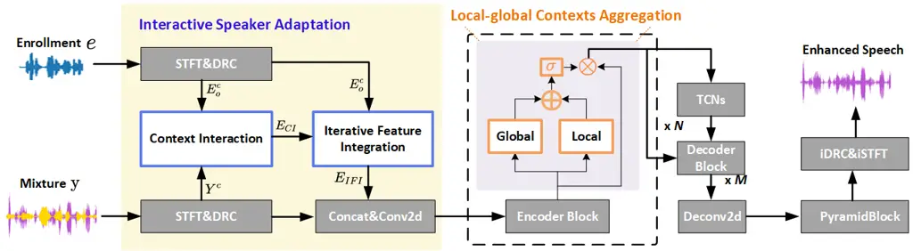
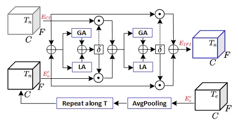
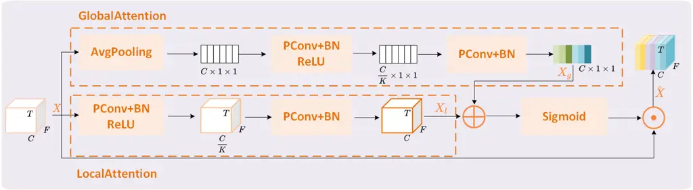
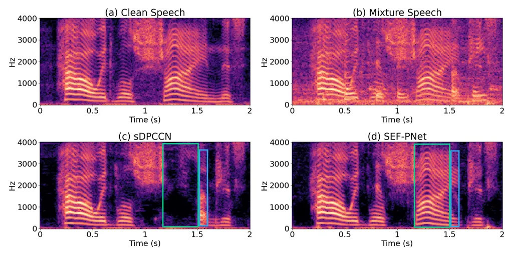

# SEF-PNet: Speaker Encoder-Free Personalized Speech Enhancement with Local and Global Contexts Aggregation Thanks: ^(⋆)Yanhua Long is the corresponding author. The work is supported by the National Natural Science Foundation of China (Grant No.62071302).

Ziling Huang¹, Haixin Guan², Haoran Wei³, Yanhua Long^(1⋆) Affiliation: 
Affiliation: ¹Shanghai Normal University, Shanghai, China, ²Unisound AI
Technology Co., Ltd., Beijing, China  
³Samsung Research America, Mountain View, USA

###### Abstract

Personalized speech enhancement (PSE) methods typically rely on
pre-trained speaker verification models or self-designed speaker
encoders to extract target speaker clues, guiding the PSE model in
isolating the desired speech. However, these approaches suffer from
significant model complexity and often underutilize enrollment speaker
information, limiting the potential performance of the PSE model. To
address these limitations, we propose a novel Speaker Encoder-Free PSE
network, termed SEF-PNet, which fully exploits the information present
in both the enrollment speech and noisy mixtures. SEF-PNet incorporates
two key innovations: Interactive Speaker Adaptation (ISA) and
Local-Global Context Aggregation (LCA). ISA dynamically modulates the
interactions between enrollment and noisy signals to enhance the speaker
adaptation, while LCA employs advanced channel attention within the PSE
encoder to effectively integrate local and global contextual
information, thus improving feature learning. Experiments on the
Libri2Mix dataset demonstrate that SEF-PNet significantly outperforms
baseline models, achieving state-of-the-art PSE performance. Our source
code is available at https://github.com/isHuangZiling/SEF-PNet.

###### Index Terms: 

Personalized Speech Enhancement, Speaker Encoder-free, LCA, SEF-PNet.



Fig. 1: Overview of the proposed SEF-PNet model. All colored blocks
highlight our key contributions over the original sDPCCN.



Fig. 2: Structure of the Iterative Feature Integration (IFI) included in
the ISA module. GA and LA represent Global Attention and Local
Attention, respectively, as designed in the LCA module in Fig.3.

## I Introduction

Personalized Speech Enhancement (PSE), also known as Target Speaker
Extraction, aims to extract and enhance the speech of a target speaker
in complex multi-talker noisy environments. Research interest in PSE has
grown significantly, driven by the specially designed PSE tracks in the
Deep Noise Suppression (DNS) Challenges \[1, 2\] over the past two
years, and its broad applications in real-time communication, speaker
diarization, etc. However, state-of-the-art PSE methods still rely on
pre-trained speaker verification models or additional self-designed
speaker encoders to generate target speaker cues from enrollment speech
\[3, 4, 5, 6, 7, 8\], which are crucial for guiding the PSE model in
extracting the desired speech. These methods not only increase model
parameters but also add complexity to PSE inference, limiting their
deployment in industrial scenarios. Therefore, developing PSE methods
that are free from speaker encoders or embeddings is both necessary and
essential.

In the literature, methods for extracting target speaker cues from
enrollment speech to guide PSE can be divided into three main
categories: 1) Pre-trained Speaker Verification Models: These methods
often use pre-trained models like ECAPA-TDNN\[9\] or ResNet34\[10\] to
extract target speaker embeddings from enrollment speech, which are then
transformed and fused with noisy mixture representations in PSE; 2)
Self-designed Speaker Encoders: These approaches utilize simple,
task-specific speaker encoders to extract and fuse representations from
enrollment speech \[12, 11, 13, 14, 15, 16\]; 3) Hierarchical Speaker
Fusion: This method combines embeddings from both pre-trained models and
self-designed encoders to guide the PSE network hierarchically in
extracting the desired speech \[8\]. Although these methods have
achieved great success in many PSE tasks, they suffer from significant
model complexity, including large model size and slow inference speed.
Moreover, embeddings from pre-trained models may not be optimal for PSE
guidance, while self-designed speaker encoders often lack generalization
ability to other PSE architectures. These limitations significantly
hinder the practical application of these methods in real-world
industry.

Therefore, recent research has begun to explore speaker embedding/
encoder-free PSE methods. For example, authors in \[17\] proposed a
fully weight-sharing encoder to capture information from both target
speaker enrollment speech and noisy mixtures. However, this approach is
model specifically tailored and face scalability issues. Similarly, the
work in \[18\] introduced direct interactions between the time-frequency
representations of enrollment and noisy speech, which, while achieving
good PSE performance, may still underutilize the target speaker
information in the enrollment speech, making it less than optimal.In
addition, current PSE models tend to underestimate the significance of
channel attention. Although some speech enhancement or separation
models\[19, 20, 21\] incorporate the squeeze-and-excitation modules
(SEblock)\[22\] or convolutional block attention module (CBAM)\[23\] to
enhance feature learning, these approaches primarily focus on global
information and tend to neglect the local features, thus limiting the
system performance.

Motivated by these observations, in this study, we propose a novel PSE
network, SEF-PNet, which is designed to effectively capture and learn
the information from both enrollment speech and input noisy mixtures.
Three main contributions are as follows: 1) Speaker Encoder/Embedding
Free: SEF-PNet operates without the need of pre-trained models or
self-designed speaker encoders, greatly simplifying the model
architecture; 2) Interactive Speaker Adaptation (ISA): ISA enables
target speaker adaptation within the PSE encoder through a dynamic
interactive manner, ensuring comprehensive information exploration via
context interaction and iterative feature integration between the
enrollment speech and noisy mixtures; 3) Local and Global Context
Aggregation (LCA): LCA improves high-level feature learning by
integrating local and global contexts across channels within
intermediate encoder representations. Our experiments are performed on
three differrent Libri2Mix PSE tasks\[24\], and results show that the
proposed SEF-PNet consistently outperforms strong baselines and achieves
competitive performance compared to other state-of-the-art PSE models.

## II Proposed Methods

In this section, we present the details of our proposed speaker
encoder/embedding-free PSE approach, including the SEF-PNet
architecture, the principle of the proposed interactive speaker
adaptation (ISA) and the local-global contexts aggregation (LCA).

### II-A Model Architecture

The structure of SEF-PNet, as illustrated in Fig.1, builds upon our
previous work, sDPCCN\[16\], which has already demonstrated competitive
performance in end-to-end TSE tasks. Using sDPCCN as the backbone, we
implemented several key modifications to achieve a speaker encoder-free
design. First, we removed the original speaker encoder module,
simplifying the architecture and focusing on the direct utilization of
enrollment speech, as shown in the ISA module (left part of Fig.1).
Second, we integrated the LCA module into the original Encoder Block to
exploit both local and global contextual information in the high-level
acoustic representations. In addition, we reduced the number of Encoder
Blocks from 7 to 6 and shortened the frame window length from 64ms to
32ms. These changes preserved the model’s performance while reducing its
size by approximately 0.7M parameters. The others remain consistent with
those in the original sDPCCN. Finally, as shown in Fig.1, in SEF-PNet,
the entire encoder now consists of an ISA adaptation module followed by
6 Encoder Blocks, each enhanced with the LCA module, significantly
boosting PSE performance while maintaining much lower model complexity.

### II-B Interactive Speaker Adaptation (ISA)

Our inspiration for the ISA comes from \[18\], which explores direct
context interaction (CI) between Short-Time Fourier Transform (STFT)
features of the enrollment speech and the input noisy mixture, using the
resulting noisy-adapted enrollment STFT features as the PSE guidance.
However, this direct speaker adaptation is heavily tailored to the input
mixture, which may underutilize important target speaker clues present
in the original enrollment speech. Therefore, as shown in the left part
of Fig.1, we propose an interactive speaker adaptation (ISA) in this
study. In the ISA, we enhance the STFT-based CI from \[18\] by
introducing an additional Iterative Feature Integration (IFI) module,
which enables soft adaptive weighting to balance the information derived
from original enrollment STFT and the noisy-adapted version. This
improvement provides better target speaker guidance, enhancing
SEF-PNet’s PSE performance.



Fig. 3: Structure of Local and Global Contexts Aggregation (LCA) module.

The CI module in ISA achieves a fully speaker encoder-free process
through simple matrix multiplication and its implementation can be
formulated as follows: Given the enrollment speech $`e`$ and noisy
mixture $`\mathrm{y}`$, they are first transformed into their T-F
representations $`\mathbf{E}`$ and $`\mathbf{Y}`$ by the STFT,
respectively, after applying dynamic range compression (DRC)\[25\], the
final compressed STFTs are defined as,

```math
\mathbf{\hat{Y}}^{c}=|\mathbf{Y}|^{\beta}e^{j\theta_{Y}}, \tag{1}
```

```math
\mathbf{\hat{E}}_{o}^{c}=|\mathbf{E}|^{\beta}e^{j\theta_{E}}, \tag{2}
```

where the DRC compressed factor $`\beta=0.5`$, $`\theta_{E}`$,
$`\theta_{Y}`$ are the phase of $`\mathbf{E}`$ and $`\mathbf{Y}`$,
respectively. Then the real and imaginary parts of
$`\mathbf{\hat{Y}}^{c}`$ and $`\mathbf{\hat{E}}_{o}^{c}`$ are
concatenated to form the $`\mathbf{Y}^{c}`$ and $`\mathbf{E}_{o}^{c}`$
as CI inputs,

```math
\mathbf{Y}^{c}=\left(\mathbf{\hat{Y}}_{R}^{c},\mathbf{\hat{Y}}_{I}^{c}\right),\ \ \ \mathbf{E}_{o}^{c}=\left(\mathbf{\hat{E}}_{oR}^{c},\mathbf{\hat{E}}_{oI}^{c}\right) \tag{3}
```

Next, the context interaction is performed by calculating the
noisy-adapted target speaker guidance $`\mathbf{E}_{CI}`$ using the
following equation,

```math
\mathbf{E}_{CI}=\texttt{softmax}\left(\mathbf{Y}^{c}\times(\mathbf{E}_{o}^{c})^{\mathrm{T}}\right)\times\mathbf{E}_{o}^{c} \tag{4}
```

where $`\mathrm{T}`$ is the matrix transpose.

Since the output of CI module, $`\mathbf{E}_{CI}`$, represents the
noisy-adapted representation of target speaker clues, may lead to
underutilization of the enrollment speech. Therefore, in the proposed
IFI module of ISA, we take both $`\mathbf{E}_{CI}`$ and the enrollment
$`\mathbf{E}_{o}^{c}`$ as inputs. As illustrated in Fig.2, to enhance
the global capture of target speaker cues, we first transform
$`\mathbf{E}_{o}^{c}`$ into $`\mathbf{E}^{\prime}_{o}`$. This is done by
first applying average pooling along the time frame dimension, followed
by repeating the resulting vector along the time dimension to match the
shape of $`\mathbf{E_{c}}`$. Next, a mask probability matrix
$`\mathbf{P}`$ is caculated as follows,

```math
\mathbf{P}=\sigma(\texttt{GA}(\mathbf{E}_{CI}+\mathbf{E}^{\prime}_{o})+\texttt{LA}(\mathbf{E}_{CI}+\mathbf{E}^{\prime}_{o})) \tag{5}
```

where $`\sigma(\cdot)`$ is the sigmoid activation function, GA and LA
represent the operations of Global Attention and Local Attention,
respectively, as designed in the LCA module in Fig.3. This mask
$`\mathbf{P}`$ is then used to adaptively weight $`\mathbf{E}_{CI}`$ and
$`\mathbf{E}^{\prime}_{o}`$, producing the output of the first round of
iterative feature integration, $`\mathbf{E}_{CI}^{o}`$:

```math
\mathbf{E}_{CI}^{o}=\mathbf{P}\odot\mathbf{E}_{CI}+(\mathbf{1}-\mathbf{P})\odot\mathbf{E}^{\prime}_{o} \tag{6}
```

where $`\odot`$ denotes element-wise multiplication. The second
iteration of feature integration then takes $`\mathbf{E}_{CI}^{o}`$ as
input, yielding the final output of the IFI module,
$`\mathbf{E}_{IFI}`$:

```math
\displaystyle\mathbf{E}_{IFI} \displaystyle=\sigma(\texttt{GA}(\mathbf{E}_{CI}^{o}+\texttt{LA}(\mathbf{E}_{CI}^{o})\odot\mathbf{E}_{CI} \tag{7}
```

```math
\displaystyle+(\mathbf{1}-\sigma(\texttt{GA}(\mathbf{E}_{CI}^{o}+\texttt{LA}(\mathbf{E}_{CI}^{o})))\odot\mathbf{E^{\prime}_{o}}
```

By combing context interaction with the interactive feature integration
in ISA, $`\mathbf{E}_{IFI}`$ effectively captures both the input noisy
acoustic characteristics and fully exploits the target speaker cues from
the enrollment speech, thereby providing comprehensive and improved
target speaker guidance for Personalized Speech Enhancement.

### II-C Local and Global Contexts Aggregation (LCA)

Fig.3 illustrates the architecture of LCA module, designed to enhance
the feature representation of the encoder in our SEF-PNet by capturing
both local and global contextual information. Given an input feature map
$`\mathbf{X}`$ with dimensions $`C\times T\times F`$, the LCA processes
it using two parallel attention paths: Global Attention (GA) and Local
Attention (LA). The operations of GA is shown in the upper part of
Fig.3. First, it utilizes average pooling (AvgPooling) across channels
to produce a feature map of size $`C\times 1\times 1`$. The pooled
feature is then passed through a point-wise convolution (PConv) layer,
followed by batch normalization (BN) and ReLU activation. This layer
reduces the dimensionality to $`C/K`$ channels. The output is
subsequently processed by another PConv+BN layer, resulting in the
global context vector $`\mathbf{X}_{g}`$. Simultaneously, in the LA
module (lower part of Fig.3), the input $`\mathbf{X}`$ undergoes a
similar transformation through a PConv+BN+ReLU operation, followed by a
PConv+BN layer to preserve local temporal patterns, producing the local
context feature map $`\mathbf{X}_{l}`$.

Next, LCA aggregates the contextual information through a fusion and
attention (FA) mechanism, followed by feature recalibration. In the FA,
$`\mathbf{X}_{l}`$ is combined with $`\mathbf{X}_{g}`$ through
element-wise addition. This fused representation is then passed through
a Sigmoid activation to generate an attention mask, which serves as the
core of the FA. Finally, in the feature recalibration step, the input
$`\mathbf{X}`$ is element-wise multipliedby the generated attention
mask, producing the recalibrated output $`\mathbf{\hat{X}}`$. This
output integrates both local and global contextual information,
enhancing the feature map of each encoder in SEF-PNet and facilitating
improved PSE performance.

## III Experiments and Results

### III-A Datasets

In this work, all our experiments are conducted on three public PSE
conditions from the Libri2Mix dataset \[24\]: 1) 1-speaker+noise
(mix_single): the mixture signal with only a single target speaker and
background noise; 2) 2-speaker (mix_clean): the mixture with a target
speaker and one interfering speaker without any additional noise. 3)
2-speaker+noise (mix_both): the mixture with a target speaker, one
interfering speaker and background noise. The mix\_\* names are original
PSE conditions in Libri2Mix, For clarity, we use the terms
‘1-speaker+noise’, ‘2-speaker’ and ‘2-speaker+noise’ as representative
labels instead of the original ones. In each condition, the training set
includes 13,900 utterances from 251 speakers, while both the development
and test sets contain 3,000 utterances from 40 speakers each, with all
mixtures simulated in the ‘minimum’ mode. All mixtures are resampled to
8 kHz. Note that only the first speaker is taken as the target speaker
during all training mixture data simulation (the same data preparation
as our baseline sDPCCN in \[16\] ), unless otherwise specified.

### III-B Models

The baseline model, sDPCCN \[16\], serves as the backbone of our
proposed SEF-PNet. Its primary structure includes a speaker encoder, 7
Encoder Blocks, and 7 corresponding Decoder Blocks, which are connected
by a TCNs module, followed by a PyramidBlock and a Deconv2d layer. Each
Encoder Block consists of a DenseBlock, 4 DenseEncoders, and 3
Conv2dBlocks. The TCNs module features two layers, each containing 10
TCN blocks. Each Decoder Block is composed of 3 Deconv2dBlocks, 4
DenseDecoders, and a DenseBlock. The PyramidBlock is constructed using
average pooling and four parallel conv2d + upsample operations, which
are concatenated to form the final output. Further details of the sDPCCN
model can be found in our previous work \[16\]. The structural and
detailed differences between our proposed SEF-PNet and the sDPCCN model
are discussed in Section II-A. In the ISA and LCA modules, all
convolutional kernels and strides are set to 1, with channel upsampling
or downsampling factors $`K=1/32`$ and $`K=4`$, respectively.

### III-C Configurations

We employ the Adam\[26\] optimizer with an initial learning rate of
0.0005. The learning rate is adjusted by multiplying it by 0.98 every
two epochs for the first 100 epochs and by 0.9 in the last 20 epochs.
Gradient clipping\[27\] is applied to limit the maximum L2-norm to 1.
The training procedure lasts for up to 120 epochs. The mdoel training
objective is to maximize the scale-invariant signal-to-distortion ratio
(SI-SDR) \[28\] between the enhanced and the ground-truth signals of the
target speaker.Three metrics: SI-SDR(dB), PESQ\[29\] and STOI (%)\[30\]
are used for evaluating our PSE system performance.

### III-D Ablation Results on Libri2Mix 2-speaker Condition

Table I presents the results of ablation study on the Libri2Mix
2-speaker PSE condition, highlighting the impact of each key component
proposed in the SEF-PNet model. Comparing S1 to S0, we observe that
replacing the speaker encoder in the sDPCCN with the CI module greatly
enhances performance across all metrics, even with the model size
reduced by 0.7M. Further improvements are observed in S2, where the
integration of the IFI module into S1 leads to notable performance
gains, suggesting that the combination of IFI and CI within the ISA
module effectively strengthens target speaker guidance.In addition, in
S3, the introduction of the LCA module demonstrates its effectiveness in
aggregating local and global contexts within the encoder. As a result,
the proposed SEF-PNet substantially outperforms the baseline S0, with
SI-SDR improving from 11.62 to 13.00, PESQ from 2.76 to 3.05, and STOI
from 87.19% to 89.71%.

|     |            |        |      |       |        |       |
| --- | ---------- | ------ | ---- | ----- | ------ | ----- |
| ID  | Methods    | SI-SDR | PESQ | STOI  | Params | MACs  |
| \-  | Mixture    | -0.03  | 1.60 | 71.38 | \-     | \-    |
| S0  | sDPCCN     | 11.62  | 2.76 | 87.19 | 6.63M  | 8.49G |
| S1  | DPCCN+CI   | 12.11  | 2.87 | 88.47 | 5.89M  | 8.37G |
| S2  | \+ IFI     | 12.81  | 2.93 | 89.68 | 5.89M  | 8.43G |
| S3  | ++ LCA     | 13.00  | 3.05 | 89.71 | 6.08M  | 8.50G |
|     | (SEF-PNet) |        |      |       |        |       |

TABLE I: Results on Libri2Mix 2-speaker PSE condition.

Table II compares the proposed LCA with the commonly used SEblock \[22\]
and CBAM \[23\] within the S1 configuration to examine their
effectiveness of different context aggregation methods on the Libri2Mix
2-speaker condition. The results show that the SEblock performs better
than CBAM, but our LCA outperforms both. This superiority may be
attributed to the fact that SEblock and CBAM primarily focus on
capturing global contexts, whereas the LCA is designed to aggregate
information at both local and global scales, enabling it to achieve the
best results.

|            |        |      |       |
| ---------- | ------ | ---- | ----- |
| Methods    | SI-SDR | PESQ | STOI  |
| S1         | 12.11  | 2.87 | 88.47 |
| \+ LCA     | 12.88  | 3.00 | 89.70 |
| \+ SEblock | 12.63  | 2.92 | 89.51 |
| \+ CBAM    | 12.50  | 2.91 | 89.08 |

TABLE II: Comparison with different context aggregation methods.

### III-E Condition-wise Results on Three PSE Conditions

Table III shows the performance of SEF-PNet compared to the baseline
sDPCCN on Libri2Mix three different PSE conditions. It’s clear to
observe that except for the similar performance on ‘1-speaker+noise’
condition, the proposed SEF-PNet consistently outperforms sDPCCN across
two other conditions with speaker interference, demonstrating its strong
effectiveness and generalization ability in enhancing diversity PSE
performance. Moreover, we see that both sDPCCN baseline and proposed
SEF-PNet perform well on ‘1-speaker+noise’ and ‘2-speaker’ PSE tasks,
and relatively poor on ‘2-speaker+noise’ condition. This is due to the
fact that ‘2-speaker+noise’ condition is more complicated than other two
conditions because the target speech is deteriorated by both interfering
speaker and noise.

|                 |          |        |      |       |
| --------------- | -------- | ------ | ---- | ----- |
| Condition       | Method   | SI-SDR | PESQ | STOI  |
| 1-speaker+noise | Mixture  | 3.27   | 1.75 | 79.51 |
|                 | sDPCCN   | 14.49  | 3.04 | 92.47 |
|                 | SEF-PNet | 14.50  | 3.05 | 92.47 |
| 2-speaker       | Mixture  | -0.03  | 1.60 | 71.38 |
|                 | sDPCCN   | 11.62  | 2.76 | 87.19 |
|                 | SEF-PNet | 13.00  | 3.05 | 89.71 |
| 2-speaker+noise | Mixture  | -2.03  | 1.43 | 64.65 |
|                 | sDPCCN   | 6.93   | 2.12 | 79.32 |
|                 | SEF-PNet | 7.54   | 2.14 | 80.58 |

TABLE III: Condition-wise results on three Libri2Mix PSE tasks.

### III-F Comparison with Existing Methods

Table IV demonstrates the performance comparison between our proposed
SEF-PNet and two other competitive state-of-the-art (SOTA) PSE methods
on the 2-speaker condition of Libri2Mix. To ensure a fair comparison
with SpEx+\[14\] and MC-SpEx\[15\], we trained the SEF-PNet model using
the same amount of simulated training data. During the training data
simulation, each speaker in the mixture was alternately treated as the
target speaker, doubling the size of the simulated training data
compared to what was used in Table I to Table III. From the results in
Table IV, it is clear that our proposed SEF-PNet achieves SOTA
performance across all evaluation metrics, while also having a
significantly smaller model size, highlighting its superiority over the
other two competitive methods.

|               |        |        |      |       |        |
| ------------- | ------ | ------ | ---- | ----- | ------ |
| Methods       | Params | SI-SDR | PESQ | STOI  | MACs   |
| Mixture       | \-     | 0.00   | 1.60 | 71.29 | \-     |
| SpEx+\[14\]   | 11.78M | 13.41  | 2.93 | \-    | 10.73G |
| MC-SpEx\[15\] | 10.77M | 14.61  | 3.19 | \-    | \-     |
| SEF-PNet      | 6.07M  | 14.61  | 3.19 | 91.75 | 8.50G  |

TABLE IV: Performance comparison with various existing PSE methods on
Libri2Mix 2-speaker condition (training data size $`\times 2`$).

### III-G Visualization

Fig.4 illustrates the comparison in spectrograms of the same noisy
mixture that randomly selected from the test set of the Libri2Mix
2-speaker+noise condition, enhanced by the sDPCCN baseline and our
proposed SEF-PNet. It is clear that SEF-PNet achieves better noise
suppression and more effective removal of interfering speakers compared
to sDPCCN, thereby enhancing the overall PSE performance.



Fig. 4: Spectrograms of (a) clean speech, (b) mixture speech, (c) sDPCCN
and (d) SEF-PNet.

## IV Conclusion

This paper introduces SEF-PNet, a Speaker Encoder/embedding-Free
Personalized Speech Enhancement network that eliminates the need for
complex speaker encoders or pre-trained speaker verification models. By
leveraging the proposed Interactive Speaker Adaptation (ISA) and
Local-Global Context Aggregation (LCA) mechanisms, SEF-PNet not only
performs excellent direct interactive target speaker adaptation, but
also effectively aggregates both local and global contextual information
during feature learning. Experimental results across three Libri2Mix PSE
conditions proved that SEF-PNet significantly outperforms our sDPCCN
baseline, achieving state-of-the-art performance with fewer parameters.
Our future work will focus on generalizing the proposed ISA and LCA
techniques to other PSE architectures and scaling them to larger
industry PSE tasks.

## References

- \[1\] H. Dubey, A. Aazami, V. Gopal, B. Naderi, S. Braunb, et al.,
  “ICASSP 2023 Deep Noise Suppression Challenge,” IEEE Open Journal of
  Signal Processing, 2024.
- \[2\] C. K. A Reddy, H. Dubey, V. Gopal, et al., “ICASSP 2021 Deep
  Noise Suppression Challenge,” in Proceedings of IEEE International
  Conference on Acoustics, Speech and Signal Processing (ICASSP), 2021,
  pp. 6623–6627.
- \[3\] Y. Ju, W. Rao, X. Yan, Y. Fu, et al., “TEA-PSE:
  Tencent-Ethereal-Audio-Lab Personalized Speech Enhancement System for
  ICASSP 2022 DNS Challenge,” in Proceedings of IEEE International
  Conference on Acoustics, Speech and Signal Processing (ICASSP), 2022,
  pp. 9291–9295.
- \[4\] Y. Ju, S. Zhang, W. Rao, et al., “TEA-PSE 2.0: Sub-Band Network
  for Real-Time Personalized Speech Enhancement,” in Proceedings of 2022
  IEEE Spoken Language Technology Workshop (SLT), 2023, pp. 472–479.
- \[5\] Y. Ju, J. Chen, S. Zhang, et al., “TEA-PSE 3.0:
  Tencent-Ethereal-Audio-Lab Personalized Speech Enhancement System for
  ICASSP 2023 DNS-Challenge,” in Proceedings of IEEE International
  Conference on Acoustics, Speech and Signal Processing (ICASSP), 2023,
  pp. 1–2.
- \[6\] K. Liu, Z. Du, X. Wan and H. Zhou “X-SEPFORMER: End-To-End
  Speaker Extraction Network with Explicit Optimization on Speaker
  Confusion,” in Proceedings of IEEE International Conference on
  Acoustics, Speech and Signal Processing (ICASSP), 2023, pp. 1–5.
- \[7\] J. Yu, H. Chen, Y. Luo, R. Gu and C. Weng., “High Fidelity
  Speech Enhancement with Band-Split RNN,” arXiv preprint arXiv: 2212.
  00406, 2022.
- \[8\] S. He, H. Zhang, W. Rao, K. Zhang, Y. Ju, Y. Yang and X. Zhang,
  “Hierarchical Speaker Representation for Target Speaker Extraction,”
  in Proceedings of IEEE International Conference on Acoustics, Speech
  and Signal Processing (ICASSP), 2024, pp. 10361–10365.
- \[9\] B. Desplanques, J. Thienpondt, and K. Demuynck, “ECAPA-TDNN:
  Emphasized Channel Attention, Propagation and Aggregation in TDNN
  Based Speaker Verification,” in Proceedings of the 21st Annual
  Conference of the International Speech Communication Association
  (INTERSPEECH), 2020, pp. 3830–3834.
- \[10\] K. He, X. Zhang, S. Ren, J. Sun, et al., “Deep Residual
  Learning for Image Recognition,” in Proceedings of IEEE Conference on
  Computer Vision and Pattern Recognition (CVPR), 2016, pp. 770–778.
- \[11\] Z. Zhao, D. Yang, R. Gu, H. Zhang, and Y. Zou, “Target
  Confusion in End-to-end Speaker Extraction: Analysis and Approaches,”
  in Proceedings of the 23rd Annual Conference of the International
  Speech Communication Association (INTERSPEECH), pp. 5333–5337, 2022.
- \[12\] M. Delcroix, T. Ochiai, K. Zmolikova, et al., “Improving
  Speaker Discrimination of Target Speech Extraction with Time- Domain
  SpeakerBeam,” in Proceedings of IEEE International Conference on
  Acoustics, Speech and Signal Processing (ICASSP), 2020, pp. 691–695.
- \[13\] C. Xu, W. Rao, E. S. Chng, et al., “SpEx: Multi-Scale Time
  Domain Speaker Extraction Network,” IEEE/ACM Transactions on Audio,
  Speech, and Language Processing, vol. 28, pp. 1370–1384, 2020.
- \[14\] M. Ge, C. Xu, L. Wang, E. S. Chng, J. Dang and H. Li , “SpEx+:
  A Complete Time Domain Speaker Extraction Network,”in Proceedings of
  the 21st Annual Conference of the International Speech Communication
  Association (INTERSPEECH), 2020, pp.1406-1410.
- \[15\] J. Chen, W. Rao, Z. Wang, J. Lin, Y. Ju, S. He, Y. Wang and Z.
  Wu , “MC-SpEx: Towards Effective Speaker Extraction with Multi-Scale
  Interfusion and Conditional Speaker Modulation,” in Proceedings of the
  24th Annual Conference of the International Speech Communication
  Association (INTERSPEECH),2023.
- \[16\] J. Han, Y. Long, et al., “DPCCN: Densely-Connected Pyramid
  Complex Convolutional Network for Robust Speech Separation and
  Extraction,” in Proceedings of IEEE International Conference on
  Acoustics, Speech and Signal Processing (ICASSP), 2022, pp. 7292–7296.
- \[17\] B. Zeng, H. Suo, Y. Wan, and M. Li, “SEF-Net: Speaker
  Embedding Free Target Speaker Extraction Network,,”in Proceedings of
  the 24th Annual Conference of the International Speech Communication
  Association (INTERSPEECH), 2023, pp. 3452–3456.
- \[18\] X. Yang, C. Bao, J. Zhou, and X. Chen, “Target Speaker
  Extraction by Directly Exploiting Contextual Information in the Time-
  Frequency Domain,” in Proceedings of IEEE International Conference on
  Acoustics, Speech and Signal Processing (ICASSP), 2024, pp.
  10476–10480.
- \[19\] J. Wang, “An Efficient Speech Separation Network Based on
  Recurrent Fusion Dilated Convolution and Channel Attention,”in
  Proceedings of the 24th Annual Conference of the International Speech
  Communication Association (INTERSPEECH), pp. 3699–3703.
- \[20\] J. Wang, “Efficient Encoder-Decoder and Dual-Path Conformer
  for Comprehensive Feature Learning in Speech Enhancement,” in
  Proceedings of the 24th Annual Conference of the International Speech
  Communication Association (INTERSPEECH), 2023, pp. 2853–2857.
- \[21\] H. Yue, W. Duo, J. Yang and X. Peng, “Reference-Based Speech
  Enhancement via Feature Alignment and Fusion Network,” in Proceedings
  of the AAAI Conference on Artificial Intelligence, 2022, pp.
  11648–11656.
- \[22\] J. Hu, S. Li, and S. Gang, “Squeeze-and-Excitation Networks,”
  in Proceedings of the IEEE conference on computer vision and pattern
  recognition, 2018, pp. 7132–7141.
- \[23\] S. Woo, J. Park, J. Lee, et al., “CBAM: Convolutional Block
  Attention Module,” in Proceedings of the European Conference on
  Computer Vision (ECCV), 2018, pp. 3–19.
- \[24\] J. Cosentino, M. Pariente, S. Cornell, A. Deleforge, and E.
  Vincent, “LibriMix: An Open-Source Dataset for Generalizable Speech
  Separation,” arXiv preprint arXiv:2005. 11262, 2020.
- \[25\] A. Li, C. Zheng, R. Peng, and X. Li, “On the importance of
  power compression and phase estimation in monaural speech
  dereverberation ,” JASA Express Letters, vol. 1, no. 1, pp.
  014802, 2021.
- \[26\] P. Diederik, “Adam: A method for stochastic optimization,” (No
  Title), 2014.
- \[27\] J. Zhang, T. He, S. Sra, A. Jadbabaie, et al., “Why gradient
  clipping accelerates training: A theoretical justification for
  adaptivity,”arXiv preprint arXiv:1905. 11881, 2019.
- \[28\] J. Le Roux, S. Wisdom, H. Erdogan, and J. R. Hershey,
  “SDR–half-baked or well done?,” in Proceedings of IEEE International
  Conference on Acoustics, Speech and Signal Processing (ICASSP), 2019,
  pp. 626–630.
- \[29\] M. Wang, C. Boeddeker, R. Dantas, A. Seelan, et al., “PESQ
  (Perceptual Evaluation of Speech Quality) Wrapper for Python users,”
  Zenodo, 2022.
- \[30\] C. H. Taal, R. C. Hendriks, J. Heusdens, R. Jensen, “A
  Short-Time Objective Intelligibility Measure for Time-Frequency
  Weighted Noisy Speech,” in Proceedings of IEEE International
  Conference on Acoustics, Speech and Signal Processing (ICASSP), 2010,
  pp. 4214–4217.
