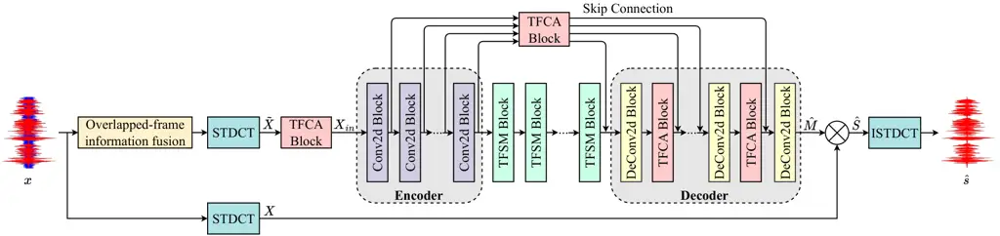

# Speech Enhancement with Overlapped-Frame Information Fusion and Causal Self-Attention Thanks: ^(⋆) Equal contribution ^(†) Corresponding author

Yuewei Zhang^($`\star`$) Affiliation: Department of Electronic
Engineering  
Shanghai Jiao Tong University  
Shanghai, China  
yueweizhang@sjtu.edu.cn    Huanbin Zou^($`\star`$)
Affiliation: Xiaohongshu Inc.  
Shanghai, China  
1518854421@alumni.sjtu.edu.cn    Jie Zhu^($`\dagger`$)
Affiliation: Department of Electronic Engineering  
Shanghai Jiao Tong University  
Shanghai, China  
zhujie@sjtu.edu.cn

###### Abstract

For time-frequency (TF) domain speech enhancement (SE) methods, the
overlap-and-add operation in the inverse TF transformation inevitably
leads to an algorithmic delay equal to the window size. However, typical
causal SE systems fail to utilize the future speech information within
this inherent delay, thereby limiting SE performance. In this paper, we
propose an overlapped-frame information fusion scheme. At each frame
index, we construct several pseudo overlapped-frames, fuse them with the
original speech frame, and then send the fused results to the SE model.
Additionally, we introduce a causal time-frequency-channel attention
(TFCA) block to boost the representation capability of the neural
network. This block parallelly processes the intermediate feature maps
through self-attention-based operations in the time, frequency, and
channel dimensions. Experiments demonstrate the superiority of these
improvements, and the proposed SE system outperforms the current
advanced methods.

###### Index Terms: 

speech enhancement, pseudo overlapped-frames, causal self-attention,
encoder-decoder.

## I Introduction

Speech enhancement (SE) aims to suppress the noise components in a noisy
audio and recover the target clean speech. In the real-world scenarios,
speech signals are frequently contaminated by diverse noises. As a
result, the utilization of a SE module as a front-end processing module
has become prevalent across various speech-related applications, such as
speech recognition, speaker verification, and voice activity detection.

In the past few years, deep leaning (DL) techniques have garnered
extensive interest from researchers across various fields. Thanks to the
powerful representation capabilities of deep neural network (DNN), the
DNN-based SE methods \[1, 2, 3, 4, 5, 6, 7\] have also achieved
remarkable performance. Common DNN-based SE methods can be divided into
two families, namely time domain methods \[1, 2\] and time-frequency
(TF) domain methods \[3, 4, 5, 6, 7\]. The time domain methods perform
direct noise reduction on the waveform in an end-to-end way, while the
TF domain methods operate on the noisy TF spectrum to suppress the noise
components. Nowadays, the TF domain SE methods have become mainstream.

Fig. 1: Time-frequency transformation & Inverse time-frequency
transformation.

In the practical deployment of SE algorithms, achieving a low
algorithmic delay is crucial for ensuring a positive user experience.
Therefore, many causal SE methods \[2, 3, 4, 5, 6, 8\] have been
proposed, which utilize only current and past input audio information to
generate the current enhanced result. For the TF domain SE methods,
since they need to first transform the noisy waveform into the spectrum
by a TF transformation, the causal inference implies that the DNN does
not look-ahead any feature speech frames when enhancing the current
speech frame. After predicting the enhanced spectrum, the inverse TF
transformation is employed to reconstruct the denoised waveform.
However, as pointed out by \[9\], there is an inherent algorithmic delay
caused by the inverse TF transformation. As shown in Fig. 1, during the
inverse TF transformation process, each reconstructed waveform frame is
actually obtained by overlapping and adding multiple consecutive
adjacent frames, resulting in an inevitable algorithmic delay equal to
the window size. To fully utilize the future information in this
inherent algorithmic delay, \[9\] proposes an overlapped-frame
prediction scheme. Nevertheless, designing an engineered synthesis
window corresponding to the analysis window for perfect reconstruction
is challenging and inflexible for different applications and conditions.



Fig. 2: Overall architecture of the proposed SE system combining the
overlapped-frame information fusion scheme with self-attention-based
DCTCRN (OFIF-Net).

In this paper, we propose an overlapped-frame information fusion (OFIF)
scheme. At each frame index, we fuse the real current speech frame with
several pseudo future frames, to obtain a fused spectral feature. The
utilization of pseudo speech frames can simulate part of the information
of future speech frames in the inherent algorithmic delay, thereby
achieving more complete information utilization. The fused feature is
subsequently processed by a feature post-processing module and fed into
the SE DNN for denoising processing.

In addition, the convolutional recurrent network (CRN)-based
architecture \[3, 4, 10, 11, 12\] has been demonstrated to be effective
for SE. Therefore, our proposed SE system takes the DCTCRN \[10\] as the
network backbone. To enhance the sequence modeling capability, we adopt
the time-frequency sequence modeling (TFSM) block \[13\] to construct
the recurrent module in DCTCRN. Furthermore, we devise a
time-frequency-channel attention (TFCA) block based on the
self-attention mechanism. The TFCA block is inserted into the skip
connection path and decoder of DCTCRN. Note that all the neural network
parts, including the CRN strcuture, the TFSM block, and the TFCA block,
are designed to be causal.

Combining the overlapped-frame information fusion scheme with
self-attention-based DCTCRN network, we name the proposed SE system
OFIF-Net. Experimental results confirm the benefits of the
aforementioned improvements, and OFIF-Net eventually achieves superior
performance compared to existing competitive benchmarks.

## II Methodology

The overall architecture of OFIF-Net is illustrated in Fig. 2. The
OFIF-Net takes the noisy signal $`x=s+z`$ as input, where $`s`$ and
$`z`$ denote the clean and noise signals. It predicts an enhanced audio
$`\hat{s}`$. The main parts of OFIF-Net includes the proposed OFIF block
and a SE network, whose details will be introduced as follows.

### II-A Overlapped-frame information fusion (OFIF)

Before the operations of SE network, the noisy speech $`x`$ need to be
first transformed to the TF spectrum
$`X\in\mathbb{R}^{F_{i}\times{T_{i}}}`$ by short-time discrete cosine
transform (STDCT) \[14\], where $`F_{i}`$ and $`T_{i}`$ denote the
number of frequency bins and frames. During the process of STDCT, the
speech waveform $`x`$ need to be first divided into the overlapped
short-time speech frames, which are then converted to the frequency
domain representations by discrete cosine transform (DCT). In this work,
we set the DCT points number $`N`$, Hamming frame size $`W`$, and frame
shift $`H`$ as $`N=512`$, $`W=32\ \text{ms}`$, and $`H=8\ \text{ms}`$,
respectively. Therefore, there is an overlap among $`W/H=4`$ adjacent
speech frames. Moreover, at each frame index $`t`$ $`(t\in[1,T])`$,
frame overlap means that the current speech frame
$`x_{t}\in\mathbb{R}^{W}`$ contains a part of the information of the
next 3 speech frames, i.e.,
$`x_{t+1},x_{t+2},x_{t+3}\in\mathbb{R}^{W}`$. Consequently, we propose
to construct 3 pseudo speech frames by zero-masking $`x_{t}`$ as:

```math
\displaystyle\tilde{x}_{t+1}=Mask\{x_{t}\}^{\frac{3}{4}H\sim H} \tag{1}
```

```math
\displaystyle\tilde{x}_{t+2}=Mask\{x_{t}\}^{\frac{1}{2}H\sim H} \tag{2}
```

```math
\displaystyle\tilde{x}_{t+3}=Mask\{x_{t}\}^{\frac{1}{4}H\sim H} \tag{3}
```

where
$`\tilde{x}_{t+1},\tilde{x}_{t+2},\tilde{x}_{t+3}\in\mathbb{R}^{W}`$ are
the pseudo speech frames. $`Mask\{x_{t}\}^{\frac{3}{4}H\sim H}`$ means
that the $`\frac{3}{4}H\sim H`$ fragment of $`\tilde{x}_{t+1}`$ is
masked to zero, while the $`0\sim\frac{3}{4}H`$ fragment of
$`\tilde{x}_{t+1}`$ corresponds to the $`\frac{1}{4}H\sim H`$ fragment
in $`x_{t}`$. Therefore, the superscript of $`Mask\{\cdot\}`$ indicates
the range of the fragment that is masked to zero. And the masking ways
in (2) and (3) are the same.

Subsequently, we apply STDCT to the 4 speech frames
$`\{x_{t},\tilde{x}_{t+1},\tilde{x}_{t+2},\tilde{x}_{t+3}\}`$ to obtain
$`\tilde{X}_{t}\in\mathbb{R}^{4\times{F_{i}}}`$. $`\tilde{X}_{t}`$
denotes a spectral feature containing the information of future pseudo
speech frames. Using the above method for the speech frames at all frame
indexes, we obtain the spectrum
$`\tilde{X}\in\mathbb{R}^{4\times{F_{i}}\times{T_{i}}}`$ that
incorporates information of overlapped future pseudo speech frames. The
$`\tilde{X}`$ is then fed into a TFCA block, which will be described in
the next section, to derive the final input feature
$`X_{in}\in\mathbb{R}^{4\times{F_{i}}\times{T_{i}}}`$ for the SE
network. By this way, we make full use of current speech frame and
pesudo future speech information without adding additional algorithmic
delay.

### II-B Network structure

Fig. 3: Details of causal time-frequency-channel attention (TFCA) block.
The “T-Branch”, “F-Branch”, and “C-Branch” respectively denote the
time-wise, frequency-wise, and channel-wise self-attention branches.

As depicted in Fig. 2, OFIF-Net adopts a CRN \[3\] structure to process
$`X_{in}`$ and perform noise suppression. The CRN structure follows the
encoder-decoder (ED) framework, with multiple TFSM blocks \[13\]
inserted between the encoder and decoder for sequence modeling.
Additionally, the proposed TFCA block is added to both the skip
connection paths and decoder layers. The TFCA block boosts the
representation capability of the CRN, thereby enhancing the SE
performance. Finally, the decoder predict a spectrum mask $`\hat{M}`$,
which is multiplied with the noisy spectrum $`X`$ to obtain the enhanced
spectrum $`\hat{S}`$ as:

```math
\displaystyle\hat{S}=\hat{M}\otimes{{X}} \tag{4}
```

where $`\otimes`$ denotes the element-wise multiplication.

#### II-B1 Convolutional recurrent network (CRN)-based structure

As illustrated in Fig. 2, the encoder of CRN receives the input feature
$`X_{in}`$ to extract the high-level TF representation. It consists of
several 2D convolutional (Conv2d) blocks, each comprising a 2D
convolutional layer, a batch normalization, and a PReLU function. The
encoded feature is subsequently fed into the TFSM blocks. Similar to the
dual-path sequence modeling method in \[15\], the TFSM block
respectively employs a bidirectional gated recurrent unit (BiGRU) layer
and a unidirectional gated recurrent unit (GRU) layer to capture
sequential correlations along the frequency and time dimensions.
Afterwards, the output from the TFSM blocks is sent to the decoder. It
aims to reconstruct a spectrum mask $`\hat{M}`$ with the same TF
resolution as the noisy spectrum $`X`$. Symmetrical to the encoder, the
decoder includes several 2D deconvolutional (DeConv2d) blocks. Each
DeConv2d block comprises a 2D deconvolutional layer, a batch
normalization, and a PReLU function, except that the last DeConv2d block
utilizes the Tanh function to ensure a more reasonable range for the
spectrum mask estimation.

#### II-B2 Causal Time-frequency-Channel attention (TFCA) block

To adaptively recalibrate the TF feature maps and further enhance the
representation capability of CRN, we devise a TFCA block. The details of
TFCA block are shown in Fig. 3. The TFCA block takes the intermediate
feature map $`F_{in}\in\mathbb{R}^{C\times{F}\times{T}}`$ as input,
where $`C`$, $`F`$, and $`T`$ represent the number of channels,
frequency bins, and frames. This block generally consists of three
parallel branches to capture the global dependencies along the time
(“T-Branch”), frequency (“F-Branch”), and channel (“C-Branch”)
dimensions, respectively. Meanwhile, we ensure the three
self-attention-based branches to be causal for a low algorithmic delay.

Specifically, in the “T-Branch”, two pooled results
$`F_{t}^{Q}\in\mathbb{R}^{2\times{T}\times{1}}`$ and
$`F_{t}^{K}\in\mathbb{R}^{2\times{T}\times{1}}`$ are derived by applying
global pooling operations to $`F_{in}`$ along both the channel and
frequency dimensions. The resulted channel number denotes two different
pooling methods, i.e., average pooling and maximum pooling. The
$`F_{t}^{Q}`$ and $`F_{t}^{K}`$ are respectively fed into two 1D
point-wise convolutional layers to obtain the query and key matrices
$`Q_{t}\in\mathbb{R}^{T\times{1}}`$ and
$`K_{t}\in\mathbb{R}^{T\times{1}}`$ (the channel dimension is omitted).
Therefore, the attention matrix $`Atten_{t}\in\mathbb{R}^{T\times{T}}`$
is defined as:

```math
\displaystyle Atten_{t}=\mathrm{Softmax}(\mathcal{K}({Q_{t}K_{t}^{\top}})) \tag{5}
```

where $`\mathcal{K}\in\mathbb{R}^{T\times{T}}`$ represents the temporal
causal mask, which is a lower triangular matrix.

In the “F-Branch” and “C-Branch”, the input feature $`F_{in}`$ is also
pooled at first. However, global pooling along the time dimension will
lead to non-causal inference. Thus, we adopt local adaptive pooling
operation. Take the “F-Branch” as an example, we pad $`K_{T}-1`$ zeros
at the beginning of the time dimension of $`F_{in}`$ and subsequently
apply adaptive average pooling with a kernel size of
$`{K_{T}}\times{C}`$ along the time and channel dimensions. This yields
an average pooled result with a shape of $`F\times{T}`$. Similar methods
are employed to achieve causal maximum pooling for $`F_{in}`$. By
concatenating the results of adaptive average pooling and adaptive
maximum pooling, we obtain causally pooled results
$`F_{f}^{Q}\in\mathbb{R}^{2\times{F}\times{T}}`$ and
$`F_{f}^{K}\in\mathbb{R}^{2\times{F}\times{T}}`$. Next, $`F_{f}^{Q}`$
and $`F_{f}^{K}`$ are respectively processed by two 1D point-wise
convolutional layers to derive the query and key matrices
$`Q_{f}\in\mathbb{R}^{F\times{T}}`$ and
$`K_{f}\in\mathbb{R}^{F\times{T}}`$. For the “C-Branch”, the query and
key matrices $`Q_{c}\in\mathbb{R}^{C\times{T}}`$ and
$`K_{c}\in\mathbb{R}^{C\times{T}}`$ are calculated by a similar method
as “F-Branch”. Afterwards, the attention matrices of these two branches
are defined as:

```math
\displaystyle Atten_{f}=\mathrm{Softmax}({Q_{f}K_{f}^{\top}}/\sqrt{T}) \tag{6}
```

```math
\displaystyle Atten_{c}=\mathrm{Softmax}({Q_{c}K_{c}^{\top}}/\sqrt{T}) \tag{7}
```

where $`Atten_{f}\in\mathbb{R}^{F\times{F}}`$,
$`Atten_{c}\in\mathbb{R}^{C\times{C}}`$.

Consequently, the outputs of the three branches are:

```math
\displaystyle\begin{cases}\mathcal{F}_{t}=Atten_{t}V_{t}\\
\mathcal{F}_{f}=Atten_{f}V_{f}\\
\mathcal{F}_{c}=Atten_{c}V_{c}\\
\end{cases} \tag{8}
```

where $`V_{t}`$, $`V_{f}`$, and $`V_{c}`$ are obtained by processing the
input feature $`F_{in}`$ through three 2D convolutional layers. Finally,
the three outputs
$`\mathcal{F}_{t},\mathcal{F}_{f},\mathcal{F}_{c}\in\mathbb{R}^{C\times{F}\times{T}}`$
are concatenated and fed into a 2D convolutional layer to generate the
TFCA block output $`F_{out}\in\mathbb{R}^{C\times{F}\times{T}}`$.

### II-C Loss function

The loss function $`\mathcal{L}`$ used for model training is defined as:

```math
\displaystyle\mathcal{L}=\lVert{\hat{s}-s}\rVert_{1}+\lVert{\hat{M}-M}\rVert_{F}^{2} \tag{9}
```

where $`\hat{s}`$ and $`s`$ are the denoised and clean audios,
$`\hat{M}`$ and $`M`$ are the estimated and target spectrum masks.
$`\lVert\cdot\rVert_{1}`$ and $`\lVert\cdot\rVert_{F}^{2}`$ denote the
L1 loss and mean square error (MSE) loss, respectively.

## III Experiments

### III-A Datasets

The OFIF-Net is trained on VoiceBank+DEMAND \[16\] and DNS-Challenge
\[17\] datasets. The VoiceBank+DEMAND dataset comprises 11,572 audio
clips for training and 824 audio clips for testing. The training set is
generated by mixing clean speech from 28 speakers with 10 types of noise
signals at the signal-to-noise ratios (SNRs) of {0,5,10,15}dB. The test
set adopts the clean audios from 2 unseen speakers to mix with 5 other
types of noise at the SNRs of {2.5,7.5,12.5,17.5}dB. The DNS-Challenge
includes over 500 hours of clean audios and over 180 hours of noise
audios. We synthesize 3,000 hours of noisy audios for model training,
and the SNR ranges from -5dB to 15dB. The officially provided non-blind
validation set containing 150 audio clips is used for model evaluation.

### III-B Experimental setup

All audios are sampled at 16 kHz. There are 5 Conv2d block in the
encoder, and the output channels of the convolutional layers are
{16,32,64,128,128}. The decoder correspondingly consists of 5 DeConv2d
blocks, with the output channels of the deconvolutional layers
configured as {128,64,32,16,1}. The (de)convolutional kernel size and
stride are set to (5,2) and (2,1), respectively. All the
(de)convolutional layers are set to be causal by asymmetric zero-padding
and frame-discarding. Furthermore, 3 TFSM blocks are inserted between
encoder and decoder, in which the hidden sizes of GRU&BiGRU layers are
{128,64,32}. Additionally, we set $`K_{T}=15`$ for TFCA block.

A RMSprop optimizer with an initial learning rate of 0.0002 is used for
model training. If the model performance does not improve for 8
consecutive epochs, the learning rate is halved. The batch size and
training epoch are set to 16 and 100.

### III-C Ablation study

|                      |         |      |      |      |     |
| -------------------- | ------- | ---- | ---- | ---- | --- |
|                      | WB-PESQ | CSIG | CBAK | COVL |     |
| noisy                | 1.97    | 3.35 | 2.44 | 2.63 |     |
| TF-DCTCRN \[10, 13\] | 2.92    | 4.10 | 3.47 | 3.51 |     |
|   +OFIF              | 2.96    | 4.20 | 3.49 | 3.59 |     |
|   +TFCA              | 2.99    | 4.20 | 3.50 | 3.60 |     |
|   +OFIF&TFCA         | 3.06    | 4.27 | 3.51 | 3.67 |     |
|   (i.e., OFIF-Net)   |         |      |      |      |     |

TABLE I: Results of ablation study.

To demonstrate the benefits of the proposed improvements, We conduct
ablation studies on the VoiceBank+DEMAND dataset. We adopt four
objective metrics to evaluate the model performance, including wide-band
perceptual evaluation of speech quality (WB-PESQ) \[18\] and three mean
opinion score (MOS)-related metrics \[19\] measuring the signal
distortion (CSIG), background noise intrusiveness (CBAK), and overall
audio quality (COVL), respectively.

The results of ablation study are illustrated in Table I. We take DCTCRN
\[10\] combined with the TFSM block \[13\] as baseline model and
abbreviate it as TF-DCTCRN. Based on the baseline, we separately verify
the benefits of each improvement method. With the help of OFIF scheme,
the WB-PESQ, CSIG, CBAK, and COVL are improved by 0.04, 0.10, 0.02, and
0.08, respectively. This demonstrates that constructing pseudo speech
frames for more comprehensive information utilization enhances the SE
performance. Meanwhile, the incorporation of the TFCA block yields
performance gains of 0.07, 0.10, 0.03, and 0.09 on the WB-PESQ, CSIG,
CBAK, and COVL metrics, respectively. Therefore, the proposed TFCA block
effectively enhances the representation capability of DNN and improves
model performance. Eventually, the proposed OFIF-Net is obtained by
integrating the aforementioned two improvements. It can be observed that
the SE performance is further improved, with the WB-PESQ, CSIG, CBAK,
and COVL scores reaching 3.06, 4.27, 3.51, and 3.67, respectively.

### III-D Comparison with existing advanced methods

|                   | Para.(M) | WB-PESQ | CSIG | CBAK | COVL |
| ----------------- | -------- | ------- | ---- | ---- | ---- |
| noisy             | \-       | 1.97    | 3.35 | 2.44 | 2.63 |
| DCCRN \[4\]       | 3.7      | 2.68    | 3.88 | 3.18 | 3.27 |
| FullSubNet+ \[8\] | 8.67     | 2.88    | 3.86 | 3.42 | 3.57 |
| CompNet \[20\]    | 4.26     | 2.90    | 4.16 | 3.37 | 3.53 |
| CTS-Net \[6\]     | 4.35     | 2.92    | 4.25 | 3.46 | 3.59 |
| DEMUCS \[2\]      | 128      | 2.93    | 4.22 | 3.25 | 3.52 |
| GaGNet \[21\]     | 5.94     | 2.94    | 4.26 | 3.45 | 3.59 |
| VSANet \[22\]     | 3.10     | 2.98    | 4.21 | 3.51 | 3.60 |
| OFIF-Net          | 2.61     | 3.06    | 4.27 | 3.51 | 3.67 |

TABLE II: Performance comparison with existing methods on the
VoiceBank+DEMAND dataset under causal configuration.

|                     | Para.(M) | WB-PESQ | NB-PESQ | STOI  | SI-SNR |
| ------------------- | -------- | ------- | ------- | ----- | ------ |
| noisy               | \-       | 1.58    | 2.45    | 91.52 | 9.07   |
| SICRN \[23\]        | 2.16     | 2.62    | 3.23    | 95.83 | 16.00  |
| PoCoNet \[24\]      | 50       | 2.75    | \-      | \-    | \-     |
| CTS-Net \[6\]       | 4.35     | 2.94    | 3.42    | 96.66 | 17.99  |
| FullSubNet+ \[8\]   | 8.67     | 2.98    | 3.50    | 96.69 | 18.34  |
| Inter-SubNet \[25\] | 2.29     | 3.00    | 3.50    | 96.61 | 18.05  |
| FS-CANet \[26\]     | 4.21     | 3.02    | 3.51    | 96.74 | 18.08  |
| GaGNet \[21\]       | 5.94     | 3.17    | 3.56    | 97.13 | 18.91  |
| OFIF-Net            | 2.61     | 3.30    | 3.62    | 97.34 | 18.32  |

TABLE III: Performance comparison with existing methods on the
DNS-Challenge non-blind test set under causal configuration.

We compare the performance of the proposed OFIF-Net with existing
advanced benchmarks, and the results are presented in Table II and III.
When conducting performance comparisons on the DNS-Challenge dataset,
WB-PESQ, narrow-band perceptual evaluation of speech quality (NB-PESQ)
\[27\], short-time objective intelligibility (STOI) \[28\], and
scale-invariant signal-to-noise ratio (SI-SNR) \[29\] are used as
objective metrics. It can be found that our proposed OFIF-Net
outperforms previous methods on both datasets. Although GaGNet \[21\]
attains a higher SI-SNR score on the DNS-Challenge dataset, it performs
worse on the remaining metrics. Moreover, our proposed method achieves a
smaller model size than most of the benchmarks, rendering it more
practical for real-world deployment. The processed audio clips can be
found at https://github.com/Zhangyuewei98/OFIF-Net.git.

## IV Conclusions

In this study, we introduce an overlapped-frame information fusion
scheme to fully utilize information within inherent algorithmic delay
caused by inverse TF transformation. At each frame index, we construct
several pseudo future speech frames and fuse them with the current frame
to obtain a fused result, which is then fed into the SE network.
Additionally, we design a TFCA block to perform feature map
recalibration through self-attention-based operations in the time,
frequency, and channel dimensions, respectively. Furthermore, we ensure
that all parts of the proposed SE system are causal. Experimental
results demonstrate the effectiveness of the proposed methods, and the
final SE system, namely OFIF-Net, achieves superior performance with a
small model size. In the furture, we will attempt to reduce the inherent
algorithmic delay of the SE system.

## Acknowledgment

This work was supported by the special funds of Shenzhen Science and
Technology Innovation Commission under Grant No.
CJGJZD20220517141400002.

## References

- \[1\] S. Pascual, A. Bonafonte, and J. Serrà, “SEGAN: Speech
  Enhancement Generative Adversarial Network,” in _Proc. Interspeech
  2017_, 2017, pp. 3642–3646.
- \[2\] A. Défossez, G. Synnaeve, and Y. Adi, “Real Time Speech
  Enhancement in the Waveform Domain,” in _Proc. Interspeech 2020_,
  2020, pp. 3291–3295.
- \[3\] K. Tan and D. Wang, “A Convolutional Recurrent Neural Network
  for Real-Time Speech Enhancement,” in _Proc. Interspeech 2018_, 2018,
  pp. 3229–3233.
- \[4\] Y. Hu, Y. Liu, S. Lv, M. Xing, S. Zhang, Y. Fu, J. Wu, B. Zhang,
  and L. Xie, “DCCRN: Deep Complex Convolution Recurrent Network for
  Phase-Aware Speech Enhancement,” in _Proc. Interspeech 2020_, 2020,
  pp. 2472–2476.
- \[5\] X. Hao, X. Su, R. Horaud, and X. Li, “Fullsubnet: A full-band
  and sub-band fusion model for real-time single-channel speech
  enhancement,” in _ICASSP 2021 - 2021 IEEE International Conference on
  Acoustics, Speech and Signal Processing (ICASSP)_, 2021, pp.
  6633–6637.
- \[6\] A. Li, W. Liu, C. Zheng, C. Fan, and X. Li, “Two heads are
  better than one: A two-stage complex spectral mapping approach for
  monaural speech enhancement,” _IEEE/ACM Transactions on Audio, Speech,
  and Language Processing_, vol. 29, pp. 1829–1843, 2021.
- \[7\] R. Cao, S. Abdulatif, and B. Yang, “CMGAN: Conformer-based
  Metric GAN for Speech Enhancement,” in _Proc. Interspeech 2022_, 2022,
  pp. 936–940.
- \[8\] J. Chen, Z. Wang, D. Tuo, Z. Wu, S. Kang, and H. Meng,
  “Fullsubnet+: Channel attention fullsubnet with complex spectrograms
  for speech enhancement,” in _ICASSP 2022 - 2022 IEEE International
  Conference on Acoustics, Speech and Signal Processing (ICASSP)_, 2022,
  pp. 7857–7861.
- \[9\] Z.-Q. Wang and S. Watanabe, “Improving frame-online neural
  speech enhancement with overlapped-frame prediction,” _IEEE Signal
  Processing Letters_, vol. 29, pp. 1422–1426, 2022.
- \[10\] Q. Li, F. Gao, H. Guan, and K. Ma, “Real-time monaural speech
  enhancement with short-time discrete cosine transform,” _arXiv
  preprint arXiv:2102.04629_, 2021.
- \[11\] S. Zhao, B. Ma, K. N. Watcharasupat, and W.-S. Gan, “Frcrn:
  Boosting feature representation using frequency recurrence for
  monaural speech enhancement,” in _ICASSP 2022 - 2022 IEEE
  International Conference on Acoustics, Speech and Signal Processing
  (ICASSP)_, 2022, pp. 9281–9285.
- \[12\] J. Liu and X. Zhang, “Iccrn: Inplace cepstral convolutional
  recurrent neural network for monaural speech enhancement,” in _ICASSP
  2023 - 2023 IEEE International Conference on Acoustics, Speech and
  Signal Processing (ICASSP)_, 2023, pp. 1–5.
- \[13\] Y. Zhang, H. Zou, and J. Zhu, “A two-stage framework in
  cross-spectrum domain for real-time speech enhancement,” in _ICASSP
  2024 - 2024 IEEE International Conference on Acoustics, Speech and
  Signal Processing (ICASSP)_, 2024, pp. 12 587–12 591.
- \[14\] N. Ahmed, T. Natarajan, and K. Rao, “Discrete cosine
  transform,” _IEEE Transactions on Computers_, vol. C-23, no. 1, pp.
  90–93, 1974.
- \[15\] Y. Luo, Z. Chen, and T. Yoshioka, “Dual-path rnn: Efficient
  long sequence modeling for time-domain single-channel speech
  separation,” in _ICASSP 2020 - 2020 IEEE International Conference on
  Acoustics, Speech and Signal Processing (ICASSP)_, 2020, pp. 46–50.
- \[16\] C. Valentini-Botinhao, X. Wang, S. Takaki, and J. Yamagishi,
  “Investigating rnn-based speech enhancement methods for noise-robust
  text-to-speech.” in _SSW_, 2016, pp. 146–152.
- \[17\] C. K. Reddy, V. Gopal, R. Cutler, E. Beyrami, R. Cheng,
  H. Dubey, S. Matusevych, R. Aichner, A. Aazami, S. Braun, P. Rana,
  S. Srinivasan, and J. Gehrke, “The INTERSPEECH 2020 Deep Noise
  Suppression Challenge: Datasets, Subjective Testing Framework, and
  Challenge Results,” in _Proc. Interspeech 2020_, 2020, pp. 2492–2496.
- \[18\] I. Rec, “P. 862.2: Wideband extension to recommendation p. 862
  for the assessment of wideband telephone networks and speech codecs,”
  _International Telecommunication Union, CH–Geneva_, 2005.
- \[19\] Y. Hu and P. C. Loizou, “Evaluation of objective quality
  measures for speech enhancement,” _IEEE Transactions on Audio, Speech,
  and Language Processing_, vol. 16, no. 1, pp. 229–238, 2008.
- \[20\] C. Fan, H. Zhang, A. Li, W. Xiang, C. Zheng, Z. Lv, and X. Wu,
  “Compnet: Complementary network for single-channel speech
  enhancement,” _Neural Networks_, vol. 168, pp. 508–517, 2023.
- \[21\] A. Li, C. Zheng, L. Zhang, and X. Li, “Glance and gaze: A
  collaborative learning framework for single-channel speech
  enhancement,” _Applied Acoustics_, vol. 187, p. 108499, 2022.
- \[22\] Y. Zhang, H. Zou, and J. Zhu, “Vsanet: Real-time speech
  enhancement based on voice activity detection and causal spatial
  attention,” in _2023 IEEE Automatic Speech Recognition and
  Understanding Workshop (ASRU)_, 2023, pp. 1–8.
- \[23\] C. Zhao, S. He, and X. Zhang, “Sicrn: Advancing speech
  enhancement through state space model and inplace convolution
  techniques,” in _ICASSP 2024 - 2024 IEEE International Conference on
  Acoustics, Speech and Signal Processing (ICASSP)_, 2024, pp.
  10 506–10 510.
- \[24\] U. Isik, R. Giri, N. Phansalkar, J.-M. Valin, K. Helwani, and
  A. Krishnaswamy, “PoCoNet: Better Speech Enhancement with
  Frequency-Positional Embeddings, Semi-Supervised Conversational Data,
  and Biased Loss,” in _Proc. Interspeech 2020_, 2020, pp. 2487–2491.
- \[25\] J. Chen, W. Rao, Z. Wang, J. Lin, Z. Wu, Y. Wang, S. Shang, and
  H. Meng, “Inter-subnet: Speech enhancement with subband interaction,”
  in _ICASSP 2023 - 2023 IEEE International Conference on Acoustics,
  Speech and Signal Processing (ICASSP)_, 2023, pp. 1–5.
- \[26\] J. Chen, W. Rao, Z. Wang, Z. Wu, Y. Wang, T. Yu, S. Shang, and
  H. Meng, “Speech Enhancement with Fullband-Subband Cross-Attention
  Network,” in _Proc. Interspeech 2022_, 2022, pp. 976–980.
- \[27\] A. Rix, J. Beerends, M. Hollier, and A. Hekstra, “Perceptual
  evaluation of speech quality (pesq)-a new method for speech quality
  assessment of telephone networks and codecs,” in _2001 IEEE
  International Conference on Acoustics, Speech, and Signal Processing.
  Proceedings (Cat. No.01CH37221)_, vol. 2, 2001, pp. 749–752 vol.2.
- \[28\] C. H. Taal, R. C. Hendriks, R. Heusdens, and J. Jensen, “An
  algorithm for intelligibility prediction of time–frequency weighted
  noisy speech,” _IEEE Transactions on Audio, Speech, and Language
  Processing_, vol. 19, no. 7, pp. 2125–2136, 2011.
- \[29\] J. L. Roux, S. Wisdom, H. Erdogan, and J. R. Hershey, “Sdr –
  half-baked or well done?” in _ICASSP 2019 - 2019 IEEE International
  Conference on Acoustics, Speech and Signal Processing (ICASSP)_, 2019,
  pp. 626–630.
