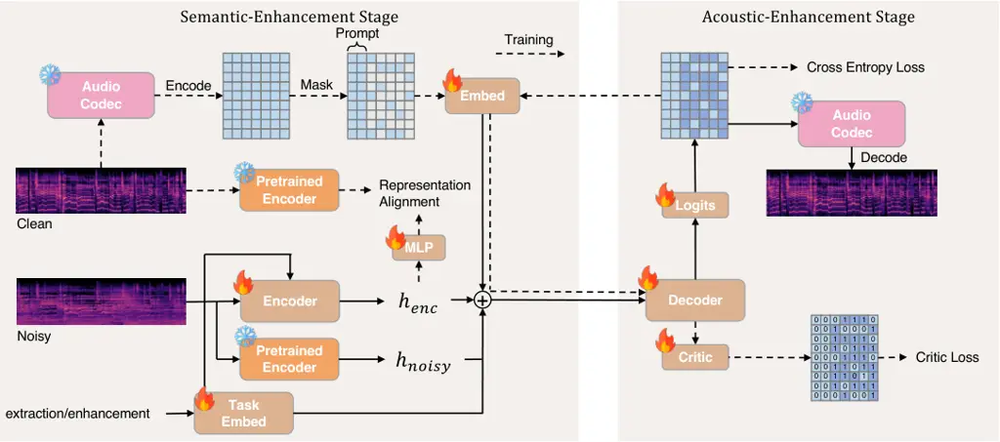
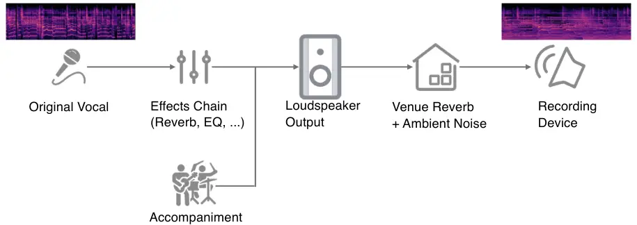
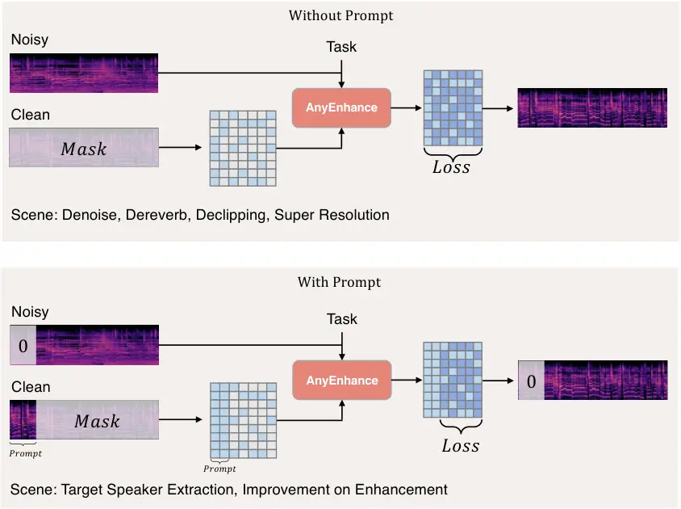
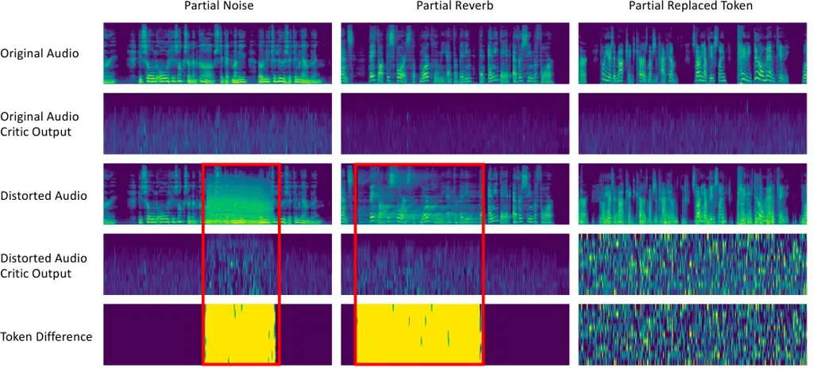

# AnyEnhance: A Unified Generative Model with Prompt-Guidance and Self-Critic for Voice EnhancementThanks: J. Zhang, Z. Fang, Y. Wang, Z. Zhang and Z. Wu are affiliated with CUHK-Shenzhen and SRIBD. e-mail: [junanzhang@link.cuhk.edu.cn](mailto:junanzhang@link.cuhk.edu.cn)Thanks: J. Yang, Z. Wang and F. Fan are affiliated with Huawei Technologies Co., Ltd.Thanks: Z. Wu is the corresponding author. e-mail: [wuzhizheng@cuhk.edu.cn](mailto:wuzhizheng@cuhk.edu.cn)

Junan Zhang    Jing Yang    Zihao Fang    Yuancheng Wang    Zehua Zhang
Affiliation: Zhuo Wang,  Fan Fan,  Zhizheng Wu 

###### Abstract

We introduce AnyEnhance, a unified generative model for voice
enhancement that processes both speech and singing voices. Based on a
masked generative model, AnyEnhance is capable of handling both speech
and singing voices, supporting a wide range of enhancement tasks
including denoising, dereverberation, declipping, super-resolution, and
target speaker extraction, all simultaneously and without fine-tuning.
AnyEnhance introduces a prompt-guidance mechanism for in-context
learning, which allows the model to natively accept a reference
speaker’s timbre. In this way, it could boost enhancement performance
when a reference audio is available and enable the target speaker
extraction task without altering the underlying architecture. Moreover,
we also introduce a self-critic mechanism into the generative process
for masked generative models, yielding higher-quality outputs through
iterative self-assessment and refinement. Extensive experiments on
various enhancement tasks demonstrate AnyEnhance outperforms existing
methods in terms of both objective metrics and subjective listening
tests. Demo audios are publicly available at ¹¹ 1
[https://amphionspace.github.io/anyenhance](https://amphionspace.github.io/anyenhance).
An open-source implementation is provided at ²² 2
[https://github.com/viewfinder-annn/anyenhance-v1-ccf-aatc](https://github.com/viewfinder-annn/anyenhance-v1-ccf-aatc).

###### Index Terms: 

Generative model, speech enhancement, speech separation, target speaker
extraction

## I Introduction

|                         |                 |                   |          |        |     |     |              |                 |               |                          |                       |
| ----------------------- | --------------- | ----------------- | -------- | ------ | --- | --- | ------------ | --------------- | ------------- | ------------------------ | --------------------- |
| Category                | Model           | Enhancement Tasks |          |        |     |     | Simultaneity | Domain          | Sampling Rate | Supports Speaker Prompt? | Fine-tuning Required? |
|                         |                 | Denoise           | Dereverb | Declip | SR  | TSE |              |                 |               |                          |                       |
| Multi-Task              | Voicefixer\[1\] | ✓                 | ✓        | ✓      | ✓   |     | ✓            | Speech          | 44.1kHz       | ✗                        | No                    |
|                         | MaskSR\[2\]     | ✓                 | ✓        | ✓      | ✓   |     | ✓            | Speech          | 44.1kHz       | ✗                        | No                    |
|                         | SpeechX\[3\]    | ✓                 |          |        |     | ✓   |              | Speech          | 16kHz         | ✗                        | No                    |
|                         | SpeechFlow\[4\] | ✓                 |          |        |     | ✓   | ✓            | Speech          | 16kHz         | ✗                        | Yes                   |
|                         | NeMo\[5\]       | ✓                 |          |        |     | ✓   |              | Speech          | 16kHz         | ✗                        | Yes                   |
|                         | Uniaudio\[6\]   | ✓                 | ✓        |        |     | ✓   |              | Speech          | 16kHz         | ✗                        | Yes                   |
| Multi-Domain            | AudioSR\[7\]    |                   |          |        | ✓   |     |              | Speech, Singing | 48kHz         | ✗                        | No                    |
| Multi-Task Multi-Domain | AnyEnhance      | ✓                 | ✓        | ✓      | ✓   | ✓   | ✓            | Speech, Singing | 44.1kHz       | ✓                        | No                    |

TABLE I: Comparison of existing versatile enhancement-related models.
Denoise: Denoising; Dereverb: Dereverberation; Declip: Declipping; SR:
Super Resolution; TSE: Target Speaker Extraction. Simultaneity means
processing multiple distortions simultaneously.

Voice enhancement is a fundamental task in robust voice processing,
including both speech and singing voice (i.e. vocal) processing. There
are many sub-tasks such as speech denoising, dereverberation,
declipping, super-resolution, and target speaker extraction (TSE). They
process noise, reverberation, bandwidth limitations, clipping, or other
voices, respectively. Note that although speech and singing belong to
the same human vocal domain, singing differs from speech in two key
respects. First, singing generally exhibits a higher pitch, broader
frequency range, and specific rhythm. Second, singing occurs in more
complex real-world acoustic environments—such as concerts, livehouses,
and bars—leading to challenges like heavier reverberation and varied
noise sources. In this work, we research on voice enhancement for both
speech and singing voice.

Deep-learning-based methods have been widely used in many enhancement
tasks, such as denoising \[8\], dereverb \[9\], super-resolution \[7\]
and target speaker extraction \[10\], and these models are well
applicated into downstream applications, such as automatic speech
recognition (ASR) \[11, 12\], hearing aids \[13\], and in-the-wild data
processing \[14\]. Despite these advancements, most deep-learning-based
methods focus on a specific enhancement task, offering limited
versatility. In recent studies, versatile enhancement models have been
proposed to address multiple tasks and domains with a single model (see
Table I).

There are several models that aim to handle multiple enhancement tasks.
Voicefixer \[1\] proposed the concept of General Speech Restoration
(GSR), which attempts to remove multiple distortions simultaneously
(noise, reverberation, clipping, and bandwidth limitation) from the
input speech signal. MaskSR \[2\] is another GSR model using a masked
generative model to handle noise, reverberation, clipping, and bandwidth
limitation simultaneously. Although they can remove background noise
from speech, they can’t separate speakers. SpeechX \[3\],
SpeechFlow \[4\], NeMo \[5\] and UniAudio \[6\] are other multi-task
enhancement models. SpeechX is a versatile speech generation model
capable of tasks such as speech denoising and target speaker extraction.
SpeechFlow and NeMo are both flow-matching-based \[15\] models that are
pretrained on a large-scale dataset and can be fine-tuned for downstream
tasks like speech denoising and target speaker extraction. UniAudio is
an audio foundation model that supports 11 audio generation tasks
covering speech denoising, dereverberation and target speaker
extraction. Although those approaches can handle more speech enhancement
tasks including target speaker extraction in one model, task-specific
fine-tuning is still needed and they can’t handle multiple distortions
in one pass (e.g., performing target speaker extraction tasks under
noisy conditions). Also, they only work for speech enhancement, ignoring
singing voice processing. Some works have attempted to address
multi-domain enhancement problems. AudioSR \[7\] is a latent diffusion
model which supports super-resolution across all audio domains (speech,
sound effects, and music), but it only supports super-resolution tasks
and does not include other enhancement tasks. Based on the above
analysis, existing models have limitations in terms of both task and
domain universality, and some require task-specific fine-tuning.

To overcome the limitations, we propose a unified framework, AnyEnhance.
Based on the masked generative model, AnyEnhance simultaneously
addresses various enhancement tasks shown in Table I across both speech
and singing voice domains, all without fine-tuning. To deal with
real-world singing voice domain, we improved the data simulation process
to create more realistic recording scenarios. Moreover, unlike
implementing an auxiliary speaker encoder in many target speaker
extraction models \[10, 16\], we propose a prompt-guidance mechanism in
AnyEnhance, which provides the model with an in-context-learning
capability. This mechanism enables the model to seamlessly accept a
reference speaker’s voice for target speaker extraction and also
improves performance on other tasks, all without architectural
modifications. Furthermore, to address the issue of sampling instability
inherent in masked generative models \[17\], we integrate a self-critic
mechanism, enhancing accuracy and robustness when sampling from logits.
These advancements make AnyEnhance a versatile solution for both speech
and singing voice enhancement tasks, as well as a promising candidate
for real-world applications across diverse domains. Experimental results
demonstrate that AnyEnhance outperforms existing models across various
enhancement tasks in terms of both objective metrics and subjective
evaluations. Ablation studies further validate the effectiveness of the
prompt-guidance mechanism across various tasks, the self-critic sampling
strategy, the improved data simulation process, and the integration of
various enhancement tasks into a unified model. Our unified multitask
training consistently outperforms single-task enhancement models across
all tasks, with average improvements of +0.067 OVRL and +0.13 NISQA,
demonstrating strong generalization across diverse speech and singing
tasks. To summarize, our contributions are as follows:

- •
  We propose, AnyEnhance, a unified multi-task and multi-domain
  enhancement model. Built upon the masked generative model, this model
  is capable of handling both speech and singing voice domains,
  supporting a range of enhancement tasks such as denoising,
  dereverberation, declipping, super-resolution, and target speaker
  extraction simultaneously without fine-tuning.
- •
  We introduce a prompt-guidance mechanism in AnyEnhance. This
  prompt-guidance solution enables the model to accept a reference
  speaker’s voice for target speaker extraction and also improves the
  performance of other enhancement tasks.
- •
  We propose a self-critic sampling strategy in AnyEnhance. The
  self-critic loss is useful to sample better tokens and as a result
  enhances the quality of generated outputs.

## II Related Work

### II-A Generalized Speech Enhancement Models

In the early days, speech enhancement tasks were often completed by a
single model, such as speech denoising \[9, 18\], speech
dereverberation \[19\], super-resolution \[7\], target speaker
extraction \[10, 16\], etc. These tasks are often independent of each
other and require different models to be trained separately. In recent
years, researchers have proposed some joint framework that integrate
multiple enhancement tasks into a single model to improve the model’s
generalization ability. Liu et al. \[1\] proposed a new concept called
General Speech Restoration (GSR), which aims to solve a wide range of
speech enhancement tasks, including denoising, dereverberation,
declipping and super-resolution. They introduced the first GSR framework
called VoiceFixer, which consists of an ResUNet-based analysis stage and
a neural vocoder-based synthesis stage. Li et al. \[2\] uses a masked
generative model whose target is the same as VoiceFixer. Zhang et
al. \[20\] proposed ”Universal SE” model aims at both denoising and
dereverberation, and accepts various forms of input(eg. multi-channel,
multi-sampling rate). Urgent challenge \[21\] focuses on Universality,
Robustness, and Generalizability for Speech Enhancement. However, these
models do not include target speaker extraction or consider the singing
voice domain. NeMo \[5\] and SpeechFlow \[4\] are both
flow-matching-based \[15\] models that pretrained on a large-scale
dataset and can be fine-tuned for downstream enhancement tasks like
speech denoising and target speaker extraction. However, these models
require fine-tuning on all these downstream tasks. UniAudio \[6\]
proposed a unified audio foundation model which includes speech
denoising, target speaker extraction and can be finetuned to
dereverberation task. But this model is not specifically designed for
enhancement tasks, and it requires fine-tuning for speech
dereverberation and cannot perform super-resolution.

### II-B Language Model for Speech Enhancement Tasks

With the rapid development and widespread adoption of language models,
researchers have begun exploring their potential to improve speech
enhancement systems. For instance, the SELM model \[22\] employs a
WavLM-based k-means tokenization strategy and utilizes a
Transformer-based architecture to realize one-step forward prediction
for speech enhancement. Based on SELM, the TSELM model \[16\]
incorporates a speaker embedding branch to facilitate target speaker
extraction. Similarly, Gense \[23\] adopts a two-stage autoregressive
paradigm that first maps noisy audio to a semantic space before
reconstructing the acoustic signal, then it generates acoustic feature
of speech through a semantic-to-acoustic process. In another line of
research, MaskSR \[2\] and Genhancer \[24\] incorporate acoustic tokens
from Descript Audio Codec (DAC) \[25\] and language model to achieve
generalized speech restoration capabilities. An extension,
MaskSR2 \[26\], leverages semantic distillation to further improve the
intelligibility of the generated speech outputs. The SpeechX model \[3\]
uses tokens from Encodec \[27\] and performs multiple speech-related
tasks, including text-to-speech, noise suppression, target speaker
extraction, and speech editing. However, these existing approaches,
except for SpeechX, have not fully harnessed the in-context-learning
capabilities of modern language models, and even SpeechX remains limited
in addressing certain enhancement tasks, such as dereverberation or
super-resolution.

## III Background



Fig. 1: Model Architecture for AnyEnhance. It operates in two stages:
(1) the semantic enhancement stage, where the encoder extracts and align
semantic features from distorted and clean audio, (2) the acoustic
enhancement stage, where the decoder predicts masked tokens using
semantic features and acoustic tokens. Part of the clean audio can be
retained for prompt-guidance (See Figure 3 for details), and a critic
head enables self-critic training and sampling.

### III-A Enhancement Problem Formulation

All enhancement problems can be modeled as distortions applied to the
original audio. We denote the clean speech/singing audio as
$`x\in\mathbb{R}^{L}`$, where $`L`$ is the audio length in sample
points. We model the distortion process as a function $`d(\cdot)`$. The
distorted audio $`y\in\mathbb{R}^{L}`$ can be written as: $`y=d(x)`$. We
consider a wide range of distortions:

- •
  Noise: $`d_{\text{noise}}(x)=x+n`$, where $`n`$ is the noise signal.
- •
  Reverb: $`d_{\text{reverb}}(x)=x\ast r`$, where $`r`$ is the room
  impulse response.
- •
  Clipping: $`d_{\text{clip}}(x)=max(min(x,\gamma),-\gamma)`$, where
  $`\gamma\in[0,1]`$ is the clipping threshold.
- •
  Bandwidth Limitation: $`d_{\text{bw}}(x)=Resample(x,freq)`$, where
  $`freq`$ is the target lower sampling frequency.
- •
  Other Voice: $`d_{\text{voice}}(x)=x+v`$, where $`v`$ is the other
  voice signal.

Previous works \[1, 21\] model distortions in a sequential order.
Similarly, we model the overall distortion $`D(\cdot)`$ as a composite
function:

```math
\displaystyle D(x)=d_{1}(d_{2}(\ldots d_{Q}(x)\ldots)),\quad d_{q}\in\mathbb{D},\quad q=1,2,\ldots,Q.
```

Where $`\mathbb{D}`$ is the set of distortion functions, and $`Q`$ is
the number of distortion types. The goal of our model is to recover the
clean audio $`x`$ from the distorted audio $`y`$ by learning the inverse
function $`D^{-1}(\cdot)`$. Each distortion function $`d_{q}`$ is
applied with a probability $`p_{q}`$, which is adjusted as a
hyperparameter.



Fig. 2: Simulation of real-world live vocal recordings, including vocal
effects, venue acoustics, and ambient noise.

When simulating data, previous works typically follow the distortion
order of
$`d_{\text{noise}}(d_{\text{bw}}(d_{\text{clip}}(d_{\text{reverb}}(\cdot))))`$,
placing additive noise at the final stage. However, in real-world
scenarios, noise is often intertwined with reverberation and other
artifacts. An overview of the real-world recording path simulated in our
framework is illustrated in Figure 2. To better approximate practical
conditions, we propose a refined data simulation strategy that applies
noise before reverberation, and places bandwidth and clipping effects at
the end. Additionally, we insert a separate vocal effects chain (e.g.,
EQ, reverb) prior to noise to simulate live performance processing. The
final degradation chain is formulated as:

```math
D(x)=d_{\text{bw}}(d_{\text{clip}}(d_{\text{reverb}}(d_{\text{noise}}(d_{\text{vocal\_effect}}(x))))),
```

where $`d_{\text{vocal\_effect}}=d_{\text{reverb}}(d_{\text{eq}}(x))`$
represents the vocal effect chain. Here, $`d_{\text{eq}}`$ denotes the
equalization effect, which applies 1-3 bell gains in the range of \[-5,
5\] dB across 10-12,000 Hz within a 1-second window. We define two
general tasks for our model: Enhancement and Extraction. The enhancement
task aims to recover the clean audio from the distorted audio, while the
extraction task aims to extract the target speaker’s voice from the
mixture. The difference between these two tasks is that the extraction
task would insert $`d_{\text{voice}}`$ into the head of the distortion
chain, namely
$`D_{extraction}(x)=d_{\text{bw}}(d_{\text{clip}}(d_{\text{reverb}}(d_{\text{voice}}(d_{\text{vocal\_effect}}(x))))).`$

### III-B Masked Generative Modeling

Masked Generative Modeling can also be formulated as a discrete
diffusion process \[17\]. Given a discrete token sequence $`\mathbf{X}`$
of some data. The forward diffusion process at time $`t`$ is formulated
as $`\mathbf{X}_{t}=\mathbf{X}\odot\mathbf{M}_{t}`$, by masking a subset
of tokens in $`\mathbf{X}`$ with the corresponding binary mask
$`\mathbf{M}_{t}=[m_{t,i}]_{i=1}^{N}`$. Specifically, we replace
$`x_{i}`$ with a special \[MASK\] token if $`m_{t,i}=1`$, otherwise keep
$`x_{i}`$ unmasked if $`m_{t,i}=0`$. Each $`m_{t,i}`$ is i.i.d.
according to a Bernoulli distribution with parameter $`\gamma(t)`$,
where $`\gamma(t)\in(0,1]`$ represents a mask schedule function (in this
paper we use $`\gamma(t)=sin(\frac{\pi t}{2T}),t\in(0,T]`$). We denote
$`\mathbf{X}_{0}=\mathbf{X}`$ as the original token sequence and
$`\mathbf{X}_{T}`$ as fully masked token sequence. The model is trained
to predict the masked tokens based on the unmasked tokens and condition
$`\mathbf{C}`$, modeled as
$`p_{\theta}(\mathbf{X}_{0}\mid\mathbf{X}_{t},\mathbf{C})`$. The
parameters $`\theta`$ are optimized to minimize the negative
log-likelihood of the masked tokens:

```math
\mathcal{L}_{\text{mask}}=\mathbb{E}_{\mathbf{X}\in\mathcal{D},t\in[0,T]}\left[-\sum_{i=1}^{N}m_{t,i}\cdot\log\left(p_{\theta}(x_{i}\mid\mathbf{X}_{t},\mathbf{C})\right)\right].
```

During inference, the reverse diffusion process iteratively predicts the
tokens starting from fully masked token sequence $`\mathbf{X}_{T}`$.
Suppose the total number of inference steps is $`S`$, at each timestep
$`t=\{S,S-1,\dots,1\}`$, we first sample $`\hat{\mathbf{X}}_{0}`$ from
the model’s logits
$`p_{\theta}(\mathbf{X}_{0}\mid\mathbf{X}_{\frac{t}{S}T},\mathbf{C})`$.
Then, we choose $`\lfloor N\cdot\gamma(\frac{t-1}{S}T)\rfloor`$ tokens
to remask based on the confidence score. In common practice \[28, 2,
29\], the model’s logits
$`p_{\theta}(\hat{x}_{i}\mid\mathbf{X}_{\frac{t}{S}T},\mathbf{C})`$ is
directly taken as confidence score if
$`\mathbf{X}_{\frac{t}{S}T,i}=\text{[MASK]}`$, otherwise 1, and tokens
with the lowest confidence scores are remasked.

## IV Proposed Unified Model with Prompt Guidance and Self-Critic

### IV-A Model Architecture

The proposed model architecture is shown in Figure 1. Similar to
MaskSR \[2, 26\], our model is also a Transformer-based Masked
Generative Model. The model is divided into two stages: the semantic
enhancement stage and the acoustic enhancement stage. In the semantic
enhancement stage, the encoder is responsible for extracting the
semantic features from the input distorted audio using representations
aligned with pre-trained features. In the acoustic enhancement stage,
the decoder predicts masked tokens based on the semantic features and
existing acoustic tokens. A critic head is introduced to perform
self-critic training and sampling.

We use pretrained Descript Audio Codec (DAC) \[25\] as audio tokenizer
to model clean voice. Through 9 residual vector quantizer layers, we
obtain a sequence of tokens of shape
$`\mathbf{X}_{0}\in\mathbb{R}^{9\times T}`$ of clean audio $`x`$. At
timestep $`t`$, we mask a subset of tokens in $`\mathbf{X}_{0}`$ to
obtain $`\mathbf{X}_{t}`$. To deal with residual layers, we employ 9
embedding layers for each residual layer and sum over the residual
layers to obtain the token latent
$`h_{\text{token}}\in\mathbb{R}^{T\times\text{dim}}`$.

During the semantic enhancement stage, the input of the encoder is the
power-law compressed magnitude STFT spectrogram \[30\] of the distorted
audio $`D(x)`$ and task embedding $`h_{\text{task}}`$. The encoder
consists of $`L_{enc}`$ self-attention transformer layers to obtain the
latent representation $`h_{\text{enc}}\in\mathbb{R}^{T\times dim}`$.
Inspired by representation alignment (REPA) in the field of image
generation \[31\] and semantic distillation in MaskSR2 \[26\], we
introduce a representation alignment module to align the encoder output.
The semantic feature of the clean audio is extracted using
self-supervised learning (SSL) models, such as w2v-BERT \[32\]. Let
$`f`$ be a SSL encoder, $`z=f(x)\in\mathbb{R}^{T\times dim}`$ be an
encoder output (linear interpolation is used to match time dimension
$`T`$ and feature dimension $`dim`$), a multilayer perceptron
$`\text{MLP}_{\phi}`$ is used to project the encoder output with the
clean audio’s semantic feature:

```math
\mathcal{L}_{\text{REPA}}=\mathbb{E}_{x}\left[-\sum_{t=1}^{T}\text{sim}\left(z^{[t]},\text{MLP}_{\phi}(h_{\text{enc}}^{[t]})\right)\right],
```

where the similarity function is mean-square error (MSE). Furthermore,
motivated by \[33, 34\], we also integrate self-supervised feature to
the output for semantic enhancement. Prior work has shown that SSL
models possess inherent noise robustness and can significantly improve
speech enhancement performance when used as input features. Based on
this insight, the final output of our semantic enhancement stage is
formulated as the sum of the encoder output and the noisy semantic
feature: $`h_{\text{semantic}}=h_{\text{enc}}+f(D(x))`$.

During the acoustic enhancement stage, discrete diffusion process is
employed. The condition consists of semantic features and task
embeddings $`\mathbf{C}=\{h_{\text{semantic}},h_{\text{task}}\}`$. The
decoder consists of $`L_{dec}`$ self-attention transformer layers.
Finally, 9 linear layers project the output of the last decoder layer
back to logits of each residual layers. $`\mathcal{L}_{\text{mask}}`$ is
computed between the predicted masked token and the target token.

Though AnyEnhance adopts MaskSR’s architecture, it introduces several
key innovations, including degradation path optimization,
prompt-guidance and self-critic sampling. These concepts are generally
applicable and beneficial beyond the MaskSR framework. While MaskSR
focuses solely on speech restoration, AnyEnhance extends its
applicability to multiple tasks such as target speech extraction and
singing voice enhancement. Our prompt-guidance mechanism is not limited
to enabling the TSE task. Inspired by the timbre cloning capability in
zero-shot TTS, we aim to leverage prompt guidance to enhance timbre
similarity and overall quality across a broader range of tasks.

### IV-B Prompt Guidance



Fig. 3: Comparison of model training with and without prompts. The
inclusion of prompts enables the model to naturally perform TSE also
achieving improved performance across other enhancement tasks.

We introduce a prompt-guidance scheme (see Figure 3). The design of the
prompt-guidance mechanism is inspired by the success of zero-shot TTS
systems \[35, 29\], where models can mimic the timbre and audio
characteristics of a reference speaker through prompt conditioning. Our
goal is to extend this capability to speech enhancement tasks, enabling
the model to leverage clean prompt audio to learn target speaker
characteristics and audio quality in an end-to-end manner without
alternating the model architecture. The model can be trained using both
configurations: without prompt and with prompt. During training, we have
a probability $`p_{\text{prompt}}`$ to keep the first 3 seconds of clean
audio unmasked as the prompt. The same place of the distorted audio is
set to silence. The prompt section is not considered for loss
calculation. During inference, the model can infer both with a prompt
audio and without prompt audio:

- •
  Without a prompt, the clean token is set to a fully masked state, and
  the model starts restoration from scratch.
- •
  With a prompt, the prompt token is appended to the beginning of the
  clean code, while the rest of the sequence remains fully masked,
  guiding the model to generate the desired output with target speaker’s
  voice as reference.

The prompt-guidance scheme ensures the model to seamlessly accept a
reference speaker’s voice for target speaker extraction and also
improves performance on other tasks when a reference speaker’s prompt
audio is proveded.

### IV-C Self-Critic Sampling

The sampling strategy described in Section III-B is based on a greedy
approach, which indicates that the sampling process is non-regrettable,
thus cannot recover already filled tokens. Moreover, the confidence
score of each token is determined independently (by simply taking the
model’s logits as the confidence score). To address these issues, we
introduce Self-Critic sampling strategy.

The core idea of critic-sampling is to use a model as a critic or
discriminator to evaluate whether a token is real or generated by the
model. After we first sample $`\hat{\mathbf{X}}_{0}`$ from
$`p_{\theta}(\mathbf{X}_{0}\mid\mathbf{X}_{t},\mathbf{C})`$ and the
model’s logits, the unmasked tokens in $`\mathbf{X}_{t}`$ are copied
into the output to form
$`\tilde{\mathbf{X}}_{0}=\hat{\mathbf{X}}_{0}\odot\mathbf{M}_{t}+\mathbf{X}_{0}\odot(1-\mathbf{M}_{t})`$.
The critic model (parameterized by $`\phi`$) is trained to estimate
$`\mathbf{M}_{t}`$ from $`\tilde{\mathbf{X}}_{0}`$ using binary
cross-entropy loss:

```math
\mathcal{L}_{\text{critic}}=\mathbb{E}_{\begin{subarray}{c}\mathbf{X}\in\mathcal{D},t\in[0,T],\\
p_{\theta}(\tilde{\mathbf{X}}_{0}\mid\mathbf{X}_{t},\mathbf{C})\end{subarray}}\left[-\sum_{i=1}^{N}m_{t,i}\cdot\log\left(p_{\phi}(\hat{m}_{t,i}\mid\tilde{\mathbf{X}}_{0},\mathbf{C})\right)\right].
```

For Token-Critic \[17\], a separate critic model $`\phi`$ is trained.
Inspired by SCRIPT \[36\], which was originally proposed for pretraining
masked language models such as BERT \[37\], we use the generative model
itself as the critic model. We introduce an additional linear layer,
referred to as the critic head, to replace the model’s logits projection
layer. During training, we feed $`\tilde{\mathbf{X}}_{0}`$ back into the
model itself with the critic head to produce the critic score
$`\hat{\mathbf{M}}_{t}`$ and minimize the binary cross-entropy loss
between $`\mathbf{M}_{t}`$. Self-Critic eliminates the need for training
a separate critic model and still improves the masked generative model’s
performance by providing a more accurate confidence score. The final
loss is:

```math
\mathcal{L}=\mathcal{L}_{\text{mask}}+\mathcal{L}_{\text{REPA}}+\mathcal{L}_{\text{critic}}.
```

## V Experiments

### V-A Datasets

|                  |                                                                                                                              |                 |
| ---------------- | ---------------------------------------------------------------------------------------------------------------------------- | --------------- |
| Category         | Datasets                                                                                                                     | Size            |
| 24kHz Speech     | Emilia \[14\] (Filtered Subset)                                                                                              | 20.987.49 hours |
| Fullband Speech  | VCTK \[38\], HiFi-TTS \[39\], HQ-TTS \[1\], AI-Shell3 \[40\], Bible-TTS \[41\]                                               | 956.74 hours    |
| Fullband Singing | OpenSinger \[42\], PopCS \[43\], PopBuTFy \[44\], Opencpop \[45\], M4Singer \[46\], SingStyle111 \[47\], ACESinger \[48\]    | 572.01 hours    |
| Noise            | MUSAN \[49\], Urgent Challenge \[21\], FSD50K \[50\], DESED \[51\], TUT Urban Acoustic Scenes \[52\], Live-performance Noise | 1233.89 hours   |
| RIR              | SLR26, SLR28, Self-collected                                                                                                 | 62,668 pieces   |

TABLE II: Statistics of the speech, singing voice, noise and room
impulse response (RIR) datasets used for AnyEnhance.

Training Datasets The training datasets used in our experiments include
speech, singing voice, noise, and room impulse responses (RIRs), with
detailed statistics shown in Table II. For speech data, we used 24kHz
speech from Emilia \[14\] Subset (filtered with DNSMOS OVRL $`>`$ 3.4,
totaling $`\sim`$21k hours) and fullband speech from datasets such as
VCTK \[38\], HiFi-TTS \[39\] ($`\sim`$1k hours), and AI-Shell3 \[40\].
Singing voice data include OpenSinger \[42\], PopCS \[43\], and others
($`\sim`$600 hours). Noise data are sourced from the musan noise
subset \[49\], Urgent Challenge noise data \[21\], FSD50K \[50\],
DESED \[51\], and the TUT Urban Acoustic Scenes 2018 dataset \[52\],
along with a proprietary dataset of live-performance noise ($`\sim`$1.2k
hours). RIRs comprise 62,668 pieces from SLR26, SLR28, and
self-collected RIRs from various environments. We dynamically distort
the voice with noise and RIR data to get the training data pair for the
Enhancement and Extraction tasks described in Section III-A. All the
audio pieces are resampled to 44.1kHz. Table III shows the probability
and hyperparameters of the distortion used for training data.

|                      |             |                                                                    |
| -------------------- | ----------- | ------------------------------------------------------------------ |
| Distortion           | Probability | Hyperparameters                                                    |
| Noise                | 0.9         | Signal-to-noise ratio (SNR) $`\in`$ \[-5, 20\] dB.                 |
| Reverb               | 0.5         | -                                                                  |
| Clipping             | 0.25        | Clipping threshold $`\in`$ \[0.06, 0.9\].                          |
| Bandwidth Limitation | 0.5         | Bandwidth $`\in`$ {2, 4, 8, 16, 24, 32}kHz.                        |
| Other Voice          | 0.5         | Signal-to-noise ratio (SNR) $`\in`$ \[0, 10\] dB.                  |
| Vocal Effect         | 0.5         | $`d_{\text{vocal\_effect}}=d_{\text{reverb}}\circ d_{\text{eq}}`$. |

TABLE III: Probability and hyperparameters of the distortion used for
training data (See Section III-A for detailed definition).

Evaluation Datasets We evaluate the performance of AnyEnhance across
multiple speech and singing evaluation datasets, grouped by types of
distortions and corresponding tasks: General Speech Restoration (GSR)
Group, Speech Enhancement (SE) Group, Super Resolution (SR) Group, and
Target Speaker Extraction (TSE) Group. Detailed information is as
follows:

- •
  GSR Group: We use the official Voicefixer GSR dataset \[1\] and two
  simulated GSR test sets based on Librivox \[53\] (speech) and CCMusic
  acapella \[54\] (singing) to evaluate the ability of the model to
  handle simultaneous distortions, including noise, reverberation,
  clipping, and bandwidth limitation.
- •
  SE Group: Focuses on the traditional Speech Enhancement (SE) tasks. We
  use the official 2020 DNS Challenge test sets \[18\], specifically two
  simulated test sets with and without reverb, evaluating the ability of
  the model to handle distortions such as noise and reverberation.
- •
  SR Group: Focuses on the Super Resolution (SR) Task, only addressing
  bandwidth limitation. We use the official Voicefixer SR subset
  (speech) and the simulated CCMusic acapella SR test set (singing).
  Input bandwidths range from 2kHz to 8kHz.
- •
  TSE Group: Focuses on the Target Speaker Extraction Task. We use the
  official Librimix \[55\] test set which only includes other voice as
  distortion, and a simulated VCTK \[38\] TSE test set which
  incorporates additional distortions such as noise, reverberation,
  clipping, and bandwidth limitation beyond other voices.

|       |                                                              |         |                     |                         |                 |                 |                  |                   |                               |                        |
| ----- | ------------------------------------------------------------ | ------- | ------------------- | ----------------------- | --------------- | --------------- | ---------------- | ----------------- | ----------------------------- | ---------------------- |
| Group | Distortion(s)                                                | Domain  | Dataset             | Model                   | SIG$`\uparrow`$ | BAK$`\uparrow`$ | OVRL$`\uparrow`$ | NISQA$`\uparrow`$ | Speech- BERTScore$`\uparrow`$ | Similarity$`\uparrow`$ |
| GSR   | Noise, Reverb, Clipping, Bandwidth Limitation                | Speech  | Voicefixer GSR      | TFGridNet               | 3.253           | 3.906           | 2.945            | 3.643             | 0.782                         | 0.613                  |
|       |                                                              |         |                     | NSNet2                  | 3.011           | 3.969           | 2.758            | 3.433             | 0.728                         | 0.615                  |
|       |                                                              |         |                     | Voicefixer (checkpoint) | 3.299           | 3.971           | 3.003            | 4.16              | 0.797                         | 0.882                  |
|       |                                                              |         |                     | Voicefixer (retrained)  | 3.3             | 3.984           | 2.996            | 4.054             | 0.818                         | 0.884                  |
|       |                                                              |         |                     | MaskSR                  | 3.408           | 4.041           | 3.122            | 4.335             | 0.832                         | 0.916                  |
|       |                                                              |         |                     | AnyEnhance              | 3.406           | 4.073           | 3.136            | 4.308             | 0.829                         | 0.924                  |
|       |                                                              |         | Librivox GSR        | TF-GridNet              | 3.274           | 3.872           | 2.951            | 3.138             | 0.77                          | 0.931                  |
|       |                                                              |         |                     | NSNet2                  | 2.895           | 3.866           | 2.589            | 2.735             | 0.7                           | 0.892                  |
|       |                                                              |         |                     | Voicefixer (checkpoint) | 3.365           | 3.971           | 3.085            | 3.77              | 0.706                         | 0.864                  |
|       |                                                              |         |                     | Voicefixer (retrained)  | 3.35            | 4.024           | 3.069            | 3.63              | 0.758                         | 0.897                  |
|       |                                                              |         |                     | MaskSR                  | 3.499           | 4.133           | 3.258            | 4.155             | 0.779                         | 0.94                   |
|       |                                                              |         |                     | AnyEnhance              | 3.546           | 4.142           | 3.308            | 4.346             | 0.822                         | 0.955                  |
|       |                                                              | Singing | CCMusic GSR         | TF-GridNet              | 2.764           | 3.37            | 2.362            | 2.396             | 0.57                          | 0.81                   |
|       |                                                              |         |                     | NSNet2                  | 2.608           | 3.645           | 2.226            | 2.439             | 0.574                         | 0.798                  |
|       |                                                              |         |                     | Voicefixer (checkpoint) | 2.75            | 3.094           | 2.354            | 2.917             | 0.636                         | 0.823                  |
|       |                                                              |         |                     | Voicefixer (retrained)  | 2.948           | 3.349           | 2.551            | 3.224             | 0.738                         | 0.881                  |
|       |                                                              |         |                     | MaskSR                  | 3.153           | 3.483           | 2.715            | 3.157             | 0.77                          | 0.889                  |
|       |                                                              |         |                     | AnyEnhance              | 3.243           | 3.547           | 2.797            | 3.345             | 0.811                         | 0.915                  |
| SE    | Noise                                                        | Speech  | DNS No Reverb^(∗)   | DEMUCS                  | 3.533           | 4.157           | 3.31             | 3.742             | 0.877                         | 0.984                  |
|       |                                                              |         |                     | FRCRN                   | 3.574           | 4.154           | 3.332            | 4.495             | 0.914                         | 0.993                  |
|       |                                                              |         |                     | SGMSE                   | 3.501           | 3.710           | 3.137            | -                 | -                             | -                      |
|       |                                                              |         |                     | StoRM                   | 3.514           | 3.941           | 3.205            | -                 | -                             | -                      |
|       |                                                              |         |                     | SELM                    | 3.508           | 4.096           | 3.258            | -                 | -                             | -                      |
|       |                                                              |         |                     | TFGridNet               | 3.539           | 4.047           | 3.268            | 4.347             | 0.902                         | 0.675                  |
|       |                                                              |         |                     | NSNet2                  | 3.391           | 4.071           | 3.132            | 3.943             | 0.847                         | 0.675                  |
|       |                                                              |         |                     | Voicefixer (checkpoint) | 3.504           | 4.109           | 3.253            | 4.274             | 0.819                         | 0.956                  |
|       |                                                              |         |                     | Voicefixer (retrained)  | 3.452           | 4.035           | 3.157            | 4.105             | 0.827                         | 0.959                  |
|       |                                                              |         |                     | MaskSR                  | 3.616           | 4.183           | 3.393            | 4.754             | 0.875                         | 0.983                  |
|       |                                                              |         |                     | AnyEnhance              | 3.64            | 4.179           | 3.418            | 4.821             | 0.907                         | 0.988                  |
|       | Noise, Reverb                                                |         | DNS With Reverb^(∗) | DEMUCS                  | 2.937           | 3.844           | 2.615            | 2.188             | 0.725                         | 0.93                   |
|       |                                                              |         |                     | FRCRN                   | 2.933           | 2.923           | 2.279            | 2.27              | 0.783                         | 0.966                  |
|       |                                                              |         |                     | SGMSE                   | 2.730           | 2.741           | 2.430            | -                 | -                             | -                      |
|       |                                                              |         |                     | StoRM                   | 2.947           | 3.141           | 2.516            | -                 | -                             | -                      |
|       |                                                              |         |                     | SELM                    | 3.160           | 3.577           | 2.695            | -                 | -                             | -                      |
|       |                                                              |         |                     | TFGridNet               | 3.11            | 3.225           | 2.51             | 2.614             | 0.84                          | 0.686                  |
|       |                                                              |         |                     | NSNet2                  | 2.756           | 3.719           | 2.421            | 2.043             | 0.763                         | 0.691                  |
|       |                                                              |         |                     | Voicefixer (checkpoint) | 3.43            | 4.016           | 3.132            | 3.822             | 0.711                         | 0.91                   |
|       |                                                              |         |                     | Voicefixer (retrained)  | 3.074           | 3.721           | 2.667            | 2.906             | 0.724                         | 0.918                  |
|       |                                                              |         |                     | MaskSR                  | 3.396           | 4.043           | 3.085            | 3.353             | 0.701                         | 0.946                  |
|       |                                                              |         |                     | AnyEnhance              | 3.5             | 4.04            | 3.204            | 3.722             | 0.738                         | 0.951                  |
| SR    | Bandwidth Limitation                                         | Speech  | Voicefixer SR       | Voicefixer (checkpoint) | 3.405           | 4.029           | 3.11             | 4.131             | 0.873                         | 0.882                  |
|       |                                                              |         |                     | Voicefixer (retrained)  | 3.041           | 3.903           | 2.745            | 3.556             | 0.837                         | 0.854                  |
|       |                                                              |         |                     | AudioSR                 | 3.492           | 4.002           | 3.18             | 4.255             | 0.913                         | 0.911                  |
|       |                                                              |         |                     | MaskSR                  | 3.464           | 4.028           | 3.154            | 4.352             | 0.925                         | 0.939                  |
|       |                                                              |         |                     | AnyEnhance              | 3.449           | 4.063           | 3.156            | 4.201             | 0.941                         | 0.943                  |
|       |                                                              | Singing | CCMusic SR          | Voicefixer (checkpoint) | 3.179           | 3.534           | 2.743            | 3.356             | 0.463                         | 0.65                   |
|       |                                                              |         |                     | Voicefixer (retrained)  | 3.108           | 3.504           | 2.692            | 3.218             | 0.768                         | 0.864                  |
|       |                                                              |         |                     | AudioSR                 | 3.192           | 3.531           | 2.75             | 2.836             | 0.468                         | 0.63                   |
|       |                                                              |         |                     | MaskSR                  | 3.308           | 3.588           | 2.857            | 3.173             | 0.813                         | 0.892                  |
|       |                                                              |         |                     | AnyEnhance              | 3.339           | 3.628           | 2.899            | 3.225             | 0.854                         | 0.919                  |
| TSE   | Other Voice                                                  | Speech  | Librimix TSE^(∗)    | WeSep                   | 3.563           | 3.931           | 3.228            | 4.041             | 0.922                         | 0.991                  |
|       |                                                              |         |                     | TSELM                   | 3.55            | 4.084           | 3.288            | 4.029             | 0.808                         | 0.908                  |
|       |                                                              |         |                     | AnyEnhance              | 3.638           | 4.066           | 3.353            | 4.277             | 0.735                         | 0.914                  |
|       | Other Voice, Noise, Reverb, Clipping, Bandwidth Limita- tion |         | VCTK TSE            | WeSep                   | 2.483           | 2.191           | 1.933            | 1.959             | 0.568                         | 0.856                  |
|       |                                                              |         |                     | TSELM                   | 3.345           | 3.875           | 3.004            | 3.388             | 0.58                          | 0.81                   |
|       |                                                              |         |                     | AnyEnhance              | 3.545           | 4.102           | 3.275            | 4.57              | 0.727                         | 0.925                  |

TABLE IV: Performance summary of AnyEnhance across various enhancement
datasets. \*Indicates that the evaluation dataset is sampled at 16 kHz.

### V-B Baseline Systems

We compare the performance of AnyEnhance with several state-of-the-art
models on the GSR, SE, SR, and TSE Groups. The details of the baseline
models are as follows:

GSR Group Baselines: We evaluate the performance of AnyEnhance on the
GSR Group by comparing it with TF-GridNet \[56\], a time-frequency
domain multi-path deep neural network provided as the 2024 Urgent
Challenge \[21\] baseline; NSNet2 \[57\], a regression model provided as
the 2021 DNS Challenge\[58\] baseline; Voicefixer \[1\], a ResUNet-based
two-stage speech restoration model and MaskSR \[2\], a masked generative
model for speech restoration tasks. We use the official checkpoints
provided by the authors for TF-GridNet, NSNet2. For Voicefixer, we use
the official checkpoint provided by the authors and also retrain the
model on our datasets to ensure a fair comparison. For MaskSR we
reproduced the model ourselves and set the parameters to be the same as
AnyEnhance. It is worth noting that these GSR baselines can also be
evaluated on the SE task, and both Voicefixer and MaskSR are also
evaluated on the SR task as well.

SE Group Baselines: We evaluate the performance of AnyEnhance on the SE
Group by comparing it with the aforementioned GSR baselines and several
state-of-the-art models designed for speech enhancement, including
DEMUCS \[8\], FRCRN \[59\], SGMSE \[9\], StoRM \[60\], and SELM \[22\].
We use official checkpoints for DEMUCS and FRCRN, and results for SGMSE,
StoRM, and SELM are taken from \[22\].

SR Group Baselines: We evaluate the performance of AnyEnhance on the SR
Group by comparing it with Voicefixer, MaskSR and AudioSR \[7\], a
latent diffusion model designed for super resolution. We use the
official checkpoint provided by the authors for AudioSR.

TSE Group Baselines: We evaluate the performance of AnyEnhance on the
TSE Group by comparing it with the WeSep \[10\] TSE checkpoint provided
by the toolkit, and TSELM \[16\], a language-model-based model for TSE.
We use the official checkpoints provided by the authors for WeSep and
TSELM.

### V-C Implementation Details

We use the pretrained 44.1kHz DAC \[25\] codec as our audio tokenizer.
For the main experiments, we use a configuration of
$`dim=768,L_{enc}=24,L_{dec}=24`$ as configured in Section IV-A (768
hidden dim, 24 transformer layers for Encoder, 24 transformer layers for
Decoder in Figure 1), totaling of 363.54M parameters, designed to
comprehensively evaluate the model’s enhancement capabilities for both
speech and singing voice, utilizing the full dataset and the
comprehensive data degradation pipeline. We use rotary position
embedding RoPE \[61\] for the transformer layers as observed in \[62\].
We employ the 17th layer of w2v-bert2³³ 3
[https://huggingface.co/facebook/w2v-bert-2.0](https://huggingface.co/facebook/w2v-bert-2.0)
for semantic feature alignment. Each audio sample is 8 seconds long,
with a 50% probability of retaining the first 3 seconds as the prompt.
Training is conducted on 4 GPUs, with a batch size of 8 per GPU using
Adam optimizer for 300k steps, with a learning rate of 1e-4, a 4k-step
warmup and linear decay to 0.

For the task and distortion chain ablation studies, we use a smaller
model with $`dim=512,L_{enc}=8,L_{dec}=12`$, totaling 77.93M parameters.
The model is trained on the 44.1kHz speech dataset and a subset of noise
data totaling 400 hours. Each audio sample is 6 seconds long. Training
is conducted on 2 GPUs, with a batch size of 16 per GPU. The rest of the
settings remain the same as in the main experiment.

### V-D Evaluation Metrics

To comprehensively evaluate the performance of AnyEnhance, we adopt the
following objective and subjective metrics, which are designed to assess
various aspects of enhancement quality, including perceptual quality,
semantic similarity and speaker similarity:

DNSMOS \[63\]: a reference-free perceptual quality estimator that works
with 16 kHz audio signals. It outputs 3 scores ranging from 1 to 5: SIG,
BAK, and OVRL, which represent the signal quality, background noise, and
overall quality, respectively.

NISQA \[64\]: a reference-free perceptual quality estimator that works
with 48 kHz audio signals. It outputs a single score ranging from 1 to
5, which represents the overall quality of the audio signal.

SpeechBERTScore \[65\]: calculates BERTScore on dense self-supervised
speech features, which is designed to evaluate the semantic similarity
between the enhanced and the reference signals. Here we utilize the
pretrained HuBERT-base⁴⁴ 4
[https://huggingface.co/facebook/hubert-base-ls960](https://huggingface.co/facebook/hubert-base-ls960)
model to extract semantic features.

Similarity: calculates the speaker cosine similarity between the
enhanced and the reference signals. We use the pretrained WavLM⁵⁵ 5
[https://huggingface.co/microsoft/wavlm-base-plus-sv](https://huggingface.co/microsoft/wavlm-base-plus-sv)
model to extract speaker embeddings.

MOS: we also conducted listening tests to get the mean opinion score
(MOS) of the enhanced audio signals on the Librivox GSR dataset and the
CCMusic GSR dataset. We enrolled 10 participants for each dataset, and
each participant listened to 70 samples. The MOS is calculated on a
5-point scale ranging from 1 to 5.

Some common signal-based metrics, such as PESQ \[66\], STOI \[67\], and
ESTOI \[68\], are often used to evaluate enhancement models. However,
these metrics are unsuitable for generative-model-based enhancement
models due to the lack of waveform-level alignment between the enhanced
and reference signals \[2, 22, 16\]. As a result, we do not include
these metrics in our main evaluations and instead focus on perceptual
and semantic-level metrics that better reflect the quality of generative
outputs. Nevertheless, for a comprehensive evaluation and analysis, we
still report these alignment-dependent metrics, as well as the Word
Error Rate (WER), in Table VII for the GSR Group.

### V-E Experiment Results

#### V-E1 Evaluation on Various Enhancement Tasks

We evaluate the performance of AnyEnhance across multiple speech and
singing evaluation datasets on different tasks. See Table IV, the
performance of AnyEnhance is consistently superior or competitive across
all tasks and datasets. In GSR Group, for the Voicefixer GSR dataset,
AnyEnhance achieves the highest OVRL (3.136), NISQA (4.308), and
similarity score (0.924), surpassing all baselines. Similarly, on the
Librivox GSR dataset, AnyEnhance demonstrates the best results in SIG
(3.546), OVRL (3.308), and Similarity (0.955), highlighting its
robustness. On the CCMusic GSR dataset, AnyEnhance outperforms other
methods in NISQA (3.345) and achieves competitive OVRL (2.797) and
similarity (0.915), further demonstrating its effectiveness under
singing voice domain.

In the SE Group, AnyEnhance demonstrates competitive performance across
both DNS No Reverb and DNS With Reverb datasets. For DNS No Reverb,
AnyEnhance achieves the highest scores in OVRL (3.418), NISQA (4.821),
and Similarity (0.988), establishing its robustness in speech denoising.
For DNS With Reverb, AnyEnhance achieves the highest scores in SIG
(3.500) and OVRL(3.204), and second-highest scores in BAK, NISQA and
Similarity. Unlike most baseline models that are limited to 16 kHz
outputs, AnyEnhance supports full-band restoration, significantly
enhancing its applicability to high-quality audio tasks.

For the SR Group, AnyEnhance achieves the highest BAK, OVRL,
SpeechBERTScore and Similarity scores on both Voicefixer SR and CCMusic
SR dataset, and highest SIG score on Voicefixer SR dataset,
outperforming all baselines.

Additionally, in the TSE Group, AnyEnhance delivers competitive results,
achieving the highest scores across SIG, OVRL, NISQA metrics on both
Librimix TSE and VCTK TSE datasets. Particularly excelling in
challenging noisy scenarios (VCTK TSE) - achieving highest scores across
all metrics. The VCTK TSE dataset, with its complex simultaneous
distortions, further highlights the limitations of current single-task
models, which lack the multitask capability required to handle such
diverse challenges effectively.

Overall, AnyEnhance exhibits robust generalization and effectiveness
across diverse enhancement tasks in both speech and singing domains,
outperforming or matching state-of-the-art baselines across various
metrics.

|                         |              |             |
| ----------------------- | ------------ | ----------- |
| Model                   | Librivox GSR | CCMusic GSR |
| Clean                   | 4.833        | 4.750       |
| TFGridNet               | 2.867        | 2.650       |
| NSNet2                  | 2.483        | 2.417       |
| Voicefixer (checkpoint) | 2.983        | 2.433       |
| Voicefixer (retrained)  | 2.950        | 3.133       |
| MaskSR                  | 4.033        | 3.817       |
| AnyEnhance              | 4.183        | 3.917       |

TABLE V: MOS Scores for Different Models on GSR Datasets

Table V presents the MOS scores for different models on the Librivox GSR
and CCMusic GSR datasets. AnyEnhance achieves the highest MOS scores on
both datasets, demonstrating its superior performance in enhancing the
listening experience of distorted audio signals based on human
evaluations.

|            |                    |                  |                   |
| ---------- | ------------------ | ---------------- | ----------------- |
| Model      | WV-MOS$`\uparrow`$ | PESQ$`\uparrow`$ | ESTOI$`\uparrow`$ |
| SpeechFlow | \-                 | 3.13             | 0.87              |
| Nemo       | 4.41               | 3.27             | 0.88              |
| AnyEnhance | 4.44               | 2.78             | 0.84              |

TABLE VI: Comparison With Closed-Source Models On Voicebank-Demand
Dataset, results are taken from \[5\], PESQ, ESTOI are signal-based
metrics and WV-MOS is a reference-free perceptual quality like DNSMOS.

Table VI provides a comparison between AnyEnhance and closed-source
models on the Voicebank-Demand dataset. AnyEnhance achieves the highest
WV-MOS score, while Nemo outperforms AnyEnhance in PESQ and ESTOI due to
the inherent limitations of generative models in terms of signal-based
metrics. These results demonstrate the effectiveness of AnyEnhance in
enhancing the quality of speech signals compared to closed-source
models.

Additionally, we report the intelligibility metric (Word Error Rate,
WER) and signal-based metrics (PESQ, ESTOI) on the Voicefixer GSR,
Librivox GSR, and CCMusic GSR datasets in Table VII. We use
Whisper-large-v3⁶⁶ 6
[https://huggingface.co/openai/whisper-large-v3](https://huggingface.co/openai/whisper-large-v3),
a state-of-the-art ASR model, for WER evaluation. However, it sometimes
fails to transcribe even the ground-truth audios in the CCMusic GSR test
set, resulting in unreliable WER scores. So we do not report WER for
this dataset. The results show that AnyEnhance consistently achieves
competitive or superior performance across all three datasets. On
Voicefixer GSR AnyEnhance ranks second in WER, PESQ, and ESTOI, close
behind TFGridNet. On Librivox GSR, AnyEnhance yields the lowest WER
(0.199), the second-highest PESQ (2.073), and the best ESTOI (0.784). On
the singing voice domain (CCMusic GSR), AnyEnhance significantly
surpasses all other systems in both PESQ (2.337) and ESTOI (0.585),
showing its strong generalization ability in singing-voice-oriented
enhancement scenarios.

|                |                         |                   |                  |                   |
| -------------- | ----------------------- | ----------------- | ---------------- | ----------------- |
| Dataset        | Model                   | WER$`\downarrow`$ | PESQ$`\uparrow`$ | ESTOI$`\uparrow`$ |
| Voicefixer GSR | TFGridNet               | 0.092             | 2.47             | 0.672             |
|                | NSNet2                  | 0.149             | 2.09             | 0.608             |
|                | Voicefixer (checkpoint) | 0.141             | 2.034            | 0.557             |
|                | Voicefixer (retrained)  | 0.134             | 2.001            | 0.563             |
|                | MaskSR                  | 0.147             | 2.319            | 0.658             |
|                | AnyEnhance              | 0.113             | 2.449            | 0.667             |
| Librivox GSR   | TFGridNet               | 0.201             | 2.076            | 0.708             |
|                | NSNet2                  | 0.327             | 1.744            | 0.619             |
|                | Voicefixer (checkpoint) | 0.363             | 1.561            | 0.622             |
|                | Voicefixer (retrained)  | 0.24              | 1.588            | 0.663             |
|                | MaskSR                  | 0.262             | 1.859            | 0.743             |
|                | AnyEnhance              | 0.199             | 2.073            | 0.784             |
| CCMusic GSR    | TFGridNet               | -                 | 1.417            | 0.4               |
|                | NSNet2                  | -                 | 1.474            | 0.396             |
|                | Voicefixer (checkpoint) | -                 | 1.464            | 0.399             |
|                | Voicefixer (retrained)  | -                 | 1.66             | 0.476             |
|                | MaskSR                  | -                 | 2.1              | 0.541             |
|                | AnyEnhance              | -                 | 2.337            | 0.585             |

TABLE VII: Intelligibility and signal-based metric comparison (WER,
PESQ, ESTOI) on Voicefixer GSR, Librivox GSR, and CCMusic GSR test sets.
WER is not reported for CCMusic GSR due to ASR transcription
limitations.

|                     |                         |                 |                 |                  |
| ------------------- | ----------------------- | --------------- | --------------- | ---------------- |
| Dataset             | Model                   | SIG$`\uparrow`$ | BAK$`\uparrow`$ | OVRL$`\uparrow`$ |
| DNS Real Recordings | TFGridNet               | 3.321           | 3.844           | 2.973            |
|                     | NSNet2                  | 3.037           | 3.963           | 2.76             |
|                     | Voicefixer (checkpoint) | 3.289           | 3.955           | 2.988            |
|                     | Voicefixer (retrained)  | 3.218           | 3.892           | 2.9              |
|                     | MaskSR                  | 3.33            | 4.044           | 3.056            |
|                     | AnyEnhance              | 3.488           | 3.977           | 3.161            |

TABLE VIII: Evaluation on real-world recordings from the DNS Challenge
dataset.

We also evaluate the performance of AnyEnhance on the DNS Challenge Real
Recordings dataset, which contains real-world recordings. The results
are shown in Table VIII. AnyEnhance achieves the highest SIG and OVRL
scores among all models, indicating strong real-world enhancement
capability, while maintaining competitive BAK performance.

|                        |            |               |                   |
| ---------------------- | ---------- | ------------- | ----------------- |
| Model                  | Model Size | Training Time | RTF$`\downarrow`$ |
| Voicefixer (retrained) | 111.7 M    | 87.222 h      | 0.105             |
| MaskSR                 | 361.8 M    | 64.118 h      | 0.259             |
| AnyEnhance             | 363.6 M    | 125.833 h     | 0.254             |

TABLE IX: Training time, model size, and average real-time factor (RTF)
comparison on the DNS No Reverb dataset. The RTF is measured on a single
GPU. Lower RTF indicates faster inference.

We report the model size, training time, and average real-time factor
(RTF) of Voicefixer, MaskSR, and AnyEnhance in Table IX. All models are
trained on the same dataset using 4 GPUs, and the RTF is evaluated on
the DNS No Reverb dataset using a single GPU. AnyEnhance requires the
longest training time (125.8 hours) due to its self-critic and REPA
design, but achieves competitive inference efficiency (RTF = 0.254)
comparable to MaskSR (0.259). While Voicefixer achieves the fastest
inference (RTF = 0.105), all models operate well below the real-time
threshold (RTF $`<`$ 1), demonstrating their practical efficiency for
deployment.

#### V-E2 Effect of Prompt Guidance and Self-Critic Sampling

|               |                        |                 |                 |                  |                   |                             |                        |
| ------------- | ---------------------- | --------------- | --------------- | ---------------- | ----------------- | --------------------------- | ---------------------- |
| Dataset       | Model                  | SIG$`\uparrow`$ | BAK$`\uparrow`$ | OVRL$`\uparrow`$ | NISQA$`\uparrow`$ | SpeechBERTScore$`\uparrow`$ | Similarity$`\uparrow`$ |
| Librivox GSR  | AnyEnhance             | 3.546           | 4.142           | 3.308            | 4.346             | 0.822                       | 0.955                  |
|               | AnyEnhance (w/ prompt) | 3.636           | 4.162           | 3.401            | 4.472             | 0.828                       | 0.963                  |
| CCMusic GSR   | AnyEnhance             | 3.243           | 3.547           | 2.797            | 3.345             | 0.811                       | 0.915                  |
|               | AnyEnhance (w/ prompt) | 3.33            | 3.716           | 2.944            | 3.571             | 0.817                       | 0.921                  |
| Voicefixer SR | AnyEnhance             | 3.449           | 4.063           | 3.156            | 4.201             | 0.941                       | 0.943                  |
|               | AnyEnhance (w/ prompt) | 3.477           | 4.041           | 3.177            | 4.339             | 0.946                       | 0.956                  |

TABLE X: Effect of Prompt Guidance, AnyEnhance can achieve better
performance with a speaker prompt.

In this section, we investigate the effect of prompt guidance and
self-critic sampling on the performance of AnyEnhance. The results in
Table IV were obtained without using any prompt information during
inference (except for TSE Group). We first evaluate the performance of
AnyEnhance with and without prompt guidance on the Librivox GSR, CCMusic
GSR, and Voicefixer SR datasets. The results are shown in Table X. The
model with prompt guidance consistently outperforms the model without
prompt guidance across all datasets and metrics (except for BAK on
Voicefixer SR). These results indicate that incorporating
speaker-specific prompt information during inference can effectively
enhance the restoration quality of the model, further demonstrating the
adaptability of AnyEnhance under speaker-aware scenarios.

(a) Librivox GSR - OVRL

(b) Librivox GSR - SpeechBERTScore

(c) Librivox GSR - Similarity

(d) CCMusic SR - OVRL

(e) CCMusic SR - SpeechBERTScore

(f) CCMusic SR - Similarity

(g) VCTK TSE - OVRL

(h) VCTK TSE - SpeechBERTScore

(i) VCTK TSE - Similarity

Fig. 4: Comparison between Self-Critic and non-Self-Critic across three
tasks: Librivox GSR, CCMusic SR, and VCTK TSE. Using Self-Critic
Sampling consistently leads to better performance across varying
sampling timesteps and metrics (OVRL, SpeechBERTScore, and Speaker
Similarity).

(a) OVRL

(b) SpeechBERTScore

(c) Speaker Similarity

Fig. 5: Comparison of the combined and individual effects of
Prompt-Guidance and Self-Critic Sampling across different inference
steps. Both mechanisms contribute to performance improvements, with
prompt-guidance generally offering a larger gain.



Fig. 6: Visualization of the activations from Critic Head as mentioned
in IV-C on partial distorted audio. The critic head as visualized in the
fourth row can effectively identify regions affected by noise, reverb,
or replaced tokens.

To investigate the effectiveness of the self-critic sampling mechanism,
we evaluate the model with and without the critic head on 3 different
datasets: Librivox GSR, CCMusic SR, and VCTK TSE across different
inference steps. The results are shown in Figure 4. We observe that the
model with the critic head consistently outperforms the model without it
across different inference steps, in terms of OVRL, SpeechBERTScore, and
Similarity metrics. This demonstrates the importance of the critic head
in guiding the model to generate high-quality audio outputs.

To further analyze the role of the critic head, Figure 6 visualizes the
capacity of critic head as mentioned in IV-C to discern distorted audio.
We manually constructed cases with partial noise, reverb and replaced
acoustic token to the original audio and fed the corresponding audio
tokens into the model. The critic head assigns scores to each position,
indicating the likelihood of non-realistic audio. The results reveal
that the critic head successfully identifies regions affected by these
distortions, as evident from the clear distinction in scores between
distorted and clean regions. This demonstrates that the critic head
effectively learns to differentiate between real and distorted audio,
enhancing the model sampling process and improving the quality of the
generated audio.

Finally, we evaluate the combined effect of prompt guidance and
self-critic sampling on the model performance. The results are shown in
Figure 5. We observe that both mechanisms contribute to performance
improvements, and prompt guidance generally offering a larger gain. This
demonstrates that the two mechanisms can be synergistically combined to
enhance the model performance.

#### V-E3 Effect of Singing-Voice-oriented Design

In this section, we conduct an ablation study to evaluate the effect of
the singing-voice-oriented design on the model performance, namely the
improved data simulation process and the inclusion of singing voice
data. First we train the same model on the same dataset with and without
the improved data simulation process described in Section III-A, and
evaluate the model on the Librivox GSR and Voicefixer GSR datasets. The
Librivox GSR dataset is simulated with the improved data simulation
process, while the Voicefixer GSR dataset is simulated using the
old-fasioned data simulation process as introduced in Section III-A. The
results are shown in Table XI. Even though the Voicefixer GSR dataset is
not simulated with the improved data simulation process, the model
trained with the improved data simulation process still outperforms the
model trained without it across all metrics (except BAK on the
Voicefixer GSR dataset), demonstrating the effectiveness of the improved
data simulation process in enhancing generalization and robustness of
AnyEnhance.

To better understand the singing-voice-oriented design, we conduct an
ablation study to evaluate both the improved data simulation process and
the inclusion of singing voice data on the model performance. We train
the model with and without the improved data simulation process and the
inclusion of fullband singing voice dataset. The results are shown in
Table XII. Both the improved data simulation process and the inclusion
of singing voice data contribute to the performance improvements across
all metrics, with the improved data simulation process introduces gain
on the overall quality (OVRL, NISQA), and the inclusion of singing voice
data improves largely on the performance on SpeechBERTScore and speaker
similarity. The model trained with both enhancements achieves the best
performance, demonstrating the effectiveness of these design choices in
enhancing the model’s ability to handle singing voice scenarios.

|                |                                           |                 |                 |                  |                   |                             |                        |
| -------------- | ----------------------------------------- | --------------- | --------------- | ---------------- | ----------------- | --------------------------- | ---------------------- |
| Dataset        | Model                                     | SIG$`\uparrow`$ | BAK$`\uparrow`$ | OVRL$`\uparrow`$ | NISQA$`\uparrow`$ | SpeechBERTScore$`\uparrow`$ | Similarity$`\uparrow`$ |
| Librivox GSR   | AnyEnhance (w/o improved data simulation) | 3.361           | 4.096           | 3.093            | 3.766             | 0.731                       | 0.888                  |
|                | AnyEnhance (w/ improved data simulation)  | 3.504           | 4.135           | 3.255            | 4.191             | 0.762                       | 0.91                   |
| Voicefixer GSR | AnyEnhance (w/o improved data simulation) | 3.355           | 4.033           | 3.066            | 4.145             | 0.798                       | 0.897                  |
|                | AnyEnhance (w/ improved data simulation)  | 3.406           | 4.024           | 3.11             | 4.339             | 0.832                       | 0.909                  |

TABLE XI: Effect of Improved Data Simulation Process, w/o improved data
simulation means the model is trained using
$`d_{\text{noise}}(d_{\text{bw}}(d_{\text{clip}}(d_{\text{reverb}}(\cdot))))`$
described in Section III-A, w/ improved data simulation means the model
is trained using
$`d_{\text{bw}}(d_{\text{clip}}(d_{\text{reverb}}(d_{\text{noise}}(d_{\text{vocal\_effect}}(\cdot)))))`$
in addition to traditional data simulation.

|             |                       |                      |                 |                 |                  |                   |                             |                        |
| ----------- | --------------------- | -------------------- | --------------- | --------------- | ---------------- | ----------------- | --------------------------- | ---------------------- |
| Dataset     | + Improved Simulation | + Singing Voice Data | SIG$`\uparrow`$ | BAK$`\uparrow`$ | OVRL$`\uparrow`$ | NISQA$`\uparrow`$ | SpeechBERTScore$`\uparrow`$ | Similarity$`\uparrow`$ |
| CCMusic GSR | ✗                     | ✗                    | 2.981           | 3.736           | 2.542            | 2.916             | 0.559                       | 0.776                  |
|             | ✓                     | ✗                    | 3.17            | 3.77            | 2.75             | 3.406             | 0.598                       | 0.839                  |
|             | ✗                     | ✓                    | 3.144           | 3.537           | 2.694            | 3.124             | 0.739                       | 0.863                  |
|             | ✓                     | ✓                    | 3.213           | 3.647           | 2.809            | 3.358             | 0.759                       | 0.889                  |

TABLE XII: Ablation study on singing-voice-oriented design. We examine
the effects of (1) improving the data simulation process and (2)
including singing voice data. Results show improvements across all
evaluation metrics, particularly in SpeechBERTScore and speaker
similarity.

#### V-E4 Effect of REPA module and Semantic Feature

|                |                 |                 |                 |                  |                   |                             |                        |
| -------------- | --------------- | --------------- | --------------- | ---------------- | ----------------- | --------------------------- | ---------------------- |
| Dataset        | Model           | SIG$`\uparrow`$ | BAK$`\uparrow`$ | OVRL$`\uparrow`$ | NISQA$`\uparrow`$ | SpeechBERTScore$`\uparrow`$ | Similarity$`\uparrow`$ |
| Librivox GSR   | AnyEnhance      | 3.505           | 4.135           | 3.256            | 4.200             | 0.763                       | 0.913                  |
|                | - REPA          | 3.481           | 4.141           | 3.242            | 4.082             | 0.764                       | 0.923                  |
|                |     - Noisy Emb | 3.430           | 4.123           | 3.178            | 3.975             | 0.734                       | 0.902                  |
| Voicefixer GSR | AnyEnhance      | 3.400           | 4.022           | 3.103            | 4.329             | 0.831                       | 0.907                  |
|                | - REPA          | 3.372           | 4.024           | 3.082            | 4.210             | 0.830                       | 0.915                  |
|                |     - Noisy Emb | 3.343           | 4.051           | 3.061            | 4.215             | 0.812                       | 0.905                  |

TABLE XIII: Ablation study on REPA module and semantic features across
Librivox GSR and Voicefixer GSR test sets. Both REPA and semantic
features contribute to performance improvements.

We examine the effect of the REPA module and semantic features on both
the Librivox GSR and Voicefixer GSR test sets, as shown in Table XIII.
Removing the REPA module leads to slight degradations in SIG, OVRL, and
NISQA, indicating that REPA contributes to perceptual and quality
improvements. Further removing the noisy semantic features results in
consistent drops across all metrics, especially SpeechBERTScore and
Similarity, highlighting the effectiveness of the semantic features in
enhancing the model’s ability.

#### V-E5 Effect of One Model for All Tasks

|                   |                  |                 |                 |                  |                   |                             |                        |
| ----------------- | ---------------- | --------------- | --------------- | ---------------- | ----------------- | --------------------------- | ---------------------- |
| Dataset           | Model            | SIG$`\uparrow`$ | BAK$`\uparrow`$ | OVRL$`\uparrow`$ | NISQA$`\uparrow`$ | SpeechBERTScore$`\uparrow`$ | Similarity$`\uparrow`$ |
| Librivox GSR      | AnyEnhance (GSR) | 3.438           | 4.112           | 3.179            | 3.827             | 0.74                        | 0.913                  |
|                   | AnyEnhance       | 3.504           | 4.135           | 3.255            | 4.191             | 0.762                       | 0.91                   |
| DNS No Reverb^(∗) | AnyEnhance (SE)  | 3.646           | 4.189           | 3.425            | 4.765             | 0.877                       | 0.981                  |
|                   | AnyEnhance       | 3.643           | 4.205           | 3.432            | 4.774             | 0.876                       | 0.98                   |
| Voicefixer SR     | AnyEnhance (SR)  | 3.443           | 4.04            | 3.141            | 4.144             | 0.943                       | 0.941                  |
|                   | AnyEnhance       | 3.476           | 4.085           | 3.197            | 4.339             | 0.923                       | 0.926                  |
| VCTK TSE          | AnyEnhance (TSE) | 3.479           | 4.004           | 3.17             | 4.251             | 0.596                       | 0.888                  |
|                   | AnyEnhance       | 3.465           | 4.077           | 3.185            | 4.451             | 0.653                       | 0.9                    |

TABLE XIV: Effect of one model for all tasks, we compare models trained
on each single task’s distortion against a unified model trained on all
tasks simultaneously. The unified multitask training approach
consistently outperforms single-task model across all datasets.

In this ablation study, we compare the performance of AnyEnhance trained
individually on each task against a unified model trained on all tasks
simultaneously. The results are shown in Table XIV. The results show
that the unified model outperforms task-specific models across most
metrics. For instance, on the Librivox GSR dataset, the unified model
achieves higher SIG (3.504 vs. 3.438) and NISQA (4.191 vs. 3.827) scores
compared to the task-specific model. Similar trends are observed in
other tasks, such as SE, SR, and TSE, where the unified model achieves
consistently higher OVRL and NISQA scores.

We hypothesize that training on all tasks together introduces diversity
to the input data, effectively increasing the complexity of the
distortion function $`D(\cdot)`$ that the model must learn to invert
(See Section III-A). By jointly learning to recover clean audio across
diverse scenarios, the unified model better approximates the inverse
function $`D^{-1}(\cdot)`$, resulting in improved overall performance.
This can be likened to a form of data augmentation, where the presence
of multiple distortion types and tasks enriches the training
distribution. Consequently, the model becomes more robust to various
distortions and achieves better generalization.

## VI Conclusion

In this work, we introduce AnyEnhance, a unified voice enhancement model
for both speech and singing voice. Using a masked generative model as
the base, AnyEnhance is capable of addressing diverse enhancement tasks,
including speech denoising, dereverberation, super-resolution, and
target speaker extraction. We incorporate a prompt-guidance mechanism
for in-context learning, which allows the model to natively accept a
reference speaker’s timbre without altering the underlying architecture.
This strategy boosts enhancement performance when a reference audio is
available and enable the target speaker extraction task without altering
the underlying architecture. Moreover, we integrate a self-critic
mechanism into the generative process for masked generative models,
yielding higher-quality outputs through iterative self-assessment and
refinement. Extensive experiments on various enhancement tasks
demonstrate that AnyEnhance outperforms existing methods in terms of
both objective metrics and subjective listening tests. Future work
includes constructing more realistic degradation simulation scenarios,
exploring textual prompts for guided enhancement, and learning optimal
task-specific loss weights for multitask training.

## Acknowledgments

This work is funded by the NSFC under Grant 62376237, Shenzhen Science
and Technology Program ZDSYS20230626091302006, 2023 Shenzhen stability
Science Program, and Internal Project Fund from Shenzhen Research
Institute of Big Data (Grant No. T00120230002).

## References

- \[1\] H. Liu, X. Liu, Q. Kong, Q. Tian, Y. Zhao, D. Wang, C. Huang,
  and Y. Wang, “Voicefixer: A unified framework for high-fidelity speech
  restoration,” _arXiv preprint arXiv:2204.05841_, 2022.
- \[2\] X. Li, Q. Wang, and X. Liu, “Masksr: Masked language model for
  full-band speech restoration,” _arXiv preprint
  arXiv:2406.02092_, 2024.
- \[3\] X. Wang, M. Thakker, Z. Chen, N. Kanda, S. E. Eskimez, S. Chen,
  M. Tang, S. Liu, J. Li, and T. Yoshioka, “Speechx: Neural codec
  language model as a versatile speech transformer,” _IEEE/ACM
  Transactions on Audio, Speech, and Language Processing_, 2024.
- \[4\] A. H. Liu, M. Le, A. Vyas, B. Shi, A. Tjandra, and W.-N. Hsu,
  “Generative pre-training for speech with flow matching,” in
  _Proceedings of the Twelfth International Conference on Learning
  Representations_, 2024.
- \[5\] P.-J. Ku, A. H. Liu, R. Korostik, S.-F. Huang, S.-W. Fu, and
  A. Jukić, “Generative speech foundation model pretraining for
  high-quality speech extraction and restoration,” _arXiv preprint
  arXiv:2409.16117_, 2024.
- \[6\] D. Yang, J. Tian, X. Tan _et al._, “Uniaudio: Towards universal
  audio generation with large language models,” in _Proceedings of the
  International Conference on Machine Learning_, 2024.
- \[7\] H. Liu, K. Chen, Q. Tian, W. Wang, and M. D. Plumbley, “Audiosr:
  Versatile audio super-resolution at scale,” in _Proceedings of the
  IEEE International Conference on Acoustics, Speech and Signal
  Processing_, 2024.
- \[8\] A. Défossez, G. Synnaeve, and Y. Adi, “Real time speech
  enhancement in the waveform domain,” in _Proceedings of the Conference
  of the International Speech Communication Association_, 2020.
- \[9\] J. Richter, S. Welker, J.-M. Lemercier, B. Lay, and T. Gerkmann,
  “Speech enhancement and dereverberation with diffusion-based
  generative models,” _IEEE/ACM Transactions on Audio, Speech, and
  Language Processing_, 2023.
- \[10\] S. Wang, K. Zhang, S. Lin, J. Li, X. Wang, M. Ge, J. Yu,
  Y. Qian, and H. Li, “Wesep: A scalable and flexible toolkit towards
  generalizable target speaker extraction,” in _Proceedings of the
  Conference of the International Speech Communication
  Association_, 2024.
- \[11\] C. Li, J. Shi, W. Zhang, A. S. Subramanian, X. Chang, N. Kamo,
  M. Hira, T. Hayashi, C. Boeddeker, Z. Chen _et al._, “Espnet-se:
  End-to-end speech enhancement and separation toolkit designed for asr
  integration,” in _Proceedings of the IEEE Spoken Language Technology
  Workshop_, 2021.
- \[12\] C. Donahue, B. Li, and R. Prabhavalkar, “Exploring speech
  enhancement with generative adversarial networks for robust speech
  recognition,” in _Proceedings of the IEEE International Conference on
  Acoustics, Speech and Signal Processing_, 2018.
- \[13\] T. J. Cox, J. Barker, W. Bailey, S. Graetzer, M. A. Akeroyd,
  J. F. Culling, and G. Naylor, “Overview of the 2023 icassp sp clarity
  challenge: Speech enhancement for hearing aids,” in _Proceedings of
  the IEEE International Conference on Acoustics, Speech and Signal
  Processing_, 2023.
- \[14\] H. He, Z. Shang, C. Wang, X. Li, Y. Gu, H. Hua, L. Liu,
  C. Yang, J. Li, P. Shi _et al._, “Emilia: An extensive, multilingual,
  and diverse speech dataset for large-scale speech generation,” _arXiv
  preprint arXiv:2407.05361_, 2024.
- \[15\] Y. Lipman, R. T. Chen, H. Ben-Hamu, M. Nickel, and M. Le, “Flow
  matching for generative modeling,” _arXiv preprint
  arXiv:2210.02747_, 2022.
- \[16\] B. Tang, B. Zeng, and M. Li, “Tselm: Target speaker extraction
  using discrete tokens and language models,” _arXiv preprint
  arXiv:2409.07841_, 2024.
- \[17\] J. Lezama, H. Chang, L. Jiang, and I. Essa, “Improved masked
  image generation with token-critic,” in _Proceedings of the European
  Conference on Computer Vision_, 2022.
- \[18\] C. K. Reddy, V. Gopal, R. Cutler, E. Beyrami, R. Cheng,
  H. Dubey, S. Matusevych, R. Aichner, A. Aazami, S. Braun _et al._,
  “The interspeech 2020 deep noise suppression challenge: Datasets,
  subjective testing framework, and challenge results,” in _Proceedings
  of the Conference of the International Speech Communication
  Association_, 2020.
- \[19\] K. Kinoshita, M. Delcroix, T. Yoshioka, T. Nakatani, E. Habets,
  R. Haeb-Umbach, V. Leutnant, A. Sehr, W. Kellermann, R. Maas _et al._,
  “The reverb challenge: A common evaluation framework for
  dereverberation and recognition of reverberant speech,” in
  _Proceedings of the IEEE Workshop on Applications of Signal Processing
  to Audio and Acoustics_, 2013.
- \[20\] W. Zhang, K. Saijo, Z.-Q. Wang, S. Watanabe, and Y. Qian,
  “Toward universal speech enhancement for diverse input conditions,” in
  _Proceedings of the IEEE Automatic Speech Recognition and
  Understanding Workshop_, 2023.
- \[21\] W. Zhang, R. Scheibler, K. Saijo, S. Cornell, C. Li, Z. Ni,
  J. Pirklbauer, M. Sach, S. Watanabe, T. Fingscheidt, and Y. Qian,
  “Urgent challenge: Universality, robustness, and generalizability for
  speech enhancement,” in _Proceedings of the Conference of the
  International Speech Communication Association_, 2024.
- \[22\] Z. Wang, X. Zhu, Z. Zhang, Y. Lv, N. Jiang, G. Zhao, and
  L. Xie, “Selm: Speech enhancement using discrete tokens and language
  models,” in _Proceedings of the IEEE International Conference on
  Acoustics, Speech and Signal Processing_, 2024.
- \[23\] J. Yao, H. Liu, C. Chen, Y. Hu, E. Chng, and L. Xie, “GenSE:
  Generative speech enhancement via language models using hierarchical
  modeling,” in _Proceedings of the Thirteenth International Conference
  on Learning Representations_, 2025.
- \[24\] H. Yang, J. Su, M. Kim, and Z. Jin, “Genhancer: High-fidelity
  speech enhancement via generative modeling on discrete codec tokens,”
  in _Proceedings of the Conference of the International Speech
  Communication Association_, 2024.
- \[25\] R. Kumar, P. Seetharaman, A. Luebs, I. Kumar, and K. Kumar,
  “High-fidelity audio compression with improved rvqgan,” _Advances in
  Neural Information Processing Systems_, 2024.
- \[26\] X. Liu, X. Li, J. Serrà, and S. Pascual, “Joint semantic
  knowledge distillation and masked acoustic modeling for full-band
  speech restoration with improved intelligibility,” _arXiv preprint
  arXiv:2409.09357_, 2024.
- \[27\] A. Défossez, J. Copet, G. Synnaeve, and Y. Adi, “High fidelity
  neural audio compression,” _Transactions on Machine Learning
  Research_, 2024.
- \[28\] H. Chang, H. Zhang, L. Jiang, C. Liu, and W. T. Freeman,
  “Maskgit: Masked generative image transformer,” in _Proceedings of the
  IEEE/CVF Conference on Computer Vision and Pattern Recognition_, 2022.
- \[29\] Y. Wang, H. Zhan, L. Liu, R. Zeng, H. Guo, J. Zheng, Q. Zhang,
  X. Zhang, S. Zhang, and Z. Wu, “MaskGCT: Zero-shot text-to-speech with
  masked generative codec transformer,” in _Proceedings of the
  Thirteenth International Conference on Learning
  Representations_, 2025.
- \[30\] S. Braun and H. Gamper, “Effect of noise suppression losses on
  speech distortion and asr performance,” _arXiv preprint
  arXiv:2111.11606_, 2021.
- \[31\] S. Yu, S. Kwak, H. Jang, J. Jeong, J. Huang, J. Shin, and
  S. Xie, “Representation alignment for generation: Training diffusion
  transformers is easier than you think,” in _The Thirteenth
  International Conference on Learning Representations_, 2025.
- \[32\] Y.-A. Chung, Y. Zhang, W. Han, C.-C. Chiu, J. Qin, R. Pang, and
  Y. Wu, “W2v-bert: Combining contrastive learning and masked language
  modeling for self-supervised speech pre-training,” in _Proceedings of
  the IEEE Automatic Speech Recognition and Understanding
  Workshop_, 2021.
- \[33\] K.-H. Hung, S.-w. Fu, H.-H. Tseng, H.-T. Chiang, Y. Tsao, and
  C.-W. Lin, “Boosting self-supervised embeddings for speech
  enhancement,” in _Proceedings of the Conference of the International
  Speech Communication Association_, 2022.
- \[34\] Z. Huang, S. Watanabe, S.-w. Yang, P. García, and S. Khudanpur,
  “Investigating self-supervised learning for speech enhancement and
  separation,” in _Proceedings of the IEEE International Conference on
  Acoustics, Speech and Signal Processing_, 2022.
- \[35\] Z. Ju, Y. Wang, K. Shen, X. Tan, D. Xin, D. Yang, Y. Liu,
  Y. Leng, K. Song, S. Tang _et al._, “Naturalspeech 3: zero-shot speech
  synthesis with factorized codec and diffusion models,” in _Proceedings
  of the 41st International Conference on Machine Learning_, 2024.
- \[36\] E. Nijkamp, B. Pang, Y. N. Wu, and C. Xiong, “Script:
  Self-critic pretraining of transformers,” in _Proceedings of the
  Conference of the North American Chapter of the Association for
  Computational Linguistics: Human Language Technologies_, 2021.
- \[37\] J. Devlin, M.-W. Chang, K. Lee, and K. Toutanova, “BERT:
  Pre-training of deep bidirectional transformers for language
  understanding,” in _Proceedings of the Conference of the North
  American Chapter of the Association for Computational Linguistics:
  Human Language Technologies_, 2019.
- \[38\] J. Yamagishi, C. Veaux, and K. MacDonald, “CSTR VCTK Corpus:
  English multi-speaker corpus for CSTR voice cloning toolkit,” 2019.
- \[39\] E. Bakhturina, V. Lavrukhin, B. Ginsburg, and Y. Zhang, “Hi-fi
  multi-speaker english tts dataset,” _arXiv preprint
  arXiv:2104.01497_, 2021.
- \[40\] Y. Shi, H. Bu, X. Xu, S. Zhang, and M. Li, “Aishell-3: A
  multi-speaker mandarin tts corpus and the baselines,” _arXiv preprint
  arXiv:2010.11567_, 2020.
- \[41\] J. Meyer, D. I. Adelani, E. Casanova, A. Öktem, D. W. J. Weber,
  S. Kabongo, E. Salesky, I. Orife, C. Leong, P. Ogayo _et al._,
  “Bibletts: a large, high-fidelity, multilingual, and uniquely african
  speech corpus,” _arXiv preprint arXiv:2207.03546_, 2022.
- \[42\] R. Huang, F. Chen, Y. Ren, J. Liu, C. Cui, and Z. Zhao,
  “Multi-Singer: Fast Multi-Singer Singing Voice Vocoder With A
  Large-Scale Corpus,” in _Proceedings of the ACM International
  Conference on Multimedia_, 2021.
- \[43\] J. Liu, C. Li, Y. Ren, F. Chen, and Z. Zhao, “DiffSinger:
  Singing Voice Synthesis via Shallow Diffusion Mechanism,” in
  _Proceedings of the AAAI Conference on Artificial Intelligence_, 2022.
- \[44\] J. Liu, C. Li, Y. Ren, Z. Zhu, and Z. Zhao, “Learning the
  Beauty in Songs: Neural Singing Voice Beautifier,” in _Proceedings of
  the Annual Meeting of the Association for Computational
  Linguistics_, 2022.
- \[45\] Y. Wang, X. Wang, P. Zhu, J. Wu, H. Li, H. Xue, Y. Zhang,
  L. Xie, and M. Bi, “Opencpop: A High-Quality Open Source Chinese
  Popular Song Corpus for Singing Voice Synthesis,” in _Proceedings of
  the Conference of the International Speech Communication
  Association_, 2022.
- \[46\] L. Zhang, R. Li, S. Wang, L. Deng, J. Liu, Y. Ren, J. He,
  R. Huang, J. Zhu, X. Chen, and Z. Zhao, “M4Singer: A Multi-Style,
  Multi-Singer and Musical Score Provided Mandarin Singing Corpus,” in
  _Advances in Neural Information Processing Systems_, 2022.
- \[47\] S. Dai, Y. Wu, S. Chen, R. Huang, and R. B. Dannenberg,
  “SingStyle111: A Multilingual Singing Dataset With Style Transfer,” in
  _Proceedings of the International Society for Music Information
  Retrieval Conference_, 2023.
- \[48\] J. Shi, Y. Lin, X. Bai, K. Zhang, Y. Wu, Y. Tang, Y. Yu,
  Q. Jin, and S. Watanabe, “Singing Voice Data Scaling-up: An
  Introduction to ACE-Opencpop and KiSing-v2,” _arXiv preprint
  arXiv:2401.17619_, 2024.
- \[49\] D. Snyder, G. Chen, and D. Povey, “Musan: A music, speech, and
  noise corpus,” _arXiv preprint arXiv:1510.08484_, 2015.
- \[50\] E. Fonseca, X. Favory, J. Pons, F. Font, and X. Serra, “Fsd50k:
  an open dataset of human-labeled sound events,” _IEEE/ACM Transactions
  on Audio, Speech, and Language Processing_, 2021.
- \[51\] N. Turpault, R. Serizel, A. P. Shah, and J. Salamon, “Sound
  event detection in domestic environments with weakly labeled data and
  soundscape synthesis,” in _Proceedings of the Workshop on Detection
  and Classification of Acoustic Scenes and Events_, 2019.
- \[52\] A. Mesaros, T. Heittola, and T. Virtanen, “A multi-device
  dataset for urban acoustic scene classification,” _arXiv preprint
  arXiv:1807.09840_, 2018.
- \[53\] J. Kearns, “Librivox: Free public domain audiobooks,”
  _Reference Reviews_, 2014.
- \[54\] M. Zhou, S. Xu, Z. Liu, Z. Wang, F. Yu, W. Li, and B. Han,
  “Ccmusic: An open and diverse database for chinese and general music
  information retrieval research,” 2024.
- \[55\] J. Cosentino, M. Pariente, S. Cornell, A. Deleforge, and
  E. Vincent, “Librimix: An open-source dataset for generalizable speech
  separation,” _arXiv preprint arXiv:2005.11262_, 2020.
- \[56\] Z.-Q. Wang, S. Cornell, S. Choi, Y. Lee, B.-Y. Kim, and
  S. Watanabe, “Tf-gridnet: Integrating full-and sub-band modeling for
  speech separation,” _IEEE/ACM Transactions on Audio, Speech, and
  Language Processing_, 2023.
- \[57\] S. Braun and I. Tashev, “Data augmentation and loss
  normalization for deep noise suppression,” in _Proceedings of the
  International Conference on Speech and Computer_, 2020.
- \[58\] C. K. Reddy, H. Dubey, V. Gopal, R. Cutler, S. Braun,
  H. Gamper, R. Aichner, and S. Srinivasan, “Icassp 2021 deep noise
  suppression challenge,” in _Proceedings of the IEEE International
  Conference on Acoustics, Speech and Signal Processing_, 2021.
- \[59\] S. Zhao, B. Ma, K. N. Watcharasupat, and W.-S. Gan, “Frcrn:
  Boosting feature representation using frequency recurrence for
  monaural speech enhancement,” in _Proceedings of the IEEE
  International Conference on Acoustics, Speech and Signal
  Processing_, 2022.
- \[60\] J.-M. Lemercier, J. Richter, S. Welker, and T. Gerkmann,
  “Storm: A diffusion-based stochastic regeneration model for speech
  enhancement and dereverberation,” _IEEE/ACM Transactions on Audio,
  Speech, and Language Processing_, 2023.
- \[61\] J. Su, M. Ahmed, Y. Lu, S. Pan, W. Bo, and Y. Liu, “Roformer:
  Enhanced transformer with rotary position embedding,”
  _Neurocomputing_, 2024.
- \[62\] Q. Zhang, M. Ge, H. Zhu, E. Ambikairajah, Q. Song, Z. Ni, and
  H. Li, “An empirical study on the impact of positional encoding in
  transformer-based monaural speech enhancement,” in _Proceedings of the
  IEEE International Conference on Acoustics, Speech and Signal
  Processing_, 2024.
- \[63\] C. K. Reddy, V. Gopal, and R. Cutler, “Dnsmos p.835: A
  non-intrusive perceptual objective speech quality metric to evaluate
  noise suppressors,” in _Proceedings of the IEEE International
  Conference on Acoustics, Speech and Signal Processing_, 2022.
- \[64\] G. Mittag, B. Naderi, A. Chehadi, and S. Möller, “Nisqa: A deep
  cnn-self-attention model for multidimensional speech quality
  prediction with crowdsourced datasets,” in _Proceedings of the
  Conference of the International Speech Communication
  Association_, 2021.
- \[65\] T. Saeki, S. Maiti, S. Takamichi, S. Watanabe, and
  H. Saruwatari, “Speechbertscore: Reference-aware automatic evaluation
  of speech generation leveraging nlp evaluation metrics,” _arXiv
  preprint arXiv:2401.16812_, 2024.
- \[66\] I. Rec, “P.862.2: Wideband extension to recommendation p.862
  for the assessment of wideband telephone networks and speech codecs,”
  _International Telecommunication Union_, 2005.
- \[67\] C. Taal, R. Hendriks, R. Heusdens, and J. Jensen, “An algorithm
  for intelligibility prediction of time-frequency weighted noisy
  speech,” _IEEE/ACM Transactions on Audio, Speech, and Language
  Processing_, 2011.
- \[68\] J. Jensen and C. H. Taal, “An algorithm for predicting the
  intelligibility of speech masked by modulated noise maskers,”
  _IEEE/ACM Transactions on Audio, Speech, and Language
  Processing_, 2016.
