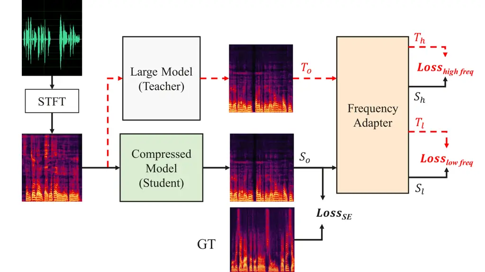
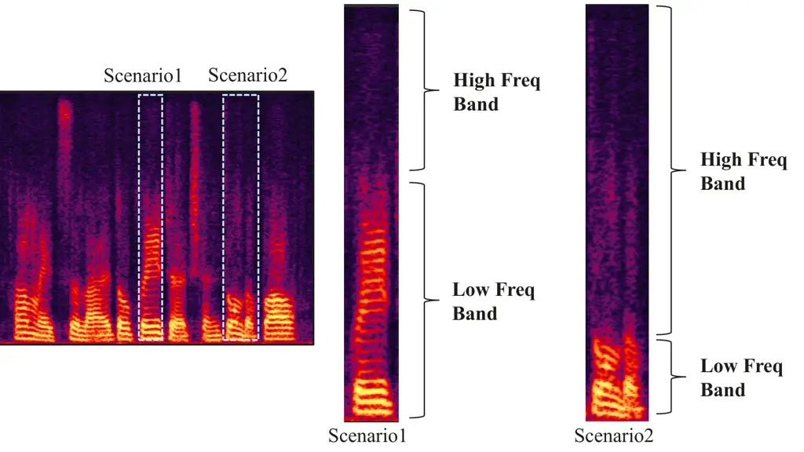

# Dynamic Frequency-Adaptive Knowledge Distillation for Speech Enhancement

Xihao Yuan Affiliation: Noah’s Ark Lab  
Huawei  
Shanghai, China  
yuanxihao@huawei.com Affiliation:     Siqi Liu Affiliation: Noah’s Ark
Lab  
Huawei  
Shanghai, China  
liusiqi37@huawei.com Affiliation:     Hanting Chen Affiliation: Noah’s
Ark Lab  
Huawei  
Shanghai, China  
chenhanting@huawei.com    Lu Zhou Affiliation: Noah’s Ark Lab  
Huawei  
Shanghai, China  
zhoulu29@huawei.com Affiliation:     Jian Li Affiliation: Noah’s Ark
Lab  
Huawei  
Shanghai, China  
lijian368@huawei.com Affiliation:     Jie Hu Affiliation: Noah’s Ark
Lab  
Huawei  
Shanghai, China  
hujie23@huawei.com

###### Abstract

Deep learning-based speech enhancement (SE) models have recently
outperformed traditional techniques, yet their deployment on
resource-constrained devices remains challenging due to high
computational and memory demands. This paper introduces a novel dynamic
frequency-adaptive knowledge distillation (DFKD) approach to effectively
compress SE models. Our method dynamically assesses the model’s output,
distinguishing between high and low-frequency components, and adapts the
learning objectives to meet the unique requirements of different
frequency bands, capitalizing on the SE task’s inherent characteristics.
To evaluate the DFKD’s efficacy, we conducted experiments on three
state-of-the-art models: DCCRN, ConTasNet, and DPTNet. The results
demonstrate that our method not only significantly enhances the
performance of the compressed model (student model) but also surpasses
other logit-based knowledge distillation methods specifically for SE
tasks.

###### Index Terms: 

speech enhancement, frequency band adaptive slice, knowledge
distillation

## I Introduction

Deep learning has permeated various aspects of daily life, with
significant advancements particularly in the realm of speech
enhancement. This field focuses on the suppression of background noise
to achieve clearer and more intelligible speech. Recent studies, such as
DCCRN\[1\], CRN\[2\], and DEMUCS\[3\], have demonstrated that deep
learning algorithms surpass traditional methods in terms of performance.
However, the deployment of deep neural networks (DNNs) on devices with
limited computational resources poses a significant challenge due to
their substantial resource demands. While existing methods attempt to
address this issue, they often struggle to strike a balance between
maintaining model performance and achieving computational efficiency.
Consequently, the development of DNNs that offer effective noise
suppression capabilities without incurring excessive computational costs
has emerged as a pivotal area of research.



Fig. 1: Overview of DFKD. The teacher model’s data flow is represented
by the red dotted line. The output is separated into high and
low-frequency bands using the Frequency Adapter, and different bands are
subjected to the specified loss function. $`Loss_{SE}`$ is a typical
loss function in SE tasks, taking on different forms to accommodate the
varying architectures of different networks.

The primary strategies for model compression include pruning, tensor
decomposition, quantization, and knowledge distillation (KD). Pruning,
which capitalizes on the inherent redundancy in model parameters,
targets the elimination of less critical parameters to streamline the
model\[4\]\[5\]\[6\]\[7\]. Quantization, conversely, focuses on reducing
the bit depth of parameters, typically replacing 16 or 32-bit values
with lower-bit alternatives\[8\]\[9\]\[10\]. Tensor decomposition, on
the other hand, employs matrix or convolutional factorization techniques
to pinpoint and discard non-essential parameters, further optimizing
model size and complexity\[11\]. Unlike the previous three model
compression methods, which often necessitate specialized hardware, KD
offers a more flexible approach. It involves compressing a large,
complex teacher model into a smaller, more efficient one, with minimal
constraints on the design of the compressed model. This paper primarily
focuses on the application of KD in the domain of speech enhancement.

Initially introduced by Hinton in 2015\[12\], KD is a process that
facilitates the transfer of knowledge from a larger model to a smaller
one. By doing so, it enables the student model to emulate the
performance characteristics of the teacher model, thereby enhancing its
capabilities on specific tasks. KD can be broadly classified into three
categories: logits-based, feature-based, and relation-based techniques.
Logits-based KD involves calculating the KD loss by comparing the
outputs of the teacher and student models. This approach has been
extensively researched and has found practical
applications\[12\]\[13\]\[14\]. Feature-based KD, such as FT\[15\] and
DFA\[16\], extend the traditional KD approach by considering not only
the outputs but also the intermediate features of the teacher and
student models. When the student model differs structurally from the
teacher, an auxiliary structure may be introduced to align the feature
dimensions, enabling the computation of a tailored
loss\[17\]\[18\]\[19\].

In contrast to these, relation-based KD delves into the relationships
between feature maps across different layers. Techniques such as
FSP\[20\], CCKD\[21\], and LP\[22\] aim to efficiently construct a
meaningful relationship matrix that captures the inter-layer
dependencies between the teacher and student models.

While KD has made significant strides in computer vision (CV) and
natural language processing (NLP), its application in SE remains largely
uncharted. Existing KD approaches \[23\]\[24\]\[25\]\[26\]\[27\] for SE
often overlook the distinct noise characteristics of high and low
frequency bands by directly computing the loss and distilling the
network’s output. Other frequency-differentiating approaches, like
Suband-KD\[23\], rely on empirically determined fixed crossover
frequencies. This practice fails to account for the diverse and
intricate frequency distributions inherent in various acoustic
environments, particularly in the nuanced treatment of high and low
frequency components.

In this paper, we introduce a dynamic frequency-adaptive knowledge
distillation method designed to bridge this gap. Our technique discerns
between high and low-frequency bands within speech signals across
diverse conditions, such as varying noise levels and distinctions
between male and female voices. By tailoring the loss functions to the
characteristics of these frequency bands, we guide the student model to
achieve a more nuanced balance in noise suppression and speech
enhancement. This adaptive approach to KD in SE represents a significant
advancement over existing methods, offering improved performance in the
compression and enhancement of speech signals.

The rest of this paper is organized as follows. In Section 2, we
introduce the intricacies of our proposed method. Section 3 elaborates
on the experimental details including dataset, implementation and the
analysis of the results. Concluding remarks and implications for future
research are discussed in Section 5.

## II Methodology

### II-A System Overview

DFKD operates on frequency-domain inputs, as illustrated in Figure 1. We
initiate the process by transforming the original time-domain audio
signals into the frequency domain using a Short Time Fourier Transform
(STFT). The resultant frequency-domain signals are then fed into both
the teacher and student models, yielding the teacher output $`T_{o}`$
and the student output $`S_{o}`$, respectively.

Furthermore, our Frequency Adapter module performs real-time analysis of
the frequency-domain signals from $`T_{o}`$ and $`S_{o}`$, identifying
the crossover points that delineate high and low frequencies. This
module effectively bifurcates the signals into high-frequency components
$`T_{h}`$ and $`S_{h}`$, and low-frequency components $`T_{l}`$ and
$`S_{l}`$.

In the training phase, we employ three distinct loss functions:
$`L_{SE}`$, which calculates loss between $`S_{o}`$ and the ground truth
(GT). Following the original paper, it takes different forms for
different networks, such as scale-invariant source-to-noise ratio
(SI-SNR) loss for DCCRN; $`L_{highfreq}`$, which quantifies the
discrepancy between the student and teacher models’ high-frequency
outputs; and $`L_{lowfreq}`$ , which assesses the difference in
low-frequency outputs. Throughout the DFKD training, the teacher model’s
parameters are kept constant, while the student model’s parameters are
iteratively updated based on these three loss functions.

### II-B Frequency Adapter



Fig. 2: Different Scenarios for Frequency Adapter. Frequency Adapter
senses the characteristics of a scene and adaptively divides the
frequency bands, as the distribution of high and low frequencies of
human voice changes over time within one speech clip.

As illustrated in Figure 2, the frequency spectra in real-world
scenarios are inherently complex and the distribution of speech and
noise can fluctuate significantly within short time segments.
Consequently, KD methods that ignore the variable characteristics of
high and low frequency components or rely on fixed crossover points can
be detrimental to a model’s adaptability. These methods often fail to
account for the unique noise characteristics present in different
frequency bands, which is a critical factor for effective speech
enhancement.

The Frequency Adapter module plays a pivotal role in DFKD framework by
identifying the optimal crossover points between high and low frequency
bands in real-time. It dynamically segments the network’s output signal
into two distinct frequency bands and tailors the optimization of these
bands using frequency-specific loss functions. This targeted approach
refines the student model’s performance, ensuring that both speech
retention and noise suppression capabilities are optimized.

In more detail, let’s consider the output of the teacher model, denoted
as $`T_{o}`$. For each sequence segment ranging from 0 to 256 (assuming
that we obtain 257 frequency bins after STFT), the module calculates the
maximum value $`F_{o}`$ from $`T_{o}`$. Here, $`f_{i}`$ represents the
maximum value observed from $`t_{0}`$ to $`t_{i}`$ within the sequence.
This process allows for the adaptive determination of frequency band
boundaries that are most relevant for the given audio signal,
facilitating a more nuanced and effective distillation process.

```math
T_{o}=(t_{0},t_{1},t_{2},...,t_{256}) \tag{1}
```

```math
\displaystyle F_{o}=(f_{0},f_{1},f_{2},...,f_{256}),\text{where}\ f_{i}=\text{max}(t_{0},t_{1},t_{2},...,t_{i}) \tag{2}
```

Following the acquisition of the sequence $`F_{o}`$ , we proceed to
compute its first-order derivative at each frequency point. To mitigate
the risk of division by zero errors during computation, an infinitesimal
value $`\epsilon`$ is incorporated. This precaution ensures numerical
stability in our calculations. Subsequently, we identify the position
$`m`$ at which the first-order derivative attains its maximum value.
This position $`m`$ serves as the demarcation point, enabling us to
segment the outputs of both the teacher model and the student model into
high-frequency and low-frequency components.

```math
\displaystyle\nabla F_{o}=(\nabla f_{0},\nabla f_{1},\nabla f_{2},...,\nabla f_{255}), \tag{3}
```

```math
\displaystyle\text{where}\ \nabla f_{i}=\frac{f_{i+1}-f_{i}}{f_{i}+\epsilon}\ (i\in[0,255])
```

```math
m=\text{argmax}(\nabla F_{o}) \tag{4}
```

```math
\displaystyle S_{h}=(s_{0},s_{1},s_{2},...,s_{m}), \displaystyle S_{l}=(s_{m},s_{m+1},...,s_{256}) \tag{5}
```

```math
\displaystyle T_{h}=(t_{0},t_{1},t_{2},...,t_{m}), \displaystyle T_{l}=(t_{m},t_{m+1},...,t_{256}) \tag{6}
```

The high-frequency ($`T_{h}`$) and low-frequency ($`T_{l}`$) components
of the teacher’s output, along with the corresponding high-frequency
($`S_{h}`$) and low-frequency ($`S_{l}`$) components of the student’s
output, are utilized to apply distinct loss functions tailored to each
frequency band. This strategic approach is designed to enhance the
student’s full-band noise reduction capabilities. By leveraging
frequency-specific loss functions, we aim to refine the student’s
performance in noise suppression and speech quality enhancement across
the entire spectrum of frequencies.

### II-C KD Loss

In the field of speech enhancement, achieving a delicate balance between
noise suppression and speech retention is paramount. While aggressive
noise suppression may inadvertently diminish the clarity of speech by
reducing vocal timbre, an excessive focus on speech retention can result
in inadequate noise reduction, thereby degrading the listening
experience. The ideal model for SE must effectively suppress noise
without compromising the quality and integrity of the speech signal,
particularly within the typical human speech frequency range of 1-4 kHz.
Below 4 kHz, the spectrum is a complex blend of speech and noise, where
speech is more dominant. Above 4 kHz, noise tends to be more prevalent.
However, the distinction between high and low frequencies is not
strictly bounded by the 4 kHz marker, as it varies with acoustic
context, including differences in male and female voice frequency
ranges. Therefore, an SE model must be adaptable to these variations to
optimize performance.

Leveraging the understanding that different frequency bands exhibit
distinct distributions of noise and speech, we can tailor the guidance
provided by loss functions to each band. This approach allows for a more
nuanced optimization of the model, where the high-frequency and
low-frequency components are treated differently to better preserve
speech quality and effectively suppress noise.

In scenarios where speech and noise are mixed in the low-frequency
range, our objective is to develop a model that effectively separates
speech while maximizing noise suppression. Conventional approaches often
aim to simultaneously regulate both amplitude and phase. However, this
coupled approach to amplitude and phase optimization can lead to
suboptimal outcomes for both speech and noise components.

Given the phase invariance characteristic of speech signals and the
arbitrary increase in amplitude, our method modifies this approach. We
relax the amplitude constraints and introduce an enhanced cosine loss
for the low-frequency band. This adaptation encourages the model to
prioritize phase constraints, thereby improving its ability to
distinguish between speech and noise.

The original cosine loss, which has a value range of $`[-1,1]`$, can
cause issues with gradient anomalies and reversed update directions
during the backpropagation phase of training. To address this, we adjust
the cosine loss by subtracting 1, shifting its range to $`[-2,0]`$. This
modification ensures a consistent update direction for the network,
facilitating more effective training and optimization.

```math
\displaystyle L_{\text{cosine}}(T_{o},S_{o})=cos(T_{o},S_{o})-1 \tag{7}
```

```math
\displaystyle L_{\text{low freq}}=L_{\text{cosine}}(T_{l},S_{l}) \tag{8}
```

The high-frequency segment predominantly consists of noise, thus the
primary objective in this frequency range is noise suppression, with a
particular focus on amplitude constraints. However, in certain
scenarios, this frequency band may also contain subtle vocal timbres
essential for speech quality. Consequently, phase constraints are
necessary to preserve these speech characteristics. To address this dual
requirement, we employ a combined loss function that incorporates both
$`L_{\text{l2}}`$ for amplitude constraints and $`L_{\text{cosine}}`$
for phase constraints. Additionally, we introduce a hyperparameter
$`\beta`$ during training, which serves as a control mechanism. This
parameter allows us to adjust the model’s emphasis between noise
suppression and speech retention, ensuring a balanced approach tailored
to the specific requirements of the scenario.

```math
\displaystyle L_{\text{high freq}}= \displaystyle\beta*L_{\text{cosine}}(T_{h},S_{h})+(1-\beta)*L_{\text{l2}}(T_{h},S_{h}) \tag{9}
```

```math
\displaystyle L_{\text{kd}}=L_{\text{low freq}}+L_{\text{high freq}} \tag{10}
```

```math
\displaystyle L_{\text{total}}=\alpha*L_{\text{kd}}+(1-\alpha)*L_{\text{SE}} \tag{11}
```

Finally, we adhere to the conventional logits-based KD approach to
achieve a balance between the knowledge distillation loss
($`L_{\text{kd}}`$) and $`L_{SE}`$. This balance is modulated by the
hyperparameter $`\alpha`$. It is essential to re-emphasize that the
formulation of $`L_{SE}`$ is meticulously aligned with the original
papers for the respective models.

## III Experiments

### III-A Datasets

The experimental models in our study were trained using a dataset
synthesized from the DNS2020 challenge\[28\]. This comprehensive dataset
comprises 500 hours of pristine speech from 2150 unique speakers, along
with 65000 noise clips spanning 150 distinct audio classes sourced from
Audioset, Freesound, and YouTube videos. To prepare the dataset for
training, each audio clip was segmented into 6-second intervals, and the
entire training set was uniformly resampled at a rate of 16 kHz to
ensure consistency across all data points. The signal-to-noise ratio
(SNR) levels were randomly sampled between 0 and 20 dB according to a
uniform distribution.

To substantiate the efficacy of our algorithm, we conducted a
comprehensive evaluation across various test sets. This included the
dev-test subset from the DNS2020 challenge and the combined
VoiceBank+DEMAND test set\[29\]. Consistency in sampling frequency
between the training and testing phases was ensured by resampling all
test clips to 16 kHz, aligning with the training set’s specifications.

### III-B Implementation Details

To evaluate the generalizability of DFKD, we performed experiments on
diverse models including DCCRN-CL\[1\], ConvTasNet\[30\], and
DPTNet\[31\], each with unique architectural designs. For instance,
ConvTasNet primarily operates in the time domain, whereas DCCRN-CL is
adept at handling both time and frequency domains.

Our experiments compared DFKD’s performance against traditional
logits-based knowledge distillation methods: L1, L2, KL, ABC-KD, and
Suband-KD. The L1, L2, and KL methods follow the conventional knowledge
distillation framework by Hinton et al.\[12\], substituting the
knowledge distillation loss $`L_{kd}`$ with $`L_{l1}`$, $`L_{l2}`$, and
$`L_{kl}`$, respectively. ABC-KD and Suband-KD are recognized for their
efficacy in speech enhancement tasks. Notably, to maintain fair
experimental conditions, we used the complete set of labeled training
data for ABC-KD, diverging from its original 50% data usage.

As detailed in Table 1, we further created two student model
configurations by reducing the channels of the teacher model, achieving
45% (small) and 75% (tiny) reductions in Floating Point Operations
(FLOPs) relative to the teacher model. To ensure the accuracy of our
experiments, we retrained the teacher models for each configuration
following the original papers’ guidelines meticulously. The student
models were then trained using the same hyperparameters as their
corresponding teacher models, establishing a baseline for comparison.

|                     |             |              |
| ------------------- | ----------- | ------------ |
| Model               | FLOPs(G)    | Params(M)    |
| DCCRN-CL(teacher)   | 13.47       | 14.66        |
| DCCRN-CL-small      | 7.45 (-45%) | 8.77 (-40%)  |
| DCCRN-CL-tiny       | 3.33 (-75%) | 4.26 (-71%)  |
| ConvTasNet(teacher) | 4.91        | 19.67        |
| ConvTasNet-small    | 2.52 (-49%) | 10.11 (-49%) |
| ConvTasNet-tiny     | 1.32 (-73%) | 5.33 (-73%)  |
| DPTNet(teacher)     | 11.73       | 11.13        |
| DPTNet-small        | 6.63 (-44%) | 6.27 (-44%)  |
| DPTNet-tiny         | 2.97 (-75%) | 2.8 (-75%)   |

TABLE I: FLOPs and Parameters of Models in our experiments.

### III-C Experimental Results and Discussion

Our experimental results, as summarized in Table 2, highlight the
superior performance of our method across various model configurations.
Notably, DFKD outperforms traditional distillation techniques and even
the teacher model under the DCCRN-CL-small and DCCRN-CL-Tiny setups. The
teacher model, with 1.8X and 4X the FLOPs of the small and tiny models
respectively, was surpassed by the small model’s PESQ score by 0.04
points, while the tiny model matched the teacher’s performance. In
contrast, other distillation methods, such as Suband-KD, showed a
significant decrease compared to their baselines, further emphasizing
DFKD’s effectiveness.

In the case of the DPTNet model, DFKD again led to the most significant
improvements, with the small model’s PESQ score increasing by 0.026 and
the tiny model by 0.112 over their baselines. Suband-KD also showed
improvements, particularly for the tiny model, with a 0.079 point
increase over the baseline.

For the ConvTasNet model, which operates in the time domain without LSTM
units and is thus incompatible with ABC-KD and Suband-KD, DFKD still
achieved optimal results. The ConvTasNet-small model’s PESQ score
improved by 0.081 points, outperforming the teacher model with 1.9X more
parameters. These findings underscore DFKD’s ability to enhance model
performance regardless of the model’s architecture or domain of
operation.

The experimental outcomes underscore the superiority of our method over
other distillation techniques across all evaluated models. The
performance variability observed in other distillation methods across
different domains or models highlights the robustness and reliability of
DFKD. These results substantiate the effectiveness and generalizability
of our approach, indicating its potential to consistently enhance model
performance irrespective of the underlying model architecture or
domain-specific challenges.

In addition to our primary experiments, we conducted extensive
cross-dataset testing utilizing the VoiceBank+DEMAND dataset with models
initially trained on the DNS2020. Our method not only maintained its
state-of-the-art (SOTA) performance but also demonstrated the potential
for the student models to surpass their teacher counterparts in specific
configurations. Notably, the student models derived from
DCCRN-CL-small/tiny, DPTNet-small/tiny, and ConvTasNet-small exhibited
superior performance when distilled using DFKD, underscoring the
robustness and generalizability of our approach across different
datasets.

|                      |            |              |         |                  |         |
| -------------------- | ---------- | ------------ | ------- | ---------------- | ------- |
| Model                | Methods    | Test Dataset |         |                  |         |
|                      |            | DNS2020-test |         | VoiceBank+DEMAND |         |
|                      |            | PESQ         | STOI(%) | PESQ             | STOI(%) |
| DCCRN-CL (teacher)   | Scratch    | 3.22         | 94.89   | 3.389            | 91.79   |
| DCCRN-CL-small       | Scratch    | 3.206        | 94.94   | 3.387            | 91.88   |
|                      | L1         | 3.215        | 94.97   | 3.38             | 91.69   |
|                      | L2         | 3.207        | 94      | 3.389            | 91.92   |
|                      | KL         | 3.2          | 94.85   | 3.404            | 92.07   |
|                      | ABC-KD     | 3.214        | 94.95   | 3.382            | 91.87   |
|                      | Suband-KD  | 3.18         | 94.69   | 3.417            | 92.53   |
|                      | DFKD(ours) | 3.262        | 95.13   | 3.431            | 92.2    |
| DCCRN-CL-tiny        | Scratch    | 3.171        | 94.62   | 3.385            | 91.74   |
|                      | L1         | 3.179        | 94.73   | 3.387            | 91.78   |
|                      | L2         | 3.18         | 94.7    | 3.39             | 91.91   |
|                      | KL         | 3.19         | 94.81   | 3.39             | 92.25   |
|                      | ABC-KD     | 3.175        | 94.4    | 3.357            | 91.67   |
|                      | Suband-KD  | 3.142        | 94.58   | 3.374            | 92.14   |
|                      | DFKD(ours) | 3.224        | 94.9    | 3.417            | 92.16   |
| DPTNet (teacher)     | Scratch    | 3.294        | 96.14   | 3.309            | 93.13   |
| DPTNet-small         | Scratch    | 3.255        | 93.7    | 3.306            | 89.31   |
|                      | L1         | 3.274        | 92.04   | 3.312            | 88      |
|                      | L2         | 3.278        | 90.52   | 3.304            | 86.47   |
|                      | KL         | 3.275        | 90      | 3.315            | 90.06   |
|                      | ABC-KD     | 2.878        | 91.59   | 3.092            | 85.32   |
|                      | Suband-KD  | 2.965        | 88.63   | 3.181            | 78.96   |
|                      | DFKD(ours) | 3.281        | 92.05   | 3.338            | 86.12   |
| DPTNet-tiny          | Scratch    | 3.105        | 95.02   | 3.241            | 92.7    |
|                      | L1         | 3.163        | 95.28   | 3.261            | 92.63   |
|                      | L2         | 3.171        | 95.28   | 3.262            | 92.5    |
|                      | KL         | 3.158        | 95.27   | 3.254            | 92.69   |
|                      | ABC-KD     | 3.013        | 94.57   | 3.205            | 92.3    |
|                      | Suband-KD  | 3.184        | 95.3    | 3.298            | 92.65   |
|                      | DFKD(ours) | 3.217        | 95.32   | 3.31             | 92.7    |
| ConvTasNet (teacher) | Scratch    | 3.364        | 96.35   | 3.425            | 93.25   |
| ConvTasNet-small     | Scratch    | 3.314        | 96.21   | 3.42             | 93.33   |
|                      | L1         | 3.145        | 96.29   | 3.396            | 93.37   |
|                      | L2         | 3.254        | 96.2    | 3.364            | 93.36   |
|                      | KL         | 3.105        | 95.2    | 3.236            | 92.79   |
|                      | ABC-KD     | \-           | \-      | \-               | \-      |
|                      | Suband-KD  | \-           | \-      | \-               | \-      |
|                      | DFKD(ours) | 3.345        | 96.42   | 3.463            | 93.51   |
| ConvTasNet-tiny      | Scratch    | 3.256        | 95.83   | 3.364            | 92.86   |
|                      | L1         | 3.251        | 95.78   | 3.368            | 93.01   |
|                      | L2         | 3.251        | 95.78   | 3.349            | 92.8    |
|                      | KL         | 3.148        | 94.9    | 3.273            | 92.61   |
|                      | ABC-KD     | \-           | \-      | \-               | \-      |
|                      | Suband-KD  | \-           | \-      | \-               | \-      |
|                      | DFKD(ours) | 3.291        | 96.03   | 3.394            | 93.22   |

TABLE II: Comparison of PESQ between different KD methods.

## IV Conclusions

This study introduces an innovative dynamic frequency-adaptive knowledge
distillation method tailored for SE tasks. Our method dynamically
segments frequency bands in real-time according to scene-specific
characteristics and selectively applies tailored loss functions to these
bands, representing a novel contribution to knowledge distillation. It
has demonstrated superior efficacy, surpassing traditional logits-based
techniques and, in some cases, outperforming teacher models with greater
computational demands. Extensive experiments across various datasets and
models substantiate the method’s wide generalizability, highlighting its
capability to improve SE in multiple acoustic contexts and network
architectures.

## References

- \[1\] Y. Hu, Y. Liu, S. Lv, M. Xing, S. Zhang, Y. Fu, J. Wu, B. Zhang,
  and L. Xie, “Dccrn: Deep complex convolution recurrent network for
  phase-aware speech enhancement,” _arXiv preprint
  arXiv:2008.00264_, 2020.
- \[2\] K. Tan and D. Wang, “A convolutional recurrent neural network
  for real-time speech enhancement.” in _Interspeech_, vol. 2018, 2018,
  pp. 3229–3233.
- \[3\] A. Défossez, N. Usunier, L. Bottou, and F. Bach, “Demucs: Deep
  extractor for music sources with extra unlabeled data remixed,” _arXiv
  preprint arXiv:1909.01174_, 2019.
- \[4\] Z. Liu, J. Li, Z. Shen, G. Huang, S. Yan, and C. Zhang,
  “Learning efficient convolutional networks through network slimming,”
  in _Proceedings of the IEEE international conference on computer
  vision_, 2017, pp. 2736–2744.
- \[5\] S. Han, J. Pool, J. Tran, and W. Dally, “Learning both weights
  and connections for efficient neural network,” _Advances in neural
  information processing systems_, vol. 28, 2015.
- \[6\] X. Dong, S. Chen, and S. Pan, “Learning to prune deep neural
  networks via layer-wise optimal brain surgeon,” _Advances in neural
  information processing systems_, vol. 30, 2017.
- \[7\] X. Xiao, Z. Wang, and S. Rajasekaran, “Autoprune: Automatic
  network pruning by regularizing auxiliary parameters,” _Advances in
  neural information processing systems_, vol. 32, 2019.
- \[8\] R. Banner, I. Hubara, E. Hoffer, and D. Soudry, “Scalable
  methods for 8-bit training of neural networks,” _Advances in neural
  information processing systems_, vol. 31, 2018.
- \[9\] B. Chmiel, L. Ben-Uri, M. Shkolnik, E. Hoffer, R. Banner, and
  D. Soudry, “Neural gradients are near-lognormal: improved quantized
  and sparse training,” _arXiv preprint arXiv:2006.08173_, 2020.
- \[10\] M. Courbariaux, Y. Bengio, and J.-P. David, “Training deep
  neural networks with low precision multiplications,” _arXiv preprint
  arXiv:1412.7024_, 2014.
- \[11\] L. De Lathauwer, B. De Moor, and J. Vandewalle, “A multilinear
  singular value decomposition,” _SIAM journal on Matrix Analysis and
  Applications_, vol. 21, no. 4, pp. 1253–1278, 2000.
- \[12\] G. Hinton, O. Vinyals, and J. Dean, “Distilling the knowledge
  in a neural network,” _arXiv preprint arXiv:1503.02531_, 2015.
- \[13\] S. W. Kim and H.-E. Kim, “Transferring knowledge to smaller
  network with class-distance loss,” 2017.
- \[14\] Q. Ding, S. Wu, H. Sun, J. Guo, and S.-T. Xia, “Adaptive
  regularization of labels,” _arXiv preprint arXiv:1908.05474_, 2019.
- \[15\] J. Kim, S. Park, and N. Kwak, “Paraphrasing complex network:
  Network compression via factor transfer,” _Advances in neural
  information processing systems_, vol. 31, 2018.
- \[16\] Y. Guan, P. Zhao, B. Wang, Y. Zhang, C. Yao, K. Bian, and
  J. Tang, “Differentiable feature aggregation search for knowledge
  distillation,” in _Computer Vision–ECCV 2020: 16th European
  Conference, Glasgow, UK, August 23–28, 2020, Proceedings, Part XVII
  16_. Springer, 2020, pp. 469–484.
- \[17\] B. Heo, M. Lee, S. Yun, and J. Y. Choi, “Knowledge transfer via
  distillation of activation boundaries formed by hidden neurons,” in
  _Proceedings of the AAAI Conference on Artificial Intelligence_,
  vol. 33, no. 01, 2019, pp. 3779–3787.
- \[18\] S. Zagoruyko and N. Komodakis, “Paying more attention to
  attention: Improving the performance of convolutional neural networks
  via attention transfer,” _arXiv preprint arXiv:1612.03928_, 2016.
- \[19\] B. Heo, J. Kim, S. Yun, H. Park, N. Kwak, and J. Y. Choi, “A
  comprehensive overhaul of feature distillation,” in _Proceedings of
  the IEEE/CVF International Conference on Computer Vision_, 2019, pp.
  1921–1930.
- \[20\] J. Yim, D. Joo, J. Bae, and J. Kim, “A gift from knowledge
  distillation: Fast optimization, network minimization and transfer
  learning,” in _Proceedings of the IEEE conference on computer vision
  and pattern recognition_, 2017, pp. 4133–4141.
- \[21\] B. Peng, X. Jin, J. Liu, D. Li, Y. Wu, Y. Liu, S. Zhou, and
  Z. Zhang, “Correlation congruence for knowledge distillation,” in
  _Proceedings of the IEEE/CVF International Conference on Computer
  Vision_, 2019, pp. 5007–5016.
- \[22\] H. Chen, Y. Wang, C. Xu, C. Xu, and D. Tao, “Learning student
  networks via feature embedding,” _IEEE Transactions on Neural Networks
  and Learning Systems_, vol. 32, no. 1, pp. 25–35, 2020.
- \[23\] X. Hao, S. Wen, X. Su, Y. Liu, G. Gao, and X. Li, “Sub-band
  knowledge distillation framework for speech enhancement,” _arXiv
  preprint arXiv:2005.14435_, 2020.
- \[24\] W. Wang, W. Zhang, S. Lin, and Y. Qian, “Text-informed
  knowledge distillation for robust speech enhancement and recognition,”
  in _2022 13th International Symposium on Chinese Spoken Language
  Processing (ISCSLP)_. IEEE, 2022, pp. 334–338.
- \[25\] M. Thakker, S. E. Eskimez, T. Yoshioka, and H. Wang, “Fast
  real-time personalized speech enhancement: End-to-end enhancement
  network (e3net) and knowledge distillation,” _arXiv preprint
  arXiv:2204.00771_, 2022.
- \[26\] D. Chen, J.-P. Mei, Y. Zhang, C. Wang, Z. Wang, Y. Feng, and
  C. Chen, “Cross-layer distillation with semantic calibration,” in
  _Proceedings of the AAAI Conference on Artificial Intelligence_,
  vol. 35, no. 8, 2021, pp. 7028–7036.
- \[27\] Y. Wan, Y. Zhou, X. Peng, K.-W. Chang, and Y. Lu, “Abc-kd:
  Attention-based-compression knowledge distillation for deep
  learning-based noise suppression,” _arXiv preprint
  arXiv:2305.16665_, 2023.
- \[28\] C. K. Reddy, V. Gopal, R. Cutler, E. Beyrami, R. Cheng,
  H. Dubey, S. Matusevych, R. Aichner, A. Aazami, S. Braun _et al._,
  “The interspeech 2020 deep noise suppression challenge: Datasets,
  subjective testing framework, and challenge results,” _arXiv preprint
  arXiv:2005.13981_, 2020.
- \[29\] C. Valentini-Botinhao, X. Wang, S. Takaki, and J. Yamagishi,
  “Investigating rnn-based speech enhancement methods for noise-robust
  text-to-speech.” in _SSW_, 2016, pp. 146–152.
- \[30\] Y. Luo and N. Mesgarani, “Conv-tasnet: Surpassing ideal
  time–frequency magnitude masking for speech separation,” _IEEE/ACM
  transactions on audio, speech, and language processing_, vol. 27,
  no. 8, pp. 1256–1266, 2019.
- \[31\] J. Chen, Q. Mao, and D. Liu, “Dual-path transformer network:
  Direct context-aware modeling for end-to-end monaural speech
  separation,” _arXiv preprint arXiv:2007.13975_, 2020.
