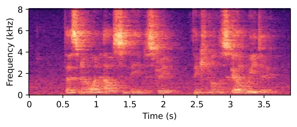
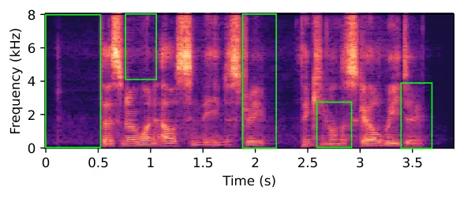
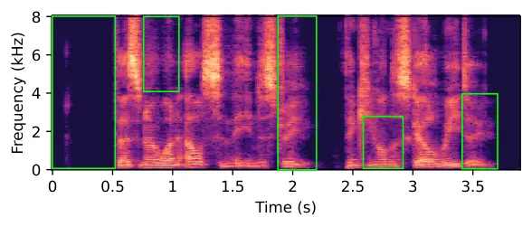
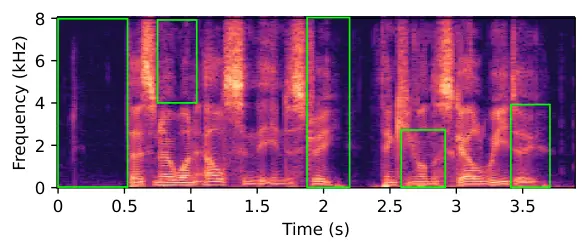

# VINP: Variational Bayesian Inference with Neural Speech Prior for Joint ASR-Effective Speech Dereverberation and Blind RIR Identification

Pengyu Wang[](https://orcid.org/0000-0001-5768-0658)
^(†)^(†)thanks: Pengyu Wang is with Zhejiang University and also with
Westlake University, Hangzhou, China (e-mail:
wangpengyu@westlake.edu.cn).    Ying
Fang[](https://orcid.org/0009-0003-8767-1172)
^(†)^(†)thanks: Ying Fang is with Zhejiang University and also with
Westlake University, Hangzhou, China (e-mail: fangying@westlake.edu.cn).

  
Xiaofei Li[](https://orcid.org/0000-0003-0393-9905)
^(†)^(†)thanks: Xiaofei Li is with the School of Engineering, Westlake
University, and the Institute of Advanced Technology, Westlake Institute
for Advanced Study, Hangzhou, China (e-mail: lixiaofei@westlake.edu.cn).
^(†)^(†)thanks: Xiaofei Li: corresponding author.

###### Abstract

Reverberant speech, denoting the speech signal degraded by
reverberation, contains crucial knowledge of both anechoic source speech
and room impulse response (RIR). This work proposes a variational
Bayesian inference (VBI) framework with neural speech prior (VINP) for
joint speech dereverberation and blind RIR identification. In VINP, a
probabilistic signal model is constructed in the time-frequency (T-F)
domain based on convolution transfer function (CTF) approximation. For
the first time, we propose using an arbitrary discriminative
dereverberation deep neural network (DNN) to estimate the prior
distribution of anechoic speech within a probabilistic model. By
integrating both reverberant speech and the anechoic speech prior, VINP
yields the maximum a posteriori (MAP) and maximum likelihood (ML)
estimations of the anechoic speech spectrum and CTF filter,
respectively. After simple transformations, the waveforms of anechoic
speech and RIR are estimated. VINP is effective for automatic speech
recognition (ASR) systems, which sets it apart from most deep learning
(DL)-based single-channel dereverberation approaches. Experiments on
single-channel speech dereverberation demonstrate that VINP attains
state-of-the-art (SOTA) performance in mean opinion score (MOS) and word
error rate (WER). For blind RIR identification, experiments demonstrate
that VINP achieves SOTA performance in estimating reverberation time at
60 dB (RT60) and advanced performance in direct-to-reverberation ratio
(DRR) estimation. Codes and audio samples are available online¹¹ 1
[https://github.com/Audio-WestlakeU/VINP](https://github.com/Audio-WestlakeU/VINP).

###### Index Terms: 

Speech dereverberation, reverberation impulse response identification,
variational Bayesian inference, convolutive transfer function
approximation, deep learning.

## I Introduction

Reverberation, which is formed by the superposition of multiple
reflections, scattering, and attenuation of sound waves in a closed
space, is one of the main factors degrading speech quality and
intelligibility in daily life. The reverberant speech contains the
crucial knowledge of both anechoic source speech and room impulse
response (RIR). The anechoic source speech is clean and serves as the
target of the dereverberation task (with possible time delay and
scaling). Moreover, RIR characterizes the sound propagation in an
enclosure. An accurate estimate of RIRs contributes to applications
including speech recognition \[1\], speech enhancement \[2\] and
augmented/virtual reality \[3\]. Therefore, given a reverberant
microphone recording, there is a strong need to estimate the anechoic
speech and RIR, leading to two distinct tasks: speech dereverberation
and blind RIR identification, respectively.

A series of classical speech dereverberation approaches build
deterministic signal models of anechoic source speech, RIR, and
reverberant microphone recording. After that, the task is solved by
designing an inverse filter in the time domain \[4\] or time-frequency
(T-F) domain \[4, 5, 6, 7, 8\]. In contrast, another series of classical
methods regard the anechoic source speech and the reverberant microphone
recording as random signals, and use hierarchical probabilistic models
to describe the generation process of the observation. After that,
speech dereverberation is performed by estimating every unknown part in
the probabilistic model, including hidden variables and model
parameters \[9, 10\]. The construction of the probabilistic model is
highly flexible. Similar models can be applied to a variety of fields,
such as speech denoising \[9, 11, 12\] and direct-of-arrival
estimation \[13, 14, 15\]. These classical approaches are model-based,
which makes them free from generalization problems. However, due to the
insufficient utilization of prior knowledge regarding speech and
reverberation, their performance remains unsatisfactory.

In recent decades, data-driven deep learning (DL)-based approaches have
developed rapidly. These approaches rely less on the assumptions of
signal models, instead directly learn the characteristics of speech
signals using deep neural networks (DNNs). The core research of DL-based
approaches focus in the design of DNN structures, features, and loss
functions. The most straightforward DL-based idea is to construct a
discriminative DNN to learn the mapping from degraded speech to target
speech. For instance, authors in \[16, 17, 18, 19, 20, 21\] developed
various discriminative DNNs and loss functions to build mappings in
various feature domains. Another idea is to consider speech
dereverberation as a generative task and utilize generative DNNs, such
as variational autoencoder (VAE) \[22\], generative adversarial network
(GAN) \[23\], and diffusion model (DM) \[24\], to generate anechoic
speech \[25, 26, 27, 28\]. Thanks to the powerful non-linear modeling
ability of DNNs, DL-based methods are able to make the best of a large
amount of data and typically lead to better perceptual performance than
classical approaches. However, when applied as single-channel front-end
systems without joint training, these DL-based methods may introduce
waveform artifacts that degrade subsequent automatic speech recognition
(ASR) performance \[29, 30\].

Particularly, some approaches combine DNNs and probabilistic signal
models, forming a so-called semi-supervised \[31, 32\] or
unsupervised \[33, 34\] paradigm. Unlike fully supervised DL-based
approaches, these methods train VAEs with only clean speech corpora. At
the inference stage, the VAE decoder participates in solving the
probabilistic model by estimating the prior distribution of clean
speech. Usually, the Markov chain Monte Carlo (MCMC) algorithm is used
to sample the latent variables in VAE. Compared with classical methods,
the prior generated by VAE has higher quality and can yield better
performance. Such algorithms are applied to both speech denoising \[31,
32, 33\] and speech dereverberation \[34, 35\]. For instance, in \[34\],
the authors developed a Monte Carlo expectation-maximization (EM)
dereverberation algorithm based on a convolutional VAE and non-negative
matrix factorization (NMF). In our previous work RVAE-EM \[35\], we
employed a more powerful recurrent VAE and found that when the anechoic
speech prior is of sufficient quality, MCMC is unnecessary, thus
avoiding the repeated inference of VAE decoders. Moreover, by
introducing supervised data into the training of VAE, we also obtained a
supervised version of RVAE-EM that performs better than the unsupervised
one. This finding inspired our current work. Given the availability of
many advanced dereverberation DNNs, it is possible to directly apply
them as supervised prior estimators in the probabilistic model solution
through straightforward modifications.

Within the domain of audio signal processing, blind RIR identification
from reverberant microphone recordings is a crucial and challenging area
of research. Currently, methods for blind RIR identification are rather
scarce. In recent years, with the development of DL techniques, some
DL-based approaches have been proposed \[36, 37, 38\]. For instance, in
FiNS \[36\], the authors utilized DNN to learn the direct path, early
reflection, and late reverberation of RIR separately. The authors in
BUDDy \[38\] established a parameterized model for the reverberation
effect and proposed an unsupervised method for joint speech
dereverberation and blind RIR estimation.

In this paper, we propose a Variational Bayesian Inference framework
with Neural speech Prior (VINP) for joint speech dereverberation and
blind RIR identification. Our motivation is as follows: The generation
of reverberant recording can be modeled in a probabilistic model based
on convolution transfer function (CTF) approximation \[39, 40\]. By
treating the DNN output as the prior distribution of anechoic speech and
combining it with the reverberant recording to solve the probabilistic
signal model, we can analytically estimate the anechoic spectrum and the
CTF filter, and subsequently obtain the anechoic speech and RIR
waveforms. By doing this, VINP avoids the direct utilization of DNN
output but still leverages the powerful nonlinear modeling capability of
DNN, and further ensures that the estimates and observations align with
the CTF-based signal model, thereby benefiting ASR. Different from our
previous work RVAE-EM \[35\], in VINP, we propose to employ an arbitrary
discriminative DNN to learn the prior distribution of anechoic speech by
modifying the loss function during training. Moreover, a major drawback
of RVAE-EM is that the computational complexity scales cubically with
speech duration. In VINP, we use variational Bayesian inference
(VBI) \[41, 42\] to analytically solve the probabilistic model. Thanks
to VBI, the computational complexity in VINP increases linearly with the
speech duration. Parallel computation is available across T-F bins for
efficient implementation.

This paper has the following contributions:

- •
  We propose VINP, a novel framework for joint speech dereverberation
  and blind RIR identification. For the first time, we propose
  introducing an arbitrary discriminative dereverberation DNN as a
  backbone into VBI to successfully complete these two tasks.
- •
  VINP avoids the direct utilization of DNN output but still utilizes
  the powerful nonlinear modeling capability of the network, and further
  ensures that the estimates and observations align with the CTF-based
  signal model. As a result, VINP attains state-of-the-art (SOTA)
  performance in mean opinion score (MOS) and word error rate (WER).
- •
  VINP can be used for blind RIR identification. Experiments demonstrate
  that VINP attains SOTA and advanced levels in the blind estimation of
  reverberation time at 60dB (RT60) and direct-to-reverberation ratio
  (DRR).
- •
  From the perspective of computational complexity, VINP exhibits linear
  scaling with respect to the speech duration, representing a
  significant improvement over the cubical scaling in our previous work
  RVAE-EM \[35\]. Moreover, the VBI procedure enables parallel
  processing across T-F bins, which further accelerates inference.

The remainder of this paper is organized as follows: Section II
formulates the signal model and the tasks. Section III details the
proposed VINP framework. Experiments and discussions are presented in
Section IV. Finally, Section V concludes the entire paper.

## II Signal Model and Tasks

### II-A Signal Model

Considering the scenario of a single static speaker and stationary
noise, the reverberant recording (also known as observation) received by
a distant microphone can be modeled in the time domain as

```math
x(n)=h(n)*s(n)+w(n), \tag{1}
```

where $`*`$ is the convolution operator, $`n`$ is the index of sampling
points, $`x(n)`$ is the observation signal, $`s(n)`$ is the anechoic
source speech signal, $`h(n)`$ is the RIR which describes a
time-invariant linear filter, and $`w(n)`$ is the background additive
noise.

Analyzing and processing speech signals and the very long RIR filter
(normally thousands of taps) in the time domain poses significant
challenges. For example, the estimation of filter, e.g. Eq. (25) in the
proposed method, shares similar solutions in T-F domain and time domain.
But the solution in time domain requires the inversion of a very large
correlation matrix, which suffers from very high computational/memory
costs and poor robustness. Therefore, performing short-time Fourier
transform (STFT), we analyze the signals in T-F domain, in which
reverberation can be modeled using a series of cross-band
filters \[39\]. Since the energy of cross-band filters is concentrated
and more crossband filters may lead to a higher variance in estimation
error \[39\], we consider only band-to-band filters to simplify the
analysis, resulting in CTF approximation \[40\]. Theoretical and
experimental error analysis of CTF approximation appears in \[39\] and
\[43\]. The observation in the T-F domain is

```math
\displaystyle X(f,t) \displaystyle\approx\sum_{l=0}^{L-1}H_{l}(f)S(f,t-l)+W(f,t) \tag{2}
```

```math
\displaystyle=\mathbf{H}(f)\mathbf{S}(f,t)+W(f,t),
```

where $`f`$ and $`t`$ are the indices of frequency band and STFT frame,
respectively; $`L`$ is the length of CTF filter; $`X(f,t)`$, $`S(f,t)`$,
$`W(f,t)`$, and $`H_{l}(f)`$ are the complex-valued observation signal,
source speech signal, noise signal, and CTF coefficient, respectively;
$`\mathbf{H}(f)=\left[H_{L-1}(f),\cdots,H_{0}(f)\right]\in\mathbb{C}^{1\times L}`$,
$`\mathbf{S}(f,t)=\left[S(f,t-L+1),\cdots,S(f,t)\right]^{T}\in\mathbb{C}^{L\times 1}`$.

Furthermore, the observation $`X(f,t)`$, the anechoic source $`S(f,t)`$,
and noise $`W(f,t)`$ are modeled as random signals. We have the
following assumptions regarding their prior distributions.

- •
  Assumption 1: The anechoic source speech $`S(f,t)`$ follows a
  time-variant zero-mean complex-valued Gaussian prior distribution,
  while the noise signal $`W(f,t)`$ follows a time-invariant zero-mean
  complex-valued Gaussian prior distribution. Therefore, we have

  ```math
  \left\{\begin{aligned} &S(f,t)\sim\mathcal{CN}\left(0,\alpha^{-1}(f,t)\right)\\
  &W(f,t)\sim\mathcal{CN}\left(0,\delta^{-1}(f)\right),\\
  \end{aligned}\right. \tag{3}
  ```

  where $`\alpha(f,t)`$ and $`\delta(f)`$ are the precisions of the
  Gaussian distributions.

- •
  Assumption 2: Both the anechoic source speech signal $`S(f,t)`$ and
  the noise signal $`W(f,t)`$ are statistically independent across all
  T-F bins. Defining
  $`\mathbf{S}=[S(1,1),\cdots,S(1,T),\cdots,S(F,T)]^{T}\in\mathbb{C}^{1\times FT}`$
  and
  $`\mathbf{W}=[W(1,1),\cdots,W(1,T),\cdots,W(F,T)]^{T}\in\mathbb{C}^{1\times FT}`$,
  we have

  ```math
  \left\{\begin{aligned} &\mathbf{S}\sim\prod_{f=1}^{F}\prod_{t=1}^{T}p\left(S(f,t)\right)\\
  &\mathbf{W}\sim\prod_{f=1}^{F}\prod_{t=1}^{T}p\left(W(f,t)\right).\\
  \end{aligned}\right. \tag{4}
  ```

- •
  Assumption 3: The anechoic source speech $`\mathbf{S}`$ and noise
  $`\mathbf{W}`$ are independent of each other, which means

  ```math
  \mathbf{S},\mathbf{W}\sim p(\mathbf{S})p(\mathbf{W}). \tag{5}
  ```

With all the aforementioned assumptions, the conditional probability of
the observation signal can be expressed as

```math
\left\{\begin{aligned} &X(f,t)|\mathbf{S}(f,t);\boldsymbol{\theta}(f)\sim\mathcal{CN}\left(\mathbf{H}(f)\mathbf{S}(f,t),\delta^{-1}(f)\right)\\
&\mathbf{X}|\mathbf{S};\boldsymbol{\theta}\sim\prod_{f=1}^{F}\prod_{t=1}^{T}p\left(X(f,t)|\mathbf{S}(f,t);\boldsymbol{\theta}(f)\right),\\
\end{aligned}\right. \tag{6}
```

where $`\boldsymbol{\theta}(f)=\left\{\delta(f),\mathbf{H}(f)\right\}`$
and
$`\boldsymbol{\theta}=\left\{\boldsymbol{\theta}(f)|_{f=1}^{F}\right\}`$.
The probabilistic graphical model, which describes the generation
process of reverberant recording, is shown in Fig. 1.

Fig. 1: Probabilistic graphical model in VINP.

### II-B Task Description

Our goal is to jointly achieve speech dereverberation and blind RIR
identification by solving all hidden variables and parameters in Fig. 1
via VBI.

For speech dereverberation, our focus is on the anechoic speech
spectrum, which corresponds to the hidden variables in our probabilistic
graphical model. We aim to get its maximum a posteriori (MAP) estimate
given the reverberant recording, written as

```math
\hat{\mathbf{S}}=\argmax\limits_{\mathbf{S}}p(\mathbf{S}|\mathbf{X};\boldsymbol{\theta}), \tag{7}
```

where the posterior distribution of anechoic source signal can be
represented according to Bayes’ rule as

```math
p(\mathbf{S}|\mathbf{X};\boldsymbol{\theta})=\frac{p(\mathbf{S})p(\mathbf{X}|\mathbf{S};\boldsymbol{\theta})}{\int p(\mathbf{S})p(\mathbf{X}|\mathbf{S};\boldsymbol{\theta})\mathrm{d}\mathbf{S}}. \tag{8}
```

For blind RIR identification, our focus is on the CTF filter, which
corresponds to the model parameters in our probabilistic model. Defining
the CTF filter in all frequency bands as
$`\mathbf{H}=\left[\mathbf{H}(1),\cdots,\mathbf{H}(F)\right]`$, we aim
to obtain its maximum likelihood (ML) estimate, written as

```math
\hat{\mathbf{H}}=\argmax\limits_{\mathbf{H}}p(\mathbf{S},\mathbf{X};\boldsymbol{\theta}). \tag{9}
```

The CTF filter provides a representation of RIR in the T-F domain. We
reconstruct the RIR waveform from CTF coefficients through a pseudo
measurement process, as detailed in Section III.

## III Proposed Method

In VINP, we propose using an arbitrary discriminative dereverberation
DNN to estimate the prior distribution of anechoic speech and using VBI
to analytically estimate the anechoic spectrum and CTF filter.
Subsequently, we use a pseudo measurement process to transform the CTF
filter into the RIR waveform. The overview of VINP is shown in Fig. 2.

Fig. 2: Overview of VINP.

### III-A Estimation of Anechoic Speech Prior

The direct-path speech signal, which is a scaled and delayed version of
the anechoic source speech signal, is free from noise and reverberation.
To avoid estimating the arbitrary direct-path propagation delay and
attenuation, instead of the actual source speech, we setup the
direct-path speech as the source speech and our target signal, which is
still denoted as $`s(n)`$ or $`\mathbf{S}`$. Correspondingly, the RIR
begins with the impulse response of the direct-path propagation.

In VINP, we consider the periodogram of the direct-path speech signal as
the variance of the anechoic speech prior $`p(\mathbf{S})`$. In each T-F
bin, the ideal precision parameter $`\alpha(f,t)`$ in Eq. (3) is

```math
\alpha(f,t)=1/{|S(f,t)|^{2}}. \tag{10}
```

Because Eq. (10) is unavailable in practice, we propose using an
arbitrary discriminative dereverberation DNN to estimate the anechoic
speech prior $`p(\mathbf{S})`$. DNN constructs a mapping from
reverberant magnitude spectrum $`|\mathbf{X}|`$ to the anechoic
magnitude spectrum $`|{\hat{\mathbf{S}}}_{\mathrm{N}}|`$ as

```math
|{\hat{\mathbf{S}}}_{\mathrm{N}}|=f_{\mathrm{DNN}}\left(\left|\mathbf{X}\right|\right). \tag{11}
```

Correspondingly, the estimated anechoic speech prior becomes

```math
p(\hat{\mathbf{S}}_{\mathrm{N}})=\prod_{f=1}^{F}\prod_{t=1}^{T}\mathcal{C}\mathcal{N}\left(0,\alpha_{\mathrm{N}}^{-1}(f,t)\right), \tag{12}
```

where

```math
\alpha_{\mathrm{N}}(f,t)=1/{|\hat{S}_{\mathrm{N}}(f,t)|^{2}}. \tag{13}
```

Similar to $`|S(f,t)|`$, $`|\hat{S}_{\mathrm{N}}(f,t)|`$ is an element
in $`|{\hat{\mathbf{S}}}_{\mathrm{N}}|`$ that corresponds to frequency
band $`f`$ and frame $`t`$.

Regarding the loss function, we employ the average Kullback-Leibler (KL)
divergence \[44\] to measure the distance of the estimated prior
distribution $`p(\hat{\mathbf{S}}_{\mathrm{N}})`$ and oracle prior
distribution $`p(\mathbf{S})`$ as

```math
\displaystyle\mathcal{L}=\mathrm{E}_{\mathrm{data}}\left[\frac{\mathrm{KL}\left(p(\hat{\mathbf{S}}_{\mathrm{N}})||p(\mathbf{S})\right)}{FT}\right] \tag{14}
```

```math
\displaystyle=\mathrm{E}_{\mathrm{data},f,t}\left[\ln\left({\frac{|S(f,t)|^{2}+\epsilon}{|\hat{S}_{\mathrm{N}}(f,t)|^{2}+\epsilon}}\right)+{\frac{|\hat{S}_{\mathrm{N}}(f,t)|^{2}+\epsilon}{|S(f,t)|^{2}+\epsilon}}-1\right],
```

where $`\epsilon`$ is a small constant to avoid numerical instabilities.
Such a loss function differs from that in conventional discriminative
dereverberation DNNs, which directly estimate the anechoic spectrum, yet
it shares the same formulation as the Itakura-Saito divergence between
spectrograms employed in \[33, 34, 35, 45\]. In preliminary experiments,
we have also explored various loss functions, including mean squared
error (MSE) and mean absolute error (MAE) for linear and logarithmic
magnitude spectra, alongside backward KL divergence. The experimental
results confirm that the KL loss outperforms all the alternatives.

Following the DNN, approximations
$`p({\mathbf{S}})\approx p(\hat{\mathbf{S}}_{\mathrm{N}})`$ and
$`\alpha(f,t)\approx\alpha_{\mathrm{N}}(f,t)`$ are employed in the
subsequent VBI procedure. Notice that the independent assumption of
anechoic speech prior is merely intended to simplify the subsequent
derivation of VBI. The DNN learning of speech prior is not limited to
the exclusion of correlations between T-F bins.

### III-B Variational Bayesian Inference

Given the estimated prior distribution of anechoic speech and the
observation, we solve all hidden variables and parameters via Bayesian
inference.

The posterior distribution
$`p(\mathbf{S}|\mathbf{X};\boldsymbol{\theta})`$ is intractable due to
the integral term in Eq. (8). Therefore, we turn to VBI, a powerful tool
for resolving hierarchical probabilistic models \[46\]. More
specifically, we employ the variational expectation-maximization (VEM)
algorithm, which provides a way for approximating the complex posterior
distribution $`p(\mathbf{S}|\mathbf{X};\boldsymbol{\theta})`$ with a
factored distribution $`q(\mathbf{S})`$ according to the mean-field
theory (MFT) as

```math
p(\mathbf{S}|\mathbf{X};\boldsymbol{\theta})\approx q(\mathbf{S})=\prod_{f=1}^{F}\prod_{t=1}^{T}q\left(S(f,t)\right). \tag{15}
```

After factorization, VEM estimates the posterior $`q(\mathbf{S})`$ and
model parameters $`\boldsymbol{\theta}`$ by E-step and M-step
respectively and iteratively as

```math
\ln{q\left(S(f,t)\right)}=\left<\ln{p(\mathbf{S},\mathbf{X};\boldsymbol{\theta})}\right>_{\mathbf{S}\backslash S(f,t)} \tag{16}
```

and

```math
{\hat{\boldsymbol{\theta}}=\argmax\limits_{\boldsymbol{\theta}}\left<\ln{p(\mathbf{S},\mathbf{X};\boldsymbol{\theta})}\right>_{\mathbf{S}},} \tag{17}
```

where $`\backslash`$ denotes the set subtraction and
$`\left<\cdot\right>_{\cdot}`$ denotes expectation. For simplicity, in
the subsequent descriptions, we omit the subscript of
$`\left<\cdot\right>_{\mathbf{S}}`$. We do not update the precision
parameter $`\alpha(f,t)`$ during iterations to prevent the degradation
of prior distribution.

The specific formulas are as follows:

#### III-B1 E-step

In this step, we update the posterior distribution of the anechoic
spectrum given the observation and estimated model parameters.
Substitute the probabilistic model into Eq. (16), we have

```math
\displaystyle\ln{q\left({S}(f,t)\right)} \tag{18}
```

```math
\displaystyle=\left<\ln{p({\mathbf{S}},\mathbf{X};\boldsymbol{\theta})}\right>_{{\mathbf{S}}\backslash{S}(f,t)}
```

```math
\displaystyle=\ln{p\left({S}(f,t)\right)}
```

```math
\displaystyle+\left<\sum_{l=0}^{L-1}\ln{p\left(X(f,t+l)|{\mathbf{S}}(f,t+l);\boldsymbol{\theta}(f)\right)}\right>_{{\mathbf{S}}\backslash{S}(f,t)}+c,
```

where $`c`$ is a constant term that is independent of $`{S}(f,t)`$, and

```math
\left\{\begin{aligned} &\ln{p\left({S}(f,t)\right)}=\ln{\alpha(f,t)}-\alpha(f,t)\left|{S}(f,t)\right|^{2}+c\\
&\ln{p\left(X(f,t+l)|{\mathbf{S}}(f,t+l);\boldsymbol{\theta}(f)\right)}\\
&\quad=\ln{\delta(f)}-\delta(f)\left|X(f,t+l)-\mathbf{H}(f){\mathbf{S}}(f,t+l)\right|^{2}+c.\\
\end{aligned}\right. \tag{19}
```

According to the property of Gaussian distribution, the posterior
distribution is also Gaussian, written as

```math
q\left({S}(f,t)\right)=\mathcal{CN}\left({\mu}(f,t),{\gamma}^{-1}(f,t)\right), \tag{20}
```

whose precision and mean have closed-form solutions as

```math
\left\{\begin{aligned} &\hat{\gamma}(f,t)=\alpha(f,t)+\delta(f)||\mathbf{H}(f)||_{2}^{2}\\
&\hat{\mu}(f,t)={\gamma}^{-1}(f,t)\delta(f)\\
&\quad\times\left[\sum_{l=0}^{L-1}H_{l}^{*}(f)\left[X(f,t+l)-\mathbf{H}_{\backslash l}(f)\hat{\boldsymbol{\mu}}_{\mathrm{pre}}(f,t+l)\right]\right],\end{aligned}\right. \tag{21}
```

where $`\mathbf{H}_{\backslash l}(f)`$ is same as $`\mathbf{H}(f)`$
except that $`H_{l}(f)`$ is set to $`0`$, and
$`\hat{\boldsymbol{\mu}}_{\mathrm{pre}}(f,t+l)=\left[{\hat{\mu}}_{\mathrm{pre}}(f,t+l-L+1),\cdots,{\hat{\mu}}_{\mathrm{pre}}(f,t+l)\right]^{T}`$
contains the estimates of means from the previous VEM iteration.

In order to make VEM converge more smoothly, we further apply an
exponential moving average (EMA) to the estimates in Eq. (21) as

```math
\left\{\begin{aligned} &\hat{\gamma}^{-1}(f,t)=\lambda\hat{\gamma}^{-1}_{\mathrm{pre}}(f,t)+(1-\lambda)\hat{\gamma}^{-1}(f,t)\\
&\hat{\mu}(f,t)=\lambda\hat{\mu}_{\mathrm{pre}}(f,t)+(1-\lambda){\hat{\mu}}(f,t),\end{aligned}\right. \tag{22}
```

where $`\lambda`$ is a smoothing factor,
$`\hat{\mu}_{\mathrm{pre}}(f,t)`$ and
$`\hat{\gamma}^{-1}_{\mathrm{pre}}(f,t)`$ are the estimates from the
previous VEM iteration. The mean of the posterior distribution is the
MAP estimate of anechoic spectrum $`\hat{\mathbf{S}}`$. It is also worth
noticing that the E-step can be implemented in parallel across all T-F
bins.

#### III-B2 M-step

In this step, VEM updates the noise precision and CTF filter by
maximizing the expected logarithmic likelihood of the complete data,
which is

```math
\displaystyle\left<\ln{p\left({\mathbf{S}},\mathbf{X};\boldsymbol{\theta}\right)}\right> \tag{23}
```

```math
\displaystyle=\left<\ln{p\left(\mathbf{X}|{\mathbf{S}};\boldsymbol{\theta}\right)}\right>+c
```

```math
\displaystyle=T\ln{\delta(f)}-\delta(f)\left<\sum_{t=1}^{T}\left|X(f,t)-\mathbf{H}(f){\mathbf{S}}(f,t)\right|^{2}\right>+c,
```

where $`c`$ is a constant term that is independent of $`\delta(f)`$ and
$`\mathbf{H}(f)`$. Setting the first derivative with respect to the
parameters to zero, the noise precision is updated as

```math
\displaystyle\hat{\delta}(f) \tag{24}
```

```math
\displaystyle=T\bigg/\sum\limits_{t=1}^{T}\left[\left|X(f,t)\right|^{2}-2\mathrm{Re}\left\{X^{*}(f,t)\mathbf{H}(f)\left<{\mathbf{S}}(f,t)\right>\right\}\right.
```

```math
\displaystyle+\left.{\mathbf{H}(f)\left<{\mathbf{S}}(f,t){\mathbf{S}}^{H}(f,t)\right>\mathbf{H}^{H}(f)}\right],
```

and the CTF filter is updated as

```math
\displaystyle\hat{\mathbf{H}}(f) \tag{25}
```

```math
\displaystyle=\left[\sum_{t=1}^{T}X(f,t)\left<{\mathbf{S}}^{H}(f,t)\right>\right]\left[\sum_{t=1}^{T}\left<{\mathbf{S}}(f,t){\mathbf{S}}^{H}(f,t)\right>\right]^{-1},
```

where

```math
\left<\mathbf{S}(f,t)\right>=\boldsymbol{\mu}(f,t)=\left[\mu(f,t-L+1),\cdots,\mu(f,t)\right]^{T}, \tag{26}
```

and

```math
\displaystyle\left<\mathbf{S}(f,t)\mathbf{S}^{H}(f,t)\right> \tag{27}
```

```math
\displaystyle=\boldsymbol{\mu}(f,t)\boldsymbol{\mu}^{H}(f,t)
```

```math
\displaystyle+\mathrm{diag}([\gamma^{-1}(f,t-L+1),\cdots,\gamma^{-1}(f,t)]).
```

$`\mathrm{diag}(\cdot)`$ denotes the operation of constructing a
diagonal matrix. Just like the E-step, the M-step can also be
implemented in parallel across all T-F bins.

#### III-B3 Initialization of VEM Parameters

The initialization of parameters plays a crucial role in the convergence
of VEM. We use an uninformative initialization in VINP. Before
iteration, the mean and variance of the anechoic speech posterior
$`p(\mathbf{S})`$ are set to zero and the spectrogram of reverberant
recording respectively as

```math
\left\{\begin{aligned} &\gamma(f,t)=1/\left|X(f,t)\right|^{2}\\
&\mu(f,t)=0.\\
\end{aligned}\right. \tag{28}
```

The CTF coefficients in each frequency band are set to 0, except that
the first coefficient is set to 1, which means

```math
H_{l}(f)=\left\{\begin{aligned} &1,\quad l=0\\
&0,\quad 1\leq l\leq L-1.\\
\end{aligned}\right. \tag{29}
```

Because even during speech activity, the short-term power spectral
density of observation often decays to values representative of the
noise power level \[47\], the initial variance of the additional noise
in each frequency band is set to the minimum power across all frames,
which means

```math
\delta(f)=\left[\min\limits_{t}\left(\left|X(f,t)\right|^{2}\right)\right]^{-1}. \tag{30}
```

#### III-B4 Outputs of VBI

During VEM iteration, in each frequency band, there is a narrow-band
expected logarithmic likelihood of complete data, written as
$`\left<\ln p\left(\mathbf{S}(f),\mathbf{X}(f);\boldsymbol{\theta}(f)\right)\right>`$.
Once VEM reaches the preset maximum number of iterations, it terminates.
In each frequency band, the output of VBI procedure is the estimated
complex-valued clean spectrum $`\hat{\mathbf{S}}(f)`$ and CTF filter
$`\hat{\mathbf{H}}(f)`$ corresponding to the maximum expected
logarithmic likelihood.

The VBI procedure is summarized in Algorithm 1. The prior distribution
of anechoic speech serves to constrain the infinite set of potential
solutions inherent in the signal model, which is the key to effective
dereverberation \[48\]. Note that in the proposed framework, the prior
distribution of anechoic speech remains unchanged during iterations.
Therefore, the DNN performs inference through a single forward pass
without iterative optimization.

0:  Reverberant microphone recording $`\mathbf{X}`$;

0:  Anechoic speech spectrum estimate $`\hat{\mathbf{S}}`$ and CTF
filter estimate $`\hat{\mathbf{H}}`$;

1:  Estimate prior distribution of anechoic speech using Eq. (11), Eq.
(12) and Eq. (13);

2:  Initialize VEM parameters using Eq. (28), Eq. (29) and Eq. (30);

3:  repeat

4:   E-step: update the posterior distribution of anechoic speech using
Eq. (21) and Eq. (22);

5:   M-step: update the parameter estimates of the signal model using
Eq. (24) and Eq. (25);

6:  until Reach the maximum number of iterations.

Algorithm 1 VBI procedure.

### III-C Transformation to Waveforms

After the VBI procedure, both the anechoic spectrum and the CTF filter
are estimated. We need to further transform these T-F representations
into waveforms. By applying inverse STFT to the anechoic spectrum, we
can easily obtain the anechoic speech waveform. However, CTF is the
model of reverberation in the T-F domain rather than the STFT of RIR.
Therefore, we cannot convert the CTF filter to RIR directly. In VINP, we
design a pseudo intrusive measurement process to obtain the RIR estimate
as follows.

Reviewing existing approaches, a common method for intrusive measuring
the RIR of an acoustical system is to apply a known excitation signal
and measure the microphone recording \[49\]. When a loudspeaker plays an
excitation signal $`e(n)`$, the noiseless microphone recording $`y(n)`$
can be written as

```math
y(n)=h(n)*e(n), \tag{31}
```

where $`h(n)`$ has the same meaning as in Eq. (1). A commonly used
logarithmic sine sweep excitation signal can be expressed as \[49, 50\]

```math
e(n)=\sin\left[\frac{N\omega_{1}}{\ln\left({\omega_{2}}/{\omega_{1}}\right)}\left(e^{n\ln\left({\omega_{2}}/{\omega_{1}}\right)/N}-1\right)\right], \tag{32}
```

where $`\omega_{1}`$ is the initial radian frequency and $`\omega_{2}`$
is the final radian frequency of the sweep with duration $`N`$. Through
an ideal inverse filter $`v(n)`$, the excitation signal can be
transformed into an impulse $`\delta(n)`$, as

```math
e(n)*v(n)=\delta(n). \tag{33}
```

For the logarithmic sine sweep excitation, the inverse filter $`v(n)`$
is an amplitude-modulated and time-reversed version of itself \[49,
50\]. Subsequently, the RIR can be estimated by convolving the
measurement $`y(n)`$ with the inverse filter $`v(n)`$ as

```math
h(n)=y(n)*v(n). \tag{34}
```

In our approach, the excitation signal is convoluted with the CTF filter
in the T-F domain along the time dimension to yield a pseudo measurement
spectrum $`\tilde{Y}(f,t)`$ as

```math
\tilde{Y}(f,t)={\mathbf{H}}(f)\mathbf{E}(f,t), \tag{35}
```

where
$`\mathbf{E}(f,t)=\left[E(f,t-L+1),\cdots,E(f,t)\right]^{T}\in\mathbb{C}^{L\times 1}`$,
$`\tilde{Y}(f,t)`$ and $`E(f,t)`$ are the STFT coefficient of
$`\tilde{y}(n)`$ and $`e(n)`$, respectively. Applying inverse STFT to
$`\tilde{Y}(f,t)`$, we use the pseudo measurement $`\tilde{y}(n)`$ and
the inverse filter $`v(n)`$ to estimate the RIR waveform as

```math
\hat{h}(n)=\tilde{y}(n)*v(n). \tag{36}
```

The transformation from the CTF filter to RIR waveform is summarized in
Algorithm 2.

0:  CTF filter $`{\mathbf{H}}`$;

0:  RIR waveform estimate $`\hat{h}(n)`$;

1:  Pick a pair of excitation signal $`e(n)`$ and its inverse filter
$`v(n)`$;

2:  Build a pseudo measurement signal $`\tilde{y}(n)`$ using Eq. (35);

3:  Estimate RIR $`\hat{h}(n)`$ by inverse filtering as Eq. (36).

Algorithm 2 Transformation from CTF to RIR.

## IV Experiments

### IV-A Datasets

VINP is designed for joint speech dereverberation and blind RIR
identification. We use a single training set and two different test
sets. To ensure sampling rate consistency, all audio utterances in these
datasets are downsampled to 16 kHz.

#### IV-A1 Training Set

The training utterances are generated by convolving anechoic source
speech with reverberant and direct-path RIRs, followed by noise
addition. The source speech consists of 200 hours of high-quality
English speech utterances, including the clean speech from DNS
Challenge \[51\] and VCTK \[52\] that have a raw DNSMOS p.835
score \[53\] exceeding 3.5, as well as the whole EARS \[54\] corpus. We
simulate 100,000 pairs of reverberant and direct-path RIRs using the
gpuRIR toolbox \[55\]. The simulated speaker and omnidirectional
microphone are randomly placed in rooms with dimensions randomly
selected within a range of 3 m to 15 m for length and width, and 2.5 m
to 6 m for height. The minimum distance between the speaker/microphone
and the wall is 1 m. Reverberant RIRs have RT60s uniformly distributed
within the range of 0.2 s to 1.5 s. Direct-path RIRs are generated using
the same geometric parameters as the reverberant ones but with an
absorption coefficient of 0.99. Noise recordings from NOISEX-92 \[56\]
and the training set of REVERB Challenge \[57\] are used. The
signal-to-noise ratio (SNR) is uniformly distributed within the range of
5 dB to 20 dB.

#### IV-A2 Test Set for Speech Dereverberation

For speech dereverberation, we utilize the official single-channel test
set from the REVERB Challenge \[57\], which includes both simulated
recordings (marked as ’SimData’) and real recordings (marked as
’RealData’).

In SimData, there exist six distinct reverberation conditions: three
room volumes (small, medium, and large), and two distances between the
speaker and the microphone (50 cm and 200 cm). The RT60 values are
approximately 0.25 s, 0.5 s, and 0.7 s. The noise is stationary, mainly
generated by air conditioning systems. SimData has a SNR of 20 dB.

RealData consists of utterances spoken by human speakers in a noisy and
reverberant meeting room. It includes two reverberation conditions: one
room and two distances between the speaker and the microphone array
(approximately 100 cm and 250 cm). The RT60 is about 0.7 s.

#### IV-A3 Test Set for Blind RIR Identification

A test set named ’SimACE’ is constructed to evaluate blind RIR
identification. In SimACE, microphone signals are simulated by
convolving the clean speech from the ’si_et_05’ subset in WSJ0
corpus \[58\] with the downsampled recorded RIRs from the ’Single’
subset in ACE Challenge \[59\], and adding noise from the test set in
REVERB Challenge \[57\]. The minimum and maximum RT60s are 0.332 s and
1.22 s, respectively. More details about the RIRs can be found
in \[59\]. SimACE has a SNR of 20 dB.

Notice that, for both tasks, the RIRs in the test sets are real-measured
instead of simulated, which may lead to some mismatch with the training
set.

### IV-B Implementation of VINP

#### IV-B1 Data Representation

Before feeding the speech into VINP, the reverberant waveform is
normalized by its maximum absolute value. The STFT analysis window and
synthesis window are set to Hann windows with a length of 512 samples
and 75% overlap.

(a) VINP-TCN+SA+S

(b) VINP-oSpatialNet

Fig. 3: DNN architectures in VINP.

#### IV-B2 DNN Architecture

VINP is able to employ any discriminative dereverberation DNNs to
estimate the prior distribution of anechoic speech. Two representative
dereverberation backbones TCN+SA+S \[18\] and oSpatialNet-Mamba \[60\]
are selected. Among those backbones, TCN+SA+S includes a self-attention
module to produce dynamic representations given input features, a
temporal convolutional network (TCN) to learn a nonlinear mapping from
such representations to the magnitude spectrum of anechoic speech, and a
1-D convolution module to smooth the enhanced magnitude among adjacent
frames. Different from TCN+SA+S, oSpatialNet-Mamba employs a 1-D
convolution input layer and a linear output layer, and the so-called
stacked cross-band and narrow-band blocks to build a mapping between
complex-valued spectrums. The narrow-band block, composed of Mamba
layers and convolutional layers along the time axis, processes each
frequency independently with the same network parameters. The cross-band
block, composed of convolutional layers along the frequency axis and
full-band linear modules, processes each frame independently with the
same network parameters. oSpatialNet-Mamba was initially proposed for
online multi-channel applications. However, for single-channel
applications, the spatial information still lies in RIR. The narrow-band
block, designed based on CTF approximation, is able to learn such
spatial information and thereby enabling single-channel speech
dereverberation. Subsequent research has evaluated the effectiveness of
oSpatialNet for single-channel speech enhancement  \[61\].

In VINP, we adopt TCN+SA+S and a modified version oSpatialNet-Mamba,
resulting in two different versions marked as ’VINP-TCN+SA+S’ and
’VINP-oSpatialNet’, respectively. For both versions, the input and
output of DNNs are the 10-based logarithmic magnitude spectra. To avoid
numerical issues, a small constant $`10^{-8}`$ is added to the magnitude
spectra before taking the logarithm. In VINP-TCN+SA+S, we use the same
structure and settings as the original TCN+SA+S as shown in Fig. 3a,
except that there is no activation function after the output layer, and
we do not use dropout. In VINP-oSpatialNet, the DNN utilizes a 1-D
convolution layer with a kernel size of $`3`$ to expand the input to 96
dimensions. The ’cross-band block’ and ’narrow-band block’ follow the
original definition in oSpatialNet-Mamba, except that we replace the
second forward Mamba layer in the narrow-band block with a backward
Mamba layer by simply reversing the input and output along the time
dimension for offline processing. The remaining modules are the same as
those in the original oSpatialNet-Mamba, as depicted in Fig. 3b. We use
VINP-TCN+SA+S and VINP-oSpatialNet to demonstrate the performance of two
DNNs with different architectures and capabilities.

#### IV-B3 Training Configuration

For DNN training, we set the hyperparameter in the loss function to
$`\epsilon=0.0001`$. The speech utterances are segmented into 3 s. Each
epoch contains 97,092 samples. The batch sizes of VINP+TCN+SA+S and
VINP-oSpatialNet are set to 16 and 4, respectively. The AdamW
optimizer \[62\] with an initial learning rate of 0.001 is employed. The
learning rate exponentially decays with
$`\mathrm{lr}\leftarrow{}0.001\times 0.97^{\mathrm{epoch}}`$ and
$`\mathrm{lr}\leftarrow{}0.001\times 0.9^{\mathrm{epoch}}`$ in
VINP-TCN+SA+S and VINP-oSpatialNet, respectively. Gradient clipping is
applied with a L2-norm threshold of 10. The training is carried out for
800,000 steps in total. We average the model weights of the best three
epochs as the final model.

#### IV-B4 VBI Settings

The length of the CTF filter is set to $`L=30`$. The fixed smoothing
factor $`\lambda`$ in Eq. (22) is set to 0.7 to obtain a stable result.
Since the fundamental frequency of human speech is always higher than 85
Hz \[63\], we ignore the three lowest frequency bands and set their
coefficients to zero to avoid the effect of extremely low SNR in these
bands. Therefore, VBI processes a total of 254 frequency bands.

#### IV-B5 Pseudo Excitation Signal

We use a logarithmic sine sweep signal with a frequency range of 62.5 Hz
to 8000 Hz and a duration of 8.192 s as the pseudo excitation signal.
Fade-in and fade-out with 256 and 128 samples are applied to the
excitation signal to mitigate spectral leakage. The formulas for the
excitation signal and the corresponding inverse filter can be found in
Eq. (32) and \[49, 50\].

#### IV-B6 RT60 and DRR Estimation

RT60 and DRR are key acoustic parameters characterizing the properties
of RIR, and thus serve to evaluate the accuracy of RIR identification.

RT60 is the time required for the sound energy in an enclosure to decay
by 60 dB after the sound source stops. Given the RIR waveform,
Schroeder’s integrated energy decay curve (EDC) is calculated as \[64\]

```math
\mathrm{EDC}(n)=\sum_{m=n}^{\infty}h^{2}(m). \tag{37}
```

Since sound energy decays exponentially over time, a linear fitting is
applied to a segment of the logarithmic EDC, and the slope is used to
calculate RT60. In this process, the key to linear fitting lies in the
heuristic strategy for selecting the fitting range. In this work, the
starting sampling point of the fitting is chosen within the range from 5
dB below the direct-path peak to the point corresponding to a 50 ms
delay after the direct path. Meanwhile, the ending sampling point is
defined as a point with 5 dB attenuation relative to the starting point.
We fit all intervals that meet the conditions and adopt the result with
the maximum absolute Pearson correlation coefficient for the RT60
estimation process as

```math
T_{60}=-60/k, \tag{38}
```

where $`k`$ is the slope of the fitted line.

DRR refers to the ratio of the direct-path sound energy to the
reverberant sound energy. In this work, the DRR is defined as

```math
\mathrm{DRR}=10\log_{10}\frac{\sum_{n=n_{d}-\Delta n_{d}}^{n_{d}+\Delta n_{d}}h^{2}(n)}{\sum_{n=0}^{n_{d}-\Delta n_{d}}h^{2}(n)+\sum_{n=n_{d}+\Delta n_{d}}^{\infty}h^{2}(n)}, \tag{39}
```

where the direct-path signal arrives at the $`n_{d}`$th sample, and
$`\Delta n_{d}`$ is the additional sample spread for the direct-path
response, which typically corresponds to a 2.5 ms duration \[59\].

### IV-C Comparison Methods

#### IV-C1 Speech Dereverberation

We compare VINP with various advanced dereverberation approaches,
including GWPE \[7\], SkipConvNet \[65\], CMGAN \[26\], and
StoRM \[28\]. Additionally, comparisons are also made with the backbones
TCN+SA+S \[18\] and the modified oSpatialNet-Mamba \[60\], which are
trained using their original loss functions and input/output formats. In
TCN+SA+S, we use the recommended Griffin-Lim’s iterative
algorithm \[66\] to restore the phase spectrum. In the modified
oSpatialNet-Mamba, we use the same DNN as in VINP-oSpatialNet and expand
the number of channels in the input and output layers to 2 to process
complex-valued spectra. We mark the modified DNN architecture as
’oSpatialNet\*’. To further illustrate the impact of VEM iterations, we
also show results of VINP-TCN+SA+S and VINP-oSpatialNet without VEM
iterations (i.e., using only the DNNs in VINP to enhance the magnitude
spectrum and keeping the phase spectrum reverberant, resulting in a
spectrum as
$`|{\hat{\mathbf{S}}}_{\mathrm{N}}|\exp{(j\angle\mathbf{X)}}`$). All
comparison methods are trained and tested with their official codes (if
available). All DL-based approaches are trained from scratch on the same
training set. GWPE is implemented using the NaraWPE python
package \[67\].

|                             |                |                               |
| --------------------------- | -------------- | ----------------------------- |
| Method                      | Params (M)     | MACs (G/s)                    |
| SkipConvNet \[65\]          | 64.3           | 11                            |
| CMGAN \[26\]                | 1.8            | 31                            |
| StoRM \[28\]                | 27.3+27.8=55.1 | 2300                          |
| TCN+SA+S \[18\]             | 4.7            | 0.7                           |
| oSpatialNet\* \[60\]        | 1.7            | 36.6                          |
| VINP-TCN+SA+S (prop.)       | 4.7            | 0.7+0.27$`\times`$iterations  |
| $`\hookrightarrow`$ w/o VEM | 4.7            | 0.7                           |
| VINP-oSpatialNet (prop.)    | 1.7            | 36.6+0.27$`\times`$iterations |
| $`\hookrightarrow`$ w/o VEM | 1.7            | 36.6                          |

TABLE I: Number of parameters and MACs per second  
for DL-based methods

Fig. 4: MACs per second and per iteration versus speech length.

The number of parameters and the multiply-accumulate operations per
second (MACs, G/s) of the DL-based approaches are shown in Table I.
Additionally, under the same settings of STFT and CTF length, a
comparison of MACs per second and per iteration between the VEM
algorithm in VINP and the EM algorithm in our previous work
RVAE-EM \[35\] with regard to speech length is presented in Fig. 4. The
asymptotic complexity of the VBI procedure in VINP is $`O(FTL^{2})`$,
indicating a linear growth with respect to the speech length, and its
MACs is approximately a constant value of 0.27 G/s. In contrast, the
asymptotic complexity of the EM algorithm in RVAE-EM is $`O(FT^{3})`$
and there is always $`T\gg L`$.

#### IV-C2 Blind RIR Identification

We evaluate the effectiveness of RIR identification by measuring RT60
and DRR from the RIR estimates. The comparison methods include Jeub’s
blind DRR estimation approach \[68\], FiNS \[36\] and BUDDy \[38\]. All
these methods are implemented using the official codes (if available).
Specifically, we modified the convolutional kernel size and STFT
settings in FiNS to enable the network to process audio with a 16kHz
sampling rate. As an unsupervised approach, we directly use the
pretrained BUDDy model without retraining. For both FiNS and BUDDy, we
employ the same implementation as in VINP to estimate RT60s and DRRs, as
specified in Eq. (38) and Eq. (39).

|                             |                 |                  |                   |                   |                    |       |                       |       |        |                    |       |                       |       |        |
| --------------------------- | --------------- | ---------------- | ----------------- | ----------------- | ------------------ | ----- | --------------------- | ----- | ------ | ------------------ | ----- | --------------------- | ----- | ------ |
| Method                      | SimData         |                  |                   |                   |                    |       |                       |       |        | RealData           |       |                       |       |        |
|                             | MOS$`\uparrow`$ | PESQ$`\uparrow`$ | ESTOI$`\uparrow`$ | LSD$`\downarrow`$ | DNSMOS$`\uparrow`$ |       | WER (%)$`\downarrow`$ |       |        | DNSMOS$`\uparrow`$ |       | WER (%)$`\downarrow`$ |       |        |
|                             |                 |                  |                   |                   | P.835              | P.808 | tiny                  | small | medium | P.835              | P.808 | tiny                  | small | medium |
| Unprocessed                 | 2.13            | 1.48             | 0.70              | 5.55              | 2.26               | 3.20  | 13.3                  | 5.7   | 4.6    | 1.38               | 2.82  | 20.4                  | 7.5   | 5.6    |
| Clean                       | 4.32            | -                | -                 | -                 | 3.28               | 3.90  | 7.4                   | 4.5   | 4.0    | -                  | -     | -                     | -     | -      |
| GWPE \[7\]                  | \-              | 1.55             | 0.72              | 5.42              | 2.30               | 3.22  | 12.4                  | 5.6   | 4.6    | 1.47               | 2.83  | 18.4                  | 6.9   | 5.5    |
| SkipConvNet \[65\]          | \-              | 2.12             | 0.81              | 3.19              | 2.91               | 3.60  | 13.3                  | 6.3   | 5.2    | 2.66               | 3.40  | 22.2                  | 9.5   | 7.3    |
| CMGAN \[26\]                | 3.27            | 2.80             | 0.90              | 3.86              | 3.34               | 3.79  | 9.6                   | 5.2   | 4.4    | 3.36               | 3.99  | 10.6                  | 5.5   | 4.6    |
| StoRM \[28\]                | 3.97            | 2.36             | 0.86              | 3.59              | 3.24               | 3.93  | 11.0                  | 6.1   | 5.1    | 3.20               | 3.94  | 17.0                  | 9.2   | 7.2    |
| TCN+SA+S \[18\]             | 2.97            | 2.60             | 0.86              | 3.70              | 3.12               | 3.73  | 12.2                  | 6.6   | 5.5    | 3.03               | 3.73  | 21.6                  | 12.8  | 10.2   |
| oSpatialNet\* \[60\]        | 3.71            | 2.87             | 0.92              | 3.03              | 3.16               | 3.88  | 9.1                   | 5.0   | 4.2    | 3.10               | 3.87  | 10.5                  | 5.5   | 4.6    |
| VINP-TCN+SA+S (prop.)       | 4.01            | 2.52             | 0.87              | 3.25              | 3.10               | 3.88  | 9.0                   | 5.1   | 4.4    | 2.89               | 3.77  | 11.8                  | 6.1   | 5.2    |
| $`\hookrightarrow`$ w/o VEM | \-              | 2.27             | 0.84              | 3.59              | 3.09               | 3.67  | 11.7                  | 6.2   | 5.2    | 2.86               | 3.37  | 17.0                  | 8.4   | 7.1    |
| VINP-oSpatialNet (prop.)    | 4.17            | 2.82             | 0.90              | 3.17              | 3.11               | 3.86  | 8.2                   | 4.9   | 4.2    | 3.00               | 3.80  | 9.1                   | 5.1   | 4.4    |
| $`\hookrightarrow`$ w/o VEM | \-              | 2.69             | 0.90              | 3.33              | 2.88               | 3.74  | 8.3                   | 5.0   | 4.2    | 2.98               | 3.58  | 9.6                   | 5.2   | 4.5    |

TABLE II: Dereverberation results on REVERB (1-ch)

### IV-D Evaluation Metrics

#### IV-D1 Speech Dereverberation

Speech dereverberation is evaluated in terms of both perception quality
and ASR accuracy.

We use the commonly used speech quality metrics including perceptual
evaluation of speech quality (PESQ) \[69\], extended short-time
objective intelligibility (ESTOI) \[70\], and the overall score of deep
noise suppression mean opinion score (DNSMOS) P.808 \[71\] and
P.835 \[53\]. Because DNSMOS P.835 is scale-variant, speech utterances
are normalized by their maximum absolute value before evaluation. Higher
scores indicate better speech quality and intelligibility. Moreover,
log-spectral distortion (LSD) \[72\] in dB is employed to quantify the
difference between the enhanced spectrogram and the clean one. Before
calculating LSD, the clean speech is normalized by its maximum absolute
value, while the enhanced speech is scaled to match the power of the
clean speech. Lower LSD indicates a better estimation of the
spectrogram. However, while these metrics are widely adopted to evaluate
speech quality, none of them serves as the gold standard. Therefore, we
design a subjective absolute category rating (ACR) listening test on
REVERB SimData according to ITU-T Rec. P.808 \[73\]. In the ACR test, a
total of 20 subjects (7 females and 13 males) aged from 20 to 55 years
were asked to give overall speech quality scores using five-point
category-judgement scales, in which a score of 5 indicates excellent
speech quality and 1 indicates poor speech quality. In the listening
test, all methods were applied to process the same 10 inputs, which were
randomly selected from the noisy reverberant speech in REVERB SimData.
The unprocessed and clean utterances were also included to screen the
subjects. During the test, the listeners were blind to the methods, and
the speech samples were arranged in a random order. MOS is used as the
final subjective metric. Two subjects (1 female and 1 male)
demonstrating a consistent preference for unprocessed over clean speech
were excluded from further analysis.

We utilize the popular pre-trained Whisper \[74\] ‘tiny’ model (with 39
M parameters), ’small’ model (with 244 M parameters), and ‘medium’ model
(with 769 M parameters) for ASR evaluation. No additional
dataset-specific finetuning or retraining is applied before ASR
inference. WER is used as the evaluation metric. Lower WER indicates
better ASR performance. Since Whisper is scale-variant, all utterances
are normalized by their maximum absolute value before being processed.

#### IV-D2 Blind RIR Identification

We use the accuracy of RT60 and DRR estimation to evaluate blind RIR
identification. We present MAE and the root mean square error (RMSE) of
RT60 and DRR between their estimates and ground-truth values over the
SimACE test set. Lower MAE and RMSE indicate better results. Notice that
the reference RT60s and DRRs are calculated using Eq. (38) and Eq. (39)
to ensure fair comparison.

(a) Logarithmic likelihood

(b) PESQ

(c) ESTOI

(d) DNSMOS

(e) WER with ’tiny’ model

Fig. 5: Logarithmic likelihood and dereverberation metrics as a function
of VEM iterations on REVERB SimData.

### IV-E Results and Analysis

#### IV-E1 Speech Dereverberation

Empirically setting the number of VEM iterations to 100, the
dereverberation results are presented in Table II, where the bold font
denotes the best results. The results with negative effects are marked
with a darkened background.

As the metrics of unprocessed speech and clean speech indicate, a larger
ASR system implies stronger recognition ability and greater robustness
to reverberation. Compared with using a large ASR system alone,
introducing an ASR-effective front-end speech dereverberation system can
significantly improve the performance of ASR with fewer parameters and
lower computational costs. Among the comparison methods, only a few
approaches are proven to be effective for ASR, such as GWPE, CMGAN,
oSpatialNet\*, and the proposed VINP-TCN+SA+S and VINP-oSpatialNet.
Among the DL-based methods, SkipConvNet, StoRM, and TCN+SA+S encounter
failures in ASR, although some of them are effective on the ’tiny’
model. The reason for such ASR performance lies in the unpredictable
artificial errors induced by DNN \[29, 30, 75\]. While these errors do
not significantly affect speech perceptual quality, their impact on
back-end speech recognition applications remains uncertain. In contrast,
larger ASR models are inherently more robust to noise and reverberation
and place greater emphasis on extracting the intrinsic features of
speech. For these advanced models, however, the artificial distortions
introduced by DNN-based dereverberation approaches become more
pronounced, often resulting in a decline in recognition accuracy.
Different from the comparison methods, VINP employs a linear CTF
filtering process to model the reverberation effect and leverages the
DNN output as a prior distribution of anechoic source speech. During the
VBI procedure, VINP takes into account both this prior information and
the observation. By doing this, VINP bypasses the direct utilization of
DNN output and ensures the outputs satisfy the signal model,
consequently reducing the artifacts. Meanwhile, VINP still utilizes the
powerful non-linear modeling ability of DNN. Consequently, VINP exhibits
remarkable superiority over the other approaches in ASR performance.
When comparing VINP-TCN+SA+S with its backbone network TCN+SA+S, a gap
in WER can be discerned, indicating that VINP can make an
ASR-ineffective DNN effective. The WERs of oSpatialNet\* and
VINP-oSpatialNet on SimData with the ’medium’ Whisper model are the
same. However, a gap still exists in other situations, indicating that
VINP can make an ASR-effective DNN even more effective. A Z-test is
conducted between VINP and the backbones at a significance level of
0.05. Results indicate that the differences in WER are significant,
except for VINP-oSpatialNet and oSpatialNet\* on the Whisper ’medium’
model. When comparing VINP w/o VEM with the original backbones, it
becomes evident that the DNNs adapted to speech prior estimation in the
proposed VINP yields a certain degree of performance improvement on ASR.
However, such an improvement is still insufficient to make TCN+SA+S
effective for ASR tasks. Comparing VINP with VINP w/o VEM, it is clear
that VEM further improves the ASR performance. Notably, VINP-oSpatialNet
achieves SOTA in ASR.

Fig. 6: MOS of subject listening test.

Regarding speech quality, ESTOI of VINP is roughly the same as that of
the backbone network, while PESQ shows a slight decrease compared to the
backbone network. As shown in Table II and Fig. 6, VINP-oSpatialNet
achieves the highest MOS among all approaches. Both VINP-oSpatialNet and
VINP-TCN+SA+S exhibit higher MOS than their respective backbones,
although their DNSMOS scores are close to those of TCN+SA+S. MOS of
CMGAN and StoRM also differ from their DNSMOS scores, indicating the
limitations of DNSMOS as an evaluation metric for the present work.
Readers are encouraged to access the online audio examples for direct
evaluation²² 2
[https://github.com/Audio-WestlakeU/VINP](https://github.com/Audio-WestlakeU/VINP).
Comparing VINP with VINP w/o VEM, it can be found that VEM yields
improvements across all perceptual metrics. And the improvement of LSD
shows that VEM brings improvements to the magnitude spectrum. Spectra of
the reverberant speech, the output of TCN+SA+S, the output of
VINP-TCN+SA+S, and the clean speech are shown in Fig. 7. Due to the
insufficient modeling capability of the DNN, the output of TCN+SA+S
contains overly smoothed artifacts. On the contrary, VINP-TCN+SA+S not
only refers to the priors provided by DNNs, but also directly utilizes
the observation during the VBI procedure, resulting in a more accurate
estimation of the anechoic speech spectrum. Also, VINP-TCN+SA+S exhibits
better performance in background noise control.



(a) Reverberant speech



(b) Output of TCN+SA+S



(c) Output of VINP-TCN+SA+S



(d) Clean speech

Fig. 7: Examples of magnitude spectra (RT60=0.7 s).

To illustrate the influence of VEM iterations on the performance of
VINP, we show the average expected logarithmic likelihood of the
complete data $`\left<\ln p(\mathbf{S},\mathbf{X})\right>`$ (where the
constant is omitted) and some metrics on REVERB SimData in Fig. 5. As
the iteration count increases, the logarithmic likelihood and all
metrics shift in a positive direction. ESTOI, DNSMOS and WER tend to
converge after 40 iterations. In contrast, the logarithmic likelihood
and PESQ show a continuous improvement. This phenomenon indicates that
better dereverberation performance can be achieved at the cost of
computational complexity. With 100 iterations, the logarithmic
likelihood of VINP-TCN+SA+S is higher than that of VINP-oSpatialNet, yet
the metrics of VINP-oSpatialNet are better. This indicates that when the
DNN architecture varies, logarithmic likelihood cannot serve as an
indicator to evaluate the enhancement performance of VINP.

#### IV-E2 Blind RIR Identification

Empirically setting the number of VEM iterations to 300, the RT60 and
DRR estimation results are illustrated in Table III, where the bold font
represents the best results.

Results show that VINP reaches the SOTA and advanced levels in RT60 and
DRR estimation. Theoretically, one limitation of our method is that a
CTF filter with a finite length can only model a RIR with a finite
length. Nevertheless, it remains sufficient for RT60 and DRR estimation
even under large-reverberation conditions, because the signal energy at
the tail of the RIR is relatively negligible. From the perspective of
spatial acoustic parameter estimation, VINP can estimate RIRs well.

|                          |          |       |          |      |
| ------------------------ | -------- | ----- | -------- | ---- |
| Method                   | RT60 (s) |       | DRR (dB) |      |
|                          | MAE      | RMSE  | MAE      | RMSE |
| Jeub’s \[68\]            | \-       | \-    | 7.14     | 8.69 |
| FiNS \[36\]              | 0.113    | 0.167 | 2.15     | 2.64 |
| BUDDy \[38\]             | 0.124    | 0.173 | 3.93     | 4.57 |
| VINP-TCN+SA+S (prop.)    | 0.089    | 0.124 | 3.26     | 3.76 |
| VINP-oSpatialNet (prop.) | 0.103    | 0.154 | 2.40     | 2.88 |

TABLE III: Blind RT60 and DRR estimation results on SimACE

(a) RT60 estimation

(b) DRR estimation

Fig. 8: MAE of RT60 and DRR estimation as a function of VEM iterations
on SimACE.

We also show the MAE of RT60 and DRR estimation as the iteration count
rises in Fig. 8. As the iteration count increases, the errors of RT60
and DRR estimation decrease, indicating improved RIR identification. It
appears that the DRR tends to converge after 100 iterations, while the
estimation accuracy of RT60 seems to still improve after 300 steps.
Therefore, the maximum number of iterations should be selected according
to the objective. VINP-oSpatialNet performs better in DRR estimation,
while VINP-TCN+SA+S excels in RT60 estimation, which may be related to
the DNN structure. Owing to the complexity of the entire system, we are
currently unable to draw a conclusion regarding the preference for a
specific DNN architecture in RIR identification.

#### IV-E3 Noise Robustness

|                    |              |       |              |       |
| ------------------ | ------------ | ----- | ------------ | ----- |
| Method             | REVERB Noise |       | CHiME4 Noise |       |
|                    | 5 dB         | 20 dB | 5 dB         | 20 dB |
| Unprocessed        | 30.0         | 13.3  | 26.8         | 12.9  |
| VINP-TCN+SA+S      | 21.7         | 9.0   | \-           | \-    |
| VINP-oSpatialNet   | 14.6         | 8.2   | \-           | \-    |
| Oracle prior + VEM | 8.3          | 8.0   | 8.6          | 8.1   |

TABLE IV: WER (%) with various noise levels and types

|                    |              |       |              |       |
| ------------------ | ------------ | ----- | ------------ | ----- |
| Method             | REVERB Noise |       | CHiME4 Noise |       |
|                    | 5 dB         | 20 dB | 5 dB         | 20 dB |
| Unprocessed        | 1.15         | 1.48  | 1.11         | 1.43  |
| VINP-TCN+SA+S      | 1.79         | 2.52  | \-           | \-    |
| VINP-oSpatialNet   | 1.98         | 2.82  | \-           | \-    |
| Oracle prior + VEM | 2.47         | 3.11  | 2.28         | 3.05  |

TABLE V: PESQ with various noise levels and types

|                    |              |       |              |       |
| ------------------ | ------------ | ----- | ------------ | ----- |
| Method             | REVERB Noise |       | CHiME4 Noise |       |
|                    | 5 dB         | 20 dB | 5 dB         | 20 dB |
| VINP-TCN+SA+S      | 0.406        | 0.089 | \-           | \-    |
| VINP-oSpatialNet   | 0.438        | 0.103 | \-           | \-    |
| Oracle prior + VEM | 0.415        | 0.071 | 0.427        | 0.098 |

TABLE VI: MAE of RT60 estiamtion with various noise levels and types

VINP is designed for applications under relatively simple noise
conditions. In this part, we adjust both the SNR and noise type in
REVERB SimData and SimACE to demonstrate how the noise level and
mismatched non-stationary noise affect the performance of VINP.
Specifically, we replace the stationary REVERB noise with that from
CHiME4 \[76\], which was collected from four distinct environments:
buses, cafes, pedestrian zones, and street intersections. Most noise
recordings in CHiME4 are non-stationary, and the transient noise is
included. Since there are already numerous DNN-based speech denoising
methods, we do not discuss the influence of non-stationarity noise on
the capability of DNNs, but use the oracle prior and focus on the effect
of VEM. The result using the oracle prior is the upper bound of the
proposed framework. WER using Whisper ’tiny’ model and PESQ are shown in
Table IV and Table V, respectively. The MAE of RT60 estimation is shown
in Table VI. The results demonstrate that neither VINP-TCN+SA+S nor
VINP-oSpatialNet achieves the performance ceiling due to errors in the
DNN prediction. As the SNR increases, the performance of both speech
dereverberation and RIR identification tasks improves. This is
consistent with our expectations, as a higher SNR indicates a more
reliable observation in the VEM procedure. Compared to the results with
matched stationary noise, the performance of VINP degrades under
mismatched non-stationary noise conditions, particularly for the
dereverberation task.

## V Conclusion

In this paper, we propose a variational Bayesian inference framework
with neural speech prior for joint ASR-effective speech dereverberation
and blind RIR identification. Combining the neural prior distribution of
anechoic speech with the reverberant recording, VINP employs VBI to
solve the CTF-based probabilistic signal model and further estimate the
anechoic speech and RIR. The usage of VBI avoids the direct utilization
of DNN output but still utilizes its powerful nonlinear modeling
capability, and proves to be effective for ASR systems without any joint
training. Experimental results demonstrate that the proposed method
achieves superior or competitive performance against the SOTA approaches
in both tasks.

## References

- \[1\] A. Ratnarajah, I. Ananthabhotla, V. K. Ithapu, P. Hoffmann,
  D. Manocha, and P. Calamia, “Towards improved room impulse response
  estimation for speech recognition,” in _ICASSP 2023-2023 IEEE
  International Conference on Acoustics, Speech and Signal Processing
  (ICASSP)_. IEEE, 2023, pp. 1–5.
- \[2\] E. Vincent, T. Virtanen, and S. Gannot, _Audio source separation
  and speech enhancement_. John Wiley & Sons, 2018.
- \[3\] C. Schissler, R. Mehra, and D. Manocha, “High-order diffraction
  and diffuse reflections for interactive sound propagation in large
  environments,” _ACM Transactions on Graphics (TOG)_, vol. 33, no. 4,
  pp. 1–12, 2014.
- \[4\] T. Nakatani, T. Yoshioka, K. Kinoshita, M. Miyoshi, and B.-H.
  Juang, “Speech dereverberation based on variance-normalized delayed
  linear prediction,” _IEEE Transactions on Audio, Speech, and Language
  Processing_, vol. 18, no. 7, pp. 1717–1731, 2010.
- \[5\] ——, “Blind speech dereverberation with multi-channel linear
  prediction based on short time fourier transform representation,” in
  _2008 IEEE International Conference on Acoustics, Speech and Signal
  Processing_. IEEE, 2008, pp. 85–88.
- \[6\] K. Kinoshita, M. Delcroix, T. Nakatani, and M. Miyoshi,
  “Suppression of late reverberation effect on speech signal using
  long-term multiple-step linear prediction,” _IEEE transactions on
  audio, speech, and language processing_, vol. 17, no. 4, pp.
  534–545, 2009.
- \[7\] T. Yoshioka and T. Nakatani, “Generalization of multi-channel
  linear prediction methods for blind mimo impulse response shortening,”
  _IEEE Transactions on Audio, Speech, and Language Processing_,
  vol. 20, no. 10, pp. 2707–2720, 2012.
- \[8\] I. Kodrasi, T. Gerkmann, and S. Doclo, “Frequency-domain
  single-channel inverse filtering for speech dereverberation: Theory
  and practice,” in _2014 IEEE International Conference on Acoustics,
  Speech and Signal Processing (ICASSP)_. IEEE, 2014, pp. 5177–5181.
- \[9\] D. Schmid, G. Enzner, S. Malik, D. Kolossa, and R. Martin,
  “Variational bayesian inference for multichannel dereverberation and
  noise reduction,” _IEEE/ACM transactions on audio, speech, and
  language processing_, vol. 22, no. 8, pp. 1320–1335, 2014.
- \[10\] N. Mohammadiha and S. Doclo, “Speech dereverberation using
  non-negative convolutive transfer function and spectro-temporal
  modeling,” _IEEE/ACM Transactions on Audio, Speech, and Language
  Processing_, vol. 24, no. 2, pp. 276–289, 2015.
- \[11\] Y. Laufer and S. Gannot, “A bayesian hierarchical model for
  speech enhancement,” in _2018 IEEE International Conference on
  Acoustics, Speech and Signal Processing (ICASSP)_, 2018, pp. 46–50.
- \[12\] ——, “A bayesian hierarchical model for speech enhancement with
  time-varying audio channel,” _IEEE/ACM Transactions on Audio, Speech,
  and Language Processing_, vol. 27, no. 1, pp. 225–239, 2019.
- \[13\] Z. Yang, L. Xie, and C. Zhang, “Off-grid direction of arrival
  estimation using sparse bayesian inference,” _IEEE transactions on
  signal processing_, vol. 61, no. 1, pp. 38–43, 2012.
- \[14\] P. Wang, H. Yang, and Z. Ye, “An off-grid wideband doa
  estimation method with the variational bayes expectation-maximization
  framework,” _Signal Processing_, vol. 193, p. 108423, 2022.
- \[15\] P. Wang, F. Xiong, Z. Ye, and J. Feng, “Joint estimation of
  direction-of-arrival and distance for arrays with directional sensors
  based on sparse bayesian learning,” in _INTERSPEECH_, 2022.
- \[16\] K. Han, Y. Wang, D. Wang, W. S. Woods, I. Merks, and T. Zhang,
  “Learning spectral mapping for speech dereverberation and denoising,”
  _IEEE/ACM Transactions on Audio, Speech, and Language Processing_,
  vol. 23, no. 6, pp. 982–992, 2015.
- \[17\] Y. Luo and N. Mesgarani, “Real-time single-channel
  dereverberation and separation with time-domain audio separation
  network.” in _Interspeech_, 2018, pp. 342–346.
- \[18\] Y. Zhao, D. Wang, B. Xu, and T. Zhang, “Monaural speech
  dereverberation using temporal convolutional networks with self
  attention,” _IEEE/ACM transactions on audio, speech, and language
  processing_, vol. 28, pp. 1598–1607, 2020.
- \[19\] X. Hao, X. Su, R. Horaud, and X. Li, “Fullsubnet: A full-band
  and sub-band fusion model for real-time single-channel speech
  enhancement,” in _ICASSP 2021-2021 IEEE International Conference on
  Acoustics, Speech and Signal Processing (ICASSP)_. IEEE, 2021, pp.
  6633–6637.
- \[20\] R. Zhou, W. Zhu, and X. Li, “Speech dereverberation with a
  reverberation time shortening target,” in _ICASSP 2023-2023 IEEE
  International Conference on Acoustics, Speech and Signal Processing
  (ICASSP)_. IEEE, 2023, pp. 1–5.
- \[21\] F. Xiong, W. Chen, P. Wang, X. Li, and J. Feng,
  “Spectro-temporal subnet for real-time monaural speech denoising and
  dereverberation.” in _Interspeech_, 2022, pp. 931–935.
- \[22\] D. P. Kingma and M. Welling, “Auto-encoding variational bayes,”
  in _ICLR_, 2014.
- \[23\] I. Goodfellow, J. Pouget-Abadie, M. Mirza, B. Xu,
  D. Warde-Farley, S. Ozair, A. Courville, and Y. Bengio, “Generative
  adversarial networks,” _Communications of the ACM_, vol. 63, no. 11,
  pp. 139–144, 2020.
- \[24\] J. Ho, A. Jain, and P. Abbeel, “Denoising diffusion
  probabilistic models,” _Advances in neural information processing
  systems_, vol. 33, pp. 6840–6851, 2020.
- \[25\] S.-W. Fu, C.-F. Liao, Y. Tsao, and S.-D. Lin, “Metricgan:
  Generative adversarial networks based black-box metric scores
  optimization for speech enhancement,” in _International Conference on
  Machine Learning_. PmLR, 2019, pp. 2031–2041.
- \[26\] S. Abdulatif, R. Cao, and B. Yang, “Cmgan: Conformer-based
  metric-gan for monaural speech enhancement,” _IEEE/ACM Transactions on
  Audio, Speech, and Language Processing_, 2024.
- \[27\] J. Richter, S. Welker, J.-M. Lemercier, B. Lay, and
  T. Gerkmann, “Speech enhancement and dereverberation with
  diffusion-based generative models,” _IEEE/ACM Transactions on Audio,
  Speech, and Language Processing_, vol. 31, pp. 2351–2364, 2023.
- \[28\] J.-M. Lemercier, J. Richter, S. Welker, and T. Gerkmann,
  “Storm: A diffusion-based stochastic regeneration model for speech
  enhancement and dereverberation,” _IEEE/ACM Transactions on Audio,
  Speech, and Language Processing_, 2023.
- \[29\] K. Iwamoto, T. Ochiai, M. Delcroix, R. Ikeshita, H. Sato,
  S. Araki, and S. Katagiri, “How bad are artifacts?: Analyzing the
  impact of speech enhancement errors on asr,” in _Interspeech 2022_,
  2022, pp. 5418–5422.
- \[30\] ——, “How does end-to-end speech recognition training impact
  speech enhancement artifacts?” in _ICASSP 2024-2024 IEEE International
  Conference on Acoustics, Speech and Signal Processing (ICASSP)_. IEEE,
  2024, pp. 11 031–11 035.
- \[31\] G. J. Mysore and P. Smaragdis, “A non-negative approach to
  semi-supervised separation of speech from noise with the use of
  temporal dynamics,” in _2011 IEEE International Conference on
  Acoustics, Speech and Signal Processing (ICASSP)_. IEEE, 2011, pp.
  17–20.
- \[32\] Y. Bando, M. Mimura, K. Itoyama, K. Yoshii, and T. Kawahara,
  “Statistical speech enhancement based on probabilistic integration of
  variational autoencoder and non-negative matrix factorization,” in
  _2018 IEEE International Conference on Acoustics, Speech and Signal
  Processing (ICASSP)_. IEEE, 2018, pp. 716–720.
- \[33\] X. Bie, S. Leglaive, X. Alameda-Pineda, and L. Girin,
  “Unsupervised speech enhancement using dynamical variational
  autoencoders,” _IEEE/ACM Transactions on Audio, Speech, and Language
  Processing_, vol. 30, pp. 2993–3007, 2022.
- \[34\] D. Baby and H. Bourlard, “Speech dereverberation using
  variational autoencoders,” in _ICASSP 2021-2021 IEEE International
  Conference on Acoustics, Speech and Signal Processing (ICASSP)_. IEEE,
  2021, pp. 5784–5788.
- \[35\] P. Wang and X. Li, “Rvae-em: Generative speech dereverberation
  based on recurrent variational auto-encoder and convolutive transfer
  function,” in _ICASSP 2024-2024 IEEE International Conference on
  Acoustics, Speech and Signal Processing (ICASSP)_. IEEE, 2024, pp.
  496–500.
- \[36\] C. J. Steinmetz, V. K. Ithapu, and P. Calamia, “Filtered noise
  shaping for time domain room impulse response estimation from
  reverberant speech,” in _2021 IEEE Workshop on Applications of Signal
  Processing to Audio and Acoustics (WASPAA)_. IEEE, 2021, pp. 221–225.
- \[37\] A. Richard, P. Dodds, and V. K. Ithapu, “Deep impulse
  responses: Estimating and parameterizing filters with deep networks,”
  in _ICASSP 2022-2022 IEEE International Conference on Acoustics,
  Speech and Signal Processing (ICASSP)_. IEEE, 2022, pp. 3209–3213.
- \[38\] J.-M. Lemercier, E. Moliner, S. Welker, V. Välimäki, and
  T. Gerkmann, “Unsupervised blind joint dereverberation and room
  acoustics estimation with diffusion models,” _arXiv preprint
  arXiv:2408.07472_, 2024.
- \[39\] Y. Avargel and I. Cohen, “System identification in the
  short-time fourier transform domain with crossband filtering,” _IEEE
  transactions on Audio, Speech, and Language processing_, vol. 15,
  no. 4, pp. 1305–1319, 2007.
- \[40\] R. Talmon, I. Cohen, and S. Gannot, “Relative transfer function
  identification using convolutive transfer function approximation,”
  _IEEE Transactions on audio, speech, and language processing_,
  vol. 17, no. 4, pp. 546–555, 2009.
- \[41\] M. J. Beal, _Variational algorithms for approximate Bayesian
  inference_. University of London, University College London (United
  Kingdom), 2003.
- \[42\] D. G. Tzikas, A. C. Likas, and N. P. Galatsanos, “The
  variational approximation for bayesian inference,” _IEEE Signal
  Processing Magazine_, vol. 25, no. 6, pp. 131–146, 2008.
- \[43\] J. Tang, W. Zhu, and X. Li, “Personal sound zones in the
  short-time fourier transform domain with relaxed reverberation,” _The
  Journal of the Acoustical Society of America_, vol. 157, no. 2, pp.
  778–796, 2025.
- \[44\] S. Kullback and R. A. Leibler, “On information and
  sufficiency,” _The annals of mathematical statistics_, vol. 22, no. 1,
  pp. 79–86, 1951.
- \[45\] C. Févotte, N. Bertin, and J.-L. Durrieu, “Nonnegative matrix
  factorization with the itakura-saito divergence: With application to
  music analysis,” _Neural computation_, vol. 21, no. 3, pp.
  793–830, 2009.
- \[46\] M. J. Bianco, P. Gerstoft, J. Traer, E. Ozanich, M. A. Roch,
  S. Gannot, and C.-A. Deledalle, “Machine learning in acoustics: Theory
  and applications,” _The Journal of the Acoustical Society of America_,
  vol. 146, no. 5, pp. 3590–3628, 2019.
- \[47\] R. Martin, “Noise power spectral density estimation based on
  optimal smoothing and minimum statistics,” _IEEE Transactions on
  speech and audio processing_, vol. 9, no. 5, pp. 504–512, 2001.
- \[48\] Z.-Q. Wang, “Usdnet: Unsupervised speech dereverberation via
  neural forward filtering,” _IEEE/ACM Transactions on Audio, Speech,
  and Language Processing_, vol. 32, pp. 3882–3895, 2024.
- \[49\] G.-B. Stan, J.-J. Embrechts, and D. Archambeau, “Comparison of
  different impulse response measurement techniques,” _Journal of the
  Audio engineering society_, vol. 50, no. 4, pp. 249–262, 2002.
- \[50\] A. Farina, “Simultaneous measurement of impulse response and
  distortion with a swept-sine technique,” in _Audio engineering society
  convention 108_. Audio Engineering Society, 2000.
- \[51\] C. K. Reddy, V. Gopal, R. Cutler, E. Beyrami, R. Cheng,
  H. Dubey, S. Matusevych, R. Aichner, A. Aazami, S. Braun, P. Rana,
  S. Srinivasan, and J. Gehrke, “The interspeech 2020 deep noise
  suppression challenge: Datasets, subjective testing framework, and
  challenge results,” pp. 2492–2496, 2020.
- \[52\] C. Valentini-Botinhao, X. Wang, S. Takaki, and J. Yamagishi,
  “Investigating rnn-based speech enhancement methods for noise-robust
  text-to-speech.” in _SSW_, 2016, pp. 146–152.
- \[53\] C. K. Reddy, V. Gopal, and R. Cutler, “Dnsmos p. 835: A
  non-intrusive perceptual objective speech quality metric to evaluate
  noise suppressors,” in _ICASSP 2022-2022 IEEE International Conference
  on Acoustics, Speech and Signal Processing (ICASSP)_. IEEE, 2022, pp.
  886–890.
- \[54\] J. Richter, Y.-C. Wu, S. Krenn, S. Welker, B. Lay, S. Watanabe,
  A. Richard, and T. Gerkmann, “EARS: An anechoic fullband speech
  dataset benchmarked for speech enhancement and dereverberation,” in
  _ISCA Interspeech_, 2024, pp. 4873–4877.
- \[55\] D. Diaz-Guerra, A. Miguel, and J. R. Beltran, “gpurir: A python
  library for room impulse response simulation with gpu acceleration,”
  _Multimedia Tools and Applications_, vol. 80, no. 4, pp.
  5653–5671, 2021.
- \[56\] A. Varga and H. J. Steeneken, “Assessment for automatic speech
  recognition: II. noisex-92: A database and an experiment to study the
  effect of additive noise on speech recognition systems,” _Speech
  communication_, vol. 12, no. 3, pp. 247–251, 1993.
- \[57\] K. Kinoshita, M. Delcroix, T. Yoshioka, T. Nakatani, E. Habets,
  R. Haeb-Umbach, V. Leutnant, A. Sehr, W. Kellermann, R. Maas _et al._,
  “The reverb challenge: A common evaluation framework for
  dereverberation and recognition of reverberant speech,” in _2013 IEEE
  Workshop on Applications of Signal Processing to Audio and
  Acoustics_. IEEE, 2013, pp. 1–4.
- \[58\] D. B. Paul and J. Baker, “The design for the wall street
  journal-based csr corpus,” in _Speech and Natural Language:
  Proceedings of a Workshop Held at Harriman, New York, February 23-26,
  1992_, 1992.
- \[59\] J. Eaton, N. D. Gaubitch, A. H. Moore, and P. A. Naylor,
  “Estimation of room acoustic parameters: The ace challenge,” _IEEE/ACM
  Transactions on Audio, Speech, and Language Processing_, vol. 24,
  no. 10, pp. 1681–1693, 2016.
- \[60\] C. Quan and X. Li, “Multichannel long-term streaming neural
  speech enhancement for static and moving speakers,” _IEEE Signal
  Processing Letters_, vol. 31, pp. 2295–2299, 2024.
- \[61\] N. Shao, R. Zhou, P. Wang, X. Li, Y. Fang, Y. Yang, and X. Li,
  “Cleanmel: Mel-spectrogram enhancement for improving both speech
  quality and asr,” _IEEE Transactions on Audio, Speech and Language
  Processing_, pp. 1–13, 2025.
- \[62\] I. Loshchilov and F. Hutter, “Decoupled weight decay
  regularization,” in _ICLR_, 2018.
- \[63\] D. M. Howard and D. T. Murphy, _Voice science, acoustics, and
  recording_. Plural Publishing, 2007.
- \[64\] M. R. Schroeder, “New method of measuring reverberation time,”
  _The Journal of the Acoustical Society of America_, vol. 37, no.
  6_Supplement, pp. 1187–1188, 1965.
- \[65\] V. Kothapally, W. Xia, S. Ghorbani, J. H. Hansen, W. Xue, and
  J. Huang, “Skipconvnet: Skip convolutional neural network for speech
  dereverberation using optimally smoothed spectral mapping,” _arXiv
  preprint arXiv:2007.09131_, 2020.
- \[66\] D. Griffin and J. Lim, “Signal estimation from modified
  short-time fourier transform,” _IEEE Transactions on acoustics,
  speech, and signal processing_, vol. 32, no. 2, pp. 236–243, 1984.
- \[67\] L. Drude, J. Heymann, C. Boeddeker, and R. Haeb-Umbach,
  “NARA-WPE: A python package for weighted prediction error
  dereverberation in Numpy and Tensorflow for online and offline
  processing,” in _13. ITG Fachtagung Sprachkommunikation (ITG 2018)_,
  Oct 2018.
- \[68\] M. Jeub, C. Nelke, C. Beaugeant, and P. Vary, “Blind estimation
  of the coherent-to-diffuse energy ratio from noisy speech signals,” in
  _2011 19th European Signal Processing Conference_. IEEE, 2011, pp.
  1347–1351.
- \[69\] A. W. Rix, J. G. Beerends, M. P. Hollier, and A. P. Hekstra,
  “Perceptual evaluation of speech quality (pesq)-a new method for
  speech quality assessment of telephone networks and codecs,” in _2001
  IEEE international conference on acoustics, speech, and signal
  processing. Proceedings (Cat. No. 01CH37221)_, vol. 2. IEEE, 2001, pp.
  749–752.
- \[70\] J. Jensen and C. H. Taal, “An algorithm for predicting the
  intelligibility of speech masked by modulated noise maskers,”
  _IEEE/ACM Transactions on Audio, Speech, and Language Processing_,
  vol. 24, no. 11, pp. 2009–2022, 2016.
- \[71\] C. K. Reddy, V. Gopal, and R. Cutler, “Dnsmos: A non-intrusive
  perceptual objective speech quality metric to evaluate noise
  suppressors,” in _ICASSP 2021-2021 IEEE International Conference on
  Acoustics, Speech and Signal Processing (ICASSP)_. IEEE, 2021, pp.
  6493–6497.
- \[72\] J. Du and Q. Huo, “A speech enhancement approach using
  piecewise linear approximation of an explicit model of environmental
  distortions.” in _Interspeech_, 2008, pp. 569–572.
- \[73\] International Telecommunication Union, “ITU-T Recommendation
  P.808, Subjective evaluation of speech quality with a crowdsourcing
  approach,” Geneva, 2018.
- \[74\] A. Radford, J. W. Kim, T. Xu, G. Brockman, C. McLeavey, and
  I. Sutskever, “Robust speech recognition via large-scale weak
  supervision,” in _International conference on machine learning_. PMLR,
  2023, pp. 28 492–28 518.
- \[75\] T. Menne, R. Schlüter, and H. Ney, “Investigation into joint
  optimization of single channel speech enhancement and acoustic
  modeling for robust asr,” in _ICASSP 2019-2019 IEEE International
  Conference on Acoustics, Speech and Signal Processing (ICASSP)_. IEEE,
  2019, pp. 6660–6664.
- \[76\] J. Thiemann, N. Ito, and E. Vincent, “The diverse environments
  multi-channel acoustic noise database (demand): A database of
  multichannel environmental noise recordings,” in _Proceedings of
  Meetings on Acoustics_, vol. 19, no. 1. Acoustical Society of America,
  2013, p. 035081.
