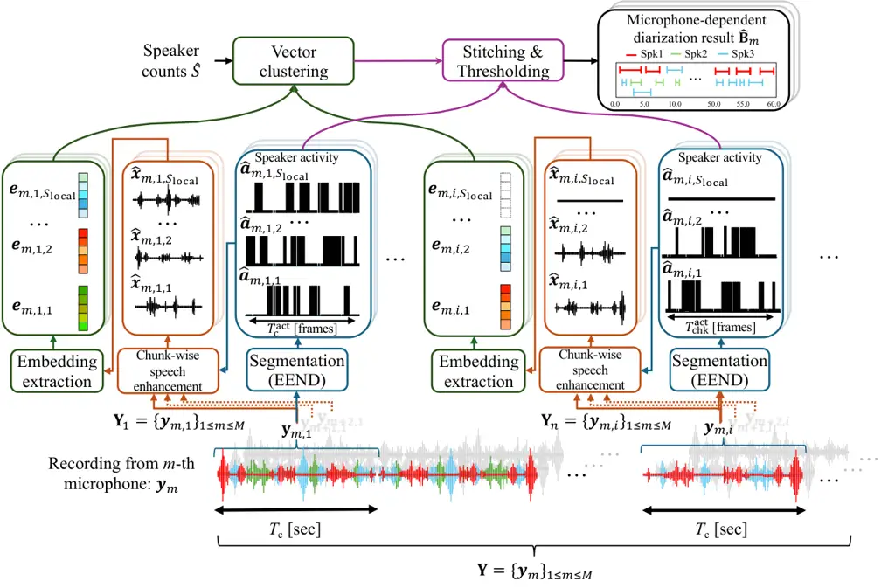
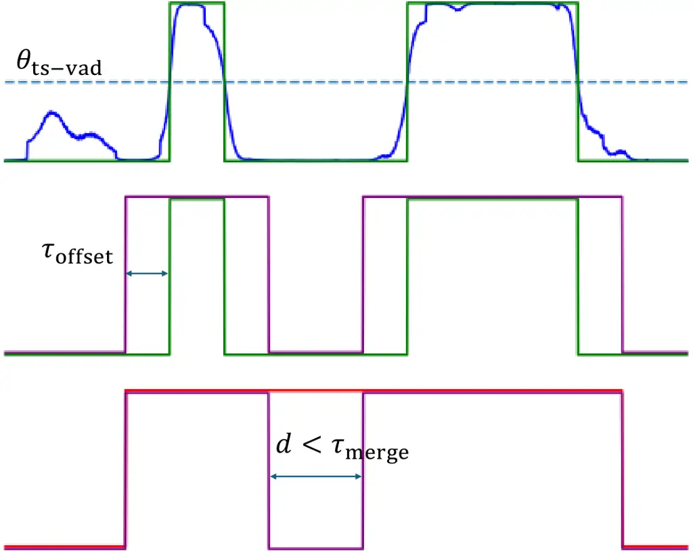

# Microphone Array geometry-independent Multi-Talker Distant ASR: NTT System for DASR Task of the CHiME-8 Challenge

Journal: Computer Speech & Language

Naoyuki Kamo^(∗), Naohiro Tawara^(∗), Atsushi Ando, Takatomo Kano,
Hiroshi Sato, Rintaro Ikeshita, Takafumi Moriya, Shota Horiguchi, Kohei
Matsuura, Atsunori Ogawa, Alexis Plaquet^(∗∗), Takanori Ashihara,
Tsubasa Ochiai, Masato Mimura, Marc Delcroix, Tomohiro Nakatani, Taichi
Asami, Shoko Araki Affiliation: NTT Corporation, Japan

###### Abstract

In this paper, we introduce a multi-talker distant automatic speech
recognition (DASR) system we designed for the DASR task 1 of the CHiME-8
challenge. Our system performs speaker counting, diarization, and ASR.
It handles a variety of recording conditions, from dinner parties to
professional meetings and from two speakers to eight. We perform
diarization first, followed by speech enhancement, and then ASR as the
challenge baseline. However, we introduced several key refinements.
First, we derived a powerful speaker diarization relying on end-to-end
speaker diarization with vector clustering (EEND-VC), multi-channel
speaker counting using enhanced embeddings from EEND-VC, and
target-speaker voice activity detection (TS-VAD). For speech
enhancement, we introduced a novel microphone selection rule to better
select the most relevant microphones among those distributed microphones
and investigated improvements to beamforming. Finally, for ASR, we
developed several models exploiting Whisper and WavLM speech foundation
models. In this paper, we present the original results we submitted to
the challenge and updated results we obtained afterward. Our strongest
system achieves a 63% relative macro tcpWER improvement over the
baseline and outperforms the challenge best results on the NOTSOFAR-1
meeting evaluation data among geometry-independent systems.

###### Keywords: 

Robust ASR , multi-talker ASR , speaker diarization , CHiME-8 DASR

^(†)^(†)highlights: A multi-talker ASR system achieving 63% relative
macro tcpWER improvement over the CHiME-8 DASR task baseline A powerful
diarization frontend combining EEND-VC, TS-VAD, and multi-channel
speaker counting Speech enhancement using improved microphone selection
and SP-MWF beamformer Four ASR backends exploiting speech foundation
models (Whisper and WavLM) An extensive experimental study and ablation
analyzing each component of our system

## 1 Introduction

Within the last decade, rapid progress in deep learning has led to
dramatic improvements in the performance of automatic speech recognition
(ASR). However, it remains challenging to recognize speech in
multi-talker recordings, especially when using distant microphones
\[1\]. The problem of multi-talker distant ASR (DASR) consists of not
only transcribing _what_ was spoken (i.e., ASR) but also correctly
estimating _who_ uttered the utterances and _when_ (i.e., speaker
diarization) \[2, 3\]. Moreover, it should be robust to overlapping
speech, background noise, and reverberation, which are common
distortions observed when recording with distant microphones in everyday
living and working environments. This makes the multi-talker ASR problem
extremely challenging, but solving it would have great implications, as
it would enable broadening the range of ASR applications to automatic
meeting minute generation, smart human-robot interactions, etc.

The CHiME challenge series has been a leading activity in triggering
research on multi-talker distant ASR (DASR). It originated with the
CHiME-1-2 challenges \[4, 5\], which involved DASR in living rooms. At
that time, the problem consisted of recordings of simple commands or
sentences read from a single speaker recorded by a distant microphone
array in the presence of various noise sources that can appear in a
living room, such as a vacuum cleaner, children’s voices, etc. The
CHiME-3-4 \[6\] extended the problem to cover four different recording
conditions, including bus, café, street, and pedestrian. The CHiME-5-6
\[7, 8\] increased the complexity by switching to multi-talker
conversations in a dinner party setting recorded with distributed
microphone arrays. This also added the requirement to perform speaker
diarization. More recently, the DASR tasks of the CHiME-7-8 challenges
(task 1) \[2, 3\] further increased the complexity by requiring the
construction of a single array geometry-independent system that could
perform multi-talker DASR for 1) diverse recording scenarios (dinner
parties, interviews, meetings), 2) recordings with various distributed
microphone array configurations, 3) recordings with the number of
speakers varying from two to eight, 4) recording durations from a few
minutes to more than one hour, and 5) limited amounts of in-domain
training data. The CHiME-8 challenge also featured another DASR task
called the NOTSOFAR-1 task (task 2) \[9\], which focused on the DASR of
meetings of four to eight speakers recorded with a single microphone
array, with known array geometry, in relatively well-controlled
conditions consisting of office meeting rooms. DASR and NOTSOFAR-1 ran
as separate tasks, but the NOTSOFAR-1 data was also used as one of the
datasets in the DASR task 1 evaluation. In this paper, we describe the
system we proposed for the DASR task of the CHiME-8 challenge \[3\].

There are different ways to implement a multi-talker DASR system to
perform both ASR and diarization while being robust to noise,
reverberation, and overlapping speech. Here, we briefly review the two
main approaches \[10\], _separation-first_ and _diarization-first_
approaches, which vary in terms of the processing order of the
diarization, speech separation/enhancement, and ASR modules.

The continuous speech separation (CSS) pipeline \[11, 12, 10\] is an
example of a _separation-first_ approach, which performs speech
separation on short time segments, then transcribes each segment, and
finally performs diarization by clustering speaker embeddings computed
on the separation outputs. The advantage of this approach is that ASR
and diarization are greatly simplified if the speech signals can be well
separated beforehand. For example, after separation, we can obtain
speaker embedding less affected by overlapping speech, which can reduce
the speaker confusion of diarization. In addition, diarization can
exploit the ASR output in order to, e.g., refine speaker activity
prediction \[13\]. Such a separation-first pipeline relies heavily on
having good separation pre-processing, typically implemented with the
combination of neural-network (NN) -based separation and a mask-based
beamformer. The separation-first pipeline was utilized as a baseline for
the NOTSOFAR-1 task 2 of the CHiME challenge. In that meeting
recognition scenario, the recording conditions are relatively
well-controlled, making NN-based separation very effective. It is,
however, challenging to use such a separation-first pipeline for the
domain- and microphone array geometry-independent DASR systems (which
are required for the DASR task 1 of CHiME-8), where the recording
conditions are much more diverse, making it difficult to train a robust
NN-based separation frontend.

The NeMo baseline of the DASR task 1 of the CHiME-8 challenge is an
example of a _diarization-first_ system \[3\]. The processing flow
begins with diarization, followed by guided source separation (GSS)
\[14\] for speech enhancement (SE) and then ASR. The idea behind this
approach is that it is easier to build a robust diarization system than
separation because diarization requires estimating coarser information,
i.e., the speech activity (discrete values) for diarization compared to
waveforms for separation. Then, robust speech separation can be
performed using GSS, which consists of an adaptive speech separation
method such as a complex angular central Gaussian mixture model (cACGMM)
\[15\] conditioned on the speaker activity prediction of the diarization
pre-processing. Such a pipeline has been utilized by most systems
proposed for the CHiME-6, 7, and 8 \[16, 17, 18, 19, 20, 21, 22\]
because it can be used with distributed microphone arrays and is
relatively robust to the very challenging recording conditions for which
NN-based separation remains challenging.

In this paper, we propose a modification of the diarization-first
pipeline that can partially utilize the advantage of the
separation-first pipeline. Current state-of-the-art diarization systems,
such as end-to-end diarization with vector clustering (EEND-VC) \[23,
24, 25\], usually rely on a two-step processing, i.e., local
segmentation and global clustering. The first step, local segmentation,
consists of predicting the speech activity (i.e., _when_) of each
speaker in short audio segments of up to, e.g., 15–80 sec, assuming that
the number of locally active speakers remains below a pre-set maximum
number of local speakers, e.g., four. We then perform clustering of the
speaker embeddings associated with each speaker activity in each segment
to associate the local speaker activity with a recording-level speaker
label (i.e., _who_). This allows us to assemble the activity of each
speaker together to form recording-level diarization results despite
possible speaker ordering ambiguity between segments. It also enables
handling a greater number of global speakers compared to the maximum
number of local speakers. In this paper, we exploit another advantage of
the EEND-VC approach: name, since the segmentation and clustering can be
performed independently, we propose performing GSS-based separation
between these two steps, as GSS only requires local segmentation
information. This approach, which we call _segmentation-first_, can
harness some of the benefits of the separation-first pipeline, i.e.,
extracting speaker embeddings on enhanced speech improves their quality,
resulting in better clustering accuracy.

Figure 1: Overview of proposed multi-talker DASR system.

Figure 1 shows an overview of our proposed multi-talker DASR system. It
consists of the modified EEND-VC frontend, which inserts GSS between
segmentation and clustering. For clustering, we set the number of
clusters to the number of speakers estimated using a novel multi-channel
speaker counting approach. We then refine the diarization results using
target speaker voice activity detection (TS-VAD) \[26\] implemented
based on the memory-aware multi-speaker embedding with
sequence-to-sequence architecture (NSD-MS2S) \[27\], which achieved the
top performance in the CHiME-7 challenge \[17\]. For SE, we enhance the
target speaker for each segment using GSS combined with weighted
prediction error (WPE) \[28, 29\] and spatial-prediction multichannel
Wiener filter (SP-MWF) beamformer \[30, 31\]. In addition, we designed a
novel microphone subset selection approach to reduce the influence of
unreliable microphone signals. Finally, we perform ASR using four
different backends based on Whisper, NeMo, and a WavLM-based RNN-T
model. To obtain optimal results, we performed language model re-scoring
and combined the output of the four systems using recognizer output
voting error reduction (ROVER) -based system combination \[32\].

The proposed multi-talker DASR system addresses the requirements of
CHiME-8 as follows:

1.  1.  Robustness to recording conditions and speaking styles: We exploit
        various speech foundation models to increase robustness and simplify
        system development, given the limited amount of in-domain data. Our
        diarization system exploits WavLM as feature extraction for
        segmentation and ECAPA-TDNN to obtain robust speaker embeddings for
        clustering and speaker counting. We also use several speech
        foundation models (WavLM, NeMo, and Whisper) to build various robust
        ASR models.
2.  2.  Handling arbitrary and distributed microphone arrays: We rely on a
        _segmentation-first_ pipeline, which allows us to use GSS that is
        robust to array geometry and distributed microphone configurations.
        For the diarization, we apply EEND-VC for each channel independently
        and combine the output using diarization output voting error
        reduction + overlap (DOVER-Lap) \[33\]. This approach allows us to
        exploit the multi-microphone recordings for diarization without
        building a multi-channel EEND system \[34\], which is particularly
        sensitive to training/test mismatch because of the difficulty of
        simulating realistic multi-channel speech mixtures. For SE, we
        designed a new microphone subset selection, which considers
        estimates of the reverberation condition at each microphone.
        Finally, we perform ASR on the single-channel output of the SE
        module.
3.  3.  Handling various numbers of speakers and recording durations: Our
        diarization system relies on EEND-VC, which can handle an arbitrary
        number of speakers. With EEND-VC, the result of the clustering of
        the speaker embeddings provides the speaker counts. However, the
        counting accuracy can worsen when speaker embeddings are unreliable
        or if there are not enough embeddings when the recordings are short.
        To improve speaker counting accuracy, we therefore propose
        decoupling the clustering for speaker counting from the clustering
        for assigning speaker labels. We improve the reliability of the
        estimated speaker counts by increasing the number of embeddings for
        clustering, computing them on shorter segments, and aggregating the
        results over the different microphones. Then, we can perform speaker
        embedding clustering to assign speaker labels by fixing the number
        of clusters to the estimated speaker counts.
4.  4.  Dealing with insufficient and unreliable transcriptions for
        training: One issue with the CHiME-8 DASR dataset is that the amount
        of reliable training data for ASR is limited. Using pre-trained
        foundation models can partially alleviate this issue, but the best
        performance is obtained when these models are fine-tuned on the
        target task. We propose two approaches to deal with data scarcity.
        First, we augment the training data with un-transcribed data from
        the VoxVeleb 1 and 2 datasets and apply contrastive data selection
        \[35\] to select data similar to the CHiME-8 task 1 datasets’
        conditions. Second, when retraining the Whisper model, we introduce
        a curriculum learning scheme, which filters out training samples
        with many recognition errors.

This paper is an extention of our challenge system description paper
\[21\] and our conference papers describing the diarization part \[36,
37\]. Compared to our previous publications, we provide more exhaustive
descriptions of all parts of our system, especially the diarization and
SE frontends, and include extensive experimental analysis and ablation
studies to clarify each module’s contribution. Moreover, we provide new
post-challenge results that further improved our performance, narrowing
the gap with the top CHiME-8 system \[20\] and surpassing it on the
NOTSOFAR-1 data.

In the remainder of the paper, we provide an overall description of our
proposed multi-talker DASR system in Section 2. We describe diarization
and speaker counting in Section 3, SE in Section 4, and the ASR backend
in Section 5. We then discuss experimental results and analysis in
Section 7, with extensive ablation for the different modules in A. We
conclude the paper in Section 8.

As our aim is to provide an exhaustive description of our system, the
overall paper is rather long. Readers interested in the details of each
module can skip ahead to the relevant parts (diarization in Section 3,
SE in Section 4 and ASR in Section 5), and those who are interested in
the experiment analysis can read the overall description in Section 2
and then proceed directly to the experiments in Section 7.

## 2 Overview of proposed system

The multi-talker DASR consists of transcribing a multi-talker
conversation captured with distant microphones. Here, transcribing also
includes assigning a speaker label and the boundaries for each utterance
(start and end times).¹¹ 1 Note that the system does not provide
absolute speaker identities but should only associate a consistent
speaker label for each speaker in a recording. We can model the signal
received at a distant microphone:

```math
\displaystyle\mathbf{y}_{m}=\sum_{s=1}^{S}\mathbf{x}_{m,s}+\mathbf{n}_{m}, \tag{1}
```

where $`\mathbf{y}_{m}`$, $`\mathbf{x}_{m,s}`$ and
$`\mathbf{n}_{m}\in\mathbb{R}^{T}`$ are the noisy observation, speech,
and noise signals, respectively. $`m`$ and $`s`$ are the microphone and
speaker indexes, respectively. $`S`$ represents the number of speakers
and $`T`$ the signal duration. For simplicity, we do not consider
reverberation in the notations. We define the set of all microphone
signals as $`\mathbf{Y}=\{\mathbf{y}_{m}\}_{1\leq m\leq M}`$, where
$`M`$ is the number of microphones. In the CHiME-8 DASR task, the number
of speakers, $`S`$, is considered unknown and varies from two to eight
depending on the recordings. The number of microphones, $`M`$, also
varies depending on the datasets, and the array geometry is unknown.

The speech signal $`\mathbf{x}_{m,s}`$ consists of a long signal
containing all utterances spoken by speaker $`s`$ in the recording and
is zeros when the speaker is not active. The DASR system aims to output
transcriptions and timings of all utterances of all speakers in the
recording. Let us define the output
$`\mathbf{O}=\{\mathbf{O}_{s}\}_{1\leq s\leq S}`$ as the sets of all
utterances of all speakers, where
$`\mathbf{O}_{s}=\{\mathbf{o}_{s,j}\}_{1\leq j\leq J_{s}}`$ represents
the set of all $`J_{s}`$ utterances associated with speaker $`s`$. Here,
$`\mathbf{o}_{s,j}=(\mathbf{v}_{s,j},\mathbf{b}_{s,j})`$ is the $`j`$-th
utterance of speaker $`s`$, where $`\mathbf{v}_{s,j}`$ is the
transcription or token sequence,
$`\mathbf{b}_{s,j}=[t^{\text{start}}_{s,j},t^{\text{end}}_{s,j}]`$
represents the utterance boundaries, and $`t^{\text{start}}_{s,j}`$ and
$`t^{\text{end}}_{s,j}`$ are the start and end times of the utterance,
respectively.

The DASR system estimates $`\mathbf{O}`$ given the microphone
observations, as

```math
\displaystyle\hat{\mathbf{O}}=\text{MT-DASR}(\mathbf{Y}), \tag{2}
```

where $`\hat{\mathbf{O}}`$ is the estimated utterances, including
utterance timing and speaker attributions, and $`\text{MT-DASR}(\cdot)`$
is a function representing the multi-talker DASR system. The system
performance can be evaluated in terms of time-constrained
minimum-permutation word error rate (tcpWER) \[38\], which is the WER
accounting for the speaker and time assignments of each word.

We implement the proposed multi-talker DASR system as a cascade of
diarization, SE, and ASR modules, as shown in Figure 1. Below, we
briefly define each module to demonstrate how they are interconnected.
In the subsequent sections, we explain the details of each module.

Diarization: The diarization module operates on the multi-channel
signals of all recordings and predicts the speaker activity for each
speaker in the recording. Here, by abuse of notations, we consider an
estimated active speaker segment as an utterance, although it may not
match an actual reference utterance. The diarization module thus
estimates the utterance boundaries and assigns a speaker label to each
estimated utterance, as

```math
\displaystyle\hat{\mathbf{B}}=\operatorname{DIAR}(\mathbf{Y}), \tag{3}
```

where $`\operatorname{DIAR}(\cdot)`$ represents the diarization
function,
$`\hat{\mathbf{B}}=\{\hat{\mathbf{B}}_{s}\}_{1\leq s\leq\hat{S}}`$ is
the set of utterance boundaries of all speakers,
$`\hat{\mathbf{B}}_{s}=\{\hat{\mathbf{b}}_{s,j}\}_{1\leq j\leq\hat{J}_{s}}`$
is the set of all estimated utterance boundaries for speaker $`s`$,
$`\hat{\mathbf{b}}_{s,j}`$, $`\hat{J}_{s}`$ is the number of estimated
utterances, and $`\hat{S}`$ is the estimated number of speakers, which
is also estimated by the diarization module. The speaker diarization
module is composed of EEND-based segmentation, SE, speaker counting,
speaker embedding clustering, TS-VAD refinement, and DOVER-Lap, as
explained in Section 3.

Speech enhancement: The SE module aims to isolate the speech signal of
the target speaker in each utterance, removing interference, noise, and
reverberation. It operates on each utterance found by the diarization
module and is conditioned on the estimated speakers’ activity
information. We can formulate its processing, as

```math
\displaystyle\hat{\mathbf{x}}_{s,j}=\operatorname{SE}(\mathbf{Y},\hat{\mathbf{B}},s,j), \tag{4}
```

where $`\operatorname{SE}(\cdot)`$ represents the SE function and
$`\hat{\mathbf{x}}_{s,j}`$ is the single-channel estimated target speech
for speaker $`s`$ associated with the $`j`$-th segment.²² 2 The SE
module $`\operatorname{SE}(\cdot)`$ can also generate multi-channel
outputs as explained in Section 4.4. It includes microphone subset
selection, GSS, WPE, and beamforming, as explained in Section 4.

ASR: Finally, we perform ASR on each enhanced signal channel speech
signal, $`\hat{\mathbf{x}}_{s,j}`$, to obtain the transcriptions
$`\hat{\mathbf{v}}_{s,j}`$ as

```math
\displaystyle\hat{\mathbf{v}}_{s,j}=\text{ASR}(\hat{\mathbf{x}}_{s,j}), \tag{5}
```

where $`\text{ASR}(\cdot)`$ represents the ASR module. To improve the
performance, we perform ASR using several models and perform
system-combination using ROVER. In addition, we also perform language
model rescoring. We provide the details of the ASR module are provided
in Section 5.

## 3 Speaker diarization module

Figure 2: Schematic diagram of proposed speaker diarization system.
Double-lined arrows represent multi-channel data flow, while
single-lined arrows represent single-channel data flow.

This section details our speaker diarization system defined in Eq. (3).
The entire diarization system, as shown in Figure 2, consists of three
main parts: i) EEND-VC-based pre-diarization, ii) multi-channel speaker
counting, and iii) TS-VAD refinement. TS-VAD is a very powerful approach
for dealing with the challenging recording conditions of the CHiME
challenge \[39, 17\], but it requires initialization, which is usually
performed using a simple speaker embedding clustering approach. For
improved performance, we propose using a strong EEND-VC system instead.
We refer to the EEND-VC pre-diarization as DIA1 and its combination with
TS-VAD refinement as DIA2. We also built a third diarization system,
DIA3, which is the same as DIA2 but with a stronger TS-VAD system
featuring more training data and longer training epochs.

In the following subsections, we describe the EEND-VC pre-diarization in
3.1, the multi-channel speaker counting in 3.2, TS-VAD refinement in
3.4, and the details of the settings and training schemes in Section
3.5.

### 3.1 EEND-VC-based pre-diarization (DIA1)



Figure 3: Schematic diagram of EEND-VC applied to $`m`$-th channel
audio. For simplicity, this shows an example with three distinct
speakers (represented by red, green, and blue waveforms in the bottom
visualization). The first chunk $`\mathbf{y}_{m,1}`$ contains three
active speakers in total (red, green, and blue speakers), while the
$`i`$-th chunk $`\mathbf{y}_{m,i}`$ only contains two active speakers
(blue and red).

We use a modified version of the EEND-VC framework \[40\] as the
pre-diarization system, incorporating the following three changes.
First, we perform SE using GSS on the local segments found by the EEND
segmentation to improve the reliability of the speaker embeddings.
Second, we perform EEND-VC for each microphone and combine the results
with DOVER-Lap, which we found an effective way to exploit the diversity
of the distributed microphone recordings. Finally, we decouple speaker
counting from EEND-VC, which allows more precise speaker counting.

Figure 3 shows an example of the data flow in our EEND-VC-based
pre-diarization. The processing of the EEND-VC module consists of
several steps, applied separately to each microphone, yielding
microphone-dependent diarization results that consist of estimated
utterance boundaries,
$`\hat{\mathbf{B}}_{m}=\{\hat{\mathbf{B}}_{m,s}\}_{1\leq s\leq\hat{S}}`$.
First, the speech signal is divided into chunks and we use an NN to
estimate the speaker activity for each chunk, which we refer to as
EEND-based segmentation. We then perform chunk-wise SE to enhance the
speech given to the speaker activities of each detected speaker in each
segment, reducing the impact of noise, reverberation, and interfering
speakers. Next, we compute speaker embeddings from the enhanced speech
signals. Finally, we perform clustering and stitching to assemble the
global diarization output together. This process is performed for each
channel independently, and the results are then combined using DOVER-Lap
as explained in Section 3.3.

#### 3.1.1 EEND-based local segmentation

First, we divide the microphone signal into chunks of $`T_{\mathrm{c}}`$
seconds, resulting in a set of $`I`$ chunks
$`\{{\mathbf{y}}_{m,i}\in\mathbb{R}^{{T_{\mathrm{c}}^{\mathrm{wav}}}}\}_{1\leq i\leq I}`$
for each microphone $`m`$, where each chunk contains
$`{T_{\mathrm{c}}^{\mathrm{wav}}}=f_{\mathrm{s}}\cdot T_{\mathrm{c}}`$
samples and $`f_{\mathrm{s}}`$ is the sampling frequency. In our system,
we set $`T_{\mathrm{c}}=30`$ seconds. We then apply EEND separately to
each channel of each audio chunk $`\mathbf{y}_{m,i}`$, yielding local
speaker activity posteriors, as

```math
\hat{\mathbf{A}}_{m,i}=[\hat{\mathbf{a}}_{m,i,s=1},\dots,\hat{\mathbf{a}}_{m,i,s=S_{\mathrm{local}}}]=f_{\mathrm{EEND}}(\mathbf{y}_{m,i}), \tag{6}
```

where
$`\hat{\mathbf{a}}_{m,i,s}\coloneqq[\hat{a}_{m,i,s,t=1},\dots,\hat{a}_{m,i,s,t={T_{\mathrm{c}}^{\mathrm{act}}}}]^{\mathsf{T}}\in[0,1]^{{T_{\mathrm{c}}^{\mathrm{act}}}}`$
represents the posterior probabilities of the $`s`$-th local speaker’s
speech activity at each frame index $`t`$ within the $`i`$-th chunk
($`f_{\mathrm{EEND}}(\cdot)`$ is the EEND function implemented with an
NN). Note that the length of speaker activity vectors,
$`{T_{\mathrm{c}}^{\mathrm{act}}}`$, is shorter than
$`{T_{\mathrm{c}}^{\mathrm{wav}}}`$ due to the downsampling of EEND.
$`S_{\mathrm{local}}`$ denotes the number of local speakers, a
hyper-parameter of EEND that determines the maximum number of speakers
present within each chunk.

After applying EEND, we obtain chunk-wise local segmentation results. To
derive the global diarization results, we need to stitch together the
local segmentation. However, the order of speakers in the estimated
local speaker activities can vary across chunks, and speakers who are
not active in one chunk may be active in others. To solve this speaker
permutation issue, we compute speaker embeddings and cluster them to
assign session-wise (global) speaker labels to the local speakers, as
detailed in the following subsections.

#### 3.1.2 Segment-wise speaker embedding computation

We calculate $`D`$-dimensional speaker embeddings
$`\{\mathbf{e}_{m,i,s}\in\mathbb{R}^{D}\}_{1\leq s\leq S_{\mathrm{local}}}`$
for each local speaker $`s`$ in each chunk $`i`$ from the $`m`$-th
microphone given the local speaker activity $`\hat{\mathbf{A}}_{m,i}`$
obtained from Eq. (6). Most EEND-VC-based approaches, including our
previous CHiME-7 system \[36\] and CHiME-7/8 baseline systems \[2, 3\],
extract speaker embeddings exclusively from non-overlapping intervals
where only a single speaker is present, as

```math
\displaystyle\mathbf{e}_{m,i,s}= \displaystyle f_{\mathrm{Emb}}(\mathbf{y}_{m,i}\odot\mathrm{upsample}(\tilde{\mathbf{a}}_{m,i,s}))\in\mathbb{R}^{D}, \tag{7}
```

where

```math
\displaystyle\tilde{a}_{m,i,s,t}= \displaystyle\mathbbm{1}\left((\hat{a}_{m,i,s,t}\geq\theta_{\mathrm{emb}})\land(\hat{a}_{m,i,s^{\prime},t}<\theta_{\mathrm{emb}}),s^{\prime}\neq s\right), \tag{8}
```

and $`f_{\mathrm{Emb}}(\cdot)`$ is a NN that maps a speech signal to a
speaker embedding vector of dimension $`D`$, such as ECAPA-TDNN \[41\].
$`\mathbbm{1}(\mathrm{condition})`$ denotes an indicator function that
returns 1 if the condition is satisfied and 0 otherwise
$`\tilde{\mathbf{a}}_{m,i,s}\coloneqq[\tilde{a}_{m,i,s,t=1},\dots,\tilde{a}_{m,i,s,t={T_{\mathrm{c}}^{\mathrm{act}}}}]^{\mathsf{T}}\in\{0,1\}^{{T_{\mathrm{c}}^{\mathrm{act}}}}`$
is the frame-wise binary mask to select the non-overlapping frames,
$`\mathrm{upsample}(\cdot)`$ is the linear interpolation used to
upsample the length of speaker activity from
$`{T_{\mathrm{c}}^{\mathrm{act}}}`$ to
$`{T_{\mathrm{c}}^{\mathrm{wav}}}`$, $`\theta_{\mathrm{emb}}`$ is the
speaker activity threshold for embedding extraction, and $`\odot`$ is
the Hadamard product. This strategy efficiently captures speaker
characteristics by focusing on single-speaker intervals.

However, it becomes challenging to extract speaker embeddings from
highly overlapping segments that contain only a few brief single-speaker
intervals. To address this, our previous system used a very long chunk
size (e.g., 80 seconds), setting the number of local speakers to the
maximum anticipated for the use case scenario (four in the case of
CHiME-7 \[19\]). However, when using long chunks, the number of local
speakers in a chunk at inference time may exceed the anticipated maximum
number of speakers. Moreover, using excessively long chunks can degrade
EEND performance by increasing the risk of speaker permutation within
chunks \[36\].

We therefore propose a more robust speaker embedding strategy that
performs SE before speaker embedding extraction, thereby reducing
interference from overlapping speakers. Specifically, we apply a
chunk-wise SE to enhance each local speaker’s speech
$`\hat{\mathbf{x}}_{m,i,s}`$ from the audio chunk, using their speaker
activity $`\hat{\mathbf{a}}_{m,i,s}`$ and signals from all microphones
$`m\in\left\{1,\dots,M\right\}\eqqcolon\mathcal{M}`$,
$`\mathbf{Y}_{i}=\{\mathbf{y}_{m,i}\}_{1\leq m\leq M}`$. The speaker
embeddings are thus computed, as

```math
\displaystyle\mathbf{e}_{m,i,s}= \displaystyle f_{\mathrm{Emb}}(\hat{\mathbf{x}}_{m,i,s}), \tag{9}
```

```math
\displaystyle\hat{\mathbf{x}}_{m,i,s}= \displaystyle\textrm{ChunkWiseSE}(\mathbf{Y}_{i},\mathbbm{1}(\hat{\mathbf{a}}_{m,i,s}\geq\theta_{\mathrm{emb}}),\mathcal{M}), \tag{10}
```

where $`\textrm{ChunkWiseSE}(\cdot)`$ is the chunk-wise SE approach
described in Section 4.4.

We analyze the effect of SE on EEND-VC performance in A.1.1, showing
that it can greatly reduce diarization errors.

#### 3.1.3 Vector clustering

Next, vector clustering is applied to the speaker embeddings to assign
each local speaker to a global speaker cluster as

```math
\displaystyle\mathbf{\Phi}_{m}=\left\{\phi_{m,i,s}\right\}_{1\leq s\leq S_{\mathrm{local}},1\leq i\leq I} \displaystyle={\rm Clustering}\left(\left\{\mathbf{e}_{m,i,s}\right\}_{1\leq s\leq S_{\mathrm{local}},1\leq i\leq I}\right), \tag{11}
```

where $`\phi_{m,i,s}\in\mathbb{Z}_{[1,\hat{S}]}`$ denotes the mapping
between the local speaker embeddings and the global speaker clusters,
which represent the speaker identity.

Various different clustering approaches can be used here, such as
k-means clustering, agglomerative hierarchical clustering \[42\], and
spectral clustering \[43\]. In this paper, we utilize spectral
clustering with the Ng-Jordan-Weiss algorithm \[44\]. We use a radial
basis function kernel with $`\gamma=1.0`$, applied to the cosine
similarity between speaker embeddings to compute the affinity matrix.
Spectral clustering is implemented using scikit-learn==1.5.2,
introducing a small modification to enforce the constraint that speaker
embeddings from local activities within the same chunk should not be
clustered into the same cluster \[40\].

Note that the number of speakers can be estimated as the number of
remaining clusters estimated by the clustering method. However, this
tends to be inaccurate in practical situations where the session is
extremely long or short, as reported in \[36, 18\]. Instead, we perform
clustering by setting the number of clusters to the number of speakers
estimated with the multi-channel speaker counting approach described in
Section 3.2.

#### 3.1.4 Stitching and post-processing

Finally, we stitch together the estimated microphone-dependent local
speaker activities
$`\{\hat{\mathbf{a}}_{m,i,s}\}_{1\leq s\leq S_{\mathrm{local}}}`$ across
$`1\leq i\leq I`$ chunks on each microphone based on the global speaker
cluster labels provided by $`\mathbf{\Phi}_{m}`$, producing the global
speaker activity
$`\{\hat{\mathbf{a}}^{\mathrm{global}}_{m,s}\}_{1\leq s\leq\hat{S}}`$
for each microphone.

The global speaker activity is then converted into a set of utterance
boundaries $`\hat{\mathbf{B}}_{m}`$ using the post-processing method
from \[45\]. Specifically, we apply a median filter with a kernel of 25
frames to smooth the global speaker activity and subsequently threshold
it with $`\theta_{\mathrm{eend}}`$, which yields the binarized speaker
activity
$`\{\tilde{\mathbf{a}}^{\mathrm{global}}_{m,s}\in\{0,1\}^{{T_{\mathrm{c}}^{\mathrm{act}}}}\}_{1\leq s\leq\hat{S}}`$.
Each global speaker’s utterance boundaries are then identified by
locating frame indices where the binarized speaker activity changes.

### 3.2 Multi-channel speaker counting

Figure 4: Schematic diagram of multi-channel speaker counting module.

1: Set of observed $`M`$-channel audio
$`\{\mathbf{y}_{m}\}_{1\leq m\leq M}`$, set of enhanced $`M`$-channel
chunks $`\{\hat{\mathbf{x}}_{m,i,s}\}_{1\leq m\leq M}`$, and
corresponding local speaker activities $`\{\hat{\mathbf{a}}_{m,i,s}\}`$,
$`\forall s\in\{1,\dots,S_{\mathrm{local}}\}`$ for each chunk
$`i\in\{1,\dots,I\}`$

2: Session-wise speaker counting $`\bar{s}`$

3: for each $`m`$-th microphone, $`i`$-th chunk, $`s`$-th local speaker
do

4:
  $`\left\{\hat{\mathbf{x}}^{\mathrm{subc}}_{m,i^{\prime},s},\mathbf{\hat{a}}^{\mathrm{subc}}_{m,i^{\prime},s}\right\}_{1\leq i^{\prime}\leq I_{\mathrm{subc}}}\leftarrow`$
Split($`\hat{\mathbf{x}}_{m,i,s},\mathbf{\hat{a}}_{m,i,s}`$)
$`\triangleright`$ Split into subchunks

5:   for each $`i^{\prime}`$-th subchunk do

6:    $`\mathbf{e}^{\mathrm{subc}}_{i,i^{\prime},s}\leftarrow`$
$`f_{\mathrm{Emb}}(\hat{\mathbf{x}}^{\mathrm{subc}}_{m,i^{\prime},s},\mathbf{\hat{a}}^{\mathrm{subc}}_{m,i^{\prime},s}`$)
$`\triangleright`$ Extract speaker embeddings   

7: Calculate $`L`$ using Eq. (12)$`\triangleright`$ Microphone
similarity matrix

8: $`\{\mathcal{M}_{g}\}_{1\leq g\leq G}\leftarrow f_{\mathrm{ahc}}(L`$)
$`\triangleright`$ Microphone grouping to obtain mic. groups

9: for each $`g\in\left\{1,\dots,G\right\}`$ do $`\triangleright`$
Mic.-group-wise speaker counting

10:   Estimate $`s_{g}`$ using NME on
$`\mathcal{E}^{\mathrm{subc}}_{\mathrm{g}}`$

11: Obtain session-wise speaker counts $`\bar{s}`$ using Eq. (14)

Algorithm 1 Multi-channel speaker counting with microphone clustering

Our preliminary experiments indicated that speaker counting tends to
underestimate the number of speakers in short sessions. We therefore
propose augmenting the number of speaker embeddings used for counting by
(1) considering shorter chunks and (2) exploiting the multiple
microphone signals. By augmenting the number of speaker embeddings, we
ensure stable counting performance even for short recordings.

Figure 4 and Algorithm 1 detail the procedure of the proposed
multi-channel speaker counting scheme. The input of our speaker counting
scheme is a set of $`M`$-channel observed signals
$`\{\mathbf{y}_{m}\}_{1\leq m\leq M}`$, a set of $`M`$-channel enhanced
speech signals divided in chunks
$`\{\hat{\mathbf{x}}_{m,i,s}\}_{1\leq m\leq M}`$ estimated by Eq.(10)
and the corresponding local speaker activities
$`\{\hat{\mathbf{a}}_{m,i,s}\}_{1\leq m\leq M}`$ estimated by Eq.(6) for
all local speakers and chunks. We first divide these enhanced speech
chunks and speaker activities into subchunks of $`T_{\mathrm{subc}}`$
seconds, producing
$`\hat{\mathbf{x}}^{\mathrm{subc}}_{m,i,s}\in\mathbb{R}^{T^{\mathrm{wav}}_{\mathrm{subc}}}`$
and
$`\hat{\mathbf{a}}^{\mathrm{subc}}_{m,i,s}\in[0,1]^{T^{\mathrm{act}}_{\mathrm{subc}}}`$
for $`1\leq i\leq I_{\mathrm{subc}}`$ (line 2 in Algorithm 1).
$`T^{\mathrm{wav}}_{\mathrm{subc}}`$ and
$`T^{\mathrm{act}}_{\mathrm{subc}}`$ denote the number of samples and
frames in each subchunk, respectively, and $`I_{\mathrm{subc}}`$ is the
number of subchunks defined as
$`I_{\mathrm{subc}}=I\times\frac{T_{\mathrm{c}}}{T_{\mathrm{subc}}}`$.

We then extract speaker embeddings
$`\{\mathbf{e}^{\mathrm{subc}}_{m,i^{\prime},s}\in\mathbb{R}^{D}\}_{1\leq s\leq S_{\mathrm{local},i^{\prime}}}`$
for each $`i^{\prime}`$-th subchunk and $`m`$-th microphone (lines 3–4
in Algorithm 1). Note that we exclude the speaker embeddings extracted
from subchunks with a total speech duration below a certain threshold
$`T_{\mathrm{min}}=0.75`$ seconds to ensure that only reliable
embeddings are used. This results in $`S^{\mathrm{subc}}_{i^{\prime}}`$
speaker embeddings in each $`i^{\prime}`$-th subchunk. In all setups, we
use $`T_{\mathrm{subc}}=15`$ second subchunks for speaker counting and
$`T_{\mathrm{c}}=30`$ second chunks for vector clustering, which enables
us to approximately double the number of speaker embeddings in the
speaker counting step. These lengths are determined using the
development set in the CHiME-8 challenge. We find that overly small
subchunks result in deterioration during the subsequent clustering step,
and subchunks with half the length of the chunks perform best across all
scenarios. Subsequently, we further increase the number of embeddings by
exploiting the speaker embeddings obtained from all microphones. There
are various methods to utilize multi-channel data for speaker counting.
One approach involves performing a single clustering step using speaker
embeddings from all microphones. However, channel variations can result
in inaccurate estimations of the number of speakers. Another approach is
to conduct speaker counting for each microphone individually and then
aggregate the results. However, this reduces the number of embeddings
for clustering, leading to less reliable results. A compromise consists
of performing speaker counting on groups of microphone signals that
exhibit minimal variations in their transfer functions. This method
allows the use of speaker embeddings from relatively similar channels,
increasing the number of embeddings while limiting the impact of channel
variability. The speaker counts from each microphone group can then be
aggregated to achieve the final result.

This approach is implemented as follows. First, we apply a microphone
grouping procedure similar to the one used for speech enhancement
\[46\]. This approach is applied to the multi-microphone signals to
identify groups of microphones with similar transfer characteristics.
Speaker counting is then performed on each subchunk within these groups
(lines 5–6). Specifically, we first calculate a microphone similarity
matrix
$`L=\left[l_{m_{1},m_{2}}\right]\in\left[0,1\right]^{M\times M}`$, where
each element is the similarity between $`m_{1}`$-th and $`m_{2}`$-th
microphone observed signals $`\mathbf{y}_{m_{1}},\mathbf{y}_{m_{2}}`$.
The similarity is computed based on the inter-microphone correlations of
the first $`T_{\mathrm{corr}}`$ samples of the signals, as

```math
\displaystyle l_{m_{1},m_{2}}=\frac{1}{T_{\mathrm{corr}}}\sum_{\tau=1}^{T_{\mathrm{corr}}}\frac{(y_{m_{1}}(\tau)-\mu_{m_{1}})(y_{m_{2}}(\tau)-\mu_{m_{2}})}{\sigma_{m_{1}}\sigma_{m_{2}}}, \tag{12}
```

where $`\tau`$ is a time index and $`\mu_{*}`$ and $`\sigma_{*}`$ denote
the mean and standard deviation of $`\mathbf{y}_{*}`$ for
$`1\leq\tau\leq T_{\mathrm{corr}}`$, respectively. We set
$`T_{\mathrm{corr}}=120`$ seconds based on preliminary experimental
results. We then apply AHC to the microphones based on the computed
similarity matrix, following Ward’s method \[42\]. This approach
determines the optimal number of microphone groups by recursively
merging the closest pair of clusters that result in the smallest
increase in total within-cluster variance, continuing until the minimum
similarity between clusters falls below a predetermined threshold
$`\theta_{\mathrm{mic}}=0.05`$. This process groups microphones into
$`G`$ groups, $`\{\mathcal{M}_{g}\}_{1\leq g\leq G}`$, of the
microphones $`\{1,\dots,M\}`$.

For each microphone group $`\mathcal{M}_{g}`$, we estimate the number of
speakers $`s_{g}`$ using the set of speaker embeddings within that
group, as

```math
\displaystyle\mathcal{E}^{\mathrm{subc}}_{\mathrm{g}}=\left\{\mathbf{e}^{\mathrm{subc}}_{m,i^{\prime},s}\mid\forall m\in\mathcal{M}_{g},1\leq i^{\prime}\leq I_{\mathrm{subc}},1\leq s\leq S^{\mathrm{subc}}_{i^{\prime}}\right\}. \tag{13}
```

We determine the optimal number of speakers based on the approach
proposed in \[47\], which finds the number of speakers from the
normalized maximum eigengap (NME) of the Laplacian matrix computed over
$`\mathcal{E}^{\mathrm{subc}}_{\mathrm{g}}`$ (lines 7–8).

Finally, to further improve the speaker counting accuracy for each
session, we integrate the estimated speaker counts from each microphone
group to obtain session-level speaker counts by computing the weighted
average of the estimated speaker counts $`s_{g}`$ for each microphone
group $`g`$, as

```math
\displaystyle\hat{S}=\left\lfloor\frac{1}{\sum_{g^{\prime}=1}^{G}|\mathcal{E}^{\mathrm{subc}}_{g^{\prime}}|}\sum_{g=1}^{G}|\mathcal{E}^{\mathrm{subc}}_{g}|s_{g}\right\rceil, \tag{14}
```

where $`\lfloor\cdot\rceil`$ is a rounding function to an integer.
$`|\mathcal{E}^{\mathrm{subc}}_{g}|`$ represents the number of
embeddings in the $`g`$-th microphone group, acting as a weight factor
to emphasize estimations from groups with more microphones, thereby
enhancing the reliability of those estimates. The session-level speaker
counts are utilized as the estimated number of speakers for each channel
in the vector clustering described in Section 3.1.3.

We perform an ablation study of the different components of the proposed
multi-channel speaker counting in A.1.2.

### 3.3 Multi-channel integration with DOVER-Lap

Various approaches have been proposed to integrate the results from
multiple microphones, including early fusion \[34, 48\] and late fusion
\[33, 49\]. The early fusion approach leverages fine spatial
information, by applying muti-channel speech enhancement before
diarization \[50, 51\], spatial feature clustering \[48\], or
incorporating multi-channel features to the input of EEND \[34\], all of
which could offer valuable insights for speaker discrimination. However,
such methods may struggle with tracking speakers who move frequently and
might be sensitive to the layout of the microphone array. An alternative
is the late fusion approach, which combines diarization results from
each microphone independently. We can perform late fusion by using
techniques such as posterior combination \[49\] or DOVER-Lap \[33\].
While the late fusion does not directly access the fine spatial details,
its independent handling of each channel may offer greater robustness to
speaker movement and variations in an array configuration.

In the proposed system, motivated by prior studies \[33\] and our
preliminary experiments, we adopt the late fusion approach using
DOVER-LAP to merge the diarization results from all available
microphones. For DOVER-Lap, we utilize the Hungarian algorithm to find
the optimal speaker permutation between the diarization results across
different microphones and integrate them using a voting scheme.
Specifically, we first aligns clustering labels across channels using
the Hungarian algorithm and then aggregates the results using majority
voting. This voting scheme can help mitigate the impact of outlier
results, such as those from microphones far from the sources or affected
by recording failures. The effectiveness of DOVER-Lap-based microphone
integration is demonstrated in the ablation study in A.1.3.

### 3.4 TS-VAD refinement (DIA2/DIA3)

Figure 5: Outline of i-vector-based Seq2Seq TS-VAD.

After obtaining the initial diarization results using the EEND-VC
module, we refine these results with target speaker voice activity
detection (TS-VAD). Specifically, we adopt the sequence-to-sequence
TS-VAD (Seq2Seq-TS-VAD) \[27\], applying it separately to each observed
microphone signal to obtain microphone-dependent global speaker
activity, as illustrated in Figure 5.

Seq2Seq-TS-VAD first extracts session-wise (global) speaker embeddings
from the entire session, utilizing the global speaker activities
estimated by the pre-diarization module. It then decodes each global
speaker’s activity using frame-wise features generated by the encoder
module and the global speaker embeddings. Note that the Seq2Seq-TS-VAD
directly estimates the global speaker activity without permutation
issues since the order of speakers in the output is determined by the
global speaker embeddings.

For the encoder, we utilize Conformers consisting of a convolutional NN
(CNN)-based downsampler followed by six Conformer blocks to transform
the audio into frame-wise features. For the decoder, we used a six-layer
Transformer-based structure equipped with a memory-aware multi-speaker
embedding (MA-MSE) module \[27\]. Session-level i-vectors are utilized
as session-wise speaker embeddings, obtained by averaging the
segment-level i-vectors belonging to the same speaker. These i-vectors
are then combined with local speaker embeddings derived from the input
mixture and the local segmentation information, which is implicitly
performed within the speaker-wise decoder block in Figure 5. These
combined embeddings are then used to condition the Conformer-based
TS-VAD module. Our system has almost the same model configuration as
that in the top system of CHiME-7 \[17\] but with a stronger initial
diarization provided by EEND-VC. We confirm the importance of the
initialization with EEND-VC in A.1.1.

We obtain the diarization results from the speaker activity posteriors
using the following post-processing steps. First, the global speaker
activities are stitched together and thresholded using
$`\theta_{\textrm{ts-vad}}`$. The boundaries of each utterance are then
padded by a specified offset, $`\tau_{\mathrm{offset}}`$, and short
pauses shorter than $`\tau_{\mathrm{merge}}`$ are filled with ones. As
show in figure 6, these processes prevent the occurrence of spurious
utterances while avoiding the omission of utterance boundaries and
pauses, enabling better segmentation results for downstream ASR modules.
These steps are performed on the activities obtained for each microphone
and the activities are subsequently integrated into
microphone-independent global speaker activities using DOVER-Lap, as in
the pre-diarization step described in Section 3.3. Note that boundary
padding and short pause filling are only applied for ASR inputs, and the
boundaries obtained by thresholding alone are used for GSS.

We report the effect of these post-processing steps in A.1.4.



Figure 6: Postprocessing to obtain utterance boundaries from speaker
activity. The blue plot represents the original activity from a speaker,
the green plot shows the result after thresholding using
$`\theta_{\mathrm{ts-vad}}`$, the purple plot represents the result
after padding by an offset, $`\tau_{\mathrm{offset}}`$, and the red plot
illustrates the activity obtained after filling pauses of duration $`d`$
shorter than $`\tau_{\mathrm{merge}}`$

### 3.5 Settings

#### 3.5.1 Model configuration

EEND: We utilized the pre-trained WavLM-large model as a feature
extractor, following the approach used in \[52\]. Outputs from all WavLM
Transformer layers were averaged using learnable weights, resulting in
1024-dimensional input speech features. These features were then fed
into the EEND module, following the same configurations as in our
previous CHiME-7 submission \[19\]. The EEND module consisted of six
stacked Transformer encoder blocks with eight 256-dimensional attention
heads, followed by a linear layer that projected the encoder’s output
into four streams representing the frame-by-frame speaker activity
probabilities for the four local speakers (i.e.,
$`S_{\mathrm{local}}=4`$). We applied thresholds of
$`\theta_{\mathrm{emb}}=0.5`$ and $`\theta_{\mathrm{eend}}=0.5`$ to the
outputs of the EEND modules to extract ECAPA-TDNN embeddings, as
described in Eq. (10), and to obtain binarized speaker activity during
the post-processing step, respectively.

Vector clustering: We used ECAPA-TDNN \[41\] for speaker embedding
extraction, applying it to 30-second chunks ($`T_{\mathrm{c}}=30`$) that
were enhanced using a chunk-wise SE module. We utilized SpeechBrain’s
ECAPA-TDNN \[53\], pre-trained on over 2000 hours of audio from more
than 7000 speakers in VoxCeleb1 and VoxCeleb2 \[54\]. Subsequently,
constrained spectral clustering was performed on these speaker
embeddings, with the speaker count estimated using the speaker counting
module.

Speaker counting: We determined the speaker count by identifying the
value that minimizes the normalized maximum gap of the eigenvalues (NME)
\[47\] of the Laplacian matrix, computed from the cosine similarities
between all pairs of speaker embeddings. To identify the NME, we used
the default parameters of NME-SC from NeMo’s CHiME-8 baseline ³³ 3
[https://github.com/chimechallenge/C8DASR-Baseline-NeMo/blob/main/nemo/collections/asr/parts/utils/offline_clustering.py](https://github.com/chimechallenge/C8DASR-Baseline-NeMo/blob/main/nemo/collections/asr/parts/utils/offline_clustering.py),
with one modification: we reduced the search range of $`p`$-values,
which define the $`p`$-neighbor binarization of affinity matrix, from
$`\left[1,\lfloor\frac{N}{4}\rfloor\right]`$ to
$`\left[1,\lfloor\frac{N}{10}\rfloor\right]`$, where $`N`$ is the number
of speaker embeddings, to mitigate the overestimation of the number of
speakers. This value was determined with the development set.

TS-VAD: The i-vector extractor was trained on VoxCeleb1 and VoxCeleb2
using the Kaldi recipe from egs/voxceleb/v1⁴⁴ 4
[https://github.com/kaldi-asr/kaldi/tree/master/egs/voxceleb/v1](https://github.com/kaldi-asr/kaldi/tree/master/egs/voxceleb/v1).
We computed 40-dimensional Mel-frequency cepstral coefficients (MFCCs)
calculated with a 25 ms window size and a 10 ms shift, followed by mean
normalization using three-second sliding windows as acoustic features
for i-vector extraction. Silence regions and utterances shorter than 100
ms were removed based on local speaker activity estimated by the
pre-diarization module. Subsequently, i-vectors were extracted for each
speaker’s utterance and averaged across the session to generate
session-wise i-vectors for each speaker. The implementation of
Seq2Seq-TS-VAD relied on the publicly available implementation of
NSD-MS2S \[27, 55\]. The input to NSD-MS2S consisted of 40-dimensional
filterbank features computed using a 25 ms window size and a 10 ms
shift, followed by mean normalization with three-second sliding windows.
We used the default parameters implemented in NSD-MS2S code⁵⁵ 5
[https://github.com/liyunlongaaa/NSD-MS2S](https://github.com/liyunlongaaa/NSD-MS2S),
except that we used only a single deep interactive module block.

Post-processing: To enable faster experimental turnaround, we tuned most
parameters of the diarization module to achieve the best diarization
error rate (DER) on the development set. However, DER is not well
correlated with recognition performance. Therefore, after the initial
tuning, we performed an extensive grid search on the optimal
post-processing parameters after TS-VAD for ASR, including the activity
threshold, boundary offset, and short-pause filling durations. After the
tuning, we obtained $`\theta_{\textrm{ts-vad}}=0.30`$ ,
$`\tau_{\mathrm{offset}}=0.0`$ sec, and $`\tau_{\mathrm{merge}}=1.5`$
sec as the best parameters. The effect of this tuning is reported in
A.1.4.

#### 3.5.2 Training data

Each diarization model, including EEND and TS-VAD, was initially trained
on simulated mixtures and subsequently fine-tuned using the CHiME-8
training set \[56\]. The simulated mixtures were primarily generated
following a protocol designed to create natural utterance transitions
\[57\], with the following modifications to better match the real data
statistics: i) long-form audio was first generated by incorporating
turn-hold, turn-switch, and interruption patterns, with back-channels
added afterward, ii) silence and overlap durations between utterances
were sampled directly from the real data instead of from a fitted
distribution, and iii) overlap durations in interruptions and
back-channels were determined using absolute durations extracted from
the real data, rather than relative ratios. We generated one million
50-second mixtures of four speakers using LibriSpeech \[58\] for EEND-VC
training, and 500k 80-second mixtures of four speakers for TS-VAD in the
DIA1 and DIA2 systems. Additionally, we generated 1 million 50-second
mixtures of four speakers to train a stronger TS-VAD for the DIA3
system. We used 500 mixtures for validation in all cases. Each mixture
was augmented using the simulated room impulse responses \[59\] and
MUSAN noises \[60\].

#### 3.5.3 Training procedure

EEND: For the initial training, we froze the WavLM parameters and
optimized the subsequent layer parameters to minimize the binary cross
entropy between the model output and the ground truth labels, using
permutation invariant training (PIT) \[61\]. We trained the model for 25
epochs using the Adam optimizer with 25,000 warm-up steps, a learning
rate of $`10^{-3}`$, and a batch size of 2048. For fine-tuning, we
updated the entire model using the CHiME-8 training set for three epochs
with a learning rate of $`10^{-5}`$ and a batch size of one.

TS-VAD: For both the initial training and fine-tuning, we optimized all
NSD-MS2S parameters to minimize the binary cross entropy between the
model output and the ground truth labels. We pretrained the model for
six epochs on DIA2 and three epochs on DIA3. We used Adam optimizer with
a learning rate of $`10^{-3}`$ and a batch size of 256. For fine-tuning,
we again updated all NSD-MS2S parameters using the CHiME-8 training set
for six epochs with a learning rate of $`10^{-5}`$ and a batch size of 1024. Following the procedure used in \[27\], we averaged the model
parameters obtained over six epochs in the fine-tuning step.

## 4 Speech enhancement

In this section, we explain how we implement our SE system described in
Eq. (4). Figure 7 shows the processing flow of our SE system, which
follows the same structure as the official SE system \[14\] implemented
in the CHiME-8 DASR NeMo Baseline \[3, 46\]. These SE systems rely
heavily on Guided Source Separation (GSS) \[14\] to robustly separate
the target speaker with the help of speaker activity provided by the
diarization system. They also feature microphone subset selection and
beamformer reference microphone selection to effectively handle
distributed microphones and maximize their potential. We briefly review
the official SE system in Section 4.1 and then describe our two key
modifications to it in Sections 4.2 and 4.3.

Figure 7: Processing flow of proposed SE system, which follows the same
structure as the CHiME-8 DASR NeMo baseline system. While the baseline
system uses R1-MWF for the MIMO beamforming module, our SE system
utilizes SP-MWF (Section 4.3). In addition, our microphone subset
selection module differs from that of the baseline system (Section 4.2).

Figure 8: Processing flow of SE system used for speaker diarization.
Unlike the SE system, signals from all microphones are utilized for WPE
and beamforming. Additionally, GSS is applied based on local activity
estimated on each of the $`M^{\prime}`$ channels by the EEND module.

### 4.1 CHiME-8 DASR NeMo baseline

The processing flow of the baseline SE system is shown in Figure 7. We
here explain each module in Figure 7 and how they are connected to each
other.

In a distributed microphone scenario, some microphones may have a
significantly lower signal-to-noise ratio (SNR) than others, and such
microphones may not help or may even negatively affect the SE. To ignore
such uninformative microphones, the microphone subset selection module
in Figure 7 selects the top $`K`$ microphones among all $`M`$
microphones that are considered to be the most relevant to the
subsequent SE processing. Selecting fewer microphones also helps to
reduce the computational load of the SE system. To select the top $`K`$
microphones, the baseline system borrows a microphone ranking method
from \[62\], which is based on an audio feature called envelop variance
(EV); see Section 4.2 for more details. Note that the microphone subset
selection is carried out independently for each utterance segment
$`\mathbf{b}_{s,j}=[t^{\text{start}}_{s,j},t^{\text{end}}_{s,j}]`$.

After selecting the top $`K`$ microphones for segment
$`\mathbf{b}_{s,j}=[t^{\text{start}}_{s,j},t^{\text{end}}_{s,j}]`$, the
baseline system expands the segment to
$`\mathbf{b}_{s,j}^{\Delta}=[t^{\text{start}}_{s,j}-\Delta,t^{\text{end}}_{s,j}+\Delta]`$,
where $`\Delta\geq 0`$ is the context length and is set to $`15`$
seconds as a default. Expanding the segment is primarily to enable the
GSS module to estimate the time-frequency (TF) masks accurately. After
selecting $`K`$ microphones, we cut out the $`K`$-channel signal with
expanded segment $`\mathbf{b}_{s,j}^{\Delta}`$, transform the cut signal
to the short-term Fourier transform (STFT) domain, and apply
dereverberation to it. For dereverberation, the baseline system adopts a
multiple-input multiple-output (MIMO) implementation \[28\] of weighted
prediction error (WPE) \[29\], which has served as an essential SE
component in the past CHiME Challenge series.

The dereverberated $`K`$-channel signal with expanded segment
$`\mathbf{b}_{s,j}^{\Delta}`$ is passed to the GSS module to estimate a
single channel time-frequency (TF) mask for separating target speaker
$`s`$ on segment $`\mathbf{b}_{s,j}^{\Delta}`$. GSS \[14\] is a
clustering-based TF mask estimation method built on a blind method
called the complex angular central Gaussian mixture model
(cACGMM) \[15\]. GSS extends cACGMM to exploit the speaker activity of
all sources, i.e., $`\hat{\mathbf{B}}`$ in Eq. (4), which is provided by
the diarization system. Guided by the speaker activity, GSS can estimate
the TF masks for all sources more accurately than cACGMM and further
associate each TF mask with the corresponding source, which is crucial
for separating a target speaker $`s`$. For more information on GSS,
see \[14\].

After GSS estimates the TF masks, the beamforming module cuts off the
added context in $`\mathbf{b}_{s,j}^{\Delta}`$ from the $`K`$-channel
dereverberated signal and optimizes an arbitrary MIMO beamformer for
separating target speaker $`s`$ over original target segment
$`\mathbf{b}_{s,j}`$ (not over $`\mathbf{b}_{s,j}^{\Delta}`$) assuming
that the $`j`$th utterance of target speaker $`s`$ is correctly included
in segment $`\mathbf{b}_{s,j}`$. The baseline system uses an effective
implementation of the minimum variance distortionless response (MVDR)
beamformer \[30, 63\], which is sometimes called Souden MVDR or the
rank-1 multichannel Wiener filter (R1-MWF). This beamformer avoids
error-prone estimation of the target source steering vector and has been
empirically proven effective when used as frontend SE systems for ASR
through past CHiME challenges. Section 4.3 explains how we obtain the
MIMO beamformer using the TF masks.

The MIMO beamformer has $`K`$ separation filters, or $`K`$ separated
signals, each designed to estimate a target clean signal as observed at
each microphone. The reference microphone selection module selects,
among $`K`$ separated signals, the separated signal or the corresponding
reference microphone that is considered the most effective in some
sense. For this purpose, the baseline system is based on the criterion
of maximizing a certain signal quality measure of the beamforming output
signal \[64, 65\]. See Section 4.3.4 for a detailed description.

Finally, given the single-channel beamforming output signal, the
post-filtering module applies the blind analytic normalization
(BAN) \[66\] post-filter to it for adjusting the frequency-wise
amplitude of the enhanced signal. After that, using the TF mask for the
target speaker provided by the GSS module, the post-filtering module
also applies a TF masking to further enhance the signal. This
post-filtering module is discussed in Section 4.3.5.

### 4.2 Microphone subset selection

As explained in Section 4.1, microphone subset selection is an essential
component in SE systems that need to handle distributed microphones. To
select effective microphones, the conventional method implemented in the
baseline system relies only on a single audio feature, i.e., EV
(Section 4.2.1), which may not be robust enough to deal with diverse
recording scenarios, such as those in this CHiME-8 challenge. We
therefore propose leveraging multiple audio features to enhance
robustness against environmental changes. We also propose imposing a
lower bound on the number of microphones to be selected based on the
assumption that the SE system can benefit from the spatial diversity of
distributed microphones unless the number of microphones exceeds a
certain threshold. Section 4.2.2 explains how these ideas are integrated
into a single module.

#### 4.2.1 Conventional method based on envelope variance

To select the top $`K`$ most effective microphones out of $`M`$
microphones, where $`K`$ ($`\leq M`$) is specified by the user, the
conventional microphone subset selection module first calculates a
signal quality measure called an EV \[62\] of the input signal for each
microphone. The EV is a signal-level measure that is expected to have
lower values when the input signal is more degraded by reverberation and
background noise, and higher values when the signal is less degraded.
For the definition and detailed description of the EV, we refer readers
to \[62\]. The module then selects the $`K`$ microphones with the
highest EV scores. In the baseline system, $`K`$ is set to
$`K=\lceil 0.8\cdot M\rceil`$ across all datasets and remains fixed,
i.e., not varying depending on the dataset.

#### 4.2.2 Proposed method based on EV and speech clarity index $`C_{50}`$

We extend the conventional microphone subset selection method in the
following two aspects:

- 1.  We select a set of microphones based not only on the EV but also on a
      speech quality indicator called speech clarity index $`C_{50}`$ (see,
      e.g., \[67\]).
- 2.  We select at least $`K_{\min}=15`$ microphones, if possible, and
      select all $`M`$ microphones when $`M\leq K_{\min}=15`$.

First, we discuss the second point regarding the minimum number of
microphones to select. In the SE system, we assume that using at least
$`K_{\min}`$ microphones always improves the quality of the enhanced
signal in the SE system. This is because using more microphones
generally leads to a greater gain in the SNR of the beamforming output
signal, motivating us to select as many microphones as possible. On the
other hand, the SNR improvement by beamforming tends to saturate as the
number of microphones increases. Moreover, selecting ineffective
microphones, such as those with a very low SNR, could negatively impact
the beamforming output signal. The same argument for beamforming also
applies to the TF mask estimation using GSS. In the basis of on these
observations, we hypothesize that discarding only ineffective
microphones is more advantageous than selecting a small number of highly
effective microphones. We therefore impose a lower bound, $`K_{\min}`$,
on the minimum number of microphones to select and pass to the
subsequent module. The value of $`K_{\min}=15`$ is empirically
determined using the development set. For experimental results,
see A.2.2.

Next, we describe how the two audio features, EV and $`C_{50}`$,
collaborate to solve microphone subset selection. The speech clarity
index $`C_{50}`$ \[67\] is defined as the ratio of the energy in the
early parts (0 to 50 ms) to that in the late parts (more than 50 ms) of
the acoustic impulse response. More formally, given an acoustic impulse
response $`h`$ from a source to a microphone, $`C_{50}`$ with respect to
$`h`$ is defined as

```math
\displaystyle C_{50}=10\log_{10}\left(\frac{\sum_{t=0}^{t_{e}}h(t)^{2}}{\sum_{t=t_{e}+1}^{\infty}h(t)^{2}}\right), \tag{15}
```

where $`t_{e}`$ denotes the discrete time index corresponding to $`50`$
ms. A microphone with a high $`C_{50}`$ value can be considered to
capture a high-quality signal with less reverberation. The clarity index
$`C_{50}`$ for each microphone can be estimated using, e.g., the
Brouhaha toolkit \[68\].

If EV and $`C_{50}`$ can be estimated accurately, discarding low-quality
microphones based on either measure would work well. However, in diverse
recording environments and distributed microphone setups, the estimates
of EV and $`C_{50}`$ may not always be reliable, depending on the
acoustic conditions. Nevertheless, it is reasonable to assume that a
microphone with both high EV and high $`C_{50}`$ values captures a
high-quality signal and should therefore be selected. To address this,
while ensuring that at least $`K_{\min}=15`$ microphones are selected,
we propose the following selection method.

Let $`\mathcal{K}_{\mathrm{EV}}\subseteq\{1,\ldots,M\}`$ and
$`\mathcal{K}_{C_{50}}\subseteq\{1,\ldots,M\}`$ be the sets of the top
$`K_{1}=\lceil 0.65\cdot M\rceil`$ microphones ranked by EV and
$`C_{50}`$, respectively, where we determine the value $`K_{1}`$
empirically. Let
$`\mathcal{K}=\mathcal{K}_{\mathrm{EV}}\cap\mathcal{K}_{C_{50}}`$ denote
the intersection of the two sets. According to the definition,
$`|\mathcal{K}|\leq K_{1}=|\mathcal{K}_{\mathrm{EV}}|=|\mathcal{K}_{C_{50}}|`$.
We propose the following algorithm for selecting a set of microphones to
pass to the next module in the SE system:⁶⁶ 6 The algorithm presented in
our workshop paper \[21\] contained a minor error in the fallback
mechanism, which we have corrected in this paper. Note that we did not
revise this fallback mechanism and we just used it in the CHiME-8
challenge.

- 1.  If $`M\leq K_{\min}=15`$, we do not apply microphone subset selection;
      in other words, we select all $`M`$ microphones.
- 2.  If $`M>K_{\min}`$ and $`|\mathcal{K}|\geq K_{\min}`$, we select
      $`\mathcal{K}=\mathcal{K}_{\mathrm{EV}}\cap\mathcal{K}_{C_{50}}`$.
- 3.  Otherwise, we rank the microphones in the complement of
      $`\mathcal{K}`$, i.e.,
      $`\mathcal{K}^{c}\coloneqq\{1,\ldots,M\}\setminus\mathcal{K}`$, based
      on EV. We then select the top $`K_{\min}-|\mathcal{K}|`$ best
      microphones from $`\mathcal{K}^{c}`$, which we denote as
      $`\mathcal{K}_{\mathrm{add}}`$. Finally, we select
      $`\mathcal{K}\cup\mathcal{K}_{\mathrm{add}}`$ as the final output.
      Note that $`|\mathcal{K}\cup\mathcal{K}_{\mathrm{add}}|=K_{\min}`$.

In this algorithm, we ensure that at least $`K_{\min}=15`$ microphones
are selected when $`M\geq K_{\min}`$. The second step is based on the
assumption that the microphones in the intersection
$`\mathcal{K}=\mathcal{K}_{\mathrm{EV}}\cap\mathcal{K}_{C_{50}}`$ are
highly reliable, and we shall select all of them. The third step serves
as a fallback mechanism, using the baseline EV-based method to select
the number of microphones needed to reach $`K_{\min}`$ from the
microphones in $`\mathcal{K}^{c}`$. Note that even in this case the
highly reliable microphones in
$`\mathcal{K}=\mathcal{K}_{\mathrm{EV}}\cap\mathcal{K}_{C_{50}}`$ are
included in the output. The performance of this selection method is
examined in A.2.2.

### 4.3 MIMO beamforming, reference microphone selection, and post-filtering

This section describes in detail the three modules shown in Figure 7:
MIMO beamforming (Sections 4.3.2 and 4.3.3), reference microphone
selection (Section 4.3.4), and post-filtering (Section 4.3.5). While the
baseline system implements R1-MWF \[63\] for the MIMO beamforming, we
propose replacing it with Spatial-Prediction MWF (SP-MWF) \[31, 30\] as
described in Section 4.3.3. As we will see, although this change to the
MIMO beamformer only affects the frequency-wise amplitude of the MIMO
beamforming output signal, it leads to the selection of a different
reference microphone in the reference microphone selection module, which
may be crucial in distributed microphone scenarios. We discuss this in
more detail in Section 4.3.6.

#### 4.3.1 Signal model

With a slight abuse of notation, let
$`\mathbf{y}(f,t)\in\mathbb{C}^{K}`$ with frequency bin index $`f`$ and
time frame index $`t`$ be the STFT representation of the $`K`$-channel
dereverberated signal corresponding to utterance segment
$`\mathbf{b}_{s,j}=[t^{\text{start}}_{s,j},t^{\text{end}}_{s,j}]`$ in
the time domain. Suppose that the input signal $`\mathbf{y}(f,t)`$ is
the superposition of the source image of the target source $`s`$,
denoted as $`\mathbf{x}_{\mathrm{s}}(f,t)`$, and a
noise-plus-interference component (hereafter noise), denoted as
$`\mathbf{x}_{\mathrm{n}}(f,t)`$

```math
\displaystyle\mathbf{y}(f,t)=\mathbf{x}_{\mathrm{s}}(f,t)+\mathbf{x}_{\mathrm{n}}(f,t)\in\mathbb{C}^{K}. \tag{16}
```

The goal of the MIMO beamforming is to estimate $`K`$ separation
filters, $`\mathbf{w}_{r}(f)\in\mathbb{C}^{K}`$ ($`r=1,\ldots,K`$), or

```math
\displaystyle\mathbf{W}(f)=[\,\mathbf{w}_{1}(f),\ldots,\mathbf{w}_{K}(f)\,]\in\mathbb{C}^{K\times K} \tag{17}
```

in a matrix form so that the $`K`$-channel separated signal

```math
\displaystyle\hat{\mathbf{x}}_{\mathrm{s}}(f,t)=\mathbf{W}(f)^{\mathsf{H}}\mathbf{x}_{\mathrm{s}}(f,t)\in\mathbb{C}^{K} \tag{18}
```

is as close as possible to the target source component
$`\mathbf{x}_{\mathrm{s}}(f,t)`$, where ^(H) represents the Hermitian
transpose. To estimate $`\mathbf{W}(f)`$, the beamforming module
exploits two TF masks provided by the GSS module: one for the
target-plus-noise bins, denoted as $`\alpha_{\mathrm{s}}(f,t)`$,⁷⁷ 7
Here, strictly speaking, we cannot isolate the ambient noise from the
target speech, and $`s`$ should be understood as target-plus-noise. and
the other for the noise-only bins, denoted as
$`\alpha_{\mathrm{n}}(f,t)`$. When considering the TF masks, we assume
that the noise signal is present in all TF bins. In what follows, we
introduce several MIMO beamformers and explain how they are obtained
using the TF masks. We often omit the indices $`f`$ and $`t`$ to
simplify the notations without causing confusion.

To explain MIMO beamformers, we first introduce some notation. Let
$`\mathbf{z}(f)\in\mathbb{C}^{K}`$ be the acoustic transfer function
(ATF) or steering vector of the target source $`s`$ to the $`K`$
microphones, and let

```math
\displaystyle\mathbf{R}_{\mathrm{s}}\equiv\mathbb{E}[\mathbf{x}_{\mathrm{s}}\mathbf{x}_{\mathrm{s}}^{\mathsf{H}}]\in\mathbb{C}^{K\times K}\quad\text{and}\quad\mathbf{R}_{\mathrm{n}}\equiv\mathbb{E}[\mathbf{x}_{\mathrm{n}}\mathbf{x}_{\mathrm{n}}^{\mathsf{H}}]\in\mathbb{C}^{K\times K} \tag{19}
```

be the covariance matrices of the target source and the noise source,
respectively. In practice, two covariance matrices
$`\mathbf{R}_{\mathrm{s}}`$ and $`\mathbf{R}_{\mathrm{n}}`$ are often
estimated by weighted averaging using the TF masks:⁸⁸ 8 Strictly
speaking, $`\mathbf{R}_{\mathrm{s}}`$ estimated by Eq. (20) is the
covariance matrix of the target-plus-noise component. Nevertheless, both
the baseline and our SE systems use this $`\mathbf{R}_{\mathrm{s}}`$ as
the target source covariance since this is common practice in the ASR
community to avoid distortions in the estimated
$`\mathbf{R}_{\mathrm{s}}`$ at the expense of accurately estimating it.

```math
\displaystyle\mathbf{R}_{\mathrm{\nu}}(f) \displaystyle=\frac{1}{\sum_{t\in\mathcal{T}}\alpha_{\mathrm{\nu}}(f,t)}\sum_{t\in\mathcal{T}}\alpha_{\mathrm{\nu}}(f,t)\mathbf{x}(f,t)\mathbf{x}(f,t)^{\mathsf{H}},\quad\mathrm{\nu}\in\{\mathrm{s},\mathrm{n}\}, \tag{20}
```

where $`\mathcal{T}`$ denotes the set of time frames corresponding to
the considered segment,
$`\mathbf{b}_{s,j}=[t^{\text{start}}_{s,j},t^{\text{end}}_{s,j}]`$, in
the time domain. In the ideal case, $`\mathbf{R}_{\mathrm{s}}`$ is of
rank 1 and has the following relation \[69\]:

```math
\displaystyle\mathbf{R}_{\mathrm{s}}=P_{\mathrm{s}}\mathbf{z}\mathbf{z}^{\mathsf{H}}, \tag{21}
```

where $`P_{\mathrm{s}}\in\mathbb{R}_{\geq 0}`$ is the power spectral
density of the target source. Note, however, that in reverberant
conditions where the window size of the STFT is shorter than the
reverberation time, $`\mathbf{R}_{\mathrm{s}}`$ can have a rank greater
than 1. Note also that $`\mathbf{R}_{\mathrm{s}}`$ estimated as in
Eq. (20) is generally not of rank 1.

#### 4.3.2 MVDR and R1-MWF

The MVDR beamformer with reference microphone $`r\in\{1,\ldots,K\}`$ is
given as \[69\]

```math
\displaystyle\mathbf{w}_{r} \displaystyle=\operatorname*{argmin}_{\mathbf{w}_{r}}\{\mathbf{w}_{r}^{\mathsf{H}}\mathbf{R}_{\mathrm{n}}\mathbf{w}_{r}\mid\mathbf{w}_{r}^{\mathsf{H}}\mathbf{z}=z_{r}\}
```

```math
\displaystyle=\frac{\mathbf{R}_{\mathrm{n}}^{-1}\mathbf{z}}{\mathbf{z}^{\mathsf{H}}\mathbf{R}_{\mathrm{n}}^{-1}\mathbf{z}}z_{r}^{*}, \tag{22}
```

where $`z_{r}\in\mathbb{C}`$ denotes the $`r`$th element of
$`\mathbf{z}`$ and $`z_{r}^{*}`$ is its complex conjugate. This form of
the MVDR beamformer estimates the target source as observed at the
$`r`$th microphone. If the relation in Eq. (21) holds, Eq. (22) is also
expressed as \[30, 63\]

```math
\displaystyle\mathbf{w}_{r}=\frac{\mathbf{R}_{\mathrm{n}}^{-1}\mathbf{R}_{\mathrm{s}}\mathbf{u}_{r}}{\trace(\mathbf{R}_{\mathrm{n}}^{-1}\mathbf{R}_{\mathrm{s}})}, \tag{23}
```

where $`\trace(\cdot)`$ is the trace of a matrix, and
$`\mathbf{u}_{r}\in\mathbb{C}^{K}`$ denotes the unit vector whose
$`r`$-th element is one and all other elements are zero. The latter
expression of Eq. (23) is beneficial since it allows us to directly use
a general rank covariance matrix $`\mathbf{R}_{\mathrm{s}}`$ instead of
estimating ATF $`\mathbf{z}`$.

The MVDR formula in Eq. (23) can also be derived from the so-called
speech-distortion-weighted multichannel Wiener filter (SDW-MWF) \[70,
71, 72\]. SDW-MWF is defined as a solution of the following optimization
problem:

```math
\displaystyle\operatorname*{minimize}_{\mathbf{w}_{r}} \displaystyle\mathbb{E}[\,|\mathbf{w}_{r}^{\mathsf{H}}\mathbf{x}_{\mathrm{s}}-\mathbf{u}_{r}^{\top}\mathbf{x}_{\mathrm{s}}|^{2}\,]+\gamma\mathbb{E}[\,|\mathbf{w}_{r}^{\mathsf{H}}\mathbf{x}_{\mathrm{n}}|^{2}\,]. \tag{24}
```

A hyperparameter $`\gamma\geq 0`$ is introduced to balance the trade-off
between speech distortion and noise reduction in the separated signal.
With the assumption that $`\mathbf{x}_{\mathrm{s}}`$ and
$`\mathbf{x}_{\mathrm{n}}`$ are uncorrelated, i.e.,
$`\mathbb{E}[\,\mathbf{x}_{\mathrm{s}}\mathbf{x}_{\mathrm{n}}^{\mathsf{H}}\,]=0`$,
the problem is solved as

```math
\displaystyle\mathbf{w}_{r}=(\mathbf{R}_{\mathrm{s}}+\gamma\mathbf{R}_{\mathrm{n}})^{-1}\mathbf{R}_{\mathrm{s}}\mathbf{u}_{r}. \tag{25}
```

Souden, Benesty, and Affes \[63\] pointed out that, when
$`\mathbf{R}_{\mathrm{s}}`$ is of rank 1, (25) becomes equivalant to

```math
\displaystyle\mathbf{w}_{r}=\frac{\mathbf{R}_{\mathrm{n}}^{-1}\mathbf{R}_{\mathrm{s}}\mathbf{u}_{r}}{\gamma+\trace(\mathbf{R}_{\mathrm{n}}^{-1}\mathbf{R}_{\mathrm{s}})}. \tag{26}
```

This beamforming formula in Eq. (26) is referred to as the rank-1 MWF
(R1-MWF) or the parameterized MWF (PMWF). When $`\gamma=0`$, R1-MWF
reduces to the MVDR beamformer as implemented in (23). The baseline SE
system implements R1-MWF (or PMWF) in the MIMO beamforming module with
the default setting of $`\gamma=0`$.

#### 4.3.3 Spatial-prediction MWF (SP-MWF)

SP-MWF \[31\], which we implement in our MIMO beamforming module, is
equivalent to R1-MWF and SDW-MWF when
$`\rank\mathbf{R}_{\mathrm{s}}=1`$. It is defined as

```math
\displaystyle\mathbf{w}_{r}=\frac{(\mathbf{u}_{r}^{\top}\mathbf{R}_{\mathrm{s}}\mathbf{u}_{r})\mathbf{R}_{\mathrm{n}}^{-1}\mathbf{R}_{\mathrm{s}}\mathbf{u}_{r}}{\gamma\mathbf{u}_{r}^{\top}\mathbf{R}_{\mathrm{s}}\mathbf{u}_{r}+\mathbf{u}_{r}^{\top}\mathbf{R}_{\mathrm{s}}\mathbf{R}_{\mathrm{n}}^{-1}\mathbf{R}_{\mathrm{s}}\mathbf{u}_{r}}=\frac{\mathbf{R}_{\mathrm{n}}^{-1}\mathbf{R}_{\mathrm{s}}\mathbf{u}_{r}}{\gamma+\mathbf{u}_{r}^{\top}\mathbf{R}_{\mathrm{s}}\mathbf{R}_{\mathrm{n}}^{-1}\mathbf{R}_{\mathrm{s}}\mathbf{u}_{r}/\mathbf{u}_{r}^{\top}\mathbf{R}_{\mathrm{s}}\mathbf{u}_{r}}. \tag{27}
```

The equivalence under $`\rank\mathbf{R}_{\mathrm{s}}=1`$ or
$`\mathbf{R}_{\mathrm{s}}=P_{\mathrm{s}}\mathbf{z}\mathbf{z}^{\mathsf{H}}`$
can be confirmed by checking that the second term of the denominator in
Eq. (27) is equivalent to that of R1-MWF in Eq. (26), as

```math
\displaystyle\frac{\mathbf{u}_{r}^{\top}\mathbf{R}_{\mathrm{s}}\mathbf{R}_{\mathrm{n}}^{-1}\mathbf{R}_{\mathrm{s}}\mathbf{u}_{r}}{\mathbf{u}_{r}^{\top}\mathbf{R}_{\mathrm{s}}\mathbf{u}_{r}}=\frac{P_{\mathrm{s}}^{2}|z_{r}|^{2}\mathbf{z}^{\mathsf{H}}\mathbf{R}_{\mathrm{n}}^{-1}\mathbf{z}}{P_{\mathrm{s}}|z_{r}|^{2}}=P_{\mathrm{s}}\mathbf{z}^{\mathsf{H}}\mathbf{R}_{\mathrm{n}}^{-1}\mathbf{z}=\trace(\mathbf{R}_{\mathrm{n}}^{-1}\mathbf{R}_{\mathrm{s}}). \tag{28}
```

Clearly, SP-MWF differs from R1-MWF in Eq. (26) when
$`\rank\mathbf{R}_{\mathrm{s}}\geq 2`$, but even in this case, they are
proportional, meaning that they are the same except for the scale, or
norm $`\|\mathbf{w}_{r}(f)\|_{2}`$, at each frequency bin, as confirmed
by checking that the difference in Eqs. (26) and (27) is only in the
scalar denominator.

To understand how the scale of SP-MWF is determined, let us illustrate
an essential relationship between SP-MWF and a certain implementation of
the MVDR beamformer. Since
$`x_{\mathrm{s},r}\coloneqq\mathbf{u}_{r}^{\top}\mathbf{x}_{\mathrm{s}}`$
is the clean source signal as observed at microphone $`r`$, the relative
transfer function (RTF) of the target source can be estimated as the
solution of

```math
\displaystyle\operatorname*{minimize}_{\mathbf{z}\in\mathbb{C}^{K}}\quad\mathbb{E}\left[\,\|\mathbf{x}_{\mathrm{s}}-(\mathbf{u}_{r}^{\top}\mathbf{x}_{\mathrm{s}})\mathbf{z}\|_{2}^{2}\,\right], \tag{29}
```

which is solved as

```math
\displaystyle\mathbf{z}=\frac{\mathbf{R}_{\mathrm{s}}\mathbf{u}_{r}}{\mathbf{u}_{r}^{\top}\mathbf{R}_{\mathrm{s}}\mathbf{u}_{r}}\in\mathbb{C}^{K}. \tag{30}
```

Then, substituting $`\mathbf{z}`$ in Eq. (30) into the MVDR formula of
Eq. (22), we obtain

```math
\displaystyle\mathbf{w}_{r}=\frac{(\mathbf{u}_{r}^{\top}\mathbf{R}_{\mathrm{s}}\mathbf{u}_{r})\mathbf{R}_{\mathrm{n}}^{-1}\mathbf{R}_{\mathrm{s}}\mathbf{u}_{r}}{\mathbf{u}_{r}^{\top}\mathbf{R}_{\mathrm{s}}\mathbf{R}_{\mathrm{n}}^{-1}\mathbf{R}_{\mathrm{s}}\mathbf{u}_{r}}=\frac{\mathbf{R}_{\mathrm{n}}^{-1}\mathbf{R}_{\mathrm{s}}\mathbf{u}_{r}}{\mathbf{u}_{r}^{\top}\mathbf{R}_{\mathrm{s}}\mathbf{R}_{\mathrm{n}}^{-1}\mathbf{R}_{\mathrm{s}}\mathbf{u}_{r}/\mathbf{u}_{r}^{\top}\mathbf{R}_{\mathrm{s}}\mathbf{u}_{r}}, \tag{31}
```

which is nothing but SP-MWF with $`\gamma=0`$. The beamformer of
Eq. (31), referred to as Distortionless MWF, was developed in \[30\] and
extended to SP-MWF in \[31\], where the hyperparameter $`\gamma\geq 0`$
was introduced as in R1-MWF.

As we mentioned, R1-MWF and SP-MWF are identical when
$`\rank\mathbf{R}_{\mathrm{s}}=1`$ and proportional even when
$`\rank\mathbf{R}_{\mathrm{s}}\geq 2`$. Although they differ only in the
norm $`\|\mathbf{w}_{r}(f)\|_{2}`$ at each frequency bin, this
difference may significantly affect the output of the reference
microphone selection module. We will return to this topic in
Section 4.3.6 after reviewing the reference microphone selection and
post-filtering modules in Sections 4.3.4 and 4.3.5, respectively.

#### 4.3.4 Reference microphone selection

After optimizing an MIMO beamformer $`\mathbf{W}(f)`$, or
$`\mathbf{w}_{r}(f)`$ for each microphone $`r\in\{1,\ldots,K\}`$, a
reference microphone $`r_{\star}`$, considered to be the most effective,
is chosen as the one that maximizes the output SNR of the beamforming
output signal \[64, 65\]:

```math
\displaystyle r_{\star}=\operatorname*{argmax}_{r\in\{1,\ldots,K\}}\frac{\sum_{f}\mathbf{w}_{r}(f)^{\mathsf{H}}\mathbf{R}_{\mathrm{s}}(f)\mathbf{w}_{r}(f)}{\sum_{f}\mathbf{w}_{r}(f)^{\mathsf{H}}\mathbf{R}_{\mathrm{n}}(f)\mathbf{w}_{r}(f)}. \tag{32}
```

The output of the reference microphone selection module is

```math
\displaystyle\hat{x}_{\mathrm{s},r_{\star}}(f,t)=\mathbf{w}_{r_{\star}}(f)^{\mathsf{H}}\mathbf{y}(f,t)\in\mathbb{C}, \tag{33}
```

which is then passed to the final post-filtering module.

#### 4.3.5 post-filtering

The post-filtering module in the baseline system receives
$`\hat{x}_{\mathrm{s},r_{\star}}(f,t)`$ in Eq. (33) and applies the BAN
post-filter \[66\] to it:

```math
\displaystyle\hat{x}_{\mathrm{s},r_{\star}}(f,t)\leftarrow\frac{\sqrt{\mathbf{w}_{r_{\star}}(f)^{\mathsf{H}}\mathbf{R}_{\mathrm{n}}(f)\mathbf{R}_{\mathrm{n}}(f)\mathbf{w}_{r_{\star}}(f)}}{\mathbf{w}_{r_{\star}}(f)^{\mathsf{H}}\mathbf{R}_{\mathrm{n}}(f)\mathbf{w}_{r_{\star}}(f)}\hat{x}_{\mathrm{s},r_{\star}}(f,t). \tag{34}
```

Note that, unlike the baseline system, our SE system does not apply the
BAN post-filter, as it is not effective when used in conjunction with
SP-MWF. We refer readers to A.2.1 for the corresponding ablation study.

After that, the post-filtering module applies TF masking to further
enhance the signal:

```math
\displaystyle\hat{x}_{\mathrm{s},r_{\star}}(f,t)\leftarrow\max\{\alpha_{\mathrm{s}}(f,t),\delta\}\hat{x}_{\mathrm{s},r_{\star}}(f,t). \tag{35}
```

Here, the TF mask $`\alpha_{\mathrm{s}}(f,t)`$ is floored to prevent
excessive enhancement that could cause speech distortion. The flooring
coefficient $`0\leq\delta\leq 1`$ is set to $`-9`$ (dB), or
$`\delta\approx 0.355`$, as a default.

#### 4.3.6 SP-MWF vs. R1-MWF in the SE system

We explain the key difference between SP-MWF and R1-MWF when they are
used in the SE system shown in Figure 7. As described in Section 4.3.3,
these two beamformers are proportional and differ only in the norm
$`\|\mathbf{w}_{r}(f)\|_{2}`$ at each frequency bin. This difference
affects the following two aspects in the final output of the SE system,
$`\hat{x}_{s,r_{\star}}(f,t)`$ at Eq. (35):

- 1.  The reference microphone $`r_{\star}\in\{1,\ldots,K\}`$, selected
      based on Eq. (32).
- 2.  The amplitude variation of the separated signal
      $`\hat{x}_{\mathrm{s},r^{\star}}(f,t)`$ across frequency bins, even
      when the same reference microphone is chosen for both SP-MWF and
      R1-MWF.

In the reference microphone selection rule in Eq. (32), the norm of the
filter, $`\|\mathbf{w}_{r}(f)\|_{2}^{2}`$, determines the frequency-wise
weight of the separated components when calculating the output SNR. As a
result, the selected microphone $`r_{\star}`$ may frequently differ
depending on whether SP-MWF or R1-MWF is used for the MIMO beamformer
$`\mathbf{w}_{r}(f)`$. In a distributed microphone scenario, such as the
one considered in this CHiME challenge, selecting an effective
microphone, e.g., a microphone near the target source with a high SNR,
can substantially improve the quality of the separated signal compared
to selecting an ineffective microphone. Although determining which
beamformer is theoretically more effective for reference microphone
selection remains an open question, we empirically demonstrate in A.2.1
that SP-MWF outperforms R1-MWF on the development set of this challenge.

It is worth noting that SP-MWF and R1-MWF differ only in the reference
microphone selection if we apply the BAN post-filter to both. To see
this, let us consider the case where the same reference microphone
$`r^{\star}`$ is selected for both beamformers, and the BAN post-filter
is applied in the post-filtering module. In this case, the output of the
SE system is expressed as

```math
\displaystyle\hat{x}_{\mathrm{s},r_{\star}}(f,t)=\underbrace{\max\{\alpha_{\mathrm{s}}(f,t),\delta\}\vphantom{\frac{\sqrt{\mathbf{w}_{r_{\star}}(f)^{\mathsf{H}}\mathbf{R}_{\mathrm{n}}(f)\mathbf{R}_{\mathrm{n}}(f)\mathbf{w}_{r_{\star}}(f)}}{\mathbf{w}_{r_{\star}}(f)^{\mathsf{H}}\mathbf{R}_{\mathrm{n}}(f)\mathbf{w}_{r_{\star}}(f)}}}_{\text{TF masking}}\cdot\underbrace{\frac{\sqrt{\mathbf{w}_{r_{\star}}(f)^{\mathsf{H}}\mathbf{R}_{\mathrm{n}}(f)\mathbf{R}_{\mathrm{n}}(f)\mathbf{w}_{r_{\star}}(f)}}{\mathbf{w}_{r_{\star}}(f)^{\mathsf{H}}\mathbf{R}_{\mathrm{n}}(f)\mathbf{w}_{r_{\star}}(f)}}_{\text{BAN post-filtering}}\cdot\underbrace{\mathbf{w}_{r_{\star}}(f)^{\mathsf{H}}\mathbf{y}(f,t)\vphantom{\frac{\sqrt{\mathbf{w}_{r_{\star}}(f)^{\mathsf{H}}\mathbf{R}_{\mathrm{n}}(f)\mathbf{R}_{\mathrm{n}}(f)\mathbf{w}_{r_{\star}}(f)}}{\mathbf{w}_{r_{\star}}(f)^{\mathsf{H}}\mathbf{R}_{\mathrm{n}}(f)\mathbf{w}_{r_{\star}}(f)}}}_{\text{beamforming}}, \tag{36}
```

which is independent of the scale of the beamformer
$`\mathbf{w}_{r_{\star}}(f)`$ due to the BAN post-filter. This implies
that when the BAN post-filter is applied, the performance difference
between SP-MWF and R1-MWF arises solely from the difference in reference
microphone selection. We will demonstrate this in the ablation study in
A.2.1.

### 4.4 Chunk-wise SE diarization

The SE processing we used within the diarization module to obtain better
speaker embeddings, as explained in Section 3.1, is shown in Figure 8.
It differs slightly from the SE processing explained above and shown in
Figure 7. There are two main differences, GSS is performed chunk-wise,
i.e., it is given the local speaker activity computed by the EEND model
from each chunk, instead of utterance-wise, and therefore relies on
estimated utterance boundaries as described in Eq. (4). Note that no
context is used (i.e. $`\Delta=0`$), making it different from the
utterance-wise SE approach. The other difference is that we perform GSS
$`M`$-times, which each time given the chunk activity estimated from a
different microphone. This results in having $`M`$ TF-masks. Then, MIMO
beamforming and reference channel selection (without post-filtering) are
performed $`M`$ times independently, each time with a different mask. We
utilized the same hyperparameters as those used by the proposed SE
system $`\operatorname{SE}(\cdot)`$, except for $`\delta=1`$ in
Eq. (35), meaning that no masking was applied to the beamforming output
signal $`\hat{x}_{\mathrm{s},r_{\star}}`$ given by Eq. (33).

The output of the chunkwise SE module thus consists of $`M`$ enhanced
signals, which allows the computation of enhanced speaker embeddings for
each local speaker and each microphone. We analyze the effect of SE on
diarization and speaker counting in Appendices A.1.1 and A.1.2.

## 5 Speech recognition backend

Figure 9: Proposed ASR backend.

In this section, we describe how we implemented our ASR backend
(“$`\text{ASR}(\cdot)`$” in Eq. (5)). Figure 9 shows the schematic
diagram of our ASR backend, which uses four different ASR models,
performs language model (LM) for restoring, and combines their output
with system combination. The details of the ASR models, the training
data used for their training, the language model (LM) used for
rescoring, and the system combination approach are described below.

### 5.1 Training data for ASR backend

We used 70 hours of CHiME-8 training data released by the challenge
organizers\[56\] (including data from CHiME-6, DiPCo, Mixer 6, and
NOTSOFAR-1 (only the real recordings)) processed with GSS for the Oracle
segmentation, which is commonly used for building ASR models (ASR1-4).
We did not use train_call and train_intv in Mixer 6 at this time because
preliminary experiments showed minimal improvements with them. For
pre-training of the transducer-based ASR model with WavLM Large (ASR4),
we also used LibriSpeech \[58\] and VoxCeleb1+2 \[54\] datasets in
addition to the CHiME-8 described above. The development set was
utilized for measuring token accuracy or training loss for early
stopping.

### 5.2 ASR models

We implemented four ASR models: two attentional encoder-decoder (AED)
models \[73\] and two transducer models \[74\]. For building strong ASR
systems, we adopt several pre-trained models: 1) two different sizes of
Whisper-based AED models (ASR1/ASR2), 2) the official pre-trained
transducer model based on the CHiME-8 DASR NeMo baseline system (ASR3),
and 3) the self-supervised learning (SSL) model, i.e., WavLM \[52\], for
the encoder of the transducer model (ASR4). The following describes the
detailed model structure and training pipeline of each ASR model.

#### 5.2.1 Whisper Large v3 (ASR1)

Whisper Large v3 model \[75\] is a strong ASR model trained on a large
amount of data. It consists of 1540M parameters, i.e., a 32-layer
Transformer encoder and decoder, each with 8 attention heads and a
hidden dimension of 1280. It utilizes the byte-level byte-pair encoding
(BPE) \[76\] tokenizer from GPT-2 \[77\] and has a vocabulary size of
51,864 tokens. We fine-tuned all parameters of the Whisper Large v3
model using the CHiME-8 training data, with an early stopping set to a
patience of 5,000 steps.

To obtain an optimal performance on the CHiME-8 task, we fine-tuned the
Whisper Large v3 model on the CHiME-8 training data. However, since this
data is very noisy and part of it is unreliable for fine-tuning, we also
adopted a curriculum learning scheme. Our idea is to filter out
utterances that have a high character error rate (CER) and can thus be
considered unreliable. Here, we computed the CER on the fly during
training. This means that we can gradually increase the number of
training utterances as fine-tuning progresses, the model becomes
stronger and CER decreases.

To implement this curriculum learning practically, we changed the
transcription reference to the self-generated decoding result when the
CER exceeds 30 %, and multiplied the loss by a small value of
$`10^{-3}`$ to reduce its impact.

In preliminary experiments, we found that the proposed scheme could
stabilize training. However, we could not investigate its impact deeply
due to the limited time required to develop the challenge system and the
cost of fine-tuning the Whisper Large model. This model turned out to be
our best ASR model, as shown in the ablation study in A.3(Table 10).

#### 5.2.2 Whisper Medium (ASR2)

The Whisper Medium English model\[75\] is another strong model available
for the challenge. It has significantly fewer parameters than Whisper
Large v3 but is trained only on English data. Therefore, it is also
potentially strong for CHiME-8.

The Whisper Medium English model has approximately 770M parameters and
consists of a 24-layer Transformer encoder and decoder, each with 8
attention heads and a model width of 1024. The large model utilizes the
byte-level BPE tokenizer of GPT-2 and has the same vocabulary size of
51,864 tokens.

We fined-tuned all model parameters using the CHiME-8 training data,
with an early stopping set to a patience of 5,000 steps. Note that this
model was created in the early development of our system without the
curriculum learning scheme of ASR1. As shown in our ablation study
(A.3), it performed worse than ASR1 but was still effective for system
combination.

#### 5.2.3 NeMo Transducer (ASR3)

The CHiME baseline utilizes a NeMo transducer model \[78\] for the ASR
backend. This model has 644M parameters, i.e., two-layer 2D
convolutional CNNs followed by 24 fast Conformer blocks \[79, 80\]. The
prediction and joint networks consist of a 640-dimensional long
short-term memory (LSTM) and a 640-dimensional feed-forward network. The
vocabulary consists of 1025 BPE tokens.

The NeMo model was trained on a large dataset. Similar to ASR1 and ASR2
models, we fine-tuned all parameters of the NeMo transducer on the
CHiME-8 training data, with an early stopping set to a patience of 5
epochs.

#### 5.2.4 WavLM Transducer (ASR4)

For the fourth model, we developed a WavLM-based transducer model. The
input feature of the model consists of the weighted sum of the output of
the Transformer layers of the WavLM Large model. For the encoder, we use
two 2D-CNN layers followed by 18 branchformer blocks \[81\]. The
prediction and joint networks consist of two-layer 640-dimensional LSTMs
and 512-dimensional feed-forward layers, respectively. The vocabulary
size consists of 500 BPE tokens. This model has the smallest size among
our ASR models and consists of approximately 422M parameters.

Although the other ASR systems (ASR1-3) and the WavLM pre-encoder are
pre-trained using a large amount of data, ASR4 contains randomly
initialized parameters, i.e., the branchformer encoder, prediction, and
joint networks, which are trained from scratch. These network parameters
should also be trained on a large amount of data. For this model
training, we used supervised data from CHiME-8 and LibriSpeech, as well
as unsupervised data from the vast amount of VoxCeleb1+2 dataset \[54\].
We utilized VoxCeleb1+2, transcribed by a publicly available pre-trained
NeMo CTC model, as semi-supervised training data. To discard noisy data
from the large VoxCeleb1+2 dataset, we performed data selection for
efficient training. We also conducted multi-step training, which
dramatically improved the performance of the integration of the WavLM
and transducer model. We describe the data selection and multi-step
training processes below.

- 1.  Data selection The contrastive data selection algorithm \[35, 19\] is
      applied to the VoxCeleb1+2 data. This algorithm utilizes a general LM
      and a target LM to select data with high domain relevance scores on
      the target domain and low scores on the general domain. Each LM
      consists of a 5-gram LM with Kneser-Ney smoothing, trained using
      discrete acoustic units on the general (VoxCeleb1+2) and target
      (CHiME-8) domain datasets, respectively. In this work, to generate the
      acoustic units, we discretized the 21st WavLM layer output instead of
      using the w2v-BERT codebook \[35\]. For the quantization, we run the
      k-means algorithm with 1024 clusters. We calculated the domain
      relevance score by measuring the probability differences between the
      target- and general-domain LMs.
- 2.  Multi-step training: In previous work \[19\], we found a novel
      training scheme that consists of multiple training steps. We conducted
      three-step training to build the ASR4 system sequentially: 1) partial
      parameters were trained using the CHiME & LibriSpeech & VoxCeleb1+2
      datasets while freezing the WavLM frontend, 2) all network parameters
      (including WavLM) were fine-tuned using the same data from the first
      step, and 3) we fine-tuned it using only the CHiME-8 data. Note that
      we used early stopping with patience of 5 epochs for all training
      steps.

As described in \[19\], applying data selection reduced the VoxCeleb1+2
dataset to a quarter through experimentation using a threshold
hyperparameter, while simultaneously enhancing recognition performance.
Multi-step training achieved recognition performance improvements
compared to single-step training \[19\].

The ASR4 model achieved a competitive performance with the larger ASR1
model, as shown in our experiments in A.3.

### 5.3 LM rescoring and system combination (ASR5)

In the decoding step, we generated N-best hypotheses for each ASR system
and performed LM rescoring using external LM. For each ASR system, we
chose the hypothesis with the highest score after beam search decoding
as the best hypothesis. Note that both the beam size and N-best size are
set to 4. Each hypothesis of the $`j`$-th utterance of speaker $`s`$,
generated from each ASR backend with LM rescoring, is determined as
follows:

```math
\displaystyle\hat{\mathbf{v}}_{s,j}=\mathop{\rm arg~max}\limits_{\mathbf{v}_{s,j}}\Big\{\text{log}\ p_{\text{ASR}}(\mathbf{v}_{s,j}|\hat{\mathbf{x}}_{s,j})+\beta_{1}\ \text{log}\ p_{\text{LM}}(\mathbf{v}_{s,j})+\beta_{2}\ |\mathbf{v}_{s,j}|\Big\}, \tag{37}
```

where $`\hat{\mathbf{x}}_{s,j}`$ is the input speech obtained from the
SE module, $`\hat{\mathbf{v}}_{s,j}`$ is the hypothesis,
$`\text{log}\ p_{\text{ASR}}(\mathbf{v}_{s,j}|\hat{\mathbf{x}}_{s,j})`$
is the ASR model score for $`\mathbf{v}_{s,j}`$ given
$`\hat{\mathbf{x}}_{s,j}`$, which corresponds to Eq. (5).
$`\text{log}\ p_{\text{LM}}(\mathbf{v}_{s,j})`$ indicates the LM score
for $`\mathbf{v}_{s,j}`$, $`\beta_{1}`$ is the weight for the LM,
$`\beta_{2}`$ is the reward given proportional to the length of
$`\mathbf{v}_{s,j}`$ (the weight $`\beta_{1}`$ and reward $`\beta_{2}`$
were tuned using the development set), and $`\hat{\mathbf{v}}_{s,j}`$ is
the best hypothesis.

We built a Transformer-LM consisting of 35M parameters for LM rescoring.
The LM has the vocabulary of 1000 BPE tokens. We pre-trained the LM
using 1/10 of the LibriSpeech text dataset and then fine-tuned using the
CHiME-8 train text dataset. At the inference, we used 256 past rescored
(re-ranked) 1-best tokens as the context to rescore the current
hypotheses (i.e., context carry-over) \[82, 83\].

We built six different ASR models (the four models described above and
two versions of ASR1 and ASR4 with different training setups). These
systems vary in architecture, training procedure, and data. Therefore,
they show different error patterns. To improve performance, we performed
the system combination of the original 1-best hypotheses of the four ASR
systems (ASR5) and their rescored versions by an external LM, using
ROVER \[32\], as shown in Figure 9. We discuss the effectiveness of the
system combination in the experiments in A.3.

## 6 Related works

We briefly summarize the STCON CHiME-8 system \[20\], which achieved the
top performance on the DASR task. STCON follows a diarization-first
pipeline and also uses TS-VAD.

Diarization: For pre-diarization, they use VAD to find speech activity
combined with a more advanced speaker embedding extractor, which
provides as many embeddings as speakers in a chunk. These embeddings are
combined with ECAPA-TDNN embeddings. For clustering, they used GMM-based
clustering, which is also utilized for speaker counting. To further
refine speaker counting, they developed a Wav2Vec2.0-based classifier to
detect if speech from a cluster corresponds to non-speech and should
thus be discarded. Microphone selection is performed before diarization.

For TS-VAD training, they generated room impulse responses with similar
characteristics as the CHiME-8 data and generated 2500 hours of training
data. They also used refined utterance boundaries obtained by forced
alignment on the CHiME-8 training data as a target.

They generated 12 different diarization pipelines for each microphone,
with variations of the pre-diarization, and fused their results. They
also created seven variations of the TS-VAD model, applied it to
WPE-processed and non-processed speech, and combined their outputs.

SE: In addition to GSS, they also developed a target speech extraction
model, which was optimized first with a scale-invariant
signal-to-distortion ratio (SiSDR) loss and then fine-tuned jointly with
an ASR backend. The TSE module uses the TF mask obtained from GSS as a
clue to determine the target speaker, and processing is performed on the
GSS output.

ASR:: Several backends has been developed, including 1) TDNN-based
acoustic models within DNN-HMM hybrid ASR systems trained using Kaldi
\[84\]; 2) three AED models, specifically Uconv-Conformer \[85\],
E-Branchformer \[81\], and Whisper, all trained with ESPnet \[86\]; and 3) a Transducer model utilizing the Zipformer encoder \[87\], trained
with K2⁹⁹ 9 [https://github.com/k2-fsa](https://github.com/k2-fsa). All
of these ASR systems utilized WavLM Large as input features. ASR was
performed on two versions of the enhanced speech using these backends,
and their results were combined. They also used session-wise
unsupervised adaptation.

To summarize, the major difference of our system compared to the above
is its use of more advanced speaker embedding extraction, which may
achieve better speaker counting. The SE part uses an additional neural
TSE frontend. Finally, they combine many diarization systems and many
ASR systems to obtain their final results.

## 7 Experiments

In this section, we report the results on the CHiME-8 development and
evaluation sets used during the challenge. The test set comprises four
datasets: CHiME-6, DiPCo, Mixer 6, and NOTSOFAR-1. CHiME-6 and DiPCo
consist of four-speaker home-party recordings of about 2.5 hours and 30
minutes, respectively. Mixer 6 data are 2-speaker interviews that are 15
minutes long, and NOTSOFAR-1 data are short 6-minute meetings of 4 to 8
participants recorded in office meeting rooms. We refer to the challenge
overview paper for more details about the data \[56\].

### 7.1 Evaluated systems

We report the results with different versions of our system, which we
compare to the NeMo baseline and the STCON system \[20\].

For diarization, we tested a system using EEND-VC without TS-VAD
refinement (DIA1), described in Section 3.1, and a system with TS-VAD
refinement (DIA2), described in section 3.4, which were developed for
the challenge. We also experimented with a third diarization system,
that uses a TS-VAD model trained with more data (DIA3). In addition, we
also explored the impact of speaker counting errors by comparing the
results using DIA3 with Oracle speaker counts in our diarization
pipeline, which we refer to as DIA4.

For SE, except when explicitly mentioned, all our systems utilized the
same SE module described in Section 4, with improved microphone subset
selection and beamformer.

For ASR, we report the results using a WavLM-based transducer (ASR4)
(see Section 5.2.4), the lightest yet competitive ASR model; Whisper-L
(ASR1), described in Section 5.2.4, a larger and more powerful system;
and the system combination of the output of six ASR systems (ASR1 and
ASR2 plus two variants of ASR1 and ASR4 with different training
hyperparameters) with and without LM rescoring (ASR5), amounting to a
total of 12 systems, as described in Section 5.3.

### 7.2 Evaluation metrics

The systems submitted to the CHiME-8 challenge were evaluated in terms
of tcpWER \[38\], which measures the WER between the reference
transcription of each speaker and the hypotheses of the system,
including speaker and time allocation, but allowing a 5-second margin
between the reference and hypotheses.

To further analyze the results, we also report the diarization
performance in terms of DER and speaker counting performance. For the
latter, we report the speaker counting accuracy (SCA) and the mean
absolute speaker counting error (SCE), which is the mean of the absolute
difference between the estimated and actual number of speakers.

### 7.3 Overall results

|                                        |                 |      |         |      |        |       |      |        |         |      |        |            |      |        |       |      |        |
| -------------------------------------- | --------------- | ---- | ------- | ---- | ------ | ----- | ---- | ------ | ------- | ---- | ------ | ---------- | ---- | ------ | ----- | ---- | ------ |
|                                        |                 |      | CHiME-6 |      |        | DiPCo |      |        | Mixer 6 |      |        | NOTSOFAR-1 |      |        | Macro |      |        |
|                                        |                 |      | DER     | SCE  | tcpWER | DER   | SCE  | tcpWER | DER     | SCE  | tcpWER | DER        | SCE  | tcpWER | DER   | SCE  | tcpWER |
| 0                                      | Baseline (NeMo) |      | 45.65   | 1.00 | 49.29  | 45.92 | 3.00 | 78.87  | 25.16   | 0.00 | 15.75  | 38.05      | 1.71 | 56.21  | 38.70 | 1.43 | 50.03  |
| 0’                                     | STCON (sys2)    |      | 24.55   | 0.00 | 22.47  | 22.26 | 0.00 | 28.41  | 6.58    | 0.03 | 9.84   | 18.63      | 0.48 | 18.71  | 18.01 | 0.13 | 19.86  |
| Results submitted to the challenge     |                 |      |         |      |        |       |      |        |         |      |        |            |      |        |       |      |        |
| 1                                      | DIA1            | ASR4 | 25.05   | 0.00 | 30.14  | 23.73 | 0.00 | 35.86  | 7.66    | 0.00 | 10.94  | 15.88      | 0.51 | 23.85  | 18.08 | 0.13 | 25.20  |
| 2                                      | DIA2            | ASR1 | 25.14   | —"—  | 28.21  | 25.50 | —"—  | 35.32  | 8.90    | —"—  | 10.66  | 14.91      | —"—  | 20.41  | 18.61 | —"—  | 23.65  |
| 3                                      | DIA2            | ASR5 | —"—     | —"—  | 25.49  | —"—   | —"—  | 31.25  | —"—     | —"—  | 9.63   | —"—        | —"—  | 18.79  | —"—   | —"—  | 21.29  |
| Post-challenge results                 |                 |      |         |      |        |       |      |        |         |      |        |            |      |        |       |      |        |
| 4                                      | DIA3            | ASR1 | 22.31   | —"—  | 25.45  | 22.67 | —"—  | 32.69  | 7.11    | —"—  | 10.50  | 11.45      | —"—  | 18.88  | 15.89 | —"—  | 21.88  |
| 5                                      | DIA3            | ASR5 | —"—     | —"—  | 22.99  | —"—   | —"—  | 29.18  | —"—     | —"—  | 9.26   | —"—        | —"—  | 17.55  | —"—   | —"—  | 19.74  |
| Results with Oracle number of speakers |                 |      |         |      |        |       |      |        |         |      |        |            |      |        |       |      |        |
| 6                                      | DIA4            | ASR1 | 22.31   | \-   | 25.45  | 22.67 | \-   | 32.69  | 7.11    | \-   | 10.50  | 11.02      | \-   | 18.33  | 15.78 | \-   | 21.74  |
| 7                                      | DIA4            | ASR5 | —"—     | -    | 22.99  | —"—   | -    | 29.18  | —"—     | -    | 9.26   | —"—        | -    | 16.87  | —"—   | -    | 19.58  |

Table 1: Overall results on the development set in terms of DER \[%\]
($`\downarrow`$) SCE ($`\downarrow`$) and tcpWER \[%\] ($`\downarrow`$).
DER is computed using md-eval with a collar of 0.25 sec. The best
performances among all systems are indicated in bold fonts, and the best
performances among our systems are underlined. —"—  denotes a ditto
mark. All our systems use the SE frontend described in Section 4.

|                                        |                 |      |         |      |        |       |      |        |         |      |        |            |      |        |       |      |        |
| -------------------------------------- | --------------- | ---- | ------- | ---- | ------ | ----- | ---- | ------ | ------- | ---- | ------ | ---------- | ---- | ------ | ----- | ---- | ------ |
|                                        |                 |      | CHiME-6 |      |        | DiPCo |      |        | Mixer 6 |      |        | NOTSOFAR-1 |      |        | Macro |      |        |
|                                        |                 |      | DER     | SCE  | tcpWER | DER   | SCE  | tcpWER | DER     | SCE  | tcpWER | DER        | SCE  | tcpWER | DER   | SCE  | tcpWER |
| 0                                      | Baseline (NeMo) |      | 63.25   | 2.00 | 73.80  | 41.73 | 1.40 | 57.10  | 16.13   | 0.00 | 23.20  | 51.36      | 2.00 | 72.00  | 43.12 | 1.35 | 56.50  |
| 0’                                     | STCON (sys2)    |      | 36.97   | 0.00 | 33.12  | 20.38 | 0.60 | 19.88  | 6.81    | 0.00 | 10.87  | 18.93      | 0.09 | 14.61  | 20.77 | 0.17 | 19.62  |
| Results submitted to the challenge     |                 |      |         |      |        |       |      |        |         |      |        |            |      |        |       |      |        |
| 1                                      | DIA1            | ASR4 | 39.71   | 0.50 | 44.80  | 20.61 | 0.40 | 26.20  | 8.24    | 0.09 | 15.60  | 16.37      | 0.15 | 22.10  | 21.23 | 0.29 | 27.20  |
| 2                                      | DIA2            | ASR1 | 38.46   | —"—  | 38.70  | 22.93 | —"—  | 25.00  | 8.59    | —"—  | 14.90  | 15.83      | —"—  | 18.30  | 21.46 | —"—  | 24.30  |
| 3                                      | DIA2            | ASR5 | —"—     | —"—  | 35.30  | —"—   | —"—  | 22.40  | —"—     | —"—  | 13.50  | —"—        | —"—  | 16.80  | —"—   | —"—  | 22.00  |
| Post-challenge results                 |                 |      |         |      |        |       |      |        |         |      |        |            |      |        |       |      |        |
| 4                                      | DIA3            | ASR1 | 32.59   | —"—  | 37.40  | 20.33 | —"—  | 25.02  | 8.26    | —"—  | 15.32  | 10.92      | —"—  | 15.03  | 18.03 | —"—  | 23.19  |
| 5                                      | DIA3            | ASR5 | —"—     | —"—  | 33.96  | —"—   | —"—  | 21.60  | —"—     | —"—  | 13.83  | —"—        | —"—  | 13.73  | —"—   | —"—  | 20.78  |
| Results with Oracle number of speakers |                 |      |         |      |        |       |      |        |         |      |        |            |      |        |       |      |        |
| 6                                      | DIA4            | ASR1 | 30.29   | \-   | 34.92  | 19.52 | \-   | 24.11  | 6.41    | \-   | 12.04  | 10.40      | \-   | 14.22  | 16.66 | \-   | 21.32  |
| 7                                      | DIA4            | ASR5 | —"—     | \-   | 31.99  | —"—   | \-   | 21.20  | —"—     | \-   | 10.77  | —"—        | \-   | 12.87  | —"—   | \-   | 19.21  |

Table 2: Overall results on the evaluation set in terms of DER \[%\]
($`\downarrow`$) SCE ($`\downarrow`$) and tcpWER \[%\] ($`\downarrow`$).
DER is computed using md-eval with a collar of 0.25 sec. The best
performances among all systems are indicated in bold fonts, and the best
performances among our systems are underlined. —"—  denotes a ditto
mark. All our systems use the SE frontend described in Section 4.

We first report the overall results in terms of DER, SCE, and tcpWER
computed on the different datasets and their macro average. Ablation
studies on the different modules are presented in A.

Tables 1 and 2 show the results on the development and evaluation sets,
respectively. We compare our results with the challenge’s NeMo baseline
\[3\] (system 0) and STCON (unconstrained_lm)¹⁰¹⁰ 10 STCON
(unconstrained_lm) system was submitted to the unconstrained LM track of
the DASR task, which allows the use of large language models (LLMs). It
utilizes a Llama-2-7B7 LLM for LM restoring as in \[83\]. LM rescoring
with LLM improved the performance by 0.3 points in terms of Macro tcpWER
on the evaluation set. Our systems do not utilize such LLM-based LM
rescoring. system \[20\](system 0’) that achieved the best tcpWER on the
task at the challenge.¹¹¹¹ 11
[https://www.chimechallenge.org/challenges/chime8/task1/results](https://www.chimechallenge.org/challenges/chime8/task1/results)
We report the results of the three systems we submitted to the
challenge: system 1, which is the most lightweight model and uses only
the simpler DIA1 and ASR4 models, system 2, which utilizes our best
diarization (DIA2)¹²¹² 12 At the time of the challenge submission. and
ASR (ASR1) models, and system 3, which combines the recognition
hypotheses obtained with several ASR backends (ASR5).

We also report the post-challenge results (systems 4 and 5), where we
replaced the diarization module (DIA2) of systems 2 and 3 with a
stronger diarization system (DIA3), which uses a TS-VAD model trained
with more data. The EEND model, speaker counting, SE, and ASR modules
remain the same. Note that all our systems rely on the same speaker
counting module, and consequently, the estimated number of speakers is
the same.

We also show results with the Oracle number of speakers (systems 6 and
7), where we replaced the estimated speaker counts in DIA3 of systems 4
and 5 with the Oracle ones (DIA4) (all other components remain the
same). We believe that for some practical applications such as meeting
transcriptions, it is reasonable to assume that we can know in advance
the total number of speakers. Besides, it helps us understand the impact
of speaker counting errors on the overall performance.

Among our systems (without Oracle information), the most advanced
systems, 3 and 5, naturally achieve the best macro DER and tcpWER for
the challenge and post-challenge, respectively. Our systems greatly
reduce the tcpWER over the challenge baseline for all test conditions
and achieve performance close to the STCON system. Notably, our stronger
post-challenge diarization system improved our challenge macro DER by
more than three points, outperforming all challenge submissions. This
resulted in a reduction of more than one point reduction of the macro
tcpWER results, also achieving the best performance on the development
and evaluation sets of NOTSOFAR-1 set. Comparing the results on the
development and evaluation sets, we observe that our system has a higher
SCE on the evaluation set. This may indicate over-tuning of the
parameters on the development set.

Figure 10: Impact of speaker count errors on tcpWER of the different
sessions of the evaluation set. Vertical axis shows the difference
between the tcpWER of systems using estimated and Oracle speaker counts,
i.e., systems 5 (DIA3, SE, ASR5) and 7 (DIA4(Oracle speaker nb) SE
ASR5), respectively. We report results only for sessions with speaker
counting errors. The number above each bar indicates the speaker
counting error. Positive values represent false alarms, while negative
values represent missed speakers.

Figure 10 shows the impact of speaker counting errors on tcpWER by
comparing the results without and with Oracle speaker counts for all
sessions of the evaluation set. We observe that for some sessions,
wrongly estimating the number of speakers can have dramatic consequences
in terms of tcpWER. Indeed, if a speaker is split into two speakers, it
will lead to a large number of deletion and insertion errors. For
example, for Mixer 6, we only overestimated the number of speakers for
two of the 23 sessions in the eval set. However, for one, it led to a
drastic increase of the tcpWER reaching about 85 % because one of the
speakers was split into two speakers, but the speech was well
transcribed. The error on this session alone explains the relatively
high tcpWER we obtained on that dataset compared to when using the
Oracle number of speakers.

In contrast, for several sessions, speaker errors degrade the tcpWER by
less than 5 points and can sometimes even lead to slightly better
performance, as seen in Figure 10. This indicates that SCEs do not
always have a high impact on performance. This is probably the case when
the amount of speech allocated to the wrong speaker is small.

The results with the Oracle number of speakers show that further
improvement to the speaker counting accuracy is crucial to achieving
better performance with our system. In addition, although the tcpWER
level on tasks such as Mixer 6 and NOTSOFAR-1 are already relatively
low, they remain above 20 % on tasks such as CHiME-6 and DiPCo. This
indicates that further progress in diarization, SE, and ASR would be
needed to bring down the tcpWER in challenging home-party recording
scenarios.

### 7.4 ASR and diarization error distribution

Figure 11: Distribution of ASR and diarization errors for different
datasets of the evaluation set of our best system (DIA3 SE ASR5). ASR
errors are measured in terms of insertions (INS), deletions (DEL), and
substitutions (SUB). Diarization errors are measured in terms of missed
speech (MI), false alarm (FA), and confusion (CF).

Figure 11 shows the distribution of ASR and diarization errors for the
different datasets obtained with our top-performing system (system 5 in
Table 2). We observe that deletion errors are the main cause of errors
for tcpWER and false alarms for diarization. The number of confusion
errors is also much higher for CHiME-6 than for the other datasets.

False alarms dominate diarization errors, but insertions do not dominate
recognition errors, suggesting a complex relationship between
diarization and recognition errors. In fact, as discussed in A.1.4,
short-pause filling, which increases false alarm, reduces tcpWER as the
ASR backends can benefit from longer segments and ignore short pauses
in-between.

In addition, we should not forget that speaker confusion errors of
diarization translate into deletion and insertion errors in terms of
tcpWER because the speech can be recognized but is allocated to the
wrong speaker. This may explain the large number of deletions for the
CHiME-6 data and suggests that reducing confusion errors on this data
would be important to further improve performance by, e.g., using more
discriminative speaker embeddings for EEND-VC.

### 7.5 Comparison of NOTSOFAR-1 results with CHiME-8 task 2 systems

For the NOTSOFAR-1 data, we can compare the results of our microphone
array geometry-independent systems with those submitted to the CHiME-8
task 2, which allowed developing systems dedicated only to the
NOTSOFAR-1 data. In addition to the fact that the domain is limited to
office meetings, the task 2 participants could take advantage of the
fact that all NOTSOFAR-1 recordings were performed with a microphone
array having the same known array geometry.

The results of this task were evaluated by session-wise macro tcpWER,
i.e., the macro average of all NOTSOFAR-1 sessions. Therefore, the
numbers reported here and in the task 2 results ¹³¹³ 13
[https://www.chimechallenge.org/challenges/chime8/task2/results](https://www.chimechallenge.org/challenges/chime8/task2/results)
slightly differ from the other numbers in this paper and task 1
results.¹⁴¹⁴ 14
[https://www.chimechallenge.org/challenges/chime8/task1/results](https://www.chimechallenge.org/challenges/chime8/task1/results)
We report the session-wise macro tcpWER on the NOTSOFAR-1 data in Table
3 to allow comparison of our general system with NOTSOFAR-1-specific
systems.

Our best challenge system was five points behind the top system on task 2. With our post-challenge system, we could reduce this gap to two
points, showing the possibility of achieving a high-performing
microphone array geometry-independent multi-talker DASR system.

|                                      |             |        |
| ------------------------------------ | ----------- | ------ |
|                                      | Geometry    | tcpWER |
| System                               | independent | (%)    |
| NAIST \[88\]                         |             | 23.00  |
| NPU-TEA \[89\]                       |             | 18.70  |
| USTC-NERCSLIP \[22\]                 |             | 10.80  |
| STCON \[20\]                         | ✓           | 13.80  |
| Ours (DIA2 SE ASR5)                  | ✓           | 15.90  |
| Ours (DIA3 SE ASR5) (Post-challenge) | ✓           | 12.95  |

Table 3: Comparison of task 2 (geometry-dependent) and task 1
(geometry-independent) systems of the CHiME-8 challenge on the
NOTSOFAR-1 data in terms of session-wise macro tcpWER on the evaluation
set. The best performance among all systems is indicated in bold fonts.
The best performance among the array geometry-independent systems is
underlined.

### 7.6 System complexity

| ID  | Diar | SE  | ASR  | RTF  | tcpWER |
| --- | ---- | --- | ---- | ---- | ------ |
| 1   | DIA1 | SE  | ASR4 | 2.46 | 23.85  |
| 2   | DIA2 | SE  | ASR1 | 3.14 | 20.41  |
| 3   | DIA2 | SE  | ASR5 | 4.03 | 18.79  |

Table 4: Comparison of RTF and tcpWER for three proposed systems on
development set of NOTSOFAR-1.

The three systems we proposed have very different computational
complexities. To provide an idea of the complexities, we calculated the
real-time factor (RTF). Table 4 reports the RTF and the tcpWER of the
three proposed systems, computed on one A6000 GPU on the NOTSOFAR-1
dataset.

Note that the RTF values are only indicative, as we did not optimize our
systems for computational efficiency. These numbers show the increased
complexity coming from using more advanced diarization and ASR systems.
Our lightest system achieves an RTF of 2.5, which is still relatively
high. Future works should focus on further reducing the computational
complexity of the simpler system while improving its performance.

Note also that the post-challenge system DIA3 has the same complexity as
DIA2 since it uses the same EEND-VC module, and the model configurations
of the TS-VAD models are the same; only the training data differ.

## 8 Conclusion

We have introduced the microphone array geometry-independent
multi-talker DASR system we submitted to the DASR task of CHiME-8. We
have provided a detailed description of all parts of our system and
performed a detailed analysis and ablation study of the effect of each
component.

Our best post-challenge system significantly improved the macro tcpWER
performance over the baseline by up to 63 % and outperformed the top
challenge system in terms of DER. Moreover, on the NOTSOFAR-1 data, we
achieved new state-of-the-art results for the array-geometry agnostic
system, narrowing the gap to about two points behind the best
array-geometry-dependent system in the challenge.

Our analysis has also identified several important future research
directions. First, we should improve speaker counting further, as small
errors can lead to large performance degradation. Moreover, we should
tackle the high confusion error rate on the CHiME-6 data by developing
more robust speaker embedding extractor and clustering approaches.
Finally, high performance comes at the price of high system and
computational complexity. Simplifying our system and reducing its
computational complexity while maintaining performance will also be part
of our future research directions.

## Appendix A Ablation analysis

We performed ablation studies on the diarization, SE, and ASR modules to
clarify the effect of our implementation choices.

### A.1 Ablation experiments on the diarization module

In this section, we report the DER values optimized for diarization and
not for ASR. Therefore, there is a slight discrepancy between the
results in Tables 1 and those in this section.

#### A.1.1 Diairization model configuration

|     | Model            | CHiME-6 | DiPCo | Mixer 6 | NOTSOFAR-1 | Macro |
| --- | ---------------- | ------- | ----- | ------- | ---------- | ----- |
| 1   | EEND-VC w/o GSS  | 39.70   | 33.06 | 10.37   | 13.00      | 24.03 |
| 2   | EEND-VC w/ GSS   | 28.52   | 24.38 | 9.69    | 10.67      | 18.32 |
| 3   | EEND-VC + TS-VAD | 21.58   | 19.35 | 5.79    | 8.66       | 13.85 |
| 4   | NeMo + TS-VAD    | 27.96   | 40.34 | 7.93    | 26.77      | 25.75 |

Table 5: DER \[%\] $`(\downarrow`$) on the development set for different
configurations of the diarization system. The DER was computed using
md-eval with a collar of 0.25 sec.

Table 5 shows the DER for different configurations of the EEND-VC
pre-diarization and the impact of pre-diarization on TS-VAD performance
as discussed in Section 3. First, comparing rows 1 and 2, we see that
using SE before computing speaker embeddings as explained in Section 3.1
has a significant impact on the performance as it reduces the macro DER
by close to six points. This indicates that by using SE, we can obtain
more discriminative speaker embeddings, thereby improving the accuracy
of the speaker embedding clustering. Using SE also impacts the speaker
counting performance, as shown in A.1.2. The effect of SE is consistent
across all datasets.

Next, we confirm the importance of a good initialization for TS-VAD by
comparing the results with TS-VAD using our proposed EEND-VC (row 3) and
NeMo baseline (row 4) as pre-diarization. These results demonstrate that
TS-VAD is much more effective and achieves a significantly lower DER
when using EEND-VC.

#### A.1.2 Speaker Counting

|     |                |            |                 |                   |            |                 |                   |            |                 |                   |            |                 |                   |                 |                   |
| --- | -------------- | ---------- | --------------- | ----------------- | ---------- | --------------- | ----------------- | ---------- | --------------- | ----------------- | ---------- | --------------- | ----------------- | --------------- | ----------------- |
|     |                | CHiME-6    |                 |                   | DiPCo      |                 |                   | Mixer 6    |                 |                   | NOTSOFAR-1 |                 |                   | Macro Avg.      |                   |
|     |                | (#SPK=4.0) |                 |                   | (#SPK=4.0) |                 |                   | (#SPK=2.0) |                 |                   | (#SPK=4.7) |                 |                   |                 |                   |
|     |                | \#SPK      | SCA$`\uparrow`$ | SCE$`\downarrow`$ | \#SPK      | SCA$`\uparrow`$ | SCE$`\downarrow`$ | \#SPK      | SCA$`\uparrow`$ | SCE$`\downarrow`$ | \#SPK      | SCA$`\uparrow`$ | SCE$`\downarrow`$ | SCA$`\uparrow`$ | SCE$`\downarrow`$ |
| 0   | NeMo Baseline  | 5.0        | 50.0            | 1.00              | 7.0        | 0.0             | 3.00              | 2.0        | 100.0           | 0.00              | 3.0        | 13.8            | 1.71              | 41.0            | 1.43              |
| 1   | Channel-wise   | 3.3        | 36.4            | 0.86              | 3.2        | 30.0            | 0.90              | 2.1        | 92.8            | 0.09              | 4.2        | 51.4            | 0.68              | 52.7            | 0.63              |
| 2   | + Using SE     | 4.1        | 93.2            | 0.07              | 4.0        | 95.7            | 0.04              | 2.0        | 98.3            | 0.02              | 4.3        | 56.8            | 0.56              | 86.0            | 0.17              |
| 3   | Mic-group-wise | 3.2        | 21.1            | 1.11              | 2.9        | 10.0            | 1.10              | 2.1        | 92.9            | 0.08              | 4.2        | 53.7            | 0.67              | 44.4            | 0.74              |
| 4   | + Using SE     | 4.0        | 100.0           | 0.00              | 4.1        | 90.0            | 0.10              | 2.0        | 98.5            | 0.02              | 4.4        | 59.7            | 0.49              | 87.1            | 0.15              |
| 5   | + Group avg    | 4.0        | 100.0           | 0.00              | 4.0        | 100.0           | 0.00              | 2.0        | 100.0           | 0.00              | 4.4        | 58.5            | 0.51              | 89.6            | 0.13              |

Table 6: Speaker counting results in speaker counting accuracy (SCA),
speaker counting error (SCE), and average speaker counts (#SPK).

Table 6 shows the speaker counting accuracy and error on the development
set for the different configurations explained in Section 3.2. System 0
presents the results from the NeMo-based baseline system, which failed
to correctly estimate the number of speakers in most scenarios except
for Mixer 6. It tended to overestimate the number of speakers for
CHiME-6 and DiPCo, probably because it uses short segments of up to
three seconds. This caused significant variations within a speaker’s
voice in highly overlapped chunks, leading to an overestimation of the
number of speakers. Conversely, on NOTSOFAR-1, the baseline
underestimated the number of speakers because the sessions were shorter.
This resulted in less reliable clustering because of the limited number
of speaker embeddings available.

The remaining lines show the results of our speaker counting system.
Systems 1 and 2 show the results of performing speaker counting on each
channel, while systems 3, 4, and 5 display the results using microphone
groups. Systems 1 and 3 utilized speaker embeddings derived from the
original signals, while systems 2, 4, and 5 utilized embeddings from
enhanced signals. It is important to note that system 1 refers to our
previous CHiME-7 system \[19\], with the key difference being the use of
a shorter chunk length (reduced from 80 seconds to 30 seconds).

In Table 6, we can see that our baseline (system 1) outperforms the
NeMo-based baseline in terms of the macro average computed across all
scenarios. The improved performance can be attributed to using longer
subchunks, i.e., 15 vs. three seconds for the NeMo baseline. However,
system 1 tends to underestimate the number of speakers (except for Mixer
6), probably because, in longer subchunks, errors in estimating speaker
activation often result in extracting speaker embeddings that include
speech from other speakers or noise segments. As a result, the variance
of the speaker embeddings increases, causing different clusters to be
counted as a single cluster. In contrast, system 2 significantly
improves the performance, as the interfering speakers’ speech and noise
are suppressed, resulting in less variation in the embeddings.

Using microphone group-wise counting (system 3) and enhanced signals
(system 4) improved the overall counting performance. Notably, the
performance improved for the shorter sessions of NOTSOFAR-1, likely
because group-wise counting helped increase the number of embeddings,
thereby enhancing performance. Moreover, applying group averaging
(system 5) further improved the counting accuracy, achieving the best
macro-average performance across all scenarios (89.6 in SCA of Macro
Avg.). These findings suggest that our proposed group-wise speaker
counting on embeddings from enhanced signals, followed by aggregation
through group averaging, demonstrates a robust performance across
various situations. The overall SCA in NOTSOFAR-1 was relatively lower
than in the other scenarios, possibly because NOTSOFAR-1 is a unique
scenario involving more speakers (up to eight) in short sessions
(averaging six minutes) compared to the other scenarios \[9\]. This
discrepancy may cause the hyper-parameters, including chunk and subchunk
lengths, to overfit the other three scenarios. Note that although the
SCA is low, the SCE on NOTSOFAR-1 remains reasonable (0.51), and the
relative speaker error is moderate considering the higher number of
speakers in the sessions of this dataset.

#### A.1.3 Effect of DOVER-Lap for combining channel-wise diarization results

Figure 12: Effect of DOVER-Lap for combining the channel-wise
diarization results. We report DER values for four sessions of the
development set (one for each dataset). Orange and blue cross-marks show
the channel-wise results using EEND-VC (DIA1) and TS-VAD (DIA2),
respectively. Gray and black bars show the results obtained after using
DOVER-Lap.

We perform diarization for each microphone and combine the results with
DOVER-Lap as explained in Section 3.3. Figure 12 shows the DER on one
session of the development set for each dataset with and without TS-VAD
refinement and before and after using DOVER-Lap. We observe that before
applying DOVER-LAP, the DER depends greatly on the microphone used. This
tendency is especially visible with the DiPCo data, where the
microphones are more widely distributed compared to those in other
datasets. DOVER-Lap effectively combines the results obtained with each
microphone and achieves the lowest DER, which is usually lower than the
best microphone output. These findings confirm the effectiveness of
using DOVER-Lap to combine the diarization output of all the microphones
in a distributed microphone array setting.

#### A.1.4 Tuning diarization hyperparameters for ASR

(a) Boundary offset duration

(b) Short-pause filling duration

(c) Activity threshold

Figure 13: Relation between macro averaged tcpWER and DER of the
development set for different tuning parameters using DIA2 and ASR1.

Diarization post-processing is utilized to convert the speaker activity
posteriors into utterances boundaries, as explained in Sections 3.1.4
and 3.4. In this section, we investigate the impact of the
post-processing hyperparameters on DER and tcpWER, including the
boundary offset duration $`\theta_{\textrm{offset}}`$, the short-pause
filling duration $`\theta_{\textrm{merge}}`$, and the activity threshold
$`\theta_{\textrm{ts-vad}}`$.

Figure 13 shows the relationship between tcpWER and DER for the
different tuning parameters when using DIA2 and ASR1. The three graphs
are identical and differ only by their labels, indicating different
values of the hyper-parameters. The optimal hyperparameters are
different for diarization and ASR. We observe that the configuration
achieving the best tcpWER (about 23.5 %) is close to 3 points behind the
configuration achieving the best DER (about 15.2 %).

Looking into each parameter in more detail, we can see from Figure 13(a)
that the offset does not have a major impact, and setting it to a small
value ($`\theta_{\textrm{offset}}=0.0`$ or $`0.05`$) achieves the best
tcpWER.

Looking at Figure 13(b), we see that merging segments together by
filling short pauses has a larger impact on tcpWER, and the best
performance is achieved with a filling duration of
$`\theta_{\textrm{merge}}=1.5`$ sec. These results suggest that the
diarization system may tend to output short segments by cutting speech
at every short pause. However, for ASR, short pauses may not matter
much; instead, it may be beneficial to process longer segments to
exploit speech context.

Finally, from Figure 13(c), we also observe that the activity threshold
plays an important role. The optimal threshold for tcpWER
($`\theta_{\textrm{ts-vad}}=0.30`$) tends to be lower than that for DER
($`\theta_{\textrm{ts-vad}}=0.50`$), which indicates that the ASR system
is less affected by false alarms than missed speech.

### A.2 Ablation experiments on SE module

#### A.2.1 MIMO beamforming, reference microphone selection, and post-filtering

We tested whether SP-MWF was more effective than the R1-MWF utilized by
the baseline. We also investigated whether the BAN post-filter was
effective in conjunction with SP-MWF. The hyperparameter $`\gamma`$ was
set to $`\gamma=0`$ for both SP-MWF and R1-MWF as in the baseline.

Table 7 shows the tcpWER on the development set when the beamforming and
post-filters are varied in the official baseline SE system with Oracle
diarization. To evaluate the tcpWER, we used the baseline NeMo ASR
system. The number of microphones selected in the microphone subset
selection module was tested for $`K=M`$ and
$`K=\lceil 0.8\cdot M\rceil`$. As discussed in Section 4.3.6, when the
BAN post-filter is applied, the performance difference between R1-MWF
and SP-MWF is attributed solely to their effectiveness of the reference
microphone selection. Thus, by comparing lines (1) with (3) and (5) with
(7) in Table 7, we observed that SP-MWF selected a more effective
reference microphone than R1-MWF. This trend was only evident in the
CHiME-6 and DiPCo datasets, likely because in these datasets the
microphone arrays in these datasets are more widely distributed, making
the selection of an effective reference microphone more important than
in the other two datasets.

Next, by comparing lines (3) with (4) and (7) with (8), we observed that
the BAN post-filter was not effective with SP-MWF. Applying the BAN
post-filter is independent of the choice of the reference microphone and
only alters the frequency-wise amplitude of the separated signal.
Therefore, it turned out that the scale of SP-MWF was more appropriate
than the scale defined by the BAN post-filter, although the performance
improvement was small.

| ID    | \#mics ($`K`$)              | Beamformer | post-filter | CHiME-6 | DiPCo | Mixer 6 | NOTSOFAR-1 | Macro |
| ----- | --------------------------- | ---------- | ----------- | ------- | ----- | ------- | ---------- | ----- |
| \(1\) | $`M`$                       | R1-MWF     | BAN         | 20.87   | 31.52 | 10.64   | 12.07      | 18.77 |
| \(2\) |                             | R1-MWF     | \-          | 21.79   | 36.09 | 11.58   | 12.84      | 20.58 |
| \(3\) |                             | SP-MWF     | BAN         | 20.46   | 31.16 | 10.59   | 12.00      | 18.55 |
| \(4\) |                             | SP-MWF     | \-          | 20.62   | 30.83 | 10.70   | 11.85      | 18.50 |
| \(5\) | $`\lceil 0.8\cdot M\rceil`$ | R1-MWF     | BAN         | 20.01   | 31.52 | 10.87   | 13.64      | 19.01 |
| \(6\) |                             | R1-MWF     | \-          | 21.00   | 34.73 | 11.85   | 14.29      | 20.47 |
| \(7\) |                             | SP-MWF     | BAN         | 19.74   | 30.65 | 10.89   | 13.61      | 18.72 |
| \(8\) |                             | SP-MWF     | \-          | 19.72   | 30.00 | 10.96   | 13.44      | 18.53 |

Table 7: tcpWER \[%\] ($`\downarrow`$) on the development set when
varying the beamformers and post-filters in the SE system. The results
were obtained with Oracle diarization and the NeMo ASR system.

#### A.2.2 Microphone subset selection

We evaluate the effect of introducing $`K_{\min}`$, the minimum number
of microphones selected in microphone subset selection (see
Section 4.2.2). We also investigate the effectiveness of exploiting two
acoustic features, EV and $`C_{50}`$.

Table 8 shows the tcpWER on the development set as we vary the value of
$`K_{\min}`$ among $`\{0,5,10,15,20\}`$. To evaluate the tcpWER, we used
the ASR system, WavLM Transducer (ASR4 in Table 10). Except for
$`K_{\min}`$, we used our proposed full SE system with Oracle
diarization. Since there are only $`M=10`$ microphones in Mixer 6 and
$`M=7`$ in NOTSOFAR-1, all the microphones are selected for these
datasets when $`K_{\min}\geq 10`$, resulting in the same tcpWER (note
that the tiny difference of 0.01 % in tcpWER may be caused by numerical
errors). For all datasets, the result with $`K_{\min}\leq 5`$ is worse
than that with $`K_{\min}\geq 10`$, particularly for Mixer 6 and
NOTSOFAR-1, demonstrating the effectiveness of the mechanism that
selects at least $`K_{\min}`$ microphones. For CHiME-6, the result with
$`K_{\min}=20`$ is significantly worse than that with $`K_{\min}=15`$.
Since CHiME-6 has only 20 or 24 microphones, when $`K_{\min}=20`$, all
or almost all of the microphones are selected, including those that may
be problematic for the SE system. By setting $`K_{\min}`$ to 15, we can
discard these problematic microphones while still selecting a sufficient
number of microphones to improve the accuracy of multichannel SE
methods, such as beamforming and GSS. On the basis of these
observations, we conclude that the $`K_{\min}`$ mechanism is essential
for CHiME-8.

Next, Table 9 shows the tcpWER on the development set when using either
or both of the EV and $`C_{50}`$ in the proposed SE system with Oracle
diarization. To evaluate the tcpWER, we used the baseline NeMo ASR
system. Note that the results for Mixer 6 and NOTSOFAR-1 are the same
across all methods since we select all $`M`$ microphones due to
$`K_{\min}=15`$. The results for CHiME-6 and DiPCo show that relying on
two features is more advantageous than relying on just a single feature,
clearly demonstrating the effectiveness of the proposed approach. In
future work, we plan to develop a method that can handle more than two
audio features and explore more sophisticated yet simple combinations of
these features.

|       |              | CHiME-6              | DiPCo      | Mixer 6    | NOTSOFAR-1 | Macro |
| ----- | ------------ | -------------------- | ---------- | ---------- | ---------- | ----- |
| ID    | $`K_{\min}`$ | ($`M=20`$ or $`24`$) | ($`M=35`$) | ($`M=10`$) | ($`M=7`$)  |       |
| \(1\) | 0            | 20.66                | 27.68      | 11.55      | 15.92      | 18.95 |
| \(2\) | 5            | 20.68                | 27.66      | 11.45      | 13.94      | 18.43 |
| \(3\) | 10           | 20.29                | 27.63      | 10.77      | 13.23      | 17.98 |
| \(4\) | 15           | 19.77                | 27.52      | 10.78      | 13.24      | 17.83 |
| \(5\) | 20           | 20.60                | 27.58      | 10.78      | 13.23      | 18.05 |

Table 8: tcpWER \[%\] ($`\downarrow`$) on the development set when
varying the minimum number of microphones selected ($`K_{\min}`$) in the
microphone subset selection module. The results were obtained with
Oracle diarization and our ASR4 model.

| ID    | $`K_{\min}`$ | EV             | $`C_{50}`$     | $`\mathcal{K}`$, $`\mathcal{K}_{\mathrm{EV}}`$, $`\mathcal{K}_{C_{50}}`$ in §4.2.2 | CHiME-6 | DiPCo | Mixer 6 | NOTSOFAR-1 | Macro |
| ----- | ------------ | -------------- | -------------- | ---------------------------------------------------------------------------------- | ------- | ----- | ------- | ---------- | ----- |
| \(1\) | 15           | $`\checkmark`$ | \-             | $`\mathcal{K}=\mathcal{K}_{\mathrm{EV}}`$, $`\mathcal{K}_{C_{50}}=\{1,\ldots,M\}`$ | 19.64   | 29.47 | 10.94   | 15.10      | 18.79 |
| \(2\) | 15           | \-             | $`\checkmark`$ | $`\mathcal{K}=\mathcal{K}_{C_{50}}`$, $`\mathcal{K}_{\mathrm{EV}}=\{1,\ldots,M\}`$ | 19.77   | 29.12 | 10.93   | 15.10      | 18.73 |
| \(3\) | 15           | $`\checkmark`$ | $`\checkmark`$ | $`\mathcal{K}=\mathcal{K}_{\mathrm{EV}}\cap\mathcal{K}_{C_{50}}`$                  | 19.34   | 28.98 | 10.93   | 15.09      | 18.59 |

Table 9: tcpWER \[%\] ($`\downarrow`$) on the development set when using
either or both of the EV and $`C_{50}`$ for microphone subset selection.
The results were obtained with Oracle diarization and the NeMo ASR
system.

### A.3 Ablation experiments on the ASR module

#### A.3.1 evaluation of ASR models with Oracle diarization

| ID    | Model                              | CHiME-6 | DiPCo | Mixer 6 | NOTSOFAR-1 | Macro |
| ----- | ---------------------------------- | ------- | ----- | ------- | ---------- | ----- |
| ASR0  | NeMo Trans. (Baseline)             | 19.78   | 31.01 | 10.61   | 17.95      | 19.84 |
| ASR1  | Whisper-L AED                      | 17.80   | 26.29 | 10.43   | 13.05      | 16.89 |
| ASR1’ | w/o Curriculum Learning            | 19.30   | 27.20 | 11.39   | 13.19      | 17.77 |
| ASR2  | Whisper-M AED                      | 19.81   | 27.15 | 11.16   | 13.57      | 17.92 |
| ASR3  | NeMo Trans.                        | 20.30   | 28.33 | 11.25   | 14.33      | 18.55 |
| ASR4  | WavLM Trans.                       | 19.76   | 27.52 | 10.79   | 13.23      | 17.82 |
| ASR4’ | w/o SpecAugment                    | 19.91   | 27.73 | 10.93   | 13.25      | 17.96 |
| ASR5  | ROVER (ASR $`\times`$ 6 +LM resc.) | 16.42   | 23.71 | 9.42    | 11.44      | 15.25 |

Table 10: tcpWER \[%\] ($`\downarrow`$) on the development set with
Oracle diarization and SE frontend.

Table 10 shows the tcpWERs of our developed ASR backends when using
Oracle diarization and our SE frontend. The tcpWERs of all systems were
significantly improved compared to those of the baseline. Although the
best single ASR system is the Whisper Large v3 (ASR1), the WavLM
transducer (ASR4), which is the smallest system, achieved a comparable
performance. Note that we trained two versions of ASR1 and ASR4 with
different training settings, ASR1’ and ASR4’ in Table 10, respectively.
For ASR1, two models were built with and without curriculum learning, as
detailed in Section 5.2.1. As seen in Table 10, our proposed curriculum
learning improved the recognition performance on all datasets. For ASR4,
two models were trained with and without SpecAugment \[90\] during the
fine-tuning step using only the CHiME-8 dataset. The two models
exhibited close tcpWERs, slightly better when using SpecAugment. ASR5
consists of the combination of 12 hypotheses, which are 1-best
hypotheses generated by the six ASR systems with and without LM
restoring.

| ID    | Model                              | Insertion | Deletion | Substitution | Total (tcpWER) |
| ----- | ---------------------------------- | --------- | -------- | ------------ | -------------- |
| ASR1  | Whisper-L AED                      | 4.53      | 4.38     | 7.98         | 16.89          |
| ASR1’ |    w/o Curriculum Learning         | 4.45      | 5.27     | 8.05         | 17.77          |
| ASR2  | Whisper-M AED                      | 4.49      | 4.96     | 8.48         | 17.92          |
| ASR3  | NeMo Trans.                        | 3.71      | 7.10     | 7.75         | 18.56          |
| ASR4  | WavLM Trans.                       | 4.11      | 5.34     | 8.37         | 17.82          |
| ASR4’ |    w/o SpecAugment                 | 4.23      | 5.30     | 8.43         | 17.96          |
| ASR5  | ROVER (ASR $`\times`$ 6 +LM resc.) | 3.61      | 5.00     | 6.64         | 15.25          |

Table 11: Error rates \[%\] ($`\downarrow`$) for each error type across
each ASR system and ROVER. We report errors over all four datasets of
the development set. The total error rate indicates tcpWER.

The ROVER integration strategy (ASR5) in Table 10 significantly improved
the tcpWERs. We analyzed the effect of ROVER in Table 11 by comparing
the insertion, deleting, and substitution error rates of the individual
systems before and after ROVER. We report macro error rates on the
development set.

We observe that the four ASR models exhibit different error trends. ASR1
achieves a lower deletion error rate compared to all other systems. This
may be due to the curriculum learning scheme, which filters out
unreliable utterances that may include errors in GSS preprocessing,
where the speaker’s speech is removed but the label remains assigned,
resulting in the model improving the recognition of more words. As for
insertion and substitution errors, ASR3 and ASR4 perform better in terms
of insertions, while ASR3 and ASR1 do better in terms of substitutions.

In most cases, combining these systems leads to lower error rates than
individual systems (the only exception being a lower deletion rate with
ASR1). Overall, ROVER increased deletions by 14.2 %, but reduced
insertions by 20.3 % and substitutions by 16.8 % relatively compared to
the best single ASR model (ASR1).

#### A.3.2 Impact of LM rescoring on performance

To evaluate the impact of LM rescoring, we modified the hypotheses used
in ROVER and conducted a performance comparison. As discussed in Section
5.3, we applied LM rescoring to the recognition results of each ASR
model and then performed system combination using ROVER with the
original ASR hypotheses and the rescored hypotheses.

To demonstrate the effectiveness of this method, we used the development
set and compared three scenarios in Table 12: (1) using only the
original ASR hypotheses in ROVER, (2) using only the LM-rescored
hypotheses in ROVER, and (3) combining both the original and LM-rescored
hypotheses in ROVER. In the second and third approaches, which utilized
LM rescoring results, we observed a slight performance improvement of
0.1–0.2% across all tasks, indicating the effectiveness of LM rescoring.
Looking at individual tasks, using only the rescored hypotheses for
ROVER yielded better performance for CHiME-6 and Mixer 6, while
combining both hypotheses in ROVER resulted in better performance for
DiPCo and NOTSOFAR-1. Based on the macro average, combining both
hypotheses achieved the highest performance, which we adopted for the
challenge submission.

| ID    | Original hypotheses | LM-rescored | CHiME-6 | DiPCo | Mixer 6 | NOTSOFAR-1 | Macro |
| ----- | ------------------- | ----------- | ------- | ----- | ------- | ---------- | ----- |
| \(1\) | ✓                   |             | 23.25   | 29.30 | 9.47    | 17.61      | 19.91 |
| \(2\) |                     | ✓           | 22.87   | 29.49 | 9.22    | 17.55      | 19.78 |
| \(3\) | ✓                   | ✓           | 22.99   | 29.18 | 9.26    | 17.55      | 19.74 |

Table 12: Performance comparison of tcpWER \[%\] ($`\downarrow`$) on the
development set when changing hypotheses for ROVER.

## References

- \[1\] R. Haeb-Umbach, J. Heymann, L. Drude, S. Watanabe, M. Delcroix,
  T. Nakatani, Far-field automatic speech recognition, Proc. IEEE
  109 (2) (2021) 124–148.
- \[2\] S. Cornell, M. Wiesner, et al., The CHiME-7 DASR challenge:
  Distant meeting transcription with multiple devices in diverse
  scenarios, in: Proc. CHiME, 2023, pp. 1–6.
- \[3\]
  [https://www.chimechallenge.org/challenges/chime8/task1/index](https://www.chimechallenge.org/challenges/chime8/task1/index),
  accessed 11 December 2024 (2024).
- \[4\] J. Barker, E. Vincent, N. Ma, H. Christensen, P. Green, The
  PASCAL CHiME speech separation and recognition challenge, Comput.
  Speech Lang. 27 (3) (2013) 621–633.
- \[5\] E. Vincent, J. Barker, S. Watanabe, J. Le Roux, F. Nesta,
  M. Matassoni, The second ‘CHiME’ speech separation and recognition
  challenge: Datasets, tasks and baselines, in: Proc. ICASSP, 2013, pp.
  126–130.
- \[6\] J. Barker, R. Marxer, E. Vincent, S. Watanabe, The third ‘CHiME’
  speech separation and recognition challenge: Dataset, task and
  baselines, in: Proc. ASRU, 2015, pp. 504–511.
- \[7\] J. Barker, S. Watanabe, E. Vincent, J. Trmal, The fifth ’CHiME’
  speech separation and recognition challenge: Dataset, task and
  baselines, in: Proc. Interspeech, 2018, pp. 1561–1565.
- \[8\] S. Watanabe, M. Mandel, J. Barker, E. Vincent, A. Arora,
  X. Chang, S. Khudanpur, V. Manohar, D. Povey, D. Raj, D. Snyder, A. S.
  Subramanian, J. Trmal, B. B. Yair, C. Boeddeker, Z. Ni, Y. Fujita,
  S. Horiguchi, N. Kanda, T. Yoshioka, N. Ryant, CHiME-6 challenge:
  Tackling multispeaker speech recognition for unsegmented recordings,
  in: Proc. CHiME, 2020, pp. 1–7.
- \[9\] A. Vinnikov, A. Ivry, A. Hurvitz, I. Abramovski, S. Koubi,
  I. Gurvich, S. Peer, X. Xiao, B. M. Elizalde, N. Kanda, X. Wang,
  S. Shaer, S. Yagev, Y. Asher, S. Sivasankaran, Y. Gong, M. Tang,
  H. Wang, E. Krupka, NOTSOFAR-1 challenge: New datasets, baseline, and
  tasks for distant meeting transcription, in: Proc. Interspeech, 2024,
  pp. 5003–5007.
- \[10\] D. Raj, P. Denisov, Z. Chen, H. Erdogan, Z. Huang, M. He,
  S. Watanabe, J. Du, T. Yoshioka, Y. Luo, N. Kanda, J. Li, S. Wisdom,
  J. R. Hershey, Integration of speech separation, diarization, and
  recognition for multi-speaker meetings: System description,
  comparison, and analysis, in: Proc. SLT, 2021, pp. 897–904.
- \[11\] Z. Chen, T. Yoshioka, L. Lu, T. Zhou, Z. Meng, Y. Luo, J. Wu,
  X. Xiao, J. Li, Continuous speech separation: Dataset and analysis,
  in: Proc. ICASSP, 2020, pp. 7284–7288.
- \[12\] T. Yoshioka, I. Abramovski, C. Aksoylar, Z. Chen, M. David,
  D. Dimitriadis, Y. Gong, I. Gurvich, X. Huang, Y. Huang, A. Hurvitz,
  L. Jiang, S. Koubi, E. Krupka, I. Leichter, C. Liu, P. Parthasarathy,
  A. Vinnikov, L. Wu, X. Xiao, W. Xiong, H. Wang, Z. Wang, J. Zhang,
  Y. Zhao, T. Zhou, Advances in online audio-visual meeting
  transcription, in: Proc. ASRU, 2019, pp. 276–283.
- \[13\] T. von Neumann, C. Boeddeker, T. Cord-Landwehr, M. Delcroix,
  R. Haeb-Umbach, Meeting recognition with continuous speech separation
  and transcription-supported diarization, in: Proc. ICASSP Workshops,
  IEEE, 2024, pp. 775–779.
- \[14\] C. Boeddecker, J. Heitkaemper, J. Schmalenstroeer, L. Drude,
  J. Heymann, R. Haeb-Umbach, Front-end processing for the CHiME-5
  dinner party scenario, in: Proc. CHiME, 2018, pp. 35–40.
- \[15\] N. Ito, S. Araki, T. Nakatani, Complex angular central Gaussian
  mixture model for directional statistics in mask-based microphone
  array signal processing, in: Proc. EUSIPCO, 2016, pp. 1153–1157.
- \[16\] I. Medennikov, M. Korenevsky, T. Prisyach, Y. Khokhlov,
  M. Korenevskaya, I. Sorokin, T. Timofeeva, A. Mitrofanov,
  A. Andrusenko, I. Podluzhny, A. Laptev, A. Romanenko, The STC system
  for the CHiME-6 challenge, in: Proc. CHiME, 2020, pp. 36–41.
- \[17\] R. Wan, M. He, J. Du, H. Zhou, S. Niu, H. Chen, Y. Yue,
  G. Yang, S. Wu, L. Sun, Y. Tu, H. Tang, S. Qian, T. Gao, M. Wang,
  G. Wan, J. Pan, J. Gao, C.-H. Lee, The USTC-NERCSLIP systems for
  CHiME-7 challenge, in: Proc. CHiME, 2023, pp. 13–18.
- \[18\] T. Prisyach, Y. Khokhlov, M. Korenevsky, A. Mitrofanov,
  T. Timofeeva, I. Odegov, R. Nasretdinov, I. Lezhenin,
  D. Miroshnichenko, A. Karelin, M. Mitrofanova, R. Svechnikov,
  S. Novoselov, A. Romanenko, STCON system for the CHiME-7 challenge,
  in: Proc. CHiME, 2023, pp. 87–92.
- \[19\] N. Kamo, N. Tawara, K. Matsuura, T. Ashihara, T. Moriya,
  A. Ogawa, H. Sato, T. Ochiai, A. Ando, R. Ikeshita, T. Kano,
  M. Delcroix, T. Nakatani, T. Asami, S. Araki, NTT multi-speaker ASR
  system for the DASR task of CHiME-7 challenge, in: Proc. CHiME, 2023,
  pp. 45–50.
- \[20\] A. Mitrofanov, T. Prisyach, T. Timofeeva, S. Novoselov,
  M. Korenevsky, Y. Khokhlov, A. Akulov, A. Anikin, R. Khalili,
  I. Lezhenin, A. Melnikov, D. Miroshnichenko, N. Mamaev, I. Odegov,
  O. Rudnitskaya, A. Romanenko, STCON system for the CHiME-8 challenge,
  in: Proc. CHiME, 2024, pp. 13–17.
- \[21\] N. Kamo, N. Tawara, A. Ando, T. Kano, H. Sato, R. Ikeshita,
  T. Moriya, S. Horiguchi, K. Matsuura, A. Ogawa, A. Plaquet,
  T. Ashihara, T. Ochiai, M. Mimura, M. Delcroix, T. Nakatani, T. Asami,
  S. Araki, NTT multi-speaker ASR system for the DASR task of CHiME-8
  challenge, in: Proc. CHiME, 2024, pp. 69–74.
- \[22\] S. Niu, R. Wang, J. Du, G. Yang, Y. Tu, S. Wu, S. Qian, H. Wu,
  H. Xu, X. Zhang, G. Zhong, X. Yu, J. Chen, M. Wang, D. Cai, T. Gao,
  G. Wan, F. Ma, J. Pan, J. Gao, The USTC-NERCSLIP systems for the
  CHiME-8 NOTSOFAR-1 challenge, in: Proc. CHiME, 2024, pp. 31–36.
- \[23\] K. Kinoshita, M. Delcroix, N. Tawara, Advances in integration
  of end-to-end neural and clustering-based diarization for real
  conversational speech, in: Proc. Interspeech, 2021, pp. 3565–3569.
- \[24\] K. Kinoshita, M. Delcroix, N. Tawara, Integrating end-to-end
  neural and clustering-based diarization: Getting the best of both
  worlds, in: Proc. ICASSP, 2021, pp. 7198–7202.
- \[25\] H. Bredin, A. Laurent, End-to-end speaker segmentation for
  overlap-aware resegmentation, in: Proc. Interspeech, 2021, pp.
  3111–3115.
- \[26\] I. Medennikov, M. Korenevsky, T. Prisyach, Y. Khokhlov,
  M. Korenevskaya, I. Sorokin, T. Timofeeva, A. Mitrofanov,
  A. Andrusenko, I. Podluzhny, A. Laptev, A. Romanenko, Target-speaker
  voice activity detection: a novel approach for multi-speaker
  diarization in a dinner party scenario, in: Proc. Interspeech, 2020,
  pp. 274–278.
- \[27\] M.-K. He, J. Du, Q.-F. Liu, C.-H. Lee, ANSD-MA-MSE: Adaptive
  neural speaker diarization using memory-aware multi-speaker embedding,
  IEEE/ACM Trans. Audio Speech Lang. Process. 31 (2023) 1561–1573.
- \[28\] T. Yoshioka, T. Nakatani, Generalization of multi-channel
  linear prediction methods for blind MIMO impulse response shortening,
  IEEE Trans. Audio Speech Lang. Process. 20 (10) (2012) 2707–2720.
- \[29\] T. Nakatani, T. Yoshioka, K. Kinoshita, M. Miyoshi, B.-H.
  Juang, Speech dereverberation based on variance-normalized delayed
  linear prediction, IEEE Trans. Audio Speech Lang. Process.
  18 (7) (2010) 1717–1731.
- \[30\] J. Benesty, J. Chen, Y. Huang, Noncausal (Frequency-Domain)
  Optimal Filters, Springer Berlin Heidelberg, Berlin, Heidelberg, 2008,
  Ch. 6, pp. 115–137.
- \[31\] B. Cornelis, M. Moonen, J. Wouters, Performance analysis of
  multichannel Wiener filter-based noise reduction in hearing aids under
  second order statistics estimation errors, IEEE Trans. Audio Speech
  Lang. Process. 19 (5) (2011) 1368–1381.
- \[32\] J. G. Fiscus, A post-processing system to yield reduced word
  error rates: Recognizer Output Voting Error Reduction (ROVER), in:
  Proc. ASRU, 1997, pp. 347–354.
- \[33\] D. Raj, P. Garcia, Z. Huang, S. Watanabe, D. Povey, A. Stolcke,
  S. Khudanpur, DOVER-Lap: A method for combining overlap-aware
  diarization outputs, in: Proc. SLT, 2021, pp. 881–888.
- \[34\] S. Horiguchi, Y. Takashima, P. Garcia, S. Watanabe,
  Y. Kawaguchi, Multi-channel end-to-end neural diarization with
  distributed microphones, in: Proc. ICASSP, 2022, pp. 7332–7336.
- \[35\] Z. Lu, Y. Wang, Y. Zhang, W. Han, Z. Chen, P. Haghani,
  Unsupervised data selection via discrete speech representation for
  ASR, in: Proc. Interspeech, 2022, pp. 3393–3397.
- \[36\] N. Tawara, M. Delcroix, A. Ando, A. Ogawa, NTT speaker
  diarization system for CHiME-7: Multi-domain, multi-microphone
  end-to-end and vector clustering diarization, in: Proc. ICASSP, 2024,
  pp. 11281–11285.
- \[37\] N. Tawara, A. Ando, S. Horiguchi, M. Delcroix, Multi-channel
  speaker counting for EEND-VC-based speaker diarization on multi-domain
  conversation, in: Proc. ICASSP, 2025.
- \[38\] T. von Neumann, C. Boeddeker, M. Delcroix, R. Haeb-Umbach,
  MeetEval: A toolkit for computation of word error rates for meeting
  transcription systems, in: Proc. CHiME, 2023, pp. 27–32.
- \[39\] I. Medennikov, M. Korenevsky, et al., Target-speaker voice
  activity detection: a novel approach for multi-speaker diarization in
  a dinner party scenario, in: Proc. Interspeech, 2020, pp. 274–278.
- \[40\] K. Kinoshita, M. Delcroix, N. Tawara, Advances in integration
  of end-to-end neural and clustering-based diarization for real
  conversational speech, in: Proc. Interspeech, 2021, pp. 3565–3569.
- \[41\] B. Desplanques, J. Thienpondt, K. Demuynck, ECAPA-TDNN:
  Emphasized channel attention, propagation and aggregation in TDNN
  based speaker verification, in: Proc. Interspeech, 2020, pp.
  3830–3834.
- \[42\] J. H. Ward Jr., Hierarchical grouping to optimize an objective
  function, J. Am. Stat. Assoc. 58 (301) (1963) 236–244.
- \[43\] J. Shi, J. Malik, Normalized cuts and image segmentation, IEEE
  Trans. Pattern Anal. Mach. Intell. 22 (8) (2000) 888–905.
- \[44\] A. Y. Ng, M. I. Jordan, Y. Weiss, On spectral clustering:
  Analysis and an algorithm, in: Proc. NIPS, 2001, pp. 849–856.
- \[45\] H. Bredin, pyannote.audio 2.1 speaker diarization pipeline:
  principle, benchmark, and recipe, in: Proc. Interspeech, 2023, pp.
  1983–1987.
- \[46\] T. J. Park, H. Huang, A. Jukić, K. Dhawan, K. C. Puvvada, N. R.
  Koluguri, N. Karpov, A. Laptev, J. Balam, B. Ginsburg, The CHiME-7
  challenge: System description and performance of NeMo team’s DASR
  system, in: Proc. CHiME, 2023, pp. 57–62.
- \[47\] T. J. Park, K. J. Han, M. Kumar, S. Narayanan, Auto-tuning
  spectral clustering for speaker diarization using normalized maximum
  eigengap, IEEE Signal Processing Letters 27 (2020) 381–385.
- \[48\] K. Ishiguro, T. Yamada, S. Araki, T. Nakatani, H. Sawada,
  Probabilistic speaker diarization with bag-of-words representations of
  speaker angle information, IEEE Trans. Audio Speech Lang. Process.
  20 (2) (2011) 447–460.
- \[49\] C. Boeddeker, A. S. Subramanian, G. Wichern, R. Haeb-Umbach,
  J. Le Roux, TS-SEP: Joint diarization and separation conditioned on
  estimated speaker embeddings, IEEE/ACM Trans. Audio, Speech Lang.
  Process. 32 (2024) 1185––1197.
- \[50\] T. Yoshioka, X. Wang, D. Wang, M. Tang, Z. Zhu, Z. Chen,
  N. Kanda, Vararray: Array-geometry-agnostic continuous speech
  separation, in: Proc. ICASSP, 2022, pp. 6027–6031.
- \[51\] D. Wang, Z. Chen, T. Yoshioka, Neural speech separation using
  spatially distributed microphones, in: Interspeech 2020, 2020, pp.
  339–343.
  [doi:10.21437/Interspeech.2020-1089](https://doi.org/10.21437/Interspeech.2020-1089).
- \[52\] S. Chen, C. Wang, Z. Chen, Y. Wu, S. Liu, Z. Chen, J. Li,
  N. Kanda, T. Yoshioka, X. Xiao, J. Wu, L. Zhou, S. Ren, Y. Qian,
  Y. Qian, J. Wu, M. Zeng, X. Yu, F. Wei, WavLM: Large-scale
  self-supervised pre-training for full stack speech processing, IEEE J.
  Sel. Top. Signal Process. 16 (6) (2022) 1505–1518.
- \[53\]
  [https://huggingface.co/speechbrain/spkrec-ecapa-voxceleb](https://huggingface.co/speechbrain/spkrec-ecapa-voxceleb),
  accessed 11 December 2024.
- \[54\] A. Nagrani, J. S. Chung, W. Xie, A. Zisserman, VoxCeleb:
  Large-scale speaker verification in the wild, Comput. Speech Lang.
  60 (2020) 101027.
- \[55\] G. Yang, M. He, S. Niu, R. Wang, Y. Yue, S. Qian, S. Wu, J. Du,
  C.-H. Lee, Neural speaker diarization using memory-aware multi-speaker
  embedding with sequence-to-sequence architecture, in: Proc. ICASSP,
  2024, pp. 11626–11630.
- \[56\] S. Cornell, T. Park, S. Huang, C. Boeddeker, X. Chang,
  M. Maciejewski, M. Wiesner, P. Garcia, S. Watanabe, The CHiME-8 DASR
  challenge for generalizable and array agnostic distant automatic
  speech recognition and diarization, in: Proc. CHiME, 2024, pp. 1–6.
- \[57\] N. Yamashita, S. Horiguchi, T. Homma, Improving the naturalness
  of simulated conversations for end-to-end neural diarization, in:
  Proc. Odyssey, 2022, pp. 133–140.
- \[58\] V. Panayotov, G. Chen, D. Povey, S. Khudanpur, LibriSpeech: an
  ASR corpus based on public domain audio books, in: Proc. ICASSP, 2015,
  pp. 5206–5210.
- \[59\] T. Ko, V. Peddinti, D. Povey, M. L. Seltzer, S. Khudanpur, A
  study on data augmentation of reverberant speech for robust speech
  recognition, in: Proc. ICASSP, 2017, pp. 5220–5224.
- \[60\] D. Snyder, G. Chen, D. Povey, MUSAN: A music, speech, and noise
  corpus, arXiv:1510.08484 (2015).
- \[61\] Y. Fujita, N. Kanda, S. Horiguchi, K. Nagamatsu, S. Watanabe,
  End-to-end neural speaker diarization with permutation-free
  objectives, in: Proc. Interspeech, 2019, pp. 4300–4304.
- \[62\] M. Wolf, C. Nadeu, Channel selection measures for
  multi-microphone speech recognition, Speech Commun. 57 (2014) 170–180.
- \[63\] M. Souden, J. Benesty, S. Affes, On optimal frequency-domain
  multichannel linear filtering for noise reduction, IEEE Trans. Audio
  Speech Lang. Process. 18 (2) (2009) 260–276.
- \[64\] T. C. Lawin-Ore, S. Doclo, Reference microphone selection for
  MWF-based noise reduction using distributed microphone arrays, in:
  Speech Communication; 10. ITG Symposium, 2012, pp. 1–4.
- \[65\] H. Erdogan, J. R. Hershey, S. Watanabe, M. I. Mandel, J. L.
  Roux, Improved MVDR beamforming using single-channel mask prediction
  networks, in: Proc. Interspeech, 2016, pp. 1981–1985.
- \[66\] E. Warsitz, R. Haeb-Umbach, Blind acoustic beamforming based on
  generalized eigenvalue decomposition, IEEE Trans. Audio Speech Lang.
  Process. 15 (5) (2007) 1529–1539.
- \[67\] P. A. Naylor, N. D. Gaubitch, Speech dereverberation, Springer
  Science & Business Media, 2010.
- \[68\] M. Lavechin, M. Métais, H. Titeux, A. Boissonnet, J. Copet,
  M. Rivière, E. Bergelson, A. Cristia, E. Dupoux, H. Bredin, Brouhaha:
  Multi-task training for voice activity detection, speech-to-noise
  ratio, and C50 room acoustics estimation, in: Proc. ASRU, 2023, pp.
  1–7.
- \[69\] S. Gannot, E. Vincent, S. Markovich-Golan, A. Ozerov, A
  consolidated perspective on multimicrophone speech enhancement and
  source separation, IEEE/ACM Transactions on Audio, Speech, and
  Language Processing 25 (4) (2017) 692–730.
- \[70\] S. Doclo, M. Moonen, GSVD-based optimal filtering for single
  and multimicrophone speech enhancement, IEEE Trans. Signal Process.
  50 (9) (2002) 2230–2244.
- \[71\] A. Spriet, M. Moonen, J. Wouters, Spatially pre-processed
  speech distortion weighted multi-channel Wiener filtering for noise
  reduction, Signal Process. 84 (12) (2004) 2367–2387.
- \[72\] S. Doclo, A. Spriet, J. Wouters, M. Moonen, Frequency-domain
  criterion for the speech distortion weighted multichannel Wiener
  filter for robust noise reduction, Speech Commun. 49 (7) (2007)
  636–656.
- \[73\] A. Vaswani, N. Shazeer, N. Parmar, J. Uszkoreit, L. Jones,
  A. N. Gomez, L. Kaiser, I. Polosukhin, Attention is all you need, in:
  Advances in NIPS, 2017, pp. 5998–6008.
- \[74\] A. Graves, Sequence transduction with recurrent neural
  networks, in: ICML Workshop on Representation Learning, 2012.
- \[75\] A. Radford, J. W. Kim, T. Xu, G. Brockman, C. McLeavey,
  I. Sutskever, Robust speech recognition via large-scale weak
  supervision, in: Proc. ICML, 2023, pp. 28492–28518.
- \[76\] R. Sennrich, B. Haddow, A. Birch, Neural machine translation of
  rare words with subword units, in: Proc. ACL, 2016, pp. 1715–1725.
- \[77\] A. Radford, J. Wu, R. Child, D. Luan, D. Amodei, I. Sutskever,
  Language models are unsupervised multitask learners, OpenAI blog
  1 (8) (2019) 9.
- \[78\] O. Kuchaiev, J. Li, H. Nguyen, O. Hrinchuk, R. Leary,
  B. Ginsburg, S. Kriman, S. Beliaev, V. Lavrukhin, J. Cook,
  P. Castonguay, M. Popova, J. Huang, J. M. Cohen, NeMo: A toolkit for
  building AI applications using neural modules, arXiv:1909.09577
  (2019).
- \[79\] A. Gulati, J. Qin, C.-C. Chiu, N. Parmar, Y. Zhang, J. Yu,
  W. Han, S. Wang, Z. Zhang, Y. Wu, R. Pang, Conformer:
  Convolution-augmented transformer for speech recognition, in: Proc.
  Interspeech, 2020, pp. 5036–5040.
- \[80\] D. Rekesh, N. R. Koluguri, S. Kriman, S. Majumdar, V. Noroozi,
  H. Huang, O. Hrinchuk, K. Puvvada, A. Kumar, J. Balam, B. Ginsburg,
  Fast Conformer with linearly scalable attention for efficient speech
  recognition, in: Proc. ASRU, 2023, pp. 1–8.
- \[81\] K. Kim, F. Wu, Y. Peng, J. Pan, P. Sridhar, K. J. Han,
  S. Watanabe, E-Branchformer: Branchformer with enhanced merging for
  speech recognition, in: Proc. SLT, 2023, pp. 84–91.
- \[82\] A. Ogawa, N. Tawara, M. Delcroix, S. Araki, Lattice rescoring
  based on large ensemble of complementary neural language models, in:
  Proc. ICASSP, 2022, pp. 6517–6520.
- \[83\] A. Ogawa, N. Kamo, K. Matsuura, T. Ashihara, T. Moriya,
  T. Kano, N. Tawara, M. Delcroix, Applying LLMs for rescoring N-best
  ASR hypotheses of casual conversations: Effects of domain adaptation
  and context carry-over, arXiv:2406.18972 (2024).
- \[84\] D. Povey, A. Ghoshal, G. Boulianne, L. Burget, O. Glembek,
  N. Goel, M. Hannemann, P. Motlicek, Y. Qian, P. Schwarz, J. Silovsky,
  G. Stemmer, K. Vesely, The Kaldi speech recognition toolkit, in: Proc.
  ASRU, 2011.
- \[85\] A. Andrusenko, R. Nasretdinov, A. Romanenko, Uconv-conformer:
  High reduction of input sequence length for end-to-end speech
  recognition, in: Proc. ICASSP, 2023, pp. 1–5.
- \[86\] S. Watanabe, T. Hori, S. Karita, T. Hayashi, J. Nishitoba,
  Y. Unno, N. Enrique Yalta Soplin, J. Heymann, M. Wiesner, N. Chen,
  A. Renduchintala, T. Ochiai, ESPnet: End-to-end speech processing
  toolkit, in: Proc. Interspeech, 2018, pp. 2207–2211.
- \[87\] Z. Yao, L. Guo, X. Yang, W. Kang, F. Kuang, Y. Yang, Z. Jin,
  L. Lin, D. Povey, Zipformer: A faster and better encoder for automatic
  speech recognition, in: Proc. ICLR, 2024.
- \[88\] Y. Hirano, M. Nguyen, K. Azuma, J. M. Saragih, S. Sakti, The
  NAIST system for the CHiME-8 NOTSOFAR-1 task, in: Proc. CHiME, 2024,
  pp. 59–63.
- \[89\] K. Huang, Y. Li, Z. Wang, H. Wang, W. Rao, Z. Sun, Z. Tang,
  S. Huang, Y. Wang, T. Yu, L. Xie, S. dong Shang, The NPU-TEA system
  for the CHiME-8 NOTSOFAR-1 challenge, in: Proc. CHiME, 2024, pp.
  45–48.
- \[90\] D. S. Park, W. Chan, Y. Zhang, C.-C. Chiu, B. Zoph, E. D.
  Cubuk, Q. V. Le, SpecAugment: A simple data augmentation method for
  automatic speech recognition, in: Proc. Interspeech, 2019, pp.
  2613–2617.
