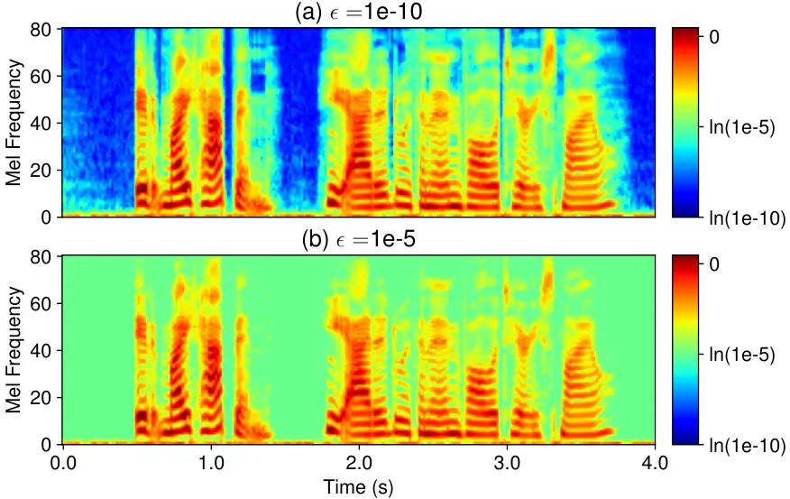
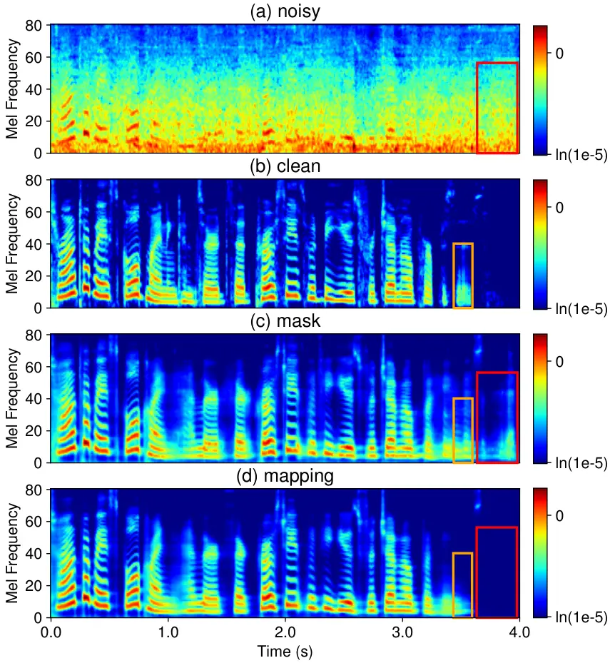

# CleanMel: Mel-Spectrogram Enhancement for Improving Both Speech Quality and ASR

Nian Shao    Rui Zhou    Pengyu Wang    Xian Li    Ying Fang   
Yujie Yang    Xiaofei Li ^(†)^(†)thanks: Nian Shao, Pengyu Wang, Ying
Fang and Yujie Yang are with Zhejiang University, and also with Westlake
University, Hangzhou, China (e-mail: {shaonian, wangpengyu, fangying,
yangyujie}@westlake.edu.cn).^(†)^(†)thanks: Rui Zhou, Xian Li and
Xiaofei Li are with the School of Engineering, Westlake University, and
also with the Institute of Advanced Technology, Westlake Institute for
Advanced Study, Hangzhou, China (e-mail: {zhourui, lixian,
lixiaofei}@westlake.edu.cn). ^(†)^(†)thanks: Nian Shao and Rui Zhou
equally contributed to this work. Corresponding:
lixiaofei@westlake.edu.cn

###### Abstract

In this work, we propose CleanMel, a single-channel Mel-spectrogram
denoising and dereverberation network for improving both speech quality
and automatic speech recognition (ASR) performance. The proposed network
takes as input the noisy and reverberant microphone recording and
predicts the corresponding clean Mel-spectrogram. The enhanced
Mel-spectrogram can be either transformed to the speech waveform with a
neural vocoder or directly used for ASR. The proposed network is
composed of interleaved cross-band and narrow-band processing in the
Mel-frequency domain, for learning the full-band spectral pattern and
the narrow-band properties of signals, respectively. Compared to
linear-frequency domain or time-domain speech enhancement, the key
advantage of Mel-spectrogram enhancement is that Mel-frequency presents
speech in a more compact way and thus is easier to learn, which will
benefit both speech quality and ASR. Experimental results on five
English and one Chinese datasets demonstrate a significant improvement
in both speech quality and ASR performance achieved by the proposed
model. Code and audio examples of our model are available online ¹¹ 1
https://audio.westlake.edu.cn/Research/CleanMel.html.

###### Index Terms: 

Speech enhancement, Mel-frequency, speech denoising, speech
dereverberation, automatic speech recognition

## I Introduction

THIS work studies single-channel speech enhancement using deep neural
networks (DNNs) to improve both speech quality and automatic speech
recognition (ASR) performance. A large class of speech enhancement
methods employ DNNs to map from noisy and reverberant speech to
corresponding clean speech, conducted either in the time domain \[1, 2\]
or time-frequency domain \[3, 4, 5\]. While these methods can
efficiently suppress noise, they do not necessarily improve ASR
performance due to the speech artifacts/distortions introduced by speech
enhancement networks \[6\]. In \[7\], it was found that time-domain
enhancement is more ASR-friendly than frequency-domain enhancement. A
time-domain progressive learning method is proposed in \[8\], which also
shows the superiority of time-domain speech enhancement, and the
progressive learning mechanism is very effective for robust ASR by
mitigating the over-suppression of speech. In \[9, 10\], ASR performance
is largely improved by decoupling front-end enhancement and backend
recognition. In \[10\], it is shown that an advanced time-frequency
domain network, i.e., CrossNet, can even outperform the time-domain
attentive recurrent network (ARN) \[9\].

Speech enhancement in Mel-frequency domain, or similarly in rectangular
bandwidth (ERB) domain, has been developed under various contexts in the
literature. Mel-frequency and ERB bands model human speech perception of
spectral envelope and signal periodicity, within which speech
enhancement is more perceptually and computationally efficient than
within linear-frequency domain or time domain. In \[11, 12, 13\],
spectral envelope enhancement is performed within the ERB bands, and
then applying pitch filtering \[11, 12\] or deep filtering \[13\] to
recover the enhanced speech.

Sub-band networks \[3, 14\] and full-band/sub-band fusion networks,
i.e., FullSubNet \[15, 16\], have been proposed and achieved outstanding
performance. However, separately processing sub-bands in the
linear-frequency domain leads to a large computational complexity. To
reduce the number of sub-bands and thus the computational complexity,
Fast FullSubNet \[17\] and the work of \[18\] proposed to perform
sub-band processing in the Mel-frequency domain, and then transform back
to linear frequency with a joint post-processing network. In \[19, 20\],
speech enhancement is directly conducted in the Mel-frequency domain and
then a separately trained neural vocoder is used to recover speech
waveform. These methods improve speech enhancement capability by
alleviating the burden of enhancing full-band speech details and also by
leveraging the powerful full-band speech recovery capacity of advanced
neural vocoder, as a result, achieve higher speech quality compared to
their linear-frequency counterparts.

In this work, we propose CleanMel, a single-channel Mel-spectrogram
enhancement network for improving both speech quality and ASR
performance. Different from the previous works \[11, 12, 13, 17\] that
performing speech enhancement in the ERB or Mel-frequency domain, and
then applying a joint pitch filtering or deep filtering to obtain the
enhanced speech, this work decouples the Mel-spectrogram enhancement and
post-processing parts by targeting the enhancement network with clean
Mel-spectrogram. The enhanced Mel-spectrogram can be directly used for
ASR, or transformed back to waveform with a separate neural vocoder as
is done in \[19\]. Compared to linear-frequency spectrogram or
time-domain waveform, Mel-frequency spectrogram presents speech in a
more compact and less-detailed way (but still perceptually efficient)
and has a lower feature dimension (number of frequencies) from the
perspective of machine learning, which would result in lower prediction
error. This is beneficial for both speech quality improvement and ASR:
(i) Neural vocoders have been extensively studied in the field of
Text-to-Speech, and are capable of transforming Mel-spectrogram back to
time-domain waveform with sufficient speech details and naturalness.
Therefore, the low-error property of Mel-spectrogram enhancement can be
hopefully maintained by the neural vocoders and higher speech quality
can be achieved. (ii) From the perspective of ASR, there seems no need
to first recover the less-accurate full-band (or time-domain
sample-wise) speech details and then compress to Mel-frequency. A direct
and more-accurate Mel-spectrogram estimation would be preferred.

We adapt the network architecture of our previous proposed (online)
SpatialNet \[21, 22\] with some modifications to better accommodate
Mel-spectrogram enhancement. SpatialNet is composed of interleaved
cross-band and narrow-band blocks originally proposed for processing
multichannel STFT frequencies. The narrow-band block processes STFT
frequencies independently to learn the spatial information presented in
narrow-band (one frequency), such as the convolutive signal propagation
and the spatial correlation of noise. And the cross-band block is
designed for learning the across-frequency dependencies of narrow-band
information. As for single-channel Mel-spectrogram enhancement in this
work, the narrow-band block processes Mel frequencies independently to
also learn the (single-channel) convolutive signal propagation of target
speech, which is crucial not only for conducting dereverberation of
target speech but also for discriminating between target speech and
interfering signals. The cross-band block is now reinforced and utilized
to learn the full-band spectral pattern in the Mel-frequency domain.

Overall, in this work, we propose a single-channel Mel-spectrogram
enhancement network, with an advanced network architecture adapted from
SpatialNet \[21, 22\]. The enhanced Mel-spectrogram can be directly fed
into a pre-trained ASR model, or transformed to waveform via a neural
vocoder. In addition, we have studied several critical issues when
decoupling the Mel-spectrogram enhancement front-end and ASR/Vocoder
back-ends. i) We have systematically studied and compared different
learning targets that can be used for Mel-spectrogram enhancement,
including logMel mapping, Mel ratio masking and the clipping issue of
logMel; ii) We have developed a data normalization scheme to align the
signal levels of cascaded front-end and back-end models; iii) We have
developed an online neural vocoder to enable online speech enhancement.

Experiments are conducted on six public datasets (five English and one
Chinese) for speech denoising and dereverberation individually or
jointly. Importantly, we adopt a more realistic evaluation setup: from
multiple data sources of clean speech, real-measured room impulse
responses (RIRs) and noise signals, we collect and organize a relatively
large-scale training set, based on which we train the network for once
and directly test it on all the six test sets. Experiments show that the
proposed model achieves the state-of-the-art (SOTA) speech enhancement
performance in term of speech perceptual quality. Moreover, on top of
various pre-trained and advanced ASR models, the proposed model
prominently improves the ASR performance on all datasets. These results
demonstrate that our trained models have the potential to be directly
employed to real applications.

## II Problem formulation

The noisy and reverberant single-channel speech signals can be
represented in the time domain as

```math
\displaystyle y(n)=s(n)*a(n)+e(n) \tag{1}
```

where $`n`$ stands for the discrete time index. $`s(n)`$ and $`e(n)`$
represents the clean source speech and ambient noise, respectively.
$`a(n)`$ denotes the RIR and $`*`$ the convolution operation. In this
work, only static speaker is considered, thence the RIR is
time-invariant. RIR is composed of the direct-path propagation, early
reflections and late reverberation.

We conduct joint speech denoising and dereverberation in this work,
which amounts to estimate the (Mel-spectrogram of) desired direct-path
speech $`x(n)=s(n)*a_{\text{dp}}(n)`$ from microphone recording
$`y(n)`$, where $`a_{\text{dp}}(n)`$ denotes the direct-path part in
RIR. The training target for both the proposed network and neural
vocoders are derived with $`x(n)`$.

The proposed method is performed in the time-frequency domain. By
applying STFT to Eq. (1), based on the convolutive transfer function
approximation \[23\], we can obtain:

```math
\displaystyle Y(f,t)\approx S(f,t)*A(f,t)+E(f,t) \tag{2}
```

where $`f\in\{0,...,F-1\}`$ and $`t\in\{1,...,T\}`$ denote the indices
of frequency and time frame, respectively. $`Y(f,t)`$, $`S(f,t)`$ and
$`E(f,t)`$ are the STFT of respective signals, and $`X(f,t)`$ is the
STFT of direct-path speech. $`A(f,t)`$ is the convolutive transfer
function associated to $`a(n)`$. Convolution $`*`$ is conducted along
time. In the STFT domain, the time-domain convolution $`s(n)*a(n)`$ is
approximately decomposed as frequency-wise convolutions
$`S(f,t)*A(f,t)`$. We consider one STFT frequency as one narrow-band,
and refer to the frequency-wise convolution as narrow-band convolution.
Speech dereverberation in this work highly relies on learning this
narrow-band convolution. For noise reduction, one important way for
discriminating between speech and stationary noise is to test the signal
stationarity, which can be modeled in narrow-band as well.

## III Mel-spectrogram Enhancement

In this work, we propose to enhance the Mel-spectrograms, which then can
be directly fed into an ASR model, or transformed to waveforms with a
neural vocoder.

### III-A Learning Target: Clean Mel-spectrogram

The power-based or magnitude-based Mel-spectrogram of the target speech
$`X(f,t)`$, denoted as $`X_{\text{mel}}(f,t)`$, can be obtained by
weighted summing the squared magnitude $`|X(f,t)|^{2}`$ or magnitude
$`|X(f,t)|`$ over frequencies with the triangle weight functions of Mel
filterbanks, where $`f\in\{1,...,F_{\text{mel}}\}`$ now indexes Mel
frequency. Our preliminary experiments showed that using power-based or
magnitude-based Mel-spectrograms achieve similar enhancement
performance, which means we can choose either of them according to the
Mel setup of ASR or neural vocoder backend models. In this work, we use
the power-based Mel-spectrogram according to the setup of commonly-used
ASR models. Then, the logMel-spectrogram, namely the logarithm of
$`X_{\text{mel}}(f,t)`$

```math
\displaystyle X_{\text{logmel}}(f,t)=\log(\max\{X_{\text{mel}}(f,t),\epsilon\}) \tag{3}
```

can be taken as the input feature of ASR or neural Vocoder backends. The
base of logarithm ($`e`$ or 10) should be consistent to the one of
back-ends as well, while $`e`$ is used in this work. The Mel-spectrogram
is clipped with a small value of $`\epsilon`$ to avoid applying
logarithm to close-zero values.

Normally, $`\epsilon`$ is set to be very small, e.g. 1e-10, to maintain
complete speech information. However, in our preliminary experiments, we
found that very small speech values are not very informative for both
ASR and neural vocoder, and can be clipped without harming performance.
Moreover, since those small values are highly contaminated by noise or
reverberation, the prediction error of them could be very large. For
these reasons, we set $`\epsilon`$ to a relatively large value, e.g.
1e-5 (when the maximum value of time-domain signal is normalized. The
signal normalization methods will be presented in Section III-D). Fig. 1
gives an example of our target logMel-spectrogram, in which about 40% TF
bins are clipped.

In this work, we evaluate two different learning targets as for
Mel-spectrogram enhancement.

LogMel mapping: The clean logMel-spectrogram can be directly predicted
with the network. The training loss is set to the mean absolute error
(MAE) loss between the predicted and the clean logMel-spectrogram,
namely

```math
\displaystyle\begin{aligned} \mathcal{L}_{\text{MAE}}=\frac{1}{F_{\text{mel}}T}\sum_{f=1}^{F_{\text{mel}}}\sum_{t=1}^{T}|\hat{X}_{\text{logmel}}(f,t)-X_{\text{logmel}}(f,t)|,\end{aligned} \tag{4}
```

where $`\hat{X}_{\text{logmel}}(f,t)`$ is the network output.

Mel ratio mask: Ratio mask is one type of popular learning targets for
speech magnitude enhancement \[24\]. For each time-Mel-frequency bin,
the Mel ratio mask is defined as

```math
\displaystyle M(f,t)=\text{min}\left(\sqrt{\frac{X_{\text{mel}}(f,t)}{Y_{\text{mel}}(f,t)}},1\right), \tag{5}
```

where $`Y_{\text{mel}}(f,t)`$ denotes the power level of noisy
Mel-spectrogram. The square root function transforms the power domain to
the magnitude domain. The $`\text{min}(\cdot)`$ function rectifies the
mask into the range of $`[0,1]`$. The mean squared error (MSE) of the
ratio mask is taken as the training loss, namely

```math
\displaystyle\mathcal{L}_{\text{MRM}}=\frac{1}{F_{\text{mel}}T}\sum_{f=1}^{F_{\text{mel}}}\sum_{t=1}^{T}(M(f,t)-\hat{M}(f,t))^{2}, \tag{6}
```

where $`\hat{M}(f,t)`$ denotes the model prediction of $`{M}(f,t)`$.
Then, the enhanced logMel-spectrogram can be obtained as

```math
\displaystyle\hat{X}_{\text{logmel}}(f,t)=\text{log}(\max\{\hat{M}(f,t)^{2}Y_{\text{mel}}(f,t),\epsilon\}). \tag{7}
```



Fig. 1: An example of logMel spectrogram with a clip value of
$`\epsilon=`$1e-10 or $`\epsilon=`$1e-5.

### III-B The CleanMel Network

Fig. 2: Model architecture of the proposed speech enhancement system. a)
System overview. The input dimension of neural blocks/layers are
presented before each of them in the form ‘batch dimension x (dimension
of one sample in batch)”. b) The online/offline narrow-band block. The
solid lines stands for online processing. The solid plus dashed lines
stands for offline processing. c) The cross-band block.

Fig. 2 shows the network architecture. The proposed network takes (the
real ($`\mathcal{R}(\cdot)`$) and imaginary ($`\mathcal{I}(\cdot)`$)
parts of) the STFT of microphone recording as input, i.e. $`Y(f,t)`$,
denoted as $`\mathbf{y}`$:

```math
\displaystyle\mathbf{y}[f,t,:]=[\mathcal{R}(Y(f,t)),\mathcal{I}(Y(f,t))]\in\mathbb{R}^{2}, \tag{8}
```

where $`[:]`$ represents to take values of one dimension of a tensor.
The network is composed of an input layer, interleaved cross-band and
narrow-band blocks first in the linear-frequency domain and then in
Mel-frequency domain, a Mel-filterbank, and a Linear output layer. The
input layer performs temporal convolution on y with kernel size 5,
producing the hidden representation with the dimensions of
$`F\times T\times H`$. Then one cross-band block and one narrow-band
block process the hidden tensor in the linear-frequency domain. A
Mel-filterbank (with triangle weight functions) transforms the frequency
dimension from $`F`$ linear frequencies to $`F_{\text{mel}}`$ Mel
frequencies via non-trainable matrix multiplication. Then, $`L`$
interleaved cross-band and narrow-band blocks process the tensor in
Mel-frequency domain.

After the final narrow-band block, the output Linear layer transforms
the $`H`$-dimensional features to 1-dimensional output, producing either
the enhanced logMel-spectrogram or the Mel ratio mask. Note that a
sigmoid activation is applied when predicting the Mel ratio mask.

#### III-B1 Narrow-band block

As shown in Eq. (2), the time-domain convolution can be decomposed as
frequency-independent narrow-band convolutions, which have much lower
complexity than time-domain convolution in terms of room filter order.
Therefore, modeling narrow-band convolution is substantially more
efficient than modeling time-domain convolution. The convolution model
of target speech not only provides necessary information for
dereverberation but also helps discriminate target speech from other
interfering sources. Additionally, in narrow-band processing,
non-stationary speech and stationary noise can be well discriminated by
testing the signal stationarity. For these reasons, we propose the
narrow-band network, which processes frequencies independently along the
time dimension, with all frequencies sharing the same network.

The narrow-band convolution in Eq. (2) is defined between the
complex-valued STFT coefficients of source speech and room filters.
Therefore, we process the complex-valued STFT coefficients of noisy
signal (in a hidden space) rather than other features such as magnitude,
to preserve the convolution property. We first process in the finer
linear-frequency domain using one narrow-band block to fully exploit the
convolution information. After Mel-filterbank transformation, we process
in the coarser Mel-frequency domain with additional narrow-band blocks.

The narrow-band network comprises Mamba blocks \[25\]. Mamba is a
recently proposed network architecture based on structured state space
sequence models, which has proven highly efficient for learning both
short-term and long-term dependencies in sequential data. Besides
short-term correlations of signals, there exist some long-term
dependencies should be exploited for narrow-band speech enhancement. For
example, the narrow-band convolution remains time-invariant over the
entire recording for static speakers. Moreover, Mamba has a linear
computational complexity w.r.t time, which is suitable for streaming
processing of long audio signals. Specifically, each narrow-band block
contains a forward Mamba for online processing and an optional backward
Mamba (output averaged with forward output) for offline processing.

#### III-B2 Cross-band block

The cross-band block learns full-band/cross-band signal dependencies.
The original SpatialNet \[21\] designed this block to learn the linear
relationship of inter-channel features (e.g. inter-channel phase
difference) across frequencies. In this work, there is no such
inter-channel information for the single-channel scenario. Instead, the
cross-band block can learn full-band spectral patterns in
linear/Mel-frequency domains, which is also critical for (especially
single-channel) speech enhancement. The cross-band block processes
frames independently along the frequency dimension, with all frames
sharing the same network.

Specifically, we retain the cross-band block architecture of SpatialNet,
which comprises cascaded frequency convolutional layers (F-GConv1d),
across-frequency linear layers (F-Linear), and a second frequency
convolutional layer. The frequency convolutional layers perform 1-D
convolution along frequency to capture adjacent-frequency correlations,
while the across-frequency linear layer processes all frequencies
jointly (for each hidden dimension separately) to model full-band
dependencies.

One cross-band block is first applied in the linear-frequency domain to
learn detailed full-band correlations. To reduce the model complexity,
the hidden dimension $`H`$ is compressed (e.g., to $`H/12`$) before
processing by the across-frequency linear layer ($`F^{2}`$ complexity
for each hidden dimension). After Mel-filterbank transformation,
cross-band blocks learn full-band correlations across Mel frequencies,
reducing the complexity from $`F^{2}`$ to $`F_{\text{mel}}^{2}`$.
Correspondingly, we set the hidden dimension to remain $`H`$ (without
compression) to enhance the full-band learning capability.

All the Mel-frequency cross-band blocks share identical across-frequency
linear layers.

### III-C Back-ends

At inference, CleanMel is followed by either an ASR model or a neural
vocoder. Both ASR model and neural vocoder are trained separately from
the CleanMel network.

#### III-C1 ASR

During inference, the enhanced logMel-spectrogram can be directly fed to
a pre-trained ASR model, without fine-tuning or joint training.
Different ASR systems may use varying STFT configurations, numbers of
Mel frequencies, and logarithm bases. To seamlessly integrate the
enhanced logMel-spectrogram into one ASR model, CleanMel adopts
identical configurations to the target ASR model. Training CleanMel is
not very costly, so it can be easily re-trained for a new ASR system,
especially for those large-scale or deployed ASR systems. In this work,
we only conduct offline ASR combined with offline CleanMel.

#### III-C2 Neural vocoder

The vocoder we adopt in this work is Vocos \[26\], a recently proposed
Generative Adversarial Network (GAN)-based neural vocoder. The generator
of Vocos predicts the STFT coefficients of speech at frame level and
then generates waveform through inverse STFT, thence it significantly
improves the computational efficiency compared to HiFi-GAN that directly
generates waveform at sample level. Vocos uses the
multiple-discriminators and multiple-losses proposed in HiFi-GAN \[27\].
In this work, to unify the front-end and back-end processing, we have
made several necessary modifications to Vocos as follows:

- •
  The magnitude-based Mel-spectrogram of original Vocos is modified as
  power-based to match front-end and ASR configurations, where the two
  cases were shown to achieve similar performance in our preliminary
  experiments.
- •
  The sampling rate of signals, the STFT configurations and the number
  of Mel-frequencies of Vocos are adjusted to match the front-end and
  ASR configurations.
- •
  The original Vocos is designed for offline processing, as it employs
  non-causal convolution layers. To enable online processing, we
  modified Vocos to be causal by substituting each non-causal
  convolution layer with its causal version. The modified online vocoder
  still performs well. In addition, to reduce the computational
  complexity of online processing, the 75% STFT overlap of original
  Vocos is reduced to be 50% overlap, which still achieves comparable
  performance.

The offline and online Vocos are used to work with the offline and
online CleanMel, respectively. All Vocos models were trained using our
direct-path target speech $`x(n)`$.

### III-D Signal Normalization

When cascading separately-trained front-end and back-end models, signal
normalization should be performed not only to facilitate the training of
respective models but also to align the signal level of cascaded models.
Specifically, the level of enhanced logMel of CleanMel should align with
the one of the input logMel of ASR and Vocoder models. For offline
processing, CleanMel adopts the normalization method of Vocos: a random
gain is applied to time-domain signal such that the maximum level of the
resulting signal falls between -1 and -6 dBFS (decibels relative to full
scale). This ensures the peak sample value approaches but remains less
than 1, so that the generated waveform can be directly played at full
volume without clipping. CleanMel applies this normalization to the
noisy signal, and uses the same gain of noisy signal to the
corresponding clean target signal. In this way, the enhanced logMel can
be directly fed to Vocos. When applying this time-domain normalization,
the logMel clip value $`\epsilon`$ is set to 1e-5 for both CleanMel and
Vocos. ASR models normally have a separate logMel normalization, which
will be used to re-normalize the enhanced logMel.

For online processing, the time-domain normalization is no longer
applicable. Instead, an online STFT-domain normalization is used for
both CleanMel and Vocos. For CleanMel, the noisy and target speech are
normalized in the STFT domain as $`\tilde{Y}(f,t)=Y(f,t)/\mu(t)`$ and
$`\tilde{X}(f,t)=X(f,t)/\mu(t)`$, where $`\mu(t)`$ is recursively
updated as the mean of STFT magnitude, i.e.,
$`\mu(t)=\alpha\mu(t-1)+(1-\alpha)\frac{1}{F}\sum_{f=0}^{F-1}|Y(f,t)|`$.
The smoothing weight is set to $`\alpha=\frac{K-1}{K+1}`$ which is
equivalent to applying a $`K`$-long rectangle smoothing window. When
training online Vocos with target speech $`x(n)`$, we first apply the
offline time-domain normalization mentioned above, followed by this
online normalization. Specifically, $`\mu(t)`$ is computed with and
applied to $`X(f,t)`$ (instead of $`Y(f,t)`$), and then the
corresponding logMel is computed as the input of Vocos generator.
Accordingly, the output of Vocos generator (before applying inverse
STFT) would be an estimation of normalized $`X(f,t)`$. To go back to the
signal level of time domain normalization, the recursive normalization
factor $`\mu(t)`$ is multiplied back to the estimation of normalized
$`X(f,t)`$ and then applying inverse STFT, after which Vocos losses
(including Mel loss and discriminator losses) are computed. During
inference, online normalization is applied to noisy inputs of CleanMel.
The enhanced logMel is directly fed into Vocos. The recursive
normalization factor computed with the noisy input is multiplied to the
estimated STFT coefficients by Vocos and then applying inverse STFT to
obtain the final waveform. This final waveform is time-domain-normalized
and ready for playback. For online normalization, the logMel clip value
$`\epsilon`$ is set to $`1e-4`$ for both CleanMel and the input of Vocos
generator.

## IV Experimental setups

In the section, we present the experiment datasets, experimental
configurations, evaluation metrics and comparison methods.

### IV-A Dataset

#### IV-A1 Speech enhancement training dataset

The proposed model is trained with synthetic noisy/clean speech pairs.
Reverberant speech signals are generated by convolving source speech
signals with RIRs, then added with noise signals. Clean target speech
signals are generated by convolving source speech signals with the
direct-path part of RIRs.

In this work, we conduct speech enhancement for both Mandarin Chinese
and English. Six different datasets (as will be shown later) are used to
evaluate our model. We attempt to train the model once and test it on
all the datasets, which will reflect the general capability of the model
under various situations. To do this, we collect data (in terms of
source speech, RIRs and noise) from multiple public datasets, and form a
training set with sufficient speech quality and environment/device
diversity.

Source speech: Source speech signals are collected from 6 datasets,
including AISHELL I \[28\], AISHELL II \[29\] and THCHS30 \[30\] for
Chinese, and EARS \[31\], VoiceBank \[32\] and DNS I challenge \[33\]
for English.

For each language, about 200 hours of high-quality speech data are
selected from the original datasets, based on the raw score of DNSMOS
P.835 \[34\]. The selection thresholds are set to 3.6 and 3.5 for
Chinese and English data, respectively. Except that the entire EARS
training set is included, since EARS involves various emotional speech
that cannot be well evaluated by the DNSMOS. The two test speakers in
the VoiceBank Demand dataset \[35\] are excluded from our training data.

The amount of data selected from each dataset is summarized in Table I.

|          |                        |                  |            |
| -------- | ---------------------- | ---------------- | ---------- |
| Language | Speech dataset         | Duration (hours) | \#Speakers |
| Chinese  | AISHELLI \[28\]        | 25               | 240        |
|          | AISHELL II \[29\]      | 178              | 987        |
|          | THCHS30 \[30\]         | 18               | 49         |
| English  | EARS \[31\]            | 81               | 92         |
|          | VoiceBank \[32\]       | 32               | 93         |
|          | DNS I challenge \[33\] | 94               | 1,263      |

TABLE I: Clean source speech used in this work.

RIR: We use real-measured RIRs from multiple public datasets \[36, 37,
38, 39, 40, 41, 42, 43\]. Table II shows the statistics of these RIR
datasets. For all (even multi-channel) datasets, all RIRs are used,
except that we uniformly sampled 1,000 RIRs from the very large original
ARNI dataset. The reverberation time, i.e. $`T_{60}`$, of RIRs mostly
lie in the range between 0 and 1.5 seconds, except for a few rooms in
AIR \[37\] and NaturalReverb \[41\]. The distribution of the $`T_{60}`$s
are shown in Fig. 3. Besides the wide distribution range of $`T_{60}`$s,
these RIRs also have large diversity in terms of environments and
measuring devices. For example, NaturalReverb \[41\] is recorded in 271
spaces encountered by humans during daily life, AIR \[37\] is measured
with a dummy head for binaural applications, RWCP \[43\] use a
Head-Torso as source speaker, etc. When synthesizing reverberant speech,
80% source speech samples are convolved with a randomly selected RIR,
while there is no RIR convolution for the rest 20% samples to account
for the near-field applications where reverberation is negligible.

|                      |        |                           |
| -------------------- | ------ | ------------------------- |
| RIR dataset          | \#RIRs | $`T_{60}`$ range (second) |
| ACE \[36\]           | 84     | $`[0.33,1.22]`$           |
| AIR \[37\]           | 204    | $`[0.08,4.50]`$           |
| ARNI \[38\]          | 1,000  | $`[0.51,1.20]`$           |
| dEchorate \[39\]     | 594    | $`[0.17,0.75]`$           |
| MultiChannel \[40\]  | 234    | $`{0.16,0.36,0.61}`$      |
| NaturalReverb \[41\] | 270    | \[0.02, 2.00\]            |
| REVERB \[42\]        | 240    | \[0.25, 0.70\]            |
| RWCP \[43\]          | 182    | \[0.10, 0.72\]            |

TABLE II: Real-measured RIRs used in this work.

Fig. 3: T60 distribution of RIRs used in this work.

Noise: Speech and noise are mixed at a random signal-to-noise ratio
(SNR) between -5 dB and 20 dB. We use the noise signals from the DNS
challenge \[44\] and the RealMAN dataset \[45\]. The DNS challenge
dataset has about 181 hours of noise sampled from AudioSet \[46\] and
Freesound. The RealMAN dataset has 106 hours of ambient noise recorded
in 31 daily life scenes, including various indoor, semi-outdoor, outdoor
and transportation scenes.

#### IV-A2 Speech enhancement evaluation datasets

The speech enhancement performance of the proposed model is evaluated on
six datasets. For Chinese, we use the public test set (static speaker)
of the RealMAN dataset \[45\]. For English, the evaluation is conducted
on 5 different datasets: (1) the CHiME4 challenge ‘isolated_1ch_track’
test set \[47\], (2) the one-channel test set of REVERB \[42\], (3) the
test set of DNS I challenge \[33\], (4) the public EARS blind test
dataset \[31\], (5) the test set of VoiceBank Demand dataset \[35\].

#### IV-A3 ASR evaluation datasets and models

The ASR performance of the proposed model is evaluated on three
datasets. For Chinese, we conduct experiments on the RealMAN (static
speaker) dataset \[45\], using the pre-trained WenetSpeech Conformer ASR
model \[48\] from ESPNet ²² 2
https://github.com/espnet/espnet/tree/master/egs2. For English, we
evaluate on the CHiME4 \[47\] and REVERB \[42\] datasets, using their
respective pre-trained E-branchformer \[49\] and Transformer \[50\] ASR
models from ESPNet, respectively. Note that, the ASR models used in this
work have the same STFT and Mel-frequency configurations, thus one
CleanMel model can be used for all of them.

### IV-B Configurations

|         |            |                |               |            |            |
| ------- | ---------- | -------------- | ------------- | ---------- | ---------- |
| Mode    | Model size | Depth($`L+1`$) | Hidden($`H`$) | \#Param(M) | FLOPs(G/s) |
| Online  | CleanMel-S | 16             | 96            | 2.7        | 18.1       |
| Offline | CleanMel-S | 8              | 96            | 2.5        | 32.9       |
|         | CleanMel-L | 16             | 144           | 7.2        | 127.8      |

TABLE III: Model configurations of the proposed Mel spectrogram
enhancement networks.

#### IV-B1 Data configurations

The sampling rate of all data is set to 16 kHz. STFT is applied using
Hanning window with a length of 512 samples (32 ms) and a hop size of
128 and 256 samples (8 and 16 ms) for the offline and online models,
respectively. The offline model has a finer temporal resolution than the
online model since it is used for ASR in this work and its temporal
resolution is aligned with the ASR models. However, we empirically found
that, compared to the 16-ms hop size, the 8-ms hop size does not benefit
much for the speech enhancement performance. The number of Mel
frequencies is set to $`F_{\text{mel}}=80`$ for the frequency range of
0-8 kHz. The same STFT implementation (ESPNet implementation³³ 3
https://github.com/espnet/espnet/blob/master/espnet2/layers/stft.py) is
used for the CleanMel networks, neural vocoders and ASR models, to avoid
configuration mismatch. The natural logarithm (base of $`e`$) is used.

#### IV-B2 Network configurations

Follow \[21\], the kernel size of the T-Conv1d in the input module and
the F-GConv1d layers in the cross-band block are both set to 5. As shown
in Fig. 2, in narrow-band block, forward-only and forward/backward Mamba
layers are set for online and offline processing, respectively. We set
up two model scales for the offline models, referred to as CleanMel-S
and CleanMel-L. The online model scale is set approximately to
CleanMel-S. The configurations are shown in Table III. The depth $`L`$
of online models are set to twice the one of corresponding offline
models to have the similar model size. Due to the different setups of
STFT hop size, the computational complexity, i.e. FLOPs, of offline
models are roughly twice the one of corresponding online models.

#### IV-B3 Training and inference setups

For CleanMel, AdamW optimizer \[51\] with an initial learning rate of
$`10^{-3}`$ is used for training. The learning rate exponentially decays
with $`\text{lr}\leftarrow 0.001\times 0.99^{\text{epoch}}`$. Gradient
clipping is applied with a gradient norm threshold 10. The batch size
are set to 32. Training samples are synthesized in an on-the-fly manner,
and 100,000 samples are considered as one training epoch. The CleanMel-S
and CleanMel-L models are trained by 100 and 150 epochs, respectively.
Afterward, we average the model weights of the last 10 epochs as the
final model for inference.

For training the Vocos neural vocoder \[26\], we synthesized 400,000
(direct-path) clean speech samples with both English and Chinese data
used for CleanMel training. The training configurations remain unchanged
as in its original work.

### IV-C Evaluation metrics

Speech enhancement performance is evaluated with Perceptual Evaluation
of Speech Quality (PESQ) \[52\], DNSMOS P.808 \[53\] and P.835 \[34\],
where the background (BAK), signal (SIG) and overall (OVL) scores for
P.835 are all reported. Word Error Rate (WER) and Character Error Rate
(CER) are used to evaluate English and Chinese ASR performances,
respectively.

### IV-D Comparison models

We compare with advanced speech enhancement models, most of which were
claimed in their original papers to be able to conduct joint speech
denoising and dereverberation, including (i) ConvTasNet \[1\] is a fully
convolutional time-domain (offline) speech separation network. (ii)
FullSubNet \[15\] is a LSTM-based full-band and sub-band fusion network
originally proposed for online speech denoising, and extended to speech
dereverberation in \[16\]. For offline processing, we change the
uni-directional LSTMs to be bi-directional. (iii) Demucs \[2\] is an
online time-domain speech enhancement network with a U-net architecture.
(iv) CMGAN \[54\] is a two-stage Conformer-based offline speech
enhancement network. (v) LiSenNet \[55\] is a super light-weight online
speech enhancement network primirily with a dual-path recurrent module.
Both CMGAN and LiSenNet utilize mixed training losses, including speech
regression losses and an adversarial loss. (vi) VoiceFixer \[19\] also
enhances Mel-spectrograms (using a ResUNet) and generates the waveform
using a neural vocoder, but supports only offline processing. (vii)
CDiffuse \[56\], StoRM \[57\] and UNIVERSE++ \[58\] are three
diffusion-based offline speech enhancement models. (viii) SpatialNet
\[21\] and oSpatialNet \[22\] perform speech enhancement in the STFT
linear-frequency domain, and offer the backbone network for the proposed
CleanMel model. In SpatialNet and oSpatialNet, self-attention (and
temporal convolution) and Mamba are adopted for learning the narrow-band
spatial information in an offline and an online manner, respectively.

For offline processing, besides comparing with the original SpatialNet,
we also implemented a variant of it with bi-directional Mamba for
narrow-band blocks (same architecture with the proposed method), which
is referred to as SpatialNet-Mamba, and serves as the linear-frequency
baseline for the proposed Mel-frequency model. Note that, SpatialNet and
oSpatialNet were originally proposed for multi-channel speech
enhancement, and this work is the first one to fully evaluate and
analyze the capability of them for single-channel speech enhancement.

To conduct fair comparisons, we re-trained the ConvTasNet, FullSubNet,
CMGAN, LiSenNet, CDiffuse, StoRM, UNIVERSE++ and oSpatialNet/SpatialNet
models, using the same training data utilized for the proposed model.
LiSenNet was trained without the noise detector \[55\]. UNIVERSE++ was
trained under its universal speech enhancement configuration \[58\]. All
models were trained to convergence according to their model selection
strategy. However, we found that it is not easy to re-train the Demucs
and Voicefixer models. In \[2\], different data augmentation strategies
are applied when training Demucs on different datasets. Voicefixer
\[19\] was designed for 44.1 kHz signals. Re-training Demucs and
VoiceFixer requires careful data engineering or hyperparameter search.
Therefore, we used the pre-trained checkpoints of Demucs and VoiceFixer
to perform speech enhancement on only English data. For Demucs, we used
the ‘dns64’ model provided by the authors ⁴⁴ 4
https://github.com/facebookresearch/denoiser. For VoiceFixer, we
empolyed the default pre-trained model provided in the open-source
package ⁵⁵ 5 https://github.com/haoheliu/voicefixer. Following the
VoiceFixer default inference setup, test waveforms were first up-sampled
to 44.1 kHz to perform speech enhancement and then down-sampled back to
16 kHz for evaluation.

## V Results and Analyses

In this section, we present and analyze speech enhancement performance
and ASR results, conduct ablation studies, and compare the model size
and computational complexity.

### V-A Speech enhancement results

|         |                    |             |      |      |       |       |      |      |       |                  |      |      |       |             |      |      |       |             |      |      |       |                |      |      |       |
| ------- | ------------------ | ----------- | ---- | ---- | ----- | ----- | ---- | ---- | ----- | ---------------- | ---- | ---- | ----- | ----------- | ---- | ---- | ----- | ----------- | ---- | ---- | ----- | -------------- | ---- | ---- | ----- |
|         | Enhancement method | CHiME4 real |      |      |       | EARS  |      |      |       | VoiceBank Demand |      |      |       | REVERB real |      |      |       | DNS w. rvb. |      |      |       | RealMAN static |      |      |       |
|         |                    | P.835       |      |      | P.808 | P.835 |      |      | P.808 | P.835            |      |      | P.808 | P.835       |      |      | P.808 | P.835       |      |      | P.808 | P.835          |      |      | P.808 |
|         |                    | OVL         | SIG  | BAK  |       | OVL   | SIG  | BAK  |       | OVL              | SIG  | BAK  |       | OVL         | SIG  | BAK  |       | OVL         | SIG  | BAK  |       | OVL            | SIG  | BAK  |       |
|         | unproc.            | 1.37        | 1.99 | 1.34 | 2.43  | 2.02  | 2.94 | 2.04 | 2.80  | 2.53             | 3.28 | 2.87 | 3.04  | 1.39        | 1.74 | 1.53 | 2.81  | 1.42        | 1.89 | 1.50 | 2.74  | 1.53           | 2.03 | 1.75 | 2.56  |
| Online  | FullSubNet \[15\]  | 2.41        | 3.05 | 3.08 | 3.22  | 2.73  | 3.12 | 3.55 | 3.52  | 2.93             | 3.30 | 3.79 | 3.47  | 2.72        | 3.13 | 3.60 | 3.61  | 2.41        | 2.98 | 3.15 | 3.36  | 2.49           | 2.97 | 3.33 | 3.12  |
|         | Demucs \[2\]       | 2.84        | 3.12 | 3.90 | 3.26  | 2.94  | 3.21 | 3.94 | 3.38  | 3.03             | 3.31 | 3.97 | 3.43  | 2.96        | 3.25 | 3.94 | 3.50  | 2.50        | 2.82 | 3.66 | 3.17  | \-             |      |      |       |
|         | LiSenNet \[55\]    | 2.26        | 2.70 | 3.31 | 3.08  | 2.61  | 2.93 | 3.63 | 3.29  | 2.87             | 3.16 | 3.93 | 3.42  | 2.54        | 3.15 | 3.31 | 3.38  | 2.21        | 2.56 | 3.49 | 3.15  | 2.32           | 2.70 | 3.42 | 2.96  |
|         | oSpatialNet \[22\] | 2.61        | 3.15 | 3.36 | 3.52  | 2.85  | 3.22 | 3.65 | 3.65  | 2.91             | 3.26 | 3.80 | 3.48  | 3.03        | 3.33 | 3.93 | 3.84  | 2.79        | 3.16 | 3.70 | 3.67  | 2.79           | 3.19 | 3.66 | 3.46  |
|         | CleanMel-S-map     | 2.95        | 3.26 | 3.86 | 3.77  | 2.89  | 3.24 | 3.69 | 3.72  | 3.02             | 3.28 | 4.01 | 3.65  | 3.17        | 3.45 | 4.02 | 3.94  | 3.08        | 3.36 | 3.97 | 3.84  | 2.90           | 3.24 | 3.81 | 3.52  |
|         | CleanMel-S-mask    | 2.74        | 3.26 | 3.43 | 3.59  | 2.83  | 3.19 | 3.64 | 3.70  | 2.99             | 3.31 | 3.90 | 3.50  | 3.07        | 3.40 | 3.91 | 3.80  | 2.95        | 3.30 | 3.81 | 3.75  | 2.73           | 3.18 | 3.53 | 3.36  |
| Offline | ConvTasNet \[1\]   | 2.79        | 3.19 | 3.67 | 3.12  | 2.81  | 3.19 | 3.62 | 3.30  | 3.00             | 3.31 | 3.93 | 3.38  | 2.95        | 3.25 | 3.92 | 3.29  | 2.50        | 2.90 | 3.51 | 3.05  | 2.64           | 3.06 | 3.54 | 2.97  |
|         | FullSubNet \[15\]  | 2.47        | 3.10 | 3.11 | 3.27  | 2.74  | 3.16 | 3.51 | 3.54  | 3.03             | 3.34 | 3.93 | 3.52  | 2.69        | 3.09 | 3.60 | 3.60  | 2.35        | 2.91 | 3.10 | 3.25  | 2.47           | 2.97 | 3.27 | 3.13  |
|         | CMGAN \[54\]       | 3.11        | 3.48 | 3.82 | 3.55  | 3.08  | 3.38 | 3.82 | 3.62  | 3.16             | 3.44 | 4.00 | 3.44  | 3.07        | 3.43 | 3.81 | 3.63  | 3.11        | 3.47 | 3.82 | 3.71  | 2.93           | 3.38 | 3.62 | 3.34  |
|         | VoiceFixer \[19\]  | 2.95        | 3.25 | 3.89 | 3.65  | 2.94  | 3.25 | 3.83 | 3.55  | 3.13             | 3.43 | 3.98 | 3.46  | 2.88        | 3.26 | 3.61 | 3.62  | 3.11        | 3.40 | 3.97 | 3.84  | \-             |      |      |       |
|         | CDiffuse \[56\]    | 2.22        | 3.22 | 2.28 | 2.70  | 2.50  | 3.17 | 2.96 | 2.78  | 2.83             | 3.31 | 3.60 | 2.99  | 1.62        | 2.03 | 2.07 | 2.63  | 1.98        | 2.65 | 2.25 | 2.83  | 1.92           | 2.48 | 2.59 | 2.44  |
|         | StoRM \[57\]       | 3.29        | 3.57 | 4.03 | 3.87  | 2.97  | 3.37 | 3.65 | 3.79  | 3.20             | 3.46 | 4.06 | 3.61  | 3.25        | 3.53 | 4.01 | 4.01  | 3.25        | 3.53 | 4.03 | 3.87  | 3.04           | 3.42 | 3.80 | 3.68  |
|         | UNIVERSE++ \[58\]  | 3.18        | 3.43 | 4.05 | 3.71  | 2.97  | 3.32 | 3.73 | 3.63  | 3.18             | 3.43 | 4.07 | 3.56  | 3.19        | 3.50 | 3.95 | 3.81  | 2.74        | 3.34 | 3.28 | 3.54  | 2.93           | 3.34 | 3.68 | 3.49  |
|         | SpatialNet \[21\]  | 2.76        | 3.32 | 3.39 | 3.51  | 2.86  | 3.27 | 3.58 | 3.59  | 3.02             | 3.33 | 3.92 | 3.53  | 3.07        | 3.41 | 3.87 | 3.84  | 2.91        | 3.33 | 3.68 | 3.65  | 2.88           | 3.32 | 3.66 | 3.45  |
|         | SpatialNet-Mamba   | 2.94        | 3.35 | 3.71 | 3.65  | 2.94  | 3.31 | 3.69 | 3.67  | 3.08             | 3.36 | 3.98 | 3.57  | 3.09        | 3.43 | 3.85 | 3.86  | 2.89        | 3.35 | 3.58 | 3.68  | 2.95           | 3.37 | 3.69 | 3.50  |
|         | CleanMel-S-map     | 3.33        | 3.58 | 4.11 | 3.96  | 3.02  | 3.36 | 3.73 | 3.79  | 3.26             | 3.49 | 4.11 | 3.63  | 3.39        | 3.62 | 4.13 | 4.08  | 3.33        | 3.58 | 4.10 | 4.03  | 3.25           | 3.55 | 4.03 | 3.82  |
|         | CleanMel-S-mask    | 3.26        | 3.56 | 4.01 | 3.81  | 2.97  | 3.34 | 3.68 | 3.71  | 3.22             | 3.47 | 4.08 | 3.59  | 3.31        | 3.58 | 4.08 | 4.01  | 3.25        | 3.53 | 4.05 | 3.97  | 3.15           | 3.49 | 3.93 | 3.71  |
|         | CleanMel-L-map     | 3.36        | 3.60 | 4.13 | 3.99  | 3.02  | 3.37 | 3.73 | 3.81  | 3.26             | 3.50 | 4.11 | 3.63  | 3.39        | 3.63 | 4.14 | 4.09  | 3.33        | 3.57 | 4.12 | 4.05  | 3.23           | 3.52 | 4.02 | 3.82  |
|         | CleanMel-L-mask    | 3.30        | 3.59 | 4.04 | 3.87  | 2.99  | 3.35 | 3.70 | 3.74  | 3.23             | 3.48 | 4.09 | 3.59  | 3.31        | 3.58 | 4.08 | 4.02  | 3.25        | 3.53 | 4.05 | 4.00  | 3.15           | 3.49 | 3.93 | 3.71  |

TABLE IV: DNSMOS scores on real and simulated test sets.

|         |                    |              |               |                  |              |                |
| ------- | ------------------ | ------------ | ------------- | ---------------- | ------------ | -------------- |
|         | Enhancement method | CHiME4 simu. | DNS w.o. rvb. | VoiceBank Demand | REVERB simu. | RealMAN static |
|         | unproc.            | 1.20         | 1.58          | 1.97             | 1.50         | 1.14           |
| Online  | FullSubNet \[15\]  | 1.80         | 2.71          | 2.73             | 2.39         | 1.54           |
|         | Demucs \[2\]       | 1.64         | 2.63          | 2.55             | 1.92         | \-             |
|         | LiSenNet \[55\]    | 1.87         | 2.58          | 2.72             | 2.03         | 1.65           |
|         | oSpatialNet \[22\] | 1.81         | 2.77          | 2.60             | 2.56         | 1.87           |
|         | CleanMel-S-map     | 1.77         | 2.73          | 2.43             | 2.63         | 1.79           |
|         | CleanMel-S-mask    | 1.99         | 2.82          | 2.55             | 2.63         | 1.75           |
| Offline | ConvTasNet \[1\]   | 1.81         | 2.56          | 2.53             | 2.18         | 1.55           |
|         | FullSubNet \[15\]  | 1.87         | 2.82          | 2.88             | 2.48         | 1.61           |
|         | CMGAN \[54\]       | 1.85         | 2.72          | 2.53             | 2.68         | 1.82           |
|         | VoiceFixer \[19\]  | 1.57         | 1.92          | 2.37             | 1.67         | \-             |
|         | CDiffuse \[56\]    | 1.54         | 1.90          | 2.39             | 1.42         | 1.13           |
|         | StoRM \[57\]       | 1.76         | 2.74          | 2.73             | 2.52         | 1.71           |
|         | UNIVERSE++ \[58\]  | 1.89         | 2.74          | 2.87             | 2.42         | 1.70           |
|         | SpatialNet \[21\]  | 1.90         | 2.82          | 2.71             | 2.87         | 1.93           |
|         | SpatialNet-Mamba   | 1.90         | 2.90          | 2.72             | 3.06         | 2.10           |
|         | CleanMel-S-map     | 2.09         | 2.95          | 2.76             | 2.92         | 2.00           |
|         | CleanMel-S-mask    | 2.17         | 2.97          | 2.81             | 2.85         | 1.95           |
|         | CleanMel-L-map     | 2.23         | 3.06          | 2.85             | 3.01         | 2.10           |
|         | CleanMel-L-mask    | 2.35         | 3.07          | 2.89             | 2.97         | 2.01           |

TABLE V: PESQ scores on test sets with clean reference speech.

Table IV and V show the DNSMOS and PESQ scores, respectively. We analyze
the results in the following aspects:

#### V-A1 Comparing the training targets of logMel mapping and Mel ratio mask

For online processing, _mapping_ consistently outperforms _mask_ in
DNSMOS, mainly due to the higher residual noise of _mask_, which can be
reflected by the much lower BAK scores of _mask_ on the very noisy
CHiME4 and RealMAN test sets. When applying the predicted ratio mask on
the noisy spectrogram, if speech is highly contaminated by noise, there
will exist certain residual noise even if the predicted error of mask is
small. By contrast, _mapping_ directly predicts the logMel of speech,
which can avoid such residual noise. However, as shown in Table V,
_mask_ achieves higher PESQ scores than _mapping_ on the highly noisy
CHiME4 and DNS (w.o. reverb) sets. PESQ measures the perceptual
similarity of enhanced speech and reference clean speech. The higher
PESQ scores indicates that _mask_ performs better on retrieving the
target speech through extracting the target speech from the noisy speech
with a mask. Directly _mapping_ may erroneously remove or boost those
speech components highly contaminated by noise. The enhanced
logMel-spectrograms are transformed to waveforms with a neural vocoder,
and the speech quality measured with DNSMOS is more affected by the
residual noise caused by _mask_ than the _mapping_ error of
logMel-spectrogram. Fig. 4 shows an example of the enhanced
logMel-spectrogram by _mask_ and _mapping_, which verifies our
discussions.



Fig. 4: An example of Mel spectrogram enhancement with the targets of
Mel ratio mask and logMel mapping. The orange box marks the removed part
of speech by _mapping_ and the red box marks the residual noise by
_mask_.

For offline processing, the differences between _mask_ and _mapping_
discussed above still present, but get much smaller, for example the
difference of BAK scores on the CHiME4 and RealMAN test sets become much
smaller. Compared to the online network, the offline network achieves
much smaller prediction errors for both _mask_ and _mapping_, thence
their differences also become smaller as they both target the same clean
speech.

#### V-A2 Comparing with oSpatialNet and SpatialNet-Mamba

oSpatialNet and SpatialNet-Mamba adopt the same network architectures
and serve as the linear-frequency baselines for the proposed CleanMel
networks. For both online and offline processing, the proposed
Mel-spectrogram enhancement networks noticeably outperform their
linear-frequency baselines in DNSMOS, but not necessarily in PESQ. This
phenomenon is consistent with the findings in the VoiceFixer \[19\]. The
GAN-based nerual vocoder is good at generating high-quality speech, but
will possibly reduce the similarity of the enhance speech with the
reference speech (PESQ).

#### V-A3 Comparing with online baseline networks

Demucs \[2\] performs well for denoising but not for dereverberation, as
it achieves leading performance in DNSMOS P.835 on the
(low-reverberation) CHiME4, EARS and VoiceBank Demand sets, but not for
other reverberant test sets. As a light-weight network, LiSenNet \[55\]
achieves promising results. On several test sets, the performance
measures of LiSenNet approach even surpass the ones of FullSubNet
\[15\]. Although it was developed for multi-channel speech enhancement
in \[22\], oSpatialNet also performs very well for single-channel speech
enhancement compared with other comparison models. oSpatialNet and the
proposed CleanMel network work better especially for dereverberation due
to their narrow-band processing of room filter convolution.

#### V-A4 Comparing with offline baseline networks

Among the three discriminative methods (ConvTasNet \[1\], FullSubNet
\[15\] and CMGAN \[54\]), the more recently proposed CMGAN performs the
best and achieves top-tier performance measures. VoiceFixer \[19\] is an
important baseline for the proposed CleanMel network, as they both
perform Mel-spectrogram enhancement. VoiceFixer adopts an advanced
ResUNet. We can see that the proposed network noticeably outperforms
VoiceFixer, which verifies the strong capability of the proposed
cross-band and narrow-band combination network. Among the three
diffusion-model-based generative methods (CDiffuse \[56\], StoRM \[57\]
and UNIVERSE++ \[58\]), StoRM and UNIVERSE++ perform better than
CDiffuse. The proposed network consistently outperforms StoRM. Their
performance gaps of DNSMOS scores are not large, but the gaps of PESQ
scores are very large. This indicates that although generative model can
generate high-quality speech, but its fidelity to the source speech is
hard to be ensured. SpatialNet \[21\], especially its Mamba variant,
i.e. SpatialNet-Mamba, as a pure discriminative network, achieves
promising results.

Overall, by combining a powerful discriminative Mel-spectrogram
enhancement network and a GAN-based generative neural vocoder, the
proposed network achieves new SOTA speech enhancement performance for
both online and offline processing, and for both denoising and
dereverberation. By scaling up the proposed network, the performance can
be further improved. Compared to the small models, the large models
noticeably improve the PESQ scores (although not the DNSMOS scores).

|                       |        |      |              |     |             |      |                |
| --------------------- | ------ | ---- | ------------ | --- | ----------- | ---- | -------------- |
| Enhancement method    | CHiME4 |      | REVERB simu. |     | REVERB real |      | RealMAN static |
|                       | simu.  | real |   near       | far |   near      | far  |                |
| unprocessed           | 15.3   | 13.1 |   3.7        | 4.7 |   6.0       | 6.3  | 20.1           |
| clean                 | 3.1    | \-   |   3.4        | 3.4 |   -         | \-   | 7.7            |
| Multi-channel\*       | 13.0   | 10.8 |  3.5         | 3.7 |  3.6        | 4.4  | -              |
| 1ch WPE \[59\]        | \-     | \-   |  3.7         | 4.6 |  5.5        | 5.8  | \-             |
| ConvTasNet \[1\]      | 17.8   | 20.8 |  4.6         | 8.8 |  11.4       | 11.9 | 28.7           |
| FullSubNet \[15\]     | 19.4   | 17.3 |  4.1         | 5.6 |  6.1        | 6.0  | 22.0           |
| CMGAN \[58\]          | 18.0   | 14.7 |  4.1         | 4.5 |  5.0        | 5.6  | 21.0           |
| VoiceFixer^(†) \[19\] | 24.3   | 26.4 |  5.9         | 8.8 |  8.9        | 10.1 | \-             |
| CDiffuse \[58\]       | 18.2   | 17.3 |  7.8         | 6.8 |  43.0       | 45.6 | 50.8           |
| StoRM \[57\]          | 21.9   | 18.2 |  4.2         | 5.5 |  7.3        | 7.3  | 28.4           |
| UNIVERSE++ \[58\]     | 20.8   | 18.6 |  4.6         | 6.8 |  8.4        | 9.0  | 32.3           |
| SpatialNet \[21\]     | 20.5   | 16.9 |  4.2         | 5.2 |  5.7        | 5.1  | 18.5           |
| SpatialNet-Mamba      | 17.6   | 13.7 |  3.9         | 4.0 |  4.3        | 4.9  | 16.5           |
| CleanMel-S-map        | 12.5   | 9.8  |  3.7         | 3.9 |  4.2        | 4.5  | 16.7           |
| CleanMel-S-mask       | 11.9   | 9.3  |  3.6         | 3.7 |  3.9        | 4.3  | 16.5           |
| CleanMel-L-map        | 10.2   | 8.1  |  3.7         | 3.8 |  3.8        | 3.3  | 14.9           |
| CleanMel-L-mask       | 9.6    | 7.7  |  3.5         | 3.7 |  3.5        | 3.6  | 14.4           |

- • \* 5-channel Beamformit and 8-channel WPE \[59\] + Beamformit serve as
  the multi-channel baseline methods for CHiME4 and REVERB,
  respectively.
- •
  †VoiceFixer is evaluated in the same way as the proposed model, namely
  the enhanced Mel-spectrogram is directly fed to ASR models. To fit the
  STFT setups of VoiceFixer, the ASR models used for VoiceFixer were
  re-trained, which are different from the ones used for other methods.
  Please refer to Table VIII for more information about the re-trained
  ASR models.

TABLE VI: ASR results, WER (%) for the English CHiME4 and REVERB sets,
and CER (%) for the Chinese RealMAN set.

### V-B ASR results

Table VI presents the ASR results. We can observe that the ASR results
are consistent with the common finding in the field \[6\] that
single-channel speech enhancement networks usually do not help for ASR
due to the speech artifacts caused by the networks. VoiceFixer performs
Mel-spectrogram enhancement using an advanced ResUNet. The poor ASR
results of VoiceFixer show that ResUNet brings severe artifacts to the
enhanced Mel-spectrogram. StoRM does not work well for ASR, which
further verifies that the generated speech has low fidelity to the
source speech.

Three exceptions are CMGAN, SpatialNet and SpatialNet-Mamba. They show
clear positive ASR effects on REVERB-real. SpatialNet and
SpatialNet-Mamba also show positive ASR effects on RealMAN. We believe
that the advantages of CMGAN and SpatialNet lie in their narrow-band
processing mechanism (the Conformer-Time block in CMGAN and the
narrow-band block in SpatialNet): i) narrow-band processing is
especially efficient for modeling the narrow-band room filter
convolution; ii) as discussed in \[14\], narrow-band processing can
avoid the so-called wide-band artifacts, such as the blurred and/or
wrongly deleted/inserted wide-band spectra, which will be very harmful
for ASR.

The proposed CleanMel networks further enhance ASR performance beyond
SpatialNet-Mamba. Directly enhancing the Mel-frequency spectra is more
optimal for ASR than first enhancing the detailed linear-frequency
spectra and then compressing to Mel-frequency. Compared to
linear-frequency processing, the lower-dimensional Mel-frequency
representation is easier to learn. However, this is more valid for the
cross-band processing part, but not for the narrow-band (frequency-wise
or dimension-wise) processing part. That is possibly why the proposed
CleanMel networks are more advantageous on the denoising task of CHiME4
(relying more on cross-band processing) than the dereverberation task of
REVERB (relying more on narrow-band processing). For ASR, Mel ratio
_mask_ performs better than logMel _mapping_, but the performance gaps
are not large. This indicates that ASR is less affected by the larger
residual noise caused by _mask_ than the prediction error of logMel
_mapping_. Scaling up is very effective for further improving the ASR
performance.

Overall, by adopting an advanced backbone network (i.e.
SpatialNet-Mamba), developing an effective Mel-spectrogram enhancement
framework, and scaling up the model size, the proposed CleanMel-L-mask
network achieves substantial ASR improvements relative to unprocessed
speech.

Fig. 5: Comparison of validation losses between linear- and
Mel-frequency speech enhancement.

### V-C Comparing linear- and Mel-frequency speech enhancement

We have mentioned that, compared to linear-frequency enhancement,
Mel-frequency enhancement is easier to learn due to its lower frequency
dimension, which is especially valid for the cross-band learning module
in the proposed model. To verify this, we compare the validation loss
(prediction error) of conducting enhancement in 80, 160 Mel-frequency
domain and 256 linear-frequency domain. The CleanMel-S-mask model is
adopted. Since the masking ratio (defined in Eq. (4)) has a constant
range of values, i.e. $`[0,1]`$, its prediction error in different
frequency domains can be directly compared.

The validation losses for the first 100 K training steps are shown in
Fig. 5. It can be seen that the prediction errors are indeed lowered as
the number of frequencies is decreased. Note that, the computational
complexity of enhancement models are roughly proportional to the number
of frequencies as well.

### V-D Influence of logMel clip value

|                                            |                  |         |                  |         |
| ------------------------------------------ | ---------------- | ------- | ---------------- | ------- |
| Clip values ($`\epsilon`$) of clean speech | CHiME4           |         | REVERB           |         |
|                                            | DNSMOS P.835 OVL | WER (%) | DNSMOS P.835 OVL | WER (%) |
| $`1e-10`$                                  | 3.27             | 3.11    | 3.26             | 3.39    |
| $`1e-5`$                                   | 3.27             | 3.16    | 3.28             | 3.39    |

TABLE VII: The influence of different logMel clip values ($`\epsilon`$)
to speech quality (DNSMOS) and ASR (WER).

As described in Sec. III-A, we employ a larger clip value
($`\epsilon=1e-5`$) when computing logMel compared to a regular setup
($`\epsilon=1e-10`$). This section evaluates the influence of this
setting. Experiments are conducted on the clean source speech used in
CHiME4 test set (i.e. WSJ0 \[60\] speech) and REVERB simulated test set
(i.e. WSJCAMO \[61\] speech). Clean logMel provides the upperbound
performance for logMel enhancement, thence the influence of the clip
value to clean logMel reflects its potential influence to enhanced
logMel. Specifically, clean logMels with different clip values ($`1e-5`$
and $`1e-10`$) are fed to neural vocoders and ASR models, to obtain
speech waveforms and ASR results, respectively. Note that two neural
vocoders are respectively trained for the two clip values. The
pre-trained ASR models (with clip value of $`1e-10`$) in CHiME4 and
REVERB datasets are directly used for both clip values. Results are
presented in Table VII. It can be seen that the two clip values have
negligible performance differences, which verifies our statement that a
larger clip value of $`1e-5`$ does not degrade the speech quality
(through a neural vocoder) and ASR performance, since the very small
values (smaller than $`1e-5`$) are not very informative. In addition,
trying to enhance the very small values (more contaminated by noise and
reverberation) increases the task difficulty.

### V-E Influence of neural vocoder to ASR performance

|                    |        |      |              |      |             |      |                |
| ------------------ | ------ | ---- | ------------ | ---- | ----------- | ---- | -------------- |
| Enhancement method | CHiME4 |      | REVERB simu. |      | REVERB real |      | RealMAN static |
|                    | simu.  | real |   near       | far  |   near      | far  |                |
| unprocessed        | 15.6   | 13.5 |  4.3         | 5.6  |  6.8        | 7.4  | \-             |
| VoiceFixer         | 24.3   | 26.4 |  5.9         | 8.8  |  8.9        | 10.1 | \-             |
| waveform           | 27.6   | 30.6 |  8.1         | 11.9 |  10.9       | 11.5 | \-             |
| unprocessed        | 15.3   | 13.1 |  3.7         | 4.7  |  6.0        | 6.3  | 20.1           |
| CleanMel-S-mask    | 11.9   | 9.3  |  3.6         | 3.7  |  3.9        | 4.3  | 16.5           |
| waveform           | 13.4   | 10.1 |  3.7         | 4.2  |  4.0        | 4.4  | 17.9           |
| CleanMel-L-mask    | 9.6    | 7.7  |  3.5         | 3.7  |  3.5        | 3.6  | 14.4           |
| waveform           | 10.2   | 8.4  |  3.8         | 3.9  |  3.4        | 3.7  | 15.7           |

TABLE VIII: ASR result comparisons between taking as input enhanced
Mel-spectrogram and vocoder waveform. WER (%) for the English CHiME4 and
REVERB sets, and CER (%) for the Chinese RealMAN set.

We use a GAN-based neural vocoder to transform the enhanced
Mel-spectrogram to waveform, which may modify the original
Mel-spectrogram and reduce the fidelity, although a Mel-spectrogram loss
is adopted in the vocoder to maintain the Mel-spectrogram fidelity.
Table VIII compares the ASR results between taking as input the enhanced
Mel-spectrogram and the vocoder waveform. Note that the ASR models used
for VoiceFixer is re-trained according to its STFT and Mel-frequency
setups. We can see that the neural vocoders indeed reduce the
Mel-spectrogram fidelity as well as the ASR performance. However, the
performance reductions are not significant, and the ASR results of
vocoder waveform for each model closely align with the results of its
corresponding enhanced Mel-spectrogram. This means the vocoder waveform
could be also an alternative/suboptimal choice for ASR. If it is not
easy to re-train a CleanMel model according to the setups of a new ASR
model, since vocoder waveform is irrelevant to those setups, our
pre-trained checkpoints can be used.

|                    |             |            |        |      |
| ------------------ | ----------- | ---------- | ------ | ---- |
| Enhancement method | Fine-tuning |            | CHiME4 |      |
|                    | CleanMel    | ASR        | simu.  | real |
| unprocessed        | \-          |            | 15.3   | 13.1 |
| CleanMel-S-mask    | $`\times`$  | $`\times`$ | 11.9   | 9.3  |
|                    | ✓           | $`\times`$ | 10.6   | 8.8  |
|                    | $`\times`$  | ✓          | 11.2   | 8.8  |
|                    | ✓           | ✓          | 11.1   | 8.8  |

TABLE IX: ASR results (WER, %) on CHiME4 of fine-tuning CleanMel and/or
the ASR model.

|         |                             |             |            |
| ------- | --------------------------- | ----------- | ---------- |
|         | Model                       | \#Param(M)  | FLOPs(G/s) |
| Online  | FullSubNet \[15\]           | 5.6         | 60         |
|         | Demucs \[2\]                | 33.5        | 15         |
|         | LiSenNet \[55\]             | 0.04        | 0.1        |
|         | oSpatialNet \[22\]          | 1.7         | 37         |
|         | CleanMel-S + Vocos          | 2.7 + 13.2  | 18 + 2     |
| Offline | ConvTasNet \[1\]            | 5.0         | 10         |
|         | FullSubNet \[15\]           | 14.6        | 158        |
|         | CMGAN \[54\]                | 1.8         | 62         |
|         | VoiceFixer + HifiGAN \[19\] | 88.3 + 33.8 | 21 + 103   |
|         | CDiffuse \[56\]             | 10.2        | 1520       |
|         | StoRM \[57\]                | 55.1        | 4600       |
|         | UNIVERSE++ \[58\]           | 148.8       | 163        |
|         | SpatialNet \[21\]           | 1.6         | 46         |
|         | SpatialNet-Mamba            | 1.7         | 35         |
|         | CleanMel-S + Vocos          | 2.5 + 13.2  | 33 + 3     |
|         | CleanMel-L + Vocos          | 7.2 + 13.2  | 128 + 3    |

TABLE X: Model size and computational complexity of different models.

### V-F Joint fine-tuning of the CleanMel and ASR models

As shown in the previous works \[62, 63\], joint fine-tuning of the
cascaded speech enhancement and ASR models can mitigate speech
distortions introduced by the speech enhancement model, and further
improve the ASR performance. In this section, we investigate the
fine-tuning strategies of the proposed model. Experiments are conducted
on the CHiME4 dataset, with the pretrained CleanMel-S-mask model, and
the pretrained E-branchformer ASR model of CHiME4.  
Three strategies are evaluated: 1) freezing the ASR model and
fine-tuning CleanMel-S-mask, 2) freezing CleanMel-S-mask and fine-tuning
the ASR model and 3) joint fine-tuning of the CleanMel and ASR models.
Fine-tuning is implemented in the ESPNet framework. We replace the STFT
and logMel transformations of the original ASR system by our pretrained
CleanMel model. Data augmentation of SpecAug \[64\] is applied to the
enhanced logMel, but time-warping is not applied. All models are trained
with the AdamW \[51\] optimizer. We observed that faster convergence is
achieved when the ASR model is unfrozen. Accordingly, ASR-only
fine-tuning and joint fine-tuning last for 2 epochs and CleanMel-only
fine-tuning lasts for 4 epochs. For all experiments, the learning rate
ramps up from 0 to 1e-5 during the first epoch (2,300 steps), then
decays according to the principle set in ESPNet. Models are validated on
the development set for every 230 steps. The best 10 checkpoints are
averaged as the final model.  
Results are presented in Table IX. It can be seen that ASR performance
can be further improved by all strategies. This demonstrates that,
although the pretrained CleanMel model can largely improve ASR
performance over the unprocessed signal, the enhanced logMel still
contains certain artifacts detrimental to ASR. These artifacts can be
further mitigated through fine-tuning. Among the three strategies, only
fine-tuning the CleanMel model achieves the best performance. However,
this may not be conclusive, different results could be obtained for
other ASR models or datasets.

### V-G Model size and computational complexity

Table X shows the model size and computational complexity of the
proposed model and comparison models. The proposed model is composed of
a Mel-spectrogram enhancement network and an optional neural vocoder.
The Mel-spectrogram enhancement network has a small model size and a
large computational complexity, mainly due to the independent
computation of frequencies with shared narrow-band blocks. Compared to
linear-frequency sub-band/narrow-band processing networks, including
FullSubNet, oSpatialNet, SpatialNet(-Mamba), the proposed
Mel-spectrogram enhancement network has a smaller computational
complexity, due to the much less frequencies to be processed, i.e. 80
Mel frequencies versus 256 linear frequencies. As for diffusion models,
the computation cost is much more expensive than other models.

## VI Conclusion

This work proposed a single-channel Mel-spectrogram denoising and
dereverberation network, named CleanMel. The learning targets of logMel
mapping and ratio mask have been compared, while the former suffers from
less residual noise and the latter preserves better the target speech.
The adopted network architecture, i.e. interleaved cross-band and
narrow-band blocks, has been proven working well for single-channel
speech denoising and dereverberation in both the linear-frequency domain
and the proposed Mel-frequency domain. The high-quality enhanced
Mel-spectrogram can be well transformed to waveform with a neural
vocoder and can also be used for boosting the ASR performance.
Mel-spectrogram plays a key role in the field of speech processing, so
the proposed CleanMel model can be potentially used for many other
tasks, such as self-supervised speech pre-training and high-quality
speech synthesis.

## References

- \[1\] Y. Luo and N. Mesgarani, “Conv-tasnet: Surpassing ideal
  time–frequency magnitude masking for speech separation,” _IEEE/ACM
  Transactions on Audio, Speech, and Language processing_, vol. 27,
  no. 8, pp. 1256–1266, 2019.
- \[2\] A. Défossez, G. Synnaeve, and Y. Adi, “Real time speech
  enhancement in the waveform domain,” in _Interspeech 2020_, 2020, pp.
  3291–3295.
- \[3\] F. Xiong, W. Chen, P. Wang, X. Li, and J. Feng,
  “Spectro-temporal subnet for real-time monaural speech denoising and
  dereverberation,” in _Interspeech 2022_, 2022, pp. 931–935.
- \[4\] Y. Hu, Y. Liu, S. Lv, M. Xing, S. Zhang, Y. Fu, J. Wu, B. Zhang,
  and L. Xie, “Dccrn: Deep complex convolution recurrent network for
  phase-aware speech enhancement,” in _Interspeech 2020_, 2020, pp.
  2472–2476.
- \[5\] A. Li, C. Zheng, L. Zhang, and X. Li, “Glance and gaze: A
  collaborative learning framework for single-channel speech
  enhancement,” _Applied Acoustics_, vol. 187, p. 108499, 2022.
- \[6\] K. Iwamoto, T. Ochiai, M. Delcroix, R. Ikeshita, H. Sato,
  S. Araki, and S. Katagiri, “How bad are artifacts?: Analyzing the
  impact of speech enhancement errors on asr,” in _Interspeech 2022_,
  2022, pp. 5418–5422.
- \[7\] K. Kinoshita, T. Ochiai, M. Delcroix, and T. Nakatani,
  “Improving noise robust automatic speech recognition with
  single-channel time-domain enhancement network,” in _ICASSP 2020 -
  2020 IEEE International Conference on Acoustics, Speech and Signal
  Processing (ICASSP)_, 2020, pp. 7009–7013.
- \[8\] Z. Nian, J. Du, Y. Ting Yeung, and R. Wang, “A time domain
  progressive learning approach with snr constriction for single-channel
  speech enhancement and recognition,” in _ICASSP 2022 - 2022 IEEE
  International Conference on Acoustics, Speech and Signal Processing
  (ICASSP)_, 2022, pp. 6277–6281.
- \[9\] Y. Yang, A. Pandey, and D. Wang, “Time-domain speech enhancement
  for robust automatic speech recognition,” in _Interspeech 2023_, 2023,
  pp. 4913–4917.
- \[10\] ——, “Towards decoupling frontend enhancement and backend
  recognition in monaural robust asr,” _arXiv preprint
  arXiv:2403.06387_, 2024.
- \[11\] J.-M. Valin, “A hybrid dsp/deep learning approach to real-time
  full-band speech enhancement,” in _2018 IEEE 20th International
  Workshop on Multimedia Signal Processing (MMSP)_, 2018, pp. 1–5.
- \[12\] J.-M. Valin, U. Isik, N. Phansalkar, R. Giri, K. Helwani, and
  A. Krishnaswamy, “A perceptually-motivated approach for
  low-complexity, real-time enhancement of fullband speech,” in
  _Interspeech 2020_, 2020, pp. 2482–2486.
- \[13\] H. Schröter, A. N. Escalante-B., T. Rosenkranz, and A. Maier,
  “Deepfilternet: Perceptually motivated real-time speech enhancement,”
  in _Interspeech 2023_, 2023, pp. 2008–2009.
- \[14\] X. Li and R. Horaud, “Narrow-band deep filtering for
  multichannel speech enhancement,” _arXiv preprint
  arXiv:1911.10791_, 2019.
- \[15\] X. Hao, X. Su, R. Horaud, and X. Li, “Fullsubnet: A full-band
  and sub-band fusion model for real-time single-channel speech
  enhancement,” in _ICASSP 2021 - 2021 IEEE International Conference on
  Acoustics, Speech and Signal Processing (ICASSP)_, 2021, pp.
  6633–6637.
- \[16\] R. Zhou, W. Zhu, and X. Li, “Speech dereverberation with a
  reverberation time shortening target,” in _ICASSP 2023 - 2023 IEEE
  International Conference on Acoustics, Speech and Signal Processing
  (ICASSP)_, 2023, pp. 1–5.
- \[17\] X. Hao and X. Li, “Fast fullsubnet: Accelerate full-band and
  sub-band fusion model for single-channel speech enhancement,” _arXiv
  preprint arXiv:2212.09019_, 2022.
- \[18\] V. Kothapally, Y. Xu, M. Yu, S.-X. Zhang, and D. Yu, “Deep
  neural mel-subband beamformer for in-car speech separation,” in
  _ICASSP 2023 - 2023 IEEE International Conference on Acoustics, Speech
  and Signal Processing (ICASSP)_, 2023, pp. 1–5.
- \[19\] H. Liu, X. Liu, Q. Kong, Q. Tian, Y. Zhao, D. Wang, C. Huang,
  and Y. Wang, “Voicefixer: A unified framework for high-fidelity speech
  restoration,” in _Interspeech 2022_, 2022, pp. 4232–4236.
- \[20\] Y. Tian, W. Liu, and T. Lee, “Diffusion-based mel-spectrogram
  enhancement for personalized speech synthesis with found data,” in
  _2023 IEEE Automatic Speech Recognition and Understanding Workshop
  (ASRU)_, 2023, pp. 1–7.
- \[21\] C. Quan and X. Li, “Spatialnet: Extensively learning spatial
  information for multichannel joint speech separation, denoising and
  dereverberation,” _IEEE/ACM Transactions on Audio, Speech, and
  Language Processing_, vol. 32, pp. 1310–1323, 2024.
- \[22\] ——, “Multichannel long-term streaming neural speech enhancement
  for static and moving speakers,” _IEEE Signal Processing Letters_,
  vol. 31, pp. 2295–2299, 2024.
- \[23\] X. Li, L. Girin, S. Gannot, and R. Horaud, “Multichannel speech
  separation and enhancement using the convolutive transfer function,”
  _IEEE/ACM Transactions on Audio, Speech, and Language Processing_,
  vol. 27, no. 3, pp. 645–659, 2019.
- \[24\] D. Wang and J. Chen, “Supervised speech separation based on
  deep learning: An overview,” _IEEE/ACM Transactions on Audio, Speech,
  and Language Processing_, vol. 26, no. 10, pp. 1702–1726, 2018.
- \[25\] A. Gu and T. Dao, “Mamba: Linear-time sequence modeling with
  selective state spaces,” in _First Conference on Language
  Modeling_, 2024.
- \[26\] H. Siuzdak, “Vocos: Closing the gap between time-domain and
  fourier-based neural vocoders for high-quality audio synthesis,” in
  _The Twelfth International Conference on Learning
  Representations_, 2024.
- \[27\] J. Kong, J. Kim, and J. Bae, “Hifi-gan: generative adversarial
  networks for efficient and high fidelity speech synthesis,” in
  _Proceedings of the 34th International Conference on Neural
  Information Processing Systems_, 2020.
- \[28\] H. Bu, J. Du, X. Na, B. Wu, and H. Zheng, “Aishell-1: An
  open-source mandarin speech corpus and a speech recognition baseline,”
  in _2017 20th conference of the oriental chapter of the international
  coordinating committee on speech databases and speech I/O systems and
  assessment (O-COCOSDA)_. IEEE, 2017, pp. 1–5.
- \[29\] J. Du, X. Na, X. Liu, and H. Bu, “AISHELL-2: Transforming
  Mandarin ASR Research Into Industrial Scale,” _ArXiv_, Aug. 2018.
- \[30\] D. Wang and X. Zhang, “Thchs-30: A free chinese speech corpus,”
  _arXiv preprint arXiv:1512.01882_, 2015.
- \[31\] J. Richter, Y.-C. Wu, S. Krenn, S. Welker, B. Lay, S. Watanabe,
  A. Richard, and T. Gerkmann, “Ears: An anechoic fullband speech
  dataset benchmarked for speech enhancement and dereverberation,” in
  _Interspeech 2024_, 2024, pp. 4873–4877.
- \[32\] C. Veaux, J. Yamagishi, and S. King, “The voice bank corpus:
  Design, collection and data analysis of a large regional accent speech
  database,” in _2013 International Conference Oriental COCOSDA held
  jointly with 2013 Conference on Asian Spoken Language Research and
  Evaluation (O-COCOSDA/CASLRE)_, 2013, pp. 1–4.
- \[33\] C. K. Reddy, V. Gopal, R. Cutler, E. Beyrami, R. Cheng,
  H. Dubey, S. Matusevych, R. Aichner, A. Aazami, S. Braun, P. Rana,
  S. Srinivasan, and J. Gehrke, “The interspeech 2020 deep noise
  suppression challenge: Datasets, subjective testing framework, and
  challenge results,” in _Interspeech 2020_, 2020, pp. 2492–2496.
- \[34\] C. K. Reddy, V. Gopal, and R. Cutler, “Dnsmos p. 835: A
  non-intrusive perceptual objective speech quality metric to evaluate
  noise suppressors,” in _ICASSP 2022-2022 IEEE International Conference
  on Acoustics, Speech and Signal Processing (ICASSP)_. IEEE, 2022, pp.
  886–890.
- \[35\] J. Thiemann, N. Ito, and E. Vincent, “The diverse environments
  multi-channel acoustic noise database (demand): A database of
  multichannel environmental noise recordings,” in _Proceedings of
  Meetings on Acoustics_, vol. 19, no. 1. AIP Publishing, 2013.
- \[36\] J. Eaton, N. D. Gaubitch, A. H. Moore, and P. A. Naylor,
  “Estimation of room acoustic parameters: The ace challenge,” _IEEE/ACM
  Transactions on Audio, Speech, and Language Processing_, vol. 24,
  no. 10, pp. 1681–1693, 2016.
- \[37\] M. Jeub, M. Schafer, and P. Vary, “A binaural room impulse
  response database for the evaluation of dereverberation algorithms,”
  in _2009 16th International Conference on Digital Signal Processing_,
  2009, pp. 1–5.
- \[38\] K. Prawda, S. J. Schlecht, and V. Välimäki, “Calibrating the
  sabine and eyring formulas,” _The Journal of the Acoustical Society of
  America_, vol. 152, no. 2, pp. 1158–1169, 2022.
- \[39\] D. D. Carlo, P. Tandeitnik, C. Foy, N. Bertin, A. Deleforge,
  and S. Gannot, “dechorate: a calibrated room impulse response dataset
  for echo-aware signal processing,” _EURASIP Journal on Audio, Speech,
  and Music Processing_, vol. 2021, pp. 1–15, 2021.
- \[40\] E. Hadad, F. Heese, P. Vary, and S. Gannot, “Multichannel audio
  database in various acoustic environments,” in _2014 14th
  International Workshop on Acoustic Signal Enhancement (IWAENC)_, 2014,
  pp. 313–317.
- \[41\] J. Traer and J. H. McDermott, “Statistics of natural
  reverberation enable perceptual separation of sound and space,”
  _Proceedings of the National Academy of Sciences_, vol. 113, no. 48,
  pp. E7856–E7865, 2016.
- \[42\] K. Kinoshita, M. Delcroix, T. Yoshioka, T. Nakatani, E. Habets,
  R. Haeb-Umbach, V. Leutnant, A. Sehr, W. Kellermann, R. Maas,
  S. Gannot, and B. Raj, “The reverb challenge: A common evaluation
  framework for dereverberation and recognition of reverberant speech,”
  in _2013 IEEE Workshop on Applications of Signal Processing to Audio
  and Acoustics_, 2013, pp. 1–4.
- \[43\] S. Nakamura, “Acoustic sound database collected for hands-free
  speech recognition and sound scene understanding,” in _International
  Workshop on Hands-Free Speech Communication_, 2001, pp. 43–46.
- \[44\] C. K. Reddy, H. Dubey, K. Koishida, A. Nair, V. Gopal,
  R. Cutler, S. Braun, H. Gamper, R. Aichner, and S. Srinivasan,
  “Interspeech 2021 deep noise suppression challenge,” in _Interspeech
  2021_, 2021, pp. 2796–2800.
- \[45\] B. Yang, C. Quan, Y. Wang, P. Wang, Y. Yang, Y. Fang, N. Shao,
  H. Bu, X. Xu, and X. Li, “RealMAN: A real-recorded and annotated
  microphone array dataset for dynamic speech enhancement and
  localization,” in _The Thirty-eight Conference on Neural Information
  Processing Systems Datasets and Benchmarks Track_, 2024.
- \[46\] J. F. Gemmeke, D. P. W. Ellis, D. Freedman, A. Jansen,
  W. Lawrence, R. C. Moore, M. Plakal, and M. Ritter, “Audio set: An
  ontology and human-labeled dataset for audio events,” in _ICASSP
  2017 - 2017 IEEE International Conference on Acoustics, Speech and
  Signal Processing (ICASSP)_, 2017, pp. 776–780.
- \[47\] E. Vincent, S. Watanabe, J. Barker, and R. Marxer, “The 4th
  chime speech separation and recognition challenge,” _URL:
  http://spandh. dcs. shef. ac. uk/chime_challenge/(last accessed on 1
  August, 2018)_, 2016.
- \[48\] B. Zhang, H. Lv, P. Guo, Q. Shao, C. Yang, L. Xie, X. Xu,
  H. Bu, X. Chen, C. Zeng, D. Wu, and Z. Peng, “Wenetspeech: A 10000+
  hours multi-domain mandarin corpus for speech recognition,” in _ICASSP
  2022 - 2022 IEEE International Conference on Acoustics, Speech and
  Signal Processing (ICASSP)_, 2022, pp. 6182–6186.
- \[49\] K. Kim, F. Wu, Y. Peng, J. Pan, P. Sridhar, K. J. Han, and
  S. Watanabe, “E-branchformer: Branchformer with enhanced merging for
  speech recognition,” in _2022 IEEE Spoken Language Technology Workshop
  (SLT)_. IEEE, 2023, pp. 84–91.
- \[50\] A. Vaswani, N. Shazeer, N. Parmar, J. Uszkoreit, L. Jones,
  A. N. Gomez, Ł. Kaiser, and I. Polosukhin, “Attention is all you
  need,” _Advances in neural information processing systems_,
  vol. 30, 2017.
- \[51\] I. Loshchilov and F. Hutter, “Decoupled weight decay
  regularization,” in _International Conference on Learning
  Representations_, 2019.
- \[52\] A. W. Rix, J. G. Beerends, M. P. Hollier, and A. P. Hekstra,
  “Perceptual evaluation of speech quality (pesq)-a new method for
  speech quality assessment of telephone networks and codecs,” in
  _ICASSP 2001 - 2001 IEEE international conference on acoustics,
  speech, and signal processing (ICASSP)_, vol. 2. IEEE, 2001, pp.
  749–752.
- \[53\] C. K. Reddy, V. Gopal, and R. Cutler, “Dnsmos: A non-intrusive
  perceptual objective speech quality metric to evaluate noise
  suppressors,” in _ICASSP 2021-2021 IEEE International Conference on
  Acoustics, Speech and Signal Processing (ICASSP)_. IEEE, 2021, pp.
  6493–6497.
- \[54\] S. Abdulatif, R. Cao, and B. Yang, “Cmgan: Conformer-based
  metric-gan for monaural speech enhancement,” _IEEE/ACM Transactions on
  Audio, Speech, and Language Processing_, vol. 32, pp. 2477–2493, 2024.
- \[55\] H. Yan, J. Zhang, C. Fan, Y. Zhou, and P. Liu, “Lisennet:
  Lightweight sub-band and dual-path modeling for real-time speech
  enhancement,” in _ICASSP 2025-2025 IEEE International Conference on
  Acoustics, Speech and Signal Processing (ICASSP)_. IEEE, 2025, pp.
  1–5.
- \[56\] Y.-J. Lu, Z.-Q. Wang, S. Watanabe, A. Richard, C. Yu, and
  Y. Tsao, “Conditional diffusion probabilistic model for speech
  enhancement,” in _ICASSP 2022-2022 IEEE International Conference on
  Acoustics, Speech and Signal Processing (ICASSP)_. Ieee, 2022, pp.
  7402–7406.
- \[57\] J.-M. Lemercier, J. Richter, S. Welker, and T. Gerkmann,
  “Storm: A diffusion-based stochastic regeneration model for speech
  enhancement and dereverberation,” _IEEE/ACM Transactions on Audio,
  Speech, and Language Processing_, vol. 31, pp. 2724–2737, 2023.
- \[58\] R. Scheibler, Y. Fujita, Y. Shirahata, and T. Komatsu,
  “Universal score-based speech enhancement with high content
  preservation,” in _Interspeech 2024_, 2024, pp. 1165–1169.
- \[59\] T. Nakatani, T. Yoshioka, K. Kinoshita, M. Miyoshi, and B.-H.
  Juang, “Speech dereverberation based on variance-normalized delayed
  linear prediction,” _IEEE Transactions on Audio, Speech, and Language
  Processing_, vol. 18, no. 7, pp. 1717–1731, 2010.
- \[60\] J. S. Garofolo, D. Graff, D. Paul, and D. Pallett, “Csr-i
  (wsj0) complete,” _(No Title)_, 2007.
- \[61\] T. Robinson, J. Fransen, D. Pye, J. Foote, and S. Renals,
  “Wsjcamo: a british english speech corpus for large vocabulary
  continuous speech recognition,” in _1995 International Conference on
  Acoustics, Speech, and Signal Processing_, vol. 1. IEEE, 1995, pp.
  81–84.
- \[62\] X. Chang, T. Maekaku, Y. Fujita, and S. Watanabe, “End-to-end
  integration of speech recognition, speech enhancement, and
  self-supervised learning representation,” _Interspeech 2022_, 2022.
- \[63\] H. Shi, M. Mimura, and T. Kawahara, “Waveform-domain speech
  enhancement using spectrogram encoding for robust speech recognition,”
  _IEEE/ACM Transactions on Audio, Speech, and Language
  Processing_, 2024.
- \[64\] D. S. Park, W. Chan, Y. Zhang, C.-C. Chiu, B. Zoph, E. D.
  Cubuk, and Q. V. Le, “Specaugment: A simple data augmentation method
  for automatic speech recognition,” in _Interspeech 2019_, 2019, pp.
  2613–2617.
