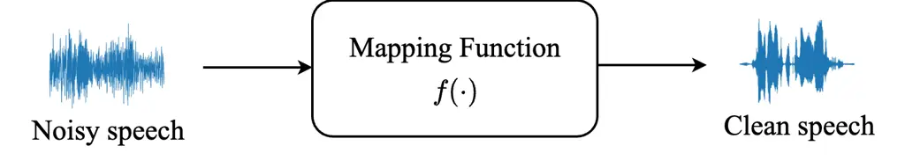
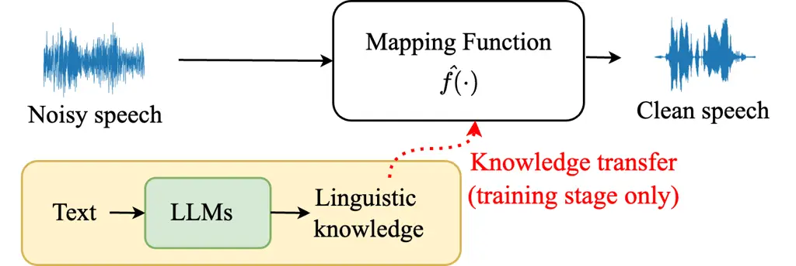
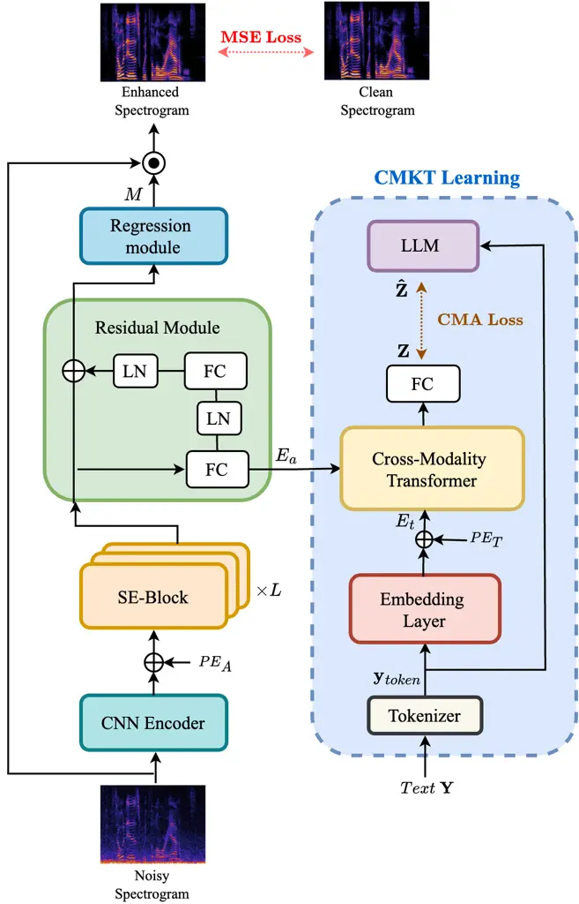
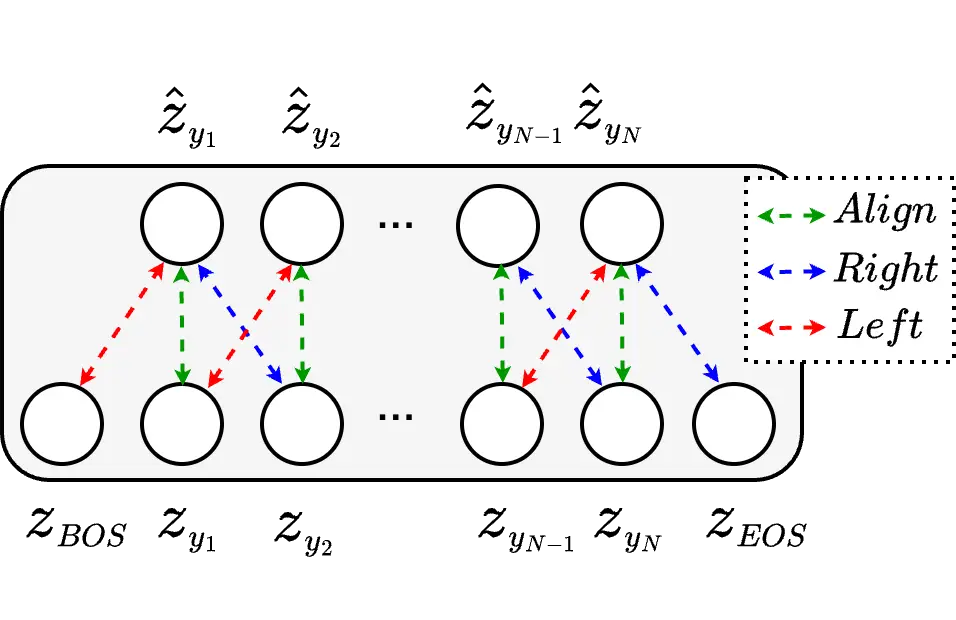
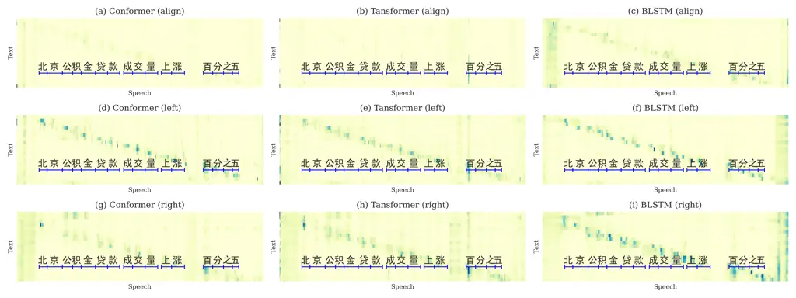
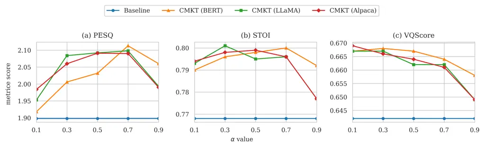
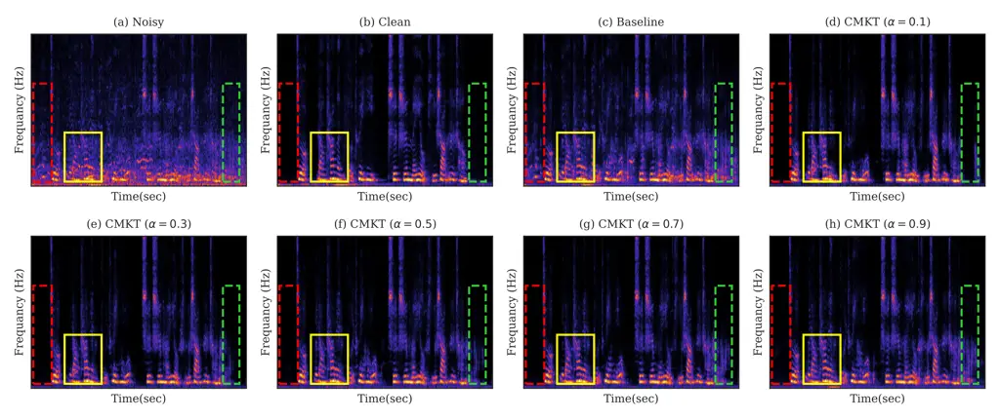

# Linguistic Knowledge Transfer Learning for Speech Enhancement

Kuo-Hsuan Hung    Xugang Lu    Szu-Wei Fu    Huan-Hsin Tseng    Hsin-Yi
Lin    Chii-Wann Lin    Yu Tsao ^(†)^(†)thanks: Kuo-Hsuan Hung and
Chii-Wann Lin are with the Department of Biomedical Engineering,
National Taiwan University, Taipei, Taiwan (email: d07528023@ntu.edu.tw;
cwlinx@ntu.edu.tw).^(†)^(†)thanks: Xugang Lu is with National Institute
of Information and Communications Technology, Japan (email:
xugang.lu@nict.go.jp).^(†)^(†)thanks: Szu-Wei Fu is with NVIDIA, Taipei,
Taiwan (email: szuweif@nvidia.com).^(†)^(†)thanks: Huan-Hsin Tseng is
with the AI & ML Department, Brookhaven National Laboratory, Upton NY,
USA (email: htseng@bnl.gov).^(†)^(†)thanks: Hsin-Yi Lin is with the
Department of Mathematics and Computer Science, Seton Hall University,
South Orange, NJ 07079, USA (email: hsinyi.lin@shu.edu).^(†)^(†)thanks:
Yu Tsao is with the Research Center for Information Technology
Innovation, Academia Sinica, Taipei, Taiwan (e-mail:
yu.tsao@sinica.edu.tw).

###### Abstract

Linguistic knowledge plays a crucial role in spoken language
comprehension. It provides essential semantic and syntactic context for
speech perception in noisy environments. However, most speech
enhancement (SE) methods predominantly rely on acoustic features to
learn the mapping relationship between noisy and clean speech, with
limited exploration of linguistic integration. While text-informed SE
approaches have been investigated, they often require explicit
speech-text alignment or externally provided textual data, constraining
their practicality in real-world scenarios. Additionally, using text as
input poses challenges in aligning linguistic and acoustic
representations due to their inherent differences. In this study, we
propose the Cross-Modality Knowledge Transfer (CMKT) learning framework,
which leverages pre-trained large language models (LLMs) to infuse
linguistic knowledge into SE models without requiring text input or LLMs
during inference. Furthermore, we introduce a misalignment strategy to
improve knowledge transfer. This strategy applies controlled temporal
shifts, encouraging the model to learn more robust representations.
Experimental evaluations demonstrate that CMKT consistently outperforms
baseline models across various SE architectures and LLM embeddings,
highlighting its adaptability to different configurations. Additionally,
results on Mandarin and English datasets confirm its effectiveness
across diverse linguistic conditions, further validating its robustness.
Moreover, CMKT remains effective even in scenarios without textual data,
underscoring its practicality for real-world applications. By bridging
the gap between linguistic and acoustic modalities, CMKT offers a
scalable and innovative solution for integrating linguistic knowledge
into SE models, leading to substantial improvements in both
intelligibility and enhancement performance.

###### Index Terms: 

Speech enhancement (SE), cross-modality knowledge transfer (CMKT),
misalignment strategy, large language model (LLM)

## I Introduction

Speech enhancement (SE) aims to improve the quality and intelligibility
of speech signals that have been degraded by environmental factors such
as background noise, reverberation, and channel distortion \[1, 2\]. It
is widely used as a front-end processing technique in various real-world
applications, including speaker recognition \[3, 4, 5\], automatic
speech recognition (ASR) \[6, 7\] and hearing aid \[8\]. Traditional SE
methods can be broadly classified into statistical-based approaches and
signal modeling-based approaches. Statistical-based methods, such as
spectral subtraction \[9, 10\] and Wiener filtering \[11, 12, 13\],
estimate noise characteristics and apply suppression filters to
attenuate noise components in the spectral domain. In contrast, signal
modeling-based methods, including subspace algorithms \[14, 15\],
harmonic models \[16\], and linear prediction techniques \[17, 18\],
rely on assumptions about the intrinsic structures of speech and noise
signals to enhance speech quality. However, these conventional
approaches often require prior knowledge of noise characteristics and
struggle to handle non-stationary noise conditions.

With the rapid advancements of deep learning (DL) algorithms, deep
neural network (DNN)-based models have been widely adopted to SE. These
models have evolved from simple feed-forward networks \[19, 20, 21, 22,
23\] to more advanced architectures, including convolutional neural
networks (CNNs) \[24, 25\], recurrent neural networks (RNNs) \[26, 27\],
and hybrid models that combine both \[28, 29\]. More recently,
Transformer-based \[30, 31\] and Conformer-based \[32, 33\]
architectures have demonstrated superior performance by effectively
capturing both local and global dependencies in speech signals.
Meanwhile, generative models such as generative adversarial networks
(GANs) \[34, 35\] and diffusion-based models \[36, 37\] have emerged as
powerful alternatives, leveraging data-driven approaches to learn
complex signal distributions for high-quality SE. In addition to
approaches that rely solely on acoustic information, SE research has
increasingly explored multimodal techniques that integrate auxiliary
information to enhance system performance. For example, incorporating
visual cues from lip movements or facial expressions \[38, 39\] has been
shown to significantly improve model effectiveness, particularly in low
SNR environments. However, visual-based approaches are sensitive to
variations in lighting conditions, camera angles, and occlusions. In
contrast, articulatory movement features, which directly capture
speech-related motions within the vocal tract, are more robust to
environmental changes. Recent studies have demonstrated that integrating
articulatory movements with acoustic signals can further improve SE
performance \[40, 41\].

In addition to visual cues and articulatory movements, several
approaches have been explored to incorporate phonetic information into
SE. Early studies proposed spectral feature mapping techniques, in which
phoneme-level classification loss was introduced as an auxiliary
objective to improve phonetic consistency \[42\]. Subsequent research
investigated perceptual loss methods, utilizing pre-trained phoneme
classifiers to guide SE models, ensuring that phonetic structures were
better preserved \[43, 44\]. Building on these foundations, symbolic
sequential modeling techniques were developed to encode speech signals
as discrete phoneme-like representations via vector quantization,
allowing SE models to capture phonetic structures more effectively
\[45\]. Another line of work explored the use of broad phonetic class
(BPC) information, incorporating auxiliary loss functions derived from
ASR models to guide SE training and improve enhancement performance
\[46\]. These phonetic-aware approaches provide meaningful subword-level
representations, enabling SE models better capture phonetic details and
improve overall performance. However, they remain constrained in
incorporating high-level semantic information, which is crucial for
speech comprehension.

Linguistic information is essential in speech processing, as it provides
a higher-level semantic and syntactic context that enhances speech
understanding. Previous studies has demonstrated that language
familiarity can influence auditory attention, allowing listeners to
concentrate on speech even in noisy environments \[47\]. This phenomenon
highlights the role of linguistic information in shaping speech
perception, particularly in challenging listening conditions. Similar
trends have been observed in SE models, where the language mismatch
between training and testing data affects performance \[48, 49\]. These
findings indicate the potential for incorporating linguistic information
to complement the acoustic characteristics that improve the robustness
of SE systems. However, the integration of linguistic knowledge into SE
remains relatively unexplored. Given that linguistic information is
inherently embedded in textual data, text-informed SE approaches have
been explored. Early methods relied on forced alignment between text and
speech to enhance the quality of speech signals \[50\], whereas later
approaches introduced knowledge distillation techniques to reduce
dependency on text during inference \[51\]. However, these methods
directly incorporate textual inputs without capturing a more
comprehensive linguistic representation, making it challenging to
effectively extract and integrate linguistic information within the
acoustic modality.

Recently, pre-trained large language models (LLMs) have demonstrated
remarkable versatility, providing rich and context-aware linguistic
knowledge across diverse tasks \[52, 53, 54\]. Despite their proven
effectiveness in natural language processing tasks, LLMs have not been
explored in SE. This study addresses this gap by proposing a novel
Cross-Modality Knowledge Transfer (CMKT) learning framework, which
leverages LLM embeddings to transfer linguistic knowledge into SE
models, as illustrated in Fig. 1. The main contributions of this study
are as follows: (1) This study is the first to demonstrate the
effectiveness of transferring linguistic information derived from LLM to
SE models. By integrating LLM embeddings, the CMKT framework
significantly improves SE performance across various architectures and
configurations. Furthermore, the approach eliminates the need for text
data or LLMs during inference, highlighting its practicality in
real-world scenarios. (2) We propose a misalignment strategy that
introduces temporal shifts during the loss function calculation. This
approach encourages the model to learn more informative representations
by making the prediction task more challenging. Additionally, attention
weighting maps are employed to provide interpretability and illustrate
the advantages of this strategy. (3) We evaluate our framework on both
Mandarin and English datasets, showcasing its effectiveness in diverse
linguistic conditions and validating its robustness. (4) Our method
remains applicable even in scenarios without text data, demonstrating
its practicality to real-world SE tasks where linguistic resources may
be limited or inaccurate.

The remainder of this paper is organized as follows. Section II reviews
the related work on SE and ASR, providing an overview of existing
approaches that are relevant to the proposed framework. Section III
introduces the CMKT learning, detailing its methodology and the
integration of linguistic and acoustic information. Section IV describes
the experimental setup and evaluates the proposed approach under various
configurations, demonstrating its effectiveness across different SE
models and LLMs. Finally, Section V concludes the paper and discusses
potential directions for future work.



(a) Conventional SE



(b) Proposed CMKT learning

Fig. 1: Comparative flowchart between conventional SE and the proposed
CMKT learning.

## II Related Work

### II-A Speech Tasks with Text-based Large Language Models

Text-based Large Language Models (text-LLMs) have achieved remarkable
progress in natural language processing (NLP) \[52\] and have been
expanded to other modalities, including speech and vision \[54\]. In
speech-related tasks, LLMs are primarily employed in text-oriented
applications like ASR \[55, 56\] and text-to-speech (TTS) synthesis
\[57, 58\]. They have also shown potential in less text-dependent tasks,
such as speech-emotion recognition (SER) \[59, 60\] and speech
assessment \[61\].

One of the tasks most relevant to our work is speech restoration,
exemplified by models such as Miipher \[62\]. Miipher leverages w2v-BERT
to extract robust speech features and PnG-BERT for linguistic
conditioning. This combination effectively addresses challenges such as
phoneme masking and deletion caused by noise or compression. By
integrating self-supervised speech models with text-based LLMs, Miipher
enhances the quality of degraded speech. Although speech restoration and
SE are closely related tasks, our approach to SE follows a fundamentally
different direction. Unlike previous methods, our framework requires
neither corresponding text nor text-based LLMs during inference. This
design substantially reduces computational resource requirements while
preserving strong SE performance.

Another relevant study is the Timed Text-Regularized Speech Separation
(TTR-SS) model \[63\], which is designed for speech separation and aims
to disentangle individual audio sources from a mixture. TTR-SS utilizes
a multimodal representation loss between timed text and speech to
regularize speech separation models. By aligning subword-level text and
audio embeddings using pre-trained WavLM and BERT models within a
summarizer Transformer framework, this method leverages sentence-level
semantics during training. This design not only enhances source
separation performance but also removes the need for auxiliary text data
during inference. However, TTR-SS rely on explicit alignment between
text and speech to guide training. In contrast, our method does not
require such alignment annotations, nor does it depend on corresponding
text during inference. Furthermore, despite the advancements in
text-LLMs across various speech-related tasks, their application to SE
remains unexplored.

### II-B Cross-Modality Knowledge Transfer in Automatic Speech Recognition

Pre-trained language models (PLMs), such as BERT \[64\], encode rich
linguistic knowledge that enhances the semantic and contextual
understanding of ASR systems \[65, 66\]. Although PLMs are commonly used
as external components for post-processing tasks such as rescoring
\[67\], these approaches often incur high computational costs \[68\].
Cross-modality knowledge transfer (CMKT) \[69, 70, 71\] mitigates this
issue by embedding linguistic knowledge directly into acoustic models
during training. This allows ASR systems to perform independently of
PLMs during inference and improves computational efficiency.

Recent advancements in CMKT have introduced effective methods for
aligning acoustic and linguistic representations. Optimal Transport (OT)
minimizes distributional discrepancies by transforming acoustic features
to align with linguistic features encoded by PLMs \[69\]. Hierarchical
frameworks further enhance CMKT by embedding linguistic guidance across
multiple layers of the acoustic encoder \[70\]. This integration
captures both low- and high-level semantic features. Additionally,
advanced attention mechanisms, such as Sinkhorn attention, refine
cross-modality alignment with iterative normalization, improving the
overall knowledge transfer process.

Temporal alignment techniques, such as Temporal Order Preserved OT,
address the sequential nature of speech data \[71\]. These methods
ensure consistency in temporal structures during alignment and preserve
the integrity of speech information. By combining these strategies, CMKT
enhances the integration of linguistic and acoustic information. It
significantly boosts ASR performance without requiring additional
computational resources during inference. This makes ASR systems more
robust, efficient, and practical for real-world applications.

Although PLMs have successfully helped many tasks in NLP-related tasks
with the context-dependent linguistic representation capability, there
is few work to show that PLMs could benefit to noisy speech restoration,
i.e., SE. As acoustic speech and underlying linguistic content can be
regarded as two sides of a coin, it is reasonable to think that
transferring linguistic knowledge in acoustic processing could help
noisy speech restoration. But whether the PLMs could help in acoustic
speech processing for SE, and how to efficiently integrate PLMs for SE
is still a challenge. In this study, we propose an efficient model
framework to transfer linguistic knowledge from PLMs for SE.



Fig. 2: The proposed model architecture diagram. The left branch
represents the baseline SE model, while the right branch represents the
Text-Speech integration module. Where $`\odot`$ and $`\oplus`$ denote as
element-wise multiplication and element-wise addition, respectively.

## III Proposed method

The proposed model framework is illustrated in Fig. 2 and consists of
two information processing modalities. The left branch represents the
conventional SE model, which operates in the acoustic modality and aims
to estimate clean speech from noisy input. The right branch corresponds
to the CMKT model, which operates in the text modality and extracts
linguistic information from the LLM to enhance acoustic embeddings.
Importantly, the right branch is only active during training to optimize
SE learning and is not utilized during inference. The following sections
provide a detailed description of the model architecture.

### III-A Speech Enhancement Model

The SE module is designed to estimate clean speech features from noisy
input. Depending on the training objective, SE methods can be broadly
classified into mapping-based and masking-based approaches \[72, 73\].
In this study, we adopt a masking-based approach, where the model learns
a spectral mask to refine the noisy magnitude spectrogram. Compared to
direct mapping, masking-based methods effectively reduce distortion by
selectively suppressing noise, while simultaneously preserving speech
structure and key spectral components \[74, 75\]. The proposed model
consists of four key components: a CNN encoder, speech enhancement
blocks (SE-blocks), a residual module, and a regression module.

#### III-A1 CNN Encoder

The CNN encoder receives the noisy log-amplitude spectrogram
$`\mathbf{X}\in\mathbb{R}^{T_{a}\times F}`$ as input for initial
acoustic feature extraction, where $`T_{a}`$ and $`F`$ represent the
time and frequency dimensions of the spectrogram, respectively. The
encoder consists of two 2D convolution layers followed by a linear
layer. Each convolution layer applies ReLU \[76\] activation to
introduce non-linearity and enhance feature extraction. After processing
through the CNN encoder, the extracted speech features are augmented
with relative position encoding ($`PE_{A}`$) to improve generalization
across different input lengths. The feature transformation is formulated
as follows:

```math
\displaystyle\mathbf{H}=\mathrm{CNN\_Encoder}(\mathbf{X}) \tag{1}
```

```math
\displaystyle\mathbf{A}^{in}_{0}=\mathbf{H}+\mathrm{PE}_{A}(\mathbf{H})
```

Where $`\mathbf{H}`$ and $`\mathbf{A}^{in}_{0}`$ represent the output of
the CNN encoder and the input to the SE-block, respectively.

#### III-A2 Speech Enhancement Blocks

In this work, we employ the Conformer block \[77\] for the SE-blocks,
which have proven highly effective in ASR by leveraging the strengths of
both Transformers and convolutional neural networks (CNNs). The
architecture has also demonstrated notable effectiveness in SE \[32\].
Each Conformer block consists of four sequential modules: a feed-forward
network ($`\mathrm{FFN_{1}}`$) module, a Multi-Head Self-Attention
(MHSA) module, a convolution (Conv) module, a layer normalization (LN)
and a second feed-forward network ($`\mathrm{FFN_{2}}`$) module. The
processing in each Conformer block is expressed as follows:

```math
\displaystyle\mathbf{A}^{1}_{l}=\mathbf{A}^{in}_{l-1}+\frac{1}{2}\mathrm{FFN_{1}}(\mathbf{A}^{in}_{l-1}) \tag{2}
```

```math
\displaystyle\mathbf{A}^{2}_{l}=\mathbf{A}^{1}_{l}+\mathrm{MHSA}(\mathbf{A}^{1}_{l})
```

```math
\displaystyle\mathbf{A}^{3}_{l}=\mathbf{A}^{2}_{l}+\mathrm{Conv}(\mathbf{A}^{2}_{l})
```

```math
\displaystyle\mathbf{A}^{4}_{l}=\mathrm{LN}(\mathbf{A}^{3}_{l}+\frac{1}{2}\mathrm{FFN_{2}}(\mathbf{A}^{3}_{l})),
```

where $`l`$ ranges from 1 to $`L`$, and $`L`$ represents the total
number of blocks. The output of the SE-blocks
$`\mathbf{A}^{4}_{L}\in\mathbb{R}^{T_{a}\times d_{a}}`$ then passes
through the residual module, where $`d_{a}`$ represents the output
dimension of the SE-block.

#### III-A3 Residual Module And Regression Module

The residual module consists of two fully-connected layers (FC), each
followed by a layer normalization (LN). It serves two main functions:
(1) utilizing the first FC to project speech embeddings into dimensions
aligned with linguistic embeddings for cross-modal integration, and (2)
leveraging the enriched linguistic information in the integrated
embeddings by reintroducing them into the acoustic encoding during CMKT
learning. This process is formulated as:

```math
\displaystyle\mathbf{E}_{a}=\mathrm{FC_{1}}(\mathbf{A}^{4}_{L}) \tag{3}
```

```math
\displaystyle\mathbf{A}_{r}=\mathbf{A}^{4}_{L}+\mathrm{LN}(\mathrm{FC_{2}}(\mathrm{LN}(\mathbf{E}_{a})))
```

The speech embedding $`\mathbf{E}_{a}\in\mathbb{R}^{T_{a}\times d_{t}}`$
is utilized for the CMKT model, where $`d_{t}`$ represents the dimension
of linguistic embedding encoded from the LLM. Subsequently,
$`\mathbf{A}_{r}`$ enters into the regression module to generate a
predicted mask $`\mathbf{M}\in\mathbb{R}^{T_{a}\times F}`$, which is
then multiplied back to the noisy spectrogram to produce enhanced
spectrogram $`\mathbf{\tilde{X}}`$. During the inference stage, the
phase information of noisy speech is utilized to reconstruct the
enhanced spectrogram into enhanced speech.

```math
\displaystyle\mathbf{M}=\mathrm{Sigmoid}(\mathrm{FC}(\mathbf{A}_{r})) \tag{4}
```

```math
\displaystyle\mathbf{\tilde{X}}=\mathbf{M}\odot\mathbf{X},
```

where the $`\odot`$ represent the element-wise multiplication.

### III-B Cross-Modality Knowledge Transfer learning

Initially, embeddings containing rich linguistic information are serve
as the learning objective for cross-modality alignment. In this study,
the LLM is utilized for its exceptional ability to capture semantic and
contextual information from text. The linguistic embeddings
$`\mathbf{\hat{Z}}`$ are derived by processing input text through the
pre-trained LLM. The process is depicted in the following equation:

```math
\displaystyle\mathbf{y}_{token}=\mathrm{Tokenizer}(\mathbf{Y}) \tag{5}
```

```math
\displaystyle\mathbf{\hat{Z}}_{i}=\mathrm{LLM}_{i}(\mathbf{\hat{Z}}_{i-1}),
```

$`\mathrm{LLM}{{}_{i}}`$ represents the $`i`$-th encoder layer of the
LLM model, where $`i`$ ranges from $`1`$ to $`M`$, with $`M`$ denoting
the total number of LLM encoder layers. Additionally,
$`\mathbf{\hat{Z}}_{i-1}`$ is equal to $`\mathbf{y}_{token}`$ when
$`i=1`$. The ‘$`\mathrm{Tokenizer}`$’ refers to a process that converts
standard text into word piece-based tokens. The token
$`\mathbf{\hat{Z}}_{0}`$ is then passed through an embedding layer
($`\mathcal{F}_{\mathrm{emb}}`$) and augmented with position encoding of
text ($`\mathrm{PE}_{T}`$) to generate textual embeddings
$`\mathbf{E}_{t}`$:

```math
\displaystyle\mathbf{y}_{T}=[\mathbf{y}_{\mathrm{BOS}};\mathbf{y}_{token};\mathbf{y}_{\mathrm{EOS}}] \tag{6}
```

```math
\displaystyle\mathbf{E}=\mathcal{F}_{\mathrm{emb}}(\mathbf{y}_{T})
```

```math
\displaystyle\mathbf{E}_{t}=\mathbf{E}+\mathrm{PE}_{T}(\mathbf{E}),
```

where $`\mathbf{y}_{\mathrm{BOS}}`$ and $`\mathbf{y}_{\mathrm{EOS}}`$
are prepended and appended tokens used to implement misalignment
strategy, which will be discussed in section III-B2.

#### III-B1 Cross-Modality Transformer (CMT)

We utilize the Multi-Head Cross-Attention (MHCA) mechanism in
Transformer \[78\] to integrate the information of speech embeddings
$`\mathbf{E}_{a}`$ and textual embeddings $`\mathbf{E}_{t}`$. The
cross-modality embedding $`\mathbf{Z}`$, single-head cross-attention and
attention weight $`\mathbf{W}_{att}`$ can be estimated as:

```math
\displaystyle\mathbf{Z}=\mathrm{FFN}(\mathbf{E}_{t}+\mathbf{E}_{\mathrm{CA}}) \tag{7}
```

```math
\displaystyle\mathbf{E}_{\mathrm{CA}}=\mathcal{F}_{\mathrm{CA}}(Q,K,V)=\mathbf{W}_{att}\cdot V
```

```math
\displaystyle\mathbf{W}_{att}=\mathrm{Softmax}(\frac{QK^{T}}{\sqrt{d_{k}}}),
```

where $`\mathrm{FFN}`$ and $`\mathcal{F}_{\mathrm{CA}}`$ are the
feed-forward networks and the cross-attention operation in Transformer.
$`K`$, $`V`$ represent the linear transformations of speech embedding
$`\mathbf{E}_{a}`$ by weight $`W^{K}`$ and $`W^{V}`$, respectively,
while $`Q`$ denotes the linear transformations of textual embedding
$`\mathbf{E}_{t}`$ by weight $`W^{Q}`$. And $`d_{k}`$ is the dimension
of $`Q`$, $`K`$ and $`V`$. We enable the cross-modality embedding
$`\mathbf{Z}`$ to approximate the target linguistic embedding from LLM.
During the optimization process, linguistic information is encoded in
the speech embedding to facilitate knowledge transfer from the LLM to
the SE model.



Fig. 3: Illustration of the misalignment strategy. The green dashed
line, blue dashed line, and red dashed line represent the embeddings
being aligned, right-shifted, or left-shifted during the cross-modal
alignment loss calculation.

#### III-B2 Misalignment Strategy

To enrich the linguistic information within the SE model, a simple yet
effective misalignment strategy is introduced into the CMKT learning
framework. Compared to aligned linguistic embeddings, shifting the
embeddings increases difficulty to the prediction task. This encourages
the incorporation of more contextual knowledge into the speech
embeddings for better prediction.

Given that the SE model used in this study is non-causal, we explore two
types of shifts: right-shifted (blue dashed line) and left-shifted (red
dashed line), as illustrated in Fig. 3. During the extraction of
cross-modality embeddings, both $`\mathbf{y}_{\mathrm{BOS}}`$ and
$`\mathbf{y}_{\mathrm{EOS}}`$ tokens are added to the input, as shown in
Eq. (6). For loss computation, the embeddings are shifted in different
directions to simulate the misaligned conditions. To ensure a fair
comparison of the effects of this strategy, the aligned and misaligned
configurations are designed to have identical trainable parameters and
computational costs.

### III-C Loss Function

The total loss function composed as a linear combination of the SE loss
and cross-modal alignment loss ($`\mathcal{L}_{\mathrm{CMA}}`$). The SE
loss is calculated as the mean absolute error
($`\mathcal{L}_{\mathrm{MAE}}`$) between the enhanced spectrogram and
the clean spectrogram, while the CMA loss endeavors to maximize the
cosine similarity between cross-modality embeddings ($`\mathbf{Z}`$) and
context-dependent linguistic embeddings ($`\mathbf{\hat{Z}}`$) from
LLMs:

```math
\displaystyle\mathcal{L}_{\mathrm{Total}}=\alpha\cdot\mathcal{L}_{\mathrm{MAE}}+(1-\alpha)\cdot\mathcal{L}_{\mathrm{CMA}}, \tag{8}
```

```math
\displaystyle\mathcal{L}_{\mathrm{MAE}}=\mathbb{E}\big[\lVert\mathbf{\hat{X}}-\mathbf{\tilde{X}}\rVert^{1}_{1}\big],
```

```math
\displaystyle\mathcal{L}_{\mathrm{CMA}}=\sum\nolimits_{t=1}^{T_{t}}(1-\cos(\mathbf{z}_{t},\mathbf{\hat{z}}_{t})),
```

where $`\alpha`$ is the hyper-parameter to control the weighting of the
two losses. $`T_{t}`$ is the length of the cross-modality embeddings.
Additionally, $`\mathbf{\tilde{X}}`$ represents the enhanced
spectrogram, while $`\mathbf{\hat{X}}`$ denotes the clean spectrogram.
Finally, $`\mathbf{z}_{t}`$ and $`\mathbf{\hat{z}}_{t}`$ are vectors of
matrices $`\mathbf{Z}`$ and $`\mathbf{\hat{Z}}`$, respectively.

## IV Experiments

The proposed CMKT learning is designed as a generalized approach for SE.
To evaluate its effectiveness, our primary experiments were conducted on
a Mandarin speech dataset. Additionally, we extended the evaluation to
an English speech dataset to verify the applicability of the method
across different languages. Furthermore, scenarios where training data
lacked the the corresponding text were investigated to assess the
practicality and robustness of the proposed method. The following
sections provide a detailed description of the experimental setup,
present the results, and provide a comprehensive analysis and discussion
of the findings.

### IV-A Experiments Setup

This study investigates the effectiveness of transferring linguistic
knowledge from a LLM to a SE model within the proposed CMKT learning
framework. The experiments were conducted using various combinations of
SE models and LLMs for the comprehensive assessment. The baseline
approach corresponds to the left branch of the architecture depicted in
Fig. 2.

#### IV-A1 Model

The proposed method consists of two branches: the SE model and the CMKT
module. For the SE model, in addition to the Conformer block mentioned
in Section III-A2, we also employed Transformer \[78\] and bidirectional
long short-term memory (BLSTM) \[79\] blocks as variants of SE-blocks to
further evaluate the performance across different architectures. The SE
model processes log amplitude spectrograms as speech input, which are
computed using short-time Fourier transform (STFT) with a Hamming
window. The window length is set to 25 ms, and the hop size is 6.25 ms.
The dimensions of the speech features ($`d_{a}`$) and linguistic
embeddings ($`d_{t}`$) are set to 201 and 768, respectively. The CNN
encoder consists of two convolutional layers, each with a kernel size of
3 and a stride of 1. Within each Conformer block, the convolution
operation uses a kernel size of 15, while the attention dimension,
attention heads, and feed-forward network (FFN) layer dimensions are
configured as 256, 4, and 2048, respectively. The number of SE-blocks is
configured as 4 for both Conformer and Transformer blocks, and 5 for
BLSTM blocks.

For the CMKT learning, the CMT module consists of three Transformer
encoder layers, in which the self-attention is replaced with
cross-attention. The attention dimension, number of attention heads, and
FFN layer dimension are set to 768, 12, and 2048, respectively. The
model is optimized using the Adam optimizer \[80\] with an initial
learning rate of 0.001, employing a warm-up schedule of 20,000 steps.
Training is conducted over 130 epochs, with the final evaluation model
obtained by averaging the parameters from the last 10 epochs. The
weighting factor $`\alpha`$ in the Eq. (8) is fixed at 0.7.

#### IV-A2 LLMs

In our experiments, we employed three widely adopted large language
models (LLMs): BERT \[64\], LLaMA-2 \[81\], and Alpaca \[82\]. These
models are commonly used in open-source applications and represent
distinct methodologies in language modeling. By leveraging these
well-established models, we aim to evaluate the effectiveness of our
proposed method under diverse linguistic embedding strategies.

BERT is pre-trained with masked language modeling (MLM) and next
sentence prediction (NSP), enabling it to capture context-sensitive
embeddings that reflect both local and global semantic relationships.
LLaMA-2 builds upon its predecessor, LLaMA \[52\], with several
architectural enhancements, including rotary positional embeddings
(RoPE) and grouped-query attention (GQA), which improve computational
efficiency and scalability. Moreover, LLaMA-2 is trained on a larger and
more diverse dataset, resulting in stronger generalization capabilities.
Alpaca, a fine-tuned variant of the original LLaMA, specializes in
instruction-following tasks, providing a lightweight and efficient
solution tailored for practical downstream applications.

BERT utilizes an encoder-based design, while LLaMA-2 and Alpaca adopt
decoder-based approaches. Despite these architectural differences, all
three models are built upon large-scale pretraining on diverse datasets.
These models were chosen for their widespread recognition and to
evaluate the adaptability of the proposed method across different LLM
architectures. This selection highlights the method’s robustness and
applicability across varying linguistic embeddings.

| Method         | High SNR |       |         | Medium SNR |       |         | Low SNR |       |         | Avg.  |       |         |
| -------------- | -------- | ----- | ------- | ---------- | ----- | ------- | ------- | ----- | ------- | ----- | ----- | ------- |
|                | PESQ     | STOI  | VQScore | PESQ       | STOI  | VQScore | PESQ    | STOI  | VQScore | PESQ  | STOI  | VQScore |
| Noisy          | 1.93     | 0.887 | 0.643   | 1.264      | 0.74  | 0.606   | 1.073   | 0.507 | 0.578   | 1.439 | 0.718 | 0.61    |
| Conformer      | 2.668    | 0.913 | 0.663   | 1.723      | 0.796 | 0.641   | 1.224   | 0.579 | 0.619   | 1.898 | 0.768 | 0.642   |
| +CMKT (BERT)   | 2.911    | 0.928 | 0.676   | 2.01       | 0.835 | 0.665   | 1.333   | 0.623 | 0.649   | 2.113 | 0.8   | 0.664   |
| +CMKT (LLaMA)  | 2.903    | 0.925 | 0.674   | 1.93       | 0.821 | 0.659   | 1.291   | 0.604 | 0.641   | 2.098 | 0.796 | 0.662   |
| +CMKT (Alpaca) | 2.894    | 0.926 | 0.675   | 1.977      | 0.829 | 0.662   | 1.312   | 0.617 | 0.645   | 2.09  | 0.796 | 0.661   |
| Transformer    | 2.682    | 0.913 | 0.664   | 1.708      | 0.791 | 0.643   | 1.217   | 0.563 | 0.618   | 1.896 | 0.762 | 0.642   |
| +CMKT (BERT)   | 2.908    | 0.925 | 0.676   | 2.001      | 0.83  | 0.664   | 1.327   | 0.613 | 0.643   | 2.107 | 0.794 | 0.662   |
| +CMKT (LLaMA)  | 2.838    | 0.919 | 0.673   | 1.866      | 0.807 | 0.656   | 1.259   | 0.579 | 0.635   | 2.016 | 0.774 | 0.655   |
| +CMKT (Alpaca) | 2.825    | 0.919 | 0.672   | 1.854      | 0.806 | 0.655   | 1.254   | 0.575 | 0.631   | 2.006 | 0.772 | 0.654   |
| BLSTM          | 2.781    | 0.918 | 0.666   | 1.81       | 0.805 | 0.646   | 1.251   | 0.585 | 0.624   | 1.975 | 0.775 | 0.646   |
| +CMKT (BERT)   | 2.896    | 0.927 | 0.679   | 2.047      | 0.841 | 0.674   | 1.373   | 0.653 | 0.658   | 2.133 | 0.811 | 0.671   |
| +CMKT (LLaMA)  | 2.952    | 0.928 | 0.676   | 2.004      | 0.832 | 0.665   | 1.324   | 0.622 | 0.648   | 2.123 | 0.799 | 0.663   |
| +CMKT (Alpaca) | 2.941    | 0.927 | 0.675   | 2.005      | 0.829 | 0.662   | 1.325   | 0.616 | 0.645   | 2.12  | 0.796 | 0.661   |

TABLE I: Evaluation results under different SNR levels on the AISHELL-1
dataset. Various combinations of model architectures and LLM embeddings
were tested. The bold values indicate the best results within the same
model architecture.

#### IV-A3 Evaluation Metrices

The evaluation metrics comprise three key standards: perceptual
evaluation of speech quality (PESQ) \[83\], short-time objective
intelligibility (STOI) \[84\], and VQScore \[85\]. PESQ and STOI serve
as prevalent measures for assessing speech quality and intelligibility,
respectively. Meanwhile, VQScore is specifically employed to evaluate
the mean opinion score (MOS) and demonstrates remarkable robustness,
notably evident in its effectiveness when applied to out-of-domain data,
owing to its unsupervised approach. This combination of metrics forms a
comprehensive evaluation framework, ensuring an in-depth assessment of
speech enhancement performance under diverse conditions.

### IV-B Experiments on Mandarin Speech Corpus

Experiments were conducted using the open-source Mandarin speech corpus,
AISHELL-1, comprising speech and text data from 400 speakers \[86\]. The
corpus consists of three distinct datasets: a training set encompassing
340 speakers (150 hours), a development set with 40 speakers (10 hours),
and a test set comprising 20 speakers (5 hours). For the introduction of
noise, we employed the noise dataset provided in this study \[87\],
following a methodology that involved partitioning the noise dataset
into two subsets. Signal-to-noise ratios (SNRs) spanning from -15 to 15
were randomly selected for synthesizing both the training and test
datasets, ensuring comprehensive assessment across varied noise levels.



Fig. 4: The attention weighting in the cross-modality module, where the
x-axis and y-axis represent the speech and text modalities,
respectively. Results for different models under various alignment
methods are presented: (a)–(c) correspond to aligned, (d)–(f) to
left-shifted, and (g)–(i) to right-shifted alignments.

| Method      | Alignment | Evaluation |       |         |
| ----------- | --------- | ---------- | ----- | ------- |
|             |           | PESQ       | STOI  | VQScore |
| Conformer   | Align     | 2.052      | 0.786 | 0.656   |
|             | Right     | 2.087      | 0.8   | 0.663   |
|             | Left      | 2.113      | 0.8   | 0.664   |
| Transformer | Align     | 2.037      | 0.778 | 0.656   |
|             | Right     | 2.117      | 0.793 | 0.661   |
|             | Left      | 2.107      | 0.794 | 0.662   |
| BLSTM       | Align     | 2.102      | 0.794 | 0.661   |
|             | Right     | 2.113      | 0.803 | 0.668   |
|             | Left      | 2.133      | 0.811 | 0.671   |

TABLE II: Evaluation results for different alignment methods on the
AISHELL-1 dataset. The bold values indicate the best results within the
same model architecture.

The pre-trained LLMs used in our experiments—BERT, LLaMA-2, and
Alpaca—are open-source models with publicly available weights obtained
from HuggingFace. The Chinese BERT¹¹ 1
https://huggingface.co/google-bert/bert-base-chinese was pre-trained on
a large-scale Chinese corpus, making it adept at capturing linguistic
nuances. The Chinese LLaMA-2²² 2
https://huggingface.co/hfl/chinese-llama-2-7b builds on the original
LLaMA-2 architecture with an additional 120GB of Chinese text data,
enhancing its capacity to understand and generate Chinese text. The
Chinese Alpaca³³ 3 https://huggingface.co/hfl/chinese-alpaca-2-7b,
fine-tuned from the Chinese LLaMA-2, further incorporates approximately
5 million instruction-following examples, optimizing it for
instruction-based tasks. These models ensure experimental consistency,
reproducibility, and a robust evaluation of the proposed method across
diverse linguistic embeddings.

#### IV-B1 Result for Speech Enhancement

Table I summarizes the evaluation results of the proposed CMKT learning
under three different SNR levels: high (5 to 15 dB), medium (-5 to 5
dB), and low (-15 to -5 dB). These levels correspond to mild, moderate,
and severe noise conditions, ensuring a comprehensive assessment. The
results demonstrate that CMKT consistently improves the performance of
all baseline SE models across PESQ, STOI, and VQScore metrics,
confirming the effectiveness of leveraging LLM embeddings in SE.

Among the evaluated LLM embeddings, BERT achieves slightly higher
average scores compared to LLaMA and Alpaca. For instance, in the
Transformer model, CMKT (BERT) achieves an average PESQ of 2.107, which
is slightly higher than CMKT (LLaMA) and CMKT (Alpaca), both scoring
around 2.02. Similarly, CMKT (BERT) attains the highest STOI score of
0.794, with CMKT (LLaMA) and CMKT (Alpaca) scoring 0.784 and 0.782,
respectively. On the other hand, for the Conformer and BLSTM models, the
differences among the three LLM embeddings are relatively minor. These
results indicate that while the choice of LLM embedding may influence
performance more significantly in certain SE architectures, all
embeddings effectively enhance the baseline models, consistently
improves performance across all tested configurations. Overall, the
proposed CMKT method demonstrates robust performance enhancements across
all tested configurations, with BERT embeddings delivering slightly
better results. Consequently, we select BERT as the primary
configuration for subsequent analyses.

#### IV-B2 Effectiveness of Misalignment Strategy

Table II summarizes the evaluation results of the proposed misalignment
strategy under three alignment methods: aligned, left-shifted (left),
and right-shifted (right). Both misalignment strategies (left and right)
consistently outperform the aligned method across all SE models,
demonstrating their effectiveness in enhancing SE performance. Among the
two misalignment strategies, the left-shifted alignment achieves
slightly better results than the right-shifted alignment in most cases,
highlighting its potential as a robust approach for linguistic knowledge
transfer.

The attention weighting in the cross-modality module, which could be
calculated from Eq. (7), is visualized in Fig. 4, It provides deeper
insights into the impact of the misalignment strategy. The attention
maps illustrate the relationship between speech and text embeddings,
with the x-axis representing the frame indices of speech embeddings and
the y-axis corresponding to the indices of text tokens. To enhance
interpretability, we provided word-level force alignment using the
Charsiu framework⁴⁴ 4 https://github.com/lingjzhu/charsiu, and the
aligned positions are marked on the attention maps for reference. In
particular, this alignment information was used exclusively for
visualization purposes, and the model does not rely on explicit
alignment data during training.

From the attention maps, two significant observations can be made.
First, the model demonstrates a clear ability to associate text and
audio embeddings effectively. For example, speech silence regions
exhibit minimal attention weights, while for non-silent regions, the
attention weights align closely with the reference word alignments we
provided. This behavior reflects the model’s capacity to focus on
relevant cross-modality information during the learning process. Second,
the diagonal patterns observed in the attention maps highlight the
quality of the learned alignment between text and audio embeddings. In
particular, the left- and right-shifted configurations exhibit a more
distinct diagonal structure compared to the aligned setup. This suggests
that the misalignment strategy promotes better generalization in
learning linguistic relationships, enabling the model to capture more
precise correlations between modalities. These findings explain the
superior performance of misaligned strategies and underscore their
importance in facilitating effective linguistic knowledge transfer
within the CMKT framework.



Fig. 5: The evaluation scores at different $`\alpha`$ values (0.1 to 0.9
in increments of 0.2) on the AISHELL-1 dataset. The blue line represents
the baseline Conformer model without CMKT.

#### IV-B3 Investigation on different $`\alpha`$ Values

The parameter $`\alpha`$, defined in Eq. (8), determines the extent to
which linguistic information is integrated into the acoustic embeddings.
To evaluate the sensitivity of the proposed approach to different
$`\alpha`$ values, we tested a range of values from 0.1 to 0.9 in
increments of 0.2, as illustrated in Fig. 5. A lower $`\alpha`$ value
assigns greater importance to CMKT learning, allowing more linguistic
information to be integrated into the acoustic embeddings. Regardless of
the $`\alpha`$ value, all configurations incorporating CMKT outperform
the baseline Conformer model (blue line), demonstrating the consistent
advantages of the proposed framework.

For PESQ, performance steadily improves as $`\alpha`$ increases,
reaching its peak at $`\alpha=0.7`$. In contrast, STOI remains
relatively stable throughout the range of $`\alpha`$ values. For
VQScore, an negative correlation is observed, with scores gradually
decreasing as $`\alpha`$ increases. This decline becomes more pronounced
between $`\alpha=0.7`$ and $`\alpha=0.9`$, suggesting that higher
$`\alpha`$ values might limit the model’s ability to effectively balance
linguistic and acoustic features. Additionally, since Alpaca is
fine-tuned from LLaMA, their results exhibit similar trends across all
metrics, reflecting the close relationship between the two models and
the impact of their initial pre-training on downstream tasks.

In addition to quantitative evaluation, we provide the magnitude
spectrograms for a test utterance in Fig. 6. Three regions of interest
are highlighted in the spectrograms: two noise-only segments (red and
green dashed box) and one mixed speech-noise regions (yellow box). These
visualizations offer insights into how varying $`\alpha`$ values affect
the trade-off between denoising effectiveness and speech fidelity.

In the first noise-only regions (red dashed box), all CMKT
configurations show significant improvements over the baseline by
effectively reducing noise. The noise suppression in these regions is
consistent across all $`\alpha`$ values, demonstrating the robustness of
CMKT in eliminating non-speech noise. In the second noise-only regions
(green dashed box), higher $`\alpha`$ values further enhance noise
removal, leading to cleaner spectrograms. However, in the mixed
speech-noise regions (yellow box), smaller $`\alpha`$ values introduce
more noticeable distortions to the reconstructed speech. This trade-off
highlights that while lower $`\alpha`$ values improve noise suppression,
they may compromise the preservation of speech-specific features,
affecting overall reconstruction quality. These observations emphasize
the importance of selecting an appropriate $`\alpha`$ value to balance
linguistic knowledge integration and acoustic feature preservation.



Fig. 6: Spectrogram plots under different methods: (a) Noisy, (b) Clean,
(c) Baseline (Conformer), and (d)–(h) CMKT with different $`\alpha`$
values.

### IV-C Experiments on English Speech Corpus

The experiments were conducted using the publicly available English
speech corpus, LibriSpeech, which comprises read speech recordings
derived from audiobooks in the LibriVox project \[88\]. The
”train-clean-360” subset, containing 360 hours of speech from 921
speakers, was used for training. For evaluation, we employed the
”test-clean” subset, which includes 5.4 hours of speech from 40 distinct
speakers. The training and test sets were designed with no speaker
overlap, ensuring that the evaluation accurately measures the model’s
ability to generalize to unseen data. For noise augmentation, we
employed the same noise dataset used in the Mandarin experiments. The
noise data were divided into training and testing subsets to prevent
overlap. Signal-to-noise ratios (SNRs) were randomly sampled between -15
dB and 15 dB to synthesize noisy speech for both training and testing,
enabling a comprehensive evaluation of the model’s robustness under
diverse noise conditions.

We adopted the same LLM architectures as in the Mandarin experiments:
BERT, LLaMA-2, and Alpaca, all obtained from HuggingFace. The English
BERT⁵⁵ 5 https://huggingface.co/google-bert/bert-base-uncased was
pre-trained on a large-scale English text corpus, enabling it to capture
contextual and semantic relationships effectively. LLaMA-2⁶⁶ 6
https://huggingface.co/meta-llama/Llama-2-7b-hf was trained on over 2
trillion tokens of English data, providing extensive language coverage.
Alpaca⁷⁷ 7 https://huggingface.co/wxjiao/alpaca-7b was fine-tuned from
the original LLaMA model in two stages: the first stage involved
general-purpose fine-tuning, while the second stage incorporated
approximately 52,000 instruction-following examples to enhance
task-specific performance. This experiment broadens our evaluation to a
different linguistic domain, offering deeper insights into the CMKT
framework’s effectiveness across languages.

Table III presents the evaluation results on the English LibriSpeech
dataset for three SE model architectures combined with different CMKT
configurations. Consistent with the findings from the Mandarin dataset,
integrating CMKT with pre-trained LLM embeddings leads to significant
performance improvements across all models and metrics compared to the
baseline SE models without CMKT.

The best-performing LLM varies across SE models, with CMKT (Alpaca)
achieving the highest scores for Conformer and BLSTM, while CMKT (LLaMA)
performs best for Transformer. Comparing the results with the AISHELLL-1
dataset (Mandarin) in Table I, we observe consistent trends across both
languages. CMKT enhances performance regardless of the baseline SE
model’s initial capabilities, demonstrating its robustness and
adaptability. For instance, the BLSTM baseline already outperforms
Transformer combined with CMKT (LLaMA), yet the integration of CMKT
further boosts BLSTM’s performance. These findings validate the
generalizability of the CMKT framework across different languages and
architectures, underscoring its potential for cross-lingual SE
applications.

|                |            |       |         |
| -------------- | ---------- | ----- | ------- |
| Method         | Evaluation |       |         |
|                | PESQ       | STOI  | VQScore |
| Noisy          | 1.398      | 0.808 | 0.623   |
| Conformer      | 1.664      | 0.854 | 0.664   |
| +CMKT (BERT)   | 1.715      | 0.858 | 0.673   |
| +CMKT (LLaMA)  | 1.726      | 0.858 | 0.674   |
| +CMKT (Alpaca) | 1.747      | 0.859 | 0.676   |
| Transformer    | 1.658      | 0.844 | 0.666   |
| +CMKT (BERT)   | 1.694      | 0.849 | 0.671   |
| +CMKT (LLaMA)  | 1.718      | 0.847 | 0.673   |
| +CMKT (Alpaca) | 1.68       | 0.846 | 0.668   |
| BLSTM          | 1.738      | 0.853 | 0.673   |
| +CMKT (BERT)   | 1.769      | 0.854 | 0.683   |
| +CMKT (LLaMA)  | 1.768      | 0.856 | 0.682   |
| +CMKT (Alpaca) | 1.789      | 0.856 | 0.682   |

TABLE III: Evaluation scores on the Librispeech dataset (English). The
bold values indicate the best scores within the same architecture.

### IV-D Experiment with ASR transcription

To explore the impact of CMKT in scenarios where corresponding text is
unavailable, we employed two commonly used multilingual ASR models:
XLSR-53 \[89\] and Whisper \[90\]. The XLSR-53 model, pre-trained on 53
languages using a contrastive loss on masked speech representations,
leverages cross-lingual shared representations to enhance performance
across diverse languages. Meanwhile, the Whisper model, trained on a
massive dataset 680,000 hours encompassing multilingual and multitask
supervision, exhibits strong zero-shot transfer capabilities without the
need for fine-tuning. Pre-trained weights for XLSR-53⁸⁸ 8
https://huggingface.co/jonatasgrosman/wav2vec2-large-xlsr-53-chinese-zh-cn
and Whisper⁹⁹ 9 https://huggingface.co/openai/whisper-large-v3-turbo
were obtained from HuggingFace.

The experimental setup was consistent with the methodology established
in the previous experiments. In this study, we employed distinct SE
architectures and integrated BERT embeddings to facilitate CMKT
learning. During the speech recognition process, we observed instances
where the ASR model failed to generate outputs. For such cases, the
corresponding speech segments were trained solely using the SE loss.
Notably, the parameter $`\alpha`$ in Eq. (8) was fixed at 0.7,
regardless of whether text data were available, to ensure a fair
comparison with previous experiments.

|           |         |       |       |
| --------- | ------- | ----- | ----- |
| ASR model | CER (%) |       |       |
| train     | dev     | test  |       |
| Whisper   | 11.64   | 10.29 | 10.41 |
| XLSR-53   | 20.28   | 19.03 | 21.22 |

TABLE IV: ASR performance with different ASR models on the AISHELL-1
dataset.

|             |         |           |            |       |         |
| ----------- | ------- | --------- | ---------- | ----- | ------- |
| Method      | Text    | Alignment | Evaluation |       |         |
|             |         |           | PESQ       | STOI  | VQScore |
| Conformer   | –       | –         | 1.898      | 0.768 | 0.642   |
|  +CMKT      | Oracle  | Left      | 2.113      | 0.8   | 0.664   |
|             | Whisper | Align     | 2.067      | 0.788 | 0.657   |
|             |         | Right     | 2.101      | 0.799 | 0.664   |
|             |         | Left      | 2.091      | 0.799 | 0.664   |
|             | XLSR-53 | Align     | 2.059      | 0.787 | 0.657   |
|             |         | Right     | 2.082      | 0.798 | 0.663   |
|             |         | Left      | 2.085      | 0.8   | 0.663   |
| Transformer | –       | –         | 1.896      | 0.762 | 0.642   |
|  +CMKT      | Oracle  | Left      | 2.107      | 0.794 | 0.662   |
|             | Whisper | Align     | 2.022      | 0.78  | 0.656   |
|             |         | Right     | 2.105      | 0.793 | 0.661   |
|             |         | Left      | 2.106      | 0.794 | 0.662   |
|             | XLSR-53 | Align     | 2.024      | 0.78  | 0.655   |
|             |         | Right     | 2.082      | 0.792 | 0.661   |
|             |         | Left      | 2.072      | 0.791 | 0.661   |
| BLSTM       | –       | –         | 1.975      | 0.775 | 0.646   |
|  +CMKT      | Oracle  | Left      | 2.133      | 0.811 | 0.671   |
|             | Whisper | Align     | 2.095      | 0.805 | 0.67    |
|             |         | Right     | 2.132      | 0.806 | 0.671   |
|             |         | Left      | 2.106      | 0.807 | 0.67    |
|             | XLSR-53 | Align     | 2.094      | 0.794 | 0.66    |
|             |         | Right     | 2.123      | 0.798 | 0.663   |
|             |         | Left      | 2.117      | 0.796 | 0.661   |

TABLE V: Evaluation scores with different transcriptions on the
AISHELL-1 dataset. The impact of different alignment methods on various
ASR systems is also compared. Linguistic embeddings are extracted using
the BERT model. The bold values indicate the overall best results.

#### IV-D1 Result for Speech Enhancement

Table IV reports the character error rate (CER) performances of the ASR
models. Whisper demonstrates significantly higher transcription accuracy
compared to XLSR-53 on the AISHELL-1 dataset, with consistent CERs
across the train, dev, and test sets. These results establish a
foundation for evaluating the impact of transcription quality on CMKT
performance in speech enhancement.

Table V illustrates the evaluation results, comparing the performance of
CMKT using oracle (ground truth text), Whisper, and XLSR-53
transcriptions across different SE models. CMKT consistently improves
the baseline SE models across all configurations, irrespective of the
transcription source. Higher transcription accuracy leads to better
enhancement performance, as seen in Whisper’s results, which outperform
XLSR-53 across all SE architectures. Even with the less accurate
transcriptions from XLSR-53, CMKT still provides substantial gains over
the baseline models, demonstrating its robustness in leveraging
linguistic embeddings effectively. While Whisper does not fully match
the performance of oracle transcriptions, it achieves results that are
indistinguishable from oracle in certain metrics. For instance, in the
Transformer model, Whisper achieves a STOI of 0.794, matching Oracle’s
performance. Similarly, in the BLSTM model, Whisper attains a VQScore of
0.671, identical to Oracle. These findings highlight the effectiveness
of CMKT even with non-ideal transcriptions, reinforcing its
applicability in real-world SE tasks.

#### IV-D2 Effectiveness of Misalignment Strategy

The misalignment strategy is shown to effectively enhance CMKT
performance across all transcription methods and SE architectures. The
performance differences between the left-shifted and right-shifted
alignments are minimal. However, both consistently outperform the
aligned configuration, highlighting the benefits of introducing temporal
shifts when integrating linguistic embeddings. For instance, in the
Conformer model with Whisper transcriptions, both left-shifted and
right-shifted alignments achieve a VQScore of 0.664, compared to 0.657
for the aligned configuration. Similarly, in the Transformer model with
XLSR-53 transcriptions, the right-shifted alignment improves PESQ from
2.024 (aligned) to 2.082, and STOI from 0.78 to 0.792. These consistent
improvements demonstrate the robustness of the misalignment strategy
across different transcription qualities and SE architectures, further
enhancing the adaptability of CMKT.

These findings underscore the importance of transcription quality and
alignment strategies in optimizing CMKT performance. Whisper, with its
superior transcription accuracy, consistently enables CMKT to achieve
results that closely approach those obtained with oracle transcriptions,
particularly when combined with the misalignment strategy. Notably, the
misalignment strategy proves effective across diverse configurations,
consistently outperforming the aligned configuration. Furthermore, CMKT
demonstrates substantial improvements over baseline models across all SE
architectures and transcription sources, highlighting its robustness and
adaptability for real-world SE applications under varying transcription
conditions.

## V Conclusion

This study introduced the CMKT learning framework, which effectively
transfers linguistic knowledge from pre-trained LLMs into SE models. The
proposed approach eliminates the need for text input or LLM involvement
during inference, making it a practical and scalable solution for
real-world applications. Experimental results confirmed that CMKT
consistently enhances SE performance across various architectures and
different LLMs, confirming its robustness and adaptability.
Additionally, we introduced a misalignment strategy that incorporates
temporal shifts to optimize the integration of linguistic and acoustic
representations. This strategy consistently outperforms aligned
configurations, leading to improved SE performance across different SE
models.

The framework was evaluated on both Mandarin and English datasets,
yielding consistent performance improvements across different language
corpora. Furthermore, experiments conducted without corresponding text
data confirmed that CMKT remains effective even with automatically
generated transcriptions, demonstrating its robustness in handling
real-world scenarios with limited or noisy linguistic resources. In
future work, we plan to investigate the influence of linguistic
representations from different LLM layers to better understand their
contribution to SE performance. Additionally, we aim to expand CMKT to
other speech-related tasks to further explore its applicability. These
findings establish a solid foundation for bridging linguistic and
acoustic domains in SE and advancing cross-modality learning.

## References

- \[1\] Y. Fu, Y. Liu, J. Li, D. Luo, S. Lv, Y. Jv, and L. Xie,
  “Uformer: A unet based dilated complex & real dual-path conformer
  network for simultaneous speech enhancement and dereverberation,” in
  Proc. ICASSP. IEEE, 2022, pp. 7417–7421.
- \[2\] B. Cauchi, I. Kodrasi, R. Rehr, S. Gerlach, A. Jukić,
  T. Gerkmann, S. Doclo, and S. Goetze, “Combination of mvdr beamforming
  and single-channel spectral processing for enhancing noisy and
  reverberant speech,” EURASIP Journal on Advances in Signal Processing,
  vol. 2015, pp. 1–12, 2015.
- \[3\] S. O. Sadjadi and J. H.L. Hansen, “Assessment of single-channel
  speech enhancement techniques for speaker identification under
  mismatched conditions.,” in Proc. Interspeech, 2010, pp. 2138–2141.
- \[4\] D. Michelsanti and Z.-H. Tan, “Conditional generative
  adversarial networks for speech enhancement and noise-robust speaker
  verification,” in Proc. Interspeech, 2017, pp. 2008–2012.
- \[5\] P. Mowlaee, R. Saeidi, M. G. Christensen, Z.-H. Tan,
  T. Kinnunen, P. Franti, and S. H. Jensen, “A joint approach for
  single-channel speaker identification and speech separation,” IEEE
  Transactions on Audio, Speech, and Language Processing, vol. 20, no.
  9, pp. 2586–2601, 2012.
- \[6\] J. Li, L. Deng, Y. Gong, and R. Haeb-Umbach, “An overview of
  noise-robust automatic speech recognition,” IEEE/ACM Transactions on
  Audio, Speech, and Language Processing, vol. 22, no. 4, pp.
  745–777, 2014.
- \[7\] F. Weninger, H. Erdogan, S. Watanabe, E. Vincent, J. Le Roux,
  J. R. Hershey, et al., “Speech enhancement with lstm recurrent neural
  networks and its application to noise-robust asr,” in Latent Variable
  Analysis and Signal Separation: 12th International Conference, LVA/ICA
  2015, Liberec, Czech Republic, August 25-28, 2015, Proceedings 12.
  Springer, 2015, pp. 91–99.
- \[8\] S. Doclo, S. Gannot, D. Marquardt, and E. Hadad, “Binaural
  speech processing with application to hearing devices,” Audio source
  separation and speech enhancement, pp. 413–442, 2018.
- \[9\] M. Berouti, R. Schwartz, and J. Makhoul, “Enhancement of speech
  corrupted by acoustic noise,” in Proc. ICASSP. IEEE, 1979, vol. 4, pp.
  208–211.
- \[10\] K. Tanaka, T. Toda, G. Neubig, S. Sakti, and S. Nakamura, “A
  hybrid approach to electrolaryngeal speech enhancement based on
  spectral subtraction and statistical voice conversion.,” in Proc.
  Interspeech, 2013, pp. 3067–3071.
- \[11\] P. Scalart and J. Filho, “Speech enhancement based on a priori
  signal to noise estimation,” in Proc. ICASSP. IEEE, 1996, vol. 2, pp.
  629–632.
- \[12\] M. A. Abd El-Fattah, M. I. Dessouky, A. M. Abbas, S. M. Diab,
  E.-S. M. El-Rabaie, W. Al-Nuaimy, et al., “Speech enhancement with an
  adaptive wiener filter,” International Journal of Speech Technology,
  vol. 17, pp. 53–64, 2014.
- \[13\] W. Manamperi, P. N. Samarasinghe, T. D. Abhayapala, and
  J. Zhang, “Gmm based multi-stage wiener filtering for low snr speech
  enhancement,” in IWAENC. IEEE, 2022, pp. 1–5.
- \[14\] M. Dendrinos, S. Bakamidis, and G. Carayannis, “Speech
  enhancement from noise: A regenerative approach,” Speech
  Communication, vol. 10, no. 1, pp. 45–57, 1991.
- \[15\] Y. Ephraim and H. L. Van Trees, “A signal subspace approach for
  speech enhancement,” IEEE Transactions on speech and audio processing,
  vol. 3, no. 4, pp. 251–266, 1995.
- \[16\] R. Frazier, S. Samsam, L. Braida, and A. Oppenheim,
  “Enhancement of speech by adaptive filtering,” in Proc. ICASSP. IEEE,
  1976, vol. 1, pp. 251–253.
- \[17\] B. Atal and M. Schroeder, “Predictive coding of speech signals
  and subjective error criteria,” IEEE Transactions on Acoustics,
  Speech, and Signal Processing, vol. 27, no. 3, pp. 247–254, 1979.
- \[18\] B. J. Borgström and A. McCree, “The linear prediction inverse
  modulation transfer function (lp-imtf) filter for spectral
  enhancement, with applications to speaker recognition,” in Proc.
  ICASSP. IEEE, 2012, pp. 4065–4068.
- \[19\] X. Lu, Y. Tsao, S. Matsuda, and C. Hori, “Speech enhancement
  based on deep denoising autoencoder,” in Proc. Interspeech, 2013, pp.
  436–440.
- \[20\] Y. Koizumi, S. Karita, S. Wisdom, H. Erdogan, J. R. Hershey,
  L. Jones, and M. Bacchiani, “Df-conformer: Integrated architecture of
  conv-tasnet and conformer using linear complexity self-attention for
  speech enhancement,” in Proc. WASPAA. IEEE, 2021, pp. 161–165.
- \[21\] M. Delcroix, T. Yoshioka, N. Ito, A. Ogawa, K. Kinoshita,
  M. Fujimoto, T. Higuchi, S. Araki, and T. Nakatani, “Multichannel
  speech enhancement approaches to dnn-based far-field speech
  recognition,” New Era for Robust Speech Recognition: Exploiting Deep
  Learning, pp. 21–49, 2017.
- \[22\] N. Furnon, R. Serizel, S. Essid, and I. Illina, “Dnn-based mask
  estimation for distributed speech enhancement in spatially
  unconstrained microphone arrays,” IEEE/ACM Transactions on Audio,
  Speech, and Language Processing, vol. 29, pp. 2310–2323, 2021.
- \[23\] T. G. Kang, J. W. Shin, and N. S. Kim, “Dnn-based monaural
  speech enhancement with temporal and spectral variations
  equalization,” Digital Signal Processing, vol. 74, pp. 102–110, 2018.
- \[24\] S. R. Park and J. W. Lee, “A fully convolutional neural network
  for speech enhancement,” in Proc. Interspeech, 2017, pp. 1993–1997.
- \[25\] A. Pandey and D. Wang, “A new framework for cnn-based speech
  enhancement in the time domain,” IEEE/ACM Transactions on Audio,
  Speech, and Language Processing, vol. 27, no. 7, pp. 1179–1188, 2019.
- \[26\] Z. Chen, S. Watanabe, H. Erdogan, and J. Hershey, “Integration
  of speech enhancement and recognition using long-short term memory
  recurrent neural network,” in Proc. Interspeech. Citeseer, 2015, pp.
  1–7.
- \[27\] M. Strake, B. Defraene, K. Fluyt, W. Tirry, and T. Fingscheidt,
  “Speech enhancement by lstm-based noise suppression followed by
  cnn-based speech restoration,” EURASIP Journal on Advances in Signal
  Processing, vol. 2020, pp. 1–26, 2020.
- \[28\] Y. Hu, Y. Liu, S. Lv, M. Xing, S. Zhang, Y. Fu, et al., “DCCRN:
  Deep complex convolution recurrent network for phase-aware speech
  enhancement,” in Proc. Interspeech, 2020, pp. 2472–2476.
- \[29\] S. Chakrabarty and E. Habets, “Time–frequency masking based
  online multi-channel speech enhancement with convolutional recurrent
  neural networks,” IEEE Journal of Selected Topics in Signal
  Processing, vol. 13, no. 4, pp. 787–799, 2019.
- \[30\] K. Wang, B. He, and W.-P. Zhu, “TSTNN: Two-stage transformer
  based neural network for speech enhancement in the time domain,” in
  Proc. ICASSP. IEEE, 2021, pp. 7098–7102.
- \[31\] D. d. Oliveira, T. Peer, and T. Gerkmann, “Efficient
  transformer-based speech enhancement using long frames and stft
  magnitudes,” in Proc. Interspeech, 2022, pp. 2948–2952.
- \[32\] S. Abdulatif, R. Cao, and B. Yang, “CMGAN: Conformer-based
  metric-gan for monaural speech enhancement,” IEEE/ACM Transactions on
  Audio, Speech, and Language Processing, 2024.
- \[33\] Y.-X. Lu, Y. Ai, and Z.-H. Ling, “MP-SENet: A speech
  enhancement model with parallel denoising of magnitude and phase
  spectra,” in Proc. Interspeech, 2023, pp. 3834–3838.
- \[34\] S. Pascual, A. Bonafonte, and J. Serrà, “SEGAN: Speech
  enhancement generative adversarial network,” in Proc. Interspeech,
  2017, pp. 3642–3646.
- \[35\] S.-W. Fu, C.-F. Liao, Y. Tsao, and S.-D. Lin, “MetricGan:
  Generative adversarial networks based black-box metric scores
  optimization for speech enhancement,” in Proc. ICML. PmLR, 2019, pp.
  2031–2041.
- \[36\] S. Welker, J. Richter, and T. Gerkmann, “Speech enhancement
  with score-based generative models in the complex STFT domain,” in
  Proc. Interspeech, 2022, pp. 2928–2932.
- \[37\] J.-M. Lemercier, J. Richter, S. Welker, and T. Gerkmann,
  “Storm: A diffusion-based stochastic regeneration model for speech
  enhancement and dereverberation,” IEEE/ACM Transactions on Audio,
  Speech, and Language Processing, 2023.
- \[38\] A. Gabbay, A. Shamir, and S. Peleg, “Visual speech
  enhancement,” in Proc. Interspeech, 2018, pp. 1170–1174.
- \[39\] A. Ephrat, I. Mosseri, O. Lang, T. Dekel, K. Wilson,
  A. Hassidim, et al., “Looking to listen at the cocktail party: a
  speaker-independent audio-visual model for speech separation,” ACM
  Trans. Graph., vol. 37, no. 4, July 2018.
- \[40\] Y.-W. Chen, K.-H. Hung, S.-Y. Chuang, J. Sherman, X. Lu, and
  Y. Tsao, “A study of incorporating articulatory movement information
  in speech enhancement,” in Proc. EUSIPCO. IEEE, 2021, pp. 496–500.
- \[41\] M. Wang, J. Chen, X. Zhang, Z. Huang, and S. Rahardja,
  “Multi-modal speech enhancement with bone-conducted speech in time
  domain,” Applied Acoustics, vol. 200, pp. 109058, 2022.
- \[42\] D. Bagchi, P. Plantinga, A. Stiff, and E. Fosler-Lussier,
  “Spectral feature mapping with mimic loss for robust speech
  recognition,” in Proc. ICASSP. IEEE, 2018, pp. 5609–5613.
- \[43\] S. Kataria, J. Villalba, and N. Dehak, “Perceptual loss based
  speech denoising with an ensemble of audio pattern recognition and
  self-supervised models,” in Proc. ICASSP. IEEE, 2021, pp. 7118–7122.
- \[44\] P. Plantinga, D. Bagchi, and E. Fosler-Lussier, “Perceptual
  loss with recognition model for single-channel enhancement and robust
  asr,” arXiv preprint arXiv:2112.06068, 2021.
- \[45\] C.-F. Liao, Y. Tsao, X. Lu, and H. Kawai, “Incorporating
  symbolic sequential modeling for speech enhancement,” in Proc.
  Interspeech, 2019, pp. 2733–2737.
- \[46\] Y.-J. Lu, C.-Y. Chang, C. Yu, C.-F. Liu, J. w. Hung,
  S. Watanabe, et al., “Improving speech enhancement performance by
  leveraging contextual broad phonetic class information,” IEEE/ACM
  Transactions on Audio, Speech, and Language Processing, vol. 31, pp.
  2738–2750, 2023.
- \[47\] E. Barenholtz, L. Mavica, and D. J. Lewkowicz, “Language
  familiarity modulates relative attention to the eyes and mouth of a
  talker,” Cognition, vol. 147, pp. 100–105, 2016.
- \[48\] Y. Xu, J. Du, L.-R. Dai, and C.-H. Lee, “Cross-language
  transfer learning for deep neural network based speech enhancement,”
  in Proc. ISCSLP. IEEE, 2014, pp. 336–340.
- \[49\] G. Close, T. Hain, and S. Goetze, “The effect of spoken
  language on speech enhancement using self-supervised speech
  representation loss functions,” in Proc. WASPAA. IEEE, 2023, pp. 1–5.
- \[50\] K. Kinoshita, M. Delcroix, A. Ogawa, and T. Nakatani,
  “Text-informed speech enhancement with deep neural networks,” in Proc.
  Interspeech, 2015, pp. 1760–1764.
- \[51\] W. Wang, W. Zhang, S. Lin, and Y. Qian, “Text-informed
  knowledge distillation for robust speech enhancement and recognition,”
  in Proc. ISCSLP. IEEE, 2022, pp. 334–338.
- \[52\] H. Touvron, T. Lavril, G. Izacard, X. Martinet, M.-A. Lachaux,
  T. Lacroix, et al., “LLaMA: Open and efficient foundation language
  models,” ArXiv, vol. abs/2302.13971, 2023.
- \[53\] S. Huang, L. Dong, W. Wang, Y. Hao, S. Singhal, S. Ma, et al.,
  “Language is not all you need: Aligning perception with language
  models,” Advances in Neural Information Processing Systems, vol. 36,
  pp. 72096–72109, 2023.
- \[54\] H. Zhang, X. Li, and L. Bing, “Video-LLaMA: An
  instruction-tuned audio-visual language model for video
  understanding,” in Proc. EMNLP, Singapore, Dec. 2023, pp. 543–553,
  Association for Computational Linguistics.
- \[55\] J. Wu, Y. Gaur, Z. Chen, L. Zhou, Y. Zhu, T. Wang, et al., “On
  decoder-only architecture for speech-to-text and large language model
  integration,” in Proc. ASRU. IEEE, 2023, pp. 1–8.
- \[56\] S. Radhakrishnan, C.-H. Yang, S. Khan, R. Kumar, N. Kiani,
  D. Gomez-Cabrero, and J. Tegnér, “Whispering LLaMA: A cross-modal
  generative error correction framework for speech recognition,” in
  Proc. EMNLP, Singapore, Dec. 2023, pp. 10007–10016, Association for
  Computational Linguistics.
- \[57\] H. p. Hao, L. Zhou, S. Liu, J. Li, S. Hu, R. Wang, et al.,
  “Boosting large language model for speech synthesis: An empirical
  study,” ArXiv, vol. abs/2401.00246, 2023.
- \[58\] P. Neekhara, S. Hussain, S. Ghosh, J. Li, and B. Ginsburg,
  “Improving robustness of llm-based speech synthesis by learning
  monotonic alignment,” in Proc. Interspeech, 2024, pp. 3425–3429.
- \[59\] Z. Cheng, Z.-Q. Cheng, J.-Y. He, K. Wang, Y. Lin, Z. Lian,
  et al., “Emotion-LLaMA: Multimodal emotion recognition and reasoning
  with instruction tuning,” in Proc. NeurIPS, 2024.
- \[60\] Z. Ma, W. Wu, Z. Zheng, Y. Guo, Q. Chen, S. Zhang, et al.,
  “Leveraging speech ptm, text llm, and emotional tts for speech emotion
  recognition,” in Proc. ICASSP. IEEE, 2024, pp. 11146–11150.
- \[61\] S. Wang, W. Yu, Y. Yang, C. Tang, Y. Li, J. Zhuang, et al.,
  “Enabling auditory large language models for automatic speech quality
  evaluation,” arXiv preprint arXiv:2409.16644, 2024.
- \[62\] Y. Koizumi, H. Zen, S. Karita, Y. Ding, K. Yatabe, N. Morioka,
  et al., “Miipher: A robust speech restoration model integrating
  self-supervised speech and text representations,” in Proc. WASPAA.
  IEEE, 2023, pp. 1–5.
- \[63\] T.-A. Hsieh, H. Choi, and M. Kim, “Multimodal representation
  loss between timed text and audio for regularized speech separation,”
  Proc. Interspeech, 2024.
- \[64\] J. Devlin, “Bert: Pre-training of deep bidirectional
  transformers for language understanding,” arXiv preprint
  arXiv:1810.04805, 2018.
- \[65\] H. Futami, H. Inaguma, S. Ueno, M. Mimura, S. Sakai, and
  T. Kawahara, “Distilling the knowledge of bert for
  sequence-to-sequence asr,” in Proc. Interspeech, 2020, pp. 3635–3639.
- \[66\] Y. Kubo, S. Karita, and M. Bacchiani, “Knowledge transfer from
  large-scale pretrained language models to end-to-end speech
  recognizers,” in Proc. ICASSP. IEEE, 2022, pp. 8512–8516.
- \[67\] J. Shin, Y. Lee, and K. Jung, “Effective sentence scoring
  method using bert for speech recognition,” in Proc. ACML. PMLR, 2019,
  pp. 1081–1093.
- \[68\] F.-H. Yu, K.-Y. Chen, and K.-H. Lu, “Non-autoregressive asr
  modeling using pre-trained language models for chinese speech
  recognition,” IEEE/ACM Transactions on Audio, Speech, and Language
  Processing, vol. 30, pp. 1474–1482, 2022.
- \[69\] X. Lu, P. Shen, Y. Tsao, and H. Kawai, “Cross-modal alignment
  with optimal transport for ctc-based asr,” in Proc. ASRU. IEEE, 2023,
  pp. 1–7.
- \[70\] X. Lu, P. Shen, Y. Tsao, and H. Kawai, “Hierarchical
  cross-modality knowledge transfer with sinkhorn attention for
  ctc-based asr,” in Proc. ICASSP. IEEE, 2024, pp. 13116–13120.
- \[71\] X. Lu, P. Shen, Y. Tsao, and H. Kawai, “Temporal order
  preserved optimal transport-based cross-modal knowledge transfer
  learning for asr,” ArXiv, vol. abs/2409.02239, 2024.
- \[72\] J. Lee, J. Skoglund, T. Shabestary, and H.-G. Kang,
  “Phase-sensitive joint learning algorithms for deep learning-based
  speech enhancement,” IEEE Signal Processing Letters, vol. 25, no. 8,
  pp. 1276–1280, 2018.
- \[73\] S. A. Nossier, J. Wall, M. Moniri, C. Glackin, and N. Cannings,
  “Mapping and masking targets comparison using different deep learning
  based speech enhancement architectures,” in Proc. IJCNN. IEEE, 2020,
  pp. 1–8.
- \[74\] Y. Wang, A. Narayanan, and D. Wang, “On training targets for
  supervised speech separation,” IEEE/ACM transactions on audio, speech,
  and language processing, vol. 22, no. 12, pp. 1849–1858, 2014.
- \[75\] D. S. Williamson, Y. Wang, and D Wang, “Complex ratio masking
  for monaural speech separation,” IEEE/ACM transactions on audio,
  speech, and language processing, vol. 24, no. 3, pp. 483–492, 2015.
- \[76\] A. F. Agarap, “Deep learning using rectified linear units
  (relu),” arXiv preprint arXiv:1803.08375, 2018.
- \[77\] A. Gulati, J. Qin, C.-C. Chiu, N. Parmar, Y. Zhang, J. Yu,
  et al., “Conformer: Convolution-augmented transformer for speech
  recognition,” in Proc. Interspeech, 2020, pp. 5036–5040.
- \[78\] A. Vaswani, “Attention is all you need,” Advances in Neural
  Information Processing Systems, 2017.
- \[79\] A. Graves and J. Schmidhuber, “Framewise phoneme classification
  with bidirectional lstm and other neural network architectures,”
  Neural networks, vol. 18, no. 5-6, pp. 602–610, 2005.
- \[80\] Diederik P. Kingma and Jimmy Ba, “Adam: A method for stochastic
  optimization,” in Proc. ICLR, Yoshua Bengio and Yann LeCun,
  Eds., 2015.
- \[81\] H. Touvron, L. Martin, K. Stone, P. Albert, A. Almahairi,
  Y. Babaei, et al., “Llama 2: Open foundation and fine-tuned chat
  models,” arXiv preprint arXiv:2307.09288, 2023.
- \[82\] R. Taori, I. Gulrajani, T. Zhang, Y. Dubois, X. Li,
  C. Guestrin, et al., “Alpaca: A strong, replicable
  instruction-following model,” Stanford Center for Research on
  Foundation Models. https://crfm. stanford. edu/2023/03/13/alpaca.
  html, vol. 3, no. 6, pp. 7, 2023.
- \[83\] A. W. Rix, J. G. Beerends, M. P. Hollier, and A. P. Hekstra,
  “Perceptual evaluation of speech quality (pesq)-a new method for
  speech quality assessment of telephone networks and codecs,” in Proc.
  ICASSP. IEEE, 2001, vol. 2, pp. 749–752.
- \[84\] C. H. Taal, R. C. Hendriks, R. Heusdens, and J. Jensen, “An
  algorithm for intelligibility prediction of time–frequency weighted
  noisy speech,” IEEE Transactions on audio, speech, and language
  processing, vol. 19, no. 7, pp. 2125–2136, 2011.
- \[85\] S.-W. Fu, K.-H. Hung, Y. Tsao, and Y.-C. F. Wang,
  “Self-supervised speech quality estimation and enhancement using only
  clean speech,” in Proc. ICLR, 2024.
- \[86\] H. Bu, J. Du, X. Na, B. Wu, and H. Zheng, “Aishell-1: An
  open-source mandarin speech corpus and a speech recognition baseline,”
  in Proc. O-COCOSDA. IEEE, 2017, pp. 1–5.
- \[87\] H.-Y. Lin, H.-H. Tseng, X. Lu, and Y. Tsao, “Unsupervised noise
  adaptive speech enhancement by discriminator-constrained optimal
  transport,” Advances in Neural Information Processing Systems, vol.
  34, pp. 19935–19946, 2021.
- \[88\] V. Panayotov, G. Chen, D. Povey, and S. Khudanpur,
  “Librispeech: an asr corpus based on public domain audio books,” in
  Proc. ICASSP. IEEE, 2015, pp. 5206–5210.
- \[89\] A. Conneau, A. Baevski, R. Collobert, A. Mohamed, and M. Auli,
  “Unsupervised cross-lingual representation learning for speech
  recognition,” arXiv preprint arXiv:2006.13979, 2020.
- \[90\] A. Radford, J. W. Kim, T. Xu, G. Brockman, C. McLeavey, and
  I. Sutskever, “Robust speech recognition via large-scale weak
  supervision,” in Proc. ICML. PMLR, 2023, pp. 28492–28518.
