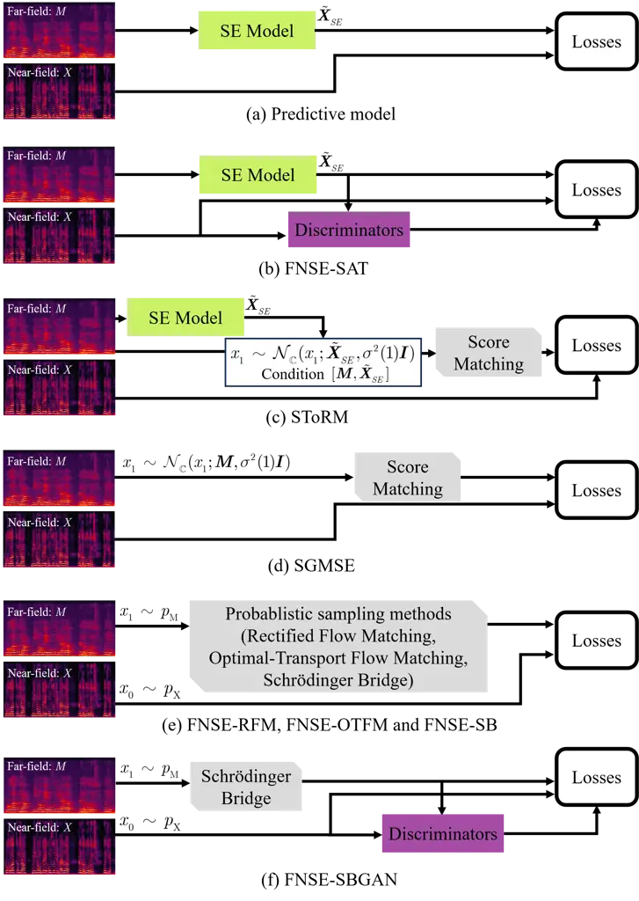
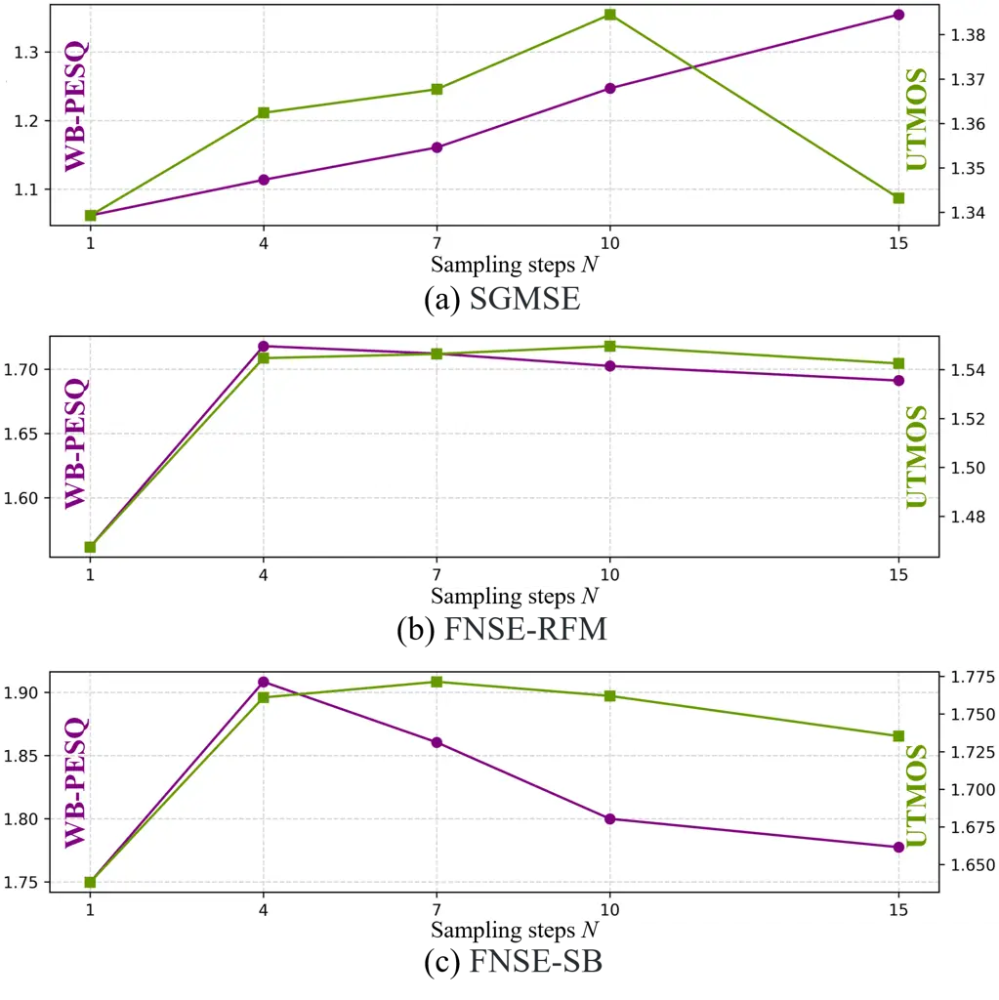
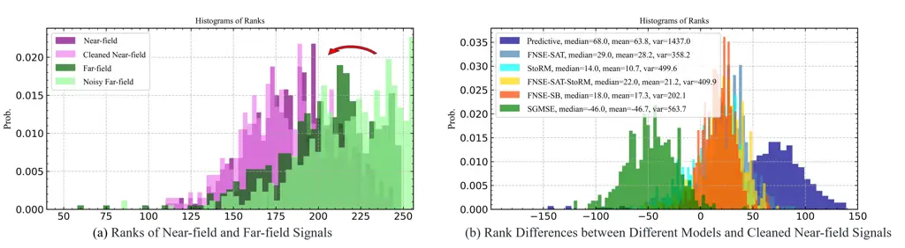
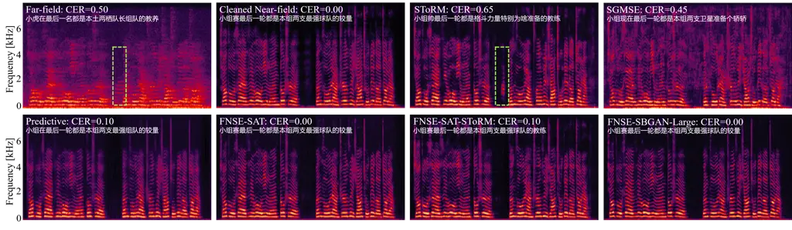
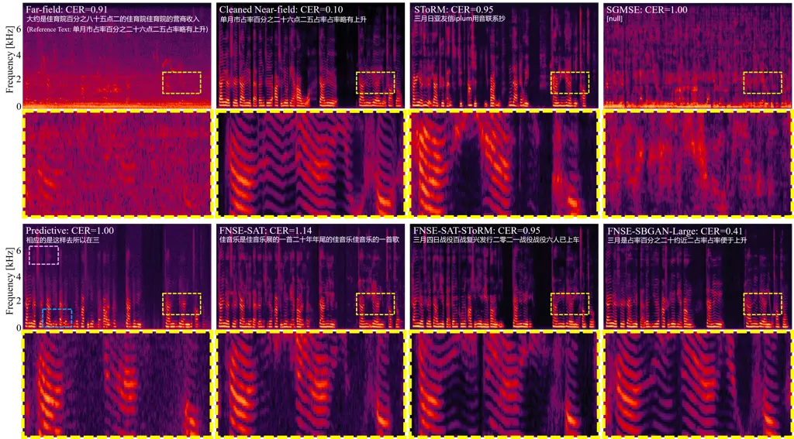
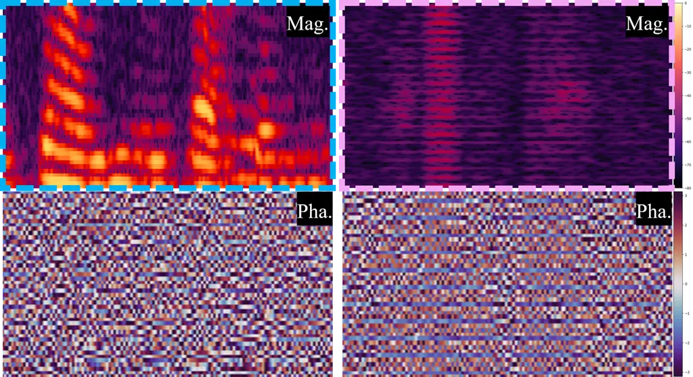

# FNSE-SBGAN: Far-field Speech Enhancement with Schrödinger Bridge and Generative Adversarial Networks

Tong Lei    Qinwen Hu    Ziyao Lin    Andong Li    Rilin Chen    Meng Yu
   Dong Yu    Jing Lu ^(†)^(†)thanks: Manuscript received —-, 2025;
revised —-, 2025. This work was supported by the National Natural
Science Foundation of China (Grant No. 12274221).^(†)^(†)thanks: Tong
Lei, Qinwen Hu, Ziyao Lin and Jing Lu are with the Key Laboratory of
Modern Acoustics, Nanjing University, Nanjing, 210093, Jiangsu, China.
Jing Lu is also with NJU-Horizon Intelligent Audio Lab, Horizon
Robotics, Beijing 100094, China. This work was done while Tong Lei was a
research intern at Tencent AI Lab, Beijing, China. (Corresponding
author: Jing Lu)^(†)^(†)thanks: Andong Li is with the Key Laboratory of
Noise and Vibration Research, Institute of Acoustics, Chinese Academy of
Sciences, Beijing, 100190, China. ^(†)^(†)thanks: Tong Lei and Rilin
Chen are with Tencent AI Lab, Beijing, China.^(†)^(†)thanks: Dong Yu and
Meng Yu are with Tencent AI Lab, Bellevue, WA, USA.^(†)^(†)thanks:
(Email: tonglei@smail.nju.edu.cn; qinwen.hu@smail.nju.edu.cn;
liandong@mail.ioa.ac.cn; ziyaolin@smail.nju.edu.cn;
rilinchen@-tencent.com; raymondmyu@global.tencent.com;
dyu@global.tencent.com; lujing@nju.edu.cn)

###### Abstract

The prevailing method for neural speech enhancement predominantly
utilizes fully-supervised deep learning with simulated pairs of
far-field noisy-reverberant speech and clean speech. Nonetheless, these
models frequently demonstrate restricted generalizability to mixtures
recorded in real-world conditions. To address this issue, this study
investigates training enhancement models directly on real mixtures.
Specifically, we revisit the single-channel far-field to near-field
speech enhancement (FNSE) task, focusing on real-world data
characterized by low signal-to-noise ratio (SNR), high reverberation,
and mid-to-high frequency attenuation. We propose FNSE-SBGAN, a
framework that integrates a Schrödinger Bridge (SB)-based diffusion
model with generative adversarial networks (GANs). Our approach achieves
state-of-the-art performance across various metrics and subjective
evaluations, significantly reducing the character error rate (CER) by up
to 14.58% compared to far-field signals. Experimental results
demonstrate that FNSE-SBGAN preserves superior subjective quality and
establishes a new benchmark for real-world far-field speech enhancement.
Additionally, we introduce an evaluation framework leveraging matrix
rank analysis in the time-frequency domain, providing systematic
insights into model performance and revealing the strengths and
weaknesses of different generative methods.

###### Index Terms: 

Speech enhancement, Real-world data, Far-field speech, Diffusion model,
Schrödinger Bridge, Generative Adversarial Network.

## I Introduction

Speech enhancement (SE) aims to extract clean speech while suppressing
background noise, with the objectives of enhancing speech
intelligibility and perceptual quality. It plays a critical role in
speech frontend processing and various applications, such as voice
recognition \[1, 2\], telecommunication systems \[3\], hearing aids \[4,
5\], and assistive technologies for individuals with hearing
impairments \[6\]. Over the last decade, the data-driven deep learning
(DL)-based models have been extensively employed for SE and have
demonstrated superior performance compared to conventional rule-based
signal processing methods \[7\].

Far-field speech enhancement is confronted with distinctive challenges
stemming from the aggravated complexity of acoustic environments,
characterized by elevated reverberation levels, diminished
signal-to-noise ratios (SNR), and increased variability in the
directivity patterns of microphones and sound sources. These factors
collectively contribute to a more demanding task of achieving robust
performance in real-world scenarios when contrasted with near-field
conditions. As delineated in our prior research \[8\], the training
paradigm for deep learning-based models typically involves the
convolution of near-field acoustic signals with two categories of room
impulse responses (RIRs): RIRs obtained through physical measurements or
RIRs synthesized via the image source method (ISM) \[9\] in conjunction
with the diffusion field method \[10\]. Subsequently, these convolved
signals are superimposed with diverse noise types at predetermined SNR
levels to construct simulated datasets. Nonetheless, substantial
discrepancies persist between the acoustic attributes of simulated data
and real-world recordings, particularly in the following aspects:

#### I-1 Directivity Characteristics and Absorption Properties

The ISM framework \[9\] presupposes that both microphones and sound
sources exhibit omni-directional radiation patterns, whereas practical
scenarios reveal that microphones, especially when affixed to specific
devices, demonstrate discernible directivity, and human speakers
predominantly exhibit frontal (on-axis) directivity \[11\]. Moreover,
ISM conventionally employs frequency-independent wall absorption
coefficients, which inadequately capture the behavior of actual wall
materials. The incorporation of frequency-dependent microphone
directivity, sound source directivity, and wall absorption coefficients
into ISM, as demonstrated in \[12\], markedly enhances the
verisimilitude of simulated RIRs.

#### I-2 Spatial Configuration and Furnishing Elements

ISM predominantly simulates acoustically empty, rectangular rooms, in
contrast to real-world environments that often feature irregular
geometries and the presence of furniture. To emulate such irregular
spaces and the scattering effects induced by furnishings, more
sophisticated geometric acoustic techniques, such as ray-tracing
methods \[13\], can be employed, albeit at increasing computational
expense. The task of configuring room geometry, spatial layout, and the
material properties of both the room and its furnishings to align with
real-world scene semantics presents an additional layer of complexity.
This challenge is effectively addressed in \[13\] through the
utilization of scene computer-aided design (CAD) models for room
configuration and the application of natural language processing
techniques for material specification, thereby substantially augmenting
the authenticity of simulated RIRs. In addition, Li *et al.* \[14\]
introduce the SonicSim, a synthetic toolkit designed to generate highly
customizable data for moving sound sources, which can be used to
construct a benchmark dataset for moving sound sources and to evaluate
the performance of speech separation and enhancement models.

Despite the significant advancements in simulation tools, they remain
challenging to capture the full complexities of real-world data. This
limitation has spurred growing research interest in leveraging
real-world data directly, leading to notable progress in recent years. A
persistent challenge in this area lies in obtaining paired clean
close-talk targets for training on far-field signals. To address this,
RealMan \[15\] captures source speech and microphone array signals in
dynamic acoustic environments using synchronized recording equipment,
creating the first real-world far-field dataset that supports
direct-path speech estimation. Specifically, the direct-path target
clean speech is derived by filtering the source speech with estimated
direct-path impulse responses. In contrast, ctPuLSE \[16\] proposes a
pseudo-label based approach for far-field speech enhancement, where the
estimated close-talk speech serves as a pseudo-supervised target for
training supervised enhancement models directly based on real far-field
mixtures, thereby potentially leading to better generalization
capability to real-world data.

In our previous work FNSE-SAT \[8\], our approach involves using
synchronized recording equipment to capture far-field and near-field
speech in various indoor and outdoor scenarios for DL model training.
The near-field speech is pre-processed to remove slight noise and
reverberations. In this context, SE aims at recovering near-field speech
from far-field speech, addressing the challenges posed by the
degradation of speech quality in far-field conditions. Typically, this
recovery task requires using generative models, which leverage the prior
distribution of clean near-field speech to avoid issues such as
“regression to the mean” and “over-suppression” problems \[17\]. In
FNSE-SAT \[8\], we explore supervised adversarial training with a focus
on generative adversarial networks (GANs) to enhance real-world
single-channel far-field speech signals. While this approach
significantly enhances speech quality and intelligibility of far-field
signals, it still faces challenges in achieving excellent naturalness in
the reconstructed signals. Therefore, it is necessary and also
significant to further incorporate the advancements in generative
models.

Recent breakthroughs in generative models have revolutionized
speech-related domains including text-to-speech synthesis (TTS) \[18,
19, 20, 21\], text-to-audio (TTA) \[22, 23\], voice conversion \[24,
25\], audio editing \[26\], and singing voice synthesis (SVS) \[27,
28\]. In addition to GANs \[29, 30\], diffusion-based generative models
have also made significant progress. Score-Based Generative Models
(SGMs) excel at traversing complex data manifolds through stochastic
differential equations \[31\], making them robust to low-SNR
conditions \[32\]. Flow-Based Architectures (RealNVP \[33\],
Glow \[34\], Neural ODEs \[35\] and etc.) offer invertible
transformations that preserve phonetic content during
enhancement \[36\]. Flow Matching Techniques (Rectified Flow Matching,
Optimal-Transport Flow Matching and etc.) provide efficient training
through direct vector field alignment, particularly effective for
real-world data distributions \[37\]. Emerging extensions like
Schrödinger Bridge (SB) models further bridge these approaches by
enabling direct estimation of optimal transport paths between degraded
and clean speech distributions \[38\]. This capability is critical for
addressing the tripartite challenges of real-world far-field speech:
spectral attenuation \[39\], reverberation artifacts \[40\], and
nonlinear phase distortions \[9\].

In this paper, considering the distinctive characteristics of
real-recorded far-field data, which include: 1) low SNR, 2) high
reverberation levels, and 3) significant attenuation of mid-to-high
frequency components \[8\], we propose to employ the diffusion model, a
state-of-the-art (SOTA) generative approach, for the restoration of
attenuated and degraded speech information. Specifically, we adopt the
Schrödinger Bridge (SB) framework due to its exceptional capability in
directly estimating the target speech from intermediate states. Building
on this framework, we propose a Far-field to Near-field Speech
Enhancement system using Schrödinger Bridge and Generative Adversarial
Networks (FNSE-SBGAN). This approach enables the integration of
auxiliary loss functions to effectively constrain the generated speech
content, minimizing the risk of semantic distortion. The proposed
framework demonstrates superior performance, not only maintaining
excellent subjective speech quality but also achieving a lower Character
Error Rate (CER) compared to both conventional two-stage diffusion
methods \[17\] and the FNSE-SAT \[8\] approach.

Furthermore, we revisit the single-channel real-world FNSE task. By
conducting an in-depth analysis of the real-world dataset \[8\], we
uncover the matrix rank trends of far- and near-field signals in the
time-frequency (T-F) domain. Additionally, we measure the rank
differences between the outputs of various models and the cleaned
near-field signals. Based on this analysis, we establish a correlation
between the overall performance of the models and the variance of the
rank differences.

The contributions of this paper can be summarized as follows:

- •
  To the best of our knowledge, FNSE-SBGAN is the first diffusion
  model-based framework specifically developed to enhance real-world
  far-field speech signals.
- •
  By combining a Schrödinger Bridge-based diffusion model with a
  generative adversarial network, the proposed FNSE-SBGAN method
  achieves state-of-the-art performance across multiple reference-based
  and reference-free metrics, as well as in character error rate.
- •
  We introduce an approach that uses matrix rank to evaluate the
  effectiveness of models in the task of far-field to near-field speech
  enhancement.
- •
  Within the diffusion framework, we conduct experiments and comparisons
  with various one-stage sampling methods and two-stage speech
  enhancement methods.

The rest of this paper is organized as follows: Section II reviews the
problem formulation, including signal models and rank calculation of the
signals. Section III provides the related background, including
score-based generative models and flow matching techniques in generative
models. Section IV details our proposed FNSE-SBGAN framework, explaining
its architecture and the integration of Schrödinger Bridge and GAN, and
provides a detailed description of the training loss functions.
Section V presents the experimental results and analysis, demonstrating
the effectiveness of our approach through various metrics and
comparisons with existing methods. Finally, Section VI concludes the key
findings.

## II Problem Formulation

### II-A Signal Models

For real-recorded far-field data, modeling needs to consider not only
noise and reverberation but also the distortion caused by the distance
from the microphone to the sound source and the nonlinear attenuation
due to air absorption:

```math
M_{l,f}=k_{f}X_{l,f}+H_{l,f}+N_{l,f}, \tag{1}
```

where $`\{M_{l,f},X_{l,f},H_{l,f},N_{l,f}\}\in\mathbb{C}`$ denote the
mixture, source with early reflections, late reverberation, and noise
signals, respectively. For simplicity, we refer to the sources with
early reflections as source signals hereafter. $`k_{f}`$ is the mapping
parameter from the near-field measured data to the far-field recorded
data. The subscripts $`l\in\{1,...,L\}`$ and $`f\in\{1,...,F\}`$
represent the time and frequency indices, respectively. Our goal is to
obtain the source signals $`X_{l,f}`$ from the mixture signals
$`M_{l,f}`$. In fact, real-recorded near-field also contain late
reverberation and a small amount of noise signal. To address this, we
mitigate the background noise and reverberation in the near-field
signals with the pretrained DPCRN model \[41\], which is labeled as
“Cleaned near-field”. After this processing, the “Cleaned near-field”
can be considered as the source signal with early reflections.

### II-B Rank Calculation

Considering the spectrogram matrices constructed from the magnitude STFT
coefficients in Eq. (1), let
$`\mathcal{R}(\cdot):\mathbb{R}^{L\times F}\to\mathbb{Z}`$ denote the
matrix rank operator \[42\]. Applying subadditivity of matrix rank in
spectral magnitude domain yields

```math
\mathcal{R}(|\mathbf{M}|)\approx\mathcal{R}(|\mathbf{X}\mathbf{k}|+|\mathbf{H}|+|\mathbf{N}|)\leq\mathcal{R}(|\mathbf{X}\mathbf{k}|)+\mathcal{R}(\mathbf{H})+\mathcal{R}(|\mathbf{N}|), \tag{2}
```

where $`|\mathbf{M}|`$, $`|\mathbf{X}\mathbf{k}|`$, $`|\mathbf{H}|`$ and
$`|\mathbf{N}|`$ represent magnitude spectrograms. In Eq. (2), the phase
component is omitted because the rank is mainly associated with the
magnitude of matrix elements, which are indicative of signal energy. It
provides an upper bound on the rank of the mixture spectrum
$`\mathbf{M}`$. This implies that after adding noise $`\mathbf{N}`$ and
late reverberation $`\mathbf{H}`$, the upper bound of the matrix rank
tends to increase.

## III Preliminaries

We begin with a brief overview of the commonly used diffusion models,
specifically score-based generative models (SGMs), including the forward
and reverse stochastic differential equations (SDE) and the score
matching objective of the score network.

### III-A Score-Based Generative Models

We reshape the source signals $`\mathbf{X}`$ into a vector
$`\boldsymbol{x}_{0}=\mathbf{f}_{reshape}(\mathbf{X})`$ using a
reshaping transformation $`\mathbf{f}_{reshape}(\cdot)`$, where
$`\boldsymbol{x}_{0}\in\mathbb{R}^{d}`$ and $`d=2\times L\times F`$.
Here, $`\boldsymbol{x}_{0}`$ and $`\boldsymbol{x}_{T}`$ represent the
source signal and far-field signal within a $`d`$-dimensional data
space. We assume the maximum time $`T=1`$ for convenience. In the
following formulation, we model the distribution of a variable
$`\boldsymbol{x}`$ that resides in the same data space as
$`\boldsymbol{x}_{0}`$. Given a data distribution
$`p_{\mathrm{data}}(\boldsymbol{x})`$, SGMs \[31\] are built on a
continuous-time diffusion process defined by a forward SDE:

```math
\mathrm{d}\boldsymbol{x}_{t}=\boldsymbol{f}(\boldsymbol{x}_{t},t)\mathrm{d}t+g(t)\mathrm{d}\boldsymbol{w}_{t},\quad\boldsymbol{x}_{0}\sim p_{0}=p_{\mathrm{data}}, \tag{3}
```

where $`t\in[0,1]`$ is a continuous time variable,
$`\boldsymbol{x}_{t}\in\mathbb{R}^{d}`$ is the state of the process,
$`\boldsymbol{f}`$ is a vector-valued drift coefficient, $`g`$ is a
scalar-valued diffusion coefficient, and
$`\boldsymbol{w}_{t}\in\mathbb{R}^{d}`$ is a standard Wiener process. To
ensure that the boundary distribution is a Gaussian prior distribution
$`p_{\mathrm{prior}}=\mathcal{N}(\mathbf{0},\sigma_{1}^{2}\boldsymbol{I})`$,
we construct the drift coefficient $`\boldsymbol{f}`$ and the diffusion
coefficient $`g`$ accordingly. This construction guarantees that the
forward SDE has a corresponding reverse SDE:

```math
\displaystyle\mathrm{d}\boldsymbol{x}_{t}=[\boldsymbol{f}(\boldsymbol{x}_{t},t)-g^{2}(t)\nabla\log p_{t}(\boldsymbol{x}_{t})]\mathrm{d}t+g(t)\mathrm{d}\bar{\boldsymbol{w}}_{t},
```

```math
\displaystyle\boldsymbol{x}_{1}\sim p_{1}\approx p_{\mathrm{prior}}, \tag{4}
```

where $`\bar{\boldsymbol{w}}_{t}`$ is the reverse-time Wiener process,
and $`\mathrm{d}t`$ denotes an infinitesimal negative time step.
$`\nabla\log p_{t}(\boldsymbol{x}_{t})`$ is the score function of the
marginal distribution $`p_{t}`$. The solution trajectories of this
reverse SDE share the same marginal densities as those of the forward
SDE, except that they evolve in the opposite time direction \[31, 43\].
Intuitively, solutions to the reverse-time SDE are diffusion processes
that gradually convert noise to data.

To enable data sample generation during inference, we can replace the
score function with a score network $`s_{\theta}(\boldsymbol{x}_{t},t)`$
and solve it reversely from $`p_{\mathrm{prior}}`$ at $`t=1`$. The loss
function for SGM is in the form of the mean-square error (MSE) \[44\],
and can be expressed as follows \[31, 45\]:

```math
\mathcal{L}_{\text{SGM}}=\mathbb{E}_{t,\boldsymbol{x}_{0},\boldsymbol{x}_{t}}\left[\|s_{\theta}(\boldsymbol{x}_{t},t)-\nabla\log p_{t|0}(\boldsymbol{x}_{t}|\boldsymbol{x}_{0})\|_{2}^{2}\right], \tag{5}
```

where $`t\sim\mathcal{U}(0,1)`$ and $`p_{t|0}`$ is the conditional
transition distribution from $`\boldsymbol{x}_{0}`$ to
$`\boldsymbol{x}_{t}`$, which is determined by the pre-defined forward
SDE and is analytical for a linear drift
$`\boldsymbol{f}(\boldsymbol{x}_{t},t)=f(t)\boldsymbol{x}_{t}`$.

In this context, the score network $`s_{\theta}(\boldsymbol{x}_{t},t)`$
is trained to approximate the gradient of the log probability density
$`\nabla\log p_{t|0}(\boldsymbol{x}_{t}|\boldsymbol{x}_{0})`$, which
represents the score function. By minimizing the MSE between the score
network’s output and the true score function, the network learns to
denoise the perturbed data samples $`\boldsymbol{x}_{t}`$ at different
time steps $`t`$. This approach leverages the forward SDE to model the
data distribution and enables effective sampling from the learned
generative model by reversing the diffusion process.

### III-B Flow Matching Techniques

Song et al. \[31\] prove the existence of an ordinary differential
equation (ODE), namely the probability flow ODE, whose trajectories have
the same marginals as the reverse time SDE in Eq. (4). The probability
flow ODE is given by:

```math
\displaystyle\mathrm{d}\boldsymbol{x}_{t}=[\boldsymbol{f}(\boldsymbol{x}_{t},t)-\frac{1}{2}g^{2}(t)\nabla\log p_{t}(\boldsymbol{x}_{t})]\mathrm{d}t,
```

```math
\displaystyle\boldsymbol{x}_{1}\sim p_{1}\approx p_{\mathrm{prior}}. \tag{6}
```

Both the reverse-time SDE and the probability flow ODE allow sampling
from the same data distribution as their trajectories have the same
marginals.

To bridge the theoretical foundation of probability flow ODEs with
modern flow-based approaches, we now introduce the framework of Flow
Matching – a unified perspective for constructing generative models
through ordinary differential equations \[46\]. At its core, Flow
Matching aims to learn a time-dependent vector field $`v(t,\mathbf{x})`$
that transports samples from a simple prior distribution $`p_{0}`$ to
the target data distribution $`p_{1}`$ via the ODE:

```math
\frac{d\mathbf{x}_{t}}{dt}=v(t,\mathbf{x}_{t}),\quad\mathbf{x}_{0}\sim p_{0}=p_{\mathrm{data}}. \tag{7}
```

This framework attempts to generalize the probability flow ODE in
Eq. (6), where the drift coefficient
$`\boldsymbol{f}(\boldsymbol{x}_{t},t)-\frac{1}{2}g^{2}(t)\nabla\log p_{t}(\boldsymbol{x}_{t})`$
can be viewed as a specific instantiation of the flow field
$`v(t,\mathbf{x})`$ \[47\]. The key innovation lies in learning
$`v(t,\mathbf{x})`$ directly from data through different matching
objectives \[33\]. Within this framework, two representative approaches
have been developed:

#### III-B1 Rectified Flow Matching

Rectified flow matching (RFM) \[37\] directly minimizes trajectory
discrepancies using a simple quadratic loss:

```math
\mathcal{L}_{\text{RFM}}=\mathbb{E}_{t,\mathbf{x}_{0},\mathbf{x}_{t}}\left[\left\|v(t,\mathbf{x}_{t})-\frac{\mathbf{x}_{t}-\mathbf{x}_{0}}{t}\right\|_{2}^{2}\right], \tag{8}
```

where $`\mathbf{x}_{t}`$ represents intermediate states. This approach
emphasizes direct alignment of the learned flow with linear interpolants
between samples.

#### III-B2 Optimal-Transport Flow Matching

Chen *et al.* \[35\] introduced Neural ODEs, which provide a
continuous-time generalization of residual networks and have been
applied to generative modeling. Optimal-Transport Flow Matching (OTFM)
incorporates Wasserstein-2 optimal transport theory \[48\] through a
potential-guided loss:

```math
\mathcal{L}_{\text{OTFM}}=\mathbb{E}_{t,\mathbf{x}_{t}}\left[\left\|v(t,\mathbf{x}_{t})-\nabla_{\mathbf{x}_{t}}\phi(t,\mathbf{x}_{t})\right\|_{2}^{2}\right], \tag{9}
```

where $`\phi(t,\mathbf{x})`$ is the Kantorovich potential \[49\] from
the optimal transport theory. This formulation explicitly minimizes the
kinetic energy of the transport map by leveraging the geometric
properties of Wasserstein space.

While both approaches share the common goal of learning transport
dynamics, their fundamental differences manifest in three key aspects:
First, in _objective focus_, RFM prioritizes sample trajectory alignment
through linear interpolation, whereas OTFM minimizes optimal transport
costs via Wasserstein-2 geometry \[50\]. Second, their _theoretical
foundations_ differ substantially – OTFM directly incorporates the
differential structure of optimal transport through the Kantorovich
potential $`\phi`$, while RFM relies on simpler interpolation matching
without explicit geometric constraints. Third, there exist notable
_computational tradeoffs_: RFM’s quadratic loss admits efficient
training through closed-form solutions, while OTFM requires solving the
dual potential formulation that increases computational complexity.

## IV FNSE-SBGAN

In this section, we introduce the FNSE-SBGAN, an SB-based T-F domain
far-field to near-field SE method. We start by defining the SB concept
and the paired data for the SE task based on the signal model described
in Section II-A. Next, we provide a comprehensive description of the
loss functions employed during training. Finally, we summarize the
training and inference process of FNSE-SBGAN.

### IV-A Schrödinger Bridge

The SB problem \[52, 53\] originates from the optimization of path
measures with constrained boundaries. We define the target distribution
$`p_{\mathrm{X}}`$ to be equal to the data distribution
$`p_{\mathrm{data}}`$, and we consider the distribution of mixture
signals $`M`$, denoted as $`p_{\mathrm{M}}`$, to be the prior
distribution. Considering $`p_{0},p_{1}`$ as the marginal distributions
of $`p`$ at boundaries, SB is defined as minimization of the
Kullback-Leibler (KL) divergence:

```math
\min_{p\in\mathcal{P}_{[0,1]}}D_{\mathrm{KL}}(p\parallel p_{\mathrm{ref}}),\quad s.t.\ p_{0}=p_{\mathrm{X}},\ p_{1}=p_{\mathrm{M}}, \tag{10}
```

where $`\mathcal{P}_{[0,1]}`$ is the space of path measures on a finite
time interval $`[0,1]`$ with $`p_{\mathrm{ref}}`$ denoting the reference
path measure. When $`p_{\mathrm{ref}}`$ is defined by the same form of
forward SDE as SGMs in Eq. (3), the SB problem is equivalent to a pair
of forward-backward SDEs \[54, 55\]:

```math
\mathrm{d}\boldsymbol{x}_{t}=[\boldsymbol{f}(\boldsymbol{x}_{t},t)+g^{2}(t)\nabla\log\Psi_{t}(\boldsymbol{x}_{t})]\mathrm{d}t+g(t)\mathrm{d}\boldsymbol{w}_{t},\hskip 9.24994pt\boldsymbol{x}_{0}\sim p_{\mathrm{X}}, \tag{11}
```

```math
\mathrm{d}\boldsymbol{x}_{t}=[\boldsymbol{f}(\boldsymbol{x}_{t},t)-g^{2}(t)\nabla\log\widehat{\Psi}_{t}(\boldsymbol{x}_{t})]\mathrm{d}t+g(t)\mathrm{d}\bar{\boldsymbol{w}}_{t},\hskip 9.24994pt\boldsymbol{x}_{1}\sim p_{\mathrm{M}}, \tag{12}
```

where $`\boldsymbol{f}`$ , $`g`$ and $`\boldsymbol{w}_{t}`$ are from the
reference SDE in Eq. (3). With $`\Psi_{t}`$ and $`\widehat{\Psi}_{t}`$
representing the optimal forward and reverse drifts, the marginal
distribution of the SB state $`\boldsymbol{x}_{t}`$ can be expressed as
$`p_{t}=\widehat{\Psi}_{t}\Psi_{t}`$. Typically, SB is not fully
tractable - closed-form solutions exist only when the families of
$`p_{\mathrm{ref}}`$ are strictly limited \[56, 57\].

### IV-B Schrödinger Bridge between Paired Data

Exploring the tractable SB between Gaussian-smoothed paired data with
linear drift in SDE, we consider Gaussian boundary conditions
$`p_{\mathrm{X}}=\mathcal{N}_{\mathbb{C}}(\boldsymbol{x}_{0},\epsilon_{0}^{2}\mathbf{I})`$
and
$`p_{\mathrm{M}}=\mathcal{N}_{\mathbb{C}}(\boldsymbol{x}_{1},e^{2\int_{0}^{1}f(\tau)\mathrm{d}\tau}\epsilon_{0}^{2}\boldsymbol{I})`$.
As $`\epsilon_{0}\to 0`$, $`\widehat{\Psi}_{t}`$ and $`\Psi_{t}`$
converge to the tractable solutions between the target data
$`\boldsymbol{x}_{0}`$ and the corrupted data $`\boldsymbol{x}_{1}`$:

```math
\displaystyle\widehat{\Psi}_{t}=\mathcal{N}_{\mathbb{C}}(\alpha_{t}\boldsymbol{x}_{0},\alpha_{t}^{2}\sigma_{t}^{2}\boldsymbol{I}),\Psi_{t}=\mathcal{N}_{\mathbb{C}}(\bar{\alpha}_{t}\boldsymbol{x}_{1},\alpha_{t}^{2}\bar{\sigma}_{t}^{2}\boldsymbol{I}), \tag{13}
```

where $`\alpha_{t}=e^{\int_{0}^{t}f(\tau)\mathrm{d}\tau}`$,
$`\bar{\alpha}_{t}=e^{-\int_{t}^{1}f(\tau)\mathrm{d}\tau}`$,
$`\sigma_{t}^{2}=\int_{0}^{t}\frac{g^{2}(\tau)}{\alpha_{\tau}^{2}}\mathrm{d}\tau`$
and
$`\bar{\sigma}_{t}^{2}=\int_{t}^{1}\frac{g^{2}(\tau)}{\alpha_{\tau}^{2}}\mathrm{d}\tau`$
are determined by $`f`$ and $`g`$ in the reference SDE, which are
analogous to the noise schedule in SGMs \[58\]. The marginal
distribution of SB also has a tractable form:

```math
p_{t}=\Psi_{t}\widehat{\Psi}_{t}=\mathcal{N}\left(\frac{\alpha_{t}\bar{\sigma}_{t}^{2}\boldsymbol{x}_{0}+\bar{\alpha}_{t}\sigma_{t}^{2}\boldsymbol{x}_{1}}{\sigma_{1}^{2}},\frac{\alpha_{t}^{2}\bar{\sigma}_{t}^{2}\sigma_{t}^{2}}{\sigma_{1}^{2}}\boldsymbol{I}\right). \tag{14}
```

Several noise schedules \[57, 59\], such as variance-preserving (VP),
variance-exploding (VE) and gmax, are listed in Table I.

| Sch.               | gmax                                                | Scaled VP                                                                           | VE                                          |
| ------------------ | --------------------------------------------------- | ----------------------------------------------------------------------------------- | ------------------------------------------- |
| $`f(t)`$           | 0                                                   | $`-\frac{1}{2}(\beta_{0}+t(\beta_{1}-\beta_{0}))`$                                  | 0                                           |
| $`g^{2}(t)`$       | $`\beta_{0}+t(\beta_{1}-\beta_{0})`$                | $`c(\beta_{0}+t(\beta_{1}-\beta_{0}))`$                                             | $`ck^{2t}`$                                 |
| $`\alpha_{t}`$     | 1                                                   | $`e^{-\frac{1}{2}\int_{0}^{t}(\beta_{0}+\tau(\beta_{1}-\beta_{0}))\mathrm{d}\tau}`$ | 1                                           |
| $`\sigma_{t}^{2}`$ | $`\frac{t^{2}(\beta_{1}-\beta_{0})}{2}+\beta_{0}t`$ | $`c(e^{\int_{0}^{t}(\beta_{0}+\tau(\beta_{1}-\beta_{0}))\mathrm{d}\tau}-1)`$        | $`\frac{c\left(k^{2t}-1\right)}{2\log(k)}`$ |

TABLE I: Demonstration of the noise schedules in FNSE-SBGAN. ”Sch.”
denotes the schedule.

### IV-C Loss Functions

Following the approach in \[59\], we train the neural model
$`B_{\theta}`$ to directly predict the target data, forming the bridge
loss \[57\] in Eq. (15). We further augment the bridge loss with a
series of reconstruction losses, including the mel loss and phase loss.
Additionally, we empirically observe that introducing adversarial loss
can effectively improve the generation quality. The overall architecture
of our proposed method integrating SB and the adversarial training is
demonstrated in Figure 1(f), alongside with other baseline methods
described in Sec. V-D.

The reconstruction loss includes both the mean-square error (MSE) loss
$`\mathcal{L}_{mse}`$, the mel loss $`\mathcal{L}_{mel}`$ and the the
phase loss $`\mathcal{L}_{p}`$ following the settings in \[60, 61\]. Let
$`X`$ denote the target signal and let
$`\tilde{X}=B_{\theta}(\boldsymbol{x}_{t},\boldsymbol{x}_{1},t)`$
represent the current estimate produced by the neural network
$`B_{\theta}`$. The first term is defined as the MSE between
$`\tilde{X}`$ and $`X`$ in the STFT domain:

```math
\mathcal{L}_{mse}=\frac{1}{LF}\sum_{l,f}\left\|\tilde{X}_{l,f}-X_{l,f}\right\|_{2}^{2}. \tag{15}
```

The mel loss measures the mean absolute error (MAE) between the
mel-spectrograms of the estimated $`\tilde{Y}^{mel}`$ and target
waveforms $`Y^{mel}`$:

```math
\mathcal{L}_{mel}=\frac{1}{LF_{mel}}\sum_{l,f}\left\|\tilde{Y}_{l,f}^{mel}-Y_{l,f}^{mel}\right\|_{1}, \tag{16}
```

where the mel-spectrograms
$`\{\tilde{Y}_{l,f}^{mel},Y^{mel}\}\in\mathbb{R}^{L\times F_{mel}}`$ are
obtained from $`Y^{mel}=|X|\mathcal{A}`$ and
$`\tilde{Y}^{mel}=|\tilde{X}|\mathcal{A}`$, with $`\tilde{X}`$ the
estimated near-field signal and
$`\mathcal{A}\in\mathbb{R}^{F\times F_{mel}}`$ the linear mel filter.
$`F_{mel}`$ is the mel size and typically satisfies $`F_{mel}\ll F`$ for
a compressed representation.

For the multi-mel loss, we compute the sum of mel losses under the mel
filterbank with different scales :

```math
\mathcal{L}_{mel}=\sum_{j=1}^{J}\mathcal{L}_{mel}^{\left(j\right)}, \tag{17}
```

where $`J`$ denotes the number of scales, and
$`\mathcal{L}_{mel}^{\left(j\right)}`$ refers to the corresponding
$`j`$-th scale mel loss. Following \[62\], here $`J`$ is empirically set
to 7.

The phase loss $`\mathcal{L}_{p}`$ is usually tricky to optimize due to
the wrapping effect. In  \[63\], a specially designed anti-wrapping
phase loss is proposed by incorporating instantaneous phase (IP), group
delay (GD) and instantaneous frequency (IF)  \[64\], given by

```math
\mathcal{L}_{p}=\mathcal{L}_{IP}+\mathcal{L}_{GD}+\mathcal{L}_{IF}, \tag{18}
```

where

```math
\mathcal{L}_{IP}=\frac{1}{FL}\sum_{l,f}\left\|f_{AW}\left(\tilde{\Phi}_{l,f}-\Phi_{l,f}\right)\right\|_{1}, \tag{19}
```

```math
\mathcal{L}_{GD}=\frac{1}{FL}\sum_{l,f}\left\|f_{AW}\left(\Delta_{F}\tilde{\Phi}_{l,f}-\Delta_{F}\Phi_{l,f}\right)\right\|_{1}, \tag{20}
```

```math
\mathcal{L}_{IF}=\frac{1}{FL}\sum_{l,f}\left\|f_{AW}\left(\Delta_{L}\tilde{\Phi}_{l,f}-\Delta_{L}\Phi_{l,f}\right)\right\|_{1}, \tag{21}
```

with $`\{\Phi,\tilde{\Phi}\}\in\mathbb{C}^{L\times F}`$ denoting the
near-field and estimated near-field phase spectrum, and
$`f_{AW}\left(x\right)=\left|x-2\pi\mathrm{round}\left(\frac{x}{2\pi}\right)\right|`$
denoting the anti-wrapping loss. $`\{\Delta_{F},\Delta_{L}\}`$ refer to
the differential along the frequency and time axes, respectively.

To further improve the speech quality, the adversarial loss is
incorporated. This loss incudes the hinge GANs framework, consisting of
discriminators $`D_{\phi}^{(q)}`$ with parameters $`\phi`$ and a
generator. The backpropagated losses are denoted as $`\mathcal{L}_{d}`$
and $`\mathcal{L}_{g}`$, respectively:

```math
\mathcal{L}_{d}=\frac{1}{Q}\sum_{q=1}^{Q}\max\left(0,1-D_{\phi}^{(q)}\left(\mathbf{x}\right)\right)+\max\left(0,1+D_{\phi}^{(q)}\left(\mathbf{\tilde{x}}\right)\right), \tag{22}
```

```math
\mathcal{L}_{g}=\frac{1}{Q}\sum_{q=1}^{Q}\max\left(0,1-D_{\phi}^{(q)}\left(\mathbf{\tilde{x}}\right)\right), \tag{23}
```

where $`\tilde{\mathbf{x}}=\text{iSTFT}(\tilde{\mathbf{X}})`$ and
$`\mathbf{x}`$ denote the reconstructed waveform and the cleaned
near-field waveform, respectively. $`\text{iSTFT}\left(\cdot\right)`$
refers to the iSTFT operation, and $`Q`$ is the number of
sub-discriminators. Discriminators include multi-period discriminator
(MPD) \[65\] and multi-resolution spectrogram discriminator
(MRSD) \[66\].

Besides, the feature matching loss is also utilized:

```math
\mathcal{L}_{fm}=\frac{1}{IQ}\sum_{i,q}|\mathbf{f}_{i}^{(q)}\left(\mathbf{\tilde{x}}\right)-\mathbf{f}_{i}^{(q)}\left(\mathbf{x}\right)|, \tag{24}
```

where $`\mathbf{f}_{i}^{(q)}(\cdot)`$ denotes the $`i`$-th layer feature
for the $`q`$-th sub-discriminator. Finally, the loss for the neural
model is formulated as

```math
\mathcal{L}_{B}=\mathcal{L}_{mse}+\lambda_{mel}\mathcal{L}_{mel}+\lambda_{p}\mathcal{L}_{p}+\lambda_{g}\mathcal{L}_{g}+\lambda_{fm}\mathcal{L}_{fm}, \tag{25}
```

where $`\lambda_{mel}`$, $`\lambda_{p}`$, $`\lambda_{g}`$ and
$`\lambda_{fm}`$ are the weight hyperparameters of the corresponding
loss.

### IV-D Algorithms

 

 Input Training set of pairs $`(\mathbf{M},\mathbf{X})`$, labeled as
$`(\boldsymbol{x}_{1},\boldsymbol{x}_{0})`$

 Output Trained parameters $`\{\theta,\phi\}`$

 1: Sample diffusion time $`t\sim\mathcal{U}(t_{min},1)`$

 2: Generate perturbed state $`x_{t}`$ using the marginal distribution
in Eq. (14)

 3: Estimate
$`\tilde{X}\leftarrow\tilde{\boldsymbol{x}}_{0}=B_{\theta}(\boldsymbol{x}_{t},\boldsymbol{x}_{1},t)`$

 4: Estimate the discriminative labels with $`D_{\phi}`$

 5: Compute the discriminator loss $`\mathcal{L}_{d}`$ with Eq. (22)

 6: Compute the generator loss $`\mathcal{L}_{B}`$ with Eq. (25)

 7: Backpropagate loss $`\mathcal{L}_{d}`$ to update $`\phi`$

 8: Backpropagate loss $`\mathcal{L}_{B}`$ to update $`\theta`$

Algorithm 1 FNSE-SBGAN Training (Based on SDE).

 

 Input Far-field speech $`\boldsymbol{x}_{1}\leftarrow\mathbf{M}`$, step
size $`\Delta\tau=\frac{(1-t_{min})}{N}`$

 Output Near-field speech estimate $`\tilde{X}`$

 1: Generate initial reverse state
$`\boldsymbol{x}_{t}\leftarrow\boldsymbol{x}_{1}`$

 2: for $`n\in\{N,...,1\}`$ do

 3:  Get diffusion time $`t=n\Delta\tau=\frac{n}{N}(1-t_{min})`$

 4:  Compute $`\alpha_{t}`$, $`\sigma_{t}^{2}`$, $`\alpha_{t-1}`$,
$`\sigma_{t-1}^{2}`$ via Table I

 5:  Estimate
$`\tilde{\boldsymbol{x}}_{0}=B_{\theta}(\boldsymbol{x}_{t},\boldsymbol{x}_{1},t)`$

 6:  Compute
$`\boldsymbol{x}_{t-1}=\frac{\alpha_{t-1}}{\alpha_{t}}\frac{\sigma_{t-1}^{2}}{\sigma_{t}^{2}}\boldsymbol{x}_{t}+\alpha_{t-1}\left(1-\frac{\sigma_{t-1}^{2}}{\sigma_{t}^{2}}\right)\tilde{\boldsymbol{x}}_{0}`$

 7:  Sample noise signal
$`\boldsymbol{\epsilon}\sim\mathcal{N}(0,\mathbf{I})`$

 8:  if $`n\neq 1`$

     update
$`\boldsymbol{x}_{t-1}\leftarrow\boldsymbol{x}_{t-1}+\alpha_{t-1}\sqrt{\sigma_{t-1}^{2}\left(1-\frac{\sigma_{t-1}^{2}}{\sigma_{t}^{2}}\right)}\boldsymbol{\epsilon}`$

 9: end for

 10: Return $`\tilde{X}\leftarrow\boldsymbol{x}_{0}`$

Algorithm 2 FNSE-SBGAN Inference (Based on SDE).

## V Results and Discussions

### V-A Datasets

In our study, we utilize the same Chinese real-recorded datasets, with
detailed data collection procedures, feature analysis, and preprocessing
methods as described in  \[8\]. However, we observe that augmenting
far-field signals by adding extra noise, which is effective for
FNSE-SAT, has no significant effect on our SB-based diffusion method
and, in some cases, even negatively impacts performance. Therefore, in
this work, we list the performances of different methods on the original
400 hours of recorded signal pairs and the expanded 1000 hours of signal
pairs. When the Data++ option is set to ✗, it indicates that the
original 400 hours of recorded signal pairs are used for training. When
the Data++ option is set to $`\checkmark`$, our training dataset is
expanded to 1,000 hours by adding extra noise from the DNS Challenge 3
dataset ¹¹ 1 https://github.com/microsoft/DNS-Challenge. Our test set
consists of 497 far- and near-field pairs, ensuring no overlap with the
training set.

### V-B Experimental configurations

In terms of noise schedulers, $`\beta_{0}=0.01`$ and $`\beta_{1}=20`$
are set for both gmax and scaled variance preservation (VP) types; For
variance exploding (VE) type, we use $`k=2.6`$ and $`c=0.40`$; For
scaled VP type, we use $`c=0.30`$. The processing time for the proposed
SB is set to $`T=1`$ with $`t_{\text{min}}=10^{-4}`$. The reverse SDE
and the probability flow ODE \[55\] samplers are chosen in the inference
stage by changing $`p_{\mathrm{ref}}`$ of Eq. (3) to Eq. (6). For flow
matching techniques, the Euler sampler \[43\] is applied.

For the weight hyperparameters in Eq. (25), $`\lambda_{mel}`$,
$`\lambda_{p}`$, $`\lambda_{g}`$ and $`\lambda_{fm}`$ are 0.1, 0.01,
10.0 and 10.0, respectively. “+GAN” refers to the inclusion of the loss
terms $`\mathcal{L}_{g}`$ and $`\mathcal{L}_{fm}`$ in Eq. (25). For
feature extraction, we employ STFT with a Hanning window of length 1024
and a hop size of 256. All models are non-causal. The parameter size of
TF-GridNet\[67\] in FNSE-SAT remains the same as in \[8\], but the
stride of the Unfold and Deconv1D layers changes from 4 to 1, resulting
in higher computational complexity.

The configurations in Eq. (17) vary in the FFT size ($`n_{\text{fft}}`$)
and the number of mel frequency bins ($`n_{\text{mels}}`$), which are
set to (32, 64, 128, 256, 512, 1024, 2048) and (5, 10, 20, 40, 80, 160,
210), respectively. For all configurations, the upper-bound frequency
($`f_{\text{max}}`$) is fixed at half the sampling rate, while the
window size and hop size are set to $`n_{\text{fft}}`$ and
$`n_{\text{fft}}/4`$, respectively. The single mel loss defined in
Eq. (16) is acquired with the specific configuration where
$`n_{\text{fft}}=1024`$ and $`n_{\text{mels}}=160`$.

The discriminator in Eq. (22) includes two components: Multi-Period
Discriminator (MPD) and Multi-Resolution Spectral Discriminator (MRSD).
MPD captures variations in audio periodic patterns using five
sub-discriminators. Each sub-discriminator reshapes the 1D raw audio
waveform into a 2D format based on predefined period values, which are
set to {2, 3, 5, 7, 11}. MRSD consists of three sub-discriminators,
where the magnitude spectrum serves as the input. This input is fed into
a stack of Conv2d layers to compute the discriminative scores. The
configurations for {window size, hop size, $`n_{\text{fft}}`$} in the
three sub-discriminators are (512, 128, 512), (1024, 256, 1024), and
(2048, 512, 2048), respectively.

The NCSN++ network with 16.2 M parameters \[31\] is modified based on
the default network configuration used in SGMSE \[68\] through several
adjustments. The embedding size is set to 64, the channel multiplier is
set to (1, 1, 2, 2, 2, 2, 2), the number of residual blocks is increased
to 2, and the attention resolution is removed. For the configurations
with 36.5 M and 64.9 M parameters, the embedding size is adjusted to 96
and 128, respectively.



Fig. 1: Illustrations of several baselines and our proposed FNSE-SBGAN.

### V-C Baselines Comparisons

Due to the relatively limited research in this field, we select several
state-of-the-art (SOTA) SE algorithms with different paradigms as
baselines, shown in Figure 1(a)-(e), with detailed descriptions below.

- •
  As shown in Figure 1(a), “Predictive model” indicates that no
  generative strategy is used, and the model directly predicts the
  target in an end-to-end manner. Here, we use TF-GridNet \[67\] as the
  backbone.
- •
  “FNSE-SAT” refers to using TF-GridNet as the generator and assisting
  it with a GAN structure to generate near-field speech, as illustrated
  in Figure 1(b).
- •
  “SToRM” represents the two-stage method in \[17\], where the result
  estimated by the predictive model (NCSN++ \[31\]) in the first stage
  is concatenated with the far-field signal to serve as the condition
  for diffusion in the second stage. The estimated signal from the first
  stage, perturbed by white noise, serves as the starting point for the
  score matching (NCSN++) diffusion process with a one-step corrector,
  as shown in Figure 1(c).
- •
  “SGMSE” from \[68\] is a score matching method with an OUVE and a
  one-step corrector \[31\], shown in Figure 1(d).
- •
  The variations of “FNSE-SB” with several different probabilistic
  sampling methods are shown in Figure 1(e), using rectified flow
  matching \[69\] and optimal-transport flow matching \[70\], within the
  same training framework. Both flow matching methods employ an Euler
  sampler for the ODE. Unlike the score network $`s_{\theta}`$, which
  takes $`\nabla\log{p_{t}}`$ as its training objective, or the flow
  matching network $`{O}_{\theta}`$ that predicts the velocity field to
  transform the initial distribution into the target distribution, the
  SB network $`{B}_{\theta}`$ directly predicts the target data. Here,
  $`s_{\theta}`$, $`{O}_{\theta}`$ and $`{B}_{\theta}`$ represent the
  same NCSN++ network, but they estimate different objectives based on
  the sampling methods of score matching, flow matching, and SB,
  respectively. “FNSE-RFM”, “FNSE-OTFM” and “FNSE-SB” correspond to
  rectified flow matching, optimal-transport flow matching and
  Schrödinger Bridge without GAN loss.
- •
  Finally, our proposed FNSE-SBGAN model is illustrated in Figure 1(f).



Fig. 2: Metrics with different numbers of sampling steps $`N`$ during
the reverse process.

### V-D Results and Analysis

Five metrics are involved in the objective evaluations: 1) Wide-band
version of Perceptual evaluation of speech quality (PESQ) \[71\] serves
to assess the objective speech quality. 2) Extended Short-Time Objective
Intelligibility (ESTOI) \[72\] measures the intelligibility level of
speech. 3) UTMOS \[73\] is used to obtain subjective scores related to
the perceived quality of speech, providing an objective approximation of
human judgment. 4) DNSMOS P.808 is a non-intrusive metric to provide a
comprehensive assessment of the model performance  \[74\]. 5) The
Character Error Rate (CER), computed between the reference text and the
transcription generated by Whisper²² 2 https://github.com/openai/whisper
on the enhanced signal, is used to assess the degree of semantic
modification introduced by the generation method.

| Schedules | Losses          | Sampler | WB-PESQ$`\uparrow`$ | ESTOI$`\uparrow`$ | UTMOS$`\uparrow`$ |
| --------- | --------------- | ------- | ------------------- | ----------------- | ----------------- |
| gmax      | mse             | SDE     | 1.714               | 0.6861            | 1.594             |
| gmax      | +mmel           | SDE     | 1.908               | 0.7409            | 1.761             |
| gmax      | +mmel           | ODE     | 1.846               | 0.7337            | 1.674             |
| Scaled VP | +mmel           | SDE     | 1.882               | 0.7401            | 1.698             |
| VE        | +mmel           | SDE     | 1.879               | 0.7398            | 1.665             |
| gmax      | +mmel+phase     | SDE     | 1.915               | 0.7482            | 1.785             |
| gmax      | +mmel+GAN       | SDE     | 1.937               | 0.7499            | 1.789             |
| gmax      | +mmel+phase+GAN | SDE     | 1.941               | 0.7501            | 1.790             |

TABLE II: Ablation Study of Loss Functions, Noise Schedules, and
Samplers in Signal Reconstruction Using Mapping Method with 16.2 M
Parameters, Cleaned Near-field targets, and Exclusion of Data++.

| Recon.   | \#Param. | Data           | Cleaned        | WB-PESQ$`\uparrow`$ | ESTOI$`\uparrow`$ | UTMOS$`\uparrow`$ |
| -------- | -------- | -------------- | -------------- | ------------------- | ----------------- | ----------------- |
|          | (M)      | ++             | Near-field     |                     |                   |                   |
| map      | 16.2     | ✗              | $`\checkmark`$ | 1.908               | 0.7409            | 1.761             |
| map      | 16.2     | ✗              | ✗              | 1.645               | 0.7172            | 1.648             |
| crm      | 16.2     | $`\checkmark`$ | $`\checkmark`$ | 1.875               | 0.7441            | 1.735             |
| crm      | 16.2     | ✗              | $`\checkmark`$ | 1.943               | 0.7532            | 1.780             |
| decouple | 16.2     | ✗              | $`\checkmark`$ | 1.931               | 0.7507            | 1.775             |
| crm      | 36.5     | ✗              | $`\checkmark`$ | 1.972               | 0.8204            | 1.839             |
| crm      | 64.9     | ✗              | $`\checkmark`$ | 2.023               | 0.8642            | 1.879             |

TABLE III: Ablation Study of Signal Reconstruction Methods and Network
Sizes Under the Conditions of “gmax”, “SDE”, and “mse+mmel” Losses.

|                         |           |                         |           |                |                     |                   |                   |                    |                       |
| ----------------------- | --------- | ----------------------- | --------- | -------------- | ------------------- | ----------------- | ----------------- | ------------------ | --------------------- |
| Models                  | \#Param.  | \#MACs (Giga/5s)        | Inference | Data++         | WB-PESQ$`\uparrow`$ | ESTOI$`\uparrow`$ | UTMOS$`\uparrow`$ | DNSMOS$`\uparrow`$ | CER                   |
|                         | (M)       |                         | Speed     |                |                     |                   |                   |                    | (in %) $`\downarrow`$ |
| Real-near               | -         | -                       | -         | -              | 4.644               | 1.000             | 2.989             | 3.915              | 8.921                 |
| Real-far                | -         | -                       | -         | -              | 1.125               | 0.3772            | 1.286             | 2.451              | 35.94                 |
| Predictive              | 2.52      | 182.3                   | 0.0280    | $`\checkmark`$ | 1.609               | 0.6485            | 1.351             | 3.135              | 27.11                 |
| FNSE-SAT                | 2.52      | 182.3                   | 0.0280    | ✗              | 1.637               | 0.6513            | 1.473             | 3.341              | 26.87                 |
| FNSE-SAT                | 2.52      | 182.3                   | 0.0280    | $`\checkmark`$ | 1.814               | 0.7083            | 1.781             | 3.667              | 26.09                 |
| SToRM                   | 16.2+16.2 | 82.57+82.80$`\times`$20 | 0.2669    | $`\checkmark`$ | 1.586               | 0.6368            | 1.590             | 3.393              | 44.98                 |
| FNSE-SAT-SToRM          | 2.52+16.2 | 182.3+82.80$`\times`$20 | 0.2823    | $`\checkmark`$ | 1.905               | 0.7379            | 1.840             | 3.795              | 27.76                 |
| SGMSE                   | 16.2      | 82.57$`\times`$20       | 0.2535    | ✗              | 1.247               | 0.5680            | 1.385             | 3.375              | 51.01                 |
| FNSE-RFM (ours)         | 16.2      | 82.57$`\times`$4        | 0.0506    | ✗              | 1.718               | 0.6901            | 1.545             | 3.469              | 36.49                 |
| FNSE-OTFM (ours)        | 16.2      | 82.57$`\times`$4        | 0.0506    | ✗              | 1.710               | 0.6875            | 1.537             | 3.477              | 36.77                 |
| FNSE-SB (ours)          | 16.2      | 82.57$`\times`$4        | 0.0507    | ✗              | 1.950               | 0.7564            | 1.805             | 3.755              | 24.99                 |
| FNSE-SBGAN (ours)       | 16.2      | 82.57$`\times`$4        | 0.0507    | ✗              | 1.981               | 0.7582            | 1.812             | 3.767              | 24.42                 |
| FNSE-SBGAN-Large (ours) | 64.8      | 326.9$`\times`$4        | 0.1570    | ✗              | 2.131               | 0.7802            | 1.992             | 3.796              | 21.36                 |

TABLE IV: Results of objective evaluations on the test set. “#Param.”
denotes the number of trainable parameters. Metrics with $`\downarrow`$
indicate that lower values are better. The inference speed on a GPU is
evaluated based on a single Tesla V100. The computational complexity of
the diffusion methods needs to be multiplied $`\times`$ by the number of
reverse sampling steps. The SToRM method combines predictive and
diffusion models, so the number of parameters and computational
complexity need to be summed + from both parts. The best and second-best
performances are namely highlighted in bold and underlined.

#### V-D1 Ablation studies

Figure 2 shows the results of the ablation study on the number of
reverse sampling steps for several probabilistic sampling methods. The
settings for “FNSE-SB” are “gmax” / “mse+mmel” / “map” / “16.2M”. The
settings for “SGMSE” and “FNSE-RFM” are “mse” / “map” / “16.2M”. We
found that “SGMSE” requires about 10 steps to achieve the optimal
effect. Since a one-step corrector is needed to calibrate the estimate
of $`\nabla\log{p_{t}}`$, the 10-step iteration process requires passing
through the score network $`s_{\theta}(\boldsymbol{x}_{t},t)`$ 20 times,
which is computationally intensive. In contrast, “FNSE-SB” and
“FNSE-RFM” only need about four steps to achieve the optimal effect and
do not require a corrector, significantly improving efficiency.

Table II and Table III reveal the process of exploring the optimal
settings for ”FNSE-SBGAN”. Table II presents the test performance with
various combinations of losses and noise schedules when the network
parameter count is 16.2M. From the experimental results, it is evident
that the introduction of auxiliary losses, single mel loss “+mel”,
multi-mel loss “+mmel”, and phase loss “+phase”, can significantly
enhance the model’s performance. Furthermore, the introduction of
adversarial training on top of “+mmel” and “+mmel+phase” further improve
the WB-PESQ score by 0.091 and 0.026 respectively. Correspondingly,
other metrics also show notable improvements. When comparing Scaled VP
and VE under the “+mmel” condition, gmax emerges as the optimal choice
for the majority of indicators. Additionally, when the sampler is
switched from the reverse SDE to the probability flow ODE, there is a
slight degradation in performance.

Table III lists the results for the methods of reconstructing the signal
from the network output and varying the network size under the settings
of “gmax”, “+mmel”, and “SDE”. “map” and “crm” denote that the network
output is the complex spectrum mapping and the complex mask,
respectively. “decouple” indicates that the network outputs the
amplitude and phase of the signal separately, which are then coupled to
form the output signal. The results indicate that the “crm”
configuration is optimal for our task, rather than the previously
default “map” form used in the NCSN++ network \[31\]. Additionally,
increasing the network size also improves the final output scores.

Besides, we find that using raw near-field signals as training targets
significantly degrades the model’s performance due to residual noise and
slight reverberation. As we describe in Section V-A, the data
augmentation method of adding extra noise to the far-field signals has a
negative impact on our SB-based diffusion method. This is likely because
the SDE-based method inherently involves adding Gaussian white noise
during the training process. Thus, introducing additional noise may
disrupt the intrinsic structure and distribution of the data, causing
confusion in the learning process and making it difficult for the model
to accurately capture the key information of the signals, thereby
affecting the final reconstruction performance \[32\]. For instance, as
mentioned in \[75\], the introduction of noise needs to be handled
carefully, especially during data augmentation, as excessive noise may
obscure the true data distribution, thereby impairing the model’s
training effectiveness and generation quality.



Fig. 3: The ranks of both near-field and far-field signals are analyzed,
along with the differences between the model outputs and the cleaned
near-field signals. The term “Cleaned near-field” refers to the enhanced
signals obtained from the near-field, while “Noisy far-field” denotes
the far-field signals that have been intentionally corrupted with added
noise. For the purpose of rank calculation, an absolute threshold
$`\eta`$ of 0.5 has been set.

#### V-D2 Comparisons with SOTA methods

Table IV presents objective comparisons on the real-far test set,
revealing several key observations. First, although predictive methods
without any generative capability can improve CER to some extent, they
perform poorly on all other intrusive and non-intrusive metrics, even
with data augmentation. Second, for the “FNSE-SAT” method, which relies
on supervised adversarial training and generative adversarial networks,
data augmentation significantly enhances model performance. Third, for
the two-stage “SToRM” approach, which combines a predictive model with a
diffusion model, the quality of the output from the first-stage
predictive model, serving as a prior for the second-stage score-matching
diffusion, largely determines the final generation quality. In the
“SToRM” framework, the predictive model utilizes the original NCSN++
architecture, which uniquely processes the spectrogram by treating the
time and frequency dimensions isotropically, akin to how an image is
handled in visual processing networks. This contrasts with typical audio
processing models \[67, 41\], where the time and frequency dimensions
are often treated distinctly and modeled separately. In contrast,
“FNSE-SAT-SToRM” replaces the predictive model with a fixed-parameter
and data-augmented “FNSE-SAT”. Compared to “FNSE-SAT”, although the
objective metrics of the latter show improvement, the CER metric
slightly decreases, indicating that the second-stage diffusion model
generates semantic modifications.

Furthermore, among all evaluated single-stage diffusion models, the SB
approach demonstrates superior performance on the far-field to
near-field speech enhancement task across various probabilistic sampling
methods. Notably, through the integration of GANs and model scaling
techniques, the proposed framework achieves a remarkable reduction in
CER by up to 14.58% compared to the original far-field signal, while
maintaining enhanced speech quality.

| Models | Cleaned Near-field | Predictive       | SGMSE            | FNSE-SAT         | SToRM            | FNSE-SAT-SToRM   | FNSE-SBGAN           | FNSE-SBGAN-Large |
| ------ | ------------------ | ---------------- | ---------------- | ---------------- | ---------------- | ---------------- | -------------------- | ---------------- |
| MUSHRA | 93.43$`\pm`$0.94   | 79.82$`\pm`$1.21 | 80.33$`\pm`$1.35 | 87.29$`\pm`$1.11 | 81.97$`\pm`$1.32 | 87.65$`\pm`$1.07 | \*\*89.09$`\pm`$0.96 | 89.97$`\pm`$0.93 |

TABLE V: MUSHRA scores among different methods on the Test set. The
confidence level is 95%, and we performed a t-test comparing FNSE-SBGAN
with FNSE-SAT-SToRM. Note that $`{}^{**}p<0.05`$, $`{}^{*}p<0.1`$.



Fig. 4: Spectral visualizations from an indoor sample. The text in the
images includes the model names, the corresponding Chinese speech
recognition results for the samples, and the associated CER.

#### V-D3 Rank Analysis

The phenomenon of rank expansion as described in Eq. (2) is visually
demonstrated in Fig. 3(a). Here, signals normalized in energy in the
time domain have undergone a 512-point STFT analysis, resulting in 257
frequency bins. Notably, a red arrow indicates a reduction in rank
corresponding to the suppression of noise and reverberation. In this
context, matrix rank is primarily associated with singular values, which
more accurately characterizes the energy distribution in non-square
matrices.

The rank differences are calculated by subtracting the ranks of the
far-field test set processed with various baseline methods from those
obtained by the “Cleaned near-field” samples. These differences are
statistically represented in Fig. 3(b). The distribution of medians from
left to right suggests a decreasing trend in the rank values of the
model outputs. A median and mean closer to zero, along with a smaller
variance, indicate a closer match between the model’s output rank and
the target “Cleaned near-field” rank.

Integrating the statistical results from Fig. 3(b) with the performance
metrics in Table IV, it is evident that methods with medians and
variances closer to zero, and particularly those with smaller variances,
tend to perform better on this task. Most methods result in rank
differences greater than zero for the majority of processed samples,
except for “SGMSE,” which tends to generate components that increase the
rank. This analysis helps in identifying the effectiveness of different
methods in approximating the rank structure of the “Cleaned near-field”
target, thereby providing insights into their noise and reverberation
suppression capabilities.



Fig. 5: Spectral visualizations from an outdoor sample. The images in
the second and the fourth row represent zoomed-in views of the
corresponding positions in the previous row.



Fig. 6: The zoomed-in views of the magnitude and phase spectrums of the
Predictive model from Fig. 5.

#### V-D4 Subjective Evaluations

For subjective evaluations, we employ the MUSHRA (MUltiple Stimuli with
Hidden Reference and Anchor) testing methodology as outlined in ITU-R
BS.1534-3 \[76\], utilizing the BeaqleJS platform \[77\]. A total of 17
native Chinese speakers, all specializing in audio signal processing,
are involved in the testing. In the MUSHRA test, participants evaluate
speech processed by various algorithms on a scale from 0 to 100,
assessing overall similarity to the cleaned near-field reference, with a
particular emphasis on semantic similarity.

Table V presents the MUSHRA results, which reveal that our FNSE-SBGAN is
statistically superior to FNSE-SAT-SToRM ($`p<0.05`$) and other
baselines, further demonstrating the advantage of our method in
achieving subjective quality close to the ground truth signal. The
FNSE-SBGAN-Large model with a larger number of parameters exhibits
better subjective performance.

#### V-D5 Spectral Visualizations

Fig. 4 presents spectral visualizations of an indoor sample with a high
level of reverberation. The far-field recognition results, which show a
CER of 0.50, clearly indicate that high reverberation significantly
degrades ASR model performance. While the directly trained “Predictive”
model demonstrates decent noise reduction capabilities on this sample,
it falls short in recovering mid-high frequency details and restoring
energy. In contrast, the pure diffusion method “SGMSE” and the two-stage
joint method “SToRM” (which combines predictive and diffusion
approaches) achieve better compensation for mid-high frequency energy
loss, even though they do not employ audio-specific architectures like
TF-GridNet. The inference results of “SGMSE” reveal artificial
generation artifacts that induce semantic modifications. Notably, the
“SToRM” method’s first-stage NCSN++ network, which treats time-frequency
dimensions isotropically, struggles to suppress unexpected harmonic
structure noise in the background scene, as highlighted in the green
boxes. This limitation is effectively addressed in the “FNSE-SAT-SToRM”
variant through its first-stage FNSE-SAT module based on TF-GridNet,
which demonstrates superior interference suppression. Our proposed
“FNSE-SBGAN-Large,” while also built on the NCSN++ diffusion framework,
achieves enhanced mid-high frequency spectral energy compensation and
avoids semantic modification.

Fig. 5 presents spectral visualizations of an outdoor sample captured in
ultra-far-field conditions (greater than 12 meters) with strong noise
interference, resulting in a far-field CER of 0.91 that significantly
alters the semantic content. For this low-SNR sample, both the
“Predictive” and “SToRM” models exhibit over-suppression artifacts. The
“SGMSE” method completely fails to recover any useful information. While
“FNSE-SAT-SToRM” and “FNSE-SAT” appear to preserve and recover the
target spectra, their artificial generation artifacts substantially
distort the original semantics. Our proposed “FNSE-SBGAN-Large”
generates harmonic information while maximally preserving the semantic
content. Detailed observations from the zoomed-in views (yellow boxes)
further confirm its recovery advantages. Note that the speaker deviates
slightly from the reference text, resulting in a CER that is not equal
to zero, even in near-field conditions.

Additionally, we offer insights into the frequency-domain striping
phenomenon discussed in \[8\], particularly observed in the directly
tuned “Predictive” model. Fig. 6 presents zoomed-in views of the
magnitude and phase spectra (blue/pink boxes from Fig. 5), revealing a
regression to the mean effect \[78\] that manifests as frequency-domain
striping, especially pronounced in high frequencies. From a rank
analysis perspective, this issue arises from the “Predictive” model’s
limited generative capacity: for mid-high frequency components corrupted
in far-field signals, it produces only coarse frequency-dependent energy
estimates. This results in over-suppression and striping in the
magnitude spectra, along with non-physical phase fluctuations and
insufficient temporal variation in the phase spectra. Consequently, its
processed outputs exhibit substantially lower ranks compared to clean
near-field targets, leading to the largest mean/median rank differences,
as shown in Fig. 3(b). In contrast, the “SGMSE” method, which tends to
reconstruct signals from white noise, generates excessive artificial
components, typically resulting in higher ranks than those of clean
targets.

The audiometry samples are available at
[https://github.com/Taltt/FNSE-SBGAN](https://github.com/Taltt/FNSE-SBGAN).

## VI Conclusions

In this study, we addressed the significant mismatches between simulated
and real-world acoustic data by revisiting the single-channel far-field
to near-field speech enhancement (FNSE) task. We proposed FNSE-SBGAN, a
framework that integrates a Schrödinger Bridge (SB)-based diffusion
model with generative adversarial networks (GANs). Our approach achieved
state-of-the-art performance across various metrics and subjective
evaluations, significantly reducing the character error rate (CER) by up
to 14.58% compared to far-field signals. Experimental results
demonstrated that FNSE-SBGAN preserves superior subjective quality. To
systematically analyze model behavior, we introduce a time-frequency
matrix rank analysis framework, revealing distinct spectral recovery
characteristics of generative and predictive approaches. This analysis
further reinterprets frequency-domain striping artifacts in predictive
models as rank deficiencies caused by spectral averaging effects. The
proposed methodology establishes a new benchmark for real-world
far-field enhancement while providing interpretable insights into model
capabilities and limitations.

## References

- \[1\] Z.-Q. Wang, P. Wang, and D. Wang, “Complex spectral mapping for
  single-and multi-channel speech enhancement and robust asr,” _IEEE/ACM
  Trans. Audio, Speech, Lang. Process._, vol. 28, pp. 1778–1787, 2020.
- \[2\] J. Gnanamanickam, Y. Natarajan, and S. P. KR, “A hybrid speech
  enhancement algorithm for voice assistance application,” _Sensors_,
  vol. 21, no. 21, p. 7025, 2021.
- \[3\] R. Flynn and E. Jones, “Robust distributed speech recognition
  using speech enhancement,” _IEEE Trans. Consum. Electron_, vol. 54,
  no. 3, pp. 1267–1273, 2008.
- \[4\] G. Park, W. Cho, K.-S. Kim, and S. Lee, “Speech enhancement for
  hearing aids with deep learning on environmental noises,” _Applied
  Sciences_, vol. 10, no. 17, p. 6077, 2020.
- \[5\] T. Lei, Z. Hou, Y. Hu, W. Yang, T. Sun, X. Rong, D. Wang,
  K. Chen, and J. Lu, “A low-latency hybrid multi-channel speech
  enhancement system for hearing aids,” in _Proc. ICASSP_, 2023, pp.
  1–2.
- \[6\] A. S. Dhanjal and W. Singh, “Tools and techniques of assistive
  technology for hearing impaired people,” in _Proc. COMIT-Con_, 2019,
  pp. 205–210.
- \[7\] D. Wang and J. Chen, “Supervised speech separation based on deep
  learning: An overview,” _IEEE/ACM Trans. Audio, Speech, Lang.
  Process._, vol. 26, no. 10, pp. 1702–1726, 2018.
- \[8\] T. Lei, Q. Hu, Z. Hou, and J. Lu, “Enhancing real-world
  far-field speech with supervised adversarial training,” _Applied
  Acoustics_, vol. 229, p. 110407, 2025. \[Online\]. Available:
  [https://www.sciencedirect.com/science/article/pii/S0003682X24005589](https://www.sciencedirect.com/science/article/pii/S0003682X24005589)
- \[9\] J. B. Allen and D. A. Berkley, “Image method for efficiently
  simulating small-room acoustics,” _J. Acoust. Soc. Am._, vol. 65,
  no. 4, pp. 943–950, 1979.
- \[10\] E. A. Habets, I. Cohen, and S. Gannot, “Generating
  nonstationary multisensor signals under a spatial coherence
  constraint,” _J. Acoust. Soc. Am._, vol. 124, no. 5, pp.
  2911–2917, 2008.
- \[11\] brandner manuel, frank matthias, and rudrich daniel,
  “dirpat—database and viewer of 2d/3d directivity patterns of sound
  sources and receivers,” _J. Audio Eng. Soc._, no. 425, may 2018.
- \[12\] P. Srivastava, A. Deleforge, and E. Vincent, “Realistic
  sources, receivers and walls improve the generalisability of
  virtually-supervised blind acoustic parameter estimators,” in
  _Proc. IWAENC_, 2022, pp. 1–5.
- \[13\] Z. Tang, R. Aralikatti, A. J. Ratnarajah, and D. Manocha, “Gwa:
  A large high-quality acoustic dataset for audio processing,” in _Proc.
  ACM SIGGRAPH_, ser. SIGGRAPH ’22. New York, NY, USA: Association for
  Computing Machinery, 2022. \[Online\]. Available:
  [https://doi.org/10.1145/3528233.3530731](https://doi.org/10.1145/3528233.3530731)
- \[14\] K. Li, W. Sang, C. Zeng, R. Yang, G. Chen, and X. Hu,
  “Sonicsim: A customizable simulation platform for speech processing in
  moving sound source scenarios,” _arXiv preprint
  arXiv:2410.01481_, 2024.
- \[15\] B. Yang, C. Quan, Y. Wang, P. Wang, Y. Yang, Y. Fang, N. Shao,
  H. Bu, X. Xu, and X. Li, “Realman: A real-recorded and annotated
  microphone array dataset for dynamic speech enhancement and
  localization,” _arXiv preprint arXiv:2406.19959_, 2024.
- \[16\] Z.-Q. Wang, “ctpulse: Close-talk, and pseudo-label based
  far-field, speech enhancement,” _arXiv preprint
  arXiv:2407.19485_, 2024.
- \[17\] J.-M. Lemercier, J. Richter, S. Welker, and T. Gerkmann,
  “Storm: A diffusion-based stochastic regeneration model for speech
  enhancement and dereverberation,” _IEEE/ACM Trans. Audio, Speech,
  Lang. Process._, 2023.
- \[18\] Y. Wang, R. Skerry-Ryan, D. Stanton, Y. Wu _et al._, “Tacotron:
  Towards end-to-end speech synthesis,” _Proc. Interspeech_, p.
  4006, 2017.
- \[19\] Y. Ren, C. Hu, X. Tan, T. Qin, S. Zhao, Z. Zhao, and T.-Y. Liu,
  “Fastspeech 2: Fast and high-quality end-to-end text to speech,” in
  _Proc. ICLR_, 2021. \[Online\]. Available:
  [https://openreview.net/forum?id=piLPYqxtWuA](https://openreview.net/forum?id=piLPYqxtWuA)
- \[20\] Y. Ren, Y. Ruan, X. Tan, T. Qin _et al._, “Fastspeech: Fast,
  robust and controllable text to speech,” in _Proc. NeurIPS_,
  vol. 32. Curran Associates, Inc., 2019. \[Online\]. Available:
  [https://proceedings.neurips.cc/paper_files/paper/2019/file/f63f65b503e22cb970527f23c9ad7db1-Paper.pdf](https://proceedings.neurips.cc/paper_files/paper/2019/file/f63f65b503e22cb970527f23c9ad7db1-Paper.pdf)
- \[21\] X. Tan, J. Chen, H. Liu, J. Cong _et al._, “Naturalspeech:
  End-to-end text-to-speech synthesis with human-level quality,” _IEEE
  Trans. Pattern Anal. Mach. Intell._, vol. 46, no. 6, pp.
  4234–4245, 2024.
- \[22\] R. Huang, J. Huang, D. Yang, Y. Ren _et al._, “Make-An-Audio:
  Text-To-Audio Generation with Prompt-Enhanced Diffusion Models,” in
  _Proc. ICML_, ser. Proceedings of Machine Learning Research, vol.
  202. PMLR, 23–29 Jul 2023, pp. 13 916–13 932.
- \[23\] N. Majumder, C. Hung, D. Ghosal, W. Hsu _et al._, “Tango 2:
  Aligning Diffusion-based Text-to-Audio Generations through Direct
  Preference Optimization,” in _Proc. ACMMM_, ser. MM ’24, 2024, p.
  564–572.
- \[24\] K. Qian, Y. Zhang, S. Chang, X. Yang, and M. Hasegawa-Johnson,
  “Autovc: Zero-shot voice style transfer with only autoencoder loss,”
  in _Proc. ICML_. PMLR, 2019, pp. 5210–5219.
- \[25\] H. Choi, J. Lee, W. Kim, J. Lee _et al._, “Neural analysis and
  synthesis: Reconstructing speech from self-supervised
  representations,” _Proc. NeurIPS_, vol. 34, pp. 16 251–16 265, 2021.
- \[26\] Y. Wang, Z. Ju, X. Tan, L. He _et al._, “Audit: Audio editing
  by following instructions with latent diffusion models,”
  _Proc. NeurIPS_, vol. 36, pp. 71 340–71 357, 2023.
- \[27\] J. Liu, C. Li, Y. Ren, F. Chen, and Z. Zhao, “Diffsinger:
  Singing voice synthesis via shallow diffusion mechanism,” in
  _Proc. AAAI_, vol. 36, no. 10, 2022, pp. 11 020–11 028.
- \[28\] J. Hwang, S. Lee, and S. Lee, “Hiddensinger: High-quality
  singing voice synthesis via neural audio codec and latent diffusion
  models,” _Neural Netw._, vol. 181, p. 106762, 2025.
- \[29\] D. Saxena and J. Cao, “Generative adversarial networks (gans)
  challenges, solutions, and future directions,” _ACM Computing Surveys
  (CSUR)_, vol. 54, no. 3, pp. 1–42, 2021.
- \[30\] A. Wali, Z. Alamgir, S. Karim, A. Fawaz, M. B. Ali, M. Adan,
  and M. Mujtaba, “Generative adversarial networks for speech
  processing: A review,” _Computer Speech & Language_, vol. 72, p.
  101308, 2022.
- \[31\] Y. Song, J. Sohl-Dickstein, D. P. Kingma, A. Kumar, S. Ermon,
  and B. Poole, “Score-based generative modeling through stochastic
  differential equations,” in _Proc. ICLR_, 2021. \[Online\]. Available:
  [https://openreview.net/forum?id=PxTIG12RRHS](https://openreview.net/forum?id=PxTIG12RRHS)
- \[32\] J. Ho, A. Jain, and P. Abbeel, “Denoising diffusion
  probabilistic models,” _Proc. NeurIPS_, vol. 33, pp. 6840–6851, 2020.
- \[33\] L. Dinh, J. Sohl-Dickstein, and S. Bengio, “Density estimation
  using real NVP,” in _Proc. ICLR_, 2017. \[Online\]. Available:
  [https://openreview.net/forum?id=HkpbnH9lx](https://openreview.net/forum?id=HkpbnH9lx)
- \[34\] D. P. Kingma and P. Dhariwal, “Glow: Generative flow with
  invertible 1x1 convolutions,” in _Proc. NeurIPS_, S. Bengio,
  H. Wallach, H. Larochelle, K. Grauman, N. Cesa-Bianchi, and
  R. Garnett, Eds., vol. 31. Curran Associates, Inc., 2018. \[Online\].
  Available:
  [https://proceedings.neurips.cc/paper_files/paper/2018/file/d139db6a236200b21cc7f752979132d0-Paper.pdf](https://proceedings.neurips.cc/paper_files/paper/2018/file/d139db6a236200b21cc7f752979132d0-Paper.pdf)
- \[35\] R. T. Chen, Y. Rubanova, J. Bettencourt, and D. K. Duvenaud,
  “Neural ordinary differential equations,” _Proc. NeurIPS_,
  vol. 31, 2018.
- \[36\] R. Prenger, R. Valle, and B. Catanzaro, “Waveglow: A flow-based
  generative network for speech synthesis,” in _Proc. ICASSP_. IEEE,
  2019, pp. 3617–3621.
- \[37\] Y. Lipman, R. T. Q. Chen, H. Ben-Hamu, M. Nickel, and M. Le,
  “Flow matching for generative modeling,” in _Proc. ICLR_, 2023.
  \[Online\]. Available:
  [https://openreview.net/forum?id=PqvMRDCJT9t](https://openreview.net/forum?id=PqvMRDCJT9t)
- \[38\] V. De Bortoli, J. Thornton, J. Heng, and A. Doucet, “Diffusion
  schrödinger bridge with applications to score-based generative
  modeling,” _Proc. NeurIPS_, vol. 34, pp. 17 695–17 709, 2021.
- \[39\] D. T. Blackstock, _Fundamentals of Physical
  Acoustics_. Wiley-Interscience, 2000.
- \[40\] P. A. Naylor and N. D. Gaubitch, _Speech
  dereverberation_. Springer Science & Business Media, 2010.
- \[41\] X. Le, T. Lei, K. Chen, and J. Lu, “Inference skipping for more
  efficient real-time speech enhancement with parallel rnns,” _IEEE/ACM
  Trans. Audio, Speech, Lang. Process._, vol. 30, pp. 2411–2421, 2022.
- \[42\] A. Li, Z. Sun, F. Hao, X. Li, and C. Zheng, “Neural vocoders as
  speech enhancers,” _arXiv preprint arXiv:2501.13465_, 2025.
- \[43\] B. D. Anderson, “Reverse-time diffusion equation models,”
  _Stochastic Processes and their Applications_, vol. 12, no. 3, pp.
  313–326, 1982.
- \[44\] C. M. Bishop, _Pattern Recognition and Machine
  Learning_. Springer, 2006.
- \[45\] P. Vincent, “A connection between score matching and denoising
  autoencoders,” _Neural computation_, vol. 23, no. 7, pp.
  1661–1674, 2011.
- \[46\] D. P. Kingma, “Auto-encoding variational bayes,” _arXiv
  preprint arXiv:1312.6114_, 2013.
- \[47\] D. Rezende and S. Mohamed, “Variational inference with
  normalizing flows,” in _Proc. ICML_. PMLR, 2015, pp. 1530–1538.
- \[48\] C. Villani, _Optimal Transport: Old and New_. Springer, 2008.
- \[49\] L. V. Kantorovich, “On the translocation of masses.” _Journal
  of mathematical sciences_, vol. 133, no. 4, 2006.
- \[50\] L. Ambrosio, N. Gigli, and G. Savaré, _Gradient Flows: In
  Metric Spaces and in the Space of Probability Measures_. Birkhäuser
  Basel, 2008.
- \[51\] W. Grathwohl, R. T. Chen, J. Bettencourt, I. Sutskever, and
  D. Duvenaud, “Ffjord: Free-form continuous dynamics for scalable
  reversible generative models,” _arXiv preprint
  arXiv:1810.01367_, 2018.
- \[52\] E. Schrödinger, “Sur la théorie relativiste de l’électron et
  l’interprétation de la mécanique quantique,” in _Annales de l’institut
  Henri Poincaré_, vol. 2, no. 4, 1932, pp. 269–310.
- \[53\] V. D. Bortoli, J. Thornton, J. Heng, and A. Doucet, “Diffusion
  Schrödinger Bridge with Applications to Score-Based Generative
  Modeling,” in _Proc. NeurIPS_, vol. 34. Curran Associates, Inc., 2021,
  pp. 17 695–17 709.
- \[54\] G. Wang, Y. Jiao, Q. Xu, Y. Wang, and C. Yang, “Deep Generative
  Learning via Schrödinger Bridge,” in _Proc. ICML_, ser. Proceedings of
  Machine Learning Research, vol. 139. PMLR, 18–24 Jul 2021, pp.
  10 794–10 804.
- \[55\] T. Chen, G. Liu, and E. Theodorou, “Likelihood training of
  schrödinger bridge using forward-backward SDEs theory,” in
  _Proc. ICLR_, 2022. \[Online\]. Available:
  [https://openreview.net/forum?id=nioAdKCEdXB](https://openreview.net/forum?id=nioAdKCEdXB)
- \[56\] C. Bunne, Y. Hsieh, M. Cuturi, and A. Krause, “The Schrödinger
  Bridge between Gaussian Measures has a Closed Form,” in
  _Proc. AISTATS_, ser. Proceedings of Machine Learning Research, vol.
  206. PMLR, 25–27 Apr 2023, pp. 5802–5833.
- \[57\] Z. Chen, G. He, K. Zheng, X. Tan, and J. Zhu, “Schrodinger
  bridges beat diffusion models on text-to-speech synthesis,” _arXiv
  preprint arXiv:2312.03491_, 2023.
- \[58\] D. Kingma, T. Salimans, B. Poole, and J. Ho, “Variational
  diffusion models,” _Proc. NeurIPS_, vol. 34, pp. 21 696–21 707, 2021.
- \[59\] J. Ante, K. Roman, B. Jagadeesh, and G. Boris, “Schrödinger
  bridge for generative speech enhancement,” in _Proc. Interspeech_,
  2024, pp. 1175–1179.
- \[60\] Y. Ai and Z. Ling, “Apnet: An all-frame-level neural vocoder
  incorporating direct prediction of amplitude and phase spectra,”
  _IEEE/ACM Trans. Audio, Speech, Lang. Process._, vol. 31, pp.
  2145–2157, 2023.
- \[61\] H. Du, Y. Lu, Y. Ai, and Z. Ling, “APNet2: High-Quality and
  High-Efficiency Neural Vocoder with Direct Prediction of Amplitude and
  Phase Spectra,” in _Proc. MMSC_, 2024, pp. 66–80.
- \[62\] R. Kumar, P. Seetharaman, A. Luebs, I. Kumar, and K. Kumar,
  “High-fidelity audio compression with improved rvqgan,”
  _Proc. NeurIPS_, vol. 36, pp. 27 980–27 993, 2023.
- \[63\] Y. Ai, X.-H. Jiang, Y.-X. Lu, H.-P. Du, and Z.-H. Ling,
  “APCodec: A neural audio codec with parallel encoding and decoding for
  amplitude and phase spectra,” _IEEE/ACM Trans. Audio, Speech, Lang.
  Process._, vol. 32, pp. 3256–3269, 2024.
- \[64\] T. Gerkmann, M. Krawczyk-Becker, and J. Le Roux, “Phase
  processing for single-channel speech enhancement: History and recent
  advances,” _IEEE Signal Processing Magazine_, vol. 32, no. 2, pp.
  55–66, 2015.
- \[65\] J. Kong, J. Kim, and J. Bae, “HiFi-GAN: Generative Adversarial
  Networks for Efficient and High Fidelity Speech Synthesis,” in _Proc.
  NeurIPS_, H. Larochelle, M. Ranzato, R. Hadsell, M. Balcan, and
  H. Lin, Eds., vol. 33. Curran Associates, Inc., 2020, pp.
  17 022–17 033. \[Online\]. Available:
  [https://proceedings.neurips.cc/paper_files/paper/2020/file/c5d736809766d46260d816d8dbc9eb44-Paper.pdf](https://proceedings.neurips.cc/paper_files/paper/2020/file/c5d736809766d46260d816d8dbc9eb44-Paper.pdf)
- \[66\] J. Won, C. Daniel, Y. Jaesam, K. Bongwan, and K. Juntae,
  “UnivNet: A Neural Vocoder with Multi-Resolution Spectrogram
  Discriminators for High-Fidelity Waveform Generation,” in
  _Proc. Interspeech_, 2021. \[Online\]. Available:
  [https://api.semanticscholar.org/CorpusID:235435945](https://api.semanticscholar.org/CorpusID:235435945)
- \[67\] Z.-Q. Wang, S. Cornell, S. Choi, Y. Lee, B.-Y. Kim, and
  S. Watanabe, “Tf-gridnet: Making time-frequency domain models great
  again for monaural speaker separation,” in _Proc. ICASSP_. IEEE, 2023,
  pp. 1–5.
- \[68\] J. Richter, S. Welker, J.-M. Lemercier, B. Lay, and
  T. Gerkmann, “Speech enhancement and dereverberation with
  diffusion-based generative models,” _IEEE/ACM Trans. Audio, Speech,
  Lang. Process._, vol. 31, pp. 2351–2364, 2023.
- \[69\] Y. Guo, C. Du, Z. Ma, X. Chen, and K. Yu, “Voiceflow: Efficient
  text-to-speech with rectified flow matching,” in _Proc. ICASSP_. IEEE,
  2024, pp. 11 121–11 125.
- \[70\] S. Mehta, R. Tu, J. Beskow, É. Székely, and G. Henter,
  “Matcha-tts: A fast tts architecture with conditional flow matching,”
  in _Proc. ICASSP_. IEEE, 2024, pp. 11 341–11 345.
- \[71\] I. Rec, “P. 862.2: Wideband extension to recommendation p. 862
  for the assessment of wideband telephone networks and speech codecs,”
  _International Telecommunication Union, CH–Geneva_, vol. 41, pp.
  48–60, 2005.
- \[72\] C.-H. Taal, R. Hendriks, R. Heusdens, and J. Jensen, “An
  algorithm for intelligibility prediction of time–frequency weighted
  noisy speech,” _IEEE Trans. Audio Speech Lang. Process._, vol. 19,
  no. 7, pp. 2125–2136, 2011.
- \[73\] T. Saeki, D. Xin, W. Nakata, T. Koriyama, S. Takamichi, and
  H. Saruwatari, “UTMOS: Utokyo-sarulab system for voicemos challenge
  2022,” _arXiv preprint arXiv:2204.02152_, 2022.
- \[74\] C. K. Reddy, V. Gopal, and R. Cutler, “Dnsmos: A non-intrusive
  perceptual objective speech quality metric to evaluate noise
  suppressors,” in _ICASSP_, 2021.
- \[75\] Y. Song and S. Ermon, “Generative modeling by estimating
  gradients of the data distribution,” _Proc. NeurIPS_, vol. 32, 2019.
- \[76\] B. Series, “Method for the subjective assessment of
  intermediate quality level of audio systems,” _International
  Telecommunication Union Radiocommunication Assembly_, vol. 2, 2014.
- \[77\] S. Kraft and U. Zölzer, “BeaqleJS: HTML5 and JavaScript based
  framework for the subjective evaluation of audio quality,” in _Linux
  Audio Conference, Karlsruhe, DE_, 2014.
- \[78\] J. Whang, M. Delbracio, H. Talebi, C. Saharia, A. G. Dimakis,
  and P. Milanfar, “Deblurring via stochastic refinement,” in
  _Proc. CVPR_, 2022, pp. 16 293–16 303.
