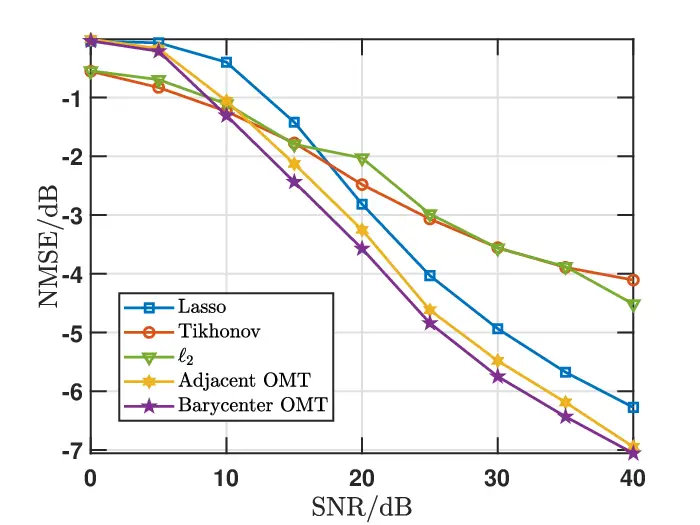
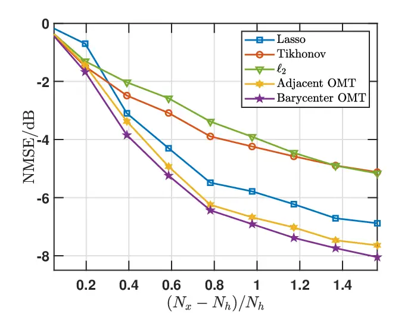
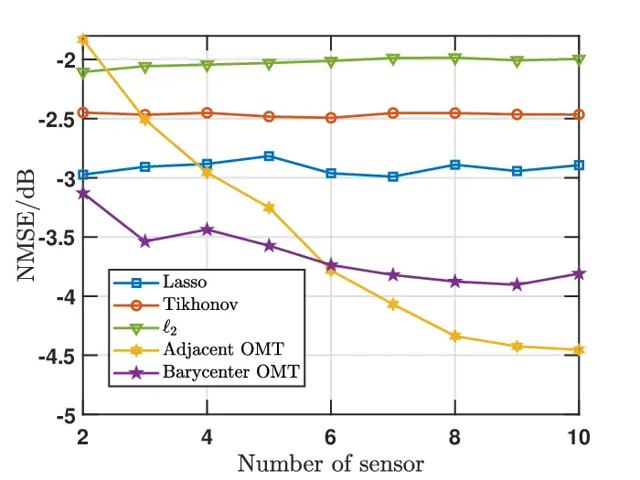
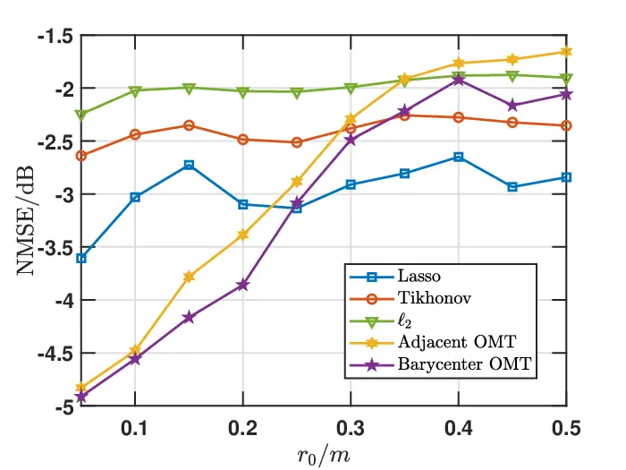

# Room Impulse Response Estimation through Optimal Mass Transport Barycenters Thanks: This research was supported in part by the Research Council of Finland (decision number 362787).Thanks: + Authors 1 and 2 have made equal contributions to this paper.

Rumeshika Pallewela⁺, Yuyang Liu⁺ and Filip Elvander Affiliation:  Dept.
of Information and Communications Engineering, Aalto University,
Finland  
Email: firstname.lastname@aalto.fi Affiliation: 

###### Abstract

In this work, we consider the problem of jointly estimating a set of
room impulse responses (RIRs) corresponding to closely spaced
microphones. The accurate estimation of RIRs is crucial in acoustic
applications such as speech enhancement, noise cancellation, and
auralization. However, real-world constraints such as short excitation
signals, low signal-to-noise ratios, and poor spectral excitation, often
render the estimation problem ill-posed. In this paper, we address these
challenges by means of optimal mass transport (OMT) regularization. In
particular, we propose to use an OMT barycenter, or generalized mean, as
a mechanism for information sharing between the microphones. This allows
us to quantify and exploit similarities in the delay-structures between
the different microphones without having to impose rigid assumptions on
the room acoustics. The resulting estimator is formulated in terms of
the solution to a convex optimization problem which can be implemented
using standard solvers. In numerical examples, we demonstrate the
potential of the proposed method in addressing otherwise ill-conditioned
estimation scenarios.

###### Index Terms: 

Room impulse response, acoustic signal processing, optimal mass
transport, barycenter.

## I Introduction

When modeling the acoustics of a room as a linear time-invariant system,
the room impulse response (RIR) describes the impact of the acoustic
environment on a sound signal when emitted and received by a point
source and a point receiver. Having access to an accurate estimate of an
RIR is essential for applications such as noise cancellation \[1\],
speech enhancement \[2\], and auralization \[3\]. The conventional
approach to obtaining the RIR involves extensive measurements using a
compact device and a broadband excitation signal \[4\]. However, this
method is both time-consuming and costly, especially as the RIR is only
a point-to-point description of the acoustic environment. Alternatively,
one could envision estimating an RIR using ambient signals such as,
speech. Nevertheless, the accuracy of an RIR estimate, or even the
feasibility of obtaining an estimate, depends on the duration and
spectral characteristics of the excitation signal, as well as on the
presence of noise. In order to address this, various model-based
estimation methods have been proposed, often incorporating
regularization techniques aiming to capture assumed features of the RIR.
These include methods building on Tikhonov regularization, which can be
understood as a Bayesian estimation technique \[5, 6\], as well as
sparsity-based methods originating from the compressed sensing framework
(see, e.g., \[7, 8, 9, 10, 11\]). There are also works on using low-rank
structures for modeling and estimating RIRs, motivated by steady-state
descriptions of room modes \[12, 13\] and spatio-temporal correlation
 \[14\].

In this work, we explore a different type of prior assumption on the
structure of RIRs, namely that RIRs corresponding to closely-spaced
sensors should be similar. This similarity, if it can be well-defined
and quantified, can then be used to jointly estimate the set of RIRs
corresponding to, e.g., a microphone array. Herein, we propose to define
this similarity between RIRs based on the concept of optimal mass
transport (OMT). The problem of OMT \[15\] is concerned with how to best
morph, or transport, one distribution of mass as to become identical to
another. The resulting minimal cost of transport can then serve as a
measure of similarity between the two distributions. Recently, this idea
has been used for interpolating and estimating RIRs by considering an
RIR to be a (signed) distribution over delay-space \[16, 17\] or a
distribution over 3D space for the case of spatial RIRs \[18\].
In \[17\], an OMT regularizer was used for incorporating an approximate
knowledge of the room geometry when inferring the RIR, whereas
in \[16\], the work considered estimating the RIR of a source moving on
a smooth trajectory.

Herein, we build on the later approach and propose a method for jointly
estimating a set of RIRs corresponding to a microphone array. Under the
assumption that the delay path from the source to a microphone varies
smoothly under perturbations of the microphone location, we propose to
express this assumed similarity in terms of an OMT distance and to
exploit this in estimation by constructing an OMT barycenter. The
barycenter can be understood as a generalized mean in the corresponding
OMT distance and serves as a mechanism for regularization and
information sharing between the different RIRs. Numerical simulations
demonstrate that the proposed OMT barycenter method generally
outperforms alternative estimation techniques, showcasing its robustness
even under challenging conditions.

## II Signal model

Consider a scenario in which a known source signal $`x`$ impinges on a
set of $`K\in\mathbb{N}`$ microphones, yielding the observed signals

```math
\displaystyle y_{k}(n)=(x*h_{k})(n)+w_{k}(n), \tag{1}
```

for $`n=0,1,\ldots,N\in\mathbb{N}`$, and $`k=1,2,\ldots,K`$. Here,
$`h_{k}`$ denotes the RIR for the $`k`$th microphone, $`x*h_{k}`$
denotes the convolution of $`x`$ with $`h_{k}`$, and $`w_{k}`$ is an
additive noise. Herein, we will assume that the additive noise is
temporally and spatially white. For a more succinct notation, we will
throughout use the equivalent representation

```math
\displaystyle\mathbf{y}_{k}=\mathbf{X}\mathbf{h}_{k}+\mathbf{w}_{k},\;k=1,\ldots,K, \tag{2}
```

where $`\mathbf{y}_{k}`$, $`\mathbf{h}_{k}`$, and $`\mathbf{w}_{k}`$ are
the vector representations of $`y_{k}`$, $`h_{k}`$, and $`w_{k}`$,
respectively, and $`\mathbf{X}`$ is the matrix representation of the
convolution with $`x`$.

Since we know the source signal $`x`$ and can measure its outputs
$`\mathbf{y}_{k}`$ at each microphone, we want to recover how the room
transforms $`x`$ on its way to each sensor. That is given by the RIRs
$`\mathbf{h}_{k}`$, where the system follows a linear model with
$`\mathbf{h}_{k}`$ as the unknown to be estimated.

However, even if $`\mathbf{X}`$ is full rank, estimating a _single_ RIR
via standard methods can still be poorly conditioned when the source
signal lacks sufficient spectral excitation, especially in narrowband
scenarios like speech, rendering the estimation highly sensitive to
measurement noise. In such cases, using a _set_ of these RIRs (e.g.,
measured under different positions or signals) can broaden the effective
frequency coverage and thus yielding more robust estimates of
$`\mathbf{h}_{k}`$.

Moreover, from a time domain perspective, a measured RIR often exhibits
distinct peaks corresponding to the direct path and the reflections from
wall bounds and obstacles in the room, which are spaced according to
their respective time delays. Accurately capturing these peaks is
essential for acoustic measurements and for physically motivated models
of the room response. One common model to simulate these time-domain
reflection paths is the image source model (ISM). It is used to
represent the geometrical acoustics (GA) principles \[19\] and RIR
$`\mathbf{h}`$, which can be denoted as a delay-magnitude pair based on
ISM as follows.

```math
\mathbf{h}=\{({\tau_{m},p_{m}})\in\mathbb{R}\mathrm{x}\mathbb{R}\}, \tag{3}
```

where $`\tau_{m}`$ denotes the delay related to the $`m`$th image source
represented by $`|\Delta\mathbf{d|}/c`$ with $`|\Delta\mathbf{d|}`$
denoting the distance between the image source and receiver. The
variable $`{p_{m}}`$ denotes the pressure contribution to the $`m`$th
filter tap of vector $`\mathbf{h}`$ and
$`p_{m}\propto\frac{1}{|\Delta\mathbf{d|}}`$.

The early part of $`\mathbf{h}`$ corresponds to the reflection from the
walls and it can be modeled as originating from an equivalent image
source position. In our work, the radius of the microphone array is
assumed to be much smaller than the dimensions of the room, causing the
sensors to be positioned closely together. Particularly, in this
situation, the delay amplitude pairs of the filter taps in RIRs remain
similar to each other, drifting only by small time shifts. Therefore,
their horizontal properties remain the same and we can expect the
positions of the taps of $`\mathbf{h}_{i}`$ to be similar to
$`\mathbf{h}_{i+1}`$. Structured around this assumption, we are able to
utilize the closely spaced sensors to get a good estimate for a set of
RIRs. In order to exploit this idea, we propose to utilize an important
mathematical concept, namely, OMT.

### II-A OMT and barycenter formulation

OMT is a mathematical framework that compares two mass
distributions \[20, 15, 21\]. More specifically, it determines the
optimal (least costly) way to transport one distribution to another.
This minimum cost defines a distance between the distributions, inducing
a geometric structure on the delay space of mass distributions.
Consequently, this geometric framework enables estimation \[22\],
interpolation \[23\], and the computation of generalized averages known
as barycenters within the delay space, providing a rigorous method for
comparing and combining mass distributions.

In our work, we are utilizing this framework to map each measured RIR
$`\mathbf{h}_{k}`$ of all the closely placed $`K`$ number of sensors in
the array to a virtual reference RIR $`\mathbf{h}_{0}`$. By defining a
minimum value for each distance using discrete Monge - Kantrovich OMT
problem, we can formulate the problem as follows,

```math
\displaystyle\operatorname{dOT}(\mathbf{h}_{0},\mathbf{h}_{k}) \displaystyle=\min_{\mathbf{M}_{k}\geq 0}\langle\mathbf{C},\mathbf{M}_{k}\rangle \tag{4}
```

```math
\displaystyle\text{s.t.}\quad\mathbf{M}_{k}\mathbf{1}_{N_{\mathbf{h}_{0}}}=\mathbf{h}_{0},\quad\mathbf{M}_{k}^{\top}\mathbf{1}_{N_{\mathbf{h}_{k}}}=\mathbf{h}_{k}.
```

Here,
$`\mathbf{M}_{k}\in\mathbb{R}_{+}^{N_{\mathbf{h}_{0}}\times N_{\mathbf{h}_{k}}}`$
is the transport matrix, which is specific to each of the measured RIR
$`\mathbf{h}_{k}`$ and represents how mass is optimally transported from
$`\mathbf{h}_{k}`$ to $`\mathbf{h}_{0}`$. To hold the non-negative
constraint of transport mass, both $`\mathbf{h}_{k}`$ and
$`\mathbf{h}_{0}`$ must also be non-negative and should have an equal
total mass ($`||\mathbf{h}_{k}||_{1}=||\mathbf{h}_{0}||_{1}`$).

$`\mathbf{C}\in\mathbb{R}^{N_{\mathbf{h}_{0}}\times N_{\mathbf{h}_{k}}}`$
represents the cost matrix and the elements of cost matrix
$`\mathbf{C}_{i,j}`$ is chosen to be
$`[\mathbf{C}]_{i,j}=|\tau_{i}-\tau_{j}|^{2}`$, where the $`i`$ and
$`j`$ denote the tap indices along the sampled time axis of
$`\mathbf{h}_{0}`$ and $`\mathbf{h}_{k}`$, respectively. According to
the OMT principles discussed previously, if the peaks of the measured
RIRs originate from the same image sources, they are expected to be
closely aligned in time and have similar magnitudes which are based on
their respective geometrical distances. In this paper, we aim to utilize
one of the key concepts of geomatrical structure induced by delay space,
called _barycenter_ in order to exploit the similarity between sensors
located in near proximity.

Barycenter ($`\mathbf{h}_{0}`$) is used to represent the center of
several mass distributions ($`\mathbf{h}_{k}`$ where $`k=1,2,...K`$) and
in our work, the OMT barycenter minimizes the sum of the transport
distances of measured RIRs to $`\mathbf{h_{0}}`$,
$`\operatorname{dOT}(\mathbf{h}_{0},\mathbf{h}_{k})`$, leading us to an
optimum value of $`\mathbf{h_{0}}`$ which satisfy all constraints. This
can be formulated as follows,

```math
\mathbf{h}_{0}=\operatorname*{argmin}_{\mathbf{h}\geq 0}\;\sum_{k=1}^{K}\operatorname{dOT}\bigl(\mathbf{h},\mathbf{h}_{k}\bigr). \tag{5}
```

Furthermore, as the equation (5) is considered convex, it is logically
consistent to be utilized for the regularization of the estimation
problem described in Section III.

## III Proposed method

In this section, we proceed to introduce the RIR estimation problem for
an array of close proximity sensors. Considering the standard estimation
method, least squares (LS) approach, the impulse response
$`\mathbf{\hat{h}}_{k}`$ which minimizes the squared error for the
signal in (2) can be obtained as follows,

```math
\mathbf{\hat{h}}_{k}=\operatorname*{argmin}_{\mathbf{h}_{k}}\|\mathbf{y}_{k}-\mathbf{X}\mathbf{h}_{k}\|_{2}^{2}. \tag{6}
```

If the noise $`w_{k}(n)`$ is white Gaussian noise (WGN) with zero mean
and variance $`\sigma_{w}^{2}`$, then minimizing the LS criterion is
equivalent to obtaining the maximum likelihood estimate of the observed
signal $`\mathbf{y}_{k}`$. Based on this, the LS problem is commonly
defined in the literature as follows,

```math
\operatorname*{minimize}_{\mathbf{h}_{k}}\|\mathbf{y}_{k}-\mathbf{X}\mathbf{h}_{k}\|_{2}^{2}. \tag{7}
```

When the length of signal is too short or the spectral excitation is too
low, the signal becomes poorly conditioned as explained in Section II.
In order to obtain a unique solution for problems of this sort, we use a
regularization term. Lasso ($`\ell_{1}`$) and Tikhonov ($`\ell_{2}`$)
regularization are commonly used techniques that stabilize the solution
by penalizing large amplitudes. Nevertheless, while these methods
provide well-defined solutions, they do not account for structural
similarities in delay times across measurement points, such as the
$`\tau_{m}`$ in the previously mentioned delay-magnitude pairs.

However, as discussed in Section II-A, OMT is able to overcome these
limitations by exploiting the intrinsic structure of the signal ,
preserving the geometrical relationship between nearby sensors and
imposing a smooth delay structure. We intend to exploit this advantage
by proposing a regularization term that penalizes the OMT distance
between a small group of closely positioned sensors and their shared
barycenter. The barycenter serves as a _virtual RIR_ reference that is
similar to all the measured RIRs in the microphone array. We determine
this by minimizing the collective OMT distance from each measured RIR to
the barycenter, ensuring a representative and geometrically consistent
reference. Furthermore, this method allows for greater ambiguity in
source and receiver positions, making it a robust and more generalized
regularization framework.

Building on the discussion and utilizing information in section II, the
barycenter OMT regularization can be formulated as follows,

```math
\operatorname*{minimize}_{\mathbf{h}_{k},\mathbf{h}_{0}}\quad\sum_{k=1}^{K}\|\mathbf{y}_{k}-\mathbf{X}\mathbf{h}_{k}\|_{2}^{2}+\lambda\operatorname{dOT}\bigl(\mathbf{h}_{0},\mathbf{h}_{k}\bigr). \tag{8}
```

Moreover, it should be noticed that, the OMT is able to naturally
interpolate missing information using the calculated OMT distance.
Consequently, this method can be robustly applied even when dealing with
small sample sizes.

### III-A Interpretation of RIRs in a real environment

In our research, we aim to model the acoustic environment as
realistically as possible. However, a limitation of the regularization
measure discussed in Section II-A is that, as indicated by equation (4),
it is only defined for non-negative RIRs and non-negative transport
plans $`\mathbf{M}_{k}`$ where $`k=1,\ldots,K`$. To address this
limitation and to more accurately model real environmental conditions,
where both positive and negative peaks appear in RIRs due to wall
absorption and distortion, we adopt the method proposed in \[16\]. This
approach decomposes the RIR into its positive and negative components,
modeling their difference as follows,

```math
\mathbf{h}_{k}=\mathbf{h}_{k}^{+}-\mathbf{h}_{k}^{-},\quad\mathbf{h}_{k}^{+}\in\mathbb{R}_{+}^{N_{\mathbf{h}}},\quad\mathbf{h}_{k}^{-}\in\mathbb{R}_{+}^{N_{\mathbf{h}}}. \tag{9}
```

We can then utilize equation (9) to formulate a generalized OT distance
between two sensors as,

```math
\widehat{\operatorname{dOT}}(\mathbf{h}_{1},\mathbf{h}_{2})=\operatorname{dOT}\bigl(\mathbf{h}_{1}^{+},\mathbf{h}_{2}^{+}\bigr)+\operatorname{dOT}\bigl(\mathbf{h}_{1}^{-},\mathbf{h}_{2}^{-}\bigr). \tag{10}
```

Therefore our proposed barycenter OMT regularized estimator can be
reformulated based on equation (10) , to include both positive and
negative RIRs. This formulation is given by the following equation,

```math
\operatorname*{minimize}_{\mathbf{h}_{k},\mathbf{h}_{0}}\quad\sum_{k=1}^{K}\|\mathbf{y}_{k}-\mathbf{X}\mathbf{h}_{k}\|_{2}^{2}+\lambda\operatorname{\widehat{dOT}}\bigl(\mathbf{h}_{0},\mathbf{h}_{k}\bigr). \tag{11}
```

It is worth noting that the problem in equation (11) is a convex problem
with respect to $`\mathbf{h_{0}}`$ and when negative amplitudes are
concerned in the transport plan, the OMT distances may have arbitrarily
scalable diagonal elements if the cost function is solely based on
$`|\tau_{j}-\tau_{\ell}|^{2}`$. In order to mitigate this issue, a small
constant $`\varepsilon`$ can be introduced into the cost function,
modifying it as
$`\mathbf{C}_{j,\ell}=|\tau_{j}-\tau_{\ell}|^{2}+\varepsilon`$. This
ensures that assigning mass along the diagonal is not completely free
but instead incurs a small cost.

## IV Numerical Experiments and results

In this section, we evaluate the proposed method in (11) for estimating
RIRs under different experimental setups. The simulated acoustic
environment is a rectangular room with dimensions
$`[L_{x},L_{y},L_{z}]=5\times 4\times 6`$ m. A human voice uttering the
sustained vowel \\a\serves as the source signal, and a circular
microphone array is used for measurements. RIRs are generated using the
ISM \[24\], with a sampling frequency of $`f_{s}=7350`$ Hz, a
reverberation time of $`\textit{RT}_{60}=0.5s`$, and a maximum
reflection order of 4. The length of the RIRs are all $`N_{h}=256`$. The
source is positioned at \[$`2`$, $`3.5`$, $`2`$\] m, while the center of
the microphone array is at \[$`2`$, $`1.5`$, $`2`$\] m.

The proposed method (referred to as ”Barycenter OMT” in the figures) is
evaluated by varying the parameters of the experimental setup. In
particular, we vary the signal-to-noise ratio (SNR), the length
$`N_{x}`$ of the excitation signal, the number of microphones in the
microphone array, and the radius $`r_{0}`$ of the microphone array. The
default values (i.e., when not varied) of the parameters are SNR = 20
dB, $`N_{x}=356`$, $`K=5`$ microphones, and $`r_{0}=0.2`$ meters. For
the different parameter settings, we evaluate the normalized mean square
error (NMSE) of the estimated RIRs, defined as

```math
\text{NMSE}=\frac{1}{K}\sum_{k=1}^{K}\frac{||\mathbf{h}_{k}-\hat{\mathbf{h}}_{k}||_{2}^{2}}{|\mathbf{h}_{k}||_{2}^{2}}, \tag{12}
```

where $`\hat{\mathbf{h}}_{k}`$, $`k=1,\ldots,K`$, which represent the
estimated RIRs. The results are averaged over 20 simulations for each
setting. As reference methods, we have included the Tikhonov and Lasso
estimators as well as an $`\ell_{2}`$-analog of our proposed method. The
latter uses an $`\ell_{2}`$-barycenter (i.e., a standard average or
mean) as a regularizer and solves

```math
\underset{\begin{subarray}{c}\mathbf{h}_{k}\end{subarray}}{\mathrm{minimize}}\;\sum_{k=1}^{K}\Bigl\|\mathbf{y}_{k}-\mathbf{X}\mathbf{h}_{k}\Bigr\|_{2}^{2}+\lambda\Bigl\|\mathbf{h}_{k}-\mathbf{h}_{\ell_{2}}\Bigr\|_{2}^{2}+\mu\Bigl\|\mathbf{h}_{k}\Bigr\|_{2}^{2}, \tag{13}
```

where we use the short-hand
$`\mathbf{h}_{\ell_{2}}=\frac{1}{K}\sum_{k=1}^{K}\mathbf{h}_{k}`$. It
may be noted that we have included a small Tikhonov-type term for this
reference as it may be verified that the problem is otherwise
ill-conditioned when $`\mathbf{X}`$ is ill-conditioned. We refer to this
method as ”$`\ell_{2}`$” in the results. Also, as a reference, we
include an array version of the method from \[16\], which penalizes the
OMT distance between the RIRs of adjacent microphones clockwise around
the microphone array. This reference is indicated ”Adjacent OMT” in the
graphs, which solves

```math
\underset{\mathbf{h}_{k}}{\mathrm{minimize}}\quad\sum_{k=1}^{K}\|\mathbf{y}_{k}-\mathbf{X}\mathbf{h}_{k}\|_{2}^{2}+\lambda\sum_{\ell=2}^{K}\operatorname{\widehat{dOT}}\bigl(\mathbf{h}_{\ell},\mathbf{h}_{\ell-1}\bigr). \tag{14}
```

For all methods, the values of their respective regularization
parameters are set by cross-validation.



(a)

Fig. 1: Simulated estimation error NMSE for different regularization
methods as a function of the SNR.



(a)

Fig. 2: Simulated estimation error NMSE for different regularization
methods as a function of the $`(N_{x}-N_{h})/N_{h}`$.

Figures 1 and 2 present the NMSE (in dB) for varying SNR and excitation
signal length $`N_{x}`$, respectively. Note in Figure 2, the x-axis is
the ratio $`(N_{x}-N_{h})/N_{h}`$. As observed, the proposed method
performs better than the comparison methods, although Lasso and the
Adjacent OMT offers similar performance. However, when varying the
number of microphones in the array and the array’s radius, we see a
remarkable difference between the OMT-based methods and the other three
references. These results can be seen in Figures 3 and 4, respectively.
The results from figure 3 indicate that the performance of the non-OMT
references are independent of the number of microphones. This is
expected for the Lasso and Tikhonov estimators, as they do not account
for information sharing between microphones when estimating the RIRs.
The $`\ell_{2}`$ also doesn’t benefit from an increasing number of
microphones, as it is built on Euclidean geometry that is not designed
to offer a good description of variation of RIRs across the array. On
the other hand, the OMT-based methods, i.e., both the proposed estimator
and reference, are able to exploit the information provided by an
increasing number of sensors. This observation is even more pronounced
in figure 4. Here, as the radius of the array shrinks, i.e., as the
microphones become closer to each other, the error for the OMT-based
methods decrease. This is due to the fact that as the microphones become
more closely spaced, their corresponding RIRs become more similar in the
OMT sense. Conversely, if the array radius becomes too large, the
performance of the OMT-based methods drop.



(a)

Fig. 3: Simulated averaged estimation error NMSE for different
regularization methods as a function of the number of sensors.



(a)

Fig. 4: Simulated averaged estimation error NMSE for different
regularization methods as a function of the radius of microphone array
$`r_{0}`$.

## V Conclusion

This paper introduces a barycenter-based OMT regularization method for
estimating RIRs when the excitation signal is poorly informed. Unlike
conventional approaches that independently regularize each RIR or only
consider pairwise adjacent RIRs, the proposed technique couples all
sensor RIRs through a common virtual barycenter, effectively capturing
similar delay structures in spatially proximate receivers, enhancing
robustness in small measurement areas with limited sensors. Numerical
experiments confirm that the method outperforms baseline estimators and
surpasses adjacent sensor OMT in scenarios with low sensor counts.
Future work will focus on adaptive barycenter modeling to interpolate
RIRs, incorporating physically informed cost functions.

## References

- \[1\] S. Kuo and D. Morgan, “Active noise control: a tutorial review,”
  Proceedings of the IEEE, vol. 87, no. 6, pp. 943–973, 1999.
- \[2\] E. Vincent, T. Virtanen, and S. Gannot, Audio source separation
  and speech enhancement. John Wiley & Sons, 2018.
- \[3\] B.-I. D. Mendel Kleiner and P. Svensson, “Auralization-an
  overview,” Journal of the Audio Engineering Society, vol. 41,
  pp. 861–875, november 1993.
- \[4\] S. Koyama, T. Nishida, K. Kimura, T. Abe, N. Ueno, and
  J. Brunnström, “Meshrir: A dataset of room impulse responses on meshed
  grid points for evaluating sound field analysis and synthesis
  methods,” in 2021 IEEE workshop on applications of signal processing
  to audio and acoustics (WASPAA), pp. 1–5, IEEE, 2021.
- \[5\] D. Calvetti, S. Morigi, L. Reichel, and F. Sgallari, “Tikhonov
  regularization and the l-curve for large discrete ill-posed problems,”
  Journal of computational and applied mathematics, vol. 123, no. 1-2,
  pp. 423–446, 2000.
- \[6\] T. van Waterschoot, G. Rombouts, and M. Moonen, “Optimally
  regularized adaptive filtering algorithms for room acoustic signal
  enhancement,” Signal Processing, vol. 88, no. 3, pp. 594–611, 2008.
- \[7\] N. Antonello, E. De Sena, M. Moonen, P. A. Naylor, and
  T. Van Waterschoot, “Room impulse response interpolation using a
  sparse spatio-temporal representation of the sound field,” IEEE/ACM
  Transactions on Audio, Speech, and Language Processing, vol. 25,
  no. 10, pp. 1929–1941, 2017.
- \[8\] M. Crocco and A. Del Bue, “Room impulse response estimation by
  iterative weighted l 1-norm,” in 2015 23rd European Signal Processing
  Conference (EUSIPCO), pp. 1895–1899, IEEE, 2015.
- \[9\] R. Mignot, G. Chardon, and L. Daudet, “Low frequency
  interpolation of room impulse responses using compressed sensing,”
  IEEE/ACM Transactions on Audio, Speech, and Language Processing,
  vol. 22, no. 1, pp. 205–216, 2013.
- \[10\] R. Mignot, L. Daudet, and F. Ollivier, “Room reverberation
  reconstruction: Interpolation of the early part using compressed
  sensing,” IEEE Transactions on Audio, Speech, and Language Processing,
  vol. 21, no. 11, pp. 2301–2312, 2013.
- \[11\] S. A. Verburg and E. Fernandez-Grande, “Reconstruction of the
  sound field in a room using compressive sensing,” The Journal of the
  Acoustical Society of America, vol. 143, no. 6, pp. 3770–3779, 2018.
- \[12\] M. Jälmby, F. Elvander, and T. v. Waterschoot, “Low-rank room
  impulse response estimation,” IEEE/ACM Transactions on Audio, Speech,
  and Language Processing, vol. 31, pp. 957–969, 2023.
- \[13\] M. Jälmby, F. Elvander, and T. van Waterschoot, “Low-rank
  tensor modeling of room impulse responses,” in 2021 29th European
  Signal Processing Conference (EUSIPCO), pp. 111–115, 2021.
- \[14\] C. Paleologu, J. Benesty, and S. Ciochină, “Linear system
  identification based on a kronecker product decomposition,” IEEE/ACM
  Transactions on Audio, Speech, and Language Processing, vol. 26,
  no. 10, pp. 1793–1808, 2018.
- \[15\] C. Villani, Optimal Transport: Old and New, vol. 338 of
  Grundlehren der mathematischen Wissenschaften. Berlin, Heidelberg:
  Springer, 2009.
- \[16\] D. Sundström, F. Elvander, and A. Jakobsson, “Estimation of
  impulse responses for a moving source using optimal transport
  regularization,” in ICASSP 2024 - 2024 IEEE International Conference
  on Acoustics, Speech and Signal Processing (ICASSP),
  pp. 921–925, 2024.
- \[17\] D. Sundström, A. Björkman, A. Jakobsson, and F. Elvander, “Room
  impulse response estimation using optimal transport:
  Simulation-informed inference,” in 2024 32nd European Signal
  Processing Conference (EUSIPCO), pp. 276–280, 2024.
- \[18\] A. Geldert, N. Meyer-Kahlen, and S. J. Schlecht, “Interpolation
  of spatial room impulse responses using partial optimal transport,” in
  ICASSP 2023-2023 IEEE International Conference on Acoustics, Speech
  and Signal Processing (ICASSP), pp. 1–5, IEEE, 2023.
- \[19\] J. Allen and D. Berkley, “Image method for efficiently
  simulating small-room acoustics,” The Journal of the Acoustical
  Society of America, vol. 65, pp. 943–950, 04 1979.
- \[20\] G. Peyré, M. Cuturi, et al., “Computational optimal transport:
  With applications to data science,” Foundations and Trends® in Machine
  Learning, vol. 11, no. 5-6, pp. 355–607, 2019.
- \[21\] F. Elvander, I. Haasler, A. Jakobsson, and J. Karlsson,
  “Non-coherent sensor fusion via entropy regularized optimal mass
  transport,” in ICASSP 2019 - 2019 IEEE International Conference on
  Acoustics, Speech and Signal Processing (ICASSP), pp. 4415–4419, 2019.
- \[22\] F. Elvander, “Estimating inharmonic signals with optimal
  transport priors,” in ICASSP 2023 - 2023 IEEE International Conference
  on Acoustics, Speech and Signal Processing (ICASSP), pp. 1–5, 2023.
- \[23\] F. Elvander, A. Jakobsson, and J. Karlsson, “Interpolation and
  extrapolation of toeplitz matrices via optimal mass transport,” IEEE
  Transactions on Signal Processing, vol. 66, no. 20,
  pp. 5285–5298, 2018.
- \[24\] E. A. Habets, “Room impulse response generator,” Technische
  Universiteit Eindhoven, Tech. Rep, vol. 2, no. 2.4, p. 1, 2006.
