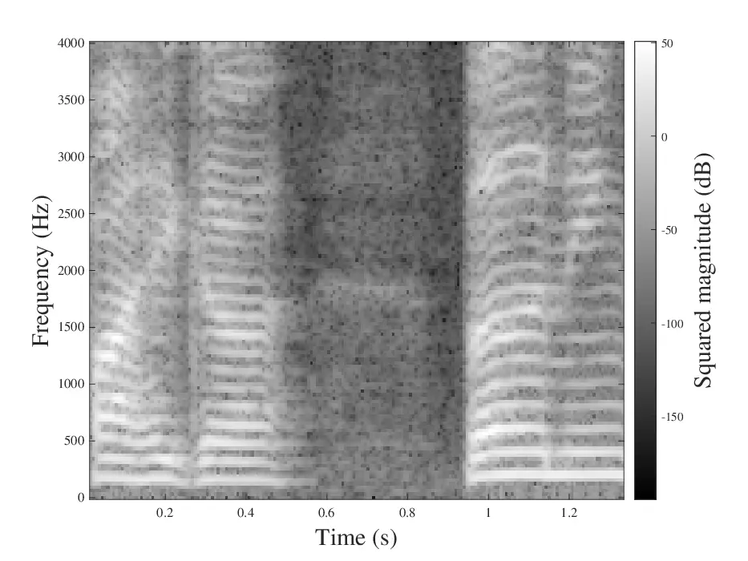
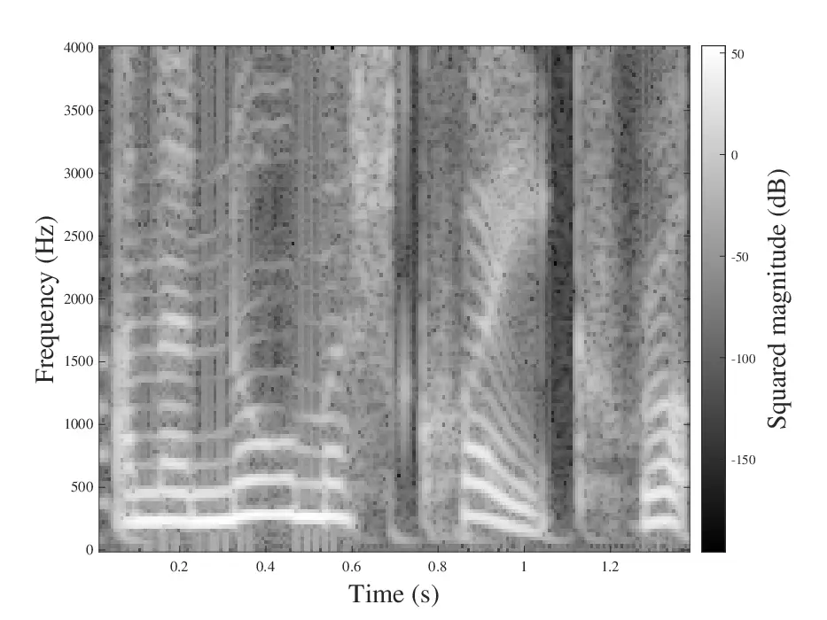
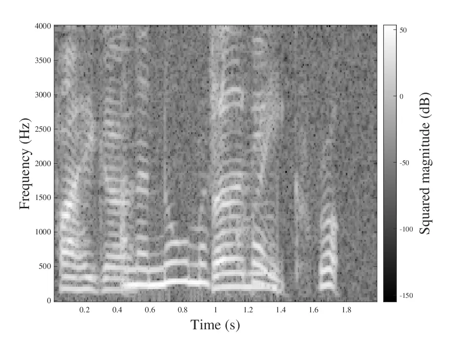
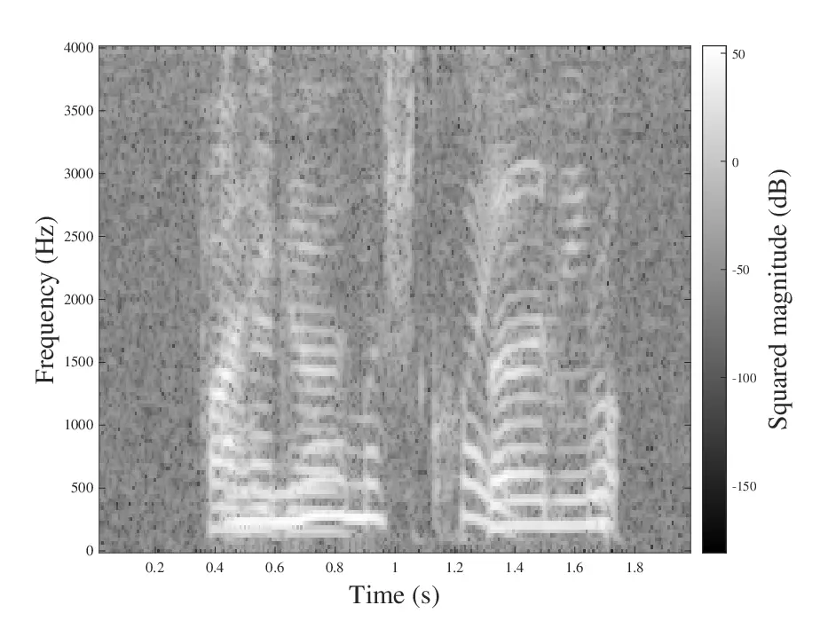
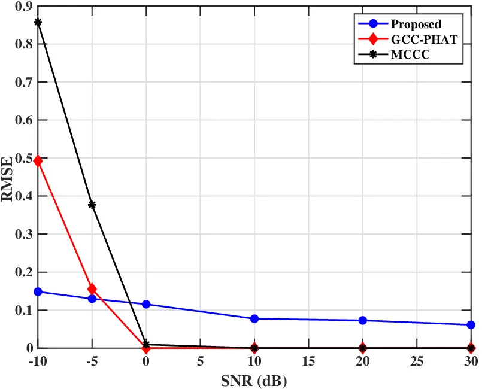
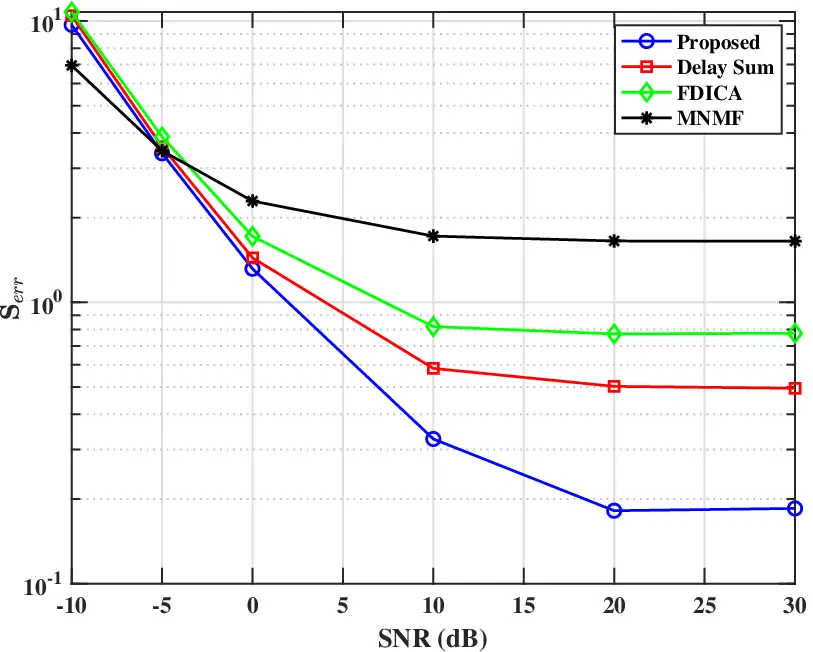
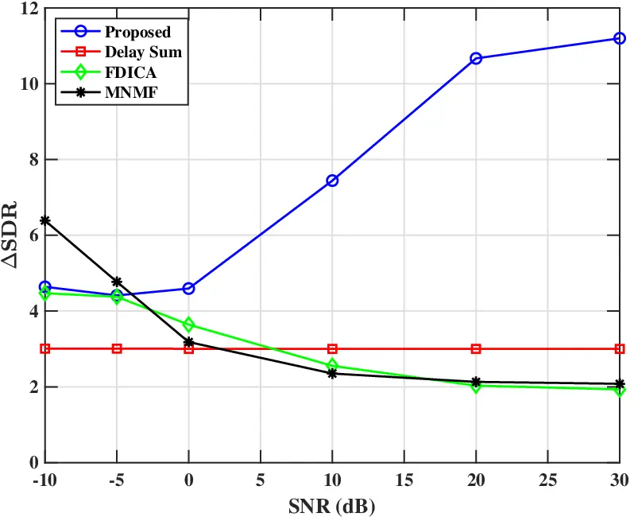

# Joint Spectrogram Separation and TDOA Estimation using Optimal Transport Thanks: This work is supported by the Finnish Doctoral Program Network in Artificial Intelligence (AI-DOC), grant ID: VN/3137/2024-OKM-6.

Linda Fabiani¹, Sebastian J. Schlecht², Isabel Haasler³, Filip Elvander¹
Affiliation:  Affiliation: ¹Dept. of Information and Communications
Engineering, Aalto University, Finland Affiliation: ²Dept. of Electrical
and Computer Engineering, Friedrich-Alexander-Universität
Erlangen-Nürnberg, Germany Affiliation:  Affiliation: ³Dept. of
Information Technology, Uppsala University, Sweden Affiliation: 

###### Abstract

Separating sources is a common challenge in applications such as speech
enhancement and telecommunications, where distinguishing between
overlapping sounds helps reduce interference and improve signal quality.
Additionally, in multichannel systems, correct calibration and
synchronization are essential to separate and locate source signals
accurately. This work introduces a method for blind source separation
and estimation of the Time Difference of Arrival (TDOA) of signals in
the time-frequency domain. Our proposed method effectively separates
signal mixtures into their original source spectrograms while
simultaneously estimating the relative delays between receivers, using
Optimal Transport (OT) theory. By exploiting the structure of the OT
problem, we combine the separation and delay estimation processes into a
unified framework, optimizing the system through a block coordinate
descent algorithm. We analyze the performance of the OT-based estimator
under various noise conditions and compare it with conventional TDOA and
source separation methods. Numerical simulation results demonstrate that
our proposed approach can achieve a significant level of accuracy across
diverse noise scenarios for physical speech signals in both TDOA and
source separation tasks.

###### Index Terms: 

Optimal transport, Time Difference Of Arrival, Blind Source Separation,
spectrogram

## I Introduction

Source separation is a fundamental task used in signal processing,
present in many applications such as speech enhancement, noise reduction
and telecommunications. However, de-mixing spectral signals in
real-world scenarios becomes challenging due to reverberation and
background noise interference, especially without direct access to the
source signals. This absence of ground truth references adds
uncertainty, requiring the system to rely on statistical and spatial
cues to effectively distinguish and extract individual sources. To
address this problem, various Blind Source Separation (BSS) methods have
been developed \[1\], including Independent Component Analysis (ICA)
\[2\] and Non-Negative Matrix Factorization (NMF) \[3, 4\], as well as
recent deep learning-based techniques trained on specific data for
improved performance \[5, 6\]. Despite their wide usage, these methods
can struggle in noisy acoustic environments, or when sources are not
instantaneous. Indeed, in multichannel systems, where sensors receive
mixtures of signals with varying propagation paths, a fundamental
challenge lies in accurately finding the time delays between signals
arriving at different locations. For example, Figure 1 shows two source
signals and their corresponding mixtures, illustrating how the two
speech signals arrive at the two receivers at different times. For this,
Time Difference of Arrival (TDOA) estimation plays a crucial role in
improving separation, particularly in microphone arrays and spatial
filtering applications \[7, 8\]. Traditional cross-correlation methods,
such as Generalized Cross-Correlation (GCC) and Generalized
Cross-Correlation with Phase Transform (GCC-PHAT) \[9\], are commonly
used for delay estimation, even though they also suffer from reduced
accuracy in adverse noise conditions \[7, 10\].



(a)



(b)



(c)



(d)

Fig. 1: Illustration of source power spectrograms and their
corresponding mixtures observed at two receivers. Top: Original female
(a) and (b) male speech source signal. Bottom: Observed mixtures at
receiver 1 (c) and receiver 2 (d), with distinct propagation delays. The
receiver signals include delayed versions of the original source signals
and have been zero-padded to a uniform duration of 2 seconds.

In this work, we introduce a novel approach to multichannel blind source
separation of time-frequency distributions, using the theory of optimal
transport (OT) (see, e.g. \[11\]). OT is a mathematical concept that
allows for comparing distributions of mass and has found use in fields
including signal processing \[12, 13\] and control \[14, 15\].

Recently, the work \[16\] has introduced an OT framework for identifying
and separating ensembles based on population-level observations and for
estimating the dynamics governing these ensembles. In this paper, we
cast the BSS problem within this framework, letting the ensembles and
dynamics correspond to the (unknown) source signal spectra and
inter-microphone time delays, respectively. In particular, by exploiting
the temporal delay information between the channels, we formulate an
optimal transport problem, where each source is associated with a
distinct transport plan that governs the separation of the spectral
components. We utilize a block-coordinate descent algorithm that
iteratively updates the optimized variables to compute our estimator. As
a potential application of our framework, we provide an example of
reconstruction of the source signals in the time domain, processing the
estimated spectrograms via multichannel Wiener filtering. We demonstrate
the robustness of the proposed method in the case of diverse sensor
noise and compare it with commonly used methods for TDOA estimation and
source separation.

## II Signal Model

Consider a system with $`K\in\mathbb{N}`$ acoustic sources impinging on
$`L\in\mathbb{N}`$ microphones. The spatial locations of the sources as
well as the source signals are unknown. Let $`S_{k}(f,t)`$ and
$`R_{\ell}(f,t)`$ denote the short-time Fourier transform (STFT)
representations of the $`k`$th source signal and $`\ell`$th microphone
signal, respectively, where $`f`$ and $`t`$ are the frequency and time
index of a time-frequency bin. Then, using the first microphone as
reference, each microphone signal can be written as¹¹ 1 To simplify the
exposition, we here assume that differences in signal attenuation
between microphones are small, corresponding to the microphones being
closely spaced.

```math
\displaystyle R_{\ell}(f,t)=\sum_{k=1}^{K}S_{k}(f,t-\tau_{k}^{(\ell)})+W_{\ell}(f,t), \tag{1}
```

where $`\tau_{k}^{(\ell)}`$ denotes the delay of the $`k`$th source to
the $`\ell`$th receiver relative to the reference microphone. That is,
$`\tau_{k}^{(\ell)}`$ is the TDOA of the $`k`$th source for the
microphone pair with indices $`(1,\ell)`$. Note that
$`\tau_{k}^{(1)}=0`$, $`k=1,\ldots,K`$. Furthermore, $`W_{\ell}(t)`$
denotes the STFT of the sensor noise, which we herein assume to be
well-modelled as spatially and temporally white Gaussian noise with
variance $`\sigma^{2}`$. Herein, we aim to separate the different signal
sources and estimate their TDOAs based on spectral representations. To
that end, let $`\mathbf{R}^{(\ell)}\in\mathbb{R}_{+}^{T\times F}`$ be
the spectrogram of the sensor signal in (1), defined as the squared
magnitude of the STFT, represented as a matrix, i.e.,
$`[\mathbf{R}^{(\ell)}]_{t,f}=\left|R_{\ell}(f,t)\right|^{2}`$ where
$`T`$ and $`F`$ are the number of time and frequency bins, respectively.
Correspondingly, let
$`\mathbf{S}_{k}^{(\ell)}\in\mathbb{R}_{+}^{T\times F}`$ be the
spectrogram of the $`k`$th source in the $`\ell`$th microphone, and let
$`\mathbf{W}_{k}^{(\ell)}`$ be the spectrogram of the sensor noise. Note
here that $`\mathbf{S}_{k}^{(\ell)}`$ can be obtained from
$`\mathbf{S}_{k}^{(1)}`$ by shifting its rows in accordance with
$`\tau_{k}^{(\ell)}`$. Lastly, assuming that the different source
signals are statistically independent, we approximate the microphone
spectrograms $`\mathbf{R}^{(\ell)}`$ as additive mixtures of the source
spectrograms²² 2 In our experiments, we observe that our proposed method
performs well despite this approximation. \[17, 18\]:

```math
\displaystyle\mathbf{R}^{(\ell)}\approx\sum_{k=1}^{K}\mathbf{S}_{k}^{(\ell)}+\mathbf{W}^{(\ell)}. \tag{2}
```

With this, our aim is to estimate the source spectrograms³³ 3 Without
loss of generality, we define the source spectrogram for source $`k`$ as
$`\mathbf{S}_{k}^{(1)}`$, i.e., as it would appear in the reference
microphone in noise-free single-source settings.
$`\mathbf{S}_{k}^{(1)}`$ and TDOAs $`\tau_{k}^{(\ell)}`$ given only the
microphone spectrograms $`\mathbf{R}^{(\ell)}`$. In particular, we
propose to view the spectrograms as mass distributions on the
time-frequency plane, allowing us to cast the problem in the framework
of optimal transport.

## III Optimal Transport

Consider two discrete distributions, represented with vectors
$`\mathbf{a}\in\mathbb{R}^{N}`$ and $`\mathbf{b}\in\mathbb{R}^{N}`$ for
some $`N\in\mathbb{N}`$. The (discrete) Monge-Kantorovich problem of OT
is

```math
\displaystyle\underset{\mathbf{M}\in\mathbb{R}_{+}^{N\times N}}{\mathrm{minimize}} \displaystyle\langle\mathbf{C},\mathbf{M}\rangle \tag{3}
```

```math
\displaystyle\text{s.t. } \displaystyle\mathbf{M}\mathbf{1}_{N}=\mathbf{a}\;,\;\mathbf{M}^{T}\mathbf{1}_{N}=\mathbf{b}.
```

Here, $`\mathbf{C}\in\mathbb{R}_{+}^{N\times N}`$ is the cost matrix,
where each entry $`[\mathbf{C}]_{ij}`$ represents the cost of
transporting a unit of mass from the $`i`$-th point in the source
distribution to the $`j`$-th point in the target distribution, and
$`\mathbf{1}_{N}\in\mathbb{R}^{N}`$ is a vector of ones. The matrix
$`\mathbf{M}`$ represents the transport plan, in which each element
$`[\mathbf{M}]_{ij}`$ describes how much mass is transported from one
distribution to another \[11, 19\]. Thus, the constraints in (3) impose
that the transport plan $`\mathbf{M}`$ transports the mass from
$`\mathbf{a}`$ to $`\mathbf{b}`$.

## IV Method Outline

Herein, we propose to jointly solve the blind source separation and TDOA
estimation tasks using an OT formulation building on the framework in
\[16\]. More precisely, based on estimates of the receiver’s
spectrograms $`\mathbf{R}^{(\ell)}`$ we identify the source spectrograms
$`\mathbf{S}_{k}^{(1)}`$ and the TDOAs $`\tau_{k}^{(\ell)}`$ in (2). Let
$`\mathbf{r}_{f}^{(\ell)}`$ and $`\mathbf{s}_{k,f}^{(\ell)}`$ denote the
$`f`$th column of the matrices $`\mathbf{R}^{(\ell)}`$ and
$`\mathbf{S}_{k}^{(\ell)}`$, respectively. We describe the distribution
shift due to the TDOA, that is, from $`\mathbf{s}_{k,f}^{(1)}`$ to
$`\mathbf{s}_{k,f}^{(\ell)}`$ by a transport plan
$`\mathbf{M}^{f,\ell}_{k}`$, for $`k=1,\dots,K`$, $`f=1,\dots,F`$, and
$`\ell=2,\dots,L`$. These transport plans are feasible if they satisfy
$`\mathbf{M}^{f,\ell}_{k}\mathbf{1}=\mathbf{s}_{k,f}^{(1)}`$ and
$`(\mathbf{M}^{f,\ell}_{k})^{T}\mathbf{1}=\mathbf{s}_{k,f}^{(\ell)}`$
for $`\ell=2,\dots,L`$. Given a TDOA $`\tau_{k}`$ we measure the
transportation cost of a transport plan $`\mathbf{M}^{f,\ell}_{k}`$ as
$`\langle\mathbf{C}(\tau_{k}^{(\ell)}),\mathbf{M}^{f,\ell}_{k}\rangle`$,
where

```math
\displaystyle\left[\mathbf{C}(\tau)\right]_{ij}=\left((t_{i}-t_{j})-\tau\right)^{2}. \tag{4}
```

Thus, our goal is to accurately separate the source spectrograms
$`\mathbf{S}^{(1)}_{k}`$ by exploiting the structure of the optimal
transport problem. Each source is associated with a distinct transport
plan $`\mathbf{M}_{k}^{f,\ell}`$, which enables the decomposition of the
total objective function into individual contributions for each source.
Since the true time delays are unknown, they must also be optimized
along with the transport plans. To sum up, we find the source
spectrograms and TDOAs by solving the optimal transport type problem

```math
\displaystyle\underset{\mathbf{M}^{f,\ell}_{k},\tau_{k}^{(\ell)},\mathbf{s}_{k,f}^{(\ell)}}{\mathrm{minimize}} \displaystyle\sum_{\ell=2}^{L}\sum_{k=1}^{K}\sum_{f=1}^{F}\langle\mathbf{C}(\tau_{k}^{(\ell)}),\mathbf{M}^{f,\ell}_{k}\rangle \tag{5}
```

```math
\displaystyle\text{subject to } \displaystyle\mathbf{M}^{f,\ell}_{k}\mathbf{1}=\mathbf{s}_{k,f}^{(1)},\ \text{for }\ell=2,\dots,L
```

```math
\displaystyle(\mathbf{M}^{f,\ell}_{k})^{T}\mathbf{1}=\mathbf{s}_{k,f}^{(\ell)},\ \text{for }\ell=2,\dots,L
```

```math
\displaystyle\sum_{k=1}^{K}\mathbf{s}_{k,f}^{(\ell)}=\mathbf{r}_{f}^{(\ell)},\quad\text{for }\ell=1,...,L
```

```math
\displaystyle\text{for }k=1,\dots,K,\ f=1,\dots,F.
```

The constraints in (5) enforce that the spectrogram mass of each source
is fully separated from the mixture and distributed in the relative
transport plan. Additionally, the third constraint imposes mass
conservation across the system, meaning that the sum of the estimated
source spectrograms at each sensor must exactly match that of the sensor
spectrograms. In the noise-free case, it may be noted that if the TDOAs
in (5) are selected as the ground truth values, then the objective value
can be set to zero by transport plans that separate the sources. For a
discussion on this, see \[16, Section II.B\].

The optimization problem in (5) is bi-convex. For fixed time-delays it
is linear in the transport plans and source spectra, and due to the
choice of (4), the program is convex in the time-delays for fixed
transport plans and source spectra. To solve (5), we employ a
block-coordinate descent algorithm, alternating between minimizing (5)
with respect to the set of transport plans and source spectrograms, and
with respect to the time-delays $`\tau_{k}^{(\ell)}`$. It may be noted
that, due to (4), the minimization with respect to the
$`\tau_{k}^{(\ell)}`$ corresponds to solving an unconstrained quadratic
program, which can be done analytically. The procedure is summarized in
Algorithm 1. Furthermore, we note that the problem in (5) satisfies the
conditions of \[16, Proposition 2\], and Algorithm 1 is therefore
guaranteed to converge to a (local) minimum. Given a solution to (5),
the source spectrograms $`\mathbf{S}_{k}^{(1)}`$, $`k=1,\ldots,K`$, can
be reconstructed from $`\mathbf{s}_{k,f}^{(1)}`$ as

```math
\displaystyle\hat{\mathbf{S}}_{k}^{(1)}=\begin{bmatrix}\mathbf{s}_{k,1}^{(1)}&\mathbf{s}_{k,2}^{(1)}&\ldots&\mathbf{s}_{k,F}^{(1)}\end{bmatrix}
```

where we remind that
$`\mathbf{s}_{k,1}^{(1)}=\mathbf{M}^{f,\ell}_{k}\mathbf{1}`$ for any
$`\ell\in\{2,\ldots,L\}`$.

Data: Initialize $`\tau_{k}^{(\ell)}`$ for $`k=1,\dots,K`$

while _not converged_ do

   minimize (5) w.r.t. $`\mathbf{M}_{k}^{f,\ell}`$;

   minimize (5) w.r.t. $`\tau_{k}^{(\ell)}`$

Algorithm 1 Block Coordinate Descent



Fig. 2: Performance comparison for the TDOA estimation task. The
evaluated methods are all assessed in the presence of fractional delays.

## V Numerical Experiments

The performance of the proposed method for joint source separation and
TDOA estimation is assessed and compared to other commonly used
techniques across a series of experiments. The evaluation is performed
on a 2$`\times`$2 source-receiver system, where two distinct speech
segments are used as source signals. Specifically, they consist of two
phrases, one spoken by a male speaker and the other by a female speaker.
To simulate a realistic multichannel recording scenario, the two signals
are then artificially overlapped and delayed to create two receiver
mixtures, with a total duration of 2 seconds. All signals are first
downsampled to a frequency $`f_{s}=8`$ kHz and transformed to
spectrograms computing the STFT using a Hann window of size of 256, Hop
size of 200 and FFT size of 256. An example of the data used is shown in
Figure 1. For each experiment, we perform 100 Monte Carlo simulations,
where the relative delays are randomly initialized from a limited set of
values based on the length of the speech signal.

First, we evaluate the performance of the TDOA estimation by comparing
our method to standard approaches, including Generalized
Cross-Correlation with Phase Transform (GCC-PHAT) \[9\], and the
Multiple Cross-Correlation Coefficient (MCCC) method \[10\], as
implemented in \[20\]. We quantify the error in delay estimation,
calculating the root mean squared deviations from the ground truth
delays, averaging across all sources as

```math
\mathrm{RMSE}=\sqrt{\frac{1}{K}\sum_{k=1}^{K}\left(\tau_{k}-\hat{\tau}_{k}\right)^{2}}, \tag{6}
```

for multiple Signal-to-Noise (SNR) scenarios. The results shown in
Figure 2 suggest that our proposed approach demonstrates greater
robustness at very low SNR conditions, where conventional
cross-correlation techniques struggle due to noise sensitivity. While
the OT method exhibits slightly larger RMSE for high SNR levels, it
still achieves a strong performance considering the end-to-end
complexity and functionality of the full OT estimator. Additionally, it
is worth noting that the OT method operates in the time-frequency
domain, meaning its accuracy is significantly influenced by the temporal
resolution of the STFT and the convergence tolerance of the algorithm.



Fig. 3: Comparison of spectrogram reconstruction error for different
source separation methods.

The second experiment assesses the accuracy of the reconstructed
spectrograms following source separation. We compare our method against
two other BSS techniques: Frequency-Domain Independent Component
Analysis (FDICA) \[21, 22\] and Multichannel Non-Negative Matrix
Factorization (MNMF) \[23\]. As a baseline, we also include the
Delay-and-Sum Beamformer. The reconstruction error between the original
and estimated spectrograms is normalized with respect to the reference
source and averaged across all sources as

```math
\mathbf{S}_{err}=\frac{1}{K}\sum_{k=1}^{K}\frac{\|\mathbf{S}_{k}-\hat{\mathbf{S}}_{k}\|^{2}_{F}}{\|\mathbf{S}_{k}\|^{2}_{F}}. \tag{7}
```

As shown in Figure 3, the proposed OT approach achieves the smoothest
and lowest reconstruction error overall. For low SNR values, the results
indicate that all methods produce reconstructions that are predominantly
affected by noise. Indeed, the optimal transport estimator operates on
spectrogram mixtures that contain substantial distortion, so the
transport process naturally redistributes the noise across the signals.
Without an additional constraint or term in the objective function to
mitigate this effect, the noise is inevitably incorporated into the
transport plans and, consequently, the reconstructed spectrograms.
Future work will address this challenge by exploring unbalanced optimal
transport methods \[24\], which offer a more flexible framework for
de-noising tasks.

In the final experiment, we apply our method to reconstruct time-domain
signals using the multichannel Wiener filter from \[5\]. This process is
useful for reducing residual noise and allowing a time-domain
reconstruction of the estimated power spectrograms. To assess the
performance, we measure the improvement in Signal-to-Distortion Ratio
(SDR), which quantifies the reduction of interference and noise in the
reconstructed signal compared to that of the receiver mixtures,

```math
\Delta\mathrm{SDR}=10\log_{10}\left(\frac{\sigma_{s}^{2}}{\sigma_{D,\hat{s}}^{2}}\right)-10\log_{10}\left(\frac{\sigma_{\text{s}}^{2}}{\sigma_{D,mix}^{2}}\right), \tag{8}
```

where $`\sigma_{s}^{2}=\mathbb{E}\left[s_{k}^{2}\right]`$ denotes the
variance of the original clean source signal,
$`\sigma_{D,\hat{s}}^{2}=\mathbb{E}\left[(s_{k}-\hat{s}_{k})^{2}\right]`$
represents the variance of the distortion in the estimated signal, i.e.,
the error between the original and reconstructed source, and
$`\sigma_{D,mix}^{2}=\mathbb{E}\left[(s_{k}-s_{mix})^{2}\right]`$
corresponds to the variance of the distortion in the observed mixture
signal before separation.



Fig. 4: Comparison of Signal-to-Distortion ratio increase for different
source separation methods.

The results in Figure 4 indicate that the proposed OT method
consistently outperforms the other approaches, particularly at higher
SNRs, where it achieves a significant SDR increase. In contrast, FDICA
and MNMF exhibit a decline in SDR as the SNR increases, indicating that
both methods struggle to properly separate the given data, often
reporting estimates that are still mixed. Overall, the experimental
results validate the effectiveness of the proposed method for joint
source separation and TDOA estimation, demonstrating its capability to
handle both challenges simultaneously with good accuracy and efficiency.

## Conclusion

In this paper, we develop a novel approach for the task of source
separation and TDOA estimation for a multichannel acoustic system. Our
proposed method is based on a multi-step optimization formulated using
an optimal transport framework, which is solved efficiently as a
block-coordinate descent algorithm. By exploiting the structure of the
optimal transport problem, we achieve effective separation of the
individual source spectrograms through their transport plans estimates,
while precisely evaluating the relative delay values. We utilize these
estimates to reconstruct the spectrograms, which are then included in a
multichannel Wiener filtering application to recover the time domain
signals. The proposed method shows a promising performance in the case
of physical speech data, and improved results compared to commonly used
delay estimation and source separation methods. This work demonstrates a
solid foundation for developing a method for multichannel source
separation and TDOA estimation for real room-acoustic reverberant
settings and microphone array structures.

## References

- \[1\] P. Comon and C. Jutten, Handbook of Blind Source Separation:
  Independent Component Analysis and Applications. USA: Academic Press,
  Inc., 1st ed., 2010.
- \[2\] P. Comon, “Independent component analysis, a new concept?,”
  Signal Processing, vol. 36, no. 3, pp. 287–314, 1994. Higher Order
  Statistics.
- \[3\] A. Ozerov and C. Fevotte, “Multichannel nonnegative matrix
  factorization in convolutive mixtures for audio source separation,”
  IEEE Transactions on Audio, Speech, and Language Processing, vol. 18,
  no. 3, pp. 550–563, 2010.
- \[4\] D. FitzGerald, M. Cranitch, and E. Coyle, “Shifted non-negative
  matrix factorisation for sound source separation,” in IEEE/SP 13th
  Workshop on Statistical Signal Processing, 2005, pp. 1132–1137, 2005.
- \[5\] A. A. Nugraha, A. Liutkus, and E. Vincent, “Multichannel music
  separation with deep neural networks,” in 2016 24th European Signal
  Processing Conference (EUSIPCO), pp. 1748–1752, 2016.
- \[6\] D. Wang and J. Chen, “Supervised speech separation based on deep
  learning: An overview,” 2018.
- \[7\] J. Benesty, J. Chen, and Y. Huang, “Time-delay estimation via
  linear interpolation and cross correlation,” IEEE Transactions on
  Speech and Audio Processing, vol. 12, no. 5, pp. 509–519, 2004.
- \[8\] J. Chen, J. Benesty, and Y. Huang, “Robust time delay estimation
  exploiting redundancy among multiple microphones,” IEEE Transactions
  on Speech and Audio Processing, vol. 11, no. 6, pp. 549–557, 2003.
- \[9\] C. Knapp and G. Carter, “The generalized correlation method for
  estimation of time delay,” IEEE Transactions on Acoustics, Speech, and
  Signal Processing, vol. 24, no. 4, pp. 320–327, 1976.
- \[10\] J. Chen, J. Benesty, and Y. Huang, “Time delay estimation in
  room acoustic environments: An overview,” EURASIP Journal on Advances
  in Signal Processing, vol. 2006, pp. 1–19, 2006.
- \[11\] C. Villani, Topics in optimal transportation. Graduate studies
  in mathematics ; v. 58, Providence, R.I: American Mathematical
  Society, 2003.
- \[12\] T. T. Georgiou, J. Karlsson, and M. S. Takyar, “Metrics for
  power spectra: An axiomatic approach,” IEEE Transactions on Signal
  Processing, vol. 57, no. 3, pp. 859–867, 2009.
- \[13\] F. Elvander, I. Haasler, A. Jakobsson, and J. Karlsson,
  “Multi-marginal optimal transport using partial information with
  applications in robust localization and sensor fusion,” Signal
  Processing, vol. 171, pp. 1–19, June 2020.
- \[14\] Y. Chen, T. T. Georgiou, and M. Pavon, “Optimal transport in
  systems and control,” Annual Review of Control, Robotics, and
  Autonomous Systems, vol. 4, no. Volume 4, 2021, pp. 89–113, 2021.
- \[15\] F. Lamoline, I. Haasler, J. Karlsson, J. Gonçalves, and
  A. Aalto, “Gene regulatory network inference from single-cell data
  using optimal transport,” bioRxiv, 2024.
- \[16\] F. Elvander and I. Haasler, “Mixtures of ensembles: System
  separation and identification via optimal transport,”
  arXiv:2503.13362, 2025.
- \[17\] A. Liutkus, R. Badeau, and G. Richard, “Gaussian processes for
  underdetermined source separation,” IEEE Transactions on Signal
  Processing, vol. 59, no. 7, pp. 3155–3167, 2011.
- \[18\] A. Liutkus and R. Badeau, “Generalized wiener filtering with
  fractional power spectrograms,” in 2015 IEEE International Conference
  on Acoustics, Speech and Signal Processing (ICASSP),
  pp. 266–270, 2015.
- \[19\] G. Peyré and M. Cuturi, “Computational optimal transport: With
  applications to data science,” Foundations and Trends® in Machine
  Learning, vol. 11, no. 5–6, p. 355–607, 2019.
- \[20\] J. R. Jensen, J. K. Nielsen, M. G. Christensen, and
  S. Holdt Jensen, “On frequency domain models for tdoa estimation,” in
  2015 IEEE International Conference on Acoustics, Speech and Signal
  Processing (ICASSP), pp. 11–15, 2015.
- \[21\] H. Sawada, S. Araki, and S. Makino, “Underdetermined
  convolutive blind source separation via frequency bin-wise clustering
  and permutation alignment,” IEEE Transactions on Audio, Speech, and
  Language Processing, vol. 19, no. 3, pp. 516–527, 2011.
- \[22\] N. Murata, S. Ikeda, and A. Ziehe, “An approach to blind source
  separation based on temporal structure of speech signals,”
  Neurocomputing, vol. 41, no. 1, pp. 1–24, 2001.
- \[23\] A. Ozerov and C. Fevotte, “Multichannel nonnegative matrix
  factorization in convolutive mixtures for audio source separation,”
  IEEE Transactions on Audio, Speech, and Language Processing, vol. 18,
  no. 3, pp. 550–563, 2010.
- \[24\] L. Chizat, G. Peyré, B. Schmitzer, and F.-X. Vialard,
  “Unbalanced optimal transport: Dynamic and kantorovich formulations,”
  Journal of Functional Analysis, vol. 274, no. 11, pp. 3090–3123, 2018.
