# A Low-Power Streaming Speech Enhancement Accelerator For Edge Devices Thanks: This work was supported by the National Science and Technology Council, Taiwan, under Grant 111-2622-8-A49-018-SB, 110-2221-E-A49-148-MY3, and 110-2218-E-A49-015-MBK. The authors are with the Institute of Electronics, National Yang Ming Chiao Tung University, Taiwan. (e-mail: wucihou.ee09g@nctu.edu.tw , tschang@nycu.edu.tw) Thanks: Manuscript received XXXX XX, 2023; revised XXXX XX, XXXX.

Ci-Hao Wu, and Tian-Sheuan Chang, Senior Member, IEEE Affiliation: 

###### Abstract

Transformer-based speech enhancement models yield impressive results.
However, their heterogeneous and complex structure restricts model
compression potential, resulting in greater complexity and reduced
hardware efficiency. Additionally, these models are not tailored for
streaming and low-power applications. Addressing these challenges, this
paper proposes a low-power streaming speech enhancement accelerator
through model and hardware optimization. The proposed high performance
model is optimized for hardware execution with the co-design of model
compression and target application, which reduces 93.9% of model size by
the proposed domain-aware and streaming-aware pruning techniques. The
required latency is further reduced with batch normalization-based
transformers. Additionally, we employed softmax-free attention,
complemented by an extra batch normalization, facilitating simpler
hardware design. The tailored hardware accommodates these diverse
computing patterns by breaking them down into element-wise
multiplication and accumulation (MAC). This is achieved through a 1-D
processing array, utilizing configurable SRAM addressing, thereby
minimizing hardware complexities and simplifying zero skipping. Using
the TSMC 40nm CMOS process, the final implementation requires merely
207.8K gates and 53.75KB SRAM. It consumes only 8.08 mW for real-time
inference at a 62.5MHz frequency.

###### Index Terms: 

speech enhancement, transformer, low power, hardware implementation

## I Introduction

Deep learning-based speech enhancement (SE) surpasses traditional
methods in enhancing speech intelligibility and quality. This
enhancement is crucial for various natural language processing (NLP)
tasks, including speech recognition, machine translation, and hearing
aids. Transformer-based speech enhancement models, such as \[1, 2\],
have received significant attention in recent years due to their
superior performance and parallel computing capabilities relative to
other methods. The model shown in Fig. 1 is heterogeneous, comprising an
encoder and decoder that use convolutional neural networks (CNN) for
speech extraction and restoration. In addition, it employs a masking
module with transformers to filter out noise. However, its large model
size and computational complexity become bottlenecks for low-power and
real-time edge applications. Moreover, these models aren’t optimized for
streaming applications.

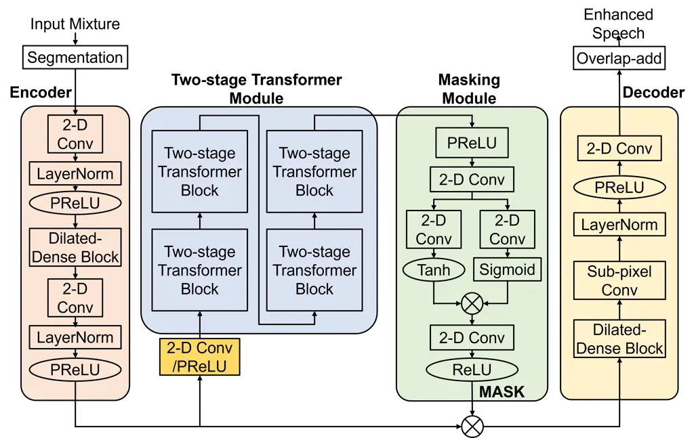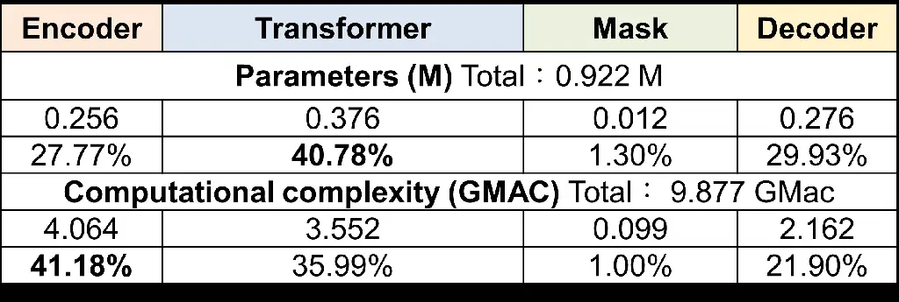

Fig. 1: The parameters and complexity distribution of the two-stage
transformer neural network (TSTNN) \[1\]. The computational complexity
is calculated with 8K samples per second.

Addressing the needs for real-time and low-power solutions, this paper
proposes a low-power design, achieved through model and architecture
co-optimization. For hardware oriented model compression, we employ
co-design of model compression and target application. We use
domain-aware and streaming-aware pruning, selectively trimming parts
based on their significance to the SE task and streaming requirements.
This method, combined with cross-domain masking and loss, achieves a
reduction of 93.9% in model size and 94.9% in complexity, all while
maintaining comparable performance. We further decreased the model’s
latency by adopting constant batch normalization (BN) over dynamic layer
normalization (LN)-based transformers—resulting in a 66% cycle
savings—and by implementing softmax-free attention with an additional
BN, which yields a 16X attention speedup. Our hardware design
accommodates these diverse computing patterns by breaking them down into
element-wise MACs. This is achieved using a 1-D processing array with
configurable SRAM addressing, which minimizes hardware complexities,
aligns with 1-D speech streaming processing, and facilitates
straightforward data gating for zero skipping. Through these
optimizations, we achieved reductions of 93.9% in model size and 95% in
complexity. Moreover, our hardware design demands a mere 207.8K gate
count and consumes 8.08 mW, making it apt for real-time streaming speech
enhancement.

The structure of the paper is outlined as follows. Section II delves
into related work concerning speech enhancement and deep learning
accelerators. Section III presents our proposed optimizations for model
complexity and hardware design. Section IV details our proposed hardware
design. Section V showcases the experimental results. Section VI
provides the conclusion.

## II Related Works

### II-A Speech Enhancement

Speech enhancement models primarily fall into two categories: time
domain and time-frequency (T-F) domain. Time-domain techniques, such as
those in \[3, 4\], aim to predict a clean waveform directly from the
noisy input. Methods in the T-F domain, as presented in \[5, 6\], begin
by transforming the noisy waveform into a spectrogram via the short-time
Fourier transform (STFT). They then predict a mask for this spectrogram
and subsequently reconstruct an enhanced waveform using the inverse
STFT. A notable subset of these models, like those in \[7, 4\], employ
architectures such as recurrent neural networks (RNN) or long-short-term
memory (LSTM) to leverage temporal context information.

A surge in recent research, as highlighted in \[1, 2, 8\], has adopted
the transformer architecture \[9\] for its superior performance and
capability for parallel computation. These studies integrate LSTM or
Gate Recurrent Unit (GRU) modules with transformers to enhance
positional information learning. Such an approach has shown potential to
surpass the performance of models relying solely on RNN, LSTM, or even
generative adversarial networks (GANs). For a comprehensive survey on
the topic, readers can refer to \[10\].

### II-B Model Compression

Model compression techniques, as discussed in \[11\], encompass pruning,
quantization, and the introduction of simpler structures to reduce both
the model size and complexity. Prior research on speech enhancement,
such as \[12\], has employed these general compression strategies
specifically for CNN/LSTM-based models. However, these methods are not
directly applicable to transformer-based models due to their
heterogeneous layers. Additionally, these general methods often overlook
potential application-specific compression opportunities.

### II-C Deep Learning Accelerators

In recent years, there’s been a growing interest in deep learning
accelerators (DLAs) for real-time model inference. While the majority of
DLAs are tailored for vision tasks, characterized by numerous processing
elements (PEs) and high memory bandwidth to accommodate substantial
neural network computations, speech enhancement models present unique
challenges. These include features like 1-D input, GRU structures, and
transformers. For instance, many current DLAs lack support for GRUs
owing to their intricate data flow. For speech applications,
accelerators often favor RNN\[13\] or LSTM \[14\] architectures, given
their superior performance over CNNs in this domain. Additionally,
\[15\] introduces an acoustic DSP integrated with a simplified CNN
model, designed specifically for hearing assistive devices.

In the realm of transformer acceleration, \[16, 17, 18, 19\] introduce
accelerators specifically designed to expedite the dot product
operations within the transformer’s self-attention mechanism.
Additionally, \[20\] unveils a specialized hardware accelerator that
encompasses the entire transformer module. This design utilizes a
systolic array for swift self-attention computation and extends native
support for both LN and softmax operations. On another note, \[21\] put
forth a transformer processor designed to bypass weakly related tokens,
targeting enhanced energy efficiency. However, this approach introduces
an irregular and intricate computing structure. In summary, these
transformer designs focus only on optimizing the attention part instead
of the whole models, which is not sufficient for speech enhancement
applications.

While the aforementioned designs predominantly cater to NLP and vision
applications, our research pivots towards speech enhancement. This
application demands streaming processing for real-time needs. The speech
signals also has its distinct data distribution, when compared to NLP
and vision. By capitalizing on these unique data characteristics, we’ve
refined our approach through a synergistic hardware-software codesign
strategy. It’s worth noting that transformer-based speech enhancement
models also necessitate CNN acceleration, a facet often overlooked in
prior designs. Striking a balance in supporting both paradigms poses a
challenge in maximizing hardware utilization.

## III Hardware Oriented Model Optimization

### III-A Analysis and Design Challenges of TSTNN

In this paper, we adopt TSTNN \[1\], a state-of-the-art
transformer-based neural network, as our baseline owing to its
commendable performance. Fig. 1 illustrates the model architecture,
highlighting the parameter and complexity distribution of TSTNN. In
terms of parameter distribution, transformers account for approximately
40%, whereas the encoder and decoder sections together contribute to
nearly 57%. Notably, the dense dilated block encompasses 53.36% of the
overall parameters, surpassing even the transformer components. The
total model parameters and computational complexity are 0.922M and 9.877
GMACs, respectively, presenting challenges for deployment on
milliwatt-scale edge devices in real-time scenarios.

Aside from its considerable size and significant computational demands,
TSTNN presents multiple structural challenges when it comes to streaming
deployment. Primarily, the model doesn’t operate as a causal system
tailored for streaming, primarily due to the full-band attention within
its transformer block. Moreover, the model features two blocks with high
data dependencies: LN and softmax. These blocks hinder parallel
execution, inevitably leading to increased latency. Furthermore, the
model showcases a gamut of distinct computation patterns, including
convolution, attention, GRU, and dilated convolution. Such diversity in
computation patterns not only complicates hardware design but also
introduces overhead, leading to diminished hardware efficiency.

### III-B Overview Of The Proposed Approach

In our quest to satisfy real-time requirements and achieve power
efficiency without compromising performance, we tackle the
aforementioned challenges by proposing a two-fold strategy: compressing
the model using domain-aware and streaming-aware pruning and adopting a
hardware-friendly model design. Simultaneously, we ensure robust
performance through the application of cross-domain masking and loss.

In the context of domain-aware pruning, most contemporary pruning
techniques, as discussed in \[11\], are tailored for homogeneous
architectures. Given the distinct convolution/transformer structures
present in our context, these methods are not directly applicable. As an
alternative, our proposed pruning techniques focus on compressing the
model based on two key criteria: the components’ sensitivity to the
speech enhancement task, termed as SE-aware pruning, and the
prerequisites of streaming inference, termed as streaming-aware pruning.
Using domain-aware pruning streamlines the identification of potential
pruning regions within the model. Further details of this approach will
be elaborated upon in the subsequent sections.

### III-C Cross Domain Masking And Loss

Deploying TSTNN on low-power edge devices necessitates substantial model
compression, a process which often risks significant performance
degradation. To counteract this, a viable strategy involves training a
more robust model that delivers enhanced performance without expanding
its size. While TSTNN employs masking in the time-domain and calculates
loss across both spectrum- and time-domains for optimal performance, it
overlooks frequency-related information during the masking process. The
work in \[22\] adopts the time-frequency masking but uses the frequency
loss only. This paper, however, proposes using both time-frequency
masking and time-frequency loss. Consequently, speech inputs undergo
initial processing via a STFT, serving as the spectrum input. Our
proposed model, called the Time-Frequency Transformer Neural Network
(TFTNN), takes advantage of this cross-domain approach in both its
masking and loss calculations, aiming to boost performance.
Consequently, our discussions in the following sections will center on
TFTNN.

### III-D Domain-aware Pruning

Many existing pruning techniques, as highlighted in \[11\], are designed
for homogeneous architectures. Directly applying them to our context is
impractical, given the unique heterogeneous nature combining
convolutional and transformer structures. To address this, we introduce
domain-aware pruning methods that tailor compression based on the
component’s relevance to the speech enhancement task, termed as SE-aware
pruning, ensuring minimal performance degradation. Our domain-aware
pruning approach encompasses four primary modifications: dilated
residual block with channel splitting, pruning of the transformer block,
mask module without gating mechanism, and replacing the parametric
rectified linear unit (PReLU) with the rectified linear unit (ReLU).

In the encoder/decoder segment, as depicted in Fig.2(a), the dense
dilated block incorporates dense connections. This design choice
increases the number of channels, subsequently amplifying both
computational complexity and memory access demands. Notably, while
dilation effectively captures long-range dependencies in speech signals,
dense connections are not conducive to hardware implementations. To
address this, we advocate for the dilated residual block illustrated in
Fig.2 (b). This block substitutes dense connections with more scalable
residual ones, mitigating channel expansion. Additionally, by employing
channel splitting, which processes only half the channels and bypsses
half the channels, we achieve substantial reductions in complexity with
almost the same performance. These modifications lead to a marked
reduction of 90.2% in parameters and a 90.0% drop in GMACs for this
specific block.

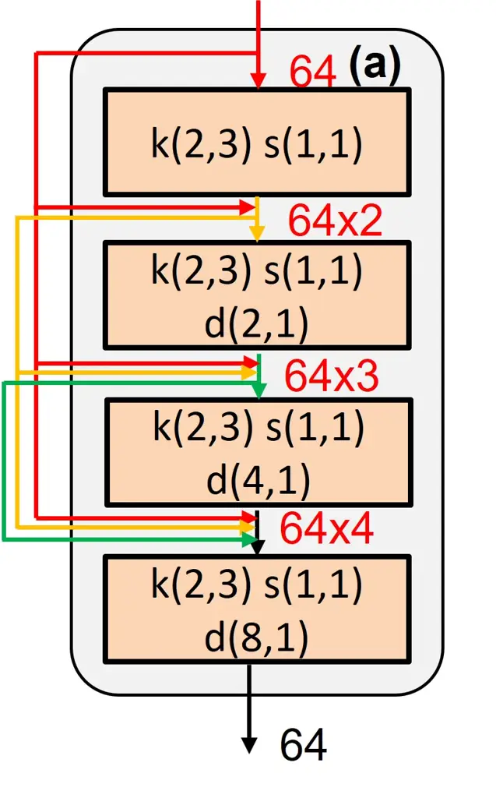

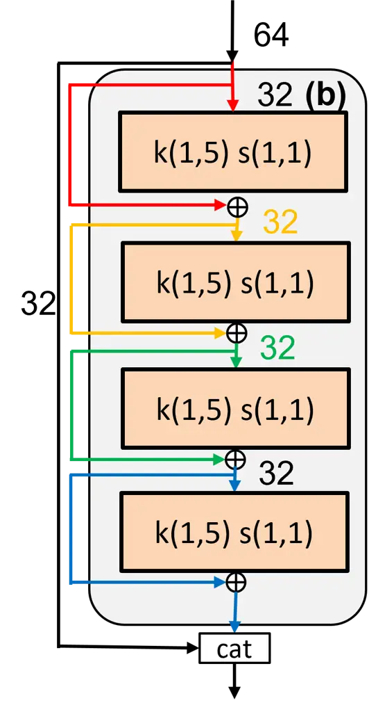

Fig. 2: (a) Dilated dense Block, and (b) dilated residual block with
channel splitting. Each block is a convolution block with kernel size k,
stride s and dilation rate d. Each convolution is followed by LN/PReLU
in the dilated dense block, and LN/ReLU in the dilated residual block.

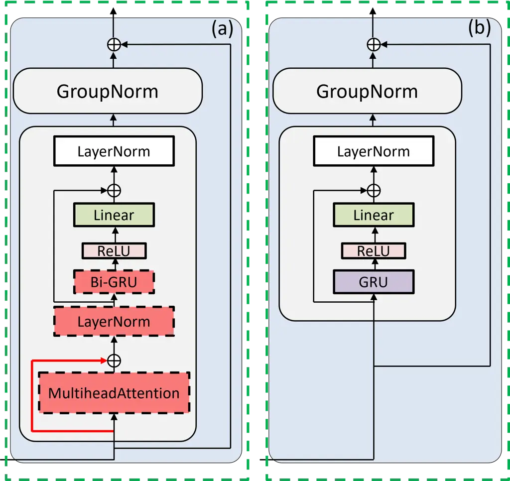

Fig. 3: Transformer (a) with full-band multi-head attention, and (b)
without full-band multi-head attention.

The transformer block, illustrated in Fig. 3(a), encompasses components
like multi-head Attention (MHA), GRU, and linear modules. To reduce the
number of parameters, we strategically reduce half of the channels
within the GRU and MHA components. Our rationale for this adjustment is
summarized below. The input channel corresponds to the embedding
dimension in MHA and the hidden dimension in GRU. The embedding and
hidden dimensions exert a lesser influence on the SE task’s performance
as compared to the length dimension in both MHA and GRU based on our
simulation.

Building on the channel pruning executed in the transformer blocks, we
further reduce half of the channels in both the encoder and decoder
segments, ensuring uniformity in channel count across the model. Given
this halving of the model’s channel count, retaining a deep network
structure will improve performance slightly. Consequently, we streamline
the architecture by cutting the number of transformer blocks from four
down to two, a modification that, as our simulations indicate, retains
comparable performance levels.

Within the mask module, as depicted in Fig. 4, the Gate Tanh Unit (GTU)
aids the model in selecting proper words or features for predicting
subsequent words. However, its influence on the task at hand is
relatively minimal. Consequently, to alleviate hardware overhead, we opt
to eliminate this gating mechanism.

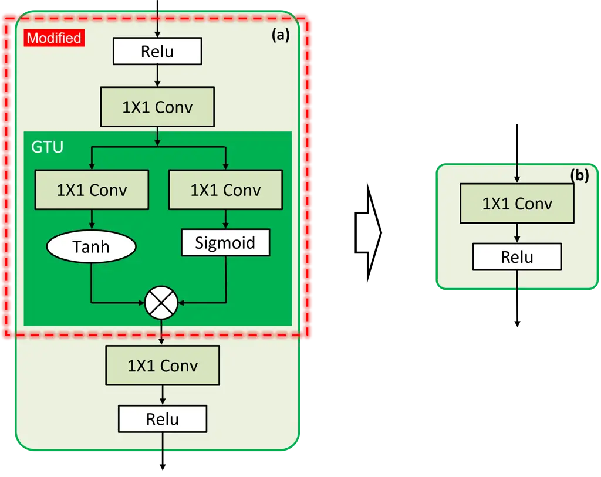

Fig. 4: (a) Original mask module and (b) modified mask module.

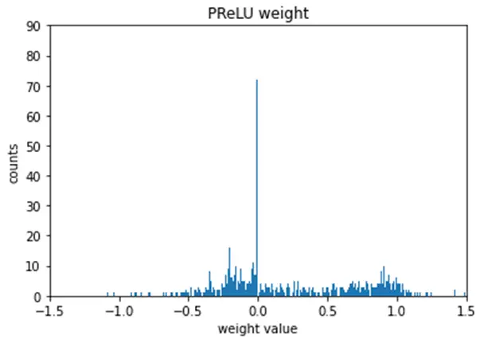

Fig. 5: The weight distribution of PReLU in this model.

The model incorporates PReLU, enabling the neural network to adaptively
learn nonlinearity across its layers. However, this introduces extra
hardware demands. Fig. 5 depicts the parametric weight distribution of
PReLU for this model, revealing that a majority of the PReLU weights
hover near zero. Consequently, values in the negative spectrum turn into
weak tokens post PReLU processing. During inference, these weak tokens
effectively become zero and have no significant influence on the final
outcomes. To streamline the model, we substitute PReLU with ReLU.

### III-E Streaming Aware Pruning

For effective streaming inference, it is essential that the model
operates as a causal system, meaning it does not rely on future inputs.
As illustrated in Fig. 6, our model is designed to process a single
time-step frame of the spectrogram in any given instance, catering to
the streaming paradigm. Such an approach optimizes on-chip memory
utilization, enabling the entirety of the model to execute on-chip,
obviating the need for off-chip data access during intermediate stages.
Moreover, leveraging this single time-step frame input (also termed as
1-D input) in conjunction with streaming prerequisites, we further
refine the model to mitigate complexity. Specifically, this entails
transitioning convolution kernels from 2-D to 1-D and incorporating
subband attention, thereby eliminating the need for full-band multi-head
attention.

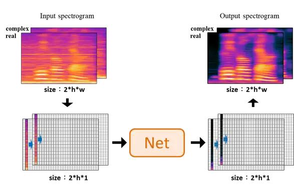

Fig. 6: The illustration of the streaming inference.

In both the encoder and decoder, the Dilated Residual Block initially
employs a 2-D convolution, driven by time-frequency input features. This
setup hinders our ability to infer using a 1-D input suitable for
streaming. Consequently, as depicted in Fig. 2, we modify the kernel
size across all convolutions, transitioning from the 2-D kernel (2,3) to
the streamlined 1-D kernel (1,5), a shift that aids in diminishing both
computational complexity and memory requirements.

As illustrated in Fig.3 (a), a typical two-stage transformer block
comprises two transformers: one dedicated to subband attention and the
other to full-band attention. The approach, recognized as two-stage or
dual-path signal processing, has gained traction in recent developments.
Notably, the subband attention segment formulates attention mechanisms
in sync with the spectrogram’s frequency axis, based on the provided
spectrogram input, posing no hindrance to streaming inference.
Nonetheless, the full-band attention component, as seen in Fig.3 (a),
formulates attention mechanisms aligned with the spectrogram’s time
axis. This poses a challenge for streaming inference, given that
streaming input is restricted to a single time-step data.

Consequently, we eliminate the full-band multi-head attention module,
which is highlighted in red in Fig.3 (a). In the case of the GRU within
the full-band attention, we modify it from the bi-direction to the
single direction, ensuring the module adheres to a causal system. The
resultant modified transformer is depicted in Fig.3 (b).

### III-F Hardware Friendly Model Design

Building on the aforementioned structured pruning and alterations, the
majority of blocks in TFTNN can be accelerated with parallel computing
units. However, both LN and softmax in the transformer block are not
hardware-friendly, which requires online accumulations, leading to
pronounced data dependencies. These dependencies hinder parallel
execution, emerging as significant throughput bottlenecks. To build a
hardware-friendly model, by leveraging the introduced cross-domain
masking, we can resort to a constant BN for inference, bypassing the
need for real-time LN computation. In addressing softmax, our
proposition centers on the softmax-free MHA with an additional BN,
designed to eliminate data dependencies and facilitate an optimal matrix
multiplication sequence. This is elaborated in the following.

In TSTNN, both the encoder/decoder and the transformer employ LN. LN is
regarded as a default normalization method in numerous speech tasks,
primarily to compute the mean and variance of features in the channel
dimension during inference. However, during model inference, LN requires
real-time accumulation for both mean and variance, unlike the constant
values used in BN. This means that the technique of folding BN into
convolution is inapplicable here. Conversely, BN offers a faster
inference than LN due to its fixed nature, allowing it to seamlessly
fuse with convolution.

Given the time-frequency masking in this model, our input takes the form
of a spectrogram, diverging from the traditional waveform. This
spectrogram presents a reduced dynamic range compared to the original
waveform and displays greater relevance across batches. Consequently,
the adoption of BN, even in this altered context, doesn’t lead to
significant performance degradation. In light of its consistent value
attribute and the minimal performance drop (as validated by simulation
results), this study endorses the replacement of LN with BN throughout
the model. This modifiction abolishes the need for online accumulations,
slashing the LN cycle count by two-thirds, as delineated in Fig. 9.

However, a straightforward BN substitution within the transformer module
can destabilize training. To counteract this, we’ve integrated an extra
BN step into the MHA module, ensuring the normalization of FFN blocks
and thwarting potential system crashes. The proposed BN-based
transformer block, along with its MHA module, is illustrated in Fig.7
and Fig.8, respectively.

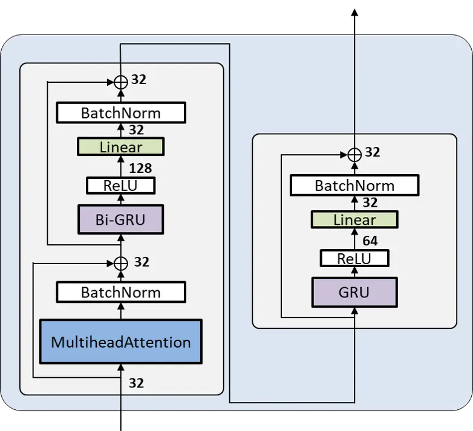

Fig. 7: The architecture of the proposed BN-based transformer block.

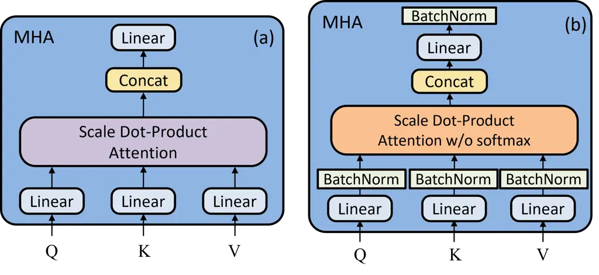

Fig. 8: (a) MHA and (b) softamx-free MHA with extra BN.

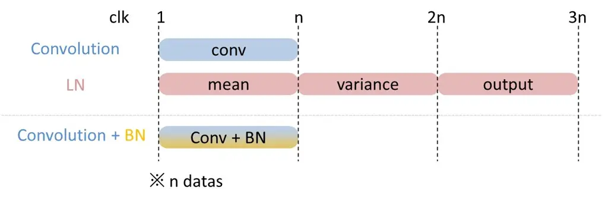

Fig. 9: Schedules for LN and BN.

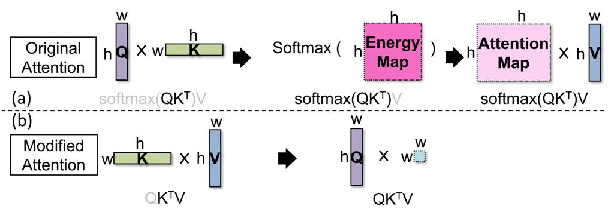

Fig. 10: Computation order of the MHA: (a)the original one, and (b) the
proposed optimal order.

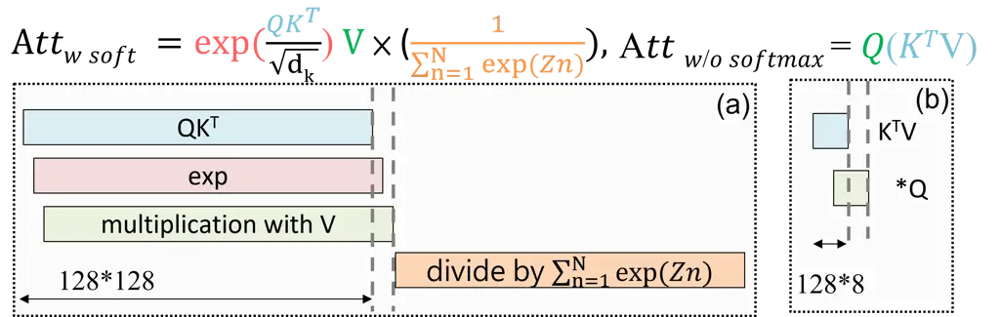

Fig. 11: The schedule of the attention (a) with and (b) without the
softmax layer.

As depicted in Fig.11, the MHA computation with softmax necessitates
waiting and accumulating related values to derive the final results,
leading to significant cycle consumption. Additionally, it demands
significant memory allocation due to the storage requirements of the
attention map, as illustrated in Fig.10 (a). Further compounding the
issue, the inclusion of the exponential function in softmax poses an
overhead for hardware design.

An earlier method presented in \[23\] employs softmax-free attention,
leveraging the L1 norm for Q and K, effectively removing softmax.
However, the L1 norm isn’t constant and mandates online computations
during inference. Addressing this challenge, our proposal encompasses
utilizing softmax-free attention, with Q and K normalized by BN, as
demonstrated in Fig.8 (b). This approach offers threefold advantages.
Primarily, this BN is consistent with the LN replacement discussed
earlier, incurring no added costs. Moreover, the BN values, being
constant during inference, seamlessly integrate with linear
convolutions. Finally, the omission of softmax facilitates the
reformation of self-attention to attain the optimal matrix
multiplication sequence, as depicted in Fig.10 (b). Within this
structure, complexity is curtailed as outlined in Eq.1, especially when
the input length, $`h=128`$, is much larger than the input channel,
$`w=8`$, in this model. Adopting this methodology, our hardware can
enhance the attention operation speed by a factor of 16x (128/8),
resulting in lower power consumption, as highlighted in Fig.11.

```math
\frac{Complexity_{orig}}{Complexity_{new}}=\frac{(h\times w\times h)+(h\times h\times w)}{(w\times h\times w)+(h\times w\times w)}=\frac{h}{w} \tag{1}
```

### III-G The Final TFTNN Model

Building upon the aforementioned optimizations, we present our final
TFTNN model in Fig.12. This refined model consists of 55.92k parameters,
marking an impressive reduction of approximately 94% when compared to
the original TSTNN. In the transformer block illustrated in Fig.12,
we’ve modified the shortcut’s location to facilitate a direct connection
between BN and convolution, as detailed in Fig.7. Additionally, given
our utilization of BN for these layers, we’ve omitted the group
normalization as evidenced in Fig. 3.

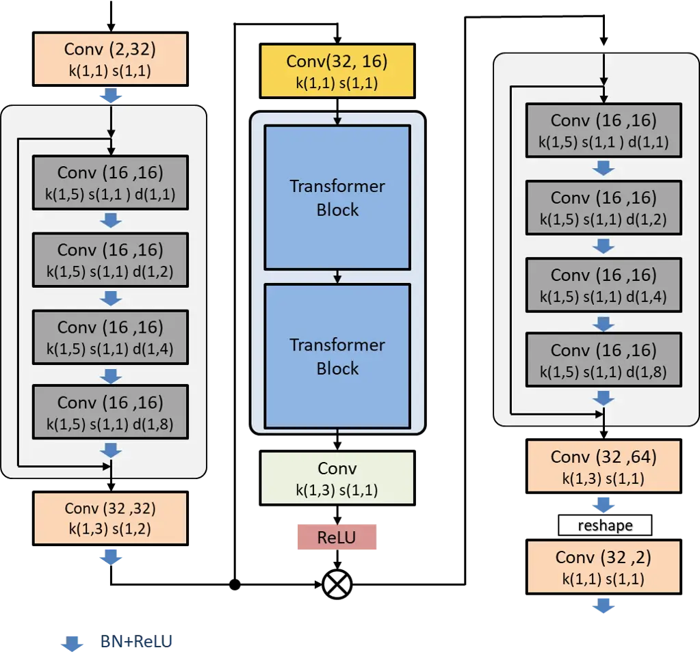

Fig. 12: The architecture of TFTNN with the transformer block in Fig. 7
and MHA in Fig. 8 (b).

## IV Hardware Accelerator

### IV-A Design Analysis And Approach Overview

Our design aims to process one frame within 16 ms, corresponding to 512
points for an 8K sampling rate with a 128-point hop length in STFT,
thereby meeting the real-time streaming requirement. The computational
demand for our lightweight model is set at 15.86 MMACs (million MACs)
per frame. This can be addressed using 16 MACs, each running at a 1 MHz
clock rate, resulting in an overall clock rate of 62.5 MHz for
one-second data processing.

Despite the significant simplification in our proposed model, the
hardware design still grapples with challenges like managing
heterogeneous computing patterns, external memory access, and ensuring
minimal power consumption.

When it comes to heterogeneous computing patterns, our hardware must
accommodate a range of computations, from convolution and GRU to
multi-head attentions, a feature not commonly found in contemporary DLA
designs. Most of these operations resemble either convolution or matrix
multiplication processes. We address these challenges by breaking them
down into element-wise MACs and arranging them in the proposed 1-D
processing array with adaptable SRAM addressing, mitigating intricate
hardware overheads. This 1-D array aligns seamlessly with our proposed
1-D streaming approach.

Additionally, the extensive DRAM power consumption from external memory
access, attributable to deep layers and numerous shortcut connections,
poses a challenge for low-power edge devices. However, our highly
streamlined model permits the storage of all intermediate feature maps
directly on-chip, eradicating the need for feature map I/O and
facilitating the integration of shortcut connections. Consequently, only
the primary input and final outputs necessitate feature map I/O.

Lastly, to further minimize power consumption, we incorporate a gating
mechanism into computational units and buffers, extending our efforts
beyond the aforementioned complexity reduction. Further details are
elaborated upon in the subsequent sections.

### IV-B System Architecture

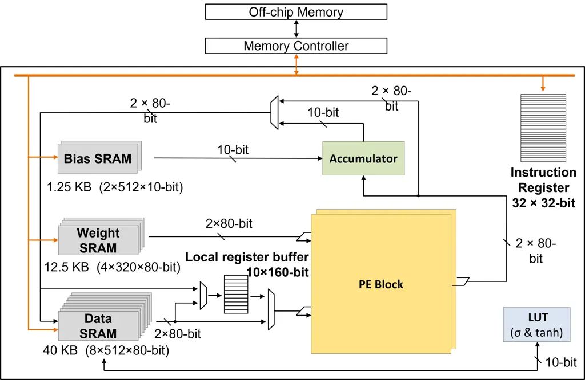

Fig. 13: The system architecture.

#### IV-B1 Overview

The proposed system architecture for our model is depicted in Fig. 13.
Our hardware processes the model sequentially, layer by layer. To
curtail external memory access, we store all intermediate feature maps
directly in the on-chip SRAM. This strategy means that only the initial
input and the final outputs require interaction with off-chip memory.
However, the constraints of on-chip buffers necessitate weight
adjustments during inference. For seamless operation, all SRAMs in our
setup are designed as ping-pong buffers. The system interfaces with
external memory via a memory controller, equipped with distinct 80-bit
data input and output channels. The entire system can be programmed
using custom instructions.

#### IV-B2 On-chip buffer

Buffers dedicated to data, weight, and bias are allocated into 8, 4, and
2 banks respectively, aligning with the bandwidth demands of a single PE
block. The SRAM data’s word line is aligned with the signal’s length,
and the word line for the weight SRAM is tailored to fit the kernel size
and the output channel. This arrangement facilitates the sequential
access of the SRAM during convolution operations.

To minimize SRAM access and conserve power, our system integrates 10
local register buffers, facilitating data exchange between SRAM and PE
blocks, as illustrated in Fig. 13. Each local register buffer
encompasses 160 bits, aligning with the bandwidth capacity of a pair of
PE blocks. Through these buffers, data reuse is streamlined, eliminating
frequent SRAM access during operations. Furthermore, these buffers are
adept at storing intermediary outcomes within the GRU process.

#### IV-B3 PE block

For our streamlined model, we utilize two PE blocks, each equipped with
eight element-wise MACs, for the eight input channels. Our design can
operate up to 16 MACs simultaneously. The results from the PE blocks are
aggregated, with an accompanying bias integrated during this
accumulation. The architecture of the PE block, consisting of 8 PE cells
and a tree adder, is illustrated in Fig. 14. If the input data during
convolution is zero, the PE computation is skipped, and data is sent
directly to the tree adder, optimizing energy consumption. The PE block
is versatile and can be reconfigured to accommodate all operations
mandated by our model, including convolutions, transformer mechanisms,
shortcut additions, and masking. In convolution operations, the PE cell
is set to multiplication mode, and the tree adder consolidates all
outputs from the PE cells. The tree adder’s output feeds into the
accumulator for further summation. In addition, the PE block is equipped
to manage the shortcut and mask layer through element-wise additions and
multiplications. This method of element-wise multiplication and addition
also applies when calculating the dot product in the attention layer.

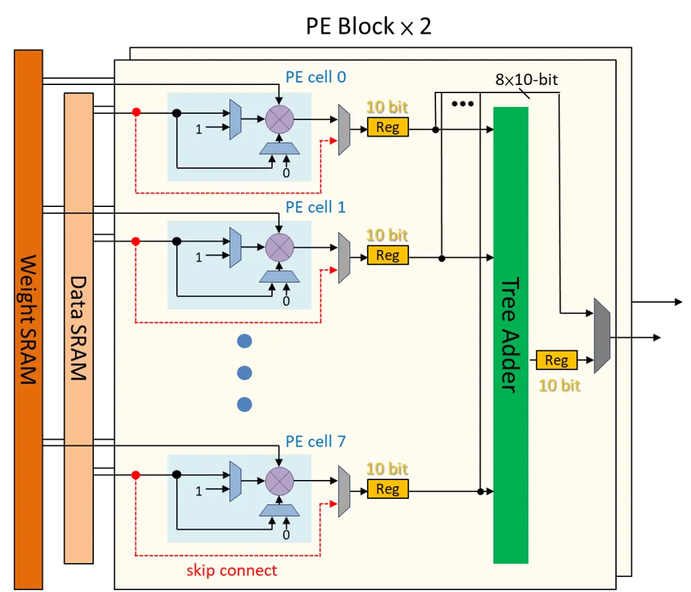

Fig. 14: The PE block architecture.

### IV-C Data Flow With Configurable SRAM Addressing

Our model’s primary operations are broadly classified into two types:
convolution and matrix multiplication. The convolution flow is applied
in the convolution layer of the encoder and decoder, and the linear
layer of GRU and MHA. The attention layer of MHA employs the matrix
multiplication flow. The gate operations of GRU, involving element-wise
multiplications and additions, follow a flow akin to matrix
multiplication. Both of these operations are effectively handled using
the proposed 1-D array. Subsequently, we will detail the data flow for
convolution and matrix multiplication, and then describe how these are
integrated into GRU and MHA in a systematic manner. To streamline
hardware design, different data flows can be effectively managed with
straightforward control in conjunction with varying SRAM addressing.

#### IV-C1 Channel-wise input flow for convolution

For a unified data flow that performs a 1-D convolution across various
kernel sizes and dilation, we employ a channel-wise input approach,
illustrated in Fig. 15(a). When the dilation of the convolution
surpasses 1, it necessitates accessing different positions within the
data SRAM. In this data flow approach, input data sharing the same
kernel dimension are relayed to the PE blocks each cycle. The PE blocks
then calculate the product and consolidate results along the channel
dimension. These interim sums are then compiled by the accumulator to
produce the final output.

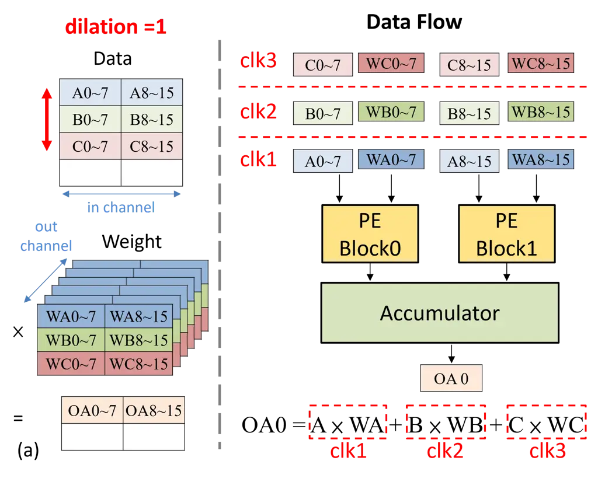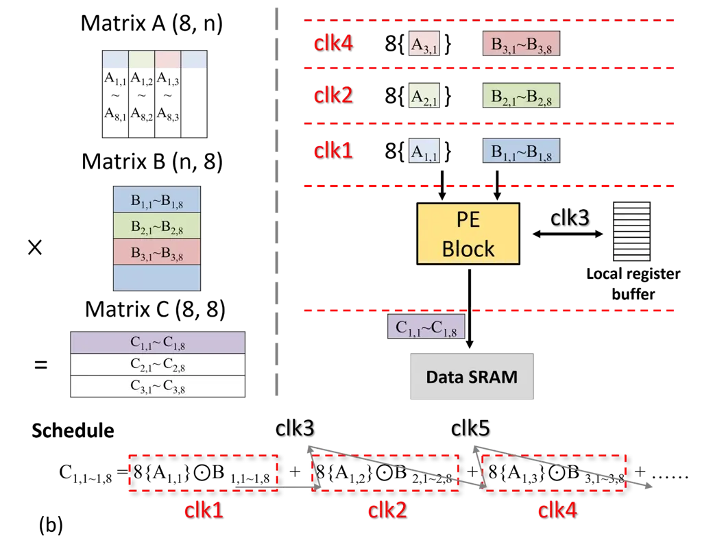

Fig. 15: The data flow of the (a) convolution, and (b) matrix
multiplication operation.

#### IV-C2 Data flow for matrix multiplication

Contrary to CNNs, the MHA approach processes matrix multiplication along
the signal length dimension. However, signals are sequentially stored in
SRAM, hindering parallel access. One solution might involve altering the
SRAM data layout, but this complicates control and adds overhead.

To address this issue, we employ the element-wise MAC for matrix
multiplication, as depicted in Fig. 15(b). Using two matrices of array
size 8$`\times`$n as an illustration—where 8 represents the embedding
dimension of MHA and n denotes the signal size—both Matrix A and Matrix
B reside in separate banks of the data SRAM. Data from $`A_{1,1}`$ and
$`B_{1,1-1,8}`$ is accessed, with $`A_{1,1}`$ broadcasted to all PE
cells in the PE blocks. This facilitates the element-wise multiplication
with $`B_{1,1-1,8}`$. This computation process is consistently applied
to subsequent data. Moreover, data accumulation is performed within the
same PE block, with the partial sum stored in the local register buffer.

#### IV-C3 GRU operation

As depicted in Fig. 16, there are five sequential GRU operation steps
designed for hardware implementation. Each of these steps applies either
the convolution or matrix multiplication flow, depending on its specific
requirements. The initial step involves computing the three linear
layers associated with the input layer. Subsequently, the three
following steps calculate the reset gate, update gate, and new gate,
employing element-wise multiplication and addition akin to the matrix
multiplication process. Additionally, a Lookup Table (LUT) is utilized
to manage the sigmoid and tanh functions. The concluding step yields the
new hidden state result.

Given that our system is equipped with only two PE blocks, these stages
function in a sequential manner rather than in parallel. The PE blocks
sequentially traverse all five steps to process a single data input,
then iterate over the entire signal.

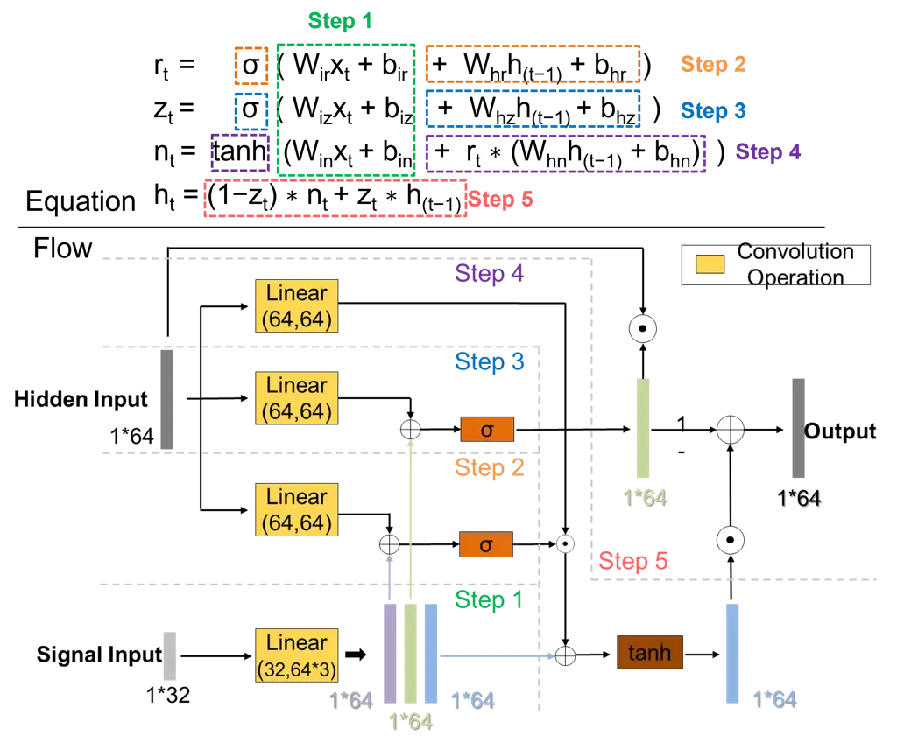

Fig. 16: The operation steps of the GRU.

#### IV-C4 MHA operation

As depicted in Fig. 17, there are three designated MHA operation steps
tailored for hardware execution. Each of these steps utilizes either the
convolution or matrix multiplication flow, depending on the specific
requirement. Consider an input signal characterized by a length of 128
and an embedding dimension of 16. In the initial step, the linear layer
in self-attention is computed for query(Q), key(K), and value(V). In the
subsequent stage, only the matrix multiplication of key(K) and value(V)
is computed, due to the omission of the softmax module. The third step
involves the dot product computation with query(Q). This progression
delineates the most efficient computation sequence for MHA in our
design. The PE blocks sequentially process these steps for each input.

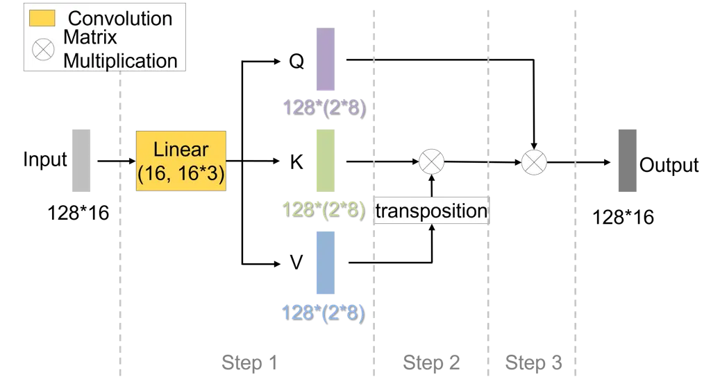

Fig. 17: The operation steps of the MHA.

## V Experimental Results

|      | Dataset          | clean  | VoiceBank    |       |        |        |       |        | Parameters | Computations (GMac) |
| ---- | ---------------- | ------ | ------------ | ----- | ------ | ------ | ----- | ------ | ---------- | ------------------- |
|      |                  | noise  | UrbanSound8K |       |        | DEMAND |       |        |            |                     |
| Year | Model            | Domain | PESQ         | STOI  | SNR    | PESQ   | STOI  | SNR    |            |                     |
| 2019 | ConvTasNet\[24\] | T      | 2.051        | 0.803 | 11.470 | 2.945  | 0.889 | 15.564 | 3.986 M    | 8.34                |
| 2020 | DCCRN\[4\]       | T      | 2.556        | 0.857 | 14.491 | 3.302  | 0.923 | 17.527 | 2.495 M    | 3.26                |
| 2021 | TSTNN\[1\]       | T      | 2.637        | 0.869 | 14.622 | 3.452  | 0.939 | 17.189 | 922.9 k    | 9.87                |
| 2022 | DBT_Net\[2\]     | TF     | 2.909        | 0.891 | 15.228 | 3.658  | 0.951 | 17.922 | 2.908 M    | 20.08               |
|      | TFTNN            | TF     | 2.746        | 0.878 | 14.745 | 3.501  | 0.939 | 18.545 | 55.9 k     | 0.496               |

TABLE I: Performance comparison with the state-of-the-art works in
recent years.

[TABLE]

TABLE II: Ablation analysis of different domain methods.

| Dataset | clean           | VoiceBank    |        |         |
| ------- | --------------- | ------------ | ------ | ------- |
|         | noise           | UrbanSound8K |        |         |
| Model   | trans block num | PESQ         | STOI   | SNR     |
| TFTNN   | 4               | 2.7698       | 0.8801 | 14.5938 |
|         | 3               | 2.7263       | 0.8743 | 13.7332 |
|         | 2               | 2.7459       | 0.8779 | 14.7450 |
|         | 1               | 2.5974       | 0.8602 | 14.0212 |

TABLE III: Ablation analysis of the use of different transformer block
numbers.

| Dataset | clean | VoiceBank    |       |        |        |       |        |
| ------- | ----- | ------------ | ----- | ------ | ------ | ----- | ------ |
|         | noise | UrbanSound8K |       |        | DEMAND |       |        |
| Ex. BN  | Norm  | PESQ         | STOI  | SNR    | PESQ   | STOI  | SNR    |
|         | LN    | 2.797        | 0.874 | 14.616 | 3.491  | 0.939 | 18.936 |
|         | BN    | 2.724        | 0.872 | 14.468 | 3.465  | 0.941 | 18.488 |
| ✓       |       | 2.792        | 0.876 | 14.301 | 3.526  | 0.943 | 18.168 |

TABLE IV: Ablation analysis of the transformer with LN and extra BN in
MHA for TSTNN.

[TABLE]

TABLE V: Comparisons with other designs.

### V-A Experimental setup

In our experiments, we employed the widely-used VoiceBank+DEMAND dataset
to evaluate the performance of TFTNN. The clean signals sourced from
this dataset originate from the Voice Bank corpus\[27\]. This corpus has
more than 300 hours of recordings and comprises 11,572 utterances spoken
by 28 unique speakers, with an equal distribution of 14 males and 14
females, designated for training. The test set encompasses 824
utterances, delivered by 2 speakers, one male and one female.

To introduce diversity and challenge, we incorporated a secondary noise
dataset - UrbanSound8k \[28\]. The UrbanSound8k dataset is a rich
collection of 8,732 urban sound snippets distributed across 10 distinct
categories. By mixing the Voice Bank Corpus with UrbanSound8k at a
Signal-to-Noise Ratio (SNR) of 2.5 dB, we ensured that our model is
exposed to a varied and intricate noisy speech environment during
evaluations.

We utilize three evaluation metrics to assess our model: Perceptual
Evaluation of Speech Quality (PESQ) \[29\], Short-Time Objective
Intelligibility (STOI) \[30\], and Signal-to-Noise Ratio (SNR) \[31\].
The score ranges for these metrics are as follows: -0.5 to 4.5 for PESQ,
0 to 1 for STOI, and -10 to 35 for SNR. For all these metrics, a higher
score signifies superior speech quality.

During data preprocessing, we employ an 8K sampling rate for all
utterances. For the STFT, the length is set to 512 and the hop length to
128, which translates to durations of 64ms and 16ms, respectively. To
mitigate signal edge disparities and reduce Fourier transform leakage,
we utilize the Hanning window. For both training and testing phases,
speech segments of 3 seconds are considered. If an utterance exceeds 3
seconds, a random 3-second segment from the utterance is chosen.

Our model is developed using PyTorch. TFTNN is trained using the Adam
optimizer over 125 epochs. A batch size of 4 is selected, accounting for
the batch-independent characteristics of the speech signal. As for the
learning rate, it starts at 1e-3 and undergoes decay through the
ReduceLROnPlateau function by a factor of 0.5, which adjusts the
learning rate downward when performance plateaus. Lastly, our loss
function amalgamates both the time domain and spectrum domain losses, as
depicted in Eq. 2, with a value of $`\alpha`$ fixed at 0.2 for our
experiments. Fig. 18 shows the training curve of the proposed TFTNN,
which has a convergence curve similar to that of the TSTNN.

```math
loss=\alpha\times loss_{F}+(1-\alpha)\times loss_{T} \tag{2}
```

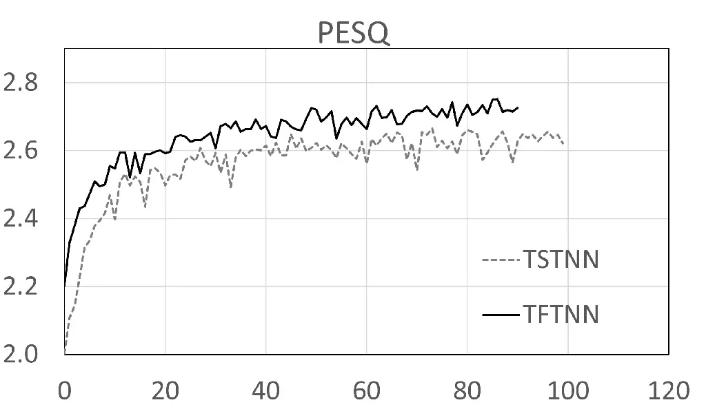

Fig. 18: Training curve of TSTNN (TF mask and spectrum loss) and TFTNN.

### V-B Model Performance and Comparisons

As illustrated in Table I, the performance of TFTNN is benchmarked
against other state-of-the-art models from recent literature.
Computation metrics presented are derived from a 1-second data duration.
Notably, our model’s performance ranks just behind DBTNet\[2\], albeit
at a significantly reduced complexity of 40$`\times`$. Moreover, TFTNN
outperforms TSTNN, attributed to the incorporated performance
enhancement techniques, while achieving a 19.6$`\times`$ reduction in
complexity. Hence, TFTNN demonstrates a competitive edge, combining
robust performance with a highly streamlined model and efficient
computational footprint.

### V-C Ablation Study

Owing to space constraints, a comprehensive listing of all results
stemming from our analytical approaches is not feasible. To streamline
the presentation, we emphasize the pivotal decisions below. Our
simulations indicate that other methods exert minimal influence on
performance.

Domain of the Mask and Loss Function: Results from various domains for
the mask and loss function are presented in Table II. The data reveals a
notable degradation in performance due to model compression, especially
concerning the time-frequency mask and spectrum loss (PESQ drops from
2.6788 in TSTNN to 2.1190 in TFTNN with a TF mask and F loss). However,
by incorporating cross-domain masking and loss, we can enhance the
model’s performance, closely aligning it with that of TSTNN.

Variations in Transformer Block Numbers: Table III displays outcomes
based on the varying number of transformer blocks in TFTNN.
Interestingly, while the performance remains consistent with more than
two transformer blocks, utilizing 2 blocks surpasses the performance
achieved with 3. We theorize that an even count of transformer blocks
offers better balance, given the dual-stage processing inherent to each
block. To strike an balance between the number of transformer blocks and
optimal performance, we opted for 2 transformer blocks.

BN versus LN: As detailed in Table IV, there’s a marked difference in
performance between models using BN and those using LN. While models
employing BN exhibit a decline in performance, the degradation is
mitigated by the application of cross-domain masking and loss.
Incorporating an additional BN within the MHA module further narrows the
performance gap, bringing it close to the original benchmarks.

Quantization Considerations: In TFTNN, the feature maps display a broad
dynamic range, spanning from $`10^{-8}`$ to 30 in absolute values,
primarily attributed to the intricacies of speech-related processing. To
accommodate this range, we experimented with various quantization
schemes, as delineated in Table VI, ensuring consistent bit allocation
for both activation and weight. Notably, fixed-point quantization leads
to a marked degradation when using less than 16 bits. Conversely, the
losses are relatively insignificant with floating-point representations,
credited to their expansive dynamic range. Consequently, we settled on
the FP10 format (sign: 1, exponential: 5, mantissa: 4), striking a
balance between bit-width and performance for our processing elements
(PEs).

|     |      |     |     |      |      |                   |        |         |
| --- | ---- | --- | --- | ---- | ---- | ----------------- | ------ | ------- |
|     | Bit  |     |     |      |      | Post Quantization |        |         |
|     | Act. | W.  | S   | Exp. | Man. | PESQ              | STOI   | SNR     |
| FP  | 32   | 32  | 1   | 8    | 23   | 2.7459            | 0.8779 | 14.7450 |
|     | 16   | 16  | 1   | 8    | 7    | 2.7500            | 0.8778 | 14.7280 |
|     | 10   | 10  |     | 5    | 4    | 2.7215            | 0.8760 | 13.0410 |
|     | 9    | 9   |     | 4    | 4    | 2.6653            | 0.8714 | 11.7771 |
|     | 8    | 8   |     | 4    | 3    | 2.5331            | 0.8596 | 9.3176  |
|     | Act. | W.  | S   | Int. | Dec. | PESQ              | STOI   | SNR     |
| FxP | 16   | 16  | 1   | 8    | 7    | 2.7453            | 0.8774 | 14.7365 |
|     | 10   | 10  |     | 5    | 4    | 2.2562            | 0.8469 | 6.7709  |
|     | 9    | 9   |     | 4    | 4    | 1.9820            | 0.8266 | 3.7512  |
|     | 8    | 8   |     | 4    | 3    | 1.7416            | 0.8033 | 3.5201  |

TABLE VI: Quantization result of TFTNN on VoiceBank+UrbanSound8K.

Model size compression: Table VII outlines the contributions of the
primary four compression techniques, with the halving of channels making
the most significant impact. The half-channel technique also has the
largest performance impact. As shown in Table II, the PESQ of the
original TSTNN model is 2.639. With the cross-domain masking and loss,
PESQ is increased to 2.8848. Then, with half channel and softmax-free
attention, PESQ is drop to 2.7966 and 2.7658, respectively. However, it
is still higher than the original one. Other techniques have smaller
performance impact. In summary, the proposed techniques effectively
compress the model, and their performance impact is unaffected.

|       |                      |                      |                           |                           |          |                          |
| ----- | -------------------- | -------------------- | ------------------------- | ------------------------- | -------- | ------------------------ |
| Model | ¹¹footnotemark: 1 R. | ²²footnotemark: 2 S. | ³³footnotemark: 3 1/2 ch. | ⁴⁴footnotemark: 4 1/2 Tr. | Size (K) | ⁵⁵footnotemark: 5 (GMAC) |
| TSTNN |                      |                      |                           |                           | 922.87   | 9.87                     |
| TFTNN | ✓                    |                      |                           |                           | 449.95   | 3.83                     |
|       | ✓                    | ✓                    |                           |                           | 348.58   | 3.01                     |
|       | ✓                    | ✓                    | ✓                         |                           | 89.30    | 0.782                    |
|       | ✓                    | ✓                    | ✓                         | ✓                         | 55.92    | 0.496                    |

Residual block with channel splitting. ²²footnotemark: 2 Subband
attention only by removing full-band multi-head attention.
³³footnotemark: 3 half channels. ⁴⁴footnotemark: 4 Reduce transformer
blocks ⁵⁵footnotemark: 5 1 second signal with 8K sampling rate.

TABLE VII: Model reduction with the four main compression
methods.¹¹footnotemark: 1

### V-D Hardware Implementation Result

Our proposed design was designed using Verilog and subsequently realized
utilizing TSMC’s 40nm CMOS technology. The design occupies an area of
0.367 $`mm^{2}`$ and integrates an SRAM of 53.75KB. With an operating
frequency set at 62.5MHz, the core’s power consumption is measured at
8.08 mW. Notably, this accelerator is equipped to execute TFTNN
operations in real time, processing 512 samples (equivalent to 64 ms at
an 8K sample rate) for every hop length, which spans 16 ms.

#### V-D1 Power analysis

Figure 19 provides a detailed breakdown of power consumption for each
module within our design. The PE, data SRAM, and weight SRAM are
responsible for 31.69%, 27.82%, and 18.75% of the overall power
consumption, respectively. We utilized Synopsys PrimeTime PX to simulate
power consumption, basing our calculations on test speech data. In an
effort to minimize the design’s power draw, we implemented clock gating
for idle SRAM banks, achieving a 5.4% power savings for SRAM.
Additionally, by leveraging ReLU for sparse input processing, we
incorporated zero skipping to bypass computations involving zero values.
This, combined with data and clock gating for the PEs, resulted in a
substantial power reduction of 39.2%.

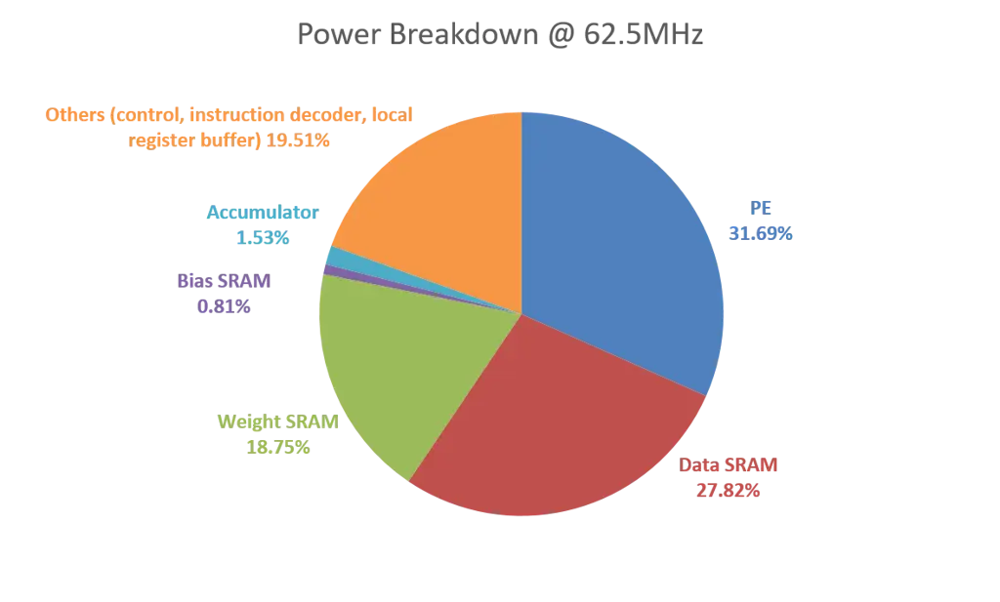

Fig. 19: The power breakdown of the core modules.

#### V-D2 Design comparison

For model compression, compared to the best previous model compression
methods used for speech enhancement \[12\] (small performance loss and
21X compression ratio with hardware unfriendly unstructured pruning and
clustering-based quantization), our approach can achieve a 52.5X
compression ratio (16.5X by hardware friendly structured pruning and
3.2X by quantization) without performance loss. This shows the benefits
of adopting the co-design of model compression and target application.

Comparing our work with other designs is challenging due to variations
in target applications and model architectures. For reference, Table V
enumerates selected speech-related studies focused on recognition and
enhancement, deliberately omitting works that are exclusively
transformer-based and cater to generic vision or NLP tasks. We also
normalize the area and power of other designs with the same process node
and voltage in our design for a fair comparison. Compared to other
designs, our design achieves the lowest area cost, 0.367$`mm^{2}`$, and
the best normalized area efficiency, 21.798 GOPS/$`mm^{2}`$ when
operating at the clock frequency of 250 MHz. This smallest area is due
to several factors. First, due to our adoption of streaming inference,
the design requires only 53.75 KB of SRAM, the lowest among the
references cited. Furthermore, our approach uses a compact model,
minimal PE numbers, and straightforward data flow, resulting in the
smallest footprint and the best area efficiency compared to other
designs. In particular, despite its compactness, our design remains
versatile, accommodating a range of layer structures. With the smallest
PE numbers, our design did not have the highest throughput and the
corresponding energy efficiency, since our throughput target is to meet
the required real-time constraints. Existing transformer-based designs
only optimize transformer attention execution by exploiting the sparsity
of attention \[17, 21, 18, 19\] instead of the whole model as in this
work. In addition, our design must optimize for CNN, transformer, and
GRU at the same time, which is not addressed in previous designs.

## VI Conclusion

In this study, we introduce a 55.92K transformer-based model and its
8.08mW low-power design, specifically tailored for real-time streaming
speech enhancement in edge devices. Leveraging model and hardware
optimizations, we achieved a remarkable 93.9% reduction in model size
and a 94.9% decrease in complexity. This was accomplished through the
use of domain-aware and streaming-aware pruning, all while preserving
optimal performance via cross-domain masking and loss. To enhance
hardware compatibility, we transitioned to a BN-based approach,
sidelining the traditional LN-based transformers. Additionally, we
incorporated softmax-free attention complemented by an extra BN to
minimize latency. Our streamlined model enables our design to
accommodate a diverse range of computing patterns, facilitated by a
reconfigurable element-wise 1-D MAC array. Realized using the TSMC 40nm
CMOS process, our design is both compact and efficient, encompassing
only 207.8K gates and 53.75KB SRAM, with an energy footprint of just
8.08 mW for real-time tasks. With these programmable hardware designs,
our design can be easily programmed to support a myriad of speech
processing models in future applications.

## References

- \[1\] K. Wang, B. He, and W.-P. Zhu, “TSTNN: two-stage transformer
  based neural network for speech enhancement in the time domain,” in
  _IEEE International Conference on Acoustics, Speech and Signal
  Processing (ICASSP)_, 2021, pp. 7098–7102.
- \[2\] G. Yu _et al._, “DBT-Net: dual-branch federative magnitude and
  phase estimation with attention-in-attention transformer for monaural
  speech enhancement,” _arXiv preprint arXiv:2202.07931_, 2022.
- \[3\] D. Rethage, J. Pons, and X. Serra, “A WaveNet for speech
  denoising,” in _IEEE International Conference on Acoustics, Speech and
  Signal Processing (ICASSP)_, 2018, pp. 5069–5073.
- \[4\] Y. Hu _et al._, “DCCRN: deep complex convolution recurrent
  network for phase-aware speech enhancement,” _arXiv preprint
  arXiv:2008.00264_, 2020.
- \[5\] S. Chakrabarty, D. Wang, and E. A. P. Habets, “Time-frequency
  masking based online speech enhancement with multi-channel data using
  convolutional neural networks,” in _International Workshop on Acoustic
  Signal Enhancement (IWAENC)_, 2018, pp. 476–480.
- \[6\] H. Schroter _et al._, “DeepFilterNet: a low complexity speech
  enhancement framework for full-band audio based on deep filtering,” in
  _IEEE International Conference on Acoustics, Speech and Signal
  Processing (ICASSP)_, 2022, pp. 7407–7411.
- \[7\] A. Defossez, G. Synnaeve, and Y. Adi, “Real time speech
  enhancement in the waveform domain,” _arXiv preprint
  arXiv:2006.12847_, 2020.
- \[8\] W. Yu _et al._, “SETransformer: speech enhancement transformer,”
  _Cognitive Computation_, vol. 14, no. 3, pp. 1152–1158, 2022.
- \[9\] A. Vaswani _et al._, “Attention is all you need,” in _Advances
  in Neural Information Processing Systems_, vol. 30. Curran Associates,
  Inc., 2017.
- \[10\] N. Das _et al._, “Fundamentals, present and future perspectives
  of speech enhancement,” _International Journal of Speech Technology_,
  vol. 24, no. 4, pp. 883–901, 2021.
- \[11\] L. Deng _et al._, “Model compression and hardware acceleration
  for neural networks: a comprehensive survey,” _Proceedings of the
  IEEE_, vol. 108, no. 4, pp. 485–532, 2020.
- \[12\] K. Tan and D. Wang, “Towards model compression for deep
  learning based speech enhancement,” _IEEE/ACM transactions on audio,
  speech, and language processing_, vol. 29, pp. 1785–1794, 2021.
- \[13\] F. Conti _et al._, “Chipmunk: a systolically scalable 0.9
  $`mm^{2}`$, 3.08GOP/s/mW @ 1.2 mW accelerator for near-sensor
  recurrent neural network inference,” in _IEEE Custom Integrated
  Circuits Conference (CICC)_, 2018, pp. 1–4.
- \[14\] D. Kadetotad _et al._, “An 8.93 TOPS/W LSTM recurrent neural
  network accelerator featuring hierarchical coarse-grain sparsity for
  on-device speech recognition,” _IEEE Journal of Solid-State Circuits_,
  vol. 55, no. 7, pp. 1877–1887, 2020.
- \[15\] Y.-C. Lee, T.-S. Chi, and C.-H. Yang, “A 2.17-mw acoustic DSP
  processor with CNN-FFT accelerators for intelligent hearing assistive
  devices,” _IEEE Journal of Solid-State Circuits_, vol. 55, no. 8, pp.
  2247–2258, 2020.
- \[16\] T. J. Ham _et al._, “ELSA: hardware-software co-design for
  efficient, lightweight self-attention mechanism in neural networks,”
  in _ACM/IEEE 48th Annual International Symposium on Computer
  Architecture (ISCA)_, 2021, pp. 692–705.
- \[17\] ——, “$`A^{3}`$: accelerating attention mechanisms in neural
  networks with approximation,” in _IEEE International Symposium on High
  Performance Computer Architecture (HPCA)_, 2020, pp. 328–341.
- \[18\] S. Tuli and N. K. Jha, “AccelTran: A sparsity-aware accelerator
  for dynamic inference with transformers,” _IEEE Transactions on
  Computer-Aided Design of Integrated Circuits and Systems_, vol. 42,
  no. 11, pp. 4038–4051, 2023.
- \[19\] H. You _et al._, “ViTCoD: Vision transformer acceleration via
  dedicated algorithm and accelerator co-design,” in _2023 IEEE
  International Symposium on High-Performance Computer Architecture
  (HPCA)_, 2023, pp. 273–286.
- \[20\] S. Lu _et al._, “Hardware accelerator for multi-head attention
  and position-wise feed-forward in the transformer,” in _IEEE 33rd
  International System-on-Chip Conference (SOCC)_, 2020, pp. 84–89.
- \[21\] Y. Wang _et al._, “A 28nm 27.5TOPS/W
  approximate-computing-based transformer processor with asymptotic
  sparsity speculating and out-of-order computing,” in _IEEE
  International Solid- State Circuits Conference (ISSCC)_, vol. 65,
  2022, pp. 1–3.
- \[22\] C. Tang _et al._, “Joint time-frequency and time domain
  learning for speech enhancement,” in _Proceedings of the Twenty-Ninth
  International Joint Conference on Artificial Intelligence_, 2021.
- \[23\] S. A. Koohpayegani and H. Pirsiavash, “SimA: simple
  softmax-free attention for vision transformers,” _arXiv preprint
  arXiv:2206.08898_, 2022.
- \[24\] Y. Luo and N. Mesgarani, “Conv-TasNet: surpassing ideal
  time–frequency magnitude masking for speech separation,” _IEEE/ACM
  Transactions on Audio, Speech, and Language Processing_, vol. 27,
  no. 8, pp. 1256–1266, 2019.
- \[25\] M. Price, J. Glass, and A. P. Chandrakasan, “A scalable speech
  recognizer with deep-neural-network acoustic models and
  voice-activated power gating,” in _IEEE International Solid-State
  Circuits Conference (ISSCC)_, 2017, pp. 244–245.
- \[26\] T. Tambe _et al._, “A $`25mm^{2}`$ SoC for IoT devices with
  18ms noise-robust speech-to-text latency via bayesian speech denoising
  and attention-based sequence-to-sequence DNN speech recognition in
  16nm FinFET,” in _IEEE International Solid- State Circuits Conference
  (ISSCC)_, vol. 64, 2021, pp. 158–160.
- \[27\] C. Veaux, J. Yamagishi, and S. King, “The voice bank corpus:
  design, collection and data analysis of a large regional accent speech
  database,” in _International Conference Oriental COCOSDA held jointly
  with Conference on Asian Spoken Language Research and Evaluation
  (O-COCOSDA/CASLRE)_, 2013, pp. 1–4.
- \[28\] J. Salamon, C. Jacoby, and J. P. Bello, “A dataset and taxonomy
  for urban sound research,” in _22nd ACM International Conference on
  Multimedia (ACM-MM’14)_, 2014, pp. 1041–1044.
- \[29\] A. W. Rix _et al._, “Perceptual evaluation of speech quality
  (pesq)-a new method for speech quality assessment of telephone
  networks and codecs,” in _2001 IEEE international conference on
  acoustics, speech, and signal processing. Proceedings (Cat. No.
  01CH37221)_, vol. 2. IEEE, 2001, pp. 749–752.
- \[30\] C. H. Taal _et al._, “An algorithm for intelligibility
  prediction of time–frequency weighted noisy speech,” _IEEE
  Transactions on Audio, Speech, and Language Processing_, vol. 19,
  no. 7, pp. 2125–2136, 2011.
- \[31\] J. H. Hansen and B. L. Pellom, “An effective quality evaluation
  protocol for speech enhancement algorithms,” in _Fifth international
  conference on spoken language processing_, 1998.

|                                                                                 |                                                                                                                                                                                                                                                                                               |
| ------------------------------------------------------------------------------- | --------------------------------------------------------------------------------------------------------------------------------------------------------------------------------------------------------------------------------------------------------------------------------------------- |
| ![[Uncaptioned image]](arxiv-2503-21335v1--ac39574fa696.figures/figure-23.webp) | Ci-Hao Wu received the M.S. degree in electronics engineering from the National Yang Ming Chiao Tung University, Hsinchu, Taiwan, in 2022. He is currently working in the Mediatek, Hsinchu, Taiwan. His research interest includes speech enhancement neural network design and VLSI design. |

|                                                                                 |                                                                                                                                                                                                                                                                                                                                                                                                                                                                                                                                                                                                                                                                                                                                                                                                                                                                                                                                                                                           |
| ------------------------------------------------------------------------------- | ----------------------------------------------------------------------------------------------------------------------------------------------------------------------------------------------------------------------------------------------------------------------------------------------------------------------------------------------------------------------------------------------------------------------------------------------------------------------------------------------------------------------------------------------------------------------------------------------------------------------------------------------------------------------------------------------------------------------------------------------------------------------------------------------------------------------------------------------------------------------------------------------------------------------------------------------------------------------------------------- |
| ![[Uncaptioned image]](arxiv-2503-21335v1--ac39574fa696.figures/figure-24.webp) | Tian-Sheuan Chang (S’93–M’06–SM’07) received the B.S., M.S., and Ph.D. degrees in electronic engineering from National Chiao-Tung University (NCTU), Hsinchu, Taiwan, in 1993, 1995, and 1999, respectively. From 2000 to 2004, he was a Deputy Manager with Global Unichip Corporation, Hsinchu, Taiwan. In 2004, he joined the Department of Electronics Engineering, NCTU (as National Yang Ming Chiao Tung University (NYCU) in 2021), where he is currently a Professor. In 2009, he was a visiting scholar in IMEC, Belgium. His current research interests include system-on-a-chip design, VLSI signal processing, and computer architecture. Dr. Chang has received the Excellent Young Electrical Engineer from Chinese Institute of Electrical Engineering in 2007, and the Outstanding Young Scholar from Taiwan IC Design Society in 2010. He has been actively involved in many international conferences as an organizing committee or technical program committee member. |
