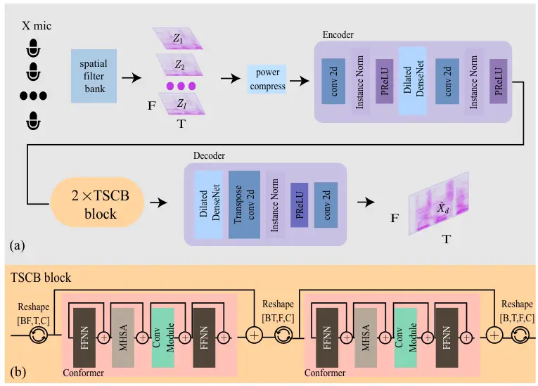
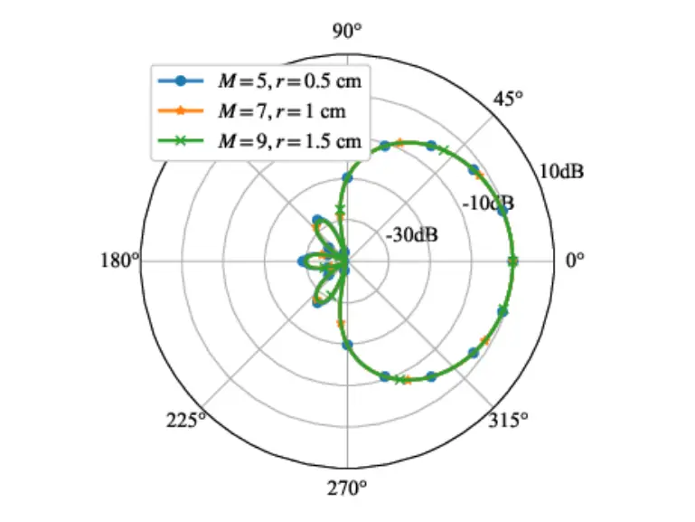
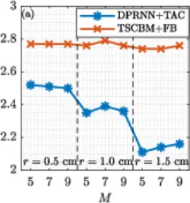
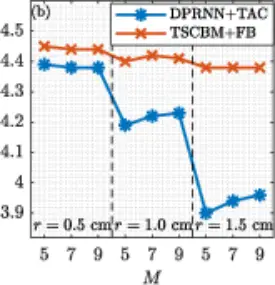
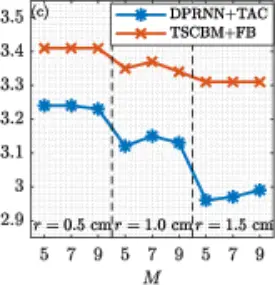
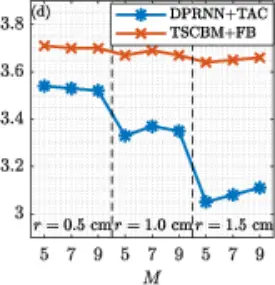

# Spatial-Filter-Bank-Based Neural Method for Multichannel Speech Enhancement

Tianqin Zheng     Jilu Jin     Hanchen Pei     Gongping Huang    
Jingdong Chen     Jacob Benesty

###### Abstract

The performance of deep learning-based multichannel speech enhancement
methods often deteriorates when the geometric parameters of the
microphone array change. Traditional approaches to mitigate this issue
typically involve training on multiple microphone arrays, which can be
costly. To address this challenge, we focus on uniform circular arrays
and propose the use of a spatial filter bank to extract features that
are approximately invariant to geometric parameters. These features are
then processed by a two-stage conformer-based model (TSCBM) to enhance
speech quality. Experimental results demonstrate that our proposed
method can be trained on a fixed microphone array while maintaining
effective performance across uniform circular arrays with unseen
geometric configurations during applications.

###### Index Terms: 

Speech enhancement, multichannel processing, uniform circular microphone
arrays, geometry-agnostic.

## I Introduction

Speech enhancement techniques aim to improve the quality and/or
intelligibility of speech signals. Many deep learning-based
architectures have been developed for this purpose \[1, 2, 3, 4, 5, 6\],
delivering promising results. However, most of these methods are
designed for single-channel scenarios, overlooking the important spatial
information in more complex environments. As a result, multichannel
enhancement approaches have been developed \[8, 9, 10, 11, 12, 13\],
though these are often tailored to specific microphone array topologies,
leading to suboptimal performance when applied to unseen array
geometries. This limitation stems from the models’ inability to adapt to
changes in array geometry. Therefore, achieving model generalization
across diverse array setups is crucial for reducing the need for dataset
reconstruction and retraining.

Some methods have been proposed to improve the adaptability of the model
to address the challenge mentioned above \[14, 15, 16, 17, 18\],
including applying targeted-acceleration-and-compression (TAC) layers to
optimize microphone data integration \[14\], extracting
inter-channel-phase-difference (IPD) features to acquire spatial
information \[18\], and building a triple-path network based on spatial
self-attention to process array observations \[15\]. Although these
methods are effective, they face notable restrictions: they all require
separate processing for each channel, which leads to high computational
overhead, and they rely on diverse datasets for generalization, which is
not feasible for real-world implementations.

To overcome these challenges, we focus on training a model using a fixed
array to ensure robust performance across various geometries. We
introduce a spatial filter bank for feature extraction that remains
nearly invariant to geometric variations. For simplicity, we use uniform
circular arrays (UCAs) to develop the proposed algorithms. By utilizing
a model based on \[2\], we process these features to enhance the speech
signal, simultaneously reducing computational complexity through joint
channel processing. Experimental results demonstrate that our approach
outperforms existing methods and maintains strong performance on unseen
arrays.

The key contributions of this work are threefold. First, we identify the
critical factors influencing model performance across different
microphone arrays and propose an interpretable feature extraction method
to ensure consistent high performance. Second, the proposed method is
highly versatile, capable of integrating with various multichannel
speech enhancement models to improve their generalization to unseen
arrays. Third, while our study primarily focuses on UCAs for simplicity,
the feature extraction technique can be extended to arrays with
arbitrary geometries, e.g., the ones discussed in \[31\].

## II Signal Model and Problem Formulation

Consider a UCA consisting of $`M`$ omnidirectional sensors uniformly
spaced around a circle of radius $`r`$. Taking the center of the UCA as
the reference point and assuming a plane wave arriving from an azimuth
angle $`\theta`$, the phase delay at the $`m`$th sensor relative to the
reference can be expressed as
$`\zeta_{m}\left(\omega,\theta\right)=e^{\jmath\overline{\omega}\cos\left(\theta-\psi_{m}\right)}`$,
$`m=1,2,\ldots,M`$, where $`\jmath`$ is the imaginary unit,
$`\overline{\omega}=\omega r/c`$, $`\omega`$ is the angular frequency,
and $`c`$ denotes the speed of sound in air. The steering vector can
then be represented as

```math
\displaystyle\mathbf{d}\left(\omega,\theta\right) \displaystyle=\left[\begin{array}[]{cccc}\zeta_{1}\left(\omega,\theta\right)&\zeta_{2}\left(\omega,\theta\right)&\cdots&\zeta_{M}\left(\omega,\theta\right)\end{array}\right]^{T},
```

where the superscript ^(T) is the transpose operator. In the
short-time-Fourier-transform (STFT) domain, the signals received by the
UCA can be written as

```math
\displaystyle\mathbf{y}\left(k,\omega\right) \displaystyle=\left[\begin{array}[]{cccc}Y_{1}\left(k,\omega\right)&Y_{2}\left(k,\omega\right)&\cdots&Y_{M}\left(k,\omega\right)\end{array}\right]^{T}
```

```math
\displaystyle=\mathbf{x}_{\mathrm{d}}\left(k,\omega\right)+\mathbf{v}\left(k,\omega\right), \tag{3}
```

where $`\mathbf{v}\left(k,\omega\right)`$, of length $`M`$, is the
vector of the background noise, and

```math
\displaystyle\mathbf{x}_{\mathrm{d}}\left(k,\omega\right) \displaystyle=\left[\begin{array}[]{ccc}X_{1,\mathrm{d}}\left(k,\omega\right)&\cdots&X_{M,\mathrm{d}}\left(k,\omega\right)\end{array}\right]^{T},
```

also of length $`M`$, represents the desired signal originated from the
source of interest, with (see Subsection III-A for more details)

```math
\displaystyle X_{\mathrm{d}}\left(k,\omega\right) \displaystyle=G\left(\omega\right)S\left(k,\omega\right), \tag{5}
```

$`G\left(\omega\right)`$ being the transfer function corresponding to
the direct path and early reflections, and $`S\left(k,\omega\right)`$
denoting the source signal.

The objective of this work is to estimate
$`X_{\mathrm{d}}\left(k,\omega\right)`$ from the array observed vector,
$`\mathbf{y}\left(k,\omega\right)`$. To accomplish this, we derive a
neural network (NN) based method.



Fig. 1: The overall architecture of the proposed TSCBM+FB.

## III Method Derivation

To address the performance degradation of trained models on previously
unseen arrays, we introduce a method called TSCBM+FB, which stands for
two-stage conformer-based model (TSCBM) with filter bank (FB). This
approach first extracts features that are independent of the array
radius and the number of microphones using a spatial FB. These features
are then processed and enhanced by the TSCBM. The overall architecture
of this model is illustrated in Fig. 1. In the following subsections, we
detail the feature extraction process and provide a comprehensive
explanation of the TSCBM architecture.

### III-A Spatial Feature Extraction

Given the decomposition of the spatial room impulse responses, the
transfer function, $`G\left(\omega\right)`$, is composed of
contributions from a set of image sources; consequently,
$`G\left(\omega\right)`$ can be expressed as follows:

```math
\displaystyle G\left(\omega\right) \displaystyle=\sum^{L}_{l=1}Q_{l}\left(\omega\right), \tag{6}
```

where $`Q_{l}\left(\omega\right)`$ represents the spectrum of the
impulse response corresponding to the $`l`$th image source with $`L`$
being the total number of image sources. The desired component of the
source signal received by the $`m`$th microphone can then be written as

```math
\displaystyle X_{m,\mathrm{d}}\left(k,\omega\right) \displaystyle=\sum^{L}_{l=1}Q_{l}\left(\omega\right)\zeta_{m}\left(\omega,\theta_{l}\right)S\left(k,\omega\right), \tag{7}
```

where $`\zeta_{m}\left(\omega,\theta_{l}\right)`$ denotes the phase
delay of the $`l`$th path to the $`m`$th microphone. The vector
$`\mathbf{x}_{\mathrm{d}}\left(k,\omega\right)`$ can then be expressed
as

```math
\displaystyle\mathbf{x}_{\mathrm{d}}\left(k,\omega\right) \displaystyle=\sum^{L}_{l=1}Q_{l}\left(\omega\right)S\left(k,\omega\right)\mathbf{d}\left(\omega,\theta_{l}\right). \tag{8}
```

As indicated by (8), changes in the UCA geometry, such as changes in the
number of sensors or the radius, will affect
$`\mathbf{d}\left(\omega,\theta_{l}\right)`$. This, in turn, can lead to
performance degradation in deep learning models. Therefore, it is
crucial to extract features that are independent of the array geometry.
Specifically, a spatial filter, $`\mathbf{h}\left(\omega\right)`$, can
be used to achieve this. Then, the filtered signal is

```math
\displaystyle Z\left(k,\omega\right) \displaystyle=\mathbf{h}^{H}\left(\omega\right)\mathbf{y}\left(k,\omega\right)
```

```math
\displaystyle=\mathbf{h}^{H}\left(\omega\right)\mathbf{x}_{\mathrm{d}}\left(k,\omega\right)+\mathbf{h}^{H}\left(\omega\right)\mathbf{v}\left(k,\omega\right)
```

```math
\displaystyle=X_{\mathrm{fd}}\left(k,\omega\right)+V_{\mathrm{rn}}\left(k,\omega\right), \tag{9}
```

where the superscript ^(H) is the conjugate-transpose operator,
$`X_{\mathrm{fd}}\left(k,\omega\right)`$ is the filtered desired signal,
and $`V_{\mathrm{rn}}\left(k,\omega\right)`$ is the residual noise.

Let us examine the structure of
$`X_{\mathrm{fd}}\left(k,\omega\right)`$, which is

```math
\displaystyle X_{\mathrm{fd}}\left(k,\omega\right) \displaystyle=\sum^{L}_{l=1}Q_{l}\left(\omega\right)S\left(k,\omega\right)\mathbf{h}^{H}\left(\omega\right)\mathbf{d}\left(\omega,\theta_{l}\right)
```

```math
\displaystyle=\sum^{L}_{l=1}Q_{l}\left(\omega\right)S\left(k,\omega\right)\mathcal{B}\left[\mathbf{h}\left(\omega\right),\theta_{l}\right], \tag{10}
```

where
$`\mathcal{B}\left[\mathbf{h}\left(\omega\right),\theta_{l}\right]`$
denotes the spatial response, i.e., the beampattern at azimuth angle
$`\theta_{l}`$. As shown in (10), $`Q_{l}\left(\omega\right)`$ and
$`S\left(k,\omega\right)`$ are not dependent on the array geometry. If
the spatial response,
$`\mathcal{B}\left[\mathbf{h}\left(\omega\right),\theta_{l}\right]`$, of
the spatial filter is independent of the geometry of the UCA, then the
extracted speech feature will also be independent of the geometric
parameters.

To ensure that the beampattern remains independent of the geometric
parameters, we can design the filter to approximate the desired
directivity pattern. To achieve this, we employ the method proposed
in \[19\]. For a UCA, the ideal beampattern with the mainlobe directed
towards $`\theta_{\mathrm{s}}`$ can be expressed as

```math
\displaystyle\mathcal{B}\left(\mathbf{b}_{N},\theta\right) \displaystyle=\sum_{n=-N}^{N}b_{N,n}e^{\jmath n\left(\theta-\theta_{\mathrm{s}}\right)}
```

```math
\displaystyle=\mathbf{b}_{N}^{T}\mathbf{p}\left(\theta\right), \tag{11}
```

where $`\mathbf{b}_{N}`$ contains the coefficients determining the shape
of the ideal beampattern, $`N`$ is the order of the beampattern, and

```math
\displaystyle\mathbf{p}\left(\theta\right) \displaystyle=\left[\begin{array}[]{ccccc}e^{-\jmath N\theta}&\cdots&1&\cdots&e^{\jmath N\theta}\end{array}\right]^{T}.
```

The design of the beamforming filter can be approached from a
least-squares perspective \[19\]. The filter is formulated as follows:

```math
\displaystyle\mathbf{h}\left(\omega\right) \displaystyle=\frac{1}{M}\mathbf{\Psi}^{H}\mathbf{J}^{*}\left(\overline{\omega}\right)\mathbf{\Upsilon}^{*}\left(\theta_{\mathrm{s}}\right)\mathbf{b}_{N}, \tag{13}
```

where the superscript ^(∗) is the conjugate operator, and

```math
\displaystyle\mathbf{\Psi} \displaystyle=\left[\begin{array}[]{ccccc}\boldsymbol{\psi}_{-N}^{*}&\cdots&\boldsymbol{\psi}_{0}^{*}&\cdots&\bm{\psi}_{N}^{*}\end{array}\right]^{T},
```

```math
\displaystyle\boldsymbol{\psi}_{n} \displaystyle=\left[\begin{array}[]{cccc}e^{-\jmath n\psi_{1}}&e^{-\jmath n\psi_{2}}&\cdots&e^{-\jmath n\psi_{M}}\end{array}\right]^{T},
```

```math
\displaystyle\mathbf{J}\left(\overline{\omega}\right) \displaystyle=\mathrm{diag}\left[\frac{1}{\jmath^{-N}J_{-N}\left(\overline{\omega}\right)}\cdots\frac{1}{J_{0}\left(\overline{\omega}\right)}\cdots\frac{1}{\jmath^{N}J_{N}\left(\overline{\omega}\right)}\right], \tag{16}
```

```math
\displaystyle\mathbf{\Upsilon}\left(\theta_{\mathrm{s}}\right) \displaystyle=\mathrm{diag}\left[e^{\jmath N\theta_{\mathrm{s}}}~~\cdots~~1~~\cdots~~e^{-\jmath N\theta_{\mathrm{s}}}\right], \tag{17}
```

with $`J_{n}\left(\cdot\right)`$ being the $`n`$th-order Bessel function
of the first kind.



Fig. 2: Designed second-order supercardioid beampattern with varying UCA
geometric parameters. Conditions: $`\theta_{\mathrm{s}}=0^{\circ}`$ and
$`f=4`$ kHz.

Figure 2 shows the beampatterns of a supercardioid beamformer designed
for a UCA with different geometric parameters. The beampatterns are
highly consistent, demonstrating that they remain largely unaffected by
geometric variations. This consistency highlights that the features
extracted using this method are primarily independent of geometric
parameters, which is crucial for maintaining robustness across various
array configurations.

Although the beampattern of a spatial filter can be designed to be
independent of the geometric parameters of the UCA, it mainly enhances
sound from a specific direction, $`\theta_{\mathrm{s}}`$, while
attenuating sound from other directions, as shown in Fig. 2. Since the
speaker’s location is typically unknown in practice, it is necessary to
use a set of spatial filters oriented in different directions to form a
spatial FB for feature extraction. Specifically, we use a total of $`I`$
filters, where the $`i`$th filter orients toward
$`\theta_{\mathrm{s}}=\frac{i}{I}2\pi`$, and the output from this filter
is denoted as $`Z_{i}`$.

### III-B Model Architecture

Our network is built upon CMGAN \[2\], which incorporates a
well-established dual-path architecture that effectively captures both
temporal and frequency information in speech signals, demonstrating
outstanding performance in speech enhancement tasks. To address the
specific challenges we encountered, we streamlined the network structure
and adapted the proposed approach to the TSCBM. It is important to
highlight that our method is not limited to TSCBM and can be applied to
most multichannel speech enhancement models. We choose TSCBM as the
backbone model to simultaneously process multichannel signals,
eliminating the need for separate processing of individual channels
\[14, 15, 18\], which is crucial for reducing computational complexity.

#### III-B1 Input Features

The spatial FB’s output features are compressed to equalize the
significance of softer sounds against louder ones:

```math
\displaystyle Z_{i}^{{}^{\prime}}=|Z_{i}|^{c}e^{\jmath\angle{Z_{i}}}, \tag{18}
```

where $`Z_{i}^{{}^{\prime}}`$ is the compressed feature and $`c=0.3`$ is
the compression exponent as per \[2\]. The real and imaginary parts of
$`Z_{i}^{{}^{\prime}}`$ are concatenated to form the input
$`Z^{{}^{\prime}}\in\mathcal{R}^{B\times 2I\times T\times F}`$, with
$`T`$ and $`F`$ representing time and frequency dimensions,
respectively.

#### III-B2 Encoder

The encoder maps $`Z^{{}^{\prime}}`$ into a latent feature space. It
initiates with a convolutional block with a kernel of $`(1,1)`$ and
stride $`(1,1)`$, followed by instance normalization and PReLU
activation. This yields an intermediate feature map $`[B,C,T,F]`$ with
$`C=64`$. A dilated DenseNet with dilation factors of 1 and 2 is then
applied. The process ends with a convolutional block with a kernel of
$`(1,3)`$ and stride $`(1,2)`$, downsampling the frequency dimension.

#### III-B3 TSCB Block

Intermediate features pass through two-stage conformer blocks (TSCBs) to
capture temporal and frequency dependencies. Each TSCB, as shown in
Fig. 1(b), contains two conformer blocks, each addressing temporal and
frequency dependencies. These blocks include two FFNNs, an MHSA
mechanism with four heads, and a convolution module. Skip connections
are used to preserve feature integrity.

#### III-B4 Decoder

The decoder reconstructs the desired signal spectrum. It begins with a
dilated DenseNet mirroring the encoder’s architecture. A sub-pixel
convolution block follows, doubling the feature dimension to $`C=128`$
and upsampling the frequency dimension via pixel shuffle. The final
convolution block includes instance normalization, PReLU activation, and
a kernel of $`(1,2)`$, yielding a final feature map with $`C=2`$ for the
real and imaginary parts of the signal spectrum.

## IV Experiments

### IV-A Experimental Setup

#### IV-A1 Dataset

We simulated a multichannel dataset using the VoiceBank and DEMAND
datasets. The training set features clean speech mixed with 12 types of
background noise from DEMAND at SNR levels ranging from $`-5`$ to
$`10`$ dB. The test set introduces 5 new noise types from DEMAND, with
multichannel RIR generated via the image model. Room dimensions vary
from $`3`$ m $`\times`$ $`3`$ m $`\times`$ $`2.5`$ m to $`7`$ m
$`\times`$ $`9`$ m $`\times`$ $`3`$ m, and reverberation time
($`T_{60}`$) is randomly set between $`0.2`$ and $`0.35`$ seconds.
Microphone array, sound source, and noise source positions are randomly
determined, with a minimum directional angle difference of $`5^{\circ}`$
between the target speech and interference. To test generalization
across array geometries, the number of microphones and UCA radius differ
between training (5 microphones, 0.5 cm radius) and test sets (7 or 9
microphones, 1 cm or 1.5 cm radius). Unlike most related work that
trains on multiple arrays for generalizability, our approach trains on a
single UCA type and evaluates performance across four distinct UCA
types.

Evaluation metrics include floating point operations per second (FLOPS)
of the model, perceptual evaluation of speech quality (PESQ) \[27\],
mean opinion score (MOS) predictions of speech distortion (CSIG), MOS
predictions of intrusiveness of background noise (CBAK), MOS predictions
of overall processed speech quality (COVL) \[28\], and STOI \[29\]. PESQ
ranges from $`-0.5`$ to $`4.5`$, CSIG, CBAK, and COVL from $`1`$ to
$`5`$, and STOI from $`0`$ to $`1`$. Apart from FLOPS, higher scores on
all other metrics indicate better performance.

#### IV-A2 Training Configuration

The training set utterances are truncated into $`2`$-second segments,
while the test set uses full-length sentences. Following the method
outlined in \[2\], we apply a Hamming window with a $`25`$-ms window
length (corresponding to 400-point FFT) and a hop size of $`6.25`$ ms
(i.e., $`75\%`$ overlap). A total of 9, (i.e., $`I=9`$) spatial filters
are used, which are oriented at $`\theta_{\mathrm{s}}=\frac{i}{I}2\pi`$
to extract $`I`$ features, employing a second-order supercardioid
filter. The coefficients for the ideal beampattern used to design this
filter are
$`\mathbf{b}_{N}=\left[0.1035~0.242~0.309~0.242~0.1035\right]^{T}`$. The
loss function is based on the mean-squared error of the real part,
imaginary part, and magnitude of the estimated spectrum. During
training, the AdamW optimizer \[30\] is employed with a learning rate of
$`5\times 10^{-4}`$.

#### IV-A3 Comparison Methods

For comparison, we employ the FaSNet+TAC network \[14\] as a baseline.
Originally designed for permutation- and number-invariant speech
separation, it is modified for speech enhancement by omitting the
beamforming component due to the absence of a reference center
microphone. This modified model is termed DPRNN+TAC. Furthermore, we
introduce a DPRNN+FB model, a variant of DPRNN+TAC that removes the TAC
module, enabling joint channel processing. This model is integrated with
our feature extraction method to show that our approach can effectively
avoid the high computational complexity typically associated with
TAC-like modules in array geometry-agnostic tasks. To address the
degradation of deep learning models on unseen UCAs, we train TSCBM on a
fixed array with 5 microphones and a radius $`0.5`$ cm. For testing, if
the test array exceeds 5 microphones, we select $`5`$ with azimuth
angles closest to the training array as the TSCBM input, referred to as
TSCBM+select. Our proposed method, incorporating spatial FB, is dubbed
TSCBM+FB.

### IV-B Experimental Results

| Model        | FLOPS | PESQ | CSIG | CBAK | COVL | STOI  |
| ------------ | ----- | ---- | ---- | ---- | ---- | ----- |
| Noisy        |       | 1.23 | 2.72 | 1.86 | 1.99 | 0.789 |
| DPRNN+TAC    | 31.3G | 2.25 | 4.09 | 3.06 | 3.23 | 0.914 |
| TSCBM+select | 28.3G | 2.50 | 4.02 | 3.21 | 3.32 | 0.934 |
| DPRNN+FB     | 2.77G | 2.25 | 4.15 | 2.98 | 3.26 | 0.911 |
| TSCBM+FB     | 28.3G | 2.76 | 4.36 | 3.30 | 3.64 | 0.947 |

TABLE I: Speech enhancement performance of the DPRNN+TAC, TSCBM+select,
and TSCBM+FB methods.

We first evaluate the performance of these methods on the test set. The
results are presented in Table I in details; they indicate that TSCBM+FB
excels when our feature extraction methods are employed, underscoring
the model’s ability to adapt to unseen microphone arrays by extracting
geometry-independent features. It is seen that DPRNN+FB and DPRNN+TAC
exhibit comparable performance, even though the computational complexity
of DPRNN+FB is approximately one-tenth that of DPRNN+TAC. This indicates
that our feature extraction methods can substantially reduce
computational demands in array geometry-agnostic tasks. Furthermore,
TSCBM+select outperforms DPRNN+TAC, validating the effectiveness of
selecting microphones similar to those used in training.









Fig. 3: Performance comparison between DPRNN+TAC and TSCBM+FB versus
different numbers of microphones and radii: (a) PESQ, (b) CSIG,
(c) CBAK, and (d) COVL.

To evaluate the generalization of our method across microphone array
geometries, we create 9 test sets with varying radii (0.5, 1, and 1.5
cm) and microphone counts (5, 7, and 9). Both DPRNN+TAC and TSCBM+FB are
trained on a UCA with 5 microphones and a 0.5 cm radius. The test set
configuration ($`M=5`$, $`r=0.5`$ cm) matches the training set, serving
as a “reference performance.” Figure 3 displays the performance metrics.
DPRNN+TAC maintains consistent performance across different microphone
numbers but degrades with changes in array radius, as the TAC module
handles channel count variations but not radius changes. In contrast,
TSCBM+FB shows stable performance across both radius and microphone
count variations, indicating its robust generalization across array
geometries.

## V Conclusions

This paper addresses the challenge of training a model on a fixed
uniform circular microphone array to ensure consistent performance
across various UCAs. We employ a spatial filter bank to extract
geometry-independent features for speech enhancement using TSCBM.
Despite its simplicity, our feature extraction method is highly
effective. Our approach demonstrates robust performance and
generalization across different array geometries. While we focus on
circular arrays for simplicity, the underlying principles are applicable
to arbitrarily shaped planar arrays, positioning our method as a
potential standard for generalizing across diverse microphone
configurations.

## References

- \[1\] K. Tan and D. Wang, “A convolutional recurrent neural network
  for real-time speech enhancement,” in Proc. Interspeech, 2018.
- \[2\] S. Abdulatif, R. Cao, and B. Yang, “CMGAN: conformer-based
  Metric-GAN for monaural speech enhancement,” IEEE/ACM Trans. Audio,
  Speech, Lang. Process., vol. 32, pp. 2477–2493, 2024.
- \[3\] H. Schroter, A. N. Escalante-B, T. Rosenkranz, and A. Maier,
  “DeepFilterNet: a low complexity speech enhancement framework for
  full-band audio based on deep filtering,” in Proc. IEEE ICASSP,
  pp. 7407–7411, 2022.
- \[4\] E. Kim and H. Seo, “SE-Conformer: time-domain speech enhancement
  using Conformer.,” in Proc. Interspeech, pp. 2736–2740, 2021.
- \[5\] G. Yu, A. Li, C. Zheng, Y. Guo, Y. Wang, and H. Wang,
  “Dual-branch attention-in-attention transformer for single-channel
  speech enhancement,” in Proc. IEEE ICASSP, pp. 7847–7851, 2022.
- \[6\] S.-W. Fu, C.-F. Liao, Y. Tsao, and S.-D. Lin, “MetricGAN:
  generative adversarial networks based black-box metric scores
  optimization for speech enhancement,” in Proceedings of the 36th
  International Conference on Machine Learning (K. Chaudhuri and
  R. Salakhutdinov, eds.), vol. 97 of Proceedings of Machine Learning
  Research, pp. 2031–2041, 09–15 Jun 2019.
- \[7\] G. Li, S. Liang, S. Nie, W. Liu, M. Yu, L. Chen, S. Peng, and
  C. Li, “Direction-aware speaker beam for multi-channel speaker
  extraction,” in Proc. Interspeech, pp. 2713–2717, 2019.
- \[8\] C.-L. Liu, S.-W. Fu, Y.-J. Li, J.-W. Huang, H.-M. Wang, and
  Y. Tsao, “Multichannel speech enhancement by raw waveform-mapping
  using fully convolutional networks,” IEEE/ACM Trans. Audio, Speech,
  Lang. Process., vol. 28, pp. 1888–1900, Feb 2020.
- \[9\] Z.-Q. Wang, P. Wang, and D. Wang, “Complex spectral mapping for
  single- and multi-channel speech enhancement and robust ASR,” IEEE/ACM
  Trans. Audio, Speech, Lang. Process., vol. 28, pp. 1778–1787,
  May 2020.
- \[10\] Z. Zhang, Y. Xu, M. Yu, S.-X. Zhang, L. Chen, and D. Yu,
  “ADL-MVDR: all deep learning MVDR beamformer for target speech
  separation,” in Proc. IEEE ICASSP, pp. 6089–6093, 2021.
- \[11\] J. Casebeer, J. Donley, D. Wong, B. Xu, and A. Kumar,
  “NICE-Beam: neural integrated covariance estimators for time-varying
  beamformers,” arXiv preprint arXiv:2112.04613, 2021.
- \[12\] Z.-Q. Wang, J. Le Roux, and J. R. Hershey, “Multi-channel deep
  clustering: discriminative spectral and spatial embeddings for
  speaker-independent speech separation,” in Proc. IEEE ICASSP,
  pp. 1–5, 2018.
- \[13\] B. Tolooshams, R. Giri, A. H. Song, U. Isik, and
  A. Krishnaswamy, “Channel-attention dense U-Net for multichannel
  speech enhancement,” in ICASSP 2020-2020 IEEE International Conference
  on Acoustics, Speech and Signal Processing (ICASSP),
  pp. 836–840, 2020.
- \[14\] Y. Luo, Z. Chen, N. Mesgarani, and T. Yoshioka, “End-to-end
  microphone permutation and number invariant multi-channel speech
  separation,” in Proc. IEEE ICASSP, pp. 6394–6398, 2020.
- \[15\] A. Pandey, B. Xu, A. Kumar, J. Donley, P. Calamia, and D. Wang,
  “TPARN: triple-path attentive recurrent network for time-domain
  multichannel speech enhancement,” in Proc. IEEE ICASSP,
  pp. 6497–6501, 2022.
- \[16\] W. Zhang, K. Saijo, Z.-Q. Wang, S. Watanabe, and Y. Qian,
  “Toward universal speech enhancement for diverse input conditions,” in
  2023 IEEE Automatic Speech Recognition and Understanding Workshop
  (ASRU), pp. 1–6, 2023.
- \[17\] J. Lin, N. Moritz, Y. Huang, R. Xie, M. Sun, C. Fuegen, and
  F. Seide, “AGADIR: towards array-geometry agnostic directional speech
  recognition,” in Proc. IEEE ICASSP, pp. 11951–11955, 2024.
- \[18\] T. Yoshioka, X. Wang, D. Wang, M. Tang, Z. Zhu, Z. Chen, and
  N. Kanda, “VarArray: array-geometry-agnostic continuous speech
  separation,” in Proc. IEEE ICASSP, pp. 6027–6031, 2022.
- \[19\] G. Huang, J. Benesty, and J. Chen, “On the design of
  frequency-invariant beampatterns with uniform circular microphone
  arrays,” IEEE Trans. Audio, Speech, Lang. Process., vol. 25,
  pp. 1140–1153, May 2017.
- \[20\] D. Ulyanov, A. Vedaldi, and V. Lempitsky, “Instance
  normalization: the missing ingredient for fast stylization,” arXiv
  preprint arXiv:1607.08022, 2016.
- \[21\] K. He, X. Zhang, S. Ren, and J. Sun, “Delving deep into
  Rectifiers: surpassing human-level performance on ImageNet
  classification,” in Proceedings of the IEEE international conference
  on computer vision, pp. 1026–1034, 2015.
- \[22\] A. Pandey and D. Wang, “Densely connected neural network with
  dilated convolutions for real-time speech enhancement in the time
  domain,” in Proc. IEEE ICASSP, pp. 6629–6633, 2020.
- \[23\] A. Gulati, J. Qin, C.-C. Chiu, N. Parmar, Y. Zhang, J. Yu,
  W. Han, S. Wang, Z. Zhang, Y. Wu, et al., “Conformer:
  convolution-augmented transformer for speech recognition,” Proc.
  Interspeech, 2020.
- \[24\] C. Veaux, J. Yamagishi, and S. King, “The voice bank corpus:
  design, collection and data analysis of a large regional accent speech
  database,” in 2013 International Conference Oriental COCOSDA held
  jointly with 2013 Conference on Asian Spoken Language Research and
  Evaluation (O-COCOSDA/CASLRE), pp. 1–4, 2013.
- \[25\] J. Thiemann, N. Ito, and E. Vincent, “The diverse environments
  multi-channel acoustic noise database (DEMAND): A database of
  multichannel environmental noise recordings,” in Proceedings of
  Meetings on Acoustics, vol. 19, 2013.
- \[26\] J. B. Allen and D. A. Berkley, “Image method for efficiently
  simulating small-room acoustics,” J. Acoust. Soc. Am., vol. 65, no. 4,
  pp. 943–950, 1979.
- \[27\] A. Rix, J. Beerends, M. Hollier, and A. Hekstra, “Perceptual
  evaluation of speech quality (PESQ)-a new method for speech quality
  assessment of telephone networks and codecs,” in Proc. IEEE ICASSP,
  vol. 2, pp. 749–752 vol.2, 2001.
- \[28\] Y. Hu and P. C. Loizou, “Evaluation of objective quality
  measures for speech enhancement,” IEEE/ACM Trans. Audio, Speech, Lang.
  Process., vol. 16, pp. 229–238, Jan 2008.
- \[29\] C. H. Taal, R. C. Hendriks, R. Heusdens, and J. Jensen, “A
  short-time objective intelligibility measure for time-frequency
  weighted noisy speech,” in Proc. IEEE ICASSP, pp. 4214–4217, 2010.
- \[30\] I. Loshchilov and F. Hutter, “Decoupled weight decay
  regularization,” arXiv preprint arXiv:1711.05101, 2017.
- \[31\] G. Huang, J. Chen, and J. Benesty, “On the design of
  differential beamformers with arbitrary planar microphone array
  geometry,” JASA, vol. 144, pp. EL66–EL70, 2018
