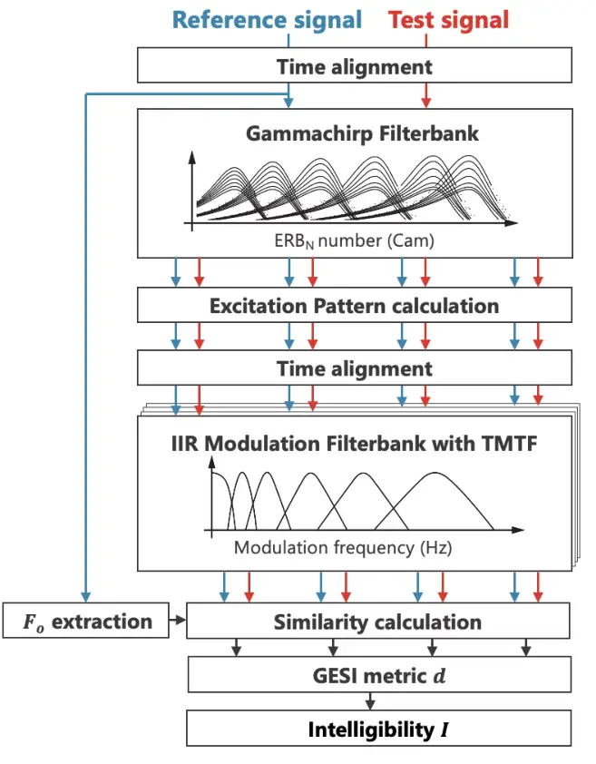
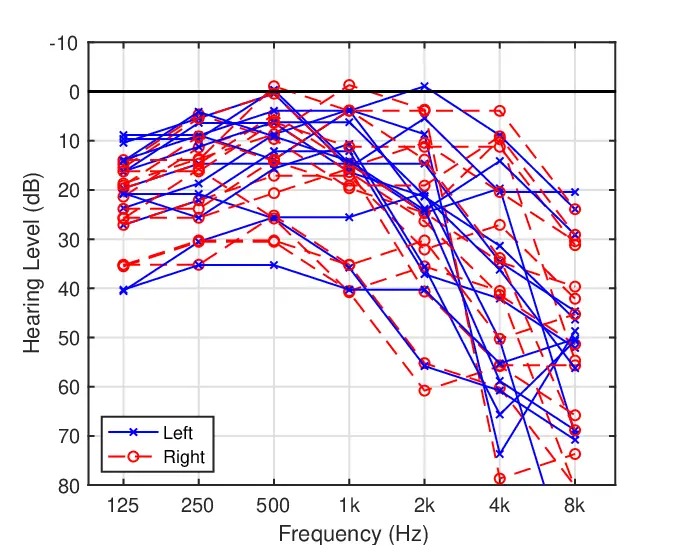
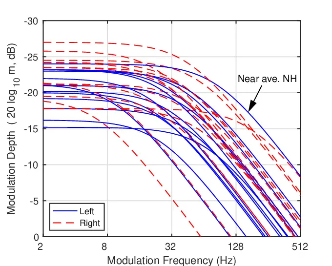
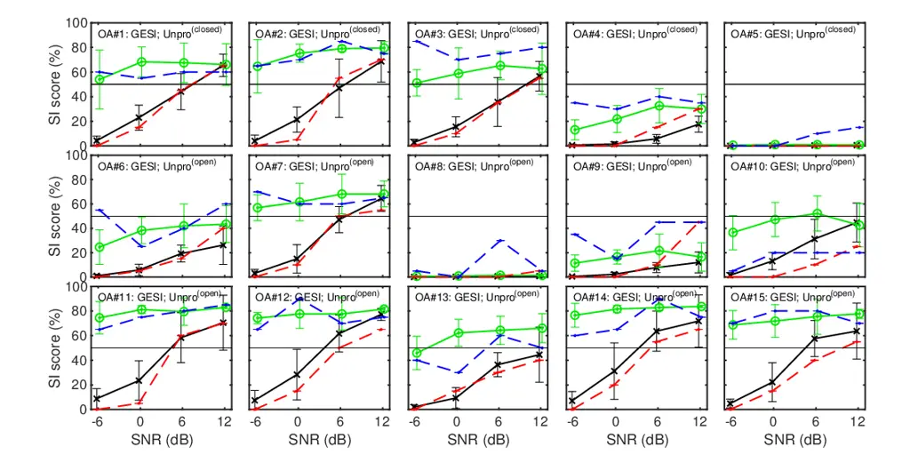
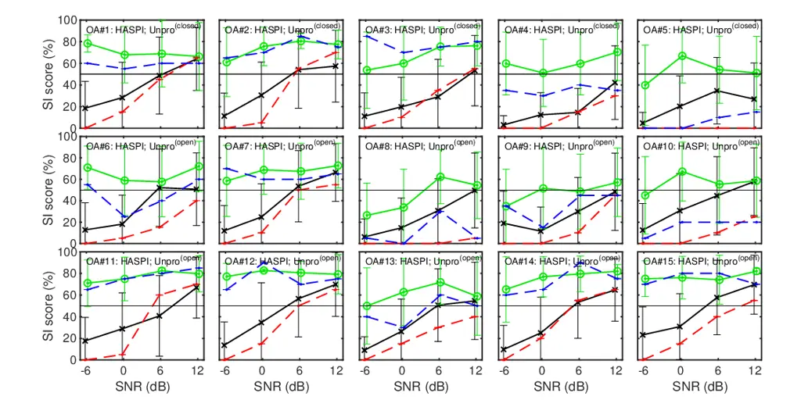
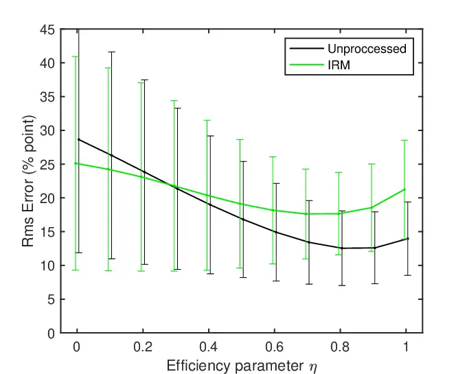
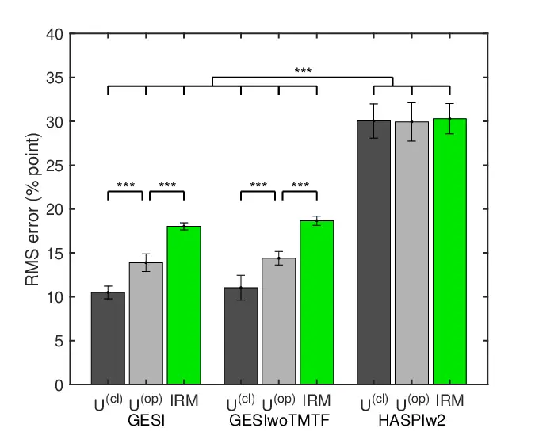
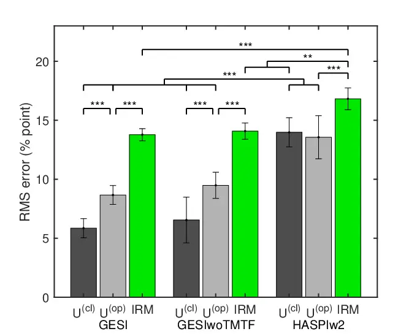
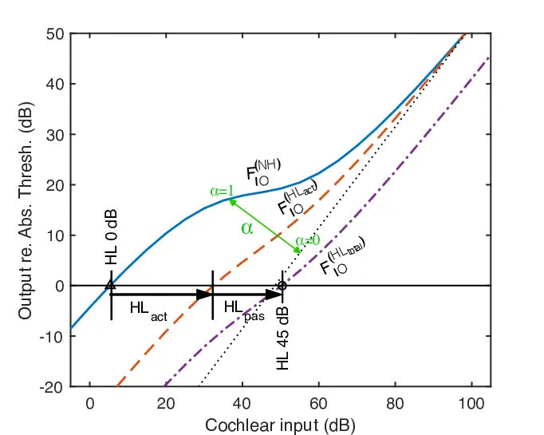
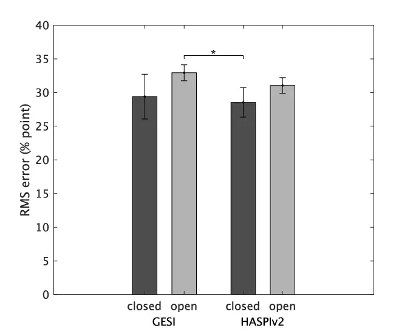

# Predicting speech intelligibility in older adults for speech enhancement using the Gammachirp Envelope Similarity Index, GESI

Journal: Speech Communication

Ayako Yamamoto Email: <yamamoto.ayako@g.wakayama-u.jp> Address: Graduate
School of Systems Engineering, Wakayama University, Sakaedani 930,
Wakayama, Wakayama 640–8510, Japan    Fuki Miyazaki
Email: <miyazaki.fuki@g.wakayama-u.jp> Address: Graduate School of
Systems Engineering, Wakayama University, Sakaedani 930, Wakayama,
Wakayama 640–8510, Japan    Toshio Irino Email: <irino@wakayama-u.ac.jp>
Address: Graduate School of Systems Engineering, Wakayama University,
Sakaedani 930, Wakayama, Wakayama 640–8510, Japan Address: Faculty of
Systems Engineering & Center for Innovative and Joint Research, Wakayama
University, Sakaedani 930, Wakayama, Wakayama 640–8510, Japan

###### Abstract

We propose an objective intelligibility measure (OIM), called the
Gammachirp Envelope Similarity Index (GESI), that can predict speech
intelligibility (SI) in older adults. GESI is a bottom-up model based on
psychoacoustic knowledge from the peripheral to the central auditory
system. It computes the single SI metric using the gammachirp filterbank
(GCFB), the modulation filterbank, and the extended cosine similarity
measure. It takes into account not only the hearing level represented in
the audiogram, but also the temporal processing characteristics captured
by the temporal modulation transfer function (TMTF). To evaluate
performance, SI experiments were conducted with older adults of various
hearing levels using speech-in-noise with ideal speech enhancement on
familiarity-controlled Japanese words. The prediction performance was
compared with HASPIw2, which was developed for keyword SI prediction.
The results showed that GESI predicted the subjective SI scores more
accurately than HASPIw2. GESI was also found to be at least as effective
as, if not more effective than, HASPIv2 in predicting English
sentence-level SI. The effect of introducing TMTF into the GESI
algorithm was insignificant, suggesting that TMTF measurements and
models are not yet mature. Therefore, it may be necessary to perform
TMTF measurements with bandpass noise and to improve the incorporation
of temporal characteristics into the model.

###### Keywords: 

Speech intelligibility; Hearing loss; Objective intelligibility measure;
Auditory model; Speech enhancement; Ideal ratio masker;

## 1 Introduction

The number of older adults is increasing in many countries. As a result,
the number of people with age-related hearing loss (HL) is expected to
increase. HL impairs speech communication, which is the basis of human
interaction, and leads to a decline in quality of life (QOL). The Lancet
Committee \[Livingston et al., 2024\] has also reported that HL is one
of the major modifiable risk factors for dementia, highlighting the
importance of early intervention. Hearing aids are one of the most
important solutions for age-related HL today. However, not everyone with
HL uses them. For example, the usage rate is around 40% to 50% in
European countries, whereas in Japan it is only 15% \[Anovum, 2022\].
Furthermore, satisfaction levels among wearers are lower in Japan, at
around 50%, compared with over 70% in European countries. This may be
due to differences in policy, medical approach and issues such as cost.
Ultimately, however, it may also be because hearing aids do not yet
provide sufficient performance to compensate for HL.

To solve this problem, it is now critical to develop the next generation
of assistive listening devices that can compensate for the difficulties
experienced by people with HL. Speech enhancement (SE) and noise
reduction algorithms \[Loizou, 2013\] need to become more robust and
effective based on individual hearing characteristics. For algorithm
evaluation, subjective listening tests to measure speech intelligibility
(SI) are essential, but time-consuming and costly. Therefore, it is
important to develop an effective objective intelligibility measure
(OIM) that can predict SI for listeners with individually different HL.

Many OIMs have been proposed to evaluate SI when using SE and noise
reduction algorithms \[Falk et al., 2015, Van Kuyk et al., 2018\].
STOI \[Taal et al., 2011\] and ESTOI \[Jensen & Taal, 2016\] have been
used for this purpose in many studies. GEDI has also been proposed for
more conservative evaluation \[Yamamoto et al., 2020\]. They are
intrusive methods that use both the unprocessed or clean reference
signal and the test signal to compute the metric. They provide a single
metric value that can be converted to the SI scores of speech sounds
with a monotonic function such as a sigmoid or cumulative Gaussian.
Because of this simplicity, many studies compare the proposed and
conventional SE algorithms directly using this metric, without
converting to an objective SI score, which requires some human SI data.
Although these OIMs work well for predicting SI in normal hearing (NH)
listeners, they cannot predict SI in people with varying degrees of HL
who truly need good hearing assistive devices.

There are some OIMs that can take the HL into account. Kates & Arehart
\[2014\] proposed HASPI to predict the SI of listeners with HL when
using hearing aids. One reason may be that the prediction by this
version of HASPI, which provides two or more independent metrics,
requires some subjective SI scores. The SI score is calculated by the
weighted sum of these metrics with a sigmoid function, and the weights
could only be estimated by subjective SI scores.

More recently, by extending the algorithm in GEDI, a new OIM called GESI
(Gammachirp Envelope Similarity Index) has been proposed to provide a
single metric suitable for such SE evaluations \[Irino et al., 2022,
Yamamoto et al., 2023\]. These OIMs can reflect the hearing level and
the degradation factors of the active mechanism of the cochlea. They are
based on an auditory filterbank, some form of temporal modulation
analysis, feature extraction, and correlation or similarity between the
reference and test signals. The metric is derived solely from bottom-up
features extracted by an auditory model, using a small number of
explicitly defined and interpretable parameters.

This approach contrasts with the method of training a neural network
(NN) using parallel data of sounds and subjective SI scores, as in HASPI
version 2 \[Kates & Arehart, 2021\], HASPIw2 \[Kates, 2023\], and more
recent deep neural network (DNN) models (e.g., Huckvale & Hilkhuysen
2022, Tu et al. 2022, Kamo et al. 2022). Clarity Prediction Challenge
(CPC)  \[Barker et al., 2022, Barker et al., 2024\] promoted such
machine learning OIMs for SI prediction of listeners with HL. The DNN
models outperform the simple bottom-up OIMs with the effect of learning
algorithms with massive amounts of training data. However, it is well
known that the range of good performance is usually limited by the
prepared training data, computing power, and memory. In addition, the
derived system is a black box, and it is difficult to analyze how the
objective SI score is calculated for individual HL listeners. Moreover,
the OIMs with NNs and DNNs use a large number of uninterpretable
parameters, and their values are derived from learning, including
higher-order knowledge, such as contextual information within a
sentence. Therefore, there may not be a simple monotonic relationship
between the improvement due to signal processing and the predicted SI
score derived from them. This may be especially true when overfitting
the training data or in untrained conditions. In other words, it may be
difficult to interpret the effect of signal processing from the SI
scores.

In contrast, OIMs that model bottom-up auditory signal processing
provide better insight into how specific dysfunctions affect the SI of
listeners with HL. With an OIM consisting only of interpretable
parameters, the mapping between the degree of performance improvement
achieved through signal processing and the predicted SI scores is
expected to be simpler and easier to understand than when using NNs and
DNNs. Furthermore, the bottom-up OIMs could be further improved in line
with advances in models based on psychophysical and physiological
knowledge. They can also be used as part of the DNN methods, which could
improve the performance compared to simple end-to-end (i.e.,
signal-to-SI) DNN methods.

GESI was developed with this in mind and to measure performance
improvements in effective signal processing such as SE and noise
suppression. GESI has been shown to predict subjective SI scores more
accurately than STOI, ESTOI, and HASPI  \[Irino et al., 2022, Yamamoto
et al., 2023\]. However, the evaluation was limited to the SI
experiments with NH listeners using simulated HL sounds processed by
WHIS \[Irino, 2023\]. The variation of the sounds was also limited to
simulating the average hearing levels of 70- and 80-year-olds, although
there was variability in listening conditions in the laboratory and in
remote crowdsourced environments. It remains to be demonstrated whether
GESI can predict SI in older adults with individually different HL.

In this study, GESI was extended based on several psychoacoustic
findings. SI can be influenced not only by the hearing level that
appears on the audiogram, but also by the temporal processing
characteristics  \[Moore, 2013\]. The extension includes the
introduction of the temporal modulation transfer function
(TMTF) \[Viemeister, 1979, Morimoto et al., 2019\] as a first attempt.
New SI experiments with older adults were conducted to clarify the
effects of the SE algorithm on SI. The SE was performed with the Ideal
Ratio Mask (IRM), which was proposed to provide oracle data to train the
DNN-based SE algorithms \[Wang et al., 2014\]. The results can provide
information about the upper performance limit of SE algorithms. The main
research question is whether GESI can predict the derived subjective SI
scores better than HASPIw2 \[Kates, 2023\], which is the latest version
of the OIM that can incorporate the HL. Furthermore, we would like to
discuss GESI’s ability to predict sentence-level SI by comparing it with
HASPIv2.

## 2 Proposed and conventional OIMs

We describe the algorithms of GESI \[Irino et al., 2022, Yamamoto
et al., 2023\] and its extension in sections 2.1, 2.2, and 2.3, and the
competing conventional OIM, HASPIw2 \[Kates, 2023\] in section 2.4.

### 2.1 Background of GESI

GESI is designed to objectively predict SI in older adults with
age-related HL when listening to sounds enhanced with nonlinear SE
algorithms. It is an intrusive measure that requires both the test
signal and the original reference signal as inputs. GESI is based on the
same auditory model as GEDI \[Yamamoto et al., 2020\], which was
applicable to NH listeners. While GEDI measures the spectral distortion
between the reference and test signals, GESI assesses the similarity of
auditory representations that reflect HL characteristics. In this study,
we extended GESI based on several psychoacoustic observations, such as
hearing level, the effect of room acoustics, and temporal processing
characteristics. In the following, we first describe the processing flow
of the GESI algorithm in section 2.2. A detailed explanation of the
signal processing in each block and its rationale is then provided in
section 2.3.



Figure 1: Block diagram of GESI

### 2.2 Processing flow of GESI

Figure 1 shows the block diagram of GESI. The input sounds to GESI are
reference ($`r`$) and test ($`t`$) signals. First, the cross-correlation
between them is computed to perform the time alignment of the speech
segment. Then, both signals are analyzed with the gammachirp auditory
filterbank (GCFB) \[Irino & Patterson, 2006, Irino, 2023\], which
contains the transfer function between the sound field and the cochlea.
The output is the Excitation Pattern (EP) sequence with 0.5 ms frame
shift, something like an “auditory” spectrogram (hereafter referred to
as EPgram). The EP is calculated using the cochlear input-output (IO)
function with the absolute threshold (AT) set to 0 dB. The noise floor
is represented by a Gaussian noise with a root mean squared (RMS) value
of 1 for practical calculations.

The reference speech is always analyzed using the GCFB parameters of a
typical NH listener, while the test speech is analyzed using parameters
that reflect the individual listener’s hearing level, that is either
normal or with HL. This allows GESI to reflect cochlear HL resulting
from dysfunction of active amplification by outer hair cells (OHCs) and
passive transduction by inner hair cells (IHCs). The required input
parameters are the hearing levels represented by an audiogram, and the
compression health parameter ($`\alpha`$), which indicates the degree of
health in the compressive IO function of the cochlea \[Irino, 2023\]. No
dysfunction corresponds to $`\alpha=1`$ and completely damaged function
corresponds to $`\alpha=0`$. In this study, the hearing level was set to
0 dB and $`\alpha=1`$ (i.e., NH level) to analyze the reference signal.
The individual listener’s hearing level and a default value of
$`\alpha=0.5`$, a moderate level, were used to analyze the test signal.
This is because the $`\alpha`$ value cannot be estimated without
extensive psychoacoustic experiments. See A for more details.

Next, the time offset between the EPgrams of the reference and test
speech is compensated for each channel of the GCFB. The
cross-correlation is computed to find the peak position within the
maximum correction range of $`\pm T_{ma}`$, and the time alignment is
performed accordingly (see section 2.3.1 for details).

After this correction, the EPgrams are analyzed using an infinite
impulse response (IIR) version of the modulation frequency filterbank
(MFB) used in GEDI  \[Yamamoto et al., 2018, Yamamoto et al., 2020\].
The MFB was first introduced in sEPSM \[Jørgensen & Dau, 2011, Jørgensen
et al., 2013\] and implemented using the Fourier transform. However, the
IIR version is more phase sensitive, which may lead to better
prediction. The upper limit of the modulation frequency of the MFB was
limited to 32 Hz as described in section 2.3.2. In addition, the peak
gain of each filter in the MFB was set to the corresponding value of the
TMTF \[Morimoto et al., 2019\] of NH and older adults, as described in
section 2.3.3.

The internal index is computed using an extended version of the cosine
similarity between the MFB outputs for the reference signal
($`m_{ij}^{r}(\tau)`$) and the test signal ($`m_{ij}^{t}(\tau)`$):

```math
\displaystyle S_{ij} \displaystyle= \displaystyle\frac{\sum_{\tau}w_{i}(\tau)\cdot m_{ij}^{r}(\tau)\cdot m_{ij}^{t}(\tau)}{(\sum_{\tau}{m_{ij}^{r}(\tau)}^{2})^{\rho}\cdot(\sum_{\tau}{m_{ij}^{t}(\tau)}^{2})^{\,(1-\rho)}} \tag{1}
```

where $`i`$ is the GCFB channel $`\{i\,|\,1\leq i\leq N\}`$, $`j`$ is
the MFB channel $`\{j\,|\,1\leq j\leq M\}`$, $`\tau`$ is a time frame
number. $`\rho`$ $`\{\rho\,|\,0\leq\rho\leq 1\}`$ is a weight value that
allows us to handle the level difference between the reference and test
sounds. Although $`\rho=0.5`$ is the original definition of cosine
similarity, the level difference is normalized to make the evaluation
more difficult. See section 2.3.6 for more details. $`w_{i}(\tau)`$ is a
weighting function applied to each GCFB channel, as described in section
2.3.4.

The overall similarity index $`d`$ is obtained by weighting and
averaging $`S_{ij}`$ in Eq. 1 by all $`i`$ and $`j`$ .

```math
\displaystyle d \displaystyle= \displaystyle\frac{1}{MN}\sum_{i=1}^{N}\sum_{j=1}^{M}w_{j}\,S_{ij}, \tag{2}
```

where $`w_{j}`$ is a weighting function applied to each MFB channel. In
this study, $`w_{j}=1`$ is used, but is adjustable.

The metric $`d`$ can be converted to word correct score (%) or
intelligibility $`I`$ by the sigmoid function used in STOI \[Taal
et al., 2011\] and ESTOI  \[Jensen & Taal, 2016\]. That is:

```math
\displaystyle I \displaystyle= \displaystyle\frac{I_{max}}{1+\exp(a\cdot d+b)} \tag{3}
```

where $`a`$ and $`b`$ are parameters determined from a subset of the SI
scores in the experimental results using the least squares error method.
$`I_{max}`$ represents the maximum SI specific to the speech dataset
used in the experiments. In this study, it was set to 85% based on the
SI data of the least familiar words in FW07, i.e., a subset of
FW03 \[Amano et al., 2009\].

Conversion to SI is necessary when calculating the RMS error between the
subjective and objective SI. However, this is not necessary to compare
the performance of SE algorithms. The metric $`d`$ can be used directly,
as is commonly done in much of the literature (e.g.,  Falk et al.,
2015), because the SI score $`I`$ is monotonically related to the metric
$`d`$ as defined in Eq. 3.

### 2.3 Processing in each block of GESI

The processing in each block of GESI is explained with extensions from
the original version  \[Irino et al., 2022, Yamamoto et al., 2023\].

#### 2.3.1 Time alignment of EPgram

When listening to speech in a real room environment, reverberation
characteristics have a significant impact on speech perception
 \[Steeneken & Houtgast, 1980\]. The room impulse response (RIR) that
represents these characteristics varies greatly with location and head
orientation and is usually unmeasured and unknown. Therefore, it is
necessary to consider the effect in the objective metric.

The EPgrams of the dry reference and reverberant test speech have
different time delays across the frequency channels. This causes an
initial phase difference at the input of the MFB and results in a
degradation of the similarity value $`S_{ij}`$ in Eq. 1. To solve this
problem, we introduced a time alignment mechanism in each EPgram
channel. The preliminary experiments have shown that the prediction
accuracy is improved compared to the previous GESI.

This approach is also inspired by the strobed temporal integration
mechanism of the Stabilized Wavelet–Mellin Transform (SWMT), a
computational model of speech perception \[Irino & Patterson, 2002\].
This mechanism synchronizes auditory filterbank outputs in phase. Since
the temporal resolution of auditory images in the SWMT is about 30 ms,
we set the maximum correction range to $`T_{ma}=\pm 30\rm{ms}`$. Without
this constraint, similarity calculations could be performed between
adjacent different phonemes. This could potentially decrease prediction
accuracy.

#### 2.3.2 Upper modulation frequency of the MFB

It is also important to note that the RIR reduces the modulation depth
of speech sounds at the listener’s ear. In fact, the Speech Transmission
Index (STI) \[Steeneken & Houtgast, 1980\] is a pioneering SI metric
that reflects this effect in the equation. In the STI, the upper limit
of the modulation frequency is 16 Hz. Based on this, the limit in the
current GESI has been set at 32 Hz with a small margin.

#### 2.3.3 Introduction of the TMTF into the MFB

Recently, hidden hearing loss \[Liberman et al., 2016, Liberman, 2020\]
has been reported in individuals who have difficulty understanding
speech in noisy environments, although the decline in audiogram is not
as severe. It is often caused by auditory neuropathy or synaptopathy
with a decrease in temporal processing characteristics \[Zeng et al.,
1999, Narne, 2013\]. The SI in older adults with HL may be affected by
similar factors, although to a lesser extent. The TMTF is one of the
measures used to capture such characteristics. It has been reported that
the modulation detection sensitivity in the TMTF is reduced in older
adults with HL compared to NH adults \[Morimoto et al., 2019\].
Therefore, it seems important to include the TMTF in the OIMs. In this
study, we introduced the TMTF of individual older adults into GESI and
tested the effect as a first attempt in the history of OIM development.

The TMTF measurement was performed using the two-point method \[Morimoto
et al., 2019\] as described in B. This method assumes a first-order
low-pass filter (LPF) and estimates the modulation depth threshold
($`L_{ps}`$ in dB) at low modulation frequencies and the LPF cutoff
frequency ($`F_{c}`$ in Hz). Because the measurement uses broadband
noise, it cannot directly reflect the gain or compression
characteristics of individual auditory filters. Therefore, for
simplicity, we assumed that the low-pass filter gain of the TMTF is
equal to the peak gain of the MFB for all GCFB channels as a first-order
approximation. The peak gain is then formulated for the NH listener to
analyze the reference signal ($`A_{j}^{r}`$) and for a HL listener to
analyze the test signal ($`A_{j}^{t}`$),

```math
\displaystyle A_{j}^{r} \displaystyle= \displaystyle\frac{1}{\sqrt{1+(f_{m_{j}}/F_{c}^{(NH)})^{2}}} \tag{4}
```

```math
\displaystyle A_{j}^{t} \displaystyle= \displaystyle\frac{10^{(L_{ps}^{(NH)}-L_{ps}^{(HL)})/20}}{\sqrt{1+(f_{m_{j}}/F_{c}^{(HL)})^{2}}} \tag{5}
```

where $`j`$ is the MFB channel $`\{j|2\leq j\leq M\}`$ and $`f_{m_{j}}`$
is the MFB frequency; $`L_{ps}^{(NH)}`$ and $`L_{ps}^{(HL)}`$ are the
modulation depth thresholds of the NH and HL listeners, respectively,
and $`F_{c}^{(NH)}`$ and $`F_{c}^{(HL)}`$ are their cutoff frequencies.
The peak gain is usually reduced in the test signal analysis since
$`L_{ps}^{(NH)}<L_{ps}^{(HL)}`$ in many cases. Note that the first MFB
filter is an LPF with a cutoff frequency of 1 Hz and we set
$`A_{1}^{r}=A_{1}^{t}=1`$ to maintain the DC modulation level, which is
related to the AT.

#### 2.3.4 Weighting function for the GCFB channels

The weighting function for the GCFB channel $`w_{i}(\tau)`$ in Eq. 1 is
formulated as the product of two weighting functions,
$`w_{i}^{(SSI)}(\tau)`$ and $`w_{i}^{(Ef)}`$. $`w_{i}^{(SSI)}(\tau)`$ is
a weighting function designed to reduce the influence of the fundamental
frequency $`F_{o}`$ (e.g. gender differences) on the phonetic features.
$`w_{i}^{(Ef)}`$ represents the efficiency of the GCFB channels above
the threshold and is described in the next section.

In the aforementioned SWMT, the Size-Shape Image (SSI) was proposed as a
representation of speech features \[Irino & Patterson, 2002\]. This is a
three-dimensional representation in which a two-dimensional image
changes over time, allowing an effective representation of speech
features independent of $`F_{o}`$. To validate the effectiveness of this
representation, an attempt was made to explain psychophysical
experimental results related to human size perception \[Smith et al.,
2005, Matsui et al., 2022\]. In the process, a weighting function called
“SSIweight” was proposed by reducing one dimension of the SSI to fit the
two-dimensional representation of EPgram. It was shown that the
SSIweight could effectively explain the experimental results regardless
of whether the speech was male or female \[Matsui et al., 2022\].

Based on this finding, the previous version of GESI \[Irino et al.,
2022, Yamamoto et al., 2023\] included the SSIweight, where it was set
to a fixed value corresponding to the average $`F_{o}`$ of male speech.
However, this static approach may not adequately account for
within-speech variation or differences in $`F_{o}`$ between male and
female voices. To address this, the current version introduces
$`w_{i}^{(SSI)}(\tau)`$, a dynamically varying weighting function
defined as a function of frame time $`\tau`$, formulated as follows.

```math
\displaystyle w_{i}^{\prime}(\tau) \displaystyle= \displaystyle\min(\frac{f_{p,i}}{h_{max}\cdot F_{o}(\tau)},1),
```

```math
\displaystyle w_{i}^{(SSI)}(\tau) \displaystyle= \displaystyle\frac{w_{i}^{\prime}(\tau)}{\sum_{i=1}^{N}w_{i}^{\prime}(\tau)}, \tag{6}
```

where $`f_{p,i}`$ represents the peak frequency of the $`i`$-th channel
in the GCFB. $`F_{o}(\tau)`$ denotes the fundamental frequency of the
reference speech at frame time $`\tau`$, which can be estimated using
tools such as the WORLD speech synthesizer \[Morise et al., 2016\].
However, for certain sounds, such as some consonants where there is no
$`F_{o}`$, a small positive value close to zero is assigned. This
ensures that the sum of $`w_{i}^{(SSI)}(\tau)`$ for all $`i`$ is equal
to 1. $`h_{max}`$ is a constant that determines the boundary between
where the weight value $`w_{i}^{\prime}(\tau)`$ gradually increases and
where it becomes 1. This comes from the upper limit of the horizontal
axis $`h`$ in the two-dimensional SSI in the SWMT \[Irino & Patterson,
2002\].

#### 2.3.5 Weighting function for channel efficiency

Since the reference speech is analyzed using the GCFB parameters of the
NH listener, the EP levels in the EPgrams are always above the AT. In
contrast, the test speech is analyzed using the parameters that reflect
the individual listener’s HL. For older listeners with HL, some high
frequency channels may have EP levels falling below the AT, making them
inaudible.

As age-related HL gradually progresses, individuals may compensate by
extracting speech information from the remaining audible regions,
potentially increasing overall efficiency. We formulate this effect as a
weighting function. Let $`EP_{i}^{(Ave)}`$ be the average EP value over
all time frames $`\tau`$ for the $`i`$-th GCFB channel (total $`N`$
channels). Channels where this value exceeds the AT (i.e., 0 dB) can be
considered as contributing to the information extraction. Defining the
number of such audible channels as $`N_{AT}`$, the weighting function
$`w_{i}^{(Ef)}`$ is formulated as follows.

```math
w_{i}^{(Ef)}=\begin{cases}(N/N_{AT})^{\eta}&\text{if $EP_{i}^{(Ave)}>AT$ ,}\\
0&\text{otherwise}.\end{cases} \tag{7}
```

where $`\eta`$ is a constant representing the efficiency. No information
can be obtained from channels where $`EP_{i}^{(Ave)}`$ is less than or
equal to AT, so the weight is set to 0. On the other hand, for channels
with values greater than AT, the weight is set as the efficiency-related
weight. If $`\eta=0`$, there is no efficiency improvement and no
compensation is made for channel reduction. On the other hand, if
$`\eta=1`$, the efficiency is improved by fully compensating for the
channel reduction, making it equivalent to using all channels. However,
the audible range is limited and may not reach NH levels. The efficiency
$`\eta`$ may depend on factors such as listening effort, concentration,
and cognitive processes. Therefore, it may be possible to use $`\eta`$
to introduce cognitive factors into SI prediction using GESI, which is
only a bottom-up process.

In this study, $`\eta=0.7`$ was chosen based on preliminary predictions
of subjective SI scores in the current experiment. It was confirmed that
$`\eta=1`$ clearly led to overestimation and $`\eta=0`$ clearly led to
underestimation. Additionally, when $`\eta=0.8`$ there was not much
difference, but it is believed that optimization can be done depending
on the experimental participants and conditions. The effect of variation
of $`\eta`$ other than 0.7 is discussed in section 4.3.

#### 2.3.6 Setting of the parameter $`\rho`$

The parameter $`\rho`$ in Eq. 1 was introduced to correspond to the
difference in sound pressure levels between the reference and test
signals. An important constraint is that the predicted SI score should
be low when the test signal level is significantly lower than the
reference signal level. If $`\rho=0.5`$, the levels of reference and
test MFB outputs are equalized, and the above constraint cannot be
maintained. Therefore, setting $`\rho`$ other than 0.5 is essential. In
the previous study on SI prediction for both laboratory and crowdsourced
experiments \[Irino et al., 2022, Yamamoto et al., 2023\], $`\rho`$ was
defined as a function of tone-pip test results that roughly provide the
information about the sensation level (SL) of test sounds for each
listener in the given environment. The experiment in this study was
performed in the same quiet laboratory, and the SLs for all listeners
were sufficiently above the AT. Therefore, we assumed that accurate
predictions could be obtained using a value of $`\rho`$ similar to that
used to predict the SI in the previous laboratory experiment. Thus, we
set the $`\rho`$ value to 0.55.

### 2.4 OIM for comparison: HASPIw2

The purpose of GESI is to provide information on improvements in SE for
older adults with HL. Two important functions are required for such
OIMs. First, they must reflect peripheral dysfunctions, including
hearing level. Second, they must explicitly represent how the
improvement is achieved at the auditory feature level to allow for
further improvement. Thus, they must be based on at least a peripheral
auditory model. Competitors should have similar functions.

STOI and ESTOI are popular metrics used to evaluate the performance of
signal processing. They are simple and effectively used in many SE
studies. However, neither metric accounts for individual hearing levels.
Recent DNN-based SI models, such as those proposed in the first and
second CPC (CPC1 and CPC2) \[Barker et al., 2022, Barker et al., 2024\],
can reflect individual hearing levels. The performance of SI prediction
in the competition is excellent. However, it is difficult to understand
how the improvements were achieved through signal processing. These
models may not provide sufficient information to improve the enhancement
process.

HASPI \[Kates & Arehart, 2014\] and its successors are based on an
auditory model and may fulfill the above functions. There are three
major versions: the original HASPI \[Kates & Arehart, 2014\], HASPI
version 2 (or HASPIv2)  \[Kates & Arehart, 2021\], and HASPIw2 \[Kates,
2023\]. The original HASPI \[Kates & Arehart, 2014\] is simple and
produces several internal metrics that are mapped to an SI score via a
sigmoid function. But this function differs from Eq. 3 in that it
accepts multiple inputs. Because there are no reported preset values for
the parameters, it is difficult to use, and stable prediction values
cannot be obtained easily. To address this issue, HASPI has been
improved and now exists as HASPIv2 and the latest HASPIw2. Furthermore,
previous experiments have shown that the original HASPI has lower
predictive performance than the previous version of GESI \[Irino et al.,
2022\], so it was not considered a competitor.

Both HASPIv2 and HASPIw2 produce a single SI score calculated by using
NN although there are 10 independent internal metrics. It is possible to
derive the SI score for the current experiment by assuming the NN output
is considered as a single internal metric $`d`$ and transformed into by
the sigmoid function in Eq. 3. In practice, this method allowed HASPIv2
to serve as the baseline model in CPC2 \[Barker et al., 2024\]. Although
the internal representations of HASPIv2 and HASPIw2 are difficult to
interpret due to the NN in the output stage, they are preferable to DNN
models because they are more compact.

The NNs are trained on English speech samples from the HINT
database \[Nilsson et al., 1994\] and the IEEE sentence \[Rothauser,
1969\] with different distortions \[Kates & Arehart, 2021, Kates,
2023\]. HASPIv2 is tuned for the SI of the entire sentence, which
includes the higher-level linguistic information. In this experiment,
the accuracy rate is based on individual words, so consistency cannot be
ensured, making it unsuitable. As the most recent version tuned for
keyword SI, HASPIw2 is expected to outperform HASPIv2 in predicting
words. Therefore, HASPIw2 was used as the competitor in the SI
prediction of the current experiment.

It would also be important to examine the generalizability of HASPIw2 to
other languages and experimental conditions to get an idea of the scope
of its application.

## 3 SI experiments with older adults

The SI experiment with older adults was conducted to evaluate the
effects of SE using IRM and the performance of OIMs. In this experiment,
we used unfamiliar Japanese words. When using language, it is impossible
to avoid cognitive factors that differ from person to person. However,
we wanted to conduct an experiment that controlled for these factors as
much as possible. GESI is a bottom-up model that does not reflect
higher-level knowledge. Prediction accuracy is naturally expected to be
low when using sentences that incorporate higher-level contextual
information. Conversely, monosyllables are not suitable for predicting
SI scores in everyday life. Therefore, we selected words that strike
this balance. Nevertheless, words that are easily guessed or completely
unfamiliar may result in varying SI scores. Thus, we used words from the
familiarity-controlled database.

### 3.1 Experimental procedure

#### 3.1.1 Speech materials

It is important to minimize cognitive factors such as guessing familiar
words in SI experiments used to assess OIMs. There is a Japanese 4 mora
word dataset FW07  \[Sakamoto et al., 2006\], for which familiarity is
reasonably well controlled. Note that the Japanese mora is a linguistic
unit that generally corresponds to a V (vowel) or CV (consonant–vowel)
syllable, with some exceptions. The FW07 is a subset of the FW03 dataset
 \[Amano et al., 2009\], whose properties have been well studied and
widely used in Japanese SI experiments. It is also possible to exclude
sentence-level context. We used the speech words pronounced by a male
speaker (‘mis’) from the minimum familiarity rank data in FW07.

To simulate a realistic listening environment, room reverberation was
applied to the speech sounds. Babble noise was then added to control the
SNR. The RIR was obtained from the Aachen database \[Jeub et al.,
2009\]. The target speech was convolved with the RIR for 2 m distance in
an office room. The babble noise was convolved with the RIRs for 1 m and
3 m separately and added together to have more diffuse characteristics.
The signal-to-noise ratio (SNR) was set between -6 dB and 12 dB,
increasing in 6 dB steps. The masking effect should be maximized, since
the babble noise was created by overlapping and adding a large number of
randomly selected word sounds from the FW03 dataset. This condition is
referred to as the unprocessed (hereafter “Unpro”) because no SE
algorithm was applied.

We also prepared the word sounds processed by the SE using IRM to
evaluate its effectiveness on SI for older adults. The use of IRM has
been proposed to provide oracle data for training the DNN-based SE
algorithms \[Wang et al., 2014\], and its procedure is briefly described
in C. The “Unpro” sounds of the other words were processed with the IRM,
and the condition is referred to as “IRM”. Since the sound clarity
processed by a real SE algorithm should be lower than that of the IRM
algorithm, the SI values in the practical situation are expected to be
larger than those of “Unpro”, but smaller than those of “IRM”.

The IRM-enhanced speech was found to be clearer when processed at a
sampling frequency of 16 kHz compared to 48 kHz. Based on this, all of
the signal processing described above was performed at 16 kHz and then
upsampled to 48 kHz to ensure reliable playback on the experimental
website \[Yamamoto et al., 2021\].

#### 3.1.2 Data collection

Each of the eight conditions, consisting of two signal processing
conditions (“Unpro” and “IRM”) and four SNR conditions, was assigned a
set of 20 words from FW07. Thus, the total number of words was 160 (= 20
$`\times`$ 2 $`\times`$ 4), and each participant listened to a different
list of words. The sounds were played on the web-based GUI system
 \[Yamamoto et al., 2021\]. 160 words were presented in 16 sessions of
10 words each. A word was played and 6 seconds were given to respond,
then the next word was played. The 6-second response time was longer
than the 4-second response time in the previous experiments with NH
participants to allow more time to respond. Participants listened to the
words and wrote them down on a response sheet during this 6-second
period. Even if they did not hear the word completely, they were
instructed to guess and respond. After all listening sessions were
completed, the answered words were reviewed and entered into the GUI
system by the experimenters to avoid unfamiliar keyboard input for the
participants. From this data, the correct rates for word, phoneme, and
mora, as well as the confusion matrix, were calculated.

Experimental details were explained with documentation, and informed
consent was obtained in advance. The experiment was approved by the
ethics committee of Wakayama University (Nos. 2015-3, Rei01-01-4J, and
Rei02-02-1J).

#### 3.1.3 Acoustic condition

The participants were seated in a sound-attenuated room (YAMAHA AVITECS)
with a background noise level of approximately 26.2 dB in
$`L_{\rm Aeq}`$. The sounds were presented diotically through a
DA-converter (SONY, Walkman 2018 model NW-A55) connected to a computer
(Apple, Mac mini) via headphones (SONY, MDR-1AM2). The sound pressure
level (SPL) of the unprocessed sounds was 63 dB in $`{L_{eq}}`$ by
default, which was the same level as the calibration tone measured with
an artificial ear (Brüel & Kjær, Type 4153), a microphone (Brüel & Kjær,
Type 4192), and a sound level meter (Brüel & Kjær, Type 2250-L).
However, four participants reported that the sound was either too loud
or too quiet to hear, so the SPL was adjusted to a comfortable level for
each participant (62.5, 65, 68, or 70 dB).



(a) Audiograms



(b) TMTF curves

Figure 2: Audiograms and TMTF curves for 15 participants for both ears.
The blue solid line is for the left ear and the red dashed line is for
the right ear.

#### 3.1.4 Participants and hearing characteristics

The participants in the experiment were 16 people between the ages of 62
and 81 who were recruited through the Senior Human Resources Center in
Wakayama. Their native language is Japanese. The audiograms obtained by
pure-tone audiometry are shown in Fig. 2 for 15 participants (one of
them was excluded as described shortly).

The hearing levels of the participants varied, but most of them showed
typical signs of age-related HL, which is a decrease in the hearing
level at 8 kHz. We calculated the average hearing level from 500 Hz to
4000 Hz for each ear, and the ear with the lower value was considered
the better ear. Average hearing levels for the better ear ranged from
8.8 to 43.8 dB. Nine participants had levels less than 22 dB, which
could be considered NH.

The TMTF was also measured using the two-point method as described in
B \[Morimoto et al., 2019\]. The results are used for SI prediction in
GESI (see section 2.3.3). Note that one participant was unable to
perform the TMTF experiment due to difficulty following the procedure
and was excluded from the analysis. Therefore, the results reported here
are based on 15 participants.

The TMTF curves for each ear are shown in Fig. 2. The sensitivity of
modulation detection is higher when the curves are at higher positions
in the figure. The thresholds of the modulation depth at the low
frequency ($`L_{ps}`$) were in the range from -15 to -27 dB. The cutoff
frequencies ($`F_{c}`$) also vary widely. The blue line indicated by the
arrow is close to the TMTF curve for the average NH listener
($`L_{ps}\simeq`$ -23 dB and $`F_{c}\simeq`$ 128 Hz, see B). Because
many curves lie below this line, the modulation sensitivity of the older
participants is generally lower than that of the NH listener.





(a) Subjective SI and prediction by GESI

(b) Subjective SI and prediction by HASPIw2

Figure 3: SI scores (word correct rate in %) of 15 participants
($`\rm OA^{\#1}`$ to $`\rm OA^{\#15}`$). Subjective experimental results
(red dashed line: “Unpro”, blue dashed line: “IRM”) and predicted
results by OIMs (black solid line with cross: “Unpro”, green solid line
with circle: “IRM”). Prediction was performed on 20 words for each
condition and is presented as mean and standard deviation with error
bars.

### 3.2 Results

We calculated SI as the percentage of 4 mora words that the participants
answered correctly. Their results are shown as dashed lines in Fig. 3
and 3 along with the predictions of GESI and HASPIw2 described in the
next section. There are 15 panels each, with participant IDs assigned
from $`\rm OA^{\#1}`$ to $`\rm OA^{\#15}`$ in order of participation.
There are large individual differences in SI between participants, which
may be due to differences in hearing level, temporal characteristics,
and cognitive factors. The results of the “Unpro” condition (red dashed
line) show that the SI score improves with increasing SNR. In contrast,
the results of the “IRM” condition (blue dashed line) show that the SI
score does not change much depending on the SNR. This indicates that the
effect of the IRM-based SE is more pronounced at lower SNRs. The SI
scores for sounds enhanced by a practical SE algorithm are expected to
lie between the two SI curves. These subjective SI scores are the target
of the OIM predictions.

## 4 Prediction by OIMs

The goal of OIMs is to accurately predict the SI of individual listeners
and the effect of SE. This study investigated whether the subjective SI
scores in Figs. 3 and 3 could be predicted using GESI and HASPIw2. In
addition, statistical analysis was performed to confirm the results.

### 4.1 Condition

The hearing levels of the better ear in Fig. 2 were used for both GESI
and HASPIw2. GESI requires compression health ($`\alpha`$) to specify
the slope of the cochlear IO function in GCFB, while HASPIw2
automatically sets the parameter for the similar function. The initial
value of $`\alpha`$ was set to a moderate value of 0.5 for all
participants as described in A. GESI can also include the individual
TMTF shown in Fig. 2, which has been set to that of the better ear
defined in the hearing level.

It is necessary to estimate the sigmoid parameters $`a`$ and $`b`$ in
Eq. 3 in order to convert the internal metric $`d`$ to the SI score in
this experiment. In Figs. 3 and 3, the subjective SI scores of the
“Unpro” condition for the first 5 participants ($`\rm OA^{\#1}`$ to
$`\rm OA^{\#5}`$) were used for this estimation. 20 words were assigned
for each participant and each of the 4 SNR conditions (denoted by
“$`\rm Unpro^{(closed)}`$”). The $`d`$ values for these 20 words were
calculated and averaged to obtain the average metric $`\bar{d}`$. This
$`\bar{d}`$ was converted to a predicted SI score $`\hat{I}`$ using the
sigmoid in Eq. 3. The values of $`a`$ and $`b`$ were estimated by the
least-squares method to minimize the error between $`\hat{I}`$ and the
subjective SI score $`I`$ for the five participants and 4 SNR
conditions. SI scores for 20 words were then predicted using these $`a`$
and $`b`$ values for all participants, SNR conditions, and signal
processing conditions (“Unpro” and “IRM”). Therefore, the SI scores in
“$`\rm Unpro^{(open)}`$” and “IRM” were predicted in the open condition.

### 4.2 Prediction results

The prediction results for the 15 participants are presented as mean and
standard deviation for 20 words with error bars in Figs. 3 for GESI and
3 for HASPIw2. The “$`\rm Unpro^{(closed)}`$” shows the conditions under
which the “Unpro” SI scores were used to determine the parameters $`a`$
and $`b`$ of the sigmoid function in Eq. 3. The “$`\rm Unpro^{(open)}`$”
shows the case where the prediction was performed with the open
condition using the $`a`$ and $`b`$ derived above. Note that the
prediction for the “IRM” sound was always evaluated with the open
condition.

GESI generally predicted quite well for all participants for both
“Unpro” and “IRM”. The major differences are only noticeable in the
cases of $`\rm OA^{\#8}`$ and $`\rm OA^{\#9}`$ for underestimation and
$`\rm OA^{\#10}`$ for overestimation. In contrast, the predictions of
HASPIw2 were not as good as those of GESI. In particular, the standard
deviation of 20 words is much larger than that of GESI. The average SI
scores for $`\rm OA^{\#4}`$, $`\rm OA^{\#5}`$, $`\rm OA^{\#6}`$,
$`\rm OA^{\#8}`$, and $`\rm OA^{\#9}`$ are much more overestimated than
those in GESI. In the case of $`\rm OA^{\#5}`$, it should have made
better predictions even for HASPIw2 because the subjective SI score was
used to determine the sigmoid parameters $`a`$ and $`b`$ as in
“$`\rm Unpro^{(closed)}`$”, but it did not. This is probably because the
metric value estimated by HASPIw2 is highly variable across words and
its mean is always well above zero. As described in section 2.4, HASPIw2
uses the NN trained by English keywords. The current results suggest
that the generalization ability to this experiment using Japanese words
is not very high.

### 4.3 Effect of $`\eta`$ variation

The above results were calculated using an efficiency coefficient
$`\eta`$ of 0.7, which was determined in a preliminary study. The
validity of this value was not demonstrated. Therefore, we investigated
the extent to which $`\eta`$ affects the error. Figure 4 shows the RMS
error of individual words when $`\eta`$ is varied from 0 to 1 in
increments of 0.1. The open and closed conditions were the same as in
the above prediction shown in Figure 3.

The curves changed gradually, with no unusual increases or decreases
that would suggest overfitting. In the “Unpro” condition, the minimum
value was achieved at $`\eta=0.8`$, while in the “IRM” condition, the
minimum value was achieved at $`\eta=0.7`$. Since “Unpro” includes both
closed and open conditions, whereas “IRM” only includes open conditions,
its overall RMS error value is lower than that of “IRM”. The standard
deviation is approximately 6% at $`\eta=0.7`$ or $`0.8`$, which is lower
than for the other $`\eta`$ values. This indicates reduced variability
in predictions. Therefore, a value of 0.7 seems to be reasonable for the
current prediction.

In this way, GESI’s interpretable parameter $`\eta`$ can be determined
through learning using data from a large number of listeners. However,
it is thought that adjusting the value of $`\eta`$ for individual
listeners is more effective. This value is thought to allow for the
simple introduction of factors that cannot be expressed by the bottom-up
model of GESI, such as the influence of the mental lexicon, listening
effort, and cognitive factors, into a single value. However, this is
beyond the scope of this paper, and further research is awaited.



Figure 4: Root mean square (RMS) error as a function of $`\eta`$





(a) RMS error calculated from OIM predictions for individual words

(b) RMS error calculated from OIM predictions averaged over words in
each condition

Figure 5: Root mean square (RMS) error between subjective scores and OIM
predictions. Bars indicate the mean, and error bars represent the 95%
confidence interval. Results are compared across GESI, GESI without the
TMTF, and HASPIw2. $`\rm U^{(cl)}`$ and $`\rm U^{(op)}`$ are the same as
“$`\rm Unpro^{(closed)}`$” and “$`\rm Unpro^{(open)}`$” in Fig. 3.
Tukey’s HSD tests revealed significant differences between GESI and
HASPIw2 (\*\*: $`p<0.01`$, \*\*\*: $`p<0.001`$), but no significant
differences between GESI with and without the TMTF under the same
process conditions.

### 4.4 Statistical analysis

Statistical analysis was performed to confirm whether the SI prediction
described above is stable and generalizable across different
combinations of open and closed sets in GESI and HASPIw2.

For this purpose, different 5 participants were randomly selected to
determine the sigmoid parameters $`a`$ and $`b`$ from their SI scores of
the “Unpro” condition, and all SI scores were predicted as described
above. This prediction was repeated 9 times for a total of 10 results.
Furthermore, this procedure was also performed when the TMTF was not
introduced in GESI, by substituting the HL parameters for the NH
parameters in Eq. 5, i.e. $`A_{j}^{t}=A_{j}^{r}`$. Then the RMS errors
were computed in two ways described below and accumulated for three
processing conditions of “$`\rm Unpro^{(closed)}`$”,
“$`\rm Unpro^{(open)}`$” and “IRM”.

#### 4.4.1 Prediction error of individual word

The RMS values between the predicted SI scores of individual words and
the subjective SI score were calculated for each participant and
experimental condition. Figure 5 shows the mean RMS errors and 95%
confidence intervals. The mean RMS errors of “$`\rm Unpro^{(closed)}`$”,
“$`\rm Unpro^{(open)}`$”, and “IRM” are 10.5, 13.9, and 18.0 % points in
GESI on the 3 leftmost bars. This prediction in “$`\rm Unpro^{(open)}`$”
is more difficult than in “$`\rm Unpro^{(closed)}`$”, as expected. The
prediction in “IRM” is the most difficult. However, it is not easy to
determine whether an error of 18% points is so large that it cannot be
used practically, especially considering that the standard deviation of
the subjective SI scores in the IRM condition was also quite large. The
mean RMS errors in HASPIw2 are about 30% points regardless of the
processing condition and much larger than the maximum in GESI. The
results reflect that the standard deviations of the predicted SI scores
are much larger in HASPIw2 than in GESI, as shown in Fig. 3. The mean
RMS errors in GESI with the TMTF (3 leftmost bars) and without the TMTF
(3 middle bars) are about the same.

A three-way analysis of variance (ANOVA) was performed on the following
factors: OIM (GESI with and without the TMTF, and HASPIw2), processing
condition, and repetition of prediction. The main effects of the OIM,
processing, and repetition were significant ($`p\ll 0.001`$). The
interactions between the factors were also significant ($`p<0.01`$),
except for the interaction between processing and repetition
($`p=0.20`$). Tukey’s HSD multiple comparison tests revealed significant
differences between GESI and HASPIw2 ($`p<0.001`$) for all processing
conditions. For GESI, there are significant differences between the
three processing conditions. However, there is no significant difference
within the same processing condition between with and without the TMTF.

#### 4.4.2 Prediction error in mean across words

The above evaluation may be too strict for HASPIw2 with the larger
standard deviation across words. The case where the average of multiple
predictions can be used as a metric was also evaluated to relax the
condition. The RMS values between the SI score derived from the metric
averaged over all 20 words and the subjective SI score were calculated
for each participant and experimental condition. Figure 5 shows the
results. A three-way ANOVA showed results similar to those in the above
section. The difference between GESI and HASPIw2 is smaller than it
appears in Fig. 5. However, Tukey’s HSD tests revealed significant
differences between the two under the same processing conditions
($`p<0.001`$ and $`p<0.01`$). The difference is expected to increase as
the number of words used for averaging decreases. This implies that GESI
is still better than HASPIw2 in this evaluation.

## 5 Discussion

### 5.1 Limitations and Potential of GESI

GESI was developed to evaluate the effectiveness of signal processing
techniques, such as SE and noise suppression, for older individuals with
HL. GESI is a bottom-up model configured with only a few explicitly
defined parameters, in order to clarify the improved internal
representation by signal processing. The values of the sigmoid
parameters $`a`$ and $`b`$ in Eq. 3 depend on the evaluation material
and conditions. They require a few matched data sets of signal and
subjective SI scores. However, these two parameters are unnecessary when
GESI is used for performance comparisons.

This feature also highlights a fundamental limitation of GESI. The
current version of GESI does not model the factors involved in central
auditory and cognitive processes. Therefore, it is impossible to
differentiate the SI scores of listeners with similar hearing level
profiles but different central and cognitive dysfunctions or
improvements. Furthermore, only two parameters, $`a`$ and $`b`$, connect
the bottom-up metric and the SI score. These are insufficient for
incorporating all the complex, higher-order information that depends on
listeners and situations. This differs from recent DNN-based models,
which can make more accurate predictions with a large amount of training
data.

Nevertheless, when parameters $`a`$ and $`b`$ are determined using a
part of individual’s SI scores, it is possible to fairly evaluate the
effectiveness of signal processing for that individual, as demonstrated
under the IRM conditions shown in Fig. 3. This may provide valuable
information to improve signal processing. This is an important
application of GESI.

GESI has another usage. Depending on the hearing level setting, GESI can
predict SI scores for both older adults with HL and young NH
individuals. Additionally, GESI only models bottom-up processes. These
properties could be used to distinguish between peripheral and central
factors contributing to the SI score \[Yamamoto et al., 2025\]. First,
the parameters $`a`$ and $`b`$ in the sigmoid are estimated using the SI
scores of multiple young NHs who are expected to have normal cognitive
function. Next, the hearing levels of a specific older adult are set and
their SI scores are predicted based on these values of $`a`$ and $`b`$.
If the predicted SI score is worse than the score obtained in the
subjective experiment, it can be postulated that this older adult has
dysfunction in their higher-level processing or cognitive factors.
Conversely, a higher predicted SI could suggest greater efficiency in
using the mental lexicon or in other higher-level processing in response
to gradually declining peripheral hearing level. This method could help
to identify the cause of HL.

### 5.2 Introduction of the TMTF

In this study, we tried to incorporate the TMTF of individual listeners
into GESI. However, as shown in 5, there was no difference between the
GESI results with and without the TMTF. There are two possible reasons
for this.

First, the TMTFs of the older participants were not as poor as those of
the neuropathy patients, whose $`N_{ps}`$ were greater than -10 dB on
average \[Narne, 2013\]. As a result, the effect of the TMTF may not
have been large enough to be observed. However, it remains difficult to
conclude whether this is a reasonable explanation.

The second reason is a technical issue that should be improved. The TMTF
introduction method described in section 2.3.3 was imprecise. The TMTF
measurement described in B was performed with broadband noise to
simplify and expedite the process. Then, the estimated low-pass
characteristics were uniformly reflected in the peak gain of the MFB,
regardless of the frequencies in the GCFB channels. This may have
negatively impacted the results. The temporal characteristics may differ
from channel to channel. Furthermore, modulation differences can only be
detected at low frequencies within the audible range for older adults
with age-related HL. Therefore, the measured results may not reflect the
temporal characteristics of high frequencies. To avoid this issue, the
TMTFs should be measured at each audiometric frequency. If a sinusoid is
used for simplicity, the response curve will not become a simple
low-pass filter because of the sideband components produced by the
modulation \[Kohlrausch et al., 2000\]. However, this does not affect
the current version of GESI since the minimum modulation depth remains
nearly constant below 32 Hz. Alternatively, bandpass noise could also be
used for the measurement.

The method of introducing the TMTF into the MFB should also be
considered more carefully. In this study, the measured TMTF was applied
directly to the peak gain of the MFB. However, compensation may be
necessary because the auditory filter has compressive characteristics.
It is important to take these issues seriously and incorporate them into
the design of OIMs.

### 5.3 Generalization ability

The results shown in section 4 suggest that GESI is more advantageous
than HASPIw2 in predicting current experimental results. Therefore,
HASPIw2 is not sufficiently capable of generalizing to Japanese word SI
prediction. It may be possible to train the NNs in HASPIw2 using
compatible Japanese word data to improve performance. However, with such
a strategy, the training would likely need to be tailored for each
language, experimental condition, and listening condition.

Conversely, we also examined whether GESI could generalize to English SI
prediction. Here, we compared HASPIv2 and GESI using CPC2 data \[Barker
et al., 2024\]. The rationale for using CPC2 data and the comparison
with HASPIv2, the evaluation method, and the results are presented in
detail in D. It was difficult to conduct a comparison as rigorous as the
prediction presented here because of missing information of the SPL in
the CPC2 data. However, the evaluation was designed to be fair by
aligning the conditions as much as possible.

The results of D show that the RMS errors in the open test were not
significantly different between HASPIv2 and GESI. In theory, GESI is not
superior to HASPIv2 for the CPC2 task because GESI cannot represent
higher-order linguistic knowledge, whereas HASPIv2 can. Nevertheless,
similar performance was achieved, and GESI is reasonably applicable for
predicting English SI with word segmentation.

It is also worth considering the complexity of the models by examining
the necessary parameters. Both models use the sigmoid parameters, $`a`$
and $`b`$. HASPIv2 additionally uses NNs with ten input units (plus one
constant unit), four hidden units (plus one constant unit), one output
unit. This configuration yields a total of more than 44 uninterpretable
weight parameters. In contrast, GESI uses only two explicitly defined
parameters $`\rho`$ and $`\eta`$. This suggests that the same level of
performance could be achieved with far fewer parameters. Following
Occam’s razor principle \[McFadden, 2021\], GESI is clearly simpler and
more efficient. Furthermore, this result provides valuable insight into
how peripheral processing affects SI.

## 6 Conclusion

In this study, a new OIM GESI was extended to predict subjective SI
scores in older adults. To assess performance, an SI experiment with
familiarity-controlled words was conducted with older adults of
different HLs. The TMTF was also measured to see if the temporal
response characteristics could be reflected in the prediction. The SI
prediction of speech-in-noise and its IRM-enhanced sounds was compared
with HASPIw2, which was developed for keyword SI prediction. The results
showed that GESI was more accurate than HASPIw2 in the current
experiment. GESI is a bottom-up model based on psychoacoustic knowledge
from the peripheral to the central auditory system, with explicitly
defined parameters. In contrast, HASPIw2 uses such a bottom-up model
with NNs that contain many noninterpretable weight parameters. The
results suggested that its ability to generalize to Japanese word-level
SI, i.e., outside the training domain, was limited. On the other hand,
GESI was found to predict English sentence-level SI at a level similar
to that of HASPIv2 when using simple word segmentation as described in
D. Introducing the TMTF into the GESI algorithm had no significant
effect. This suggests that more effective measurement and implementation
methods are needed to incorporate temporal response characteristics.
GESI is available from our GitHub repository \[AMLAB GitHub, 2019\].

## CRediT author contribution statement

Ayako Yamamoto: Writing – review & editing, Writing – original draft,
Validation, Software, Methodology, Investigation, Formal analysis,
Conceptualization. Fuki Miyazaki: Investigation, Data curation. Toshio
Irino: Writing – review & editing, Writing – original draft,
Visualization, Validation, Supervision, Software, Project
administration, Methodology, Investigation, Funding acquisition, Formal
analysis, Conceptualization

## Declaration of Generative AI and AI-assisted technologies in the writing process

During the preparation of this work the authors used DeepL Write and
DeepL Translate in order to improve language and readability. After
using this service, the authors reviewed and edited the content as
needed and take full responsibility for the content of the publication.

## Declaration of competing interest

The authors declare the following financial interests/personal
relationships which may be considered as potential competing interests:
Reports a relationship with that includes:. Has patent pending to. If
there are other authors, they declare that they have no known competing
financial interests or personal relationships that could have appeared
to influence the work reported in this paper.

## Acknowledgments

This research was supported by JSPS KAKENHI: Grant Numbers JP21H03468,
JP21K19794,and JP24K02961. The author thanks Takashi Morimoto for the
TMTF measurement software and Sota Bano for experimental assistance.

## Appendix A Cochlear HL and estimation of $`\alpha`$

GESI is based on GCFB, which reflects cochlear HL resulting from the
dysfunction of active amplification by OHCs and passive transduction by
IHCs. This can be observed through the compressive IO function of the
cochlea. The compression health parameter $`\alpha`$ was introduced to
specify this ratio. In this appendix, we first describe the basic
modeling of cochlear HL and the function of $`\alpha`$. Next, we will
demonstrate how to estimate $`\alpha`$ and discuss the associated
challenges. This is why we set it to 0.5 for all older participants. See
also  Irino \[2023\].



Figure 6: Schematic plot of cochlear input-output function \[Irino,
2023\]

### A.1 Cochlear IO function and formulation of HL

Figure 6 shows a schematic diagram of the cochlear IO function. The
cochlea contains OHCs that amplify the basilar membrane vibrations in
response to faint sounds. For an NH person, the IO function
($`F_{IO}^{(NH)}`$ represented by the blue line) does not increase
linearly with increasing input levels; rather, it increases gradually.
This is referred to as a compressive characteristic. If there is a
dysfunction in the active amplification, the IO function becomes
$`F_{IO}^{(HL_{act})}`$ (red broken line). The compression health
parameter $`\alpha~\{\alpha|0\leq\alpha\leq 1\}`$ (green) was introduced
to represent this difference. When $`\alpha=1`$, $`F_{IO}^{(HL_{act})}`$
coincides with $`F_{IO}^{(NH)}`$, i.e., the NH curve with no
dysfunction. When $`\alpha=0`$, $`F_{IO}^{(HL_{act})}`$ coincides with
the black dotted line representing linear growth. This indicates that
active amplification is completely damaged.

Furthermore, when IHCs, which convert vibration to neural firing, are
dysfunctional, the output decreases, resulting in
$`F_{IO}^{(HL_{total})}`$ (purple dotted line). When viewed in terms of
the absolute threshold corresponding to the audiogram (on the horizontal
line where output is 0 dB), the total hearing loss $`HL_{total}`$ can be
expressed as the sum of the active loss $`HL_{act}`$ and the passive
loss $`HL_{pas}`$ in dB \[Irino, 2023\]. This formulation is also used
in a loudness model by Moore et al. \[1997\].

```math
HL_{total}=HL_{act}+HL_{pas} \tag{8}
```

### A.2 Apportionment of HL

Although the above formulation is sufficiently simple, it is not
possible to determine the ratio of $`HL_{act}`$ to $`HL_{pas}`$ or
$`\alpha`$ from an individual audiogram alone. To determine this, an
accurate estimation of the slope of $`F_{IO}^{(HL_{act})}`$ is
necessary. Ideally, the estimation experiments would take as little time
as audiometry tests. However, this is challenging as described in the
next subsection. Therefore, this study uses the preset value of
$`\alpha=0.5`$, as did previous studies.

Even if the preset is $`\alpha=0.5`$, the lower limit of $`\alpha`$ is
automatically determined so that it does not fall below the hearing
level ($`HL_{total}`$). Therefore, the practical value of $`\alpha`$
different among audiometric frequencies and individual listeners (e.g.,
Irino et al., 2024). The proportion of $`HL_{act}`$ has been reported to
be relatively high at low frequencies \[Schlittenlacher & Moore, 2020\].
Therefore, we consider setting $`\alpha=0.5`$ to be generally adequate,
although the exact details remain unclear.

### A.3 Estimation of the IO slope and its limits

Three methods for estimating the IO slope have been considered thus far.

1.  1.  Estimating the IO function using the notch noise simultaneous
        masking method and a level-dependent auditory filter, such as a
        compressive gammachirp \[Patterson et al., 2003, Irino et al.,
        2023\]. This method does not involve difficult experimental tasks.
        However, it requires a large number of measurement points, making it
        much more time-consuming than an audiometry test.
2.  2.  Loudness matching by patients with unilateral HL  \[Moore &
        Glasberg, 1997\]. Since loudness functions and cochlear IO functions
        are thought to be closely related, this is a reasonable direct
        measurement method. However, unilateral HL and age-related HL may
        have different underlying mechanisms. Additionally, age-related HL
        generally progresses simultaneously in both ears, making this method
        inapplicable.
3.  3.  A method for directly determining the IO function using the time
        masking curve (TMC) method Nelson et al. \[2001\]. This is a forward
        masking paradigm with a very short detection signal. Estimation
        results for individuals with moderate HL have also been
        reported Lopez-Poveda et al. \[2005\]. We implemented this method as
        well, but the short signals were difficult to detect, even with
        auxiliary sounds. Considerable training is required for even NH
        individuals to perform the task, and the method is not simple.

Each method has its own set of challenging drawbacks. However, the IO
slope cannot be estimated without conducting such experiments that are
much more extensive than SI experiments. A new method is necessary to
measure the slope in a time comparable to that of audiometry tests.

Because these experiments were not conducted as part of this study, it
was impossible to estimate the slope or $`\alpha`$ value for each older
adult. However, it could be assumed that older adults may have some
degree of active HL. Therefore, it is more reasonable to assume that an
$`\alpha`$ value of 0.5 than to assume they have values of 1 (completely
healthy) or 0 (completely damaged).

Note that any recent level-dependent, nonlinear auditory filterbank
should consider the slope of the IO function (or equivalently,
$`\alpha`$) to reliably simulate the cochlea. It is unreasonable to
assume that the slope is automatically determined from the hearing
level, as HASPIv2 and HASPIw2 do, because these are independent
parameters, as described in A.2.

## Appendix B Measurement of TMTF

For estimating the temporal processing characteristics of participants,
the TMTF measurements \[Viemeister, 1979\] were conducted using the
two-point method proposed by Morimoto et al. \[2019\]. This method
approximates the TMTF as a first-order low-pass filter (LPF) and
attempts to determine its parameters using only two measurement points,
allowing rapid measurement as in audiometry.

The carrier of the stimulus sound is low noise \[Pumplin, 1985,
Kohlrausch et al., 1997\], which is a broadband noise with minimized
envelope fluctuation. The envelope is modulated by a sine wave as

```math
\displaystyle A(t) \displaystyle= \displaystyle A_{0}\{1+m~\sin(2\pi f_{m}t)\}, \tag{9}
```

```math
\displaystyle A_{0} \displaystyle= \displaystyle\sqrt{1+m^{2}/2}, \tag{10}
```

where $`m`$ is a modulation depth, $`f_{m}`$ is a modulation frequency,
and $`t`$ is time. $`A_{0}`$ is a factor to keep the SPL constant over
$`m`$.

First, the detection threshold of the unmodulated noise was measured for
each participant. Using this value, the signal level was set to 20 dB SL
so that the signal was presented well above the threshold. Thus, the SPL
was individually different. Then, the detection threshold to determine
the TMTF was measured by the transformed up–down method with 3-interval,
3-alternative forced-choice and 1 up - 2 down procedure \[Levitt,
1971\]. The modulation depth threshold, $`20\log m`$ in dB, was measured
in the noise modulated at a frequency of 8 Hz. This value was taken as
the peak sensitivity at low modulation frequencies ($`L_{ps}`$) in dB.
Next, the modulation depth was set to $`L_{\beta}=L_{ps}/2`$ in dB and
the modulation frequency was varied to measure the threshold
$`F_{\beta}`$ (Hz), which is the upper limit of the detectable
frequency.

From these values, the cutoff frequency of the LPF ($`F_{c}`$) can be
calculated using the following formula:

```math
F_{c}=F_{\beta}/\sqrt{10^{-L_{ps}/20}-1}. \tag{11}
```

At this point, the TMTF $`\varphi(f_{m})`$ in dB is given by the
following equation:

```math
\varphi(f_{m})=L_{ps}+10\log_{10}{\{1+(f_{m}/F_{c})^{2}\}} \tag{12}
```

Figure 2 shows the TMTF for left and right ears of individual listeners.
Note that the average values for the NH listener were estimated as
$`L_{ps}\simeq`$ -23 dB and $`F_{c}\simeq`$ 128 Hz in  Morimoto et al.
\[2019\].

## Appendix C Speech enhancement using IRM

Noisy sounds $`x(t)`$ can be formulated as

```math
x(t)=s(t)+n(t)=h(t)*c(t)+n(t) \tag{13}
```

where $`t`$ is a sample time; $`s(t)`$, $`c(t)`$, $`h(t)`$, and $`n(t)`$
are the speech sound at the listener’s ear, the original clean speech,
the impulse response of the acoustic environment, and the noise. The
purpose of SE is to reduce the noise $`n(t)`$ from the observed signal
$`s(t)`$.

A time–frequency representation of this can be derived by applying the
short-time Fourier transform.

```math
X_{tf}=S_{tf}+N_{tf} \tag{14}
```

where $`t`$ and $`f`$ are the time and frequency frame indexes,
respectively. The Ideal Ratio Mask (IRM) \[Wang et al., 2014\] is
formulated as:

```math
M_{tf}=\left(\frac{|S_{tf}|^{2}}{|S_{tf}|^{2}+|N_{tf}|^{2}}\right)^{0.5} \tag{15}
```

where the powers of the signal $`|S_{tf}|^{2}`$ and noise
$`|N_{tf}|^{2}`$ are known in advance to provide the ideal SE
performance. Using this mask $`M_{tf}`$, the enhanced time–frequency
representation $`Y_{tf}`$ can be derived as

```math
Y_{tf}=M_{tf}\cdot X_{tf} \tag{16}
```

The enhanced sounds are derived by overlapping and adding the inverse
short-time Fourier transform of $`Y_{tf}`$. In this study, the process
was performed at a sampling frequency of 16 kHz with a frame duration of
64 ms (Hanning window) and a frame shift of 16 ms. The sound clarity was
better when 16 kHz was used than when 48 kHz was used, probably due to
the effect of high frequency components.

## Appendix D Evaluation of GESI with CPC2 data

In the main text, GESI and HASPIw2 were evaluated using
familiarity-controlled Japanese words. We found that HASPIw2 does not
generalize well to Japanese data. However, it remains unclear whether
GESI can generalize sufficiently to English.

### D.1 Speech data for evaluation

The ideal approach to addressing this issue would be to conduct a
listening experiment with English words that are controlled for
familiarity, similar to the experiment conducted in this study. Although
Posoni’s group provided a database of familiarity ratings in  Nusbaum
et al. \[1984\], no speech data were available and no speech-in-noise
experiments were performed. More recently, Braza et al. \[2022\]
conducted a speech-in-noise experiment with familiarity-controlled
words. However, their study did not include an evaluation by older
adults or the validity of the OIM. Additionally, the speech data used in
their experiments is not publicly available. Given these limitations,
conducting a thorough validation study using familiarity-controlled
English words would require the development of a new dataset, which is
beyond the scope of this study.

Therefore, we chose to use the publicly available CPC2 dataset \[Barker
et al., 2024\] as an alternative. This dataset includes large-scale
speech and the corresponding sentence-level (SI) scores of English
sentences (see D.3). However, sentence-level prediction is inherently
challenging for bottom-up models like GESI because they do not
incorporate linguistic information. We addressed part of this issue with
strategies that will be described in D.2.1.

### D.2 Method

We compared HASPIv2 and GESI using the CPC2 dataset. HASPIv2 contains
NNs that were trained using English sentences. It was employed as a
baseline model in the CPC2 competition, where performance was evaluated
using sentence SI. Although HASPIw2 was used for comparison with GESI in
the main text, it is not suitable for predicting sentence SI.
Furthermore, there was also a practical issue. CPC2 provides an
evaluation environment using Python. It included a Python version of
HASPIv2, but not HASPIw2. Thus, HASPIw2 could not be evaluated. In order
to enable a comparison in this environment, we created a Python version
of GESI based on the original MATLAB version.

Because of its contextual modeling through NNs, HASPIv2 is expected to
be much more advantageous than GESI. Nevertheless, we would like to know
how well GESI performs with English sentences. GESI was originally
developed to predict SI for short segments, such as words. Therefore,
additional processing was necessary to estimate sentence-level SI. In
this study, we employed a simple strategy. First, we segmented each
sentence into individual words. Then, we computed GESI scores for each
word and combined them to predict the overall sentence SI as described
in D.2.4. The following sections provide more detail on the procedures
used for GESI and describe the data used in the evaluation.

#### D.2.1 Word-wise computation and binaural processing

First, we applied the Whisper automatic speech recognizer \[Radford
et al., 2023\] to the reference signal in order to obtain word-level
timestamps. Then, we used this information to divide the reference and
test signals into word-level segments. The word-level signal pairs were
used as input for GESI. To capture all acoustic features and prevent
truncation and clipping at the boundaries, the word duration was
extended by 50 ms at the beginning and end.

SI scores were calculated independently for the signals from the left
and right ears. The higher of the two scores for each word was chosen as
the final value. This better-ear approach is also used to compute
HASPIv2 scores in the CPC2.

#### D.2.2 Parameter setting

Hearing levels were used in the calculation independently for the left
and right ears. Missing data was supplemented by extrapolating or
interpolating from existing values. As in the main text and A, a fixed
value of $`0.5`$ was used for the compression health parameter,
$`\alpha`$, for all listeners. The most confusing aspect of the CPC2
dataset is the lack of information about SPLs at specific digital
levels. The metadata of each audio file contained a “volume” field
ranging from 0 to 100, with a default of 50. However, there is no
information about the correspondence between volume and SPL. Therefore,
we could not perform SI calculations as precisely as those described in
the main text. But for the best guess, we assumed that an RMS value of 1
in a digital signal corresponds to a playback level of 120 dB SPL.

#### D.2.3 Ground truth data

We evaluated the accuracy of the predictions for the subjective response
data in the CPC2 challenge. The CPC2 response data included the
following: (1) the text of the speech presented to listeners (prompt);
(2) the transcribed text of listeners’ responses; (3) the number of
words in the prompt (nwords); (4) the number of correctly identified
words (hits); (5) the percentage of correctly identified words
(correctness = hits/nwords\*100), ranging from 0 to 100%. This
correctness is the definition of sentence SI in CPC2 and is used as the
ground truth.

#### D.2.4 Prediction method

As mentioned earlier, GESI was not designed to predict sentence SI.
Therefore, we adapted the following simple strategy: First, we
calculated the GESI score of each word in the sentence. Then, we set a
threshold value, which will be described below. If a word’s score is
above the threshold, we assume that the word has been correctly
identified and count it as a hit. Finally, we calculated the correctness
as described above, and treated it as the predicted sentence SI.

This strategy requires determining an adequate threshold. We compiled a
list of all the words in the evaluation dataset. For each word, there is
a GESI score and a listener’s binary “hit-or-miss” label. Then, we
calculated the ROC curve using the true positive rate (TPR) and the
false positive rate (FPR) at various GESI score thresholds. The optimal
threshold was determined to be the one that maximizes the Youden index,
 \[Youden, 1950\], which is equal to the TPR minus the FPR. Note that
this strategy does not provide any contextual information within the
sentences. Therefore, the GESI prediction did not use that information.

### D.3 Dataset

First, we briefly describe the original CPC2 dataset \[Akeroyd et al.,
2023, Barker et al., 2024\] to provide an overview of the speech sounds
presented to listeners. Then, we explain how the subset was selected for
this study.

#### D.3.1 Original CPC2 dataset

The CPC2 dataset includes speech-in-noise data processed by hearing
aids, as well as the listening responses for people with a HL. These
signals were generated for the 2nd Clarity Enhancement Challenge
(CEC2) \[Akeroyd et al., 2023\]. The target speech materials were the
Clarity Speech Corpus: seven- to ten-word sentences recorded by British
English speakers \[Graetzer et al., 2022\]. These sentences were
selected from the British National Corpus XML edition \[BNC Consortium,
2007\]. The sentences were filtered to exclude those containing one or
more unusual words. An unusual word is defined as a word not found in
the database of  Kučera & Francis \[1967\]. Multiple noise sources, such
as music, speech, or domestic appliance noises, were added to these
clean utterances at SNRs between -12 dB and +6 dB. The clean utterances
were added multiple noise sources, such as music and speech. The
speech-in-noise signals were convolved with head related impulse
responses (HRIRs) to reproduce complex and realistic listening
scenarios.

The speech sounds have been processed using ten hearing aid algorithms
submitted to CEC2 \[Akeroyd et al., 2023\]. The algorithms varied
depending on whether the approach was single-channel enhancement,
multichannel processing, or signal amplification. For the listening
tests, personalized stereo signals were produced using pairs of hearing
aid input signals and the left and right audiograms of the participants,
with HL. Participants took the listening tests in their own homes. They
used headphones and a tablet PC, and did not wear their hearing aids.
The listeners controlled the volume on the tablet. This is why the SPL
could not be precisely controlled.

The CPC2 dataset included training and evaluation data. The training
data contained listener responses and signal information from the
listening tests. However, this information was not included in the
evaluation data.

#### D.3.2 Selected dataset for this evaluation

We only use training sets because listener responses are available.
There were three separate training sets, which included responses by
fifteen listeners in total. We randomly selected ten sentences from each
listener, resulting in a subset of 150 sentences. Therefore, the subset
contains roughly 1000 words. This subset was used to compare the
sentence-level SI prediction performance of GESI against HASPIv2.

The fifteen listeners were split into two groups. Five listeners were
used to determine $`a`$ and $`b`$ in the sigmoid function in Eq. 3
(i.e., closed evaluation), and the remaining ten listeners were used for
open evaluation.



Figure 7: Root mean square (RMS) error between subjective scores and OIM
predictions. The bars indicate the mean, and the error bars represent
the 95 % confidence interval. The results were compared across GESI and
HASPIv2 for open and closed evaluations. Tukey’s HSD tests revealed no
significant differences between the conditions, except for one pair (\*:
$`p<0.05`$).

### D.4 Prediction performance of sentence SI

To ensure a robust evaluation across different data splits, we repeated
the random split procedure ten times, as described in Section 4.4. For
each split, we predicted sentence-level SI scores using both GESI and
HASPIv2. We evaluated the prediction performance using the RMS error
obtained under each data condition.

For each split, RMS errors were calculated for each listener. Then, the
results were averaged. The averaged RMS errors across the ten splits
were then used for statistical analysis. Figure 7 shows the results. In
the closed dataset, the mean RMS error for GESI is 0.87 % points higher
than that for HASPIv2; and in the open dataset, it is 1.9 % points
higher. Since HASPIv2 is trained to predict the sentence-level SI, this
result is considered reasonable. We also conducted a three-way ANOVA to
examine the effects of the evaluation condition (closed versus open),
the OIM (GESI versus HASPIv2), and repetition of the prediction. The
main effects of the OIM and repetition were not significant. However,
the main effect of the evaluation condition was significant
($`p<0.01`$). None of the interactions were significant. Tukey’s HSD
tests revealed no significant differences between the conditions, except
for one pair, which is shown in Fig. 7. This suggests that GESI is at
least as effective as, if not more effective than, HASPIv2. Considering
that GESI did not use contextual information, its performance seems
satisfactory.

## Data availability

The datasets used and/or analyzed during the current study are available
from the corresponding author upon reasonable request. The source of the
sound files is the database FW07, provided by the Speech Resource
Consortium at the National Institute of Informatics (NII-SRC) under a
user license (DOI: 10.32130/src.FW07). Therefore, you may need a license
if you also require stimulus speech sounds.

## References

- Akeroyd et al. \[2023\] Akeroyd, M. A., Bailey, W., Barker, J., Cox,
  T. J., Culling, J. F., Graetzer, S., Naylor, G., Podwińska, Z., &
  Tu, Z. (2023). The 2nd clarity enhancement challenge for hearing aid
  speech intelligibility enhancement: Overview and outcomes. In ICASSP
  2023-2023 IEEE International Conference on Acoustics, Speech and
  Signal Processing (ICASSP) (pp. 1–5). IEEE.
  doi:[10.1109/ICASSP49357.2023.10094918](http://dx.doi.org/10.1109/ICASSP49357.2023.10094918).
- Amano et al. \[2009\] Amano, S., Sakamoto, S., Kondo, T., & Suzuki, Y.
  (2009). Development of familiarity-controlled word lists 2003 (FW03)
  to assess spoken-word intelligibility in Japanese. Speech Commun., 51,
  76–82.
  doi:[10.1016/j.specom.2008.07.002](http://dx.doi.org/10.1016/j.specom.2008.07.002).
- AMLAB GitHub \[2019\] AMLAB GitHub (2019).
  https://github.com/amlab-wakayama/. (Last: 13 Oct. 2025).
- Anovum \[2022\] Anovum (2022). JapanTrack 2022 (Japan Hearing Aid
  Manufacturers Association ). URL:
  [https://hochouki.com/files/2023_JAPAN_Trak_2022_report.pdf](https://hochouki.com/files/2023_JAPAN_Trak_2022_report.pdf).
- Barker et al. \[2024\] Barker, J., Akeroyd, M., Bailey, W., Cox,
  T. J., Culling, J. F., Firth, J., Graetzer, S., & Naylor, G. (2024).
  The 2nd clarity prediction challenge: A machine learning challenge for
  hearing aid intelligibility prediction. In Proc. ICASSP 2024.
  doi:[10.1109/ICASSP48485.2024.10446441](http://dx.doi.org/10.1109/ICASSP48485.2024.10446441).
- Barker et al. \[2022\] Barker, J., Akeroyd, M., Cox, T. J., Culling,
  J. F., Firth, J., Graetzer, S., Griffiths, H., Harris, L., Naylor, G.,
  Podwinska, Z. et al. (2022). The 1st clarity prediction challenge: A
  machine learning challenge for hearing aid intelligibility prediction.
  In Proc. Interspeech 2022.
  doi:[10.21437/Interspeech.2022-10821](http://dx.doi.org/10.21437/Interspeech.2022-10821).
- BNC Consortium \[2007\] BNC Consortium (2007). British national corpus
  xml edition, oxford text archive core collection (2007). URL:
  [http://www.natcorp.ox.ac.uk/](http://www.natcorp.ox.ac.uk/) last: 10
  Aug 2025.
- Braza et al. \[2022\] Braza, M. D., Porter, H. L., Buss, E.,
  Calandruccio, L., McCreery, R. W., & Leibold, L. J. (2022). Effects of
  word familiarity and receptive vocabulary size on speech-in-noise
  recognition among young adults with normal hearing. Plos one, 17,
  e0264581.
  doi:[10.1371/journal.pone.0264581](http://dx.doi.org/10.1371/journal.pone.0264581).
- Falk et al. \[2015\] Falk, T. H., Parsa, V., Santos, J. F., Arehart,
  K., Hazrati, O., Huber, R., Kates, J. M., & Scollie, S. (2015).
  Objective quality and intelligibility prediction for users of
  assistive listening devices: Advantages and limitations of existing
  tools. IEEE Signal Processing Magazine, 32, 114–124.
  doi:[10.1109/MSP.2014.2358871](http://dx.doi.org/10.1109/MSP.2014.2358871).
- Graetzer et al. \[2022\] Graetzer, S., Akeroyd, M. A., Barker, J.,
  Cox, T. J., Culling, J. F., Naylor, G., Porter, E., &
  Viveros-Muñoz, R. (2022). Dataset of british english speech recordings
  for psychoacoustics and speech processing research: The clarity speech
  corpus. Data in brief, 41, 107951.
  doi:[10.1016/j.dib.2022.107951](http://dx.doi.org/10.1016/j.dib.2022.107951).
- Huckvale & Hilkhuysen \[2022\] Huckvale, M., & Hilkhuysen, G. (2022).
  ELO-SPHERES intelligibility prediction model for the Clarity
  Prediction Challenge 2022. In Proc. Interspeech 2022.
  doi:[10.21437/Interspeech.2022-10521](http://dx.doi.org/10.21437/Interspeech.2022-10521).
- Irino \[2023\] Irino, T. (2023). Hearing impairment simulator based on
  auditory excitation pattern playback: WHIS. IEEE Access, 11,
  78419–78430.
  doi:[10.1109/ACCESS.2023.3298673](http://dx.doi.org/10.1109/ACCESS.2023.3298673).
- Irino et al. \[2024\] Irino, T., Doan, S., & Ishikawa, M. (2024).
  Signal processing algorithm effective for sound quality of hearing
  loss simulators. In Proc. Interspeech 2024 (pp. 882–886).
  doi:[10.21437/Interspeech.2024-111](http://dx.doi.org/10.21437/Interspeech.2024-111).
- Irino & Patterson \[2002\] Irino, T., & Patterson, R. D. (2002).
  Segregating information about the size and shape of the vocal tract
  using a time-domain auditory model: The stabilised wavelet-Mellin
  transform. Speech Commun., 36, 181–203.
  doi:[10.1016/S0167-6393(00)00085-6](<http://dx.doi.org/10.1016/S0167-6393(00)00085-6>).
- Irino & Patterson \[2006\] Irino, T., & Patterson, R. D. (2006). A
  dynamic compressive gammachirp auditory filterbank. IEEE Trans. Audio
  Speech Lang. Process., 14, 2222–2232.
  doi:[10.1109/TASL.2006.874669](http://dx.doi.org/10.1109/TASL.2006.874669).
- Irino et al. \[2022\] Irino, T., Tamaru, H., & Yamamoto, A. (2022).
  Speech intelligibility of simulated hearing loss sounds and its
  prediction using the Gammachirp Envelope Similarity Index (GESI). In
  Proc. Interspeech 2022 (pp. 3929–3933).
  doi:[10.21437/Interspeech.2022-211](http://dx.doi.org/10.21437/Interspeech.2022-211).
- Irino et al. \[2023\] Irino, T., Yokota, K., & Patterson, R. D.
  (2023). Improving auditory filter estimation by incorporating absolute
  threshold and a level-dependent internal noise. Trends in Hearing, 27.
  doi:[10.1177/23312165231209750](http://dx.doi.org/10.1177/23312165231209750).
- Jensen & Taal \[2016\] Jensen, J., & Taal, C. H. (2016). An Algorithm
  for Predicting the Intelligibility of Speech Masked by Modulated Noise
  Maskers. IEEE/ACM Trans. ASLP, 24, 2009–2022.
  doi:[10.1109/TASLP.2016.2585878](http://dx.doi.org/10.1109/TASLP.2016.2585878).
- Jeub et al. \[2009\] Jeub, M., Schafer, M., & Vary, P. (2009). A
  binaural room impulse response database for the evaluation of
  dereverberation algorithms. In 2009 16th international conference on
  digital signal processing (pp. 1–5). IEEE.
  doi:[10.1109/ICDSP.2009.5201259](http://dx.doi.org/10.1109/ICDSP.2009.5201259).
- Jørgensen & Dau \[2011\] Jørgensen, S., & Dau, T. (2011). Predicting
  speech intelligibility based on the signal-to-noise envelope power
  ratio after modulation-frequency selective processing. J. Acoust.
  Soc. Am., 130, 1475–1487.
  doi:[10.1121/1.3621502](http://dx.doi.org/10.1121/1.3621502).
- Jørgensen et al. \[2013\] Jørgensen, S., Ewert, S. D., & Dau, T.
  (2013). A multi-resolution envelope-power based model for speech
  intelligibility. J. Acoust. Soc. Am., 134, 436–446.
  doi:[10.1121/1.4807563](http://dx.doi.org/10.1121/1.4807563).
- Kamo et al. \[2022\] Kamo, N., Arai, K., Ogawa, A., Araki, S.,
  Nakatani, T., Kinoshita, K., Delcroix, M., Ochiai, T., & Irino, T.
  (2022). Conformer-based fusion of text, audio, and listener
  characteristics for predicting speech intelligibility of hearing aid
  users. In Proc. The 2nd Clarity Workshop on Machine Learning
  Challenges for Hearing Aids (Clarity-2022).
- Kates \[2023\] Kates, J. M. (2023). Extending the hearing-aid speech
  perception index (HASPI): Keywords, sentences, and context. J.
  Acoust. Soc. Am., 153, 1662–1673.
  doi:[10.1121/10.0017546](http://dx.doi.org/10.1121/10.0017546).
- Kates & Arehart \[2014\] Kates, J. M., & Arehart, K. H. (2014). The
  hearing-aid speech perception index (HASPI). Speech Commun., 65,
  75–93.
  doi:[10.1016/j.specom.2014.06.002](http://dx.doi.org/10.1016/j.specom.2014.06.002).
- Kates & Arehart \[2021\] Kates, J. M., & Arehart, K. H. (2021). The
  hearing-aid speech perception index (HASPI) version 2. Speech Commun.,
  131, 35–46.
  doi:[10.1016/j.specom.2020.05.001](http://dx.doi.org/10.1016/j.specom.2020.05.001).
- Kohlrausch et al. \[2000\] Kohlrausch, A., Fassel, R., & Dau, T.
  (2000). The influence of carrier level and frequency on modulation and
  beat-detection thresholds for sinusoidal carriers. J. Acoust. Soc.
  Am., 108, 723–734.
  doi:[10.1121/1.429605](http://dx.doi.org/10.1121/1.429605).
- Kohlrausch et al. \[1997\] Kohlrausch, A., Fassel, R., Van
  Der Heijden, M., Kortekaas, R., Van De Par, S., Oxenham, A. J., &
  Püschel, D. (1997). Detection of tones in low-noise noise: Further
  evidence for the role of envelope fluctuations. Acta Acustica united
  with Acustica, 83, 659–669.
- Kučera & Francis \[1967\] Kučera, H., & Francis, W. (1967).
  Computational analysis of present-day American English. Brown
  University Press.
- Levitt \[1971\] Levitt, H. (1971). Transformed up-down methods in
  psychoacoustics. J. Acoust. Soc. Am., 49, 467–477.
  doi:[10.1121/1.1912375](http://dx.doi.org/10.1121/1.1912375).
- Liberman \[2020\] Liberman, M. C. (2020). Hidden hearing loss: Primary
  neural degeneration in the noise-damaged and aging cochlea. Acoustical
  Science and Technology, 41, 59–62.
  doi:[10.1250/ast.41.59](http://dx.doi.org/10.1250/ast.41.59).
- Liberman et al. \[2016\] Liberman, M. C., Epstein, M. J., Cleveland,
  S. S., Wang, H., & Maison, S. F. (2016). Toward a differential
  diagnosis of hidden hearing loss in humans. PLoS ONE, 11, 1–15.
  doi:[10.1371/journal.pone.0162726](http://dx.doi.org/10.1371/journal.pone.0162726).
- Livingston et al. \[2024\] Livingston, G., Huntley, J., Liu, K. Y.,
  Costafreda, S. G., Selbæk, G., Alladi, S., Ames, D., Banerjee, S.,
  Burns, A., Brayne, C., Fox, N. C., Ferri, C. P., Gitlin, L. N.,
  Howard, R., Kales, H. C., Mika, K., Larson, E. B., Nakasujja, N.,
  Rockwood, K., Samus, Q., Shirai, K., Singh-Manoux, A., Schneider,
  L. S., Walsh, S., Yao, Y., Sommerlad, A., & Mukadam, N. (2024).
  Dementia prevention, intervention, and care: 2024 report of the lancet
  standing commission. The Lancet, 404, 572–628.
  doi:[10.1016/S0140-6736(24)01296-0](<http://dx.doi.org/10.1016/S0140-6736(24)01296-0>).
- Loizou \[2013\] Loizou, P. C. (2013). Speech Enhancement: Theory and
  Practice. (2nd ed.). CRC Press.
- Lopez-Poveda et al. \[2005\] Lopez-Poveda, E. A., Plack, C. J.,
  Meddis, R., & Blanco, J. L. (2005). Cochlear compression in listeners
  with moderate sensorineural hearing loss. Hearing research, 205,
  172–183.
- Matsui et al. \[2022\] Matsui, T., Irino, T., Uemura, R., Yamamoto,
  K., Kawahara, H., & Patterson, R. D. (2022). Modelling speaker-size
  discrimination with voiced and unvoiced speech sounds based on the
  effect of spectral lift. Speech Commun., 136, 23–41.
  doi:[10.1016/j.specom.2021.10.006](http://dx.doi.org/10.1016/j.specom.2021.10.006).
- McFadden \[2021\] McFadden, J. (2021). Life is Simple: How Occam’s
  Razor Set Science Free and Shapes the Universe. Basic Books.
- Moore & Glasberg \[1997\] Moore, B. C., & Glasberg, B. R. (1997). A
  model of loudness perception applied to cochlear hearing loss.
  Auditory neuroscience, 3, 289–311.
- Moore \[2013\] Moore, B. C. J. (2013). An Introduction to the
  Psychology of Hearing. (6th ed.). Brill.
- Moore et al. \[1997\] Moore, B. C. J., Glasberg, B. R., & Baer, T.
  (1997). A model for the prediction of thresholds, loudness, and
  partial loudness. J. Audio Eng. Soc., 45, 224–240.
- Morimoto et al. \[2019\] Morimoto, T., Irino, T., Harada, K.,
  Nakaichi, T., Okamoto, Y., Kanno, A., Kanzaki, S., & Ogawa, K. (2019).
  Two-point method for measuring the temporal modulation transfer
  function. Ear and Hearing, 40, 55–62.
  doi:[10.1097/AUD.0000000000000590](http://dx.doi.org/10.1097/AUD.0000000000000590).
- Morise et al. \[2016\] Morise, M., Yokomori, F., & Ozawa, K. (2016).
  WORLD: a vocoder-based high-quality speech synthesis system for
  real-time applications. IEICE Trans Info. Sys., 99, 1877–1884.
  doi:[10.1587/transinf.2015EDP7457](http://dx.doi.org/10.1587/transinf.2015EDP7457).
- Narne \[2013\] Narne, V. K. (2013). Temporal processing and speech
  perception in noise by listeners with auditory neuropathy. PLoS One,
  8, e55995.
  doi:[10.1371/journal.pone.0055995](http://dx.doi.org/10.1371/journal.pone.0055995).
- Nelson et al. \[2001\] Nelson, D. A., Schroder, A. C., & Wojtczak, M.
  (2001). A new procedure for measuring peripheral compression in
  normal-hearing and hearing-impaired listeners. J. Acoust. Soc. Am.,
  110, 2045–2064.
  doi:[10.1121/1.1404439](http://dx.doi.org/10.1121/1.1404439).
- Nilsson et al. \[1994\] Nilsson, M., Soli, S. D., & Sullivan, J. A.
  (1994). Development of the Hearing in Noise Test for the measurement
  of speech reception thresholds in quiet and in noise. J. Acoust. Soc.
  Am., 95, 1085–1099.
  doi:[10.1121/1.408469](http://dx.doi.org/10.1121/1.408469).
- Nusbaum et al. \[1984\] Nusbaum, H. C., Pisoni, D. B., & Davis, C. K.
  (1984). Sizing up the hoosier mental lexicon. Research on spoken
  language processing report, 10, 357–376.
- Patterson et al. \[2003\] Patterson, R. D., Unoki, M., & Irino, T.
  (2003). Extending the domain of center frequencies for the compressive
  gammachirp auditory filter. J. Acoust. Soc. Am., 114, 1529–1542.
  doi:[10.1121/1.1600720](http://dx.doi.org/10.1121/1.1600720).
- Pumplin \[1985\] Pumplin, J. (1985). Low-noise noise. J. Acoust. Soc.
  Am., 78, 100–104.
  doi:[10.1121/1.392571](http://dx.doi.org/10.1121/1.392571).
- Radford et al. \[2023\] Radford, A., Kim, J. W., Xu, T., Brockman, G.,
  McLeavey, C., & Sutskever, I. (2023). Robust speech recognition via
  large-scale weak supervision. In Proceedings of the 40th International
  Conference on Machine Learning.
  doi:[10.5555/3618408.3619590](http://dx.doi.org/10.5555/3618408.3619590).
- Rothauser \[1969\] Rothauser, E. H. (1969). IEEE recommended practice
  for speech quality measurements. IEEE Transactions on Audio and
  Electroacoustics, 17, 225–246.
  doi:[10.1109/TAU.1969.1162058](http://dx.doi.org/10.1109/TAU.1969.1162058).
- Sakamoto et al. \[2006\] Sakamoto, S., Yoshikawa, T., Amano, S.,
  Suzuki, Y., & Kondo, T. (2006). New 20-word lists for word
  intelligibility test in japanese. In Proc. Interspeech 2006 - ICSLP
  (pp. 2158–2161).
  doi:[10.21437/Interspeech.2006-561](http://dx.doi.org/10.21437/Interspeech.2006-561).
- Schlittenlacher & Moore \[2020\] Schlittenlacher, J., & Moore, B. C.
  (2020). Fast estimation of equal-loudness contours using bayesian
  active learning and direct scaling. Acoustical Science and Technology,
  41, 358–360.
- Smith et al. \[2005\] Smith, D. R., Patterson, R. D., Turner, R.,
  Kawahara, H., & Irino, T. (2005). The processing and perception of
  size information in speech sounds. J. Acoust. Soc. Am., 117, 305–318.
  doi:[10.1121/1.1828637](http://dx.doi.org/10.1121/1.1828637).
- Steeneken & Houtgast \[1980\] Steeneken, H. J. M., & Houtgast, T.
  (1980). A physical method for measuring speech-transmission quality.
  J. Acoust. Soc. Am., 67, 318–326.
  doi:[10.1121/1.384464](http://dx.doi.org/10.1121/1.384464).
- Taal et al. \[2011\] Taal, C. H., Hendriks, R. C., Heusdens, R., &
  Jensen, J. (2011). An algorithm for intelligibility prediction of
  time-frequency weighted noisy speech. IEEE Tran. ASLP, 19, 2125–2136.
  doi:[10.1109/TASL.2011.2114881](http://dx.doi.org/10.1109/TASL.2011.2114881).
- Tu et al. \[2022\] Tu, Z., Ma, N., & Barker, J. (2022). Exploiting
  hidden representations from a DNN-based speech recogniser for speech
  intelligibility prediction in hearing-impaired listeners. arXiv
  preprint arXiv:2204.04287, .
  doi:[10.48550/arXiv.2204.04287](http://dx.doi.org/10.48550/arXiv.2204.04287).
- Van Kuyk et al. \[2018\] Van Kuyk, S., Kleijn, W. B., & Hendriks,
  R. C. (2018). An evaluation of intrusive instrumental intelligibility
  metrics. IEEE/ACM Transactions on Audio, Speech, and Language
  Processing, 26, 2153–2166.
  doi:[10.1109/TASLP.2018.2856374](http://dx.doi.org/10.1109/TASLP.2018.2856374).
- Viemeister \[1979\] Viemeister, N. F. (1979). Temporal modulation
  transfer functions based upon modulation thresholds. J. Acoust. Soc.
  Am., 66, 1364–1380.
  doi:[10.1121/1.383531](http://dx.doi.org/10.1121/1.383531).
- Wang et al. \[2014\] Wang, Y., Narayanan, A., & Wang, D. (2014). On
  training targets for supervised speech separation. IEEE/ACM
  transactions on audio, speech, and language processing, 22, 1849–1858.
  doi:[DOI:10.1109/TASLP.2014.2352935](http://dx.doi.org/DOI:10.1109/TASLP.2014.2352935).
- Yamamoto et al. \[2021\] Yamamoto, A., Irino, T., Arai, K., Araki, S.,
  Ogawa, A., Kinoshita, K., & Nakatani, T. (2021). Comparison of remote
  experiments using crowdsourcing and laboratory experiments on speech
  intelligibility. In Proc. Interspeech 2021 (pp. 181–185).
  doi:[10.21437/Interspeech.2021-174](http://dx.doi.org/10.21437/Interspeech.2021-174).
- Yamamoto et al. \[2025\] Yamamoto, A., Irino, T., & Miyazaki, F.
  (2025). Speech intelligibility experiments and objective prediction
  with simulated hearing loss sounds to separate the effects of
  peripheral function from higher-level processes. In International
  Symposium on Hearing, ISH2025 (p. 107).
- Yamamoto et al. \[2023\] Yamamoto, A., Irino, T., Miyazaki, F., &
  Tamaru, H. (2023). GESI: Gammachirp Envelope Similarity Index for
  Predicting Intelligibility of Simulated Hearing Loss Sounds. arXiv
  preprint arXiv:2310.15399, .
  doi:[10.48550/arXiv.2310.15399](http://dx.doi.org/10.48550/arXiv.2310.15399).
- Yamamoto et al. \[2020\] Yamamoto, K., Irino, T., Araki, S.,
  Kinoshita, K., & Nakatani, T. (2020). GEDI: Gammachirp envelope
  distortion index for predicting intelligibility of enhanced speech.
  Speech Commun., 123, 43–58.
  doi:[10.1016/j.specom.2020.06.001](http://dx.doi.org/10.1016/j.specom.2020.06.001).
- Yamamoto et al. \[2018\] Yamamoto, K., Irino, T., Ohashi, N., Araki,
  S., Kinoshita, K., & Nakatani, T. (2018). Multi-resolution Gammachirp
  Envelope Distortion Index for Intelligibility Prediction of Noisy
  Speech. In Proc. Interspeech 2018 (pp. 1863–1867). Hyderabad, India.
  doi:[10.21437/Interspeech.2018-1291](http://dx.doi.org/10.21437/Interspeech.2018-1291).
- Youden \[1950\] Youden, W. J. (1950). Index for rating diagnostic
  tests. Cancer, 3, 32–35.
  doi:[10.1002/1097-0142(1950)3:1\<32::AID-CNCR2820030106\>3.0.CO;2-3](<http://dx.doi.org/10.1002/1097-0142(1950)3:1%3C32::AID-CNCR2820030106%3E3.0.CO;2-3>).
- Zeng et al. \[1999\] Zeng, F.-G., Oba, S., Garde, S., Sininger, Y., &
  Starr, A. (1999). Temporal and speech processing deficits in auditory
  neuropathy. Neuroreport, 10, 3429–3435.
  doi:[10.1097/00001756-199911080-00031](http://dx.doi.org/10.1097/00001756-199911080-00031).
