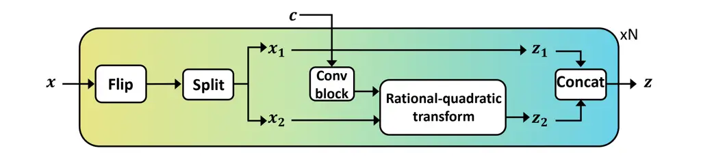
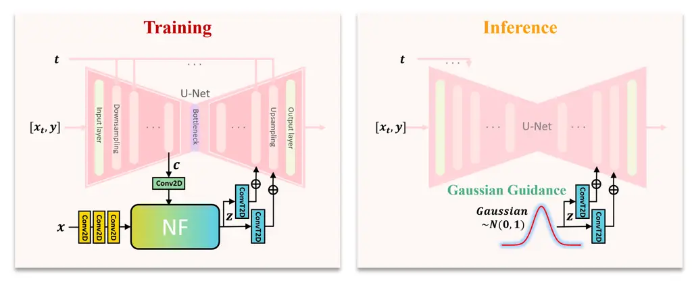
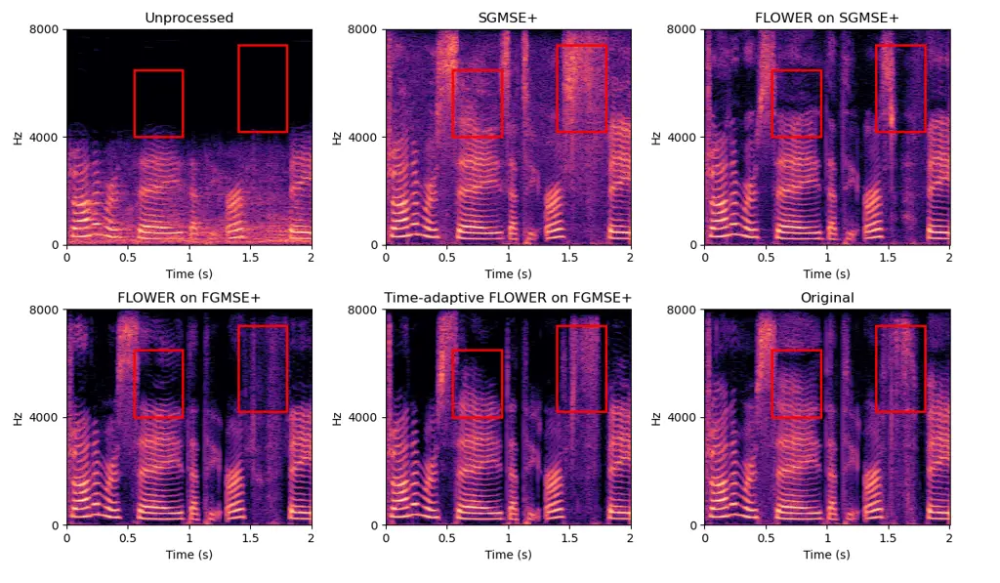
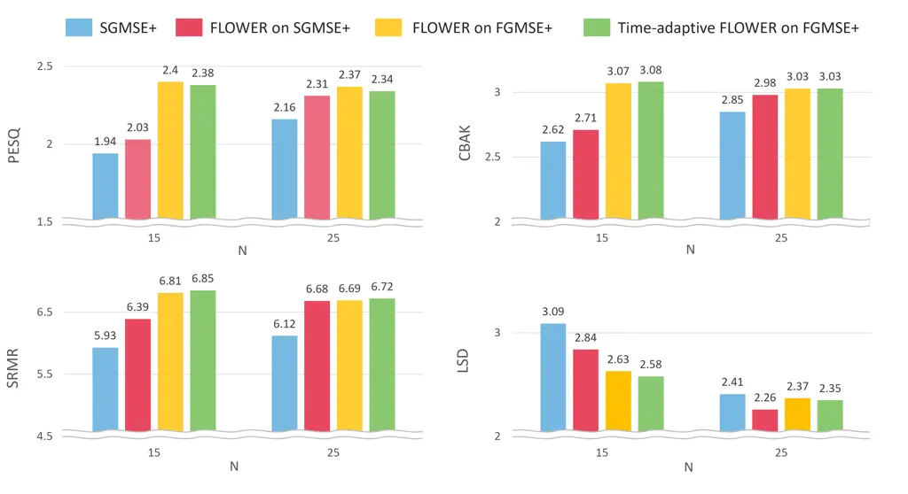
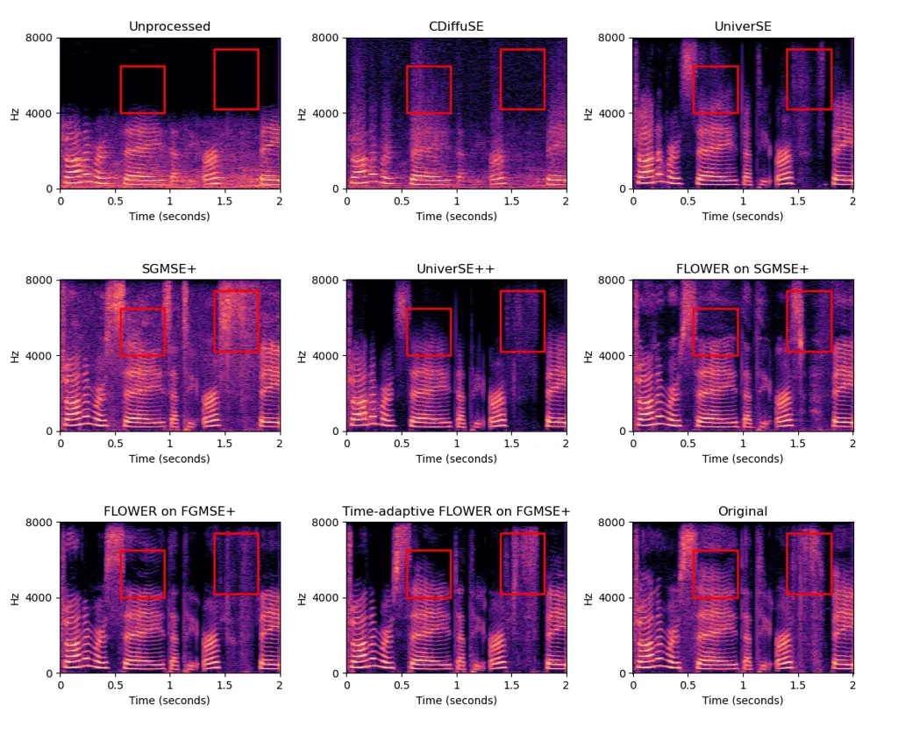
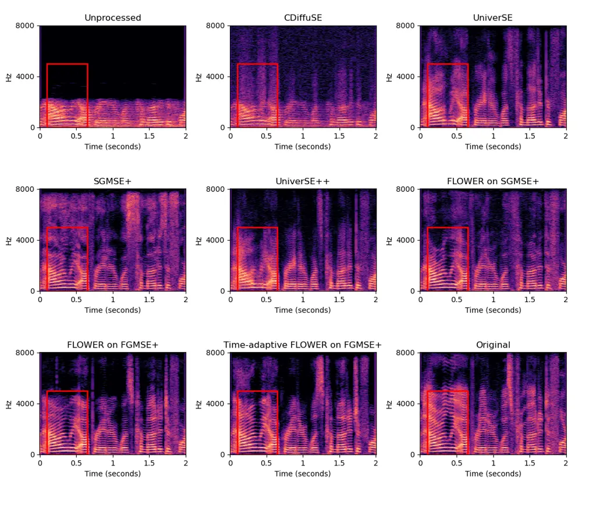

# FLOWER: Flow-Based Estimated Gaussian Guidance for General Speech Restoration

Da-Hee Yang Affiliation: Department of Electronic Engineering, Hanyang
University, Seoul, South Korea    Jaeuk Lee Affiliation: Department of
Electronic Engineering, Hanyang University, Seoul, South Korea   
Joon-Hyuk Chang Affiliation: Department of Electronic Engineering,
Hanyang University, Seoul, South Korea Correspondence to:
<jchang@hanyang.ac.kr>

###### Abstract

We introduce FLOWER, a novel conditioning method designed for speech
restoration that integrates Gaussian guidance into generative
frameworks. By transforming clean speech into a predefined prior
distribution (e.g., Gaussian distribution) using a normalizing flow
network, FLOWER extracts critical information to guide generative
models. This guidance is incorporated into each block of the generative
network, enabling precise restoration control. Experimental results
demonstrate the effectiveness of FLOWER in improving performance across
various general speech restoration tasks.

^(†)^(†)affiliationnotice: Equal contribution

## 1 Introduction

General speech restoration (GSR) aims to enhance speech quality and
intelligibility in real-life environments, where signals are often
degraded by multiple distortions such as noise, reverberation, and
bandwidth degradation. Traditional methods, including denoising,
dereverberation, and bandwidth extension (BWE), primarily address these
distortions in isolation (Xu et al., 2014; Li & Lee, 2015; Zhao et al.,
2020; Lee & Han, 2021; Lu et al., 2022; Welker et al., 2022; Yu et al.,
2023). However, in real-world scenarios, multiple distortions frequently
occur simultaneously, posing greater challenges for effective
restoration.

Recent studies have demonstrated progress in addressing multiple
distortions, highlighting the potential of generative models for GSR.
(Liu et al., 2022; Serrà et al., 2022; Yang et al., 2024; Scheibler
et al., 2024). Among generative models, diffusion-based models (Song
et al., 2021; Ho et al., 2020) have shown notable promise in producing
high-quality, natural-sounding speech (Lu et al., 2022; Richter et al.,
2023). Recently, these models integrate conditioning mechanisms to
improve performance by utilizing complex network architecture or
task-specific condition information (Serrà et al., 2022; Yang et al.,
2024; Scheibler et al., 2024). For example, discriminative-based
conditioning networks extract enhanced features from distorted speech
and integrate them into generative models (Serrà et al., 2022; Scheibler
et al., 2024). Similarly, task-specific condition information, such as
signal-to-noise ratio (SNR) or environmental details, is injected to
provide context for specific restoration tasks (Yang et al., 2024).

Although these approaches enhance diffusion models, they often rely on
deterministic outputs from discriminative networks or task-specific
conditions, which may not fully encapsulate the diverse complexities of
speech restoration tasks. This dependency on predefined conditions and
features limits their flexibility and scalability.

To address these limitations, we propose FLOWER (FLOW-based Estimated
Gaussian guidance for general speech Restoration), a novel conditioning
approach that introduces Gaussian guidance as a conditioning feature
within generative models. This guidance is derived from a normalizing
flow (NF) network (Kingma & Dhariwal, 2018), which is specifically
designed to extract residual information that bridges the gap between
clean speech and the latent features of the generative model. Unlike
deterministic outputs, the Gaussian guidance encapsulates oracle
knowledge of clean speech in a stochastic form, enabling generative
models to better navigate the restoration process.

FLOWER integrates Gaussian guidance into each block of the diffusion
model, enabling dynamic adjustments to address varying levels of
distortions during the generation of enhanced speech. By leveraging this
fine-grained conditioning, the model generates data distributions that
are more closely aligned with clean speech, addressing multiple
distortions more effectively. Furthermore, to further improve sampling
efficiency, we extend FLOWER to a flow-matching (FM) (Lipman et al., 2023) model using an optimal transport (OT) path. We also introduce a
time-adaptive scaling mechanism for Gaussian guidance, which dynamically
adjusts the conditioning influence as the diffusion process progresses,
ensuring effective utilization of condition information.

The main contributions of FLOWER are as follows:

1\. Novel Conditioning Approach: We present FLOWER, which extracts
Gaussian guidance from an NF network to generate residual information
distributed in a prior distribution (e.g., Gaussian). This Gaussian
guidance provides critical knowledge that is absent from the latent
features of the generative model, enhancing its restoration
capabilities.

2\. Efficient Inference: FLOWER extracts Gaussian guidance from the NF
network during training. However, during inference, this guidance is
sampled directly from a Gaussian distribution, eliminating the need for
the NF network and ensuring computational efficiency.

3\. Performance Improvements: FLOWER demonstrates superior performance
in general speech restoration tasks, surpassing baseline diffusion
models in metrics related to noise reduction, dereverberation, and
bandwidth extension. FLOWER also achieves higher sampling efficiency
through the FM model with time-adaptive scaling.

## 2 Related Work

### 2.1 General Speech Restoration

Speech enhancement aims to restore intelligibility and quality in
distorted speech signals. Traditional approaches have primarily
addressed individual distortions, focusing on tasks like denoising,
dereverberation, or BWE (Xu et al., 2014; Li & Lee, 2015; Zhao et al.,
2020; Lee & Han, 2021; Lu et al., 2022; Welker et al., 2022; Yu et al.,
2023). However, real-world environments present challenges where
distortions occur simultaneously, making single-distortion models
insufficient for comprehensive restoration. Recognizing this limitation,
recent research has shifted towards general speech restoration (GSR), a
task aimed at simultaneously addressing multiple distortions such as
noise, reverberation, and bandwidth degradation.

VoiceFixer(Liu et al., 2022) was among the first to define this task
explicitly, introducing a framework that combines task-specific models
within an analysis-and-synthesis structure, using a residual U-Net to
restore mel-spectrograms followed by a vocoder to generate waveforms.
Similarly, HD-DEMUCS (Kim et al., 2023) employed a parallel decoder
architecture to simultaneously enhance and reconstruct speech,
leveraging the strengths of the DEMUCS model (Defossez et al., 2020) to
effectively handle multiple distortions.

While deterministic deep learning models have achieved remarkable
results, their mappings from noisy to clean speech often lack the
flexibility and quality required for more complex scenarios. Generative
models, particularly diffusion models, have demonstrated the ability to
generate high-quality and natural-sounding speech, making them
well-suited for GSR tasks. Diffusion-based speech enhancement models
such as CDiffuSE (Lu et al., 2022) and SGMSE+ (Richter et al., 2023)
highlight the potential of leveraging diffusion models for tasks like
denoising, dereverberation. Building on this foundation, UNIVERSE (Serrà
et al., 2022) introduced a conditioning network designed to extract
enhanced features from distorted speech, integrating these features into
a score-based diffusion model via joint training. The recently proposed
UNIVERSE++ (Scheibler et al., 2024) further advanced this concept by
incorporating adversarial loss for enhanced restoration performance.

In line with these advancements, we propose a novel conditioning
approach for diffusion-based GSR called FLOWER. Unlike prior methods
that rely on enhanced features or task-specific conditions, FLOWER
introduces Gaussian guidance, enabling it to handle multiple distortions
more effectively. By integrating FLOWER into the generative process, we
aim to demonstrate significant improvements in both performance and
efficiency for GSR. The subsequent sections detail how we extract and
incorporate Gaussian guidance into the generative framework,
highlighting the unique contributions of our approach.

### 2.2 Problem Formulation

We aim to address GSR in adverse environments characterized by noise,
reverberation, and bandwidth degradation. In our scenario, the observed
speech signal is a distorted signal of clean speech $`x`$ with a room
impulse response $`r`$ and background noise $`n`$, represented as
$`y=h(x*r)+n`$. Here, $`*`$ denotes the convolution operation and the
function $`h`$ introduces spectral distortions through low-pass
filtering. The objective of this task is to estimate an enhanced speech
signal $`\hat{x}`$ that closely approximates the original clean speech
$`x`$ while mitigating the effects of distortions.

## 3 Preliminaries

In this work, we build upon two key generative frameworks: score-based
diffusion models and flow-matching models. These frameworks provide the
foundation for generating data distributions from noise or prior
distributions. To enhance their capabilities, we propose the integration
of Gaussian guidance, a novel conditioning feature extracted from a
conditional normalizing flow network.

This section introduces the generative frameworks underlying our
approach. First, we detail score-based diffusion models that leverage
score matching to iteratively refine noise into data. Next, we explain
flow-matching models that estimate probability paths between data and
prior distributions through vector fields. Finally, we describe the
conditional NF network, which extracts Gaussian guidance by mapping
input data to a normalized prior distribution.

### 3.1 Generative Frameworks

#### 3.1.1 Score-based diffusion model.

A diffusion model is an advanced generative model that iteratively
refines a noise distribution to generate a data distribution. The
diffusion model operates in two processes: forward and reverse. The
forward process transforms the data distribution into a prior
distribution (e.g., Gaussian distribution), while the reverse process
gradually removes noise using a sampling method (e.g., Langevin
dynamics) that generates data from the prior distribution. Until
recently, diffusion models have been divided into score-based (Song &
Ermon, 2019) and denoising diffusion probabilistic models (Ho et al.,
2020). (Song et al., 2021) introduces a unified approach based on a
stochastic differential equation (SDE) that satisfies the probability
trajectories of score-based and denoising diffusion probability models.
The SDE-based forward process is defined as follows:

```math
dx_{t}=f(x_{t},t)dt+g(t)dw_{t}, \tag{1}
```

where $`w_{t}`$ represents the standard Wiener process and
$`f(\cdot,t)`$ and $`g(t)`$ denote the drift and diffusion coefficients,
respectively, which follow a predefined scheduler according to
$`t\in[0,1]`$. Through the forward process, the data distribution
$`x_{0}`$ is gradually converged into the prior distribution $`x_{1}`$.
According to (Anderson, 1982), the reverse process corresponding to the
forward process can be obtained based on the SDE as follows:

```math
dx_{t}=[f(x_{t},t)-g(t)^{2}\nabla_{x_{t}}\log p(x_{t})]dt+g(t)d\bar{w}_{t}, \tag{2}
```

where $`\bar{w}_{t}`$ denotes the backward standard Wiener process, and
$`\nabla_{x_{t}}\log p(x_{t})`$ represents the score (gradients of the
log probability density) of the distribution $`p(x_{t})`$. In this
reverse process, the noise in $`x_{1}`$ is gradually removed, ultimately
generating $`x_{0}`$. By applying the score
$`\nabla_{x_{t}}\log p(x_{t})`$ to the reverse process, data can be
generated from the prior distribution, as described in Eq. (2). To
enable this, we train a score-based diffusion model to predict the score
corresponding to input $`x_{t}`$ using the following objective:

```math
||s_{\theta}(x_{t},t)-\nabla_{x_{t}}\log p(x_{t}|x_{0})||_{2}^{2}, \tag{3}
```

where $`p(x_{t}|x_{0})`$ denotes the transition kernel, indicating the
distribution of $`x_{t}`$ conditioned on $`x_{0}`$. The function
$`s_{\theta}(\cdot,t)`$ is a neural network designed to predict the
score, and this training is known as score matching.

#### 3.1.2 FM-based model using OT path.

FM (Lipman et al., 2023) estimates the probability path between
$`x_{1}`$ and $`x_{0}`$, which are sampled from the data and prior
distributions, respectively. Assuming that a function $`f`$ transforms
$`x_{0}`$ into $`x_{t}`$ at time $`t\in[0,1]`$, this transformation can
be expressed as $`f(x_{0},t)=x_{t}`$. Consequently, the ordinary
differential equation (ODE) for $`x_{t}`$ is defined as follows:

```math
\frac{df}{dt}=\frac{dx_{t}}{dt}=u_{t}, \tag{4}
```

where $`u_{t}`$ denotes the vector field responsible for generating
$`x_{t}`$ from $`x_{0}`$. To estimate $`u_{t}`$, we train a neural
network $`v_{t}(\cdot,t)`$ using the following objective:

```math
||v_{t}(x_{t},t)-u_{t}||_{2}^{2}. \tag{5}
```

This training process is referred to as FM, where $`u_{t}`$ should be
defined. If $`x_{t}`$ ($`t\in[0,1]`$) is distributed in Gaussian, then
$`f`$ can be represented by an affine transformation:

```math
f(x_{0},t)=\sigma_{t}x_{0}+\mu_{t}. \tag{6}
```

The specific probability path depends on $`\mu_{t}`$ and $`\sigma_{t}`$,
which significantly influence the sampling efficiency. To define this
probability path, $`\mu_{t}`$ and $`\sigma_{t}`$ must satisfy two
conditions: (i) $`\mu_{1}`$ and $`\sigma_{1}`$ correspond to $`x_{1}`$
and $`\sigma_{min}(\cong 0)`$, respectively, and (ii) $`\mu_{0}`$ and
$`\sigma_{0}`$ are set to 0 and 1, respectively. Among the paths that
satisfy these conditions, (Lipman et al., 2023) proposed an Optimal
Transport (OT) path that changes $`x_{t}`$ linearly over time.

The OT path is the simplest probability path that satisfies the above
conditions, with a time-dependent probability density defined as
follows:$`\mu_{t}=tx_{1}`$ and $`\sigma_{t}=1-(1-\sigma_{min})t`$.
Therefore, the affine transformation along the OT path is given by
$`f(x_{0},t)=tx_{1}+(1-(1-\sigma_{min})t)x_{0}`$. As a result, the
vector field $`u_{t}`$ is defined as follows:

```math
u_{t}=x_{1}-(1-\sigma_{min})x_{0}. \tag{7}
```

Since the formula for $`u_{t}`$ does not depend on time $`t`$, the OT
path linearly transforms $`x_{0}`$ into $`x_{1}`$. Consequently, FM
using the OT path enhances sampling efficiency compared to the
score-based diffusion model.

For inference, we use an ODE solver based on Euler steps to sample from
the FM model. Specifically, the sampling steps are defined as follows:

```math
x_{t+\frac{1}{N}}:=x_{t}+\frac{1}{N}v_{\theta}(x_{t},y,z,t),\quad t:=t+\frac{1}{N}, \tag{8}
```

where $`N`$ represents the total number of time steps, and
$`v_{\theta}(\cdot)`$ is the vector field predicted by the FM model. The
use of Euler steps provides a straightforward and efficient method for
solving the ODE, ensuring stable and reproducible sampling results.



Figure 1: Normalizing flow model architecture based on
rational-quadratic transform. $`x`$, $`c`$, and $`z`$ are data (clean
speech), a conditional feature (latent representation of diffusion
model), and Gaussian noise, respectively. Conv block consists of dilated
convolutions, and the number of block $`N`$ is 4.

### 3.2 Conditional Normalizing Flow Network

A Normalizing flow (NF) network is a type of generative model that uses
an inverse function of flow to generate data. Inspired by (Rombach
et al., 2020), we construct an NF network to extract the latent variable
$`z`$ from the conditional NF network, as illustrated in Figure 1. This
conditional NF network takes two inputs: $`x`$ and $`c`$, to generate a
conditional data distribution $`p(x|c)`$ that is normalized to the prior
distribution. The log-likelihood of the data distribution $`p(x|c)`$ is
calculated as follows:

```math
\log p(x|c)=\log p(z|c)+\log|\det(\frac{\partial f(x)}{\partial x})|, \tag{9}
```

where $`p(z|c)`$ represents the output of the NF network. To train the
NF network, the negative log-likelihood $`-\log p(x|c)`$ is decomposed
into Kullback-Leibler (KL) divergence and entropy as follows:

```math
\text{KL}(p(z|c)|q(z))+H(x|c), \tag{10}
```

where $`q(z)`$ is the prior distribution (typically standard Gaussian),
and $`H(x|c)`$ denotes the constant data entropy. According to (Alemi
et al., 2017), minimizing $`\text{KL}(p(z|c)|q(z))`$ reduces the mutual
information between $`z`$ and $`c`$, effectively disentangling $`z`$
from $`c`$. This allows us to extract residual information $`z`$ from
$`x`$, independently of $`c`$, since $`q(z)`$ is selected independently
of $`c`$. The mutual information $`I(z,c)`$ between $`z`$ and $`c`$ is
represented by:

```math
I(z,c)=\int p(z,c)\log\frac{p(z,c)}{p(z)p(c)}=\int p(z,c)\log\frac{p(z|c)}{p(z)}\\
=\int p(z,c)\log p(z|c)-\int p(z)\log p(z)\\
\leq\int p(z,c)\log\frac{p(z|c)}{q(z)}=KL(p(z|c)\|q(z)). \tag{11}
```

In our approach, we use clean speech as $`x`$ and the latent feature of
the diffusion model as $`c`$ to extract residual information $`z`$ from
the clean speech. This $`z`$ is then used as a conditioning feature for
the diffusion model.



Figure 2: The overall architecture of FLOWER approach. Gaussian guidance
is extracted from the NF network during the training (a), but it is
extracted from a Gaussian distribution during the inference (b). In the
training process, the latent feature $`c`$ passes through a Conv2D layer
(256, 1, 1, 1), and the input speech spectrogram passes through three
Conv2D layers, each (1, 1, 4, 4). Subsequently, the output $`z`$ of the
NF network passes through a ConvTranspose 2D layer (1, 256, 32, 32) and
(1, 128, 64, 64) respectively, before being added to the diffusion
network. Each shape represents (input channels, output channels, kernel
size, and stride).

## 4 Method

### 4.1 Objective

The primary objective of the FLOWER approach is to enhance the ability
of speech restoration by introducing a novel conditioning feature that
implicitly encompasses oracle knowledge of clean speech. This is
achieved by incorporating the output of an NF network, termed Gaussian
guidance, into generative frameworks. By leveraging this advanced
conditioning, the FLOWER approach aims to more accurately predict a data
distribution that closely aligns with the clean speech distribution,
thereby improving the effectiveness of speech restoration.

### 4.2 FLOWER Architecture

The overall architecture of the proposed FLOWER approach, depicted in
Figure 2, integrates an NF network with a diffusion model to provide an
estimated Gaussian guidance as a conditioning feature. The NF network
generates a Gaussian-distributed latent variable $`z`$ that is then
utilized by the diffusion model as a structured and contextually
relevant conditioning feature to enhance its generative and restoration
capabilities.

During training, the NF network processes clean speech and latent
features from the diffusion model to produce the Gaussian guidance
$`z`$. This output is deterministic, as it is specifically shaped by the
input $`x`$ (clean speech) and the condition $`c`$ (latent features).
Although $`z`$ resides within a Gaussian distribution, it is not
Gaussian noise; rather, it encapsulates statistical characteristics of
clean speech, guided by the inputs. This guidance is then injected into
the U-Net blocks, enabling fine-grained control over the restoration
process and improving generalization.

During inference, the NF network is bypassed, and the Gaussian guidance
$`z`$ is directly sampled from a Gaussian distribution. Unlike white
noise, which is purely random and lacks context, this sampled guidance
reflects the statistical characteristics learned during training. This
structured information enables the diffusion model to maintain effective
conditioning and produce high-quality restored speech even without the
NF network. This transition occurs because the NF network is trained to
approximate a Gaussian distribution, allowing the model to maintain
effective conditioning during inference (Lee et al., 2022). The
following subsections detail the components and the process of
extracting Gaussian guidance.

#### 4.2.1 Generative Network.

The backbone of the generative model is a multi-resolution U-Net
structure (Ronneberger et al., 2015), as utilized in (Richter et al.,
2023). This network is designed to process complex spectrograms,
estimating both real and imaginary components of the input signals. It
takes three inputs: a diffused signal ($`x_{t}`$), a distorted input
($`y`$), and time-step information ($`t`$), as shown in Figure 2. The
architecture consists of several stages: an input layer, downsampling
layers, a bottleneck, upsampling layers, and an output layer. The
diffused and distorted signals are concatenated and processed through
these layers, with the time-step information embedded into each block to
capture time-dependent features.

The generative network ultimately estimates either a score for
score-matching or a vector field for flow-matching, guiding the data
distribution towards the target clean speech distribution. Since the
outputs depend on both the input and conditioning features, the
generative model can generate a distribution that is closer to the
target data distribution by providing relevant information as a
conditioning feature. To achieve this, we leverage the NF network to
extract useful information from clean speech, which is then used to
refine the output of the generative network.

#### 4.2.2 NF Network.

To generate condition information, we use an NF network based on
rational-quadratic transform (Durkan et al., 2019) as illustrated in
Figure 1. The NF network takes two inputs, $`x`$ and $`c`$. In Figure 1,
$`x_{1}`$, parts of $`x`$, and $`c`$ are the inputs of the Conv block
and are added element-wise. The Conv block consists of 3 dilated
convolutions with a dilation of $`[0,3,9]`$. In addition, the Conv block
estimates some coefficients for the rational-quadratic transform that
makes $`z_{2}`$ from $`x_{2}`$. Here, $`z`$ and $`c`$ are disentangled
as referenced in (Alemi et al., 2017).

In our approach, the NF network takes clean speech ($`x`$) and the
latent representation ($`c`$) from the last downsampling layer of the
generative network, as shown in Figure 2. The NF network then generates
residual information $`z`$ that contains knowledge derived from the
clean speech $`x`$ - knowledge that cannot be obtained from the latent
representation of the diffusion network alone. As depicted in Figure 2,
the residual information $`z`$ (Gaussian guidance) is projected by the
ConvTranspose 2D layers and injected into the last two upsampling layers
of the generative network via element-wise summation. The loss function
for the FLOWER architecture combines the generative network loss
($`\mathcal{L}_{UNet}`$) and the NF network loss ($`\mathcal{L}_{NF}`$):
$`\mathcal{L}_{FLOWER}=\mathcal{L}_{UNet}+\mathcal{L}_{NF}`$. The U-Net
loss measures the mean squared error loss between the output of the
backbone network and the target value, as described by Eqs. (3) and (5)
for the score- and flow-matching models, respectively, while the NF
model loss is defined as in Eq. (9).

### 4.3 The Effect of FLOWER Approach

#### 4.3.1 Estimated Gaussian Guidance.

Effective guidance strategies for diffusion models have gained
increasing attention because of their ability to effectively adapt to
various speech restoration tasks (Serrà et al., 2022; Yang et al., 2024;
Scheibler et al., 2024). However, conventional approaches rely on
task-specific condition information that can limit the solution space.
Our approach introduces a novel form of conditioning information:
Gaussian guidance estimated from the NF network. During training as
shown in Figure 2, this Gaussian guidance is aligned with a predefined
prior distribution (e.g., Gaussian distribution) and provides the
generative model with conditioning information that conveys oracle
knowledge. This allows for precise adjustments and enhancements in
generating the data distribution, ultimately guiding the diffusion model
towards optimal generative performance.

A key advantage of the FLOWER approach is that during inference,
Gaussian guidance is directly sampled from a Gaussian distribution
rather than being generated by the NF network. This eliminates the need
for a conditioning network during inference, distinguishing our approach
from conventional methods that require additional networks to provide
conditioning information. By encapsulating clean speech information
within the Gaussian guidance, our method effectively transmits oracle
knowledge and enhances the generative capabilities of the model.

#### 4.3.2 Time-adaptive FLOWER on FM.

FM with the OT path offers a more efficient and shorter probability path
from the prior distribution to the data distribution. To enhance
sampling efficiency, we apply the FM framework based on the OT path to
the backbone network instead of score-based diffusion (SGMSE+), naming
it FGMSE+. While SGMSE+ and FGMSE+ share the same architecture, the loss
function and sampling strategy differ, with FGMSE+ utilizing
flow-matching instead of score-matching.

To further improve the effectiveness of FGMSE+, we introduce a
time-adaptive Gaussian guidance mechanism. As the time step $`t`$
increases, the input $`x_{t}`$ gradually approaches the clean speech
distribution. Our method scales the Gaussian guidance according to the
time step, making the guidance less influential as $`x_{t}`$ becomes
closer to clean speech. Specifically, we scale the condition information
by a factor of $`1-t`$, corresponding to the narrowing gap between the
clean speech and $`x_{t}`$ distributions. This time-adaptive approach
allows the Gaussian guidance to dynamically adjust to the level of
distortion in the latent features, ensuring that the diffusion model
effectively restores clean speech across different time steps. By
adjusting the influence of the guidance according to the progression of
the model, we significantly enhance the performance and efficiency of
the generative process.



Figure 3: Comparison between the restored spectrograms on “matched”
scenario.

|             |            |                     |                     |                     |                     |                     |                      |
| ----------- | ---------- | ------------------- | ------------------- | ------------------- | ------------------- | ------------------- | -------------------- |
| Method      | Scenarios  | PESQ ($`\uparrow`$) | CSIG ($`\uparrow`$) | CBAK ($`\uparrow`$) | COVL ($`\uparrow`$) | SRMR ($`\uparrow`$) | SISDR ($`\uparrow`$) |
| Unprocessed | Matched    | 1.61                | 1.80                | 2.21                | 1.65                | 3.96                | 2.54                 |
| SGMSE+      |            | 2.10                | 3.52                | 2.78                | 2.87                | 6.08                | 7.14                 |
| FLOWER      |            | 2.23                | 3.62                | 2.90                | 3.00                | 6.61                | 8.05                 |
| Unprocessed | Mismatched | 1.78                | 1.80                | 2.25                | 1.73                | 5.91                | 2.58                 |
| SGMSE+      |            | 1.82                | 2.83                | 2.70                | 2.37                | 8.57                | 6.63                 |
| FLOWER      |            | 1.95                | 2.99                | 2.81                | 2.51                | 9.34                | 7.55                 |

Table 1: Performance comparison between the baseline SGMSE+ and the
proposed FLOWER models at 20 sampling steps. “Unprocessed” represents
the distorted speech signal by multiple distortions. “SGMSE+” represents
the main baseline model, while “FLOWER” denotes the proposed model
applying our conditioning method to SGMSE+. “Matched” scenarios refer to
the multi-distortion test sets from WSJ+CHiME4, while “Mismatched”
scenarios refer to the multi-distortion test sets from VCTK+DEMAND.
Higher scores indicate better performance.

|             |           |                      |                        |                        |            |                      |                        |                        |
| ----------- | --------- | -------------------- | ---------------------- | ---------------------- | ---------- | -------------------- | ---------------------- | ---------------------- |
| Method      | Scenarios | LSD ($`\downarrow`$) | LSD-H ($`\downarrow`$) | LSD-L ($`\downarrow`$) | Scenarios  | LSD ($`\downarrow`$) | LSD-H ($`\downarrow`$) | LSD-L ($`\downarrow`$) |
| Unprocessed | Matched   | 4.87                 | 5.51                   | 4.23                   | Mismatched | 4.78                 | 5.55                   | 4.00                   |
| SGMSE+      |           | 2.59                 | 3.00                   | 2.18                   |            | 3.11                 | 3.83                   | 2.38                   |
| FLOWER      |           | 2.37                 | 2.69                   | 2.05                   |            | 2.80                 | 3.35                   | 2.24                   |

Table 2: Performance comparison between the main baseline SGMSE+ and the
proposed FLOWER models at 20 sampling steps. Lower scores indicate
better performance.

## 5 Experiments

### 5.1 Datasets

The experiments were conducted on the open vocabulary task of the WSJ
dataset (Consortium et al., 1994), a corpus of English reading speech.
The dataset comprised 37,416 utterances for training, 503 for
validation, and 333 for testing. For noise distortion, we added CHiME-4
noise to the WSJ dataset. The CHiME-4 noise dataset (Vincent et al., 2017) included recordings from street, café, bus, and pedestrian
environments, with the SNR levels for each utterance randomly selected
between 0 and 20 dB. Reverberation effects were simulated by convolving
the speech signal with a room impulse response generated by a
Pyroomacoustics engine. The simulated rooms had dimensions ranging from
5 to 10 m in length and width, and heights from 2 to 6 m. The
reverberation time (RT60) for these rooms ranged from 0.3 to 0.9 s.
Bandwidth degradation was achieved using various low-pass filters,
including Butterworth, Bessel, Chebyshev, and elliptic filters. The
cut-off frequencies for these filters were randomly selected between 2
and 4 kHz, creating a variety of bandwidth degradation effects.

We constructed two test sets for evaluation: “matched” and “mismatched.”
The matched test set was generated from the WSJ+CHiME4 dataset,
following the same distortion selection methodology used during
training. In contrast, the mismatched test set was created using the
VCTK+DEMAND dataset (Valentini-Botinhao et al., 2017), which was not
used during training, by applying the same reverberation and bandwidth
degradation distortions.

### 5.2 Experimental settings

#### 5.2.1 Evaluation metrics.

We evaluated the speech restoration performance using various assessment
metrics. To assess speech quality, we employed the wide-band perceptual
evaluation of speech quality (PESQ) score (Recommendation, 2001).
Furthermore, we examined speech signal distortion, background noise, and
overall quality using three mean opinion score predictors: CSIG, CBAK,
and COVL. CSIG measures signal distortion, CBAK assesses background
noise intrusiveness, and COVL evaluates overall signal quality (Hu &
Loizou, 2008). For waveform reconstruction, we utilized a
scale-invariant signal-to-distortion ratio (SI-SDR). The
speech-to-reverberation modulation energy ratio (SRMR) metric (Falk &
Chan, 2010) was used to evaluate the effectiveness of speech
dereverberation. For BWE, we measured the performance using the
log-spectral distance (LSD), which was evaluated separately for the high
band (4-8 kHz) and low band ( 0-4 kHz ), denoted as LSD-H and LSD-L,
respectively. Higher values indicate better performance for all metrics
except for LSD.

#### 5.2.2 Implementation details.

As a main baseline, we employed SGMSE+ (Lemercier et al., 2023).
Originally designed for single distortion tasks, it can handle
denoising, dereverberation, and bandwidth extension using the same
network architecture, making it suitable for addressing multiple
distortions simultaneously. The FLOWER framework was trained under the
same settings as the baseline without task-specific hyperparameter
tuning. To ensure a fair comparison, we trained all models for 300
epochs using an NVIDIA A100 GPU with a batch size of 16. For
optimization, we employed an Adam optimizer (Kingma & Ba, 2014) with a
learning rate of $`1\times 10^{-4}`$. We utilized 16 kHz audio data by
converting it into a complex-valued short-time Fourier transform
representation, with a window size of 510 samples and a hop size of 128
samples, employing a Hann window. For the NF network, we used an
open-source code and modified it to fit our approach. The detailed
parameters of the additional modules for the FLOWER approach are
described in the caption of Figure 2. Further implementation details and
experimental results for other comparative models in GSR tasks are
provided in the Appendix for reference.



Figure 4: Performance comparison between the SGMSE+ model and the FLOWER
method on SGMSE+ and FGMSE+ according to the number of sampling steps
($`N`$=15, 25) under the “matched” scenario, respectively. The
$`x`$-axis represents the number of sampling steps ($`N`$), while the
$`y`$-axis indicates the metric scores. Higher scores are better for
PESQ, CBAK, and SRMR, while lower scores are better for LSD. Colors:
SGMSE+ (blue), FLOWER on SGMSE+ (red), FLOWER on FGMSE+ (yellow),
Time-adaptive FLOWER on FGMSE+ (green).

### 5.3 Performance Analysis of the FLOWER Approach

We compared the proposed FLOWER approach with the baseline SGMSE+ model
on the WSJ+CHiME4 dataset, which contains multiple distortions. The
results are summarized in Tables 1 and 2, and illustrated in Figure 3.
Table 1 evaluates performance in terms of speech quality, noise removal,
and dereverberation using the PESQ, CSIG, CBAK, COVL, SRMR, and SISDR
metrics. Table 2 focuses on bandwidth generation performance, using the
LSD score, split into LSD-H and LSD-L, to assess high-band
reconstruction quality and low-band distortion. The task involves
restoring bandwidths randomly degraded to 2-4 $`kHz`$ back to the
original 8 $`kHz`$, necessitating evaluation in both bands. Figure 3
provides a visual comparison of restoration results. Based on the
evaluation results, several conclusions can be drawn:

i\) From Table 1, FLOWER consistently outperformed the main baseline
across all six metrics, particularly in noise and reverberation removal.
The superior performance in mismatched scenarios indicated FLOWER’s
robust generalization capabilities.

ii\) As presented in Table 2, FLOWER achieved better results in
bandwidth reconstruction for both LSD-H and LSD-L, particularly in
mismatched scenarios. The lower LSD scores highlighted its enhanced
ability to restore high-band frequencies while minimizing low-band
distortion.

iii\) In Figure 3, FLOWER shows clear advantages in noise and
reverberation removal compared to the baseline. Notably, in high-band
frequencies (highlighted in red boxes), the baseline model introduced
more distortions relative to the original spectrum, whereas FLOWER
effectively mitigated these issues.

These results demonstrated the efficacy of the FLOWER approach in
producing high-quality speech samples.

### 5.4 Performance and Efficiency Comparison

We extended our approach to the FGMSE+ model to improve inference
efficiency, focusing on reducing the number of sampling steps $`N`$.
Typically, reducing $`N`$ degrades speech quality, but our FLOWER
approach on the FGMSE+ seeks to maintain high performance with fewer
steps. Figure 4 presents the efficiency and performance using four
metrics: PESQ for speech quality, CBAK for noise-removal efficiency,
SRMR for dereverberation performance, and LSD to evaluate the extent of
band restoration.

“FLOWER on SGMSE+” significantly outperformed the baseline “SGMSE+”,
indicating better restoration ability of distortions. “FLOWER on FGMSE+”
further improved PESQ, CBAK, and SRMR scores, maintaining higher speech
quality even with fewer sampling steps. Specifically, “FLOWER on FGMSE+”
at 15 steps surpassed “SGMSE+” at 25 steps, demonstrating the efficiency
of the FM model. For example, in the PESQ score, “SGMSE+” reached 2.16
at 25 steps, while “FLOWER on FGMSE+” achieved a higher score of 2.4
with only 15 steps. Similar trends were observed across other metrics,
such as CBAK and SRMR, where “FLOWER on FGMSE+” consistently
outperformed “SGMSE+” with fewer sampling steps. These results
highlighted the notable efficiency and effectiveness of the FLOWER
approach, which not only reduced the required number of sampling steps
but also consistently enhanced performance across key metrics. Although
“FLOWER on FGMSE+” shows improvement over “SGMSE+” in LSD scores, it did
not outperform “FLOWER on SGMSE+”. This is due to the FM model’s
stronger ability to remove residual distortions, including those in
high-band frequencies, as observed in Figure 3.

To enhance band reconstruction, we applied time-adaptive Gaussian
guidance in “Time-adaptive FLOWER on FGMSE+”. This method, which adjusts
conditioning information inversely proportional to the time step,
improved LSD scores without excessive high-band removal. Figure 3 red
boxes confirmed this, showing that the time-adaptive model produced
spectrograms more closely resembling the original.

## 6 Conclusion and Discussion

In this work, we propose a novel conditioning approach, FLOWER, which
integrates Gaussian guidance into generative frameworks, significantly
improving speech restoration performance by effectively handling
multiple distortions. Through extensive evaluation, we demonstrated its
superiority over baseline methods, showcasing enhanced noise removal,
dereverberation, and band reconstruction capabilities. The adaptability
of our approach to various scenarios, including matched and mismatched
datasets, underscored its robustness and generalization ability. By
reducing the number of sampling steps and incorporating time
information, our method achieved efficient and comprehensive speech
restoration. Overall, FLOWER presented a versatile and effective
solution for real-world speech restoration challenges, offering
high-quality speech outputs. However, we acknowledge that our task was
limited to three types of distortions. In future work, we plan to
address a broader range of distortions and explore more effective
restoration methods.

## References

- Alemi et al. (2017) Alemi, A. A., Fischer, I., Dillon, J. V., and
  Murphy, K. Deep variational information bottleneck. In _Proc.
  International Conference on Learning Representations (ICLR)_, 2017.
- Anderson (1982) Anderson, B. D. Reverse-time diffusion equation
  models. _Stochastic Processes and their Applications_, 1982.
- Consortium et al. (1994) Consortium, L. D. et al. CSR-II (WSJ1)
  complete. _Linguistic Data Consortium, Philadelphia, vol.
  LDC94S13A_, 1994.
- Defossez et al. (2020) Defossez, A., Synnaeve, G., and Adi, Y. Real
  time speech enhancement in the waveform domain. In _Proc.
  INTERSPEECH_, 2020.
- Durkan et al. (2019) Durkan, C., Bekasov, A., Murray, I., and
  Papamakarios, G. Neural spline flows. In _Proc. Advances in Neural
  Information Processing Systems (NeurIPS)_, 2019.
- Falk & Chan (2010) Falk, T. H. and Chan, W.-Y. Temporal dynamics for
  blind measurement of room acoustical parameters. _IEEE Transactions on
  Instrumentation and Measurement_, 59(4):978–989, 2010.
- Ho et al. (2020) Ho, J., Jain, A., and Abbeel, P. Denoising diffusion
  probabilistic models. In _Proc. Advances in Neural Information
  Processing Systems (NeurIPS)_, 2020.
- Hu & Loizou (2008) Hu, Y. and Loizou, P. C. Evaluation of objective
  quality measures for speech enhancement. _IEEE Transactions on Audio,
  Speech, and Language Processing_, 16(1):229–238, 2008.
- Kim et al. (2023) Kim, D., Chung, S.-W., Han, H., Ji, Y., and Kang,
  H.-G. HD-DEMUCS: General speech restoration with heterogeneous
  decoders. In _Proc. INTERSPEECH_, 2023.
- Kingma & Ba (2014) Kingma, D. P. and Ba, J. Adam: A method for
  stochastic optimization. In _Proc. International Conference on
  Learning Representations (ICLR)_, 2014.
- Kingma & Dhariwal (2018) Kingma, D. P. and Dhariwal, P. Glow:
  Generative flow with invertible 1x1 convolutions. In _Proc. Advances
  in neural information processing systems (NeurIPS)_, 2018.
- Lee & Han (2021) Lee, J. and Han, S. Nu-wave: A diffusion
  probabilistic model for neural audio upsampling. In _Proc.
  INTERSPEECH_, 2021.
- Lee et al. (2022) Lee, Y., Yang, J., and Jung, K. Varianceflow:
  High-quality and controllable text-to-speech using variance
  information via normalizing flow. In _Proc. IEEE International
  Conference on Acoustics, Speech and Signal Processing (ICASSP)_, 2022.
- Lemercier et al. (2023) Lemercier, J.-M., Richter, J., Welker, S., and
  Gerkmann, T. Analysing diffusion-based generative approaches versus
  discriminative approaches for speech restoration. In _Proc. IEEE
  International Conference on Acoustics, Speech and Signal Processing
  (ICASSP)_, pp. 1–5, 2023.
- Li & Lee (2015) Li, K. and Lee, C.-H. A deep neural network approach
  to speech bandwidth expansion. In _Proc. IEEE International Conference
  on Acoustics, Speech and Signal Processing (ICASSP)_, pp.
  4395–4399, 2015.
- Lipman et al. (2023) Lipman, Y., Chen, R. T. Q., Ben-Hamu, H., Nickel,
  M., and Le, M. Flow matching for generative modeling. In _Proc.
  International Conference on Learning Representations (ICLR)_, 2023.
- Liu et al. (2022) Liu, H., Liu, X., Kong, Q., Tian, Q., Zhao, Y.,
  Wang, D., Huang, C., and Wang, Y. Voicefixer: A unified framework for
  high-fidelity speech restoration. In _Proc. INTERSPEECH_, 2022.
- Lu et al. (2021) Lu, Y.-J., Tsao, Y., and Watanabe, S. A study on
  speech enhancement based on diffusion probabilistic model. In _Proc.
  IEEE Asia-Pacific Signal and Information Processing Association Annual
  Summit and Conference (APSIPA ASC)_, pp. 659–666, 2021.
- Lu et al. (2022) Lu, Y.-J., Wang, Z.-Q., Watanabe, S., Richard, A.,
  Yu, C., and Tsao, Y. Conditional diffusion probabilistic model for
  speech enhancement. In _Proc. IEEE International Conference on
  Acoustics, Speech and Signal Processing (ICASSP)_, pp.
  7402–7406, 2022.
- Recommendation (2001) Recommendation, I.-T. Perceptual evaluation of
  speech quality (pesq): An objective method for end-to-end speech
  quality assessment of narrow-band telephone networks and speech
  codecs. _Rec. ITU-T P. 862_, 2001.
- Richter et al. (2023) Richter, J., Welker, S., Lemercier, J.-M., Lay,
  B., and Gerkmann, T. Speech enhancement and dereverberation with
  diffusion-based generative models. _IEEE/ACM Transactions on Audio,
  Speech, and Language Processing_, 2023.
- Rombach et al. (2020) Rombach, R., Esser, P., and Ommer, B.
  Network-to-network translation with conditional invertible neural
  networks. In _Proc. Advances in Neural Information Processing Systems
  (NeurIPS)_, pp. 2784–2797, 2020.
- Ronneberger et al. (2015) Ronneberger, O., Fischer, P., and Brox, T.
  U-net: Convolutional networks for biomedical image segmentation. In
  _Proc. Medical Image Computing and Computer-Assisted Intervention
  (MICCAI) Part III 18_, pp. 234–241. Springer, 2015.
- Scheibler et al. (2024) Scheibler, R., Fujita, Y., Shirahata, Y., and
  Komatsu, T. Universal score-based speech enhancement with high content
  preservation. In _Proc. INTERSPEECH_, 2024.
- Serrà et al. (2022) Serrà, J., Pascual, S., Pons, J., Araz, R. O., and
  Scaini, D. Universal speech enhancement with score-based diffusion.
  _arXiv preprint arXiv:2206.03065_, 2022.
- Song & Ermon (2019) Song, Y. and Ermon, S. Generative modeling by
  estimating gradients of the data distribution. In _Proc. Advances in
  Neural Information Processing Systems (NeurIPS)_, 2019.
- Song et al. (2021) Song, Y., Sohl-Dickstein, J., Kingma, D. P., Kumar,
  A., Ermon, S., and Poole, B. Score-based generative modeling through
  stochastic differential equations. In _Proc. International Conference
  on Learning Representations (ICLR)_, 2021.
- Valentini-Botinhao et al. (2017) Valentini-Botinhao, C. et al. Noisy
  reverberant speech database for training speech enhancement algorithms
  and tts models. _University of Edinburgh. School of Informatics.
  Centre for Speech Technology Research (CSTR),_, 2017.
- Vincent et al. (2017) Vincent, E., Watanabe, S., Nugraha, A. A.,
  Barker, J., and Marxer, R. An analysis of environment, microphone and
  data simulation mismatches in robust speech recognition. _Computer
  Speech & Language_, 46:535–557, 2017.
- Welker et al. (2022) Welker, S., Richter, J., and Gerkmann, T. Speech
  enhancement with score-based generative models in the complex stft
  domain. In _Proc. INTERSPEECH_, 2022.
- Xu et al. (2014) Xu, Y., Du, J., Dai, L.-R., and Lee, C.-H. A
  regression approach to speech enhancement based on deep neural
  networks. _IEEE/ACM Transactions on Audio, Speech, and Language
  Processing_, 23(1):7–19, 2014.
- Yang et al. (2024) Yang, M., Zhang, C., Xu, Y., Xu, Z., Wang, H., Raj,
  B., and Yu, D. Usee: Unified speech enhancement and editing with
  conditional diffusion models. In _Proc. IEEE International Conference
  on Acoustics, Speech and Signal Processing (ICASSP)_, pp.
  7125–7129, 2024.
- Yu et al. (2023) Yu, C.-Y., Yeh, S.-L., Fazekas, G., and Tang, H.
  Conditioning and sampling in variational diffusion models for speech
  super-resolution. In _Proc. IEEE International Conference on
  Acoustics, Speech and Signal Processing (ICASSP)_, pp. 1–5, 2023.
- Zhao et al. (2020) Zhao, Y., Wang, D., Xu, B., and Zhang, T. Monaural
  speech dereverberation using temporal convolutional networks with self
  attention. _IEEE/ACM Transactions on Audio, Speech, and Language
  Processing_, 28:1598–1607, 2020.

## Appendix A Comparative Models for General Speech Restoration

We evaluated the proposed FLOWER approach against several comparative
models designed for speech enhancement and general speech restoration
tasks, focusing on generative models capable of addressing noise removal
or managing multiple distortions simultaneously. The application of
diffusion models in speech enhancement began with DiffuSE (Lu et al., 2021) and SGMSE (Welker et al., 2022), which introduced foundational
generative approaches for this domain. Building on these, CDiffuSE
extended DiffuSE by incorporating a conditional diffusion framework,
enhancing its ability to handle more complex conditions. SGMSE+ improved
upon SGMSE by adopting the NCSN++ architecture as its backbone network,
resulting in significant performance gains. While originally proposed
for single-distortion tasks such as denoising, dereverberation, and BWE,
SGMSE+ has demonstrated effectiveness in addressing multiple distortions
concurrently, making it a strong main baseline for general speech
restoration. UniverSE introduced a discriminative conditioning network
that works alongside diffusion networks. By extracting enhanced features
through a discriminative network, it provides guidance to score-based
diffusion models via joint training. Building on this foundation,
UniverSE++ further refined the framework by applying adversarial loss
and structural modifications, achieving notable improvements in
restoration quality.

## Appendix B Experimental Results

### B.1 Quantitative Comparison

|             |                     |                     |                     |                     |                     |                       |                      |
| ----------- | ------------------- | ------------------- | ------------------- | ------------------- | ------------------- | --------------------- | -------------------- |
| Model       | PESQ ($`\uparrow`$) | CSIG ($`\uparrow`$) | CBAK ($`\uparrow`$) | COVL ($`\uparrow`$) | SRMR ($`\uparrow`$) | SI-SDR ($`\uparrow`$) | LSD ($`\downarrow`$) |
| Unprocessed | 1.61                | 1.80                | 2.21                | 1.65                | 3.96                | 2.54                  | 4.87                 |
| CDiffuSE    | 1.52                | 2.83                | 2.20                | 2.22                | 7.20                | -1.31                 | 3.47                 |
| SGMSE+      | 2.10                | 3.52                | 2.78                | 2.87                | 6.08                | 7.14                  | 2.59                 |
| UniverSE    | 1.97                | 3.37                | 2.71                | 2.72                | 6.79                | 3.17                  | 2.68                 |
| UniverSE++  | 2.12                | 3.27                | 2.85                | 2.75                | 6.13                | 5.09                  | 2.67                 |
| FLOWER      | 2.23                | 3.62                | 2.90                | 3.00                | 6.61                | 8.05                  | 2.37                 |

Table 3: Performance comparison with several comparative models under
“matched” scenarios. Higher scores indicate better performance for PESQ,
CSIG, CBAK, COVL, and SRMR, while lower scores indicate better
performance for LSD.

|             |                     |                     |                     |                     |                     |                       |                      |
| ----------- | ------------------- | ------------------- | ------------------- | ------------------- | ------------------- | --------------------- | -------------------- |
| Model       | PESQ ($`\uparrow`$) | CSIG ($`\uparrow`$) | CBAK ($`\uparrow`$) | COVL ($`\uparrow`$) | SRMR ($`\uparrow`$) | SI-SDR ($`\uparrow`$) | LSD ($`\downarrow`$) |
| Unprocessed | 1.78                | 1.80                | 2.25                | 1.73                | 5.91                | 2.58                  | 4.78                 |
| CDiffuSE    | 1.56                | 2.64                | 2.25                | 2.12                | 9.54                | -0.63                 | 3.29                 |
| SGMSE+      | 1.82                | 2.83                | 2.70                | 2.37                | 8.57                | 6.63                  | 3.11                 |
| UniverSE    | 1.65                | 2.64                | 2.47                | 2.18                | 9.08                | 1.71                  | 2.93                 |
| UniverSE++  | 1.81                | 2.97                | 2.67                | 2.43                | 8.17                | 3.62                  | 2.73                 |
| FLOWER      | 1.95                | 2.99                | 2.81                | 2.51                | 9.34                | 7.55                  | 2.80                 |

Table 4: Performance comparison with several comparative models under
“mismatched” scenarios.

### B.2 Implementation Details

- •
  CDiffuSE (Lu et al., 2022)  
  We trained the CDiffuSE model using the large configuration provided
  at
  [https://github.com/neillu23/CDiffuSE](https://github.com/neillu23/CDiffuSE),
  adhering to most settings specified in the original paper for the
  large model. The model was trained for 300,000 iterations with a batch
  size of 15, employing an early stopping scheme. The training utilized
  200 diffusion steps to ensure performance aligned with the intended
  configuration.
- •
  SGMSE+ (Richter et al., 2023)  
  The implementation followed the details outlined in Section 5.2.2 of
  this paper. The model comprises 65 M trainable parameters and was
  trained without task-specific hyperparameter tuning. The official
  implementation of SGMSE+ is available at
  [https://github.com/sp-uhh/sgmse.git](https://github.com/sp-uhh/sgmse.git),
  ensuring reproducibility and alignment with prior research.
- •
  UniverSE (Serrà et al., 2022)  
  UniverSE was trained using the code in
  [https://github.com/line/open-universe](https://github.com/line/open-universe).
  The training process involved 1,500,000 steps with a batch size of 20,
  utilizing two GPUs. The model included 46.4 M trainable parameters.
- •
  UniverSE++ (Scheibler et al., 2024)  
  UniverSE++ was evaluated using the same codebase as UniverSE,
  available at
  [https://github.com/line/open-universe](https://github.com/line/open-universe).
  The model is trained for 1,500,000 training steps with a batch size of
  20 on two GPUs. The model included 84.2 M trainable parameters.
- •
  FLOWER (Ours)  
  The model was trained using the generative network and the NF network
  available at
  [https://github.com/jaywalnut310/vits](https://github.com/jaywalnut310/vits).
  The model comprises 65.5 M trainable parameters, with detailed
  parameter settings described in Section 5.2.2.

### B.3 Qualitative Analysis



Figure 5: Spectrogram analysis comparing the proposed method to baseline
models. The results demonstrate the efficacy of the proposed approach in
preserving spectral details and mitigating distortions. Notably, the
“Time-adaptive FLOWER on FGMSE+” model further alleviated residual
reverberations present in the original signals.



Figure 6: Spectrogram analysis comparing the proposed method to baseline
models.
