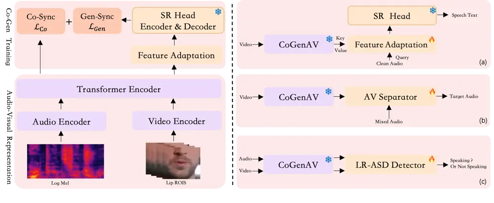
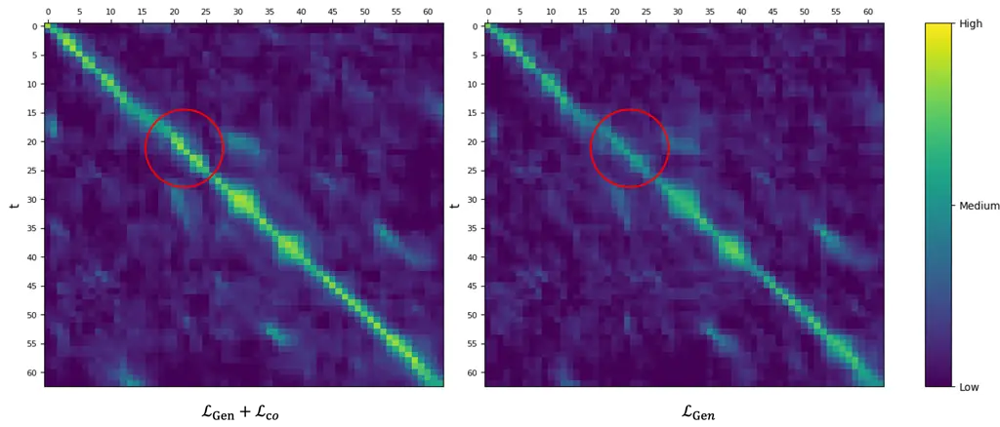

# CoGenAV: Versatile Audio-Visual Representation Learning via Contrastive-Generative Synchronization

Detao Bai Affiliation: Tongyi Lab, Alibaba Group    Xihan Wei
Affiliation: Tongyi Lab, Alibaba Group    Liefeng Bo Affiliation: Tongyi
Lab, Alibaba Group    Zhiheng Ma Affiliation: Shenzhen University of
Advanced
Technology[https://github.com/HumanMLLM/CoGenAV](https://github.com/HumanMLLM/CoGenAV)

###### Abstract

The inherent synchronization between a speaker’s lip movements, voice,
and the underlying linguistic content offers a rich source of
information for improving speech processing tasks, especially in
challenging conditions where traditional audio-only systems falter. We
introduce CoGenAV, a powerful and data-efficient model designed to learn
versatile audio-visual representations applicable across a wide range of
speech and audio-visual tasks. CoGenAV is trained by optimizing a dual
objective derived from natural audio-visual synchrony—contrastive
feature alignment and generative text prediction—using only 223 hours of
labeled data from the LRS2 dataset. This contrastive-generative
synchronization strategy effectively captures fundamental cross-modal
correlations. We showcase the effectiveness and versatility of the
learned CoGenAV representations on multiple benchmarks. When utilized
for Audio-Visual Speech Recognition (AVSR) on LRS2, these
representations contribute to achieving a state-of-the-art Word Error
Rate (WER) of 1.27. They also enable strong performance in Visual Speech
Recognition (VSR) with a WER of 20.5 on LRS2, and significantly improve
performance in noisy environments by over 70%. Furthermore, CoGenAV
representations benefit speech reconstruction tasks, boosting
performance in Speech Enhancement and Separation, and achieve
competitive results in audio-visual synchronization tasks like Active
Speaker Detection (ASD).Our code:
[https://github.com/HumanMLLM/CoGenAV](https://github.com/HumanMLLM/CoGenAV)

## 1 Introduction

Human communication inherently leverages multiple modalities, with
speech perception naturally integrating auditory signals and visual cues
like lip movements. This audio-visual synchrony is fundamental; the
visual stream (lip articulation) offers information complementary to the
audio, particularly valuable when the acoustic signal is corrupted by
noise, distorted, or originates from overlapping speakers. While recent
Automatic Speech Recognition (ASR) systems, including large models like
Whisper \[1\], SenseVoice \[2\], and Qwen-Audio \[3, 4\], have achieved
impressive accuracy on clean, well-resourced benchmarks, their
performance often degrades significantly in more challenging real-world
scenarios. Persistent difficulties remain in handling high ambient
noise, and disentangling multi-speaker conversations \[5, 6, 7, 8\]. The
robustness of the visual speech signal to acoustic interference suggests
that leveraging audio-visual synchrony is a key, yet underexplored,
avenue to overcome these fundamental limitations of audio-only ASR.

Motivated by this potential, enhancing speech processing with
audio-visual information has become an active research area \[9, 6,
10\]. While early works demonstrated performance gains by integrating
visual cues, they often resulted in task-specific models reliant on
large datasets or complex training paradigms \[6\]. Learning versatile
and data-efficient audio-visual representations thus remains a core
challenge. Recent attempts adapt large pre-trained ASR models by
incorporating visual features \[11, 12\], but typically require
fine-tuning the entire large model. This strategy faces significant
hurdles, including high computational costs and the risk of catastrophic
forgetting \[13\], limiting its practicality and scalability. These
limitations underscore the need for alternative approaches to
effectively leverage audio-visual synchrony.

Addressing this need, we propose CoGenAV (Contrastive-Generative
Audio-Visual model), a novel approach for learning powerful and
versatile audio-visual representations directly from the inherent
synchrony of speech. CoGenAV is trained by optimizing a dual objective
function grounded in this natural consistency. Specifically, using
datasets containing synchronized audio, video, and text (such as LRS2
\[14\]), the model simultaneously learns to: 1) maximize the alignment
between audio and visual features via a sequence-to-sequence contrastive
loss, capturing fine-grained temporal correspondence, and 2) predict the
associated text transcription using a generative log-likelihood loss,
thus embedding semantic information. Notably, this combined
contrastive-generative synchronization strategy proves highly effective
even with moderate amounts of labeled data; our core training utilizes
only the 223 hours available in LRS2 \[14\], demonstrating significant
data efficiency.

The representations learned by CoGenAV, owing to the
contrastive-generative synchronization objective and data-efficient
training (on 223 hours of labeled data), encapsulate fundamental
properties of audio-visual speech. By jointly modeling cross-modal
alignment and associated linguistic content, they inherently capture
rich temporal and semantic correlations. Furthermore, the intrinsic
integration of visual information provides a representation stream
naturally resilient to acoustic noise. These core properties suggest
their potential for broad applicability across various audio-visual
processing challenges where synchrony or acoustic robustness is crucial.

We conducted extensive experiments to validate the effectiveness and
versatility of the CoGenAV representations. Demonstrating their strength
in transcription tasks, utilizing CoGenAV features enables achieving a
WER of 20.5 in VSR on LRS2 \[14\] (outperforming prior methods \[6\])
and contributes to a state-of-the-art AVSR WER of 1.27 \[6, 10\].
Highlighting their robustness, performance in noisy environments (0dB
SNR) improves by over 70% compared to strong audio-only baselines.
Underscoring their versatility, these representations also yield
substantial gains when used as visual features for speech reconstruction
(Enhancement and Separation) and achieve competitive performance in
synchronization tasks like Active Speaker Detection on the Talkies
dataset \[15\].

This work’s primary contributions are threefold: 1) The proposal of
CoGenAV, a model learning powerful audio-visual representations via a
dual contrastive-generative synchronization objective. 2) A novel
audio-visual sequence-to-sequence contrastive learning approach
integrated within CoGenAV to effectively capture fine-grained temporal
alignment between modalities. 3) Extensive experimental validation
demonstrating the versatility, data efficiency, and state-of-the-art or
competitive performance of CoGenAV representations across diverse
audio-visual tasks using only moderate training data.

## 2 Method

Our architecture is illustrated in Figure 1. The left panel depicts the
Audio-Visual Feature Representation framework and the
Contrastive-Generative Synchronization Training methodology. For
generative synchronization, we design a Feature Adaptation Module and
employ a frozen pre-trained ASR model as the Speech Recognition (SR)
head. The right panel demonstrates the application of CoGenAV to diverse
downstream tasks, including Visual Speech Recognition (VSR),
Audio-Visual Speech Recognition (AVSR), Audio-Visual Speech Separation
(AVSS), Audio-Visual Speech Enhancement (AVSE), and Active Speaker
Detection (ASD).



Figure 1: Our method. Left: Audio-Visual Representation framework and
the Contrastive-Generative Synchronization Training methodology. The SR
Head represents the encoder and decoder components of a frozen
pre-trained ASR model for Speech Recognition. Right: CoGenAV applied to
diverse downstream tasks, (a) CoGenAV for AVSR; (b) CoGenAV for AVSS and
AVSE; (c) CoGenAV for ASD. The blue snowflake represents weights that
are frozen and non-trainable.

### 2.1 Audio-Visual feature representation

The audio-visual feature representation shares the same ResNet-3D CNN
visual encoder and Transformer encoder as AV-HuBERT \[9\], along with a
new audio encoder that ensures frame-synchronous alignment of audio
features with visual features while maintaining compatibility with the
audio preprocessing methods of pre-trained ASR models.

The Audio Encoder consists of two 3x3 convolutional layers with stride 2
and GELU activation functions, progressively reducing the temporal
dimension by a factor of 4,encoding raw audio Mel-spectrogram features
$`a_{t}\in\mathbb{R}^{4T\times 80}`$ into high-dimensional embeddings
$`f_{t}^{a}\in\mathbb{R}^{T\times D}`$. The visual input comprises $`T`$
frames of lip region images
$`v_{t}\in\mathbb{R}^{T\times H\times W\times C}`$, processed through a
ResNet18-like 3D CNN encoder, resulting in output
$`f_{t}^{v}\in\mathbb{R}^{T\times D}`$. Consequently, audio and visual
features $`f_{t}^{a}`$ and $`f_{t}^{v}`$ are temporally aligned with the
same feature dimensionality.

The CNN-extracted features are then fed into the Transformer Encoder to
capture temporal and global relationships. For audio-only input, we
obtain $`F_{t}^{a}\in\mathbb{R}^{T\times D}`$ from $`f_{t}^{a}`$; for
video-only input, we derive $`F_{t}^{v}\in\mathbb{R}^{T\times D}`$ from
$`f_{t}^{v}`$. For simultaneous audio and video input, we concatenate
$`f_{t}^{a}`$ and $`f_{t}^{v}`$ before passing them through the
Transformer Encoder to obtain audio-visual features
$`F_{t}^{av}\in\mathbb{R}^{T\times D}`$. Unlike time-aggregated
representations from audio-visual contrastive learning methods such as
SyncNet\[16\] and LatentSync\[18\], our features retain the temporal
dimension $`T`$ in the two-dimensional representations $`F_{t}^{a}`$ and
$`F_{t}^{v}`$. Based on this, we employ a Seq2Seq contrastive learning
approach in this paper.

### 2.2 Contrastive-Generative synchronization training

The speech signal and the speaker’s lip movements are inherently
synchronized and correspond to the same textual expression.CoGenAV
establishes tri-modal alignment representations across audio, visual,
and text streams through joint training of contrastive synchronization
and generative synchronization.Contrastive alignment enforces
frame-level audio-visual consistency through cosine similarity
maximization, while generative prediction aligns latent features with a
frozen ASR model’s acoustic-textual.

#### 2.2.1 Contrastive synchronization

In contrastive synchronization, employ the CoGenAV Representation to
extract audio-only features $`F_{t}^{a}\in\mathbb{R}^{T\times D}`$ and
video-only features $`F_{t}^{v}\in\mathbb{R}^{T\times D}`$, and align
them via a Seq2Seq Contrastive self-supervised approach. The core
objective is to enforce the CoGenAV model to output cross-modally
consistent visual and audio features while ensuring their temporal
synchronization.

To align audio features $`F^{a}\in\mathbb{R}^{T\times D}`$ and visual
features $`F^{v}\in\mathbb{R}^{T\times D}`$, we design a
sequence-to-sequence contrastive loss
$`\mathcal{L}_{\text{Co}}`$.Instead of computing a single embedding for
the entire sequence, we first calculate frame-wise cosine similarities
$`\frac{\langle F_{i,t}^{a},F_{i,t}^{v}\rangle}{\|F_{i,t}^{a}\|\|F_{i,t}^{v}\|}`$
for each time step $`t`$.We apply the ReLU activation function to these
frame-wise similarities, ensuring non-negativity ($`\in[0,1]`$)and
potentially increasing robustness by down-weighting frames with strong
negative correlation, which might arise from noise or transient
asynchronies. The sequence-level similarity $`\bar{d}_{i}`$ is then
computed as the temporal mean of these non-negative frame
similarities(Eq.1). This approach aims to preserve local temporal
information more effectively than methods relying solely on global
sequence representations. Finally, we formulate the objective as a
binary cross-entropy (BCE) loss (Eq.2)between $`\bar{d}_{i}\in[0,1]`$
and the ground truth $`y_{i}\in\{0,1\}`$, facilitating direct
optimization for synchrony detection. Negative pairs ( $`y_{i}=0`$) are
constructed using both cross-speaker samples and same-speaker samples
with deliberate temporal misalignment,positive pairs ( $`y_{i}=1`$) are
obtained from the same speaker’s raw recordings that are strictly
time-aligned.The loss $`\mathcal{L}_{\text{Co}}`$ is formulated as:

```math
\displaystyle\bar{d}_{i}=\frac{1}{T}\sum_{t=1}^{T}\mathrm{ReLU}\left(\frac{\langle F_{i,t}^{a},F_{i,t}^{v}\rangle}{\|F_{i,t}^{a}\|\|F_{i,t}^{v}\|}\right) \tag{1}
```

```math
\displaystyle\mathcal{L}_{\mathrm{Co}}=-\frac{1}{N}\sum_{i=1}^{N}\left[y_{i}\log\bar{d}_{i}+(1-y_{i})\log(1-\bar{d}_{i})\right] \tag{2}
```

where $`\bar{d}_{i}\in[0,1]`$ computes the temporal mean of frame-wise
non-negative cosine similarities, $`T`$ denotes the sequence length
about time steps, $`N`$ is the batch size, and $`y_{i}\in\{0,1\}`$
indicates alignment labels (1 for synchronized pairs, 0 otherwise).

The Seq2Seq contrastive learning method preserves temporal locality
information, capturing fine-grained alignment and enabling the detection
of local alignment relationships between audio and video features along
the time axis. The ReLU activation function sets negative similarities
to zero, enhancing robustness and reducing the impact of noise.Since
$`\bar{d}_{i}\in[0,1]`$ allowing for the direct computation of the
binary cross-entropy loss (BCE).

#### 2.2.2 Generative synchronization

In generative synchronization,we utilize a frozen pre-trained ASR model
as the Speech Recognition (SR) head of CoGenAV to generate speech text.
The core objective is to enforce the feature representations output by
CoGenAV to simultaneously align with both the acoustic representations
and text-semantic representations of the pre-trained ASR model in the
latent space. This ensures that the CoGenAV representations encode both
acoustically correlated information from lip movements (e.g., phoneme
articulation) and text-semantic information consistent with the speech
signal, while directly leveraging the ASR model’s acoustic-to-text
decoding capabilities.

To mitigate the frame rate discrepancy and modality misalignment between
CoGenAV and the SR head, we a lightweight Feature Adaptation Module,
which comprises a Delta Upsampler and a GatedFFN-MHA Layer.

The Delta Upsampler is designed to bridge frame-rate gap between
CoGenAV’s features (25 fps) and the frozen SR head (which expects 50 fps
acoustic features). This component uses temporal differential
convolution layers and leverages dual-channel convolution outputs to
construct odd/even interpolated frames (a novel design inspired by
\[40\]) to explicitly model frame-to-frame changes and interpolate
features, effectively doubling the temporal resolution from $`T`$ to
$`2T`$. This approach mitigates the semantic abruptness and
high-frequency information loss observed in adjacent interpolated frames
caused by hard-coded replication schemes \[11\].

The GatedFFN-MHA Layer further addresses the modality misalignment
between CoGenAV’s features and the pre-trained ASR model, reducing
training difficulty and accelerating convergence. It employs multi-head
self-attention (MHA) to capture the temporal context within the adapted
visual stream, followed by a gated feed-forward network (GatedFFN). The
GatedFFN (Eq.3) incorporates a gating mechanism similar to that of Gated
Linear Units \[41\] to selectively modulate the feature representation,
potentially filtering out modality-irrelevant noise before passing the
features to the frozen SR head, thereby facilitating cross-modal
adaptation.

```math
\displaystyle x^{\prime}=x+\sigma(\text{FFN}(x))\cdot\text{FFN}(x) \tag{3}
```

For the generative loss $`\mathcal{L}_{\text{Gen}}`$, we adopt the same
supervision strategy as the pre-trained ASR model, which maximizes the
log-likelihood of ground-truth text transcriptions(Eq.4):

```math
\displaystyle\mathcal{L}_{\text{Gen}}=-\mathbb{E}_{(x,s^{*})\sim\mathcal{D}}\log p(s^{*}\mid x) \tag{4}
```

where $`x`$ denotes input features, $`s^{*}`$ is the target text
sequence, and $`\mathcal{D}`$ represents the training dataset.

#### 2.2.3 Training detail

During training, we employ Contrastive-Generative synchronization with
joint supervision, leading to an overall loss defined as(Eq.5):

```math
\displaystyle\mathcal{L}=\mathcal{L}_{\text{Gen}}+\lambda\mathcal{L}_{\text{Co}} \tag{5}
```

where $`\lambda`$ is a balancing hyperparameter.

To encourage CoGenAV to learn more representative features and reduce
dependence on audio information, we implement a modality dropping
strategy for the features input to the pre-trained ASR model. Based on
our experiments(Talel.7), we selected the proportions of pure audio,
pure visual, and audio-visual data to be 20%, 40%, and 40%,
respectively. This stochastic approach enhances robustness and ensures
balanced multimodal representation learning.

### 2.3 CoGeneAV on Audio-Visual Speech-Centric task

CogenAV employs a contrastive-generative synchronization framework to
effectively leverage cross-modal correlations among audio, visual, and
textual data. The generated modality-aligned speech representations
exhibit high adaptability and can be effectively applied to various
speech-centric scenarios involving human speech videos, including but
not limited to: Visual Speech Recognition (VSR), Audio-Visual Speech
Recognition (AVSR), Audio-Visual speech Enhancement(AVSE), Audio-Visual
speech separation(AVSS), and Active Speaker Detection (ASD).

#### 2.3.1 Visual and Audio-Visual speech recognition (VSR/AVSR)

Visual Speech Recognition (VSR) involves recognizing speech text solely
by analyzing lip movement features. CoGenAV directly serves as a
complete VSR model by inputting only visual features without
architectural modifications. The pretrained visual encoder captures
fine-grained lip dynamics, enabling accurate text prediction solely from
lip movements.

Audio-Visual Speech Recognition (AVSR) enhances speech recognition by
jointly modeling audio signals and lip movements, CoGenAV can similarly
be applied by inputting audio and visual streams in a baseline setup,
where fused multimodal features leverage synchronized cross-modal cues
for improved recognition. We also propose a novel adaptation strategy
for clean speech AVSR,As shown in Figure 1 (a)(right) . CoGenAV’s
upsampled visual features (Key and Value) interact with
Whisper-extracted audio features (Query) via a cross-attention
mechanism, replacing the original self-attention in the GatedFFN-MHA
layer. The Whisper model remains frozen, while only the lightweight
Feature Adaptation module (10M parameters) is trained for efficient
audio-visual fusion.

#### 2.3.2 Audio-Visual Speech separation and Enhancement(AVSS/AVSE)

Audio-Visual Speech Separation(AVSS) aims to isolate individual speaker
voices from mixed audio using visual cues (lip movements), while
Audio-Visual Speech Enhancement(AVSE) focuses on denoising speech by
suppressing background interference. We treat AVSE as a specialized AVSS
case where noise is separated from the target speaker.

As shown in Figure 1(b)(right), frozen CoGenAV visual features (768D)
are integrated into AV-SepFormer \[33\], replacing its default 512D
visual encoder. This adapts the separation head to leverage CoGenAV’s
articulatory-aware representations for disentangling target speech from
noise or competing speakers. The modified architecture retains
AV-SepFormer’s core separation mechanism while aligning visual feature
dimensions to CoGenAV’s output space.

#### 2.3.3 Active speaker detection (ASD)

Active Speaker Detection (ASD) aims to identify the active speaker in
multi-person scenarios by verifying the synchronization between lip
movements and corresponding speech signals. CoGenAV enhances ASD by
replacing the original audio and visual encoders in LRASD \[39\] with
its synchronized multimodal representations,As shown in Figure
1(c)(right). These pretrained features inherently encode temporal
alignment cues (audio-visual correspondence) and semantic consistency,
enabling robust speaker verification through cross-modal feature
matching.

## 3 Experimental setup

### 3.1 Datasets

In most of the tasks described in this paper, we primarily utilize the
LRS2 \[14\] dataset over others (e.g., LRS3 \[26\]) as it is currently
the largest publicly available English audio-visual speech recognition
resource under standard academic licensing. LRS2 was collected from BBC
programs and contains a total of 144,482 video clips, amounting to 223
hours of content. During the training of CoGenAV, we randomly added
"natural," "music," and "babble" noise from the MUSAN dataset \[42\] to
the speech audio of LRS2 at a signal-to-noise ratio (SNR) ranging from
-5 dB to 5 dB to enhance data diversity. In particular, for the Speech
Separation task, we mixed audio from two different speakers in the
dataset within the SNR range of -5 dB to 5 dB to create a dataset with
overlapping speech. For the multi-speaker Active Speaker Detection (ASD)
task, we used the Talkies \[15\] dataset, which contains 10,000 video
clips and is annotated with 23,507 facial trajectories, averaging 2.35
facial trajectories per video.

### 3.2 Data processing

For the visual stream, we followed the preprocessing steps outlined in
previous work \[6\]. Based on the preprocessing code from \[6\], we
extracted facial keypoint information to identify the mouth region,
after which we cropped the region of interest (ROI) using a bounding box
of size $`96\times 96`$. The frame rate of all videos was standardized
to 25 fps. For the audio stream, we adopted the same preprocessing
scheme as Whisper \[1\], extracting 80 bin log Mel spectrograms from
audio sampled at 16 kHz, with a stride of 10 ms and a window size of 25
ms.

### 3.3 Implementation details

In terms of model architecture, we consider two model configurations:
Base and Large.The main difference is that the Base configuration has 12
transformer blocks with a feature dimension of 768, while the Large
configuration has 24 transformer blocks with a feature dimension of 1024. The trainable parameters for the Base model are 120M, while the
trainable parameters for the Large model are 360M.By the way, when
training the Base model, we used the frozen pre-trained ASR model
Whisper-small, while for training the Large model, we chose
Whisper-medium.

Regarding data augmentation, we applied horizontal flipping and random
cropping to the visual inputs, while adding random noise to the audio
stream.For weight initialization, we initialized the visual encoder and
transformer encoder with AV-HuBERT weights, while the audio encoder and
Feature Adaptation module were initialized randomly. Regarding the
training strategy, we initially fine-tuned the randomly initialized
components before performing global training of CoGenAV. Although the
first phase did not achieve strong performance, it significantly
accelerated the model’s overall convergence speed.Regarding model
testing, in the VSR and AVSR tasks, we set the beam size to 3.In terms
of training parameters, we used the Adam optimizer with 500 warmup steps
and an initial learning rate of 1e-5.We trained the model on two A100
GPUs, with a batch size of 16 per GPU and 4 gradient accumulation steps.

## 4 Resluts

### 4.1 CoGenAV for VSR

|                             |            |             |             |
| --------------------------- | ---------- | ----------- | ----------- |
| Method                      | Modalities | Label Hours | WER (VSR %) |
| CTC/Attention \[43\]        | V          | 380         | 63.5        |
| AV-HuBERT Base \[9\] \[23\] | V          | 223         | 31.2        |
| ES³ Base \[44\]             | V          | 223         | 29.3        |
| SyncVSR \[45\]              | V          | 223         | 28.9        |
| VTP \[46\]                  | V          | 698         | 28.9        |
| AutoAVSR \[6\]              | V          | 818         | 27.9        |
| Whisperer Large \[11\]      | V          | 223         | 26.3        |
| CoGenAV Base (ours)         | V          | 223         | 24.8        |
| CoGenAV Large (ours)        | V          | 223         | 20.5        |

Table 1: The WER (%) of our VSR models compared to previous works
trained exclusively on the LRS2 dataset. V=visual.

In Table 1, we present a comparative analysis of the performance of the
CoGenAV approach on the LRS2 test set alongside previous works.
Considering that an increase in training data directly enhances the
performance metrics of VSR models \[6, 10, 45\], we primarily compared
the metrics based on training data on LRS2. Experimental results
indicate that our CoGenAV Base model significantly outperformed other
models, achieving a leading word error rate (WER) of 24.8, which is an
improvement of 6.4 over the AV-HuBERT Base reported in \[23\]. The
CoGenAV Large model achieved even better results, with a word error rate
of 20.5, along with a 7.4% improvement over AutoAVSR \[6\] which was
trained on 818 hours, and an 8.4% improvement over SyncVSR \[45\] which
was trained on 223 hours.These results indicate that our model
demonstrates a significant advantage with a small amount of training
data.Moreover, our CoGenAV Large outperforming the Whisperer \[11\]
Large(which employed the VSR methods of AV-HuBERT Large and Whisper
Medium, results we reproduced in our own experiments) by 5.8, indicating
that the features generated by our CoGenAV perform better than those of
AV-HuBERT.

### 4.2 CoGenAV for AVSR

#### 4.2.1 Noise results

Recognizing speech text in noisy environments remains a challenging
task. In the LRS2 test set, we introduced noise with a signal-to-noise
ratio (SNR) of 0 dB, revealing a significant degradation in the
recognition capabilities of the Whisper model. For example, the word
error rate (WER) for Whisper-Medium increased from 6.4 to 34.2 after
adding noise. To explore whether this performance decline stemmed from a
lack of noise data during Whisper’s training, we fine-tuned the
Whisper-Medium model using data that included noise signals. However,
this only marginally improved performance, achieving a WER of 20.6. This
suggests that although incorporating noise during training is
beneficial, the overlapping of noise with the speech signal spectrum
poses considerable challenges for the model in recognizing speech text.

In contrast, during the training of CoGenAV, we jointly modeled noisy
acoustic signals and lip movement features using Seq2Seq Contrastive
loss, effectively aligning audio and visual features across modalities.
This integration allowed CoGenAV to leverage rich temporal and semantic
correlations, resulting in robustness to noise in the AVSR task.Our
results(Table 2) demonstrate that CoGenAV Large achieved a score of 2.6
in noisy environments, improving 18.0 points compared to the fine-tuned
score of 20.6 for Whisper-Medium on the same noisy data—an enhancement
of over 70%. Notably, Whisper-Medium served as the SR Head, with its
model weights frozen, while the original model had a WER of 34.2 in
noisy conditions. This indicates that CoGenAV extracted higher-quality
features compared to the original Whisper Audio Layer, resulting in
improved performance metrics. The same robust performance was observed
for CoGenAV Base in noisy environments.

| Method                  | Modalities | Base | Large |
| ----------------------- | ---------- | ---- | ----- |
| Whisper⁰                | A          | 43.8 | 34.2  |
| Whisper^(∗)             | A          | 24.8 | 20.6  |
| CoGenAV+Whisper⁰ (ours) | AV         | 5.2  | 2.6   |

Table 2: The WER (%) of our models on LRS2 with babble noise injected at
a 0-SNR level (noisy). A=audio, AV=audio-visual. "0" indicates that the
Whisper model remains frozen, "\*" denotes the Whisper model fine-tuned
on LRS2.

#### 4.2.2 Clean results

For AVSR in the case of clean voice, we adapt CoGenAV’s pretrained
visual features (Key and Value) to interact with frozen Whisper audio
features (Query) via cross-attention (Figure 1(a)(right)). Only the
Feature Adaptation module(10M parameters) is fine-tuned, while the
Whisper model and CoGenAV backbone remain frozen, ensuring efficient
training with minimal computational overhead.

As shown in Table 3,using the original weights of Whisper-Medium as the
SR Head for CoGenAV during text generation, our WER improved from 6.4 to
1.8. When using the Whisper-Medium fine-tuned on clean audio from LRS2
as CoGenAV’s SR Head, the WER decreased from 1.5 to 1.27, establishing a
new state-of-the-art (SOTA) result on the LRS2 dataset. As Table 3
illustrates, CoGenAV establishes a new state-of-the-art AVSR result on
LRS2 (1.27% WER), outperforming prior works like Auto AVSR \[6\] (1.5%
WER) while using 15$`\times`$ less training data (223 vs. 3,448 hours).
Notably, our method surpasses all existing models in the "clean audio"
setting, including recent multimodal architectures (e.g., USR \[10\]:
1.9% WER) and Whisper variants, despite their reliance on larger
datasets or full-model fine-tuning.These results validate that CoGenAV’s
contrastive-generative framework not only enables efficient cross-modal
fusion but also extracts exceptionally discriminative visual
representations, achieving unprecedented accuracy with minimal labeled
data.

|                            |            |             |         |
| -------------------------- | ---------- | ----------- | ------- |
| Method                     | Modalities | Label Hours | WER (%) |
| CTC/Attention \[43\]       | AV         | 380         | 7.0     |
| CM-seq2seq \[47\]          | AV         | 380         | 3.7     |
| MoCo+Wav2Vec \[48\]        | AV         | 223         | 2.6     |
| Efficient Conformer \[49\] | AV         | 223         | 2.3     |
| USR \[10\]                 | AV         | 223         | 1.9     |
| AutoAVSR \[6\]             | AV         | 818         | 2.6     |
| AutoAVSR \[6\]             | AV         | 3448        | 1.5     |
| Whisper-flamingo \[12\]    | AV         | 223         | 1.4     |
| Whisper⁰                   | A          | \-          | 6.4     |
| CoGenAV+Whisper⁰(ours)     | AV         | 223         | 1.8     |
| Whisper^(∗)                | A          | 223         | 1.5     |
| CoGenAV+Whisper^(∗)(ours)  | AV         | 223         | 1.27    |

Table 3: The WER (%) of our CoGenAV Large and comparisons with previous
works presented on the LRS2 test set. A=audio, AV=audio-visual. "0"
indicates that the Whisper model remains frozen, "\*" denotes the
Whisper model fine-tuned on LRS2.

### 4.3 CoGenAV for AVSS

While prior work (e.g. AV-HuBERT \[50\]) demonstrates the applicability
of audio-visual features to tasks like speech enhancement (AVSE) and
separation (AVSS), CoGenAV possesses more effective and versatile
representations, achieves superior generalization across tasks without
task-specific architectural modifications.

The method of applying CoGenAV to the Speech Separation task is
illustrated in Figure 1(b)(right). We extract the speaker’s visual
features using the frozen CoGenAV Base model, and then use AV-SepFormer
\[33\] as the Speech Separation Head.

We adopted the same data setting as AvSepChain \[35\]. In Table 4, we
compare CoGenAV with some previous methods, where CoGenAV achieves a
leading result with an SDRi of 16.0 dB. When using the same Speech
Separation Head, CoGenAV as the Visual Encoder improves upon Av-HuBERT
in the AVSS task by 1.6 dB. Similarly, our SDR metric is also better
than that of AvSepChain \[35\] by 0.3 dB, which is a model that applies
Av-HuBERT to solve the AVSS task.

|                     |            |         |      |      |
| ------------------- | ---------- | ------- | ---- | ---- |
| Method              | Modalities | SI-SNRi | SDRi | PESQ |
| AVConvTasNet \[51\] | AV         | 12.4    | 12.7 | 2.75 |
| VisualVoice \[30\]  | AV         | 11.5    | 11.8 | 3.0  |
| MUSE \[32\]         | AV         | 13.5    | 13.8 | 2.97 |
| CTCNet \[31\]       | AV         | 14.3    | 14.6 | 3.06 |
| AvSepChain \[35\]   | AV         | 15.3    | 15.7 | 3.26 |
| Av-SepFormer \[33\] | AV         | 14.1    | 14.4 | 3.15 |
| CoGenAV (ours)      | AV         | 15.7    | 16.0 | 3.23 |

Table 4: Audio-Visual Speech separation results on LRS2. These metrics
represent the average values for all speakers in each test set, where
larger SI-SNRi, SDRi, PESQ are better.

### 4.4 CoGenAV for AVSE

| Method              | Modalities | SI-SNRi | SDRi | PESQ |
| ------------------- | ---------- | ------- | ---- | ---- |
| AV-HuBERT-SE \[50\] | AV         | \-      | \-   | 1.40 |
| Av-SepFormer \[33\] | AV         | 6.6     | 7.4  | 2.46 |
| CoGenAV (ours)      | AV         | 8.3     | 9.0  | 2.56 |

Table 5: Audio-Visual Speech Enhancement results on LRS2. These metrics
represent the average values for all speakers in each test set, where
larger SI-SNRi, SDRi, PESQ are better.

The speech enhancement task AVSE and audio-visual speech separation AVSS
are similar. For AVSE, we treat it as a special case of the AVSS task,
specifically separating noise from the speaker. We employ the same
method as in AVSS, as shown inFigure 1(b)(right). During training, we
dynamically add noise to the audio in LRS2, and we add fixed strong
noise at 0 dB in the test data. In Table 5, we compare the performance
of CoGenAV with Av-HuBERT in the AVSE task, where CoGenAV achieves a
leading result with an SDRi of 9.0 dB, surpassing Av-HuBERT by 1.6 dB.

### 4.5 CoGenAV for ASD

| Method           | Modalities | mAP@ASD |
| ---------------- | ---------- | ------- |
| Mass \[15\]      | AV         | 79.7    |
| EASEE \[37\]     | AV         | 93.6    |
| Light-ASD \[36\] | AV         | 93.9    |
| LocoNet \[38\]   | AV         | 96.1    |
| CoGenAV (ours)   | AV         | 96.3    |

Table 6: The mAP metric for ASD on the Talkies.

CoGenAV’s synchronized audio-visual representations are inherently
suited for ASD, which requires precise temporal alignment between lip
movements and speech. As shown in Figure 1(c)(right), we replace the
audio and visual encoders in LRASD \[39\] with frozen CoGenAV features,
leveraging its pretrained cross-modal synchronization cues to detect
active speakers. This approach eliminates the need for task-specific
training of modality encoders.The input videos for CoGenAV require
preprocessing adapted from the AutoAVSR \[6\] method.

As shown in Table 6, we compare the performance of CoGenAV with previous
methods on the Talkies dataset \[15\], where our model achieves an
average mean accuracy (mAP) of 96.3%, surpassing prior work \[15, 37,
36, 38\].

## 5 Ablation Study and Analysis

### 5.1 Ablation Study

To evaluate the contribution of key components of CoGenAV, we conducted
ablation studies on the LRS2 VSR and AVSR task using the CoGenAV Large
configuration. Results are shown in Table 7 and Table 8.

Impact of Training Objectives On VSR task,Training CoGenAV with only the
generative synchronization loss $`\mathcal{L}_{\text{Gen}}`$ resulted in
a WER of 22.5. When varying the balancing hyperparameter $`\lambda`$ in
the combined loss, we found optimal performance around $`\lambda=1`$
(WER: 20.4), confirming the significant benefit of our dual
contrastive-generative objective over using either loss in isolation. In
terms of the training proportions of different modal data, we also
conducted simple tests and found that increasing the proportion of the
Audio-Visual modality may slightly reduce the VSR metrics, but
significantly improves the AVSR metrics.

To intuitively analyze the synchronization between audio and visual
modalities at different time points with and without
$`\mathcal{L}_{\text{Co}}`$, we construct CoGenAV cross-modal alignment
heatmaps for both scenarios (Fig. 2). Using CoGenAV, we extract audio
and visual features from a synchronized lip-reading video and compute
frame-wise cosine similarity between audio and video frames to generate
a similarity matrix. Each element in this matrix represents the
similarity level between audio and visual features at corresponding time
points. The heatmap is then plotted based on this matrix, where brighter
regions indicate higher similarity and darker regions indicate lower
similarity. Ideally, the main diagonal of the heatmap should be
prominently highlighted, indicating strong temporal alignment between
audio and visual features.

| $`\lambda`$ of $`\mathcal{L}_{\text{Co}}`$ | modality dropping  | VSR  | AVSR(Nosie) |
| ------------------------------------------ | ------------------ | ---- | ----------- |
| 0                                          | AV:0.2 V:0.6 A:0.2 | 22.5 | 3.26        |
| 1                                          | AV:0.2 V:0.6 A:0.2 | 20.4 | 3.0         |
| 1                                          | AV:0.4 V:0.4 A:0.2 | 20.5 | 2.6         |
| 2                                          | AV:0.4 V:0.4 A:0.2 | 21.2 | 2.6         |

Table 7: Ablation analysis for $`\lambda\mathcal{L}_{\text{Co}}`$ and
modality dropping.

Overall, regardless of the use of $`\mathcal{L}_{\text{Co}}`$, the
diagonal of our heatmap is notably bright, which demonstrates that our
generative synchronization achieves good alignment even when only using
$`\mathcal{L}_{\text{Gen}}`$. In the case use
$`\mathcal{L}_{\text{Gen}}`$ with $`\mathcal{L}_{\text{Co}}`$ (Fig. 2
left), the diagonal region is even brighter than when only using
$`\mathcal{L}_{\text{Gen}}`$ (Fig. 2 right), indicating that the joint
training of $`\mathcal{L}_{\text{Co}}`$ and $`\mathcal{L}_{\text{Gen}}`$
further enhances the alignment between audio and visual features. This
results in stronger adaptability for downstream tasks that require
audio-visual aligned features (e.g., audio-visual synchronization tasks,
ASD, etc.). This clearly illustrates the effectiveness of our CoGenAV in
cross-modal alignment tasks.



Figure 2: Cross-Modal Alignment Heatmap. The brighter the color, the
higher the similarity between audio-visual features, indicating better
alignment. Left: $`\mathcal{L}_{\text{Gen}}`$ with
$`\mathcal{L}_{\text{Co}}`$; Right: only $`\mathcal{L}_{\text{Gen}}`$
without $`\mathcal{L}_{\text{Co}}`$.

Impact of Feature Adaptation Module In the same training strategy
experimental setting, we compared the impact of various components of
the Feature Adaptation Module on the VSR and AVSR with Noise tasks.
Results are shown in Table 8.In the VSR task, removing the entire
feature adaptation module and directly feeding CoGenAV features into the
SR head (only using simple repetition upsampling) severely degrades
performance, resulting in a VSR of 27.5. Replacing our GateFFN with a
standard FFN leads to a drop in the metric from 20.4 to 22.2, a decrease
of 1.7. Substituting our Delta Upsampler with simple repetition
upsampling results in a 0.6 decrease in the metric. Similar conclusions
can be drawn for the AVSR with Noise scenario. These results validate
the effectiveness of our proposed Feature Adaptation Module.

| Feature Adaptation | Deta Upsampler | VSR  | AVSR(Nosie) |
| ------------------ | -------------- | ---- | ----------- |
| \-                 | $`\times`$     | 27.5 | 7.1         |
| FFN+MHA            | $`\checkmark`$ | 22.2 | 3.14        |
| Gate FFN+MHA       | $`\times`$     | 21.1 | 3.0         |
| Gate FFN+MHA       | $`\checkmark`$ | 20.4 | 3.0         |

Table 8: Ablation analysis for Feature Adaptation Module.

### 5.2 Limitations and Future Work

Although CoGenAV achieves state-of-the-art results on multiple
audio-visual tasks, its evaluations are primarily conducted on the
LRS2\[14\] dataset. More comprehensive testing could be performed once
LRS3\[26\] becomes publicly accessible in the future.

## 6 Conclusion

This paper presents CoGenAV, a unified contrastive-generative framework
that establishes tri-modal alignment representations across audio (A),
visual (V), and text (T) streams for universal adaptation in
speech-centric applications. We present a novel audio-visual
sequence-to-sequence contrastive learning approach that effectively
captures precise temporal alignment between modalities. Extensive
experiments validate the versatility and data efficiency of CoGenAV,
achieving state-of-the-art performance across various audio-visual tasks
with only moderate training data.

## References

- \[1\] Alec Radford, Jong Wook Kim, Tao Xu, Greg Brockman, Christine
  McLeavey, and Ilya Sutskever. Robust speech recognition via
  large-scale weak supervision. In International conference on machine
  learning, pages 28492–28518. PMLR, 2023.
- \[2\] Keyu An, Qian Chen, Chong Deng, Zhihao Du, Changfeng Gao, Zhifu
  Gao, Yue Gu, Ting He, Hangrui Hu, Kai Hu, et al. Funaudiollm: Voice
  understanding and generation foundation models for natural interaction
  between humans and llms. arXiv preprint arXiv:2407.04051, 2024.
- \[3\] Yunfei Chu, Jin Xu, Xiaohuan Zhou, Qian Yang, Shiliang Zhang,
  Zhijie Yan, Chang Zhou, and Jingren Zhou. Qwen-audio: Advancing
  universal audio understanding via unified large-scale audio-language
  models, 2023.
- \[4\] Yunfei Chu, Jin Xu, Qian Yang, Haojie Wei, Xipin Wei, Zhifang
  Guo, Yichong Leng, Yuanjun Lv, Jinzheng He, Junyang Lin, Chang Zhou,
  and Jingren Zhou. Qwen2-audio technical report, 2024.
- \[5\] Andrew Varga and Herman JM Steeneken. Assessment for automatic
  speech recognition: Ii. noisex-92: A database and an experiment to
  study the effect of additive noise on speech recognition systems.
  Speech communication, 12(3):247–251, 1993.
- \[6\] Pingchuan Ma, Alexandros Haliassos, Adriana Fernandez-Lopez,
  Honglie Chen, Stavros Petridis, and Maja Pantic. Auto-avsr:
  Audio-visual speech recognition with automatic labels. In ICASSP
  2023-2023 IEEE International Conference on Acoustics, Speech and
  Signal Processing (ICASSP), pages 1–5. IEEE, 2023.
- \[7\] Andrew Rouditchenko, Saurabhchand Bhati, Samuel Thomas, Hilde
  Kuehne, Rogerio Feris, and James Glass. mwhisper-flamingo for
  multilingual audio-visual noise-robust speech recognition. arXiv
  preprint arXiv:2502.01547, 2025.
- \[8\] HyoJung Han, Mohamed Anwar, Juan Pino, Wei-Ning Hsu, Marine
  Carpuat, Bowen Shi, and Changhan Wang. Xlavs-r: Cross-lingual
  audio-visual speech representation learning for noise-robust speech
  perception, 2024.
- \[9\] Bowen Shi, Wei-Ning Hsu, Kushal Lakhotia, and Abdelrahman
  Mohamed. Learning audio-visual speech representation by masked
  multimodal cluster prediction. arXiv preprint arXiv:2201.02184, 2022.
- \[10\] Alexandros Haliassos, Rodrigo Mira, Honglie Chen, Zoe Landgraf,
  Stavros Petridis, and Maja Pantic. Unified speech recognition: A
  single model for auditory, visual, and audiovisual inputs, 2024.
- \[11\] KR Prajwal, Triantafyllos Afouras, and Andrew Zisserman. Speech
  recognition models are strong lip-readers. In Proceedings of the
  Annual Conference of the International Speech Communication
  Association (INTERSPEECH), pages 2425–2429, 2024.
- \[12\] Andrew Rouditchenko, Yuan Gong, Samuel Thomas, Leonid
  Karlinsky, Hilde Kuehne, Rogerio Feris, and James Glass.
  Whisper-flamingo: Integrating visual features into whisper for
  audio-visual speech recognition and translation. arXiv preprint
  arXiv:2406.10082, 2024.
- \[13\] Gido M. van de Ven, Nicholas Soures, and Dhireesha Kudithipudi.
  Continual learning and catastrophic forgetting, 2024.
- \[14\] Joon Son Chung, Andrew Senior, Oriol Vinyals, and Andrew
  Zisserman. Lip reading sentences in the wild. In 2017 IEEE Conference
  on Computer Vision and Pattern Recognition (CVPR). IEEE, July 2017.
- \[15\] Juan León Alcázar, Fabian Caba, Ali K Thabet, and Bernard
  Ghanem. Maas: Multi-modal assignation for active speaker detection. In
  Proceedings of the IEEE/CVF International Conference on Computer
  Vision, pages 265–274, 2021.
- \[16\] Joon Son Chung and Andrew Zisserman. Out of time: automated lip
  sync in the wild. In Computer Vision–ACCV 2016 Workshops: ACCV 2016
  International Workshops, Taipei, Taiwan, November 20-24, 2016, Revised
  Selected Papers, Part II 13, pages 251–263. Springer, 2017.
- \[17\] KR Prajwal, Rudrabha Mukhopadhyay, Vinay P Namboodiri, and CV
  Jawahar. A lip sync expert is all you need for speech to lip
  generation in the wild. In Proceedings of the 28th ACM international
  conference on multimedia, pages 484–492, 2020.
- \[18\] Chunyu Li, Chao Zhang, Weikai Xu, Jinghui Xie, Weiguo Feng,
  Bingyue Peng, and Weiwei Xing. Latentsync: Audio conditioned latent
  diffusion models for lip sync. arXiv preprint arXiv:2412.09262, 2024.
- \[19\] Triantafyllos Afouras, Joon Son Chung, and Andrew Zisserman.
  Asr is all you need: cross-modal distillation for lip reading, 2020.
- \[20\] Pingchuan Ma, Rodrigo Mira, Stavros Petridis, Björn W.
  Schuller, and Maja Pantic. Lira: Learning visual speech
  representations from audio through self-supervision, 2021.
- \[21\] Wei-Ning Hsu and Bowen Shi. u-hubert: Unified mixed-modal
  speech pretraining and zero-shot transfer to unlabeled modality, 2022.
- \[22\] Jiachen Lian, Alexei Baevski, Wei-Ning Hsu, and Michael Auli.
  Av-data2vec: Self-supervised learning of audio-visual speech
  representations with contextualized target representations, 2024.
- \[23\] Qiushi Zhu, Long Zhou, Ziqiang Zhang, Shujie Liu, Binxing Jiao,
  Jie Zhang, Lirong Dai, Daxin Jiang, Jinyu Li, and Furu Wei. Vatlm:
  Visual-audio-text pre-training with unified masked prediction for
  speech representation learning. IEEE Transactions on Multimedia,
  26:1055–1064, 2024.
- \[24\] Anmol Gulati, James Qin, Chung-Cheng Chiu, Niki Parmar, Yu
  Zhang, Jiahui Yu, Wei Han, Shibo Wang, Zhengdong Zhang, Yonghui Wu,
  and Ruoming Pang. Conformer: Convolution-augmented transformer for
  speech recognition, 2020.
- \[25\] Maxime Burchi, Krishna C Puvvada, Jagadeesh Balam, Boris
  Ginsburg, and Radu Timofte. Multilingual audio-visual speech
  recognition with hybrid ctc/rnn-t fast conformer. In ICASSP 2024-2024
  IEEE International Conference on Acoustics, Speech and Signal
  Processing (ICASSP), pages 10211–10215. IEEE, 2024.
- \[26\] Triantafyllos Afouras, Joon Son Chung, and Andrew Zisserman.
  Lrs3-ted: a large-scale dataset for visual speech recognition, 2018.
- \[27\] Mohamed Anwar, Bowen Shi, Vedanuj Goswami, Wei-Ning Hsu, Juan
  Pino, and Changhan Wang. Muavic: A multilingual audio-visual corpus
  for robust speech recognition and robust speech-to-text translation.
  arXiv preprint arXiv:2303.00628, 2023.
- \[28\] Alexandros Haliassos, Andreas Zinonos, Rodrigo Mira, Stavros
  Petridis, and Maja Pantic. Braven: Improving self-supervised
  pre-training for visual and auditory speech recognition, 2024.
- \[29\] Umberto Cappellazzo, Minsu Kim, Honglie Chen, Pingchuan Ma,
  Stavros Petridis, Daniele Falavigna, Alessio Brutti, and Maja Pantic.
  Large language models are strong audio-visual speech recognition
  learners, 2025.
- \[30\] Ruohan Gao and Kristen Grauman. Visualvoice: Audio-visual
  speech separation with cross-modal consistency, 2021.
- \[31\] Guangwei Gao, Zixiang Xu, Juncheng Li, Jian Yang, Tieyong Zeng,
  and Guo-Jun Qi. Ctcnet: A cnn-transformer cooperation network for face
  image super-resolution. IEEE Transactions on Image Processing,
  32:1978–1991, 2023.
- \[32\] Zexu Pan, Ruijie Tao, Chenglin Xu, and Haizhou Li. Muse:
  Multi-modal target speaker extraction with visual cues, 2021.
- \[33\] Jiuxin Lin, Xinyu Cai, Heinrich Dinkel, Jun Chen, Zhiyong Yan,
  Yongqing Wang, Junbo Zhang, Zhiyong Wu, Yujun Wang, and Helen Meng.
  Av-sepformer: Cross-attention sepformer for audio-visual target
  speaker extraction, 2023.
- \[34\] Cem Subakan, Mirco Ravanelli, Samuele Cornell, Mirko Bronzi,
  and Jianyuan Zhong. Attention is all you need in speech
  separation, 2021.
- \[35\] Zhaoxi Mu and Xinyu Yang. Separate in the speech chain:
  Cross-modal conditional audio-visual target speech extraction, 2024.
- \[36\] Junhua Liao, Haihan Duan, Kanghui Feng, Wanbing Zhao, Yanbing
  Yang, and Liangyin Chen. A light weight model for active speaker
  detection, 2023.
- \[37\] Juan Leon Alcazar, Moritz Cordes, Chen Zhao, and Bernard
  Ghanem. End-to-end active speaker detection, 2022.
- \[38\] Xizi Wang, Feng Cheng, Gedas Bertasius, and David Crandall.
  Loconet: Long-short context network for active speaker
  detection, 2024.
- \[39\] Junhua Liao, Haihan Duan, Kanghui Feng, Wanbing Zhao, Yanbing
  Yang, Liangyin Chen, and Yanru Chen. Lr-asd: Lightweight and robust
  network for active speaker detection. International Journal of
  Computer Vision, pages 1–21, 2025.
- \[40\] Limin Wang, Zhan Tong, Bin Ji, and Gangshan Wu. Tdn: Temporal
  difference networks for efficient action recognition, 2021.
- \[41\] Yann N. Dauphin, Angela Fan, Michael Auli, and David Grangier.
  Language modeling with gated convolutional networks, 2017.
- \[42\] David Snyder, Guoguo Chen, and Daniel Povey. Musan: A music,
  speech, and noise corpus, 2015.
- \[43\] Stavros Petridis, Themos Stafylakis, Pingchuan Ma, Georgios
  Tzimiropoulos, and Maja Pantic. Audio-visual speech recognition with a
  hybrid ctc/attention architecture, 2018.
- \[44\] Yuanhang Zhang, Shuang Yang, Shiguang Shan, and Xilin Chen.
  Es3: Evolving self-supervised learning of robust audio-visual speech
  representations. In Proceedings of the IEEE/CVF Conference on Computer
  Vision and Pattern Recognition (CVPR), pages 27069–27079, June 2024.
- \[45\] Young Jin Ahn, Jungwoo Park, Sangha Park, Jonghyun Choi, and
  Kee-Eung Kim. Syncvsr: Data-efficient visual speech recognition with
  end-to-end crossmodal audio token synchronization, 2024.
- \[46\] K R Prajwal, Triantafyllos Afouras, and Andrew Zisserman.
  Sub-word level lip reading with visual attention, 2021.
- \[47\] Triantafyllos Afouras, Joon Son Chung, Andrew Senior, Oriol
  Vinyals, and Andrew Zisserman. Deep audio-visual speech recognition.
  IEEE Transactions on Pattern Analysis and Machine Intelligence,
  44(12):8717–8727, December 2022.
- \[48\] Xichen Pan, Peiyu Chen, Yichen Gong, Helong Zhou, Xinbing Wang,
  and Zhouhan Lin. Leveraging unimodal self-supervised learning for
  multimodal audio-visual speech recognition, 2022.
- \[49\] Maxime Burchi and Radu Timofte. Audio-visual efficient
  conformer for robust speech recognition, 2023.
- \[50\] I-Chun Chern, Kuo-Hsuan Hung, Yi-Ting Chen, Tassadaq Hussain,
  Mandar Gogate, Amir Hussain, Yu Tsao, and Jen-Cheng Hou. Audio-visual
  speech enhancement and separation by utilizing multi-modal
  self-supervised embeddings, 2023.
- \[51\] Jian Wu, Yong Xu, Shi-Xiong Zhang, Lian-Wu Chen, Meng Yu, Lei
  Xie, and Dong Yu. Time domain audio visual speech separation, 2019.
