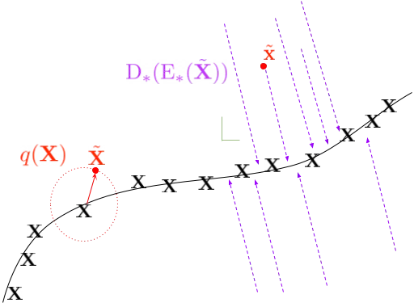
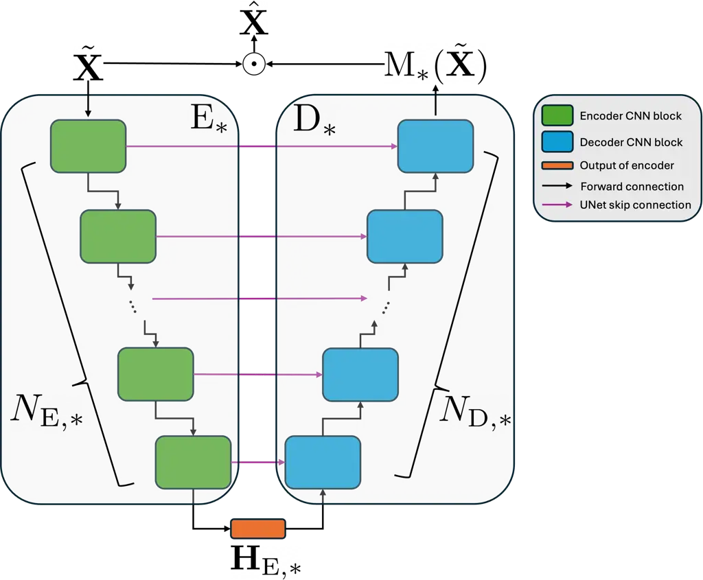
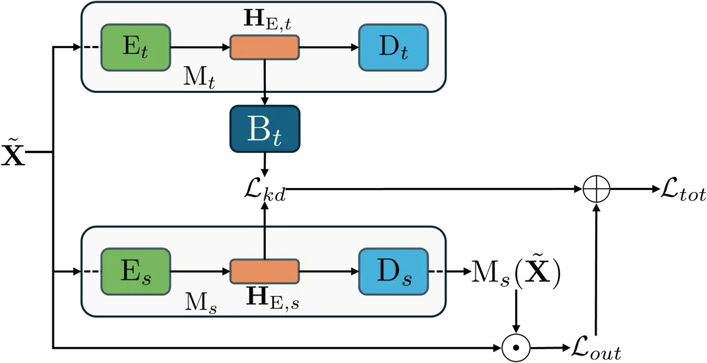

# Knowledge Distillation for Speech Denoising by Latent Representation Alignment with Cosine Distance

Diep Luong Affiliation: Tampere University, Tampere, Finland
Affiliation: Nokia Technologies, Espoo/Tampere, Finland    Mikko
Heikkinen Affiliation: Nokia Technologies, Espoo/Tampere, Finland   
Konstantinos Drossos Affiliation: Nokia Technologies, Espoo/Tampere,
Finland    Tuomas Virtanen Affiliation: Tampere University, Tampere,
Finland

###### Abstract

Speech denoising is a generally adopted and impactful task, appearing in
many common and everyday-life use cases. Although there are very
powerful methods published, most of those are too complex for deployment
in everyday and low-resources computational environments, like hand-held
devices, intelligent glasses, hearing aids, etc. Knowledge distillation
(KD) is a prominent way for alleviating this complexity mismatch and is
based on the transferring/distilling of knowledge from a pre-trained
complex model, the teacher, to another less complex one, the student.
Existing KD methods for speech denoising are based on processes that
potentially hamper the KD by bounding the learning of the student to the
distribution, information ordering, and feature dimensionality learned
by the teacher. In this paper, we present and assess a method that tries
to treat this issue, by exploiting the well-known denoising-autoencoder
framework, the linear inverted bottlenecks, and the properties of the
cosine similarity. We use a public dataset and conduct repeated
experiments with different mismatching scenarios between the teacher and
the student, reporting the mean and standard deviation of the metrics of
our method and another, state-of-the-art method that is used as a
baseline. Our results show that with the proposed method, the student
can perform better and can also retain greater mismatching conditions
compared to the teacher.

   

|     |
| --- |
|     |

Accepted for publication in the 158th Audio Engineering Society
Convention proceedings as an Express Paper.

## 1 Introduction

Speech denoising is a widely explored task, focusing on recovering the
speech signal from a noisy mixture \[1\]. Various approaches have been
proposed, with deep learning-based methods established as the leading
ones \[2, 3, 4\]. However, state-of-the-art (SOTA) methods, like \[5\],
typically feature intricate models with increased computational
complexity. Such models need high computational resources that render
them impractical for low-resource environments like hearing aids and
smartphones, where computationally light-weight, low-latency, and/or
real-time models are essential \[6\].

Various approaches have been proposed for reducing model complexity
while retaining good performance to make them suitable for deployment in
low-resource environments, with the three common approaches for the
reduction of complexity for speech denoising to be: a) model pruning, b)
quantization, and c) transfer learning-based methods. Model
pruning-based approaches reduce the complexity of the speech denoising
model by identifying and removing the learnable parameters that have the
least contribution to the model output (i.e., pruning the model) \[7, 8,
9, 10\]. Quantization-based approaches aim at storing model parameters
with fewer bits, thereby reducing memory and computation resources
required when deploying the model in environments with low computational
resources \[11, 12, 13\]. Finally, transfer learning-based approaches
aim at transferring learned information from an existing complex model
to another less complex model.

Knowledge distillation (KD) is a prominent transfer learning approach
for reducing the complexity of speech denoising models by yielding a
less complex model (the student) than an existing one (the
teacher) \[14\]. Unlike pruning- or quantization-based approaches, KD
seems to offer more flexibility in terms of model architecture and type,
as different architectures and/or types of models (e.g., non-causal vs
causal model) can be used as teacher and student \[15\]. In a nutshell,
KD involves the aligning of the information that is learned by the
student with that learned by the teacher \[14\]. In speech denoising,
the information alignment of the KD process is commonly performed either
on the outputs of the two models or on the intermediate features. When
the outputs of the two models are used, there is a minimization of a
loss function on the outputs of the student and the teacher, trying to
match the output of the student with the output of the teacher, when
given the same input, for example as in response-based
distillation \[16\]. When intermediate features are used, there is a
minimization of a loss function on latent representations, trying to
match the latent representation of the student with the one from the
teacher, as in feature-based KD \[17, 18\].

However, when the latent representations are used, there is a need for
accommodating for the dimensionality and ordering of information
mismatching (e.g. CNN channels with same index between student and
teacher do not necessarily hold same information). This issue is
addressed (explicitly or implicitly) by using either an averaging
process between the two different tensors, as in \[17\] where
self-similarity matrices are used, or by using a learned alignment that,
usually, is implemented by an attention mechanism, as in \[19\] where
multi-head attention is employed. Both of these approaches require
explicit selection of the dimensions to be taken into account (e.g. only
time, only feature, or both) and bound the learning of the student in
the learned latent distribution of the teacher \[20, 21\]. In addition,
the former approach has an explicit dependency on the dynamics of the
batch (e.g. examples in the batch and size), while the second makes the
implicit assumption, through the softmax activation in the attention
mechanism, that there is a one-to-one (or close to one-to-one) mapping
of the information between the two tensors used in the feature-based KD.
Furthermore, recent findings \[22\] suggest that the use of the
unregulated softmax (i.e., typical softmax) in the attention can be
quite suboptimal when there is significant difference between the
datasets used for the initial training of the teacher and the subsequent
KD process. Finally, empirical evidence suggests that KD methods based
on the above approaches, rely strongly on the numerical balance between
the losses used for the alignment of the latent representations and the
other losses used for the total KD-based training (e.g. response-based
loss and/or typical supervised loss of the student). This means that the
performance of the methods is sensitive to the weights used for the
losses of the alignment process in KD.

In this paper we focus on the above mentioned issues and we propose a KD
method that is using an implicit and learned ordering of the information
but without having the above mentioned requirements. Our method is
motivated by the denoising autoencoder (DAE) framework and previous work
on KD \[20, 21\] using cosine distance as KD loss, and is based on the
linear and inverted bottlenecks and the feature-based approaches for KD,
using a CNN-based linear bottleneck for dimensionality and information
ordering matching of the latent representations. The cosine distance
guides the student towards the learned, by the teacher, manifold of the
clean speech, but without bounding the learning of the student on the
learned distribution of the teacher. The linear bottleneck projects the
latent representation that is used for KD to a lower dimensional space,
without compromising the represented information \[23, 24\].

We evaluate our method through an ablation study, using publicly
available datasets, and we report the mean and standard deviation (STD)
calculated over five repeated experiments. Our results show that our
proposed method yields better and more robust (i.e. smaller STD) results
compared to SOTA. The rest of the paper is as follows. Section 2
presents necessary background and our proposed method and in Section 3
we present the evaluation setting and process. Section 4 holds the
results and related discussion and Section 5 concludes this paper.

## 2 Proposed method

Our method takes as an input a pre-trained teacher model
$`\text{M}_{t}`$, a randomly initialized student model $`\text{M}_{s}`$,
and a dataset
$`\mathbb{D}=\{(\tilde{\mathbf{X}}^{n},\mathbf{X}^{n})\}_{n=1}^{N_{i}}`$,
of $`N_{i}`$ noisy ($`\tilde{\mathbf{X}}`$) and corresponding clean
speech ($`\mathbf{X}`$) examples, and outputs the optimized student
model $`\text{M}_{s}^{\star}`$ which extracts and exploits information
that is aligned with the one from the pre-trained teacher model. For
this process, our method minimizes the joint loss
$`\mathcal{L}_{tot}=\mathcal{L}_{kd}+\mathcal{L}_{out}`$, consisting of
one KD loss on the latent representations, $`\mathcal{L}_{kd}`$, and one
supervised loss, $`\mathcal{L}_{out}`$, between the denoised signal from
$`\text{M}_{s}`$ and $`\mathbf{X}`$. $`\mathcal{L}_{kd}`$ is implemented
by cosine distance while $`\mathcal{L}_{out}`$ is a typical speech
denoising loss, which, in this study, is a source separation based loss
like SI-SNR \[25, 26\].

### 2.1 Teacher and student models

Our method assumes that both $`\text{M}_{t}`$ and $`\text{M}_{s}`$ are
based on the DAE architecture, i.e. both consist of two parameterized
functions; an encoder $`\text{E}_{*}`$, and a decoder,
$`\text{D}_{*}`$¹¹ 1 In the rest of the text the symbol $`*`$ will be
used as a wildcard for indicating teacher and/or student related symbols
and variables.. Additionally, both $`M_{*}`$ take as input the magnitude
of the time-frequency (TF) representation of $`\tilde{\mathbf{X}}`$,
denoted as $`\tilde{\mathbf{Y}}=Z(\tilde{\mathbf{X}})`$. Here,
$`\tilde{\mathbf{Y}}\in\mathbb{R}^{T\times F}`$ is the magnitude of the
TF representation of $`\tilde{\mathbf{X}}`$, consisting of $`T`$ TF
vectors each of length $`F`$. The function Z is responsible for
extracting the magnitude of the TF representation, using methods such as
FFT or STFT.

Given the DAE architecture, the encoder consists of $`N_{\text{E},*}`$
blocks, while the decoder is comprised of $`N_{\text{D},*}`$ blocks. It
is important to note that the number of blocks in the encoder and
decoder are equal, i.e. $`N_{\text{E},*}=N_{\text{D},*}=N_{*}`$. Within
the encoder, there are $`N_{*}`$ sequential processes
$`P_{\text{E},*}^{n}`$, with $`n=1,2,\ldots,N_{*}`$, as

```math
\text{E}_{*}=P_{\text{E},*}^{N_{*}}\circ P_{\text{E},*}^{N_{*}-1}\circ\ldots\circ P_{\text{E},*}^{1}. \tag{1}
```

$`\text{E}_{*}`$ takes as an input $`\tilde{\mathbf{Y}}`$ and outputs
its latent representation $`\mathbf{H}_{*}`$ as

```math
\displaystyle\mathbf{H}_{\text{E},*} \displaystyle=\text{E}_{*}(\tilde{\mathbf{Y}}),\text{ where} \tag{2}
```

```math
\displaystyle\mathbf{H}_{\text{E},*} \displaystyle=P_{\text{E},*}^{N_{*}}(\mathbf{H}_{\text{E},}^{N_{*}-1}), \tag{3}
```

```math
\displaystyle\mathbf{H}_{\text{E},*}^{n} \displaystyle=P_{\text{E},*}^{n}(\mathbf{H}_{\text{E},}^{n-1}), \tag{4}
```

```math
\displaystyle\mathbf{H}_{\text{E},*}^{0} \displaystyle=\tilde{\mathbf{Y}}, \tag{5}
```

$`\mathbf{H}_{\text{E},*}\in\mathbb{R}^{C_{\text{E},*}\times H_{\text{E},*}\times W_{\text{E},*}}`$
is the output latent representation of $`\text{E}_{*}`$ where
$`C_{\text{E},*}\geq 1`$ $`H_{\text{E},*}<T`$, and $`W_{\text{E},*}<F`$.

$`\text{D}_{*}`$, similarly to $`\text{E}_{*}`$, consists of $`N_{*}`$
concatenated processes $`P_{\text{D},*}^{n}`$, with
$`n=1,2,\ldots,N_{*}`$, as

```math
\text{D}_{*}=P_{\text{D},*}^{N_{*}}\circ P_{\text{D},*}^{N_{*}}\circ\ldots\circ P_{\text{D},*}^{1}. \tag{6}
```

$`\mathbf{H}_{\text{E},*}`$ is given as an input to $`\text{D}_{*}`$ as

```math
\displaystyle\hat{\mathbf{Y}}_{*} \displaystyle=\text{D}_{*}(\mathbf{H}_{\text{E},*}),\text{ where} \tag{7}
```

```math
\displaystyle\hat{\mathbf{Y}}_{*} \displaystyle=P_{\text{D},*}^{N_{*}}(\mathbf{H}_{\text{D},*}^{N_{*}-1},\mathbf{H}_{\text{E},*}^{1}), \tag{8}
```

```math
\displaystyle\mathbf{H}_{\text{D},*}^{n} \displaystyle=P_{\text{D},*}^{n}(\mathbf{H}_{\text{D},*}^{n-1},\mathbf{H}_{\text{E},*}^{N_{*}-(n-1)})\text{ for }n\geq 2, \tag{9}
```

```math
\displaystyle\mathbf{H}_{\text{D},*}^{1} \displaystyle=P_{\text{D},*}^{1}(\mathbf{H}_{\text{D},*}^{0}), \tag{10}
```

```math
\displaystyle\mathbf{H}_{\text{E},*} \displaystyle=\mathbf{H}_{\text{D},*}^{0}. \tag{11}
```

### 2.2 Dimensionality and information ordering matching

Our method uses the $`\mathbf{H}_{\text{E},*}`$ for the KD process.
Though, there is the flexibility for dimensionality mismatching between
$`\mathbf{H}_{\text{E},t}`$ and $`\mathbf{H}_{\text{E},s}`$, i.e. at
least one of $`C_{\text{E},t}\neq C_{\text{E},s}`$,
$`H_{\text{E},t}\neq H_{\text{E},s}`$, and
$`W_{\text{E},t}\neq W_{\text{E},s}`$ is true. But, even if there is no
dimensionality mismatching, given that $`\text{E}_{t}`$ and
$`\text{E}_{s}`$ have different parameters and (given the scope of this
work) most likely considerable difference in the number of learned
parameters, then it is almost certain that there is no consistent
ordering of the information between $`\mathbf{H}_{\text{E},t}`$ and
$`\mathbf{H}_{\text{E},s}`$, e.g.
$`\mathbf{H}_{\text{E},t}[c,:]\neq\mathbf{H}_{\text{E},s}[c,:]`$.

To solve the above, our method uses a linear bottleneck,
$`\text{B}_{t}`$, that maps the dimensionality and/or re-orders the
information of $`\mathbf{H}_{\text{E},t}`$ to match that of
$`\mathbf{H}_{\text{E},s}`$. This choice is motivated by the usage of
convolutional linear bottleneck in the MobileNetv2 architecture \[24\],
where a linear bottleneck was used to reduce the dimensionality of the
feature map but without (or without considerable) loss of
information \[24, 27\]. Therefore, our method adopts the linear
bottleneck to, on one hand, map the dimensionality of the
$`\mathbf{H}_{\text{E},t}`$ to the dimensionality of the
$`\mathbf{H}_{\text{E},s}`$ and, on the other hand, to allow for
learnable re-ordering of information between the dimensions of the
$`\mathbf{H}_{\text{E},*}`$. Specifically, our method uses
$`\text{B}_{t}`$ as

```math
\mathbf{H}_{\text{B},t}=\text{B}_{t}(\mathbf{H}_{\text{E},t}), \tag{12}
```

where
$`\mathbf{H}_{\text{B},t}\in\mathbb{R}^{C_{\text{E},s}\times H_{\text{E},s}\times W_{\text{E},s}}`$.

### 2.3 Losses and student optimization

Motivated by the DAE framework, our method uses the cosine distance as
the KD loss. As shown in \[23\] and is illustrated in Figure 1, a DAE
tries to map a noisy sample to the manifold of the source. In the scope
of this work, the pre-trained $`\text{M}_{t}`$ is already optimized to
implement the mapping of noisy speech samples to the manifold of the
clean speech, i.e. perform denoising of the noisy input
$`\tilde{\mathbf{X}}`$. Although the latent features learned by
$`\text{M}_{s}`$ are not necessarily in the same numerical range as the
ones learned by $`\text{M}_{t}`$, especially if these features are
observed early in the model (e.g. at the end of $`\text{E}_{*}`$), the
two need to be oriented towards the same manifold, i.e., that of the
clean speech, since the supervised training target of both
$`\text{M}_{t}`$ and $`\text{M}_{s}`$ is the same. Additionally, given
the learning/capacity gap between $`\text{E}_{t}`$ and $`\text{E}_{s}`$,
the distribution of the latent features that are learned by
$`\text{E}_{t}`$ will (most likely if not certainly) are different from
that which $`\text{E}_{s}`$ will learn. Using a divergence metric (e.g.
KL) or an $`\text{L}_{p}`$ based metric as the KD loss, will bound the
learning of the $`\text{E}_{s}`$ \[20, 21\].



Figure 1: Illustration of the DAE process, where $`q(\cdot)`$ is a
corruption process that yields $`\tilde{\mathbf{X}}`$. With red color
are indicated the noisy/corrupted data ($`\tilde{\mathbf{X}}`$), with
black the clean ones ($`\mathbf{X}`$), with purple is the mapping that
is learned from the DAE, and the green axis are for visual convenience.
Image is after \[23\].

The above observations motivated our method to adopt the cosine distance
($`\text{cos}_{dist}`$) as a KD loss. Since $`\text{cos}_{dist}`$ is
scale-invariant, the KD process is expected to align the angle of the
latent features between $`\text{E}_{t}`$ and $`\text{E}_{s}`$, without
trying to match either the numerical ranges or the distribution of the
latent features. This is most likely to yield more learning and aligning
capacity at the KD process \[20, 21\]. Our method uses
$`\text{cos}_{dist}`$ as

```math
\displaystyle\mathcal{L}_{kd}= \displaystyle\text{ }\text{cos}_{dist}(\mathbf{H}_{\text{B},t},\mathbf{H}_{\text{E},s}),\text{ where} \tag{13}
```

```math
\displaystyle\text{cos}_{dist}(\mathbf{H}_{\text{B},t},\mathbf{H}_{\text{E},s})= \displaystyle\text{ }1-\frac{\langle\mathbf{H}_{\text{B},t},\mathbf{H}_{\text{E},s}\rangle}{||\mathbf{H}_{\text{B},t}||_{2}\cdot||\mathbf{H}_{\text{E},s}||_{2}}, \tag{14}
```

$`\langle\cdot,\cdot\rangle`$ is the dot product, and $`||\cdot||_{2}`$
is the Euclidean norm.

The learning of the $`\text{M}_{s}`$ is guided in a supervised way by
employing a typical function for source separation tasks,
$`\text{S}_{s}`$, (like mean squared error or SI-SNR) over the predicted
output and the ground truth as

```math
\mathcal{L}_{out}=\text{S}_{s}(\hat{\mathbf{X}},\mathbf{X}),\text{ where} \tag{15}
```

$`\hat{\mathbf{X}}=\tilde{\mathbf{X}}\odot\text{M}_{s}(\tilde{\mathbf{X}})`$
is the denoised signal, and $`\mathbf{X}`$ is the ground truth.

Finally, $`\text{M}_{s}`$ is optimized by the minimization of the joint
loss $`\mathcal{L}_{tot}`$

```math
\mathcal{L}_{tot}=\lambda_{kd}\mathcal{L}_{kd}+\lambda_{out}\mathcal{L}_{out},\text{ where} \tag{16}
```

$`\lambda_{kd}`$ and $`\lambda_{out}`$ are scaling factors for the
corresponding losses.

## 3 Evaluation

We evaluate our method using a popular and widely adopted DAE
architecture for speech denoising, a publicly available dataset, and
well established metrics in speech denoising, and for all
hyper-parameters we use as much as possible typical default options.
Using the employed dataset we train a large teacher model,
$`\text{M}_{t}`$, following typical set-up of hyper-parameters. Then we
freeze the weights of $`\text{M}_{t}`$, employ the same dataset and the
joint loss in Eq. 16, and optimize a randomly initialized small model,
$`\text{M}_{s}`$. Both of the models, $`\text{M}_{*}`$, are based on the
same architecture. To evaluate the performance of the choices for the KD
process, we use three settings regarding the discrepancies between
$`C_{E,*}`$, $`H_{E,*}`$, and $`W_{E,*}`$. Finally, we repeat each KD
process 5 times and report the mean and standard deviation.

### 3.1 Dataset and data pre- and post-processing

For the pre-training of the $`\text{M}_{t}`$ and the KD process, we use
the publicly available DNS-Challenge dataset, specifically the v5
speakerphone set \[28\] (referred to as development training). We
resample all files to 16kHz sampling rate and we manually split the
speaker and noise files of the development training set to training,
validation, and testing splits, with a ratio of (as close as possible
to) 60/20/20%, respectively, and ensuring that the splitting ratio is
kept throughout the sub-sets of the DNS-Challenge (e.g. read speech,
emotional speech, etc.). Then, for each split we segment all files to
segments of two second duration, discarding segments with no activity or
shorter than two seconds.

We mix clean speech and noise files by uniformly sampling integer SNR
values from the range of $`[-5,20]`$ dB SNR. All resulting noisy files,
$`\tilde{\mathbf{X}}`$, are scaled to be in the limit of $`[-1,1]`$
amplitude, also proportionally scaling the corresponding clean speech
signal, $`\mathbf{X}`$. For both the pre-training and the KD process,
the datasets $`\mathbb{D}`$ used for training and validation are formed
on-the-fly, meaning that in each epoch the noise files were randomly
selected (and, if needed, oversampled) from the pool of noise files.
Though, the testing split was created once, to keep a consistent point
of reference. From each two-second-long signal, we extract $`T=126`$
STFT vectors of $`F=256`$ elements, using 512 FFT points with 50%
overlap. We calculate the magnitude spectrum and phase from the STFT and
use the magnitude as an input to $`\text{M}_{*}`$. The inverse STFT is
performed using the predicted magnitude spectrum from the speech
denoising process and the phase of the noisy input.

### 3.2 DAE architecture and linear bottleneck implementation

For $`\text{M}_{*}`$ we use the Unet architecture \[29\], as it is a
prominent and widely used architecture in speech denoising \[30, 31, 6,
32, 33\]. To be able to evaluate our KD method under different
dimensionality mismatching conditions at the
$`\mathbf{H}_{\text{E},*}`$, we use two different $`\text{M}_{t}`$,
$`\text{M}_{t1}`$ and $`\text{M}_{t2}`$, and two different
$`\text{M}_{s}`$, $`\text{M}_{s1}`$ and $`\text{M}_{s2}`$.
$`\text{E}_{t1}`$ consists of $`N_{\text{E},t1}=6`$ CNN blocks and
$`\text{E}_{t2}`$ of $`N_{\text{E},t2}=7`$. Each block has a 2D
convolutional neural network (CNN) implementing a strided convolution, a
normalization process (instance norm), and a nonlinearity (leaky
rectified linear unit, ReLU, with default slope). Following typical
practices, in $`\text{E}_{t1}`$ each CNN block halves the number of
columns of its input tensor, while doubling the number of channels,
while in $`\text{E}_{t2}`$ the halving of columns and the doubling of
channels happens every two CNN blocks. Preserving the number of rows
(i.e. corresponding to time dimension) is adopted according to most
practices regarding the teacher model in KD and for speech denoising. In
both $`\text{E}_{t1}`$ and $`\text{E}_{t2}`$ a square $`5x5`$ kernel
with a stride of $`1x1`$ was used (for not affecting the dimensions) or
$`1x2`$ if the columns were halved, and appropriate padding. The above
yield
$`\{C_{\text{E},t1},H_{\text{E},t1},W_{\text{E},t1}\}=\{128,126,5\}`$
and
$`\{C_{\text{E},t2},H_{\text{E},t2},W_{\text{E},t2}\}=\{128,126,17\}`$.

Followingly, $`\text{D}_{t1}`$ and $`\text{D}_{t2}`$ are symmetrical to
the corresponding encoders, consisting of $`N_{\text{D},t1}=6`$ and
$`N_{\text{D},t2}=7`$ transposed CNN blocks, respectively. Each block
has a transposed CNN, a normalization process, and a non-linearity,
similarly to $`\text{E}_{t}`$ and corresponding kernel, stride, and
padding. The skip connections between $`\text{E}_{t}`$ and
$`\text{D}_{t}`$ are implemented according to standard practices, using
the output of each CNN block from the encoder, apart from the last one.
Also, the last transposed CNN block has no normalization process and has
sigmoid as non-linearity for both $`\text{D}_{t1}`$ and
$`\text{D}_{t2}`$. The number of trainable parameters in
$`\text{M}_{t1}`$ and $`\text{M}_{t2}`$ are 1.35M and 2.04M. Teacher
models $`\text{M}_{t1}`$ and $`\text{M}_{t2}`$ has respectively 2996.20
MOps/sample and 10939.91 MOps/sample (i.e. the number of operations
required to process a single sample). An illustration of the employed
architecture is in Figure 2.



Figure 2: Illustration of the employed UNet architecture for the
utilized DAEs. With $`\odot`$ is the Hadamard product

$`\text{E}_{s1}`$ and $`\text{E}_{s2}`$ have
$`N_{\text{E},s1}=N_{\text{E},s2}=6`$ cascaded CNN blocks, similarly to
$`\text{M}_{t}`$, but with a square $`3x3`$ kernel. In $`\text{E}_{s1}`$
the stride is $`1x2`$, so the time-corresponding dimension is not
altered, while in $`\text{E}_{s2}`$ a stride of $`2x2`$ is used and the
time-corresponding dimensions is reduced as well. In both
$`\text{E}_{s1}`$ and $`\text{E}_{s2}`$, the frequency-corresponding
dimension (i.e. columns) are halved with every CNN block. The above
yield
$`\{C_{\text{E},s1},H_{\text{E},s1},W_{\text{E},s1}\}=\{32,126,5\}`$ and
$`\{C_{\text{E},s2},H_{\text{E},s2},W_{\text{E},s2}\}=\{32,2,5\}`$.
$`\text{D}_{s1}`$ and $`\text{D}_{s2}`$ are implemented symmetrically to
$`\text{E}_{s1}`$ and $`\text{E}_{s2}`$ (i.e., same kernel size, stride,
and padding) and according to $`\text{D}_{t1}`$ and $`\text{D}_{t2}`$
(i.e. same configurations for normalization and non-linearities). Both
$`\text{M}_{s1}`$ and $`\text{M}_{s2}`$ have 37k trainable parameters,
but differ in computational complexity, with $`\text{M}_{s1}`$ requiring
65.01 MOps/sample and $`\text{M}_{s2}`$ requiring 7.10 MOps/sample.

The linear bottleneck is implemented by a CNN block of concatenated
CNNs, without any non-linearities or normalization processes in between
as proposed in \[24\] for the inverted linear bottleneck module. The
CNNs have a kernel of $`1x1`$ size, with unit stride and no padding.
Effectively, this is an affine transform over the channel dimension of
the input tensor. For example, in the case where the $`C_{\text{E},*}`$
and $`H_{\text{E},*}`$ needed to match between
$`\mathbf{H}_{\text{E},t}`$ and $`\mathbf{H}_{\text{E},s}`$, the linear
bottleneck consists of two CNNs. The first one takes as input
$`\mathbf{H}_{\text{E},t}`$ and operates along the $`C`$ dimension and
the next one takes as input the output of the first and operates along
the $`H`$ dimension. To test all cases of dimensionality mismatching, we
used three different set-ups of bottlenecks; a) with one CNN, matching
only $`C_{*}`$, b) with two CNNs, matching $`C_{*}`$ and then $`H_{*}`$,
and c) with three CNNs, matching $`C_{*}`$, $`H_{*}`$, and $`W_{*}`$.

### 3.3 Training, knowledge distillation process, and metrics

The pre-training of the $`\text{M}_{t1}`$ and $`\text{M}_{t2}`$
implemented by minimizing the SI-SNR loss

```math
\displaystyle\mathcal{L}_{pre}=\text{SI-SNR}(\mathbf{X},\tilde{\mathbf{X}}\odot\text{M}_{t*}(\tilde{\mathbf{X}})),\text{ where} \tag{17}
```

```math
\displaystyle\text{SI-SNR}(x,\hat{x})=10\log_{10}(\frac{||\frac{\hat{x}^{T}x}{||x||^{2}}x||^{2}}{||\frac{\hat{x}^{T}x}{||x||^{2}}x-\hat{x}||^{2}}), \tag{18}
```

$`x`$ is a target signal, and $`\hat{x}`$ is a prediction of $`x`$.
Then, we implement the KD process by minimizing the loss in Eq.16 and
using the pre-trained teacher model. Both training of the teacher models
and KD processes are implemented using Adam optimizer \[34\] with
default hyper-parameters, a batch size of 32, and adopting the early
stopping policy on the loss of the validation split.

We implemented three KD processes; i) from $`\text{M}_{t1}`$ to
$`\text{M}_{s1}`$ to evaluate the mismatching of the channel dimension
(i.e. matching $`C_{*}`$) and/or the information rearrangement in the
other dimensions, ii) from $`\text{M}_{t1}`$ to $`\text{M}_{s2}`$ to
evaluate the mismatching of the channel dimension and the time dimension
(i.e. matching $`C_{*}`$ and $`H_{*}`$) and/or the information
rearrangement in the frequency dimension, and iii) from
$`\text{M}_{t2}`$ to $`\text{M}_{s2}`$ to evaluate the mismatching of
the channel, time, and frequency dimensions (i.e. matching $`C_{*}`$,
$`H_{*}`$, and $`W_{*}`$). An illustration of the KD process is in
Figure 3. For evaluating our method without any optimization regarding
the numerical balance of the losses, we opted for
$`\lambda_{kd}=\lambda_{out}=1`$.



Figure 3: Illustration of the KD process, where $`\oplus`$ is simple
summation.

For the evaluation of the performance we employed the objective,
intrusive metrics SDR, SI-SDR, wide-band PESQ, and STOI on the utilized
testing split of the development training dataset. While we pre-trained
each teacher model just once, we implemented each of the three KD
scenarios five times and we report the mean and STD of the above
metrics.

### 3.4 Baselines

We compare our method with SOTA KD methods for speech denoising \[17,
18\]. For having a vanilla-based and fair comparison, we re-implemented
these methods given the employed models in this work. Although we tried
to re-implement the method in \[17\], we could not reproduce any
improvements on the student. Our empirical observation showed that there
was a great fluctuation of performance in different, repeated
experiments and that there is a great dependency on the numerical
balance of the utilized losses. Though, we were able to do so with the
method in \[18\], which we use to compare our method with and we signify
it as ATKL.

|                             |                |                |               |               |
| --------------------------- | -------------- | -------------- | ------------- | ------------- |
| Model                       | SDR            | SI-SDR         | WB PESQ       | STOI          |
| T1                          | 18.6882/0.0000 | 17.7157/0.0000 | 2.5323/0.0000 | 0.9178/0.0000 |
| T2                          | 18.9415/0.0000 | 17.9524/0.0000 | 2.5419/0.0000 | 0.9194/0.0000 |
| S1                          | 16.1381/0.0828 | 15.1891/0.0581 | 2.0239/0.0147 | 0.8837/0.0013 |
| S2                          | 13.9856/0.0719 | 13.1243/0.0808 | 1.7537/0.0181 | 0.8502/0.0006 |
| KD process with student S1  |                |                |               |               |
| T1 $`\mapsto`$ S1 ATKL      | 16.1308/0.0961 | 15.1848/0.0506 | 2.0365/0.0181 | 0.8839/0.0009 |
| T1 $`\mapsto`$ S1 (C)       | 16.0945/0.1102 | 15.2156/0.0522 | 2.0212/0.0143 | 0.8843/0.0010 |
| T1 $`\mapsto`$ S1 (C, H)    | 16.2008/0.1203 | 15.2445/0.0462 | 2.0246/0.0175 | 0.8845/0.0011 |
| T1 $`\mapsto`$ S1 (C, H, W) | 16.2162/0.0500 | 15.2059/0.0305 | 2.0176/0.0120 | 0.8837/0.0004 |
| KD process with student S2  |                |                |               |               |
| T1 $`\mapsto`$ S2 ATKL      | 13.9380/0.0955 | 13.0617/0.0821 | 1.7393/0.0080 | 0.8478/0.0012 |
| T2 $`\mapsto`$ S2 ATKL      | \-             | \-             | \-            | \-            |
| T1 $`\mapsto`$ S2 (C, H)    | 14.0517/0.1166 | 13.1663/0.0542 | 1.7594/0.0157 | 0.8515/0.0018 |
| T1 $`\mapsto`$ S2 (C, H, W) | 14.0856/0.0400 | 13.1415/0.0917 | 1.7429/0.0107 | 0.8496/0.0011 |
| T2 $`\mapsto`$ S2 (C, H, W) | 14.0277/0.0579 | 13.1606/0.0757 | 1.7528/0.0131 | 0.8505/0.0013 |

Table 1: Mean/STD of evaluation metrics for our method and the baseline.
“$`\text{A }\mapsto\text{ B}`$” shows KD process, from A to B. (C) means
that there was a dimensionality mismatch handling only for the channel
dimension and, similarly, (C, H) and (C, H, W) show the same for
channel, time, and frequency dimensions, respectively. With ATKL is the
baseline method, KD process results with “-” indicate that the KD
process could not be implemented. Best results for each student model
are indicated with bold.

## 4 Results and discussion

In Table 1 are the obtained results on the testing split of the
development training set. We report the mean and STD of the employed
evaluation metrics, i.e. SDR, SI-SDR, wide band PESQ (WB-PESQ), and
STOI, for each approach.

As illustrated in Table 1, the proposed KD method demonstrates better
performance compared to the ATKL baseline in all but one scenario. This
indicates a consistent improvement across various settings, highlighting
the robustness and effectiveness of the proposed approach. A
particularly observation is the $`T2\mapsto S2`$ configuration, a
setting where ATKL fails to effectively adapt to the dimensionality
mismatch. This suggests that the proposed method has greater flexibility
and adaptability in transferring knowledge between teacher and student
networks, even in challenging scenarios where ATKL may struggle.

Of all the cases of dimensionality matching, the benefits of the
proposed method are more pronounced in the $`(C,H)`$ cases. Unlike
averaging-based methods (e.g., ATKL), which may oversimplify the
transfer process and potentially lose valuable information, the proposed
method appears to retain and convey more nuanced and detailed knowledge
from the teacher to the student network. This leads to better alignment
and improved learning outcomes for the student network.

Additionally, from Table 1 can be observed that there are small
numerical differences between the metrics of all cases. It should be
noted that, as mentioned in Sections 2 and 3, the evaluation was kept as
vanilla as possible. This was done in order to study and exhibit the
robustness of the proposed method (i.e., the proposed method should work
better even when nothing is specifically tuned for the use case), and to
reveal the performance of the proposed method and the utilized
baseline(s) in "default" scenarios. Given these, the observed increases
are in accordance with existing work on speech denoising KD, where,
quite often, increases in the range of 0.1 to 1 dB are observed for the
student \[17\]. On the same note, the performance improvement of the
student networks facilitated by KD, whether through ATKL or our proposed
method, is marginal. This observation warrants a deeper investigation
into the underlying reasons for such limited enhancements. One plausible
explanation for this phenomenon is that the student network, when
trained solely through supervised learning, might already reach its
optimum in speech denoising. Consequently, the additional knowledge
distilled from the teacher network does not significantly augment the
student’s learning process. Another hypothesis is the potential
inadequacy of the teacher network in providing substantial and
meaningful guidance to the student network. The efficacy of knowledge
distillation relies on the premise that the teacher network possesses
superior knowledge that can be transferred to the student. However, if
the teacher network’s learned features and representations are not
markedly more advanced than those of the student network, the
information gap between the teacher and the student remains minimal,
implying that the teacher’s guidance does not offer novel insights that
could enhance the student’s performance beyond its current capabilities.
The explanation for the observation requires further investigation.

## 5 Conclusion and future work

In the present paper is proposed a method for knowledge distillation
(KD) of speech denoising models, based on deep neural networks (DNNs).
The proposed method takes advantage of the denoising auto-encoder (DAE)
framework, the linear bottlenecks, and the properties of the cosine
similarity, and implements a KD process which does not bound the
learning of the student to the learned distribution of the teacher and
is more robust to numerical scaling of the losses. Additionally, the
proposed method works with any dimensionality mismatch between the
teacher and the student, which is not true for the SOTA KD methods for
speech denoising.

Further improvements of this method can focus more on the following
limitations. Firstly, in this study, the linear bottleneck and the
student network are trained concurrently during the KD process, creating
conflicting objectives. The linear bottleneck’s primary role is to
transform the teacher network’s latent features, guided by the KD loss.
However, this can lead to suboptimal extraction of meaningful
information from the teacher’s features, as the optimization may
prioritize minimizing the KD loss over preserving structured
relationships within the teacher’s representations. This can result in
the student network receiving less valuable information, compromising
the KD efficacy. Additionally, with the bottleneck trained along the KD
process and cosine distance, which is scale invariant, as the KD loss,
there are no constraints on the scale of the transformed teacher
features, potentially leading to numerical imbalance.

Using cosine distance as the similarity metric in KD aligns the learned
information between the teacher and student in terms of orientation, not
feature scale. This allows the student network to learn from the
teacher’s features without being constrained by their scale, providing
greater flexibility and potentially leading to more robust and
generalized representations. However, \[35\] shows that cosine
similarity may not accurately measure similarity if feature dimensions
are correlated. Therefore, while cosine distance has benefits, it is
important to recognize its limitations with correlated features.
Exploring alternative metrics that account for feature correlations
could improve the efficacy of KD.

This study demonstrates the efficacy of employing the linear bottlenecks
together with cosine similarity on DAE structure to perform KD in speech
denoising. Results show that the proposed method has an improvement,
even though marginal, compared to SOTA KD methods. The limitations of
the proposed method are acknowledged and will be addressed in the future
work.

## References

- \[1\] R. Xu, R. Wu, Y. Ishiwaka, C. Vondrick, and C. Zheng. Listening
  to sounds of silence for speech denoising. In H. Larochelle,
  M. Ranzato, R. Hadsell, M.F. Balcan, and H. Lin, editors, Advances in
  Neural Information Processing Systems, volume 33, pages 9633–9648.
  Curran Associates, Inc., 2020.
- \[2\] B. Huang, D. Ke, H. Zheng, B. Xu, Y. Xu, and K. Su. Multi-task
  learning deep neural networks for speech feature denoising. In
  Interspeech 2015, pages 2464–2468, 2015.
- \[3\] D. Rethage, J. Pons, and X. Serra. A wavenet for speech
  denoising. In 2018 IEEE International Conference on Acoustics, Speech
  and Signal Processing (ICASSP), pages 5069–5073, 2018.
- \[4\] S. Kataria, J. Villalba, and N. Dehak. Perceptual loss based
  speech denoising with an ensemble of audio pattern recognition and
  self-supervised models. In ICASSP 2021 - 2021 IEEE International
  Conference on Acoustics, Speech and Signal Processing (ICASSP), pages
  7118–7122, 2021.
- \[5\] Y. Hu, Y. Liu, S. Lv, M. Xing, S. Zhang, Y. Fu, J. Wu, B. Zhang,
  and L. Xie. Dccrn: Deep complex convolution recurrent network for
  phase-aware speech enhancement. In Interspeech 2020, pages
  2472–2476, 2020.
- \[6\] H.-S. Choi, S. Park, J. H\> Lee, H. Heo, D. Jeon, and K. Lee.
  Real-time denoising and dereverberation wtih tiny recurrent u-net. In
  ICASSP 2021 - 2021 IEEE International Conference on Acoustics, Speech
  and Signal Processing (ICASSP), pages 5789–5793, 2021.
- \[7\] Davis W. Blalock, Jose Javier Gonzalez Ortiz, Jonathan Frankle,
  and John V. Guttag. What is the state of neural network pruning? In
  Third Conference on Machine Learning and Systems (3^(rd) MLSys), 2020.
- \[8\] G. Fang, X. Ma, M. Song, M. Bi Mi, and X. Wang. DepGraph:
  Towards any structural pruning. In 2023 IEEE/CVF Conference on
  Computer Vision and Pattern Recognition (CVPR), pages
  16091–16101, 2023.
- \[9\] Y. He and L. Xiao. Structured pruning for deep convolutional
  neural networks: A survey. IEEE Transactions on Pattern Analysis and
  Machine Intelligence, 46(5):2900–2919, 2024.
- \[10\] M. Stamenovic, N. L. Westhausen, L.-C. Yang, C. Jensen, and
  A. Pawlicki. Weight, block or unit? exploring sparsity tradeoffs for
  speech enhancement on tiny neural accelerators. In Advances in Neural
  Information Processing Systems (NeurIPS), 2021.
- \[11\] J. Yang, X. Shen, J. Xing, X. Tian, H. Li, B. Deng, J. Huang,
  and X.-S. Hua. Quantization networks. In 2019 IEEE/CVF Conference on
  Computer Vision and Pattern Recognition (CVPR), pages 7300–7308, 2019.
- \[12\] Mark Horowitz. 1.1 computing’s energy problem (and what we can
  do about it). In 2014 IEEE International Solid-State Circuits
  Conference Digest of Technical Papers (ISSCC), pages 10–14, 2014.
- \[13\] Niccolò Nicodemo, Gaurav Naithani, Konstantinos Drossos, Tuomas
  Virtanen, and Roberto Saletti. Memory requirement reduction of deep
  neural networks for field programmable gate arrays using low-bit
  quantization of parameters. In 28th European Signal Processing
  Conference (EUSIPCO), 2021.
- \[14\] Geoffrey Hinton, Oriol Vinyals, and Jeffrey Dean. Distilling
  the knowledge in a neural network. In NIPS Deep Learning and
  Representation Learning Workshop, 2015.
- \[15\] Mingshuai Liu, Zhuangqi Chen, Xiaopeng Yan, Yuanjun Lv, Xianjun
  Xia, Chuanzeng Huang, Yijian Xiao, and Lei Xie. Rad-net 2: A causal
  two-stage repairing and denoising speech enhancement network with
  knowledge distillation and complex axial self-attention. In
  Interspeech 2024, pages 1700–1704, 2024.
- \[16\] M. Thakker, S. E. Eskimez, T. Yoshioka, and H. Wang. Fast
  real-time personalized speech enhancement: End-to-end enhancement
  network (E3Net) and knowledge distillation. In Interspeech 2022, pages
  991–995, 2022.
- \[17\] R. D. Nathoo, M. Kegler, and M. Stamenovic. Two-step knowledge
  distillation for tiny speech enhancement. In ICASSP 2024 - 2024 IEEE
  International Conference on Acoustics, Speech and Signal Processing
  (ICASSP), pages 10141–10145, 2024.
- \[18\] R. Han, W. Xu, Z. Zhang, M. Liu, and L. Xie. Distil-dccrn: A
  small-footprint dccrn leveraging feature-based knowledge distillation
  in speech enhancement. IEEE Signal Processing Letters,
  31:2075–2079, 2024.
- \[19\] H. J. Park, W. Shin, J. S. Kim, and S. W. Han. Leveraging
  non-causal knowledge via cross-network knowledge distillation for
  real-time speech enhancement. IEEE Signal Processing Letters,
  31:1129–1133, 2024.
- \[20\] G. Ham, S. Kim, S. Lee, J.-H. Lee, and D. Kim. Cosine
  similarity knowledge distillation for individual class information
  transfer, 2023.
- \[21\] S. Park, D. Kang, and J. Paik. Cosine similarity-guided
  knowledge distillation for robust object detectors. Scientific
  Reports, 14(1), Aug 2024.
- \[22\] P. Veličković, C. Perivolaropoulos, F. Barbero, and R. Pascanu.
  softmax is not enough (for sharp out-of-distribution). In Advances in
  Neural Information Processing Systems (NeurIPS), 2025.
- \[23\] P. Vincent, H. Larochelle, I. Lajoie, Y. Bengio, and P.-A.
  Manzagol. Stacked denoising autoencoders: Learning useful
  representations in a deep network with a local denoising criterion.
  Journal of Machine Learning Research, 11:3371–3408, 2010.
- \[24\] M. Sandler, A. Howard, M. Zhu, A. Zhmoginov, and L.-C. Chen.
  MobileNetV2: Inverted Residuals and Linear Bottlenecks. In 2018
  IEEE/CVF Conference on Computer Vision and Pattern Recognition (CVPR),
  pages 4510–4520, 2018.
- \[25\] Y. Luo and N. Mesgarani. Tasnet: Time-domain audio separation
  network for real-time, single-channel speech separation. In 2018 IEEE
  International Conference on Acoustics, Speech and Signal Processing
  (ICASSP), pages 696–700, 2018.
- \[26\] J. Le Roux, S. Wisdom, H. Erdogan, and J. R. Hershey. Sdr –
  half-baked or well done? In ICASSP 2019 - 2019 IEEE International
  Conference on Acoustics, Speech and Signal Processing (ICASSP), pages
  626–630, 2019.
- \[27\] D. Han, J. Kim, and J. Kim. Deep pyramidal residual networks.
  In 2017 IEEE Conference on Computer Vision and Pattern Recognition
  (CVPR), pages 6307–6315, 2017.
- \[28\] H. Dubey, A. Aazami, V. Gopal, B. Naderi, S. Braun, R. Cutler,
  H. Gamper, M. Golestaneh, and R. Aichner. ICASSP 2023 deep noise
  suppression challenge. In ICASSP 2023 - 2023 IEEE International
  Conference on Acoustics, Speech and Signal Processing (ICASSP), 2023.
- \[29\] O. Ronneberger, P. Fischer, and T. Brox. U-net: Convolutional
  networks for biomedical image segmentation. In Medical Image Computing
  and Computer-Assisted Intervention – MICCAI 2015, pages 234–241, 2015.
- \[30\] A. Riahi and É. Plourde. Single channel speech enhancement
  using u-net spiking neural networks. In 2023 IEEE Canadian Conference
  on Electrical and Computer Engineering (CCECE), pages 111–116, 2023.
- \[31\] T. Walczyna and Z. Piotrowski. Wave-u-net speech denoising. In
  Artificial intelligence and Machine Learning, pages 52–57, 2024.
- \[32\] R. Giri, U. Isik, and A. Krishnaswamy. Attention wave-u-net for
  speech enhancement. In 2019 IEEE Workshop on Applications of Signal
  Processing to Audio and Acoustics (WASPAA), pages 249–253, 2019.
- \[33\] D. Stoller, S. Ewert, and S. Dixon. Wave-u-net: A multi-scale
  neural network for end-to-end audio source separation. In Proceedings
  of the 19th International Society for Music Information Retrieval
  Conference, ISMIR, pages 334–340, 2018.
- \[34\] D. P. Kingma and J. Ba. Adam: A method for stochastic
  optimization. In 3rd International Conference on Learning
  Representations, ICLR, 2015.
- \[35\] Satyajeet Sahoo and Jhareswar Maiti. Variance-adjusted cosine
  distance as similarity metric, 2025.
