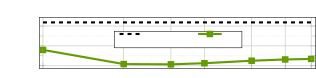
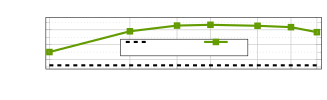
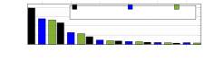

# Robust Speech Recognition with Schrödinger Bridge-Based Speech Enhancement

Rauf Nasretdinov, Roman Korostik, Ante Jukić Affiliation: NVIDIA  
{rnasretdinov, rkorostik, ajukic}@nvidia.com

###### Abstract

In this work, we investigate application of generative speech
enhancement to improve the robustness of ASR models in noisy and
reverberant conditions. We employ a recently-proposed speech enhancement
model based on Schrödinger bridge, which has been shown to perform well
compared to diffusion-based approaches. We analyze the impact of model
scaling and different sampling methods on the ASR performance.
Furthermore, we compare the considered model with predictive and
diffusion-based baselines and analyze the speech recognition performance
when using different pre-trained ASR models. The proposed approach
significantly reduces the word error rate, reducing it by approximately
40% relative to the unprocessed speech signals and by approximately 8%
relative to a similarly-sized predictive approach.

###### Index Terms: 

robust speech recognition, generative speech enhancement, speech
denoising, Schrödinger bridge

## I Introduction

Speech signals recorded in various environments often contain adverse
signal components, such as background noise or reverberation. The goal
of speech enhancement (SE) is to reduce the adverse signal components in
the recorded speech and improve signal quality \[1, 2\]. While SE is
instrumental in increasing intelligibility and reducing listening
fatigue, it can also be beneficial for downstream tasks, such as speaker
verification, speech recognition and speech synthesis \[3, 4, 5\].

In recent years, there has been a significant amount of research on the
use of SE models as a front-end for an ASR system \[6, 7, 8, 9, 10, 11,
12, 13, 14, 15\]. In such an approach, SE and ASR models can be trained
either jointly or separately. On the one hand, joint training of SE and
ASR has been shown to benefit both tasks \[7, 8, 12, 11\]. On the other
hand, separate training of SE and ASR can be advantageous \[10, 14,
15\]. In such a modular approach, each component may be improved
separately, e.g. SE can be retrained to improve noise robustness, and
ASR can be retrained to improve generalization or support multiple
languages.

Traditionally, neural network-based SE systems have employed predictive
approaches, learning an optimal mapping from the noisy input to optimal
masks or clean speech signals \[6, 16, 17, 18, 19\]. Recently, several
generative SE models have been proposed, aiming to improve
generalization and quality of the estimated speech \[20, 21, 22, 23, 24,
25, 26, 27, 28, 29, 30\]. A diffusion-based SGMSE+ model has been
proposed in \[22, 23\], achieving strong results in speech denoising and
dereverberation. A two-stage stochastic regeneration model (StoRM) has
been proposed in \[24\], combining a predictive model and a
diffusion-based generative model. A generative model based on
Schrödinger bridge (SB) has been proposed in \[30\]. As opposed to
data-to-noise diffusion process, the SB describes a data-to-data
process \[31\]. It has been shown in \[30\] that the SB-based model
outperforms its diffusion-based counterparts.

Diffusion-based generative SE models have been compared with predictive
SE models in several speech restoration tasks \[32\]. It has been
observed that the SGMSE+ model outperforms the predictive model with the
same architecture in all tasks, with the most significant improvements
observed with non-additive distortion such as dereverberation and
bandwidth extension. However, the study used relatively small datasets
and did not include an evaluation of ASR performance.

In this work, we analyze the benefits of generative speech enhancement
on the performance of different ASR models in noisy and far-field
conditions. The contributions of this work are threefold. First, we use
a generative speech enhancement model based on Schrödinger bridge as a
front-end to ASR. We train the model on a noisy far-field dataset and
optimize the parameters of the inference process for ASR performance.
Secondly, we study the influence of different model scaling
configurations on the ASR performance and compare it against a
similarly-sized predictive baseline. Thirdly, we provide detailed speech
recognition results using different ASR models. Our best SB model
demonstrates strong performance, with 40.41% relative (10.47% absolute)
improvement in word error rate (WER) compared to the input noisy speech
and a 7.93% relative (1.3% absolute) improvement over the predictive
baseline.

## II Problem definition

Consider a single speech source captured with a single distant
microphone. The time-domain signal at the microphone
$`\underline{\mathbf{y}}\in\mathbb{R}^{N}`$ can be modeled as
$`\underline{\mathbf{y}}=\underline{\mathbf{h}}\ast\underline{\mathbf{s}}+\underline{\mathbf{n}}`$,
where $`\underline{\mathbf{h}}`$ is the room impulse response modeling
the signal propagation in a reverberant environment,
$`\underline{\mathbf{s}}`$ is the source speech signal,
$`\underline{\mathbf{n}}`$ is the additive noise signal, and $`\ast`$
denotes convolution. The goal of SE is to estimate the direct speech
signal $`\underline{\mathbf{x}}`$ at the microphone from the captured
microphone signal $`\underline{\mathbf{y}}`$. The models presented here
operate on a short-time Fourier transform (STFT)-based time-frequency
(TF) representation of the input signal with additional compression and
scaling, similarly as in \[23, 24\]. More specifically, a TF
representation
$`\mathbf{x}=\mathcal{A}\left(\underline{\mathbf{x}}\right)\in\mathbb{C}^{D}`$
of the time-domain signal $`\underline{\mathbf{x}}`$ is obtained using
the analysis transform
$`\mathcal{A}\left(\underline{\mathbf{x}}\right)=b|\mathcal{F}\left(\underline{\mathbf{x}}\right)|^{a}\mathrm{e}^{j\angle{\mathcal{F}\left(\underline{\mathbf{x}}\right)}}`$,
where $`\mathcal{F}`$ is the STFT operator, $`|.|`$ is the magnitude
operator, $`\angle\left(.\right)`$ is the angle operator,
$`a\in\left(0,1\right]`$ is a compression coefficient, $`b>0`$ is a
scale coefficient, and all operations are applied element-wise.

## III Schrödinger bridge for speech enhancement

Score-based diffusion models \[33, 34, 22, 23\] use a continuous-time
diffusion process defined by a forward stochastic differential equation
(SDE)

```math
{\,\mskip 0.0mu{}{\mathrm{d}\mathbf{x}_{t}}\mskip 0.0mu}=\mathbf{f}\left(\mathbf{x}_{t},t\right){\,\mskip 0.0mu{}{\mathrm{d}t}\mskip 0.0mu}+g(t){\,\mskip 0.0mu{}{\mathrm{d}\mathbf{w}_{t}}\mskip 0.0mu},\quad\mathbf{x}_{0}=\mathbf{x}, \tag{1}
```

where $`t\in\left[0,T\right]`$ is the current process time,
$`\mathbf{x}_{t}\in\mathbb{C}^{D}`$ is the process state, $`\mathbf{f}`$
is the drift, $`g`$ is the diffusion coefficient, and $`\mathbf{w}_{t}`$
is the standard Wiener process. Schrödinger bridge \[35, 36, 37, 38,
31\] with respect to a reference path measure $`p_{\text{ref}}`$ can be
defined as

```math
\min_{p\in\mathcal{P}_{\left[0,T\right]}}D_{\text{KL}}\left(p,p_{\mathrm{ref}}\right)\quad\text{s. t.}\quad p_{0}=p_{x},\thickspace p_{T}=p_{y}, \tag{2}
```

where $`\mathcal{P}_{\left[0,T\right]}`$ is the space of path measures
on $`\left[0,T\right]`$, $`D_{\text{KL}}`$ is the Kullback-Leibler
divergence, and $`p_{x}`$ and $`p_{y}`$ are the boundary conditions. As
shown in \[37, 31\], the SB is equivalent to a pair of forward and
backward SDEs with additional drift terms. Solving the SB is in general
intractable, but closed-form solutions can be derived in special cases,
such as with Gaussian boundary conditions \[38, 31\]. A tractable form
of SB can be derived for paired data assuming Gaussian boundary
conditions
$`p_{0}=\mathcal{N}_{\mathbb{C}}\left(\mathbf{x},\epsilon_{0}^{2}\mathbf{I}\right)`$
and
$`p_{T}=\mathcal{N}_{\mathbb{C}}\left(\mathbf{y},\epsilon_{T}^{2}\mathbf{I}\right)`$
with
$`\epsilon_{T}=\mathrm{e}^{\int_{0}^{T}f(\tau){\,\mskip 0.0mu{}{\mathrm{d}\tau}\mskip 0.0mu}}\epsilon_{0}`$,
$`\epsilon_{0}\to 0`$, and a linear drift
$`\mathbf{f}\left(\mathbf{x}_{t},t\right)=f(t)\mathbf{x}_{t}`$ \[31\].
The drift scale $`f(t)`$ and diffusion $`g(t)`$ define the noise
schedule for the process, and different schedules are used in the
literature \[31, 30\]. Here we employ the commonly-used
variance-exploding noise schedule defined as $`f(t)=0`$ and
$`g(t)=\sqrt{c}k^{t}`$, parametrized with $`k,c>0`$ as in \[28\].

### III-A Training

The backbone neural model $`d_{\theta}`$ is trained using the data
prediction loss \[31\], aiming to predict the target $`\mathbf{x}`$ from
the provided inputs. As in \[30\], we use an auxiliary $`\ell_{1}`$-norm
time-domain loss to improve the estimate of the model, resulting in the
following training objective

```math
\displaystyle{\min_{\theta}\;\mathcal{E}_{\left(\mathbf{x},\mathbf{y}\right),t,\mathbf{z}}\frac{1}{D}\lVert\hat{\mathbf{x}}_{\theta}(t)-\mathbf{x}\rVert_{2}^{2}+\lambda\|\mathcal{A}^{-1}\left(\hat{\mathbf{x}}_{\theta}(t)\right)-\underline{\mathbf{x}}\|_{1}} \tag{3}
```

where $`\mathcal{E}`$ denotes the mathematical expectation,
$`\hat{\mathbf{x}}_{\theta}(t)=d_{\theta}(\mathbf{x}_{t},\mathbf{y},t)`$
denotes the output of the backbone neural network, $`\mathbf{x}_{t}`$ is
a sample from the marginal distribution $`p_{t}`$,
$`\mathcal{A}^{-1}\left(\hat{\mathbf{x}}_{\theta}(t)\right)`$ is the
estimated time-domain signal,
$`\mathbf{z}\sim\mathcal{N}\left(\mathbf{0},\mathbf{I}\right)`$ and
$`\lambda>0`$ is a tradeoff parameter.

### III-B Inference

Given an initial value $`\mathbf{x}_{\tau}`$ at time $`\tau>0`$, the
bridge SDE solution at time $`t<\tau`$ can be obtained as \[31\]

```math
\displaystyle{\mathbf{x}_{t}=\frac{\alpha_{t}\sigma_{t}^{2}}{\alpha_{\tau}\sigma_{\tau}^{2}}\mathbf{x}_{\tau}+\alpha_{t}\left(1-\frac{\sigma_{t}^{2}}{\sigma_{\tau}^{2}}\right)\hat{\mathbf{x}}_{\theta}(\tau)+\alpha_{t}\sigma_{t}\sqrt{1-\frac{\sigma_{t}^{2}}{\sigma_{\tau}^{2}}}\mathbf{z},} \tag{4}
```

where $`\mathbf{z}\sim\mathcal{N}\left(\mathbf{0},\mathbf{I}\right)`$
and $`\alpha_{t}`$ and $`\sigma_{t}`$ are computed using $`f(t)`$ and
$`g(t)`$ \[31, 30\]. Similarly, using probability flow ordinary
differential equation (ODE) formulation, the bridge ODE solution can be
obtained as \[31\]

```math
\displaystyle{\mathbf{x}_{t}=\frac{\alpha_{t}\sigma_{t}\bar{\sigma}_{t}}{\alpha_{\tau}\sigma_{\tau}\bar{\sigma}_{\tau}}\mathbf{x}_{\tau}+\frac{\alpha_{t}}{\sigma_{T}^{2}}\left(\bar{\sigma}_{t}^{2}-\frac{\bar{\sigma}_{\tau}\sigma_{t}\bar{\sigma}_{t}}{\sigma_{\tau}}\right)\hat{\mathbf{x}}_{\theta}(\tau)+\frac{\alpha_{t}}{\alpha_{T}\sigma_{T}^{2}}\left(\sigma_{t}^{2}-\frac{\sigma_{\tau}\sigma_{t}\bar{\sigma}_{t}}{\bar{\sigma}_{\tau}}\right)\mathbf{y},} \tag{5}
```

where $`\bar{\sigma}_{t}`$ is computed using $`f(t)`$ and $`g(t)`$ \[31,
30\]. Both the SDE sampler in (4) and the ODE sampler in (5) start from
$`\mathbf{x}_{T}=\mathbf{y}`$ and iterate through a number of steps,
resulting in an estimate $`\hat{\mathbf{x}}=\mathbf{x}_{0}`$. The
time-domain output signal is obtained by inverting the analysis
transform as
$`\underline{\hat{\mathbf{x}}}=\mathcal{A}^{-1}\left(\hat{\mathbf{x}}\right)`$.

### III-C Neural model

As a backbone neural network for the SB model, we use the
noise-conditional score network (NCSN++) as in \[34, 23, 24, 32\]. The
model incorporates U-Net structure with four downsampling and upsampling
layers following the architecture described in \[24\]. However, we did
not use any attention layers. In each resolution layer, a downsampled
spectrogram transformed by a two-dimensional convolutional layer is
provided as a residual connection. These resolution layers consisted of
BigGAN residual blocks \[39\], where channels are upconverted and
downconverted within each block using two-dimensional convolutional
layers. In our study, we experimented with different number of channels
at every resolution layer and different number of residual blocks within
all hidden blocks.

| Configuration | Parameters/M | Channels            | Residual blocks | Sampler | ASR Metrics          |                      |                      |                      | SE Metrics        |                        |
| ------------- | ------------ | ------------------- | --------------- | ------- | -------------------- | -------------------- | -------------------- | -------------------- | ----------------- | ---------------------- |
|               |              |                     |                 |         | WER/% $`\downarrow`$ | INS/% $`\downarrow`$ | DEL/% $`\downarrow`$ | SUB/% $`\downarrow`$ | PESQ $`\uparrow`$ | SI-SDR/dB $`\uparrow`$ |
| 1             | 25           | \[128,128,128,256\] | 3               | SDE     | 22.90                | 1.16                 | 8.63                 | 13.11                | 1.85              | 3.35                   |
| 2             | 25           | \[128,128,128,256\] | 3               | ODE     | 23.07                | 0.41                 | 12.74                | 9.92                 | 1.44              | 4.25                   |
| 3             | 50           | \[128,128,128,256\] | 6               | SDE     | 19.25                | 1.42                 | 3.52                 | 14.31                | 1.79              | 4.07                   |
| 4             | 50           | \[128,128,128,256\] | 6               | ODE     | 16.73                | 0.47                 | 7.63                 | 8.63                 | 1.53              | 5.60                   |
| 5             | 50           | \[256,256,256,512\] | 3               | SDE     | 20.78                | 0.98                 | 7.64                 | 12.16                | 1.90              | 5.11                   |
| 6             | 50           | \[256,256,256,512\] | 3               | ODE     | 18.57                | 0.38                 | 10.18                | 8.00                 | 1.52              | 5.23                   |
| 7             | 100          | \[128,128,128,256\] | 9               | SDE     | 20.36                | 1.13                 | 7.49                 | 11.73                | 1.89              | 5.24                   |
| 8             | 100          | \[128,128,128,256\] | 9               | ODE     | 18.28                | 0.39                 | 9.85                 | 8.05                 | 1.52              | 5.49                   |
| 9             | 100          | \[256,256,256,512\] | 6               | SDE     | 20.66                | 1.08                 | 6.77                 | 12.80                | 1.78              | 4.82                   |
| 10            | 100          | \[256,256,256,512\] | 6               | ODE     | 16.39                | 0.40                 | 8.03                 | 7.96                 | 1.53              | 6.73                   |

TABLE I: Performance of different backbone architecture configurations
in terms of ASR and SE metrics.

|             |                      |                      |                      |                      |
| ----------- | -------------------- | -------------------- | -------------------- | -------------------- |
| Signal      | WER/% $`\downarrow`$ | INS/% $`\downarrow`$ | DEL/% $`\downarrow`$ | SUB/% $`\downarrow`$ |
| Clean       | 2.07                 | 0.15                 | 0.29                 | 1.61                 |
| Unprocessed | 25.91                | 0.27                 | 20.40                | 5.23                 |
| Predictive  | 16.77                | 0.71                 | 7.93                 | 8.13                 |
| StoRM       | 20.36                | 0.75                 | 10.16                | 9.45                 |
| SB          | 15.44                | 0.67                 | 5.08                 | 9.69                 |

TABLE II: Comparison of the selected SB model with baseline models.

## IV Experiments

### IV-A Datasets

The generated training set consisted of approximately 200 hours of audio
and the validation and test sets consisted of approximately 10 hours of
audio, at a sample rate of 16 kHz. We simulated 10k rooms for the
training set, and 200 rooms each for the development and test sets with
varying sizes, reverberation times in $`[0.1,0.5]`$ s and microphone
placement as in \[40\]. Clean subsets from LibriSpeech \[41\] were used
as the clean speech signals. CHiME-3 \[42\] and DNS Challenge
datasets \[43\] were used as the noise signals. The reverberant
signal-to-noise ratio (RSNR) for noisy signals was uniformly sampled
from $`[-5,20]`$ dB. In all experiments, the noisy input
$`\underline{\mathbf{y}}`$ is the signal from the microphone closest to
the speech source, and the target speech signal
$`\underline{\mathbf{x}}`$ is the direct speech component at the same
microphone.

### IV-B Experimental setup

We employed STFT with window size of 510 samples ($`\approx`$32ms) and
hop size of 128 samples (8ms) with a Hann window and $`a=0.5`$ and
$`b=0.33`$ as in \[22, 24\]. We experimented with alternative
compression parameters, but did not observe any improvements. The loss
in (3) used $`\lambda=10^{-3}`$, as in \[30\]. Training without the
time-domain loss resulted in a small performance degradation. The
variance exploding noise schedule was parameterized with $`k=2.6`$ and
$`c=0.40`$, as in \[28, 30\]. Training used randomly-selected audio
segments of 256 STFT frames with input and target signals normalized to
the maximum amplitude of the input signal. The global batch size was set
to $`\left\{64,32,16\right\}`$ for models with
$`\left\{25,50,100\right\}`$ million parameters respectively, and Adam
optimizer was used with a learning rate of $`10^{-4}`$ \[24\].

As in \[32\], a predictive model is used as a baseline, using the same
backbone neural network as the corresponding SB model. In this model,
the neural network was trained to directly estimate the clean speech
coefficients $`\hat{\mathbf{x}}`$ from the noisy input $`\mathbf{y}`$,
similarly as in \[24\]. The conditioning layers are removed in the
predictive model as in \[24\], without a large influence on the number
of parameters (5% decrease). As an additional baseline, we used the
stochastic regeneration model denoted StoRM \[24\] with the same
backbone neural network. All models were trained on eight NVIDIA V100
GPUs for a maximum of 200 epochs. An exponential moving average (EMA) of
the weights with 0.999 decay was used \[24\], and the best EMA
checkpoint was selected based on the Perceptual Evaluation of Speech
Quality (PESQ) metric value of 50 validation examples, similarly as
in \[23, 24, 30\]. Inference utilized a uniform time grid with 50 time
steps, unless otherwise specified. Predictive model was trained with
mean squared-error loss function in time-domain. StoRM consisted of
SGMSE+ model trained using score matching and predictive NSCN++ module.
Checkpoint was chosen the same way as for the SB model. All models were
implemented using NVIDIA’s NeMo toolkit \[44\].

ASR performance is evaluated using three different ASR models: (i) Fast
Conformer Transducer Large model with 120M parameters \[45\], trained on
25k hours of English speech \[46\] (ii) Parakeet RNNT \[47\] and (iii)
Parakeet CTC \[48\] with 1.1B parameters trained on 64k hours of English
speech \[49\]. Unless stated otherwise, the ASR results are obtained
using Fast Conformer Transducer Large.

As speech enhancement metrics we measured perceptual evaluation of
speech quality (PESQ) \[50\] and scale-invariant signal-to-distortion
ratio (SI-SDR) \[51\].

|             | Fast Conformer Transducer Large |       |       |       | Parakeet RNNT 1.1B |       |       |       | Parakeet CTC 1.1B |       |       |       |
| ----------- | ------------------------------- | ----- | ----- | ----- | ------------------ | ----- | ----- | ----- | ----------------- | ----- | ----- | ----- |
| Signal      | WER/%                           | INS/% | DEL/% | SUB/% | WER/%              | INS/% | DEL/% | SUB/% | WER/%             | INS/% | DEL/% | SUB/% |
| Unprocessed | 25.91                           | 0.27  | 20.40 | 5.23  | 20.14              | 0.30  | 15.88 | 3.96  | 20.54             | 0.53  | 12.39 | 7.63  |
| SB          | 15.44                           | 0.67  | 5.08  | 9.69  | 13.01              | 0.57  | 4.71  | 7.73  | 15.15             | 0.64  | 4.41  | 10.09 |

TABLE III: WER results obtained with different ASR models.





Fig. 1: WER and SI-SDR for the SB model with ODE sampler (configuration
4 in Table I) and different number of sampling steps.



Fig. 2: ASR performance in terms of WER vs. RSNR for the best SB model
from Table I using ten sampling steps.

### IV-C Results

#### IV-C1 Architecture search

In this ablation study, we investigated the impact of the model
architecture in terms of number of parameters, residual blocks and
channels within the NSCN++ model architecture. The results obtained with
various model configurations are shown in Table I. For simplicity, here
we consider only the results with the SDE sampler with 50 sampling
steps. The first row shows the results obtained by a 25M baseline model
with three residual blocks and channels \[$`{N}_{1}`$, $`{N}_{2}`$,
$`{N}_{3}`$, $`{N}_{4}`$\] are set to \[128, 128, 128, 256\]. At first,
we increased the model’s size to 50M by either increasing the number of
residual blocks (cf. config 3 in Table I) or adjusting the channels (cf.
config 5 in Table I). Interestingly, increasing the number of blocks
showed notably superior results. Increasing the number of blocks to nine
(cf. config 7 in Table I) or a combination of adjusting both channels
and number of blocks (cf. config 9 in Table I) resulted in a degradation
in the ASR performance. Notably, in terms of SE metrics, the model with
six residual blocks did not show the best performance in either PESQ or
SI-SDR. This shows that ASR performance does not necessarily correlate
with SE metrics. Therefore, we used the 50M model with six residual
blocks in all subsequent experiments, since it provided the best ASR
performance.

#### IV-C2 Sampler

In this ablation study, we investigated the influence of the sampler for
the reverse process on the ASR performance, and results with either the
SDE sampler in (4) or the ODE sampler in (5) with 50 sampling steps are
shown in Table I. The results demonstrate a superior efficacy of the ODE
sampler across almost all model configurations, with the exception of
the 25M model. The improved performance of the ODE sampler is due to its
robustness against the hallucination problem. Generative models can
produce speech-like sounds during very noisy periods, especially at low
RSNR levels, leading to high rates of insertions and substitutions. As
shown in Table I, the ODE sampler significantly reduces insertions and
substitutions compared to SDE sampler, while simultaneously reducing the
WER, indicating its enhanced stability and robustness. Therefore, we
used the ODE sampler for the subsequent experiments.

#### IV-C3 Number of sampling steps

In this ablation study, we investigated the influence of the number of
sampling steps on the ASR performance, and results in terms of WER
obtained are shown in Figure 1. The results indicate that the ASR
performance can be improved by selecting an appropriate number of steps.
In general, WER improves significantly when the number of steps is
increased from five to ten. However, WER begins to slightly deteriorate
when the number of steps exceeds 15. Interestingly, SE performance shows
similar pattern: the highest SI-SDR value is obtained at 15-20 reverse
steps, but it starts to slightly degrade as this parameter increases
further. Since the difference in ASR performance between ten and fifteen
steps is not substantial, ten steps is the optimal value as it is
approximately 1.5 times faster. Therefore, we used ten reverse steps in
all subsequent experiments.

#### IV-C4 Comparison with baseline models

In this study, we compared the selected SB model with baseline models.
Comparison of our SB-based model, StoRM and a predictive model in terms
of ASR performance is provided in Table II. All models shared the same
NCSN++ architecture, as configured in the third row in Table I. The
table shows that the selected SB model resulted in 1.3% (7.93% relative)
improvement in terms of WER compared to the predictive model. Overall,
the selected SB model resulted in 10.47% (40.41% relative) improvement
in terms of WER compared to the unprocessed speech. When compared to
StoRM model, the proposed SB model showed 4.92% (24.16 % relative) WER
improvement. We tried to train StoRM with implementation provided by the
authors of the model but this led to slightly worse results than using
our implementation.

#### IV-C5 Evaluation across noise levels

In this study, we investigated the performance of the selected models
across different noise levels and results in terms of ASR performance
are shown in Figure 2. The use of the SB model improves WER across all
noise levels. The biggest improvements compared to unprocessed speech in
relative WER reduction, around 50%, are observed at 0dB and 5dB RSNR. In
these conditions noise is high enough to degrade ASR performance
significantly but still low enough for the SE model to effectively
reconstruct speech and improve ASR performance. The relative WER
improvement at higher RSNRs, 10dB and 15dB, is approximately 27%, which
is slightly lower but still significant. Even at 20dB RSNR, where the
input speech is nearly clean, there is still a 2.5% relative WER
improvement. Besides, Figure 2 illustrates that the predictive model
shows ASR degradation in low-noise scenarios compared to unprocessed
speech. This may be due to artifacts introduced into the processed
signal that are typical of predictive models. The SB model does not have
such a disadvantage, showing improved performance even at low-noise
levels.

#### IV-C6 Evaluation using different ASR models

In this study, we investigated the use of the SB model as a front-end to
different ASR models and results for Fast Conformer Transducer Large,
Parakeet RNNT 1.1B and Parakeet CTC 1.1B, are shown in Table III. Using
the SB model for Fast Conformer Transducer Large noticeably reduced the
percentage of deletions by a factor of four, resulting in 40% relative
WER improvement. Similarly, for Parakeet RNNT, utilizing the SB model as
a preprocessing step significantly improved relative WER by 35%,
achieving the best WER on our test set of approximately 13%.
Interestingly, although Parakeet RNNT with the SB front-end outperformed
Fast Conformer Transducer Large with the SB front-end, the latter
performed better than standalone Parakeet RNNT. Furthermore, Parakeet
CTC performed worse than RNNT. Initially, both models had the same WER
for unprocessed signals, but RNNT had more deletions (15.88%) and fewer
substitutions (3.96%) compared to CTC (12.39% and 7.63%). After SB
enhancement, deletions dropped to around 4% for both models, but CTC had
more substitutions (10.09% vs. 7.73% for RNNT). In summary, the SB
front-end resulted in significant improvements for all considered ASR
models.

## V Conclusion

In this paper we analyzed speech recognition improvement by integrating
generative speech enhancement model based on Schrödinger bridge as a
pre-processing step to ASR. The optimal model configuration was selected
based on the provided ablation studies. Trained on a speech dataset with
noise and reverberation, the best SB model significantly reduced the
WER, achieving a 40% relative improvement compared to unprocessed speech
and an 8% relative improvement compared to a predictive model of the
same size. Additionally, we demonstrated that the SB model enhances ASR
performance across a variety of speech recognition models of different
sizes and configurations.

## References

- \[1\] R. C. Hendriks, T. Gerkmann, and J. Jensen, DFT-domain based
  single-microphone noise reduction for speech enhancement,
  Springer, 2013.
- \[2\] Takuya Yoshioka et al., “Making machines understand us in
  reverberant rooms: Robustness against reverberation for automatic
  speech recognition,” IEEE Signal Process. Magazine, vol. 29, no. 6,
  pp. 114–126, 2012.
- \[3\] E. Vincent, T. Virtanen, and S. Gannot, Audio source separation
  and speech enhancement, John Wiley & Sons, 2018.
- \[4\] Y. Wu et al., “A fused speech enhancement framework for robust
  speaker verification,” IEEE Signal Processing Letters, vol. 30, pp.
  883–887, 2023.
- \[5\] Y. Koizumi et al., “LibriTTS-R: A Restored Multi-Speaker
  Text-to-Speech Corpus,” in Proc. Interspeech, 2023, pp. 5496–5500.
- \[6\] A. Narayanan and D. Wang, “Investigation of speech separation as
  a front-end for noise robust speech recognition,” IEEE/ACM
  Transactions on Audio, Speech, and Language Processing, vol. 22, no.
  4, pp. 826–835, 2014.
- \[7\] F. Weninger et al., “Speech enhancement with LSTM recurrent
  neural networks and its application to noise-robust ASR,” in Proc.
  LVA/ICA, 2015, pp. 91–99.
- \[8\] H. Erdogan et al., “Phase-sensitive and recognition-boosted
  speech separation using deep recurrent neural networks,” in Proc. IEEE
  ICASSP, 2015, pp. 708–712.
- \[9\] A. Subramanian et al., “Speech enhancement using end-to-end
  speech recognition objectives,” 2019, pp. 234–238.
- \[10\] K. Kinoshita et al., “Improving noise robust automatic speech
  recognition with single-channel time-domain enhancement network,” in
  Proc. IEEE ICASSP, 2020, pp. 7009–7013.
- \[11\] A. Pandey et al., “Dual application of speech enhancement for
  automatic speech recognition,” 2020.
- \[12\] D. Ma et al., “Multitask-based joint learning approach to
  robust ASR for radio communication speech,” in Proc. Asia-Pacific
  Signal and Information Processing Association Annual Summit and
  Conference (APSIPA ASC), 2021, pp. 497–502.
- \[13\] Y. Koizumi et al., “SNRi target training for joint speech
  enhancement and recognition,” in Proc. Interspeech, 2022, pp.
  1173–1177.
- \[14\] H. Sato, “Learning to enhance or not: Neural network-based
  switching of enhanced and observed signals for overlapping speech
  recognition,” in Proc. IEEE ICASSP, 2022, pp. 6287–6291.
- \[15\] Y. Yang et al., “Time-domain speech enhancement for robust
  automatic speech recognition,” in Proc. Interspeech, 2023.
- \[16\] D. S. Williamson, Y. Wang, and D. Wang, “Complex ratio masking
  for monaural speech separation,” IEEE/ACM Trans. on Audio, Speech, and
  Language Process., vol. 24, no. 3, pp. 483–492, 2015.
- \[17\] Y. Xu et al., “A regression approach to speech enhancement
  based on deep neural networks,” IEEE/ACM Trans. on Audio, Speech, and
  Language Process., vol. 23, no. 1, pp. 7–19, 2014.
- \[18\] K. Han et al., “Learning spectral mapping for speech
  dereverberation and denoising,” IEEE/ACM Trans. on Audio, Speech, and
  Language Process., vol. 23, no. 6, pp. 982–992, 2015.
- \[19\] Y. Luo and N. Mesgarani, “Tasnet: time-domain audio separation
  network for real-time, single-channel speech separation,” in Proc.
  IEEE ICASSP, 2018, pp. 696–700.
- \[20\] Y.-J. Lu, Y. Tsao, and S. Watanabe, “A study on speech
  enhancement based on diffusion probabilistic model,” in Proc.
  Asia-Pacific Signal and Inform. Process. Assoc. Annual Summit and
  Conf. (APSIPA ASC), 2021, pp. 659–666.
- \[21\] Y.-J. Lu et al., “Conditional diffusion probabilistic model for
  speech enhancement,” in Proc. IEEE ICASSP, 2022, pp. 7402–7406.
- \[22\] S. Welker, J. Richter, and Timo Gerkmann, “Speech enhancement
  with score-based generative models in the complex STFT domain,” in
  Proc. Interspeech, 2022, pp. 2928–2932.
- \[23\] J. Richter et al., “Speech Enhancement and Dereverberation with
  Diffusion-Based Generative Models,” IEEE/ACM Trans. on Audio, Speech,
  and Language Process., vol. 31, pp. 2351–2364, 2023.
- \[24\] J.-M. Le Mercier et al., “StoRM: A Diffusion-based Stochastic
  Regeneration Model for Speech Enhancement and Dereverberation,”
  IEEE/ACM Trans. on Audio, Speech, and Language Process., vol. 31, pp.
  2724–2737, 2023.
- \[25\] R. Scheibler et al., “Diffusion-based generative speech source
  separation,” in Proc. IEEE ICASSP, 2023.
- \[26\] N. Kamo, M. Delcroix, and T. Nakatani, “Target speech
  extraction with conditional diffusion model,” in Proc. Interspeech,
  2023, pp. 176–180.
- \[27\] R. Kimura et al., “Diffusion Model-Based MIMO Speech Denoising
  and Dereverberation,” in Proc. Hands-free Speech Communication and
  Microphone Arrays (HSCMA), 2024.
- \[28\] B. Lay et al., “Reducing the Prior Mismatch of Stochastic
  Differential Equations for Diffusion-based Speech Enhancement,” in
  Proc. Interspeech, Aug. 2023, pp. 3809–3813.
- \[29\] B. Lay et al., “Single and few-step diffusion for generative
  speech enhancement,” in Proc. IEEE ICASSP, 2024, pp. 626–630.
- \[30\] A. Jukić et al., “Schrödinger bridge for generative speech
  enhancement,” in Proc. Interspeech, 2024, pp. 1175–1179.
- \[31\] Z. Chen et al., “Schrodinger Bridges Beat Diffusion Models on
  Text-to-Speech Synthesis,” arXiv preprint arXiv:2312.03491, Dec. 2023.
- \[32\] J.-M. Le Mercier et al., “Analysing Diffusion-based Generative
  Approaches Versus Discriminative Approaches for Speech Restoration,”
  in Proc. IEEE ICASSP, June 2023.
- \[33\] Y. Song and S. Ermon, “Generative modeling by estimating
  gradients of the data distribution,” in Proc. NeurIPS, 2019.
- \[34\] Y. Song et al., “Score-based generative modeling through
  stochastic differential equations,” in Proc. Int. Conf. Learning
  Representations (ICLR), May 2021.
- \[35\] E. Schrödinger, “Sur la théorie relativiste de l’électron et
  l’interprétation de la mécanique quantique,” in Annales de l’institut
  Henri Poincaré, 1932, vol. 2, pp. 269–310.
- \[36\] V. De Bortoli et al., “Diffusion Schrödinger bridge with
  applications to score-based generative modeling,” in Proc.
  NeurIPS, 2021.
- \[37\] T. Chen, G.-H. Liu, and E. A. Theodorou, “Likelihood training
  of Schrödinger bridge using forward-backward SDEs theory,” in Proc.
  ICLR, 2022.
- \[38\] C. Bunne et al., “The Schrödinger bridge between Gaussians
  measures has a closed form,” in Proc. Int. Conf. on Artificial Intell.
  and Stat. (AISTATS), 2023.
- \[39\] A. Brock, J. Donahue, and K. Simonyan, “Large scale GAN
  training for high fidelity natural image synthesis,” in International
  Conference on Learning Representations, 2019.
- \[40\] A. Jukić et al., “Flexible multichannel speech enhancement for
  noise-robust frontend,” in Proc. WASPAA, 2023.
- \[41\] V. Panayotov et al., “Librispeech: an ASR corpus based on
  public domain audio books,” in Proc. IEEE ICASSP, 2015, pp. 5206–5210.
- \[42\] J. Barker et al., “The third ‘CHiME’ speech separation and
  recognition challenge: Analysis and outcomes,” Computer Speech &
  Language, vol. 46, pp. 605–626, 2017.
- \[43\] H. Dubey et al., “ICASSP 2022 deep noise suppression
  challenge,” in Proc. IEEE ICASSP, 2022, pp. 9271–9275.
- \[44\] NVIDIA, “NeMo: a toolkit for conversational AI,”
  https://github.com/NVIDIA/NeMo, \[Online; accessed Jan-2025\].
- \[45\] D. Rekesh et al., “Fast conformer with linearly scalable
  attention for efficient speech recognition,” in Proc. IEEE ASRU,
  December 2023, pp. 1–8.
- \[46\] NVIDIA, “STT En Fast Conformer-Transducer Large,”
  https://huggingface.co/nvidia/stt_en_fastconformer_transducer_large,
  2023, \[Online; accessed Jan-2025\].
- \[47\] NVIDIA, “Parakeet RNNT 1.1B,”
  https://huggingface.co/nvidia/parakeet-rnnt-1.1b, 2024, \[Online;
  accessed Jan-2025\].
- \[48\] NVIDIA, “Parakeet CTC 1.1B,”
  https://huggingface.co/nvidia/parakeet-ctc-1.1b, 2024, \[Online;
  accessed Jan-2025\].
- \[49\] NVIDIA, “Pushing the Boundaries of Speech Recognition with
  NVIDIA NeMo Parakeet ASR Models,”
  https://developer.nvidia.com/blog/pushing-the-boundaries-of-speech-recognition-with-nemo-parakeet-asr-models,
  2024, \[Online; accessed Jan-2025\].
- \[50\] A. Rix et al., “Perceptual evaluation of speech quality
  (PESQ) - a new method for speech quality assessment of telephone
  networks and codecs,” in Proc. IEEE ICASSP, 2001.
- \[51\] Jonathan Le Roux et al., “SDR - half-baked or well done?,” in
  Proc. IEEE ICASSP, 2019.
