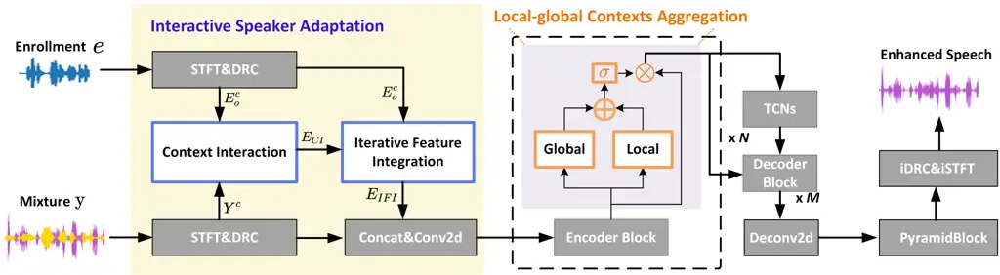
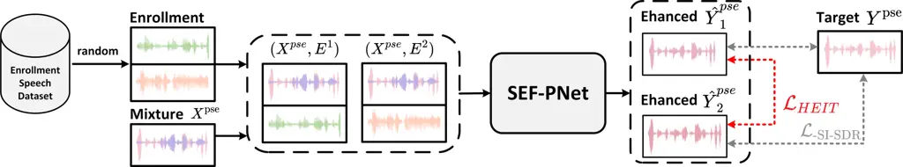

# Unified Architecture and Unsupervised Speech Disentanglement for Speaker Embedding-Free Enrollment in Personalized Speech Enhancement

Ziling Huang    Haixin Guan    Yanhua Long ^(†)^(†)thanks: Yanhua Long
is the Corresponding author. Ziling Huang, Yanhua Long are with Shanghai
Engineering Research Center of Intelligent Education and Bigdata,
Shanghai Normal University, Shanghai, 200234, China. Yanhua Long is also
with the SHNU-Unisound Natural Human-Computer Interaction Lab, Shanghai
Normal University. (e-mail: hzlkycg111@163.com; yanhua@shnu.edu.cn).
Haixin Guan are with the Unisound AI Technology Co., Ltd., Beijing,
China (e-mail: guanhaixin@unisound.com).

###### Abstract

Conventional speech enhancement (SE) aims to improve speech perception
and intelligibility by suppressing noise and reverberation without
requiring enrollment speech, whereas personalized speech enhancement
(PSE) addresses the cocktail party problem by extracting a target
speaker’s speech using enrollment speech as a reference. While these two
tasks tackle different yet complementary challenges in speech signal
processing, they often share similar model architectures, with PSE
incorporating an additional branch to process enrollment speech. This
suggests the possibility of developing a unified model capable of
efficiently handling both SE and PSE tasks, thereby simplifying
deployment while maintaining high performance. However, PSE performance
is highly sensitive to variations in enrollment speech, such as
differences in emotional tone, duration, and semantic content, which
limiting its robustness in real-world applications. To address these
challenges, we propose two novel models, USEF-PNet and DSEF-PNet, both
extending our previous SEF-PNet framework. USEF-PNet introduces a
unified architecture for processing enrollment speech, integrating SE
and PSE into a single framework to enhance performance and streamline
deployment. Meanwhile, DSEF-PNet incorporates an unsupervised speech
disentanglement approach by pairing a mixture speech with two different
enrollment utterances and enforcing consistency in the extracted target
speech. This strategy effectively isolates high-quality speaker identity
information from enrollment speech, reducing interference from factors
such as emotion and content, thereby improving PSE robustness.
Additionally, we explore a long-short enrollment pairing (LSEP) strategy
to examine the impact of enrollment speech duration during both training
and evaluation. Extensive experiments on the Libri2Mix and
VoiceBank-DEMAND datasets demonstrate that our proposed USEF-PNet,
DSEF-PNet all achieve substantial performance improvements, with random
enrollment duration performing slightly better. Our source code, model
checkpoints, and datasets will be publicly available at
https://github.com/isHuangZiling/UDSEF-PNet.

###### Index Terms: 

Personalized speech enhancement, Unified architecture, Unsupervised
speech disentanglement, Long-short enrollment pairing, Speaker
embedding-free network

## I Introduction

In real-world applications such as smart home devices and multi-speaker
conference systems, managing overlapping speech, environmental noise,
and room reverberation poses significant challenges. A well-known
problem in multi-speaker scenarios is the “cocktail party problem” \[1,
2\], wherein humans can effortlessly focus on a specific speaker and
shift attention, yet replicating this capability in machines remains a
significant challenge. Two effective approaches to address these
challenges are conventional speech enhancement (SE) and personalized
speech enhancement (PSE). SE focuses on removing noise and reverberation
to improve speech perception and intelligibility, with substantial
progress driven by deep learning techniques \[3, 4, 5, 6, 7, 8, 9\],
while PSE builds upon SE techniques by requiring enrollment speech to
extract and enhance the target speaker’s speech in multi-speaker noisy
environments \[10, 11\].

Many state-of-the-art models for PSE and SE share similar architectures.
For instance, successful SE models such as DPCCN \[12\], BSRNN \[13\],
Sepformer \[14\], and DeepFilterNet \[15\] have their corresponding PSE
adaptations (e.g., sDPCCN, pBSRNN, X-Sepformer, and pDeepFilterNet),
which integrate additional branches to handle enrollment speech.
However, simply because PSE requires an additional branch to process
enrollment speech while sharing the same overall model architecture,
training two separate sets of weights for PSE and SE and deploying two
distinct models leads to unnecessary memory and computational overhead,
which is inefficient for industrial applications. This highlights the
urgent need for a unified model capable of addressing both tasks
effectively within a single framework.

Although in recent PSE society, few speaker embedding/ encoder-free PSE
techniques have been proposed \[16, 17, 18\], they remain incapable of
addressing conventional SE tasks within their PSE frameworks due to the
specialized operations for speaker enrollment and the interaction of
mixture noisy speech representations. In 2024, W. Zhang et al. organized
the first URGENT (Universality, Robustness, and Generalizability for
EnhancemeNT) Challenge \[19\] in the NeurIPS 2024 Competition Track,
which aimed to develop universal speech enhancement models capable of
unifying speech processing across diverse conditions. This challenge
emphasized the development of methods that could adaptively handle input
speech with various distortions (corresponding to different SE subtasks)
and input formats (e.g., sampling frequencies) in a range of acoustic
environments, including those affected by noise and reverberation.
Motivated by the URGENT Challenge, some new works have been proposed
recently, such as AnyEnhance \[20\], which handles both speech and
singing voices and supports denoising, dereverberation, declipping,
super-resolution, and target speaker extraction within a unified
framework. Additionally, audio foundation models like UniAudio \[21\]
and Metis \[22\] have been developed to support several audio generation
tasks covering different SE distortions, PSE tasks, text-to-speech,
Lip2Speech, and more. Although these approaches can handle multiple
speech enhancement tasks within a single model, many still require
task-specific fine-tuning or are unable to manage multiple distortions
simultaneously, and they often rely on large models that are challenging
to deploy in low-resource industrial scenarios. Therefore, developing a
single unified and lightweight framework that efficiently handles both
SE and PSE tasks remains a fundamental and significant research
objective.

Another important issue in PSE is the model robustness to enrollment
speech variations, because the target speaker identity information in
the enrollment speech is very critical for guiding the model to perform
the high-quality target speech extraction. However, variations in
enrollment speech are very complex, such as differences in speaking
rate, emotional tone, semantic content or even background acoustic
environments, can significantly affect PSE performance. For example, if
the enrollment speech shares characteristics such as emotional tone,
speaking rate, or intonation with the interfering speech in the mixture,
the model may incorrectly extract the interfering speaker instead of the
target speaker. As noted by \[23\], speaker confusion can occur when
interfering speech closely resembles the target speaker, leading to
ambiguous embeddings that misguide the network. This issue is amplified
by extraneous factors in the enrollment speech, emphasizing the
challenge of disentangling the speaker identity from irrelevant content.
Addressing this is key to enhancing the robustness of target speech
extraction systems.

Many speaker identity disentanglement approches have been proposed in
the literature, for example, authors in \[24\] have attempted to
disentangle speaker identity from irrelevant attributes in the
enrollment speech, but it relies on complex architectures with multiple
encoder branches, reconstruction modules, and numerous loss functions
for staged training. Such complexity can hinder the practical deployment
of PSE systems, especially in real-time applications where computational
resources are limited. \[13, 14\] used conventional methods that rely on
pre-trained speaker verification models for embedding extraction.
Although the embeddings generated by these models achieve high accuracy
in speaker verification tasks, they may suffer from domain mismatches,
leading to suboptimal embeddings for PSE tasks. Similarly, the
Transformer-based embedder proposed in \[25\] enhances robustness by
estimating speaker centroids. This approach refines the extracted
embeddings by passing them through the Transformer-based embedder to
generate new embeddings, which are then optimized using a loss function
to align with the centroids of all enrollment speech. This process
effectively isolates the speaker identity from irrelevant acoustic
variations, such as noise or diverse acoustic conditions. However, the
method’s reliance on precise centroid estimation makes it sensitive to
the quality of enrollment speech. Performance may degrade when
enrollment speech is noisy, too short, or contains highly variable
acoustic characteristics, highlighting the need for more robust speech
disentanglement mechanisms.

To address these challenges, we propose two novel models: USEF-PNet
(Unified Architecture on SEF-PNet) and DSEF-PNet (Unsupervised Speech
Disentanglement on SEF-PNet). Both models build upon our previously
proposed speaker embedding/ encoder-free PSE system, SEF-PNet \[26\].
USEF-PNet unifies PSE and SE tasks into a single model, by introducing a
simple yet effective model training strategy. This enables the model to
simultaneously handle both tasks, achieving performance that is either
better or equal to that of task-specific models, while offering
practical advantages in memory and computational efficiency for
industrial deployment. DSEF-PNet improves the robustness of the PSE
model under varying enrollment speech conditions by using a novel
unsupervised enrollment speech disentanglement mechanism. This mechanism
separates speaker identity information from other irrelevant factors in
the enrollment speech, enabling the model to focus on the target
speaker’s characteristics and improving its overall robustness. Building
upon DSEF-PNet, we also explore the Long-Short Enrollment Pairing (LSEP)
strategy, which aims to leverage the advantages of long enrollment
speech to mitigate the limitations of short enrollment speech and is
expected to benefit short enrollment scenarios. Our three key
innovations of this study are summarized as follows:

1.  1.  Unified Architecture: The proposed USEF-PNet integrates PSE and SE
        tasks within a single framework through a straightforward yet
        efficient training strategy. In this approach, each training batch
        is especially organized to include both SE and PSE input conditions.
        Specifically, for the SE task, the enrollment speech is replaced
        with zeros input to render it ineffective, while for the PSE task,
        the valid enrollment speech is utilized as usual. This strategy
        enables the model to simultaneously handle both tasks, achieving
        performance comparable to or even surpassing that of task-specific
        models on the Libri2Mix and VoiceBank-Demand datasets, while also
        offering practical efficiency advantages for industrial
        applications.
2.  2.  Unsupervised Speech Disentanglement: The proposed DSEF-PNet enhances
        the robustness of PSE models to substantial variations in enrollment
        speech, such as changes in emotion, speaking rate, semantic content,
        and noise, through a novel unsupervised speech disentanglement
        approach. During DSEF-PNet training, two distinct enrollment speech
        samples are paired for each input mixture, and a consistency
        constraint is imposed to ensure that their outputs are the same.
        This mechanism implicitly disentangles speaker identity information
        from irrelevant content, thereby isolating the essential target
        speaker characteristics. The enrollment speech pairing operation,
        reinforced by these consistency constraints, enables the model to
        adapt effectively to a wide range of enrollment conditions,
        resulting in significant and consistent performance gains across
        multiple PSE scenarios in the Libri2Mix dataset.
3.  3.  Long-Short Enrollment Pairing (LSEP): In PSE tasks, performance
        often degrades significantly when the enrollment speech is extremely
        short. To investigate potential solutions to this issue, we explore
        a Long-Short Enrollment Pairing (LSEP) strategy within DSEF-PNet.
        LSEP pairs an extremely short enrollment sample with a long one as
        distinct enrollment clues for the same input noisy mixture during
        training, aiming to provide richer speaker guidance. However,
        experimental results show that this strategy does not lead to
        noticeable improvement. Random selection of enrollment duration
        yields better overall performance across different scenarios.

The remainder of this paper is organized as follows. Section II reviews
the related works, Section III revisits our previously proposed
SEF-PNet, The proposed methods are presented in Section IV, including
the USEF-PNet, DSEF-PNet, and the exploration of LSEP strategy. Section
V describes the experimental setups and Section VI presents the results
and discussions, followed by conclusions.

## II Review of Related Works

This study aims to build a well-established speech enhancement framework
that can effectively handling both PSE and conventional SE tasks in
real-world scenarios, related works including four main directions: the
speaker encoder/embedding-free PSE techniques, the enrollment speech
disentanglement methods, the universal speech enhancement architectures,
and the approaches for dealing with short-duration enrollment speech.

### II-A Speaker Encoder/Embedding-free PSE

The core distinction between PSE and SE tasks is the incorporation of
enrollment speech. In PSE, the target speaker’s identity, derived from
enrollment speech, acts as a critical cue to guide the extraction of the
target speaker’s voice from a multi-speaker noisy mixture, entailing two
inputs and one output. In contrast, conventional SE operates without
explicit target speaker guidance, its primary function is to perform
denoising and dereverberation, enhancing speech perception and
intelligibility, which involves one input and one output. Traditional
PSE approaches typically utilize target speaker embeddings, either
extracted from pre-trained speaker verification models \[27, 28\], or
generated via self-designed speaker encoders \[29, 30, 31, 32, 12\], as
identity clues to isolate high-quality target speech from noisy
mixtures. Although effective in many scenarios, these methods often
suffer from increased model complexity, large parameter sizes, and
slower inference speeds, which pose challenges for industrial
deployment.

To address these issues, recent research has explored speaker
encoder/embedding-free approaches, which bypass the dependency on
explicit embeddings. For instance, the authors in \[16\] utilize
weight-sharing encoders to jointly process enrollment and mixture
speech, enabling direct extraction of target speaker information and
eliminating the need for a speaker verification model. Similarly, the
authors in \[17\] focus on interaction mechanisms in the time-frequency
domain, directly modeling relationships between enrollment and mixture
speech, thereby avoiding both speaker verification models and
self-designed speaker encoders. Additionally, the authors in \[18\]
propose extracting speaker embeddings internally within the speech
enhancement model itself, further removing reliance on pre-trained
speaker verification models. While these methods demonstrate promising
potential, they still face challenges such as scalability and limited
utilization of enrollment speech information.

Building on these advancements, our prior work \[26\], introduced
SEF-PNet, a speaker encoder/ embedding free framework designed to
simplify the sDPCCN \[12\] while delivering competitive performance.
SEF-PNet achieves this through the proposed context interaction and
iterative feature integration methods, which provide effective, implicit
guidance for target speech extraction and enhancement in PSE,
eliminating the need for pre-trained speaker verification models or
self-designed speaker encoders. The competitive results obtained on the
Libri2Mix dataset across three PSE conditions, as demonstrated in
\[26\], underscore the framework’s effectiveness and its potential for
real-world applications. Therefore, we adopt SEF-PNet as the backbone
architecture in this study.

### II-B Enrollment Speech Disentanglement

The extraction of target speaker identity information from enrollment
speech is critical for guiding PSE models, yet its effective utilization
remains challenging due to issues such as speaker confusion and
embedding robustness. As highlighted in \[23\], global attributes
present in the enrollment speech, such as emotion, speaking rate, or
prosody, can mislead the extraction network, especially in scenarios
where interfering speakers possess similar vocal characteristics. This
challenge has led to significant research efforts aimed at enhancing the
robustness of PSE systems with respect to variations in enrollment
speech.

Most conventional PSE systems predominantly rely on embeddings derived
from pre-trained speaker verification (SV) models \[27, 28\]. Many
speech disentanglement methods have been proposed to augment the SV
model training and produce robust speaker embeddings. For instance,
\[33\] introduced a sequential disentangling contrastive learning
framework that combines a disentangling sequential variational
autoencoder with traditional contrastive learning to remove the
influence of language content. In \[34\], a noise-disentanglement metric
learning approach was proposed to suppress the speaker-irrelevant noisy
components and build a noise-invariant embedding space, thereby
producing robust speaker embeddings in noisy environments. Additionally,
\[35\] presented an InfoMax–DSAN framework to disentangle
domain-specific features from domain-invariant speaker features,
improving the domain robustness of SV systems, While in \[36\], authors
proposed RecXi, a self-supervised disentangling framework aimed at
separating speaker and content representations in SV. Although these
approaches effectively address the robustness of speaker embedding
extraction within the SV domain, they often yield embedding patterns
that do not align with the specific requirements of the PSE task,
resulting in suboptimal performance.

An alternative line of research in PSE systems employs self-designed
speaker-encoders to generate target speaker embeddings for model
guidance. However, relatively few studies have focused on disentangling
speaker identity information directly from enrollment speech. For
example, in \[24\], the authors removed local semantic information
deemed irrelevant to speaker identity by proposing a multi-branch
encoder-based enrollment speech reconstruction disentangling module,
utilizing complex loss functions in a two-stage model training process.
In \[37\], speaker-encoders were trained using a multi-class
cross-entropy loss with speaker identity labels and jointly optimized
with the target speech extraction network. Although these
speaker-encoder dependent approaches have effectively reduced
interference from unrelated attributes, their complexity and
computational demands may not be suitable for real-world industrial
scenarios.

In contrast to both pre-trained SV model-based and self-designed speaker
encoder-based PSE systems, to the best of our knowledge, no prior
research has addressed enrollment speech disentanglement in speaker
encoder/embedding-free PSE or target speaker extraction (TSE) systems.
Given the rapid advancements in speaker encoder/embedding-free PSE
techniques, it is both necessary and meaningful to explore enrollment
speech disentanglement strategies that enhance enrollment speech
robustness without incurring additional computational overhead.

### II-C Universal Speech Enhancement

Conventional speech enhancement models have traditionally been trained
and evaluated under specific conditions, such as fixed datasets,
sampling rates, and well-controlled training environments. These models
are typically designed for a single task, such as noise suppression,
dereverberation, or target speaker extraction (TSE). As a result, they
lack the ability to address multiple enhancement tasks simultaneously or
to generalize effectively to more complex and diverse acoustic
environments. Therefore, in recent years, some new works start to
explore unified SE frameworks that improve a model’s universality in
handling real-world SE challenges. For example, in \[38, 39\],
diffusion-based generative model was proposed to address different
distortions (eg. reverb, clipping, codec artifacts, etc) with a single
model, while VoiceFixer \[40\] has been introduced to restore speech
degraded by multiple distortions (e.g., noise, reverberation, and
clipping) and upscale low bandwidth noisy speech to 44.1 kHz
full-bandwidth high-fidelity speech. Moreover, recent efforts in \[41,
42\] have demonstrated the possibility of building a single system to
handle various input formats, including different sampling frequencies
and numbers of microphones.

In 2024, the URGENT Challenge \[19\] was launched to establish a
comprehensive benchmark that spans a wide range of SE conditions and
facilitates systematic comparisons between state-of-the-art
discriminative and generative SE methods regarding their
generalizability. Driven by the advancements showcased in the URGENT
Challenge, several new speech foundation models, such as AnyEnhance
\[20\], UniAudio\[21\], and Metis\[22\], have recently emerged. These
models are designed not only to deliver versatile speech enhancement
capable of robust performance across diverse real-world applications but
also to extend their capabilities to cover a broad array of speech
generation tasks, including TTS, Lip2Speech, TSE, singing voice
enhancement, etc. Although these models offer the potential to handle
multiple speech enhancement tasks within a single framework, many still
require task-specific fine-tuning or exhibit difficulties in
simultaneously handling multiple distortions. Additionally, their
reliance on large-scale models poses challenges for deployment in
resource-constrained industrial environments. Therefore, developing a
unified and lightweight framework that can efficiently address both SE
and PSE tasks remains a key and crucial research challenge.

### II-D Short-Duration Enrollment

Previous studies have consistently demonstrated that longer enrollment
utterances tend to yield improved performance in target speech
extraction \[43, 31\]. However, practical applications often impose
constraints on enrollment duration; for example, mobile devices
typically restrict enrollment to brief utterances, such as wake-up
words, to maintain user engagement. In the field of speaker verification
(SV), various methods have been proposed to address the challenges
associated with short-duration enrollment. Such as, in \[44\], the
Short-duration Speaker Verification (SdSV) Challenge was organized to
focus the analysis and exploration of new ideas for short-duration
speaker verification. Authors in \[45\] proposed a cascade embedding
learning strategy with deep discriminant analysis to enhance SV under
short-duration conditions. A ERes2NetV2 computational efficiency
framework was designed in \[46\] to effectively capture features from
short-duration utterances, while in \[47\], the speech synthesis was
applied to augment enrollment speech, thus enhancing the short-duration
SV system performance.

In contrast to the SV domain, the challenge of short-duration enrollment
has received comparatively little attention in PSE or TSE tasks. Recent
advances in this area include methods such as Spex++ \[43\] and the
Voice Extractor-Voice Extractor (VE-VE) framework \[48\]. Spex++
improves target speaker extraction by progressively refining the speech
extraction process, which enhances performance even with ultra-short
enrollment speech. However, the method heavily relies on the accuracy of
the initial extraction stage, which can limit its overall performance.
Meanwhile, the VE-VE framework utilizes an RNN to synchronously update
the enrollment speech representation, effectively addressing the
challenges posed by ultra-short enrollment. However, the reliance on
RNNs limits the approach’s scalability and applicability in other
scenarios.

In summary, existing research on Personalized Speech Enhancement (PSE)
has made significant strides in addressing speaker
encoder/embedding-free approaches, enrollment speech disentanglement,
universal speech enhancement, and short-duration enrollment challenges.
However, several issues remain unresolved: 1) while speaker
encoder/embedding-free methods have shown promising results, further
advancements are needed to develop more effective and scalable
solutions; 2) Simpler and more universal strategies for disentangling
enrollment speech across various models have not been fully explored; 3)
while universal SE or speech foundation models have made progress, they
have yet to incorporate PSE tasks into a efficient and light-weighted
unified framework, especially in resource-constrained industrial
environments. Finally, there is a lack of sufficient research into
enhancing an unified SE and PSE system performance under extreme
short-duration enrollment speech conditions. In this work, we focus on
addressing these issues through two key innovations: USEF-PNet, which
tackles the universal PSE-SE problem; and DSEF-PNet, which introduces a
simple and effective unsupervised method for enrollment speech
disentanglement. In addition, we explore the LSEP strategy as a
potential means to improve performance under extreme short-duration
enrollment conditions.



Fig. 1: Overview of our previously proposed SEF-PNet model. All colored
blocks highlight the key contributions over the original sDPCCN.

## III Revisit SEF-PNet

In this section, we revisit the SEF-PNet architecture, which builds upon
the sDPCCN \[12\] framework by eliminating the speaker encoder module
and redesigning the front-end to create a speaker encoder/embedding-free
system. The key innovation of SEF-PNet lies in its integration of the
Interactive Speaker Adaptation (ISA) module, which combines Context
Interaction (CI) and Iterative Feature Integration (IFI) to operate on
both mixture and enrollment speech. This approach effectively removes
the need for an explicit speaker encoder while maintaining strong
performance in PSE. Additionally, the Local-global Contexts Aggregation
(LCA) module is introduced to enhance the robustness of the system by
incorporating both local and global contextual information. These
advancements significantly improve the model’s PSE performance while
maintaining a reduced model complexity. In the following, we revisit our
SEF-PNet from three key aspects: the overall architecture, ISA module
and the LCA module.

Model Architecture: The structure of SEF-PNet, as illustrated in Fig.1,
builds upon our previous work, sDPCCN, which has already demonstrated
competitive performance in end-to-end TSE tasks. Using sDPCCN as the
backbone, we implemented several key modifications to achieve a speaker
encoder-free design. First, we removed the original speaker encoder
module, simplifying the architecture and focusing on the direct
utilization of enrollment speech, as shown in the ISA module (left part
of Fig.1). Second, we integrated the LCA module into the original
Encoder Block to exploit both local and global contextual information in
the high-level acoustic representations. In addition, we reduced the
number of Encoder Blocks from 7 to 6 and shortened the frame window
length from 64ms to 32ms. These changes preserved the model’s
performance while reducing its size by approximately 0.7M parameters.
The others remain consistent with those in the original sDPCCN. Finally,
as shown in Fig.1, in SEF-PNet, the entire encoder now consists of an
ISA adaptation module followed by 6 Encoder Blocks, each enhanced with
the LCA module, significantly boosting PSE performance while maintaining
much lower model complexity.

Interactive Speaker Adaptation (ISA): The CI module aligns the mixture
speech with the enrollment speech in the time-frequency (T-F) domain.
However, this process may distort the enrollment speech and cause loss
of original speaker-specific information. To address this issue, the IFI
module in ISA uses both the transformed enrollment speech and the output
of CI. Through two iterative steps, it progressively integrates these
features, gradually recovering the target speaker’s characteristics
while minimizing distortion from the noisy speech. By iterating this
process, the model is able to effectively enhance the target speaker
clues without relying on external embeddings.

Local-global Contexts Aggregation (LCA): The LCA module utilizes two
parallel attention mechanisms: Global Attention (GA) and Local Attention
(LA), to capture global, speaker-independent features as well as
localized, temporal aspects essential for speech enhancement. The fusion
of global and local context information via these attention mechanisms
leads to better feature recalibration, improving the model’s overall
performance in PSE tasks.

As demonstrated in our previous experiments, extensive results show that
SEF-PNet achieves state-of-the-art performance in PSE across different
conditions. For further details on the implementation and mathematical
formulation, the reader is referred to our earlier work in \[26\].

Fig. 2: Structure of Unified Architecture on SEF-PNet (USEF-PNet).



Fig. 3: The whole training framework of DSEF-PNet with heterogeneous
enrollment invariant training (HEIT).

## IV Proposed Methods

In this study, we propose two novel methods to enhance the universality
and robustness of our previously proposed SEF-PNet for
speaker-embedding/ encoder-free personalized speech enhancement. The
first method, USEF-PNet, is introduced to integrate both conventional SE
and PSE into a single model, without altering the original architecture
of SEF-PNet. The second method, DSEF-PNet, incorporates an unsupervised
enrollment speech disentanglement mechanism, which improves the model’s
robustness to various acoustic variations in the enrollment speech.
Additionally, we explore the integration of the LSEP approach within
DSEF-PNet as a potential strategy for addressing performance challenges
under short-duration enrollment conditions. Lastly, we explore and
evaluate the combination of USEF-PNet and DSEF-PNet on both SE and PSE
tasks. Detailed implementations of USEF-PNet, DSEF-PNet, and LSEP are
provided in the following subsections.

### IV-A USEF-PNet

Most existing speech enhancement models are designed for specific tasks,
such as noise suppression or target speaker extraction (TSE), and often
face challenges in generalizing across diverse scenarios. Recent
advancements in universal models or speech foundation models have shown
potential; However, they are not yet suitable for industrial
applications due to their high model complexity or the need for
task-specific fine-tuning, etc. To address this issue, we introduce the
USEF-PNet, a model that seamlessly integrates both personalized speech
enhancement and conventional SE within a single framework, providing an
efficient and versatile solution for universal speech enhancement.

The training and inference procedures of USEF-PNet are illustrated in
Fig.2. It is clear to see that our proposed USEF-PNet has the same model
architecture with our previously proposed SEF-PNet. The only difference
between the two models lies in their training strategies. While SEF-PNet
is trained specifically for PSE tasks, using paired noisy mixture speech
and target speaker enrollment speech as inputs, USEF-PNet must
accommodate both PSE and SE task compatibility. This is because
conventional SE tasks do not provide enrollment speech. Specifically, as
shown in the upper part of Fig.2, in the training stage, each training
mini-batch $`\mathcal{D}`$ includes samples from both SE and PSE
training sets, organized as follows:

```math
\displaystyle\mathcal{D}=\{\mathcal{D}_{pse}\cup\mathcal{D}_{se}\} \tag{1}
```

```math
\displaystyle\mathcal{D}_{pse}=\bigcup_{i=1}^{M}\left\{(X_{i}^{\mathrm{pse}},E_{i}),Y_{i}^{\mathrm{pse}}\right\}
```

```math
\displaystyle\mathcal{D}_{se}=\bigcup_{j=1}^{N}\left\{(X_{j}^{\mathrm{se}},\mathbf{0}),Y_{j}^{\mathrm{se}}\right\}
```

where $`\mathcal{D}_{pse}`$ and $`\mathcal{D}_{se}`$ represent the $`M`$
and $`N`$ randomly selected samples from the PSE and SE training
datasets, respectively. Here, $`X_{i}^{\mathrm{pse}}`$ and
$`X_{j}^{\mathrm{se}}`$ correspond to the $`i`$-th and $`j`$-th input
mixture and noisy training samples from PSE and SE training sets,
respectively. The corresponding clean speech targets (ground-truth) are
denoted as $`Y_{i}^{\mathrm{pse}}`$ and $`Y_{j}^{\mathrm{se}}`$. For the
PSE training samples, $`E_{i}`$ represents the enrollment speech for
$`X_{i}^{\mathrm{pse}}`$, while for SE training samples, the enrollment
speech is absent, denoted as $`\mathbf{0}`$.

With each $`\mathcal{D}`$, the USEF-PNet model is trained by minimizing
the traditional negative scale-invariant signal-to-distortion ratio
(SISDR) loss function \[49\], as defined by:

```math
\mathcal{L}_{USEF-PNet}=\mathcal{L}_{\text{-SISDR}}(\hat{Y},Y) \tag{2}
```

where $`\hat{Y}`$ represents the predicted enhanced speech output from
USEF-PNet, with $`\hat{Y}\in\{\hat{Y}^{pse},\hat{Y}^{se}\}`$ being the
enhanced speech for either the PSE or SE task. Similarly,
$`Y\in\{Y^{pse},Y^{se}\}`$ is the corresponding target clean speech. By
incorporating both PSE and SE tasks within a unified framework,
USEF-PNet achieves a highly efficient and flexible solution for
universal speech enhancement.

During inference stage, as shown in the below part of Fig.2, the system
first checks whether valid enrollment speech is available. If it is, the
model takes both the noisy mixture speech and the enrollment speech as
inputs to generate the enhanced speech $`\hat{Y}^{pse}`$. If no
enrollment speech is provided, the system defaults to using a
zero-valued dummy enrollment speech $`\mathbf{0}`$, and processes the
noisy speech alone, and produce the enhanced output $`\hat{Y}^{se}`$.
This flexibility ensures that USEF-PNet can handle both personalized
speech enhancement and conventional speech enhancement tasks, adapting
to real-world scenarios where enrollment speech may or may not be
available. It is worth noting that the principle behinds simply setting
the enrollment speech to $`\mathbf{0}`$ in the SE scenario within
USEF-PNet lies in the fact that we employ a concatenation operation
between the enrollment speech representation $`E_{IFI}`$ and the
STFT&DRC transformed input mixture features, as illustrated in Fig.1.

### IV-B Unsupervised Enrollment Speech Disentanglement (DSEF-PNet)

A stable and reliable target speaker identity representation is crucial
for guiding PSE systems in extracting high-quality target speech from
noisy mixtures. However, this identity information often suffers from
the issue of target confusion \[23\], because of the irrelevant
acoustic, prosodic, or semantic content included the enrollment speech,
thus misleading the speech extraction network and resulting in
inaccurate outcomes. Therefore, disentangling the enrollment speech to
extract robust speaker identity information is essential for effective
PSE. While previous works have primarily focused on PSE systems that
rely on target speaker embeddings extracted from pre-trained speaker
verification models or self-designed speaker encoders, there has been a
lack of methods addressing enrollment speech disentanglement in
speaker-embedding/ encoder-free PSE systems.

In this work, we propose a novel enrollment speech disentanglement
approach, termed Heterogeneous Enrollment Invariant Training (HEIT), to
improve the robustness of SEF-PNet in an unsupervised manner. We refer
to the resulting system as DSEF-PNet for simplicity. The overall
training framework of DSEF-PNet is demonstrated in Fig.3. Specifically,
unlike the conventional PSE methods that use one-to-one noisy mixture
and enrollment speech inputs at a time, the mini-batch of training data
for DSEF-PNet is oragnized as follows:

```math
\mathcal{D}_{DSEF-PNet}=\bigcup_{i=1}^{K}\left\{(X_{i}^{\mathrm{pse}},E_{i}^{1},E_{i}^{2}),\ \ Y_{i}^{\mathrm{pse}}\right\} \tag{3}
```

where $`(X_{i}^{\mathrm{pse}},E_{i}^{1},E_{i}^{2})`$ are the inputs to
the SEF-PNet model, and $`Y_{i}^{\mathrm{pse}}`$ is the corresponding
ground-truth. The two distinct enrollment speech recordings
$`E_{i}^{1}`$ and $`E_{i}^{2}`$ are with the same target speaker’s
identity but include heterogeneous identity-irrelevant contents.

As shown in Fig.3, for each input $`X^{\mathrm{pse}}`$, the paired
inputs $`(X^{\mathrm{pse}},E^{1})`$ and $`(X^{\mathrm{pse}},E^{2})`$ are
processed in parallel by the SEF-PNet model, yielding two enhanced
speech outputs $`\hat{Y}_{1}^{\mathrm{pse}}`$ and
$`\hat{Y}_{2}^{\mathrm{pse}}`$, respectively. By aligning these two
enhanced outputs, $`\hat{Y}_{1}^{\mathrm{pse}}`$ and
$`\hat{Y}_{2}^{\mathrm{pse}}`$. we implicitly equip SEF-PNet with the
ability to disentangle the target speaker identity. This force-alignment
is achieved using the final output-level HEIT loss defined as,

```math
\mathcal{L}_{HEIT}=\|\hat{Y}_{1}^{\mathrm{pse}}-\hat{Y}_{2}^{\mathrm{pse}}\|_{1} \tag{4}
```

Where $`\hat{Y}_{*}^{\mathrm{pse}}`$ denotes the complex spectrogram of
the enhanced speech output, and the L1-norm measures the mean absolute
error (MAE) between the two outputs.

Thus, the total loss for training the proposed DSEF-PNet model is then
formulated as,

```math
\begin{split}\mathcal{L}_{DSEF-PNet}&=\mathcal{L}_{\text{-SISDR}}(\hat{Y}_{1}^{\mathrm{pse}},Y^{\mathrm{pse}})\\
&+\mathcal{L}_{\text{-SISDR}}(\hat{Y}_{2}^{\mathrm{pse}},Y^{\mathrm{pse}})+\lambda\cdot\mathcal{L}_{HEIT}\end{split} \tag{5}
```

where $`\lambda`$ is a tunable weight for the HEIT loss. As shown in in
Eq.(5), together with the $`\mathcal{L}_{HEIT}`$, the implicitly
enrollment speech disentanglement is further enhanced by the
force-aligned $`(\hat{Y}_{1}^{\mathrm{pse}},Y^{\mathrm{pse}})`$ and
$`(\hat{Y}_{2}^{\mathrm{pse}},Y^{\mathrm{pse}})`$ using the standard
negative SISDR loss functions, thus completing the whole heterogeneous
enrollment invariant training.

This combined loss, $`\mathcal{L}_{DSEF-PNet}`$, ensures consistent
enhancement of target speech regardless of variations in enrollment
recordings, enabling the model to focus on speaker-identity-related
features while remaining invariant to irrelevant factors such as
emotion, tone, prosody, or even noise. Importantly, DSEF-PNet does not
introduce additional parameters or inference-time overhead beyond that
of standard PSE in SEF-PNet, making it highly practical for real-world
applications. By enhancing robustness to enrollment speech variability,
DSEF-PNet significantly improves the generalization capability of the
overall speech enhancement process.

### IV-C Long-Short Enrollment Pairing (LSEP)

Typically, in both SV and PSE systems, the enrollment speech is expected
to be of sufficient length to accurately capture the speaker’s
characteristics. However, in real-world applications, users often
provide short-duration enrollment speech (e.g., 1-2 seconds), which can
lead to suboptimal model performance. This is particularly problematic
for systems that are trained only on long-duration enrollment speech, as
they fail to generalize well to short-duration scenarios. Therefore, it
is crucial to develop strategies that enhance model robustness, enabling
it to handle both short and long enrollment speech effectively.

In this study, build upon the DSEF-PNet, we explore a Long-Short
Enrollment Speech Pairing (LSEP) strategy to further improve its
enrollment speech duration robustness. The LSEP is implemented in a very
simple manner, just by replacing the two parallel heterogeneous
enrollment speech recordings in Eq.(3) with one short-duration
$`E_{i}^{short}`$ (eg., 2 seconds) and one long-duration enrollment
$`E_{i}^{long}`$ (eg., 10 seconds) as,

```math
(E_{i}^{1},E_{i}^{2})=(E_{i}^{short},E_{i}^{long}) \tag{6}
```

The loss function of DSEF-PNet is then updated as follows:

```math
\begin{split}\mathcal{L}_{DSEF-PNet}&=\mathcal{L}_{\text{-SISDR}}(\hat{Y}_{short}^{\mathrm{pse}},Y^{\mathrm{pse}})\\
&+\mathcal{L}_{\text{-SISDR}}(\hat{Y}_{long}^{\mathrm{pse}},Y^{\mathrm{pse}})+\lambda\cdot\mathcal{L}_{HEIT}\end{split} \tag{7}
```

where $`\hat{Y}_{short}^{\mathrm{pse}}`$ and
$`\hat{Y}_{long}^{\mathrm{pse}}`$ are the enhanced speech outputs
obtained using $`E^{short}`$ and $`E^{long}`$, respectively.

The principle behind LSEP is to force the DSEF-PNet model to learn a
consistent speaker identity representation regardless of enrollment
duration. By aligning the outputs generated from a short and a long
enrollment sample through the HEIT loss, the model is encouraged to
focus on identity-relevant features and become invariant to the
differences in duration and extraneous content. This, in turn, is
intended to improve the model’s generalization capability, ensuring
robust performance even when only short enrollment speech is available.

In summary, integrating LSEP within DSEF-PNet improves the model’s
robustness across varying enrollment durations compared to SEF-PNet.
However, the performance is not as strong as when two random enrollment
durations are used. Nonetheless, LSEP remains a valuable alternative for
enhancing performance when compared to training exclusively with short
enrollment speech. This approach aligns with the underlying principles
of HEIT, focusing on consistent identity information.

## V Experimental Setup

### V-A Datasets

All our experiments are performed on two publicly available datasets,
the Libri2Mix \[50\] and VoiceBank-DEMAND \[51\]. The Libri2Mix is used
for evaluating the PSE systems, and the VoiceBank-DEMAND is used for
conventional SE tasks. Libri2Mix dataset covers three public PSE
conditions: 1) 1-speaker+noise (mix_single): the mixture signal with
only a single target speaker and background noise; 2) 2-speaker
(mix_clean): the mixture with a target speaker and one interfering
speaker without any additional noise; 3) 2-speaker+noise (mix_both): the
mixture with a target speaker, one interfering speaker and background
noise. The mix\_\* names are original PSE conditions in Libri2Mix, For
clarity, we use the terms ‘1-speaker+noise’, ‘2-speaker’ and
‘2-speaker+noise’ as representative labels instead of the original ones.
In each condition, the training set includes 13,900 utterances from 251
speakers, while both the development and test sets contain 3,000
utterances from 40 speakers each, with all mixtures simulated in the
‘minimum’ mode. All mixtures are resampled to 8 kHz. Note that only the
first speaker is taken as the target speaker during all training mixture
data simulation, unless otherwise specified.

The original training set of VoiceBank-DEMAND consists of 11,572
utterances from 28 speakers across four signal-to-noise ratios (SNRs):
15 dB, 10 dB, 5 dB, and 0 dB. For validation, we randomly selected two
speakers (p286 and p287) from the training set, resulting in a
validation set of 905 utterances. The test set, consisting of 824
utterances, includes two speakers and four different SNRs: 17.5 dB, 12.5
dB, 7.5 dB, and 2.5 dB. All data, including training, validation, and
testing, is resampled to 8 kHz.

|                                           |           |             |                 |      |       |                 |      |       |
| ----------------------------------------- | --------- | ----------- | --------------- | ---- | ----- | --------------- | ---- | ----- |
| Training Data                             | Methods   | Enrollment  | Evaluation sets |      |       |                 |      |       |
|                                           |           |             | 2-speaker       |      |       | 1-speaker+noise |      |       |
|                                           |           |             | SISDR           | PESQ | STOI  | SISDR           | PESQ | STOI  |
| (2-speaker)\_(1/2)                        | Mixture   | \-          | -0.03           | 1.60 | 71.38 | \-              | \-   | \-    |
|                                           | SEF-PNet  | Y           | 10.90           | 2.64 | 87.04 | \-              | \-   | \-    |
| (1-speaker+noise)\_(1/2)                  | Mixture   | \-          | \-              | \-   | \-    | 3.32            | 1.75 | 79.51 |
|                                           | SEF-PNet  | \-          | \-              | \-   | \-    | 13.80           | 2.94 | 91.61 |
| (2-speaker)_(1/2)+(1-speaker+noise)_(1/2) | USEF-PNet | (Y, 0)      | 11.80           | 2.86 | 88.10 | 13.85           | 2.95 | 91.67 |
|                                           |           | (Y, 1)      | 11.67           | 2.86 | 87.93 | 13.63           | 2.89 | 91.20 |
|                                           |           | (Y, random) | 11.78           | 2.84 | 88.03 | 13.82           | 2.94 | 91.72 |

TABLE I: Unified Architecture Results on Libri2Mix
(2-speaker,1-speaker+noise condition), with Training Data Size / 2. The
‘2-speaker’ and ‘1-speaker+noise’ condition are used to represent the
PSE and conventional SE tasks, respectively.

### V-B Model Configurations

The SEF-PNet architecture in our proposed USEF-PNet and DSEF-PNet
consists of 7 Encoder Blocks, 7 corresponding Decoder Blocks, a Temporal
Convolutional Network (TCN) module, a PyramidBlock, and a Deconv2d
layer. The Encoder Blocks are configured as follows: the first block
contains a DenseBlock, the subsequent three blocks each incorporate
DenseEncoders, and the final three blocks consist of only Conv2dBlocks.
For the Decoder Blocks, the initial block features three Deconv2dBlocks,
the next three blocks are composed of DenseDecoders, and the final block
includes a DenseBlock. The TCN module is structured into two layers,
each containing ten TCN blocks. The PyramidBlock integrates average
pooling with four parallel branches, each employing a Conv2d layer
followed by upsampling, with the outputs concatenated to produce the
final result. For further details regarding the configurations of the
Encoder Blocks and DenseEncoders, please refer to our previous work in
\[12\].

In the Interactive Speaker Adaptation (ISA) and Local Context Attention
(LCA) modules, all convolutional kernels and strides are set to 1, with
channel upsampling or downsampling factors of $`K=1/32`$ and $`K=4`$,
respectively. Specifically, the ISA module, which acts as the front-end,
applies a dynamic range compression \[52\] factor of 0.5 to the STFT.
Each EncoderBlock is followed by an LCA module. For further details on
the ISA and LCA modules, see \[26\].

The model is trained using the Adam \[53\] optimizer with an initial
learning rate of 0.0005. The learning rate is adjusted by multiplying it
by 0.98 every two epochs for the first 100 epochs and by 0.9 in the last
20 epochs. Gradient clipping \[54\] is applied to limit the maximum
L2-norm to 1. The training procedure lasts for up to 120 epochs.

|                              |                |            |                 |      |       |                  |      |      |
| ---------------------------- | -------------- | ---------- | --------------- | ---- | ----- | ---------------- | ---- | ---- |
| Training Data                | Methods        | Enrollment | Evaluation sets |      |       |                  |      |      |
|                              |                |            | 2-speaker       |      |       | VoiceBank-Demand |      |      |
|                              |                |            | SISDR           | PESQ | STOI  | SISDR            | PESQ | STOI |
| 2-speaker                    | Mixture        | \-         | -0.03           | 1.60 | 71.38 | \-               | \-   | \-   |
|                              | sDPCCN \[12\]  | Y          | 11.62           | 2.76 | 87.19 | \-               | \-   | \-   |
|                              | SEF-PNet       | Y          | 13.00           | 3.01 | 89.71 | \-               | \-   | \-   |
| VoiceBank-Demand             | Mixture        | \-         | \-              | \-   | \-    | 8.45             | 2.95 | 0.92 |
|                              | MP-SENet \[5\] | \-         | \-              | \-   | \-    | \-               | 3.50 | 0.96 |
|                              | SEF-PNet       | \-         | \-              | \-   | \-    | 19.21            | 3.54 | 0.95 |
| 2-speaker + VoiceBank-Demand | USEF-PNet      | (Y, 0)     | 13.00           | 2.99 | 89.74 | 19.69            | 3.59 | 0.94 |

TABLE II: Unified Architecture Results on the full libri2mix ‘2-speaker’
condition + VoiceBank-Demand dataset.

### V-C Evaluation Metrics

We employ three evaluation metrics to assess the performance of our
proposed methods on PSE and SE tasks, including the SISDR (dB)\[49\],
PESQ\[55\] and STOI (%) \[56\]. The SISDR is used to measures the
improvement in signal-to-distortion ratio, quantifying the separation
quality of the target speech. The PESQ is used for evaluating the
perceptual quality of the enhanced speech based on a psychoacoustic
model, while the STOI is applied to assesses the speech intelligibility
by computing the correlation between clean and enhanced speech
spectrograms.

## VI Results and Discussions

### VI-A Results for Unified Architecture

#### VI-A1 Results on Libri2Mix (2-speaker, 1speaker + noise) with training data size/2

Table I provides a unified evaluation of our proposed USEF-PNet and
baseline systems under two different Libri2Mix conditions, the
‘2-speaker’ (taken as the PSE task) and ‘1-speaker+noise’ (taken as the
SE task). Notably, only half of the original Libri2Mix data is used for
these experiments. This choice was made to avoid speaker overlap between
the PSE and SE conditions when we built USEF-PNet model: the speaker
designated as the interference in the PSE condition may be taken as the
target in the SE condition, and vice versa. By limiting the dataset, we
ensure that the same speaker does not appear in conflicting roles (in
the same training min-batch) across these two tasks.

In the ‘2-speaker’ condition, enrollment speech is originally provided
(denoted by “Y”), since extracting a specific target speaker from a
mixture of two speakers inherently requires such information. In the
‘1-speaker+noise’ condition, the system deals with a standard speech
enhancement task, one speaker corrupted only by noise. However, in the
proposed USEF-PNet system, we tried using (Y,0/1/random) to represent
using valid enrollment speech for ‘2-speaker’ condition and “0” “1” or
“random” vectors for a pseudo enrollment representation in
‘1-speaker+noise’ condition.

The ‘Mixture’ row shows the metrics (SI-SNR, PESQ, and STOI) for the
raw, unprocessed audio mixture. The SEF-PNet row corresponds to our
previously proposed framework, serving here as a baseline. Notably, for
the ‘1-speaker+noise’ condition, we remove the ISA module from SEF-PNet,
creating a purely SE-focused variant that relies only on the noisy
input. This ensures a fair comparison since PSE functionality is
unnecessary in a single-speaker context. In contrast, the USEF-PNet row
illustrates results from our proposed unified model that handles both
PSE (2-speaker) and SE (1-speaker+noise) within a single architecture.
When enrollment speech is provided, USEF-PNet effectively extracts the
target speaker, while in the ‘1-speaker+noise’ setting, it defaults to a
conventional SE approach. Furthermore, the placeholders (0, 1, random)
in the ‘1-speaker+noise’ scenario evaluate how well the model manages a
“dummy” enrollment representation.

By comparing the proposed USEF-PNet with its SEF-PNet baseline, we
observe that USEF-PNet consistently outperforms or closely matches the
baseline across both SE and PSE tasks, highlighting its strong
generalization capabilities. Specifically, on the ‘2-speaker’ test set,
USEF-PNet improves SISDR/PESQ/STOI from 10.9/2.64/87.04 to
11.80/2.86/88.10, respectively, while on the ‘1-speaker+noise’ test set,
it achieves performance comparable to SEF-PNet. Furthermore, the results
show that the (Y, 0) configuration yields the best SE performance,
achieving a SISDR of 13.85, a PESQ of 2.95, and a STOI of 91.67. This
suggests that a zero-valued enrollment speech avoids introducing
extraneous interference, whereas both a constant “1” and random
enrollment representation can slightly degrade SE performance. These
findings confirm the robustness of USEF-PNet across both PSE and SE
conditions, underscoring its practicality in real-world scenarios where
enrollment speech may or may not be available. Moreover, this capability
makes USEF-PNet particularly valuable for industrial applications,
offering significant resource-saving benefits during deployment.

#### VI-A2 Results on the full Libri2Mix ‘2-speaker’ condition, and VoiceBank-DEMAND datasets

In Table II, we present the performance of USEF-PNet on the full
Libri2Mix ‘2-speaker’ and VoiceBank-Demand datasets. To highlight the
generalization capability of USEF-PNet in handling both SE and PSE tasks
simultaneously, we replaced the ‘1-speaker+noise’ SE task from Table I
with the VoiceBank-Demand dataset, a more commonly used dataset for
conventional SE tasks, allowing for better comparison with
state-of-the-art models. Additionally, for the ‘2-speaker’ PSE
condition, we utilize the full Libri2Mix dataset, which is more
representative and comparable to public results.

In the ‘2-speaker’ PSE condition, we compare USEF-PNet with sDPCCN and
SEF-PNet. SEF-PNet, as the previous state-of-the-art model, achieves
SISNR, PESQ, STOI of 13.00, 3.01, 89.71, respectively. However,
USEF-PNet achieves SISNR, PESQ, STOI of 13.00, 2.99 and 89.74,
demonstrating comparable performance to SEF-PNet.This confirms the
effectiveness of USEF-PNet in PSE tasks without compromising overall
performance.

For the SE task on the VoiceBank-Demand dataset, USEF-PNet is compared
with two state-of-the-art models: MP-SENet and SEF-PNet. In this
setting, USEF-PNet significantly outperforms SEF-PNet, improving
SISNR/PESQ from 19.21/3.54 to 19.69/3.59, while maintaining a similar
STOI. Moreover, USEF-PNet also achieves competitive results with
MP-SENet, further demonstrating the universality ability of the proposed
USEF-PNet to simultaneously address both SE and PSE tasks.

### VI-B Results for Unsupervised Speech Disentanglement

|                 |           |       |      |       |
| --------------- | --------- | ----- | ---- | ----- |
| Condition       | Method    | SISDR | PESQ | STOI  |
| 1-speaker+noise | Mixture   | 3.27  | 1.75 | 79.51 |
|                 | SEF-PNet  | 14.50 | 3.05 | 92.47 |
|                 | DSEF-PNet | 14.50 | 3.06 | 92.61 |
| 2-speaker       | Mixture   | -0.03 | 1.60 | 71.38 |
|                 | SEF-PNet  | 13.00 | 3.01 | 89.71 |
|                 | DSEF-PNet | 13.57 | 3.08 | 90.65 |
| 2-speaker+noise | Mixture   | -2.03 | 1.43 | 64.65 |
|                 | SEF-PNet  | 7.54  | 2.14 | 80.58 |
|                 | DSEF-PNet | 7.57  | 2.18 | 80.66 |

TABLE III: Condition-wise PSE results of DSEF-PNet on Libri2Mix.

Table III presents the condition-wise PSE results of SEF-PNet and
DSEF-PNet on the Libri2Mix dataset under three different conditions:
‘1-speaker+noise’, ‘2-speaker’, and ‘2-speaker+noise’. The SEF-PNet
serves as the baseline system, while DSEF-PNet represents our proposed
model, which incorporates our unsupervised speech disentanglement
strategy (the Heterogeneous Enrollment Invariant Training (HEIT)
mechanism) on SEF-PNet.

Under the ‘1-speaker+noise’ condition, SEF-PNet achieves SISDR/PESQ/STOI
of 14.50/3.05/92.47, while DSEF-PNet slightly improves PESQ and STOI to
3.06 and 92.61, respectively, with SISDR remaining unchanged. These
results suggest that DSEF-PNet refines speech quality and
intelligibility while preserving the overall enhancement performance.
This suggests that in the single-speaker scenario, where both the
enrollment speech and noisy speech correspond to the same speaker, our
previous SEF-PNet is already capable of handling the task effectively.
In the ‘2-speaker’ condition, SEF-PNet achieves SISDR/PESQ/STOI =
13.00/3.01/89.71. DSEF-PNet improves these metrics to 13.57/3.08/90.65,
indicating enhanced separation of the target speaker from interfering
speech, leading to better overall speech quality and intelligibility. In
this condition, HEIT plays a key role by guiding DSEF-PNet to focus on
identity-related features while discarding irrelevant acoustic
variations in the enrollment speech. This mechanism is especially
beneficial in multi-speaker scenarios, as it helps the model isolate the
target speaker more robustly, thereby boosting performance compared to
SEF-PNet.

For the most challenging ‘2-speaker+noise’ condition, SEF-PNet achieves
SISDR/PESQ/STOI = 7.54/2.14/80.58, while DSEF-PNet slightly improves
PESQ and STOI to 2.18 and 80.66, respectively, with a marginal increase
in SISDR to 7.57. These results suggest that the additional noise
complicates the disentanglement process of HEIT. However, by ensuring
enrollment speech representations remain focused on the target speaker’s
identity, HEIT helps the model maintain or slightly enhance its
performance under these challenging acoustic conditions.

Overall, DSEF-PNet consistently outperforms our previous SEF-PNet across
different conditions, with the most significant improvements observed in
the ‘2-speaker’ scenario. These findings highlight the advantages of
DSEF-PNet in handling both single-speaker and multi-speaker scenarios
while maintaining strong speech enhancement performance in noisy
conditions.

### VI-C Results for USEF-PNet and DSEF-PNet combination

|            |           |      |       |                  |      |       |
| ---------- | --------- | ---- | ----- | ---------------- | ---- | ----- |
| Methods    | 2-speaker |      |       | VoiceBank-Demand |      |       |
|            | SISDR     | PESQ | STOI  | SISDR            | PESQ | STOI  |
| USEF-PNet  | 13.00     | 2.99 | 89.74 | 19.69            | 3.59 | 94.26 |
| UDSEF-PNet | 13.34     | 3.05 | 90.11 | 19.95            | 3.63 | 94.89 |

TABLE IV: UDSEF-PNet on the full libri2mix 2-speaker condition and
VoiceBank-Demand dataset.

After evaluating the effectiveness of USEF-PNet and DSEF-PNet
individually, we combine both approaches into SEF-PNet to create
UDSEF-PNet, which features a unified architecture for both SE and PSE
tasks, incorporating the proposed HEIT for enrollment speech
disentanglement. Table IV presents the results of UDSEF-PNet on the
Libri2Mix ‘2-speaker’ and VoiceBank-DEMAND datasets. In the ‘2-speaker’
condition, UDSEF-PNet improves performance metrics from 13.00/2.99/89.74
(USEF-PNet) to 13.34/3.05/90.11, demonstrating better speech separation
and intelligibility. On the VoiceBank-DEMAND dataset, UDSEF-PNet further
enhances performance, increasing SISNR/PESQ/STOI from 19.69/3.59/94.26
to 19.95/3.63/94.89. These results confirm that UDSEF-PNet’s superior
generalization and performance, making it a good candidate for
real-world applications where both personalized speech enhancement and
conventional speech enhancement are required.

|           |                          |                 |      |       |          |      |       |            |      |       |
| --------- | ------------------------ | --------------- | ---- | ----- | -------- | ---- | ----- | ---------- | ---- | ----- |
| Methods   | D\_(e)-$`Train`$         | D\_(e)-$`Test`$ |      |       |          |      |       |            |      |       |
|           |                          | Random          |      |       | $`0-2s`$ |      |       | $`10-40s`$ |      |       |
|           |                          | SISDR           | PESQ | STOI  | SISDR    | PESQ | STOI  | SISDR      | PESQ | STOI  |
| SEF-PNet  | random                   | 13.00           | 3.01 | 89.71 | 12.34    | 2.94 | 88.52 | 13.63      | 3.05 | 90.79 |
|           | $`2s`$                   | 12.65           | 2.94 | 89.29 | 12.35    | 2.91 | 88.87 | 13.01      | 2.96 | 89.90 |
|           | $`10-40s`$               | 12.95           | 2.97 | 89.66 | 12.41    | 2.92 | 88.63 | 13.57      | 3.02 | 90.75 |
| DSEF-PNet | (random, random)         | 13.57           | 3.08 | 90.65 | 13.05    | 3.05 | 89.84 | 13.98      | 3.12 | 91.34 |
|           | ($`2s`$, $`10-40s`$)     | 13.09           | 3.02 | 89.92 | 12.90    | 2.99 | 89.67 | 13.49      | 3.04 | 90.62 |
|           | ($`10-40s`$, $`10-40s`$) | 13.16           | 3.03 | 89.91 | 12.69    | 2.98 | 89.20 | 13.66      | 3.07 | 90.86 |

TABLE V: Enrollment Speech Durations Examination Results on Libri2Mix
‘2-speaker’ PSE condition.

### VI-D Examination of Long-Short Enrollment Pairing

In Table V, we present an evaluation of SEF-PNet and DSEF-PNet under
various enrollment speech durations, short ($`0-2s`$), long ($`10-40s`$)
and random (randomly selected from the training set), for the
‘2-speaker’ condition in Libri2Mix PSE task. We also explore the
long-short enrollment pairing (LSEP) strategy, which pairs short and
long enrollment speech during training to enhance robustness.
$`D_{e}`$-Train and $`D_{e}`$-Test represent the enrollment speech
duration used in the training and test stage, respectively, In
DSEF-PNet, $`(*,*)`$ denotes the duration of two distinct enrollment
speech recordings used for model training.

From Table V, we first observe that when both the training and test
enrollment speech durations are short, both SEF-PNet and DSEF-PNet
perform worse compared to scenarios where longer enrollment speech is
used. This highlights the challenge of working with very short
enrollment speech during both training and testing, as the model
struggles to extract sufficient stable speaker-identity information in
such limited-duration speech. However, as we expected, both models tend
to perform better with longer enrollment speech during inference test
stage, indicating that more stable speaker information can be obtained
from longer enrollment speech, thus yields better enhancement
performance.

Regarding the impact of the LSEP strategy, although it is designed to
enforce speaker identity consistency by aligning short and long
enrollment representations, DSEF-PNet trained with one short and one
long enrollment sample performs slightly worse than when trained with
random enrollment durations. This may be attributed to the limited
information in short enrollment speech, where forced alignment could
suppress its discriminative power, and the model’s potential reliance on
long enrollment during training due to the absence of explicit modeling
of duration differences. Training with two long enrollment samples also
yields lower performance than using random durations, which may be due
to reduced variability in duration combinations during training and
limited exposure to short enrollment conditions.

Interestingly, we also see from these results that long enrollment
speech during training does not always guarantee the best results.
Training with random durations often leads to stronger generalization
across short, random, and long enrollment test conditions, suggesting
that varied enrollment lengths help the model adapt to diverse
scenarios. Finally, DSEF-PNet, which integrates unsupervised speech
disentanglement, consistently outperforms SEF-PNet in all conditions,
confirming the effectiveness of disentanglement-based strategies for
robust personalized speech enhancement.

## VII Conclusion

In this paper, we proposed two novel methods, USEF-PNet, DSEF-PNet,
designed within a speaker embedding/ encoder-free unified framework for
both Speech Enhancement (SE) and Personalized Speech Enhancement (PSE).
USEF-PNet introduces a unified enrollment architecture that seamlessly
integrates SE and PSE tasks into a single model, thereby simplifying
deployment without requiring separate task-specific models. Building on
this, DSEF-PNet incorporates an unsupervised enrollment speech
disentanglement strategy that effectively separates speaker identity
from irrelevant attributes, enhancing the robustness of the model.
Meanwhile, LSEP strategy is explored to address scenarios with short
enrollment speech by pairing it with long enrollment speech during
training. While LSEP did not yield consistent improvements in our
experiments, it offers a valuable perspective on designing training
strategies for short enrollment speech scenarios.

Importantly, our proposed methods enhance performance on both
conventional SE and PSE tasks compared to our previous SEF-PNet
baseline, all while maintaining the original SEF-PNet architecture
without increasing any additional parameters or model complexity.
Extensive experiments on the Libri2Mix and VoiceBank-DEMAND datasets
validate the effectiveness of our proposed approaches, demonstrating
consistent improvements across various conditions. Our future work will
focus on extending these methods to even more complex acoustic
environments.

## ACKNOWLEDGMENTS

The work is supported by the National Natural ScienceFoundation of China
(Grant No.62071302).

## References

- \[1\] E. C. Cherry (1953) Some experiments on the recognition of
  speech, with one and with two ears. The Journal of the Acoustical
  Society of America 25 (5), pp. 975–979. Cited by: §I.
- \[2\] S. Haykin and Z. Chen (2005) The cocktail party problem. Neural
  Computation 17 (9), pp. 1875–1902. Cited by: §I.
- \[3\] S. Pascual, A. Bonafonte, and J. Serra (2017) SEGAN: speech
  enhancement generative adversarial network. In Proceedings of the 18th
  Annual Conference of the International Speech Communication
  Association (INTERSPEECH), pp. 3642–3646. Cited by: §I.
- \[4\] S.-W. Fu, C.-F. Liao, Y. Tsao, and S.-D. Lin (2019) MetricGAN:
  generative adversarial networks based black-box metric scores
  optimization for speech enhancement. In Proceedings of the 36th
  International Conference on Machine Learning (ICML), pp. 2031–2041.
  Cited by: §I.
- \[5\] Y.-X. Lu, Y. Ai, and Z.-H. Ling (2020) MP-SENet: a speech
  enhancement model with parallel denoising of magnitude. In Proceedings
  of the 21st Annual Conference of the International Speech
  Communication Association (INTERSPEECH), pp. 3291–3295. Cited by: §I,
  TABLE II.
- \[6\] A. Defossez, G. Synnaeve, and Y. Adi (2020) Real-time speech
  enhancement in the waveform domain. In Proceedings of the 21st Annual
  Conference of the International Speech Communication Association
  (INTERSPEECH), Shanghai, China, pp. 3291–3295. Cited by: §I.
- \[7\] G. Yu, A. Li, C. Zheng, Y. Guo, Y. Wang, and H. Wang (2022)
  Dual-branch attention-in-attention transformer for single-channel
  speech enhancement. In Proceedings of IEEE International Conference on
  Acoustics, Speech and Signal Processing (ICASSP), Singapore,
  pp. 7847–7851. Cited by: §I.
- \[8\] F. Dang, H. Chen, and P. Zhang (2022) DPT-FSNet: dual-path
  transformer-based full-band and sub-band fusion network for speech
  enhancement. In Proceedings of IEEE International Conference on
  Acoustics, Speech and Signal Processing (ICASSP), Singapore,
  pp. 6857–6861. Cited by: §I.
- \[9\] D. Yin, C. Luo, Z. Xiong, and W. Zeng (2020) PhaseN: a
  phase-and-harmonics-aware speech enhancement network. In Proceedings
  of the AAAI Conference on Artificial Intelligence, Vol. 34, New York,
  USA, pp. 9458–9465. Cited by: §I.
- \[10\] K. Zmolikova, M. Delcroix, T. Ochiai, K. Kinoshita, J.
  Černocký, and D. Yu (2023) Neural target speech extraction: an
  overview. IEEE Signal Processing Magazine 40 (3), pp. 8–29. Cited by:
  §I.
- \[11\] D. Michelsanti et al. (2021) An overview of deep learning-based
  audio-visual speech enhancement and separation. IEEE/ACM Transactions
  on Audio, Speech, and Language Processing 29, pp. 1368–1396. Cited by:
  §I.
- \[12\] J. Han Y. Long et al. (2022) DPCCN: densely-connected pyramid
  complex convolutional network for robust speech separation and
  extraction. In Proceedings of IEEE International Conference on
  Acoustics, Speech and Signal Processing (ICASSP), pp. 7292–7296. Cited
  by: §I, §II-A, §II-A, §III, §V-B, TABLE II.
- \[13\] J. Yu, H. Chen, Y. Luo, R. Gu, and C. Weng (2023) High fidelity
  speech enhancement with band-split rnn. In Proceedings of the 24th
  Annual Conference of the International Speech Communication
  Association (INTERSPEECH), pp. 2483–2487. Cited by: §I, §I.
- \[14\] K. Liu, Z. Du, X. Wan, and H. Zhou (2023) X-SEPFORMER:
  end-to-end speaker extraction network with explicit optimization on
  speaker confusion. In Proceedings of IEEE International Conference on
  Acoustics, Speech and Signal Processing (ICASSP), pp. 1–5. Cited by:
  §I, §I.
- \[15\] H. Schröter, T. Rosenkranz, A. N. Escalante-B., and A.
  Maier (2023) DeepFilterNet: perceptually motivated real-time speech
  enhancement. In Proceedings of the 24th Annual Conference of the
  International Speech Communication Association (INTERSPEECH), Cited
  by: §I.
- \[16\] B. Zeng, H. Suo, Y. Wan, and M. Li (2023) SEF-Net: speaker
  embedding free target speaker extraction network. In Proceedings of
  the 24th Annual Conference of the International Speech Communication
  Association (INTERSPEECH), pp. 3452–3456. Cited by: §I, §II-A.
- \[17\] X. Yang, C. Bao, J. Zhou, and X. Chen (2024) Target speaker
  extraction by directly exploiting contextual information in the
  time-frequency domain. In Proceedings of IEEE International Conference
  on Acoustics, Speech and Signal Processing (ICASSP), pp. 10476–10480.
  Cited by: §I, §II-A.
- \[18\] T. Pärnamaa and A. Saabas (2024) Personalized speech
  enhancement without a separate speaker embedding model. In Proceedings
  of the 25th Annual Conference of the International Speech
  Communication Association (INTERSPEECH), pp. 4863–4867. Cited by: §I,
  §II-A.
- \[19\] W. Zhang, R. Scheibler, K. Saijo, S. Cornell, C. Li, Z. Ni, J.
  Pirklbauer, M. Sach, S. Watanabe, T. Fingscheidt, and Y. Qian (2024)
  Urgent Challenge: universality, robustness, and generalizability for
  speech enhancement. In Proceedings of the 25th Annual Conference of
  the International Speech Communication Association (INTERSPEECH),
  pp. 4868–4872. Cited by: §I, §II-C.
- \[20\] J. Zhang, J. Yang, Z. Fang, Y. Wang, Z. Zhang, Z. Wang, F. Fan,
  and Z. Wu (2025) AnyEnhance: a unified generative model with
  prompt-guidance and self-critic for voice enhancement. arXiv preprint
  arXiv:2501.15417. Cited by: §I, §II-C.
- \[21\] D. Yang, J. Tian, X. Tan, R. Huang, S. Liu, H. Guo, X.
  Chang, J. Shi, J. Bian, Z. Zhao, et al. (2024) Uniaudio: towards
  universal audio generation with large language models. In Proceedings
  of the Forty-first International Conference on Machine Learning, Cited
  by: §I, §II-C.
- \[22\] Y. Wang, J. Zheng, J. Zhang, X. Zhang, H. Liao, and Z.
  Wu (2025) Metis: a foundation speech generation model with masked
  generative pre-training. arXiv preprint arXiv:2502.03128. Cited by:
  §I, §II-C.
- \[23\] Z. Zhao, D. Yang, R. Gu, H. Zhang, and Y. Zou (2022) Target
  confusion in end-to-end speaker extraction: analysis and approaches.
  In Proceedings of the 23rd Annual Conference of the International
  Speech Communication Association (INTERSPEECH), pp. 5333–5337. Cited
  by: §I, §II-B, §IV-B.
- \[24\] Z. Mu X. Yang et al. (2024) Self-supervised disentangled
  representation learning for robust target speech extraction. In
  Proceedings of the AAAI Conference on Artificial Intelligence,
  pp. 18815–18823. Cited by: §I, §II-B.
- \[25\] W. Heo J. Maeng et al. (2024) Centroid estimation with
  transformer-based speaker embedder for robust target speaker
  extraction. In Proceedings of the 25th Annual Conference of the
  International Speech Communication Association (INTERSPEECH),
  pp. 4333–4337. Cited by: §I.
- \[26\] Z. Huang, H. Guan, H. Wei, and Y. Long (2025) SEF-PNet: speaker
  encoder-free personalized speech enhancement with local and global
  contexts aggregation. In Proceedings of IEEE International Conference
  on Acoustics, Speech and Signal Processing (ICASSP), pp. 1–5. Cited
  by: §I, §II-A, §III, §V-B.
- \[27\] B. Desplanques, J. Thienpondt, and K. Demuynck (2020)
  ECAPA-TDNN: emphasized channel attention, propagation and aggregation
  in tdnn based speaker verification. In Proceedings of the 21st Annual
  Conference of the International Speech Communication Association
  (INTERSPEECH), pp. 3830–3834. Cited by: §II-A, §II-B.
- \[28\] K. He, X. Zhang, S. Ren, J. Sun, et al. (2016) Deep residual
  learning for image recognition. In Proceedings of IEEE Conference on
  Computer Vision and Pattern Recognition (CVPR), pp. 770–778. Cited by:
  §II-A, §II-B.
- \[29\] M. Delcroix, T. Ochiai, K. Zmolikova, et al. (2020) Improving
  speaker discrimination of target speech extraction with time-domain
  speakerbeam. In Proceedings of IEEE International Conference on
  Acoustics, Speech and Signal Processing (ICASSP), pp. 691–695. Cited
  by: §II-A.
- \[30\] C. Xu, W. Rao, E. S. Chng, et al. (2020) SpEx: multi-scale time
  domain speaker extraction network. IEEE/ACM Transactions on Audio,
  Speech, and Language Processing 28, pp. 1370–1384. Cited by: §II-A.
- \[31\] M. Ge, C. Xu, L. Wang, E. S. Chng, J. Dang, and H. Li (2020)
  SpEx+: a complete time domain speaker extraction network. In
  Proceedings of the 21st Annual Conference of the International Speech
  Communication Association (INTERSPEECH), pp. 1406–1410. Cited by:
  §II-A, §II-D.
- \[32\] J. Chen, W. Rao, Z. Wang, J. Lin, Y. Ju, S. He, Y. Wang, and Z.
  Wu (2023) MC-SpEx: towards effective speaker extraction with
  multi-scale interfusion and conditional speaker modulation. In
  Proceedings of the 24th Annual Conference of the International Speech
  Communication Association (INTERSPEECH), pp. 4034–4038. Cited by:
  §II-A.
- \[33\] Y. Tu, M.-W. Mak, and J.-T. Chien (2024) Contrastive
  self-supervised speaker embedding with sequential disentanglement.
  IEEE/ACM Transactions on Audio, Speech, and Language Processing,
  pp. 2704–2715. Cited by: §II-B.
- \[34\] Y. Sun, H. Zhang, L. Wang, K. A. Lee, M. Liu, and J.
  Dang (2023) Noise-disentanglement metric learning for robust speaker
  verification. In Proceedings of IEEE International Conference on
  Acoustics, Speech and Signal Processing (ICASSP), pp. 1–5. Cited by:
  §II-B.
- \[35\] Y. Lu and M.-W. Mak (2022) Disentangled speaker embedding for
  robust speaker verification. In Proceedings of IEEE International
  Conference on Acoustics, Speech and Signal Processing (ICASSP),
  pp. 7662–7666. Cited by: §II-B.
- \[36\] T. Liu, K. A. Lee, Q. Wang, and H. Li (2023) Disentangling
  voice and content with self-supervision for speaker recognition.
  Advances in Neural Information Processing Systems 36, pp. 50221–50236.
  Cited by: §II-B.
- \[37\] J. Zhao, S. Gao, and T. Shinozaki (2020) Time-domain
  target-speaker speech separation with waveform-based speaker
  embedding. In Proceedings of the 19th Annual Conference of the
  International Speech Communication Association (INTERSPEECH),
  pp. 1436–1440. Cited by: §II-B.
- \[38\] J. Serrà, S. Pascual, J. Pons, R. O. Araz, and D. Scaini (2022)
  Universal speech enhancement with score-based diffusion. arXiv
  preprint arXiv:2206.03065. Cited by: §II-C.
- \[39\] Y.-J. Lu, Z.-Q. Wang, S. Watanabe, A. Richard, C. Yu, and Y.
  Tsao (2022) Conditional diffusion probabilistic model for speech
  enhancement. In Proceedings of IEEE International Conference on
  Acoustics, Speech and Signal Processing (ICASSP), pp. 7402–7406. Cited
  by: §II-C.
- \[40\] H. Liu, X. Liu, Q. Kong, Q. Tian, Y. Zhao, D. Wang, C. Huang,
  and Y. Wang (2022) VoiceFixer: a unified framework for high-fidelity
  speech restoration. In Proceedings of the 23rd Annual Conference of
  the International Speech Communication Association (INTERSPEECH),
  pp. 4232–4236. Cited by: §II-C.
- \[41\] W. Zhang, K. Saijo, Z.Q. Wang, S. Watanabe, and Y. Qian (2023)
  Toward universal speech enhancement for diverse input conditions. In
  2023 IEEE Automatic Speech Recognition and Understanding Workshop
  (ASRU), pp. 1–6. Cited by: §II-C.
- \[42\] W. Zhang, J.W. Jung, and Y. Qian (2024) Improving design of
  input condition invariant speech enhancement. In Proceedings of IEEE
  International Conference on Acoustics, Speech and Signal Processing
  (ICASSP), pp. 10696–10700. Cited by: §II-C.
- \[43\] M. Ge, C. Xu, L. Wang, E. S. Chng, J. Dang, and H. Li (2021)
  Multi-stage speaker extraction with utterance and frame-level
  reference signals. In Proceedings of the IEEE International Conference
  on Acoustics, Speech and Signal Processing (ICASSP), pp. 6109–6113.
  Cited by: §II-D, §II-D.
- \[44\] H. Zeinali, K.A. Lee, J. Alam, and L. Burget (2021)
  Short-duration speaker verification (sdsv) challenge 2021: the
  challenge evaluation plan. arXiv preprint arXiv:1912.06311. Cited by:
  §II-D.
- \[45\] S. Wang, Z. Huang, Y. Qian, and K. Yu (2019) Discriminative
  neural embedding learning for short-duration text-independent speaker
  verification. IEEE/ACM Transactions on Audio, Speech, and Language
  Processing 27 (11), pp. 1686–1696. Cited by: §II-D.
- \[46\] Y. Chen, S. Zheng, H. Wang, L. Cheng, Q. Chen, S. Zhang, and J.
  Li (2024) ERes2NetV2: boosting short-duration speaker verification
  performance with computational efficiency. In Proceedings of the 25th
  Annual Conference of the International Speech Communication
  Association (INTERSPEECH), pp. 3245–3249. Cited by: §II-D.
- \[47\] Z. Huang, J. Lin, M. Ge, Y. Jiang, X. Wang, L. Wang, and J.
  Dang (2025) Augmenting short enrollment speech via synthesis for
  target speaker extraction. In Proceedings of IEEE International
  Conference on Acoustics, Speech and Signal Processing (ICASSP),
  pp. 1–5. Cited by: §II-D.
- \[48\] L. Yang, W. Liu, L. Tan, J. Yang, and H.-G. Moon (2023) Target
  speaker extraction with ultra-short reference speech by ve-ve
  framework. In Proceedings of the IEEE International Conference on
  Acoustics, Speech and Signal Processing (ICASSP), pp. 1–5. Cited by:
  §II-D.
- \[49\] J. Le Roux, S. Wisdom, H. Erdogan, and J. R. Hershey (2019)
  SDR–half-baked or well done?. In Proceedings of IEEE International
  Conference on Acoustics, Speech and Signal Processing (ICASSP),
  pp. 626–630. Cited by: §IV-A, §V-C.
- \[50\] J. Cosentino, M. Pariente, S. Cornell, A. Deleforge, and E.
  Vincent (2020) LibriMix: an open-source dataset for generalizable
  speech separation. arXiv preprint arXiv:2005.11262. Cited by: §V-A.
- \[51\] C. Valentini-Botinhao, X. Wang, S. Takaki, and J.
  Yamagishi (2016) Investigating rnn-based speech enhancement methods
  for noise-robust text-to-speech. In SSW, pp. 146–152. Cited by: §V-A.
- \[52\] A. Li, C. Zheng, R. Peng, and X. Li (2021) On the importance of
  power compression and phase estimation in monaural speech
  dereverberation. JASA Express Letters, pp. 014802. Cited by: §V-B.
- \[53\] P. Diederik (2015) Adam: a method for stochastic optimization.
  Cited by: §V-B.
- \[54\] J. Zhang, T. He, S. Sra, A. Jadbabaie, et al. (2020) Why
  gradient clipping accelerates training: a theoretical justification
  for adaptivity. Cited by: §V-B.
- \[55\] M. Wang, C. Boeddeker, R. Dantas, A. Seelan, et al. (2022) PESQ
  (perceptual evaluation of speech quality) wrapper for python users.
  Note: Zenodo Cited by: §V-C.
- \[56\] C. H. Taal, R. C. Hendriks, J. Heusdens, and R. Jensen (2010) A
  short-time objective intelligibility measure for time-frequency
  weighted noisy speech. In Proceedings of IEEE International Conference
  on Acoustics, Speech and Signal Processing (ICASSP), pp. 4214–4217.
  Cited by: §V-C.
