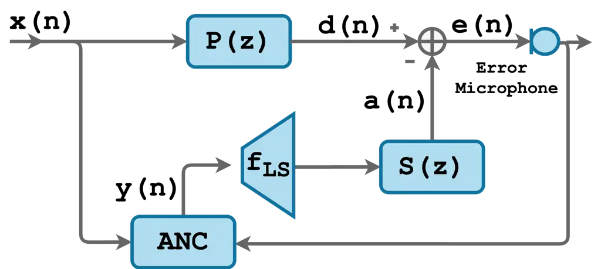
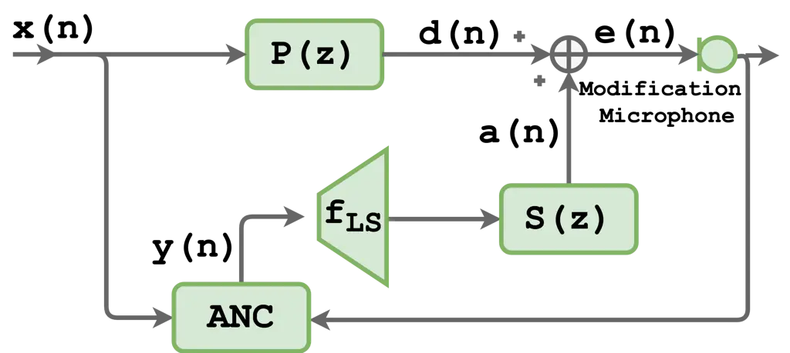
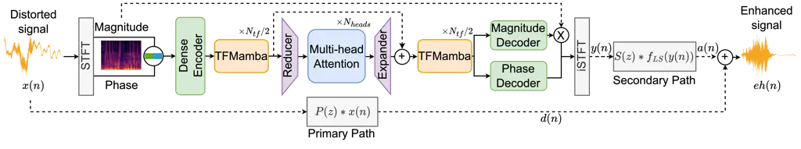
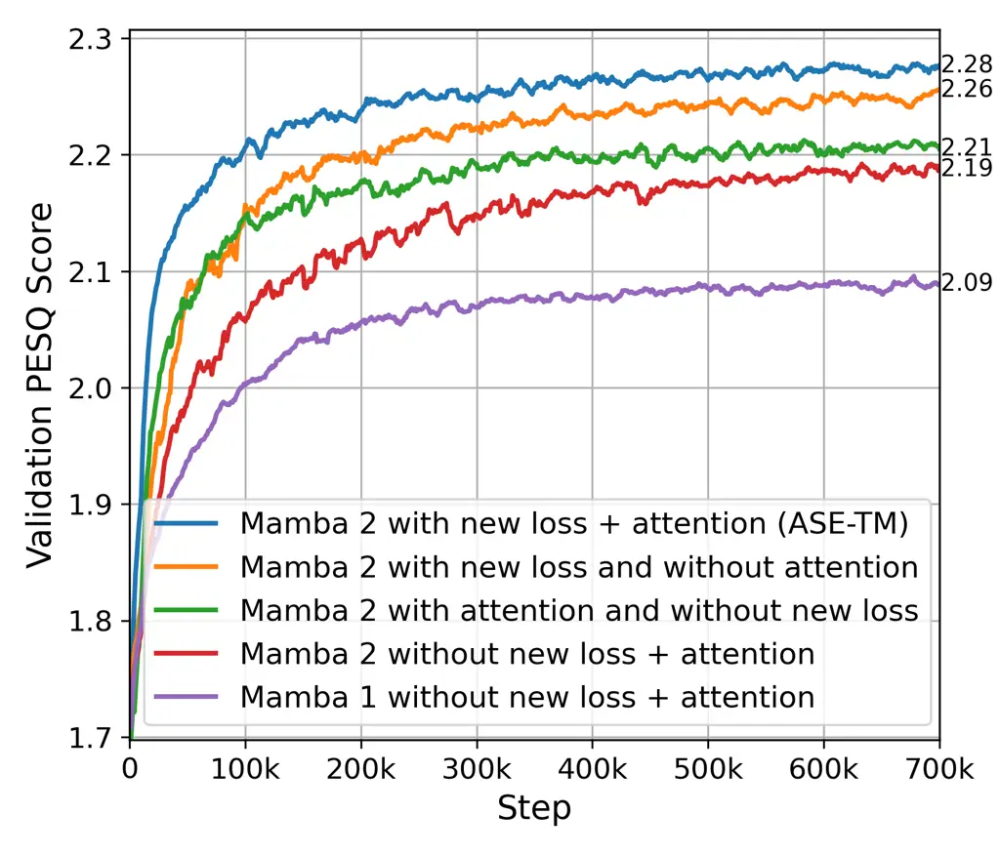
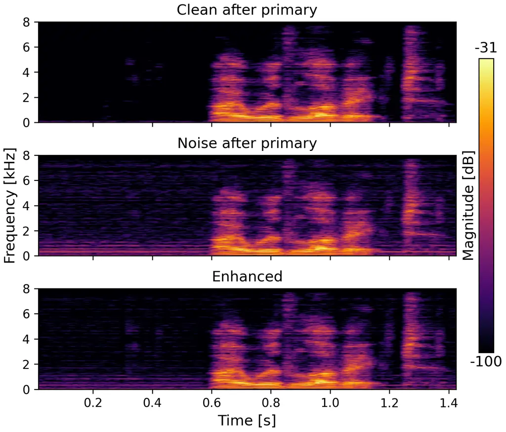
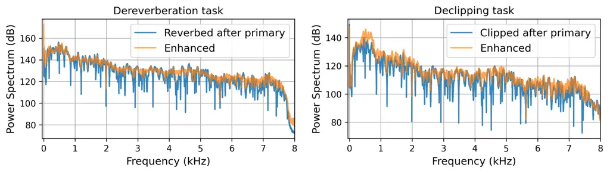

# Active Speech Enhancement: Active Speech Denoising Decliping and Deveraberation

Ofir Yaish Affiliation: School of Electrical and Computer Engineering
Affiliation: Ben-Gurion University of the Negev
Email: [yaishof@post.bgu.ac.il](mailto:)    Yehuda Mishaly
Affiliation: Blavatnik School of Computer Science Affiliation: Tel Aviv
University Email: [mishaly1@mail.tau.ac.il](mailto:)    Eliya Nachmani
^(†)^(†)thanks: Corresponding author. Affiliation: School of Electrical
and Computer Engineering Affiliation: Ben-Gurion University of the Negev
Email: [eliyanac@bgu.ac.il](mailto:)

###### Abstract

We introduce a new paradigm for active sound modification: Active Speech
Enhancement (ASE). While Active Noise Cancellation (ANC) algorithms
focus on suppressing external interference, ASE goes further by actively
shaping the speech signal—both attenuating unwanted noise components and
amplifying speech-relevant frequencies—to improve intelligibility and
perceptual quality. To enable this, we propose a novel
Transformer-Mamba-based architecture, along with a task-specific loss
function designed to jointly optimize interference suppression and
signal enrichment. Our method outperforms existing baselines across
multiple speech processing tasks—including denoising, dereverberation,
and declipping—demonstrating the effectiveness of active, targeted
modulation in challenging acoustic environments.

## 1 Introduction

Speech enhancement and noise control are fundamental audio processing
tasks. Speech enhancement aims to improve the perceptual quality and
intelligibility of speech signals by mitigating degradations such as
background noise, distortion, clipping, and reverberation. Traditional
approaches—including spectral subtraction, Wiener filtering, and
statistical model–based methods—have achieved varying degrees of success
but often falter in highly non-stationary noise environments \[1, 2,
3\]. Recent advances in deep learning have, however, yielded
state-of-the-art performance: convolutional neural networks (CNNs) \[4,
5, 6\], recurrent neural networks (RNNs) \[7\], generative adversarial
networks (GANs) \[8, 9, 10, 11, 12\], Transformers \[13, 14, 15, 16, 17,
18\], and diffusion models \[19, 20, 21, 22, 23, 24, 25\] demonstrate
exceptional results on benchmarks for denoising, dereverberation, and
declipping.

Active noise cancellation takes a complementary approach by generating
an anti-noise signal to destructively interfere with unwanted background
noise. Pioneering work dating back to Lueg’s first patent in 1936
introduced the concept of adaptive feedforward ANC \[26\], which was
later refined through advances in adaptive filtering (e.g., LMS, FxLMS),
multi-channel algorithms, and applications in headphones and enclosure
systems \[27, 28, 29, 30, 31, 32, 33, 34, 35, 36, 37\]. While ANC excels
at suppressing predictable or narrowband noise, it does not actively
modify the speech content itself.

In this paper, we propose a new paradigm—Active Speech Enhancement—that
unifies the goals of speech enhancement and active noise control. Unlike
conventional ANC, which solely targets noise suppression, Active Speech
Enhancement (ASE) actively shapes the speech signal by simultaneously
attenuating interfering components and amplifying speech-related
frequencies. This dual-action approach not only reduces the noise but
also emphasizes the speech and improves perceptual quality under
challenging acoustic conditions. We make the following key
contributions:

- •
  We formalize the ASE task and define appropriate evaluation metrics
  that capture noise suppression and speech enhancement objectives.
- •
  We introduce a novel Transformer-Mamba-based model that learns to
  generate an active modification signal, leveraging self-attention to
  capture long-range dependencies in time–frequency representations.
- •
  Joint Suppression–Enrichment Loss. We design a task-specific loss
  function that balances interference removal and signal enrichment,
  combining spectral, perceptual, and adversarial objectives to drive
  the model toward optimal ASE performance.
- •
  Comprehensive Evaluation. Our method outperforms baselines across
  multiple tasks, including speech denoising, dereverberation, and
  declipping, achieving significant gains in standard metrics such as
  PESQ \[38\].

A demo page is available at [our project demo
page](https://ofiryaish.github.io/ASE-TM-Demo/).

## 2 Related Work

### 2.1 Speech Enhancement

Recent advances in deep learning have yielded substantial improvements
in speech enhancement. Pandey and Wang \[6\] proposed a CNN–based
autoencoder that applies convolutions directly to the raw waveform while
computing the loss in the frequency domain. SEGAN \[4\], introduced by
Pascual _et al._, employs strided convolutional layers in a generative
adversarial framework. Rethage *et al.* \[5\] developed a
WaveNet-inspired model that predicts multiple waveform samples per step
to reduce computational cost. Recurrent architectures have also been
explored. Hu *et al.* \[7\] presented DCCRN, which integrates
complex-valued convolutional and recurrent layers to process spectrogram
inputs. A real-time causal model based on an encoder–decoder with skip
connections was proposed by Défossez *et al.* \[39\], operating directly
on the raw waveform and optimized in both time and frequency domains.

MetricGAN \[8\] and its successor MetricGAN+ \[9\] incorporate
evaluation metrics such as PESQ (Perceptual Evaluation of Speech
Quality) \[38\] and STOI (Short-Time Objective Intelligibility) \[10\]
into the adversarial loss. Kim *et al.* \[10\] further enhance this
approach by introducing a multiscale discriminator operating at
different sampling rates alongside a generator that processes speech at
multiple resolutions.

Transformer-based models have recently gained prominence. Wang *et
al.* \[13\] proposed a two-stage transformer network (TSTNN) that
outperforms earlier time- and frequency-domain methods. CMGAN \[16\]
adapts the Conformer backbone \[40\] for enhancement, and de Oliveira
*et al.* \[14\] replace the learned encoder of SepFormer \[41\] with
long-frame STFT (Short-Time Fourier Transform) inputs, reducing sequence
length and lowering computational cost without compromising perceptual
quality.

More recently, diffusion-based approaches have emerged as a powerful
generative paradigm. Lu *et al.* \[20\] introduced a conditional
diffusion probabilistic model that learns a parameterized reverse
diffusion process conditioned on the noisy input. Welker *et al.* \[21\]
extended score-based models to the complex STFT domain, learning the
gradient of the log-density of clean speech coefficients. Richter *et
al.* \[22\] formulate enhancement as a stochastic differential equation,
initializing reverse diffusion from a mixture of noisy speech and
Gaussian noise and achieving high-quality reconstructions in only 30
steps. Lemercier *et al.* \[23\] propose a _stochastic regeneration_
method that leverages an initial predictive-model estimate to guide a
reduced-step diffusion process, mitigating artifacts and reducing
computational cost by an order of magnitude while maintaining
enhancement quality.

### 2.2 Active Audio Cancellation

Recently, deep learning approaches have demonstrated remarkable results
in ANC algorithms. Zhang et al. \[31\] introduced DeepANC, which employs
a convolutional long short-term memory (Conv-LSTM) network to jointly
estimate amplitude and phase responses from microphone signals.
Subsequently, attention-driven ANC frameworks integrating attentive
recurrent networks were proposed to enable real-time adaptation and
low-latency operation \[42\].

A selective fixed-filter ANC (SFANC) framework was developed to leverage
a two-dimensional CNN for optimal control-filter selection on a mobile
co-processor and a lightweight one-dimensional CNN for time-domain noise
classification, yielding superior attenuation of real-world
non-stationary headphone noise \[43\]. Luo et al. \[44\] proposed a
hybrid SFANC–FxNLMS that first applies a similar approach as SFANC for
each noise frame and then applies the FxNLMS algorithm for real-time
coefficient adaptation, thereby combining the rapid response of SFANC
with the low steady-state error and robustness of adaptive optimization.
Heuristic algorithms—such as bee colony optimization \[45\] and genetic
algorithms \[46\]—have been explored to avoid gradient-based learning.

Other studies have applied recurrent convolutional networks \[32, 33,
34\] and fully connected neural networks \[36\] to ANC.
Autoencoder-based encodings have been used to extract latent features
for improved robustness \[35\]. Efforts in SFANC have extended to
synthesizing optimized filter banks via unsupervised methods \[47\],
while advancements in multichannel setups continue to leverage spatial
diversity through deep controllers \[48\]. Multichannel configurations
have been further enhanced by refined deep controllers that learn
inter-channel relationships for improved noise attenuation \[49, 50, 51,
52, 53\], and attention-driven frameworks have been investigated for
low-latency operation \[54\].

## 3 Background

We first examine a feedforward ANC algorithm that employs a single error
microphone to lay the foundation for our new ASE framework. In the ANC
framework (Figure 1a), the _primary path_, characterized by the transfer
function $`P(z)`$, models the acoustic propagation from the disturbance
source to the error microphone. The _secondary path_, denoted by
$`S(z)`$, describes the transfer from the loudspeaker to the error
microphone. Let $`x(n)`$ denote the reference signal applied to the ANC
system. The primary signal $`d(n)`$ is obtained by filtering $`x(n)`$
through the primary path:

```math
d(n)\;=\;P(z)\,*\,x(n)\,, \tag{1}
```

where $`*`$ denotes the convolution operation. The error microphone
captures the residual signal $`e(n)`$, representing the difference
between the original disturbance and the cancellation signal. Both
$`x(n)`$ and $`e(n)`$ are used by the ANC algorithm to compute the
canceling signal $`y(n)`$. The loudspeaker implements $`y(n)`$ according
to its electro-acoustic transfer function $`f_{\mathrm{LS}}\{\cdot\}`$.
After propagation through the secondary path, the anti-signal (or
cancellation signal) is given by

```math
a(n)\;=\;S(z)\,*\,f_{\mathrm{LS}}\bigl(y(n)\bigr)\,. \tag{2}
```

The error signal is defined formally as the difference between the
primary signal and the anti-signal:

```math
e(n)\;=\;d(n)-a(n)\,. \tag{3}
```

The objective of the ANC algorithm is to generate $`y(n)`$ such that
$`e(n)`$ is minimized, ideally achieving $`e(n)=0`$, which corresponds
to complete cancellation of the disturbance. In contrast, the ASE
framework uses the primary and anti-signals to construct an enhanced
signal:

```math
eh(n)\;=\;d(n)+a(n)\,. \tag{4}
```

While ANC aims to eliminate the disturbance, ASE seeks to recover clean
speech from a noisy mixture. The objective of the ASE task is to
generate $`eh(n)`$ such that its deviation from the clean target signal
$`c(n)`$, i.e., $`eh(n)-c(n)`$, is minimized. As illustrated in
Figure 1b, the feedforward ASE setup comprises a disturbance source, a
reference signal path, and a control filter operating through the
secondary path. Given the nature of the task, the error microphone
serves as the modification microphone in our framework.

Our work adapts three speech distortion types, previously defined by
VoiceFixer \[55\] for general speech restoration, to the context of our
ASE framework. Specifically, our ASE-TM model targets the restoration of
speech $`s(n)`$ degraded by: (i) Additive noise: This common distortion,
where unwanted background sounds obscure the speech, is modeled as the
sum of the clean speech signal $`s(n)`$ and a noise signal $`n(n)`$:

```math
d_{\text{noise}}(s(n))=s(n)+n(n)\,. \tag{5}
```

(ii) Reverberation: Caused by sound reflections in an enclosure,
reverberation blurs speech signals. It is modeled by convolving the
speech signal $`s(n)`$ with a room impulse response (RIR) $`r(n)`$:

```math
d_{\text{rev}}(s(n))=s(n)*r(n)\,. \tag{6}
```

(iii) Clipping: This distortion arises when signal amplitudes exceed the
maximum recordable level, typically due to microphone limitations.
Clipping truncates the signal $`s(n)`$ within a certain range
$`[-\eta,+\eta]`$:

```math
d_{\text{clip}}(s(n))=\max(\min(s(n),\eta),-\eta)\,,\quad\eta\in[0,1]\,. \tag{7}
```

This leads to harmonic distortions and can degrade speech
intelligibility. To assess the performance of ASE-TM across these
enhancement tasks, we employ a suite of established objective metrics.
Consistent with the evaluation protocol in SEmamba \[56\], these include
the Wide-band PESQ \[38\], STOI \[57\], and the composite measures CSIG
(predicting signal distortion), CBAK (predicting background
intrusiveness), and COVL (predicting overall speech quality) \[58\].
Furthermore, we incorporate the Normalized Mean Square Error (NMSE), a
traditionally well-established metric in the ANC task. The NMSE between
a target signal $`u(n)`$ and an estimated signal $`v(n)`$ is defined in
decibels (dB) as:

```math
\text{NMSE}[u,v]=10\cdot\log_{10}\left(\frac{\sum_{n=1}^{M}(u(n)-v(n))^{2}}{\sum_{n=1}^{M}u(n)^{2}}\right)\,, \tag{8}
```

where $`M`$ is the total number of samples. In our evaluations, $`u(n)`$
represents the clean target speech $`c(n)`$, and $`v(n)`$ is the
enhanced speech $`eh(n)`$ produced by our model (the precise definition
of $`c(n)`$ for each task is detailed in Section 4.2).



(a) A feedforward ANC setup diagram.



(b) A feedforward ASE setup diagram.

Figure 1: Comparison of feedforward ANC and ASE setups.

## 4 Method

### 4.1 ASE-TM Architecture Overview

The proposed model, ASE Transformer-Mamba (ASE-TM, Figure 2), adopts and
extends the fundamental structure of the SEmamba architecture \[56\],
which consists of a dense encoder, a series of Time-Frequency Mamba
(TFMamba) blocks \[59\], and parallel magnitude and phase decoders. A
notable distinction of our ASE-TM model is the utilization of Mamba2
blocks \[60\] within these TFMamba pathways, in contrast to the original
SEmamba architecture, which employed an earlier version of Mamba \[61\].
This choice is motivated by the potential improvements in efficiency
offered by Mamba2.

The input noisy waveform, $`x(n)`$, sampled at a rate of $`F_{s}`$, is
processed through an STFT. The STFT employs a Hann window of
$`N_{\text{win}}`$ samples, a hop length of $`N_{\text{hop}}`$ samples,
and an $`N_{\text{FFT}}`$-point FFT, resulting in
$`N_{\text{freq}}=\left\lfloor N_{\text{win}}/2\right\rfloor+1`$
frequency features per frame. Its magnitude and phase components are
horizontally stacked and fed into the network. The dense encoder
utilizes convolutional layers and dense blocks to extract initial
features from the stacked magnitude and phase, outputting a
representation with $`C_{\text{enc}}`$ channels, each with
$`N_{\text{enc}}`$ features.

The core of the temporal and spectral modeling is based on
$`N_{\text{tf}}`$ TFMamba blocks. Each TFMamba block contains separate
Mamba-based pathways (time-mamba and freq-mamba) employing bidirectional
Mamba layers to capture dependencies across time and frequency
dimensions, respectively \[56, 59\].

Following the initial $`N_{\text{tf}}/2`$ TFMamba blocks, inspired by
hybrid approaches like Jamba \[62\], we introduce an attention-based
block. Before applying attention, the feature representation, with
$`C_{\text{enc}}`$ channels, undergoes dimensionality reduction. A 2D
convolution with a kernel size of $`(1,N_{\text{enc}}/2+1)`$ reduces the
channel dimension from $`C_{\text{enc}}`$ to $`C_{\text{enc}}/4`$ and
each channel features size from $`N_{\text{enc}}`$ to
$`N_{\text{enc}}/2`$. This results in a compact representation of size
$`N_{\text{enc}}/2\times C_{\text{enc}}/4`$ for the attention layer. In
addition, positional encoding is applied to this compact representation.
A standard Multi-Head Attention layer with $`N_{\text{heads}}`$ heads is
then used on this reduced representation to weigh features based on
global context. Following the attention layer, an expansion module
employing a transposed 2D convolution, also with a kernel size of
$`(1,N_{\text{enc}}/2+1)`$, is used to restore the channel dimension to
$`C_{\text{enc}}`$ and expand the feature dimension back towards
$`N_{\text{enc}}`$ before passing the features to the remaining
$`N_{\text{tf}}/2`$ TFMamba blocks. An additional step before applying
the remaining TFMamba blocks is the use of a residual connection that
sums the feature representations from before the dimensionality
reduction with those after the attention and expansion modules

The magnitude and phase decoders retain the structure used in SEmamba,
employing dense blocks and convolutional layers (including transposed
convolutions) to reconstruct the target representation—not before
applying a residual connection that performs element-wise multiplication
between the original STFT magnitude and the predicted magnitude.
However, instead of predicting the enhanced spectra directly, the
network is trained to output the complex spectrum of the cancelling
signal $`y(n)`$. This signal $`y(n)`$, after undergoing the
electro-acoustic transfer function $`f_{\mathrm{LS}}\{\cdot\}`$ and
propagation through the secondary path $`S(z)`$, becomes the anti-signal
$`a(n)`$ (as defined in Eq. 2). This anti-signal $`a(n)`$ is then summed
with the primary path signal $`d(n)`$ to produce the final enhanced
signal $`eh(n)`$ (as defined in Eq. 3).



Figure 2: ASE-TM Architecture.

### 4.2 Optimization Objective

The primary goal of the ASE-TM model is to generate an enhanced signal
$`eh(n)`$ that is as close as possible to a clean target speech signal
$`c(n)`$. The definition of this target $`c(n)`$ varies based on the
specific enhancement task. For additive noise reduction, $`c(n)`$ is the
clean speech signal convolved with the primary path $`P(z)`$,
representing the clean signal as perceived at the modification
microphone. For dereverberation and declipping, $`c(n)`$ is the original
anechoic, unclipped clean speech signal, prior to any acoustic path
effects or clipping distortion.

The training of ASE-TM largely follows the multi-level loss framework
established in SEmamba \[56\] and originating from MP-SENet \[63\]. This
framework combines several loss components. Our approach incorporates
this established framework with specific modifications and additions.
The overall generator loss $`\mathcal{L}_{G}`$ is a weighted sum of the
following components:

1.  1.  Time-Domain Loss ($`\mathcal{L}_{\text{Time}}`$): As an innovation
        in our work, we employ a combination of L1 and L2 distances between
        the enhanced waveform $`eh(n)`$ and the target waveform $`c(n)`$:

    ```math
    \mathcal{L}_{\text{Time}}=||eh(n)-c(n)||_{1}+||eh(n)-c(n)||_{2}^{2}\,. \tag{9}
    ```

    This hybrid loss aims to leverage the robustness of L1 to outliers
    and the smoothness encouraged by L2.

2.  2.  Magnitude Spectrum Loss ($`\mathcal{L}_{\text{Mag}}`$): Similar to
        the time-domain loss, our second innovation involves a combined L1
        and L2 loss on the magnitude spectra. If $`EN_{m}`$ and $`C_{m}`$
        are the magnitude spectra of $`eh(n)`$ and $`c(n)`$ respectively,
        then:

    ```math
    \mathcal{L}_{\text{Mag}}=||EN_{m}-C_{m}||_{1}+||EN_{m}-C_{m}||_{2}^{2}\,. \tag{10}
    ```

    This contrasts with the L2 loss typically used in MP-SENet for this
    component.

3.  3.  Complex Spectrum Loss ($`\mathcal{L}_{\text{Com}}`$): This loss
        penalizes differences in the STFT domain. It is the sum of L2 losses
        on the real and imaginary parts of the STFTs of $`eh(n)`$ and
        $`c(n)`$.
4.  4.  Anti-Wrapping Phase Loss ($`\mathcal{L}_{\text{Pha}}`$): This
        includes instantaneous phase loss, group delay loss, and
        instantaneous angular frequency loss to directly optimize the phase
        spectrum, addressing phase wrapping issues.
5.  5.  Metric-Based Adversarial Loss ($`\mathcal{L}_{\text{Metric}}`$):
        This involves a discriminator trained to predict a perceptual metric
        (e.g., PESQ), guiding the generator to produce outputs that score
        well on this metric.
6.  6.  Consistency Loss ($`\mathcal{L}_{\text{Consist}}`$): We incorporate
        a consistency loss. This loss minimizes the discrepancy between the
        complex spectrum directly output by the model’s decoders (magnitude
        and phase) and the complex spectrum obtained by applying STFT to the
        time-domain waveform $`eh(n)`$ that results from an inverse STFT of
        the initially predicted spectrum.

The total generator loss is then defined with the hyperparameter
$`\gamma`$ as follows:

```math
\mathcal{L}_{G}=\gamma_{\text{1}}\mathcal{L}_{\text{Time}}+\gamma_{\text{2}}\mathcal{L}_{\text{Mag}}+\gamma_{\text{3}}\mathcal{L}_{\text{Com}}+\gamma_{\text{4}}\mathcal{L}_{\text{Metric}}+\gamma_{\text{5}}\mathcal{L}_{\text{Pha}}+\gamma_{\text{6}}\mathcal{L}_{\text{Consist}}. \tag{11}
```

## 5 Experiments

### 5.1 Datasets and Task Generation

Our evaluations are conducted across three primary speech restoration
tasks: additive noise reduction, dereverberation, and declipping. For
the additive noise reduction task, we utilize the VoiceBank-DEMAND
dataset \[64\], a standard benchmark in speech enhancement. This dataset
combines clean speech from the VoiceBank corpus \[65\] with various
non-stationary noises from the DEMAND database \[66\]. Our training set
consists of utterances from 28 speakers with 10 different noise types at
Signal-to-Noise Ratios (SNRs) of 0, 5, 10, and 15 dB. We used two
speakers from the training set as the validation set. The test set
comprises 824 utterances from 2 unseen speakers, mixed with 5 different
unseen noise types at SNRs of 2.5, 7.5, 12.5, and 17.5 dB.

The datasets for the dereverberation and declipping tasks are generated
using the clean speech utterances of the speakers available in the
VoiceBank corpus. Dereverberation: Reverberant speech is synthesized by
convolving the clean VoiceBank utterances with Room Impulse Responses
(RIRs) as defined in Eq. 6 using the SpeechBrain package \[67\]. For
training, we randomly sample RIRs from the training portion of the RIR
dataset provided alongside VoiceFixer \[55\]. For the test set, a fixed
and distinct set of RIRs (from the VoiceFixer RIR test set) is applied
to the clean test utterances to ensure consistent evaluation conditions.
Declipping: Clipped speech signals are generated by applying a clipping
threshold $`\eta`$ to the clean utterances according to Eq. 7. During
training, the clipping ratio $`\eta`$ is uniformly sampled from the
range $`[0.1,0.5]`$ for each utterance to expose the model to varying
degrees of distortion. For testing, a specific clipping threshold is
used.

### 5.2 Acoustic Path Simulation

To emulate the acoustic environment for the ASE framework, we simulate
the primary path $`P(z)`$ and secondary path $`S(z)`$. Our simulation
setup is based on previous setups for the ANC task \[31, 54\], and it
models a rectangular enclosure with dimensions of $`3\times 4\times 2`$
meters (width $`\times`$ length $`\times`$ height). Room Impulse
Responses (RIRs) are generated using the image method \[68\],
implemented with a Python-based RIR generator package \[69\] with the
high-pass filtering option enabled. The modification microphone,
capturing $`eh(n)`$, is simulated at position $`[1.5,3,1]`$ meters. The
reference microphone, capturing $`x(n)`$, is at $`[1.5,1,1]`$ meters,
and the cancellation loudspeaker, which outputs the signal leading to
$`a(n)`$, is located at $`[1.5,2.5,1]`$ meters within the enclosure. The
length of the simulated RIRs for both $`P(z)`$ and $`S(z)`$ is
$`L_{\text{RIR}}=512`$ taps. The non-linear characteristics of the
loudspeaker are modeled using the Scaled Error Function (SEF), defined
as $`f_{\mathrm{LS}}\{y\}=\int_{0}^{y}\exp(-z^{2}/(2\lambda^{2}))dz`$.
Here, $`y`$ is the input signal to the loudspeaker, and $`\lambda^{2}`$
controls the severity of the saturation non-linearity. Different values
of $`\lambda^{2}`$ are used to simulate varying degrees of distortion,
with larger values approaching linear behavior. To introduce variability
during training, the room’s reverberation time ($`T_{60}`$) and
$`\lambda^{2}`$ are randomly sampled from the sets
$`\{0.15,0.175,0.2,0.225,0.25\}`$ seconds and $`\{0.1,1,10,\infty\}`$,
respectivly, for each training sample. For testing, fixed $`T_{60}`$ and
$`\lambda^{2}`$ are used.

### 5.3 Model Hyperparameters and Training

The ASE-TM model processes audio sampled at $`F_{s}=16`$ kHz. For the
STFT, we use a Hann window of $`N_{\text{win}}=400`$ samples, a hop
length of $`N_{\text{hop}}=100`$ samples, and an
$`N_{\text{FFT}}=400`$-point FFT. The dense encoder outputs a feature
representation with $`C_{\text{enc}}=128`$ channels, where each channel
has a feature dimension of $`N_{\text{enc}}=100`$. Our model employs a
total of $`N_{\text{tf}}=8`$ TFMamba blocks. The Multi-Head Attention
layer within the attention-based block uses $`N_{\text{heads}}=10`$
heads. Other internal architectural details for the TFMamba blocks and
dense convolutional blocks largely follow the configurations presented
in SEmamba \[56\]. The ASE-TM model is trained for $`350`$ epochs using
the AdamW optimizer \[70\] with $`\beta_{1}=0.8`$ and
$`\beta_{2}=0.99`$. The initial learning rate is set to
$`5\times 10^{-4}`$. We use a batch size of $`4`$. Audio segments of
$`32,000`$ samples (equivalent to 2 seconds at 16 kHz) are used for
training. The model parameters yielding the best performance on the
validation set, evaluated based on the PESQ score, are saved for final
testing. We used an NVIDIA RTX A6000 GPU (internal cluster). The
training runtime of the ASE-TM model was $`\sim 10`$ days.

### 5.4 Baseline Methods

We compare our proposed ASE-TM model with several established baseline
methods commonly used in ANC. These include THF-FxLMS \[71\], which is
an extension to the traditional FxLMS algorithm \[30\], DeepANC that
utilizes a convolutional LSTMs \[31\], and ARN that incorporates an
attention mechanism \[54\]. These baseline methods were adapted and
retrained or configured to the ASE framework across the denoising,
dereverberation, and declipping tasks.

## 6 Results and Analysis

### 6.1 Active Denoising Performance

The speech denoising performance on the VoiceBank-DEMAND dataset is
detailed in Table 1. Our ASE-TM model demonstrates superior performance,
achieving a PESQ score of $`2.98`$. This significantly surpasses the
baselines: THF-FxLMS achieved a PESQ of $`2.37`$, and the deep
learning-based ANC methods, DeepANC and ARN, yielded PESQ scores of
$`1.48`$ and $`2.45`$, respectively. These results demonstrate a
substantial performance gap between conventional ANC approaches and our
ASE-TM, which benefits from actively shaping the speech signal in
addition to noise suppression, as also evidenced by its leading scores
in CSIG, CBAK, COVL, STOI, and particularly a significantly better NMSE
of $`-21.76`$ dB.

| Method           | PESQ ($`\uparrow`$) | CSIG ($`\uparrow`$) | CBAK ($`\uparrow`$) | COVL ($`\uparrow`$) | STOI ($`\uparrow`$) | NMSE ($`\downarrow`$) |
| ---------------- | ------------------- | ------------------- | ------------------- | ------------------- | ------------------- | --------------------- |
| Noisy-speech     | 1.97                | 3.50                | 2.55                | 2.75                | 0.92                | -8.44                 |
| THF-FxLMS \[31\] | 2.37                | 3.66                | 2.84                | 3.00                | 0.97                | -15.32                |
| DeepANC \[31\]   | 1.48                | 1.99                | 2.19                | 1.69                | 0.93                | -12.80                |
| ARN \[54\]       | 2.45                | 3.64                | 3.13                | 3.03                | 0.97                | -20.64                |
| ASE-TM (Ours)    | 2.98                | 4.21                | 3.49                | 3.62                | 0.99                | -21.76                |

Table 1: Average denoising results on the VoiceBank-DEMAND test set
($`T_{60}=0.25s`$ and $`\lambda^{2}=\infty`$).

### 6.2 Dereverberation and Declipping Performance

The efficacy of ASE-TM was further evaluated on dereverberation and
declipping tasks, with results presented in Table 2 and Table 3,
respectively. For dereverberation (Table 2), ASE-TM achieved a PESQ
score of $`2.43`$, a considerable improvement from the reverberant
speech baseline (PESQ $`1.60`$). In contrast, the adapted ANC baselines
struggled with this task; THF-FxLMS scored a PESQ of $`1.43`$, while
DeepANC and ARN achieved $`1.06`$ and $`1.35`$, respectively. This
suggests that these methods, even when retrained or configured for the
task, were less capable of effectively adjusting their processes to
mitigate reverberation in the ASE framework. Similarly, in the
declipping task, with a clipping threshold of $`\eta=0.25`$ (Table 3),
ASE-TM restored the speech to a PESQ score of $`3.09`$ from an initial
clipped speech PESQ of $`2.17`$. The baseline methods again showed
limited effectiveness: THF-FxLMS (PESQ $`1.92`$), DeepANC (PESQ
$`1.05`$), and ARN (PESQ $`1.67`$).

These tasks, particularly where the target $`c(n)`$ is the original
clean speech before any primary path effects, highlight the challenge
and efficacy of the ASE approach in not just cancelling an interfering
signal but actively restoring a desired signal characteristic.

| Method           | PESQ ($`\uparrow`$) | CSIG ($`\uparrow`$) | CBAK ($`\uparrow`$) | COVL ($`\uparrow`$) | STOI ($`\uparrow`$) | NMSE ($`\downarrow`$) |
| ---------------- | ------------------- | ------------------- | ------------------- | ------------------- | ------------------- | --------------------- |
| Reverbed-speech  | 1.60                | 2.60                | 1.88                | 2.02                | 0.80                | 2.00                  |
| THF-FxLMS \[31\] | 1.43                | 2.55                | 1.64                | 1.89                | 0.78                | 4.77                  |
| DeepANC \[31\]   | 1.06                | 1.00                | 1.00                | 1.00                | 0.53                | 21.19                 |
| ARN \[54\]       | 1.35                | 1.25                | 1.54                | 1.18                | 0.76                | 4.58                  |
| ASE-TM (Ours)    | 2.43                | 3.71                | 2.67                | 3.07                | 0.93                | -0.04                 |

Table 2: Average dereverberation results on the reverbed test set
($`T_{60}=0.25s`$ and $`\lambda^{2}=\infty`$).

| Method           | PESQ ($`\uparrow`$) | CSIG ($`\uparrow`$) | CBAK ($`\uparrow`$) | COVL ($`\uparrow`$) | STOI ($`\uparrow`$) | NMSE ($`\downarrow`$) |
| ---------------- | ------------------- | ------------------- | ------------------- | ------------------- | ------------------- | --------------------- |
| Clipped-speech   | 2.17                | 3.49                | 2.51                | 2.82                | 0.89                | -0.23                 |
| THF-FxLMS \[31\] | 1.92                | 3.35                | 2.36                | 2.62                | 0.88                | -0.02                 |
| DeepANC \[31\]   | 1.05                | 1.00                | 1.00                | 1.00                | 0.53                | 11.10                 |
| ARN \[54\]       | 1.67                | 1.60                | 2.12                | 1.57                | 0.87                | -0.31                 |
| ASE-TM (Ours)    | 3.09                | 4.20                | 3.06                | 3.67                | 0.93                | -1.70                 |

Table 3: Average declipping results on the clipped test set
($`\eta=0.25`$, $`T_{60}=0.25s`$, and $`\lambda^{2}=\infty`$).

### 6.3 Denoising ASE-TM Model Analysis

An ablation study, presented in Figure 3a, investigates the
contributions of our proposed loss function modifications, the attention
mechanism, and the use of Mamba2 over Mamba1 to the ASE-TM model for the
denoising task. The full model consistently achieves the highest
validation PESQ score throughout training. Replacing Mamba1 with Mamba2
and the modified loss yielded the most considerable performance
improvement among all evaluated components. Notably, configurations
incorporating the attention mechanism demonstrate a faster convergence
to higher performance levels, suggesting that attention aids in
efficiently learning relevant features. Spectrogram analysis of a
representative denoising example (Figure 3b) visually confirms the
model’s effectiveness; the spectrogram of the enhanced signal closely
mirrors that of the clean speech (after primary path), indicating
successful noise suppression while preserving essential speech
characteristics.

To assess robustness, ASE-TM was evaluated under varying acoustic
conditions for the denoising task, with results detailed in Table 4.
This analysis focused on ASE-TM due to its significantly better
performance over baselines in Table 1. The model shows consistent high
performance across different $`T_{60}`$ values under linear loudspeaker
conditions ($`\lambda^{2}=\infty`$), achieving a PESQ of $`3.02`$ for
$`T_{60}=0.15`$s and $`3.13`$ for $`T_{60}=0.20`$s. When strong
non-nonlinearities are introduced (e.g., $`\lambda^{2}=0.1`$ at
$`T_{60}=0.25`$s), the PESQ score is $`2.74`$, still indicating robust
performance. As $`\lambda^{2}`$ increases (less non-linearity),
performance improves, reaching a PESQ of $`2.97`$ for $`\lambda^{2}=10`$
at $`T_{60}=0.25`$s.



(a) An ablation study.



(b) An enhanced (denoised) signal spectrogram.

Figure 3: Model analysis of ASE-TM model for the denoising task. In the
ablation study, a moving average with window size $`=10`$ was applied.

### 6.4 Runtime Analysis

To satisfy real-time constraints in active systems, we evaluated ASE-TM
under a future-frame prediction strategy, following prior work \[31,
54\]. In our setup, the causality condition
$`T_{\text{ASE-TM}}<T_{p}-T_{s}`$ evaluates to
$`T_{\text{ASE-TM}}<\frac{2}{343}-\frac{0.5}{343}\approx 0.0043`$
seconds, where $`T_{p}`$ and $`T_{s}`$ denote the acoustic delays of the
primary and secondary paths, respectively. To accommodate the model’s
inference latency, we predict 500 future frames (0.03125 seconds),
remaining within real-time limits of our computational environment.
Despite this future context, performance degradation is minimal: on the
VoiceBank-DEMAND test set ($`T_{60}=0.25`$ s, $`\eta^{2}=\infty`$),
ASE-TM achieves a PESQ of 2.96 and STOI of 0.99—closely matching the
non-causal configuration.

|                |                 |                     |                     |                     |                     |                     |                       |
| -------------- | --------------- | ------------------- | ------------------- | ------------------- | ------------------- | ------------------- | --------------------- |
| $`T_{60}`$ (s) | $`\lambda^{2}`$ | PESQ ($`\uparrow`$) | CSIG ($`\uparrow`$) | CBAK ($`\uparrow`$) | COVL ($`\uparrow`$) | STOI ($`\uparrow`$) | NMSE ($`\downarrow`$) |
| 0.25           | 0.1             | 2.74                | 4.01                | 3.29                | 3.39                | 0.98                | -20.21                |
| 0.25           | 1.0             | 2.92                | 4.17                | 3.44                | 3.57                | 0.99                | -21.92                |
| 0.25           | 10              | 2.97                | 4.21                | 3.48                | 3.62                | 0.99                | -22.37                |
| 0.15           | $`\infty`$      | 3.02                | 4.22                | 3.50                | 3.65                | 0.98                | -22.31                |
| 0.20           | $`\infty`$      | 3.13                | 4.33                | 3.60                | 3.77                | 0.99                | -22.88                |

Table 4: Average performance of ASE-TM (denoising task) under varying
fixed acoustic conditions ($`T_{60}`$ and loudspeaker non-linearity
factor $`\lambda^{2}`$) on the VoiceBank-DEMAND test set.

### 6.5 Dereverberation and Declipping ASE-TM Model Analysis

Figure 4 presents the power spectra of the enhanced signals for the
dereverberation and declipping tasks, over the entire test set. For both
tasks, the spectrum of the enhanced signal $`eh(n)`$ exhibits
significantly more power across a broad range of frequencies compared to
the distorted input (reverberated or clipped after primary path),
indicating successful signal restoration and enrichment. In the
declipping task, it is particularly noteworthy that lower frequencies,
crucial for speech intelligibility, show substantial power recovery in
the enhanced signal’s spectrum. We further evaluated the declipping
performance under a more aggressive clipping threshold of $`\eta=0.1`$.
The unprocessed clipped speech at this level yielded a PESQ score of
$`1.53`$ and an NMSE of $`-0.18`$ dB. ASE-TM model restored these
signals to a PESQ of $`2.52`$ (CSIG $`3.61`$, CBAK $`2.76`$, COVL
$`3.08`$, STOI $`0.91`$) and an NMSE of $`-1.22`$ dB. While these
results are lower than for $`\eta=0.25`$, they represent a substantial
improvement over the severely clipped input, showing ASE-TM’s capability
to handle extreme distortions.



Figure 4: Power spectra for the dereverberation and declipping tasks
over the entire test set.

## 7 Conclusions and Limitations

In this paper, we introduced ASE, a novel paradigm that extends beyond
traditional ANC by actively shaping the speech signal to enhance quality
and intelligibility. Our ASE-TM model, leveraging a Transformer-Mamba
architecture and a specialized loss function, demonstrated strong
performance across various tasks, including denoising, dereverberation,
and declipping, outperforming ANC-centric baseline methods. However,
this study also reveals several limitations that require further
investigation. The baseline methods, primarily designed for ANC, were
adapted to the ASE tasks, which may explain their reduced performance.
Furthermore, our current model is trained separately for each task.
Future work should explore the development of a unified model capable of
handling multiple speech enhancement objectives, potentially leading to
more versatile and efficient systems.

If the paradigm of ASE is adopted, it can eventually improve
communication for people with hearing impairments and enhance voice
communication in devices. However, it could be misused to alter
recordings, raising ethical concerns about authenticity and privacy.

## References

- \[1\] Steven Boll. Suppression of acoustic noise in speech using
  spectral subtraction. _IEEE Transactions on acoustics, speech, and
  signal processing_, 27(2):113–120, 2003.
- \[2\] Jae Lim and Alan Oppenheim. All-pole modeling of degraded
  speech. _IEEE Transactions on Acoustics, Speech, and Signal
  Processing_, 26(3):197–210, 1978.
- \[3\] Kuldip Paliwal, Belinda Schwerin, and Kamil Wójcicki. Speech
  enhancement using a minimum mean-square error short-time spectral
  modulation magnitude estimator. _Speech Communication_,
  54(2):282–305, 2012.
- \[4\] Santiago Pascual, Antonio Bonafonte, and Joan Serra. Segan:
  Speech enhancement generative adversarial network. _arXiv preprint
  arXiv:1703.09452_, 2017.
- \[5\] Dario Rethage, Jordi Pons, and Xavier Serra. A wavenet for
  speech denoising. In _2018 IEEE International Conference on Acoustics,
  Speech and Signal Processing (ICASSP)_, pages 5069–5073. IEEE, 2018.
- \[6\] Ashutosh Pandey and DeLiang Wang. A new framework for supervised
  speech enhancement in the time domain. In _Interspeech_, pages
  1136–1140, 2018.
- \[7\] Yanxin Hu, Yun Liu, Shubo Lv, Mengtao Xing, Shimin Zhang, Yihui
  Fu, Jian Wu, Bihong Zhang, and Lei Xie. Dccrn: Deep complex
  convolution recurrent network for phase-aware speech enhancement.
  _arXiv preprint arXiv:2008.00264_, 2020.
- \[8\] Szu-Wei Fu, Chien-Feng Liao, Yu Tsao, and Shou-De Lin.
  Metricgan: Generative adversarial networks based black-box metric
  scores optimization for speech enhancement. In _International
  Conference on Machine Learning_, pages 2031–2041. PmLR, 2019.
- \[9\] Szu-Wei Fu, Cheng Yu, Tsun-An Hsieh, Peter Plantinga, Mirco
  Ravanelli, Xugang Lu, and Yu Tsao. Metricgan+: An improved version of
  metricgan for speech enhancement. In _Interspeech 2021_. ISCA,
  August 2021. doi: 10.21437/interspeech.2021-599. URL
  [http://dx.doi.org/10.21437/interspeech.2021-599](http://dx.doi.org/10.21437/interspeech.2021-599).
- \[10\] Hyung Yong Kim, Ji Won Yoon, Sung Jun Cheon, Woo Hyun Kang, and
  Nam Soo Kim. A multi-resolution approach to gan-based speech
  enhancement. _Applied Sciences_, 11(2):721, 2021.
- \[11\] Wooseok Shin, Byung Hoon Lee, Jin Sob Kim, Hyun Joon Park, and
  Sung Won Han. Metricgan-okd: multi-metric optimization of metricgan
  via online knowledge distillation for speech enhancement. In
  _International Conference on Machine Learning_, pages 31521–31538.
  PMLR, 2023.
- \[12\] Shrishti Saha Shetu, Emanuël AP Habets, and Andreas Brendel.
  Gan-based speech enhancement for low snr using latent feature
  conditioning. In _ICASSP 2025-2025 IEEE International Conference on
  Acoustics, Speech and Signal Processing (ICASSP)_, pages 1–5.
  IEEE, 2025.
- \[13\] Kai Wang, Bengbeng He, and Wei-Ping Zhu. Tstnn: Two-stage
  transformer based neural network for speech enhancement in the time
  domain. In _ICASSP 2021 - 2021 IEEE International Conference on
  Acoustics, Speech and Signal Processing (ICASSP)_, page 7098–7102.
  IEEE, June 2021. doi: 10.1109/icassp39728.2021.9413740. URL
  [http://dx.doi.org/10.1109/ICASSP39728.2021.9413740](http://dx.doi.org/10.1109/ICASSP39728.2021.9413740).
- \[14\] Danilo de Oliveira, Tal Peer, and Timo Gerkmann. Efficient
  transformer-based speech enhancement using long frames and stft
  magnitudes. In _Interspeech 2022_, page 2948–2952. ISCA,
  September 2022. doi: 10.21437/interspeech.2022-10781. URL
  [http://dx.doi.org/10.21437/Interspeech.2022-10781](http://dx.doi.org/10.21437/Interspeech.2022-10781).
- \[15\] Shucong Zhang, Malcolm Chadwick, Alberto Gil CP Ramos, and
  Sourav Bhattacharya. Cross-attention is all you need: Real-time
  streaming transformers for personalised speech enhancement. _arXiv
  preprint arXiv:2211.04346_, 2022a.
- \[16\] Ruizhe Cao, Sherif Abdulatif, and Bin Yang. Cmgan:
  Conformer-based metric gan for speech enhancement. _arXiv preprint
  arXiv:2203.15149_, 2022.
- \[17\] Moujia Ye and Hongjie Wan. Improved transformer-based dual-path
  network with amplitude and complex domain feature fusion for speech
  enhancement. _Entropy_, 25(2):228, 2023.
- \[18\] Qiquan Zhang, Hongxu Zhu, Xinyuan Qian, Eliathamby
  Ambikairajah, and Haizhou Li. An exploration of length generalization
  in transformer-based speech enhancement. In _Interspeech 2024_, page
  1725–1729. ISCA, September 2024a. doi: 10.21437/interspeech.2024-1831.
  URL
  [http://dx.doi.org/10.21437/interspeech.2024-1831](http://dx.doi.org/10.21437/interspeech.2024-1831).
- \[19\] Heitor R. Guimarães, Jiaqi Su, Rithesh Kumar, Tiago H. Falk,
  and Zeyu Jin. Ditse: High-fidelity generative speech enhancement via
  latent diffusion transformers, 2025.
- \[20\] Yen-Ju Lu, Zhong-Qiu Wang, Shinji Watanabe, Alexander Richard,
  Cheng Yu, and Yu Tsao. Conditional diffusion probabilistic model for
  speech enhancement. In _ICASSP 2022-2022 IEEE International Conference
  on Acoustics, Speech and Signal Processing (ICASSP)_, pages 7402–7406.
  Ieee, 2022.
- \[21\] Simon Welker, Julius Richter, and Timo Gerkmann. Speech
  enhancement with score-based generative models in the complex stft
  domain. _arXiv preprint arXiv:2203.17004_, 2022.
- \[22\] Julius Richter, Simon Welker, Jean-Marie Lemercier, Bunlong
  Lay, and Timo Gerkmann. Speech enhancement and dereverberation with
  diffusion-based generative models. _IEEE/ACM Transactions on Audio,
  Speech, and Language Processing_, 31:2351–2364, 2023. ISSN 2329-9304.
  doi: 10.1109/taslp.2023.3285241. URL
  [http://dx.doi.org/10.1109/TASLP.2023.3285241](http://dx.doi.org/10.1109/TASLP.2023.3285241).
- \[23\] Jean-Marie Lemercier, Julius Richter, Simon Welker, and Timo
  Gerkmann. Storm: A diffusion-based stochastic regeneration model for
  speech enhancement and dereverberation. _IEEE/ACM Transactions on
  Audio, Speech, and Language Processing_, 31:2724–2737, 2023. ISSN
  2329-9304. doi: 10.1109/taslp.2023.3294692. URL
  [http://dx.doi.org/10.1109/TASLP.2023.3294692](http://dx.doi.org/10.1109/TASLP.2023.3294692).
- \[24\] Wenxin Tai, Fan Zhou, Goce Trajcevski, and Ting Zhong.
  Revisiting denoising diffusion probabilistic models for speech
  enhancement: Condition collapse, efficiency and refinement. In
  _Proceedings of the AAAI conference on artificial intelligence_,
  volume 37, pages 13627–13635, 2023.
- \[25\] Jean-Eudes Ayilo, Mostafa Sadeghi, and Romain Serizel.
  Diffusion-based speech enhancement with a weighted
  generative-supervised learning loss. In _ICASSP 2024 - 2024 IEEE
  International Conference on Acoustics, Speech and Signal Processing
  (ICASSP)_, page 12506–12510. IEEE, April 2024. doi:
  10.1109/icassp48485.2024.10446805. URL
  [http://dx.doi.org/10.1109/ICASSP48485.2024.10446805](http://dx.doi.org/10.1109/ICASSP48485.2024.10446805).
- \[26\] Paul Lueg. Process of silencing sound oscillations. _US patent
  2043416_, 1936.
- \[27\] Philip Arthur Nelson and Stephen J Elliott. _Active control of
  sound_. Academic press, 1991.
- \[28\] Christopher C Fuller, Sharon Elliott, and Philip Arthur Nelson.
  _Active control of vibration_. Academic press, 1996.
- \[29\] Colin H Hansen, Scott D Snyder, Xiaojun Qiu, Laura A Brooks,
  and Danielle J Moreau. _Active control of noise and vibration_. E & Fn
  Spon London, 1997.
- \[30\] Sen M Kuo and Dennis R Morgan. Active noise control: a tutorial
  review. _Proceedings of the IEEE_, 87(6):943–973, 1999a.
- \[31\] Hao Zhang and DeLiang Wang. Deep anc: A deep learning approach
  to active noise control. _Neural Networks_, 141:1–10, 2021.
- \[32\] JungPhil Park, Jeong-Hwan Choi, Yungyeo Kim, and Joon-Hyuk
  Chang. Had-anc: A hybrid system comprising an adaptive filter and deep
  neural networks for active noise control. In _Proceedings of the
  Annual Conference of the International Speech Communication
  Association, INTERSPEECH_, volume 2023, pages 2513–2517. International
  Speech Communication Association, 2023.
- \[33\] Alireza Mostafavi and Young-Jin Cha. Deep learning-based active
  noise control on construction sites. _Automation in Construction_,
  151:104885, 2023.
- \[34\] Young-Jin Cha, Alireza Mostafavi, and Sukhpreet S Benipal.
  Dnoisenet: Deep learning-based feedback active noise control in
  various noisy environments. _Engineering Applications of Artificial
  Intelligence_, 121:105971, 2023.
- \[35\] Deepali Singh, Rinki Gupta, Arun Kumar, and Rajendar Bahl.
  Enhancing active noise control through stacked autoencoders: Training
  strategies, comparative analysis, and evaluation with practical setup.
  _Engineering Applications of Artificial Intelligence_,
  135:108811, 2024.
- \[36\] Alexander Pike and Jordan Cheer. Generalized performance of
  neural network controllers for feedforward active control of nonlinear
  systems. 2023.
- \[37\] Yehuda Mishaly, Lior Wolf, and Eliya Nachmani. Deep active
  speech cancellation with multi-band mamba network, 2025. URL
  [https://arxiv.org/abs/2502.01185](https://arxiv.org/abs/2502.01185).
- \[38\] Antony W Rix, John G Beerends, Michael P Hollier, and Andries P
  Hekstra. Perceptual evaluation of speech quality (pesq)-a new method
  for speech quality assessment of telephone networks and codecs. In
  _2001 IEEE international conference on acoustics, speech, and signal
  processing. Proceedings (Cat. No. 01CH37221)_, volume 2, pages
  749–752. IEEE, 2001.
- \[39\] Alexandre Defossez, Gabriel Synnaeve, and Yossi Adi. Real time
  speech enhancement in the waveform domain. _arXiv preprint
  arXiv:2006.12847_, 2020.
- \[40\] Anmol Gulati, James Qin, Chung-Cheng Chiu, Niki Parmar,
  Yu Zhang, Jiahui Yu, Wei Han, Shibo Wang, Zhengdong Zhang, Yonghui Wu,
  and Ruoming Pang. Conformer: Convolution-augmented transformer for
  speech recognition, 2020. URL
  [https://arxiv.org/abs/2005.08100](https://arxiv.org/abs/2005.08100).
- \[41\] Cem Subakan, Mirco Ravanelli, Samuele Cornell, Mirko Bronzi,
  and Jianyuan Zhong. Attention is all you need in speech separation,
  2021a. URL
  [https://arxiv.org/abs/2010.13154](https://arxiv.org/abs/2010.13154).
- \[42\] Hao Zhang, Ashutosh Pandey, and DeLiang Wang. Attentive
  recurrent network for low-latency active noise control. In
  _INTERSPEECH_, pages 956–960, 2022b.
- \[43\] Dongyuan Shi, Bhan Lam, Kenneth Ooi, Xiaoyi Shen, and Woon-Seng
  Gan. Selective fixed-filter active noise control based on
  convolutional neural network. _Signal Processing_, 190:108317, 2022a.
- \[44\] Zhengding Luo, Dongyuan Shi, and Woon-Seng Gan. A hybrid
  sfanc-fxnlms algorithm for active noise control based on deep
  learning. _IEEE Signal Processing Letters_, 29:1102–1106, 2022.
- \[45\] Xing Ren and Hongwei Zhang. An improved artificial bee colony
  algorithm for model-free active noise control: algorithm and
  implementation. _IEEE Transactions on Instrumentation and
  Measurement_, 71:1–11, 2022.
- \[46\] Yang Zhou, Haiquan Zhao, and Dongxu Liu. Genetic
  algorithm-based adaptive active noise control without secondary path
  identification. _IEEE Transactions on Instrumentation and
  Measurement_, 2023.
- \[47\] Zhengding Luo, Dongyuan Shi, Xiaoyi Shen, and Woon-Seng Gan.
  Unsupervised learning based end-to-end delayless generative
  fixed-filter active noise control. In _ICASSP 2024-2024 IEEE
  International Conference on Acoustics, Speech and Signal Processing
  (ICASSP)_, pages 441–445. IEEE, 2024a.
- \[48\] Dongyuan Shi, Woon-seng Gan, Xiaoyi Shen, Zhengding Luo, and
  Junwei Ji. What is behind the meta-learning initialization of adaptive
  filter?—a naive method for accelerating convergence of adaptive
  multichannel active noise control. _Neural Networks_,
  172:106145, 2024.
- \[49\] Hao Zhang and DeLiang Wang. Deep mcanc: A deep learning
  approach to multi-channel active noise control. _Neural Networks_,
  158:318–327, 2023.
- \[50\] Christian Antoñanzas, Miguel Ferrer, Maria De Diego, and
  Alberto Gonzalez. Remote microphone technique for active noise control
  over distributed networks. _IEEE/ACM Transactions on Audio, Speech,
  and Language Processing_, 31:1522–1535, 2023.
- \[51\] Tong Xiao, Buye Xu, and Chuming Zhao. Spatially selective
  active noise control systems. _The Journal of the Acoustical Society
  of America_, 153(5):2733–2733, 2023.
- \[52\] Huawei Zhang, Jihui Zhang, Fei Ma, Prasanga N Samarasinghe, and
  Huiyuan Sun. A time-domain multi-channel directional active noise
  control system. In _2023 31st European Signal Processing Conference
  (EUSIPCO)_, pages 376–380. IEEE, 2023a.
- \[53\] Dongyuan Shi, Bhan Lam, Xiaoyi Shen, and Woon-Seng Gan.
  Multichannel two-gradient direction filtered reference least mean
  square algorithm for output-constrained multichannel active noise
  control. _Signal Processing_, 207:108938, 2023a.
- \[54\] Hao Zhang, Ashutosh Pandey, et al. Low-latency active noise
  control using attentive recurrent network. _IEEE/ACM transactions on
  audio, speech, and language processing_, 31:1114–1123, 2023b.
- \[55\] Haohe Liu, Xubo Liu, Qiuqiang Kong, Qiao Tian, Yan Zhao,
  DeLiang Wang, Chuanzeng Huang, and Yuxuan Wang. Voicefixer: A unified
  framework for high-fidelity speech restoration. _arXiv preprint
  arXiv:2204.05841_, 2022.
- \[56\] Rong Chao, Wen-Huang Cheng, Moreno La Quatra, Sabato Marco
  Siniscalchi, Chao-Han Huck Yang, Szu-Wei Fu, and Yu Tsao. An
  investigation of incorporating mamba for speech enhancement. _arXiv
  preprint arXiv:2405.06573_, 2024.
- \[57\] Cees H Taal, Richard C Hendriks, Richard Heusdens, and Jesper
  Jensen. A short-time objective intelligibility measure for
  time-frequency weighted noisy speech. In _2010 IEEE international
  conference on acoustics, speech and signal processing_, pages
  4214–4217. IEEE, 2010.
- \[58\] Yi Hu and Philipos C Loizou. Evaluation of objective quality
  measures for speech enhancement. _IEEE Transactions on audio, speech,
  and language processing_, 16(1):229–238, 2007.
- \[59\] Yang Xiao and Rohan Kumar Das. Tf-mamba: A time-frequency
  network for sound source localization. _arXiv preprint
  arXiv:2409.05034_, 2024.
- \[60\] Tri Dao and Albert Gu. Transformers are ssms: Generalized
  models and efficient algorithms through structured state space
  duality. _arXiv preprint arXiv:2405.21060_, 2024.
- \[61\] Albert Gu and Tri Dao. Mamba: Linear-time sequence modeling
  with selective state spaces. _arXiv preprint arXiv:2312.00752_, 2023.
- \[62\] Opher Lieber, Barak Lenz, Hofit Bata, Gal Cohen, Jhonathan
  Osin, Itay Dalmedigos, Erez Safahi, Shaked Meirom, Yonatan Belinkov,
  Shai Shalev-Shwartz, et al. Jamba: A hybrid transformer-mamba language
  model. _arXiv preprint arXiv:2403.19887_, 2024.
- \[63\] Ye-Xin Lu, Yang Ai, and Zhen-Hua Ling. Mp-senet: A speech
  enhancement model with parallel denoising of magnitude and phase
  spectra. _arXiv preprint arXiv:2305.13686_, 2023.
- \[64\] Cassia Valentini Botinhao, Xin Wang, Shinji Takaki, and Junichi
  Yamagishi. Investigating rnn-based speech enhancement methods for
  noise-robust text-to-speech. In _9th ISCA speech synthesis workshop_,
  pages 159–165, 2016.
- \[65\] Christophe Veaux, Junichi Yamagishi, and Simon King. The voice
  bank corpus: Design, collection and data analysis of a large regional
  accent speech database. In _2013 international conference oriental
  COCOSDA held jointly with 2013 conference on Asian spoken language
  research and evaluation (O-COCOSDA/CASLRE)_, pages 1–4. IEEE, 2013.
- \[66\] Joachim Thiemann, Nobutaka Ito, and Emmanuel Vincent. The
  diverse environments multi-channel acoustic noise database (demand): A
  database of multichannel environmental noise recordings. In
  _Proceedings of Meetings on Acoustics_, volume 19. AIP
  Publishing, 2013.
- \[67\] Mirco Ravanelli, Titouan Parcollet, Adel Moumen, Sylvain
  de Langen, Cem Subakan, Peter Plantinga, Yingzhi Wang, Pooneh Mousavi,
  Luca Della Libera, Artem Ploujnikov, et al. Open-source conversational
  ai with speechbrain 1.0. _Journal of Machine Learning Research_,
  25(333):1–11, 2024.
- \[68\] Jont B Allen and David A Berkley. Image method for efficiently
  simulating small-room acoustics. _The Journal of the Acoustical
  Society of America_, 65(4):943–950, 1979.
- \[69\] Emanuel AP Habets. Room impulse response generator. _Technische
  Universiteit Eindhoven, Tech. Rep_, 2(2.4):1, 2006.
- \[70\] Ilya Loshchilov and Frank Hutter. Decoupled weight decay
  regularization. _arXiv preprint arXiv:1711.05101_, 2017.
- \[71\] Sepehr Ghasemi, Raja Kamil, and Mohammad Hamiruce Marhaban.
  Nonlinear thf-fxlms algorithm for active noise control with
  loudspeaker nonlinearity. _Asian Journal of Control_,
  18(2):502–513, 2016.
- \[72\] Yoshua Bengio and Yann LeCun. Scaling learning algorithms
  towards AI. In _Large Scale Kernel Machines_. MIT Press, 2007.
- \[73\] Geoffrey E. Hinton, Simon Osindero, and Yee Whye Teh. A fast
  learning algorithm for deep belief nets. _Neural Computation_,
  18:1527–1554, 2006.
- \[74\] Ian Goodfellow, Yoshua Bengio, Aaron Courville, and Yoshua
  Bengio. _Deep learning_, volume 1. MIT Press, 2016.
- \[75\] Joel A Tropp. Just relax: Convex programming methods for
  identifying sparse signals in noise. _IEEE transactions on information
  theory_, 52(3):1030–1051, 2006.
- \[76\] Yurii Iotov, Sidsel Marie Nørholm, Valiantsin Belyi, Mads
  Dyrholm, and Mads Græsbøll Christensen. Computationally efficient
  fixed-filter anc for speech based on long-term prediction for
  headphone applications. In _ICASSP 2022-2022 IEEE International
  Conference on Acoustics, Speech and Signal Processing (ICASSP)_, pages
  761–765. IEEE, 2022.
- \[77\] Yurii Iotov, Sidsel Marie Nørholm, Valiantsin Belyi, and
  Mads Græsbøll Christensen. Adaptive sparse linear prediction in
  fixed-filter anc headphone applications for multi-speaker speech
  reduction. In _2023 IEEE Workshop on Applications of Signal Processing
  to Audio and Acoustics (WASPAA)_, pages 1–5. IEEE, 2023.
- \[78\] Kai Li and Guo Chen. Spmamba: State-space model is all you need
  in speech separation. _arXiv preprint arXiv:2404.02063_, 2024.
- \[79\] Xiangyu Zhang, Qiquan Zhang, Hexin Liu, Tianyi Xiao, Xinyuan
  Qian, Beena Ahmed, Eliathamby Ambikairajah, Haizhou Li, and Julien
  Epps. Mamba in speech: Towards an alternative to self-attention.
  _arXiv preprint arXiv:2405.12609_, 2024b.
- \[80\] Xilin Jiang, Cong Han, and Nima Mesgarani. Dual-path mamba:
  Short and long-term bidirectional selective structured state space
  models for speech separation. _arXiv preprint arXiv:2403.18257_,
  2024a.
- \[81\] Yongjoon Lee and Chanwoo Kim. Wave-u-mamba: An end-to-end
  framework for high-quality and efficient speech super resolution.
  _arXiv preprint arXiv:2403.09337_, 2024.
- \[82\] Changsheng Quan and Xiaofei Li. Multichannel long-term
  streaming neural speech enhancement for static and moving speakers.
  _arXiv preprint arXiv:2403.07675_, 2024.
- \[83\] Mehmet Hamza Erol, Arda Senocak, Jiu Feng, and Joon Son Chung.
  Audio mamba: Bidirectional state space model for audio representation
  learning. _arXiv preprint arXiv:2406.03344_, 2024.
- \[84\] Da Mu, Zhicheng Zhang, Haobo Yue, Zehao Wang, Jin Tang, and
  Jianqin Yin. Seld-mamba: Selective state-space model for sound event
  localization and detection with source distance estimation. _arXiv
  preprint arXiv:2408.05057_, 2024.
- \[85\] Yujie Chen, Jiangyan Yi, Jun Xue, Chenglong Wang, Xiaohui
  Zhang, Shunbo Dong, Siding Zeng, Jianhua Tao, Lv Zhao, and Cunhang
  Fan. Rawbmamba: End-to-end bidirectional state space model for audio
  deepfake detection. _arXiv preprint arXiv:2406.06086_, 2024.
- \[86\] Jiaju Lin and Haoxuan Hu. Audio mamba: Pretrained audio state
  space model for audio tagging. _arXiv preprint
  arXiv:2405.13636_, 2024.
- \[87\] Sarthak Yadav and Zheng-Hua Tan. Audio mamba: Selective state
  spaces for self-supervised audio representations. _arXiv preprint
  arXiv:2406.02178_, 2024.
- \[88\] Boaz Rafaely. Spherical loudspeaker array for local active
  control of sound. _The Journal of the Acoustical Society of America_,
  125(5):3006–3017, 2009.
- \[89\] Tianhao Luo, Feng Zhou, and Zhongxin Bai. Mambagan: Mamba based
  metric gan for monaural speech enhancement. In _2024 International
  Conference on Asian Language Processing (IALP)_, pages 411–416. IEEE,
  2024b.
- \[90\] Siavash Shams, Sukru Samet Dindar, Xilin Jiang, and Nima
  Mesgarani. Ssamba: Self-supervised audio representation learning with
  mamba state space model. _arXiv preprint arXiv:2405.11831_, 2024.
- \[91\] Xiangyu Zhang, Jianbo Ma, Mostafa Shahin, Beena Ahmed, and
  Julien Epps. Rethinking mamba in speech processing by self-supervised
  models. _arXiv preprint arXiv:2409.07273_, 2024c.
- \[92\] Xilin Jiang, Yinghao Aaron Li, Adrian Nicolas Florea, Cong Han,
  and Nima Mesgarani. Speech slytherin: Examining the performance and
  efficiency of mamba for speech separation, recognition, and synthesis.
  _arXiv preprint arXiv:2407.09732_, 2024b.
- \[93\] Jacob Donley, Christian Ritz, and W Bastiaan Kleijn. Active
  speech control using wave-domain processing with a linear wall of
  dipole secondary sources. In _2017 IEEE International Conference on
  Acoustics, Speech and Signal Processing (ICASSP)_, pages 456–460.
  IEEE, 2017.
- \[94\] Kazuhiro Kondo and Kiyoshi Nakagawa. Speech emission control
  using active cancellation. _Speech communication_,
  49(9):687–696, 2007.
- \[95\] Neil Zeghidour, Alejandro Luebs, Ahmed Omran, Jan Skoglund, and
  Marco Tagliasacchi. Soundstream: An end-to-end neural audio codec.
  _IEEE/ACM Transactions on Audio, Speech, and Language Processing_,
  30:495–507, 2021.
- \[96\] Alexandre Défossez, Jade Copet, Gabriel Synnaeve, and Yossi
  Adi. High fidelity neural audio compression. _arXiv preprint
  arXiv:2210.13438_, 2022.
- \[97\] Diederik P Kingma. Adam: A method for stochastic optimization.
  _arXiv preprint arXiv:1412.6980_, 2014.
- \[98\] Yi Luo, Zhuo Chen, and Takuya Yoshioka. Dual-path rnn:
  efficient long sequence modeling for time-domain single-channel speech
  separation. In _ICASSP 2020-2020 IEEE International Conference on
  Acoustics, Speech and Signal Processing (ICASSP)_, pages 46–50.
  IEEE, 2020.
- \[99\] John S Garofolo. Timit acoustic phonetic continuous speech
  corpus. _Linguistic Data Consortium, 1993_, 1993.
- \[100\] Andrew Varga and Herman JM Steeneken. Assessment for automatic
  speech recognition: Ii. noisex-92: A database and an experiment to
  study the effect of additive noise on speech recognition systems.
  _Speech communication_, 12(3):247–251, 1993.
- \[101\] A Vaswani. Attention is all you need. _Advances in Neural
  Information Processing Systems_, 2017.
- \[102\] John C Burgess. Active adaptive sound control in a duct: A
  computer simulation. _The Journal of the Acoustical Society of
  America_, 70(3):715–726, 1981.
- \[103\] CC Boucher, SJ Elliott, and PA Nelson. Effect of errors in the
  plant model on the performance of algorithms for adaptive feedforward
  control. In _IEE Proceedings F (Radar and Signal Processing)_, volume
  138, pages 313–319. IET, 1991.
- \[104\] Debi Prasad Das and Ganapati Panda. Active mitigation of
  nonlinear noise processes using a novel filtered-s lms algorithm.
  _IEEE Transactions on Speech and Audio Processing_,
  12(3):313–322, 2004.
- \[105\] Sen M Kuo and Hsien-Tsai Wu. Nonlinear adaptive bilinear
  filters for active noise control systems. _IEEE Transactions on
  Circuits and Systems I: Regular Papers_, 52(3):617–624, 2005.
- \[106\] Cem Subakan, Mirco Ravanelli, Samuele Cornell, Mirko Bronzi,
  and Jianyuan Zhong. Attention is all you need in speech separation. In
  _ICASSP 2021-2021 IEEE International Conference on Acoustics, Speech
  and Signal Processing (ICASSP)_, pages 21–25. IEEE, 2021b.
- \[107\] Orlando José Tobias and Rui Seara. Leaky-fxlms algorithm:
  Stochastic analysis for gaussian data and secondary path modeling
  error. _IEEE Transactions on speech and audio processing_,
  13(6):1217–1230, 2005.
- \[108\] Jagdish Chandra Patra, Ranendra N Pal, BN Chatterji, and
  Ganapati Panda. Identification of nonlinear dynamic systems using
  functional link artificial neural networks. _IEEE transactions on
  systems, man, and cybernetics, part b (cybernetics)_,
  29(2):254–262, 1999.
- \[109\] Li Tan and Jean Jiang. Adaptive volterra filters for active
  control of nonlinear noise processes. _IEEE Transactions on signal
  processing_, 49(8):1667–1676, 2001.
- \[110\] Emanuël AP Habets, Sharon Gannot, and Israel Cohen. Robust
  early echo cancellation and late echo suppression in the stft domain.
  _Proc. of 11th Int. Worksh. on Acoust. Echo and Noise Control IWAENC
  2008_, 2008.
- \[111\] Jacob Benesty, Tomas Gänsler, Dennis R Morgan, M Mohan Sondhi,
  Steven L Gay, et al. Advances in network and acoustic echo
  cancellation. 2001.
- \[112\] Amir Ivry, Israel Cohen, and Baruch Berdugo. Nonlinear
  acoustic echo cancellation with deep learning. _arXiv preprint
  arXiv:2106.13754_, 2021.
- \[113\] Sharon Gannot and Arie Yeredor. Noise cancellation with static
  mixtures of a nonstationary signal and stationary noise. _EURASIP
  Journal on Advances in Signal Processing_, 2002:1–13, 2003.
- \[114\] Alan V Oppenheim, Ehud Weinstein, Kambiz C Zangi, Meir Feder,
  and Dan Gauger. Single-sensor active noise cancellation. _IEEE
  Transactions on Speech and Audio Processing_, 2(2):285–290, 1994.
- \[115\] Guy Revach, Nir Shlezinger, Ruud JG Van Sloun, and Yonina C
  Eldar. Kalmannet: Data-driven kalman filtering. In _ICASSP 2021-2021
  IEEE International Conference on Acoustics, Speech and Signal
  Processing (ICASSP)_, pages 3905–3909. IEEE, 2021.
- \[116\] Zhengding Luo, Dongyuan Shi, Junwei Ji, Xiaoyi Shen, and
  Woon-Seng Gan. Real-time implementation and explainable ai analysis of
  delayless cnn-based selective fixed-filter active noise control.
  _Mechanical Systems and Signal Processing_, 214:111364, 2024c.
- \[117\] Zhengding Luo, Dongyuan Shi, Xiaoyi Shen, Junwei Ji, and
  Woon-Seng Gan. Gfanc-kalman: Generative fixed-filter active noise
  control with cnn-kalman filtering. _IEEE Signal Processing Letters_,
  2023a.
- \[118\] Orlando José Tobias and Rui Seara. On the lms algorithm with
  constant and variable leakage factor in a nonlinear environment. _IEEE
  transactions on signal processing_, 54(9):3448–3458, 2006.
- \[119\] Ashutosh Pandey and DeLiang Wang. Self-attending rnn for
  speech enhancement to improve cross-corpus generalization. _IEEE/ACM
  Transactions on Audio, Speech, and Language Processing_,
  30:1374–1385, 2022.
- \[120\] Dongyuan Shi, Woon-Seng Gan, Bhan Lam, and Shulin Wen.
  Feedforward selective fixed-filter active noise control: Algorithm and
  implementation. _IEEE/ACM Transactions on Audio, Speech, and Language
  Processing_, 28:1479–1492, 2020.
- \[121\] Dongyuan Shi, Woon-Seng Gan, Bhan Lam, Zhengding Luo, and
  Xiaoyi Shen. Transferable latent of cnn-based selective fixed-filter
  active noise control. _IEEE/ACM Transactions on Audio, Speech, and
  Language Processing_, 31:2910–2921, 2023b.
- \[122\] Zhengding Luo, Dongyuan Shi, Xiaoyi Shen, Junwei Ji, and
  Woon-Seng Gan. Deep generative fixed-filter active noise control. In
  _ICASSP 2023-2023 IEEE International Conference on Acoustics, Speech
  and Signal Processing (ICASSP)_, pages 1–5. IEEE, 2023b.
- \[123\] Zhengding Luo, Dongyuan Shi, Woon-Seng Gan, and Qirui Huang.
  Delayless generative fixed-filter active noise control based on deep
  learning and bayesian filter. _IEEE/ACM Transactions on Audio, Speech,
  and Language Processing_, 2023c.
- \[124\] Chuang Shi, Mengjie Huang, Huitian Jiang, and Huiyong Li.
  Integration of anomaly machine sound detection into active noise
  control to shape the residual sound. In _ICASSP 2022-2022 IEEE
  International Conference on Acoustics, Speech and Signal Processing
  (ICASSP)_, pages 8692–8696. IEEE, 2022b.
- \[125\] Wenzhao Zhu, Bo Xu, Zong Meng, and Lei Luo. A new dropout
  leaky control strategy for multi-channel narrowband active noise
  cancellation in irregular reverberation room. In _2021 7th
  International Conference on Computer and Communications (ICCC)_, pages
  1773–1777. IEEE, 2021.
- \[126\] Seunghyun Park and Daejin Park. Integrated 3d active noise
  cancellation simulation and synthesis platform using tcl. In _2023
  IEEE 16th International Symposium on Embedded Multicore/Many-core
  Systems-on-Chip (MCSoC)_, pages 111–116. IEEE, 2023.
- \[127\] Vassil Panayotov, Guoguo Chen, Daniel Povey, and Sanjeev
  Khudanpur. Librispeech: an asr corpus based on public domain audio
  books. In _2015 IEEE international conference on acoustics, speech and
  signal processing (ICASSP)_, pages 5206–5210. IEEE, 2015.
- \[128\] John Garofolo, David Graff, Doug Paul, and David Pallett.
  Csr-i (wsj0) complete ldc93s6a. _Web Download. Philadelphia:
  Linguistic Data Consortium_, 83, 1993.
- \[129\] Jort F Gemmeke, Daniel PW Ellis, Dylan Freedman, Aren Jansen,
  Wade Lawrence, R Channing Moore, Manoj Plakal, and Marvin Ritter.
  Audio set: An ontology and human-labeled dataset for audio events. In
  _2017 IEEE international conference on acoustics, speech and signal
  processing (ICASSP)_, pages 776–780. IEEE, 2017.
- \[130\] Jiguang Jiang and Yun Li. Review of active noise control
  techniques with emphasis on sound quality enhancement. _Applied
  Acoustics_, 136:139–148, 2018. doi:
  https://doi.org/10.1016/j.apacoust.2018.02.021. URL
  [https://www.sciencedirect.com/science/article/pii/S0003682X17307351](https://www.sciencedirect.com/science/article/pii/S0003682X17307351).
- \[131\] Stefan Liebich, Johannes Fabry, Peter Jax, and Peter Vary.
  Signal processing challenges for active noise cancellation headphones.
  In _Speech Communication; 13th ITG-Symposium_, pages 1–5, 2018.
- \[132\] S.M. Kuo and D.R. Morgan. Active noise control: a tutorial
  review. _Proceedings of the IEEE_, 87(6):943–973, 1999b. doi:
  10.1109/5.763310.
- \[133\] Erkan Kaymak, Mark Atherton, K Rotter, and B Millar. Active
  noise control at high frequencies. volume 1, 07 2006.
- \[134\] P Kingma Diederik. Adam: A method for stochastic optimization.
  _(No Title)_, 2014.
- \[135\] Stefan Liebich, Johannes Fabry, Peter Jax, and Peter Vary.
  Acoustic path database for anc in-ear headphone development. 2019.
  URL
  [https://api.semanticscholar.org/CorpusID:204793245](https://api.semanticscholar.org/CorpusID:204793245).

\*
