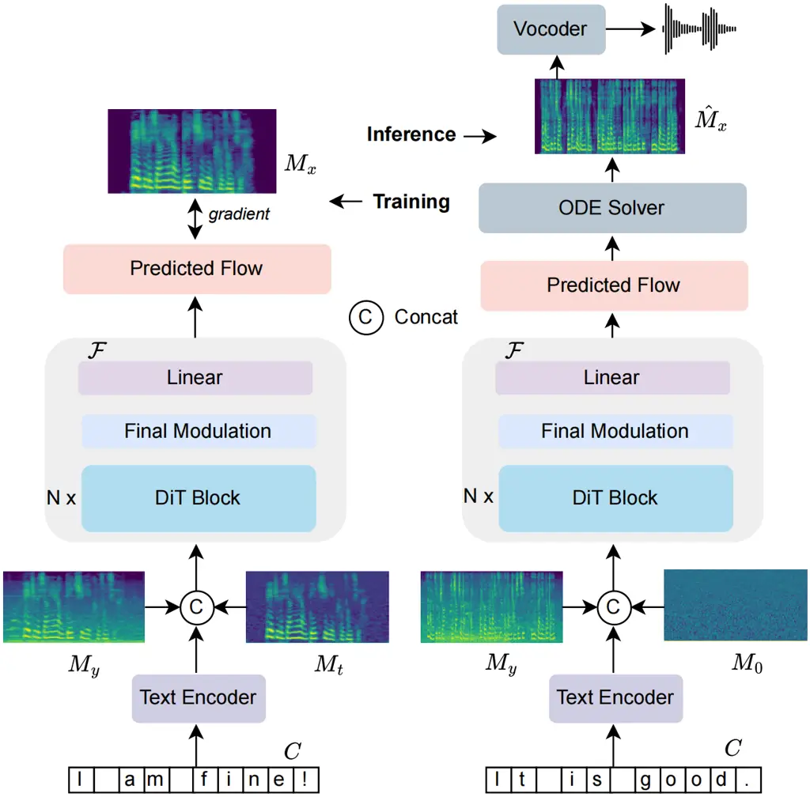

Wang Liu Zhu Zhu Liu Chen Xiao Weng Xie Northwestern Polytechnical
University, Xi’anChina Huawei TechnologiesChina

# FlowSE: Efficient and High-Quality Speech Enhancement via Flow Matching

Ziqian    Zikai    Xinfa    Yike    Mingshuai    Jun    Longshuai   
Chao    Lei Affiliation: Audio, Speech and Language Processing Group
(ASLP@NPU), School of Software Affiliation: 

###### Abstract

Generative models have excelled in audio tasks using approaches such as
language models, diffusion, and flow matching. However, existing
generative approaches for speech enhancement (SE) face notable
challenges: language model-based methods suffer from quantization loss,
leading to compromised speaker similarity and intelligibility, while
diffusion models require complex training and high inference latency. To
address these challenges, we propose FlowSE, a flow-matching-based model
for SE. Flow matching learns a continuous transformation between noisy
and clean speech distributions in a single pass, significantly reducing
inference latency while maintaining high-quality reconstruction.
Specifically, FlowSE trains on noisy mel spectrograms and optional
character sequences, optimizing a condition flow matching loss with
ground-truth mel spectrograms as supervision. It implicitly learns
speech’s temporal-spectral structure and text-speech alignment. During
inference, FlowSE can operate with or without textual information,
achieving impressive results in both scenarios, with further
improvements when transcripts are available. Extensive experiments
demonstrate that FlowSE significantly outperforms state-of-the-art
generative methods, establishing a new paradigm for generative-based SE
and demonstrating the potential of flow matching to advance the field.
Our code, pre-trained checkpoints, and audio samples are available at
[https://github.com/Honee-W/FlowSE/](https://github.com/Honee-W/FlowSE/).

###### keywords

flow matching, generative models, speech enhancement

^(†)^(†)email: zq_wang@mail.nwpu.edu.cn,
liuzikai@mail.nwpu.edu.cn²²footnotetext: Equal
contribution. ¹¹footnotemark: 1 Corresponding author.

## 1 Introduction

Speech enhancement (SE) aims to recover clean speech from noisy signals,
playing a vital role in applications such as telecommunications, hearing
aids, and speech recognition front ends. While traditional deterministic
methods can attenuate noise, they often struggle to preserve speech
naturalness under challenging conditions. Recent advances in generative
modeling offer powerful alternatives for high-fidelity SE.

Generative SE methods have primarily pursued two directions. One
direction leverages language model (LM) frameworks \[1, 2\], which use
discrete representations obtained via quantization to generate clean
speech. While these methods can be effective, the quantization process
often leads to information loss \[3, 4, 5\], resulting in artifacts that
compromise speaker similarity and intelligibility. The other direction
employs diffusion models \[6, 7, 8\], which iteratively refine noisy
inputs through a stochastic denoising process. Despite impressive
performance, diffusion-based approaches are computationally intensive
and exhibit high latency, limiting their real-time applicability.

Concurrently, *flow matching* \[9\] has emerged as an efficient one-shot
generative paradigm, learning a continuous velocity field that
transports simple noise distributions to complex data distributions.
Flow matching has powered state-of-the-art results in speech
synthesis \[10, 11, 12\], speech enhancement \[13, 14\], and sound
separation \[15\], demonstrating its ability to combine high fidelity
with fast sampling.

Motivated by these advances, we propose FlowSE, among the first SE
frameworks to employ rectified flow matching with a latent Diffusion
Transformer (DiT) backbone. Unlike prior models that relied on U-Net or
VAE architectures, FlowSE’s DiT network better captures long-range
dependencies across time and frequency, enhancing the reconstruction of
complex speech patterns.FlowSE learns a single-pass mapping from noisy
to clean mel spectrograms, avoiding LM quantization and diffusion’s
iterative complexity. FlowSE trains on noisy mel spectrograms and
optional transcript sequences, optimizing a condition flow matching loss
with ground-truth mel spectrograms as supervision. It implicitly learns
speech’s temporal-spectral structure and text-speech alignment. During
inference, FlowSE can operate with or without textual information,
achieving impressive results in both scenarios, with further
improvements when transcripts are available.

In summary, we introduce FlowSE, a rectified flow matching framework
with a DiT backbone for efficient, high-fidelity SE that preserves
speaker identity. Extensive experiments demonstrate that FlowSE
significantly improves speech quality, intelligibility, and speaker
similarity while reducing inference latency compared to existing
generative SE methods.

## 2 Related Work

### 2.1 Generative-Based Speech Enhancement

Generative approaches have recently become a prominent focus in speech
enhancement (SE), effectively restoring clean speech signals from noisy
inputs. Traditional deep learning-based SE methods, such as
convolutional neural networks (CNNs) and recurrent neural networks
(RNNs), primarily focus on deterministic speech reconstruction \[16, 17,
18\]. In contrast, generative models learn the underlying distribution
of clean speech, enabling superior generalization to unseen noise
conditions.

Early explorations of generative SE primarily centered on Variational
Autoencoders (VAEs) and Generative Adversarial Networks (GANs) \[19,
20\]. VAEs demonstrate the potential of latent modeling but often
struggle to produce sharp and high-fidelity outputs, leading to
over-smoothed speech. GANs, on the other hand, improve perceptual
quality by leveraging adversarial training but suffer from training
instability and mode collapse, making them challenging to optimize for
SE tasks.

Building on these early efforts, more recent work has explored LM
approaches \[1, 2\]. These methods encode speech into discrete tokens
using a codec model and then apply an LM to predict clean speech from
noisy inputs. While this approach effectively leverages powerful
language models for speech restoration, it introduces a fundamental
limitation: the quantization process results in information loss,
leading to artifacts that degrade speaker similarity and
intelligibility.

Another prominent generative SE framework is based on diffusion
models \[8, 21\]. These models iteratively refine speech signals through
a stochastic denoising process, progressively reconstructing clean
speech from noisy inputs. While diffusion-based SE methods achieve
state-of-the-art performance under extreme noise conditions, their high
computational cost and slow inference speed pose challenges for
real-time deployment.

### 2.2 Flow Matching for Generative Modeling

Flow matching, first introduced by Meta \[9\], is a versatile generative
modeling framework that learns continuous-time probability flows to
transform a simple noise distribution into a complex target
distribution. Unlike diffusion models—which rely on iterative stochastic
denoising—flow matching directly learns a deterministic, time-dependent
velocity field, enabling a smooth and efficient one-shot transformation
from noise to data.

This paradigm has been successfully applied in speech generation tasks.
In text-to-speech (TTS). MATCHA-TTS \[10\] uses a flow-matching model
conditioned by an input text. E2-TTS \[11\] introduces a
flow-matching-based approach for end-to-end TTS, demonstrating simple
and efficient speech synthesis. F5-TTS \[12\] further optimizes the
process by incorporating a text encoder to refine the text
representations and inference-time sway sampling strategy, improving
performance and efficiency. Flow matching has also been explored for
speech enhancement and separation. Nugraha et al. proposed GF-VAE,
combining Glow flows with VAEs for spectrogram modeling and
semi-supervised enhancement \[13\]. Jung et al. introduced FlowAVSE,
which conditions flow matching on both audio and visual cues via a U-Net
architecture to perform single-step audiovisual enhancement \[14\]. More
recently, Yuan et al. presented FlowSep, using rectified flow matching
in a VAE latent space for language-conditioned audio source
separation \[15\].

While these models demonstrate the promise of flow-based approaches,
they typically rely on U-Net or VAE backbones and, in some cases, visual
inputs or latent space mappings. An audio-only, transformer-based
framework that captures long-range dependencies and supports optional
text conditioning remains unexplored.

## 3 Proposed Approach

### 3.1 Overall Framework

Speech enhancement (SE) aims to recover clean speech
$`x\in\mathbb{R}^{T}`$ from its noisy observation
$`y\in\mathbb{R}^{T}`$, a task that requires effective modeling of both
acoustic signals and any available auxiliary information. To address
this challenge, we propose FlowSE, a novel approach that integrates a
flow-matching framework to achieve efficient and high-quality speech
reconstruction.

As illustrated in Figure 1, FlowSE comprises three key components.
First, the text encoder $`\mathcal{T}`$ processes textual inputs to
generate representations that align with the speech signal. Next, the
flow-matching generative module $`\mathcal{F}`$ learns a continuous
transformation mapping the noisy speech distribution to the clean one.
Finally, the vocoder $`\mathcal{V}`$ reconstructs the enhanced waveform
from these refined representations.



Figure 1: Overview of FlowSE. During training (left), the model takes a
noisy mel-spectrogram $`M_{y}`$, an interpolated mel-spectrogram
$`M_{t}`$ (a mixture of clean speech and Gaussian noise), and an
optional transcript $`C`$. The text is processed by a text encoder
$`\mathcal{T}`$ and concatenated with the audio embeddings. The
DiT-based flow model $`\mathcal{F}`$ predicts the probability flow,
which is trained via gradient updates to reconstruct the clean speech
mel-spectrogram $`M_{x}`$. During inference (right), the model takes as
input a noisy mel-spectrogram $`M_{y}`$, Gaussian noise $`M_{0}`$, and
optional transcript $`C`$. The predicted flow guides the ODE solver to
generate the enhanced mel-spectrogram $`\hat{M}_{x}`$, which is then
converted to waveforms using a vocoder.

### 3.2 Flow Matching for Speech Enhancement

Flow matching \[9\] is a generative framework that uses continuous
normalizing flows to map a source distribution $`p(y)`$ (e.g., noisy
speech) to a target distribution $`p(x)`$ (e.g., clean speech). Unlike
diffusion models, which require hundreds of iterative stochastic
denoising steps, flow matching learns a deterministic ordinary
differential equation(ODE) that considerably reduces the number of
required iterations. Although solving this ODE may still require several
evaluations, it typically involves far fewer steps (e.g., 10–20) than
the hundreds of iterations used in diffusion models, thereby enabling
near real-time inference.

Specifically, it parameterizes a velocity field $`v_{\theta}(z_{t},t)`$
to define a continuous transformation:

```math
\frac{dz_{t}}{dt}=v_{\theta}(z_{t},t),\quad z_{0}=y,\quad z_{1}=x, \tag{1}
```

where $`z_{0}`$ and $`z_{1}`$ denote the initial noisy speech and the
final clean speech, respectively. During inference, the learned velocity
field is integrated using an ODE solver:

```math
z_{t+\Delta t}=z_{t}+v_{\theta}(z_{t},t)\,\Delta t. \tag{2}
```

This approach reduces the need for stochastic sampling, enabling faster
inference suitable for real-time SE.

### 3.3 Network Architecture

FlowSE follows a three-stage processing pipeline: a mel-spectrogram
encoder $`\mathcal{E}`$, a Flow Matching model $`\mathcal{F}`$ based on
latent Diffusion Transformers (DiT) \[22\], and a vocoder
$`\mathcal{V}`$ for waveform reconstruction.

#### 3.3.1 Mel-Spectrogram Encoder

Unlike neural network-based encoders, FlowSE directly takes the
mel-spectrogram representation of the input noisy speech. Given a raw
waveform $`y\in\mathbb{R}^{T}`$, we first extract a mel-spectrogram
$`M_{y}\in\mathbb{R}^{F\times T^{\prime}}`$ using a standard short-time
Fourier transform (STFT) and mel-filterbank transformation:

```math
M_{y}=\mathcal{E}(y), \tag{3}
```

where $`F`$ denotes the number of mel-frequency bins, and $`T^{\prime}`$
is the number of frames. This representation serves as the input to the
Flow Matching module.

#### 3.3.2 Flow Matching with Latent Diffusion Transformers

To effectively model the transformation from noisy to clean speech, we
adopt a flow-matching framework based on latent Diffusion Transformers
(DiT) \[22\]. The DiT operates directly on the mel-spectrogram domain,
learning to parameterize the time-dependent velocity field
$`v_{\theta}(M_{t},t)`$, which guides the transformation process.

During training, the model receives three types of inputs: (1) a noisy
speech mel-spectrogram $`M_{y}`$, (2) an interpolated mel-spectrogram
$`M_{t}`$ obtained by linearly combining the clean target $`M_{x}`$ with
Gaussian noise, and (3) an optional text condition $`C`$ derived from
the transcript. The velocity model is trained to estimate the
probability flow that transports $`M_{t}`$ towards $`M_{x}`$ as time
$`t`$ progresses.

At inference, the model takes as input (1) the mel-spectrogram of the
noisy speech $`M_{y}`$, (2) a Gaussian noise initialization $`M_{0}`$,
and (3) an optional text condition. The learned velocity field
$`v_{\theta}`$ enables direct sampling using an ODE solver:

```math
M_{t+\Delta t}=M_{t}+v_{\theta}(M_{t},t,C)\Delta t. \tag{4}
```

To enhance generalization, textual supervision is incorporated by
conditioning the model on transcripts. To encourage implicit alignment
learning, text inputs are randomly dropped with a certain probability
during training, ensuring robustness in both text-conditioned and
text-free scenarios. When $`C`$ is provided, FlowSE employs a text
encoder $`\mathcal{T}`$ to leverage textual context to improve speech
quality, particularly under low signal-to-noise ratio (SNR) conditions.

Formally, given the intermediate mel-spectrogram state $`M_{t}`$ at time
$`t`$, the DiT-based velocity model learns the mapping:

```math
v_{\theta}(M_{t},t,C)=\mathcal{F}(M_{t},t,\mathcal{T}(C)). \tag{5}
```

#### 3.3.3 Vocoder for Waveform Reconstruction

The final stage of FlowSE utilizes a pre-trained neural vocoder to
reconstruct the waveform from the enhanced mel-spectrogram. We leverage
a high-fidelity vocoder such as Vocos \[23\] or BigVGAN \[24\], which
has demonstrated superior speech synthesis quality. The waveform
reconstruction is given by:

```math
\hat{x}=\mathcal{V}(M_{x}), \tag{6}
```

where $`M_{x}`$ is the enhanced mel-spectrogram predicted by the Flow
Matching model.

By decoupling the enhancement process from waveform synthesis, FlowSE
benefits from efficient training, as it operates directly in the
mel-spectrogram domain while leveraging powerful pre-trained vocoders
for waveform generation.

### 3.4 Training Objective

FlowSE is trained using a flow-matching loss to learn the optimal
velocity field for speech enhancement. Given a noisy-clean
mel-spectrogram pair $`(M_{y},M_{x})`$ sampled from the data
distribution $`p(M_{y},M_{x})`$, the objective is to model the
continuous transformation from the noisy input to the clean target.

We incorporate an $`\ell_{1}`$ loss on the mel-spectrograms to directly
minimize reconstruction error:

```math
\mathcal{L}_{\text{mel}}=\mathbb{E}_{(M_{y},M_{x})\sim p(M_{y},M_{x})}\left[\lVert M_{x}-\hat{M}_{x}\rVert_{1}\right], \tag{7}
```

where $`\hat{M}_{x}`$ is the predicted clean mel-spectrogram.

## 4 Experiments

### 4.1 Datasets & Evaluation Metrics

Training sets To comprehensively evaluate the effectiveness of FlowSE,
we construct a large-scale training dataset by combining multiple
publicly available speech and noise datasets. We utilize
WeNetSpeech \[25\], GigaSpeech \[26\], VoiceBank(VCTK) \[27\], and the
DNS Challenge - Interspeech 2021 datasets \[28\] to provide speech
recordings. We incorporate environmental and artificial noise from the
WHAM! \[29\], DEMAND \[30\] and the DNS Challenge - Interspeech 2021
datasets \[28\]. We use room impulse responses from the OpenSLR26 and
OpenSLR28 datasets \[31\]. Non-English and non-Chinese utterances are
filtered out. Transcriptions are obtained using OpenAI’s Whisper
model \[32\]^(\*)^(\*) \*
[https://huggingface.co/openai/whisper-large-v3-turbo](https://huggingface.co/openai/whisper-large-v3-turbo).

Test sets For evaluation, we employ the publicly available DNS
Challenge - Interspeech 2021 test set to compare FlowSE against
state-of-the-art models. Additionally, we create a simulated test set by
mixing clean speech from VCTK with unseen noise from WHAM! and DEMAND at
various signal-to-noise ratios (SNRs) ranging from -5 dB to 10 dB.

Evaluation Metrics It’s a known fact that standard metrics such as PESQ,
SI-SNR cannot accurately assess generative models due to a lack of
waveform alignment. Therefore, we adopt DNSMOS, a neural network-based
MOS estimator that closely correlates with human quality ratings. We use
WeSpeaker \[33\] to compute speaker cosine similarity, assessing speaker
identity preservation. Additionally, we employ OpenAI’s Whisper to
transcribe enhanced speech and measure the word error rate (WER), which
reflects intelligibility improvements. If necessary, generated speech is
resampled to match the evaluation requirements.

|                   |               |                     |       |       |                      |                     |       |       |                      |                     |       |       |
| ----------------- | ------------- | ------------------- | ----- | ----- | -------------------- | ------------------- | ----- | ----- | -------------------- | ------------------- | ----- | ----- |
| System            | Model Type    | With Reverb         |       |       |                      | Without Reverb      |       |       |                      | Real Recording      |       |       |
|                   |               | DNSMOS $`\uparrow`$ |       |       | Spk Sim $`\uparrow`$ | DNSMOS $`\uparrow`$ |       |       | Spk Sim $`\uparrow`$ | DNSMOS $`\uparrow`$ |       |       |
|                   |               | SIG                 | BAK   | OVRL  |                      | SIG                 | BAK   | OVRL  |                      | SIG                 | BAK   | OVRL  |
| Noisy             | –             | 1.760               | 1.497 | 1.392 | 0.941                | 3.392               | 2.618 | 2.483 | 0.969                | 3.053               | 2.510 | 2.255 |
| TF-GridNet \[34\] | Regression    | 3.101               | 2.900 | 2.805 | 0.815                | 3.550               | 3.012 | 3.315 | 0.840                | 3.311               | 3.106 | 3.140 |
| CDiffuSE \[6\]    | Diffusion     | 2.541               | 2.300 | 2.190 | 0.741                | 3.294               | 3.641 | 3.047 | 0.765                | 3.201               | 3.104 | 2.781 |
| SGMSE \[7\]       | Diffusion     | 2.730               | 2.741 | 2.430 | 0.764                | 3.501               | 3.710 | 3.137 | 0.782                | 3.297               | 2.894 | 2.793 |
| StoRM \[8\]       | Diffusion     | 2.947               | 3.141 | 2.516 | 0.790                | 3.514               | 3.941 | 3.205 | 0.798                | 3.410               | 3.379 | 2.940 |
| SELM \[1\]        | LM            | 3.160               | 3.577 | 2.695 | 0.793                | 3.508               | 4.096 | 3.258 | 0.810                | 3.591               | 3.435 | 3.124 |
| MaskSR \[2\]      | LM            | 3.531               | 4.065 | 3.253 | 0.827                | 3.586               | 4.116 | 3.339 | 0.929                | 3.430               | 4.025 | 3.136 |
| FlowSE-w/ text    | Flow Matching | 3.614               | 4.110 | 3.340 | 0.809                | 3.690               | 4.200 | 3.451 | 0.940                | 3.643               | 4.100 | 3.271 |
| FlowSE-w/o text   | Flow Matching | 3.601               | 4.102 | 3.331 | 0.801                | 3.685               | 4.201 | 3.445 | 0.934                | 3.635               | 4.080 | 3.263 |

Table 1: Comparison of different systems on the DNS Challenge test set.

### 4.2 Training Setup

We use 100-dimensional log mel-filterbank features extracted from 24 kHz
audio with a hop length of 256 as input representation. We adopt a
latent Diffusion Transformer (DiT) \[22\] as our velocity field
estimator. The model consists of N = 22 layers, 16 attention heads, a
hidden dimension of 1024, and a feed-forward network (FFN) dimension of 2048. We utilize ConvNeXt V2 \[35\] as the text encoder, with an
embedding dimension of 512 and an FFN dimension of 1024. It is trained
to process character sequences extracted from transcriptions. A
pre-trained Vocos vocoder \[23\] is used to synthesize waveforms. We use
the AdamW optimizer with a peak learning rate of $`7.5\times 10^{-5}`$,
which is linearly warmed up over 20K steps and then linearly decayed. A
dropout rate of 0.1 is applied to attention layers and FFN layers. The
gradient norm is clipped to a maximum value of 1 to stabilize training.
The model is trained on 8 NVIDIA 4090D GPUs for 1.2 million updates.

### 4.3 Baselines

We compare FlowSE with state-of-the-art speech enhancement methods.
TF-GridNet \[34\] is a regression-based approach that integrates full-
and sub-band modeling in the time-frequency domain. CDiffuSE \[6\] is a
diffusion-based method operating in the time domain, while SGMSE \[7\]
adopts a score-based generative framework with a deep complex U-Net.
StoRM \[8\] also follows a diffusion-based strategy by incorporating a
stochastic regeneration scheme. In contrast, SELM \[1\] leverages a
self-supervised speech representation model combined with a language
model, and MaskSR \[2\] utilizes a masked language model for speech
enhancement.

We evaluate two variants of FlowSE: one that leverages transcription
information (FlowSE-w/ text) and another that operates without text
conditioning (FlowSE-w/o text). Official pre-trained models are used
when available; otherwise, models are trained following their original
settings. All systems employ the same Vocos vocoder to ensure a fair
comparison.

### 4.4 Experimental Results

Table 1 summarizes the performance of various systems on the DNS
Challenge test set under three conditions: _With Reverb_, _Without
Reverb_, and _Real Recordings_. DNSMOS is used as a reference-free
measure of perceptual quality, while speaker similarity (Spk Sim)
evaluates how well the enhanced speech preserves the original speaker’s
characteristics. In addition, Table 2 reports the real-time factor (RTF)
and word error rate (WER) on a simulated test set, providing insights
into computational efficiency and intelligibility.

|                 |               |                    |                    |
| --------------- | ------------- | ------------------ | ------------------ |
| System          | Model Type    | WER $`\downarrow`$ | RTF $`\downarrow`$ |
| Noisy           | -             | 28.10              | -                  |
| CDiffuSE \[6\]  | Diffusion     | 15.31              | 3.30               |
| SGMSE \[7\]     | Diffusion     | 13.97              | 3.27               |
| StoRM \[8\]     | Diffusion     | 14.00              | 3.49               |
| FlowSE-w/ text  | Flow Matching | 8.79               | 0.31               |
| FlowSE-w/o text | Flow Matching | 8.81               | 0.31               |

Table 2: Comparison of different systems on the simulated test set.
Real-Time Factor (RTF) is measured on a single NVIDIA 4090D.

The baseline models, including the regression-based TF-GridNet,
diffusion-based methods (CDiffuSE, SGMSE, StoRM) and LM-based approaches
(SELM, MaskSR), show moderate improvements over the noisy baseline but
still exhibit trade-offs between quality and speaker preservation. In
particular, diffusion-based methods, despite competitive DNSMOS scores,
suffer from lower speaker similarity.

In contrast, both variants of our proposed FlowSE deliver significant
and consistent improvements across all test conditions. FlowSE with text
conditioning (FlowSE-w/ text) achieves the highest DNSMOS scores,
reaching up to 3.643 on _Real Recordings_, and the best speaker
similarity of 0.940. The text-free variant (FlowSE-w/o text) also
performs competitively, demonstrating that our approach robustly
enhances speech quality even in the absence of auxiliary transcription
information. These results highlight FlowSE’s ability to generate
high-fidelity speech that not only sounds natural but also retains the
speaker’s unique characteristics.

Furthermore, Table 2 reveals a remarkable advantage of FlowSE in terms
of computational efficiency. Diffusion-based methods exhibit high
real-time factors (RTF above 3.0), reflecting the heavy computational
load of their iterative denoising processes. In contrast, FlowSE
achieves an RTF of 0.31—more than 10 times faster—while also
significantly reducing the word error rate (WER) to approximately 8.8%.
The low WER indicates that FlowSE produces enhanced speech that is
clearer and more intelligible, which is critical for downstream
applications such as automatic speech recognition.

## 5 Conclusion

In this work, we introduce FlowSE, a novel speech enhancement model
based on flow matching, which addresses the limitations of diffusion
models’ high complexity and slow inference, as well as the quantization
loss in language-model-based approaches. FlowSE efficiently reconstructs
high-quality speech while preserving speaker characteristics, achieving
state-of-the-art performance. Our results highlight the potential of
flow matching as a powerful alternative to existing generative methods
for speech enhancement. We hope this work inspires further advancements
in generative approaches for speech enhancement and restoration.

## References

- \[1\] Z. Wang, X. Zhu, Z. Zhang, Y. Lv, N. Jiang, G. Zhao, and L. Xie,
  “Selm: Speech enhancement using discrete tokens and language models,”
  in _ICASSP 2024-2024 IEEE International Conference on Acoustics,
  Speech and Signal Processing (ICASSP)_. IEEE, 2024, pp. 11 561–11 565.
- \[2\] X. Li, Q. Wang, and X. Liu, “Masksr: Masked language model for
  full-band speech restoration,” _arXiv preprint
  arXiv:2406.02092_, 2024.
- \[3\] A. Van Den Oord, O. Vinyals _et al._, “Neural discrete
  representation learning,” _Advances in neural information processing
  systems_, vol. 30, 2017.
- \[4\] N. Zeghidour, A. Luebs, A. Omran, J. Skoglund, and
  M. Tagliasacchi, “Soundstream: An end-to-end neural audio codec,”
  _IEEE/ACM Transactions on Audio, Speech, and Language Processing_,
  vol. 30, pp. 495–507, 2021.
- \[5\] A. Défossez, J. Copet, G. Synnaeve, and Y. Adi, “High fidelity
  neural audio compression,” _arXiv preprint arXiv:2210.13438_, 2022.
- \[6\] Y.-J. Lu, Z.-Q. Wang, S. Watanabe, A. Richard, C. Yu, and
  Y. Tsao, “Conditional diffusion probabilistic model for speech
  enhancement,” in _Proc. ICASSP_. IEEE, 2022, pp. 7402–7406.
- \[7\] S. Welker, J. Richter, and T. Gerkmann, “Speech enhancement with
  score-based generative models in the complex stft domain,” _arXiv
  preprint arXiv:2203.17004_, 2022.
- \[8\] J.-M. Lemercier, J. Richter, S. Welker, and T. Gerkmann, “Storm:
  A diffusion-based stochastic regeneration model for speech enhancement
  and dereverberation,” _IEEE/ACM Transactions on Audio, Speech, and
  Language Processing_, vol. 31, pp. 2724–2737, 2023.
- \[9\] Y. Lipman, R. T. Q. Chen, H. Ben-Hamu, M. Nickel, and M. Le,
  “Flow matching for generative modeling,” in _The Eleventh
  International Conference on Learning Representations_, 2023.
  \[Online\]. Available:
  [https://openreview.net/forum?id=PqvMRDCJT9t](https://openreview.net/forum?id=PqvMRDCJT9t)
- \[10\] S. Mehta, R. Tu, J. Beskow, É. Székely, and G. E. Henter,
  “Matcha-tts: A fast tts architecture with conditional flow matching,”
  in _ICASSP 2024-2024 IEEE International Conference on Acoustics,
  Speech and Signal Processing (ICASSP)_. IEEE, 2024, pp. 11 341–11 345.
- \[11\] S. E. Eskimez, X. Wang, M. Thakker, C. Li, C.-H. Tsai, Z. Xiao,
  H. Yang, Z. Zhu, M. Tang, X. Tan _et al._, “E2 tts: Embarrassingly
  easy fully non-autoregressive zero-shot tts,” in _2024 IEEE Spoken
  Language Technology Workshop (SLT)_. IEEE, 2024, pp. 682–689.
- \[12\] Y. Chen, Z. Niu, Z. Ma, K. Deng, C. Wang, J. Zhao, K. Yu, and
  X. Chen, “F5-tts: A fairytaler that fakes fluent and faithful speech
  with flow matching,” _arXiv preprint arXiv:2410.06885_, 2024.
- \[13\] A. A. Nugraha, K. Sekiguchi, and K. Yoshii, “A flow-based deep
  latent variable model for speech spectrogram modeling and
  enhancement,” _IEEE/ACM Transactions on Audio, Speech, and Language
  Processing_, vol. 28, pp. 1104–1117, 2020.
- \[14\] C. Jung, S. Lee, J.-H. Kim, and J. S. Chung, “Flowavse:
  Efficient audio-visual speech enhancement with conditional flow
  matching,” _arXiv preprint arXiv:2406.09286_, 2024.
- \[15\] Y. Yuan, X. Liu, H. Liu, M. D. Plumbley, and W. Wang, “Flowsep:
  Language-queried sound separation with rectified flow matching,” in
  _ICASSP 2025-2025 IEEE International Conference on Acoustics, Speech
  and Signal Processing (ICASSP)_. IEEE, 2025, pp. 1–5.
- \[16\] Y. Luo and N. Mesgarani, “Conv-tasnet: Surpassing ideal
  time–frequency magnitude masking for speech separation,” _IEEE/ACM
  transactions on audio, speech, and language processing_, vol. 27,
  no. 8, pp. 1256–1266, 2019.
- \[17\] A. Defossez, G. Synnaeve, and Y. Adi, “Real time speech
  enhancement in the waveform domain,” _arXiv preprint
  arXiv:2006.12847_, 2020.
- \[18\] Y. Hu, Y. Liu, S. Lv, M. Xing, S. Zhang, Y. Fu, J. Wu,
  B. Zhang, and L. Xie, “Dccrn: Deep complex convolution recurrent
  network for phase-aware speech enhancement,” _arXiv preprint
  arXiv:2008.00264_, 2020.
- \[19\] G. Liu, K. Gong, X. Liang, and Z. Chen, “Cp-gan: Context
  pyramid generative adversarial network for speech enhancement,” in
  _ICASSP 2020-2020 IEEE International Conference on Acoustics, Speech
  and Signal Processing (ICASSP)_. IEEE, 2020, pp. 6624–6628.
- \[20\] H. Y. Kim, J. W. Yoon, S. J. Cheon, W. H. Kang, and N. S. Kim,
  “A multi-resolution approach to gan-based speech enhancement,”
  _Applied Sciences_, vol. 11, no. 2, p. 721, 2021.
- \[21\] J. Richter, S. Welker, J.-M. Lemercier, B. Lay, and
  T. Gerkmann, “Speech enhancement and dereverberation with
  diffusion-based generative models,” _IEEE/ACM Transactions on Audio,
  Speech, and Language Processing_, vol. 31, pp. 2351–2364, 2023.
- \[22\] W. Peebles and S. Xie, “Scalable diffusion models with
  transformers,” in _Proceedings of the IEEE/CVF International
  Conference on Computer Vision_, 2023, pp. 4195–4205.
- \[23\] H. Siuzdak, “Vocos: Closing the gap between time-domain and
  fourier-based neural vocoders for high-quality audio synthesis,”
  _arXiv preprint arXiv:2306.00814_, 2023.
- \[24\] S.-g. Lee, W. Ping, B. Ginsburg, B. Catanzaro, and S. Yoon,
  “Bigvgan: A universal neural vocoder with large-scale training,”
  _arXiv preprint arXiv:2206.04658_, 2022.
- \[25\] Z. Yao _et al._, “Wenet: Production oriented streaming and
  non-streaming end-to-end speech recognition toolkit,” in _Proc.
  Interspeech_. ISCA, 2021, pp. 4054–4058.
- \[26\] G. Chen _et al._, “GigaSpeech: An Evolving, Multi-Domain ASR
  Corpus with 10,000 Hours of Transcribed Audio,” in _Proc.
  Interspeech_, 2021, pp. 3670–3674.
- \[27\] C. Veaux, J. Yamagishi, and S. King, “The voice bank corpus:
  Design, collection and data analysis of a large regional accent speech
  database,” 11 2013, pp. 1–4.
- \[28\] C. K. Reddy _et al._, “The INTERSPEECH 2020 Deep Noise
  Suppression Challenge: Datasets, Subjective Testing Framework, and
  Challenge Results,” in _Proc. Interspeech_, 2020, pp. 2492–2496.
- \[29\] G. Wichern, J. Antognini, M. Flynn, L. R. Zhu, E. McQuinn,
  D. Crow, E. Manilow, and J. L. Roux, “Wham!: Extending speech
  separation to noisy environments,” _arXiv preprint
  arXiv:1907.01160_, 2019.
- \[30\] J. Thiemann, N. Ito, and E. Vincent, “The diverse environments
  multi-channel acoustic noise database (demand): A database of
  multichannel environmental noise recordings,” in _Proceedings of
  Meetings on Acoustics_, vol. 19, no. 1. AIP Publishing, 2013.
- \[31\] T. Ko, V. Peddinti, D. Povey, M. L. Seltzer, and S. Khudanpur,
  “A study on data augmentation of reverberant speech for robust speech
  recognition,” in _Proc. ICASSP_. IEEE, 2017, pp. 5220–5224.
- \[32\] A. Radford, J. W. Kim, T. Xu, G. Brockman, C. McLeavey, and
  I. Sutskever, “Robust speech recognition via large-scale weak
  supervision,” 2022. \[Online\]. Available:
  [https://arxiv.org/abs/2212.04356](https://arxiv.org/abs/2212.04356)
- \[33\] H. Wang, C. Liang, S. Wang, Z. Chen, B. Zhang, X. Xiang,
  Y. Deng, and Y. Qian, “Wespeaker: A research and production oriented
  speaker embedding learning toolkit,” in _IEEE International Conference
  on Acoustics, Speech and Signal Processing (ICASSP)_. IEEE, 2023, pp.
  1–5.
- \[34\] Z.-Q. Wang, S. Cornell, S. Choi, Y. Lee, B.-Y. Kim, and
  S. Watanabe, “Tf-gridnet: Integrating full-and sub-band modeling for
  speech separation,” _IEEE/ACM Transactions on Audio, Speech, and
  Language Processing_, 2023.
- \[35\] S. Woo, S. Debnath, R. Hu, X. Chen, Z. Liu, I. S. Kweon, and
  S. Xie, “Convnext v2: Co-designing and scaling convnets with masked
  autoencoders,” in _Proceedings of the IEEE/CVF Conference on Computer
  Vision and Pattern Recognition_, 2023, pp. 16 133–16 142.
