# Training-Free Multi-Step Audio Source Separation

Yongyi Zang Affiliation: Independent Researcher Affiliation: Seattle,
WA, USA Email: [zyy0116@gmail.com](mailto:)    Jingyi Li
Affiliation: University of Illinois Urbana-Champaign
Affiliation: Champaign, IL, USA Email: [jingyi49@illinois.edu](mailto:)
   Qiuqiang Kong ^(†)^(†)thanks: Corresponding author. Affiliation: The
Chinese University of Hong Kong Affiliation: Hong Kong ASR, China
Email: [qqkong@ee.cuhk.edu.hk](mailto:)

###### Abstract

Audio source separation aims to separate a mixture into target sources.
Previous audio source separation systems usually conduct one-step
inference, which does not fully explore the separation ability of
models. In this work, we reveal that pretrained one-step audio source
separation models can be leveraged for multi-step separation without
additional training. We propose a simple yet effective inference method
that iteratively applies separation by optimally blending the input
mixture with the previous step’s separation result. At each step, we
determine the optimal blending ratio by maximizing a metric. We prove
that our method always yield improvement over one-step inference,
provide error bounds based on model smoothness and metric robustness,
and provide theoretical analysis connecting our method to denoising
along linear interpolation paths between noise and clean distributions—a
property we link to denoising diffusion bridge models. Our approach
effectively delivers improved separation performance as a "free lunch"
from existing models. Our empirical results demonstrate that our
multi-step separation approach consistently outperforms one-step
inference across both speech enhancement and music source separation
tasks, and can achieve scaling performance similar to training a larger
model, using more data, or in some cases employing a multi-step training
objective. These improvements appear not only on the optimization metric
during multi-step inference, but also extend to nearly all non-optimized
metrics (with one exception). We also discuss limitations of our
approach and directions for future research.

## 1 Introduction

> “In solving a problem, we often introduce auxiliary problems that were
> not part of the original statement but whose solution facilitates the
> solution of the original.”
>
> — Herbert Simon \[41\]

The remarkable progress in deep learning has been largely driven by
scaling model capacity and training data, yielding breakthroughs across
natural language processing, computer vision, and speech recognition.
While traditional improvements follow _scaling laws_ \[14\] focused on
training-time resources, recent work has explored a complementary
paradigm: _inference-time scaling_ \[26\]. This approach allocates
additional compute during inference to enhance model performance without
requiring larger architectures or expanded training datasets.

Inference-time scaling has proven particularly effective in domains with
inherent multi-step structures. Diffusion models \[11, 43\] and flow
matching \[21, 22\] exemplify this paradigm, achieving superior
performance through iterative refinement. However, these models require
specialized training procedures and substantial computational overhead.
This limitation motivates the development of _training-free_ methods
that enable models trained with one-step objectives to benefit from
multi-step inference. Recent successes include chain-of-thought
prompting \[51\] in language models and process reward-based reasoning
\[20, 24, 9\] for selecting optimal inference paths.

In this work, we introduce the first training-free inference-time
scaling method for audio source separation—the challenging task of
isolating target audio signals from complex mixtures containing
environmental noise, musical interference, or overlapping speech. Audio
source separation is fundamental to numerous applications including
hearing aids, music production, and speech recognition systems. While
existing approaches train models to directly map noisy inputs to clean
outputs in a single step, we demonstrate that these models possess
latent capabilities for iterative refinement that can be unlocked
without additional training.

Our key insight stems from the observation that standard training
procedures for audio separation models—which synthesize noisy mixture
through clean signals mixed with random interference signals at varying
levels—inadvertently create models capable of operating across diverse
noise conditions. We exploit this property through a novel inference
strategy: at each step, we generate multiple candidate solutions by
remixing the current output with the original noisy input at different
ratios. These candidates are processed through the model and ranked
using task-specific quality metrics, with the best output selected for
the next iteration. Through this simple approach, we effectively
transform one-step models into multi-step systems, achieving performance
gains without architectural modifications or retraining.

We make the following contributions:

- •
  We propose the first training-free inference-time scaling method for
  audio source separation, demonstrating consistent improvements across
  diverse separation tasks.
- •
  We provide theoretical analysis establishing performance bounds of our
  method based on network smoothness characterized by their Lipschitz
  constants and metric robustness (Section 3), and connecting our
  surprisingly simple approach to the training process of diffusion
  denoising bridge models (Section 5), providing justification for its
  effectiveness.
- •
  We empirically validate our method across two audio separation
  subdomains: speech enhancement (Section 4.1) and music source
  separation (Section 4.2).
- •
  We open-source our implementation under the Apache 2.0 license at
  [https://github.com/yongyizang/TrainingFreeMultiStepASR](https://github.com/yongyizang/TrainingFreeMultiStepASR),
  enabling reproducibility and further research.

Our results demonstrate that inference-time scaling represents a
powerful yet underexplored paradigm for audio processing, offering
immediate performance gains for existing models while providing insights
for future architectural designs.

## 2 Related works

Audio Source Separation. Modern audio source separation has been
dominated by deep learning approaches operating in either time-domain or
time-frequency domains. U-Net architectures remain influential, from
Wave-U-Net’s pioneering direct waveform processing \[44\] to recent
variants like ResUNet \[17\] achieving 8.98 dB signal-to-distortion
ratio (SDR) on vocals, and DTTNet \[3\] reaching 10.12 dB cSDR with
86.7% fewer parameters. Transformer architectures have emerged for
modeling long-range dependencies, with SepFormer \[45\] setting
state-of-art performance on multiple audio separation benchmarks
citehershey2016deep, and BS-RoFormer \[23\] winning SDX23 \[7\] with
9.80 dB average SDR. Band-specific processing strategies, exemplified by
Band-Split RNN \[52\], have shown significant gains by explicitly
modeling frequency-dependent characteristics. While these one-step
models offer computational efficiency, they typically trade separation
quality for speed, and show limitations as scaling model parameters
become ineffective due to lack of real-world data \[15, 55\].

Multi-Step Audio Source Separation. Multi-step approaches consistently
demonstrate superior separation quality, albeit at higher computational
costs. Diffusion models have established new performance benchmarks,
with Multi-Source Diffusion Models \[29\], DiffSep \[40\], DOSE \[46\]
and SGMSE \[37\] achieving state-of-the-art results but requiring 50-200
inference steps. Flow matching techniques like FlowSep \[53\] offer
efficiency gains, achieving comparable quality with only 10-20 steps.
While multi-step methods typically achieve better performance, they
require 10-100 times more computation during inference. Recent work has
focused on reducing step counts through techniques like progressive
distillation and adversarial conditional diffusion distillation \[13\],
yet these approaches still require specialized multi-step training
procedures.

Training-Free Multi-Step Inference. While multi-step models require
specific training procedures, recent advances in training-free inference
offer promising alternatives. In natural language processing,
Chain-of-Thought \[51\] and Self-Consistency \[49\] approaches have
shown that models can benefit from structured multi-step reasoning
without specialized training. Audio-specific training-free approaches
include zero-shot separation through query-based learning \[4\] and
unsupervised separation by repurposing pretrained models \[28\]. Recent
work on test-time scaling \[31, 42\] demonstrates that performance can
improve with increased inference-time computation, though these concepts
have not been systematically explored for audio source separation.
Process Reward Models \[57\] offer mechanisms for evaluating
intermediate steps, but their application to audio remains unexplored.
Our work bridges this gap by introducing a training-free multi-step
inference method specifically designed for audio source separation,
leveraging the inherent properties of models trained with data
augmentation to achieve multi-step improvements without retraining.

## 3 Method

We propose a simple refinement mechanism shown in Algorithm 1 that
improves separation quality through iterative processing. We denote a
pretrained separation model as $`f(\cdot)`$. We denote the noisy mixture
as $`x_{0}\in\mathbb{R}^{L}`$, where $`L`$ is the number of audio
samples. we start from an initial separation $`y_{0}=f(x_{0})`$ and
perform the separation for $`T`$ refinement steps. We propose to improve
the separation quality of $`y_{0}`$ by using a multi-step update
strategy as follows.

At each step $`t`$ ranging from 1 to $`T`$, we create a new input
mixture $`x_{t}`$ by:

```math
x_{t}=r_{t}x_{0}+(1-r_{t})y_{t-1}, \tag{1}
```

where $`x_{0}`$ is the original input mixture, $`y_{t-1}`$ is the
separation result at the $`(t-1)`$-th step, and $`r_{t}\in[0,1]`$ is a
variable to be optimzed. Equation (1) shows that the new input mixture
$`x_{t}`$ is the blending between the input mixture $`x_{0}`$ and the
separated source $`y_{t-1}`$.

Directly optimizing $`r_{t}`$ is a challenging problem. To address this
problem, We linearly sample evenly spaced $`K`$ values between 0 and 1
and denote them as $`r_{t}^{(k)}`$. We denote $`x_{t}^{(k)}`$
corresponds to $`r_{t}^{(k)}`$ calculated by (1). Then, we search for
the optimal $`r_{t}^{*}`$ that optimize a metric:

```math
r_{t}^{*}=\arg\max_{k\in\{1,\ldots,K\}}R(f(x_{t}^{(k)})). \tag{2}
```

We define $`R`$ as a metric to evaluate the separation quality, such as
SI-SNR and DNSMOS \[35\]. A larger metric indicates better separation
quality. By this means, we search the optimal $`r^{*}`$ to constitute
$`x_{t}^{*}`$. The optimal separation result is calculated by
$`y_{t}=f(x_{t}^{*})`$.

Input: Mixture signal $`x_{0}`$, separation model $`f`$, total steps
$`T`$, number of ratios $`K`$

Output: Final separated signal $`y_{T}`$

$`y_{0}\leftarrow f(x_{0})`$;

for _$`t\leftarrow 1`$ to $`T`$_ do

   Sample $`K`$ ratios evenly in $`[0,1]`$ and denote them by
$`r^{(k)}`$;

   Constitute $`K`$ inputs
$`x_{t}^{(k)}=r_{t}^{(k)}x_{0}+(1-r_{t}^{(k)})y_{t-1}`$;

   Search the optimal $`r_{t}^{*}`$ by (2) and constitute $`x_{t}^{*}`$
by (1);

   Calculate $`y_{t}=f(x_{t}^{*})`$;

return $`y_{T}`$

Algorithm 1 Multi-step Inference for One-step Audio Separation Models

Then, we repeat updating $`r_{t}^{*}`$, $`x_{t}^{*}`$, and $`y_{t}`$ for
$`T`$ steps to calculate the final step $`y_{T}`$ as the separation
result. As proven in Section 3.1, the separation quality $`R(y_{t})`$ is
non-decreasing with respect to the initial quality $`R(y_{0})`$ when the
optimal $`r_{t}^{*}`$ is chosen. As we prove in Section 3.2, if the
estimated ratio $`r_{t}`$ deviates from the optimal ratio with a small
value, the upper bound deviation of metric $`R(y_{t})`$ is predictable.

### 3.1 Non-Decreasing Property of the Separation Metric

We first show that the multi-step separation increases the lower bound
of the one-step separation as follows.

###### Theorem 1 (Lower Bound of Metrics)

There always exists an optimal $`x_{t}^{*}`$ such that
$`R(y_{t})\geq R(y_{0})`$.

###### Proof 1

for all $`t\in\{1,\ldots,T\}`$,

```math
\displaystyle R\left(y_{t}\right) \displaystyle=R\left[f\left(x_{t}^{*}\right)\right] \tag{3}
```

```math
\displaystyle=R\left[f(r_{t}^{*}x_{0}+(1-r_{t}^{*})y_{t-1})\right] \tag{4}
```

```math
\displaystyle\geq R\left[f\left(1\cdot x_{0}+0\cdot y_{t-1}\right)\right]=R\left[f(x_{0})\right]=R\left[y_{0}\right]. \tag{5}
```

Proof 1 shows that $`R(y_{t})\geq R(y_{0})`$, indicating the multi-step
separation increases the lower bound of one-step separation.

### 3.2 Error Bound Analysis

We now analyze the error when the estimated ratio $`r_{t}`$ deviates
from the optimal ratio. We will show $`\textit{Var}(R(y_{t}))`$ is lower
than a bound. We first introduce Lipschitz bound on derivative.

###### Lemma 1 (Lipschitz Bound on Derivative)

If $`f`$ satisfies the Lipschitz condition
$`|f(x_{1})-f(x_{2})|\leq L|x_{1}-x_{2}|`$, then:

```math
|f^{\prime}(x)|\leq L\hskip 10.00002pt\text{for all }x\text{ where }f\text{ is differentiable}. \tag{6}
```

Then, we assume the separation model $`f(\cdot)`$ and the evaluation
metric $`R(\cdot)`$ satisfy the following assumption.

###### Assumption 1

The separation model $`f(\cdot)`$ is locally differentiable and
Lipschitz continuous with constant $`L_{f}`$. The metric $`R(\cdot)`$ is
locally differentiable and Lipschitz continuous with constant $`L_{r}`$.
As in practice the separation model are often neural networks and common
metrics are either continous ratios (SNR, SI-SDR, etc.) or neural
networks (UTMOS, DNSMOS, etc.), we assume both are likely true in
reality.

At each step $`t`$, following our algorithm notation, we have:

```math
x_{t}=r_{t}x_{0}+(1-r_{t})y_{t-1}. \tag{7}
```

Due to the imperfect metric, the selected ratio $`r_{t}`$ may differ
from the optimal ratio $`r_{t}^{*}`$. We model this uncertainty by
assuming a gaussian distribution centered around $`r_{t}^{*}`$:

```math
r_{t}\sim\mathcal{N}(r_{t}^{*},\varepsilon_{r}^{2}). \tag{8}
```

Using the properties of normal distributions, we obtain:

```math
x_{t}\sim\mathcal{N}(r_{t}^{*}x_{0}+(1-r_{t}^{*})y_{t-1},(x_{0}-y_{t-1})^{2}\varepsilon_{r}^{2}), \tag{9}
```

where $`\textit{Var}(x_{t})=(x_{0}-y_{t-1})^{2}\varepsilon_{r}^{2}`$ has
a dimension of number of audio samples.

###### Theorem 2 (Error Bound)

Under Assumption 1, the variance of the metric function at step $`t`$ is
bounded by:

```math
\text{Var}[R(y_{t})]\leq L_{f}^{2}L_{r}^{2}(x_{0}-y_{t-1})^{2}\varepsilon_{r}^{2} \tag{10}
```

###### Proof 2

Since $`y_{t}=f(x_{t})`$, applying Lemma 1 to both $`f`$ and $`R`$:

```math
\displaystyle\text{Var}[R(y_{t})] \displaystyle\leq L_{r}^{2}mean(\text{Var}(y_{t}))\ \ \ \ {\color[rgb]{0.5,0.5,0.5}\text{\# Lipschitz on $R(\cdot)$}} \tag{11}
```

```math
\displaystyle\leq L_{r}^{2}\cdot L_{f}^{2}\text{Var}(x_{t})\ \ \ \ {\color[rgb]{0.5,0.5,0.5}\text{\# Lipschitz on $f(\cdot)$}} \tag{12}
```

```math
\displaystyle=L_{f}^{2}L_{r}^{2}(x_{0}-y_{t-1})^{2}\varepsilon_{r}^{2}\ \ \ \ {\color[rgb]{0.5,0.5,0.5}\text{\# \ Eq. (\ref{eq:gaussian_x})}} \tag{13}
```

Thus we have:

- •
  The error is proportional to the distance $`(x_{0}-y_{t-1})^{2}`$
  between the original mixture and current estimate, which typically
  decreases as iterations progress
- •
  The bound depends quadratically on the Lipschitz constants $`L_{f}`$
  and $`L_{r}`$ - i.e. the smoothness of both the separation network and
  metric.
- •
  The bound also depends quadratically on the uncertainty of metric
  $`\varepsilon_{r}^{2}`$.

For well-trained models with small Lipschitz constants—achieved through
techniques such as spectral normalization \[30\], gradient
regularization \[8\], or Lipschitz regularization \[10\]—the error
bounds remain tight even with noisy metrics.

While our error bound shows that the algorithm’s behavior is controlled
even with imperfect metrics, we can further analyze its convergence
properties. Consider the expected improvement at each step. Even when
the metric occasionally selects suboptimal candidates, as long as
$`\mathbb{E}[r_{t}]`$ is sufficiently close to $`r_{t}^{*}`$ and the
metric has positive correlation with true quality, the algorithm
exhibits statistical convergence. Specifically, the expected change in
true quality satisfies $`\mathbb{E}[\Delta Q_{t}]>0`$ when averaged over
the metric’s noise distribution, where $`Q_{t}`$ represents the true
(unobserved) quality at step $`t`$. Moreover, as iterations progress and
$`\|x_{0}-y_{t-1}\|`$ decreases, our error bound naturally tightens:
$`\text{Var}[R(y_{t})]\propto(x_{0}-y_{t-1})^{2}`$. This
self-stabilizing property means the algorithm becomes increasingly
robust to metric noise as it approaches a solution.

## 4 Results

We evaluate our iterative inference method across two audio separation
tasks: speech enhancement \[1\] (removing environmental noise) and music
source separation \[2\] (isolating instruments or vocals). To simulate
practical conditions, we use faster metric estimations or imperfect
calculation methods during search when available, while reporting all
standard metrics for evaluation. All experiments use $`K=10`$ mixing
ratio candidates per step and run for $`T=20`$ total steps. We report
metrics at steps 0 (baseline one-step inference), 1, 5, 10, and 20. We
show results to four decimal places to illustrate progressive
improvements, reverting to two decimal places when comparing with prior
work following standard reporting practices in the field. We show more
analysis, including evaluation results at all steps in Appendix. All
experiments are conducted on a single NVIDIA RTX 4090.

### 4.1 Speech Enhancement

Following standard speech enhancement evaluation protocols \[56, 34\],
we evaluate our method’s performance under both non-blind (the clean
target is known) and blind (the clean target is not known) scenarios.

Non-blind Evaluation. In non-blind scenarios, we evaluate on
synthetically constructed noisy mixtures where clean reference signals
are available. This enables the use of intrusive metrics that directly
compare enhanced outputs against ground-truth clean audio, providing
precise quantitative assessment. We utilize the test set of VCTK-DEMAND
dataset, which combines clean speech from VCTK \[48\] with diverse noise
samples from DEMAND \[47\] to form 824 test samples. While synthetic
datasets enable controlled evaluation conditions and perfect reference
signals, they may not fully capture the complexity of real-world
acoustic environments.

Blind Evaluation. To address the domain gap between synthetic and
real-world conditions, we additionally evaluate on naturally noisy
recordings where clean references are unavailable. This necessitates
non-intrusive metrics that assess perceptual quality without reference
signals. We employ the DNS Challenge v3 blind test set \[3\], which
contains 600 real-world recordings with authentic noise characteristics.
This dual evaluation strategy ensures both rigorous quantitative
assessment and practical performance validation.

Search and Evaluation Metrics. We evaluate our approach using both
intrusive and blind metrics. For intrusive evaluation, we report
Perceptual Evaluation of Speech Quality (PESQ), Short-Time Objective
Intelligibility (STOI), and Scale-Invariant Signal-to-Noise Ratio
(SI-SNR). During inference, we conduct search using a faster PESQ
estimator ¹¹ 1
[https://github.com/audiolabs/torch-pesq](https://github.com/audiolabs/torch-pesq)
instead of exact PESQ calculations \[16\] to simulate realistic
conditions with imperfect search. For blind evaluation, we employ
DNSMOS-P.808, which provides BAK (background), SIG (signal), OVL
(overall), and MOS (mean opinion score) predictions, alongside UTMOS
\[38\]. We use UTMOS for search during inference.

All experiments utilize the pretrained BSRNN ²² 2 Available at
[https://github.com/Emrys365/se-scaling](https://github.com/Emrys365/se-scaling)
model \[25\] from \[55\]. These models were trained as one-step speech
enhancement systems with varying sizes and computational complexities on
a combined dataset from VCTK-DEMAND, DNS Challenge V3 training set, and
WHAMR! \[27\]. We use the “medium” variant as our base model for
multi-step inference, and compare against the “large” and “xlarge”
variants to evaluate our method against simply scaling model size. For
context, the “large” variant contains 3.73 times more parameters and
requires 3.96 times more multiply–accumulate (MAC) operations compared
to the “medium” variant, while the “xlarge” variant has 6.16 times more
parameters and requires 7.85 times more MAC operations. We also include
a state-of-art diffusion-based enhancement model SGMSE+ \[37\] with 30
steps during inference, and use metrics reported in its paper for
comparison.

Table 1 presents our evaluation results. On intrusive metrics, our
method achieves substantial PESQ improvement from 3.21 to 3.28 with just
the first step of our proposed inference method, despite using an
approximated PESQ metric during search. Further improvements to 3.29 are
observed at inference step 20. For STOI, we observe improvements but not
monotonic increases, with optimal performance at both steps 5 and 20. In
contrast, SI-SNR shows a consistent decline with additional steps. We
attribute this divergent behavior to the limited correlation between
SI-SNR and perceptual metrics like PESQ/STOI, as the latter focus on
subjective quality while SI-SNR measures objective signal fidelity.

To contextualize our results, we compare our approach against simply
using larger models. Interestingly, our “medium” model at inference step
0 outperforms the “large” variant at step 0, aligning with observations
in \[55\] that highlight limitations of model scaling for speech
enhancement tasks. While the “xlarge” variant performs worse on
VCTK-DEMAND, it achieves better metrics on DNS Challenge V3 and superior
UTMOS scores compared to our 20-step approach. Nevertheless, our method
demonstrates better performance on DNSMOS signal (SIG), overall (OVRL),
and MOS predictions, with just one inference step employed with our
method sufficient to improve SIG and OVRL scores despite optimizing
solely for UTMOS during search.

When comparing against a diffusion-based model trained on multi-step
objective \[37\], we observe that on VCTK-DEMAND, its intrusive metrics
fall behind even our medium model with one-step inference, consistent
with that paper’s own findings. On DNS Challenge V3, while the diffusion
model shows better performance in OVRL and SIG, our approach achieves
comparable MOS performance with just the first step of our proposed
method³³ 3 As previously noted, this comparison is made with only 2
decimal points following previous works.. For the BAK metric, our medium
variant already outperforms the diffusion-based model. This highlights
limitations for models trained with multi-step objectives, and further
validates the effectiveness of our proposed method.

|         |        |        |         |
| ------- | ------ | ------ | ------- |
| \# Step | PESQ   | STOI   | SI-SNR  |
| 0       | 3.2042 | 0.9577 | 19.2717 |
| 1       | 3.2764 | 0.9588 | 18.7694 |
| 5       | 3.2832 | 0.9590 | 18.7159 |
| 10      | 3.2864 | 0.9589 | 18.6976 |
| 20      | 3.2867 | 0.9590 | 18.6880 |
| L       | 3.0951 | 0.9575 | 18.7940 |
| XL      | 3.0863 | 0.9574 | 18.5120 |
| \[37\]  | 2.93   | -      | 17.3    |

(a) Intrusive metrics on VCTK-DEMAND

|         |        |        |        |        |        |
| ------- | ------ | ------ | ------ | ------ | ------ |
| \# Step | UTMOS  | BAK    | SIG    | OVRL   | MOS    |
| 0       | 2.3101 | 3.9444 | 3.2476 | 2.9591 | 3.6158 |
| 1       | 2.3355 | 3.9590 | 3.2776 | 2.9894 | 3.6353 |
| 5       | 2.3379 | 3.9580 | 3.2820 | 2.9924 | 3.6378 |
| 10      | 2.3380 | 3.9581 | 3.2821 | 2.9925 | 3.6378 |
| 20      | 2.3380 | 3.9586 | 3.2828 | 2.9931 | 3.6378 |
| L       | 2.2974 | 3.8986 | 3.2349 | 2.9277 | 3.5999 |
| XL      | 2.3487 | 3.9616 | 3.2757 | 2.9893 | 3.6359 |
| \[37\]  | -      | 3.82   | 3.42   | 3.04   | 3.64   |

(b) Non-intrusive metrics on DNS Challenge V3

Table 1: Performance comparison across inference-time steps for speech
enhancement. Best metrics are denoted in bold; “L” and “XL” refers to
the one-step inference result for the “large” and “xlarge” variants of
the model. Unavailable metrics due to lack of report in \[37\] is
denoted with a dash (-).

### 4.2 Music Source Separation

| \# Step | uSDR (dB) |        |        |        | cSDR (dB) |        |        |        |
| ------- | --------- | ------ | ------ | ------ | --------- | ------ | ------ | ------ |
|         | Vocals    | Bass   | Drums  | Other  | Vocals    | Bass   | Drums  | Other  |
| 0       | 10.2514   | 7.0904 | 7.6070 | 6.1259 | 8.7523    | 5.0513 | 7.0081 | 7.1150 |
| 1       | 10.4129   | 7.3754 | 7.9163 | 6.4366 | 9.1254    | 5.5758 | 7.3251 | 7.4163 |
| 5       | 10.4428   | 7.4699 | 8.0079 | 6.4615 | 9.0821    | 5.7376 | 7.3574 | 7.4279 |
| 10      | 10.4493   | 7.5083 | 8.0160 | 6.4500 | 9.0962    | 5.7180 | 7.3399 | 7.3194 |
| 20      | 10.4542   | 7.5353 | 8.0401 | 6.4502 | 9.1123    | 5.7532 | 7.3045 | 7.3123 |

Table 2: Performance comparison across inference-time steps for music
source separation. Best metrics are denoted in bold.

For music source separation, we adopt the MUSDB18-HQ \[32\] test set, a
standard benchmark comprising 50 songs spanning various musical genres
\[7\] and provides mixture and four evaluation stems: vocals, bass,
drums and other.

Search and Evaluation Metrics. For music source separation evaluation,
we employ two standard signal-to-distortion ratio (SDR) metrics on
stereo signals: Utterance-level SDR (uSDR), which computes the mean SDR
across all test songs; and chunk-level SDR (cSDR), which calculates the
median of per-song values, where each song’s value is the median SDR of
all 1-second segments. During inference, we use a modified SDR
calculation that differs from the evaluation metrics in two key aspects:
(1) we use 6-second chunks with 50% overlap instead of 1-second
segments, and (2) we compute SDR independently for each channel rather
than jointly on stereo signals. This search metric provides similar
trends to the final evaluation metrics yet is not exactly the same. All
final results are reported using the standard uSDR and cSDR metrics on
stereo signals.

We employ the released checkpoints from \[3\] and present our evaluation
results in Table 2. We observe slight metric discrepancies compared to
those reported in \[3\]; this phenomenon is common in music source
separation due to variations in evaluation packages \[50\]. Since our
analysis focuses on relative differences across time steps within our
own evaluation framework, we consider our results internally consistent
and reliable. Our results exhibit a similar trend to speech enhancement:
the first step of our proposed inference method yields the most
substantial improvement, with vocals uSDR showing a gain of 0.16 dB. To
contextualize this improvement, the original paper \[3\] reported a 0.11
dB gain when modifying network parameters to achieve 10× inference time,
and a 0.07 dB gain from additional data annotation for fine-tuning. All
inference steps conducted using our proposed method show consistent
improvement over one-step inference.

We find that uSDR and cSDR do not perfectly correlate, and performance
does not increase monotonically across steps for all stems. While the
“Vocals” and “Bass” stem shows consistent improvement, “Drums” and
“Other” achieve optimal performance at intermediate step 5. Notably, our
method yields improvements for “Vocals,” “Bass,” and “Drums” stems that
are comparable to or exceed those achieved by the iterative fine-tuning
method in the BSRNN paper on an additional 1,750 songs, 17.5 times
larger than the training dataset \[25\]. Importantly, all multi-step
inference results using our proposed method outperform one-step
inference.

## 5 Connection to Bridge Models

Why is our simple method so effective in practice? In this section, we
connect our proposed method to properties of denoising diffusion bridge
models (DDBMs) \[58\]. We show that audio source separation models,
through their often-employed augmentation-based training procedures,
naturally exhibit DDBM-like properties that our inference method
exploits.

Audio source separation faces a fundamental challenge: real-world
mixtures rarely come with their clean signal counterparts. To address
this, the field has universally adopted _data mixing_ during training.
As examples, the DNS Challenge \[36, 34\] dynamically mixes noise and
speech at various SNRs \[33\], and music separation model practitioners
mixes sources from different songs \[12, 6\].

The data mixing process is straightforward: sample a clean signal
$`p\sim\mathcal{P}`$, a noise signal $`q\sim\mathcal{Q}`$, and a mixing
coefficient $`\sigma\in[0,1]`$ ⁴⁴ 4 The mixing coefficient is often in
the form of SNR, which can be expressed as a gain level between 0 and
1.. The mixture is then:

```math
y=\sigma p+(1-\sigma)q \tag{14}
```

And the audio source separation model learns to recover $`p`$ by
minimizing:

```math
\mathcal{L}_{\text{sep}}(\cdot)=\mathbb{E}_{p,q,\sigma}\left[|f(y)-p|^{2}\right] \tag{15}
```

We now show that this standard mixing process enables a special case of
bridge diffusion.

###### Proof 3

Audio mixtures are points along a linear bridge. Consider a diffusion
bridge that connects noise samples from $`\mathcal{Q}`$ to clean samples
from $`\mathcal{P}`$. For a linear bridge, the interpolation at time
$`t\in[0,T]`$ is:

```math
x_{t}=\frac{T-t}{T}x_{0}+\frac{t}{T}x_{T} \tag{16}
```

where $`x_{0}\sim\mathcal{Q}`$ and $`x_{T}\sim\mathcal{P}`$. Consider
$`T=1`$, $`t=\sigma`$, $`x_{0}=q`$, and $`x_{1}=p`$, we get our mixture:

```math
x_{\sigma}=(1-\sigma)q+\sigma p=y \tag{17}
```

In the DDBM framework, models learn by score matching:

```math
\mathcal{L}_{\text{DDBM}}(\cdot)=\mathbb{E}{t,x_{0},x_{T}}\left[w(t)|s_{\omega}(x_{t},x_{T},t)-\nabla_{x_{t}}\log q(x_{t}|x_{0},x_{T})|^{2}\right] \tag{18}
```

where $`w(t)`$ is an arbitary time-dependent weighting function that
controls the importance of different time steps in the loss. For our
linear bridge, the conditional distribution $`q(x_{t}|x_{0},x_{T})`$ is
a Dirac delta at the interpolation point. As the Dirac delta doesn’t
have a well-defined gradient, we consider a smoothed version, a Gaussian
centered at the interpolation point with small variance $`\epsilon`$:

```math
q_{\epsilon}(x_{t}|x_{0},x_{T})=\mathcal{N}(x_{t};(1-t)x_{0}+tx_{T},\epsilon^{2}I) \tag{19}
```

we thereby derived a score:

```math
\nabla_{x_{t}}\log q_{\epsilon}(x_{t}|x_{0},x_{T})=-\frac{1}{\epsilon^{2}}(x_{t}-((1-t)x_{0}+tx_{T})) \tag{20}
```

In audio separation, it’s natural to parameterize the score using the
clean signal prediction and noise level. Consider:

```math
s_{\omega}(y,p,\sigma)=\frac{1}{\epsilon^{2}\sigma}(y-\hat{p}(y)) \tag{21}
```

where $`\hat{p}(y)`$ is the model’s estimate of the clean signal. The
justification for this formulation is in Appendix. We now substitute
this into the DDBM objective:

```math
\displaystyle\mathcal{L}_{\text{DDBM}}(\cdot) \displaystyle=\mathbb{E}_{\sigma,p,q}\left[w(\sigma)\left|\frac{1}{\epsilon^{2}\sigma}(y-\hat{p}(y))-\nabla_{y}\log q\epsilon(y|q,p)\right|^{2}\right] \tag{22}
```

```math
\displaystyle=\mathbb{E}_{\sigma,p,q}\left[w(\sigma)\left|\frac{1}{\epsilon^{2}\sigma}(y-\hat{p}(y))+\frac{1}{\epsilon^{2}}(y-((1-\sigma)q+\sigma p))\right|^{2}\right] \tag{23}
```

As $`y=(1-\sigma)q+\sigma p`$ by definition, the second term simplifies
to zero. Thus:

```math
\displaystyle\mathcal{L}_{\text{DDBM}}(\cdot) \displaystyle=\mathbb{E}_{\sigma,p,q}\left[w(\sigma)\left|\frac{1}{\epsilon^{2}\sigma}(y-\hat{p}(y))\right|^{2}\right] \tag{24}
```

```math
\displaystyle=\mathbb{E}_{\sigma,p,q}\left[\frac{w(\sigma)}{\epsilon^{4}\sigma^{2}}|\hat{p}(y)-y|^{2}\right] \tag{25}
```

Consider the case $`w(\sigma)=\sigma^{2}`$:

```math
\displaystyle\mathcal{L}_{\text{DDBM}}(\cdot) \displaystyle=\mathbb{E}_{\sigma,p,q}\left[\frac{1}{\epsilon^{4}}|y-\hat{p}(y)|^{2}\right] \tag{26}
```

Recall Equation 15, and as $`\frac{1}{\epsilon^{4}}`$ is a constant, we
establish a equivalence between the DDBM training objective and the
audio source separation network, i.e.
$`\mathcal{L}_{\text{DDBM}}(\cdot)\propto\mathcal{L}_{\text{sep}}(\cdot)`$

This connection to bridge models explains our inference method’s
effectiveness. Audio separation models trained with data mixing
implicitly learn denoising capabilities along the interpolation path
between noise and clean distributions. The equivalence
$`\mathcal{L}_{\text{DDBM}}(\cdot)\propto\mathcal{L}_{\text{sep}}(\cdot)`$
shows that separation models $`f(\cdot)`$ can denoise inputs at
arbitrary points along this linear bridge.

Our candidates $`x_{t}^{(k)}=r_{k}\cdot x_{0}+(1-r_{k})\cdot y_{t-1}`$
sample different points along this bridge, each corresponding to a
different noise level. The model handles these intermediate noise levels
naturally because they lie within the interpolation space encountered
during training.

Our method therefore leverages an inherent property of audio separation
models: training with data mixing creates models capable of iterative
refinement. By generating and selecting candidates along the learned
denoising manifold, our inference algorithm utilizes this capability
without requiring additional training. This insight suggests that models
trained with interpolative augmentation may possess latent potential for
training-free performance improvements through appropriate inference
strategies. We present additional theoretical analysis in Appendix.

## 6 Discussions, Limitations and Future Work

Our method demonstrates effectiveness in practice, while several
limitations warrant discussion. First, our approach requires a metric
during inference. For non-intrusive metrics (Section 4.1), neural
networks can be readily employed. However, in other scenarios, we
utilized intrusive metrics that require ground-truth audio, which is
often unavailable in real-world applications. Exploring neural
estimators of these metrics \[18\] remains promising future work.
Secondly, We observed that all metrics improved upon one-step inference
except SI-SNR on VCTK-DEMAND. This anomaly likely stems from the
synthetic nature of this dataset, which has been criticized for its high
SNR range \[39\] and limited noise types \[27\]. Despite these
limitations, we included VCTK-DEMAND due to its prevalence in speech
enhancement literature \[5\]. Future work should evaluate our method on
more realistic benchmarks across diverse audio separation scenarios,
such as the improved dataset proposed by the original authors \[19\].
Finally, while our method employs multiple inference steps that could
increase computational cost, many diffusion-based approaches already
utilize multi-step inference. Nevertheless, developing optimized
sampling schedules and accelerated inference methods represents an
important direction for future research.

We acknowledge that enhanced source separation capabilities could allow
easier sourcing of training data for generative models, potentially
enabling audio deepfake creation \[54\]. We urge the community to
exercise responsible judgment when using audio source separation
techniques.

## 7 Conclusions

We presented a training-free inference-time scaling method that
transforms pretrained one-step audio source separation models into
multi-step systems. Our approach achieves performance gains by
iteratively refining outputs through strategic remixing and
quality-based selection—requiring only minor computational overhead
compared to specialized multi-step models. Across speech enhancement and
music separation tasks, we demonstrated consistent improvements over
one-step inference in all but one case. Our theoretical analysis reveals
two key insights. First, we establish error bounds showing that
performance depends quadratically on network smoothness (Lipschitz
constants) and metric reliability, with a self-stabilizing property that
reduces sensitivity to metric noise as iterations progress. Second, we
connect our method to denoising diffusion bridge models, demonstrating
that standard data augmentation procedures inadvertently create models
capable of iterative refinement along learned denoising manifolds. This
bridge model perspective explains why our simple approach succeeds:
separation models trained with interpolative mixing naturally possess
multi-step capabilities that can be exploited without retraining.

## References

- \[1\] Jacob Benesty, Shoji Makino, and Jingdong Chen. Speech
  enhancement. Springer Science & Business Media, 2006.
- \[2\] Estefania Cano, Derry FitzGerald, Antoine Liutkus, Mark D
  Plumbley, and Fabian-Robert Stöter. Musical source separation: An
  introduction. IEEE Signal Processing Magazine, 36(1):31–40, 2018.
- \[3\] Junyu Chen, Susmitha Vekkot, and Pancham Shukla. Music source
  separation based on a lightweight deep learning framework (dttnet:
  Dual-path tfc-tdf unet). In ICASSP 2024-2024 IEEE International
  Conference on Acoustics, Speech and Signal Processing (ICASSP), pages
  656–660. IEEE, 2024.
- \[4\] Ke Chen, Xingjian Du, Bilei Zhu, Zejun Ma, Taylor
  Berg-Kirkpatrick, and Shlomo Dubnov. Zero-shot audio source separation
  through query-based learning from weakly-labeled data. In Proceedings
  of the AAAI Conference on Artificial Intelligence, volume 36, pages
  4441–4449, 2022.
- \[5\] Nabanita Das, Sayan Chakraborty, Jyotismita Chaki, Neelamadhab
  Padhy, and Nilanjan Dey. Fundamentals, present and future perspectives
  of speech enhancement. International Journal of Speech Technology,
  24(4):883–901, 2021.
- \[6\] Alexandre Défossez, Nicolas Usunier, Léon Bottou, and Francis
  Bach. Music source separation in the waveform domain. arXiv preprint
  arXiv:1911.13254, 2019.
- \[7\] Giorgio Fabbro, Stefan Uhlich, Chieh-Hsin Lai, Woosung Choi,
  Marco Martínez-Ramírez, Weihsiang Liao, Igor Gadelha, Geraldo Ramos,
  Eddie Hsu, Hugo Rodrigues, et al. The sound demixing challenge 2023
  music demixing track. arXiv preprint arXiv:2308.06979, 2023.
- \[8\] Chris Finlay, Jeff Calder, Bilal Abbasi, and Adam Oberman.
  Lipschitz regularized deep neural networks generalize and are
  adversarially robust, 2019.
- \[9\] Leo Gao, John Schulman, and Jacob Hilton. Scaling laws for
  reward model overoptimization. In International Conference on Machine
  Learning, pages 10835–10866. PMLR, 2023.
- \[10\] Henry Gouk, Eibe Frank, Bernhard Pfahringer, and Michael J.
  Cree. Regularisation of neural networks by enforcing lipschitz
  continuity, 2020.
- \[11\] Jonathan Ho, Ajay Jain, and Pieter Abbeel. Denoising diffusion
  probabilistic models. Advances in neural information processing
  systems, 33:6840–6851, 2020.
- \[12\] Chang-Bin Jeon, Gordon Wichern, François G Germain, and
  Jonathan Le Roux. Why does music source separation benefit from
  cacophony? In 2024 IEEE International Conference on Acoustics, Speech,
  and Signal Processing Workshops (ICASSPW), pages 873–877. IEEE, 2024.
- \[13\] Takuhiro Kaneko, Hirokazu Kameoka, Kou Tanaka, and Yuto Kondo.
  Fastvoicegrad: One-step diffusion-based voice conversion with
  adversarial conditional diffusion distillation. arXiv preprint
  arXiv:2409.02245, 2024.
- \[14\] Jared Kaplan, Sam McCandlish, Tom Henighan, Tom B Brown,
  Benjamin Chess, Rewon Child, Scott Gray, Alec Radford, Jeffrey Wu, and
  Dario Amodei. Scaling laws for neural language models. arXiv preprint
  arXiv:2001.08361, 2020.
- \[15\] Gil Keren, Jing Han, and Björn Schuller. Scaling speech
  enhancement in unseen environments with noise embeddings. arXiv
  preprint arXiv:1810.12757, 2018.
- \[16\] Jaeyoung Kim, Mostafa El-Khamy, and Jungwon Lee. End-to-end
  multi-task denoising for joint sdr and pesq optimization. arXiv
  preprint arXiv:1901.09146, 2019.
- \[17\] Qiuqiang Kong, Yin Cao, Haohe Liu, Keunwoo Choi, and Yuxuan
  Wang. Decoupling magnitude and phase estimation with deep resunet for
  music source separation. arXiv preprint arXiv:2109.05418, 2021.
- \[18\] Anurag Kumar, Ke Tan, Zhaoheng Ni, Pranay Manocha, Xiaohui
  Zhang, Ethan Henderson, and Buye Xu. Torchaudio-squim: Reference-less
  speech quality and intelligibility measures in torchaudio. In ICASSP
  2023-2023 IEEE International Conference on Acoustics, Speech and
  Signal Processing (ICASSP), pages 1–5. IEEE, 2023.
- \[19\] Haoyu Li and Junichi Yamagishi. Dds: A new device-degraded
  speech dataset for speech enhancement. arXiv preprint
  arXiv:2109.07931, 2021.
- \[20\] Hunter Lightman, Vineet Kosaraju, Yuri Burda, Harrison Edwards,
  Bowen Baker, Teddy Lee, Jan Leike, John Schulman, Ilya Sutskever, and
  Karl Cobbe. Let’s verify step by step. In The Twelfth International
  Conference on Learning Representations, 2023.
- \[21\] Yaron Lipman, Ricky TQ Chen, Heli Ben-Hamu, Maximilian Nickel,
  and Matt Le. Flow matching for generative modeling. arXiv preprint
  arXiv:2210.02747, 2022.
- \[22\] Xingchao Liu, Chengyue Gong, and Qiang Liu. Flow straight and
  fast: Learning to generate and transfer data with rectified flow.
  arXiv preprint arXiv:2209.03003, 2022.
- \[23\] Wei-Tsung Lu, Ju-Chiang Wang, Qiuqiang Kong, and Yun-Ning Hung.
  Music source separation with band-split rope transformer. In ICASSP
  2024-2024 IEEE International Conference on Acoustics, Speech and
  Signal Processing (ICASSP), pages 481–485. IEEE, 2024.
- \[24\] Liangchen Luo, Yinxiao Liu, Rosanne Liu, Samrat Phatale, Meiqi
  Guo, Harsh Lara, Yunxuan Li, Lei Shu, Yun Zhu, Lei Meng, et al.
  Improve mathematical reasoning in language models by automated process
  supervision. arXiv preprint arXiv:2406.06592, 2024.
- \[25\] Yi Luo and Jianwei Yu. Music source separation with band-split
  rnn. IEEE/ACM Transactions on Audio, Speech, and Language Processing,
  31:1893–1901, 2023.
- \[26\] Nanye Ma, Shangyuan Tong, Haolin Jia, Hexiang Hu, Yu-Chuan Su,
  Mingda Zhang, Xuan Yang, Yandong Li, Tommi Jaakkola, Xuhui Jia, et al.
  Inference-time scaling for diffusion models beyond scaling denoising
  steps. arXiv preprint arXiv:2501.09732, 2025.
- \[27\] Matthew Maciejewski, Gordon Wichern, Emmett McQuinn, and
  Jonathan Le Roux. Whamr!: Noisy and reverberant single-channel speech
  separation. In ICASSP 2020-2020 IEEE International Conference on
  Acoustics, Speech and Signal Processing (ICASSP), pages 696–700.
  IEEE, 2020.
- \[28\] Ethan Manilow, Curtis Hawthorne, Cheng-Zhi Anna Huang, Bryan
  Pardo, and Jesse Engel. Improving source separation by explicitly
  modeling dependencies between sources. In ICASSP 2022-2022 IEEE
  International Conference on Acoustics, Speech and Signal Processing
  (ICASSP), pages 291–295. IEEE, 2022.
- \[29\] Giorgio Mariani, Irene Tallini, Emilian Postolache, Michele
  Mancusi, Luca Cosmo, and Emanuele Rodolà. Multi-source diffusion
  models for simultaneous music generation and separation. arXiv
  preprint arXiv:2302.02257, 2023.
- \[30\] Takeru Miyato, Toshiki Kataoka, Masanori Koyama, and Yuichi
  Yoshida. Spectral normalization for generative adversarial
  networks, 2018.
- \[31\] Niklas Muennighoff, Zitong Yang, Weijia Shi, Xiang Lisa Li,
  Li Fei-Fei, Hannaneh Hajishirzi, Luke Zettlemoyer, Percy Liang,
  Emmanuel Candès, and Tatsunori Hashimoto. s1: Simple test-time
  scaling. arXiv preprint arXiv:2501.19393, 2025.
- \[32\] Zafar Rafii, Antoine Liutkus, Fabian-Robert Stöter,
  Stylianos Ioannis Mimilakis, and Rachel Bittner. Musdb18-hq - an
  uncompressed version of musdb18, August 2019.
- \[33\] Chandan KA Reddy, Ebrahim Beyrami, Jamie Pool, Ross Cutler,
  Sriram Srinivasan, and Johannes Gehrke. A scalable noisy speech
  dataset and online subjective test framework. arXiv preprint
  arXiv:1909.08050, 2019.
- \[34\] Chandan KA Reddy, Harishchandra Dubey, Vishak Gopal, Ross
  Cutler, Sebastian Braun, Hannes Gamper, Robert Aichner, and Sriram
  Srinivasan. Icassp 2021 deep noise suppression challenge. In ICASSP
  2021-2021 IEEE International Conference on Acoustics, Speech and
  Signal Processing (ICASSP), pages 6623–6627. IEEE, 2021.
- \[35\] Chandan KA Reddy, Vishak Gopal, and Ross Cutler. Dnsmos: A
  non-intrusive perceptual objective speech quality metric to evaluate
  noise suppressors. In ICASSP 2021-2021 IEEE International Conference
  on Acoustics, Speech and Signal Processing (ICASSP), pages 6493–6497.
  IEEE, 2021.
- \[36\] Chandan KA Reddy, Vishak Gopal, Ross Cutler, Ebrahim Beyrami,
  Roger Cheng, Harishchandra Dubey, Sergiy Matusevych, Robert Aichner,
  Ashkan Aazami, Sebastian Braun, et al. The interspeech 2020 deep noise
  suppression challenge: Datasets, subjective testing framework, and
  challenge results. arXiv preprint arXiv:2005.13981, 2020.
- \[37\] Julius Richter, Simon Welker, Jean-Marie Lemercier, Bunlong
  Lay, and Timo Gerkmann. Speech enhancement and dereverberation with
  diffusion-based generative models. IEEE/ACM Transactions on Audio,
  Speech, and Language Processing, 31:2351–2364, 2023.
- \[38\] Takaaki Saeki, Detai Xin, Wataru Nakata, Tomoki Koriyama,
  Shinnosuke Takamichi, and Hiroshi Saruwatari. Utmos: Utokyo-sarulab
  system for voicemos challenge 2022. arXiv preprint
  arXiv:2204.02152, 2022.
- \[39\] Ali N Salman, Zongyang Du, Shreeram Suresh Chandra,
  Ismail Rasim Ulgen, Carlos Busso, and Berrak Sisman. Towards
  naturalistic voice conversion: Naturalvoices dataset with an automatic
  processing pipeline. arXiv preprint arXiv:2406.04494, 2024.
- \[40\] Robin Scheibler, Youna Ji, Soo-Whan Chung, Jaeuk Byun, Soyeon
  Choe, and Min-Seok Choi. Diffusion-based generative speech source
  separation. In ICASSP 2023-2023 IEEE International Conference on
  Acoustics, Speech and Signal Processing (ICASSP), pages 1–5.
  IEEE, 2023.
- \[41\] Herbert A Simon. The sciences of the artificial. 3rd, 1996.
- \[42\] Charlie Snell, Jaehoon Lee, Kelvin Xu, and Aviral Kumar.
  Scaling llm test-time compute optimally can be more effective than
  scaling model parameters. arXiv preprint arXiv:2408.03314, 2024.
- \[43\] Jascha Sohl-Dickstein, Eric Weiss, Niru Maheswaranathan, and
  Surya Ganguli. Deep unsupervised learning using nonequilibrium
  thermodynamics. In International conference on machine learning, pages
  2256–2265. pmlr, 2015.
- \[44\] Daniel Stoller, Sebastian Ewert, and Simon Dixon. Wave-u-net: A
  multi-scale neural network for end-to-end audio source separation.
  arXiv preprint arXiv:1806.03185, 2018.
- \[45\] Cem Subakan, Mirco Ravanelli, Samuele Cornell, Mirko Bronzi,
  and Jianyuan Zhong. Attention is all you need in speech separation. In
  ICASSP 2021-2021 IEEE International Conference on Acoustics, Speech
  and Signal Processing (ICASSP), pages 21–25. IEEE, 2021.
- \[46\] Wenxin Tai, Yue Lei, Fan Zhou, Goce Trajcevski, and Ting Zhong.
  Dose: Diffusion dropout with adaptive prior for speech enhancement.
  Advances in Neural Information Processing Systems,
  36:40272–40293, 2023.
- \[47\] Joachim Thiemann, Nobutaka Ito, and Emmanuel Vincent. The
  diverse environments multi-channel acoustic noise database (demand): A
  database of multichannel environmental noise recordings. In
  Proceedings of Meetings on Acoustics, volume 19. AIP Publishing, 2013.
- \[48\] Christophe Veaux, Junichi Yamagishi, and Simon King. The voice
  bank corpus: Design, collection and data analysis of a large regional
  accent speech database. In 2013 international conference oriental
  COCOSDA held jointly with 2013 conference on Asian spoken language
  research and evaluation (O-COCOSDA/CASLRE), pages 1–4. IEEE, 2013.
- \[49\] Xuezhi Wang, Jason Wei, Dale Schuurmans, Quoc Le, Ed Chi,
  Sharan Narang, Aakanksha Chowdhery, and Denny Zhou. Self-consistency
  improves chain of thought reasoning in language models. arXiv preprint
  arXiv:2203.11171, 2022.
- \[50\] Dominic Ward, Hagen Wierstorf, Russell D Mason, Emad M Grais,
  and Mark D Plumbley. Bss eval or peass? predicting the perception of
  singing-voice separation. In 2018 IEEE International Conference on
  Acoustics, Speech and Signal Processing (ICASSP), pages 596–600.
  IEEE, 2018.
- \[51\] Jason Wei, Xuezhi Wang, Dale Schuurmans, Maarten Bosma, Fei
  Xia, Ed Chi, Quoc V Le, Denny Zhou, et al. Chain-of-thought prompting
  elicits reasoning in large language models. Advances in neural
  information processing systems, 35:24824–24837, 2022.
- \[52\] Jianwei Yu, Yi Luo, Hangting Chen, Rongzhi Gu, and Chao Weng.
  High fidelity speech enhancement with band-split rnn. arXiv preprint
  arXiv:2212.00406, 2022.
- \[53\] Yi Yuan, Xubo Liu, Haohe Liu, Mark D Plumbley, and Wenwu Wang.
  Flowsep: Language-queried sound separation with rectified flow
  matching. In ICASSP 2025-2025 IEEE International Conference on
  Acoustics, Speech and Signal Processing (ICASSP), pages 1–5.
  IEEE, 2025.
- \[54\] Yongyi Zang, You Zhang, Mojtaba Heydari, and Zhiyao Duan.
  Singfake: Singing voice deepfake detection. In ICASSP 2024 - 2024 IEEE
  International Conference on Acoustics, Speech and Signal Processing
  (ICASSP), pages 12156–12160, 2024.
- \[55\] Wangyou Zhang, Kohei Saijo, Jee-weon Jung, Chenda Li, Shinji
  Watanabe, and Yanmin Qian. Beyond performance plateaus: A
  comprehensive study on scalability in speech enhancement. arXiv
  preprint arXiv:2406.04269, 2024.
- \[56\] Wangyou Zhang, Robin Scheibler, Kohei Saijo, Samuele Cornell,
  Chenda Li, Zhaoheng Ni, Anurag Kumar, Jan Pirklbauer, Marvin Sach,
  Shinji Watanabe, et al. Urgent challenge: Universality, robustness,
  and generalizability for speech enhancement. arXiv preprint
  arXiv:2406.04660, 2024.
- \[57\] Zhenru Zhang, Chujie Zheng, Yangzhen Wu, Beichen Zhang, Runji
  Lin, Bowen Yu, Dayiheng Liu, Jingren Zhou, and Junyang Lin. The
  lessons of developing process reward models in mathematical reasoning.
  arXiv preprint arXiv:2501.07301, 2025.
- \[58\] Linqi Zhou, Aaron Lou, Samar Khanna, and Stefano Ermon.
  Denoising diffusion bridge models. arXiv preprint
  arXiv:2309.16948, 2023.

## Appendix A Additional Details for Speech Enhancement

### A.1 Results on VCTK-DEMAND

We report the per-step PESQ, STOI and SI-SNR results for VCTK-DEMAND in
Figure 1, Figure 2 and Figure 3. We notice the results become stable
after two inference steps; the first inference step yield the largest
improvement.

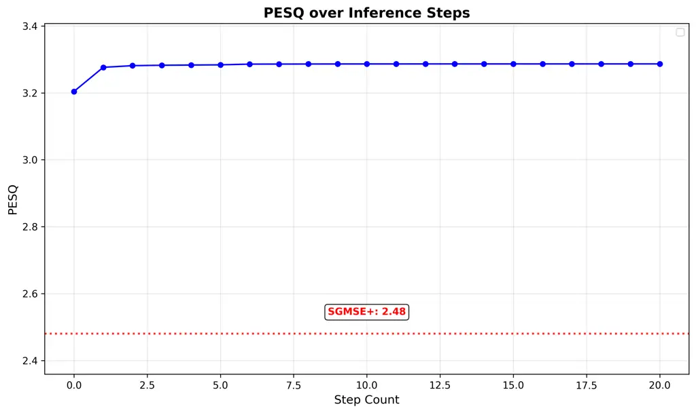

Figure 1: PESQ across all inference steps for VCTK-DEMAND test set.

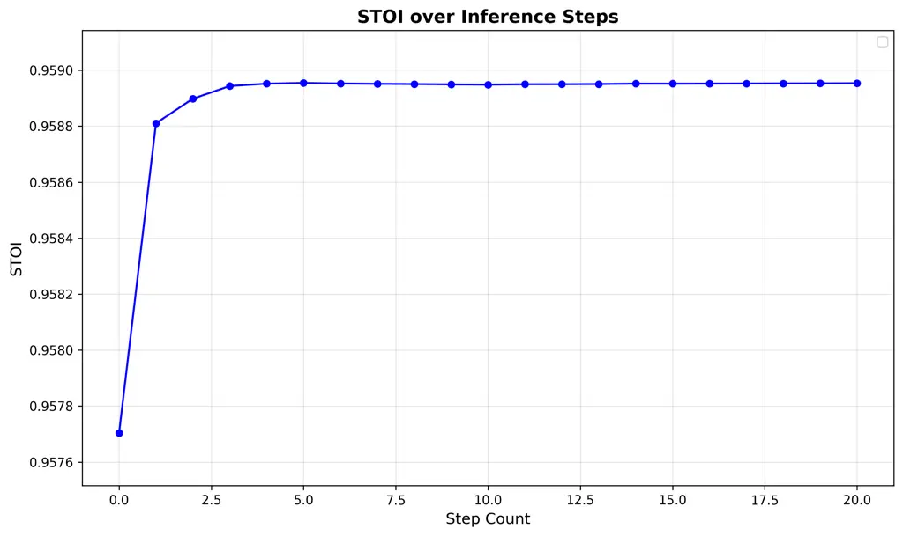

Figure 2: STOI across all inference steps for VCTK-DEMAND test set.

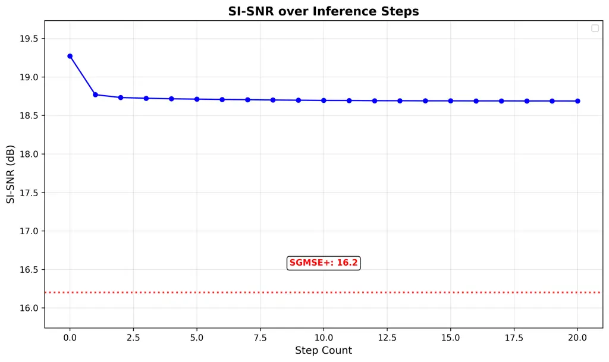

Figure 3: SI-SNR across all inference steps for VCTK-DEMAND test set.

### A.2 Results on DNS Challenge V3 test set

We report the per-step UTMOS, DNSMOS SIG, BAK, OVRL and MOS results for
DNS Challenge V3 test set in Figure 4, Figure 5, Figure 6, Figure 7 and
Figure 8. Similar to VCTK-DEMAND, we notice the results become stable
after two inference steps, where the first inference step yielded the
most improvements.

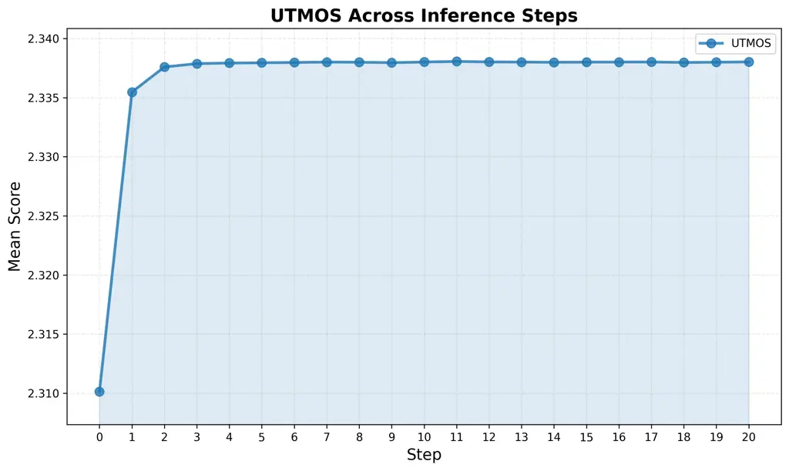

Figure 4: UTMOS across all inference steps for DNS Challenge V3 test
set.

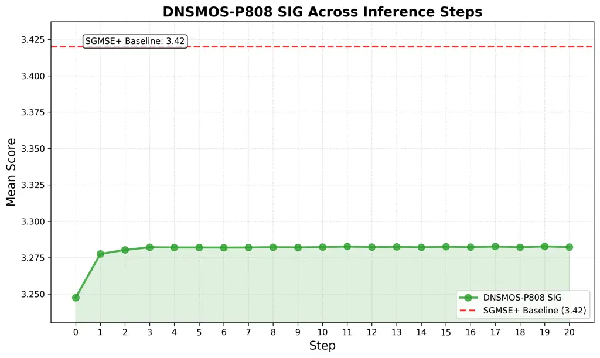

Figure 5: DNSMOS SIG across all inference steps for DNS Challenge V3
test set.

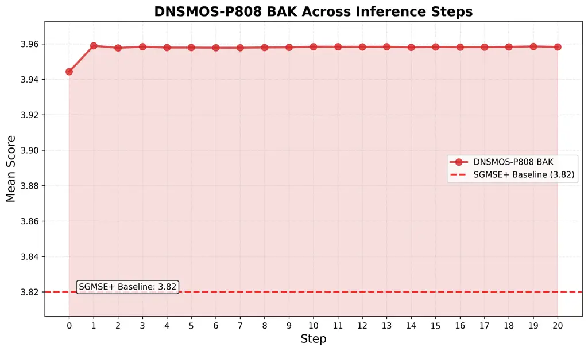

Figure 6: DNSMOS BAK across all inference steps for DNS Challenge V3
test set.

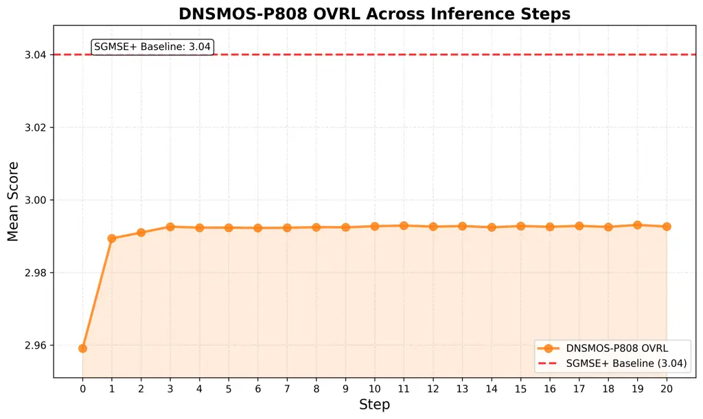

Figure 7: DNSMOS OVRL across all inference steps for DNS Challenge V3
test set.

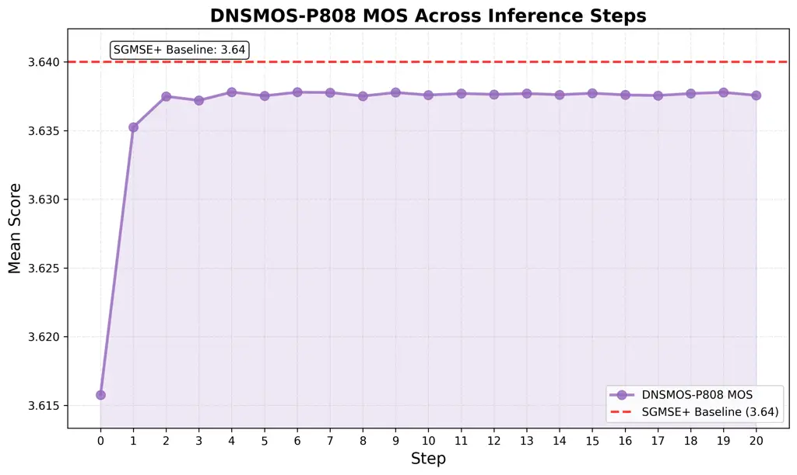

Figure 8: DNSMOS MOS across all inference steps for DNS Challenge V3
test set.

## Appendix B Additional Details for Music Source Separation

Following the approach used for speech enhancement, we present pre-step
uSDR and cSDR results for each of the four stems individually in
Figure 9, Figure 10, Figure 11 and Figure 12. The chunked-SDR metric
exhibits more pronounced fluctuations, indicating the inherent
instability of taking the median of song-median chunked SDR values. In
contrast, the utterance-SDR demonstrates considerably greater stability.
Across both metrics, the most substantial improvements occur during the
initial inference step, consistent with the behavior observed in many
bridge models.

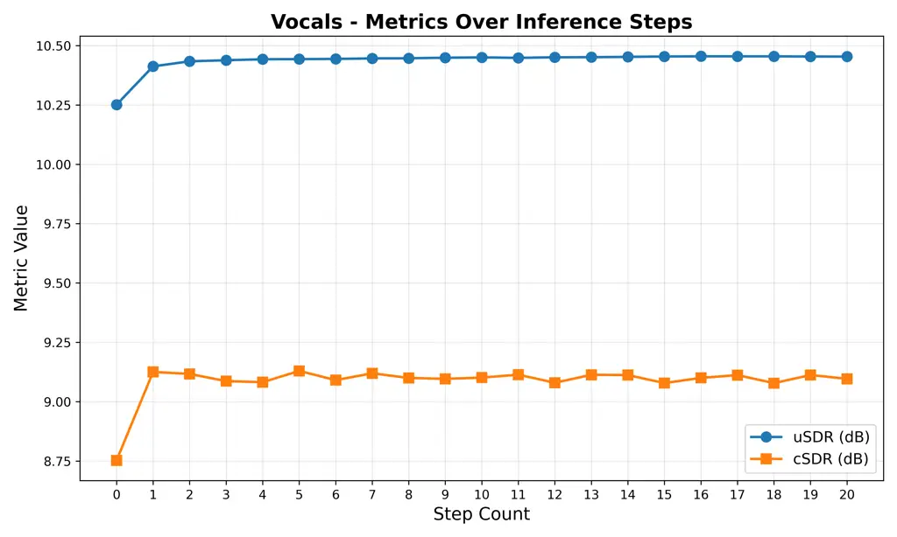

Figure 9: uSDR and cSDR performance across all inference steps for
“Vocals” stem in the music source separation task.

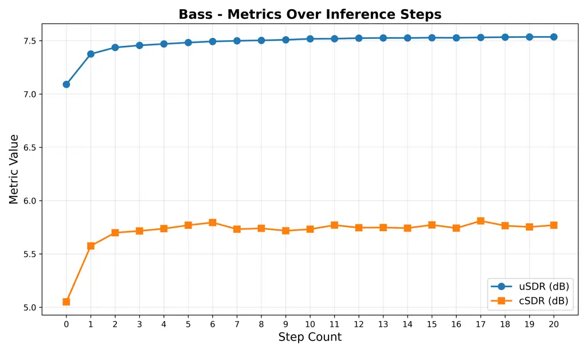

Figure 10: uSDR and cSDR performance across all inference steps for
“Bass” stem in the music source separation task.

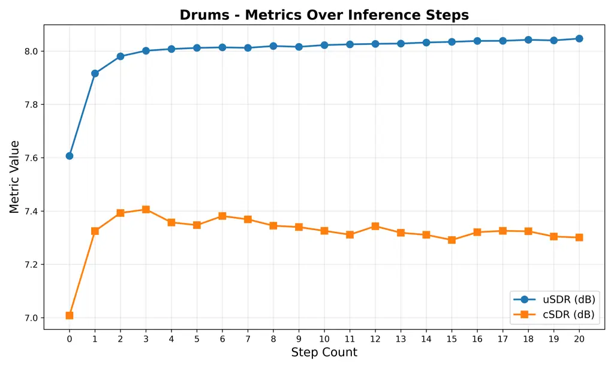

Figure 11: uSDR and cSDR performance across all inference steps for
“Drums” stem in the music source separation task.

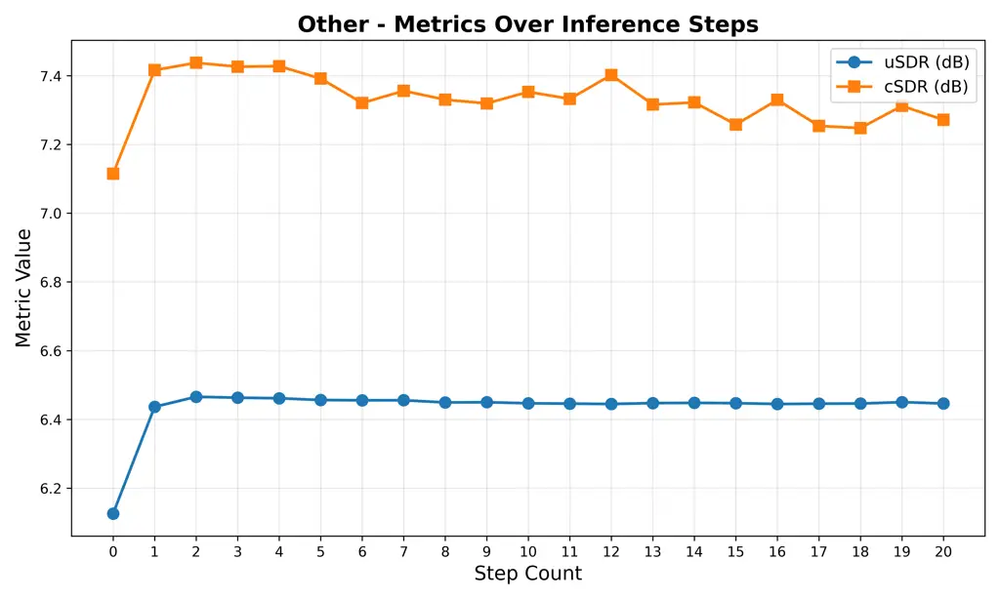

Figure 12: uSDR and cSDR performance across all inference steps for
“Other” stem in the music source separation task.

## Appendix C Additional Details for Bridge Model Connection

### C.1 Justification for Smoothing the Dirac delta

In Section 5, we claimed that the Dirac delta in the DDBM framework can
be approximated by a Gaussian with small variance. We now provide a
justification for this approach.

Starting with the deterministic linear bridge:

```math
x_{t}=(1-t)x_{0}+tx_{T} \tag{27}
```

To enable differentiability required for score matching, we add
infinitesimal Gaussian noise:

```math
x_{t}^{\epsilon}=(1-t)x_{0}+tx_{T}+\epsilon\cdot z,\hskip 9.24994ptz\sim\mathcal{N}(0,I) \tag{28}
```

This yields the conditional distribution:

```math
q_{\epsilon}(x_{t}|x_{0},x_{T})=\mathcal{N}(x_{t};(1-t)x_{0}+tx_{T},\epsilon^{2}I) \tag{29}
```

As $`\epsilon\to 0`$, this distribution converges to the Dirac delta in
the weak topology:

```math
\lim_{\epsilon\to 0}q_{\epsilon}(x_{t}|x_{0},x_{T})=\delta(x_{t}-((1-t)x_{0}+tx_{T})) \tag{30}
```

However, for any $`\epsilon>0`$, the distribution remains
differentiable, enabling score computation:

```math
\nabla_{x_{t}}\log q_{\epsilon}(x_{t}|x_{0},x_{T})=-\frac{1}{\epsilon^{2}}(x_{t}-((1-t)x_{0}+tx_{T})) \tag{31}
```

Digital audio typically uses 16-bit representation, introducing an
inherent noise floor at approximately -96 dB. This corresponds to
$`\epsilon^{2}\approx 10^{-9.6}`$ relative to full scale, providing a
natural lower bound for the variance in our Gaussian approximation.
Thus, the Gaussian smoothing with small but non-zero variance accurately
models the physical reality of audio signals, where perfect
deterministic values are never achieved in practice.

### C.2 Justification for Score Parameterization

We now derive the score parameterization used in our method from first
principles, showing how it naturally emerges from the audio separation
objective.

Starting from the score definition with Gaussian smoothing:

```math
\nabla_{x}\log q_{\epsilon}(x|x_{0},x_{T})=-\frac{1}{\epsilon^{2}}(x-\mu(x_{0},x_{T})) \tag{32}
```

where $`\mu(x_{0},x_{T})=(1-t)x_{0}+tx_{T}`$.

For audio separation, we re-parameterize in terms of the clean signal
estimate. Let $`\hat{p}(x)`$ denote the model’s estimate of the clean
signal from mixture $`x`$.

At optimal training, the expected value of the estimate equals the true
clean signal:

```math
\mathbb{E}[\hat{p}(x_{t})]=p \tag{33}
```

For the linear bridge with $`x_{0}=n`$ (noise) and $`x_{T}=p`$ (clean
signal):

```math
\nabla_{x}\log q_{\epsilon}=-\frac{1}{\epsilon^{2}}(x-((1-t)n+tp)) \tag{34}
```

For a well-trained model, we have the approximation:

```math
\hat{p}(x)-x\approx t(p-x) \tag{35}
```

This approximation holds because the model learns to estimate how much
of the clean signal is present in the mixture, which is proportional to
$`t`$ in our linear bridge.

Rearranging and substituting:

```math
\displaystyle s_{\omega}(x,p,t) \displaystyle=-\frac{1}{\epsilon^{2}t}(\hat{p}(x)-x) \tag{36}
```

```math
\displaystyle=\frac{1}{\epsilon^{2}t}(x-\hat{p}(x)) \tag{37}
```

In our notation where $`t=\sigma`$, this becomes:

```math
s_{\omega}(y,p,\sigma)=\frac{1}{\epsilon^{2}\sigma}(y-\hat{p}(y)) \tag{38}
```

This naturally explains the $`1/\sigma`$ factor in Equation (21) of the
main paper, showing that our score parameterization emerges directly
from the bridge diffusion framework when applied to audio separation.
