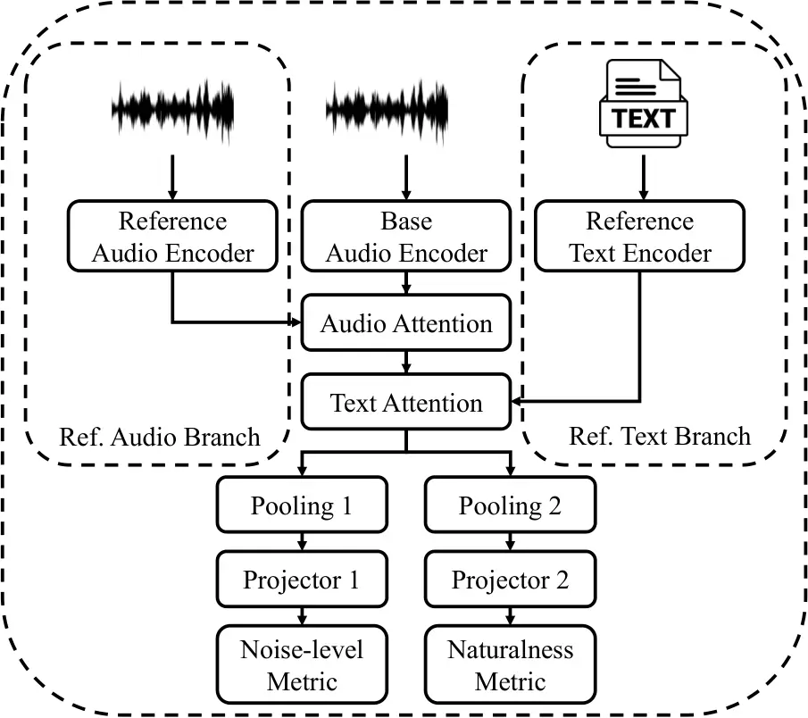

Shi Shim Watanabe Carnegie Mellon UniversityU.S.A.

# Uni-VERSA: Versatile Speech Assessment with a Unified Network

Jiatong    Hye-Jin    Shinji Affiliation: Language Technologies
Institute

###### Abstract

Subjective listening tests remain the golden standard for speech quality
assessment, but are costly, variable, and difficult to scale. In
contrast, existing objective metrics, such as PESQ, F0 correlation, and
DNSMOS, typically capture only specific aspects of speech quality. To
address these limitations, we introduce Uni-VERSA, a unified network
that simultaneously predicts various objective metrics, encompassing
naturalness, intelligibility, speaker characteristics, prosody, and
noise, for a comprehensive evaluation of speech signals. We formalize
its framework, evaluation protocol, and applications in speech
enhancement, synthesis, and quality control. A benchmark based on the
URGENT24 challenge, along with a baseline leveraging self-supervised
representations, demonstrates that Uni-VERSA provides a viable
alternative to single-aspect evaluation methods. Moreover, it aligns
closely with human perception, making it a promising approach for future
speech quality assessment.

###### keywords

speech quality estimation, speech evaluation

^(†)^(†)email: jiatongs@cs.cmu.edu

## 1 Introduction

Speech profiling or speech quality assessment becomes a necessary
function to evaluate various tasks, including speech synthesis,
enhancement, separation, and coding \[1, 2, 3, 4\]. The task is now
getting more attention due to the growing demand for reliable and
scalable evaluation methods in real-world applications, driven by rapid
advancements in generative speech AI models. However, the golden
standard for assessing speech quality remains the listening test, which
collects human opinions through methods like mean opinion score (MOS)
and A/B testing.

Evaluating speech generation models through human preferences poses
persistent challenges \[1, 5\]. A major issue is the variability among
listeners, shaped by perceptual sensitivity, cultural background, and
individual biases \[6\]. This variability necessitates large-scale data
collection for statistical significance, making the process costly and
hard to scale. Recruiting and compensating participants while
maintaining response quality demands substantial resources. Crowdsourced
evaluations add noise due to inattentive or malicious raters \[7, 8\].
Even with clear guidelines, listeners may prioritize different aspects,
such as naturalness or intelligibility, when rating \[9\]. These
challenges underscore the complexity of human evaluation and the
importance of supplementing it with objective metrics.

Objective evaluation of speech signals is essential to overcome the
limitations of human listening tests \[5, 4, 10\]. Early approaches
relied on signal processing principles and psychoacoustic findings to
design assessment metrics such as mel cepstral distortion (MCD), PESQ,
and STOI \[11, 12, 13\]. These metrics typically require reference
signals for computation. To eliminate this dependency, research has
shifted towards non-intrusive metrics that leverage neural networks to
directly predict human preference. Examples include DNSMOS for noisy
speech quality estimation \[14\] and models like UTMOS and MOSNet for
evaluating speech synthesis quality \[15\]. In general, previous work
used a single metric for speech quality \[5\], but the quality of speech
is naturally multidimensional, covering intelligibility, naturalness,
and background noise , among others \[16, 17\]. Therefore, single-aspect
metrics risk fragmented, biased evaluations. One approach to addressing
this challenge is leveraging pre-defined metrics in each domain to
provide a comprehensive speech quality analysis. Several open-source
toolkits, such as VERSA, AudioLDM-Eval, and FADTK, adopt this strategy
to ensure detailed quality profiling \[18, 19, 20, 21, 10\]. However,
these toolkits often suffer from inefficiencies due to the complexities
of using separate models/algorithms and various constraints from
algorithmic setups or constraints.

To this end, we introduce Uni-VERSA, a unified network designed to
assess speech signals comprehensively. Uni-VERSA aims to evaluate speech
from multiple perspectives by incorporating diverse objective metrics
(e.g., signal-to-noise ratio, mean opinion scores, word error rate by a
speech recognition model, etc.) within a unified modeling paradigm. Our
contributions are as follows: (1) we formalize the Uni-VERSA framework,
detail its evaluation protocol, and discuss its potential applications
across a range of scenarios, including the evaluation of speech
enhancement systems, speech synthesis evaluation, and conversational
speech quality control. (2) to demonstrate its efficacy, we introduce a
benchmark derived from the URGENT24 speech enhancement challenge \[22\]
and establish a strong baseline by leveraging self-supervised
representations. (3) with extensive experiments, our results indicate
that Uni-VERSA not only provides a comprehensive and efficient
evaluation of speech signals but also outperforms methods focusing on a
single aspect of human-perceived speech quality.¹¹ 1 A list of
pre-trained models are available at
[https://huggingface.co/collections/espnet/universa-6834e7c0a28225bffb6e2526](https://huggingface.co/collections/espnet/universa-6834e7c0a28225bffb6e2526)

## 2 Uni-VERSA

|                         |            |               |                |
| ----------------------- | ---------- | ------------- | -------------- |
| Domain                  | Metric     | Range         | Reference Type |
| Noise level             | SI-SNR     | \[-inf, inf\] | Signal         |
|                         | PESQ       | \[-i 1, 4.5\] | Signal         |
|                         | DNSMOS     | \[-i 1, 4.5\] | /              |
| Prosody                 | F0-CORR    | \[i -1, 4.1\] | Signal         |
| Naturalness             | MOS        | \[-i 1, 4.5\] | /              |
|                         | UTMOS      | \[-i 1, 4.5\] | /              |
|                         | SHEET-base | \[-i 1, 4.5\] | /              |
| Intelligibility         | WER        | \[-i 0, inf\] | Text           |
|                         | STOI       | \[-i 0, 4.1\] | Signal         |
|                         | SBERT      | \[-i 0, 4.1\] | Signal         |
| Speaker characteristics | SPK-SIM    | \[i -1, 4.1\] | Signal         |

Table 1: A summarization of metrics in Uni-VERSA. The reference column
indicates whether the metric needs reference signals to compute.
Detailed reasoning for the selection is discussed in Sec. 2.1.

### 2.1 Metrics in Uni-VERSA Setup

Previous studies in speech profiling have often focused on a single
target domain, such as noise level, naturalness, or emotion \[5, 23\],
largely due to the scarcity of comprehensive metadata and labels. To
overcome this limitation and achieve universality in speech profiling,
Uni-VERSA leverages a diverse set of metrics derived from both expert
models and ground truth annotations, ensuring a robust data preparation
process, as indicated in Table 1. While our ultimate goal is to support
all aspects of speech, we begin by focusing Uni-VERSA on five key
categories: noise level, prosody information, naturalness,
intelligibility, and speaker characteristics. Our initial Uni-VERSA
benchmark is set up over 11 metrics spanning the five domains.

Noise Level: This domain assesses speech quality with respect to noise
and distortions using three metrics, including scale-invariant
signal-to-noise ratio (SI-SNR)\[24, 25\], perceptual evaluation of
speech quality (PESQ)\[12\], and deep noise suppression mean opinion
score (DNSMOS) \[14\]. Together, these metrics provide a comprehensive
assessment of noise levels, with DNSMOS offering perceptual alignment to
human judgments, PESQ focusing on reference-based quality comparisons,
and SI-SNR quantifying signal-level improvements.²² 2 The use of
multiple metrics within a single domain (e.g., noise-level) aligns with
Torchaudio-Squim \[23\], which demonstrates that multi-task learning
with multiple metrics can improve individual metric predictions. Here,
we build Uni-VERSA on the multi-metric prediction idea of
Torchaudio-Squim but expand it beyond a single domain.

Prosody Information: Prosody, the rhythm, and intonation of speech,
differentiates natural speech from monotonous, robotic outputs. We
employ the F0 Pearson correlation coefficient (F0-CORR) between enhanced
and reference speech as our primary prosody metric. While F0-CORR does
not capture all prosodic elements (e.g., duration or stress patterns),
it remains the most interpretable measure of pitch dynamics.

Naturalness: This category evaluates how human-like the speech output
sounds using three complementary metrics, including human-annotated MOS,
UTMOS \[15\], and SHEET-base \[26\]. By integrating these metrics, we
balance subjectivity, scalability, and generalization in evaluating
speech naturalness.

Intelligibility: To assess how well speech can be understood, we
incorporate three metrics, including word error rate (WER) by an
automatic speech recognition (ASR) system, short-time objective
intelligibility (STOI) \[13\], and Speech BERT Score (SBERT) \[27\].
This multi-faceted approach combines ASR-based, acoustic, and
representation-based evaluations for a comprehensive assessment of
intelligibility.

Speaker Characteristics: This domain measures how closely processed
speech retains the original speaker’s characteristics. We use speaker
embedding cosine similarity \[28\], which compares embeddings to
determine how well the unique vocal traits of the speaker are preserved.

### 2.2 Formulation

We denote the $`i^{\text{th}}`$ paired sample
$`(\mathbf{S}^{i},Y^{i})\in\mathcal{D}`$ in the Uni-VERSA database
$`\mathcal{D}`$, where $`\mathbf{S}^{i}`$ is a single-channel speech
signal sequence, $`Y^{i}`$ is the set of quality metrics, and $`i`$ is
the utterance index. Let $`Y^{i}=\{y^{i}_{b}\}_{b\in\mathcal{B}}`$ where
$`y^{i}_{b}`$ stands for the metric $`b\in\mathcal{B}`$. Here,
$`\mathcal{B}`$ represents the set of speech profiling dimensions. Some
metrics require reference information, which may be involved as
auxiliary conditions such as reference audio
$`\mathbf{S}^{i}_{\text{ref}}`$ and reference transcription
$`\mathbf{T}^{i}`$,³³ 3 While in this work, the reference audio is only
studied with matching reference, it can be non-matching reference or
enrollment speech when it is used in non-matching metrics \[29, 30\] or
speaker similarity. as listed in the “Reference Type” column of Table 1.
The main process of Uni-VERSA is defined as:

```math
\hat{Y}^{i}=\mathrm{UniVERSA}(\mathbf{S}^{i},(\mathbf{S}^{i}_{\text{ref}},\mathbf{T}^{i})), \tag{1}
```

where $`\mathrm{UniVERSA}(\cdot)`$ is the Uni-VERSA model and
$`\hat{Y}^{i}`$ is the set of predicted metrics. Notably, reference
signals $`\mathbf{S}^{i}_{\text{ref}}`$ and $`\mathbf{T}^{i}`$ are
optionally used, depending on the design of the model and the
availability of the dataset.

The optimization target of Uni-VERSA is rather simple, defined as the
$`n`$-norm of the prediction error between $`\hat{Y}^{i}`$ and
$`Y^{i}`$:

```math
L_{\mathcal{B}}^{i}=\sum_{b\in\mathcal{B}}||y_{b}^{i}-\hat{y}_{b}^{i}||_{n}, \tag{2}
```

where in our exploration, we set $`n=1`$.

The design of the Uni-VERSA introduces several core challenges, stemming
from the need to integrate multiple evaluation domains, handle metrics
with diverse scales, and contend with limited data availability: (1)
Integrating Diverse Domains. As shown in Table 1, Uni-VERSA spans a wide
range of evaluation metrics, from objective, noise-level measures like
SI-SNR to subjective naturalness assessments like MOS. A robust model
must bridge these varied domains, effectively capturing both the
physical attributes of sound and its higher-level perceptual qualities,
including linguistic content. (2) Handling Varying Metric Scales and
Distributions. As illustrated in Table 1, the metrics used in Uni-VERSA
differ significantly in their numerical distributions. This
heterogeneity complicates the task of achieving reliable predictions
across all metrics. (3) Semi-Supervised Learning Challenges. In
real-world applications, obtaining labeled ground-truth data for metrics
like MOS, speaker similarity, or intelligibility is often both scarce
and expensive. This scarcity necessitates robust semi-supervised
techniques. Additionally, several metrics depend on paired data as
indicated in Table 1. For example, PESQ requires reference audio and WER
requires reference transcriptions. In many scenarios, such references
are unavailable, forcing models to estimate quality without direct
comparisons, which increases prediction uncertainty.

### 2.3 Performance Evaluation of Uni-VERSA

We adopt the evaluation metrics established in previous work \[5\],
considering both average error and correlation coefficients between
ground truth metrics $`\{y_{b}^{1},...,y_{b}^{|\mathcal{D}|}\}`$ and the
prediction targets
$`\{\hat{y}_{b}^{1},...,\hat{y}_{b}^{|\mathcal{D}|}\}`$. Our evaluation
suite comprises linear correlation coefficient (LCC) and Spearman rank
correlation coefficient (SRCC).⁴⁴ 4 The Kendall Tau rank correlation
coefficient (KTAU) is commonly used in the literature \[1, 31, 32\] and
can serve as an evaluation metric. However, in our experiments, KTAU
results generally align with SRCC and do not affect the conclusions.
Therefore, we simplify our discussion by excluding this metric. Each
metric addresses distinct real-world needs: ranking-based metrics (SRCC)
are particularly useful for TTS and speech enhancement evaluations by
mitigating range bias (see Section 1), while the linear metric (i.e.,
LCC) is more suitable for standardizing audio quality control. We also
emphasize utterance-level evaluation to ensure the broad applicability
of our benchmark across various use cases.



Figure 1: The architecture of the Uni-VERSA base model with two metrics
as an example. Detailed implementation is discussed in Sec. 2.4.

### 2.4 Baseline Model

Base Model Architecture. Following the formulation in Eq. (1), we design
the base model architecture (i.e., $`\mathrm{UniVERSA(\cdot)}`$)
following the self-supervised learning (SSL)-based speech quality
predictor \[33\]. The full-reference architecture, shown in Fig. 1,
comprises a feature extractor, three distinct encoders, two
cross-attention modules, and multiple predictors, one for each metric.
The three encoders process the target audio $`\mathbf{S}^{i}`$ for
quality estimation, the reference audio $`\mathbf{S}^{i}_{\text{ref}}`$,
and the reference text $`\mathbf{T}^{i}`$, respectively. Two
cross-attention modules then align the hidden states of the reference
audio and text with the target speech representations. Finally, the
resulting hidden states are fed into a series of predictors, each
estimating a specific metric $`y_{b}`$. Each predictor consists of a
simple mean pooling layer followed by a linear projection.

Training Strategies: In real-world scenarios, reference signals
$`\mathbf{S}^{i}_{\text{ref}}`$ and $`\mathbf{T}^{i}`$ are not always
available. Consequently, we cannot collect dependent metrics requiring
reference signals—such as SI-SNR, PESQ, F0-CORR, STOI, and SBERT for the
data. Similarly, subjective MOS labels, due to the expensive human
labor, could be only available for a subset of the dataset. Therefore,
the training of Uni-VERSA models naturally needs to adopt a
semi-supervised strategy.

Practically, for missing reference signals, we use a 1-second
zero-padded audio clip as a placeholder for audio reference and a pseudo
transcription from an ASR model for transcription reference. This
strategy is applied to both training and inference. During training, if
a related metric is unavailable for a given utterance, we simply mask
the corresponding predictor.

## 3 Experiments

### 3.1 URGENT24 Benchmark

The Universality, Robustness, and Generalizability for EnhancemeNT
(URGENT) 2024 challenge, hosted at NeurIPS2024, is a speech enhancement
competition. We construct the Uni-VERSA benchmark by curating a new
dataset from submissions to the URGENT24 challenge \[22\]. To mitigate
over-tuning contamination, we exclusively use the blind test set
submissions. This set comprises 1,000 speech samples: half are simulated
(with corresponding reference clean speech) and half are drawn from
real-world recordings (without reference signals). This balanced dataset
enables thorough evaluation by offering both paired and non-paired
speech. Besides, it also features various samples from a collection of
state-of-the-art speech enhancement models. Furthermore, the
availability of real mean opinion scores ensures that the evaluation
closely reflects human perceptual judgments. Accounting for
resubmissions, the final collection includes the noisy source speech,
the enhanced output from the official baseline, and 112 additional
system submissions, totaling 114,000 samples (approximately 293 hours of
speech).

Next, we annotate the curated dataset using VERSA \[10\] with the
metrics described in Section 2, adhering to their default configuration
in VERSA. We leverage a semi-supervised approach as introduced in
Sec. 2.4. Since half of the noisy data lacks reference audio, the
intrusive metrics are only partially labeled. We also incorporate the
subjective MOS evaluation from the URGENT24 challenge, which assesses
300 utterances for each of the 23 final-round submissions, half from
simulated noisy speech enhancement and half from real-world scenarios.

Finally, we randomly partition the source speech samples into training,
development, and test sets in an 85:5:10 ratio. All data are in a 16k
sampling rate.

|           |             |           |           |           |             |           |            |                 |           |           |           |           |
| --------- | ----------- | --------- | --------- | --------- | ----------- | --------- | ---------- | --------------- | --------- | --------- | --------- | --------- |
| Feature   | Noise-Level |           |           | Prosody   | Naturalness |           |            | Intelligibility |           |           | Speaker   | Avg.      |
|           | SI-SNR      | PESQ      | DNSMOS    | F0-CORR   | MOS         | UTMOS     | SHEET-base | WER             | STOI      | SBERT     | SPK-SIM   |           |
| Fbank     | .69 / .73   | .78 / .80 | .90 / .89 | .56 / .51 | .72 / .72   | .92 / .91 | .85 / .85  | .57 / .53       | .79 / .74 | .80 / .73 | .75 / .76 | .76 / .73 |
| HuBERT    | .84 / .83   | .80 / .81 | .90 / .89 | .61 / .56 | .78 / .77   | .97 / .95 | .93 / .93  | .74 / .71       | .92 / .89 | .94 / .89 | .76 / .71 | .83 / .80 |
| MR-HuBERT | .85 / .85   | .83 / .85 | .90 / .88 | .65 / .60 | .78 / .78   | .97 / .95 | .94 / .94  | .74 / .74       | .91 / .89 | .94 / .90 | .79 / .75 | .84 / .82 |
| WavLM     | .85 / .85   | .82 / .84 | .90 / .88 | .64 / .61 | .77 / .77   | .97 / .94 | .93 / .94  | .79 / .79       | .93 / .89 | .95 / .91 | .79 / .74 | .84 / .82 |

Table 2: Baseline models in URGENT24 benchmark with full references. The
results are presented in (LCC / SRCC). Results from the best models are
in boldface, considering more decimals.

|            |             |           |           |           |             |           |            |                 |           |           |           |           |
| ---------- | ----------- | --------- | --------- | --------- | ----------- | --------- | ---------- | --------------- | --------- | --------- | --------- | --------- |
| Model      | Noise-Level |           |           | Prosody   | Naturalness |           |            | Intelligibility |           |           | Speaker   | Avg.      |
|            | SI-SNR      | PESQ      | DNSMOS    | F0-CORR   | MOS         | UTMOS     | SHEET-base | WER             | STOI      | SBERT     | SPK-SIM   |           |
| No Ref.    | .84 / .84   | .85 / .86 | .90 / .89 | .64 / .60 | .77 / .78   | .97 / .94 | .94 / .94  | .79 / .78       | .90 / .86 | .93 / .90 | .79 / .75 | .85 / .82 |
| Audio Ref. | .84 / .82   | .82 / .83 | .90 / .89 | .66 / .62 | .78 / .78   | .97 / .95 | .94 / .94  | .78 / .76       | .92 / .89 | .95 / .92 | .81 / .77 | .85 / .82 |
| Text Ref.  | .84 / .83   | .84 / .86 | .90 / .89 | .64 / .57 | .79 / .79   | .97 / .94 | .93 / .93  | .78 / .76       | .92 / .90 | .96 / .93 | .80 / .78 | .85 / .83 |
| Full Ref.  | .85 / .85   | .82 / .84 | .90 / .88 | .64 / .61 | .77 / .77   | .97 / .94 | .93 / .94  | .79 / .79       | .93 / .89 | .95 / .91 | .79 / .74 | .84 / .82 |

Table 3: Baseline models in URGENT24 benchmark with partial references.
The results are presented in (LCC / SRCC). The base model is the
WavLM-based Uni-VERSA baseline. Results from the best models are in
boldface, considering more decimals.

| Feature | Pred. Type | LCC | SRCC |
| ------- | ---------- | --- | ---- |
| Fbank   | Single     | .53 | .55  |
|         | Joint      | .72 | .72  |
| WavLM   | Single     | .80 | .80  |
|         | Joint      | .77 | .77  |

Table 4: Performance comparison between single-task learning and
multi-task learning on MOS prediction.

| Domain       | DNSMOS    | UTMOS     | SHEET     | MOS       |
| ------------ | --------- | --------- | --------- | --------- |
| Enhancement  | .90 / .89 | .97 / .94 | .94 / .94 | .77 / .78 |
| TTS          | .53 / .49 | .65 / .65 | .74 / .74 | .61 / .60 |
| Conversation | .45 / .45 | .69 / .71 | .60 / .60 | \- / -    |

Table 5: Out-of-domain evaluation in TTS and conversational data. The
base model is the WavLM-based Uni-VERSA baseline without reference
signals. The result in the enhancement domain is from the URGENT24
benchmark.

### 3.2 Experimental Setup

Implementation and Training Details. We use ESPnet as the training
framework \[18\] and adopt the frozen WavLM-large model as our feature
extractor \[34\], applying a layer-wise weighted summation as the input
feature via S3PRL \[35\]. Each of the three encoders employs a
four-layer transformer architecture with four-head self-attention
(256-dimensional), linear layers with 1024 dimensions, and a dropout
rate of .1. The text is modeled using 500 vocabulary byte-pair encoding
(BPE) units. By default, metric prediction is performed using mean
pooling followed by a linear projection.

All models are trained for 50 epochs with a batch size of 16. We use the
AdamW optimizer with a learning rate of 0.001 and a linear warm-up
scheduler with 25,000 warm-up steps.

Ablation Studies. In addition to baseline training, we conduct several
ablation experiments to evaluate the impact of each module and the
usefulness of different reference signals (i.e., audio and text). For
the feature extractor, we compare mel filter bank spectral features⁵⁵ 5
We follow the default Fbank setup in ESPnet \[18\]., HuBERT \[36\], and
MR-HuBERT \[37\].⁶⁶ 6 While WavLM emphasizes robustness in speech signal
modeling, we include MR-HuBERT to assess the potential benefits of
complementary multi-resolution SSL representations for the task. All
SSL-based features remain frozen and are incorporated as input features
through weighted layer-wise summation. In addition, we conduct
additional ablation studies on Uni-VERSA models by completely removing
ground truth transcription, reference speech, or both simultaneously.⁷⁷
7 Different from the semi-supervised strategy, here we completely remove
the reference signals in training. For systems without reference inputs,
we eliminate the corresponding encoder and cross-attention module. To
evaluate the impact of joint prediction across multiple metrics, we
compare the performance of Uni-VERSA models with models that predict
only MOS scores.

Additional Analysis. Beyond ablation studies, we perform additional
analyses to explore the Uni-VERSA system’s applicability in real-world
scenarios. Specifically, since the URGENT challenges focus on speech
enhancement, we further examine the pre-trained models in out-of-domain
settings, such as speech synthesis and conversational speech quality
control. We evaluate Uni-VERSA’s performance by comparing its
predictions to the original metrics in these contexts and also compare
the efficiency of applying Uni-VERSA systems for the problem.

### 3.3 Results and Analysis

Effect of Input Features. Table 2 shows that SSL representations
generally boost prediction performance. While MR-HuBERT and WavLM yield
mixed results, WavLM achieves slightly better average LCC and SRCC.
UTMOS is the easiest metric to predict (0.95 SRCC with MR-HuBERT-based
model), whereas F0-CORR is the most challenging (up to 0.61 SRCC with
WavLM-based model). This remarks the necessity of balancing the
prediction across metrics for future improvement.

The Effect of Partial Reference Audio/Transcription. The ablation
experiments on partial reference are shown in Table 3. Interestingly,
with sufficient training and domain consistency, models without certain
references sometimes outperform those with full references. For
instance, the model using reference text shows lower WER prediction
correlations, while the model without audio references yields the best
PESQ prediction, despite audio references theoretically aiding PESQ
recovery. This may stem from the Uni-VERSA model overfitting to training
patterns when given redundant reference signals. A potential future
direction is to scale up the training data and enhance model
generalization (e.g., through regularization or domain adaptation
techniques) so that the model avoids overfitting and maintains balanced
performance across different metrics.

The Effect of Joint-Prediction. The ablation experiments on joint
prediction are presented in Table 4. Here, Single and Joint refer to the
model trained to predict only MOS scores and the model trained to
predict diverse metrics simultaneously. While joint prediction improves
MOS estimation in Fbank-based systems, WavLM-based models achieve
superior performance when predicting MOS alone. These findings suggest
that introducing additional prediction dimensions requires careful
consideration of both potential benefits and drawbacks.

Further Discussion. To further evaluate system performance, we assess
the model in out-of-domain scenarios, including TTS data evaluation and
conversational speech quality control. For TTS evaluation, we use the
VoiceMOS2022 challenge test set \[1\]. For conversational quality
control, we rely on a self-collected dataset comprising 700 hours of
real conversational speech. The results are presented in Table 5.

Overall, the pre-trained Uni-VERSA model maintains consistent quality
estimation for metrics from expert models and aligns well with human
preferences in TTS evaluation, even across different domains (e.g.,
enhancement versus TTS). As an added benefit, Uni-VERSA significantly
improves efficiency over direct metric computation with VERSA, for
example, achieving up to a 109× speedup on the URGENT24 test set.

## 4 Conclusion

In this work, we introduced Uni-VERSA for multi-dimensional speech
quality analysis, detailing its formulation, evaluation criteria, and
neural architecture. Our experiments on the URGENT24 benchmark and
out-of-domain scenarios demonstrate its effectiveness for various
applications. Future work will extend Uni-VERSA to broader speech
profiling and other acoustic domains such as general audio and music.

## 5 Acknowledgments

This work is supported by the Defence Science and Technology Agency
(DSTA) in Singapore. We would like to thank Daniel Leong and Megan Choo
for their valuable comments. Experiments of this work used the Bridges2
at PSC and Delta/DeltaAI NCSA computing systems through allocation
CIS210014 from the Advanced Cyberinfrastructure Coordination Ecosystem:
Services & Support ACCESS program, supported by National Science
Foundation grants 2138259, 2138286, 2138307, 2137603, and 2138296.

## References

- \[1\] W. C. Huang, E. Cooper, Y. Tsao, H.-M. Wang, T. Toda, and
  J. Yamagishi, “The VoiceMOS challenge 2022,” in _Proc. ISCA
  Interspeech_, 2022, pp. 4536–4540.
- \[2\] G. Yi, W. Xiao, Y. Xiao, B. Naderi, S. Möller, W. Wardah,
  G. Mittag, R. Culter, Z. Zhang, D. S. Williamson, F. Chen, F. Yang,
  and S. Shang, “Conferencingspeech 2022 challenge: Non-intrusive
  objective speech quality assessment (NISQA) challenge for online
  conferencing applications,” in _Proc. ISCA Interspeech_, 2022, pp.
  3308–3312.
- \[3\] J. Shi, J. Tian, Y. Wu, J.-w. Jung, J. Q. Yip, Y. Masuyama,
  W. Chen, Y. Wu, Y. Tang, M. Baali _et al._, “ESPnet-Codec:
  Comprehensive training and evaluation of neural codecs for audio,
  music, and speech,” in _Proc. IEEE SLT_. IEEE, 2024, pp. 562–569.
- \[4\] M. Torcoli, T. Kastner, and J. Herre, “Objective measures of
  perceptual audio quality reviewed: An evaluation of their application
  domain dependence,” _IEEE/ACM Transactions on Audio, Speech, and
  Language Processing_, vol. 29, pp. 1530–1541, 2021.
- \[5\] E. Cooper, W.-C. Huang, Y. Tsao, H.-M. Wang, T. Toda, and
  J. Yamagishi, “A review on subjective and objective evaluation of
  synthetic speech,” _Acoustical Science and Technology_, pp.
  e24–12, 2024.
- \[6\] S. Zielinski, F. Rumsey, and S. Bech, “On some biases
  encountered in modern audio quality listening tests-a review,”
  _Journal of the Audio Engineering Society_, vol. 56, no. 6, pp.
  427–451, 2008.
- \[7\] P. C. Loizou, “Speech quality assessment,” in _Multimedia
  analysis, processing and communications_. Springer, 2011, pp. 623–654.
- \[8\] R. Z. Jiménez, G. Mittag, and S. Möller, “Removing the bias in
  speech quality scores collected in noisy crowdsourcing environments,”
  in _Proc. IEEE QoMEX_. IEEE, 2021, pp. 49–54.
- \[9\] B. Naderi, R. Zequeira Jiménez, M. Hirth, S. Möller, F. Metzger,
  and T. Hoßfeld, “Towards speech quality assessment using a
  crowdsourcing approach: evaluation of standardized methods,” _Quality
  and User Experience_, vol. 6, pp. 1–21, 2020.
- \[10\] J. Shi, H.-j. Shim, J. Tian, S. Arora, H. Wu, D. Petermann,
  J. Q. Yip, Y. Zhang, Y. Tang, W. Zhang _et al._, “VERSA: A versatile
  evaluation toolkit for speech, audio, and music,” _arXiv preprint
  arXiv:2412.17667_, 2024.
- \[11\] R. Kubichek, “Mel-cepstral distance measure for objective
  speech quality assessment,” in _Proc. IEEE Pacific Rim conference on
  Communications Computers and Signal Processing_, vol. 1, 1993, pp.
  125–128.
- \[12\] A. W. Rix, J. G. Beerends, M. P. Hollier, and A. P. Hekstra,
  “Perceptual evaluation of speech quality (PESQ)-a new method for
  speech quality assessment of telephone networks and codecs,” in _Proc.
  IEEE ICASSP_, vol. 2. IEEE, 2001, pp. 749–752.
- \[13\] C. H. Taal, R. C. Hendriks, R. Heusdens, and J. Jensen, “A
  short-time objective intelligibility measure for time-frequency
  weighted noisy speech,” in _Proc. IEEE ICASSP_. IEEE, 2010, pp.
  4214–4217.
- \[14\] C. K. Reddy, V. Gopal, and R. Cutler, “DNSMOS: A non-intrusive
  perceptual objective speech quality metric to evaluate noise
  suppressors,” in _Proc. IEEE ICASSP_. IEEE, 2021, pp. 6493–6497.
- \[15\] T. Saeki, D. Xin, W. Nakata, T. Koriyama, S. Takamichi, and
  H. Saruwatari, “UTMOS: Utokyo-sarulab system for voicemos challenge
  2022,” in _Proc. ISCA Interspeech_, 2022, pp. 4521–4525.
- \[16\] F. Köster, _Multidimensional analysis of conversational
  telephone speech_. Springer, 2018.
- \[17\] B. Naderi, R. Cutler, and N.-C. Ristea, “Multi-dimensional
  speech quality assessment in crowdsourcing,” in _Proc. IEEE
  ICASSP_. IEEE, 2024, pp. 696–700.
- \[18\] S. Watanabe, T. Hori, S. Karita, T. Hayashi, J. Nishitoba,
  Y. Unno, N. Enrique Yalta Soplin, J. Heymann, M. Wiesner, N. Chen,
  A. Renduchintala, and T. Ochiai, “ESPnet: End-to-end speech processing
  toolkit,” in _Proc. ISCA Interspeech_, 2018, pp. 2207–2211.
- \[19\] X. Zhang, L. Xue, Y. Gu, Y. Wang, J. Li, H. He, C. Wang,
  S. Liu, X. Chen, J. Zhang _et al._, “Amphion: An open-source audio,
  music and speech generation toolkit,” _arXiv preprint
  arXiv:2312.09911_, 2023.
- \[20\] H. Liu, Z. Chen, Y. Yuan, X. Mei, X. Liu, D. Mandic, W. Wang,
  and M. D. Plumbley, “AudioLDM: Text-to-audio generation with latent
  diffusion models,” _Proc. ICML_, pp. 21 450–21 474, 2023.
- \[21\] A. Gui, H. Gamper, S. Braun, and D. Emmanouilidou, “Adapting
  frechet audio distance for generative music evaluation,” in _Proc.
  IEEE ICASSP_. IEEE, 2024, pp. 1331–1335.
- \[22\] W. Zhang, R. Scheibler, K. Saijo, S. Cornell, C. Li, Z. Ni,
  J. Pirklbauer, M. Sach, S. Watanabe, T. Fingscheidt, and Y. Qian,
  “URGENT challenge: Universality, robustness, and generalizability for
  speech enhancement,” in _Proc. ISCA Interspeech_, 2024, pp. 4868–4872.
- \[23\] A. Kumar, K. Tan, Z. Ni, P. Manocha, X. Zhang, E. Henderson,
  and B. Xu, “Torchaudio-Squim: Reference-less speech quality and
  intelligibility measures in TorchAudio,” in _Proc. IEEE ICASSP_. IEEE,
  2023, pp. 1–5.
- \[24\] J. Le Roux, S. Wisdom, H. Erdogan, and J. R. Hershey,
  “SDR–half-baked or well done?” in _Proc. IEEE ICASSP_. IEEE, 2019, pp.
  626–630.
- \[25\] Y. Luo and N. Mesgarani, “TASnet: time-domain audio separation
  network for real-time, single-channel speech separation,” in _Proc.
  IEEE ICASSP_. IEEE, 2018, pp. 696–700.
- \[26\] W.-C. Huang, E. Cooper, and T. Toda, “MOS-Bench: Benchmarking
  generalization abilities of subjective speech quality assessment
  models,” _arXiv preprint arXiv:2411.03715_, 2024.
- \[27\] T. Saeki, S. Maiti, S. Takamichi, S. Watanabe, and
  H. Saruwatari, “SpeechBERTScore: Reference-aware automatic evaluation
  of speech generation leveraging nlp evaluation metrics,” in _Proc.
  ISCA Interspeech_, 2024, pp. 4943–4947.
- \[28\] Z. Bai and X.-L. Zhang, “Speaker recognition based on deep
  learning: An overview,” _Neural Networks_, vol. 140, pp. 65–99, 2021.
- \[29\] A. Ragano, J. Skoglund, and A. Hines, “NOMAD: Unsupervised
  learning of perceptual embeddings for speech enhancement and
  non-matching reference audio quality assessment,” in _Proc. IEEE
  ICASSP_. IEEE, 2024, pp. 1011–1015.
- \[30\] ——, “SCOREQ: Speech quality assessment with contrastive
  regression,” in _Proc. ICLR_, 2024.
- \[31\] E. Cooper, W.-C. Huang, Y. Tsao, H.-M. Wang, T. Toda, and
  J. Yamagishi, “The VoiceMOS challenge 2023: zero-shot subjective
  speech quality prediction for multiple domains,” in _Proc. IEEE
  ASRU_. IEEE, 2023, pp. 1–7.
- \[32\] W.-C. Huang, S.-W. Fu, E. Cooper, R. E. Zezario, T. Toda, H.-M.
  Wang, J. Yamagishi, and Y. Tsao, “The VoiceMOS challenge 2024: Beyond
  speech quality prediction,” in _Proc. IEEE SLT_. IEEE, 2024, pp.
  803–810.
- \[33\] E. Cooper, W.-C. Huang, T. Toda, and J. Yamagishi,
  “Generalization ability of MOS prediction networks,” in _Proc. IEEE
  ICASSP_. IEEE, 2022, pp. 8442–8446.
- \[34\] S. Chen, C. Wang, Z. Chen, Y. Wu, S. Liu, Z. Chen, J. Li,
  N. Kanda, T. Yoshioka, X. Xiao _et al._, “WavLM: Large-scale
  self-supervised pre-training for full stack speech processing,” _IEEE
  Journal of Selected Topics in Signal Processing_, vol. 16, no. 6, pp.
  1505–1518, 2022.
- \[35\] S. wen Yang, P.-H. Chi, Y.-S. Chuang, C.-I. J. Lai,
  K. Lakhotia, Y. Y. Lin, A. T. Liu, J. Shi _et al._, “SUPERB: Speech
  processing universal performance benchmark,” in _Proc. ISCA
  Interspeech_, 2021, pp. 1194–1198.
- \[36\] W.-N. Hsu, B. Bolte, Y.-H. H. Tsai, K. Lakhotia,
  R. Salakhutdinov, and A. Mohamed, “HuBERT: Self-supervised speech
  representation learning by masked prediction of hidden units,”
  _IEEE/ACM transactions on audio, speech, and language processing_,
  vol. 29, pp. 3451–3460, 2021.
- \[37\] J. Shi, H. Inaguma, X. Ma, I. Kulikov, and A. Sun,
  “Multi-resolution HuBERT: Multi-resolution speech self-supervised
  learning with masked unit prediction,” in _Proc. ICLR_, 2024.
