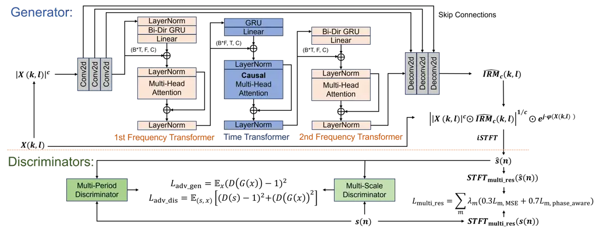
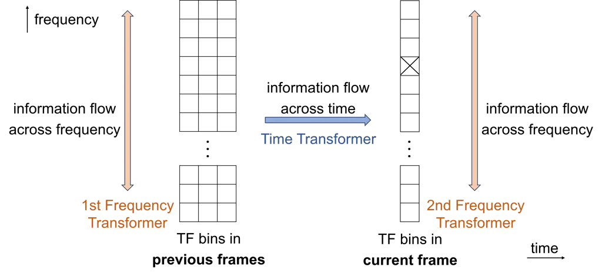

# Study of Lightweight Transformer Architectures for Single-Channel Speech Enhancement

Haixin Zhao, Nilesh Madhu Affiliation: IDLab, Department of Electronics
and Information Systems  
Ghent University - imec  
Ghent, Belgium  
{haixin.zhao, nilesh.madhu}@ugent.be

###### Abstract

In speech enhancement, achieving state-of-the-art (SotA) performance
while adhering to the computational constraints on edge devices remains
a formidable challenge. Networks integrating stacked temporal and
spectral modelling effectively leverage improved architectures such as
transformers; however, they inevitably incur substantial computational
complexity and model expansion. Through systematic ablation analysis on
transformer-based temporal and spectral modelling, we demonstrate that
the architecture employing streamlined Frequency-Time-Frequency (FTF)
stacked transformers efficiently learns global dependencies within
causal context, while avoiding considerable computational demands.
Utilising discriminators in training further improves learning efficacy
and enhancement without introducing additional complexity during
inference. The proposed lightweight, causal, transformer-based
architecture with adversarial training (LCT-GAN) yields SoTA performance
on instrumental metrics among contemporary lightweight models, but with
far less overhead. Compared to DeepFilterNet2, the LCT-GAN only requires
6% of the parameters, at similar complexity and performance. Against
CCFNet+(Lite), LCT-GAN saves 9% in parameters and 10% in
multiply-accumulate operations yet yielding improved performance.
Further, the LCT-GAN even outperforms more complex, common baseline
models on widely used test datasets.

###### Index Terms: 

speech enhancement, GAN, lightweight model, causal transformer, temporal
and spectral modelling.

## I Introduction

Deep learning-based methods have come to dominate the field of speech
enhancement, surpassing statistical approaches \[1\]. These methods are
continually improving and evolving with the progress being made on the
development of more powerful deep learning architectures and mechanisms,
such as transformers and attention \[2, 3\]. However, such improvements
come with substantial computational complexity, which is a challenge for
practical applications on edge devices. This has led to research focused
on the development of lightweight speech enhancement models in
resource-constrained scenarios.

Prior work: Due to their sequential modelling capabilities, recurrent
neural network (RNN) layers, such as long short-term memory networks
(LSTMs) and Gated Recurrent Units (GRUs) can be used to efficiently
learn spectral and temporal context of speech \[4, 5\]. Incorporating
such elements within speech enhancement models results in a significant
boost in performance - making these components indispensable in
state-of-the-art (SotA) architectures \[6, 7, 8\]. To reduce their
complexity and parameters, grouping strategies were developed and
applied to this component, which is usually the main computational
bottleneck in most lightweight enhancement architectures \[7, 8, 9, 10,
11, 12\]. Complexity and footprint reduction were also addressed by
compressing models and replacing standard convolutions with depth-wise
separable convolutions \[10\]. Other approaches endeavoured to address
this problem at the signal representation level e.g., by reducing the
frequency resolution using fewer sub-bands or equivalent rectangular
bandwidth (ERB) features \[10, 9, 7, 8\]. Still other approaches have
endeavoured to significantly reduce the model size by employing the
aforementioned strategies to the extreme \[10, 11\]. However, while this
leads to ultra-low complexity, such optimisation is usually paired with
an inevitable degradation of the enhancement performance.

Instead of focusing only on network refinements, DeepFilterNet and its
subsequent iterations \[9, 7, 8\], consisting of two sub-networks,
incorporated domain knowledge from statistical approaches. The first
stage estimates the envelope using ERB features, while the second stage
of deep filtering further enhances the periodic components.
DeepFilterNet2$`\&`$3 can be considered SotA among lightweight models in
terms of enhancement performance, albeit still with a considerable
number of parameters. A coarse and fine two-stage CCFNet(Lite) was
proposed in  \[6\], for further reducing the model footprint while
maintaining comparable complexity as DeepFilterNet2.



Fig. 1: The architecture of the proposed LCT-GAN model, with the
’generator’ and the discriminators distinguished by dotted lines. The
generator is a predictive network to estimate masks for denoising. The
$`L_{\mathrm{adv\_gen}}`$ and $`L_{\mathrm{adv\_dis}}`$ denote the
adversarial loss components for the training of the generator and
discriminator, respectively. $`G()`$ denotes the generator (LCT), while
$`D()`$ is the discriminator. A multi-resolution loss,
$`L_{\mathrm{multi\_res}}`$, is employed for the generator training.
Skip connections are implemented by point-wise convolutional layers. The
input tensor dimensions for each transformer are explicitly indicated.

However, these reductions in parameters are concomitant with
considerable performance decline, motivating the exploration of more
efficient modelling architectures. Interleaving temporal and spectral
modelling has demonstrated its impressive potential in enhancement
performance \[2, 4\], yet the cumulative stacking of these modules
results in a substantial increase in computational overhead, rendering
it impractical for deployment on edge devices. Additionally, as more
modules are stacked, the performance gains tend to become incremental,
highlighting the necessity for investigation on efficient stacking
strategies and the sequencing of temporal and spectral modelling.

Contributions: To surmount these challenges and gain deeper insights
into the characteristics of Time-Frequency (TF) modelling, we conduct a
systematic ablation study based on transformer blocks. Multi-Head
Attention (MHA) layers are introduced to address the limitations of RNNs
in capturing long-range dependencies and to dynamically attend to
salient information, thereby contributing to modelling.

To further reduce the computational complexity and footprint, when
modelling along one dimension (temporal or spectral), parameter sharing
is applied across the other dimension. Consequently, the reduced feature
size of GRUs and MHA blocks significantly scales down the model
footprint, enabling the integration of superior yet computationally
intensive attention mechanism in lightweight models. However, such
sharing prevents simultaneous dependency exploitation across the time
and frequency dimensions. This is in contrast to existing methods which
implicitly allow this by flattening the unmodeled dimension into the
feature dimension \[12\]. Therefore, we build upon the insights from our
ablation study, and further propose a streamlined
Frequency-Time-Frequency (FTF) sequential modelling bottleneck,
facilitating efficient global dependency exploitation across causal
contexts. Trapezoidal masking is implemented in the time transformer to
enforce causality while constraining computational overhead, to meet
stricter latency requirements in certain scenarios.

Lastly, to further improve the preservation of speech components,
without imposing additional overhead during inference, multi-scale and
multi-period discriminators are employed in training. The corresponding
ablation study shows the resulting benefits. With significantly fewer
parameters and lower computational complexity, the proposed LCT-GAN
achieves comparable (or better) enhancement performance to the
above-mentioned SotA lightweight models and even outperforms more
complex models.

## II Method

### II-A Proposed LCT-GAN and Signal Model

Fig. 1 illustrates the architecture of the proposed LCT-GAN model. The
microphone signal $`x(n)`$, input to the network, is assumed to be an
additive mixture of the target speech $`s(n)`$ and background noise,
$`v(n)`$. The LCT ‘generator’ is a predictive model, estimating the
underlying clean speech, $`\widehat{s}(n)`$, by applying a (real-valued)
time-frequency mask to $`X(k,l)`$ (the short-time Fourier transform
(STFT) domain representation of $`x(n)`$) followed by the inverse STFT.
The generator training target is the compressed-domain ideal ratio mask
(IRM), defined as:

```math
\textstyle\widehat{IRM}_{\text{c}}(k,l)=\frac{\lvert S(k,l)\rvert^{c}}{\lvert X(k,l)\rvert^{c}+\gamma} \tag{1}
```

where $`k,l`$ represent the frequency-bin and time-frames, and
$`\gamma`$ is a regularisation constant. The compression factor ($`c`$)
is set to 0.3 to refine the mask estimation for lower-energy speech
components. The mask in the linear domain is obtained by exponentiating
$`\widehat{IRM}_{\text{c}}(k,l)`$. Thus, we dedicate the network
resources to learning solely a magnitude estimation, while retaining the
distorted phase. This choice is ratified by previous work showing
negligible gain from the prediction of complex-valued outputs \[13\] and
even degradation caused by compensation between magnitude and phase in
these networks \[14\]. We further validate this by benchmarking the
proposed magnitude estimation against approaches with complex-valued
output, all within the LCT framework.

The generator adopts a U-Net structure known for its high efficiency.
Here, a 3-layer causal convolutional encoder-decoder is applied. Each
encoder and decoder layer, except the output layer, is followed by a
leaky ReLU with $`\alpha=0.03`$. Skip connections facilitate the
transfer of latent features from the encoder to the decoder.

To further improve the speech estimate, a network incorporating
waveform-based multi-period and multi-scale discriminators is used,
providing additional loss components through joint adversarial training.
While the multi-period discriminator is utilised to capture long-term
latent structures  \[15\], the multi-scale discriminator  \[16\]
facilitates the efficient learning of periodic patterns.

### II-B Efficient FTF Transformers

Building upon the subsequent ablation study, we propose the FTF
bottleneck with three lightweight sequential FTF transformers,
effectively exploiting global information while significantly reducing
the computation and parameter requirements in comparison to large-scale
transformers in \[2, 3\]. Each transformer incorporates an RNN block and
an attention block for global dependency exploitation. Residual
connections are utilised, followed by Layer Normalisation for both the
MHA blocks and GRUs. Trapezoidal causal masking is performed in the MHA
block of the time transformer to maintain causality while limiting the
context length to a maximum of 1 second. As a result, the complexity is
independent of utterance length.



Fig. 2: The schematic diagram for the information-exploitation flow of
proposed efficient FTF-transformer structure. TF bins are represented by
small blocks. Information flows from TF bins of previous and current
frames to each certain TF bin (marked by a cross) are denoted by
coloured arrows. The x and y axis are time and frequency dimensions,
respectively.

The resulting ‘ladder-shaped’ information-exploitation flow is presented
in Fig. 2. In the first frequency transformer, information is exchanged
and explored along the frequency dimension, allowing each TF bin to gain
context from other TF bins within the same frame. Subsequently, the
causal time transformer propagates all dependencies from previous frames
to the current frame. The second frequency transformer facilitates the
re-exchange of updated information along the frequency dimension,
thereby achieving global dependency exploitation.

The feature-dimension size quadratically contributes to the GRU
complexity. Therefore, in the time transformer, instead of modelling the
frequency dimension together with the feature dimension as in
conventional GRUs, shared parameters of the GRU are utilised across
frequency, for the temporal modelling, as shown in Fig. 1. The global
spectral dependency is nevertheless extracted by the anterior and
posterior frequency transformers, with shared parameters across all
frames. Compared to the conventional GRU bottleneck of CRUSE in \[12\],
the proposed FTF transformers reduces Multiply-Accumulate Operations
(MACs) and parameters by $`27\%`$ and $`98\%`$, respectively.

### II-C Network Parameters and Training Target

Encoder and decoder layers in the LCT-GAN model use a kernel size of (2, 3) and a stride of (1, 2) for time and frequency. The output channels
are $`\{16,32,64\}`$ for the encoder layers and $`\{32,16,1\}`$,
respectively, for the decoder layers. Padding is applied as necessary to
ensure the preservation of dimensions. The hidden size is configured to
be the same as the channel number of input feature for each grouped GRU
layer, with a grouping factor of 4 applied. For the MHA, 4 heads are
used.

For the training target, we applied the loss function in \[12\]
including Mean Squared Error (MSE) and phase-aware MSE and extended it
to a multi-resolution version \[17\]. The compression factor is set to
0.3, aligned with that in the network. The sizes of multi-resolution
STFT are defined as $`m\in\{320,512,768\}`$, all with an overlap of
50$`\%`$. As the mask estimate is for an STFT size of 512, the weight
$`\lambda_{512}`$ is set to 2, twice that of others. The loss function
for the generator comprises $`L_{\mathrm{adv\_gen}}`$ and the
$`L_{\mathrm{multi\_res}}`$, the components of which are the same as
\[16\]. We observed that time-domain loss components
$`L_{\mathrm{adv\_gen}}`$ and $`L_{\mathrm{adv\_dis}}`$ generally
exhibited larger values compared to spectrogram-domain loss components
$`L_{\mathrm{multi\_res}}`$. Therefore, their weights are set to
$`1\times 10^{-2}`$, to balance their contribution.

## III Experiments

### III-A Experiment Setup

Experiments were carried out on two widely-used datasets:
Voicebank+Demand \[18\] and DNS3 challenge \[19\]. For the experiments
on DNS3 dataset, the validation and the 140-hour training dataset are
generated from DNS3 wide-band English clean and noise dataset,
encompassing Signal-to-Noise Ratios (SNRs) in the range of -5 to 20 dB.
The sampling rate is 16 kHz. The STFT window length is configured to
512, with a 50$`\%`$ overlap. The generator adopts the AdamW optimizer
with a learning rate of $`5\times 10^{-4}`$ and a batch size of 8,
whereas the architecturally complex discriminators utilize a
significantly lower learning rate to mitigate training instability
induced by adversarial dominance. Specifically, $`1\times 10^{-7}`$ is
for the DNS3 dataset and $`1\times 10^{-9}`$ is for Voicebank+Demand
dataset. The $`\beta`$ coefficients of (0.9, 0.99) and (0.8, 0.99) are
assigned to the generator and discriminators, respectively.

### III-B Studies on Validating the Efficacy of FTF Structure and Magnitude Estimation Within the Proposed LCT Framework

|              |                 |                   |       |        |                 |      |      |
| ------------ | --------------- | ----------------- | ----- | ------ | --------------- | ---- | ---- |
| Model        |                 | Synthetic Dataset |       |        | Real Recordings |      |      |
|              |                 | PESQ              | STOI  | SI-SDR | BAK             | SIG  | OVL  |
| Noisy speech |                 | 1.53              | 0.863 | 8.72   | 2.41            | 3.10 | 2.17 |
| Real-valued  | TT              | 2.18              | 0.895 | 14.01  | 3.67            | 2.93 | 2.54 |
| Mask         | FF              | 2.34              | 0.908 | 14.24  | 3.98            | 2.69 | 2.45 |
| Outputs      | TF              | 2.55              | 0.923 | 15.55  | 4.00            | 2.89 | 2.64 |
|              | FT              | 2.57              | 0.924 | 15.73  | 3.99            | 2.93 | 2.66 |
|              | TFT             | 2.62              | 0.929 | 16.00  | 3.98            | 2.95 | 2.68 |
|              | FTF (LCT)       | 2.68              | 0.932 | 16.29  | 4.01            | 2.93 | 2.67 |
|              | TFTF            | 2.68              | 0.934 | 16.40  | 3.99            | 2.97 | 2.71 |
|              | FTFT            | 2.69              | 0.933 | 16.25  | 4.00            | 2.99 | 2.73 |
| Complex-     | LCT RI mapping  | 2.60              | 0.927 | 15.30  | 4.00            | 2.94 | 2.67 |
| Valued       | LCT RI masking  | 2.65              | 0.930 | 15.93  | 4.01            | 2.94 | 2.68 |
| Outputs      | LCT MCS mapping | 2.63              | 0.928 | 15.20  | 4.01            | 2.95 | 2.69 |
|              | LCT MCS hybrid  | 2.62              | 0.929 | 15.53  | 4.01            | 2.95 | 2.69 |

- a
  All models are based on the generator network without discriminators.
- b
  The T and F transformers used in this study have comparable MACs and
  parameters, thereby ensuring a fair basis for evaluation.
- c
  All results are obtained causally without the need of look-ahead
  frames.

TABLE I: Results on Temporal / Spectral modelling and models with
complex-valued outputs

Table I presents the ablation study on the bottlenecks formed by various
time and frequency transformer combinations. Evaluations are on both the
1-hour unseen test set synthesised by DNS3 datasets and the official
DNS3 real-recorded blind English test set. Compared to TT and FF models,
TF and FT models demonstrate the efficacy of interleaved temporal and
spectral modelling across metrics. The comparison of TT and FF models
highlights that spectral modelling achieves superior performance in
wide-band Perceptual Evaluation of Speech Quality (PESQ) \[20\],
Short-Term Objective Intelligibility (STOI) \[21\], Scale-Invariant
Signal-to-Distortion Ratio (SI-SDR) \[22\], and the BAK of DNS-MOS P.835
metrics \[23\], while the temporal modelling enhances SIG more. These
observations highlight the effectiveness of spectral modelling on noise
suppression and overall quality enhancement. Results on intrusive
metrics indicate that the FTF structure offers the best trade-off with
improvements saturating with more stages. As intrusive metrics reflect
improvement with respect to ground truth, we select the FTF structure as
the bottleneck of the proposed LCT network.

LCT models utilising the FTF bottleneck with complex-valued outputs such
as Real-Imaginary (RI) masking and mapping, as well as Magnitude-Cos-Sin
(MCS) mapping and hybrid \[24\], incur slightly more MACs. However, as
demonstrated in Table I, they fail to improve performance in the
intrusive metric scores. Thus, the complex-valued estimation is
unnecessary in this context.

### III-C Evaluations Against Baselines

Next, we benchmark the proposed LCT-GAN model against SotA lightweight
models \[9, 7, 8, 6\] as well as contemporary, more sophisticated models
\[25, 26\]. To ensure a fair comparison with SotA baselines  \[7, 8\],
which employ a two-frame look-ahead yielding an overall latency of 40
$`ms`$, we adopt a one-frame look-ahead, resulting in a comparable
latency of 48 $`ms`$. Additionally, experiments are conducted on the
causal implementation of LCT-GAN with a 32 $`ms`$ latency.

|                                |                  |                  |      |      |      |      |      |        |
| ------------------------------ | ---------------- | ---------------- | ---- | ---- | ---- | ---- | ---- | ------ |
| Model                          | Param            | MAC              | PESQ | CSIG | CBAK | COVL | STOI | SI-SDR |
|                                | \[M\]            | \[G/s\]          |      |      |      |      |      |        |
| Noisy speech                   | \-               | \-               | 1.97 | 3.34 | 2.44 | 2.63 | 0.92 | 8.4    |
| FRCRN \[25\]                   | 10.27            | 12.3             | 3.21 | 4.23 | 3.64 | 3.73 | \-   | \-     |
| S-8.1GF \[26\]                 | 1.38             | 4.07             | 3.12 | 4.45 | 3.61 | 3.82 | 0.95 | \-     |
| CCFNet+$`\triangle`$ \[6\]     | 0.62             | 1.47             | 3.03 | 4.27 | 3.55 | 3.61 | 0.95 | 19.1   |
| CCFNet+Lite$`\triangle`$ \[6\] | 0.16             | 0.39             | 2.94 | \-   | \-   | \-   | \-   | 19.0   |
| DeepFilterNet \[9\]            | 1.78             | 0.35             | 2.81 | 4.14 | 3.31 | 3.46 | 0.94 | 16.6   |
| DeepFilterNet2 \[7\]           | 2.31             | 0.36             | 3.08 | 4.30 | 3.40 | 3.70 | 0.94 | \-     |
| DeepFilterNet3 \[8\]           | 2.31$`\diamond`$ | $`0.36\diamond`$ | 3.17 | 4.34 | 3.61 | 3.77 | 0.94 | \-     |
| LCT (Generator)                | 0.14             | 0.35             | 3.01 | 4.38 | 3.64 | 3.75 | 0.95 | 18.8   |
| LCT-GAN                        | 0.14             | 0.35             | 3.06 | 4.41 | 3.66 | 3.80 | 0.95 | 18.8   |
| LCT-GAN+PCS                    | 0.14             | 0.35             | 3.20 | 4.39 | 3.46 | 3.84 | 0.94 | \*     |
| LCT-GAN+PCS$`\triangle`$       | 0.14             | 0.35             | 3.16 | 4.35 | 3.45 | 3.81 | 0.94 | \*     |

- a
  Results of baselines are sourced from the respective references. A ‘-’
  indicates that the result is not reported in the corresponding
  reference.
- b
  ’$`\triangle`$’ indicates that the model is implemented in a causal
  manner.
- c
  ‘\*’ denotes that SI-SDR is inapplicable for PCS training due to
  modified training targets.
- d
  $`\diamond`$: MACs and footprint were not explicitly reported in \[8\]
  but are expected to be similar to those in \[7\], given the minor
  modifications in \[8\].

TABLE II: Evaluation results on Voicebank+Demand test dataset

Voicebank+Demand Dataset: In Table II, the evaluation results of the
proposed LCT-GAN model on the Voicebank+Demand Dataset are presented in
comparison to other baselines, along with their complexity and
footprint, expressed by MAC/s and parameter numbers, respectively.
Composite instrumental metrics (CSIG, CBAK, COVL) \[27\], are
additionally introduced. Utilising only $`\approx\boldsymbol{6\%}`$ of
the parameters of DeepFilterNet2 and slightly fewer MACs, LCT-GAN
achieves comparable, if not better scores across all metrics. LCT-GAN
does, however, exhibit a PESQ reduction of 0.11 compared to
DeepFilterNet3. Notably, when augmented with Perceptual Contrast
Stretching (PCS) \[28\]—a technique designed to exaggerate speech
features during training to improve intrusive metrics—LCT-GAN attains
PESQ scores comparable to those of DeepFilterNet3 and generally
surpasses all other lightweight models in all metrics. In contrast, the
causal CCFNet+(Lite), which entails slightly higher complexity and a
larger footprint than LCT-GAN, demonstrates a marked PESQ degradation of
0.17 relative to the causal implementation of LCT-GAN with PCS.
Interestingly, our model variants are capable of surpassing even
popular, more sophisticated models such as FRCRN \[25\] and
MANNER-S-8.1GF \[26\], which possess roughly one or two orders of
magnitude larger MACs and parameters.

|                      |                     |                     |                     |
| -------------------- | ------------------- | ------------------- | ------------------- |
| Model                | BAKMOS              | SIGMOS              | OVLMOS              |
| Noisy speech         | 2.41 ($`\pm 0.65`$) | 3.10 ($`\pm 0.47`$) | 2.17 ($`\pm 0.43`$) |
| DeepFilterNet \[9\]  | 3.83 ($`\pm 0.27`$) | 3.02 ($`\pm 0.41`$) | 2.69 ($`\pm 0.40`$) |
| DeepFilterNet2 \[7\] | 3.95 ($`\pm 0.19`$) | 3.08 ($`\pm`$0.38)  | 2.78 ($`\pm`$0.38)  |
| DeepFilterNet3 \[8\] | 3.93 ($`\pm 0.20`$) | 3.02 ($`\pm 0.40`$) | 2.72 ($`\pm 0.39`$) |
| LCT (Generator)      | 4.02 ($`\pm`$0.11)  | 3.00 ($`\pm 0.40`$) | 2.74 ($`\pm 0.40`$) |
| LCT-GAN              | 4.04 ($`\pm`$0.09)  | 3.06 ($`\pm 0.39`$) | 2.80 ($`\pm`$0.38)  |

- a
  Results of baselines are obtained by official Python package v0.5.6
  \[7\].
- b
  Parameters and MACs of each model are the same as Table II.

TABLE III: DNSMOS P.835 Evaluation results on DNS3 blind English test
dataset – mean and standard deviation of scores.

DNS3 dataset: Considering the limited size of Voicebank+Demand, LCT-GAN
is further trained on the synthesised DNS3 dataset and evaluated on the
DNS3 real-recorded blind English test dataset \[19\]. Due to the
real-recorded nature of the test set, non-referential DNS-MOS metrics
\[23\] are used. The results in Table  III indicate that the LCT-GAN
outperforms all DeepFilterNet models in BAK and achieves considerable
reduction in variance, suggesting better and more consistent noise
suppression. Moreover, LCT-GAN remains consistent with SotA performance
in DNS-MOS metrics.

The evaluation results of Table II and Table III reveal that the LCT
model, even without discriminators and acting as a predictive model, can
still achieve comparable performance to SotA models. This showcases the
efficient latent-domain information exploitation of the FTF transformer
in LCT. The ablation study of discriminators demonstrates that they can
further contribute to improvements on speech quality metrics, especially
in PESQ, DNSMOS- SIG & OVL. This highlights that discriminators promote
preserving speech components while maintaining robust noise suppression
(no degradation on BAK).

Audio samples showcasing the discussed result trends are available at
[https://aspire.ugent.be/demos/EUSIPCO2025HZ/](https://aspire.ugent.be/demos/EUSIPCO2025HZ/).
These samples further showcase the robust noise suppression and
effective artefact elimination capacity of LCT-GAN. Notably, the
spectral banding artefacts of DeepFilterNet are absent.

## IV Conclusion

We proposed a lightweight, causal, transformer-based GAN model designed
for speech enhancement in resource-constrained applications. The
proposed FTF transformer block achieves an optimal trade-off between
performance and computational efficiency by effectively capturing global
dependencies through a refined interleaving of temporal and spectral
modelling. This minimises both complexity and parameter footprint.
Experimental results indicate that the proposed LCT-GAN model yields
SoTA performance in metrics among contemporary lightweight enhancement
models, with considerable savings in parameters and MACs relative to
these baselines. The additional ablation study on utilising
discriminators demonstrates that multi-scale and multi-period
discriminators result in improved speech component preservation. With
PCS, a metric-enhancement strategy, the LCT-GAN can even exhibit
performance that rivals more complex, representative models. However,
some over suppression of weak fricatives and sibilants indicate areas
for improvement in future work.

## References

- \[1\] D. Wang and J. Chen, “Supervised speech separation based on deep
  learning: An overview,” _IEEE/ACM transactions on audio, speech, and
  language processing_, vol. 26, no. 10, pp. 1702–1726, 2018.
- \[2\] Y.-X. Lu, Y. Ai, and Z.-H. Ling, “Mp-senet: A speech enhancement
  model with parallel denoising of magnitude and phase spectra,” in
  _INTERSPEECH 2023_, 2023, pp. 3834–3838.
- \[3\] S. Abdulatif, R. Cao, and B. Yang, “Cmgan: Conformer-based
  metric-gan for monaural speech enhancement,” _IEEE/ACM Transactions on
  Audio, Speech, and Language Processing_, 2024.
- \[4\] Y. Luo, Z. Chen, and T. Yoshioka, “Dual-path rnn: efficient long
  sequence modeling for time-domain single-channel speech separation,”
  in _ICASSP 2020-2020 IEEE International Conference on Acoustics,
  Speech and Signal Processing (ICASSP)_. IEEE, 2020, pp. 46–50.
- \[5\] X. Le, H. Chen, K. Chen, and J. Lu, “Dpcrn: Dual-path
  convolution recurrent network for single channel speech enhancement,”
  in _Interspeech 2021_, 2021, pp. 2811–2815.
- \[6\] F. Dang, H. Chen, Q. Hu, P. Zhang, and Y. Yan, “First coarse,
  fine afterward: A lightweight two-stage complex approach for monaural
  speech enhancement,” _Speech Communication_, vol. 146, pp.
  32–44, 2023.
- \[7\] H. Schröter, A. N. Escalante-B., T. Rosenkranz, and A. Maier,
  “DeepFilterNet2: Towards real-time speech enhancement on embedded
  devices for full-band audio,” in _17th International Workshop on
  Acoustic Signal Enhancement (IWAENC 2022)_, 2022.
- \[8\] H. Schröter, T. Rosenkranz, A. N. Escalante-B., and A. Maier,
  “DeepFilterNet: Perceptually motivated real-time speech enhancement,”
  in _INTERSPEECH_, 2023.
- \[9\] H. Schröter, A. N. Escalante-B., T. Rosenkranz, and A. Maier,
  “DeepFilterNet: A low complexity speech enhancement framework for
  full-band audio based on deep filtering,” in _ICASSP 2022 IEEE
  International Conference on Acoustics, Speech and Signal Processing
  (ICASSP)_. IEEE, 2022.
- \[10\] X. Rong, T. Sun, X. Zhang, Y. Hu, C. Zhu, and J. Lu, “Gtcrn: A
  speech enhancement model requiring ultralow computational resources,”
  in _ICASSP 2024-2024 IEEE International Conference on Acoustics,
  Speech and Signal Processing (ICASSP)_. IEEE, 2024, pp. 971–975.
- \[11\] L. Yang, W. Liu, R. Meng, G. Lee, S. Baek, and H.-G. Moon,
  “Fspen: an ultra-lightweight network for real time speech enahncment,”
  in _ICASSP 2024-2024 IEEE International Conference on Acoustics,
  Speech and Signal Processing (ICASSP)_. IEEE, 2024, pp. 10 671–10 675.
- \[12\] S. Braun, H. Gamper, C. K. Reddy, and I. Tashev, “Towards
  efficient models for real-time deep noise suppression,” in _Proc.
  Intl. Conference on Acoustics, Speech and Signal Processing
  (ICASSP)_. IEEE, 2021, pp. 656–660.
- \[13\] H. Wu, K. Tan, B. Xu, A. Kumar, and D. Wong, “Rethinking
  complex-valued deep neural networks for monaural speech enhancement,”
  in _INTERSPEECH 2023_, 2023, pp. 3889–3893.
- \[14\] Z.-Q. Wang, G. Wichern, and J. Le Roux, “On the compensation
  between magnitude and phase in speech separation,” _IEEE Signal
  Processing Letters_, vol. 28, pp. 2018–2022, 2021.
- \[15\] K. Kumar, R. Kumar, T. De Boissiere, L. Gestin, W. Z. Teoh,
  J. Sotelo, A. De Brebisson, Y. Bengio, and A. C. Courville, “Melgan:
  Generative adversarial networks for conditional waveform synthesis,”
  _Advances in neural information processing systems_, vol. 32, 2019.
- \[16\] J. Kong, J. Kim, and J. Bae, “Hifi-gan: Generative adversarial
  networks for efficient and high fidelity speech synthesis,” _Advances
  in neural information processing systems_, vol. 33, pp.
  17 022–17 033, 2020.
- \[17\] R. Yamamoto, E. Song, and J.-M. Kim, “Parallel wavegan: A fast
  waveform generation model based on generative adversarial networks
  with multi-resolution spectrogram,” in _ICASSP 2020-2020 IEEE
  International Conference on Acoustics, Speech and Signal Processing
  (ICASSP)_. IEEE, 2020, pp. 6199–6203.
- \[18\] C. Valentini-Botinhao, X. Wang, S. Takaki, and J. Yamagishi,
  “Investigating rnn-based speech enhancement methods for noise-robust
  text-to-speech.” in _SSW_, 2016, pp. 146–152.
- \[19\] C. K. Reddy, H. Dubey, K. Koishida, A. Nair, V. Gopal,
  R. Cutler, S. Braun, H. Gamper, R. Aichner, and S. Srinivasan,
  “Interspeech 2021 deep noise suppression challenge,” in _Interspeech
  2021_, 2021, pp. 2796–2800.
- \[20\] International Telecommunication Union, “Wideband extension to
  Recommendation P.862 for the assessment of wideband telephone networks
  and speech codecs,” ITU-T Recommendation P.862.2, 2007.
- \[21\] C. H. Taal, R. C. Hendriks, R. Heusdens, and J. Jensen, “A
  short-time objective intelligibility measure for time-frequency
  weighted noisy speech,” in _2010 IEEE international conference on
  acoustics, speech and signal processing_. IEEE, 2010, pp. 4214–4217.
- \[22\] J. Le Roux, S. Wisdom, H. Erdogan, and J. R. Hershey,
  “Sdr–half-baked or well done?” in _ICASSP 2019-2019 IEEE International
  Conference on Acoustics, Speech and Signal Processing (ICASSP)_. IEEE,
  2019, pp. 626–630.
- \[23\] C. K. Reddy, V. Gopal, and R. Cutler, “DNSMOS p. 835: A
  non-intrusive perceptual objective speech quality metric to evaluate
  noise suppressors,” in _Proc. IEEE Intl. Conference on Acoustics,
  Speech and Signal Processing (ICASSP)_. IEEE, 2022, pp. 886–890.
- \[24\] A. Bohlender, A. Spriet, W. Tirry, and N. Madhu, “Insights into
  magnitude and phase estimation by masking and mapping in dnn-based
  multichannel speaker separation,” in _2024 IEEE International
  Conference on Acoustics, Speech, and Signal Processing Workshops
  (ICASSPW)_, 2024, pp. 500–504.
- \[25\] S. Zhao, B. Ma, K. N. Watcharasupat, and W.-S. Gan, “Frcrn:
  Boosting feature representation using frequency recurrence for
  monaural speech enhancement,” in _ICASSP 2022-2022 IEEE International
  Conference on Acoustics, Speech and Signal Processing (ICASSP)_. IEEE,
  2022, pp. 9281–9285.
- \[26\] W. Shin, H. J. Park, J. S. Kim, B. H. Lee, and S. W. Han,
  “Multi-view attention transfer for efficient speech enhancement,” in
  _Interspeech 2022_, 2022, pp. 1198–1202.
- \[27\] Y. Hu and P. C. Loizou, “Evaluation of objective quality
  measures for speech enhancement,” _IEEE Transactions on audio, speech,
  and language processing_, vol. 16, no. 1, pp. 229–238, 2007.
- \[28\] R. Chao, C. Yu, S. wei Fu, X. Lu, and Y. Tsao, “Perceptual
  contrast stretching on target feature for speech enhancement,” in
  _Interspeech 2022_, 2022, pp. 5448–5452.
