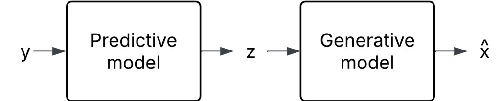
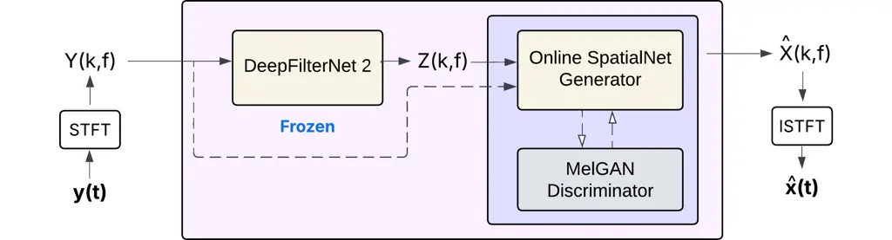
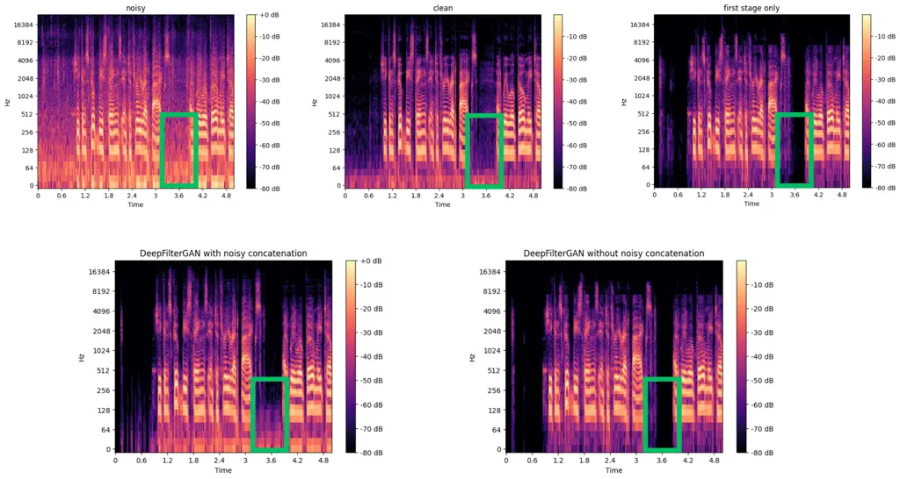

Serbest Stojkovic Cernak Harper École Polytechnique Fédérale de Lausanne
(EPFL)Switzerland LogitechSwitzerland

# DeepFilterGAN: A Full-band Real-time Speech Enhancement System with GAN-based Stochastic Regeneration

Sanberk    Tijana    Milos    Andrew Affiliation: Electrical and
Electronics Engineering Affiliation: Audio Machine Learning

###### Abstract

In this work, we propose a full-band real-time speech enhancement system
with GAN-based stochastic regeneration. Predictive models focus on
estimating the mean of the target distribution, whereas generative
models aim to learn the full distribution. This behavior of predictive
models may lead to over-suppression, i.e. the removal of speech content.
In the literature, it was shown that combining a predictive model with a
generative one within the stochastic regeneration framework can reduce
the distortion in the output. We use this framework to obtain a
real-time speech enhancement system. With 3.58M parameters and a low
latency, our system is designed for real-time streaming with a
lightweight architecture. Experiments show that our system improves over
the first stage in terms of NISQA-MOS metric. Finally, through an
ablation study, we show the importance of noisy conditioning in our
system. We participated in 2025 Urgent Challenge with our model and
later made further improvements.

###### keywords

speech enhancement, stochastic regeneration, generative adversarial
network

^(†)^(†)email: sanberk.serbest@epfl.ch, tstojkovic@logitech.com,
mcernak@logitech.com, aharper@logitech.com

## 1 Introduction

In the deep learning based speech enhancement (SE) literature, there are
many approaches including RNN-based methods \[1\], transformer-based
methods \[2\], Generative Adversarial Network (GAN)-based methods \[3\]
and diffusion-based models \[4, 5\]. Many works directly focus on
denoising or dereverberation tasks \[4\] while there is also an attempt
to obtain a universal SE system that tackles many distortion types
together \[6\]. While the superiority of such models is an ongoing
research question, some advantages and disadvantages of different
approaches are reported. The deep learning based SE models can be
divided into two main categories, namely predictive and generative
models. Predictive models aim to estimate the mean of the clean speech
distribution conditioned on the input noisy speech while the generative
models try to learn the clean speech distribution instead of its mean.
While estimation of the mean in predictive models may cause
overdenoising \[5\], the mismatches in the learned clean speech
distribution may lead the generative models to hallucinations \[7\]. On
the other hand, thanks to their capability of recovering lost
information, the generative structures offer a promising direction for
the future of universal speech enhancement. In some works \[5, 8, 9,
10\], the predictive and generative models are combined in order to
utilize the advantages of both approaches. In \[5\], a diffusion based
stochastic regeneration framework is proposed. In \[8\], the extended
Poisson flow generative model is used with a predictive model while
\[9\] uses a GAN in a similar setting.

In addition to the output speech quality, another aspect of speech
enhancement models is the deployment requirements. For some speech
enhancement applications such as mobile telecommunication, the SE system
must be able to process streaming data, which requires a real-time and
causal system. This requirement may limit the output speech quality
because the model can’t exploit some temporal relations in the data due
to its causal structure. In addition, the real-time requirement imposes
a restriction on the network size, which may reduce the representation
capacity of the model. The diffusion-based systems \[4, 5, 6\] usually
have a big network size and require several denoising steps, i.e.
multiple forward passes, during the inference time. Given that GANs
require only a single forward pass during inference and can achieve good
performance even with a compact network, they are a good candidate for
the real-time generative speech enhancement systems.

In this work, a real-time, low-latency speech enhancement model based on
stochastic regeneration with a GAN is proposed. Our system consists of
two stages, namely a predictive first stage and a generative second
stage. The predictive first stage is adopted from DeepFilterNet \[11\].
The second stage is a GAN where its generator adopts the network of
OnlineSpatialNet \[12\] and its discriminator adopts the discriminator
of MelGAN \[13\]. Our training scheme consists of two steps. The first
stage predictive model is trained on the training dataset as a
standalone speech enhancement model. In the second step, the
intermediate enhanced speech, i.e. the output of the pre-trained first
stage, is concatenated with the noisy input speech to provide further
noise information and fed into the second stage. During this step, the
first stage is kept frozen while the second stage is trained on the same
training dataset. Our system processes full-band audio in the
time-frequency domain. We show that a GAN based second stage can improve
the performance of a predictive first stage without breaking the real
time requirements as well as the usefulness of conditioning on the noisy
speech.

## 2 Background and Related Works

A conventional single channel speech enhancement system tries to recover
the clean speech signal $`\mathbf{x(t)}`$ by observing the noisy speech
signal $`\mathbf{y(t)}=\mathbf{h(t)}*\mathbf{x(t)}+\mathbf{n(t)}`$ where
$`\mathbf{h(t)}`$ is the impulse response of the channel and
$`\mathbf{n(t)}`$ is an additive noise. This relation can also be
represented in short-time Fourier Transform (STFT) domain as
$`\mathbf{Y(k,f)}=\mathbf{H(k,f)}\cdot\mathbf{X(k,f)}+\mathbf{N(k,f)}`$
where $`\mathbf{X(k,f)}`$ is the STFT of clean speech signal and
$`\mathbf{k,f}`$ being the time and frequency indices. Further
distortion types such as clipping, bandwidth limitation, codec
distortion, packet loss and wind noise increase the severity of the
speech distortion leading to a need for more advanced speech enhancement
systems.

### 2.1 DeepFilterNet

DeepFilterNet \[11\] is a two-stage speech enhancement model that uses
deep filtering. The first stage aims to improve the speech envelope and
is performed in equivalent rectangular bandwidth (ERB) domain. Then, the
second stage estimates the coefficients of a deep filter to further
enhance the periodic structure of the speech in complex domain. Due to
its strong performance and real-time suitability, we use it as the
predictive model in our system’s first stage.

### 2.2 Stochastic Regeneration

Due to the nature of their objective functions, the predictive models’
output converges to the mean of the clean speech distribution given the
noisy input speech, i.e. $`\mathbb{E}[\mathbf{x}|\mathbf{y}]`$ \[5\].
This behavior leads to the removal of fine details in the signal, which
corresponds to an overdenoising in speech enhancement. Recovering lost
speech content is inherently ill-posed; however, generative approaches
can reconstruct finer details in the input signal \[5, 8, 9, 10\]. In
the stochastic regeneration framework, the output of a first stage
predictive model $`\mathbf{z}`$ is fed into the second stage generative
model as can be seen in Figure 1. The output of this second stage is
$`\mathbf{\hat{x}}`$, the estimate of the clean speech.



Figure 1: Stochastic regeneration. $`y`$ is the noisy speech, $`z`$ is
the intermediate enhanced speech and $`\hat{x}`$ is the final enhanced
speech, i.e. the clean speech estimate of the overall system.

Different approaches have been investigated in combining the predictive
and generative approaches. In \[5\], a stochastic regeneration system is
proposed by using a diffusion model for denoising and dereverberation
tasks. In \[8\], an extended Poisson flow generative model is combined
with stochastic regeneration framework built on \[5\]. \[10\] introduces
a speech super resolution model where they condition a diffusion model
on the output of a predictive model. \[9\] uses a similar idea based on
GANs to compensate for the spectral oversubtraction in the context of
Robot Ego Speech Filtering where they aim to enhance speech detection
during human interruptions in the robot’s speech.

### 2.3 Online SpatialNet

Online SpatialNet \[12\] is a multichannel online speech enhancement
model for static and moving speakers. It utilizes Mamba \[14\], an
RNN-like structured state space sequence model to store the most
relevant historical information. Online SpatialNet uses the spatial
information to better enhance the input noisy speech. In our
second-stage generator, we modify Online SpatialNet to process both the
input noisy speech $`\mathbf{y}`$ and the intermediate enhanced speech
$`\mathbf{z}`$ as separate channels. This multichannel-like approach
helps retain noise information while also recovering speech components
that may have been removed in the first stage.

### 2.4 MelGAN

MelGAN \[13\] is a conditional speech synthesis model based on GANs. It
uses a multi-scale architecture comprised of multiple discriminators.
Each discriminator focuses on a different frequency range and learns the
features in this range. In the second stage discriminator of our
proposed model, we adopt the same discriminator structure as in MelGAN.
During training, the discriminator learns to distinguish between clean
and enhanced speech, while the generator aims to produce enhanced speech
that is indistinguishable from clean speech. This adversarial training
strategy leads the generator to learn the clean speech distribution.

## 3 Proposed Method

We propose a full-band real-time stochastic regeneration system
combining a predictive model with a generative adversarial network
(GAN). Our system aims to enhance the performance of the first-stage
model, DeepFilterNet2 \[11\], by incorporating a GAN-based second stage.
The second stage is designed to recover over-suppressed speech segments
and further enhance speech quality. The choice of GAN as the generative
structure allows for a real-time system.

The first stage enhances the noisy input speech $`\mathbf{y}`$ and
outputs an intermediate enhanced speech $`\mathbf{z}`$. This
intermediate enhanced speech is already denoised to a good level.
However, it may still contain further distortions due to the first stage
or some other sources such as clipping, bandwidth limitation etc. The
intermediate enhanced speech $`\mathbf{z}`$ is then concatenated with
the input noisy speech $`\mathbf{y}`$ and fed into the second stage,
treating them as a two-channel input. The purpose of this operation is
two-fold:

1.  1.  It provides noise information that led to the particular
        intermediate enhanced speech, which inherently contains a
        relationship between the noise information and the behavior of the
        first stage model.
2.  2.  It provides the speech content that is possibly removed during the
        first stage process, which can be useful during the generation.

As a result, the generator learns the clean speech distribution
conditioned on the noisy speech and the intermediate enhanced speech,
i.e. $`\mathbb{P}(x|y,z)`$. Our overall system that processes 48kHz
speech samples in STFT domain can be seen in Figure 2.



Figure 2: Our proposed model. $`Y(k,f)`$ is the STFT of noisy speech,
$`Z(k,f)`$ is the STFT of the intermediate enhanced speech and
$`\hat{X}(k,f)`$ is the STFT of the final enhanced speech, i.e. the
clean speech estimate of the overall system.

| Model                   | NISQA-MOS $`\uparrow`$ | PESQ $`\uparrow`$ | ESTOI $`\uparrow`$ | SDR $`\uparrow`$ | LSD $`\downarrow`$ | Phoneme $`\uparrow`$ | WAcc % $`\uparrow`$ | Overall $`\downarrow`$ |
| ----------------------- | ---------------------- | ----------------- | ------------------ | ---------------- | ------------------ | -------------------- | ------------------- | ---------------------- |
|                         |                        |                   |                    |                  |                    | Similarity           |                     | Ranking                |
| Noisy                   | 1.88                   | 1.41              | 0.68               | 3.58             | 4.89               | 0.72                 | 79.53               | \-                     |
| DeepFilterNet2 \[11\]   | 3.28                   | 2.01              | 0.77               | 11.01            | 4.00               | 0.78                 | 74.54               | 3.06 (4)               |
| UNIVERSE++ \[6\]        | 3.44                   | 1.45              | 0.60               | 5.41             | 5.42               | 0.54                 | 46.93               | 3.63 (5)               |
| First Stage only        |                        |                   |                    |                  |                    |                      |                     |                        |
| (retrained \[11\])      | 2.66                   | 2.07              | 0.80               | 13.00            | 4.46               | 0.79                 | 75.51               | 2.50 (3)               |
| DeepFilterGAN           |                        |                   |                    |                  |                    |                      |                     |                        |
| without noisy concat    | 2.86                   | 2.06              | 0.80               | 13.02            | 3.67               | 0.79                 | 75.10               | 2.31 (2)               |
| DeepFilterGAN with      |                        |                   |                    |                  |                    |                      |                     |                        |
| noisy concat (proposed) | 3.12                   | 2.03              | 0.79               | 13.02            | 3.73               | 0.80                 | 75.05               | 2.25 (1)               |

Table 1: Results on 2024 URGENT Challenge \[15\] Non-blind Test Set

### 3.1 Networks

The first stage predictive model is DeepFilterNet2 from \[11\]. It
comprises of one encoder and two decoders containing mainly
convolutional layers, grouped linear layers and gated recurrent units,
adding up to 2.31M parameters. This stage outputs the spectrogram of the
intermediate enhanced speech. The second stage is a GAN, i.e. it
consists of two networks, namely a generator and a discriminator. The
generator network is adopted from \[12\] by adjusting the number of
channels to 2, the number of blocks to 4 and the hidden size to 16,
which leads to 1.14M parameters. This network generates a spectrogram
conditioned on the intermediate enhanced speech and noisy input speech
spectrograms. Finally, the discriminator network in this stage is
adopted from \[13\] with the default configuration leading to 0.13M
parameters. The discriminator admits the enhanced and clean time signals
to differentiate the enhanced samples from the clean ones. The overall
system contains 3.58M parameters in total during the training and 3.45M
parameters during the inference because the discriminator is only used
for training. All elements in our system have low-latency, therefore, it
can be used for streaming data applications.

### 3.2 Training scheme

We follow a two-step training scheme. We first train the predictive
model independently to stabilize the GAN training. The loss function for
this stage combines multiple components:

1.  1.  Spectral loss and multi-resolution spectrogram loss to preserve the
        frequency structure,
2.  2.  Local SNR loss to maintain speech intelligibility,
3.  3.  SI-SDR loss to enhance signal quality,
4.  4.  Mel-spectrogram $`\mathcal{L}_{\text{1}}`$ loss to ensure
        consistency with the clean speech distribution.

We then concatenate the noisy speech spectrogram $`\mathbf{Y(k,f)}`$ and
the intermediate enhanced spectrogram $`\mathbf{Z(k,f)}`$ obtained from
the first stage to feed them into the second stage of our system. During
second-stage training, the generator and discriminator compete using a
hinge loss objective inspired by \[13\] while first stage model is
frozen. The discriminator learns to distinguish real clean speech from
enhanced speech, while the generator refines its output to resemble
clean speech more closely. The optimization objectives are defined as
follows:

```math
\displaystyle\min_{D_{l}}{\mathbb{E}_{x}\left[\min(0,1-D_{l}(x))\right]+\mathbb{E}_{y,z}\left[\min(0,1+D_{l}(\hat{x})\right]} \tag{1}
```

$`\forall l=1,2,3`$ for the discriminator and

```math
\displaystyle\min_{G}{\mathbb{E}_{y,z}\left[\sum_{l=1,2,3}{-D_{l}(\hat{x})}\right]} \tag{2}
```

for the generator where $`D_{l}`$ is the $`l`$th discriminator, $`G`$ is
the generator and $`\hat{x}=\textbf{istft}(G(y,z))`$, i.e. the inverse
STFT of the generator output. In order to push the represented clean
speech distribution towards a distribution that contains little
distortion, the objective of the generator model is modified to be a
weighted sum of the adversarial loss term and a time domain
$`\mathcal{L}_{\text{1}}`$ loss term. The final objective for the
generator is as follows:

```math
\displaystyle\min_{G}{\mathbb{E}_{y,z}\left[\sum_{l=1,2,3}{-D_{l}(\hat{x})}\right]+\beta||x-\hat{x}||_{1}} \tag{3}
```

where $`\beta`$ determines the weighting of the loss terms.



Figure 3: The recovery performance of our proposed system. The area in
the green box is removed in the first stage output. Our system with
noisy concatenation recovers some portion of this segment while the
model without noisy concatenation can’t recover it.

## 4 Experiments and Results

We trained our proposed system with the training dataset of the 2025
Urgent Challenge \[16\]. This dataset is obtained from a collection of
different individual datasets and contains speech samples with various
sampling rates, namely 8k, 16k, 22.05k, 24k, 32k, 44.1k, and 48kHz. It
covers seven distortion types: additive noise, reverberation, clipping,
bandwidth limitation, codec distortion, packet loss and wind noise.

During training, the samples with different sampling rates are upsampled
to 48kHz before the process and downsampled to their original sampling
rate after processing. We compute STFT by using a Hanning window with a
length of 960 samples (20 ms) and a hop size of 480 samples (10 ms). We
use a look-ahead of two frames leading to an overall algorithmic latency
of 40 ms. We train the first stage predictive model for 45 epochs. Then,
we train the second stage generative part for another 200 epochs while
keeping the first stage frozen. We use the same learning rate and weight
decay schedule as in \[11\]. The learning rate schedule starts with a
warmup of 3 epochs followed by a cosine decay while the weight decay is
controlled by an increasing cosine schedule. We truncate the training
samples to 2 s and set the batch size to 64. We also randomly select
180k samples from the whole training set for each epoch which stabilizes
the learning procedure.

For a more stable training, we use gradient clipping and weight
normalization. The training of the GAN model is a min-max game between
the discriminator and the generator. In order to balance the learning
progress of these two players, we update the discriminator network every
second iteration while we are updating the generator network every
iteration. This strategy prevents the discriminator from learning its
task, which is easier than that of the generator, too quickly and
stabilizes the adversarial training.

Among the related works \[5, 6, 8, 9, 10\], Storm \[5\] and UNIVERSE++
\[6\] are the natural choices to compare our model due to the task
alignment and code availability. Considering also that UNIVERSE++ \[6\]
presents superior results over Storm \[5\], we compare our model with
UNIVERSE++ \[6\] as well as the DeepFilterNet2 \[11\], which is the
backbone of our first stage. We use the publicly available pre-trained
weights for UNIVERSE++ \[6\] trained on Voicebank-DEMAND \[17\] and
DeepFilternet2 \[11\] trained on DNS Challenge \[18\] dataset. We also
provide an ablation study to discuss the improvement obtained by the
addition of second stage and concatenating the noisy input speech. For
the former, we compare the outputs of our model with the outputs of the
first stage. For the latter, we trained our system without concatenating
the noisy input speech and evaluate the metrics. We use the 2024 Urgent
Challenge \[15\] non-blind test data along with the objective evaluation
metrics used in the challenge for evaluation of the models. More
specifically, we use non-intrusive NISQA-MOS \[19\] for speech quality
estimation, intrusive PESQ \[20\], SDR \[21\] and LSD \[22\] for noise
removal and waveform reconstruction, and intrusive ESTOI \[23\] for
speech intelligibility. In addition, we use downstream-task-independent
phoneme similarity \[24\] and downstream-task-dependent word accuracy
rate (WAcc) to assess text-to-speech (TTS) and Automatic Speech
Recognition (ASR) performances. We also provide an overall ranking
similarly to the Urgent Challenge \[16\]. Firstly, all models are ranked
for each individual metric. Then, the metrics within the same category
(nonintrusive, intrusive, downstream-task-independent and
downstream-task-dependent) are averaged. Finally, the category-based
rankings are averaged to obtain overall ranking scores where a lower
overall ranking score indicates a superior overall performance. The
overall ranking score computation can be summarized as follows:

```math
\displaystyle\text{overall score}=\frac{1}{M}\sum_{i=1}^{M}\frac{1}{N_{i}}\sum_{j=1}^{N_{i}}\text{ranking}_{ij} \tag{4}
```

where $`M`$ is the number of categories, which is 4 in our case, and
$`N_{i}`$ is the number of metrics within the category $`i`$. The
corresponding results are given in Table 1. Our system improves over the
first stage in terms of NISQA-MOS without significant degradation in
other metrics. One observation is that our system, being a low-latency
lightweight model, is left behind the UNIVERSE++ \[6\] model in terms of
NISQA-MOS. However, the phoneme similarity and word accuracy rate (WAcc)
performance of our system is better than that of UNIVERSE++ \[6\]
indicating better intelligibility and a better ASR performance. Besides,
our model achieves the best overall ranking indicating that our model
demonstrates a more uniform performance across different metrics
compared to other models. Considering that UNIVERSE++ \[6\] has 107.5M
parameters and includes a diffusion process requiring multiple inference
steps and therefore a long inference time, this performance of our 3.58M
parameter low-latency system is significant.

Next, we examine the recovery capability of our model for the segments
that are removed in the first stage predictive model due to
over-suppression. Figure 3 shows an example of the outputs for two
stages of our model with noisy concatenation. A speech content contained
in the ground truth is removed in the first stage indicating an
over-suppression. It is observed that our model with noisy concatenation
can recover some portion of this speech content. However, if we remove
the noisy concatenation from our system, this recovery performance is
severely degraded, which shows the importance of this operation.

## 5 Conclusion

In this work, we propose a full-band real-time stochastic regeneration
system combining a predictive model with a GAN called DeepFilterGAN. The
generative capabilities of the second stage and conditioning on the
noisy speech along with the output of the first stage recover the
over-suppressed speech content. The choice of a GAN-based generative
structure allows for a compact model with 3.58M parameters and a fast
processing. The experiments show that our system improves over the first
stage predictive model in terms of speech quality. Although it doesn’t
reach the NISQA-MOS performance of the compared model with high number
of parameters, its overall ranking score indicates that the proposed
system is promising for streaming data applications. The presented
ablation study reflects the importance of conditioning on the noisy
speech, which is introduced as a mechanism to provide further noise
information to the second stage. Investigation of training both stages
together and the performance of the Mamba block in the second stage are
possible future directions for our proposed system.

## References

- \[1\] J. Yu, Y. Luo, H. Chen, R. Gu, and C. Weng, “High fidelity
  speech enhancement with band-split rnn,” 2023. \[Online\]. Available:
  [https://arxiv.org/abs/2212.00406](https://arxiv.org/abs/2212.00406)
- \[2\] S. Zhao and B. Ma, “D2former: A fully complex dual-path
  dual-decoder conformer network using joint complex masking and complex
  spectral mapping for monaural speech enhancement,” 2023. \[Online\].
  Available:
  [https://arxiv.org/abs/2302.11832](https://arxiv.org/abs/2302.11832)
- \[3\] R. Cao, S. Abdulatif, and B. Yang, “CMGAN: Conformer-based
  Metric GAN for Speech Enhancement,” in _Proc. Interspeech 2022_, 2022,
  pp. 936–940.
- \[4\] J. Richter, S. Welker, J.-M. Lemercier, B. Lay, and T. Gerkmann,
  “Speech enhancement and dereverberation with diffusion-based
  generative models,” _IEEE/ACM Transactions on Audio, Speech, and
  Language Processing_, vol. 31, pp. 2351–2364, 2023.
- \[5\] J.-M. Lemercier, J. Richter, S. Welker, and T. Gerkmann, “Storm:
  A diffusion-based stochastic regeneration model for speech enhancement
  and dereverberation,” _IEEE/ACM Transactions on Audio, Speech, and
  Language Processing_, vol. 31, pp. 2724–2737, 2023.
- \[6\] R. Scheibler, Y. Fujita, Y. Shirahata, and T. Komatsu,
  “Universal score-based speech enhancement with high content
  preservation,” 2024. \[Online\]. Available:
  [https://arxiv.org/abs/2406.12194](https://arxiv.org/abs/2406.12194)
- \[7\] A. Jukić, R. Korostik, J. Balam, and B. Ginsburg, “Schrödinger
  bridge for generative speech enhancement,” in _Interspeech 2024_,
  2024, pp. 1175–1179.
- \[8\] X. Cao and S. Zhao, “Pfgm++ combined with stochastic
  regeneration for speech enhancement,” in _2024 9th International
  Conference on Signal and Image Processing (ICSIP)_, 2024, pp. 267–271.
- \[9\] Y. Li, K. V. Hindriks, and F. A. Kunneman, “Spectral
  oversubtraction? an approach for speech enhancement after robot ego
  speech filtering in semi-real-time,” 2024. \[Online\]. Available:
  [https://arxiv.org/abs/2409.06274](https://arxiv.org/abs/2409.06274)
- \[10\] H. Wang, E. W. Healy, and D. Wang, “Combined generative and
  predictive modeling for speech super-resolution,” 2024. \[Online\].
  Available:
  [https://arxiv.org/abs/2401.14269](https://arxiv.org/abs/2401.14269)
- \[11\] H. Schröter, A. N. Escalante-B., T. Rosenkranz, and A. Maier,
  “DeepFilterNet2: Towards real-time speech enhancement on embedded
  devices for full-band audio,” in _17th International Workshop on
  Acoustic Signal Enhancement (IWAENC 2022)_, 2022.
- \[12\] C. Quan and X. Li, “Multichannel long-term streaming neural
  speech enhancement for static and moving speakers,” 2024. \[Online\].
  Available:
  [https://arxiv.org/abs/2403.07675](https://arxiv.org/abs/2403.07675)
- \[13\] K. Kumar, R. Kumar, T. de Boissiere, L. Gestin, W. Z. Teoh,
  J. Sotelo, A. de Brebisson, Y. Bengio, and A. Courville, “Melgan:
  Generative adversarial networks for conditional waveform
  synthesis,” 2019. \[Online\]. Available:
  [https://arxiv.org/abs/1910.06711](https://arxiv.org/abs/1910.06711)
- \[14\] A. Gu and T. Dao, “Mamba: Linear-time sequence modeling with
  selective state spaces,” 2024. \[Online\]. Available:
  [https://arxiv.org/abs/2312.00752](https://arxiv.org/abs/2312.00752)
- \[15\] W. Zhang, R. Scheibler, K. Saijo, S. Cornell, C. Li, Z. Ni,
  J. Pirklbauer, M. Sach, S. Watanabe, T. Fingscheidt, and Y. Qian,
  “Urgent challenge: Universality, robustness, and generalizability for
  speech enhancement,” in _Interspeech 2024_, 2024, pp. 4868–4872.
- \[16\] K. Saijo, W. Zhang, S. Cornell, R. Scheibler, C. Li, Z. Ni,
  A. Kumar, M. Sach, Y. Fu, W. Wang, T. Fingscheidt, and S. Watanabe,
  “Interspeech 2025 URGENT speech enhancement challenge,” _Accepted by
  Interspeech_, 2025.
- \[17\] C. Valentini-Botinhao, X. Wang, S. Takaki, and J. Yamagishi,
  “Investigating rnn-based speech enhancement methods for noise-robust
  text-to-speech,” in _9th ISCA Workshop on Speech Synthesis Workshop
  (SSW 9)_, 2016, pp. 146–152.
- \[18\] H. Dubey, V. Gopal, R. Cutler, A. Aazami, S. Matusevych,
  S. Braun, S. E. Eskimez, M. Thakker, T. Yoshioka, H. Gamper, and
  R. Aichner, “Icassp 2022 deep noise suppression challenge,” 2022.
  \[Online\]. Available:
  [https://arxiv.org/abs/2202.13288](https://arxiv.org/abs/2202.13288)
- \[19\] G. Mittag, B. Naderi, A. Chehadi, and S. Möller, “Nisqa: A deep
  cnn-self-attention model for multidimensional speech quality
  prediction with crowdsourced datasets,” in _Interspeech 2021_, 2021,
  pp. 2127–2131.
- \[20\] A. Rix, J. Beerends, M. Hollier, and A. Hekstra, “Perceptual
  evaluation of speech quality (pesq)-a new method for speech quality
  assessment of telephone networks and codecs,” in _2001 IEEE
  International Conference on Acoustics, Speech, and Signal Processing.
  Proceedings (Cat. No.01CH37221)_, vol. 2, 2001, pp. 749–752 vol.2.
- \[21\] E. Vincent, R. Gribonval, and C. Fevotte, “Performance
  measurement in blind audio source separation,” _IEEE Transactions on
  Audio, Speech, and Language Processing_, vol. 14, no. 4, pp.
  1462–1469, 2006.
- \[22\] A. Gray and J. Markel, “Distance measures for speech
  processing,” _IEEE Transactions on Acoustics, Speech, and Signal
  Processing_, vol. 24, no. 5, pp. 380–391, 1976.
- \[23\] J. Jensen and C. H. Taal, “An algorithm for predicting the
  intelligibility of speech masked by modulated noise maskers,”
  _IEEE/ACM Transactions on Audio, Speech, and Language Processing_,
  vol. 24, no. 11, pp. 2009–2022, 2016.
- \[24\] J. Pirklbauer, M. Sach, K. Fluyt, W. Tirry, W. Wardah,
  S. Moeller, and T. Fingscheidt, “Evaluation metrics for generative
  speech enhancement methods: Issues and perspectives,” in _Speech
  Communication; 15th ITG Conference_, 2023, pp. 265–269.
