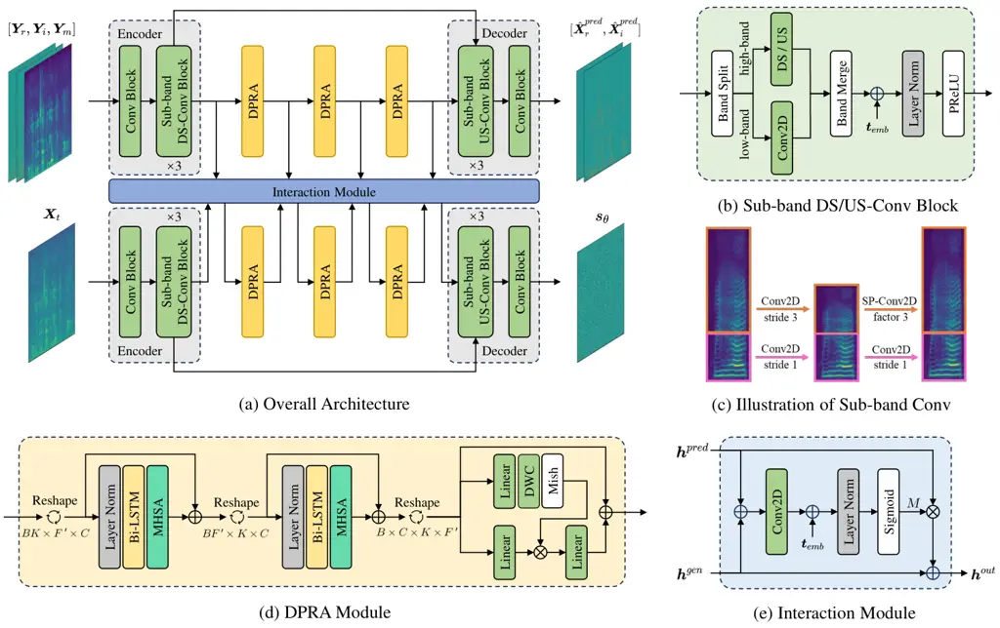
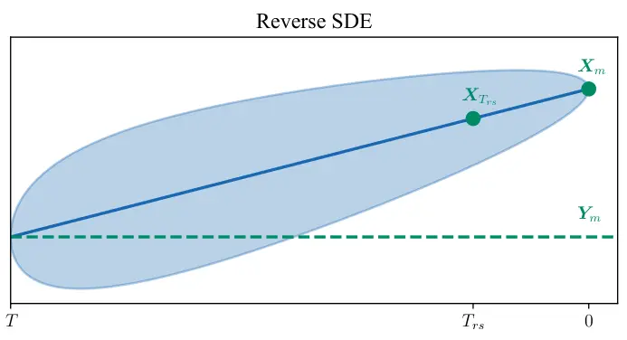

# A Composite Predictive-Generative Approach to Monaural Universal Speech Enhancement

Jie Zhang    Haoyin Yan    Xiaofei Li ^(†)^(†)thanks: J. Zhang and H.
Yan are with the National Engineering Research Center for Speech and
Language Information Processing (NERC-SLIP), University of Science and
Technology of China (USTC), 230027, Hefei, China. X. Li is with the
School of Engineering, Westlake University, 310030, Hangzhou, China.
(Email: jzhang6@ustc.edu.cn, hyyan@mail.ustc.edu.cn,
lixiaofei@westlake.edu.cn) ^(†)^(†)thanks: This work is supported by
Anhui Province Major Science and Technology Research and Development
Project (S2023Z20004).

###### Abstract

It is promising to design a single model that can suppress various
distortions and improve speech quality, i.e., universal speech
enhancement (USE). Compared to supervised learning-based predictive
methods, diffusion-based generative models have shown greater potential
due to the generative capacities from degraded speech with severely
damaged information. However, artifacts may be introduced in highly
adverse conditions, and diffusion models often suffer from a heavy
computational burden due to many steps for inference. In order to
jointly leverage the superiority of prediction and generation and
overcome the respective defects, in this work we propose a universal
speech enhancement model called PGUSE by combining predictive and
generative modeling. Our model consists of two branches: the predictive
branch directly predicts clean samples from degraded signals, while the
generative branch optimizes the denoising objective of diffusion models.
We utilize the output fusion and truncated diffusion scheme to
effectively integrate predictive and generative modeling, where the
former directly combines results from both branches and the latter
modifies the reverse diffusion process with initial estimates from the
predictive branch. Extensive experiments on several datasets verify the
superiority of the proposed model over state-of-the-art baselines,
demonstrating the complementarity and benefits of combining predictive
and generative modeling.

###### Index Terms: 

Universal speech enhancement, diffusion model, generative-predictive
modeling, computational complexity.

## I Introduction

Real-world speech recordings are inevitably contaminated by background
noises, room reverberation, codec artifacts, and/or other distortion
types, resulting in a degradation of perceptual quality and
intelligibility. Speech enhancement (SE) aims to restore clean speech
from contaminated recordings, which is an indispensable front-end for
advanced speech-based applications, e.g., human-computer interaction,
speech communication, remote conferencing \[1, 2, 3\]. Existing SE
algorithms are usually task-oriented and separately customized for
denoising \[4\], dereverberation \[5\] or speech super-resolution
(SR) \[6\]. Recent studies propose to consider multiple noise sources
simultaneously by designing a universal SE (USE) framework \[7, 8, 9,
10\], which aim to improve the speech quality under any degradation
conditions with a single universal model. This would be more promising
for applications than classic task-specific methods.

Since traditional statistics-based SE algorithms often suffer from the
non-stationarity of acoustic scenes \[11\], data-driven learning-based
methods become the mainstream in this field, which can learn the
non-linearity between noisy and clean speech signals \[12\]. This
mainstream can be roughly categorized into predictive and generative
approaches. Based on supervised learning, predictive methods usually
treat SE as a regression task and learn the best mapping from degraded
signals to the target signals under certain optimization criteria.
Numerous studies focused on magnitude-level operations in the short-time
Fourier transform (STFT) domain, since phase spectrum was somewhat
unimportant for SE \[13\]. Subsequently, as it was shown that proper
operations on phase can help to improve the perceptual quality and
speech intelligibility \[14\], complex-domain methods were then proposed
by incorporating phase estimation, such as complex ratio masking \[15\]
and complex spectral mapping \[16\]. To mitigate the compensation effect
caused by penalizing real and imaginary parts, both complex and
magnitude losses should be included for model training \[17, 18\].
Benefited from the development of deep neural network (DNN), time-domain
approaches that directly operate on speech waveforms also show to be
very promising in improving the speech quality \[19, 20\].

It is intuitive in the sense of USE that generative methods hold a
greater potential because some distortions require the model to generate
signals from scratch, e.g., clipping and bandwidth limitation \[9, 7,
21\]. These distortions involve irreversible information loss, offering
challenges in predicting plausible reconstructions through deterministic
mapping. Generative models aim to integrate the inherent distribution of
data into latent space and generate samples from it, compensating for
missing information via learned priors. Different from the predictive
models providing unique prediction, generative methods have many
possible candidates and allow stochasticity, which conforms to the
various forms of signal reconstruction. There are some typical examples.
Variational auto-encoder (VAE) \[22\] learns to represent data using an
explicit probability distribution. Generative adversarial network
(GAN) \[23\] utilizes a discriminator to encourage the generator to
generate realistic data. Normalizing flow \[24\] employs a series of
invertible transforms to obtain simple distributions transformed from
complex data distributions. Diffusion models \[25, 26\] simulate a
probabilistic diffusion process, where data is gradually transformed
into noise and the estimated signal is finally reconstructed as a
reverse process. By constraining the generation step, one can deal with
conditional generation tasks. The degraded speech can naturally be seen
as the output of this conditioning, facilitating the applicability to
USE \[10\].

Diffusion models have emerged as the new state-of-the-art (SOTA) family
of deep generative models, especially for image generation \[26, 27,
28\]. Recently, they have also been introduced to tackle SE and
USE \[29, 30, 31, 32, 10\]. Diffusion models originally contain two
parameterized discrete-time Markov chains, i.e., forward and reverse
chains \[26\]. The former gradually adds noise to the data until its
distribution tends towards a tractable priori, which is usually the
standard normal distribution. The latter learns to reverse this process
and finally recovers the original distribution of data. By formalizing
the diffusion process with stochastic differential equation (SDE), the
discrete-time form can be converted into a continuous-time form \[33\].
Samples are generated by the score functions estimated at decreasing
noise levels and using the score-based sampling approaches \[34\], which
is called score-based diffusion model \[33\]. The resulting training and
sampling operations are completely decoupled, allowing for flexible
sampling strategies, and the continuous noise disturbance may lead to a
smoother sample generation process \[33\]. We thus focus on score-based
diffusion models in this work.

As rough attempts of integrating predictive and generative models, the
stochastic refinement method \[35\] utilizes a residual between the
predictive output and the degraded speech for further diffusion.
However, learning the residual is challenging due to its implicit
structure and the low signal-to-noise ratio (SNR) at the start point of
the reverse diffusion. The stochastic regeneration \[32\] adopts a
predictive model to perform initial speech recovery, followed by a
generative model to re-generate the final sample. Artifacts caused by
the generative process can thus be reduced, as the initial recovery
decreases the speech uncertainty. However, unreliable predictive outputs
will affect the generative results due to the cascade structure.
In \[9\] a condition network is utilized to encode the degraded speech
and guide the score estimation network, but there lacks an integration
between predictive and generative results, which is crucial for
improving speech reconstruction quality. In addition, the heavy
computational burden of diffusion models still exists since the reverse
process requires numerous calls of the score estimation network, which
hinders the applicability of diffusion-based SE models. In contrast,
predictive models perform the direct mapping or masking from degraded
speech signals to the clean counterparts with single call, which is
theoretically possible to accelerate the reverse process. The
combination of predictive and generative approaches is thus promising in
both improving the speech reconstruction quality and reducing the
computational complexity.

In this work, we therefore propose a composite model called PGUSE, by
jointly leveraging Predictive and Generative modeling for Universal
Speech Enhancement. The proposed model contains two parallel branches to
perform predictive and generative modeling, respectively, where each
branch comprises an encoder-decoder architecture. The sub-band
downsampling-upsampling scheme helps capture band-aware features, and
the dual-path recurrent attention module is designed as the bottleneck
to model temporal and frequency dependencies efficiently. Interaction
modules extract information from predictive branches to assist score
estimation. In order to integrate predictive learning and generative
learning effectively, we propose to utilize output fusion and a
truncated diffusion scheme. Specifically, the former performs weighting
between predictive and generative results in the spectral domain, and
the latter adopts the predictive results to approximate latent variables
in the reverse process, which can reduce the number of sampling steps.
We utilize several datasets that cover multiple distortions to evaluate
the effectiveness of the proposed method, including additive noise,
reverberation, clipping, bandwidth limitation, etc. Extensive
experimental results demonstrate a better SE capacity and robustness
than other SOTA baselines. The reproducible code and audio examples are
available online¹¹ 1 https://hyyan2k.github.io/PGUSE.

The remainder of this paper is organized as follows. Section II provides
preliminaries of the score-based diffusion models. Section III describes
the proposed approach. Section IV presents the experimental setup,
followed by evaluation results in Section V. Finally, Section VI
concludes this work.

## II Score-based Diffusion Models

In order to guide the reader, we present some preliminaries of the
score-based diffusion models in this section. By converting the
discrete-time diffusion to the continuous-time form with SDE, they can
be characterized by the forward process, the reverse process and the
reverse sampling method.

### II-A Forward Process

The forward process gradually introduces noise to disturb the data
distribution, including the mean and variance, which can be governed by
the following SDE \[33\]:

```math
\displaystyle{\rm d}\bm{X}_{t}=\bm{f}(\bm{X}_{t},t){\rm d}t+g(t){\rm d}\bm{w},0\leq t\leq T, \tag{1}
```

where $`\bm{X}_{t}`$ denotes the latent variable at time $`t`$ and
$`\bm{w}`$ a standard Wiener process. The diffusion process starts from
$`\bm{X}_{0}`$ and ends at $`\bm{X}_{T}`$, where $`\bm{X}_{0}`$ is
usually the clean waveform in the time domain or spectral coefficients
in the STFT domain in the context of speech processing. Since the
complex STFT spectrum can be represented as real and imaginary parts,
this process is typically real-valued. Functions
$`\bm{f}(\bm{X}_{t},t)`$ and $`g(t)`$ are referred to as the drift and
diffusion coefficients, respectively. The former guides the mean drift
of data, and the latter controls the amount of additive Gaussian white
noise.

Some works tailor the SDE to SE tasks, which provide degraded signals as
reconstruction clues \[30, 31, 36, 37, 38\]. We summarize two forms of
SDE here: Ornstein-Uhlenbeck with Variance Exploding (OUVE) \[30, 31\]
and Brownian Bridge with Exponential Diffusion (BBED) \[36\].

#### II-A1 OUVE

Following the notations in \[36\], the OUVE SDE is parameterized as

```math
\displaystyle\bm{f}(\bm{X}_{t},t) \displaystyle=\gamma(\bm{Y}-\bm{X}_{t}), \tag{2}
```

```math
\displaystyle g(t) \displaystyle=\sqrt{c}k^{t}, \tag{3}
```

where $`\gamma,c,k\in\mathbb{R}_{+}`$. The stiffness $`\gamma`$ controls
the transition of the mean from $`\bm{X}_{0}`$ to $`\bm{Y}`$, i.e., from
the clean speech to the degraded version. The parameters $`c`$ and $`k`$
schedule noise levels. Given the initial conditions, the closed-form
solutions to the mean and variance of the state $`\bm{X}_{t}`$ are given
by

```math
\displaystyle\bm{\mu}(\bm{X}_{0},\bm{Y},t) \displaystyle=e^{-\gamma t}\bm{X}_{0}+(1-e^{-\gamma t})\bm{Y}, \tag{4}
```

```math
\displaystyle\sigma^{2}(t) \displaystyle={c(k^{2t}-e^{-2\gamma t})\over 2(\gamma+{\rm log}(k))}. \tag{5}
```

In case $`t\rightarrow\infty`$, the mean of $`\bm{X}_{t}`$ converges to
$`\bm{Y}`$. However, the total diffusion amount $`T`$ is finite in
practice (usually set to 1), resulting in a prior mismatch, which is
quantified by the difference between $`\bm{X}_{T}`$ and $`\bm{Y}`$. This
mismatch will cause an unavoidable bias in the subsequent reverse
process.

#### II-A2 BBED

The BBED improves the drift coefficient as

```math
\displaystyle\bm{f}(\bm{X}_{t},t)={\bm{Y}-\bm{X}_{t}\over 1-t}, \tag{6}
```

with the diffusion coefficient being aligned with OUVE. This choice
requires $`T<1`$ due to the numerical stability. The mean and variance
solution is determined by

```math
\displaystyle\bm{\mu}(\bm{X}_{0} \displaystyle,\bm{Y},t)=(1-t)\bm{X}_{0}+t\bm{Y}, \tag{7}
```

```math
\displaystyle\sigma^{2}(t) \displaystyle=(1-t)c\left[(k^{2t}-1+t)+{\rm log}(k^{2k^{2}})(1-t)E\right], \tag{8}
```

```math
\displaystyle E \displaystyle={\rm Ei}[2(t-1){\rm log}(k)]-{\rm Ei}[-2{\rm log}(k)], \tag{9}
```

where $`{\rm Ei}[\cdot]`$ denotes the exponential integral function. The
forward processes of OUVE and BBED are depicted in Fig. 1. The drift in
(6) causes the linear mean evolution in (7), and we see that the mean
linearly approaches to $`\bm{Y}`$ when $`t\rightarrow T`$, resulting in
a smaller prior mismatch if $`T`$ is close to 1 enough.

Fig. 1: Visualization of the forward process using OUVE and BBED SDE.
Solid curves denote the mean value, and the variance is represented by
the shaded area.

### II-B Reverse Process and Sampling Method

For any diffusion process in the form of (1), it can be reversed by
solving the following reverse SDE \[39, 33\]:

```math
\displaystyle{\rm d}\bm{X}_{t}=[-\bm{f}(\bm{X}_{t},t)+g(t)^{2}\nabla_{\bm{X}_{t}}{\rm log}p_{t}(\bm{X}_{t})]{\rm d}t+g(t){\rm d}\bar{\bm{w}}, \tag{10}
```

where $`\bar{\bm{w}}`$ is the standard Wiener process in the
reverse-time flow. The solution trajectories of this reverse SDE exhibit
the same marginal densities as those of the forward SDE, and the
difference lies in evolving in the opposite time direction. The gradient
of the logarithmic probability density
$`\nabla_{\bm{X}_{t}}{\rm log}p_{t}(\bm{X}_{t})`$ is called score
function \[34\]. Given the initial condition $`\bm{X}_{0}`$ and ending
state $`\bm{Y}`$, the latent variable $`\bm{X}_{t}`$ follows a Gaussian
distribution as

```math
\displaystyle p_{t}(\bm{X}_{t}|\bm{X}_{0},\bm{Y})=p_{\mathcal{N}}(\bm{X}_{t};\bm{\mu}(\bm{X}_{0},\bm{Y},t),\sigma^{2}(t)\bm{I}), \tag{11}
```

which is called perturbation kernel with $`p_{\mathcal{N}}`$ being the
probability density function of Gaussian distribution and $`\bm{I}`$
being a properly sized identity matrix. The score function is thus given
by

```math
\displaystyle\nabla_{\bm{X}_{t}}{\rm log}p_{t}(\bm{X}_{t}|\bm{X}_{0},\bm{Y})=-{\bm{X}_{t}-\bm{\mu}(\bm{X}_{0},\bm{Y},t)\over\sigma^{2}(t)}. \tag{12}
```

Generating samples needs to solve (10), but the score function is
unavailable therein. For this, we can utilize a surrogate score model
$`s_{\theta}(\bm{X}_{t},\bm{Y},t)`$ parameterized by a set of parameters
$`\theta`$. The score model is optimized by minimizing the following
denoising score matching objective \[34, 40, 33\]:

```math
\displaystyle\mathcal{L}_{\rm score}=\mathbb{E}_{t,(\bm{X}_{0},\bm{Y}),\bm{Z}}\left[\left|\left|s_{\theta}(\bm{X}_{t},\bm{Y},t)+{\bm{Z}\over\sigma(t)}\right|\right|^{2}_{2}\right], \tag{13}
```

where $`\bm{X}_{t}=\bm{\mu}(\bm{X}_{0},\bm{Y},t)+\sigma(t)\bm{Z}`$ and
$`\bm{Z}\sim\mathcal{N}(\bm{0},\bm{I})`$ is randomly sampled during the
training phase.

During inference, the initial state of the reverse process
$`\bm{X}_{T}`$ is sampled from
$`\mathcal{N}(\bm{Y},\sigma^{2}(T)\bm{I})`$. For OUVE, this sampling
would cause a prior mismatch because the mean of $`\bm{X}_{t}`$ cannot
reach $`\bm{Y}`$ with a finite $`T`$ during training. The mismatch can
be reduced by increasing $`T`$ for fixed stiffness $`\gamma`$, which is
equivalent to increasing $`\gamma`$ for fixed $`T`$ \[36\]. But
increasing $`\gamma`$ will cause an unstable reverse process as
discussed in \[31\]. For BBED, the sampling can match the training
condition better, as shown in Fig. 1. Using the score model
$`s_{\theta}`$, the sample generation process can be performed by
solving

```math
\displaystyle{\rm d}\bm{X}_{t}=[-\bm{f}(\bm{X}_{t},t)+g^{2}(t)s_{\theta}(\bm{X}_{t},\bm{Y},t)]{\rm d}t+g(t){\rm d}\bar{\bm{w}}, \tag{14}
```

from $`t=T\rightarrow 0`$. The solution of (14) depends on discrete time
steps, which can be uniform, irregular or adaptive. In this work, we
uniformly divide the interval $`[0,T]`$ into $`N`$ sub-intervals to
discretize time steps. With the step size $`\Delta t=T/N`$, the reverse
process is discretized as
$`\{\bm{X}_{T},\bm{X}_{T-\Delta t},...,\bm{X}_{0}\}`$. There are many
general-purpose numerical methods for solving SDEs, such as
Euler-Maruyama and stochastic Runge-Kutta methods \[41\]. Special
predictor-corrector samplers \[33\] combine numerical SDE solvers with
score-based Markov Chain Monte Carlo approaches \[42\] to correct the
marginal distribution of the estimated sample. Since there exists a
corresponding deterministic process for any diffusion process, solving
the probability flow ordinary differential equation (ODE) associated
with (14) also approximates the reverse process \[33\]. For simplicity,
we will utilize the classic Euler-Maruyama method in this work.

## III Proposed PGUSE Model



Fig. 2: (a) The proposed PGUSE model, where the predictive branch (top)
and the generative branch (bottom) are linked by the interaction module,
(b) Sub-band DS/US-Conv block, (c) Sub-band Conv (from \[43\]), (d) DPRA
module with reshaping for frequency-temporal modeling and channel
mixing, and (e) Interaction module by filtering data from the predictive
branch to help estimate score functions.

### III-A Data Representation

Given the degraded speech waveform $`\bm{y}\in\mathbb{R}^{L}`$ caused by
several distortions (e.g., additive noise, reverberation, clipping,
bandwidth), the USE aims to restore the clean speech
$`\bm{x}\in\mathbb{R}^{L}`$, where $`L`$ denotes the signal length.
Instead of performing diffusion in the waveform domain \[29, 10\] or in
the complex-valued STFT domain \[31, 32\], our generative method
operates in the magnitude STFT domain. The additive Gaussian noise from
diffusion process may lead to negative coefficients invalid for the
magnitude spectrum \[31\], but this issue can be addressed by clipping
negative values to zero after reverse diffusion. Compared to the
waveform, the magnitude spectrum exhibits clear structures (e.g.,
formant), which are important for listening experience and are amenable
for DNNs \[44, 45\]. The complex spectrum map contains many unstructured
textures in the image sense and challenges the score model’s denoising
process, which is typically operated by estimating the Gaussian noise at
each diffusion state to approximate the score function as shown in (13).
This process becomes less effective when the spectral textures are not
well-structured. Therefore, the predictive branch of the proposed PGUSE
model performs complex spectral mapping, in order to compensate for the
lack of phase enhancement.

Let $`\tilde{\bm{Y}}\in\mathbb{C}^{K\times F}`$ represent the complex
spectrum (of the degraded signal) obtained by STFT, where $`K`$ and
$`F`$ denote the number of time frames and frequency bins, respectively.
Following \[31, 18\], we apply an amplitude transformation to each
complex STFT coefficients $`\tilde{\bm{Y}}(k,f)`$ as

```math
\displaystyle\bm{Y}(k,f)=\beta_{1}|\tilde{\bm{Y}}(k,f)|^{\beta_{2}}e^{i\angle\tilde{\bm{Y}}(k,f)}, \tag{15}
```

where $`\beta_{1}\in\mathbb{R}_{+}`$ is a scalar to roughly control the
data range, $`\beta_{2}\in(0,1]`$ is a compression exponent equalizing
the importance of quieter sounds relative to loud ones, and
$`\angle\cdot`$ denotes phase extractor. This transformation is not only
meaningful in perceptual quality \[46\], but also effective to enable
networks to operate on a consistent data scale \[47\]. In the sequel,
all operations will be performed on transformed spectrum $`\bm{Y}`$
instead of the raw STFT matrix $`\tilde{\bm{Y}}`$.

### III-B Network Architecture

The overall architecture of our PGUSE model is depicted in Fig. 2(a).
The top part is the predictive branch, which takes the real part,
imaginary part and magnitude component of the degraded speech as
3-channel real-valued input, say $`\bm{Y}_{r}`$, $`\bm{Y}_{i}`$ and
$`\bm{Y}_{m}\in\mathbb{R}^{K\times F}`$, respectively. It performs
complex spectral mapping to directly predict the real and imaginary
parts of the clean speech, indicated as $`\hat{\bm{X}}_{r}^{pred}`$ and
$`\hat{\bm{X}}_{i}^{pred}`$. The bottom half is the generative branch,
estimating the score function from the current diffusion state
$`\bm{X}_{t}`$. Note that the initial condition $`\bm{X}_{0}`$ and end
state $`\bm{Y}`$ in the diffusion process are actually the clean
magnitude spectrum $`\bm{X}_{m}`$ and the degraded counterpart
$`\bm{Y}_{m}`$ in our implementation. The two branches almost share
identical architectures modified from our previous work \[43\]. The
details of each module are discussed in the following.

#### III-B1 Encoder and Decoder

The encoder consists of convolution (Conv) and sub-band downsampling
convolution (DS-Conv) blocks, while the decoder includes several Conv
and sub-band upsampling convolution (US-Conv) blocks. The Conv block is
a cascade of a convolution layer, layer normalization (on the channel
dimension) and parametric rectified linear unit (PReLU) activation. To
reduce the computational complexity, the DS-Conv blocks progressively
halve the frequency-axis size and maintain the time-axis size in the
encoder, while the US-Conv blocks recover the frequency resolution in
the decoder. Skip connections concatenate the outputs of DS-Conv blocks
to the inputs of US-Conv blocks, facilitating the integration of
low-level and high-level features \[48\]. Generally, low-frequency bands
contain more harmonic structures and play a more significant role in
human hearing compared to high-frequency bands \[44\]. We therefore
utilize the sub-band Conv to extract band-aware features, see Fig. 2(b)
and 2(c). The feature map is initially split into low-band and high-band
features. The former is processed by a 2D convolution (Conv2D) with a
stride of 1 to maintain resolution, while the latter is downsampled
using Conv2D with a stride of 3 (or upsampled via sub-pixel convolution
(SP-Conv2D) \[49\] with a factor of 3) only along the frequency
dimension, resulting in the same shape for both the low-band and
downsampled high-band features. The outcomes are then concatenated as
the full-band feature for subsequent processing. To ensure that the
model is time-dependent, Fourier-embeddings \[50, 33\] are employed to
integrate time information of the diffusion process into the network.
The scalar time index $`t`$ is mapped to vector $`\bm{t}_{emb}`$, which
is added to the intermediate features before layer normalization. Since
the predictive method is unrelated to the diffusion process, only the
generative branch applies time embeddings, and therefore the two
branches can be decoupled.

#### III-B2 Dual-Path Recurrent Attention (DPRA) Module

It was recently demonstrated that dual-path \[51\] based models are
effective for the SE task \[18, 52, 53\]. We adapt the dual-path module
to the diffusion-based SE model instead of directly transplanting from
the image processing field \[33, 31, 32\]. Specifically, time sequences
and frequency sequences are modeled sequentially to capture the time
dependencies within each band and the frequency dependencies within each
frame. The DPRA module is utilized as the bottleneck, which is extended
from our previous work \[43\] by incorporating the attention mechanism,
e.g., see Fig. 2(d). The hidden feature map
$`\bm{H}\in\mathbb{R}^{B\times C\times K\times F^{\prime}}`$ is
initially reshaped to $`BK\times F^{\prime}\times C`$ for frequency
modeling and then reshaped to $`BF^{\prime}\times K\times C`$ for
temporal modeling, where $`B`$, $`C`$, and $`F^{\prime}`$ denote the
batch size, hidden dimension, and downsampled frequency-axis size,
respectively. Each modeling process involves a cascade of layer
normalization, bi-directional long short-term memory (Bi-LSTM),
multi-head self-attention (MHSA) \[54\], and residual connection. The
MHSA attends to different positions in the sequence simultaneously,
addressing the limitations of LSTM in retaining remote information.
Subsequently, the convolutional gated linear unit (ConvGLU) modified
from \[55\] serves as the channel mixer, which is composed of a linear
layer, depthwise convolution (DWC) \[56\] and Mish \[57\] non-linearity.
The depthwise convolution aggregates the nearest information and the
gate mechanism allows fine-grained channel attention.

#### III-B3 Interaction Module

The relation between the generative and predictive branches is twofold:
i) the predictive branch can provide clues of the degraded speech as the
conditioning to guide the generation process; ii) the mapping process
from the degraded speech to the clean signal can facilitate the
denoising of the current diffusion state $`\bm{X}_{t}`$, since the
theoretical mean of $`\bm{X}_{t}`$ depends on their interpolation as
shown in (7). Based on this relation and inspired by \[58\], we utilize
an interaction module to transfer valuable supplementary information
from the predictive branch to the generative branch. The interaction
module is shown in Fig. 2(e). The hidden feature $`\bm{h}^{pred}`$ from
the predictive branch and $`\bm{h}^{gen}`$ from the generative branch
are combined and fed into a cascade of Conv2D, layer normalization and
Sigmoid activation to produce the mask $`\bm{M}`$, which is used to
filter $`\bm{h}^{pred}`$. The time embedding $`\bm{t}_{emb}`$ is also
employed here to introduce the time information. As a result, the output
hidden feature $`\bm{h}^{out}`$ is given by

```math
\displaystyle\bm{h}^{out}=\bm{h}^{gen}+\bm{M}\otimes\bm{h}^{pred}, \tag{16}
```

where $`\otimes`$ denotes the element-wise multiplication.

### III-C Output Fusion

The predictive methods often exhibit an over-suppression problem, i.e.,
speech components are excessively diminished during the denoising
process \[59\]. On the other hand, the generative approaches may
introduce artifacts under highly adverse conditions, due to their
inherent uncertainty regarding the presence or characteristics of
speech \[32\]. In order to leverage the respective superiority and
compensate the weakness, in this work we propose to perform output
fusion given the predictive and generative results as

```math
\displaystyle\hat{\bm{X}}_{m} \displaystyle=\alpha\hat{\bm{X}}_{m}^{pred}+(1-\alpha)\hat{\bm{X}}_{m}^{gen}, \tag{17}
```

```math
\displaystyle\hat{\bm{X}}_{m}^{pred} \displaystyle=\sqrt{(\hat{\bm{X}}_{r}^{pred})^{2}+(\hat{\bm{X}}_{i}^{pred})^{2}}, \tag{18}
```

where $`\hat{\bm{X}}_{m}^{pred}`$ and $`\hat{\bm{X}}_{m}^{gen}`$
indicate the magnitude spectrums estimated by the predictive and
generative branches, and $`\alpha\in[0,1]`$ is the weighting factor. We
perform magnitude-domain weighting, and the phase spectrum
$`\hat{\bm{X}}_{p}`$ is simply taken from the predictive branch as

```math
\displaystyle\hat{\bm{X}}_{p}={\rm Arctan2}(\hat{\bm{X}}_{i}^{pred},\hat{\bm{X}}_{r}^{pred}), \tag{19}
```

where $`{\rm Arctan2}`$ is the two-argument arc-tangent function. The
estimated magnitude and phase are finally coupled to restore the
enhanced waveform by inverse STFT (iSTFT).

### III-D Truncated Diffusion



Fig. 3: Visualization of the reverse process of BBED SDE, where the
truncated diffusion process starting from $`T_{rs}`$ with initial state
$`\bm{X}_{T_{rs}}`$.

Recently, some efforts were made to improve the sampling speed of the
diffusion models by truncating the forward and reverse processes, called
truncated diffusion \[60, 61\]. The key idea is to diffuse samples from
pre-generated results instead of reversing the diffusion process from
the Gaussian white noise, which can reduce the number of sampling steps.
In this work, we make modifications and adapt the classic truncated
diffusion scheme from discrete formulation to score-based diffusion
process. We utilize the results from the predictive branch to accelerate
sampling, leading to the exclusion of another model for pre-generated
results. Specifically, we start the reverse process from
$`T_{rs}\in(0,T]`$ instead of $`T`$. We replace the clean magnitude
spectrum $`\bm{X}_{m}`$ with the predictive estimate
$`\hat{\bm{X}}^{pred}_{m}`$ to approximate the theoretical mean of the
initial state $`\bm{X}_{T_{rs}}`$, which is sampled from
$`\mathcal{N}(\bm{\mu}(\hat{\bm{X}}^{pred}_{m},\bm{Y}_{m},T_{rs}),\sigma^{2}(T_{rs})\bm{I})`$
and can be approximately given by

```math
\displaystyle\bm{X}_{T_{rs}}\approx\bm{\mu}(\hat{\bm{X}}^{pred}_{m},\bm{Y}_{m},T_{rs})+\sigma(T_{rs})\bm{Z}. \tag{20}
```

The visualization of truncated diffusion for BBED are shown in Fig. 3.
For a fixed step width $`\Delta t`$, a decreased diffusion time means
fewer sampling steps, which thus saves the computational burden of
diffusion models.

### III-E Training Criteria

For the predictive branch, we simultaneously consider the mean square
errors (MSEs) on the magnitude spectrum and the complex spectrum as

```math
\displaystyle\mathcal{L}_{\rm mag} \displaystyle=\mathbb{E}\left[\left|\left|\hat{\bm{X}}_{m}^{pred}-\bm{X}_{m}\right|\right|_{2}^{2}\right], \tag{21}
```

```math
\displaystyle\mathcal{L}_{\rm comp} \displaystyle=\mathbb{E}\left[\left|\left|\hat{\bm{X}}_{r}^{pred}-\bm{X}_{r}\right|\right|_{2}^{2}+\left|\left|\hat{\bm{X}}_{i}^{pred}-\bm{X}_{i}\right|\right|_{2}^{2}\right]. \tag{22}
```

The composite losses can help mitigate the compensation effect caused by
only penalizing real and imaginary parts \[17\]. For the generative
branch, we employ the denoising score matching objective given in (13).
Therefore, the overall loss function for the training of the proposed
PGUSE is given by

```math
\displaystyle\mathcal{L}=\lambda\mathcal{L}_{\rm mag}+(1-\lambda)\mathcal{L}_{\rm comp}+\mathcal{L}_{\rm score}, \tag{23}
```

where $`\lambda`$ balances the losses on the magnitude and complex
spectrum, which is set to 0.5 in this work.

The training steps of our proposed PGUSE model are summarized in
Algorithm 1, where the predictive and generative branches are
represented by $`P_{\theta}`$ and $`G_{\theta}`$. Note that
$`\bm{h}^{pred}`$ is not detached during training, such that the
gradients from the generative branch can back-propagate to the
predictive branch through the interaction module. Algorithm 2 outlines
the inference process that adopts the classic Euler-Maruyama method to
obtain the numerical solution of the reverse SDE. Since the predictive
and generative branches can be decoupled, the repetitious calls of score
estimating network are only involved in the generative branch. The
estimated real and imaginary components by Algorithm 2 have to undergo
the inverse transform of (15) and iSTFT to recover the time-domain
enhanced waveform.

Input: $`\bm{X}_{r}`$, $`\bm{X}_{i}`$, $`\bm{X}_{m}`$, $`\bm{Y}_{m}`$,
$`\bm{Y}_{r}`$, $`\bm{Y}_{i}`$

Output: $`\mathcal{L}`$

$`[\hat{\bm{X}}_{r}^{pred},\hat{\bm{X}}_{i}^{pred}]`$,
$`\bm{h}^{pred}\leftarrow P_{\theta}([\bm{Y}_{r},\bm{Y}_{i},\bm{Y}_{m}])`$
;

Sample $`t\sim\mathcal{U}(0,T)`$ ;

Sample $`\bm{Z}\sim\mathcal{N}(0,\bm{I})`$ ;

$`\bm{X}_{t}\leftarrow\bm{\mu}(\bm{X}_{m},\bm{Y}_{m},t)+\sigma(t)\bm{Z}`$
; // (11)

$`s_{\theta}\leftarrow G_{\theta}(\bm{X}_{t},\bm{h}^{pred})`$ ;

Calculate loss $`\mathcal{L}`$ using (23).

Algorithm 1 Training of PGUSE

Input: $`\bm{Y}_{r}`$, $`\bm{Y}_{i}`$, $`\bm{Y}_{m}`$

Output: $`\hat{\bm{X}}_{r}`$, $`\hat{\bm{X}}_{i}`$

$`[\hat{\bm{X}}_{r}^{pred},\hat{\bm{X}}_{i}^{pred}]`$,
$`\bm{h}^{pred}\leftarrow P_{\theta}([\bm{Y}_{r},\bm{Y}_{i},\bm{Y}_{m}])`$
;

$`\hat{\bm{X}}_{m}^{pred}=\sqrt{(\hat{\bm{X}}_{r}^{pred})^{2}+(\hat{\bm{X}}_{i}^{pred})^{2}}`$
; // (18)

$`\bm{X}_{T_{rs}}\leftarrow\bm{\mu}(\hat{\bm{X}}^{pred}_{m},\bm{Y}_{m},T_{rs})+\sigma(T_{rs})\bm{Z}`$
; // (20)

for _$`t=T_{rs}`$, $`T_{rs}-\Delta t`$, $`T_{rs}-2\Delta t`$, …,
$`\Delta t`$_ do

   $`s_{\theta}\leftarrow G_{\theta}(\bm{X}_{t},\bm{h}^{pred})`$ ;

   Sample $`\bm{Z}\sim\mathcal{N}(0,\bm{I})`$ ;

   $`\bm{X}_{\rm mean}\leftarrow\bm{X}_{t}+(-\bm{f}(\bm{X}_{t},t)+g(t)^{2}s_{\theta})\Delta t`$
;

   $`\bm{X}_{t-\Delta t}\leftarrow\bm{X}_{\rm mean}+g(t)\sqrt{\Delta t}\bm{Z}`$
; // (14)

end for

$`\hat{\bm{X}}_{m}^{gen}\leftarrow{\rm Clip}(\bm{X}_{\rm mean},0,+\infty)`$
;

$`\hat{\bm{X}}_{m}\leftarrow\alpha\hat{\bm{X}}_{m}^{pred}+(1-\alpha)\hat{\bm{X}}_{m}^{gen}`$
; // (17)

$`\hat{\bm{X}}_{p}\leftarrow{\rm Arctan2}(\hat{\bm{X}}_{i}^{pred},\hat{\bm{X}}_{r}^{pred})`$
; // (19)

$`\hat{\bm{X}}_{r},\hat{\bm{X}}_{i}\leftarrow\hat{\bm{X}}_{m}{\rm cos}(\hat{\bm{X}}_{p}),\hat{\bm{X}}_{m}{\rm sin}(\hat{\bm{X}}_{p})`$
;

Algorithm 2 Inference of PGUSE

## IV Experimental Setup

In this section, we will present datasets, evaluation metrics,
implementation details, impacts of hyper-parameters as well as several
SOTA comparison methods used in experiments.

### IV-A Datasets

We utilize several datasets in experiments to evaluate the efficacy of
our approach, with all audio samples sampled at 16 kHz. Each dataset is
described below in detail.

#### IV-A1 WSJ0-UNI

We create the WSJ0-UNI dataset to evaluate our model on the USE task,
incorporating multiple types of distortions. We employ the distortion
pipeline²² 2 https://github.com/microsoft/SIG-Challenge adapted from
Speech Signal Improvement Challenge \[62\], see Table I. The distortion
families include recorded noise, reverberation, microphone frequency
response, analog-to-digital converter (ADC) effects, automatic gain
control (AGC) and transmission impacts. Specific distortions encompass
additive noise, room impulse response (RIR) convolution, band filtering,
bit depth adjustments, clipping, gain alterations, resampling, and data
compression in global system for mobile communications (GSM). The clean
speech utterances are sourced from the Wall Street Journal (WSJ0)
dataset \[63\] (distinct subsets “si_tr_s”, “si_dt_05” and “si_et_05”
are used for training, validation and testing, respectively), while
noise clips are randomly selected from WHAM! dataset \[64\].

#### IV-A2 VBDMD

We adopt the publicly available VoiceBank-DEMAND (VBDMD) dataset \[65\]
for the denoising task, which is the often-used benchmark for monaural
SE. The clean samples sourced from the VoiceBank corpus \[66\] contain
11,572 samples from 28 speakers for training and 872 clips from 2
speakers for testing. Clean signals are mixed with noises from the
DEMAND dataset \[67\] at SNRs of {0, 5, 10, 15} dB for training and
{2.5, 7.5, 12.5, 17.5} dB for testing. All clips are resampled from 48
kHz to 16 kHz in experiments.

#### IV-A3 VBDMD-REVERB

Using clean utterances of the VBDMD test set, we apply the stereo reverb
algorithm \[68\] similarly to WSJ0-UNI to generate the VBDMD-REVERB
dataset, resulting in an average reverberation time (T60) of 0.4
seconds. This is used to evaluate the dereverberation capacity of USE
models on unseen data.

#### IV-A4 VBDMD-SR

To evaluate the speech super-resolution (SR) (or bandwidth extension)
ability of the model, we apply the 12-order Butterworth low-pass filter
with a cutoff at 4 kHz to the clean samples of the VBDMD test set,
resulting in the VBDMD-SR dataset. The speech SR requires models to
extend frequency bands based on low-frequency information, which is a
challenging generative task in the audio community.

#### IV-A5 TIMIT-UNI

We generate the TIMIT-UNI dataset using the same distortion pipeline as
WSJ0-UNI, with clean speech utterances originated from the TIMIT
corpus \[69\]. Since the transcripts of TIMIT are available, we can then
further evaluate the impact of SE models on the downstream automatic
speech recognition (ASR) performance.

| Family        | Type              | Probability |
| ------------- | ----------------- | ----------- |
| Noise         | Additive noise    | 0.3         |
| Reverberation | RIR convolution   | 0.25        |
| Microphone    | Low shelf filter  | 0.5         |
|               | High shelf filter |             |
|               | Peak filter       |             |
| ADC           | Low pass filter   | 0.7         |
|               | High pass filter  | 0.7         |
|               | Bit depth         | 0.1         |
| AGC           | Clipping          | 0.4         |
|               | Gain              |             |
| Transmission  | Clipping          | 0.25        |
|               | Gain              | 0.25        |
|               | Resample          | 0.4         |
|               | GSM compression   | 0.25        |

TABLE I: Distortion categories and corresponding probabilities, grouped
by family.

(a) Varying $`\alpha`$ with $`N=25`$, $`T_{rs}=T`$

(b) Varying $`N`$ with $`\alpha=0.4`$, $`T_{rs}=T`$

(c) Varying $`T_{rs}`$ with $`\alpha=0.4`$, $`\Delta t=0.04`$

Fig. 4: The performance analysis under different conditions of
hyper-parameters.

### IV-B Evaluation Metrics

In this work, we utilize several performance metrics for the
instrumental evaluation of the proposed method.

#### IV-B1 PESQ

The perceptual evaluation of speech quality (PESQ) \[70\] is widely-used
for the objective speech quality evaluation. We employ the wideband PESQ
scoring from 1 (poor) to 4.5 (excellent).

#### IV-B2 ESTOI

The extended short-time objective intelligibility (ESTOI) \[71\] is an
instrumental metric for evaluating the intelligibility of speech
signals, ranging from 0 to 1. The higher ESTOI score indicates a higher
intelligibility and better preservation of the speech content.

#### IV-B3 CSIG, CBAK, COVL

We consider three composite mean opinion score (MOS) based
measures \[72\] to further quantify the speech quality, i.e., CSIG (the
MOS of signal distortion), CBAK (the intrusiveness of background noise),
and COVL (the overall effect). The higher, the better.

#### IV-B4 WV-MOS

The WV-MOS³³ 3 https://github.com/AndreevP/wvmos \[73\] is a
non-intrusive MOS predictor using the fine-tuned wav2vec2.0
model \[74\], which estimates the MOS scores without clean signals.

#### IV-B5 ViSQOL

The virtual speech quality objective listener (ViSQOL)⁴⁴ 4
https://github.com/google/visqol \[75\] utilizes the spectral-temporal
similarity between reference and test speech signals to produce a mean
opinion score - listening quality objective (MOS-LQO) score.

#### IV-B6 LSD

The log-spectral distance (LSD) \[76\] is an STFT-domain metric to
evaluate the speech SR performance, which calculates the logarithmic
distance between the clean and degraded magnitude spectrum as

```math
\displaystyle{\rm LSD}=\frac{1}{K}\sum_{k=1}^{K}{\sqrt{\frac{1}{F}\sum_{f=1}^{F}{{\rm ln}\left(\frac{\tilde{\bm{X}}_{m}(k,f)^{2}}{\hat{\tilde{\bm{X}}}_{m}(k,f)^{2}}\right)^{2}}}}. \tag{24}
```

A lower LSD indicates a better SR performance, and 0 means the minimum
distance.

#### IV-B7 SSIM

Structural similarity index measure (SSIM) \[77\] was originally
proposed to assess the image quality by comparing local pixel patterns
in terms of luminance, contrast, and structure. We compute this measure
on the magnitude spectrum to evaluate the speech SR performance.

#### IV-B8 WER

The word error rate (WER) is used to further evaluate the clarity of the
enhanced speech signals in combination with a downstream ASR task. We
utilize the squeezeformer model \[78\] pre-trained by NVIDIA⁵⁵ 5
https://catalog.ngc.nvidia.com/orgs/nvidia/teams/nemo/models/stt_en_squeezeformer_ctc_xsmall_ls
for English speech recognition, which is the x-small version with 8.8M
parameters.

### IV-C Implementation

We perform STFT using a Hann window with a length of 512 (32ms) and a
shift of 192 (12ms). We chose $`\beta_{1}`$ = 0.3 and $`\beta_{2}`$ =
0.3 for the amplitude transformation in (15). The numbers of output
channels for Conv blocks in the encoder and decoder are {16, 32, 48, 64}
and {48, 32, 16, 2 or 1} (2 for the predictive branch and 1 for the
generative branch), respectively. The number of hidden states in the
Bi-LSTM is set to 128, and there are 4 heads in the MHSA layer. For the
SDE formulation, BBED with $`k`$ = 2.6, $`c`$ = 0.51 and $`T`$ = 0.999
is utilized following \[36\]. We adopt an exponential moving average of
model weights with a factor of 0.999 for sampling \[79\]. Our model is
trained with the AdamW optimizer for 200 epochs. The $`L_{2}`$ norm for
gradient clipping is set to 5.0. The learning rate starts from 1e-3 and
decays at a factor of 0.97 every two epochs. Our training is conducted
on NVIDIA RTX4080 (16GB memory) and takes one day.

|                    |       |        |      |                   |                   |                   |                   |                   |                   |                   |
| ------------------ | ----- | ------ | ---- | ----------------- | ----------------- | ----------------- | ----------------- | ----------------- | ----------------- | ----------------- |
| Method             | Para. | MACs   | Type | PESQ              | ESTOI             | CSIG              | CBAK              | COVL              | WV-MOS            | ViSQOL            |
| Degraded           | -     | -      | -    | 2.40 $`\pm`$ 1.26 | 0.81 $`\pm`$ 0.17 | 3.29 $`\pm`$ 1.31 | 2.85 $`\pm`$ 1.00 | 2.88 $`\pm`$ 1.31 | 2.47 $`\pm`$ 1.97 | 2.11 $`\pm`$ 1.13 |
| Conv-TasNet \[80\] | 3.4M  | 3.2G   | P    | 2.81 $`\pm`$ 1.13 | 0.87 $`\pm`$ 0.14 | 3.90 $`\pm`$ 0.92 | 3.27 $`\pm`$ 0.88 | 3.45 $`\pm`$ 1.07 | 3.14 $`\pm`$ 1.16 | 2.44 $`\pm`$ 1.08 |
| MANNER \[81\]      | 24.1M | 8.7G   | P    | 3.16 $`\pm`$ 1.03 | 0.91 $`\pm`$ 0.10 | 4.42 $`\pm`$ 0.60 | 3.47 $`\pm`$ 0.80 | 3.91 $`\pm`$ 0.88 | 3.49 $`\pm`$ 0.64 | 2.84 $`\pm`$ 1.10 |
| CMGAN \[18\]       | 1.8M  | 31.7G  | P    | 3.43 $`\pm`$ 0.90 | 0.92 $`\pm`$ 0.09 | 4.46 $`\pm`$ 0.67 | 3.56 $`\pm`$ 0.73 | 4.06 $`\pm`$ 0.82 | 3.69 $`\pm`$ 0.54 | 2.81 $`\pm`$ 1.00 |
| CDiffuSE \[29\]    | 4.3M  | 292.4G | G    | 2.20 $`\pm`$ 0.67 | 0.80 $`\pm`$ 0.13 | 3.64 $`\pm`$ 0.75 | 2.74 $`\pm`$ 0.49 | 2.96 $`\pm`$ 0.71 | 3.03 $`\pm`$ 1.18 | 1.78 $`\pm`$ 0.44 |
| SGMSE+ \[31\]      | 65.6M | 8.0T   | G    | 3.19 $`\pm`$ 1.09 | 0.91 $`\pm`$ 0.10 | 4.18 $`\pm`$ 0.84 | 3.45 $`\pm`$ 0.83 | 3.79 $`\pm`$ 1.02 | 3.76 $`\pm`$ 0.48 | 2.73 $`\pm`$ 1.06 |
| StoRM \[32\]       | 55.1M | 15.8T  | G+P  | 3.17 $`\pm`$ 1.09 | 0.91 $`\pm`$ 0.10 | 4.28 $`\pm`$ 0.77 | 3.46 $`\pm`$ 0.86 | 3.84 $`\pm`$ 0.99 | 3.74 $`\pm`$ 0.46 | 2.69 $`\pm`$ 1.05 |
| UNIVERSE++ \[10\]  | 42.9M | 42.8G  | G+P  | 3.20 $`\pm`$ 1.01 | 0.91 $`\pm`$ 0.10 | 4.33 $`\pm`$ 0.69 | 3.56 $`\pm`$ 0.78 | 3.88 $`\pm`$ 0.92 | 3.75 $`\pm`$ 0.47 | 2.62 $`\pm`$ 0.99 |
| PGUSE-P            | 2.3M  | 5.8G   | P    | 3.36 $`\pm`$ 0.91 | 0.91 $`\pm`$ 0.09 | 4.43 $`\pm`$ 0.61 | 3.60 $`\pm`$ 0.71 | 4.01 $`\pm`$ 0.82 | 3.63 $`\pm`$ 0.53 | 2.78 $`\pm`$ 1.02 |
| PGUSE-G            | 5.1M  | 177.3G | G+P  | 3.38 $`\pm`$ 0.95 | 0.93 $`\pm`$ 0.08 | 4.53 $`\pm`$ 0.59 | 3.63 $`\pm`$ 0.75 | 4.09 $`\pm`$ 0.84 | 3.80 $`\pm`$ 0.43 | 2.92 $`\pm`$ 0.99 |
| PGUSE-F            | 5.1M  | 177.3G | G+P  | 3.50 $`\pm`$ 0.89 | 0.93 $`\pm`$ 0.08 | 4.59 $`\pm`$ 0.54 | 3.71 $`\pm`$ 0.73 | 4.18 $`\pm`$ 0.78 | 3.79 $`\pm`$ 0.44 | 2.95 $`\pm`$ 1.00 |
| PGUSE-T            | 5.1M  | 26.3G  | G+P  | 3.46 $`\pm`$ 0.89 | 0.93 $`\pm`$ 0.08 | 4.55 $`\pm`$ 0.56 | 3.69 $`\pm`$ 0.72 | 4.14 $`\pm`$ 0.80 | 3.78 $`\pm`$ 0.46 | 2.91 $`\pm`$ 0.95 |
| PGUSE              | 5.1M  | 26.3G  | G+P  | 3.53 $`\pm`$ 0.87 | 0.93 $`\pm`$ 0.08 | 4.58 $`\pm`$ 0.53 | 3.74 $`\pm`$ 0.72 | 4.18 $`\pm`$ 0.77 | 3.76 $`\pm`$ 0.47 | 2.93 $`\pm`$ 0.98 |

TABLE II: Speech enhancement results obtained on the WSJ0-UNI dataset in
the form of mean $`\pm`$ standard deviation, where ‘P’ and ‘G’ denote
predictive and generative methods, respectively.

### IV-D Hyperparameter Search

We conduct a hyperparameter search on the WSJ0-UNI dataset to find the
optimal settings for the output fusion factor $`\alpha`$ in (17), the
number of reverse steps $`N`$, and the reverse start time $`T_{rs}`$ of
the truncated diffusion. To visualize the results, we employ both
intrusive PESQ and non-intrusive WV-MOS metrics, where the former
assesses the fidelity of the reconstruction relative to a reference
signal, while the latter allows the speech quality assessment of a
realization on the manifold of clean speech.

#### IV-D1 Output fusion factor $`\alpha`$

The factor $`\alpha`$ regulates the ratio of predictive and generative
components in the output, and the performance curves in terms of
$`\alpha`$ are presented in Fig. 4(a), with $`N`$ being fixed to 25. It
can be seen the generative method ($`\alpha`$ = 0) outperforms the
predictive method ($`\alpha`$ = 1) in terms of WV-MOS, as the former
focuses on generating plausible samples, while the latter will encounter
deviations when predicting deterministic reference. The PESQ score
reaches its highest when $`\alpha`$ = 0.5, indicating that output fusion
can enhance the reconstruction accuracy of the reference. We thus choose
$`\alpha`$ = 0.4 as a trade-off between the two metrics in the sequel.

#### IV-D2 Number of reverse steps $`N`$

Fig. 4(b) shows the performance in terms of $`N`$ by fixing $`\alpha`$
to 0.4. It is clear that 25 steps are enough and both metrics show no
further increase with $`N>25`$. Therefore, we set $`N=25`$ in the
sequel, which leads to a step width of $`\Delta t=1/N=0.04`$.

#### IV-D3 Reverse start time $`T_{rs}`$

In Fig. 4(c), we utilize the truncated diffusion scheme and depict the
impact of $`T_{rs}`$ on the performance with $`\alpha`$ = 0.4 and
$`\Delta t`$ = 0.04. As a larger $`T_{rs}`$ causes more reverse steps
and a greater complexity, we choose $`T_{rs}`$ = 0.12 with 3 reverse
steps. Notably, it achieves remarkable metric scores of approximately
3.51 in PESQ and 3.76 in WV-MOS with even one reverse step, indicating
the effectiveness of the truncated diffusion approach.

### IV-E Comparison Models

Our proposed PGUSE is objectively compared with other SOTA SE methods,
including predictive approaches (Conv-TasNet \[80\], MANNER \[81\],
CMGAN \[18\]) and generative approaches (CDiffuSE \[29\], SGMSE+ \[31\],
StoRM \[32\], UNIVERSE++ \[10\]) described in detail below. We
re-trained all models in experiments, unless stated elsewhere.

#### IV-E1 Conv-TasNet

An end-to-end neural network designed for speech separation, which
leverages temporal convolutional networks to effectively separate mixed
audio signals by masking the learned representation of the mixture.

#### IV-E2 MANNER

A time-domain SE model using U-net based encoder-decoder architecture.
It employs multi-view attention to capture full information from the
signal, efficiently addressing both channel and long-sequential
features.

#### IV-E3 CMGAN

A time-frequency domain model using dual-path conformer blocks \[82\] to
encode both magnitude and complex spectrum information. A metric
discriminator \[45\] is trained to alleviate the mismatch between the
speech quality and optimization objectives.

#### IV-E4 CDiffuSE

This method generalizes discrete-time diffusion by incorporating the
observed noisy data into the model, resulting in a conditional diffusion
process in the time domain.

#### IV-E5 SGMSE+

A score-based diffusion model defined in the complex spectrum domain. It
adopts NCSN++ network \[33\] and follows the OUVE SDE formulation.

#### IV-E6 StoRM

The stochastic regeneration model (StoRM) utilizes a predictive model
for initial recovery and a generative model for refinement, on the basis
of the SGMSE+ framework.

#### IV-E7 UNIVERSE++

A score-based time-domain diffusion model designed for USE, where the
condition network encodes the degraded speech and the score network
estimates score functions. Multiple losses constrain the condition
network to predict the clean speech, but the predictive results lack
further integration with generative outcomes.

Fig. 5: The PESQ of SGMSE+, StoRM, PGUSE-G and PGUSE-F in terms of
different reverse steps.

## V Results and Discussions

|                               |      |              |                   |                   |                   |                   |                   |                   |                   |
| ----------------------------- | ---- | ------------ | ----------------- | ----------------- | ----------------- | ----------------- | ----------------- | ----------------- | ----------------- |
| Method                        | Type | Training set | PESQ              | ESTOI             | CSIG              | CBAK              | COVL              | WV-MOS            | ViSQOL            |
| Degraded                      | \-   | \-           | 1.98 $`\pm`$ 0.76 | 0.79 $`\pm`$ 0.15 | 3.48 $`\pm`$ 0.83 | 2.54 $`\pm`$ 0.64 | 2.74 $`\pm`$ 0.80 | 3.00 $`\pm`$ 1.25 | 2.09 $`\pm`$ 0.92 |
| Conv-TasNet \[80\]            | P    | VBDMD        | 2.56 $`\pm`$ 0.64 | 0.85 $`\pm`$ 0.10 | 3.89 $`\pm`$ 0.68 | 3.45 $`\pm`$ 0.49 | 3.27 $`\pm`$ 0.66 | 4.21 $`\pm`$ 0.40 | 2.55 $`\pm`$ 0.83 |
| MANNER^($`\dagger`$) \[81\]   | P    | VBDMD        | 3.20 $`\pm`$ 0.62 | 0.87 $`\pm`$ 0.09 | 4.54 $`\pm`$ 0.50 | 3.72 $`\pm`$ 0.47 | 3.94 $`\pm`$ 0.60 | 4.36 $`\pm`$ 0.30 | 2.93 $`\pm`$ 0.88 |
| CMGAN \[18\]                  | P    | VBDMD        | 3.38 $`\pm`$ 0.63 | 0.89 $`\pm`$ 0.09 | 4.60 $`\pm`$ 0.50 | 3.87 $`\pm`$ 0.49 | 4.08 $`\pm`$ 0.62 | 4.36 $`\pm`$ 0.31 | 3.16 $`\pm`$ 0.82 |
| PGUSE-P                       | P    | VBDMD        | 3.20 $`\pm`$ 0.69 | 0.88 $`\pm`$ 0.09 | 4.48 $`\pm`$ 0.56 | 3.73 $`\pm`$ 0.48 | 3.91 $`\pm`$ 0.66 | 4.33 $`\pm`$ 0.35 | 3.00 $`\pm`$ 0.88 |
| CDiffuSE^($`\dagger`$) \[29\] | G    | VBDMD        | 2.48 $`\pm`$ 0.55 | 0.79 $`\pm`$ 0.11 | 3.77 $`\pm`$ 0.55 | 3.03 $`\pm`$ 0.43 | 3.15 $`\pm`$ 0.55 | 3.62 $`\pm`$ 0.72 | 2.03 $`\pm`$ 0.56 |
| SGMSE+^($`\dagger`$) \[31\]   | G    | VBDMD        | 2.88 $`\pm`$ 0.61 | 0.86 $`\pm`$ 0.10 | 4.24 $`\pm`$ 0.62 | 3.48 $`\pm`$ 0.46 | 3.60 $`\pm`$ 0.62 | 4.23 $`\pm`$ 0.33 | 2.78 $`\pm`$ 0.85 |
| StoRM^($`\dagger`$) \[32\]    | G+P  | VBDMD        | 2.85 $`\pm`$ 0.63 | 0.87 $`\pm`$ 0.10 | 4.18 $`\pm`$ 0.62 | 3.53 $`\pm`$ 0.48 | 3.56 $`\pm`$ 0.63 | 4.28 $`\pm`$ 0.35 | 2.84 $`\pm`$ 0.87 |
| UNIVERSE++ \[10\]             | G+P  | VBDMD        | 3.03 $`\pm`$ 0.64 | 0.87 $`\pm`$ 0.10 | 4.38 $`\pm`$ 0.57 | 3.62 $`\pm`$ 0.48 | 3.76 $`\pm`$ 0.62 | 4.41 $`\pm`$ 0.30 | 2.87 $`\pm`$ 0.86 |
| PGUSE                         | G+P  | VBDMD        | 3.30 $`\pm`$ 0.67 | 0.88 $`\pm`$ 0.09 | 4.63 $`\pm`$ 0.50 | 3.79 $`\pm`$ 0.48 | 4.05 $`\pm`$ 0.63 | 4.34 $`\pm`$ 0.32 | 3.10 $`\pm`$ 0.87 |
| Conv-TasNet \[80\]            | P    | WSJ0-UNI     | 2.20 $`\pm`$ 0.63 | 0.79 $`\pm`$ 0.13 | 3.02 $`\pm`$ 0.91 | 2.75 $`\pm`$ 0.39 | 2.64 $`\pm`$ 0.77 | 3.41 $`\pm`$ 0.78 | 1.71 $`\pm`$ 0.66 |
| MANNER \[81\]                 | P    | WSJ0-UNI     | 2.51 $`\pm`$ 0.60 | 0.83 $`\pm`$ 0.11 | 3.24 $`\pm`$ 0.84 | 2.90 $`\pm`$ 0.35 | 2.91 $`\pm`$ 0.71 | 3.76 $`\pm`$ 0.59 | 1.95 $`\pm`$ 0.69 |
| CMGAN \[18\]                  | P    | WSJ0-UNI     | 2.69 $`\pm`$ 0.59 | 0.85 $`\pm`$ 0.10 | 3.44 $`\pm`$ 0.81 | 2.96 $`\pm`$ 0.35 | 3.10 $`\pm`$ 0.69 | 4.13 $`\pm`$ 0.41 | 1.91 $`\pm`$ 0.77 |
| PGUSE-P                       | P    | WSJ0-UNI     | 2.60 $`\pm`$ 0.54 | 0.85 $`\pm`$ 0.10 | 3.51 $`\pm`$ 0.65 | 2.97 $`\pm`$ 0.32 | 3.09 $`\pm`$ 0.59 | 4.15 $`\pm`$ 0.38 | 2.13 $`\pm`$ 0.78 |
| CDiffuSE \[29\]               | G    | WSJ0-UNI     | 1.71 $`\pm`$ 0.39 | 0.75 $`\pm`$ 0.13 | 2.73 $`\pm`$ 0.44 | 2.29 $`\pm`$ 0.38 | 2.22 $`\pm`$ 0.42 | 2.64 $`\pm`$ 1.05 | 1.54 $`\pm`$ 0.51 |
| SGMSE+ \[31\]                 | G    | WSJ0-UNI     | 2.41 $`\pm`$ 0.66 | 0.84 $`\pm`$ 0.11 | 3.50 $`\pm`$ 0.74 | 2.87 $`\pm`$ 0.44 | 2.98 $`\pm`$ 0.70 | 3.92 $`\pm`$ 0.51 | 2.19 $`\pm`$ 0.78 |
| StoRM \[32\]                  | G+P  | WSJ0-UNI     | 2.37 $`\pm`$ 0.58 | 0.82 $`\pm`$ 0.11 | 2.90 $`\pm`$ 0.83 | 2.76 $`\pm`$ 0.36 | 2.67 $`\pm`$ 0.68 | 3.99 $`\pm`$ 0.40 | 1.69 $`\pm`$ 0.66 |
| UNIVERSE++ \[10\]             | G+P  | WSJ0-UNI     | 2.46 $`\pm`$ 0.61 | 0.82 $`\pm`$ 0.11 | 3.50 $`\pm`$ 0.63 | 2.85 $`\pm`$ 0.37 | 3.01 $`\pm`$ 0.62 | 4.06 $`\pm`$ 0.41 | 1.94 $`\pm`$ 0.69 |
| PGUSE                         | G+P  | WSJ0-UNI     | 2.69 $`\pm`$ 0.56 | 0.86 $`\pm`$ 0.10 | 3.73 $`\pm`$ 0.60 | 3.01 $`\pm`$ 0.34 | 3.24 $`\pm`$ 0.58 | 4.20 $`\pm`$ 0.39 | 2.19 $`\pm`$ 0.80 |

TABLE III: Speech denoising results obtained on the VBDMD test set under
different training conditions in the form of mean $`\pm`$ standard
deviation. Models marked with $`\dagger`$ are pre-trained by authors
using the same training data.

### V-A Universal Speech Enhancement (USE)

First, in Table II we report the USE performance obtained on the
WSJ0-UNI dataset. Our PGUSE is compared with its variants and selected
baselines in terms of the parameter amount (Para.), multiply-accumulate
operations (MACs)⁶⁶ 6 https://github.com/sovrasov/flops-counter.pytorch
and the aforementioned speech quality measures. For the diffusion-based
generative models, we report the MACs in the whole inference process,
which usually involves several steps as described in the corresponding
literature.

As the proposed PGUSE framework is a compound of typical generative and
predictive models, we can selectively pick results from each branch or
their fusion. To show this, we compare PGUSE with its variants at the
bottom of Table II, where PGUSE-P indicates the results of the
predictive branch, PGUSE-G the generative branch, PGUSE-F only the
output fusion, PGUSE-T only the truncated diffusion scheme, and PGUSE
both the two schemes, respectively. All variants utilize the phase
estimated from the predictive branch. It can be seen that PGUSE-P has a
smaller model size and fewer MACs than PGUSE-G, since the former
involves only one call of the predictive branch, while the latter
requires 25 reverse steps as claimed in Section IV-D. PGUSE-G surpasses
PGUSE-P in terms of all metrics, especially for WV-MOS and ViSQOL. This
verifies the potential of generative approaches for the USE task, which
suffers from the damaged speech information in the degraded signals.
PGUSE-F can improve most metrics by fusing predictive and generative
results, showing a certain degree of complementarity. PGUSE-T shows
improvements over PGUSE-G with less computational complexity, because
predictive results can narrow the gap between diffusion states and
target distributions while reducing reverse steps. PGUSE further
improves the performance by combining the output fusion and truncated
diffusion scheme, although with a slight decrease in WV-MOS and ViSQOL.

The comparison with predictive baselines demonstrates that the proposed
PGUSE achieves improvements for all metrics. Compared to Conv-TasNet
which has a minimum computational complexity, our model shows an obvious
superiority in performance. In the comparison with the SOTA predictive
method CMGAN, our PGUSE still works better, although CMGAN adopts a PESQ
discriminator for special optimization. Compared to the diffusion-based
generative methods, PGUSE has a better performance with a lighter
computational burden, indicating the efficiency and effectiveness of the
truncated diffusion scheme. We can see that the generative approaches
generally outperform the predictive methods in terms of non-intrusive
WV-MOS, but perform relatively poorer for other intrusive metrics. This
is because predictive methods optimize certain point-wise loss functions
between the estimated speech and a clean reference, while the generative
methods learn to model the inherent characteristics of speech signals.
Fig. 5 visualizes the PESQ in terms of different reverse diffusion
steps, where our PGUSE-G and PGUSE-F obviously outperform SGMSE+ and
StoRM. We observe that introducing predictive modeling helps maintain
performance with fewer reverse steps, as seen in the comparison from
StoRM to SGMSE+ and from PGUSE-F to PGUSE-G. In summary, our PGUSE
integrates the advantages of predictive and generative learning to
achieve precise reconstruction and good speech naturalness, all while
maintaining a lighter computational overhead, thus establishing a new
benchmark of diffusion-based models.

### V-B Speech Denoising on VBDMD

Second, results obtained on the VBDMD test set are presented in
Table III. This dataset only involves additive noise distortion to
verify the denoising ability of models. Observing the match condition in
the upper half of Table III, where training samples are from VBDMD, we
find that CMGAN outperforms other models in terms of most metrics. This
is due to the fact that predictive methods are competent for the
conventional denoising task, as there are enough speech clues for
regression learning, unless under extremely low SNR conditions. Our
PGUSE considers both predictive and generative modeling, surpassing
other generative baselines and narrowing the gap between generative
approaches and advanced predictive models on the VBDMD benchmark. We
also report the results of PGUSE-P, which is inferior to that of PGUSE.
This indicates that generative modeling can improve the upper limit of
predictive methods, even in the context of straightforward denoising
task.

The bottom half of Table III compares the results under a mismatch
condition, where models are trained on the WSJ0-UNI dataset. This
cross-dataset evaluation is to show the transferability of the USE
models to the denoising task with unseen data distribution. We observe
that the proposed PGUSE shows superiority in terms of all metrics,
revealing an excellent generalization ability. We also observe that
StoRM exhibits a performance degradation when compared to SGMSE+, since
the mismatch condition brings instability to the cascade framework of
predictive model and generative refinement. In contrast, PGUSE adopts a
parallel structure and shows a more stable performance in this more
challenging case.

|                    |      |       |      |        |        |
| ------------------ | ---- | ----- | ---- | ------ | ------ |
| Method             | PESQ | ESTOI | COVL | WV-MOS | ViSQOL |
| Degraded           | 1.71 | 0.85  | 2.68 | 3.86   | 2.87   |
| Conv-TasNet \[80\] | 2.27 | 0.86  | 2.94 | 3.69   | 2.59   |
| MANNER \[81\]      | 2.67 | 0.91  | 3.29 | 3.92   | 2.94   |
| CMGAN \[18\]       | 3.14 | 0.93  | 3.60 | 4.39   | 3.31   |
| CDiffuSE \[29\]    | 2.04 | 0.81  | 2.71 | 3.75   | 2.32   |
| SGMSE+ \[31\]      | 3.24 | 0.93  | 3.88 | 4.41   | 3.84   |
| StoRM \[32\]       | 3.12 | 0.93  | 3.67 | 4.34   | 2.80   |
| UNIVERSE++ \[10\]  | 2.96 | 0.90  | 3.58 | 4.27   | 3.20   |
| PGUSE              | 3.37 | 0.94  | 3.88 | 4.46   | 3.64   |

TABLE IV: Speech dereverberation performance obtained on VBDMD-REVERB
with models trained on WSJ0-UNI.

### V-C Speech Dereverberation on VBDMD-REVERB

Third, we evaluate the speech dereverberation performance of our PGUSE
model in comparison with other baselines on the VBDMD-REVERB dataset in
Table IV. It can be seen that SGMSE+ performs better than CMGAN,
indicating the effectiveness of diffusion models in detecting the
correlation of particular time-frequency bins with corresponding dry
speech areas. Since the reverberant signal originates from the dry
source, which causes less speech uncertainty than other distortions, the
vocalized artifacts observed in the denoising task can be
reduced \[31\]. More importantly, the proposed PGUSE model still
exhibits the leading performance in terms of most metrics, showing a
strong applicability to dereverberation and robustness against unseen
data.

|                    |                   |                  |                  |                  |                  |
| ------------------ | ----------------- | ---------------- | ---------------- | ---------------- | ---------------- |
| Method             | LSD$`\downarrow`$ | SSIM$`\uparrow`$ | PESQ$`\uparrow`$ | CSIG$`\uparrow`$ | COVL$`\uparrow`$ |
| Degraded           | 5.13              | 0.77             | 4.26             | 1.68             | 3.03             |
| Conv-TasNet \[80\] | 3.18              | 0.78             | 3.48             | 3.30             | 3.45             |
| MANNER \[81\]      | 2.90              | 0.81             | 3.03             | 3.90             | 3.52             |
| CMGAN \[18\]       | 2.62              | 0.82             | 3.73             | 3.54             | 3.69             |
| CDiffuSE \[29\]    | 3.15              | 0.71             | 2.66             | 3.42             | 3.08             |
| SGMSE+ \[31\]      | 2.69              | 0.85             | 3.84             | 3.86             | 3.91             |
| StoRM \[32\]       | 2.88              | 0.76             | 2.89             | 3.50             | 3.24             |
| UNIVERSE++ \[10\]  | 2.67              | 0.77             | 3.01             | 3.93             | 3.52             |
| PGUSE              | 2.16              | 0.87             | 3.81             | 4.10             | 4.00             |
| PGUSE-LFR          | 2.03              | 0.88             | 4.09             | 4.41             | 4.32             |

TABLE V: Speech SR (8 kHz $`\rightarrow`$ 16 kHz) results obtained on
VBDMD-SR with models trained on WSJ0-UNI.

### V-D Speech Super-Resolution (SR)

Furthermore, we compare the speech SR performance on the VBDMD-SR
dataset using the models trained on the WSJ0-UNI dataset in Table V.
Compared with other methods, our PGUSE maintains a leading position. The
LSD and SSIM metrics indicate that PGUSE effectively restores the
spectral structure more accurately, while the CSIG and COVL metrics
demonstrate improvements in the perceptual speech quality. It is
interesting that the degraded speech with a limited bandwidth achieves
the highest PESQ score, and all models suffer from a decline. This can
happen because the PESQ is not specifically designed for speech SR
evaluation and low frequencies dominate the PESQ measure, which
significantly impacts human hearing. The processes of models will
inevitably introduce errors to the low-frequency regions, leading to a
degradation in PESQ. For this, speech SR methods usually perform a
lower-frequencies replacement (LFR) operation to improve the
performance \[83\] by reusing the low-frequency components of
band-limited signals. We observe that the PGUSE with LFR can clearly
produce better results, though the PESQ is still inferior to that of the
degraded speech.

Fig. 6: SE and ASR results on the TIMIT-UNI dataset.

### V-E Application to downstream ASR

In addition, we simultaneously show the SE and ASR results on the
TIMIT-UNI dataset in Fig. 6. Our PGUSE achieves the highest PESQ score
and reduces the overall WER over the degraded utterances. The generative
baselines demonstrate a higher WER compared to that of the predictive
CMGAN, which can be attributed to the vocalizing artifacts and phonetic
confusions arising from generative behaviors under highly adverse
conditions \[32\]. StoRM achieves a better ASR performance than SGMSE+,
indicating the stochastic regeneration approach can correct some
artifacts. The proposed PGUSE can efficiently combine predictive and
generative modeling capacities to improve the reconstruction accuracy
and reduce artifacts, achieving a WER comparable to the advanced
predictive CMGAN model.

### V-F Ablation Study

| Method            | PESQ | CSIG | CBAK | COVL | WV-MOS |
| ----------------- | ---- | ---- | ---- | ---- | ------ |
| PGUSE             | 3.53 | 4.58 | 3.74 | 4.18 | 3.76   |
| w/o Interaction   | 3.51 | 4.57 | 3.72 | 4.17 | 3.76   |
| w/o Sub-band Conv | 3.50 | 4.58 | 3.71 | 4.17 | 3.71   |
| w/o MHSA          | 3.47 | 4.52 | 3.59 | 4.12 | 3.71   |
| w/o ConvGLU       | 3.49 | 4.56 | 3.69 | 4.15 | 3.72   |
| OUVE              | 3.46 | 4.50 | 3.69 | 4.10 | 3.65   |
| Complex           | 3.27 | 4.40 | 3.49 | 3.95 | 3.55   |
| Degraded Phase    | 3.47 | 4.54 | 3.56 | 4.13 | 3.73   |

TABLE VI: Ablation study on the WSJ0-UNI dataset, including ablation of
network components and formalism.

Finally, we carry out ablation studies on the WSJ0-UNI to analyze the
impact of different components in the proposed PGUSE model in Table VI.
For the network structure, we first replace the interaction module with
a simple addition of features from the predictive and generative
branches (i.e., w/o Interaction). This causes a slight performance drop,
indicating the effectiveness of this module in transferring valuable
information. Substituting the sub-band Conv with a normal convolution
layer with a stride of 2 also leads to a performance drop, confirming
the importance of extracting band-aware features. The removal of the
MHSA layer or ConvGLU module further validates that the attention
mechanism enhances the long-term modeling capacity and the ConvGLU is
beneficial for aggregating inter-channel information.

From the perspective of formalism, we observe that the OUVE formulation
(with $`k`$ = 10, $`c`$ = 0.01, $`\gamma`$ = 1.5 as in \[36\]) results
in a degraded SE performance. Several factors may contribute to BBED’s
superior performance over OUVE, such as reduced prior mismatch in the
reverse process or higher variance in the SDE evolution, which could
potentially help to generate better speech estimates \[36\]. The
detailed analysis of OUVE and BBED SDE formulation is beyond the scope
of this work. When performing diffusion on the real and imaginary parts
of the complex spectrum without modifying the predictive branch (denoted
as “Complex”), we note a clear degradation in performance. This confirms
the advantage of operating diffusion in the magnitude STFT domain, which
displays clearer patterns. In contrast, the complex spectrum contains
numerous unstructured textures in the image sense that might hinder the
denoising process during score function estimation. Furthermore,
combining the enhanced magnitude with the noisy phase decreases the
performance, underscoring the usefulness of the predictive branch for
phase enhancement. The complex spectral mapping can thus compensate for
the missing phase estimation in the magnitude diffusion process.

## VI Conclusion

In this work, we proposed a joint predictive and generative modeling
approach for USE (PGUSE). The proposed PGUSE model comprises two
parallel branches, where the predictive branch performs complex spectral
mapping to directly predict the clean complex spectrum, and the
generative branch estimates score functions within a score-based
diffusion process to generate candidates in the magnitude STFT domain.
Our well-designed neural network ensures robust modeling capabilities
for time and frequency patterns, supporting joint predictive and
generative training. We employed an output fusion scheme to effectively
complement the predictive and generative results and adapted the
truncated diffusion technique to reduce the number of reverse steps. We
evaluated the proposed PGUSE model across several tasks (e.g., USE,
speech denoising, dereveberation, ASR) to show its robustness and
capacity. Compared to predictive baselines, our model achieves superior
performance for the USE task; compared to generative baselines, our
approach delivers a higher reconstruction quality with a significantly
lighter computational burden, promoting the practical applications of
the diffusion-based models for SE. The combination of predictive and
generative methods therefore shows a stronger potential. Future work
could consider more distortion types to better simulate real-life
situations, and efforts can be made to further optimize the model for
real-time processing on low-resource edge devices. The proposed method
also occasionally suffers from artifacts similarly to existing models,
which might stem from inadequate accounting for phase information in the
magnitude estimation process, particularly in high-frequency bands where
small non-zero magnitude estimates might be paired with imprecise phase
estimates. This requires the incorporation of phase information into the
diffusion path while ensuring the ease of estimating Gaussian noise
components from diffusion states in the future.

## VII Acknowledgment

Thanks to the associate editor and anonymous reviewers for their
insightful comments that help to improve the quality of this paper. The
reproducible code and audio examples are available at
https://hyyan2k.github.io/PGUSE.

## References

- \[1\] Z. Chen, S. Watanabe, H. Erdogan, and J. R. Hershey, “Speech
  enhancement and recognition using multi-task learning of long
  short-term memory recurrent neural networks,” in Proc. Interspeech,
  pp. 3274–3278, 2015.
- \[2\] N. Modhave, Y. Karuna, and S. Tonde, “Design of matrix Wiener
  filter for noise reduction and speech enhancement in hearing aids,” in
  Proc. RTEICT, pp. 843–847, 2016.
- \[3\] K. Tan, X.-L. Zhang, and D.-L. Wang, “Real-time speech
  enhancement using an efficient convolutional recurrent network for
  dual-microphone mobile phones in close-talk scenarios,” in Proc.
  ICASSP, pp. 5751–5755, 2019.
- \[4\] S. Braun, H. Gamper, C. K. Reddy, and I. Tashev, “Towards
  efficient models for real-time deep noise suppression,” in Proc.
  ICASSP, pp. 656–660, 2021.
- \[5\] A. Purushothaman, D. Dutta, R. Kumar, and S. Ganapathy, “Speech
  dereverberation with frequency domain autoregressive modeling,”
  IEEE/ACM Trans. Audio, Speech, Lang. Process., vol. 32,
  pp. 29–38, 2024.
- \[6\] H.-M. Wang and D.-L. Wang, “Towards robust speech
  super-resolution,” IEEE/ACM Trans. Audio, Speech, Lang. Process.,
  vol. 29, pp. 2058–2066, 2021.
- \[7\] S. Pascual, J. Serrà, and A. Bonafonte, “Towards generalized
  speech enhancement with generative adversarial networks,” in Proc.
  Interspeech, pp. 1791–1795, 2019.
- \[8\] A. A. Nair and K. Koishida, “Cascaded time + time-frequency unet
  for speech enhancement: Jointly addressing clipping, codec
  distortions, and gaps,” in Proc. ICASSP, pp. 7153–7157, 2021.
- \[9\] J. Serrà, S. Pascual, J. Pons, R. O. Araz, and D. Scaini,
  “Universal speech enhancement with score-based diffusion,” arXiv
  preprint arXiv:2206.03065, 2022.
- \[10\] R. Scheibler, Y. Fujita, Y. Shirahata, and T. Komatsu,
  “Universal score-based speech enhancement with high content
  preservation,” in Proc. Interspeech, pp. 1165–1169, 2024.
- \[11\] J. Zhang, R. Tao, J. Du, and L.-R. Dai, “SDW-SWF: Speech
  distortion weighted single-channel Wiener filter for noise reduction,”
  IEEE/ACM Trans. Audio, Speech, Lang. Process., vol. 31,
  pp. 3176–3189, 2023.
- \[12\] D.-L. Wang and J.-T. Chen, “Supervised speech separation based
  on deep learning: An overview,” IEEE/ACM Trans. Audio, Speech, Lang.
  Process., vol. 26, no. 10, pp. 1702–1726, 2018.
- \[13\] D.-L. Wang and J. Lim, “The unimportance of phase in speech
  enhancement,” IEEE Trans. Acoust., Speech, Signal Process., vol. 30,
  no. 4, pp. 679–681, 1982.
- \[14\] M. Krawczyk and T. Gerkmann, “STFT phase reconstruction in
  voiced speech for an improved single-channel speech enhancement,”
  IEEE/ACM Trans. Audio, Speech, Lang. Process., vol. 22, no. 12,
  pp. 1931–1940, 2014.
- \[15\] D. S. Williamson, Y.-X. Wang, and D.-L. Wang, “Complex ratio
  masking for monaural speech separation,” IEEE/ACM Trans. Audio,
  Speech, Lang. Process., vol. 24, no. 3, pp. 483–492, 2016.
- \[16\] S.-W. Fu, T.-Y. Hu, Y. Tsao, and X.-G. Lu, “Complex spectrogram
  enhancement by convolutional neural network with multi-metrics
  learning,” in Proc. MLSP, pp. 1–6, 2017.
- \[17\] Z.-Q. Wang, G. Wichern, and J. Le Roux, “On the compensation
  between magnitude and phase in speech separation,” IEEE Signal Proc.
  Let., vol. 28, pp. 2018–2022, 2021.
- \[18\] S. Abdulatif, R.-Z. Cao, and B. Yang, “CMGAN: Conformer-based
  metric-gan for monaural speech enhancement,” IEEE/ACM Trans. Audio,
  Speech, Lang. Process., vol. 32, pp. 2477–2493, 2024.
- \[19\] S. Pascual, A. Bonafonte, and J. Serrà, “SEGAN: Speech
  enhancement generative adversarial network,” in Proc. Interspeech,
  pp. 3642–3646, 2017.
- \[20\] E. Kim and H. Seo, “SE-Conformer: Time-domain speech
  enhancement using conformer,” in Proc. Interspeech,
  pp. 2736–2740, 2021.
- \[21\] K.-X. Zhang, Y. Ren, C.-L. Xu, and Z. Zhao, “WSRGlow: A
  glow-based waveform generative model for audio super-resolution,” in
  Proc. Interspeech, pp. 1649–1653, 2021.
- \[22\] D. P. Kingma and M. Welling, “Auto-encoding variational Bayes,”
  in Proc. ICLR, 2014.
- \[23\] I. J. Goodfellow, J. Pouget-Abadie, M. Mirza, B. Xu,
  D. Warde-Farley, S. Ozair, A. Courville, and Y. Bengio, “Generative
  adversarial nets,” in Proc. NeurIPS, vol. 27, p. 2672–2680, 2014.
- \[24\] D. J. Rezende and S. Mohamed, “Variational inference with
  normalizing flows,” in Proc. ICML, vol. 37, p. 1530–1538, 2015.
- \[25\] J. Sohl-Dickstein, E. A. Weiss, N. Maheswaranathan, and
  S. Ganguli, “Deep unsupervised learning using nonequilibrium
  thermodynamics,” in Proc. ICML, vol. 37, p. 2256–2265, 2015.
- \[26\] J. Ho, A. Jain, and P. Abbeel, “Denoising diffusion
  probabilistic models,” in Proc. NeurIPS, vol. 33, pp. 6840–6851, 2020.
- \[27\] R. Rombach, A. Blattmann, D. Lorenz, P. Esser, and B. Ommer,
  “High-resolution image synthesis with latent diffusion models,” in
  Proc. CVPR, pp. 10674–10685, 2022.
- \[28\] P. Dhariwal and A. Nichol, “Diffusion models beat GANs on image
  synthesis,” in Proc. NeurIPS (M. Ranzato, A. Beygelzimer, Y. Dauphin,
  P. Liang, and J. W. Vaughan, eds.), vol. 34, pp. 8780–8794, 2021.
- \[29\] Y.-J. Lu, Z.-Q. Wang, S. Watanabe, A. Richard, C. Yu, and
  Y. Tsao, “Conditional diffusion probabilistic model for speech
  enhancement,” in Proc. ICASSP, pp. 7402–7406, 2022.
- \[30\] S. Welker, J. Richter, and T. Gerkmann, “Speech enhancement
  with score-based generative models in the complex STFT domain,” in
  Proc. Interspeech, pp. 2928–2932, 2022.
- \[31\] J. Richter, S. Welker, J.-M. Lemercier, B. Lay, and
  T. Gerkmann, “Speech enhancement and dereverberation with
  diffusion-based generative models,” IEEE/ACM Trans. Audio, Speech,
  Lang. Process., vol. 31, pp. 2351–2364, 2023.
- \[32\] J.-M. Lemercier, J. Richter, S. Welker, and T. Gerkmann,
  “StoRM: A diffusion-based stochastic regeneration model for speech
  enhancement and dereverberation,” IEEE/ACM Trans. Audio, Speech, Lang.
  Process., vol. 31, pp. 2724–2737, 2023.
- \[33\] Y. Song, J. Sohl-Dickstein, D. P. Kingma, A. Kumar, S. Ermon,
  and B. Poole, “Score-based generative modeling through stochastic
  differential equations,” in Proc. ICLR, 2021.
- \[34\] A. Hyvärinen, “Estimation of non-normalized statistical models
  by score matching,” Journal of Machine Learning Research, vol. 6,
  no. 24, pp. 695–709, 2005.
- \[35\] Z.-B. Qiu, M.-F. Fu, Y.-F. Yu, L.-L. Yin, F.-C. Sun, and
  H. Huang, “SRTNet: Time domain speech enhancement via stochastic
  refinement,” in Proc. ICASSP, pp. 1–5, 2023.
- \[36\] B. Lay, S. Welker, J. Richter, and T. Gerkmann, “Reducing the
  prior mismatch of stochastic differential equations for
  diffusion-based speech enhancement,” in Proc. Interspeech,
  pp. 3809–3813, 2023.
- \[37\] A. Jukić, R. Korostik, J. Balam, and B. Ginsburg, “Schrödinger
  bridge for generative speech enhancement,” in Proc. Interspeech,
  pp. 1175–1179, 2024.
- \[38\] J. Richter, D. de Oliveira, and T. Gerkmann, “Investigating
  training objectives for generative speech enhancement,” arXiv preprint
  arXiv:2409.10753, 2024.
- \[39\] B. D. Anderson, “Reverse-time diffusion equation models,”
  Stoch. Proc. Appl., vol. 12, no. 3, pp. 313–326, 1982.
- \[40\] P. Vincent, “A connection between score matching and denoising
  autoencoders,” Neural Comput., vol. 23, no. 7, pp. 1661–1674, 2011.
- \[41\] P. E. Kloeden and E. Platen, Numerical Solution of Stochastic
  Differential Equations. Springer Berlin, Heidelberg, 1992.
- \[42\] G. Parisi, “Correlation functions and computer simulations,”
  Nucl. Phys. B, vol. 180, no. 3, pp. 378–384, 1981.
- \[43\] H.-Y. Yan, J. Zhang, C.-H. Fan, Y.-P. Zhou, and P.-Q. Liu,
  “LiSenNet: Lightweight sub-band and dual-path modeling for real-time
  speech enhancement,” arXiv preprint arXiv:2409.13285, 2024.
- \[44\] H. Hermansky, “Perceptual linear predictive (PLP) analysis of
  speech.,” The Journal of the Acoustical Society of America, vol. 87,
  pp. 1738–1752, 1990.
- \[45\] S.-W. Fu, C.-F. Liao, Y. Tsao, and S.-D. Lin, “MetricGAN:
  Generative adversarial networks based black-box metric scores
  optimization for speech enhancement,” in Proc. ICML, vol. 97,
  pp. 2031–2041, 2019.
- \[46\] C. H. You, S. N. Koh, and S. Rahardja, “/spl beta/-order MMSE
  spectral amplitude estimation for speech enhancement,” IEEE Trans.
  Speech Audio Process., vol. 13, no. 4, pp. 475–486, 2005.
- \[47\] S. Braun and I. Tashev, “A consolidated view of loss functions
  for supervised deep learning-based speech enhancement,” in Proc. TSP,
  pp. 72–76, 2021.
- \[48\] O. Ronneberger, P. Fischer, and T. Brox, “U-Net: Convolutional
  networks for biomedical image segmentation,” in Proc. MICCAI,
  pp. 234–241, 2015.
- \[49\] W.-Z. Shi, J. Caballero, F. Huszár, J. Totz, A. P. Aitken,
  R. Bishop, et al., “Real-time single image and video super-resolution
  using an efficient sub-pixel convolutional neural network,” in Proc.
  CVPR, pp. 1874–1883, 2016.
- \[50\] M. Tancik, P. Srinivasan, B. Mildenhall, S. Fridovich-Keil,
  N. Raghavan, U. Singhal, R. Ramamoorthi, J. Barron, and R. Ng,
  “Fourier features let networks learn high frequency functions in low
  dimensional domains,” in Proc. NeurIPS, vol. 33, pp. 7537–7547, 2020.
- \[51\] Y. Luo, Z. Chen, and T. Yoshioka, “Dual-Path RNN: Efficient
  long sequence modeling for time-domain single-channel speech
  separation,” in Proc. ICASSP, pp. 46–50, 2020.
- \[52\] X.-H. Le, H.-S. Chen, K. Chen, and J. Lu, “DPCRN: Dual-path
  convolution recurrent network for single channel speech enhancement,”
  in Proc. Interspeech, pp. 2811–2815, 2021.
- \[53\] F. Dang, H.-T. Chen, and P.-Y. Zhang, “DPT-FSNet: Dual-path
  transformer based full-band and sub-band fusion network for speech
  enhancement,” in Proc. ICASSP, pp. 6857–6861, 2022.
- \[54\] A. Vaswani, N. Shazeer, N. Parmar, J. Uszkoreit, L. Jones,
  A. N. Gomez, L. Kaiser, and I. Polosukhin, “Attention is all you
  need,” in Proc. NeurIPS, vol. 30, 2017.
- \[55\] D. Shi, “TransNeXt: Robust foveal visual perception for vision
  transformers,” in Proc. CVPR, pp. 17773–17783, 2024.
- \[56\] F. Chollet, “Xception: Deep learning with depthwise separable
  convolutions,” in Proc. CVPR, pp. 1800–1807, 2017.
- \[57\] D. Misra, “Mish: A self regularized non-monotonic neural
  activation function,” arXiv preprint arXiv:1908.08681, 2019.
- \[58\] A.-L. Zhou, W. Zhang, X.-Y. Li, G.-J. Xu, B.-B. Zhang, Y.-X.
  Ma, and J.-Q. Song, “A novel noise-aware deep learning model for
  underwater acoustic denoising,” IEEE Trans. Geosci. Remote Sens.,
  vol. 61, pp. 1–13, 2023.
- \[59\] Q. Wang, I. L. Moreno, M. Saglam, K. Wilson, A. Chiao, R.-J.
  Liu, Y.-Z. He, W. Li, J. Pelecanos, M. Nika, and A. Gruenstein,
  “VoiceFilter-Lite: Streaming targeted voice separation for on-device
  speech recognition,” arXiv preprint arXiv:2009.04323, 2020.
- \[60\] Z.-Y. Lyu, X.-D. XU, C.-Y. Yang, D.-H. Lin, and B. Dai,
  “Accelerating diffusion models via early stop of the diffusion
  process,” arXiv preprint arXiv:2205.12524, 2022.
- \[61\] H.-J. Zheng, P.-C. He, W.-Z. Chen, and M.-Y. Zhou, “Truncated
  diffusion probabilistic models and diffusion-based adversarial
  auto-encoders,” Proc. ICLR, 2023.
- \[62\] N.-C. Ristea, A. Saabas, R. Cutler, B. Naderi, S. Braun, and
  S. Branets, “ICASSP 2024 speech signal improvement challenge,” in
  Proc. ICASSPW, pp. 15–16, 2024.
- \[63\] J. S. Garofolo, D. Graff, D. Paul, and D. Pallett, “CSR-I
  (WSJ0) Complete.” \[Online\]. Available:
  https://catalog.ldc.upenn.edu/LDC93S6A.
- \[64\] G. Wichern, J. Antognini, M. Flynn, L. R. Zhu, E. McQuinn,
  D. Crow, E. Manilow, and J. L. Roux, “WHAM!: Extending speech
  separation to noisy environments,” in Proc. Interspeech,
  pp. 1368–1372, 2019.
- \[65\] C. Valentini-Botinhao, X. Wang, S. Takaki, and J. Yamagishi,
  “Investigating RNN-based speech enhancement methods for noise-robust
  Text-to-Speech,” in Proc. SSW, pp. 146–152, 2016.
- \[66\] C. Veaux, J. Yamagishi, and S. King, “The voice bank corpus:
  Design, collection and data analysis of a large regional accent speech
  database,” in Proc. O-COCOSDA/CASLRE, pp. 1–4, 2013.
- \[67\] J. Thiemann, N. Ito, and E. Vincent, “The diverse environments
  multi-channel acoustic noise database: A database of multichannel
  environmental noise recordings,” J. Acoust. Soc. Am., vol. 133,
  pp. 3591–3591, 2013.
- \[68\] M. Schroeder and B. Logan, ““Colorless” artificial
  reverberation,” IRE Trans. Audio, vol. AU-9, no. 6, pp. 209–214, 1961.
- \[69\] J. S. Garofolo, L. F. Lamel, W. M. Fisher, J. G. Fiscus, D. S.
  Pallett, N. L. Dahlgren, and V. Zue, “TIMIT Acoustic-Phonetic
  Continuous Speech Corpus.” \[Online\]. Available:
  https://catalog.ldc.upenn.edu/LDC93S1.
- \[70\] A. Rix, J. Beerends, M. Hollier, and A. Hekstra, “Perceptual
  evaluation of speech quality (PESQ)-a new method for speech quality
  assessment of telephone networks and codecs,” in Proc. ICASSP, vol. 2,
  pp. 749–752, 2001.
- \[71\] J. Jensen and C. H. Taal, “An algorithm for predicting the
  intelligibility of speech masked by modulated noise maskers,” IEEE/ACM
  Trans. Audio, Speech, Lang. Process., vol. 24, no. 11,
  pp. 2009–2022, 2016.
- \[72\] Y. Hu and P. C. Loizou, “Evaluation of objective quality
  measures for speech enhancement,” IEEE Trans. Audio, Speech, Lang.
  Process., vol. 16, no. 1, pp. 229–238, 2008.
- \[73\] P. Andreev, A. Alanov, O. Ivanov, and D. Vetrov, “HIFI++: A
  unified framework for bandwidth extension and speech enhancement,” in
  Proc. ICASSP, pp. 1–5, 2023.
- \[74\] A. Baevski, Y.-H. Zhou, A. Mohamed, and M. Auli, “wav2vec 2.0:
  A framework for self-supervised learning of speech representations,”
  in Proc. NeurIPS, vol. 33, pp. 12449–12460, 2020.
- \[75\] M. Chinen, F. S. C. Lim, J. Skoglund, N. Gureev, F. O’Gorman,
  and A. Hines, “ViSQOL v3: An open source production ready objective
  speech and audio metric,” in Proc. QoMEX, pp. 1–6, 2020.
- \[76\] A. Gray and J. Markel, “Distance measures for speech
  processing,” IEEE Trans. Acoust., Speech, Signal Process., vol. 24,
  no. 5, pp. 380–391, 1976.
- \[77\] Z. Wang, A. Bovik, H. Sheikh, and E. Simoncelli, “Image quality
  assessment: from error visibility to structural similarity,” IEEE
  Trans. Image Process., vol. 13, no. 4, pp. 600–612, 2004.
- \[78\] S. Kim, A. Gholami, A. Shaw, N. Lee, K. Mangalam, J. Malik,
  M. W. Mahoney, and K. Keutzer, “Squeezeformer: An efficient
  transformer for automatic speech recognition,” in Proc. NeurIPS,
  vol. 35, pp. 9361–9373, 2022.
- \[79\] Y. Song and S. Ermon, “Improved techniques for training
  score-based generative models,” in Proc. NeurIPS, vol. 33,
  pp. 12438–12448, 2020.
- \[80\] Y. Luo and N. Mesgarani, “Conv-TasNet: Surpassing ideal
  time-frequency magnitude masking for speech separation,” IEEE/ACM
  Trans. Audio, Speech, Lang. Process., vol. 27, no. 8,
  pp. 1256–1266, 2019.
- \[81\] H. J. Park, B. H. Kang, W. Shin, J. S. Kim, and S. W. Han,
  “MANNER: Multi-view attention network for noise erasure,” in Proc.
  ICASSP, pp. 7842–7846, 2022.
- \[82\] A. Gulati, J. Qin, C.-C. Chiu, N. Parmar, Y. Zhang, J.-H. Yu,
  W. Han, S.-B. Wang, Z.-D. Zhang, Y.-H. Wu, and R.-M. Pang, “Conformer:
  Convolution-augmented transformer for speech recognition,” in Proc.
  Interspeech, pp. 5036–5040, 2020.
- \[83\] H.-H. Liu, W. Choi, X.-B. Liu, Q.-Q. Kong, Q. Tian, and D.-L.
  Wang, “Neural vocoder is all you need for speech super-resolution,” in
  Proc. Interspeech, pp. 4227–4231, 2022.

|                                                                                |                                                                                                                                                                                                                                                                                                                                                                                                                                                                                                                                                                                                                                                                                                                                                                                                                                                                                                                                                                                                                                                                                                                                                                                                                                                                                                                                                                          |
| ------------------------------------------------------------------------------ | ------------------------------------------------------------------------------------------------------------------------------------------------------------------------------------------------------------------------------------------------------------------------------------------------------------------------------------------------------------------------------------------------------------------------------------------------------------------------------------------------------------------------------------------------------------------------------------------------------------------------------------------------------------------------------------------------------------------------------------------------------------------------------------------------------------------------------------------------------------------------------------------------------------------------------------------------------------------------------------------------------------------------------------------------------------------------------------------------------------------------------------------------------------------------------------------------------------------------------------------------------------------------------------------------------------------------------------------------------------------------ |
| ![[Uncaptioned image]](arxiv-2505-24576v1--1ee66e562f41.figures/figure-3.webp) | Jie Zhang (Senior Member, IEEE) received the B.Sc. (with honors from Yunnan University, Yunnan, China), M.Sc. (with honors from Peking University, Beijing, China), and Ph.D. degrees (from Delft University of Technology (TU Delft), Delft, The Netherlands) in electrical engineering, in 2012, 2015 and 2020, respectively. He is currently an Associate Professor in the National Engineering Research Center for Speech and Language Information Processing (NERC-SLIP), Faculty of Information Science and Technology, University of Science and Technology of China (USTC), Hefei, China. His team won several academic champions, e.g., ChineseAAD of ISCSLP2024, IJCAI-DADA2023 (Deepfake Audio Detection and Analysis), IWSLT2023 (offline and dialect tracks), the second DiCOVA of ICASSP2022 (diagnosing COVID-19 using acoustics) competition, NIST-OpenASR2021, L3DAS23 of ICASSP2023. He received the Best Student Paper Award for his publication at the 10th IEEE Sensor Array and Multichannel Signal Processing Workshop (SAM 2018) in Sheffield, UK. His current research interests include single/multi-microphone speech processing, binaural hearing aids, brain-assisted speech perception and wireless (acoustic) sensor networks. He serves as an Associate Editor for IEEE Transactions on Audio, Speech and Language Processing (TASLPRO). |

|                                                                                |                                                                                                                                                                                                                                                                                                                                                                                                                                                                                                                                                                                                                        |
| ------------------------------------------------------------------------------ | ---------------------------------------------------------------------------------------------------------------------------------------------------------------------------------------------------------------------------------------------------------------------------------------------------------------------------------------------------------------------------------------------------------------------------------------------------------------------------------------------------------------------------------------------------------------------------------------------------------------------- |
| ![[Uncaptioned image]](arxiv-2505-24576v1--1ee66e562f41.figures/figure-4.webp) | Haoyin Yan received the B.Sc. degree in electrical information engineering from University of Science and Technology of China (USTC), Hefei, China, in June 2023. He is currently working toward the M.Sc. degree in information and communication engineering with the National Engineering Research Center for Speech and Language Information Processing (NERC-SLIP), Faculty of Information Science and Technology, USTC, Hefei, China. His research interests include speech and audio signal processing, including single/multi-microphone speech enhancement, target speaker extraction, and speech generation. |

|                                                                                |                                                                                                                                                                                                                                                                                                                                                                                                                                                                                                                                                                                                                                                   |
| ------------------------------------------------------------------------------ | ------------------------------------------------------------------------------------------------------------------------------------------------------------------------------------------------------------------------------------------------------------------------------------------------------------------------------------------------------------------------------------------------------------------------------------------------------------------------------------------------------------------------------------------------------------------------------------------------------------------------------------------------- |
| ![[Uncaptioned image]](arxiv-2505-24576v1--1ee66e562f41.figures/figure-5.webp) | Xiaofei Li received the Ph.D. degree from Peking University, Beijing, China, in July 2013. From 2014 to 2016, he was with INRIA Grenoble Rhône-Alpes, France, as a Postdoctoral Researcher, and as a Starting Research Scientist from 2016 to 2019. He is currently an Assistant Professor with Westlake University, Hangzhou, China. His research interests include the field of acoustic, audio and speech signal processing, including the topics of speech denoising, dereverberation, separation and localization, sound/speech semisupervised learning and unsupervised pre-training, and sound field reproduction and personal sound zone. |
