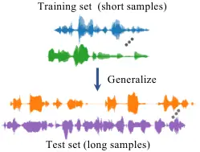
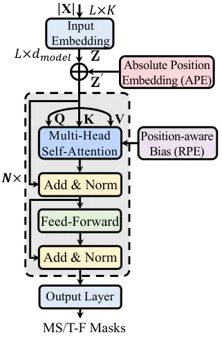
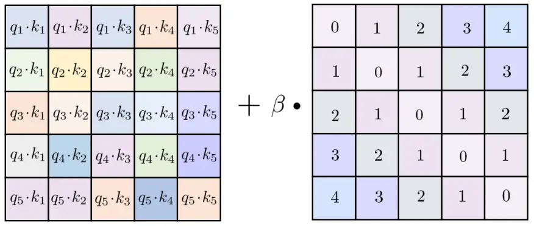

# Exploring Length Generalization For Transformer-based Speech Enhancement

Qiquan Zhang    Hongxu Zhu    Xinyuan Qian    Eliathamby Ambikairajah   
Haizhou Li ^(†)^(†)thanks: Manuscript received date; revised date. This
work is supported in part by Shenzhen Science and Technology Program
(Shenzhen Key Laboratory, Grant No. ZDSYS20230626091302006), in part by
Shenzhen Science and Technology Research Fund (Fundamental Research Key
Project, Grant No. JCYJ20220818103001002), in part by Program for
Guangdong Introducing Innovative and Enterpreneurial Teams, Grant No.
2023ZT10X044, and in part by Australian Research Council (ARC) Discovery
Grant DP210101228. (Corresponding author: Hongxu Zhu)^(†)^(†)thanks:
Qiquan Zhang and Eliathamby Ambikairaiah are with the School of
Electrical Engineering and Telecommunications, The University of New
South Wales, Sydney, NSW 2052, Australia (e-mail:
zhang.qiquan@outlook.com; e.ambikairajah@unsw.edu.au).^(†)^(†)thanks:
Hongxu Zhu is with the Department of AI System, Fano, Hong Kong, HKG,
China (e-mail: hongxuzhu2-c@my.cityu.edu.hk).^(†)^(†)thanks: Xinyuan
Qian is with the School of Computer and Communication Engineering,
University of Science and Technology Beijing, 100083, China (e-mail:
qianxy@ustb.edu.cn)^(†)^(†)thanks: Haizhou Li is with the School of Data
Science, The Chinese University of Hong Kong, Shenzhen, Guangdong
518172, China (e-mail: haizhouli@cuhk.edu.cn).

###### Abstract

Transformer network architecture has proven effective in speech
enhancement. However, as its core module, self-attention suffers from
quadratic complexity, making it infeasible for training on long speech
utterances. In practical scenarios, speech enhancement models are often
required to perform on noisy speech at run-time that is substantially
longer than the training utterances. It remains a challenge how a
Transformer-based speech enhancement model can generalize to long speech
utterances. In this paper, extensive empirical studies are conducted to
explore the model’s length generalization ability. In particular, we
conduct speech enhancement experiments on four training objectives and
evaluate with five metrics. Our studies establish that positional
encoding is an effective instrument to dampen the effect of utterance
length on speech enhancement. We first explore several existing
positional encoding methods, and the results show that relative
positional encoding methods exhibit a better length generalization
property than absolute positional encoding methods. Additionally, we
also explore a simpler and more effective positional encoding scheme,
i.e. LearnLin, that uses only one trainable parameter for each attention
head to scale the real relative position between time frames, which
learns the different preferences on short- or long-term dependencies of
these heads. The results demonstrate that our proposal exhibits
excellent length generalization ability with comparable or superior
performance than other state-of-the-art positional encoding strategies.

###### Index Terms: 

Speech enhancement, Transformer, length generalization, positional
encoding

## I Introduction

In our daily living environments, speech signals are often corrupted by
background noise. This can adversely affect the performance of speech
applications, such as assistive listening devices, mobile speech
communication, speech coding, and automatic speech recognition (ASR).
One popular way to mitigate this issue is to employ a speech enhancement
front-end to improve speech intelligibility and quality. Monaural speech
enhancement, which recovers the clean speech from a noisy recording, is
one of the examples.



Fig. 1: Length generalization in speech enhancement: The ability to
learn from short speech samples (training set) to generalize to longer
speech samples (test set).

Monaural speech enhancement has been an active research direction in
speech signal processing for decades, leading to the development of a
variety of methods. Conventional speech enhancement techniques \[1\]
mainly involve spectral subtraction \[2\], statistical model-based
algorithms \[3, 4, 5\], and Wiener filtering \[6\]. However, due to
certain restrictions and simplifications about speech and noise
characteristics, these algorithms often fail to eliminate fast-varying
noise signals \[1\]. In recent decades, facilitated by large-scale
training data and powerful computing resources, deep learning technology
has promoted enormous progress in speech enhancement \[7, 8\],
demonstrating substantial performance improvements over conventional
techniques.

Transformer network architectures have been widely used in speech and
language processing. They have shown state-of-the-art performance in
many speech processing tasks, such as speech enhancement \[9, 10, 11,
12, 13, 14\] and speech recognition \[15\]. The multi-head
self-attention (MHSA) module is a core component in Transformers and
explicitly learns the relevance of each time frame in a sequence with
respect to all other time frames, generating context-informed feature
representations. This enables Transformers to capture long-range
temporal dependencies more efficiently.

The generalization capability to unseen conditions during training is
crucial for supervised learning tasks. In speech enhancement,
generalization to unseen noise, speakers, and signal-to-noise ratios
(SNRs) have been extensively studied. Besides the three aspects, the
speech enhancement model is expected to generalize to perform on speech
utterances significantly longer than those (usually with a fixed maximum
length) seen during training. Self-attention suffers from the
computation cost quadratic with respect to the sequence length, which
makes it infeasible to use sufficiently long speech utterances for
training Transformer. A natural question arises: “Can the
Transformer-based speech enhancement model effectively learn from
shorter speech samples and generalize to longer ones?”, which is
recently defined as the problem of length generalization \[16\]. Aside
from mitigating the computation cost issue, length generalization is an
intriguing theoretical problem. In this paper, we extend our previous
work \[17\] by addressing issues how Transformer-based speech
enhancement models handle long noisy speech samples. In Fig. 1, we
illustrate the concept of length generalization in speech enhancement.

In the vanilla Transformer formula \[18\], a sinusoidal position
embedding is used to allow the model to handle sequences of variable
length between training and testing. However, we observe that such
position embedding is not effective. Studies have shown that relative
position encoding (RPE) schemes exhibit a better generalization
property, e.g., T5-Bias \[19\], TISA \[20\], and KERPLE \[21\]. We are
inspired by RPE to enable Transformer-based speech enhancement for
length generalization at run-time.

In this paper, we explore seven existing positional encoding methods in
length generalization. These methods are initially designed for natural
language processing. Note that speech spectrogram has a more rigid
temporal order than text tokens in natural language. We argue that the
complex formulations for positional encoding in T5-Bias, KERPLE, and
TISA may not be effective for speech tasks. Hence, we attempt to explore
a more efficient RPE scheme with a simpler design, i.e., LearnLin, which
encodes position information by exploiting only one learnable parameter
to explicitly scale the relative distance between different time frames.
A different parameter is learned for each attention head, which adjusts
the preferences of different heads on short- or long-range temporal
dependencies. It biases the raw attention scores with summation
operation before Softmax normalization. In summary, this paper extends
the previous work \[17\] with the following contributions:

- •
  We explore a simpler and more efficient positional encoding scheme
  (LearnLin) for Transformer speech enhancement, which employs only one
  trainable parameter in each head to scale the relative distance to
  learn the preferences on long- or short-term dependencies. Experiments
  show that LearnLin is superior or on par with other prior models in
  terms of length generalization.
- •
  We conduct a more comprehensive and systematic exploration of seven
  positional encoding approaches on four training targets (including
  both mapping- and masking-based methods) to dampen the effect of
  utterance length, across both causal and non-causal model
  configurations.
- •
  We further evaluate the performance under chunk-based processing, both
  without overlap and with a 50% overlap. The results highlight the
  effectiveness and importance of performing length generalization.

The remainder of this paper is structured as follows. In Section II, we
describe related works, including speech enhancement and length
generalization. Section III elaborates on the positional encoding
methods. Section IV formulates the research problem. In Section V, we
describe speech enhancement with position-aware Transformer Section VI
describes the experimental setup. The experimental results are presented
in Section VII. Finally, Section VIII concludes this study.

## II Related Work

Neural speech enhancement schemes can be grouped into waveform-domain
methods and time-frequency (T-F) domain methods. The waveform-domain
methods recover the target speech in an end-to-end manner by optimizing
a deep neural network (DNN) model to directly predict the raw waveform
of the clean speech from the noisy one \[22, 23, 24, 25, 26, 9\]. Many
other speech enhancement techniques are carried out in a time-frequency
(T-F) domain \[7, 8\], such as spectral mapping and T-F masking methods.
Spectral mapping methods optimize the DNN model to map the T-F
representation (or spectral feature) of the noisy speech to the clean
T-F representation. The most commonly used spectral features for
spectral mapping include log-power spectrum (LPS) \[27\], magnitude
spectrum (MS) \[28, 29, 11, 30\], and complex spectrum (CS) \[31, 32\].
In T-F masking methods, the DNN model is trained to predict a T-F mask,
which is then applied to the noisy T-F representation to obtain the
clean one. Furthering the idea of auditory T-F masking, the ideal binary
mask (IBM) is proposed as the training objective to accomplish speech
enhancement, where the speech- and noise-dominated T-F units are labeled
as one and zero, respectively \[33\]. Later, different types of T-F
masks are developed along this line of research, where the most popular
ones include the spectral magnitude mask (SMM) \[34\], ideal ratio mask
(IRM) \[34\], complex ideal ratio mask (cIRM) \[35\], and
phase-sensitive mask (PSM) \[36\].

Initial speech enhancement models typically employ a feed-forward DNN
(FNN) as the backbone network, which can only leverage limited temporal
correlations provided by a sliding window of consecutive time
frames \[27, 34, 35\]. Later, with the capability to effectively exploit
the long-range temporal dependencies present in speech signals, the long
short-term memory (LSTM) recurrent neural networks (RNNs) exhibit
significant performance superiority over FNNs and generalize well to
speakers unseen during training \[37, 38, 39\]. Nevertheless, deep
RNN-LSTM architectures involve a large number of parameters, meanwhile,
the parallelization of computation is impaired due to the inherent
sequential nature of RNNs, which excludes its use in many applications.
Instead of the frame-wise sequential prediction in RNNs, convolutional
neural networks (CNNs) process an input sequence of time frames in
parallel. Recently, a one-dimensional (1D) fully convolution network
termed the residual temporal convolutional network (ResTCN) employs a
deep stack of residual blocks comprised of dilated 1D convolution layers
to build a very large receptive field, demonstrating impressive
capability in capturing long-range temporal dependencies. ResTCNs have
been reported to yield comparable or better results than RNNs on a
number of sequence modeling problems, with significantly faster training
speed and less parameter overhead \[40\]. ResTCNs have recently been
applied to speech enhancement \[29, 41, 42\] and speaker
separation \[43, 44\] with considerable success. More recently,
Transformer network architecture, which employs the self-attention
mechanism to enable the model to capture long-term dependencies more
efficiently, has established state-of-the-art results in numerous speech
processing tasks, including speech enhancement \[12, 45, 46, 47, 48\].

To the best of our knowledge, the problem of length generalization has
not yet been investigated in Transformer-based speech enhancement. There
have been attempts to explore it with Transformers in language modeling
\[21, 49, 16\], machine translation, and image recognition \[50\]. Anil
et al. \[16\] define the length generalization problem and establish
that few-shot scratchpad prompting leads to a considerable improvement
for pre-trained large language models (LLMs) in length generalization.
Press et al. \[49\] propose an RPE method termed ALiBi that employs
fixed slopes to weight the real relative distance to enable the length
generalization for causal language modeling. Later, Chi et al. \[21\]
propose the kernelized relative position embedding (KERPLE), which
demonstrates that the ALiBi is a particular instance of KERPLE and
achieves superior generalization performance \[21\] in perplexity.
Dubois et al. \[51\] present a novel location-based attention to
facilitate generalization to longer sequences. Newman et al. \[52\] find
that generative language models trained to predict the end-of-sequence
(EOS) token exhibit worse length generalization ability than those not
trained to predict the EOS token. A recent work \[53\] investigates the
capability of graph neural networks (GNNs) to generalize from small to
large graphs.

## III Positional Encoding

Existing positional encoding methods in Transformers can be divided into
two groups: absolute position encoding (APE) and relative position
encoding (RPE).

### III-A Absolute Positional Encoding

APE methods assign a unique position vector or embedding to each time
step, which is then summed with the input frame embedding to form the
input to the first Transformer layer. APE involves two types of encoding
techniques: constant \[18\] and learnable \[54\].

Sinusoidal Position Embedding. The original Transformer paper proposes
the sinusoidal position embeddings \[18\] that are fixed and non-learned
vectors calculated using the deterministic functions, i.e., cosine and
sine functions. Specifically, for the $`l`$-th time frame, the $`d`$-th
component of position embedding $`E_{l,d}`$ is given as:

```math
E_{l,d}\!=\begin{cases}\sin\left(l\cdot 10000^{-\frac{d}{d_{model}}}\right),&d\text{ is even }\\
\cos\left(l\cdot 10000^{-\frac{d-1}{d_{model}}}\right),&d\text{ is odd }\end{cases} \tag{1}
```

where $`d_{model}`$ denotes the dimension of the input embedding. It is
a commonly used positional encoding scheme in Transformer-based speech
enhancement \[55\] and speaker separation \[56\] as well.

Learnable Absolute Position Embedding. BERT \[54\] replaces the fixed
sinusoidal position embeddings with fully-learnable absolute position
embeddings $`\mathbf{E}\!\in\!\mathbb{R}^{L\times d_{\text{model}}}`$
corresponding to the time frames $`l=1,2,...,L`$ in an utterance. Here
we refer to the learnable APE as “BERT-Pos”.

### III-B Relative Positional Encoding

APE is restricted to fixed max sequence lengths. Instead of encoding
absolute positions, RPE considers relative distances between two
elements in a sequence.

Gaussian Bias (Gauss-Bias) is proposed for acoustic modeling in \[57\],
which encodes the relative position through a Gaussian function, where
the relative position between $`i`$-th and $`j`$-th time frames is
encoded as:

```math
P_{i,j}=\frac{-(i-j)^{2}}{2\sigma^{2}} \tag{2}
```

where $`\sigma`$ denotes a trainable standard deviation parameter.
Different parameters are learned for each attention head, and parameters
are shared across layers.

T5-Bias. In T5 model \[19\], the relative positions $`i-j`$ are split
into a fixed number of buckets with a log-binning strategy and the
positions in the same bucket share the same position embedding. The
relative position embedding or bias is shared across layers. To be
specific, given a bucket of $`32`$ learnable parameters B, for each
attention head, the scalar position bias $`P_{i,j}`$ is extracted from
the bucket with the following rule:

```math
P_{i,j}\!=\!\begin{cases}\textbf{B}[\min(15,8\!+\!\lfloor\frac{\log((|i-j|)/8)}{\log(128/8)}\cdot 8\rfloor)\!+\!16],\quad i\!-\!j\!\leq\!-8\\
\textbf{B}[|i-j|+16],\qquad\qquad\qquad\qquad\quad\,\!{-8}\!<\!i\!-\!j\!<\!0\\
\textbf{B}[i-j],\qquad\qquad\qquad\qquad\qquad\qquad\,\,\,0\!\leq\!i\!-\!j\!<\!8\\
\textbf{B}[\min(15,8\!+\!\lfloor\frac{\log((i-j)/8)}{\log(128/8)}\cdot 8\rfloor)],\qquad\qquad i\!-\!j\!\geq\!8\end{cases} \tag{3}
```

Where $`\lfloor\cdot\rfloor`$ denotes the floor function. We refer to
this RPE method as “T5-Bias”.

Translation-Invariant Self-Attention (TISA). The TISA model \[20\]
encodes relative positions using radial-basis functions shaped by
several trainable parameters, which provides both localized and global
attention, defined as:

```math
{P_{i,j}=\sum_{s=1}^{S}a_{s}\exp\left(-\left|b_{s}\right|\left(j-i-c_{s}\right)^{2}\right)} \tag{4}
```

where $`a_{s}`$, $`b_{s}`$, and $`c_{s}`$ denote the three trainable
parameters included for each kernel $`s\!\in\!\left\{1,...,S\right\}`$.
Every attention head and layer employs different parameters. We refer to
this positional encoding method as the “TISA”.

DA-Bias. The distance-aware Transformer \[58\] employs a learnable
sigmoid function to encode the relative position (referred to as
“DA-Bias”), given as:

```math
P_{i,j}=\frac{1+\text{exp}(v)}{1+\text{exp}(v-(w|i-j|))} \tag{5}
```

where $`w`$ and $`v`$ denote two learnable parameters for each head that
are used to scale the relative distance and control the upper bound and
ascending steepness of the function, respectively.

KERPLE \[21\] learns the relative position embedding with conditionally
positive definite kernels, including the power variant and the
logarithmic variant, where the logarithmic variant achieves better
performance, given as:

```math
P_{i,j}=-r_{1}\cdot\text{log}(1+r_{2}|i-j|) \tag{6}
```

where $`r_{1}>0`$ and $`r_{2}>0`$ are two learnable parameters for each
head. Note KERPLE is limited to causal language modeling. Here, we do
not constrain our speech enhancement system to be causal.

Among the aforementioned RPE methods, except for DA-Bias which injects
the position information with multiplication operation, the other RPE
methods inject position information by adding the relative position
embeddings (or bias) with the raw attention scores matrix.

Rotary Position Embedding (RoPE). The RoPE \[59\] injects position
information by rotating key and query representations with angles
proportional to their absolute positions in each self-attention layer.
With this rotation, the attention dot product exhibits the explicit
relative position dependency. We refer readers to the original
publication \[59\] for more details.

## IV Time-Frequency Neural Speech Enhancement

### IV-A Signal Model

Given a clean speech signal $`s[n]`$, which is corrupted by an
uncorrelated additive noise signal $`v[n]`$, the observed noisy speech
signal $`x[n]`$ can be formulated as:

```math
x[n]=s[n]+v[n], \tag{7}
```

where $`n`$ denotes the index of discrete-time samples. Applying the
short-time Fourier transform (STFT) to the noisy speech signal $`x`$,
the time-frequency representation is obtained:

```math
X_{l,k}=S_{l,k}+V_{l,k}, \tag{8}
```

where $`X_{l,k}\!\in\!\mathbb{C}`$, $`S_{l,k}\!\in\!\mathbb{C}`$, and
$`V_{l,k}\!\in\!\mathbb{C}`$ respectively represent the complex-valued
STFT spectra of the noisy speech $`x`$, the clean speech $`s`$, and the
noise component $`v`$, at the $`k\text{-th}`$ discrete-frequency bin of
the $`l\text{-th}`$ time frame. In polar form, equation (8) can be
expressed as:

```math
|X_{l,k}|e^{j\theta_{X_{l,k}}}=|S_{l,k}|e^{j\theta_{S_{l,k}}}+|V_{l,k}|e^{j\theta_{V_{l,k}}}, \tag{9}
```

where $`|\cdot|`$ extracts the spectral magnitude and $`\theta`$ denotes
the spectral phase.

### IV-B Training Objectives

A backbone network model is trained to optimize its training objective
for speech enhancement. Studies have shown that one improves the quality
and intelligibility of speech in speech enhancement by optimizing the
network model in regard to the T-F mask \[45\]. Without loss of
generality, this study employs four commonly used training objectives,
which are outlined below.

#### IV-B1 Magnitude Spectrum

The magnitude spectrum (MS) of the clean speech $`\left|S_{l,k}\right|`$
is one typical training objective in spectral mapping methods to speech
enhancement. The estimated clean speech MS $`|\widehat{S}_{l,k}|`$ is
employed with the spectral phase of the noisy speech
$`\theta_{X_{l,k}}`$ to obtain the enhanced STFT spectrum,
$`\widehat{S}_{l,k}\!=\!|\widehat{S}_{l,k}|e^{j\theta_{X_{l,k}}}`$.
Then, inverse STFT (ISTFT) is applied to reconstruct time-domain
waveform of the enhanced speech $`\widehat{s}`$.

#### IV-B2 Ideal Ratio Mask

In masking-based methods to speech enhancement, the ideal ratio mask
(IRM) \[34\] is one of the most commonly used training objectives, which
is given as:

```math
\text{IRM}[l,k]=\left(\frac{|S_{l,k}|^{2}}{|S_{l,k}|^{2}+|V_{l,k}|^{2}}\right)^{\gamma} \tag{10}
```

where $`\left|V_{l,k}\right|`$ denotes the STFT magnitude spectra of the
noise and $`\gamma`$ the scale parameter that is commonly set to
0.5 \[7\].

#### IV-B3 Phase-Sensitive Mask

As an extension of the spectral magnitude mask (SMM), the
phase-sensitive mask (PSM) \[36\] involves both spectral phase and
magnitude error:

```math
\text{PSM}[l,k]=\frac{|S_{l,k}|}{|X_{l,k}|}\cos[\theta_{{S}_{l,k}}-\theta_{{X}_{l,k}}] \tag{11}
```

where $`\theta_{{S}_{l,k}}`$ and $`\theta_{{X}_{l,k}}`$ denote the
spectral phases of the clean speech and the noisy speech, respectively.
The introduction of phase error allows the estimated magnitudes to
compensate for the use of noisy speech phases and shows a higher
signal-to-distortion ratio (SDR) than IRM and SMM \[36\].

The value of the IRM lies in the range of 0 and 1. From equation (11),
it can be found that the PSM value has an upper bound of greater than 1.
In this study, we truncate the PSM values to the range of $`[0,1]`$, to
fit the output range of the sigmoidal function.

#### IV-B4 Complex Ideal Ratio Mask

Unlike the aforementioned masks, the complex ideal ratio mask
(cIRM) \[35\] is defined in the complex domain:

```math
\text{cIRM}=\frac{X^{r}S^{r}+X^{i}S^{i}}{(X^{r})^{2}+(X^{i})^{2}}+j\frac{X^{r}S^{i}-X^{i}S^{r}}{(X^{r})^{2}+(X^{i})^{2}} \tag{12}
```

where the superscripts $`r`$ and $`i`$ denote the real and imaginary
components, respectively. The indices $`l`$ and $`k`$ are omitted for
simplicity. We employ the same compression function in \[35\] to
compress the cIRM.

With the real-valued T-F masks, i.e., IRM and PSM, as training
objectives, DNNs are optimized to yield masks $`\widehat{M}_{l,k}`$ at
run time. The attained T-F masks are then applied as a suppression rule
on the STFT spectral magnitude of the noisy speech $`|X_{l,k}|`$ to
produce a clean version, given as

```math
|\widehat{S}_{l,k}|\!=\!|X_{l,k}|\!\cdot\!\widehat{M}_{l,k}. \tag{13}
```

Then, the enhanced spectral magnitude $`|\widehat{S}_{l,k}|`$ is
employed with the noisy spectral phase $`\theta_{X_{l,k}}`$ to recover
the waveform of clean speech $`\widehat{s}`$ through ISTFT operation.
The estimated cIRM is multiplied by the complex spectrum of the noisy
speech $`X`$ to compute a clean version.

## V Speech Enhancement With Position-aware Transformer

### V-A Network Architecture

Fig. 2 (a) illustrates the overall architecture of the position-aware
Transformer backbone network for speech enhancement. The input to the
network is the STFT spectral magnitude of the noisy speech,
$`|\textbf{X}|\!\in\!\mathbb{R}^{L\times K}`$, i.e., $`L`$ time frames
of $`K`$ discrete frequency bins. The embedding layer is a
fully-connected (FC) layer that involves a frame-wise layer
normalization followed by the ReLU activation function \[45\], which
projects the input $`|\textbf{X}|`$ into a latent representation or
embedding with a dimension of $`d_{model}`$,
$`\textbf{Z}\!\in\!\mathbb{R}^{L\times d_{model}}`$ \[42\]. The APE
methods (Sinusoidal PE and BERT-Pos) incorporate the position
information by adding the position embedding
$`\textbf{E}\!\in\!\mathbb{R}^{L\times d_{model}}`$ to the input
embedding Z. The resulting representation
$`\textbf{Z}^{\prime}\!=\!\textbf{Z}\!+\!\textbf{E}`$ is then passed to
$`N`$ stacked Transformer layers for feature transformation. Each
Transformer layer consists of two sub-layers. The first one is a
multi-head self-attention (MHSA) module, and the second one is a
two-layer feed-forward network (FFN). A residual skip connection is
employed around each sub-layer. The output layer (on the top of the last
Transformer layer) of the network is an FC layer, where a linear layer
is used to estimate cIRM, and ReLU and sigmoidal activation functions
are applied to output the estimated clean speech magnitude spectrum (MS)
and the three real-valued T-F masks (IRM, SMM, and PSM), respectively.
Unlike APE which injects position information in the input embedding,
RPE includes position information in the self-attention module, which is
described in Section V-B.



(a)

(b)

Fig. 2: Illustration of (a) the position-aware Transformer backbone
network and (b) the position-aware self-attention. $`\oplus`$ denotes
the element-wise summation operation.



Fig. 3: Raw dot-product attention scores are biased by adding a
learnable position-aware bias. $`\beta`$ denotes the learnable head-wise
scale parameter, which is different for each attention head shared
across Transformer layers.

### V-B Position-aware Self-attention

Fig. 2 (b) illustrates the workflow of the position-aware self-attention
module. It takes as input a set of queries
($`\textbf{Q}\!\in\!\mathbb{R}^{L\times d_{model}}`$), keys
($`\textbf{K}\!\in\!\mathbb{R}^{L\times d_{model}}`$), and values
($`\textbf{V}\!\in\!\mathbb{R}^{L\times d_{model}}`$), and a total of
$`H`$ attention heads are utilized to allow the model to pay attention
to different aspects of information, where we denote the head index as
$`h\!=\!\left\{1,2,3,..,H\right\}`$.

For the $`h`$-th attention head, Q, K, and V are first transformed with
a linear projection respectively, which leads to
$`\textbf{Q}^{h}\!=\!\textbf{Q}\textbf{W}_{Q}^{h}`$,
$`\textbf{K}^{h}\!=\!\textbf{K}\textbf{W}_{K}^{h}`$, and
$`\textbf{V}^{h}\!=\!\textbf{V}\textbf{W}_{V}^{h}`$, with dimensions of
$`d_{k}`$, $`d_{k}`$, and $`d_{v}`$, respectively, where
$`\{\textbf{W}^{h}_{Q},\textbf{W}_{K}^{h}\}\!\in\!\mathbb{R}^{d_{model}\times d_{k}}`$
and $`\textbf{W}_{V}^{h}\in\!\mathbb{R}^{d_{model}\times d_{v}}`$ denote
learned projection matrices. The scaled dot-product attention is used to
compute the attention scores for each attention head. This study
explores six advanced RPE methods (described in Section III-B) to enable
the model to generalize from short speech utterances to longer ones.
RoPE rotates query Q and key K representations with angles proportional
to their absolute positions to incorporate position information in
self-attention \[59\]. DA-Bias injects position information by
multiplying the clipped attention scores with the position-aware bias
(refer to Equation (6) in \[58\]). In the other four RPE methods
(Gauss-Bias, T5-Bias, TISA, and KERPLE), the position-aware bias or
embeddings are injected with the element-wise summation operation before
Softmax normalization, given as:

```math
\textbf{A}^{h}\left(\textbf{Q}^{h},\textbf{K}^{h},\textbf{V}^{h}\right)=\text{softmax}\left(\frac{\textbf{Q}^{h}\textbf{K}^{h\top}}{\sqrt{d_{k}}}+\textbf{P}^{h}\right)\textbf{V}^{h}, \tag{14}
```

where $`\top`$ denotes the transpose operation, the head dimension
$`d_{k}\!=\!d_{v}\!=\!d_{model}/{H}`$, and
$`\textbf{P}^{h}\!\in\!\mathbb{R}^{L\times L}`$ the position-aware bias.
We refer the reader to the original study \[18\] for more detailed
descriptions of attention scores computation.

Here, we also explore a simpler RPE scheme for length generalization.
Similarly, $`\textbf{P}^{h}`$ is calculated by explicitly using the
relative position between time frames. To be specific, let us denote the
relative distance matrix as $`\textbf{R}\!\in\!\mathbb{R}^{L\times L}`$,
where the $`(i,j)`$ entry $`R_{i,j}\!=\!|i-j|`$ denotes the real
relative distance between the $`i`$-th and $`j`$-th time frames. We
attempt to discard complex encoding designs (or formulations) in prior
methods (TISA, KERPLE, and DA-Bias) \[20, 21, 58\] and use only one
learnable parameter $`\beta^{h}`$ to scale R in each attention head to
compute the position-aware bias:

```math
P^{h}_{i,j}=\beta^{h}\cdot|i-j|. \tag{15}
```

The head-wise scale parameter $`\beta^{h}`$ is shared across Transformer
layers, with a different parameter for different attention heads. Hence,
there are $`H`$ learnable parameters for $`H`$ attention heads. Unlike
Gauss-Bias (Equation (2)), ALiBi, and KERPLE (Equation (6)) that
constrain the bias inversely proportional to $`R_{i,j}\!=\!|i-j|`$, we
do not apply such a constraint to learn the position-aware bias. A
different parameter $`\beta^{h}`$ is learned in each attention head to
enable different heads to model their diverse preferences on long-term
or short-term contextual dependencies with different intensities,
allowing the model to capture contextual dependencies more effectively.
To be specific, a positive $`\beta^{h}`$ encourages the attention head
to model long-term dependencies, as the attention scores are amplified
more intensively by a more positive $`P^{h}`$. A negative $`\beta^{h}`$
encourages it to model short-term dependencies, as the attention scores
are diminished more intensively by a more negative $`P^{h}`$. Since the
bias $`P^{h}_{i,j}`$ is learnable and linear to the real relative
position, we refer to it as “LearnLin”. We can also observe that
LearnLin equals the term $`w|i-j|`$ in DA-Bias (Equation (5)). This
study shows that the learnable sigmoidal function is redundant and leads
to a performance decrease. Fig. 3 provides an example of how the
LearnLin bias is injected into the self-attention mechanism (with a
sequence length of $`L=5`$ time frames).

The outputs from all $`H`$ attention heads are then concatenated and
transformed again with a linear projection
$`\textbf{W}^{O}\!\in\!\mathbb{R}^{d_{model}\times d_{model}}`$, forming
the MHSA module output:

```math
\text{MHSA}\left(\textbf{Q},\textbf{K},\textbf{V}\right)=\text{Concat}[\textbf{A}^{1}\!,\textbf{A}^{2}\!,...,\textbf{A}^{H}]\textbf{W}^{O}. \tag{16}
```

The output of the MHSA sub-layer denoted by Y is then passed to the
two-layer FFN for two linear transformations, where a ReLU function is
applied for the first layer, given as:

```math
\text{FFN}(\textbf{Y})=\text{ReLU}(\textbf{Y}\textbf{W}_{1}+\textbf{b}_{1})\textbf{W}_{2}+\textbf{b}_{2}, \tag{17}
```

where $`\textbf{W}_{1}\in\mathbb{R}^{d_{model}\times d_{f\!f}}`$,
$`\textbf{W}_{2}\in\mathbb{R}^{d_{f\!f}\times d_{model}}`$,
$`\textbf{b}_{1}\in\mathbb{R}^{d_{f\!f}}`$, and
$`\textbf{b}_{2}\in\mathbb{R}^{d_{model}}`$ are projection and bias
parameters. The input and output of the FFN sub-layer have a dimension
of $`d_{model}`$, and the dimension of the inner-layer is $`d_{f\!f}`$.

## VI Experimental Setup

### VI-A Dataset

In this section, we provide a detailed description of the clean speech
and noise data used in our experiments. For the clean speech data in the
training set, we employ the train-clean-100 subset of the LibriSpeech
corpus \[60\], comprising $`28\,539`$ clean speech utterances from
$`251`$ speakers ($`125`$ females and $`126`$ males), with a total
duration of approximately 100 hours. The noise data used for training
are collected from the Nonspeech dataset \[61\], the RSG-10 dataset
\[62\], the Environmental Background Noise dataset \[63, 64\], the Urban
Sound dataset \[65\], the noise subset of the MUSAN corpus \[66\], the
QUT-NOISE dataset \[67\], and the colored noise data (with an $`\alpha`$
value ranging from $`-2`$ to $`2`$ in increments of 0.25) \[41\]. For
testing, we select four noise sources \[45\]: factory welding, F16, and
voice babble from the RSG-10 dataset \[62\] and the street music
recording no $`26\,270`$ from the Urban Sound dataset \[65\]. The noise
recordings in the dataset that are longer than 30 seconds are split into
clips of 30 seconds or less, resulting in a noise set with a total of
$`6\,809`$ noise clips. To perform validation experiments, we randomly
selected $`1\,000`$ clean speech utterances (over 2 seconds) and noise
clips from the clean speech and noise data to create a validation set of
$`1\,000`$ noisy speech utterances. The noisy utterances are synthesized
by mixing each clean speech with a random segment of one noise clip at a
random SNR sampled from the set
$`\left\{r|r\in\mathbb{Z}:-10\leq r\leq 20\right\}`$ (dB). As a result,
the training set includes a total of $`27\,539`$ clean speech utterances
and $`5\,809`$ noise clips.

For evaluation experiments, clean speech utterances are taken from the
test-clean-100 subset of LibriSpeech corpus \[60\]. Noise clips are from
the aforementioned four real-world noise recordings drawn from the
RSG-10 noise dataset \[62\] and the Urban Sound dataset \[65\],
containing two colored (factory welding and F16) and two non-stationary
noise sources (street music and voice babble).

Fig. 4: The length distribution over the $`1000`$ speech utterances in
the validation dataset.

Feature Extraction. All audio signals used in this study are monaural
and sampled at a rate of 16 kHz. The noisy speech utterance is segmented
into a set of time frames using a square-root-Hann window of length 32
ms ($`32\!\times\!16\!=\!512`$ time samples), with a hop length of 16 ms
($`16\!\times\!16\!=\!256`$ time samples). A 512-point fast Fourier
transform (FFT) is then applied to each frame, resulting in a
257-dimensional STFT magnitude spectrum as the input, which contains
both the DC and Nyquist frequency components.

Length Generalization. To investigate the length generalization
performance of the models, clean speech utterances in the training set
are split into 1-second (1s) and 2-second (2s) speech clips for
training, respectively. The training details are described in Section
VI-B. For testing, we create six test sets, of which each consists of
400 noisy speech recordings of 1s, 2s, 5s, 10s, 15s, and 20s in length,
respectively. The noisy mixtures are generated as follows: we randomly
select twenty clean speech utterances (over 1s, 2s, 5s, 10s, 15s, and
20s in length, respectively) from the test-clean-100 subset for each of
the four test noise recordings. Then, a random clip (1s, 2s, 5s, 10s,
15s, and 20s in length) from each clean speech utterance is corrupted by
a random clip with the same length cut from the noise recording at five
SNR levels, i.e., -5 dB, 0 dB, 5 dB, 10 dB, and 15 dB. In Fig. 4, we
provide the distribution of lengths over the $`1\ 000`$ speech
utterances in the aforementioned validation set. We can find that the
validation lengths show a broad range (diversity) and most of the speech
utterances are more than four times (4s or 8s) the length of the
training set (1s or 2s).

### VI-B Implementation Details

In this section, we describe the details of model implementations. To
evaluate the length generalization of the LearnLin, we employ the
standard Transformer backbone network without position embedding
(No-Pos) as the baseline \[10\]. The Transformer model employs
$`N\!=\!4`$ Transformer layers \[14\] and adopt the parameter settings
as in \[45\]: $`H\!=\!8`$, $`d_{model}\!=\!256`$, and
$`d_{f\!f}\!=\!1024`$. This study explores several existing APE and RPE
methods, which include Sinusoidal \[18\], BERT-Pos \[54\], Gauss-Bias
\[57\], T5-Bias \[19\], TIAS \[20\], DA-Bias \[58\], and KERPLE \[21\],
to enable the Transformer speech enhancement model to perform length
generalization. For TISA, the number of kernels $`S`$ is set to 5
\[20\]. It should be noted that KERPLE is initially proposed for causal
language modeling. In this study, we derive a non-causal version of
KERPLE to study length generalization. Table I lists the numbers of
trainable parameters for different positional encoding methods.

Training Methodology. Every ten clean speech utterances are selected
from the training set and split into clean speech clips of length 1s and
2s (the last clip is dropped), respectively, to create one mini-batch
for one training iteration. The noisy mixtures are generated on fly
during training. Specifically, each clean speech clip from the
mini-batch is corrupted by a random segment of a random noise clip with
a randomly sampled SNR from
$`\left\{r|r\in\mathbb{Z}:-10\leq r\leq 20\right\}`$ (dB). For each
training epoch, the order of picking up clean speech is shuffled
randomly. For all of the training objectives (i.e., MS, IRM, PSM, and
cIRM), the mean-square error (MSE) is used as the training objective
function. Mask approximation is used to learn the T-F mask. For MS, the
MSE loss is computed on the power-law compressed magnitude spectrum
\[68\]. For optimization of the models, we adopt the Adam gradient
optimizer with the hyper-parameter settings \[18\],
$`\beta_{1}\!=\!0.9`$, $`\beta_{2}\!=\!0.98`$, and
$`\epsilon\!=\!1\times 10^{-9}`$. The gradient clipping is applied to
keep the gradient values in the range from -1 to 1. Since the gradient
optimization of the self-attention based Transformer models requires a
carefully designed learning rate scheduler, a warm-up scheduler is used
to dynamically adjust the learning rate \[10, 18\]. Specifically, the
formula used to adjust the learning rate is given as \[45\]:

```math
\vskip-1.99997ptlr=d_{model}^{-0.5}\cdot\textrm{min}\left(n\_step\cdot w\_steps^{-1.5},n\_step^{-0.5}\right) \tag{18}
```

where $`w\_steps`$ and $`n\_step`$ denote the number of warm-up training
steps and training steps, respectively. Following \[10\], we use
$`w\_steps\!=\!40\,000`$ for warm-up training scheduler. Our experiments
were conducted on an NVIDIA Tesla P100-PCIe-16GB graphics processing
unit (GPU).

### VI-C Assessment Metrics

Five commonly used objective assessment metrics, which are the
perceptual evaluation of speech quality (PESQ) \[69\], the extended
short-time objective intelligibility (ESTOI) \[70\], and three composite
metrics \[71\], are adopted to comprehensively evaluate enhanced speech
signals. Reading all the five speech assessment metrics, we have a
higher score to indicate better performance. The PESQ and ESTOI are to
evaluate the quality and intelligibility of enhanced speech,
respectively. The PESQ score is in the range of $`-0.5`$ to $`4.5`$, and
the ESTOI score typically ranges from 0 to 1. The three composite
metrics describe the mean opinion score (MOS) of the overall speech
quality (COVL) \[71\], the signal distortion (CSIG) \[71\], and the
background-noise distortion (CBAK) \[71\], respectively. The COVL, CSIG,
and CBAK scores range from 0 to 5.

|          |       |                                       |            |          |         |         |        |          |
| -------- | ----- | ------------------------------------- | ---------- | -------- | ------- | ------- | ------ | -------- |
| PE       | Sinu. | BERT-Pos                              | Gauss-Bias | TISA     | T5-Bias | DA-Bias | KERPLE | LearnLin |
| \#Param. | –     | $`L^{{}^{\prime}}\!\cdot\!d_{model}`$ | $`H`$      | $`3SHN`$ | $`32H`$ | $`2H`$  | $`2H`$ | $`H`$    |

TABLE I: The number of trainable parameters for different positional
encoding methods, where $`L^{{}^{\prime}}`$ and $`S`$ (set to 5 as
suggested in \[20\]) denote the fixed maximum length (frame numbers) and
the kernel numbers in TISA.

(a)

(b)

Fig. 5: The (a) training loss and (b) validation loss of the models
trained using 1s utterances, on MS training objective.

## VII Experimental Results

(a)

(b)

Fig. 6: The (a) training loss and (b) validation loss of the models
trained using 2s utterances, on IRM training objective.

(a)

(b)

Fig. 7: The (a) training loss and (b) validation loss of the models
trained using 2s utterances, on PSM training objective.

### VII-A Training and Validation Loss

In this section, we first observe the training and validation loss
values across the models. The loss curves of different models trained
with 1s and 2s speech utterances are given in Fig. 5 (MS) and Fig. 6-7
(IRM and PSM), respectively, where 150 epochs are used for training
models. Similar trends of loss curves are observed on different training
objectives for the same training length.

|           |            |         |       |      |      |      |
| --------- | ---------- | ------- | ----- | ---- | ---- | ---- |
|           |            | Metrics |       |      |      |      |
| Test Len. | Model      | PESQ    | ESTOI | CSIG | CBAK | COVL |
| 1s        | Noisy      | 1.98    | 54.81 | 2.39 | 1.88 | 1.76 |
|           | No-Pos     | 2.56    | 66.58 | 3.15 | 2.45 | 2.47 |
|           | Sinusoidal | 2.68    | 70.19 | 3.27 | 2.53 | 2.58 |
|           | BERT-Pos   | 2.69    | 70.15 | 3.26 | 2.53 | 2.58 |
|           | Gauss-Bias | 2.60    | 67.59 | 3.18 | 2.47 | 2.49 |
|           | T5-Bias    | 2.70    | 70.27 | 3.29 | 2.55 | 2.61 |
|           | TISA       | 2.71    | 70.72 | 3.30 | 2.54 | 2.61 |
|           | DA-Bias    | 2.70    | 70.09 | 3.27 | 2.53 | 2.59 |
|           | KERPLE     | 2.69    | 69.85 | 3.28 | 2.51 | 2.58 |
|           | LearnLin   | 2.71    | 70.24 | 3.28 | 2.54 | 2.60 |
| 5s        | Noisy      | 1.88    | 54.26 | 2.33 | 1.86 | 1.71 |
|           | No-Pos     | 2.42    | 64.24 | 3.05 | 2.34 | 2.34 |
|           | Sinusoidal | 2.19    | 57.17 | 2.77 | 2.17 | 2.09 |
|           | BERT-Pos   | 1.96    | 51.86 | 2.60 | 2.02 | 1.92 |
|           | Gauss-Bias | 2.50    | 65.66 | 3.14 | 2.41 | 2.42 |
|           | T5-Bias    | 2.36    | 62.27 | 2.95 | 2.27 | 2.24 |
|           | TISA       | 2.65    | 68.60 | 3.27 | 2.49 | 2.55 |
|           | DA-Bias    | 2.67    | 69.92 | 3.28 | 2.53 | 2.58 |
|           | KERPLE     | 2.67    | 70.40 | 3.29 | 2.50 | 2.57 |
|           | LearnLin   | 2.70    | 70.91 | 3.31 | 2.53 | 2.59 |
| 10s       | Noisy      | 1.92    | 53.19 | 2.40 | 1.87 | 1.75 |
|           | No-Pos     | 2.38    | 61.48 | 2.99 | 2.29 | 2.28 |
|           | Sinusoidal | 2.11    | 52.17 | 2.67 | 2.09 | 2.01 |
|           | BERT-Pos   | 1.92    | 47.91 | 2.55 | 1.96 | 1.89 |
|           | Gauss-Bias | 2.51    | 63.68 | 3.12 | 2.39 | 2.41 |
|           | T5-Bias    | 2.27    | 57.54 | 2.82 | 2.17 | 2.12 |
|           | TISA       | 2.56    | 63.18 | 3.08 | 2.38 | 2.39 |
|           | DA-Bias    | 2.64    | 66.69 | 3.25 | 2.49 | 2.55 |
|           | KERPLE     | 2.68    | 68.31 | 3.29 | 2.51 | 2.59 |
|           | LearnLin   | 2.71    | 69.11 | 3.32 | 2.55 | 2.62 |
| 15s       | Noisy      | 1.90    | 52.68 | 2.32 | 1.83 | 1.71 |
|           | No-Pos     | 2.32    | 60.19 | 2.93 | 2.26 | 2.23 |
|           | Sinusoidal | 2.05    | 50.80 | 2.57 | 2.03 | 1.94 |
|           | BERT-Pos   | 1.97    | 47.03 | 2.47 | 1.93 | 1.85 |
|           | Gauss-Bias | 2.48    | 63.54 | 3.06 | 2.36 | 2.37 |
|           | T5-Bias    | 2.23    | 58.30 | 2.82 | 2.23 | 2.11 |
|           | TISA       | 2.47    | 60.33 | 2.93 | 2.30 | 2.26 |
|           | DA-Bias    | 2.58    | 65.65 | 3.18 | 2.45 | 2.49 |
|           | KERPLE     | 2.64    | 68.39 | 3.23 | 2.47 | 2.53 |
|           | LearnLin   | 2.68    | 68.93 | 3.28 | 2.49 | 2.57 |
| 20s       | Noisy      | 1.91    | 51.42 | 2.36 | 1.82 | 1.72 |
|           | No-Pos     | 2.34    | 59.07 | 2.98 | 2.28 | 2.26 |
|           | Sinusoidal | 2.03    | 49.02 | 2.62 | 2.02 | 1.94 |
|           | BERT-Pos   | 1.91    | 45.23 | 2.50 | 1.91 | 1.84 |
|           | Gauss-Bias | 2.53    | 62.39 | 3.15 | 2.41 | 2.42 |
|           | T5-Bias    | 2.25    | 54.56 | 2.80 | 2.14 | 2.09 |
|           | TISA       | 2.44    | 57.41 | 2.92 | 2.28 | 2.22 |
|           | DA-Bias    | 2.58    | 63.50 | 3.21 | 2.47 | 2.50 |
|           | KERPLE     | 2.69    | 67.25 | 3.32 | 2.53 | 2.60 |
|           | LearnLin   | 2.72    | 67.92 | 3.34 | 2.56 | 2.62 |

TABLE II: Performance evaluation results in terms of PESQ, ESTOI (in %),
CSIG, CBAK, and COVL. All the models are trained (MS as the training
objective) with 1s noisy-clean speech pairs and tested on noisy speech
utterances of 1s, 5s, 10s, 15s, and 20s in length.

|           |            |         |       |      |      |      |
| --------- | ---------- | ------- | ----- | ---- | ---- | ---- |
|           |            | Metrics |       |      |      |      |
| Test Len. | Model      | PESQ    | ESTOI | CSIG | CBAK | COVL |
| 1s        | Noisy      | 1.98    | 54.81 | 2.39 | 1.88 | 1.76 |
|           | No-Pos     | 2.48    | 67.23 | 3.12 | 2.51 | 2.39 |
|           | Sinusoidal | 2.57    | 70.21 | 3.23 | 2.56 | 2.48 |
|           | BERT-Pos   | 2.58    | 70.61 | 3.22 | 2.58 | 2.49 |
|           | Gauss-Bias | 2.50    | 67.61 | 3.15 | 2.54 | 2.41 |
|           | T5-Bias    | 2.60    | 71.04 | 3.26 | 2.59 | 2.51 |
|           | TISA       | 2.60    | 70.86 | 3.26 | 2.59 | 2.50 |
|           | DA-Bias    | 2.58    | 70.65 | 3.25 | 2.57 | 2.50 |
|           | KERPLE     | 2.57    | 70.13 | 3.24 | 2.57 | 2.49 |
|           | LearnLin   | 2.59    | 71.01 | 3.25 | 2.59 | 2.50 |
| 5s        | Noisy      | 1.88    | 54.26 | 2.33 | 1.86 | 1.71 |
|           | No-Pos     | 2.33    | 64.56 | 2.98 | 2.39 | 2.25 |
|           | Sinusoidal | 2.17    | 56.22 | 2.73 | 2.24 | 2.04 |
|           | BERT-Pos   | 1.99    | 52.96 | 2.53 | 2.12 | 1.89 |
|           | Gauss-Bias | 2.42    | 66.43 | 3.09 | 2.48 | 2.34 |
|           | T5-Bias    | 2.31    | 64.06 | 2.97 | 2.37 | 2.23 |
|           | TISA       | 2.53    | 69.87 | 3.22 | 2.54 | 2.46 |
|           | DA-Bias    | 2.53    | 69.19 | 3.23 | 2.55 | 2.48 |
|           | KERPLE     | 2.54    | 70.29 | 3.23 | 2.55 | 2.47 |
|           | LearnLin   | 2.57    | 70.48 | 3.25 | 2.57 | 2.50 |
| 10s       | Noisy      | 1.92    | 53.19 | 2.40 | 1.87 | 1.75 |
|           | No-Pos     | 2.32    | 62.48 | 2.99 | 2.35 | 2.24 |
|           | Sinusoidal | 2.12    | 52.11 | 2.64 | 2.15 | 1.99 |
|           | BERT-Pos   | 1.97    | 50.64 | 2.44 | 2.05 | 1.83 |
|           | Gauss-Bias | 2.44    | 64.62 | 3.14 | 2.46 | 2.37 |
|           | T5-Bias    | 2.28    | 59.92 | 2.92 | 2.29 | 2.17 |
|           | TISA       | 2.51    | 66.98 | 3.19 | 2.49 | 2.43 |
|           | DA-Bias    | 2.50    | 66.32 | 3.22 | 2.50 | 2.46 |
|           | KERPLE     | 2.56    | 68.62 | 3.27 | 2.54 | 2.50 |
|           | LearnLin   | 2.59    | 68.89 | 3.29 | 2.56 | 2.53 |
| 15s       | Noisy      | 1.90    | 52.68 | 2.32 | 1.83 | 1.71 |
|           | No-Pos     | 2.27    | 61.63 | 2.89 | 2.30 | 2.17 |
|           | Sinusoidal | 2.11    | 51.15 | 2.56 | 2.11 | 1.94 |
|           | BERT-Pos   | 1.92    | 49.68 | 2.39 | 2.01 | 1.79 |
|           | Gauss-Bias | 2.40    | 64.21 | 3.06 | 2.42 | 2.32 |
|           | T5-Bias    | 2.23    | 58.30 | 2.82 | 2.23 | 2.11 |
|           | TISA       | 2.43    | 65.59 | 3.08 | 2.42 | 2.34 |
|           | DA-Bias    | 2.44    | 65.05 | 3.12 | 2.44 | 2.37 |
|           | KERPLE     | 2.52    | 68.31 | 3.20 | 2.49 | 2.45 |
|           | LearnLin   | 2.55    | 68.61 | 3.23 | 2.53 | 2.48 |
| 20s       | Noisy      | 1.91    | 51.42 | 2.36 | 1.82 | 1.72 |
|           | No-Pos     | 2.29    | 60.33 | 2.95 | 2.32 | 2.21 |
|           | Sinusoidal | 2.15    | 49.14 | 2.55 | 2.11 | 1.94 |
|           | BERT-Pos   | 1.92    | 48.53 | 2.42 | 1.99 | 1.79 |
|           | Gauss-Bias | 2.44    | 63.43 | 3.13 | 2.45 | 2.37 |
|           | T5-Bias    | 2.24    | 56.94 | 2.85 | 2.23 | 2.12 |
|           | TISA       | 2.45    | 63.53 | 3.11 | 2.42 | 2.36 |
|           | DA-Bias    | 2.44    | 63.05 | 3.15 | 2.44 | 2.39 |
|           | KERPLE     | 2.55    | 67.28 | 3.27 | 2.53 | 2.49 |
|           | LearnLin   | 2.58    | 67.51 | 3.29 | 2.55 | 2.52 |

TABLE III: Performance evaluation results in terms of PESQ, ESTOI (in
%), CSIG, CBAK, and COVL. All the models are trained (IRM as the
training objective) with 1s noisy-clean speech pairs and tested on noisy
speech utterances with lengths of 1s, 5s, 10s, 15s, and 20s.

|           |            |         |       |      |      |      |
| --------- | ---------- | ------- | ----- | ---- | ---- | ---- |
|           |            | Metrics |       |      |      |      |
| Test Len. | Model      | PESQ    | ESTOI | CSIG | CBAK | COVL |
| 1s        | Noisy      | 1.88    | 54.26 | 2.33 | 1.86 | 1.71 |
|           | No-Pos     | 2.59    | 68.17 | 3.18 | 2.60 | 2.48 |
|           | Sinusoidal | 2.70    | 70.96 | 3.29 | 2.68 | 2.59 |
|           | BERT-Pos   | 2.72    | 71.12 | 3.30 | 2.68 | 2.60 |
|           | Gauss-Bias | 2.60    | 68.19 | 3.20 | 2.61 | 2.49 |
|           | T5-Bias    | 2.73    | 71.60 | 3.34 | 2.70 | 2.63 |
|           | TISA       | 2.73    | 71.67 | 3.33 | 2.70 | 2.62 |
|           | DA-Bias    | 2.71    | 70.91 | 3.29 | 2.68 | 2.58 |
|           | KERPLE     | 2.71    | 70.51 | 3.29 | 2.69 | 2.60 |
|           | LearnLin   | 2.72    | 70.97 | 3.31 | 2.68 | 2.61 |
| 5s        | Noisy      | 1.88    | 54.26 | 2.33 | 1.86 | 1.71 |
|           | No-Pos     | 2.49    | 66.02 | 3.10 | 2.50 | 2.38 |
|           | Sinusoidal | 2.42    | 62.50 | 2.94 | 2.41 | 2.26 |
|           | BERT-Pos   | 2.11    | 55.49 | 2.61 | 2.21 | 1.96 |
|           | Gauss-Bias | 2.55    | 67.26 | 3.18 | 2.55 | 2.46 |
|           | T5-Bias    | 2.52    | 65.61 | 3.12 | 2.48 | 2.40 |
|           | TISA       | 2.71    | 70.57 | 3.36 | 2.66 | 2.63 |
|           | DA-Bias    | 2.70    | 70.11 | 3.34 | 2.67 | 2.61 |
|           | KERPLE     | 2.69    | 70.27 | 3.32 | 2.64 | 2.59 |
|           | LearnLin   | 2.72    | 71.03 | 3.34 | 2.67 | 2.62 |
| 10s       | Noisy      | 1.92    | 53.19 | 2.40 | 1.87 | 1.75 |
|           | No-Pos     | 2.46    | 63.89 | 3.09 | 2.45 | 2.36 |
|           | Sinusoidal | 2.38    | 60.17 | 2.92 | 2.35 | 2.22 |
|           | BERT-Pos   | 2.08    | 53.44 | 2.54 | 2.15 | 1.91 |
|           | Gauss-Bias | 2.57    | 65.66 | 3.21 | 2.55 | 2.47 |
|           | T5-Bias    | 2.42    | 61.01 | 3.01 | 2.37 | 2.29 |
|           | TISA       | 2.67    | 67.65 | 3.30 | 2.60 | 2.58 |
|           | DA-Bias    | 2.67    | 67.45 | 3.30 | 2.62 | 2.58 |
|           | KERPLE     | 2.70    | 68.62 | 3.32 | 2.63 | 2.59 |
|           | LearnLin   | 2.73    | 69.49 | 3.37 | 2.67 | 2.64 |
| 15s       | Noisy      | 1.90    | 52.68 | 2.32 | 1.83 | 1.71 |
|           | No-Pos     | 2.43    | 63.18 | 3.01 | 2.39 | 2.30 |
|           | Sinusoidal | 2.35    | 58.24 | 2.83 | 2.28 | 2.15 |
|           | BERT-Pos   | 2.05    | 51.42 | 2.46 | 2.09 | 1.85 |
|           | Gauss-Bias | 2.53    | 65.24 | 3.14 | 2.49 | 2.41 |
|           | T5-Bias    | 2.35    | 58.89 | 2.89 | 2.29 | 2.19 |
|           | TISA       | 2.58    | 65.98 | 3.18 | 2.51 | 2.47 |
|           | DA-Bias    | 2.59    | 66.18 | 3.21 | 2.54 | 2.49 |
|           | KERPLE     | 2.67    | 68.24 | 3.25 | 2.58 | 2.54 |
|           | LearnLin   | 2.71    | 69.15 | 3.30 | 2.63 | 2.59 |
| 20s       | Noisy      | 1.91    | 51.42 | 2.36 | 1.82 | 1.72 |
|           | No-Pos     | 2.43    | 61.50 | 3.05 | 2.41 | 2.32 |
|           | Sinusoidal | 2.39    | 56.71 | 2.87 | 2.29 | 2.19 |
|           | BERT-Pos   | 2.03    | 50.19 | 2.44 | 2.08 | 1.83 |
|           | Gauss-Bias | 2.55    | 64.11 | 3.19 | 2.52 | 2.45 |
|           | T5-Bias    | 2.40    | 57.02 | 2.88 | 2.28 | 2.18 |
|           | TISA       | 2.60    | 64.07 | 3.20 | 2.51 | 2.48 |
|           | DA-Bias    | 2.59    | 63.87 | 3.21 | 2.53 | 2.49 |
|           | KERPLE     | 2.68    | 66.88 | 3.30 | 2.61 | 2.57 |
|           | LearnLin   | 2.73    | 67.93 | 3.36 | 2.65 | 2.63 |

TABLE IV: Performance evaluation results in terms of PESQ, ESTOI (in %),
CSIG, CBAK, and COVL. All the models are trained (PSM as the training
objective) with 1s noisy-clean speech pairs and tested on noisy speech
utterances with lengths of 1s, 5s, 10s, 15s, and 20s.

|           |          |         |       |      |      |      |
| --------- | -------- | ------- | ----- | ---- | ---- | ---- |
|           |          | Metrics |       |      |      |      |
| Test Len. | Model    | PESQ    | ESTOI | CSIG | CBAK | COVL |
| 1s        | Noisy    | 1.98    | 54.81 | 2.39 | 1.88 | 1.76 |
|           | No-Pos   | 2.57    | 67.15 | 2.98 | 2.54 | 2.35 |
|           | T5-Bias  | 2.69    | 70.68 | 3.07 | 2.62 | 2.45 |
|           | TISA     | 2.69    | 70.60 | 3.07 | 2.62 | 2.44 |
|           | DA-Bias  | 2.68    | 70.37 | 3.04 | 2.61 | 2.42 |
|           | KERPLE   | 2.65    | 70.27 | 3.02 | 2.60 | 2.41 |
|           | LearnLin | 2.68    | 70.22 | 3.06 | 2.58 | 2.42 |
| 10s       | Noisy    | 1.92    | 53.19 | 2.40 | 1.87 | 1.75 |
|           | No-Pos   | 2.49    | 64.16 | 2.92 | 2.44 | 2.26 |
|           | T5-Bias  | 2.59    | 66.30 | 3.01 | 2.52 | 2.37 |
|           | TISA     | 2.62    | 67.69 | 3.08 | 2.53 | 2.41 |
|           | DA-Bias  | 2.63    | 67.20 | 3.10 | 2.55 | 2.43 |
|           | KERPLE   | 2.67    | 68.09 | 3.10 | 2.56 | 2.44 |
|           | LearnLin | 2.69    | 68.91 | 3.10 | 2.56 | 2.45 |
| 20s       | Noisy    | 1.91    | 51.42 | 2.36 | 1.82 | 1.72 |
|           | No-Pos   | 2.49    | 62.13 | 2.90 | 2.40 | 2.24 |
|           | T5-Bias  | 2.54    | 62.32 | 2.96 | 2.43 | 2.31 |
|           | TISA     | 2.59    | 64.75 | 3.08 | 2.47 | 2.38 |
|           | DA-Bias  | 2.61    | 64.17 | 3.08 | 2.49 | 2.40 |
|           | KERPLE   | 2.67    | 66.37 | 3.11 | 2.53 | 2.42 |
|           | LearnLin | 2.70    | 67.36 | 3.11 | 2.55 | 2.43 |

TABLE V: Performance evaluation results of PESQ, ESTOI (in %), CSIG,
CBAK, and COVL. All the models are trained (cIRM as the training
objective) with 1s noisy-clean speech pairs and tested on noisy speech
utterances with lengths of 1s, 10s, and 20s.

We observe that the APE methods, i.e., Sinusoidal and BERT-Pos
consistently show significant length generalization issues. They yield
substantially lower training loss than the model without the positional
encoding (No-Pos), while the validation losses are much higher. The
comparisons among other methods (such as DA-Bias, KERPLE, and LearnLin)
are not obvious when the validation loss curves of Sinusoidal and
BERT-Pos are included in the Figures. For ease of comparison, the
validation loss curves of Sinusoidal and Bert-Pos are not included in
the Figures. The T5-bias trained using 1s utterances also displays
significant length generalization issues. One can observe that RPE
methods are more robust to speech length change. The LearnLin provides
significantly lower training and validation loss values than No-Pos
across training lengths, confirming its excellent length generalization
capability. Compared to other strong RPE methods, the LearnLin
consistently achieves lower or similar validation loss in a simpler
manner, demonstrating its superiority. Among the prior RPE methods,
overall, KERPLE shows a better length generalization performance than
other methods.

### VII-B Experiment on Enhancement Performance

In Tables II–V, we compare four training objectives, i.e., MS, IRM, PSM,
and cIRM, in terms of five metrics. The models are trained using
noisy-clean speech pairs of 1s in length, and tested on the noisy
mixtures of 1s (without length generalization), 5s, 10s, 15s, and 20s in
length, respectively. The numbers denote the average scores over all the
noisy test conditions, where the best scores for each metric are
highlighted in bold. From Tables II–V, it can be clearly observed that
the LearnLin substantially improves over the unprocessed noisy speech in
terms of five metrics, across all the training objectives and test
lengths. Taking the 1s, 10s, and 20s test lengths as cases, as shown in
Table II, the proposed LearnLin with MS improves PESQ by 0.73, 0.79, and
0.81, ESTOI by 15.43%, 15.92%, and 16.50%, CSIG by 0.89, 0.92 and 0.98,
CBAK by 0.66, 0.68 and 0.74, and COVL by 0.84, 0.87 and 0.90,
respectively, over the unprocessed noisy recordings. We can observe
similar improvements for the proposed model over unprocessed noisy
recordings, in IRM, PSM, and cIRM. Comprehensively, PSM yields better
performance than the other three among the four training objectives, and
the obvious superiority for any one of MS, IRM, and cIRM over the other
three is not observed across the models.

In comparison with the model without position embedding (No-Pos), our
LearnLin consistently provides significant performance improvements
across all test lengths, confirming its excellent length extrapolation
property. In the 10s and 20s test length cases, as shown in Table V, the
LearnLin with cIRM improves PESQ by 0.20 and 0.21, ESTOI by 4.75% and
5.23%, CSIG by 0.18 and 0.21, CBAK by 0.12 and 0.15, and COVL by 0.19
and 0.19 respectively, over No-Pos. In the 1s test length case (without
length generalization), aside from Gauss-Bias, all the other positional
encoding (PE) methods (Sinusoidal, BERT-Pos, T5-Bias, TISA, DA-Bias,
KERPLE, and LearnLin) substantially improve No-Pos and attain similar
performance scores in five metrics, which is consistent with the loss
curves in Fig. 5. It is also obvious that the proposed LearnLin attains
the best performance in all five metrics, across four test lengths (5s,
10s, 15s, and 20s) on MS and IRM. On the PSM training objective (shown
in Table IV), aside from that the TISA shows 0.02 CSIG and 0.01 COVL
gains over the LearnLin for the 5s test length case, the proposed
LearnLin always performs best in all other test cases. On the cIRM
training objective, LearnLin outperforms other methods across 10s and
20s test length cases.

|           |            |         |       |      |      |      |
| --------- | ---------- | ------- | ----- | ---- | ---- | ---- |
|           |            | Metrics |       |      |      |      |
| Test Len. | Model      | PESQ    | ESTOI | CSIG | CBAK | COVL |
| 2s        | Noisy      | 1.88    | 53.94 | 2.36 | 1.87 | 1.74 |
|           | No-Pos     | 2.52    | 66.02 | 3.18 | 2.46 | 2.46 |
|           | Sinusoidal | 2.67    | 69.56 | 3.32 | 2.55 | 2.60 |
|           | BERT-Pos   | 2.69    | 70.22 | 3.34 | 2.57 | 2.63 |
|           | Gauss-Bias | 2.55    | 66.30 | 3.20 | 2.48 | 2.48 |
|           | T5-Bias    | 2.72    | 71.05 | 3.37 | 2.59 | 2.65 |
|           | TISA       | 2.71    | 70.85 | 3.37 | 2.58 | 2.65 |
|           | DA-Bias    | 2.71    | 70.49 | 3.34 | 2.58 | 2.63 |
|           | KERPLE     | 2.69    | 70.05 | 3.31 | 2.55 | 2.60 |
|           | LearnLin   | 2.72    | 70.57 | 3.36 | 2.57 | 2.65 |
| 5s        | Noisy      | 1.88    | 54.26 | 2.33 | 1.86 | 1.71 |
|           | No-Pos     | 2.50    | 66.45 | 3.17 | 2.41 | 2.43 |
|           | Sinusoidal | 1.48    | 44.94 | 1.95 | 1.81 | 1.48 |
|           | BERT-Pos   | 2.18    | 59.00 | 2.88 | 2.21 | 2.17 |
|           | Gauss-Bias | 2.56    | 67.49 | 3.22 | 2.45 | 2.49 |
|           | T5-Bias    | 2.70    | 71.04 | 3.38 | 2.54 | 2.65 |
|           | TISA       | 2.71    | 71.14 | 3.39 | 2.56 | 2.67 |
|           | DA-Bias    | 2.73    | 71.23 | 3.38 | 2.56 | 2.67 |
|           | KERPLE     | 2.71    | 71.37 | 3.33 | 2.53 | 2.60 |
|           | LearnLin   | 2.74    | 71.75 | 3.40 | 2.57 | 2.68 |
| 10s       | Noisy      | 1.92    | 53.19 | 2.40 | 1.87 | 1.75 |
|           | No-Pos     | 2.47    | 64.05 | 3.15 | 2.37 | 2.42 |
|           | Sinusoidal | 1.54    | 40.34 | 1.95 | 1.69 | 1.46 |
|           | BERT-Pos   | 1.97    | 50.64 | 2.44 | 2.05 | 1.83 |
|           | Gauss-Bias | 2.57    | 65.64 | 3.24 | 2.44 | 2.51 |
|           | T5-Bias    | 2.61    | 67.05 | 3.27 | 2.44 | 2.54 |
|           | TISA       | 2.68    | 68.08 | 3.36 | 2.54 | 2.64 |
|           | DA-Bias    | 2.72    | 68.80 | 3.37 | 2.55 | 2.65 |
|           | KERPLE     | 2.72    | 69.88 | 3.36 | 2.54 | 2.64 |
|           | LearnLin   | 2.76    | 70.22 | 3.41 | 2.58 | 2.69 |
| 15s       | Noisy      | 1.90    | 52.68 | 2.32 | 1.83 | 1.71 |
|           | No-Pos     | 2.42    | 63.10 | 3.09 | 2.32 | 2.36 |
|           | Sinusoidal | 1.51    | 37.83 | 1.92 | 1.64 | 1.44 |
|           | BERT-Pos   | 1.97    | 47.03 | 2.47 | 1.93 | 1.86 |
|           | Gauss-Bias | 2.52    | 65.46 | 3.18 | 2.40 | 2.45 |
|           | T5-Bias    | 2.51    | 64.94 | 3.14 | 2.33 | 2.41 |
|           | TISA       | 2.58    | 66.57 | 3.21 | 2.41 | 2.51 |
|           | DA-Bias    | 2.66    | 67.67 | 3.31 | 2.50 | 2.60 |
|           | KERPLE     | 2.69    | 69.59 | 3.33 | 2.50 | 2.61 |
|           | LearnLin   | 2.72    | 70.00 | 3.38 | 2.54 | 2.66 |
| 20s       | Noisy      | 1.91    | 51.42 | 2.36 | 1.82 | 1.72 |
|           | No-Pos     | 2.28    | 60.33 | 2.95 | 2.31 | 2.21 |
|           | Sinusoidal | 1.49    | 35.99 | 1.93 | 1.56 | 1.41 |
|           | BERT-Pos   | 1.92    | 48.52 | 2.42 | 1.99 | 1.79 |
|           | Gauss-Bias | 2.58    | 64.38 | 3.23 | 2.47 | 2.50 |
|           | T5-Bias    | 2.50    | 62.17 | 3.14 | 2.34 | 2.40 |
|           | TISA       | 2.58    | 64.26 | 3.25 | 2.45 | 2.51 |
|           | DA-Bias    | 2.68    | 65.88 | 3.32 | 2.53 | 2.60 |
|           | KERPLE     | 2.73    | 68.35 | 3.38 | 2.56 | 2.64 |
|           | LearnLin   | 2.77    | 68.88 | 3.45 | 2.59 | 2.71 |

TABLE VI: Performance evaluation results in terms of PESQ, ESTOI (in %),
CSIG, CBAK, and COVL. All the models are trained (MS as the training
objective) with 2s noisy-clean speech pairs and tested on noisy speech
utterances with lengths of 2s, 5s, 10s, 15s, and 20s.

|           |             |         |       |      |      |      |
| --------- | ----------- | ------- | ----- | ---- | ---- | ---- |
|           |             | Metrics |       |      |      |      |
| Test Len. | Model       | PESQ    | ESTOI | CSIG | CBAK | COVL |
| 2s        | Noisy       | 1.88    | 53.94 | 2.36 | 1.87 | 1.74 |
|           | No-Pos      | 2.45    | 66.73 | 3.17 | 2.52 | 2.41 |
|           | Sinusoidal  | 2.58    | 70.17 | 3.30 | 2.59 | 2.53 |
|           | BERT-Pos    | 2.58    | 70.09 | 3.29 | 2.59 | 2.53 |
|           | Gauss-Bias  | 2.48    | 67.02 | 3.20 | 2.54 | 2.44 |
|           | T5-Bias     | 2.60    | 70.70 | 3.32 | 2.61 | 2.55 |
|           | TISA        | 2.59    | 70.89 | 3.33 | 2.63 | 2.56 |
|           | DA-Bias     | 2.59    | 70.27 | 3.30 | 2.62 | 2.54 |
|           | KERPLE      | 2.57    | 69.69 | 3.29 | 2.60 | 2.53 |
|           | LearnLin    | 2.60    | 70.26 | 3.32 | 2.62 | 2.56 |
| 5s        | Noisy       | 1.88    | 54.26 | 2.33 | 1.86 | 1.71 |
|           | No-Pos      | 2.42    | 66.64 | 3.12 | 2.48 | 2.36 |
|           | Sinusoidal  | 2.03    | 54.71 | 2.48 | 2.06 | 1.82 |
|           | BERT-Pos    | 1.92    | 53.51 | 2.11 | 1.87 | 1.61 |
|           | Gauss-Bias  | 2.47    | 67.82 | 3.17 | 2.51 | 2.41 |
|           | T5-Bias     | 2.55    | 70.77 | 3.29 | 2.56 | 2.52 |
|           | TISA        | 2.59    | 71.30 | 3.32 | 2.61 | 2.55 |
|           | DA-Bias     | 2.58    | 70.72 | 3.30 | 2.58 | 2.53 |
|           | KERPLE      | 2.57    | 70.76 | 3.29 | 2.59 | 2.52 |
|           | LearnLin    | 2.61    | 71.49 | 3.34 | 2.61 | 2.57 |
| 10s       | Noisy       | 1.92    | 53.19 | 2.40 | 1.87 | 1.75 |
|           | No-Pos      | 2.40    | 64.39 | 3.12 | 2.44 | 2.35 |
|           | Sinusoidal  | 1.95    | 50.74 | 2.29 | 1.89 | 1.69 |
|           | BERT-Pos    | 1.98    | 51.27 | 2.17 | 1.83 | 1.64 |
|           | Gauss-Bias  | 2.49    | 66.23 | 3.22 | 2.51 | 2.45 |
|           | T5-Bias     | 2.51    | 67.53 | 3.26 | 2.51 | 2.48 |
|           | TISA        | 2.58    | 69.02 | 3.34 | 2.58 | 2.56 |
|           | DA-Bias     | 2.57    | 68.86 | 3.32 | 2.57 | 2.54 |
|           | KERPLE      | 2.59    | 69.00 | 3.32 | 2.59 | 2.55 |
|           | LearnLin    | 2.62    | 69.99 | 3.36 | 2.60 | 2.58 |
| 15s       | Noisy       | 1.90    | 52.68 | 2.32 | 1.83 | 1.71 |
|           | No-Pos      | 2.35    | 63.34 | 3.03 | 2.38 | 2.28 |
|           | Sinusoidal  | 1.92    | 48.21 | 2.23 | 1.82 | 1.65 |
|           | BERT-Pos    | 1.97    | 50.87 | 2.14 | 1.80 | 1.62 |
|           | Gauss-Bias  | 2.46    | 65.95 | 3.15 | 2.47 | 2.40 |
|           | T5-Bias     | 2.44    | 66.11 | 3.13 | 2.43 | 2.37 |
|           | TISA        | 2.51    | 68.01 | 3.22 | 2.51 | 2.46 |
|           | DA-Bias     | 2.52    | 67.99 | 3.23 | 2.51 | 2.47 |
|           | KERPLE      | 2.55    | 68.73 | 3.25 | 2.54 | 2.49 |
|           | LearnLin    | 2.59    | 69.65 | 3.29 | 2.55 | 2.52 |
| 20s       | Noisy       | 1.91    | 51.42 | 2.36 | 1.82 | 1.72 |
|           | No-Pos      | 2.35    | 61.73 | 3.07 | 2.39 | 2.31 |
|           | Sinusoidal  | 1.90    | 46.25 | 2.17 | 1.80 | 1.62 |
|           | BERT-Pos    | 1.97    | 49.82 | 2.20 | 1.80 | 1.65 |
|           | Gauss. Bias | 2.49    | 64.69 | 3.21 | 2.49 | 2.43 |
|           | T5 Bias     | 2.44    | 64.23 | 3.15 | 2.42 | 2.38 |
|           | TISA        | 2.52    | 66.00 | 3.25 | 2.50 | 2.48 |
|           | DA-Bias     | 2.52    | 66.27 | 3.27 | 2.53 | 2.50 |
|           | KERPLE      | 2.57    | 67.52 | 3.30 | 2.56 | 2.53 |
|           | LearnLin    | 2.62    | 68.61 | 3.36 | 2.59 | 2.58 |

TABLE VII: Performance evaluation results in terms of PESQ, ESTOI (in
%), CSIG, CBAK, and COVL. All the models are trained (IRM as the
training objective) with 2s noisy-clean speech pairs and tested on noisy
speech utterances with lengths of 2s, 5s, 10s, 15s, and 20s.

|           |            |         |       |      |      |      |
| --------- | ---------- | ------- | ----- | ---- | ---- | ---- |
|           |            | Metrics |       |      |      |      |
| Test Len. | Model      | PESQ    | ESTOI | CSIG | CBAK | COVL |
| 2s        | Noisy      | 1.88    | 53.94 | 2.36 | 1.87 | 1.74 |
|           | No-Pos     | 2.58    | 67.19 | 3.23 | 2.61 | 2.50 |
|           | Sinusoidal | 2.71    | 70.23 | 3.33 | 2.69 | 2.61 |
|           | BERT-Pos   | 2.70    | 70.55 | 3.33 | 2.70 | 2.62 |
|           | Gauss-Bias | 2.60    | 67.49 | 3.24 | 2.62 | 2.52 |
|           | T5-Bias    | 2.74    | 71.15 | 3.37 | 2.71 | 2.65 |
|           | TISA       | 2.74    | 71.33 | 3.38 | 2.71 | 2.65 |
|           | DA-Bias    | 2.73    | 70.94 | 3.37 | 2.71 | 2.65 |
|           | KERPLE     | 2.71    | 70.34 | 3.34 | 2.69 | 2.62 |
|           | LearnLin   | 2.72    | 70.81 | 3.36 | 2.72 | 2.64 |
| 5s        | Noisy      | 1.88    | 54.26 | 2.33 | 1.86 | 1.71 |
|           | No-Pos     | 2.56    | 67.40 | 3.19 | 2.57 | 2.47 |
|           | Sinusoidal | 1.89    | 53.44 | 2.31 | 1.91 | 1.71 |
|           | BERT-Pos   | 2.06    | 59.48 | 2.61 | 2.10 | 1.92 |
|           | Gauss-Bias | 2.61    | 68.40 | 3.25 | 2.60 | 2.52 |
|           | T5-Bias    | 2.74    | 71.29 | 3.39 | 2.70 | 2.66 |
|           | TISA       | 2.76    | 71.80 | 3.41 | 2.69 | 2.68 |
|           | DA-Bias    | 2.74    | 71.86 | 3.41 | 2.71 | 2.67 |
|           | KERPLE     | 2.74    | 71.38 | 3.37 | 2.67 | 2.64 |
|           | LearnLin   | 2.75    | 71.88 | 3.40 | 2.71 | 2.67 |
| 10s       | Noisy      | 1.92    | 53.19 | 2.40 | 1.87 | 1.75 |
|           | No-Pos     | 2.52    | 65.35 | 3.19 | 2.53 | 2.45 |
|           | Sinusoidal | 1.94    | 53.23 | 2.37 | 1.92 | 1.76 |
|           | BERT-Pos   | 1.99    | 54.68 | 2.47 | 1.97 | 1.82 |
|           | Gauss-Bias | 2.61    | 66.90 | 3.27 | 2.61 | 2.54 |
|           | T5-Bias    | 2.69    | 67.99 | 3.35 | 2.64 | 2.62 |
|           | TISA       | 2.72    | 69.28 | 3.38 | 2.65 | 2.65 |
|           | DA-Bias    | 2.73    | 69.54 | 3.41 | 2.68 | 2.67 |
|           | KERPLE     | 2.74    | 69.95 | 3.39 | 2.67 | 2.65 |
|           | LearnLin   | 2.75    | 70.40 | 3.42 | 2.72 | 2.69 |
| 15s       | Noisy      | 1.90    | 52.68 | 2.32 | 1.83 | 1.71 |
|           | No-Pos     | 2.47    | 64.44 | 3.10 | 2.46 | 2.37 |
|           | Sinusoidal | 1.92    | 52.78 | 2.28 | 1.88 | 1.70 |
|           | BERT-Pos   | 1.96    | 52.49 | 2.40 | 1.89 | 1.76 |
|           | Gauss-Bias | 2.59    | 66.52 | 3.22 | 2.56 | 2.49 |
|           | T5-Bias    | 2.60    | 66.62 | 3.24 | 2.54 | 2.51 |
|           | TISA       | 2.65    | 68.18 | 3.27 | 2.56 | 2.55 |
|           | DA-Bias    | 2.69    | 68.85 | 3.36 | 2.64 | 2.63 |
|           | KERPLE     | 2.72    | 69.59 | 3.35 | 2.64 | 2.62 |
|           | LearnLin   | 2.74    | 70.18 | 3.38 | 2.68 | 2.65 |
| 20s       | Noisy      | 1.91    | 51.42 | 2.36 | 1.82 | 1.72 |
|           | No-Pos     | 2.49    | 62.73 | 3.13 | 2.47 | 2.40 |
|           | Sinusoidal | 1.91    | 51.37 | 2.33 | 1.86 | 1.72 |
|           | BERT-Pos   | 1.94    | 51.55 | 2.40 | 1.87 | 1.75 |
|           | Gauss-Bias | 2.62    | 65.50 | 3.27 | 2.59 | 2.53 |
|           | T5-Bias    | 2.61    | 64.20 | 3.26 | 2.54 | 2.52 |
|           | TISA       | 2.66    | 66.12 | 3.31 | 2.58 | 2.58 |
|           | DA-Bias    | 2.71    | 67.27 | 3.39 | 2.64 | 2.64 |
|           | KERPLE     | 2.74    | 68.36 | 3.39 | 2.65 | 2.65 |
|           | LearnLin   | 2.78    | 68.85 | 3.43 | 2.70 | 2.69 |

TABLE VIII: Performance evaluation results in terms of PESQ, ESTOI (in
%), CSIG, CBAK, and COVL. All the models are trained (PSM as the
training objective) with 2s noisy-clean speech pairs and tested on noisy
speech utterances with lengths of 2s, 5s, 10s, 15s, and 20s.

|           |          |         |       |      |      |      |
| --------- | -------- | ------- | ----- | ---- | ---- | ---- |
|           |          | Metrics |       |      |      |      |
| Test Len. | Model    | PESQ    | ESTOI | CSIG | CBAK | COVL |
| 1s        | Noisy    | 1.98    | 54.81 | 2.39 | 1.88 | 1.76 |
|           | No-Pos   | 2.43    | 66.32 | 3.06 | 2.45 | 2.33 |
|           | RoPE     | 2.48    | 66.38 | 3.09 | 2.49 | 2.37 |
|           | T5-Bias  | 2.48    | 66.68 | 3.10 | 2.49 | 2.40 |
|           | TISA     | 2.47    | 66.32 | 3.09 | 2.47 | 2.38 |
|           | DA-Bias  | 2.49    | 66.75 | 3.10 | 2.47 | 2.39 |
|           | KERPLE   | 2.46    | 66.35 | 3.10 | 2.48 | 2.37 |
|           | LearnLin | 2.48    | 66.72 | 3.10 | 2.49 | 2.38 |
| 10s       | Noisy    | 1.92    | 53.19 | 2.40 | 1.87 | 1.75 |
|           | No-Pos   | 2.25    | 60.09 | 2.91 | 2.26 | 2.16 |
|           | RoPE     | 2.16    | 57.57 | 2.81 | 2.19 | 2.07 |
|           | T5-Bias  | 2.38    | 63.86 | 3.08 | 2.41 | 2.32 |
|           | TISA     | 2.44    | 65.36 | 3.15 | 2.45 | 2.38 |
|           | DA-Bias  | 2.45    | 65.31 | 3.16 | 2.45 | 2.39 |
|           | KERPLE   | 2.46    | 65.54 | 3.19 | 2.48 | 2.41 |
|           | LearnLin | 2.48    | 65.77 | 3.20 | 2.50 | 2.43 |
| 20s       | Noisy    | 1.91    | 51.42 | 2.36 | 1.82 | 1.72 |
|           | No-Pos   | 2.15    | 56.56 | 2.80 | 2.15 | 2.05 |
|           | RoPE     | 2.10    | 54.46 | 2.73 | 2.11 | 2.01 |
|           | T5-Bias  | 2.35    | 61.67 | 3.06 | 2.36 | 2.28 |
|           | TISA     | 2.41    | 63.52 | 3.11 | 2.41 | 2.34 |
|           | DA-Bias  | 2.44    | 63.32 | 3.16 | 2.43 | 2.38 |
|           | KERPLE   | 2.45    | 64.13 | 3.17 | 2.45 | 2.40 |
|           | LearnLin | 2.48    | 64.59 | 3.19 | 2.48 | 2.43 |

TABLE IX: Performance evaluation results of PESQ, ESTOI (in %), CSIG,
CBAK, and COVL in causal configuration. All the models are trained (IRM
as the training objective) with 1s noisy-clean speech pairs and tested
on noisy speech utterances with lengths of 1s, 10s, and 20s.

|           |                |         |       |      |      |      |
| --------- | -------------- | ------- | ----- | ---- | ---- | ---- |
|           |                | Metrics |       |      |      |      |
| Test Len. | Model          | PESQ    | ESTOI | CSIG | CBAK | COVL |
| 20s       | Noisy          | 1.91    | 51.42 | 2.36 | 1.82 | 1.72 |
|           | No-Pos         | 2.15    | 56.56 | 2.80 | 2.15 | 2.05 |
|           | No-Pos-Seg     | 2.34    | 61.90 | 3.01 | 2.35 | 2.26 |
|           | No-Pos-Seg-O   | 2.35    | 62.34 | 3.02 | 2.36 | 2.27 |
|           | RoPE           | 2.10    | 54.46 | 2.73 | 2.11 | 2.01 |
|           | RoPE-Seg       | 2.36    | 62.44 | 3.05 | 2.38 | 2.29 |
|           | RoPE-Seg-O     | 2.37    | 62.81 | 3.06 | 2.38 | 2.30 |
|           | T5-Bias        | 2.35    | 61.67 | 3.06 | 2.36 | 2.28 |
|           | T5-Bias-Seg    | 2.38    | 62.63 | 3.06 | 2.39 | 2.30 |
|           | T5-Bias-Seg-O  | 2.39    | 62.95 | 3.07 | 2.40 | 2.31 |
|           | TISA           | 2.41    | 63.52 | 3.11 | 2.41 | 2.34 |
|           | TISA-Seg       | 2.36    | 62.46 | 3.03 | 2.37 | 2.28 |
|           | TISA-Seg-O     | 2.37    | 62.84 | 3.04 | 2.38 | 2.29 |
|           | DA-Bias        | 2.44    | 63.32 | 3.16 | 2.43 | 2.38 |
|           | DA-Bias-Seg    | 2.38    | 62.56 | 3.05 | 2.37 | 2.29 |
|           | DA-Bias-Seg-O  | 2.39    | 62.89 | 3.06 | 2.37 | 2.30 |
|           | KERPLE         | 2.45    | 64.13 | 3.17 | 2.45 | 2.40 |
|           | KERPLE-Seg     | 2.36    | 62.37 | 3.05 | 2.37 | 2.29 |
|           | KERPLE-Seg-O   | 2.37    | 62.78 | 3.06 | 2.37 | 2.30 |
|           | LearnLin       | 2.48    | 64.59 | 3.19 | 2.48 | 2.43 |
|           | LearnLin-Seg   | 2.37    | 62.58 | 3.05 | 2.38 | 2.30 |
|           | LearnLin-Seg-O | 2.38    | 62.97 | 3.06 | 2.38 | 2.31 |

TABLE X: Performance evaluation results of PESQ, ESTOI (in %), CSIG,
CBAK, and COVL in causal configuration, with IRM as the training
objective and training length of 1s. The results of full-length
processing (length generalization) and chunk processing (The utterance
is split into 1s-long chunks) are reported. The non-overlapped and
overlapped chunk processing are denoted by ‘-Seg’ and ’-Seg-O’,
respectively.

Among existing PE methods, for the test length ranging from 5s to 20s,
overall KERPLE attains the best length generalization results.
Sinusoidal embedding, BERT-Pos, and T5-Bias exhibit lower performance
scores compared to the No-Pos model, which demonstrates that they are
incapable of length generalization. In particular, sinusoidal embedding
and BERT-Pos, which display similar length generalization pathologies,
even attain worse ESTOI scores than unprocessed noisy recordings in many
cases. DA-Bias, TISA, and Gauss-Bias always achieve better performance
than the No-Pos model, confirming their length generalization ability.
The overall performance rank in order DA-Bias $`>`$ TISA $`>`$
Gauss-Bias, across most cases. We also can observe that with the
increase in test length, the performance superiority provided by our
LearnLin over these PE methods is more obvious, which significantly
demonstrates its capacity and superiority in length generalization. This
could be explained by the fact that with the increase in test length,
more contextual information becomes available to predict each speech
frame and achieve better performance. Moreover, the comparison results
(shown in Table X) of full-length processing and chunk processing also
explain this. In the 5s and 20s test length cases, for instance, the
proposed LearnLin with IRM provides (shown in Table III) 0.04 and 0.14
PESQ gains, 1.29% and 4.46% ESTOI gains, 0.02 and 0.14 CSIG gains, 0.02
and 0.11 COVL gains, and 0.02 and 0.13 COVL gains respectively, over the
DA-Bias.

Tables VI–IV report the comparison results among the models that are
trained with noisy-clean speech pairs of 2s in length. Similarly, the
models are tested on five test lengths, i.e., 2s, 5s, 10s, 15s, and 20s.
The boldface numbers represent the highest scores for each metric. From
Tables VI–VIII, we can observe similar performance trends to those shown
in Tables II–IV. Again, our proposed LearnLin always outperforms the
No-Pos model by a large margin in terms of all five metrics, across
different training objectives and all five test lengths, which suggests
that our LearnLin enables the model with an excellent capability to
extrapolate from shorter utterances to longer utterances.

For the 2s test length case (length generalization is not performed), a
similar performance trend to that in the 1s test length case is
observed, with all the PE methods except Gauss-Bias demonstrating
comparable performance in five metrics. For the test lengths (from 5s to
20s), the LearnLin shows the best performance in almost all the cases
but the 5s test length, where TISA with the PSM (shown in Table VIII)
outperforms the LearnLin by 0.01 in PESQ, CSIG, and COVL. Similarly,
among the existing PE methods, KERPLE is more robust than other methods
to input length change. Sinusoidal and BERT-Pos exhibit the length
generalization pathologies (similar as under 1s training length), where
both exhibit significantly lower performance than No-Pos and even yield
worse scores than unprocessed speech, especially for long test lengths.
Overall, DA-Bias shows a slightly better length generalization property
than TISA (on MS, IRM, and PSM), which outperforms T5-Bias and
Gauss-Bias. With IRM as the training objective (Table VII), TISA
improves over T5-Bias by 0.04 and 0.08 in PESQ, 0.53% and 1.77% in
ESTOI, 0.03 and 0.1 in CSIG, 0.05 and 0.08 in CBAK, and 0.03 and 0.1 in
COVL for 5s and 20s test lengths, respectively. Compared to these
methods, the superiority of LearnLin is progressively more obvious with
the increase in test length. As suggested in Table VI, the LearnLin with
MS yields 0.01 and 0.09 PESQ gains, 0.52% and 3.00% ESTOI gains, 0.02
and 0.13 CSIG gains, 0.01 and 0.06 CBAK gains, and 0.01 and 0.11 COVL
gains for 5s and 20s test lengths, respectively, over the DA-Bias. Among
T5-bias and Gauss-Bias, T5-Bias achieves better performance for 5s and
10s test lengths, whereas Gauss-Bias shows comparable or better
performance for 15s and 20s test lengths.

In Table IX, we compare the results of the models in causal
configuration, with IRM as the training objective and training length of
1s. For simplicity, we report the evaluation results for test lengths of
1s, 10s, and 20s. For the 1s test length case, we can observe that all
the RPE schemes achieve similar results. In the test lengths of 10s and
20s cases, aside from that RoPE exhibits lower scores than No-Pos, all
the other RPE methods substantially improve over No-Pos in five metrics.
Among existing RPE methods, KERPLE provides the best results. LearnLin
performs slightly better than KERPLE.

In Table X, we compare the evaluation results of chunk processing and
full-length processing. Specifically, we respectively split each
20s-long noisy utterance into $`20`$ non-overlapped chunks and $`39`$
overlapped chunks ($`50\%`$ overlap) of 1s and perform speech
enhancement inference separately. Chunk processing mitigates the length
generalization problem for No-Pos, RoPE, and T5-Bias. However, chunk
processing inevitably suffers from the loss of contextual information
due to the boundary effect of small chunks, which leads to obvious
performance drops for the models that otherwise benefit from long
context. As shown in Table X, in comparison to KERPLE and LearnLin,
KERPLE-Seg and LearnLin-Seg exhibit decreases of 0.09 and 0.11, 1.76%
and 2.01%, 0.12 and 0.14, 0.08 and 0.10, and 0.11 and 0.13 in PESQ,
ESTOI, CSIG, CBAK, and COVL, respectively. The benefits from overlapped
chunk processing are quite limited.

## VIII Conclusion

In practical applications, speech enhancement models are often required
to perform well on noisy inputs that are longer than the ones used at
training time. In this study, we establish and investigate the length
generalization problem with Transformer-based speech enhancement models.
Several existing relative position embedding (RPE) methods are explored
to enable the Transformer speech enhancement model with the ability to
learn from shorter speech utterances to generalize longer ones. In
addition, this study explores a simpler and more efficient method
(LearnLin) to handle length generalization. Extensive speech enhancement
experiments on four widely used training objectives (MS, IRM, PSM, and
cIRM) are conducted to evaluate the length generalization capability
across the models, with five metrics, i.e., PESQ, ESTOI, CSIG, CBAK, and
COVL.

Our experimental results show that the absolute position encoding
methods, i.e., Sinusoidal and BERT-Pos are incapable of performing
length generalization. In contrast, RPE methods enable the Transformers
with the length generalization property. Meanwhile, the comparison
results show that our LearnLin achieves better or comparable
generalization capability than other RPE methods, i.e., RoPE,
Gauss-Bias, T5-Bias, TISA, DA-Bias, and KERPLE, for Transformer-based
speech enhancement, with a simpler method. In addition, the comparison
results to chunk processing further confirm the superiority of length
generalization. In our future works, we will further explore different
approaches to length generalization. Also, we plan to explore the
LearnLin for length generalization on more speech processing tasks, such
as speech separation and speech recognition.

## References

- \[1\] P. C. Loizou, _Speech Enhancement: Theory and Practice_,
  2nd ed. Boca Raton, FL, USA: CRC Press, Inc., 2013.
- \[2\] S. Boll, “Suppression of acoustic noise in speech using spectral
  subtraction,” _IEEE Transactions on acoustics, speech, and signal
  processing_, vol. 27, no. 2, pp. 113–120, 1979.
- \[3\] Y. Ephraim and D. Malah, “Speech Enhancement Using a Minimum
  Mean-Square Error Short-Time Spectral Amplitude Estimator,” _IEEE
  Trans. Acoust., Speech, Signal Process._, vol. ASSP-32, no. 6, pp.
  1109–1121, Dec. 1984.
- \[4\] M. Krawczyk-Becker and T. Gerkmann, “On MMSE-based estimation of
  amplitude and complex speech spectral coefficients under
  phase-uncertainty,” _IEEE/ACM Trans. Audio, Speech, and Lang. Proc._,
  vol. 24, no. 12, pp. 2251–2262, 2016.
- \[5\] Q. Zhang, M. Wang, Y. Lu, L. Zhang, and M. Idrees, “A novel fast
  nonstationary noise tracking approach based on mmse spectral power
  estimator,” _Digital Signal Processing_, vol. 88, pp. 41–52, 2019.
- \[6\] P. Scalart and J. V. Filho, “Speech enhancement based on a
  priori signal to noise estimation,” in _Proc. ICASSP_, vol. 2, 1996,
  pp. 629–632.
- \[7\] D. Wang and J. Chen, “Supervised speech separation based on deep
  learning: An overview,” _IEEE/ACM Transactions on Audio, Speech, and
  Language Processing_, vol. 26, no. 10, pp. 1702–1726, 2018.
- \[8\] P. Ochieng, “Deep neural network techniques for monaural speech
  enhancement: state of the art analysis,” _arXiv preprint
  arXiv:2212.00369_, 2022.
- \[9\] Z. Kong, W. Ping, A. Dantrey, and B. Catanzaro, “Speech
  denoising in the waveform domain with self-attention,” in _Proc.
  ICASSP_, 2022, pp. 7867–7871.
- \[10\] A. Nicolson and K. K. Paliwal, “Masked multi-head
  self-attention for causal speech enhancement,” _Speech Communication_,
  vol. 125, pp. 80–96, 2020.
- \[11\] Y. Zhao, D. Wang, B. Xu, and T. Zhang, “Monaural speech
  dereverberation using temporal convolutional networks with self
  attention,” _IEEE/ACM Trans. Audio, speech, Lang. Process._, vol. 28,
  pp. 1598–1607, 2020.
- \[12\] J. Kim, M. El-Khamy, and J. Lee, “T-GSA: Transformer with
  gaussian-weighted self-attention for speech enhancement,” in _Proc.
  ICASSP_, 2020, pp. 6649–6653.
- \[13\] Y. Zhao and D. Wang, “Noisy-reverberant speech enhancement
  using denseunet with time-frequency attention.” in _Proc.
  INTERSPEECH_, 2020, pp. 3261–3265.
- \[14\] Q. Zhang, H. Zhu, Q. Song, X. Qian, Z. Ni, and H. Li, “Ripple
  sparse self-attention for monaural speech enhancement,” in _Proc.
  ICASSP_, 2023, pp. 1–5.
- \[15\] A. Gulati, J. Qin, C.-C. Chiu, N. Parmar, Y. Zhang, J. Yu,
  W. Han, S. Wang, Z. Zhang, Y. Wu _et al._, “Conformer:
  Convolution-augmented Transformer for Speech Recognition,” 2020, pp.
  5036–5040.
- \[16\] C. Anil, Y. Wu, A. J. Andreassen, A. Lewkowycz, V. Misra, V. V.
  Ramasesh, A. Slone, G. Gur-Ari, E. Dyer, and B. Neyshabur, “Exploring
  length generalization in large language models,” in _Proc.
  NeurIPS_, 2022.
- \[17\] Q. Zhang, H. Zhu, X. Qian, E. Ambikairajah, and H. Li, “An
  exploration of length generalization in transformer-based speech
  enhancement,” in _Proc. INTERSPEECH_, 2024, pp. 1725–1729.
- \[18\] A. Vaswani, N. Shazeer, N. Parmar, J. Uszkoreit, L. Jones,
  A. N. Gomez, Ł. Kaiser, and I. Polosukhin, “Attention is all you
  need,” in _Proc. NeurIPS_, 2017, pp. 5998–6008.
- \[19\] C. Raffel, N. Shazeer, A. Roberts, K. Lee, S. Narang,
  M. Matena, Y. Zhou, W. Li, P. J. Liu _et al._, “Exploring the limits
  of transfer learning with a unified text-to-text transformer.” _J.
  Mach. Learn. Res._, vol. 21, no. 140, pp. 1–67, 2020.
- \[20\] U. Wennberg and G. E. Henter, “The case for
  translation-invariant self-attention in transformer-based language
  models,” in _Proc. ACL-IJCNLP_, 2021, pp. 130–140.
- \[21\] T.-C. Chi, T.-H. Fan, P. J. Ramadge, and A. Rudnicky, “Kerple:
  Kernelized relative positional embedding for length extrapolation,”
  _Proc. NeurIPS_, vol. 35, pp. 8386–8399, 2022.
- \[22\] S. Pascual, A. Bonafonte, and J. Serrà, “SEGAN: Speech
  enhancement generative adversarial network,” _Proc. INTERSPEECH_, pp.
  3642–3646, 2017.
- \[23\] S.-W. Fu, Y. Tsao, X. Lu, and H. Kawai, “Raw waveform-based
  speech enhancement by fully convolutional networks,” in _Proc. APSIPA
  ASC_, 2017, pp. 006–012.
- \[24\] M. Kolbæk, Z.-H. Tan, S. H. Jensen, and J. Jensen, “On loss
  functions for supervised monaural time-domain speech enhancement,”
  _IEEE/ACM Trans. Audio, speech, Lang. Process._, vol. 28, pp.
  825–838, 2020.
- \[25\] S.-W. Fu, T.-W. Wang, Y. Tsao, X. Lu, and H. Kawai, “End-to-end
  waveform utterance enhancement for direct evaluation metrics
  optimization by fully convolutional neural networks,” _IEEE/ACM Trans.
  Audio, Speech, and Lang. Proc._, vol. 26, no. 9, pp. 1570–1584, 2018.
- \[26\] A. Defossez, G. Synnaeve, and Y. Adi, “Real time speech
  enhancement in the waveform domain,” in _Proc. INTERSPEECH_, 2020.
- \[27\] Y. Xu, J. Du, L.-R. Dai, and C.-H. Lee, “A regression approach
  to speech enhancement based on deep neural networks,” _IEEE/ACM Trans.
  Audio, Speech, and Lang. Proc._, vol. 23, no. 1, pp. 7–19, 2014.
- \[28\] H. Zhao, S. Zarar, I. Tashev, and C.-H. Lee,
  “Convolutional-recurrent neural networks for speech enhancement,” in
  _Proc. ICASSP_, 2018, pp. 2401–2405.
- \[29\] K. Tan, J. Chen, and D. Wang, “Gated residual networks with
  dilated convolutions for monaural speech enhancement,” _IEEE/ACM
  transactions on audio, speech, and language processing_, vol. 27,
  no. 1, pp. 189–198, 2018.
- \[30\] J. Lin, A. J. d. L. van Wijngaarden, K.-C. Wang, and M. C.
  Smith, “Speech enhancement using multi-stage self-attentive temporal
  convolutional networks,” _IEEE/ACM Transactions on Audio, Speech, and
  Language Processing_, vol. 29, pp. 3440–3450, 2021.
- \[31\] K. Wilson, M. Chinen, J. Thorpe, B. Patton, J. Hershey, R. A.
  Saurous, J. Skoglund, and R. F. Lyon, “Exploring tradeoffs in models
  for low-latency speech enhancement,” in _Proc. IWAENC_, 2018, pp.
  366–370.
- \[32\] K. Tan and D. Wang, “Learning complex spectral mapping with
  gated convolutional recurrent networks for monaural speech
  enhancement,” _IEEE/ACM Transactions on Audio, Speech, and Language
  Processing_, vol. 28, pp. 380–390, 2019.
- \[33\] Y. Wang and D. Wang, “Towards scaling up classification-based
  speech separation,” _IEEE Trans. Audio, Speech, and Lang. Proc._,
  vol. 21, no. 7, pp. 1381–1390, 2013.
- \[34\] Y. Wang, A. Narayanan, and D. Wang, “On training targets for
  supervised speech separation,” _IEEE/ACM Trans. Audio, speech, and
  Lang. Proc._, vol. 22, no. 12, pp. 1849–1858, 2014.
- \[35\] D. S. Williamson, Y. Wang, and D. Wang, “Complex ratio masking
  for monaural speech separation,” _IEEE/ACM Trans. Audio, Speech, and
  Lang. Proc._, vol. 24, no. 3, pp. 483–492, 2015.
- \[36\] H. Erdogan, J. R. Hershey, S. Watanabe, and J. Le Roux,
  “Phase-sensitive and recognition-boosted speech separation using deep
  recurrent neural networks,” in _Proc. ICASSP_, 2015, pp. 708–712.
- \[37\] F. Weninger, F. Eyben, and B. Schuller, “Single-channel speech
  separation with memory-enhanced recurrent neural networks,” in _Proc.
  ICASSP_, 2014, pp. 3709–3713.
- \[38\] F. Weninger, H. Erdogan, S. Watanabe, E. Vincent, J. Le Roux,
  J. R. Hershey, and B. Schuller, “Speech enhancement with lstm
  recurrent neural networks and its application to noise-robust asr,” in
  _International Conference on Latent Variable Analysis and Signal
  separation_, 2015, pp. 91–99.
- \[39\] J. Chen and D. Wang, “Long short-term memory for speaker
  generalization in supervised speech separation,” _The Journal of the
  Acoustical Society of America_, vol. 141, no. 6, pp. 4705–4714, 2017.
- \[40\] S. Bai, J. Z. Kolter, and V. Koltun, “An empirical evaluation
  of generic convolutional and recurrent networks for sequence
  modeling,” _arXiv preprint arXiv:1803.01271_, 2018.
- \[41\] Q. Zhang, A. Nicolson, M. Wang, K. K. Paliwal, and C. Wang,
  “DeepMMSE: A deep learning approach to mmse-based noise power spectral
  density estimation,” _IEEE/ACM Transactions on Audio, Speech, and
  Language Processing_, vol. 28, pp. 1404–1415, 2020.
- \[42\] Q. Zhang, Q. Song, Z. Ni, A. Nicolson, and H. Li,
  “Time-frequency attention for monaural speech enhancement,” in _Proc.
  ICASSP_, 2022, pp. 7852–7856.
- \[43\] Z. Shi, H. Lin, L. Liu, R. Liu, J. Han, and A. Shi, “Deep
  attention gated dilated temporal convolutional networks with
  intra-parallel convolutional modules for end-to-end monaural speech
  separation.” in _Proc. INTERSPEECH_, 2019, pp. 3183–3187.
- \[44\] Y. Luo and N. Mesgarani, “Conv-TasNet: Surpassing ideal
  time–frequency magnitude masking for speech separation,” _IEEE/ACM
  transactions on audio, speech, and language processing_, vol. 27,
  no. 8, pp. 1256–1266, 2019.
- \[45\] Q. Zhang, X. Qian, Z. Ni, A. Nicolson, E. Ambikairajah, and
  H. Li, “A time-frequency attention module for neural speech
  enhancement,” _IEEE/ACM Transactions on Audio, Speech, and Language
  Processing_, vol. 31, pp. 462–475, 2023.
- \[46\] E. Kim and H. Seo, “SE-Conformer: Time-Domain Speech
  Enhancement Using Conformer,” in _Proc. INTERSPEECH_, 2021, pp.
  2736–2740.
- \[47\] F. Dang, H. Chen, and P. Zhang, “DPT-FSNet: Dual-path
  transformer based full-band and sub-band fusion network for speech
  enhancement,” in _Proc. ICASSP_, 2022, pp. 6857–6861.
- \[48\] G. Yu, A. Li, C. Zheng, Y. Guo, Y. Wang, and H. Wang,
  “Dual-branch attention-in-attention transformer for single-channel
  speech enhancement,” in _Proc. ICASSP_, 2022, pp. 7847–7851.
- \[49\] O. Press, N. Smith, and M. Lewis, “Train short, test long:
  Attention with linear biases enables input length extrapolation,” in
  _Proc. ICLR_, 2021.
- \[50\] T. Likhomanenko, Q. Xu, G. Synnaeve, R. Collobert, and
  A. Rogozhnikov, “CAPE: Encoding relative positions with continuous
  augmented positional embeddings,” in _Proc. NeurIPS_, 2021.
- \[51\] Y. Dubois, G. Dagan, D. Hupkes, and E. Bruni, “Location
  attention for extrapolation to longer sequences,” in _Proc. ACL_,
  2020, pp. 403–413.
- \[52\] B. Newman, J. Hewitt, P. Liang, and C. D. Manning, “The EOS
  decision and length extrapolation,” in _BlackBoxNLP@EMNLP_, 2020.
- \[53\] G. Yehudai, E. Fetaya, E. Meirom, G. Chechik, and H. Maron,
  “From local structures to size generalization in graph neural
  networks,” in _Proc. ICML_. PMLR, 2021, pp. 11 975–11 986.
- \[54\] J. Devlin, M.-W. Chang, K. Lee, and K. Toutanova, “BERT:
  Pre-training of deep bidirectional transformers for language
  understanding,” _arXiv preprint arXiv:1810.04805_, 2018.
- \[55\] D. de Oliveira, T. Peer, and T. Gerkmann, “Efficient
  transformer-based speech enhancement using long frames and STFT
  magnitudes,” in _Proc. INTERSPEECH_, 2022, pp. 2948–2952.
- \[56\] C. Subakan, M. Ravanelli, S. Cornell, M. Bronzi, and J. Zhong,
  “Attention is all you need in speech separation,” in _Proc. ICASSP_,
  2021, pp. 21–25.
- \[57\] M. Sperber, J. Niehues, G. Neubig, S. Stüker, and A. Waibel,
  “Self-attentional acoustic models,” in _Proc. INTERSPEECH_, 2018, pp.
  3723–3727.
- \[58\] C. Wu, F. Wu, and Y. Huang, “Da-transformer: Distance-aware
  transformer,” in _Proc. of Conference of the North American Chapter of
  the Association for Computational Linguistics: Human Language
  Technologies_, 2021, pp. 2059–2068.
- \[59\] J. Su, Y. Lu, S. Pan, A. Murtadha, B. Wen, and Y. Liu,
  “Roformer: Enhanced transformer with rotary position embedding,”
  _arXiv preprint arXiv:2104.09864_, 2021.
- \[60\] V. Panayotov, G. Chen, D. Povey, and S. Khudanpur,
  “Librispeech: an asr corpus based on public domain audio books,” in
  _Proc. ICASSP_, 2015, pp. 5206–5210.
- \[61\] G. Hu, “100 nonspeech environmental sounds,” _The Ohio State
  University, Department of Computer Science and Engineering_, 2004.
- \[62\] H. J. Steeneken and F. W. Geurtsen, “Description of the RSG-10
  noise database,” _Report IZF 1988-3, TNO Institute for Perception,
  Soesterberg, The Netherlands_, 1988.
- \[63\] F. Saki, A. Sehgal, I. Panahi, and N. Kehtarnavaz,
  “Smartphone-based real-time classification of noise signals using
  subband features and random forest classifier,” in _Proc. ICASSP_,
  2016, pp. 2204–2208.
- \[64\] F. Saki and N. Kehtarnavaz, “Automatic switching between noise
  classification and speech enhancement for hearing aid devices,” in
  _Proc. IEEE EMBC_, 2016, pp. 736–739.
- \[65\] J. Salamon, C. Jacoby, and J. P. Bello, “A dataset and taxonomy
  for urban sound research,” in _Proc. ACM MM_, 2014, pp. 1041–1044.
- \[66\] D. Snyder, G. Chen, and D. Povey, “MUSAN: A music, speech, and
  noise corpus,” _CoRR_, vol. abs/1510.08484, 2015.
- \[67\] D. B. Dean, S. Sridharan, R. J. Vogt, and M. W. Mason, “The
  QUT-NOISE-TIMIT corpus for the evaluation of voice activity detection
  algorithms,” in _Proc. INTERSPEECH_, 2010, pp. 3110–3113.
- \[68\] C. Zheng, X. Peng, Y. Zhang, S. Srinivasan, and Y. Lu,
  “Interactive speech and noise modeling for speech enhancement,” _arXiv
  preprint arXiv:2012.09408_, 2020.
- \[69\] R. I.-T. P. ITU, “862.2: Wideband extension to
  recommendation P. 862 for the assessment of wideband telephone
  networks and speech codecs. ITU-Telecommunication standardization
  sector, 2007.”
- \[70\] J. Jensen and C. H. Taal, “An algorithm for predicting the
  intelligibility of speech masked by modulated noise maskers,”
  _IEEE/ACM Trans. Audio, Speech, and Lang. Proc._, vol. 24, no. 11, pp.
  2009–2022, 2016.
- \[71\] Y. Hu and P. C. Loizou, “Evaluation of objective quality
  measures for speech enhancement,” _IEEE Trans. Audio, Speech, and
  Lang. proc._, vol. 16, no. 1, pp. 229–238, 2007.
