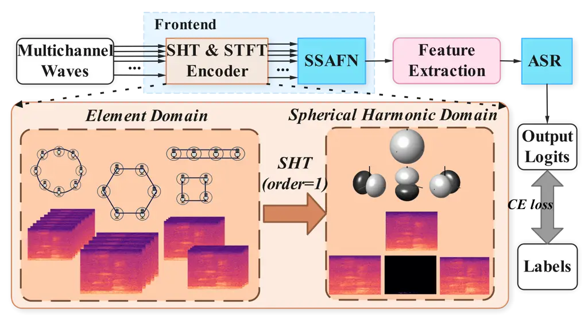
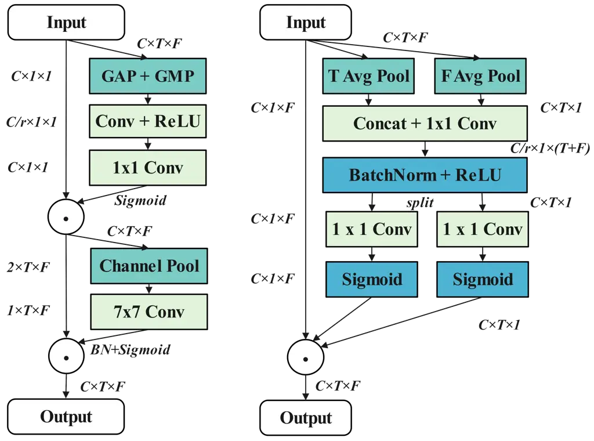
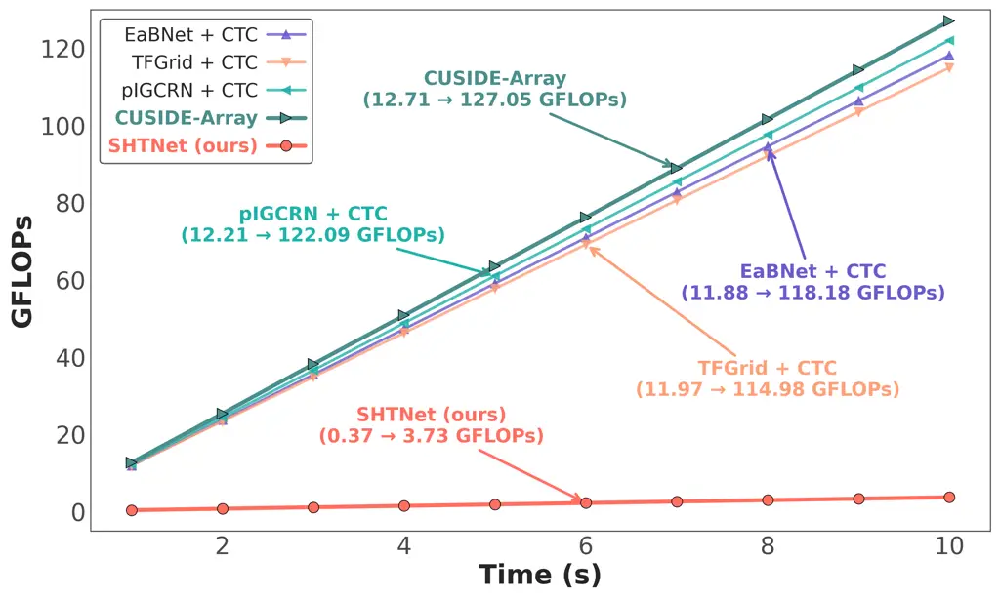

Kong Huang^(∗) Ou^(∗) Xinjiang UniversityChina Tsinghua UniversityChina

# Lightweight and Robust Multi-Channel End-to-End Speech Recognition with Spherical Harmonic TransformThanks: ^(∗)Corresponding authors. This work is partly supported by Guangxi Science and Technology Project (2022AC16002) and National Natural Science Foundation of China (62466055). The code is released at https://github.com/thu-spmi/CAT/blob/master/docs/whatsnew.md

Xiangzhu    Hao    Zhijian Affiliation: School of Computer Science and
Technology Affiliation: Speech Processing and Machine Intelligence
(SPMI) Lab

###### Abstract

This paper presents SHTNet, a lightweight spherical harmonic transform
(SHT) based framework, which is designed to address cross-array
generalization challenges in multi-channel automatic speech recognition
(ASR) through three key innovations. First, SHT based spatial sound
field decomposition converts microphone signals into geometry-invariant
spherical harmonic coefficients, isolating signal processing from array
geometry. Second, the Spatio-Spectral Attention Fusion Network (SSAFN)
combines coordinate-aware spatial modeling, refined self-attention
channel combinator, and spectral noise suppression without conventional
beamforming. Third, Rand-SHT training enhances robustness through random
channel selection and array geometry reconstruction. The system achieves
39.26% average CER across heterogeneous arrays (e.g., circular, square,
and binaural) on datasets including Aishell-4, Alimeeting, and XMOS,
with 97.1% fewer computations than conventional neural beamformers.

###### keywords

multi-channel ASR, end-to-end, spherical harmonic transform, streaming
ASR, lightweight architecture

^(†)^(†)email: huanghao@xju.edu.cn, ozj@tsinghua.edu.cn

## 1 Introduction

Recent advancements in multi-channel end-to-end automatic speech
recognition (ASR) have demonstrated superior performance over
single-channel systems by effectively leveraging spatial cues captured
by microphone arrays \[1, 2, 3, 4, 5\].

Three principal approaches have emerged for spatial information
utilization: conventional spatial filtering \[3, 6, 7\], neural spatial
modeling \[2, 4, 8, 9\], and spherical harmonic field encoding \[10,
11\]. Traditional beamforming methods optimize spatial filters using
signal priors like delay-and-sum \[12\] and minimum variance
distortionless response (MVDR) \[13\] beamformers. For instance, EaBNet
\[14\] directly estimates beamforming filter coefficients via neural
networks for noise suppression, while CUSIDE-Array \[6\] employs a deep
neural network (DNN) to estimate speech/noise covariance matrices that
are then used to calculate MVDR filter coefficients \[15\], yielding
enhanced speech for streaming recognition. In contrast, neural spatial
modeling sidesteps traditional signal processing constraints with
architectures like TF-GridNet \[16\], which integrates full-band
spectral correlations and sub-band temporal dynamics via bidirectional
LSTM networks, and MFCCA \[4\], which utilizes cross-channel attention
mechanisms to jointly optimize spatial localization and feature
enhancement.

Despite their merits, these approaches face significant challenges.
Traditional beamforming methods are often sensitive to array geometry
and struggle and are less effective in real-time processing in complex
environments \[14\]. Meanwhile, although neural spatial modeling
overcomes some of these limitations, its reliance on deep network
architectures incurs substantial computational overhead, hindering
practical deployment and scalability \[2, 16\].

The spherical harmonic transform (SHT) offers a promising alternative
\[10, 17\]. It takes advantage of the inherent properties of spherical
harmonics to project spatial sound fields onto a universal set of basis
functions. This decouples the spatial representation from the specific
microphone array \[18\].

This approach mitigates sensitivity to array geometry while providing a
compact representation that substantially reduces computational load
compared to both traditional beamforming and deep neural network
methods. Recent work by Pan et al. \[10\] demonstrated the efficacy of
SHT in speech enhancement. They introduced the pIGCRN framework, which
combines spherical harmonic coefficients with Short-Time Fourier
Transform (STFT) features using dual encoders based.

Despite these advancements, the application of SHT in end-to-end ASR
systems remains underexplored, especially with regard to the challenges
associated with cross-array generalization. To bridge this gap, we
present SHTNet — a novel, lightweight multi-channel end-to-end ASR
framework based on the spherical harmonic transform (SHT), built upon
the CUSIDE-Array architecture. Our framework introduces three key
innovations:

1.  1.  Unified Spatial Representation: Enabled by the SHT, our method
        converts multi-channel audio signals in the element domain from
        various array configurations into a common spherical harmonic domain
        \[19\]. Integrating spatial information into a compact
        representation enables the system to process data independently of
        the array geometry.
2.  2.  Spatio-Spectral Attention Fusion Network (SSAFN): A hierarchical
        attention architecture combines coordinate-aware spatial modeling,
        refined self-attention channel combinator, and spectral noise
        suppression without conventional beamforming. Specifically, it
        employs JointAttention modules with CBAM \[20\] and CoorAttention
        \[21\] for spatial and frequency feature extraction, followed by a
        self-attention-based channel combinator \[22\] to amplify target
        signals, and concludes with a multi-head self-attention (MHSA)
        \[23\] post-filter for residual noise suppression.
3.  3.  Rand-SHT Training Strategy: Random channel selection and array
        geometry reconstruction for SHT during training, enhancing
        robustness to varying array geometries and environmental conditions.

Our approach shows superior performance in addressing array variability
and environmental uncertainty, all while maintaining computational
efficiency. Extensive experiments on both in-domain (ID) and
out-of-domain (OOD) datasets show that our method outperforms existing
benchmarks, with lower computational costs and fewer parameters.

## 2 Method



Figure 1: SHTNet processing pipeline: Mapping multi-channel signals to
the spherical harmonic domain via SHT, followed by spectral enhancement
and ASR recognition. The figure illustrates the first-order SHT mapping
of element-domain signals from different arrays. Note that during the
transformation into the spherical harmonic domain, the planar microphone
array geometry restricts vertical sound field sampling, nullifying polar
angle-dependent spherical harmonic coefficients. In the figure, this is
represented by the spectrograms being black, indicating null values.

### 2.1 Architecture Overview

As illustrated in Fig. 1, the original multi-channel waveforms are
transformed into the spherical harmonic domain (SHT) to obtain spatially
decoupled spherical harmonic coefficients. The STFT is then applied to
each channel to generate time-frequency magnitude spectra. These spectra
are enhanced by a Spatial Spectral Attention Fusion Network (SSAFN) to
produce a single-channel output, which is converted into Fbank features
for ASR recognition. The figure demonstrates the mapping of
element-domain signals into the spherical harmonic domain via SHT,
showing first-order SHT results.

### 2.2 Frontend

#### 2.2.1 SHT & STFT Encoder

The frontend begins by mapping the microphone array signals, which are
initially in the element domain, to the spherical harmonic domain via
the Spherical Harmonic Transform (SHT). For this purpose, the spherical
coordinates of the $`i`$-th microphone are denoted as
$`(r,\theta_{i},\phi_{i})`$, where $`r`$ is the array radius (assuming
equidistance of the microphones from the origin),
$`\theta_{i}\in[0,\pi]`$ is the polar angle (zenith angle measured from
the $`z`$-axis), and $`\phi_{i}\in[0,2\pi)`$ is the azimuth angle
(measured in the $`xy`$-plane from the $`x`$-axis) for the $`i`$-th
microphone.

According to sound field decomposition theory \[18\], the sampled sound
pressure $`p(k,r,\theta,\phi)`$ in spherical coordinates can be expanded
as a series of spherical harmonics:

```math
\displaystyle p(k,r,\theta,\phi)=\sum_{n=0}^{\infty}\sum_{m=-n}^{n}p_{nm}(k,r)Y_{n}^{m}(\theta,\phi), \tag{1}
```

where the wavenumber $`k=2\pi f/c`$, with $`f`$ being the frequency and
$`c`$ the speed of sound in air and the spherical harmonic function
$`Y_{n}^{m}(\theta,\phi)`$ is defined as:

```math
\displaystyle Y_{n}^{m}(\theta,\phi)=\sqrt{\frac{(2n+1)(n-m)!}{4\pi(n+m)!}}P_{n}^{m}(\cos\theta)e^{im\phi}, \tag{2}
```

where $`n\in\mathbb{N}`$ represents the order, and $`m\in\mathbb{Z}`$
satisfies $`-n\leq m\leq n`$. $`P_{n}^{m}(\cos\theta)`$ is the
normalized associated Legendre polynomial, which encodes the elevation
dependence, while the complex exponential term $`e^{im\phi}`$ captures
the azimuthal periodicity. And the spherical harmonic coefficients
$`p_{nm}(k,r)`$ are given by the following integral \[18\]:

```math
\displaystyle p_{nm}(k,r)=\int_{0}^{2\pi}\int_{0}^{\pi}p(k,r,\theta,\phi)\left[Y_{n}^{m}(\theta,\phi)\right]^{*}\sin\theta\,d\theta\,d\phi. \tag{3}
```

Under far-field conditions where the distance $`d`$ of microphone center
and source satisfies $`d>\frac{8r^{2}f}{c}`$ \[18\], the spherical
harmonic coefficients can be discretely approximated using an array of
$`I`$ microphones:

```math
\displaystyle p_{nm}(k,r)\approx\frac{4\pi}{I}\sum_{i=1}^{I}p(k,\mathbf{r}_{i})\left[Y_{n}^{m}(\theta_{i},\phi_{i})\right]^{*}, \tag{4}
```

where $`\mathbf{r}_{i}=(r,\theta_{i},\phi_{i})`$ represents the spatial
coordinates of the $`i`$-th microphone.

The next step involves extracting time-frequency features from the
signal using the Short-Time Fourier Transform (STFT). The time-frequency
representation, $`P_{nm}(t,f)`$, yields the magnitude spectrum, which
forms a 3D tensor:

```math
\displaystyle\boldsymbol{A}\in\mathbb{R}^{C\times T\times F},\quad A_{nm}(t,f)=\left|P_{nm}(t,f)\right|, \tag{5}
```

where $`C=(N+1)^{2}`$, represents the number of spherical harmonic
channels, $`T`$ represents the number of time frames, and $`F`$ is the
number of frequency bins. Eq. (1) can be approximated for an appropriate
finite order $`N`$ \[18\].

#### 2.2.2 Spatio-Spectral Attention Fusion Network



Figure 2: Attention modules in SSAFN: CBAM (left) combines spatial and
spectral attention, and CoorAttention (right) encodes time/frequency
positional relationships. r represents reduction ratio.

The SSAFN employs a hierarchical architecture to progressively refine
spatial and spectral features through three key components: spatial and
frequency feature extraction, directional filtering, and residual noise
suppression.

First, the spatial and frequency feature extraction stage processes the
magnitude spectrum using two cascaded JointAttention blocks. Each block
combines channel and spatial attention mechanisms to enhance feature
representation. The block’s output $`\mathbf{A}_{\text{out}}`$ is
computed as:

```math
\displaystyle\begin{split}\mathbf{A}_{\text{out}}=\mathbf{A}_{\text{in}}+\text{CoorAttention}\big(\mathbf{A}_{\text{in}}+\text{CBAM}(\mathbf{A}_{\text{in}}+\text{CBAM}(\mathbf{A}_{\text{in}}))\big).\end{split} \tag{6}
```

The CBAM modules (Left of Fig. 2) apply spatial attention through global
average pooling and spectral attention via convolutional layers, while
CoorAttention (Right of Fig. 2) enhances spatial dependencies through
coordinate-aware positional encoding. Their sequential application
enables progressive refinement from local channel relationships to
global coordinate-aware features

Next, the directional filtering stage employs a refined Self-Attention
Channel Combinator (rSACC) to amplify target signals. The input
$`\mathbf{A}_{\text{in}}`$ first undergoes a log transformation followed
by mean-variance normalization (MVN). Then, three linear layers are
applied to compute the query $`\mathbf{Q}`$, key $`\mathbf{K}`$, and
value $`\mathbf{V}`$ with dimensions of $`T\times C\times E`$,
$`T\times C\times E`$, and $`T\times C\times 1`$, where $`T`$ represents
the number of time frames, $`C`$ is the number of spherical harmonic
channels, and $`E`$ is the embedding feature dimension.

The attention weights $`\mathbf{w}`$ , with dimensions
$`T\times C\times 1`$, are calculated as:

```math
\displaystyle\mathbf{w}=\text{softmax}\left(\frac{\mathbf{Q}\mathbf{K}^{T}}{\sqrt{E}}\right)\mathbf{V} \tag{7}
```

The output of rSACC $`\mathbf{A}_{\text{out}}`$ is obtained by
performing a weighted sum of the input $`\mathbf{A}_{\text{in}}`$ with
the attention weights $`\mathbf{w}`$, summed along the channel axis. The
final output tensor $`\mathbf{A}_{\text{out}}`$ has dimensions of
$`T\times F`$, where $`F`$ represents the frequency dimension. This step
can be mathematically expressed as:

```math
\displaystyle\mathbf{A}_{\text{out}}=\sum_{C}\mathbf{w}\odot\mathbf{A}_{\text{in}} \tag{8}
```

Finally, the residual noise suppression stage applies a multi-head
self-attention (MHSA) post-filter to suppress residual noise through
multi-spectral correlation analysis. The output is computed as:

```math
\displaystyle\mathbf{A}_{\text{out}}=\mathbf{A}_{\text{in}}\cdot\text{MHSA}(\mathbf{A}_{\text{in}}), \tag{9}
```

This hierarchical architecture enables SSAFN to effectively integrate
spatial and spectral information, achieving robust performance in
multi-channel ASR tasks without relying on conventional beamforming
techniques.

### 2.3 Training Strategy: Joint streaming and non-streaming & Rand-SHT

Our training framework is based on the CUSIDE \[24\] and CUSIDE-array
\[6\] method, which achieves streaming processing by dividing the input
into chunks with context. During training, the streaming and
non-streaming models share parameters and are jointly trained. The total
loss combines cross-entropy objectives from both branches:

```math
\displaystyle\mathcal{L}_{\text{total}}=\mathcal{L}_{\text{non\_stream}}+\mathcal{L}_{\text{stream}}, \tag{10}
```

where $`\mathcal{L}_{\text{non\_stream}}`$ and
$`\mathcal{L}_{\text{stream}}`$ represent the non-streaming and
streaming losses, respectively. This dual-objective framework ensures
consistency between chunk-wise and full-context outputs while
maintaining low-latency performance.

The Rand-SHT training strategy randomly selects $`I^{\prime}`$
($`2\leq I^{\prime}\leq I`$) microphones during training and
recalculates spherical harmonic coefficients:

```math
\displaystyle\tilde{p}_{nm}(k,{r})\approx\frac{4\pi}{I^{\prime}}\sum_{i\in I^{\prime}}p(k,\mathbf{r}_{i}^{\prime})\left[Y_{n}^{m}(\theta_{i}^{\prime},\phi_{i}^{\prime})\right]^{*}, \tag{11}
```

where $`(\theta_{i}^{\prime},\phi_{i}^{\prime})`$ are computed based on
the relative positions of the selected microphones. This approach
simulates diverse array geometries during training, enhancing robustness
to array variability.

## 3 Experiments

### 3.1 Datasets and Evaluation Metrics

Datasets include:

- •
  AISHELL-4 \[25\]: ID test with 43.4h training / 2.3h validation / 8.9h
  test of non-overlapping meeting speech with 8-channel arrays. Testing
  uses channels 1,3,5,7 (4ch square array) and 1,5 (2ch binary array).
- •
  Alimeeting \[26\]: OOD test of conference-style non-overlapping
  segments (3.6h test / 1.2h eval) from M2MeT challenge.
- •
  XMOS \[6\]: OOD test with 10ch real meeting recordings in noisy
  environments ($`\sim`$40 utterances), collected using an XMOS
  microphone array board.

Evaluations focus on character error rate (CER) under ID and OOD
scenarios, and computational efficiency (front-end GFLOPS and streaming
decoding time on NVIDIA 3090 GPU).

### 3.2 Experiment Setup

#### 3.2.1 Training Details

Our models are trained with the CAT ASR toolkit \[27\]. Different models
are trained on AISHELL-4’s train set, measured by character error rate
(CERs). The SHT order $`N`$ is set to 4 , as preliminary experiments
have demonstrated that this value optimally balances spatial resolution
and computational efficiency. Training uses a 16 kHz sampling rate with
512-point STFT parameters (25 ms frame length, 10 ms shift) to extract
80-dimensional log-Mel filterbank features. Optimization leverages the
Adam optimizer with Transformer learning rate scheduler, gradient
clipping, and early stopping when validation loss drops below
$`10^{-6}`$.

Streaming signal processing uses 400ms chunks with 800ms left context
and 400ms right context (used 50% randomly during training, omitted
during testing). Chunk size is dynamically sampled from 350-450ms in
training.

#### 3.2.2 Network Details

The ASR encoder adopts a 12-layer Conformer architecture with a CTC
objective, configured with 4 attention heads, 256-dimensional attention
layers, and 3038-dimensional feedforward layers.

For SHTNet, the frontend integrates four CBAM modules with spatial
attention kernels (sizes 9, 7, 5, 3) for multi-scale spatial patterns,
and spatial attention reduction is set to 5. The CoorAttention module
follows the same reduction strategy. All modules maintain consistent
input/output channel dimensions (25 channels) except rSACC, and the MHSA
component uses 2 attention heads with 64-dimensional attention layers.

In comparative experiments, the CUSIDE-Array baseline uses a three-layer
BLSTM with 320 hidden units per direction for complex mask estimation.



Figure 3: Comparison of front-end GFLOPs Among Different Models with
Input Lengths Ranging from 1s to 10s

Other baselines (EaBNet, TFGridNet, pIGCRN) are fine-tuned end-to-end
with the pre-trained ASR encoder from AISHELL-4. To uniform GPU memory
allocation during training for fair comparison, TFGridNet employs a
single-layer LSTM (128 hidden units), 256-dimensional query/key
projections, and 16-dimensional embeddings, while pIGCRN reduces
embedding channels to 20 while preserving its architecture.

## 4 Results and Discussions

### 4.1 Non-Streaming Experiments

Table 1 and Figure 3 collectively reveal two critical observations about
our framework. First, SHTNet achieves the lowest average CER (39.26%)
across all test configurations while maintaining ultra-low computational
costs (3.73 GFLOPS for 10s inputs). This lightweight superiority
manifests in two aspects: 1) Compared to conventional beamforming
approaches, it reduces frontend parameters by 92.4% (0.38M vs.
CUSIDE-Array’s 5.00M); 2) Against neural baselines like TFGridNet+CTC
(0.39M/42.93% CER) and pIGCRN+CTC (0.81M/44.58% CER), it achieves
superior accuracy with comparable or fewer parameters. The 97.1% GFLOPS
reduction (Figure 3) stems from SHT’s geometry-agnostic spatial
encoding, which eliminates redundant multi-channel computations via
spherical harmonic decomposition. This innovation enables the modeling
of spatial-spectral relationships using a simple attention network, thus
avoiding the computational overhead associated with LSTM architectures,
which are used in CUSIDE-Array.

Second, SHTNet demonstrates exceptional cross-configuration robustness.
When microphone channels decrease from 8 to 2, CER increases by merely
2.32% (29.34%→31.66%), significantly outperforming CUSIDE-Array’s 6.55%
degradation (29.65%→36.20%). This stability extends to cross-domain
scenarios: on real-world XMOS dataset, SHTNet achieves 74.85% CER –
4.06% lower than CUSIDE-Array and 22.18% better than pIGCRN+CTC, with
similar performance gains observed on AliMeeting dataset. Ablation
studies reveal the source of this robustness: 1) Removing Rand-SHT
training causes XMOS CER to surge by 22.08% (74.85%→96.93%) and degrades
performance across various array configurations, particularly under
2-channel setups (31.66%→38.58%); 2) The impact of disabling other
modules proves less pronounced compared to Rand-SHT removal. These
findings confirm that Rand-SHT training effectively enhances the
SHT-based model’s robustness to diverse array geometries. The
improvement of SHTNet over the suboptimal CUSIDE-Array in nonstreaming
ASR is significant, with a p-value of 5.71e-8 by matched-pair
significance test \[28\].

Model Para. of FE (M) Aishell-4 Alimeeting XMOS Avg. 8-ch 4-ch 2-ch test
eval test CUSIDE \[24\] – 35.22 35.22 35.22 40.78 45.42 84.36 46.20
CUSIDE-Array \[6\] 5.00 29.65 32.01 36.20 34.62 38.47 78.91 41.64
single-CTC – 35.65 35.65 35.65 40.27 44.10 87.13 46.41 EaBNet \[14\] +
CTC 3.21 31.79 35.11 36.97 35.46 39.32 93.56 45.37 TFGrid \[16\] + CTC
0.39 30.51 33.44 36.61 33.88 37.18 85.94 42.93 pIGCRN \[10\] + CTC 0.81
31.20 32.32 33.42 35.03 38.47 97.03 44.58 SHTNet(ours) 0.38 29.34 29.57
31.66 33.14 37.01 74.85 39.26 w/o Rand-SHT 0.38 30.34 32.35 38.58 34.46
37.76 96.93 45.07 w/o SHT 0.38 32.18 32.29 33.49 35.69 38.53 98.12 45.05
w/o JointAtt 0.37 30.49 30.87 32.60 33.76 37.48 97.23 43.74 w/o rSACC
0.31 32.05 32.26 34.09 34.77 38.92 92.18 44.05 w/o MHSA 0.06 30.20 30.38
32.21 33.89 37.78 98.12 43.76

Table 1: CER Results of Non-Streaming Models. The ASR architecture is
identical across all models, with a size of 20.77M. All single-channel
models use channel 0 as the input. EaBNet, TFGridNet, and pIGCRN perform
end-to-end fine-tuning on the single-CTC, which serves as the
pre-trained ASR encoder from AISHELL-4.

Model Time(s) $`\Delta t`$(s) Aishell-4 Alimeeting XMOS Avg 8-ch 4-ch
2-ch test eval test CUSIDE 722.83 – 41.01 41.01 41.01 46.82 51.40 86.63
51.31 CUSIDE-Array 978.26 255.43 35.08 37.11 41.54 39.53 43.08 82.08
46.40 SHTNet(ours) 820.25 97.42 34.37 34.74 36.80 37.66 41.61 79.50
44.11

Table 2: Streaming CER (%) and Latency Results. We tested the decoding
time of different models on the AISHELL-4 8-ch test set with the same
chunk size (400ms) on a single 3090 GPU, recorded as Time(s).
$`\Delta t`$(s) represents the total decoding latency introduced by the
addition of the frontend.

### 4.2 Streaming Experiments

As shown in Table 2, our streaming implementation offers two key
advantages. First, it achieves real-time efficiency without compromising
accuracy. When processing 8-channel inputs from the Aishell-4 test set,
SHTNet significantly reduces frontend processing latency to 97.42s¹¹ 1
This refers to total processing time for the 8.9h test set.
Per-utterance latency is 15.5ms. compared to CUSIDE-Array’s 255.43s.
This represents a 62% reduction in additional computational overhead
under identical device and chunk-size configurations, while
simultaneously achieving superior recognition accuracy (34.37% CER vs
35.08%). Second, the framework maintains robust performance under
streaming constraints. When handling dynamically varying channel counts,
SHTNet exhibits only a 2.4% CER degradation (34.37%→36.80%),
substantially outperforming CUSIDE-Array’s 6.46% performance drop
(35.08%→41.54%).

This advantage is driven by SHT’s enhanced spatial information
extraction and attention-based architecture in SHTNet, which reduces
sensitivity to time-series duration, unlike traditional LSTM models.
Together, they enable robust performance in real-world streaming
processing.

## 5 Conclusion and Future Work

We presents a lightweight and robust multi-channel speech recognition
framework, SHTNet, leveraging SHT for efficient spatial modeling. SHTNet
demonstrates excellent performance in both ID and OOD tasks, achieving
low error rates and computational efficiency. Future work will focus on
optimizing the system for real-time deployment, exploring
self-supervised learning for better cross-domain adaptation, and
extending the model to multi-speaker scenarios.

## References

- \[1\] X. Chang, W. Zhang, Y. Qian, J. L. Roux, and S. Watanabe,
  “MIMO-speech: End-to-end multi-channel multi-speaker speech
  recognition,” in _Proc. ASRU_, 2019.
- \[2\] F.-J. Chang, M. Radfar, A. Mouchtaris, and M. Omologo,
  “Multi-Channel Transformer Transducer for Speech Recognition,” in
  _Proc. INTERSPEECH_, 2021.
- \[3\] W. Zhang, X. Chang, C. Boeddeker, T. Nakatani, S. Watanabe, and
  Y. Qian, “End-to-end dereverberation, beamforming, and speech
  recognition in a cocktail party,” _IEEE/ACM Transactions on Audio,
  Speech, and Language Processing_, vol. 30, pp. 3173–3188, 2022.
- \[4\] F. Yu, S. Zhang, P. Guo, Y. Liang, Z. Du, Y. Lin, and L. Xie,
  “MFCCA: Multi-frame cross-channel attention for multi-speaker asr in
  multi-party meeting scenario,” in _2022 IEEE Spoken Language
  Technology Workshop (SLT)_, 2023.
- \[5\] D. Sharma, R. Gong, J. Fosburgh, S. Y. Kruchinin, P. A. Naylor,
  and L. Milanović, “Spatial processing front-end for distant asr
  exploiting self-attention channel combinator,” in _Proc.
  ICASSP_, 2022.
- \[6\] X. Kong, T. Ning, H. Huang, and Z. Ou, “Cuside-array: A
  streaming multi-channel end-to-end speech recognition system with
  realistic evaluations,” in _2024 IEEE 14th International Symposium on
  Chinese Spoken Language Processing (ISCSLP)_, 2024.
- \[7\] K. An, J. Xiao, and Z. Ou, “Exploiting single-channel speech for
  multi-channel end-to-end speech recognition: A comparative study,” in
  _Proc. 13th International Symposium on Chinese Spoken Language
  Processing (ISCSLP)_, 2022.
- \[8\] Z.-Q. Wang, P. Wang, and D. Wang, “Multi-microphone complex
  spectral mapping for utterance-wise and continuous speech separation,”
  _IEEE/ACM Transactions on Audio, Speech, and Language Processing_,
  vol. 29, pp. 2001–2014, 2021.
- \[9\] T. Yoshioka, H. Erdogan, Z. Chen, and F. Alleva,
  “Multi-microphone neural speech separation for far-field multi-talker
  speech recognition,” in _Proc. ICASSP_, 2018.
- \[10\] J. Pan, P. Shen, H. Zhang, and X. Zhang, “Efficient
  multi-channel speech enhancement with spherical harmonics injection
  for directional encoding,” in _Proc. ICASSP_, 2024.
- \[11\] ——, “Innovative directional encoding in speech processing:
  leveraging spherical harmonics injection for multi-channel speech
  enhancement,” in _Proceedings of the Thirty-Third International Joint
  Conference on Artificial Intelligence_, 2024.
- \[12\] M. Klemm, I. J. Craddock, J. A. Leendertz, A. Preece, and
  R. Benjamin, “Improved delay-and-sum beamforming algorithm for breast
  cancer detection,” _International Journal of Antennas & Propagation_,
  vol. 2008, pp. 264–276, 2008.
- \[13\] M. Souden, J. Benesty, and S. Affes, “On optimal
  frequency-domain multichannel linear filtering for noise reduction,”
  _IEEE Transactions on Audio, Speech, and Language Processing_,
  vol. 18, pp. 260–276, 2009.
- \[14\] A. Li, W. Liu, C. Zheng, and X. Li, “Embedding and beamforming:
  All-neural causal beamformer for multichannel speech enhancement,” in
  _Proc. ICASSP_, 2022.
- \[15\] T. Ochiai, S. Watanabe, T. Hori, and J. R. Hershey,
  “Multichannel end-to-end speech recognition,” in _International
  conference on machine learning_, 2017.
- \[16\] Z.-Q. Wang, S. Cornell, S. Choi, Y. Lee, B.-Y. Kim, and
  S. Watanabe, “Tf-gridnet: Integrating full- and sub-band modeling for
  speech separation,” _IEEE/ACM Transactions on Audio, Speech, and
  Language Processing_, vol. 31, pp. 3221–3236, 2023.
- \[17\] L. Kumar and R. M. Hegde, “Near-field acoustic source
  localization and beamforming in spherical harmonics domain,” _IEEE
  Transactions on Signal Processing_, vol. 64, pp. 3351–3361, 2016.
- \[18\] B. Rafaely, _Fundamentals of spherical array
  processing_. Springer, 2015, vol. 8.
- \[19\] S. Yan, C. Hou, and X. Ma, “From element-space to modal array
  signal processing,” _Shengxue Xuebao(Acta Acustica)_, vol. 36, no. 5,
  pp. 461–468, 2011.
- \[20\] S. Woo, J. Park, J.-Y. Lee, and I. S. Kweon, “Cbam:
  Convolutional block attention module,” in _Proceedings of the European
  conference on computer vision (ECCV)_, 2018.
- \[21\] Q. Hou, D. Zhou, and J. Feng, “Coordinate attention for
  efficient mobile network design,” in _Proceedings of the IEEE/CVF
  conference on computer vision and pattern recognition_, 2021.
- \[22\] R. Gong, C. Quillen, D. Sharma, A. Goderre, J. Laínez, and
  L. Milanovic, “Self-attention channel combinator frontend for
  end-to-end multichannel far-field speech recognition,” in _Proc.
  INTERSPEECH_, 2021.
- \[23\] A. Vaswani, N. Shazeer, N. Parmar, J. Uszkoreit, L. Jones,
  A. N. Gomez, Ł. Kaiser, and I. Polosukhin, “Attention is all you
  need,” _Advances in neural information processing systems_,
  vol. 30, 2017.
- \[24\] K. An, H. Zheng, Z. Ou, H. Xiang, K. Ding, and G. Wan, “CUSIDE:
  Chunking, Simulating Future Context and Decoding for Streaming ASR,”
  in _Proc. INTERSPEECH_, 2022.
- \[25\] Y. Fu, L. Cheng, S. Lv, Y. Jv, Y. Kong, Z. Chen, Y. Hu, L. Xie,
  J. Wu, H. Bu _et al._, “Aishell-4: An open source dataset for speech
  enhancement, separation, recognition and speaker diarization in
  conference scenario,” _arXiv preprint arXiv:2104.03603_, 2021.
  \[Online\]. Available:
  [https://www.openslr.org/111](https://www.openslr.org/111)
- \[26\] F. Yu, S. Zhang, Y. Fu, L. Xie, S. Zheng, Z. Du, W. Huang,
  P. Guo, Z. Yan, B. Ma _et al._, “M2MeT: The ICASSP 2022 multi-channel
  multi-party meeting transcription challenge,” in _Proc. ICASSP_, 2022.
- \[27\] K. An, H. Xiang, and Z. Ou, “CAT: A CTC-CRF based ASR toolkit
  bridging the hybrid and the end-to-end approaches towards data
  efficiency and low latency,” in _INTERSPEECH_, 2020, pp. 566–570.
- \[28\] L. Gillick and S. J. Cox, “Some statistical issues in the
  comparison of speech recognition algorithms,” in _International
  Conference on Acoustics, Speech, and Signal Processing
  (ICASSP)_, 1989.
