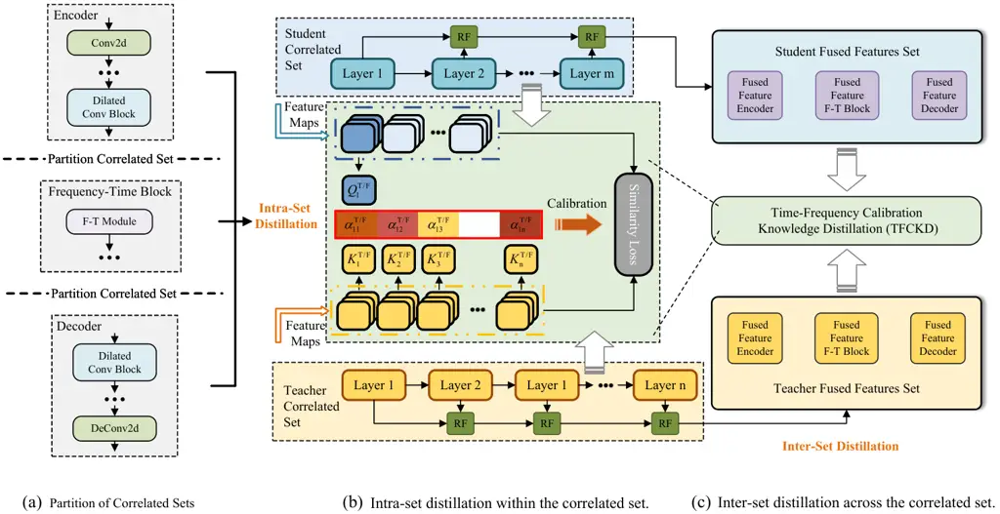
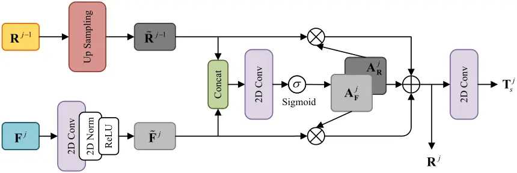
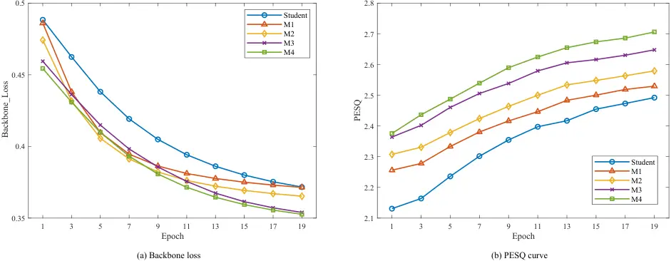
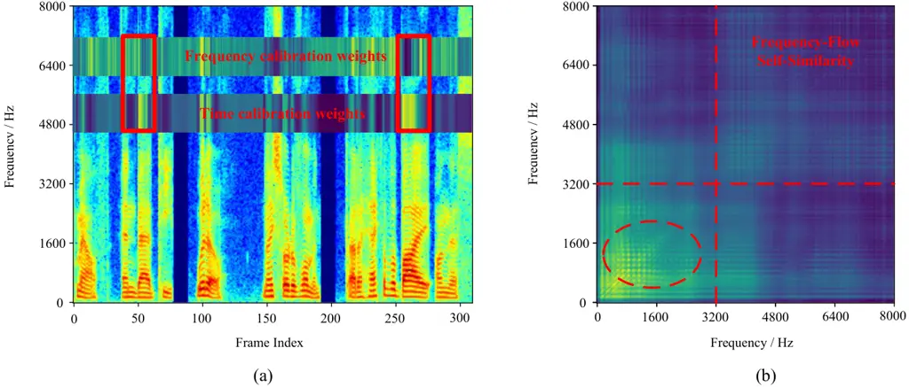
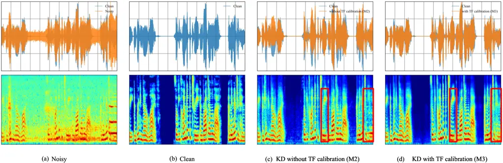
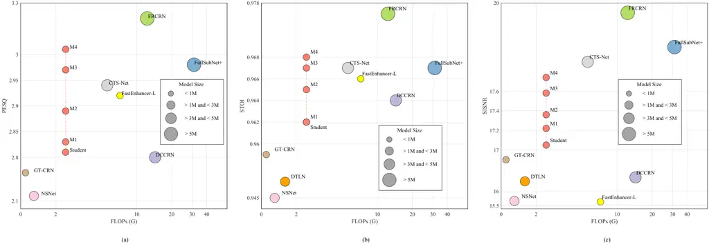
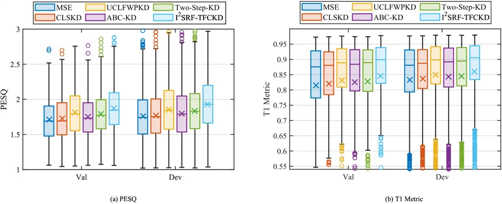

# Leveraging Local and Global Knowledge Integration with Time-Frequency Calibrated Distillation for Speech Enhancement

Jiaming Cheng    Ruiyu Liang    Ye Ni    Chao Xu    Jing Li    Wei Zhou
   Rui Liu    Björn W. Schuller    Xiaoshuai Hao ^(†)^(†)thanks: This
work was supported in part by the Natural Science Foundation of the
Jiangsu Higher Education Institutions of China under Grant
No. 25KJB510010, the Open Foundation of Jiangsu Provincial Engineering
Research Center for Intelligent Perception Technologies and Equipment
under No. ITS202501 and the National Natural Science Foundation of China
under Grant No. 62472227 and No. 61871213. (Corresponding author: Ruiyu
Liang and Xiaoshuai Hao)^(†)^(†)thanks: Jiaming Cheng, Chao Xu and Jing
Li are with the School of Computer Science, Nanjing Audit University,
Nanjing 211815, China; Ruiyu Liang is with the School of Communication
Engineering, Nanjing Institute of Technology, Nanjing 211167, China; Ye
Ni is with School of Information Science and Engineering, Southeast
University, Nanjing 210096, China; Wei Zhou is with the Cardiff
University, CF10 3AT, United Kingdom. Rui Liu is with the Inner Mongolia
University, Hohhot 010021, China; Björn Schuller is with the CHI – the
Chair of Health Informatics, TUM University Hospital, Germany and also
with GLAM – the Group on Language, Audio, & Music, Imperial College
London, UK. Xiaoshuai Hao is with the Xiaomi EV, 100085, China. (e-mail:
270777@nau.edu.cn; liangry@njit.edu.cn; niye@seu.edu.cn;
270174@nau.edu.cn; lijing@nau.edu.cn; zhouw26@cardiff.ac.uk;
liurui_imu@163.com; bjoern.schuller@imperial.ac.uk;
haoxiaoshuai714@163.com)^(†)^(†)thanks: Manuscript received xxxx, xxxx;
revised xxxx, xxxx.

###### Abstract

In recent years, complexity compression of neural network (NN)-based
speech enhancement (SE) models has gradually attracted the attention of
researchers, especially in scenarios with limited hardware resources or
strict latency requirements. In this paper, we propose an intra-set and
inter-set recursive fusion framework with time-frequency calibrated
knowledge distillation (I²SRF-TFCKD) for SE. Different from previous
distillation strategies for SE, the proposed framework fully exploits
the time-frequency differential information of speech while facilitating
both local information focusing and global knowledge circulation.
Firstly, we construct a collaborative distillation paradigm for
intra-set and inter-set correlations. Within a correlated set,
multi-layer teacher-student features are pairwise matched for calibrated
distillation. Subsequently, we generate representative features from
each correlated set through recursive fusion to form the fused feature
set that enables inter-set knowledge interaction. Secondly, we propose a
multi-layer interactive distillation based on dual-stream time-frequency
cross-calibration, which calculates the teacher-student similarity
calibration weights in the time and frequency domains respectively and
performs cross-weighting, thus enabling refined allocation of
distillation contributions across different layers according to speech
characteristics. We conduct experiments on both single-channel and
multi-channel SE datasets. Objective evaluations demonstrate that the
proposed KD strategy consistently and effectively improves the
performance of the low-complexity student model and outperforms other
distillation schemes.

###### Index Terms: 

Intra-inter flow interaction, multi-layer recursive feature fusion,
time-frequency cross-calibration, knowledge distillation for speech
enhancement.

## I Introduction

Speech enhancement (SE) aims to remove background noises and recover
clean speech from noisy mixtures. As a perception front-end algorithm,
its applications have already penetrated into diverse domains including
such as intelligent terminals, industrial manufacturing, medical health,
etc. \[1\]. With the recent emergence of data-driven deep learning
approaches, SE models have begun leveraging massive training data to
characterize both speech signals, noise components, and their nonlinear
relationships. Capitalizing on the representational learning
capabilities of deep neural networks (DNNs), deep learning-based SE
methods have achieved superior noise suppression performances and have
attained state-of-the-art results in international SE challenges \[2\],
gradually becoming the mainstream SE solutions.

However, the superior performances of current NN-based SE methods often
comes with substantial computational overhead. Top-ranked SE models in
international challenges and public benchmarks typically have over 5M
parameters and more than 10G floating-point operations (FLOPs) per
second. Such excessive computational and memory requirements create
deployment bottlenecks for edge devices, particularly in
teleconferencing systems, Bluetooth headsets and hearing aids.
Consequently, the exploration of SE models balancing performance with
lightweight design has emerged as a research hotspot and trend \[3\].

Model compression is an effective solution, including pruning,
quantization, and knowledge distillation (KD). However, pruning and
quantization still heavily depend on the original model structure and
hardware support. In contrast, KD transfers knowledge from a powerful
teacher to a compact student, offering better generality and
flexibility—thus becoming the technical path chosen in this paper. In
recent years, KD techniques have achieved remarkable progress across a
wide range of research fields \[4, 5, 6\]. A common characteristic of
these methods is that they fully leverage intermediate representations
instead of relying only on output-level distillation. This observation
has also been validated in the SE field. Recently, Wan et al. \[7\]
propose a hierarchical attention-based distillation framework for SE,
exploring the utilization of intermediate representations. Similarly,
Nathoo et al. \[8\] introduce a fine-grained similarity-preserving KD
loss, which aims to match the student’s intra-activation Gram matrices
to that of the teacher. However, existing methods have not yet explored
frameworks that are specifically tailored to the inherent
characteristics of the SE task.

In this paper, we design an intra-inter representation fusion with
time-frequency calibration KD (I²SRF-TFCKD) framework to further
optimize the cross-layer supervision distillation paradigm. On the one
hand, unlike previous approaches \[8, 9\] that conduct cross-layer
interactions within isolated correlation sets, we propose collaborative
distillation across intra-set and inter-set correlations, effectively
promoting knowledge flow throughout the model architecture. On the other
hand, we introduce temporal and spectral domain cross-computation to
derive multi-layer distillation calibration weights, leveraging
time-frequency characteristics for targeted distillation optimization.
The backbone network for distillation employs the dual-path dilated
convolutional recurrent network (DPDCRN) model \[10\], which won the SE
track of the L3DAS23 challenge. The main contributions of this work are
as follows:

- •
  We design a collaborative distillation paradigm for intra-set and
  inter-set correlations. Specifically, the SE model is partitioned into
  multiple correlated sets, and multi-layer teacher–student matching
  distillation is performed both within each set and across sets.
- •
  We introduce a recursive fusion mechanism to generate representative
  features for each correlated set from both teacher and student, and
  then integrate them into a fused feature set. The recursive fusion
  preserves the critical information of each set while reducing
  redundancy in cross-set pairing.
- •
  We propose multi-layer time-frequency cross-calibration, which
  independently computes teacher-student similarity calibration weights
  along temporal and spectral dimensions for cross-weighting, enabling
  refined allocation of distillation contributions across different
  layers.
- •
  Extensive evaluations on public SE benchmarks demonstrate that our
  proposed I²SRF-TFCKD framework for SE surpasses existing distillation
  methods and enabling the student model to achieve competitive
  enhancement results with low computational complexity.

## II Related work

### II-A Time-frequency processing for SE

Speech signals inherently exhibit temporal evolution characteristics
(e.g., syllabic rhythm and prosody) and frequency properties (e.g.,
formant and harmonic structures). Time-domain processing captures the
nonuniform variations of speech energy along the temporal axis, whereas
frequency-domain representations are well suited to differentiating the
distribution patterns of speech and noise. Consequently, the joint
processing of time and frequency domains (T-F processing) has received
increasing attention in recent SE research \[1, 11\].

On one hand, T-F processing has been deeply integrated into the
architectural design of SE networks. Models based on
convolutional–recurrent frameworks \[12, 13\] utilize convolutional
modules to extract local spectral patterns in the frequency domain,
while recurrent units are used to capture temporal dependencies in the
time domain. More recent designs \[14, 15\] adopt parallel
time–frequency dual-path branches, unfolding intermediate
representations sequentially along the time and frequency axes and
employing recurrent units to alternately process and integrate
information across both domains. All these architectures explicitly
emphasize the interaction between time and frequency domains, jointly
preserving temporal continuity and spectral details.

On the other hand, T-F interaction has also been reflected in the design
of loss functions for SE models. Xia et al. \[16\] introduce two
mean-squared-error (MSE)-based spectral losses, where frame-level voice
activity detection (VAD) in the time domain is used to separate the
speech distortion and noise suppression terms. The modulation-domain
loss \[17\], formulated via the spectro-temporal modulation index
(STMI), evaluates the integrity of processed speech within a
perceptually motivated T-F modulation space. These T-F domain losses
fully leverage speech-specific characteristics to formulate regression
distance measures. Overall, T-F processing enables SE models to
simultaneously capture temporal context and perceive fine spectral
structures, thereby providing a promising direction for optimizing SE
frameworks.

### II-B Knowledge distillation for SE

Knowledge distillation \[18\] has been widely applied in the fields of
computer vision and natural language processing. In the acoustic field,
KD methods are initially adopted for classification tasks such as
automatic speech recognition \[19\]. Subsequently, KD for regression
tasks like text-to-speech (TTS) and SE has gradually emerged \[20\].
Early distillation studies for SE models primarily focus on minimizing
output-level discrepancies between teachers and students, exemplified by
elite sub-band distillation \[21\]. These works aim to align student
models with teacher patterns at the learning objective level but
overlook the utilization of intermediate representations containing
richer information.

To address this, a cross-layer similarity distillation framework \[22\]
is proposed for SE models, which aligns teacher-student features via
similarity loss. Similarly, multiple studies have adopted multi-layer
distillation strategies to compress SE models, including bidirectional
KD \[23\] and two-step fine-grained similarity-preserving KD \[8\].
However, existing studies still suffer from two major limitations:
redundant interference in multi-layer teacher–student interaction
matching, and insufficient exploitation of the intrinsic T-F
characteristics of speech. On the one hand, recent works attempt to
reduce interference by weighting layer-wise contributions with attention
mechanism \[7\] or by adopting modularized knowledge review
strategies \[9\]. Nevertheless, the global circulation and interaction
of knowledge across modules are overlooked. On the other hand, although
the SE baselines used in these studies typically process temporal and
frequency information via separate streams, the distillation process
does not account for differentiated analysis across the T-F domains.
Recent studies such as dynamic frequency adaptive distillation \[24\]
adjust the distillation targets according to speech frequency bands,
while independent attention transfer mechanism \[25\] is designed for
temporal and channel dimensions. These methods consider the influence of
either the temporal or frequency domain in distillation, but joint T-F
modeling is still missing. Given that speech and noise exhibit distinct
distribution patterns in both the time and frequency domains, it is
necessary to incorporate such characteristics into the knowledge
transfer process. To address these limitations, this work mainly
includes two innovative improvements: the time-frequency calibration
strategy for distillation and the intra-inter set global knowledge
transfer mechanism.

Fig. 1: Backbone network architecture of the teacher model.

## III Methodology

### III-A Teacher and student network architecture

In this paper, we extend the multi-layer distillation within correlated
sets \[8, 9\] to intra-inter set global knowledge transfer, while
implementing time-frequency cross-assignment weighting in the
distillation loss. The backbone architecture chooses DPDCRN \[10\] that
won the SE track of the L3DAS23 challenge, due to its facility for
structural compression and scalability to both single-channel and
multi-channel SE tasks. The backbone architecture of the teacher model
is presented in Fig. 1, where $`B`$ is the batch size, $`C`$ is the
number of output channels, $`T`$ is the number of speech frames, $`D`$
is the feature dimension size. The input of the DPDCRN model is the
complex spectrum obtained by applying the short-time Fourier transform
(STFT) to the noisy speech. The output is the estimated complex ratio
mask, which is multiplied with the noisy spectrum in the complex domain,
followed by an inverse STFT (iSTFT) to reconstruct the enhanced speech.
The main structure of DPDCRN consists of a convolutional encoder, a
convolutional decoder, and an intermediate frequency-time (F-T)
processing module. The encoder contains two convolutional layers and
four dilated convolutional blocks, while the decoder contains two
deconvolutional layers and four dilated convolutional blocks. Each
frequency-time processing module contains dual branches for frequency
and temporal axes, with each branch comprising a causal multi-head
self-attention (MHSA) module and a feedforward network based on gated
recurrent units (GRUs). Layer normalization (LNorm) and ReLU activation
are incorporated between layers to regulate the distribution of feature
flows. For each convolutional layer, the student has half the number of
channels of the teacher. For the F-T processing modules, the number of
hidden units in the student is half that of the teacher. Additionally,
the teacher model has four cascaded F-T modules, while the student only
uses one. Overall, the student contains merely 17% of the teacher’s
parameters.

### III-B Intra-inter representation fusion knowledge transfer architecture



Fig. 2: Overall architecture of the I²SRF-TFCKD framework. We present
the detailed process of intra-inter set distillation. Fig. 2(a) denotes
the partitioning of correlated sets. Fig. 2(b) shows the time-frequency
cross-calibration knowledge transfer and the recursive feature fusion
across different layers within a single correlated set. Fig. 2(c)
demonstrates inter-set distillation achieved via the fused feature set
among various correlated sets.

According to the encoder-decoder framework of current mainstream SE
models, we partition all layers of teacher-student networks into three
correlated sets corresponding to the encoder, decoder, and intermediate
F-T processing modules, respectively, to achieve hierarchical knowledge
transfer. In previous work \[9\], residual fusion is utilized to
implement cross-layer knowledge transfer within each correlated set and
confirmed its advantages over conventional layer-wise distillation.
However, residual fusion distillation introduces redundant replication
operations when the number of modules in teacher and student networks
differs, and cross-set information interaction remains unexplored. In
this paper, we propose a unified cross-layer distillation framework that
jointly addresses intra-set and inter-set knowledge transfer. For
intra-set operations, single-layer student features are aligned with all
corresponding teacher representations through weighted matching within
the correlated set. Regarding inter-set transfer, we first generate
representative fusion features for each set via residual fusion, then
perform multi-layer knowledge transfer on the fused feature set to
facilitate cross-hierarchical circulation of intermediate
representations. The overall architecture is shown in Fig. 2.

#### III-B1 Intra-set multi-layer teacher–student feature distillation

The candidate teacher-student correlation set is denoted as
$`{\cal P}=\left\{{\left({{l_{s}},{l_{t}}}\right)\left|{\forall{l_{s}}\in\left[{1,\ldots,{L_{s}}}\right]}\right.,{l_{t}}\in\left[{1,\ldots,{L_{t}}}\right]}\right\}`$,
where $`{{l_{s}}}`$ and $`{{l_{t}}}`$ represent the corresponding layers
of the candidate student and teacher, respectively. As shown in
Fig. 3(a), single-layer feature distillation only transfers knowledge
between teacher and student at the same hierarchical level:

```math
{{\cal L}_{singleKD}}=\sum\limits_{i\in{\cal P}}{{\cal D}\left({T{r_{s}}\left({{{\bf{F}}_{l_{s}^{i}}}}\right),T{r_{t}}\left({{{\bf{F}}_{l_{t}^{i}}}}\right)}\right)}, \tag{1}
```

where $`{{\bf{F}}_{{l_{s}}}}`$ and $`{{\bf{F}}_{{l_{t}}}}`$ denote the
hidden layer feature representations of the student and teacher
respectively, $`T{r_{s}}`$ and $`T{r_{t}}`$ are used to transform
teacher-student feature pairs into specific embedding representations
for alignment. $`{\cal D}`$ is the computation of distillation distance.
However, layer-wise distillation imposes strict constraints on
structural and layer alignment between teacher and student models,
requiring redundant layer information to be discarded in cases of
mismatch. Therefore, we introduce multi-layer matching distillation for
knowledge transfer within correlated sets. As illustrated in Fig. 3(b),
The single-layer student feature is aligned with hierarchical teacher
features within the correlated set:

```math
{{\cal L}_{multiKD}}=\sum\limits_{\left({{l_{s}},{l_{t}}}\right)\in{\cal P}}{{\cal D}\left({T{r_{s}}\left({{{\bf{F}}_{{l_{s}}}}}\right),T{r_{t}}\left({{{\bf{F}}_{{l_{t}}}}}\right)}\right)}. \tag{2}
```

Nevertheless, previous studies have shown that structural discrepancies
across different functional modules may introduce redundant and
interfering information during cross-layer distillation \[22, 9\]. To
address this issue, we partition the model into region-wise correlated
sets and perform intra-set distillation to reduce interference.
Specifically, the intra-set distillation explicitly accounts for the
functional partitioning of SE models, where correlated sets are
constructed in a one-to-one manner according to the encoder—T-F
modeling—decoder processing pipeline. This design allows multi-layer
matching to better align with the intrinsic characteristics of SE
models, and will be further verified in Section V-A1.

In addition, interactions between layers within the same correlated set
may still introduce redundant information. To overcome this, we assign
distillation weights across layers according to semantic information,
which will be further discussed in Section III-C.

Fig. 3: (a) using single-level teacher knowledge to guide one-level
learning of the student. (b) using multiple layers of the teacher to
supervise one layer in the student.

#### III-B2 Inter-set distillation based on recursive representation fusion



Fig. 4: The process of generating fused features by utilizing the
current layer features and the inherited recursive features.

Intra-set distillation, which performs teacher–student matching within
each correlated set, encourages the student model to focus on fitting
local functional representations, but it may overlook the cooperative
relationships across different modules. As a result, the encoder—T-F
modeling—decoder processing chain lacks a unified global constraint,
which limits the overall distillation performance. Inspired by prototype
distillation \[26\], inter-set distillation is introduced to impose an
additional constraint on global consistency across different functional
modules. Specifically, we perform recursive fusion over each correlated
set $`{{\cal P}^{k}}`$, which can be seen as a learnable aggregation
operator $`{\psi^{k}}`$:

```math
{{\bf{T}}^{k}}={\psi^{k}}\left({{{\left\{{{{\bf{F}}^{l}}}\right\}}_{l\in{{\cal P}^{k}}}}}\right), \tag{3}
```

where $`{{\bf{F}}^{l}}`$ denotes the feature at the $`l`$-th layer
within the $`k`$-th correlated set, and $`{{\bf{T}}^{k}}`$ represents
the generated representative fused feature. Inter-set distillation is
performed among these representative features, which can be regarded as
imposing a summarized constraint across multiple correlated sets. Due to
substantial scale discrepancies and training uncertainties among layer
features from different correlated sets, their gradient directions may
exhibit mutual interference. By leveraging recursive fusion, the
features within each correlated set are aggregated into a function-level
prototype representation. Aligning such prototypes enables the
distillation to focus on the most stable and shared information of each
correlated set, thereby facilitating effective teacher–student knowledge
transfer along the global processing chain.

As illustrated in Fig. 2(b), we first generate representative features
for each correlated set through residual fusion to construct a
teacher-student fused feature set. Then, the multi-layer distillation
with time-frequency calibration is performed within this set. Fused
features are generated via binary fusion of the current layer’s features
and recursive features are inherited from the previous layer, and are
continuously propagated forward. The process of single-round residual
fusion is shown in Fig. 4.

The feature representation at the current $`j`$-th layer is denoted as
$`{{\bf{F}}^{j}}`$, and the recursive features inherited from the
previous layer are $`{{\bf{R}}^{j-1}}`$. First, the representation
dimensions are aligned via 2D convolution and up-sampling operations,
respectively:

```math
\displaystyle{\bf{{{\displaystyle\tilde{R}}}}^{j-1}}={\rm{2DConv}}\left({{{\bf{R}}^{j-1}}}\right), \tag{4}
```

```math
\displaystyle{\bf{{{\displaystyle\tilde{F}}}}^{j}}={\rm{UpSampling}}\left({{{\bf{F}}^{j}}}\right),
```

where the up sampling operation is used to transform the feature
dimensions, while the 2D convolution is employed to adjust the channel
dimensions. Subsequently, the transformed layer features and the
recursive features are concatenated along the channel dimension, and an
attention vector is generated via 1D convolution:

```math
{{\bf{A}}^{j}}=\sigma\left({1{\rm{DConv}}\left({{\rm{Concat}}\left({{{{\bf{\tilde{F}}}}^{j}},{{{\bf{\tilde{R}}}}^{j-1}}}\right)}\right)}\right), \tag{5}
```

where $`\sigma`$ represents the sigmoid activation function. The
attention vector has two channels corresponding to the retention weight
coefficients $`{\bf{A}}_{\bf{F}}^{j}`$ and $`{\bf{A}}_{\bf{R}}^{j}`$ for
the layer features and recursive features, respectively. The recursive
feature $`{{\bf{R}}^{j}}`$ of the current layer is generated by the
weighted summation of the two branches:

```math
{{\bf{R}}^{j}}={\bf{A}}_{\bf{R}}^{j}\cdot{{\bf{\tilde{R}}}^{j-1}}+{\bf{A}}_{\bf{F}}^{j}\cdot{{\bf{\tilde{F}}}^{j}}, \tag{6}
```

where $`{{\bf{R}}^{j}}`$ will continue to participate in recursive
computation as the fusion input for the next layer, while the fused
output of the module is generated through 2D convolution:

```math
{{\bf{T}}^{j}}={\rm{2DConv}}\left({{{\bf{R}}^{j}}}\right). \tag{7}
```

For each correlated set, we select the last recursion output as the
representative fused feature of the current set, which is then
integrated to form a fused feature set. We believe that due to the
symmetry of the encoder-decoder architecture in SE models, higher-level
features from the middle layers exhibit stronger capability to learn
effective information from lower-level features near the input/output
ends. Therefore, in terms of residual fusion direction, the encoder and
intermediate F-T processing modules follow a forward order starting from
the first layer, while the decoder adopts a reverse order integrating
from the final layer towards the middle. Corresponding representative
features are generated for each correlated set in both the teacher and
student models following the above process, and integrated into the
teacher-student fused feature set for inter-set distillation.

### III-C Time-frequency cross calibration for multi-layer hierarchical matching

Fig. 5: Similarity mapping of time and frequency flows. The
self-similarity matrices for distillation are calculated in two flows:
the time domain and the frequency domain. The distribution of features
along the time axis will affect the similarity computation in the time
flow, whereas the frequency domain processing operates frame-wise.

Different layer structures in DNNs exhibit varying capabilities to learn
feature representations. As the depth of layers increases, the
intermediate representation information of the model gradually becomes
more abstract. Although multi-layer feature matching enables student
models to perceive a broader range of teacher hidden knowledge,
indiscriminate alignment may cause semantic redundancy that degrades
learning efficiency and performance. To maximize absorption of valuable
information, student layers should preferentially align with teacher
layers exhibiting high semantic relevance. Inspired by the observation
that the proximity of pairwise similarity matrices can be regarded as a
good measurement of the inherent semantic similarity \[27\], we use
semantic-aware similarity for distillation calibration. Specifically, we
introduce a calibration weight
$`{\alpha_{\left({{l_{s}},{l_{t}}}\right)}}`$ to dynamically adjust the
contribution of candidate teacher-student layer pairs based on their
semantic congruence, and constrain the corresponding weights through a
softmax function:
$`\sum\limits_{{l_{t}}=1}^{{L_{t}}}{{\alpha_{\left({{l_{s}},{l_{t}}}\right)}}}=1,\forall{l_{s}}\in\left[{1,\ldots,{L_{s}}}\right]`$.
Eq. 2 after attention weighting is expressed as:

```math
{{\cal L}_{att-multiKD}}=\sum\limits_{\left({{l_{s}},{l_{t}}}\right)\in{\cal P}}{{\alpha_{\left({{l_{s}},{l_{t}}}\right)}}{\cal D}\left({T{r_{s}}\left({{{\bf{F}}_{{l_{s}}}}}\right),T{r_{t}}\left({{{\bf{F}}_{{l_{t}}}}}\right)}\right)}. \tag{8}
```

In fact, jointly considering frequency-band diversity and temporal
dynamics is crucial for effective SE modeling. On the one hand, the
distinct distributions of speech and noise across frequency bands
provide key cues for noise suppression \[28\]. On the other hand, the
temporal variation of speech and noise drive the models to capture
dependencies ranging from local to long-term time scales \[14\]. Given
that SE models inherently perform separated computations in the time and
frequency domains, differentiated analysis in the T–F domain should also
be considered in distillation for SE. Therefore, we compute calibration
weights for temporal and spectral flows independently and perform
cross-weighting. Given a batch of feature map input
$`{{\bf{F}}_{s/t}}\in{{\mathop{\rm R}\nolimits}^{B\times C\times T\times D}}`$,
where $`B`$ is the batch size, $`C`$ is the number of output channels,
$`T`$ is the number of speech frames, $`D`$ is the feature dimension
size, and $`s/t`$ denotes the student or teacher, we first calculate the
similarity maps in the time-flow and frequency-flow respectively, as
shown in Fig. 5. For the time-domain flow, the feature map is split into
multiple instances along the batch dimension, then flattened along the
channel and feature dimensions. $`{l^{2}}`$ Normalization is applied to
the merged feature dimension to obtain the temporal transformed features
$`{\bf{M}}_{s/t}^{T}\in{{\mathop{\rm R}\nolimits}^{B\times T\times\left({C\times D}\right)}}`$.
Finally, the time-flow mapping matrix
$`{\bf{P}}_{s/t}^{T}\in{{\mathop{\rm R}\nolimits}^{B\times T\times T}}`$
is computed using cosine similarity measurement:

```math
{\bf{P}}_{s/t}^{T}=\frac{1}{2}\left({\frac{{{{\left({{\bf{M}}_{s/t}^{T}}\right)}^{\mathop{\rm T}\nolimits}}\cdot{\bf{M}}_{s/t}^{T}}}{{\left\|{{\bf{M}}_{s/t}^{T}}\right\|_{2}^{2}}}+1}\right). \tag{9}
```

For the frequency-domain flow, we partition the feature maps along the
time dimension into multiple instances to maintain frame independence.
Then, the frequency transformed features
$`{\bf{M}}_{s/t}^{F}\in{{\mathop{\rm R}\nolimits}^{T\times B\times\left({C\times D}\right)}}`$
are obtained by flattening and normalization. Finally, the
frequency-flow mapping matrix
$`{\bf{P}}_{s/t}^{F}\in{{\mathop{\rm R}\nolimits}^{T\times B\times B}}`$
is also calculated by cosine similarity.

Subsequently, we employ trainable weight matrices to project the
teacher-student self-similarity mapping matrices from both the temporal
and spectral domains into query and key subspaces, mitigating the
effects of noise and sparsity:

```math
\displaystyle{\bf{\displaystyle Q}}_{{l_{s}}}^{T/F}=EM{B_{Q}}\left({{\bf{P}}_{{l_{s}}}^{T/F}}\right){\rm{,}} \tag{10}
```

```math
\displaystyle{\bf{\displaystyle K}}_{{l_{t}}}^{T/F}=EM{B_{K}}\left({{\bf{P}}_{{l_{t}}}^{T/F}}\right),
```

where $`EM{B_{Q}}\left(\cdot\right)`$ and
$`EM{B_{K}}\left(\cdot\right)`$ consist of the fully connected layer,
ReLU activation, and layer normalization. The time-domain and
frequency-domain flows adopt independent trainable weight parameters.
The similarity calibration coefficients for the time and frequency
domains are computed through domain-specific query-key interactions:

```math
\alpha_{\left({{l_{s}},{l_{t}}}\right)}^{T/F}={e^{{{\left({{\bf{Q}}_{{l_{s}}}^{T/F}}\right)}^{\rm{T}}}{\bf{K}}_{{l_{t}}}^{T/F}}}\cdot{\left({\sum\limits_{{l_{t}}\in{\cal P}}{{e^{{{\left({{\bf{Q}}_{{l_{s}}}^{T/F}}\right)}^{\rm{T}}}{\bf{K}}_{{l_{t}}}^{T/F}}}}}\right)^{-1}}. \tag{11}
```

Finally, cross-layer matching is performed for multiple teacher-student
feature pairs within the current correlated set, where similarity
metrics are computed through both time and frequency flows and
distillation contributions are allocated via $`T/F`$ calibration
coefficients. The multi-layer time-frequency calibration knowledge
distillation (TFCKD) loss is calculated as follows:

```math
\displaystyle\mathcal{L}_{\mathrm{TFCKD}} \displaystyle=\sum_{(l_{s},l_{t})\in\mathcal{P}}\Big[\alpha^{T}_{(l_{s},l_{t})}\mathcal{D}_{\mathrm{prop}}\!\left(\mathbf{P}_{l_{s}}^{T},\mathbf{P}_{l_{t}}^{T}\right) \tag{12}
```

```math
\displaystyle+\alpha^{F}_{(l_{s},l_{t})}\mathcal{D}_{\mathrm{prop}}\!\left(\mathbf{P}_{l_{s}}^{F},\mathbf{P}_{l_{t}}^{F}\right)\Big].
```

where
$`{{\cal D}_{prop}}\left({{\bf{P}},{\bf{Q}}}\right)=\left({{\bf{P}}-{\bf{Q}}}\right)\log\left({{{\bf{P}}\mathord{\left/{\vphantom{{\bf{P}}{\bf{Q}}}}\right.\kern-1.2pt}{\bf{Q}}}}\right)`$
represents the probabilistic distillation distance.
$`{\bf{P}}_{{l_{s}}/{l_{t}}}^{T}`$ computes inter-frame feature
correlations along the time axis, whereas
$`{\bf{P}}_{{l_{s}}/{l_{t}}}^{F}`$ independently models frequency
correlations within each frame. Consequently, T–F cross-calibration
incorporates differentiated T-F analysis from both the perspectives of
distance measurement and layer-wise contribution. This distillation loss
serves as the knowledge transfer mechanism for both intra-set and
inter-set teacher-student features.

### III-D Training procedure

Input: Student and teacher correlated sets $`\{C_{s}^{k}\}_{k=1}^{q}`$
and $`\{C_{t}^{k}\}_{k=1}^{q}`$.

Output: Intra-set loss $`\mathcal{L}_{\mathrm{Intra}}`$ and inter-set
loss $`\mathcal{L}_{\mathrm{Inter}}`$.

1 Initialize $`\mathcal{L}_{\mathrm{Intra}}\leftarrow 0`$,
$`\mathcal{L}_{\mathrm{Inter}}\leftarrow 0`$

2 for _$`k\leftarrow 1`$ to $`q`$_ do

      3 Sample student features
$`\mathbf{F}_{s}^{k}=\{\mathbf{F}_{s}^{i}\}_{i=1}^{m}`$ from
$`C_{s}^{k}`$

      4 Sample teacher features
$`\mathbf{F}_{t}^{k}=\{\mathbf{F}_{t}^{j}\}_{j=1}^{n}`$ from
$`C_{t}^{k}`$

      5 for _$`i\leftarrow 1`$ to $`m`$_ do

           6 for _$`j\leftarrow 1`$ to $`n`$_ do

                7
$`\mathcal{L}_{\mathrm{Intra}}\leftarrow\mathcal{L}_{\mathrm{Intra}}+\textnormal{{TF\_Calibration}}(\mathbf{F}_{s}^{i},\mathbf{F}_{t}^{j})`$

           8 end for

      9 end for

      10
$`\mathbf{u}_{s}^{k}\leftarrow\textnormal{{Fusion}}(\mathbf{F}_{s}^{1},\ldots,\mathbf{F}_{s}^{m})`$

      11
$`\mathbf{u}_{t}^{k}\leftarrow\textnormal{{Fusion}}(\mathbf{F}_{t}^{1},\ldots,\mathbf{F}_{t}^{n})`$

12 end for

13 for _$`i\leftarrow 1`$ to $`q`$_ do

      14 for _$`j\leftarrow 1`$ to $`q`$_ do

           15
$`\mathcal{L}_{\mathrm{Inter}}\leftarrow\mathcal{L}_{\mathrm{Inter}}+\textnormal{{TF\_Calibration}}(\mathbf{u}_{s}^{i},\mathbf{u}_{t}^{j})`$

      16 end for

17 end for

Algorithm 1 Intra-inter distillation processing

In this section, we elaborate on the entire training procedure for
intra-inter distillation. The overall workflow is outlined in
Algorithm 1. First, we pretrain the teacher network using the
multi-resolution short-time Fourier transform (MRSTFT) loss as the
backbone loss. The teacher is then frozen to serve as a guide for the
student, and KD proceeds concurrently with the student’s training.
Intra-set distillation is applied to the encoder, decoder, and F-T
processing modules. Within each correlated set, besides calculating the
intra-set time-frequency calibration distillation loss
$`{{\cal L}_{Intra}}`$, we generate representative teacher-student fused
features for the current set through layer-wise recursive computation.
Inter-set distillation loss $`{{\cal L}_{Inter}}`$ is derived via
cross-layer interactions within the fused feature set. The total loss
for training the student model is formulated as:

```math
\displaystyle\mathcal{L}_{stu} \displaystyle=\mathcal{L}_{MRSTFT}+\sum_{k=1}^{q}\sum_{i=1}^{m}\sum_{j=1}^{n}\mathcal{L}_{Intra}\!\left(\mathbf{F}_{s}^{k,i},\mathbf{F}_{t}^{k,j}\right) \tag{13}
```

```math
\displaystyle+\sum_{i=1}^{q}\sum_{j=1}^{q}\mathcal{L}_{Inter}\!\left(\mathbf{u}_{s}^{i},\mathbf{u}_{t}^{j}\right).
```

where $`q`$ is the total number of correlated sets (set to 3 in this
paper), $`m`$ is the number of layers contained in the student
correlated set, and $`n`$ is the number of layers contained in the
teacher correlated set.

## IV Experimental settings

### IV-A Dataset setup

The proposed distillation framework is trained and evaluated on two
widely used public SE datasets: the single-channel deep noise
suppression (DNS) challenge dataset¹¹ 1 The dataset is available at
https://github.com/microsoft/DNS-Challenge. and the multi-channel
L3DAS23 challenge dataset²² 2 The dataset is available at
https://www.l3das.com/icassp2023.. First, we conduct ablation studies on
the DNS dataset to verify the effectiveness of the proposed distillation
components. Subsequently, we compare our method with state-of-the-art
(SOTA) models on the DNS official test set. Finally, the effectiveness
of the proposed framework is further verified on the multi-channel
L3DAS23 dataset.

The DNS dataset contains approximately 500 hours of clean speech and 180
hours of noise clips. We randomly partition the corpus into 60000 and
100 utterances for training and validation, respectively. Noisy speech
samples are generated by mixing clean speech with noise at random
signal-to-noise ratios (SNRs) ranging from -5dB to 15dB, utilizing 100
hours of speech data in total. For ablation studies, we construct a
multi-SNR test set, where 100 speech clips that do not overlap with the
training and validation sets are mixed with random noises at three SNR
levels (-5dB, 0dB, and 5dB) to form 300 noisy-clean pairs. Additionally,
the official non-reverb test set is used for comparisons of objective
speech evaluation metrics between different algorithms.

The proposed distillation method’s performance on the multi-channel SE
task is tested in the 3D SE track of the L3DAS23 challenge. The speech
data contains over 4,000 virtual 3D audio clips, each lasting up to 12
seconds. The noise set includes 12 categories of transient noise and 4
categories of continuous noise. The data are released as two first-order
ambisonics recordings (each with 4 channels). We divide the training
data that contains a total of 80 hours of noisy-clean speech pairs into
training and validation sets at a ratio of 75:1. Since the official
blind test set is not fully open-sourced, we compare various algorithms
on the 7-hour development test set provided by the challenge.

|                                   |                                           |                       |                                                |                      |
| --------------------------------- | ----------------------------------------- | --------------------- | ---------------------------------------------- | -------------------- |
| Layer                             | Teacher                                   |                       | Student                                        |                      |
|                                   | Parameters                                | Output Size           | Parameters                                     | Output Size          |
| Conv2d                            | (1, 3), (1, 2), 128                       | (128, $`T`$, $`F/2`$) | (1, 3), (1, 2), 64                             | (64, $`T`$, $`F/2`$) |
| Conv2d                            | (1, 3), (1, 2), 128                       | (128, $`T`$, $`F/4`$) | (1, 3), (1, 2), 64                             | (64, $`T`$, $`F/4`$) |
| Dilated Block (4$`\times`$Conv2d) | (2, 3), (1, 1), 128 $`p`$: \[1, 2, 4, 8\] | (128, $`T`$, $`F/4`$) | $`(2,3)`$, $`(1,1)`$, 64 $`p`$: \[1, 2, 4, 8\] | (64, $`T`$, $`F/4`$) |
| Frequency-Time Block              | (128 GRU$`\times`$2)$`\times`$4           | (128, $`T`$, $`F/4`$) | 64 GRU$`\times`$2                              | (64, $`T`$, $`F/4`$) |
| Dilated Block (4$`\times`$Conv2d) | (2, 3), (1, 1), 128 $`p`$: \[1, 2, 4, 8\] | (128, $`T`$, $`F/4`$) | $`(2,3)`$, $`(1,1)`$, 64 $`p`$: \[1, 2, 4, 8\] | (64, $`T`$, $`F/4`$) |
| DeConv2d                          | (1, 3), (1, 2), 128                       | (128, $`T`$, $`F/2`$) | (1, 3), (1, 2), 64                             | (64, $`T`$, $`F/2`$) |
| DeConv2d                          | (1, 3), (1, 2), 2                         | (2, $`T`$, $`F`$)     | (1, 3), (1, 2), 2                              | (2, $`T`$, $`F`$)    |

TABLE I: Baseline model hyperparameter settings.

|                              |                               |                                       |                               |                                       |
| ---------------------------- | ----------------------------- | ------------------------------------- | ----------------------------- | ------------------------------------- |
| Similarity Embedding Mapping |                               |                                       |                               |                                       |
| Layer                        | Time Flow                     |                                       | Frequency Flow                |                                       |
|                              | Parameters                    | Output Size                           | Parameters                    | Output Size                           |
| Linear                       | $`T*factor`$ units            | ($`B`$, $`T`$, $`T*factor`$)          | $`B*factor`$ units            | ($`T`$, $`B`$, $`B*factor`$)          |
| ReLU                         | \-                            | ($`B`$, $`T`$, $`T*factor`$)          | \-                            | ($`T`$, $`B`$, $`B*factor`$)          |
| Linear                       | $`T`$ units                   | ($`B`$, $`T`$, $`T`$)                 | $`B`$ units                   | ($`T`$, $`B`$, $`B`$)                 |
| $`{l^{2}}`$Norm              | \-                            | ($`B`$, $`T`$, $`T`$)                 | \-                            | ($`T`$, $`B`$, $`B`$)                 |
| Residual Fusion              |                               |                                       |                               |                                       |
| Layer                        | Teacher                       |                                       | Student                       |                                       |
|                              | Parameters                    | Output Size                           | Parameters                    | Output Size                           |
| Conv2d                       | (3, 3), (1, 1), 128           | (128, $`T`$, $`F_{t}^{j}`$)           | (3, 3), (1, 1), 64            | (64, $`T`$, $`F_{s}^{j}`$)            |
| Up Sampling                  | \-                            | (128, $`T`$, $`F_{t}^{j}`$)           | \-                            | (64, $`T`$, $`F_{s}^{j}`$)            |
| Concatenate                  | \-                            | (256, $`T`$, $`F_{t}^{j}`$)           | \-                            | (128, $`T`$, $`F_{s}^{j}`$)           |
| Conv1d                       | 1, 1, 2                       | (2, $`T`$, $`F_{t}^{j}`$)             | 1, 1, 2                       | (2, $`T`$, $`F_{s}^{j}`$)             |
| Sigmoid                      | \-                            | 2$`\times`$(1, $`T`$, $`F_{t}^{j}`$)  | \-                            | 2$`\times`$(1, $`T`$, $`F_{s}^{j}`$)  |
| Conv2d                       | (3, 3), (1, 1), $`C_{t}^{j}`$ | ($`C_{t}^{j}`$, $`T`$, $`F_{t}^{j}`$) | (3, 3), (1, 2), $`C_{s}^{j}`$ | ($`C_{s}^{j}`$, $`T`$, $`F_{s}^{j}`$) |

TABLE II: Distillation module hyperparameter settings.

### IV-B Implementation details

In this paper, we use the DPDCRN model as our baseline, which takes
complex spectrograms as input and outputs complex ratio masks. For the
single-channel DNS dataset, the input channels are set to 2, while for
the multi-channel L3DAS23 dataset, the input channels are set to 16. The
hyperparameters of the teacher and student models are shown in Table I,
where $`T`$ is the number of speech frames, and $`F`$ is the frequency
dimension of speech features. For the encoder and decoder parts, the
number of channels in each convolutional layer of the teacher is twice
that of the student. In Table I, $`p`$ represents the dilation factor,
and both the teacher and student models use four types of dilation
receptive fields. For the intermediate part, the teacher model employs
four F-T modules, while the student model uses only one F-T module, with
the number of GRU hidden units also being half those of the teacher
model’s.

The hyperparameter settings for the trainable layers in the proposed
distillation components are shown in Table II. The trainable components
contain the computation of query and key embedding matrices in
time-frequency calibration, as well as the generation process of
recursively fused features for each correlated set. In the
time-frequency calibration, the similarity embedding mappings are
computed separately from two flow directions, with each flow containing
two fully-connected layers for dimension transformation. The dimension
transformation coefficient factor in Table II is set to four in this
paper. Residual fusion integrates the current layer features with the
recursive features inherited from the previous layer via trainable
parameters. In Table II, $`C_{t/s}^{j}`$ represents the number of
teacher-student channels in the current layer, $`F_{t/s}^{j}`$ denotes
the feature dimension of teacher-student features in the current layer,
and $`F_{t/s}^{j-1}`$ denotes the feature dimension in the previous
layer. The number of channels for recursive features of the teacher and
student are set to 128 and 64, respectively. Notably, the trainable
parameters of the distillation components are only involved in the
training of the student model and do not impose additional burden during
inference.

All speech signals are sampled at 16 kHz and segmented into 2.5-second
chunks. For all models, the window length is set to 32 ms with a frame
shift of 16 ms, and the FFT size is 512 points. We employ the MRSTFT
loss \[29\] as the backbone loss. The models are implemented using
PyTorch. The training configuration includes a learning rate of 0.0006
with the Adam optimizer, a batch size of 8, and a total training
duration of 20 epochs.

### IV-C Comparative methods

We conduct multiple comparative experiments to comprehensively evaluate
the proposed distillation framework for SE. For the comparative
experiments on KD methods, we consider the following five frameworks:
CLSKD \[22\] that leverages cross-layer similarity between the teacher
and the student for knowledge transfer; UCLFWPKD \[9\], a
frame-weighting residual probabilistic KD framework; ABC-KD \[7\] that
enables adaptive learning of compressed multi-layer knowledge through
layer-wise attention mechanisms; Two-Step KD \[8\] that adopts a
two-stage distillation framework, first pre-training the student using
only KD criteria to match teacher activation patterns, followed by
further optimization through supervised training. MPMTNet-KD \[6\]
explores cross-layer stage context correlation from multiple directions
via a multiattentive perception and a multilayer transfer network.

Furthermore, we compare multiple state-of-the-art algorithms on the two
benchmarks, respectively, to verify the competitiveness of the
low-complexity student model after distillation. For the DNS benchmark,
we select eight SE models for comparison. Specifically, NSNet \[16\]
introduces two SE loss functions based on mean squared error.
DTLN \[30\] integrates analysis-synthesis methods through two cascaded
networks. GTCRN \[31\] incorporates grouped strategies and leverages
subband feature extraction modules to balance model complexity and
enhancement performance. FastEnhancer \[32\] achieves streaming SE
through a simple encoder-decoder architecture with RNNFormer blocks.
DCCRN \[12\] reconstructs the convolutional and recurrent network
structure using complex-valued computations. FullSubNet+ \[28\] is an
improved version of FullSubNet \[33\], strengthening frequency-band
discriminability through multi-scale convolutions and channel attention.
FRCRN \[13\] introduces a frequency-recurrent module applied to 3D
convolutional feature maps along the frequency axis. CTS-Net \[34\]
introduces a two-stage SE network, estimating magnitude spectral
information in the first stage and suppressing residual noise while
correcting phase information in the second stage.

For the L3DAS23 benchmark, we choose the following five comparative
models. Neural Beamforming \[35\] serves as the baseline of the
challenge, combining a beamforming framework designed for distributed
microphones with deep neural networks. EaBNet \[36\] designs two
modules: an embedding module that learns a 3D embedding tensor to
represent time-frequency information and a beamforming module that
derives beamforming weights to achieve filter-and-sum operations.
LMFCA-Net \[37\] introduces time-axis decoupled fully-connected
attention and frequency-axis decoupled fully-connected attention
mechanisms to achieve lightweight multi-channel SE. CCA Speech \[38\] is
a U-Net-based streaming attention framework that ranked third in the
L3DAS23 challenge. DeFT-AN \[39\] incorporates three different types of
blocks for aggregating information in the spatial, spectral, and
temporal dimensions.

### IV-D Evaluation metrics

In this paper, we use six objective speech quality evaluation metrics,
including the perceptual evaluation of speech quality (PESQ)³³ 3 The
evaluation codes are available at
https://ecs.utdallas.edu/loizou/speech/software.htm., short-time
objective intelligibility (STOI)⁴⁴ 4 The evaluation codes are available
at http://www.ceestaal.nl/code/., scale-invariant signal-to-noise ratio
(SI-SNR)3, and three mean opinion ratings on quality scales3: signal
distortion (CSIG), the intrusiveness of background noise (CBAK), and
overall quality (COVL). For all these metrics, higher scores indicate
better performance. Additionally, on the L3DAS23 dataset, we use the
official recommended word error rate (WER)⁵⁵ 5 The evaluation codes are
available at https://github.com/l3das/L3DAS22. to evaluate SE effects
for speech recognition purposes, where lower values indicate better
performance.

## V Experimental results and discussion

### V-A Ablation study



Fig. 6: Training curve trends on the DNS validation set.

We conduct ablation experiments for the distillation components on both
the validation set and the multi-SNR test set to verify the
effectiveness of the proposed modules step-by-step. We adopt layer-wise
distillation with MSE loss as a distillation baseline. Building upon
this, we introduce four configurations (M1–M4) to progressively validate
the effectiveness of each component involved in the proposed I²SRF-TFCKD
framework. Specifically, M1 incorporates the layer-wise distillation
with a similarity-based distillation loss, aiming to verify the
effectiveness of similarity matrices in teacher-student representation
distance measurement. Subsequently, M2 introduces intra-set cross-layer
distillation over correlated sets, together with a basic attention
weighting \[27\] for layer-wise distillation contributions. M3 further
extends M2 by replacing the attention-based alignment with the proposed
time–frequency cross-calibration described in Section III-C of this
paper. Finally, the M4 method (i. e., the proposed I²SRF-TFCKD
framework) performs time–frequency cross-calibrated multi-layer
distillation both within and across correlated sets through recursive
feature fusion, forming an intra–inter representation fusion
distillation framework. The training trends of backbone loss and the
speech quality evaluation metric PESQ on the validation set are
illustrated in Fig. 6(a) and Fig. 6(b), respectively. Table V presents
the comparison of objective speech metrics across different distillation
strategies on the multi-SNR test set, and statistical significance
analysis is conducted in the average metric comparison under three SNRs.
We use the significance level $`p`$ to measure the statistical
improvement of each distillation method compared to the student model.

#### V-A1 Sensitivity analysis for hyperparameters

|                                                              |       |       |        |       |       |       |
| ------------------------------------------------------------ | ----- | ----- | ------ | ----- | ----- | ----- |
| Method                                                       | PESQ  | STOI  | SISNR  | CSIG  | CBAK  | COVL  |
| Noisy                                                        | 1.405 | 0.821 | 6.447  | 2.423 | 2.137 | 1.865 |
| Base model:                                                  |       |       |        |       |       |       |
| DPDCRN-T                                                     | 2.628 | 0.946 | 14.596 | 4.069 | 3.415 | 3.376 |
| DPDCRN-S                                                     | 2.264 | 0.910 | 13.821 | 3.701 | 3.173 | 2.986 |
| DPDCRN-S with intra-set multi-layer KD in n correlated sets: |       |       |        |       |       |       |
| n=1                                                          | 2.325 | 0.914 | 13.863 | 3.731 | 3.232 | 3.055 |
| n=2                                                          |       |       |        |       |       |       |
|    Encoder & F-T Block — Decoder                             | 2.343 | 0.918 | 13.925 | 3.813 | 3.218 | 3.086 |
|    Encoder & Decoder — F-T Block                             | 2.343 | 0.915 | 13.917 | 3.777 | 3.232 | 3.067 |
|    Decoder & F-T Block — Encoder                             | 2.347 | 0.913 | 14.045 | 3.761 | 3.236 | 3.062 |
| n=3 (M2)                                                     | 2.365 | 0.919 | 14.135 | 3.815 | 3.254 | 3.099 |
| n=number of all layers (M1)                                  | 2.332 | 0.914 | 13.997 | 3.765 | 3.218 | 3.056 |

TABLE III: Averaged metrics across SNRs with different numbers of set
partitions ($`n`$) for correlated sets.

|                                                                                           |       |       |        |       |       |       |
| ----------------------------------------------------------------------------------------- | ----- | ----- | ------ | ----- | ----- | ----- |
| Method                                                                                    | PESQ  | STOI  | SISNR  | CSIG  | CBAK  | COVL  |
| Noisy                                                                                     | 1.405 | 0.821 | 6.447  | 2.423 | 2.137 | 1.865 |
| Base model:                                                                               |       |       |        |       |       |       |
| DPDCRN-T                                                                                  | 2.628 | 0.946 | 14.596 | 4.069 | 3.415 | 3.376 |
| DPDCRN-S                                                                                  | 2.264 | 0.910 | 13.821 | 3.701 | 3.173 | 2.986 |
| DPDCRN-S with intra-set multi-layer KD under T-F calibration (M3) with different factors: |       |       |        |       |       |       |
| factor=1                                                                                  | 2.373 | 0.919 | 12.599 | 3.847 | 3.164 | 3.118 |
| factor=2                                                                                  | 2.393 | 0.920 | 14.062 | 3.830 | 3.253 | 3.120 |
| factor=4 (M3)                                                                             | 2.424 | 0.921 | 14.178 | 3.883 | 3.267 | 3.162 |
| factor=8                                                                                  | 2.404 | 0.919 | 13.696 | 3.845 | 3.235 | 3.135 |
| factor=16                                                                                 | 2.414 | 0.919 | 13.791 | 3.866 | 3.252 | 3.150 |

TABLE IV: Averaged metrics across SNRs with different dimension
transformation coefficients (factor) of T-F calibration.

|                                                                    |       |       |       |                         |       |       |       |                         |        |        |        |                         |
| ------------------------------------------------------------------ | ----- | ----- | ----- | ----------------------- | ----- | ----- | ----- | ----------------------- | ------ | ------ | ------ | ----------------------- |
| Models                                                             | PESQ  |       |       |                         | STOI  |       |       |                         | SISNR  |        |        |                         |
|                                                                    | SNR   |       |       |                         | SNR   |       |       |                         | SNR    |        |        |                         |
|                                                                    | -5 dB | 0 dB  | 5 dB  | Avg                     | -5 dB | 0 dB  | 5 dB  | Avg                     | -5 dB  | 0 dB   | 5 dB   | Avg                     |
| Noisy                                                              | 1.289 | 1.380 | 1.546 | 1.405                   | 0.751 | 0.825 | 0.886 | 0.821                   | 1.541  | 6.457  | 11.343 | 6.447                   |
| Base model:                                                        |       |       |       |                         |       |       |       |                         |        |        |        |                         |
| DPDCRN-T                                                           | 2.249 | 2.644 | 2.992 | 2.628                   | 0.935 | 0.940 | 0.964 | 0.946                   | 11.744 | 14.717 | 17.327 | 14.596                  |
| DPDCRN-S                                                           | 1.927 | 2.261 | 2.603 | 2.264                   | 0.864 | 0.917 | 0.949 | 0.910                   | 10.653 | 13.936 | 16.875 | 13.821                  |
| DPDCRN-S with KD methods:                                          |       |       |       |                         |       |       |       |                         |        |        |        |                         |
| -Layer-wise KD & MSE loss                                          | 1.939 | 2.299 | 2.673 | 2.304($`\ast`$)         | 0.866 | 0.918 | 0.950 | 0.911($`\ast`$)         | 10.595 | 13.921 | 16.913 | 13.810($`\ast`$)        |
| -Layer-wise KD & Similarity loss (M1)                              | 1.966 | 2.329 | 2.700 | 2.332($`\ast`$)         | 0.870 | 0.920 | 0.952 | 0.914($`\ast`$)         | 10.844 | 14.106 | 17.041 | 13.997($`\ast`$)        |
| -Intra-set KD & Similarity loss (M2)                               | 2.003 | 2.368 | 2.724 | 2.365($`\ast`$)         | 0.874 | 0.924 | 0.953 | 0.919($`\ast\ast`$)     | 11.020 | 14.237 | 17.149 | 14.135($`\ast`$)        |
| -Intra-set KD & T-F calibration & Similarity loss (M3)             | 2.057 | 2.426 | 2.788 | 2.424($`\ast\ast`$)     | 0.880 | 0.928 | 0.956 | 0.921($`\ast\ast\ast`$) | 11.107 | 14.270 | 17.157 | 14.178($`\ast`$)        |
| -Intra-inter-set KD & T-F calibration & Similarity loss (M4 prop.) | 2.106 | 2.491 | 2.850 | 2.482($`\ast\ast\ast`$) | 0.886 | 0.931 | 0.958 | 0.925($`\ast\ast\ast`$) | 11.253 | 14.461 | 17.356 | 14.357($`\ast`$)        |
| Models                                                             | CSIG  |       |       |                         | CBAK  |       |       |                         | COVL   |        |        |                         |
|                                                                    | SNR   |       |       |                         | SNR   |       |       |                         | SNR    |        |        |                         |
|                                                                    | -5 dB | 0 dB  | 5 dB  | Avg                     | -5 dB | 0 dB  | 5 dB  | Avg                     | -5 dB  | 0 dB   | 5 dB   | Avg                     |
| Noisy                                                              | 2.066 | 2.407 | 2.796 | 2.423                   | 1.828 | 2.108 | 2.475 | 2.137                   | 1.612  | 1.844  | 2.140  | 1.865                   |
| Base model:                                                        |       |       |       |                         |       |       |       |                         |        |        |        |                         |
| DPDCRN-T                                                           | 3.720 | 4.088 | 4.400 | 4.069                   | 3.058 | 3.426 | 3.760 | 3.415                   | 2.990  | 3.393  | 3.744  | 3.376                   |
| DPDCRN-S                                                           | 3.325 | 3.708 | 4.070 | 3.701                   | 2.281 | 3.177 | 3.530 | 3.173                   | 2.609  | 2.990  | 3.359  | 2.986                   |
| DPDCRN-S with KD methods:                                          |       |       |       |                         |       |       |       |                         |        |        |        |                         |
| -Layer-wise KD & MSE loss                                          | 3.353 | 3.752 | 4.125 | 3.743($`\ast`$)         | 2.821 | 3.203 | 3.573 | 3.199($`\ast`$)         | 2.629  | 3.031  | 3.425  | 3.029($`\ast`$)         |
| -Layer-wise KD & Similarity loss (M1)                              | 3.377 | 3.772 | 4.147 | 3.765($`\ast`$)         | 2.840 | 3.224 | 3.591 | 3.218($`\ast`$)         | 2.657  | 3.059  | 3.452  | 3.056($`\ast`$)         |
| -Intra-set KD & Similarity loss (M2)                               | 3.437 | 3.826 | 4.180 | 3.815($`\ast\ast`$)     | 2.884 | 3.262 | 3.617 | 3.254($`\ast`$)         | 2.708  | 3.107  | 3.483  | 3.099($`\ast`$)         |
| -Intra-set KD & T-F calibration & Similarity loss (M3)             | 3.500 | 3.904 | 4.244 | 3.883($`\ast\ast\ast`$) | 2.894 | 3.274 | 3.633 | 3.267($`\ast\ast`$)     | 2.767  | 3.174  | 3.546  | 3.162($`\ast\ast\ast`$) |
| -Intra-inter-set KD & T-F calibration & Similarity loss (M4 prop.) | 3.567 | 3.954 | 4.285 | 3.935($`\ast\ast\ast`$) | 2.950 | 3.333 | 3.686 | 3.323($`\ast\ast\ast`$) | 2.830  | 3.238  | 3.606  | 3.225($`\ast\ast\ast`$) |

- 1
  The significance analysis \[40\] of each distillation method and the
  baseline DPDCRN-S under average SNR is presented by the symbol
  $`\ast`$, and the significance level $`p`$ is: $`\ast`$: $`p>0.1`$,
  $`\ast\,\ast`$: $`0.05<p<0.1`$, $`\ast\ast\ast`$ : $`p<0.05`$.

TABLE V: Speech evaluation metrics for ablation comparisons of
distillation components under different SNRs.

The sensitivity analysis covers two aspects: the number of set
partitions for correlated sets (n) and the dimension transformation
coefficient (factor) in Table II. The additional experiments are
conducted on the multi-SNR test set, where we report the averaged
metrics across multiple SNR levels.

On the one hand, regarding the partitioning of correlated sets,
Table III reports the results of multi-layer KD in the M2 scheme on
DPDCRN-S under four settings: n=1, n=2, n=3, and n equals the total
number of layers. For fair comparison, the similarity loss is adopted as
the distillation loss for all settings. Specifically, when n=1, all
layers of the teacher and student models are mutually matched. When n=2,
correlated sets are constructed by pairwise combinations of the three
main modules—Encoder, F-T Block, and Decoder. The case n=3 corresponds
to the proposed partitioning strategy, where the correlated sets are
defined according to the three main modules. When n equals the total
number of layers, multi-layer distillation degenerates into layer-wise
distillation (M1). As shown in Table III, the case n=1 yields inferior
performances on most metrics compared with other partitioning settings.
This indicates that layer representations from different modules in SE
models may introduce information interference, and direct cross-module
feature distillation can result in negative transfer. When n=2,
partitioned multi-layer distillation consistently outperforms layer-wise
distillation across all metrics, demonstrating that module-wise
intra-set distillation is more conducive to capturing key information.
However, different pairwise combinations have only a marginal impact on
the performance. The case n=3, which partitions correlated-set aligned
with the module-level architecture of the base model, achieves the best
performance across all metrics. This indicates that the partitioning of
correlated sets should have a direct correspondence with the model’s
functional regions.

On the other hand, for the dimension transformation coefficient (factor)
in Table II, we report the performances of intra-set KD under T-F
calibration with factor varying in $`\left[{1,2,4,8,16}\right]`$, as
shown in Table IV. As the factor increases from 1 to 4, all speech
metrics improve progressively, suggesting that moderately increasing the
number of trainable parameters in the similarity embedding benefits the
distillation process. However, when the factor is further increased to 8
and 16, all performance metrics exhibit varying degrees of degradation,
implying that excessive parameter expansion increases optimization
difficulty and hinders teacher–student alignment. Therefore, the
dimension transformation coefficient factor is fixed to 4 in this work.

#### V-A2 The impact of cross-layer similarity distillation

As shown by the results in Table V, incorporating the similarity loss
into the distillation baseline leads to consistent performance
improvements across all evaluation metrics for the student model. This
indicates that implicitly reducing the distribution discrepancy between
teacher and student through similarity matrices is more effective for SE
distillation, and this design is therefore adopted in the subsequent
distillation schemes. The effectiveness of correlated partitioning for
intra-set distillation has been validated in Section V-A1. Here, we
further examine the impact of cross-layer distillation on both the
training loss curves and the evaluation metrics.

As shown in Fig. 6(a), M1 enables the student’s backbone loss to
decrease rapidly in the early training stages, but this initial
advantage does not persist until model convergence. In contrast, M2
achieves a lower converged backbone loss, indicating that cross-layer
interactions provide additional knowledge to sustain the student’s
learning. In the PESQ curves of Fig. 6(b), M2 consistently outperforms
M1, which further validates this observation. In terms of the metric
comparisons on the multi-SNR test set in Table V, M1 is inferior to
other methods, showing no significant improvement ($`p>0.1`$) over the
student model in any of the six metrics. By contrast, M2 that extends
distillation to multi-layer teacher–student interactions, outperforms M1
across all metrics and achieves secondarily significant improvements
($`0.05<p<0.1`$) in CSIG and STOI compared to the student model. These
results demonstrate that the additional representational information
provided by cross-layer interactions offers constructive guidance to the
student in both speech quality and noise suppression.

#### V-A3 The impact of time–frequency cross-calibration

Building upon the cross-layer KD framework of M2, M3 introduces the
proposed time–frequency cross-calibration mechanism, which adjusts the
distillation weights across layers tailored to the characteristics of
speech signals. As shown in Fig. 6(a), the backbone loss of M3 exhibits
a more uniform trend and achieves better convergence compared with M2,
indicating that assigning multi-layer distillation weights based on
time-frequency calibration leads to more stable knowledge transfer.
Similarly, M3 also achieves a better performance ceiling on the PESQ
curve of the validation set. Regarding the objective metrics on
multi-SNR test set, M3 achieves statistically significant improvements
over the student model on CSIG, COVL, and STOI ($`p<0.05`$), and
consistently outperforms both M1 and M2 across all three SNR conditions.
These observations demonstrate that cross-calibration captures
discriminative information across frequency bands and temporal segments
at different layers, enabling more refined teacher-student layer
matching.

#### V-A4 The impact of the intra-inter representation fusion framework

Distinct from the previous three methods, M4 further introduces a global
knowledge circulation mechanism across both intra-set and inter-set
levels. This framework not only enables multi-layer teacher–student
feature interactions within a single correlated set, but also
facilitates cross-set deep fusion of teacher and student
representations. As shown in the training curves of Fig. 6, M4 achieves
the lowest convergence point of backbone loss among all schemes, while
its PESQ curve consistently remains at the highest level, demonstrating
stable and sustained performance gains. This indicates that intra-set
and inter-set distillation complement each other, expanding the depth of
knowledge perceived by the student model. Considering the objective
metrics comparisons in Table V, M4 achieves statistically significant
improvements ($`p<0.05`$) over the student model on five metrics under
average SNR, except for SISNR, and shows clear advantages over the other
methods across all SNR levels. In summary, the proposed M4 method
maximizes the transferability of the teacher by ensuring the student’s
absorption of intra-set fine-grained knowledge while simultaneously
broadening its understanding of the teacher’s inter-set global
information.



Fig. 7: Heatmap distribution of T–F cross calibration. Panel (a) present
heatmap visualizations of the calibration weights $`{\alpha^{T/F}}`$ for
both the temporal and spectral streams. Panel (b) visualize the
self-similarity matrix of the frequency-transformed features
$`{{\bf{M}}^{F}}`$.



Fig. 8: Comparison of distilled spectrograms with and without T-F
calibration.

#### V-A5 Heatmap visualization analysis of time-frequency calibration weights

We conduct heatmap and spectrogram analyses for the distillation with
and without the proposed T–F calibration. In Fig. 7(a), we present
heatmap visualizations of the calibration weights $`{\alpha^{T/F}}`$ for
both the temporal and spectral streams. We extract the trained
time-frequency cross calibration weights for a speech segment and
compute the frame-level average energy along the feature dimension. The
temporal-stream weights are primarily concentrated in speech-active
regions, whereas the spectral-stream weights show no clear focus. This
observation arises because the temporal weight $`{\alpha^{T}}`$ is
computed along the time dimension, while the spectral weight
$`{\alpha^{F}}`$ is calculated independently for each frame. Therefore,
the temporal calibration weights can capture contribution differences
across different speech frames. Due to dimensional compression, the
spectral weight $`{\alpha^{F}}`$ cannot explicitly reflect the
underlying frequency distribution. To better analyze the physical
meaning of frequency calibration, we further visualize the
self-similarity matrix of the frequency-transformed features
$`{{\bf{M}}^{F}}`$ in Eq. 9 which is used to compute $`{\alpha^{F}}`$,
as shown in Fig. 7(b). From the frequency distribution in the heatmap,
the coupling is mainly concentrated in the low-frequency region with a
boundary around 3.2 kHz, within which the energy is more compact. In
contrast, the high-frequency region appears more dispersed, exhibiting
weaker correlations and no clear focal structure. This observation is
consistent with intrinsic speech characteristics, as the 1–3 kHz band
contains the densest harmonic structures and plays a critical role in
speech timbre and intelligibility. Such localized focusing enables the
spectral stream calibration to concentrate on the frequency regions most
relevant to speech.

In addition, we provide spectrogram analyses of multi-layer distillation
with and without the proposed T–F calibration, as illustrated in Fig. 8.
Specifically, we present the time-domain waveforms and frequency-domain
spectrograms of the noisy speech, clean speech, KD without T–F
calibration (M2) and KD with T–F calibration (M3). From the comparison
of the spectrograms, it can be observed that the model distilled with
T–F calibration is able to suppress noise while preserving more spectral
details, particularly the harmonic textures of speech. This observation
is consistent with the improvements in speech quality metrics brought by
the T–F calibration, indicating that the distillation process is enabled
to better align with intrinsic speech characteristics.

#### V-A6 The trade-off between distillation performance and model compression ratio

Fig. 9: Trade-off between model compression ratio and distillation
performance. Panel (a) illustrates the FLOPs proportion of each module
in the teacher model. Panels (b)–(d) respectively present the radar
charts of student models with slim (S), medium (M), and large (L)
complexity, distilled from the same teacher DPDCRN-T under the proposed
I²SRF-TFCKD framework.

|                 |                    |            |              |      |       |       |        |       |       |       |
| --------------- | ------------------ | ---------- | ------------ | ---- | ----- | ----- | ------ | ----- | ----- | ----- |
| Method          | Compression ratio¹ | Param. (M) | FLOPs² (G/s) | RTF³ | PESQ  | STOI  | SISNR  | CSIG  | CBAK  | COVL  |
| Noisy           | \-                 | \-         | \-           | \-   | 1.405 | 0.821 | 6.447  | 2.423 | 2.137 | 1.865 |
| DPDCRN-T        | \-                 | 3.5        | 13.71        | 0.36 | 2.628 | 0.946 | 14.596 | 4.069 | 3.415 | 3.376 |
| DPDCRN-S (S)    | 1/4, 1, 1/4        | 0.2        | 0.62         | 0.03 | 2.122 | 0.900 | 13.269 | 3.582 | 3.106 | 2.849 |
|    -I²SRF-TFCKD | 1/4, 1, 1/4        | 0.2        | 0.62         | 0.03 | 2.234 | 0.904 | 13.473 | 3.660 | 3.170 | 2.946 |
| DPDCRN-S (M)    | 1/2, 1, 1/2        | 0.6        | 2.44         | 0.09 | 2.264 | 0.910 | 13.821 | 3.701 | 3.173 | 2.986 |
|    -I²SRF-TFCKD | 1/2, 1, 1/2        | 0.6        | 2.44         | 0.09 | 2.482 | 0.925 | 14.357 | 3.935 | 3.323 | 3.225 |
| DPDCRN-S (L)    | 3/4, 2, 3/4        | 1.6        | 6.22         | 0.19 | 2.511 | 0.928 | 14.586 | 3.962 | 3.348 | 3.253 |
|    -I²SRF-TFCKD | 3/4, 2, 3/4        | 1.6        | 6.22         | 0.19 | 2.570 | 0.931 | 14.513 | 4.000 | 3.366 | 3.307 |

- 1
  Compression ratios for channels of convolutions, the number and
  hidden-layer dimension of F–T modules.

  2
  Floating-point operations at the inference stage (same below).

  3
  The real time factor (RTF) is measured with an Intel Core i5-12500 @
  2.50 GHz CPU by dividing the processing time by the input duration
  (same below).

TABLE VI: Distillation performances under different compression ratios.

The distillation metrics of the student model with different compression
ratios under the same teacher model are analyzed in Fig. 9 and Table VI.
Fig. 9(a) illustrates the FLOPs distribution across different parts of
the teacher, where the F–T block accounts for the largest proportion.
Accordingly, we reduce both the number of F-T modules and the
dimensionality of the hidden features for the compression of the F–T
block. Three compression levels are adopted, namely StuS, StuM, and
StuL, with detailed configurations provided in Table VI.

As shown in Fig. 9(b)–(c) and Table VI, StuS, which has the lowest
complexity, exhibits a substantial performance gap from the teacher
across all metrics. Although distillation brings some improvements, the
gap remains significant. In contrast, StuL, with the highest complexity,
achieves more than 97% of the teacher’s metrics after distillation.
However, due to its strong baseline performance, the relative gain from
distillation is marginal. The student model with a moderate compression
ratio, StuM, demonstrates more considerable improvements from
distillation: its PESQ increases from 85% of the teacher’s to 94%, and
the area of the six-dimensional radar plot is obviously expanded.
Consequently, StuM achieves the best trade-off between performance and
compression ratio and is therefore chosen as the baseline model for the
distillation experiments in this paper.

### V-B Comparative experiments on the DNS benchmark

Fair comparisons of various algorithms are conducted on the DNS
non-reverb test set. Table VII presents the objective speech quality
evaluation metrics of various SE methods. We provide details on the
causality of each model and whether it uses future frame information
(Casual and No Future Information, Casual & NFI). Unlike the 40 ms
look-ahead constraint of the DNS challenge, we impose strict
restrictions on both the causal architecture and the exclusion of future
information to better adapt to real-time applications. Additionally, the
model parameter (Param.) count and floating-point operations (FLOPs) per
second are provided to evaluate deployment feasibility on edge devices.
Among the SE models in Table VII, NSNet, DTLN, GTCRN and FastEnhancer-L
are low-complexity real-time SE algorithms. These models are fully
causal and do not utilize future information. In contrast, DCCRN,
FullSubNet+, FRCRN, and CTS-Net fail to satisfy both causality and NFI
constraints. Although some architectures, such as DCCRN and CTS-Net,
employ causal designs, they still leverage partial future frame
information during training and inference. Our distillation baseline
DPDCRN, composed of causal convolutions and GRU layers, is strictly
causal and operates without any future frame information.

#### V-B1 Analysis of distillation frameworks

We compare the effects of different distillation frameworks applied to
the base model DPDCRN in Table VII. Among these methods, M1, which
performs layer-wise feature distillation, lags behind across most
evaluation metrics. In contrast, CLSKD which incorporates cross-layer
representation integration, achieves noticeable performance
improvements. M2 further considers the partitioning of functional
correlated sets on top of cross-layer distillation, leading to
additional gains. Recent studies such as UCLFWPKD, ABC-KD, and Two-Step
KD introduce targeted designs in cross-layer path connections and
feature distance metrics, effectively enhancing the transmission of
information and thus achieving considerable advantages in performances.
Although MPMTNet-KD is not specifically designed for the SE task, it
still achieves competitive results, which strongly demonstrates the
importance of cross-layer context correlation in distillation for SE. In
this paper, M3 introduces time-frequency cross-calibration based on the
multi-layer distillation framework of M2, achieving notable improvements
across all three metrics. This highlights that computing multi-layer
calibration weights along both the temporal and spectral domains enables
more effective knowledge allocation. Extending M3 to the intra-inter set
distillation framework (M4, I²SRF-TFCKD) achieves the best performance
among all distillation methods, demonstrating that knowledge circulation
within and between correlated sets further facilitate teacher-student
knowledge transfer.

|                                   |              |            |             |      |      |       |            |
| --------------------------------- | ------------ | ---------- | ----------- | ---- | ---- | ----- | ---------- |
| Methods                           | Casual & NFI | Param. (M) | FLOPs (G/s) | RTF  | PESQ | STOI  | SISNR (dB) |
| Noisy                             | \-           | \-         | \-          | \-   | 1.58 | 0.915 | 9.07       |
| NSNet \[16\]$`\dagger`$¹          | ✓            | 1.3        | 0.13        | 0.01 | 2.15 | 0.945 | 15.61      |
| DTLN \[30\]$`\dagger`$            | ✓            | 1.0        | 0.25        | 0.02 | \-   | 0.948 | 16.34      |
| GTCRN \[31\]$`\ddagger`$          | ✓            | 0.05       | 0.04        | 0.07 | 2.64 | 0.955 | 16.84      |
| FastEnhancer-L \[32\]$`\ddagger`$ | ✓            | 0.68       | 7.17        | 0.20 | 2.92 | 0.966 | 16.47      |
| DCCRN \[12\]$`\dagger`$           | ✗            | 3.7        | 14.37       | \-   | 2.80 | 0.964 | 16.38      |
| FullSubNet+ \[28\]$`\dagger`$     | ✗            | 8.7        | 31.12       | \-   | 2.98 | 0.967 | 18.34      |
| FRCRN \[13\]$`\dagger`$           | ✗            | 6.9        | 12.30       | \-   | 3.23 | 0.977 | 19.78      |
| CTS-Net \[34\]$`\dagger`$         | ✗            | 4.4        | 5.57        | \-   | 2.94 | 0.967 | 17.99      |
| DPDCRN-T                          | ✓            | 3.5        | 13.71       | 0.36 | 3.16 | 0.973 | 17.47      |
| DPDCRN-S                          | ✓            | 0.6        | 2.44        | 0.09 | 2.81 | 0.962 | 17.05      |
| KD methods                        |              |            |             |      |      |       |            |
| -CLSKD \[22\]$`\dagger`$          | ✓            | 0.6        | 2.44        | 0.09 | 2.84 | 0.963 | 17.08      |
| -UCLFWPKD \[9\]$`\dagger`$        | ✓            | 0.6        | 2.44        | 0.09 | 2.94 | 0.966 | 17.16      |
| -ABC-KD \[7\]$`\ddagger`$         | ✓            | 0.6        | 2.44        | 0.09 | 2.90 | 0.964 | 17.14      |
| -Two-Step KD \[8\]$`\ddagger`$    | ✓            | 0.6        | 2.44        | 0.09 | 2.93 | 0.965 | 17.05      |
| -MPMTNet-KD \[6\]$`\ddagger`$     | ✓            | 0.6        | 2.44        | 0.09 | 2.92 | 0.964 | 17.08      |
| -M1                               | ✓            | 0.6        | 2.44        | 0.09 | 2.83 | 0.962 | 17.22      |
| -M2                               | ✓            | 0.6        | 2.44        | 0.09 | 2.89 | 0.965 | 17.36      |
| -M3                               | ✓            | 0.6        | 2.44        | 0.09 | 2.97 | 0.967 | 17.58      |
| -M4(prop.)                        | ✓            | 0.6        | 2.44        | 0.09 | 3.03 | 0.968 | 17.74      |

- 1
  The model results labeled with symbol $`\dagger`$ are taken directly
  from the original paper, while the symbol $`\ddagger`$ denotes the
  results reproduced on the datasets of this paper according to the
  original paper’s settings.

TABLE VII: Comparison of objective speech evaluation metrics between
distilled and undistilled models on the DNS test set.



Fig. 10: The scatter-bubble distribution of three metrics (PESQ, STOI,
and SISNR) with model parameters and FLOPs for SE models on the DNS test
set.

#### V-B2 Comparison with state-of-the-art SE methods

Table VII provides the metric performances of current SOTA SE algorithms
on the DNS test set, while Fig. 10 shows the scatter-bubble distribution
of three metrics (PESQ, STOI, and SISNR) with model parameters and
FLOPs. In addition, for lightweight real-time SE models, we report the
real-time factor (RTF), which is directly related to inference speed. It
can be observed that current real-time SE algorithms such as NSNet, DTLN
and GTCRN, despite having extremely low parameters and FLOPs, still
exhibit a obvious performance gap compared to high-complexity SE models.
The recently proposed real-time method FastEnhancer-L effectively
narrows the gap with non-real-time methods, but it still involves
relatively high FLOPs and shows unsatisfactory performance in terms of
SISNR. Models like FRCRN and FullSubNet+ have metric advantages, but
their high parameter counts (\>5M) and FLOPs (\>10G) restrict edge-side
applicability. This paper applies intra-inter set distillation with
time-frequency calibration (I²SRF-TFCKD) to the real-time student model
DPDCRN-S, achieving competitive performances while maintaining a low
parameter count (0.6M), low computational complexity (2.4G FLOPs), and
fast inference speed (0.09 RTF).

### V-C Comparative experiments on the L3DAS23 benchmark

#### V-C1 Boxplot analysis of distillation strategies

Fig. 11 presents a boxplot comparison of representative metric results
(PESQ and T1 Metric) for different distillation frameworks on the
L3DAS23 validation and development sets. Among all distillation
algorithms, the proposed I²SRF-TFCKD method achieves the highest mean
values across both metrics. Compared with the second-highest performing
UCLFWPKD, the proposed framework has advantages in both the average
metric and the concentration degree of high values, further validating
the positive contributions of intra-inter set knowledge flow and
time-frequency cross-calibration to the overall distillation effect.

#### V-C2 Metric comparison across models

|                                      |              |            |             |      |                  |                   |                  |                       |
| ------------------------------------ | ------------ | ---------- | ----------- | ---- | ---------------- | ----------------- | ---------------- | --------------------- |
| Methods                              | Casual & NFI | Param. (M) | FLOPs (G/s) | RTF  | PESQ$`\uparrow`$ | WER$`\downarrow`$ | STOI$`\uparrow`$ | T1 Metric$`\uparrow`$ |
| Noisy¹                               | \-           | \-         | \-          | \-   | 1.166            | 0.474             | 0.575            | 0.550                 |
| Neural Beamforming \[35\]$`\dagger`$ | ✗            | 5.5        | 32.15       | \-   | \-               | 0.569             | 0.684            | 0.557                 |
| EaBNet \[36\]$`\dagger`$             | ✓            | 2.8        | 7.38        | 0.59 | \-               | 0.549             | 0.724            | 0.587                 |
| LMFCA-Net \[37\]$`\ddagger`$         | ✓            | 2.1        | 2.20        | 0.16 | 1.843            | 0.199             | 0.865            | 0.833                 |
| CCA Speech \[38\]$`\dagger`$         | ✗            | \-         | \-          | \-   | \-               | 0.293             | 0.836            | 0.771                 |
| DeFT-AN \[39\]$`\ddagger`$           | ✗            | 2.7        | 37.99       | \-   | 1.976            | 0.137             | 0.866            | 0.864                 |
| DPDCRN-T                             | ✓            | 3.5        | 13.71       | 0.36 | 2.036            | 0.129             | 0.885            | 0.878                 |
| DPDCRN-S                             | ✓            | 0.6        | 2.44        | 0.09 | 1.711            | 0.185             | 0.850            | 0.832                 |
| KD methods                           |              |            |             |      |                  |                   |                  |                       |
| -CLSKD \[22\]$`\dagger`$             | ✓            | 0.6        | 2.44        | 0.09 | 1.768            | 0.178             | 0.851            | 0.837                 |
| -UCLFWPKD \[9\]$`\dagger`$           | ✓            | 0.6        | 2.44        | 0.09 | 1.852            | 0.162             | 0.861            | 0.850                 |
| -ABC-KD \[7\]$`\ddagger`$            | ✓            | 0.6        | 2.44        | 0.09 | 1.795            | 0.169             | 0.856            | 0.843                 |
| -Two-Step KD \[8\]$`\ddagger`$       | ✓            | 0.6        | 2.44        | 0.09 | 1.832            | 0.169             | 0.859            | 0.845                 |
| -MPMTNet-KD \[6\]$`\ddagger`$        | ✓            | 0.6        | 2.44        | 0.09 | 1.844            | 0.165             | 0.860            | 0.847                 |
| -M1                                  | ✓            | 0.6        | 2.44        | 0.09 | 1.774            | 0.179             | 0.850            | 0.836                 |
| -M2                                  | ✓            | 0.6        | 2.44        | 0.09 | 1.851            | 0.161             | 0.859            | 0.849                 |
| -M3                                  | ✓            | 0.6        | 2.44        | 0.09 | 1.914            | 0.152             | 0.866            | 0.857                 |
| -M4 (prop.)                          | ✓            | 0.6        | 2.44        | 0.09 | 1.929            | 0.150             | 0.870            | 0.860                 |

- 1
  Note: Noisy data is taken from the first channel of microphone A.

TABLE VIII: Comparison of objective speech evaluation metrics between
distilled and undistilled models on the development set in the SE track
of L3DAS23.

Table VIII presents objective metric results on the L3DAS23 development
set, comparing multi-channel SE models with and without KD. The base
model DPDCRN achieved first place on the blind test set of the L3DAS23
challenge and is causally adjusted in this paper. Application of various
distillation strategies to the student results in varying degrees of
improvement across metrics. The proposed I²SRF-TFCKD method achieves
optimal distillation effect, particularly in terms of PESQ and WER,
benefiting from designs tailored to the intrinsic characteristics of the
SE task. In comparisons with other SE frameworks, the proposed distilled
DPDCRN-S outperforms the recently proposed multi-channel real-time
framework LMFCA-Net across all metrics, whereas the situation is
reversed before distillation. This indicates that the proposed
distillation strategy fully exploits the latent potential of the student
model. Although a performance gap still exists between the student model
and the DeFT-AN, the latter is constrained by its non-casual inference
paradigm and extremely high FLOPs. Overall, the distilled student model
maintains causal inference with low computational overhead while
achieving competitive performance compared to SOTA SE methods in
enhancement results.



Fig. 11: Boxplot of PESQ and the T1 Metric for different distillation
strategies on the L3DAS23 validation and development sets.

## VI Conclusion

In this paper, we propose an intra-inter set distillation framework with
time-frequency calibration (I²SRF-TFCKD) for SE model compression.
Specifically, I²SRF-TFCKD partitions intermediate layers of SE models
into multiple correlated sets. Within each set, intra-set cross-layer
knowledge transfer is performed, and representative features are
generated through residual fusion. The representative features of
multiple correlated sets are then integrated into a fused feature set to
enable inter-set distillation. Furthermore, we design a multi-layer
time-frequency cross-calibration distillation tailored to SE tasks: the
temporal stream captures importance distributions across speech frames,
while the spectral stream focuses on distillation contributions of
layer-wise spectral features. Experimental results on two public
datasets (DNS and L3DAS23) demonstrate that the proposed distillation
framework stably and effectively improves the enhancement performance of
the low-complexity student model, narrows the gap with the teacher and
outperforms other distillation strategies across various metrics. In
future work, we will further investigate multi-teacher distillation for
speech models.

## References

- \[1\] C. Zheng, H. Zhang, W. Liu, X. Luo, A. Li, X. Li, and B. C.
  Moore, “Sixty years of frequency-domain monaural speech enhancement:
  From traditional to deep learning methods,” _Trends in Hearing_,
  vol. 27, pp. 1–52, 2023.
- \[2\] C. K. Reddy, V. Gopal, R. Cutler, E. Beyrami, R. Cheng,
  H. Dubey, S. Matusevych, R. Aichner, A. Aazami, S. Braun, P. Rana,
  S. Srinivasan, and J. Gehrke, “The interspeech 2020 deep noise
  suppression challenge: Datasets, subjective testing framework, and
  challenge results,” in _Interspeech 2020_, 2020, pp. 2492–2496.
- \[3\] X. Zhu, J. Yang, Y. Yang, W. Tu, and Z. Wang, “Lightweight
  real-time speech enhancement: State-space models and multi-spectral
  scanning techniques,” _Neural Networks_, vol. 191, p. 107805, 2025.
- \[4\] J. Tang, S. Chen, G. Niu, H. Zhu, J. T. Zhou, C. Gong, and
  M. Sugiyama, “Direct distillation between different domains,” in
  _European Conference on Computer Vision_. Springer, 2024, pp. 154–172.
- \[5\] G. Gong, J. Wang, J. Xu, D. Xiang, Z. Zhang, L. Shen, Y. Zhang,
  J. JunhuaShu, Z. ZhaolongXing, Z. Chen _et al._, “Beyond logits:
  Aligning feature dynamics for effective knowledge distillation,” in
  _Proceedings of the 63rd Annual Meeting of the Association for
  Computational Linguistics (Volume 1: Long Papers)_, 2025, pp.
  23 067–23 077.
- \[6\] W. Zhou, B. Jian, Y. Liu, and Q. Jiang, “Multiattentive
  perception and multilayer transfer network using knowledge
  distillation for rgb-d indoor scene parsing,” _IEEE Transactions on
  Neural Networks and Learning Systems_, vol. 36, no. 10, pp.
  18 287–18 299, 2025.
- \[7\] Y. Wan, Y. Zhou, X. Peng, K.-W. Chang, and Y. Lu, “Abc-kd:
  Attention-based-compression knowledge distillation for deep
  learning-based noise suppression,” in _Interspeech 2023_, 2023, pp.
  2528–2532.
- \[8\] R. D. Nathoo, M. Kegler, and M. Stamenovic, “Two-step knowledge
  distillation for tiny speech enhancement,” in _ICASSP 2024-2024 IEEE
  International Conference on Acoustics, Speech and Signal Processing
  (ICASSP)_. IEEE, 2024, pp. 10 141–10 145.
- \[9\] J. Cheng, R. Liang, L. Zhou, L. Zhao, C. Huang, and B. W.
  Schuller, “Residual fusion probabilistic knowledge distillation for
  speech enhancement,” _IEEE/ACM Transactions on Audio, Speech, and
  Language Processing_, vol. 32, pp. 2680–2691, 2024.
- \[10\] J. Cheng, C. Pang, R. Liang, J. Fan, and L. Zhao, “Dual-path
  dilated convolutional recurrent network with group attention for
  multi-channel speech enhancement,” in _ICASSP 2023-2023 IEEE
  International Conference on Acoustics, Speech and Signal Processing
  (ICASSP)_. IEEE, 2023, pp. 1–2.
- \[11\] C. Fan, H. Zhang, A. Li, W. Xiang, C. Zheng, Z. Lv, and X. Wu,
  “Compnet: Complementary network for single-channel speech
  enhancement,” _Neural Networks_, vol. 168, pp. 508–517, 2023.
- \[12\] Y. Hu, Y. Liu, S. Lv, M. Xing, S. Zhang, Y. Fu, J. Wu,
  B. Zhang, and L. Xie, “Dccrn: Deep complex convolution recurrent
  network for phase-aware speech enhancement,” in _Interspeech 2020_,
  2020, pp. 2472–2476.
- \[13\] S. Zhao, B. Ma, K. N. Watcharasupat, and W.-S. Gan, “Frcrn:
  Boosting feature representation using frequency recurrence for
  monaural speech enhancement,” in _ICASSP 2022-2022 IEEE international
  conference on acoustics, speech and signal processing (ICASSP)_. IEEE,
  2022, pp. 9281–9285.
- \[14\] X. Le, H. Chen, K. Chen, and J. Lu, “Dpcrn: Dual-path
  convolution recurrent network for single channel speech enhancement,”
  in _Interspeech 2021_, 2021, pp. 2811–2815.
- \[15\] Y. Ni, R. Liang, X. Hao, J. Cheng, Q. Wang, C. Huang, C. Zou,
  W. Zhou, W. Ding, and B. W. Schuller, “Affine modulation-based
  audiogram fusion network for joint noise reduction and hearing loss
  compensation,” _Information Fusion_, vol. 127, p. 103726, 2026.
- \[16\] Y. Xia, S. Braun, C. K. Reddy, H. Dubey, R. Cutler, and
  I. Tashev, “Weighted speech distortion losses for neural-network-based
  real-time speech enhancement,” in _ICASSP 2020-2020 IEEE International
  Conference on Acoustics, Speech and Signal Processing (ICASSP)_. IEEE,
  2020, pp. 871–875.
- \[17\] T. Vuong, Y. Xia, and R. M. Stern, “A modulation-domain loss
  for neural-network-based real-time speech enhancement,” in _ICASSP
  2021 - 2021 IEEE International Conference on Acoustics, Speech and
  Signal Processing (ICASSP)_, 2021, pp. 6643–6647.
- \[18\] G. Hinton, O. Vinyals, and J. Dean, “Distilling the knowledge
  in a neural network,” _arXiv preprint arXiv:1503.02531_, 2015.
- \[19\] J. W. Yoon, B. J. Woo, S. Ahn, H. Lee, and N. S. Kim,
  “Inter-kd: Intermediate knowledge distillation for ctc-based automatic
  speech recognition,” in _2022 IEEE Spoken Language Technology Workshop
  (SLT)_. IEEE, 2023, pp. 280–286.
- \[20\] R. Liu, B. Sisman, G. Gao, and H. Li, “Decoding knowledge
  transfer for neural text-to-speech training,” _IEEE/ACM Transactions
  on Audio, Speech, and Language Processing_, vol. 30, pp.
  1789–1802, 2022.
- \[21\] X. Hao, S. Wen, X. Su, Y. Liu, G. Gao, and X. Li, “Sub-band
  knowledge distillation framework for speech enhancement,” in
  _Interspeech 2020_, 2020, pp. 2687–2691.
- \[22\] J. Cheng, R. Liang, Y. Xie, L. Zhao, B. Schuller, J. Jia, and
  Y. Peng, “Cross-layer similarity knowledge distillation for speech
  enhancement.” in _INTERSPEECH_, 2022, pp. 926–930.
- \[23\] H. Chen, C. Wang, Q. Wang, J. Du, S. M. Siniscalchi, G. Wan,
  J. Pan, and H. Ding, “Cross-attention among spectrum, waveform and ssl
  representations with bidirectional knowledge distillation for speech
  enhancement,” _Information Fusion_, vol. 122, p. 103218, 2025.
- \[24\] X. Yuan, S. Liu, H. Chen, L. Zhou, J. Li, and J. Hu, “Dynamic
  frequency-adaptive knowledge distillation for speech enhancement,” in
  _ICASSP 2025 - 2025 IEEE International Conference on Acoustics, Speech
  and Signal Processing (ICASSP)_, 2025, pp. 1–5.
- \[25\] R. Han, W. Xu, Z. Zhang, M. Liu, and L. Xie, “Distil-dccrn: A
  small-footprint dccrn leveraging feature-based knowledge distillation
  in speech enhancement,” _IEEE Signal Processing Letters_, 2024.
- \[26\] A. Wu, J. Yu, Y. Wang, and C. Deng, “Prototype-decomposed
  knowledge distillation for learning generalized federated
  representation,” _IEEE Transactions on Multimedia_, vol. 26, pp.
  10 991–11 002, 2024.
- \[27\] C. Wang, D. Chen, J.-P. Mei, Y. Zhang, Y. Feng, and C. Chen,
  “Semckd: Semantic calibration for cross-layer knowledge distillation,”
  _IEEE Transactions on Knowledge and Data Engineering_, vol. 35, no. 6,
  pp. 6305–6319, 2022.
- \[28\] J. Chen, Z. Wang, D. Tuo, Z. Wu, S. Kang, and H. Meng,
  “Fullsubnet+: Channel attention fullsubnet with complex spectrograms
  for speech enhancement,” in _ICASSP 2022-2022 IEEE international
  conference on acoustics, speech and signal processing (ICASSP)_. IEEE,
  2022, pp. 7857–7861.
- \[29\] A. Défossez, G. Synnaeve, and Y. Adi, “Real time speech
  enhancement in the waveform domain,” in _Interspeech 2020_, 2020, pp.
  3291–3295.
- \[30\] N. L. Westhausen and B. T. Meyer, “Dual-signal transformation
  lstm network for real-time noise suppression,” in _Interspeech 2020_,
  2020, pp. 2477–2481.
- \[31\] X. Rong, T. Sun, X. Zhang, Y. Hu, C. Zhu, and J. Lu, “Gtcrn: A
  speech enhancement model requiring ultralow computational resources,”
  in _ICASSP 2024 - 2024 IEEE International Conference on Acoustics,
  Speech and Signal Processing (ICASSP)_, 2024, pp. 971–975.
- \[32\] S. Ahn, J. Han, B. J. Woo, and N. Soo Kim, “Fastenhancer:
  Speed-optimized streaming neural speech enhancement,” in _ICASSP
  2026 - 2026 IEEE International Conference on Acoustics, Speech and
  Signal Processing (ICASSP)_, 2026, pp. 16 847–16 851.
- \[33\] X. Hao, X. Su, R. Horaud, and X. Li, “Fullsubnet: A full-band
  and sub-band fusion model for real-time single-channel speech
  enhancement,” in _ICASSP 2021-2021 IEEE International Conference on
  Acoustics, Speech and Signal Processing (ICASSP)_. IEEE, 2021, pp.
  6633–6637.
- \[34\] A. Li, W. Liu, C. Zheng, C. Fan, and X. Li, “Two heads are
  better than one: A two-stage complex spectral mapping approach for
  monaural speech enhancement,” _IEEE/ACM Transactions on Audio, Speech,
  and Language Processing_, vol. 29, pp. 1829–1843, 2021.
- \[35\] X. Ren, L. Chen, X. Zheng, C. Xu, X. Zhang, C. Zhang, L. Guo,
  and B. Yu, “A neural beamforming network for b-format 3d speech
  enhancement and recognition,” in _2021 IEEE 31st International
  Workshop on Machine Learning for Signal Processing (MLSP)_. IEEE,
  2021, pp. 1–6.
- \[36\] A. Li, W. Liu, C. Zheng, and X. Li, “Embedding and beamforming:
  All-neural causal beamformer for multichannel speech enhancement,” in
  _ICASSP 2022-2022 IEEE international conference on acoustics, speech
  and signal processing (ICASSP)_. IEEE, 2022, pp. 6487–6491.
- \[37\] Y. Zhang, H. Pei, W. Wang, and G. Huang, “Lmfca-net: A
  lightweight model for multi-channel speech enhancement with efficient
  narrow-band and cross-band attention,” in _ICASSP 2025 - 2025 IEEE
  International Conference on Acoustics, Speech and Signal Processing
  (ICASSP)_, 2025, pp. 1–5.
- \[38\] H. Wang, Y. Fu, J. Li, M. Ge, L. Wang, and X. Qian, “Stream
  attention based u-net for l3das23 challenge,” in _ICASSP 2023-2023
  IEEE International Conference on Acoustics, Speech and Signal
  Processing (ICASSP)_. IEEE, 2023, pp. 1–2.
- \[39\] D. Lee and J.-W. Choi, “Deft-an: Dense frequency-time attentive
  network for multichannel speech enhancement,” _IEEE Signal Processing
  Letters_, vol. 30, pp. 155–159, 2023.
- \[40\] R. A. Fisher, “Statistical methods for research workers,” in
  _Breakthroughs in statistics: Methodology and distribution_. Springer,
  1970, pp. 66–70.

|                                                                                |                                                                                                                                                                                                                                                                                                                                            |
| ------------------------------------------------------------------------------ | ------------------------------------------------------------------------------------------------------------------------------------------------------------------------------------------------------------------------------------------------------------------------------------------------------------------------------------------ |
| ![[Uncaptioned image]](arxiv-2506-13127v4--2f77b5524e94.figures/figure-8.webp) | Jiaming Cheng received the PhD degree from Southeast University, Nanjing, China, in 2024. He is currently a Lecturer with the School of Computer Science, Nanjing Audit University, Nanjing, China. His research interests include single/multi-microphone speech processing, hearing aids, transfer learning, and knowledge distillation. |

|                                                                                |                                                                                                                                                                                                                                                                                                   |
| ------------------------------------------------------------------------------ | ------------------------------------------------------------------------------------------------------------------------------------------------------------------------------------------------------------------------------------------------------------------------------------------------- |
| ![[Uncaptioned image]](arxiv-2506-13127v4--2f77b5524e94.figures/figure-9.webp) | Ruiyu Liang (Member, IEEE) received the PhD degree from Southeast University, China, in 2012. He is currently a Professor with Nanjing Institute of Technology, Nanjing, Jiangsu province, China. His research interests include speech signal processing and signal processing for hearing aids. |

|                                                                                 |                                                                                                                                                                                                                                                                                                   |
| ------------------------------------------------------------------------------- | ------------------------------------------------------------------------------------------------------------------------------------------------------------------------------------------------------------------------------------------------------------------------------------------------- |
| ![[Uncaptioned image]](arxiv-2506-13127v4--2f77b5524e94.figures/figure-10.webp) | Ye Ni received the M.S. degree from Nanjing University, Nanjing, China, in 2022. He is currently working toward a PhD degree from Southeast University, Nanjing, China. His research interests include deep learning-based speech enhancement, acoustic echo cancellation, and signal processing. |

|                                                                                 |                                                                                                                                                                                                                                                                                                  |
| ------------------------------------------------------------------------------- | ------------------------------------------------------------------------------------------------------------------------------------------------------------------------------------------------------------------------------------------------------------------------------------------------ |
| ![[Uncaptioned image]](arxiv-2506-13127v4--2f77b5524e94.figures/figure-11.webp) | Chao Xu received the PhD degree from the School of Computer, Wuhan University, Wuhan, China, in 2014. He is currently a Professor with the School of Computer Science, Nanjing Audit University, Nanjing, China. His research interests include big data technology and artificial intelligence. |

|                                                                                 |                                                                                                                                                                                                                                                                                                                                                                                                                                                                                                                                                         |
| ------------------------------------------------------------------------------- | ------------------------------------------------------------------------------------------------------------------------------------------------------------------------------------------------------------------------------------------------------------------------------------------------------------------------------------------------------------------------------------------------------------------------------------------------------------------------------------------------------------------------------------------------------- |
| ![[Uncaptioned image]](arxiv-2506-13127v4--2f77b5524e94.figures/figure-12.webp) | JingLi was born in Xuzhou, Jiangsu Province, China. She obtained her Ph.D. degree in Information and Communication Engineering from Southeast University. Currently, she holds the position of Associate Professor at Nanjing Audit University and concurrently serves as a Researcher at the Post-Doctoral Mobile Research Station in Power Engineering of Southeast University. Her primary research interests focus on signal processing, artificial intelligence, and modeling, with specific applications in acoustic emission signal recognition. |

|                                                                                 |                                                                                                                                                                                                                                                                                                                                                                                                                                                                                                                                                                                                                                                                                      |
| ------------------------------------------------------------------------------- | ------------------------------------------------------------------------------------------------------------------------------------------------------------------------------------------------------------------------------------------------------------------------------------------------------------------------------------------------------------------------------------------------------------------------------------------------------------------------------------------------------------------------------------------------------------------------------------------------------------------------------------------------------------------------------------ |
| ![[Uncaptioned image]](arxiv-2506-13127v4--2f77b5524e94.figures/figure-13.webp) | Wei Zhou (IEEE Senior Member) is an Assistant Professor at Cardiff University, United Kingdom. Previously, Wei studied and worked at other institutions such as the University of Waterloo (Canada), the National Institute of Informatics (Japan), the University of Science and Technology of China, Intel, Microsoft Research, and Alibaba Group. Dr Zhou is now an Associate Editor of IEEE Transactions on Neural Networks and Learning Systems (TNNLS), ACM Transactions on Multimedia Computing, Communications, and Applications (TOMM), and Pattern Recognition. Wei’s research interests span multimedia computing, perceptual image processing, and computational vision. |

|                                                                                 |                                                                                                                                                                                                                                                                                                                                                                                                                                                                                                                                                                                                                                                                                                                           |
| ------------------------------------------------------------------------------- | ------------------------------------------------------------------------------------------------------------------------------------------------------------------------------------------------------------------------------------------------------------------------------------------------------------------------------------------------------------------------------------------------------------------------------------------------------------------------------------------------------------------------------------------------------------------------------------------------------------------------------------------------------------------------------------------------------------------------- |
| ![[Uncaptioned image]](arxiv-2506-13127v4--2f77b5524e94.figures/figure-14.webp) | Rui Liu (IEEE Member) is currently a professor in National and Local Joint Engineering Research Center of Mongolian Intelligent Information Processing, Inner Mongolia University. He was the recipient of the “Best Paper Award” at the 2021&2025 International Conference on Asian Language Processing (IALP). His publications include top-tier NLP/ML/AI conferences and journals, including IEEE-TASLPRO, IEEE-TAFFC, Neural Networks, AAAI, ACMMM, ACL, EMNLP, ICASSP, COLING, INTERSPEECH, etc. He is a member of ISCA, CAAI, CIPS and CCF, and serves as the reviewer for many major referred journal and conference papers. His research interests broadly lie in multilingual human-machine speech interaction. |

|                                                                                 |                                                                                                                                                                                                                                                                                                                                                                                                                                                                                                                                                                                                                                                                                                                                                                                                                                                                                                                                                                                                                                                                                                                    |
| ------------------------------------------------------------------------------- | ------------------------------------------------------------------------------------------------------------------------------------------------------------------------------------------------------------------------------------------------------------------------------------------------------------------------------------------------------------------------------------------------------------------------------------------------------------------------------------------------------------------------------------------------------------------------------------------------------------------------------------------------------------------------------------------------------------------------------------------------------------------------------------------------------------------------------------------------------------------------------------------------------------------------------------------------------------------------------------------------------------------------------------------------------------------------------------------------------------------ |
| ![[Uncaptioned image]](arxiv-2506-13127v4--2f77b5524e94.figures/figure-15.webp) | Björn Schuller (IEEE Fellow) received the diploma, the doctoral degree, and the habilitation and Adjunct Teaching Professorship in the subject area of signal processing and machine intelligence, all in electrical engineering and information technology from the Technical University of Munich (TUM), Germany, in 1999, 2006, and 2012, respectively. He is a Full Professor of artificial intelligence, and the Head of GLAM – the Group on Language, Audio & Music, Imperial College London, U.K., a Full Professor and Chair of Health Informatics at TUM, co-founding CEO and current CSO of audEERING. He is also with Munich’s MCML, MDSI, and MIBE. Previous stations include the University of Augsburg and Passau, Germany, as Full Professor, the French CNRS, and Joanneum Research in Graz, Austria. He is President Emeritus and Fellow of the AAAC, Fellow of the ACM, BCS, DIRDI, ELLIS, IEEE, and ISCA. He authored or coauthored five books and more than 1500 publications in peer reviewed books, journals, and conference proceedings leading to more than 65k citations (h-index = 116). |

|                                                                                 |                                                                                                                                                                                                                                                                                                                                                                                                                                                                                                                                                                                                                                                                                                                                                                                                                       |
| ------------------------------------------------------------------------------- | --------------------------------------------------------------------------------------------------------------------------------------------------------------------------------------------------------------------------------------------------------------------------------------------------------------------------------------------------------------------------------------------------------------------------------------------------------------------------------------------------------------------------------------------------------------------------------------------------------------------------------------------------------------------------------------------------------------------------------------------------------------------------------------------------------------------- |
| ![[Uncaptioned image]](arxiv-2506-13127v4--2f77b5524e94.figures/figure-16.webp) | Xiaoshuai Hao received his Ph.D. from the Institute of Information Engineering, Chinese Academy of Sciences, in 2023. He is currently a research expert in multimodal algorithms for autonomous driving and robotics. His research interests include embodied intelligence, multimodal learning, and autonomous driving. Dr. Hao has published over 50 papers in top-tier journals and conferences, such as TIP, Information Fusion, NeurIPS, ICLR, ICML, CVPR, ICCV, ECCV, ACL, AAAI, and ICRA. He has achieved remarkable success in international competitions, securing top-three placements at prestigious conferences like CVPR and ICCV. Additionally, he serves on the editorial board of Data Intelligence and is an organizer for the RoDGE Workshop at ICCV 2025 and the RoboSense Challenge at IROS 2025. |
