# SONIC: Sound Optimization for Noise In Crowds

Pranav M N ^(†)^(†)thanks: Equal contribution.    Gandham Sai Santhosh
^(†)^(†)thanks: Equal contribution.    Tejas Joshi    S Sriniketh
Desikan    Eswar Gupta ^(†)^(†)thanks: All authors are affiliated with
the Indian Institute of Technology Madras.  
 Correspondence to: Gandham Sai Santhosh  
 (gandhamsanthosh1234@gmail.com)

###### Abstract

This paper presents SONIC, an embedded real-time noise suppression
system implemented on the ARM Cortex-M7-based STM32H753ZI
microcontroller. Using adaptive filtering (LMS), the system improves
speech intelligibility in noisy environments. SONIC focuses on a novel
approach to noise suppression in audio signals, specifically addressing
the limitations of traditional Active Noise Cancellation (ANC) systems.
The paper explores various signal processing algorithms in a
micro-controller point of view, highlighting various performance factors
and which were considered optimal in our embedded system. Additionally
we also discussed the system architecture, explaining how the MCU’s
efficiency was harnessed, along with an in-depth overview of how the
audio signals were translated within the processor. The results
demonstrate improved speech clarity and practical real-time performance,
showing low-power DSP as an alternative to complex AI denoising methods.

###### Index Terms: 

Adaptive filtering, LMS, STM32H753ZI, CMSIS-DSP, Noise suppression,
Embedded systems

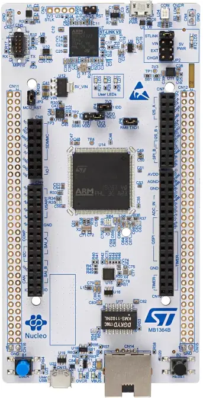

Fig. 1: STM32H753ZI (adapted from \[1\])

## I Introduction

Noise suppression for embedded audio systems is challenging due to
power, memory and computational constraints. While ANC and AI-based
denoising exist, these either suppress all sounds or require heavy
computational resources. This paper presents a real-time DSP-based
system using STM32H753ZI MCU with exploration on traditional adaptive
filters, meta-heuristic algorithms and beam-forming techniques,
achieving noise suppression suitable for low-power devices. Unlike
cloud-based or high-power DSP solutions, SONIC runs entirely on-chip,
demonstrating that meaningful speech enhancement can be achieved using
adaptive filtering algorithms within the strict timing and energy
budgets of embedded hardware.

Adaptive filtering algorithms, mainly LMS, adjust filter weights to
minimize noise, enhancing speech clarity in real-time. A dual-microphone
setup was used in this project. This setup follows the traditional
adaptive noise filtering framework, where a secondary reference signal,
captured via a noise-facing microphone, is used to adaptively filter out
unwanted background noise from a primary speech signal.

This project has involved a thorough investigation of the LMS algorithm
and preliminary exploration of the other adaptive filtering techniques
like Normalized LMS (NLMS), Recursive Least Squares (RLS),
Meta-Heuristic algorithms along with beam-forming techniques also.

## II Related Work

Noise suppression on embedded systems has been explored through various
methods, primarily traditional adaptive filtering techniques such as LMS
and NLMS. These algorithms are popular due to their low computational
complexity and ability to adapt in real-time. Prior work demonstrated
the feasibility of implementing LMS and NLMS on Cortex-M7-based
microcontrollers for educational and experimental purposes. Their work
showed promising results in controlled conditions, but primarily focused
on didactic platforms rather than real-world robustness.\[2\]

Some studies have also investigated advanced algorithms like RLS, which
offer faster convergence but are often too computationally demanding for
typical microcontrollers due to their quadratic complexity. As a result,
real-time applications on constrained hardware often favor LMS-type
algorithms for their simplicity and predictability.\[3\]

Meta-heuristic techniques, including Particle Swarm Optimization (PSO)
and JAYA, have been proposed for adaptive filtering and speech
enhancement. These methods show strong offline performance and can reach
high-quality results. However, they are computationally intensive,
making them unsuitable for live deployment on low-power embedded
devices.\[4\]

Beamforming is another technique used for spatial filtering using
multiple microphones. While effective in certain scenarios, its
performance is limited by microphone spacing and array design,
particularly on compact hardware platforms. Moreover, adaptive
beamforming adds further complexity that is challenging to implement
efficiently in real time on embedded systems.\[14\]

In summary, existing approaches either compromise on performance due to
hardware constraints or require computational resources beyond what
typical microcontrollers can provide. SONIC aims to bridge this gap by
implementing a real-time, low-power noise suppression system that uses
adaptive filtering particularly, LMS on a resource constrained embedded
platform, achieving practical performance without relying on external
processing or cloud-based methods.

## III Algorithms

This section chiefly deals with the algorithms that we have reviewed,
alongwith the algorithms that have previously been used for the
application that we are trying to build. We began our search on Adaptive
Filtering algorithms, the ones that were used extensively by the
research community. Then, we ventured into other algorithms, primarily
experimenting with meta-heuristics, and attempted to establish a
comparative rationale between them. Having said that adaptive filtering
forms the basis of what we have implemented , a few words on that:

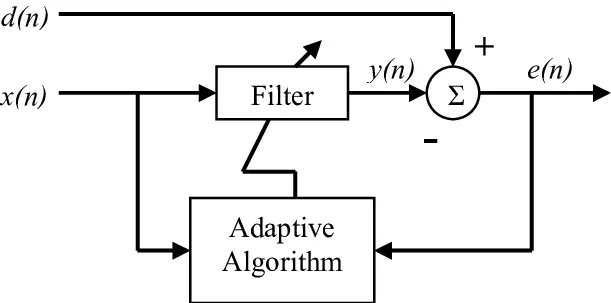

Fig. 2: LMS block diagram

As seen in the figure above, there exist two signals d(n), x(n) and a
filter that is changing signal x(n) to signal y(n). d(n) is what we
would refer to as the ’desired’ signal while x(n) is what we refer as
’reference’ signal. To put it clearly, we are envisaging to use 2 mics,
one near the source of the speaker and other away from it. Naturally,
the noise in both of the inputs would be correlated and it is this
correlation that we would utilize.

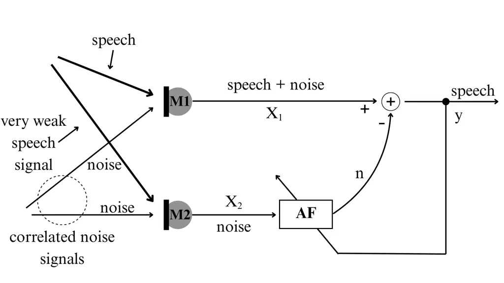

Fig. 3: Proposed Microphone Environment

The signal x(n) is transformed by the filter such that, the output y(n)
tends towards the noise part of the signal d(n). This essentially is
like making a copy of just the noise in signal d(n). The last step would
then be to subtract this output from d(n) and obtain the desired speech.
The next step in the flow of thought is to understand how the filter
works. At its core, the filter is just a bunch of weights that multiply
with the delayed versions of the reference signal x(n) and try to bring
it closer to the noise in d(n). The weights are updated iteratively and
the final output y(n) then converges to the error in O(n) as the number
of iterations increase.

```math
y[n]=\sum_{k=0}^{L-1}b_{k}[n]x[n-k] \tag{1}
```

```math
e[n]=d[n]-y[n] \tag{2}
```

```math
b_{k}[n+1]=b_{k}[n]+\mu e[n]x[n-k]\\
 \tag{3}
```

How the weights update is where the various algorithms play their part.
A brief overview of each follows. Note that the first two differ from
each other at a more fundamental and a method cumbered with a lot of
algebra.

### III-A Conventional Adaptive Filters

\[2\]

- •
  LMS: Simple gradient-based update with O(N) complexity per sample. It
  converges linearly and can be implemented efficiently in fixed-point
  or with FPU support. LMS is widely used because it requires minimal
  computation and memory. Its convergence rate is moderate; the
  step-size $`\mu`$ controls the trade-off between speed and stability.
  In practice on our hardware, CMSIS’s floating-point LMS ran with very
  low latency (often less than 100 cycles per tap update).
- •
  RLS: Offers much faster convergence and lower steady-state error than
  LMS (approaching Kalman filtering performance). However, it requires
  O(N²) operations (matrix inversions) per step. For a filter of length
  N, this quickly becomes infeasible on a microcontroller. Simulation
  shows RLS stabilizes in far fewer iterations, but each iteration is
  10–100× more compute-heavy than LMS. Given our real-time constraints
  and $`N\approx 100taps`$, RLS was deemed too computationally expensive
  despite its superior adaptive performance.
- •
  NLMS: A normalized LMS variant with dynamic step-size; it offers
  slightly improved stability over standard LMS at minimal extra cost
  (one division per block). Since our signals had varying power, NLMS
  was considered, but its run-time was similar to LMS and gains were
  marginal for our use case. Refer Fig. 4

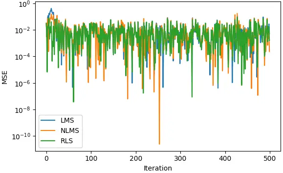

Fig. 4: Convergence Comparison

### III-B Meta-Heuristic Algorithms:

#### III-B1 Particle Swarm Optimization (PSO):-

Let, position if $`i^{th}`$ particle at time $`"t"`$ be $`x^{i}(t)`$ and
$`v^{i}(t)`$ be its corresponding velocity.

```math
x^{i}(t+1)=x^{i}(t)+v^{i}(t+1)
```

```math
v^{i}(t+1)=wv^{i}(t)+c_{1}r_{1}(p_{best}^{i}-x^{i}(t))+c_{2}r_{2}(g_{best}-x^{i}(t))
```

where,

$`r_{1}`$ and $`r_{2}`$ are random numbers and
$`r_{1},r_{2}\epsilon[0,1]`$

$`w`$= weight/inertia/tendency to move

$`c_{1}`$= Cognitive factor $`\epsilon[0,1]`$

$`c_{2}`$= Social factor $`\epsilon[0,1]`$

$`p_{best}^{i}\rightarrow`$ best ever position of $`i^{th}`$ particle.

$`g_{best}\rightarrow`$ best ever positions of all particles.

This algorithm is a good choice for fast optimization. PSO consistently
converged to a low MSE and achieved good SNR improvement\[4\]. However,
its convergence was relatively slower and would be computationally
expensive than adaptive filters like LMS or NLMS due to the need to
evaluate all particles over multiple iterations. With a significantly
higher Execution time PSO was considered unsuitable for real-time
processing on embedded hardware\[5\]. While it showed more stable
behavior than JAYA, its population-based nature still makes it better
suited for offline filter design or pre-training phases rather than live
signal processing.

#### III-B2 JAYA Algorithm:

JAYA is a population-based optimization algorithm that requires no
algorithm-specific control parameters (such as learning rate or
inertia), making it relatively simple to implement and tune\[6\]. It
updates filter weights by moving each candidate solution toward the best
and away from the worst solution in the population, according to:

```math
x^{\prime}_{j}=x_{j}+r_{1}(x^{\text{best}}_{j}-|x_{j}|)-r_{2}(x^{\text{worst}}_{j}-|x_{j}|)
```

where $`r_{1},r_{2}\in[0,1]`$ are random numbers, and
$`x^{\text{best}}_{j}`$, $`x^{\text{worst}}_{j}`$ are the best and worst
performing candidates. This update rule effectively balances exploration
and exploitation without the need for explicit hyperparameter tuning.
Its inconsistent behavior and high execution time make it unsuitable for
real-time embedded DSP. As with other metaheuristics, JAYA is better
used in offline filter design rather than adaptive filtering inside an
MCU. It is thus better suited for pre-processing stages rather than live
noise suppression on resource-constrained hardware.

#### III-B3 Simulated Annealing

\[7\]

Simulated Annealing (SA) is a global optimization heuristic inspired by
metal annealing, apt for finding near-optimal filter weights in
challenging, non-convex error landscapes. In our project context, the
algorithm repeatedly perturbs filter coefficients and occasionally
accepts higher-error solutions based on the probability:

```math
P=\exp\left(-\frac{\Delta E}{T}\right)
```

where $`\Delta E`$ is the increase in mean squared error (MSE) and $`T`$
is the decaying temperature parameter. Unlike gradient-based LMS/ NLMS
and RLS, SA is slower requiring many iterations to converge, which leads
to significantly higher execution time (Refer Fig. 6). However, the
trade-off is a respectable SNR improvement, often matching RLS or PSO
highlighting SA’s strength in escaping local minima and refining global
solutions. Within an embedded DSP, SA would face challenges: its
sequential nature, heavy use of random sampling, and slow cooling
schedule make it inefficient for real-time processing at audio rates of
48 kHz. SA is therefore better suited for offline filter design or
tuning phases, rather than being deployed during live audio streaming.

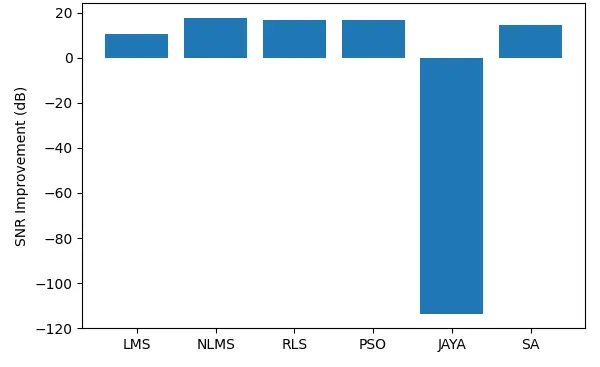

Fig. 5: SNR Comparison

### III-C Beam-forming techniques

In an analog system, the signals are continuous and so is the
processing. In a digital system, we have discrete sets of samples. Real
time simply means we have to process one set of samples before the next
set of samples arrive. This definition of real-time implies that, for a
processor operating at a given clock rate, the speed and quantity of the
input data determines how much processing can be applied to the data
without falling behind the data stream.

For example, if data are sampled at 8 kHz, all processing must be done
in $`(1/8kHz)`$ seconds. All processing has to be done within a finite
amount of time.

The signal of each microphone is delayed by a time proportional to the
distance between a known target and the microphone, which is done to
align the microphone signals. Adding all the signals means that the
speech power is enhanced while the noise remains the same.

One of the simplest forms of data-independent beamformers is a
delay-and-sum beamformer, where the microphone signals are delayed to
compensate for the different path lengths between a target source and
the different microphones\[14\]. This means that when the signals are
summed, the target source coming from a certain direction will
experience coherent combining, and it is expected that signals arriving
from other directions will suffer to some extent from destructive
combining\[13\].

This is not very useful for microphones with small arrays as we need the
lengths to be at least a quarter of the wavelengths of the audio
involved. There is a second technique called Frost beam formation. The
same principle as delay and sum beam-forming but with filter
coefficients. This filter used, for example, can be the NLMS filter.
Make the multi-channel input a single output audio signal. Let us focus
on the case of using two microphones for processing. Using two
microphones for the processing means using the fixed geometry of a
straight line. This is suitable for focusing on signals from a
particular direction\[16\]. It is found that, typically, the spacing
between microphones should be less than or equal to half the wavelength
of the highest frequency of interest to avoid spatial aliasing. For
speech (100 Hz to 4 kHz), the typical spacing is 5 cm - 20 cm.

Although these Beam-forming techniques can be effective in specific
situations, its success heavily depends on the spacing between
microphones and the overall array configuration such as factors that
pose constraints on compact hardware. Additionally, implementing
adaptive beamforming increases computational complexity, making
real-time execution on embedded systems difficult.

### III-D Conclusion

These algorithms search for optimal filter weights through iterative
randomness. They are non-deterministic and require many evaluations. For
example, PSO might use 20–50 particles over 100+ iterations to optimize
filter taps – that’s thousands of function evaluations for one output
sample. In simulations we saw PSO/JAYA yielding high-quality solutions
offline, but even coarse settings needed far more time than real-time’s
1/48,000s per sample. Meta-heuristics were considered but not deployed
due to non-deterministic computation and high runtime.” Given these
trade-offs, we chose LMS for the embedded filter. LMS provides a
predictable fixed cost per sample and the MCU’s FPU/DSP extensions keep
it fast.

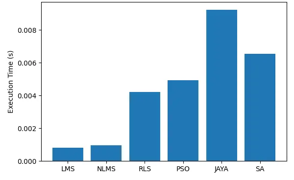

Fig. 6: Runtime

## IV System Architecture

### IV-A Our Computational Engine \[9\]

The STM32H753ZI was chosen for its unmatched combination of high
performance and audio-centric features. It uses a 480 MHz Arm Cortex‑M7
core with a double-precision FPU and full DSP instruction set, yielding
1027 DMIPS. The device has large on-chip memory (2MB flash, 1MB RAM) and
multi-layer bus architecture for peak throughput. Crucially, its
peripherals include multiple serial audio interfaces: six SPIs (three of
which can run in duplex I2S mode) plus four full SAIs, as well as four
DFSDM channels for PDM mics. These allow dual I2S microphone inputs and
stereo outputs. In hardware, the H7’s four DMA controllers (MDMA and
regular DMAs) support circular buffering so audio streams can flow
directly between I/O and RAM without CPU overhead. The block diagram in
Fig. 7 highlights the M7 core, caches, DMA engines.

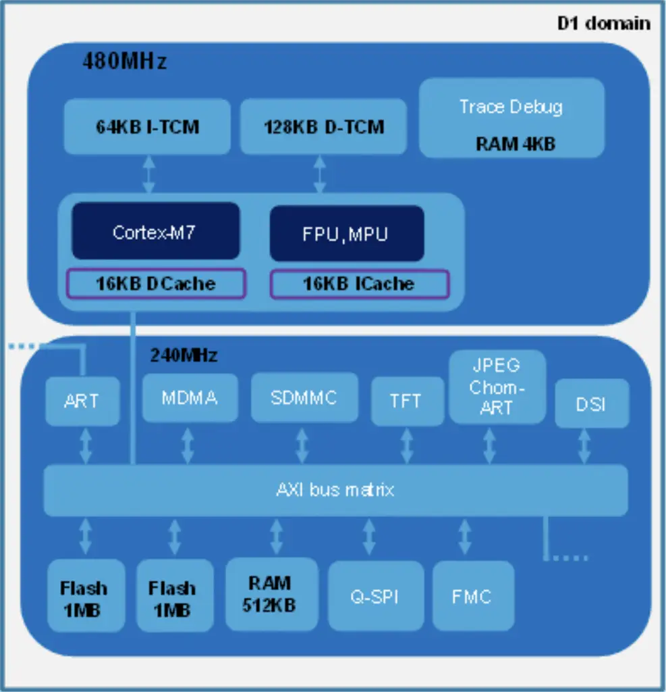

Fig. 7: D1 sub system (adapted from \[11\])

The Cortex‑M7 core features a DP-FPU and SIMD MAC units, ideal for fast
FIR-filtering operations. CMSIS-DSP routines (e.g. arm_lms_f32())
utilize this FPU to execute multiply-accumulate operations in hardware.
Compared to older Cortex‑M4 MCUs (e.g. STM32F4), the H7 delivers roughly
twice the floating-point throughput and includes a larger register file
and caches, enabling sustained high-speed signal processing. The H7’s
audio interfaces were vital for SONIC. It supports dedicated I2S blocks
and full-duplex SAIs, enabling simultaneous multi-channel audio I/O. We
used two I2S input channels (one per microphone) and one output channel
in stereo mode\[17\]. With a 480 MHz core clock and flexible PLLs, the
MCU comfortably meets 48 kHz streaming (requiring a 1–12 MHz I2S master
clock) and headroom for computation. For example, PLLI2S can be
configured so that 256 Fs (for Fs = 48 kHz) clock the I2S block. Such
high clocking plus fast memory allows running the adaptive filter on
large blocks without data underflow.

### IV-B Understanding at a Processor Level

The H7’s FPU critically accelerates the LMS filter. The Cortex‑M7 FPU
can execute single-precision MACs in a few cycles (often one per
instruction), and has pipeline/SIMD that allow multiple operations per
cycle. The CMSIS-DSP arm_lms_f32() is hand-optimized to exploit these
units\[10\]. In contrast, fixed-point Q15/Q31 LMS versions require
manual scaling and post-shifting and still risk overflow. On our tests,
arm_lms_f32() achieved significantly higher throughput than the Q15
version\[12\]. Internally, the FPU-based code uses instructions like
VMLA (vector multiply-accumulate) to process four samples per loop in
parallel. The net effect is that the FPU has made 24-bit audio filtering
real-time feasible. In sum, the double-precision FPU and SIMD extensions
of the M7 chip are the reason real-time 24-bit floating-point filtering
runs efficiently on this MCU.

The I2S data format and DMA configuration are subtle. On the data bus, a
24-bit audio sample is actually transmitted in a 32-bit frame (with 8
bits of padding). We initially configured the DMA to transfer 32-bit
words, but this misaligned the 24-bit samples, resulting in gibberish
outputs. Changing the DMA to 16-bit half-word mode fixed it: each 32-bit
I2S frame was handled as two 16-bit transfers. In effect, the first
half-word carried the lower 16 bits of the 24-bit sample, and the second
half-word (ignored or fixed) contained padding, but the data aligned.
This choice yielded the correct PCM values (at the cost of discarding
the highest 8 bits, effectively using a 16-bit audio resolution). In
general, one must match the I2S data-size setting, DMA data width, and
buffer layout carefully. Circular DMA mode (with 16-bit transfers)
allowed the sample stream to loop endlessly- once DMA reached the end of
the buffer, it wrapped back to the start\[19\]. The CPU never
participates in copying data; it only processes full or half-buffer
interrupts, while DMA automatically refills the other half. This is the
“circular double-buffer” scheme that ensures real-time overwriting of
old samples.

We chose a 48 kHz sample rate because it is a standard audio rate
(widely supported by microphones and DACs) and simplifies clock
generation. Many MEMS microphones natively support 48 kHz, and STM32’s
audio PLLs can easily generate the required clocks for 48 kHz (for
example, setting PLLI2S to 256×Fs yields an exact MCLK). Using standard
rates like 48 kHz avoids fractional dividers or resampling. Clock tree
can be used to compute these frequencies: e.g. an 8 MHz crystal → PLLI2S
(×24 = 192 MHz) → I2S clock 192/4 = 48 MHz bit clock at 32 bits/sample.
In short, 48 kHz was chosen for compatibility and because the MCU’s PLLs
can produce it exactly; using a non-standard rate would complicate the
PLL settings. Refer Fig. 8.

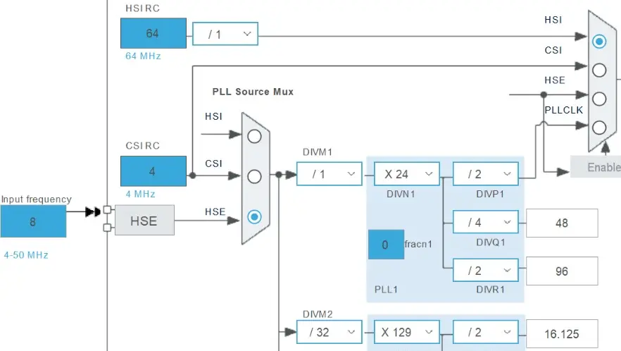

Fig. 8: Clock Tree

## V Hardware Overview

Two MEMS I2S microphones feed I2S channels of STM32H753ZI; output PCM
streams are LMS filtered, then sent via another I2S channel where an
external Class-D audio amplifier drives this output to the embedded
speaker.

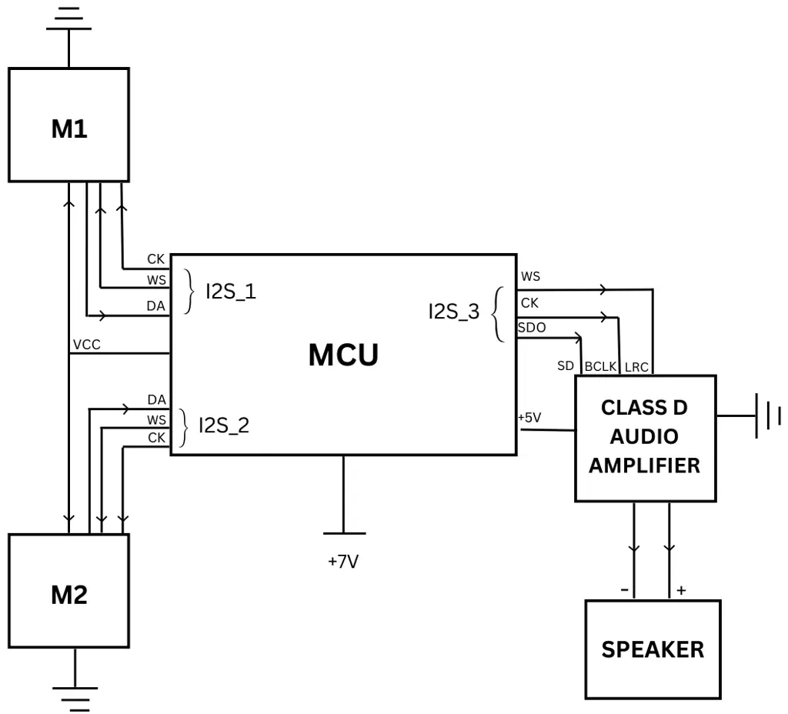

Fig. 9: Embedded Layout

We used the MCU’s dual-DMA controllers in circular (ping-pong) mode.
Incoming audio from I2S is written into a RAM buffer continuously, while
the CPU processes the other half. Likewise, outgoing data to the I2S
uses a separate DMA channel in circular mode. This double-buffering
ensures no data gaps. In effect, while DMA fills buffer B0 with new mic
samples, the CPU filters the previous buffer B1, and vice versa, keeping
both the input and output streams uninterrupted. Refer Fig. 9.

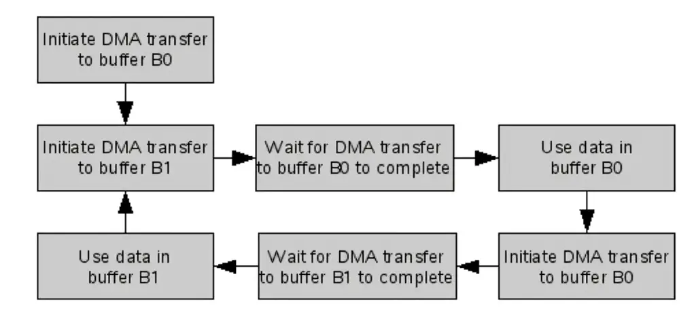

Fig. 10: Double Buffering (adapted from \[15\])

Two I2S channels were used in parallel: one per microphone. The STM32
supports multiple I2S/SAI peripherals, so each MEMS mic’s PCM data could
be received on its own data line. The STM32’s I2S modules were clocked
by a dedicated audio PLL (e.g. PLLI2S), providing the master clock
(MCLK) and bit-clock (BCLK) for precise 48 kHz sampling. DMA requests on
the I2S periphs transfer each audio sample into memory automatically.
Our board has two 12‑bit DAC channels. We found the 12-bit DAC
insufficient for 24‑bit PCM input: mapping 24-bit data into 12-bit
output caused severe amplitude truncation\[18\]. Indeed, the team
observed “DAC resolution is a hardware constraint limiting output
quality without external amplification”. Adding an off-chip Class‑D
audio amplifier restored full dynamic range and drive strength.

## VI Understanding Audio Flow

Before real-time DSP, we implemented the filter using stored .WAV files
on an SD card to understand how these audio signals streamed. We used
the STM32’s high-speed SDMMC interface instead of SPI mode because SDMMC
supports 4- or 8-bit data and clock up to 48–125 MHz, giving much higher
throughput. Our tests confirmed SDMMC could stream audio data rapidly
enough to the MCU RAM to simulate real-time input. We used the FatFS
library for filesystem access. Initially we experienced “mount failures”
with FatFS, which was later traced to the need for hardware pull-ups:
the STM32’s internal 30–50 k$`\Omega`$ pull-ups on the SD lines were too
weak. Adding external 10 k$`\Omega`$ pull-up resistors on CMD and DAT
lines fixed the issue. In summary, SDMMC was chosen for speed (vs.
slower SPI/1-bit SDIO) and proper pull-ups are required for reliable
card detection and data transfer. Once the data was streaming from SDMMC
into RAM, the same LMS code (ARM CMSIS-DSP) was applied to each audio
buffer exactly as in real-time mode (just with CPU-driven reads instead
of DMA). This testing verified algorithm functionality before moving to
live I2S input.

In software, WAV files were read in chunks (blocks) of PCM samples,
which were then fed to the LMS filter. In our implementation, we used a
filter length of 96 taps with a block size of 256 samples, in line with
ARM’s CMSIS-DSP guidelines. Accordingly, the state buffer size was set
to numTaps + blockSize – 1 = 351. We selected a step-size parameter of
$`\mu=0.01`$, which provided a good trade-off between convergence speed
and stability for speech-band signals. With this configuration, the
arm_lms_f32() function adapted effectively within a few hundred samples
and exhibited no signs of divergence during real-time operation. The
signal flow is: each new block of reference (noise) samples x\[n\] is
stored by DMA in RAM, then arm_lms_f32() is called to compute the output
y\[n\] and error e\[n\] = d\[n\]–y\[n\], updating coefficients
concurrently.

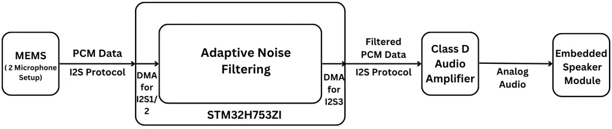

Fig. 11: Data Flow

We selected MEMS I2S microphones (which present already-decoded PCM
data) to simplify the signal chain. Some digital MEMS mics output a raw
pulse-density-modulated (PDM) bitstream requiring on-chip decimation
filters (e.g. ST’s DFSDM blocks) to produce PCM. While the H7 does
include DFSDM filters for PDM decoding, using a mic with native PCM
output removes this extra processing stage. In other words, our chosen
microphone included its own sigma delta modulator and decimator to
deliver 24-bit PCM words over I2S, so the MCU simply treated it as a
standard I2S ADC. This avoids any need for the PDM→PCM conversion
library. From an industrial perspective, using a PCM-encoded mic reduces
software complexity and latency.

I2S (Inter-IC Sound) is a synchronous serial protocol specifically for
audio data. Each I2S bus consists of a word-select (WS), bit-clock
(BCLK), and data line, and optionally a master clock (MCLK). We
configured three I2S channels in total: one left/right pair for the
microphones and one for output. The STM32’s I2S/SAI blocks support DMA
transfers directly. We set up DMA in circular mode so that as soon as
one buffer fill completes an interrupt, DMA automatically continues into
the next buffer half. This means the CPU never has to intervene for each
sample – it only processes a block when a half-buffer is full. In
effect, double-buffered DMA ensures continuous audio: while DMA writes
new samples into half the buffer, the CPU reads and filters the other
half. We explicitly used three I2S peripheral instances: two in
master-receive mode (for the two mics) and one in master-transmit. Each
was clocked by a precise audio PLL to achieve the 48kHz rate.

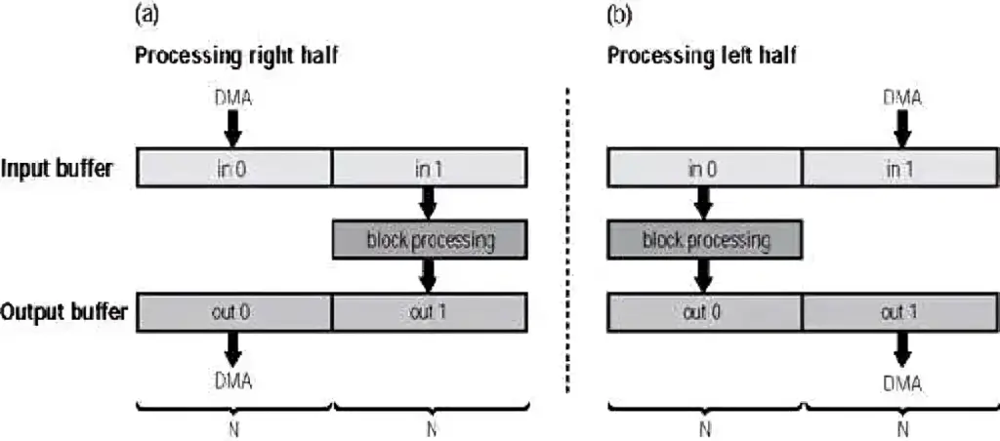

Fig. 12: Circular DMA (adapted from \[19\])

Initially, using the on-chip 12-bit DAC introduced severe quantization.
Since our input was 24-bit audio, the top 8 bits were effectively lost,
causing noise and truncation. This was confirmed by experiments and
noted in the Discussion: “Hardware constraints (e.g., DAC resolution)
limit output quality without external amplification”. The solution was
to route the filtered signal through an external Class‑D amplifier
(which accepts 16-bit DAC input at full scale) and drive a speaker. The
Class‑D’s higher resolution and power greatly improved audio quality.
Regarding buffering: we used double-buffering on the MCU. This means the
DMA and CPU share a buffer that is split in half. When one half is being
filled by DMA, the CPU processes the other half. In STM32 HAL terms, we
started DMA with MultiBuffer mode, and each half-buffer triggers a
“half-transfer complete” interrupt. Thus, at any time one buffer half
holds the newest data and the other is being processed. This decouples
the DMA from the CPU. In practice, our code had callbacks for “Buffer 0
ready” and “Buffer 1 ready,” and the LMS filter ran on whichever half
was just filled, while the I2S DMA output used the opposite half. This
architecture guarantees that new audio always overwrites the oldest data
(real-time streaming) without glitches.

## VII Results and Evaluation

### VII-A Objective/ Subjective Metrics

SNR, STOI, and PESQ were measured pre- and post-filtering on noisy
speech samples\[8\]. After processing, both the unfiltered (noisy) and
filtered signals generated by our real-time LMS system were stored
directly onto the SD card via the STM32H753ZI board itself. These
recordings were then evaluated using actual outputs from our embedded
setup (not simulated) to calculate objective metrics like SNR, STOI, and
PESQ through dedicated analysis scripts. A clean, pre-recorded speech
sample served as the reference for these comparisons. Importantly, the
improvements we observed such as a 7 dB gain in SNR, a STOI increase
from 0.69 to 0.84, and a PESQ rise from 1.69 to 2.55 reflect the
real-world performance of our hardware implementation. These results
demonstrate the system’s ability to perform effective noise suppression
in practical conditions, independent of any simulated environment.

| Metric   | Before | After |
| -------- | ------ | ----- |
| SNR (dB) | +5     | +12   |
| STOI     | 0.69   | 0.84  |
| PESQ     | 1.69   | 2.55  |
| MOS      | \-     | 4.47  |

TABLE I: Performance Metrics

For subjective evaluation, we conducted a live real-time demo during a
research event at our university, where 122 participants spoke into the
microphone and listened to the processed output through the speaker.
Each rated the filtered audio using the standard MOS scale (1 to 5). The
final MOS score was 4.47 out of 5, indicating clear improvement in
speech quality and noise reduction. This real-time feedback reflected
the system’s practical effectiveness.

## VIII Conclusion

We presented SONIC, a real-time noise suppression system built on the
STM32H753ZI using LMS adaptive filtering. Our work shows that even with
limited compute and memory budgets, it is possible to achieve effective
speech enhancement on embedded platforms without the need for AI or
cloud-based processing.

The significance of SONIC lies in its feasibility on low-power MCUs and
its deterministic, low-latency behavior, making it suitable for
battery-powered and real-time applications like smart speakers, hearing
aids, or IoT voice interfaces. While meta-heuristic algorithms like PSO
and JAYA offered better offline performance, their high execution time
and non-determinism rendered them unsuitable for real-time deployment on
MCUs.

Looking ahead, a promising direction is to translate this architecture
into a custom ASIC design, allowing tighter integration and further
reduction in power and latency ideal for use inside consumer-grade sound
devices. Such a hardware-software co-design could make embedded noise
suppression mainstream, offering an alternative to high-cost or opaque
AI models in scenarios that demand transparency, efficiency, and edge
autonomy.

## References

- \[1\] STMicroelectronics, “STM32H753ZI Nucleo-144 Board,” \[Online\].
  Available:
  [https://www.st.com/en/evaluation-tools/nucleo-h753zi.html](https://www.st.com/en/evaluation-tools/nucleo-h753zi.html).
  \[Accessed: June 15, 2025\].
- \[2\] M. Beccaro, A. Zambolin, and D. Ravazzolo, ”Low-cost didactic
  platform for real-time adaptive filtering: Application on noise
  cancellation,” IEEE Access, vol. 10, pp. 19579–19588, 2022.
- \[3\] G. Lampl, A. Sedaghat, and G. Gatti, ”Noise cancellation with
  LMS, NLMS and RLS filtering algorithms to improve the fault detection
  of an industrial measurement system,” Measurement, vol. 212, 2023.
- \[4\] B. Taha and A. M. S. Rahman, ”Speech Enhancement Based on
  Adaptive Noise Cancellation and Particle Swarm Optimization,”
  Indonesian Journal of Electrical Engineering and Computer Science,
  vol. 15, no. 2, pp. 930–937, 2019.
- \[5\] J. A. Pichardo, R. V. Carrillo, and E. Osornio-Rios, ”A Novel
  PSO-Based Adaptive Filter Structure with Switching Selection Criteria
  for Active Noise Control,” Sensors, vol. 22, no. 2, pp. 569–577, 2022.
- \[6\] S. Kumar and S. Singh, ”Jaya-FLANN based adaptive filter for
  mixed noise suppression from ultrasound images,” International Journal
  of Imaging Systems and Technology, vol. 27, no. 4, pp.
  1031–1038, 2017.
- \[7\] L. Ingber, “Adaptive simulated annealing for optimization in
  signal processing,” in _Proc. IEEE Congr. Evol. Comput._, 1999, pp. –.
- \[8\] Picovoice, ”Measuring Speech Quality: An Overview of Metrics for
  Voice Enhancement,” Picovoice Blog, 2023. \[Online\]. Available:
  [https://picovoice.ai/blog/speech-quality/](https://picovoice.ai/blog/speech-quality/)
- \[9\] STMicroelectronics, STM32H753ZI: Arm^(®) Cortex^(®)-M7 32-bit
  MCU datasheet, 2023. \[Online\]. Available:
  [https://www.st.com/resource/en/datasheet/stm32h753zi.pdf](https://www.st.com/resource/en/datasheet/stm32h753zi.pdf)
- \[10\] STMicroelectronics, ”Digital signal processing for STM32
  microcontrollers using CMSIS,” Application Note AN4841, 2018.
  \[Online\]. Available: [STMicroelectronics
  AN4841](https://www.st.com/resource/en/application_note/an4841-digital-signal-processing-for-stm32-microcontrollers-using-cmsis-stmicroelectronics.pdf)
- \[11\] STMicroelectronics, STM32H745/755 and STM32H747/757 Lines
  Dual-Core Architecture, Application Note AN5557, 2022. \[Online\].
  Available: [STMicroelectronics
  AN5557](https://www.st.com/resource/en/application_note/an5557-stm32h745755-and-stm32h747757-lines-dualcore-architecture-stmicroelectronics.pdf)
- \[12\] Arm Ltd., ”CMSIS-DSP: LMS Filters,” CMSIS Documentation, 2022.
  \[Online\]. Available:
  [https://arm-software.github.io/CMSIS_5/DSP/html/group\_\_LMS.html](https://arm-software.github.io/CMSIS_5/DSP/html/group__LMS.html)
- \[13\] gfai tech GmbH, ”Delay-and-Sum Beamforming in the Time Domain,”
  Knowledge Base, 2021 \[Online\]. Available:
  [https://www.gfaitech.com/knowledge/faq/delay-and-sum-beamforming-in-the-time-domain](https://www.gfaitech.com/knowledge/faq/delay-and-sum-beamforming-in-the-time-domain)
- \[14\] Michael Tuttle and Jakob Vennerød, ”Microphone Array
  Beamforming with Optical MEMS Microphones” audioXpress Magazine, 2024.
  \[Online\]. Available:
  [https://audioxpress.com/article/microphone-array-beamforming-with-optical-mems-microphones](https://audioxpress.com/article/microphone-array-beamforming-with-optical-mems-microphones)
- \[15\] S. Haykin, ”Adaptive Filter Theory,” in IEEE Transactions on
  Acoustics, Speech, and Signal Processing, vol. 30, no. 1, pp. 140–142,
  Feb. 1982. \[Online\]. Available:
  [https://ieeexplore.ieee.org/stamp/stamp.jsp?tp=&arnumber=4404939](https://ieeexplore.ieee.org/stamp/stamp.jsp?tp=&arnumber=4404939)
- \[16\] MathWorks, ”Frost Beamformer Block,” MathWorks
  Documentation, 2022. \[Online\]. Available:
  [https://www.mathworks.com/help/phased/ref/frostbeamformer.html](https://www.mathworks.com/help/phased/ref/frostbeamformer.html)
- \[17\] Anonymous, ”LMS-Based Real-Time Embedded Noise Canceller using
  STM32H7 MCU,” in Proc. DAGA 2024, pp. 1–4. \[Online\]. Available:
  [https://pub.dega-akustik.de/DAGA_2024/files/upload/paper/88.pdf](https://pub.dega-akustik.de/DAGA_2024/files/upload/paper/88.pdf)
- \[18\] R. Rinaldi, ”Analysis Of The Effect Filter Order Number On
  Noise Canceller System Using STM32F4,” ResearchGate, 2023. \[Online\].
  Available:
  [https://www.researchgate.net/publication/366793531_Analysis_Of_The_Effect_Filter_Order_Number_On_Noise_Canceller_System_Using_STM32F4](https://www.researchgate.net/publication/366793531_Analysis_Of_The_Effect_Filter_Order_Number_On_Noise_Canceller_System_Using_STM32F4)
- \[19\] J. Faludi, ”Using Direct Memory Access Effectively in
  Media-Based Embedded Applications – Part 3,” Embedded.com, 2021.
  \[Online\]. Available:
  [embedded.com](https://www.embedded.com/using-direct-memory-access-effectively-in-media-based-embedded-applications-part-3/)
