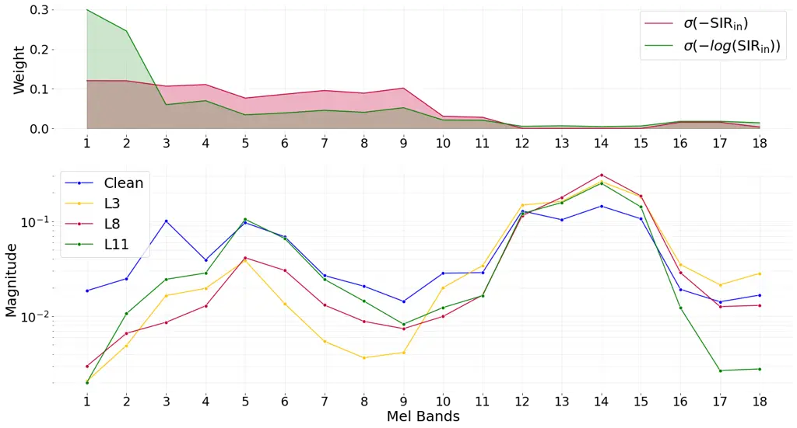
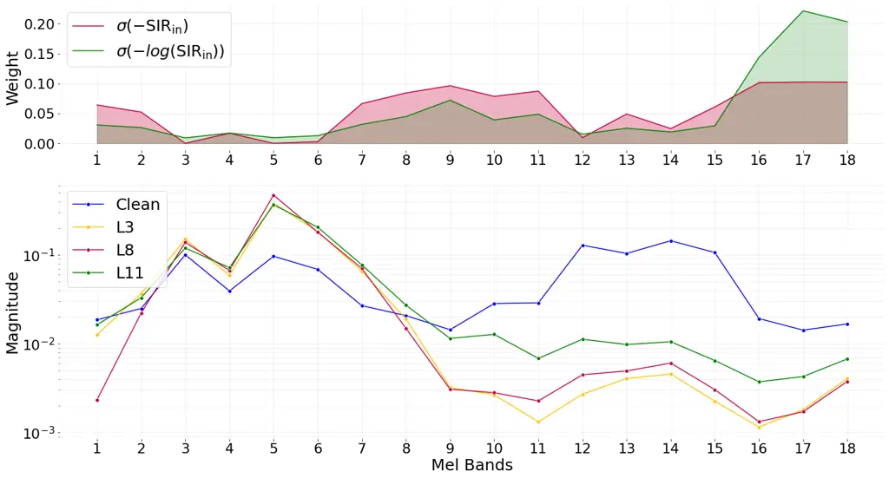
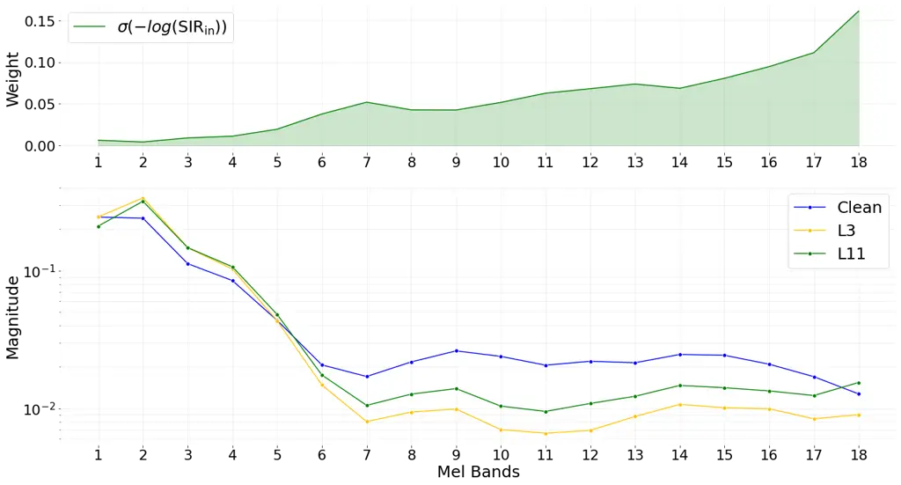

# Frequency-Weighted Training Losses for Phoneme-Level DNN-based Speech Enhancement

Nasser-Eddine Monir, Paul Magron, Romain Serizel Affiliation: Université
de Lorraine, CNRS, Inria, Loria  
Nancy, France  
{nasser-eddine.monir}{paul.magron}@inria.fr, romain.serizel@loria.fr

###### Abstract

Recent advances in deep learning have significantly improved
multichannel speech enhancement algorithms, yet conventional training
loss functions such as the scale-invariant signal-to-distortion ratio
(SDR) may fail to preserve fine-grained spectral cues essential for
phoneme intelligibility. In this work, we propose perceptually-informed
variants of the SDR loss, formulated in the time-frequency domain and
modulated by frequency-dependent weighting schemes. These weights are
designed to emphasize time-frequency regions where speech is prominent
or where the interfering noise is particularly strong. We investigate
both fixed and adaptive strategies, including ANSI band-importance
weights, spectral magnitude-based weighting, and dynamic weighting based
on the relative amount of speech and noise. We train the FaSNet
multichannel speech enhancement model using these various losses.
Experimental results show that while standard metrics such as the SDR
are only marginally improved, their perceptual frequency-weighted
counterparts exhibit a more substantial improvement. Besides, spectral
and phoneme-level analysis indicates better consonant reconstruction,
which points to a better preservation of certain acoustic cues.

###### Index Terms: 

multichannel speech enhancement, binaural hearing aids, DNN-based
algorithms, loss function

## I Introduction

Multichannel speech enhancement aims to isolate speech from unwanted
noise and reverberation by leveraging spatial cues from multiple
microphones. This technology is crucial in real-world applications,
including hearing aids \[1\], automatic speech recognition \[2, 3\],
teleconferencing \[4\], and augmented reality \[5\], where retrieving
high-quality speech signals is essential for human-computer interaction.

Early speech enhancement methods used statistical techniques like
beamforming and spatial filtering, exploiting assumptions about spatial
properties of speech and noise \[6, 7\]. Classical approaches such as
minimum variance distortionless response beamformers \[8\] and
multichannel Wiener filters \[9\] effectively suppressed interference
but struggled in dynamic or reverberant settings due to spatial
covariance estimation challenges. Modern deep learning techniques
shifted to data-driven strategies, using deep neural networks to enhance
speech \[10, 11, 12, 13, 14, 15, 16\], with end-to-end models extracting
spatio-temporal features from raw waveforms or spectrograms for improved
robustness. More recently, transformer-based architectures such as dense
frequency-time attentive network (DeFTAN-II) \[14\] and attentive dense
convolutional network \[16\] have demonstrated strong performance by
modeling long-range dependencies through attention mechanisms.

Standard training loss functions such as the mean squared error or the
signal-to-distortion ratio (SDR)¹¹ 1 In this paper, all ratios are
*scale-invariant* \[17\], but we omit this precision (as well as the
commonly used “SI-” acronym) for brevity. focus on signal fidelity in a
global sense, overlooking the perceptual salience of phoneme-specific
spectral cues that are critical to intelligibility. For instance,
consonant sounds often contain high-frequency bursts or rapid spectral
transitions that are easily masked by noise but crucial for
distinguishing words. Since these fine-grained structures are not
emphasized by conventional losses, neural models may fail to preserve
them consistently. This limitation was highlighted in our previous
work \[18\], where we conducted a phoneme-level evaluation of
enhancement algorithms and observed that improvements in global metrics
often failed to translate to better reconstruction of acoustically
vulnerable phonemes. These findings motivate the development of
perceptually-informed objectives that selectively emphasize spectral
regions tied to intelligibility, ensuring that enhancement models not
only denoise but also preserve linguistically relevant acoustic
features.

To address the limitations of global-scale loss functions, we explore
the use of frequency-weighted loss formulations in the time-frequency
(TF) domain. Specifically, we extend the standard SDR by computing it
over short-time Fourier transform (STFT) representations, allowing for
fine-grained temporal and spectral resolution. We incorporate both
perceptually and signal-informed frequency weighting strategies to
modulate the loss according to the relative importance of different
spectral regions. These include fixed weighting schemes, such as the
American national standards institute (ANSI) S3.5-1997 band-importance
weights \[19\], as well as adaptive strategies based on the relative
amount of noise across frequencies. We assess their potential as
training losses for a multichannel enhancement algorithm (FaSNet).
Extensive evaluation suggests that perceptually weighted SDR losses can
improve frequency-weighted metrics and support better preservation of
phonemes like plosives and fricatives.

## II Methodology

### II-A Problem statement

Let $`s`$ denote a reverberant clean speech signal that is contaminated
with reverberant interfering noise $`n`$, and $`\hat{s}`$ an estimate of
$`s`$ produced by a speech enhancement network. Such a network is
typically trained by minimizing a loss function that measures the
discrepancy between $`s`$ and $`\hat{s}`$. A popular choice for the loss
is the SDR \[20, 17\], which was originally introduced as an evaluation
metric, but later exploited as a training objective in neural speech
enhancement systems \[16, 13\].

The SDR provides a straightforward and computationally efficient
training objective for time-domain signals. However, it lacks the
ability to selectively emphasize specific regions of the signal. In
particular, it uniformly weights all temporal and spectral components,
disregarding their perceptual significance. To alleviate this
limitation, we explore reformulating SDR in the frequency or TF domains,
as well as leveraging non-linear spectral range and non-uniform spectral
weighting schemes.

### II-B Computing the SDR in various domains

To compute the SDR, one first decomposes the estimated signal
$`\hat{s}`$ as follows: $`\hat{s}=s_{\text{proj}}+e_{\text{dist}}`$,
where $`s_{\text{proj}}`$ and $`e_{\text{dist}}`$ denote the target
projection and distortion component, respectively. The SDR is then
computed as:

```math
\text{SDR}=10\log_{10}\left(\frac{\|s_{\text{proj}}\|^{2}}{\|e_{\text{dist}}\|^{2}}\right). \tag{1}
```

To obtain a frequency domain SDR, we compute the Fourier transform of
the two components, denoted $`S_{\text{proj}}(f)`$ and
$`E_{\text{dist}}(f)`$, from which we derive an SDR for each frequency
bin independently, defined as:

```math
\text{SDR}(f)=10\log_{10}\left(\frac{|S_{\text{proj}}(f)|^{2}}{|E_{\text{dist}}(f)|^{2}}\right). \tag{2}
```

These are then averaged across all frequencies to yield the frequency
SDR. Similarly, to compute a TF domain SDR, we compute the STFT of the
two components, from which we derive an SDR for each TF bin
$`\text{SDR}(f,t)`$ (defined similarly as in (2) as a segmental
measure), and these are then averaged across all TF bins to yield the TF
SDR.

While the frequency formulation only accounts for global spectral
variations, the TF formulation additionally captures rapid time-varying
events—such as consonants—that are critical for phoneme intelligibility
yet easily masked by noise.

Note that the distortion component $`e_{\text{dist}}`$ can further be
decomposed into a residual interfering noise $`e_{\text{interf}}`$ and
an artifact component $`e_{\text{artif}}`$. Using these instead of the
distortion in the above formula allows to compute the
signal-to-interference and -artifact ratios (SIR and SAR) \[20\], in
either the time, frequency, or TF domains. We refer the reader to
Vincent et al.’s paper \[20\] for full definitions about these ratios.

### II-C Leveraging non-linear spectral scales

In order to account for perceptual properties in this framework, we
propose grouping frequency channels according to non-linear spectral
scales, that are tailored to match human auditory sensitivity. For
instance, the critical bands \[21\] and 1/3 octave scale \[19\] reflect
the unequal contribution of frequency regions to intelligibility, as
bandwidth increases with frequency \[22\]. In this study, we adopt the
Mel scale \[23\], as it offers a compact, perceptually motivated
representation.

### II-D Weighting strategies

To better reflect the perceptual or intelligibility-based relevance of
different frequency bands, we propose a weighted SDR formulation, where
non-negative weights $`w(f,t)`$ are applied to the target projection and
distortion component when computing the SDR. This results in a weighted
TF SDR, defined as:

```math
10\cdot\log_{10}\left(\frac{\sum_{f,t}w(f,t)\cdot|S_{\text{proj}}(f,t)|^{2}}{\sum_{f,t}w(f,t)\cdot|E_{\text{dist}}(f,t)|^{2}}\right) \tag{3}
```

This formulation allows weighting strategies based on perceptual
importance to directly shape the loss landscape during optimization.
Note that in (3) we average each component over TF bins prior to
computing the log unlike for the frequency and TF SDRs described in
Section II-B, as it was shown to yield more stable training and results
in preliminary experiments.

We consider several weighting schemes. First, we consider the standard
band-importance weights defined in Table 3 of the ANSI S3.5-1997
norm \[19\], which specifies importance values over eighteen 1/3 octave
bands. These weights were derived from intelligibility studies and
reflect the relative contribution of each band to overall speech
understanding in typical listening conditions.

An alternative strategy is speech-shaped weighting \[22\], which derives
$`w(f,t)`$ from the local spectral energy of clean speech in order to
favor TF regions where speech is more prominent. Specifically, we
consider weights of the form $`{w(f,t)\propto|S(f,t)|^{\gamma}}`$, where
$`|S(f,t)|`$ is the magnitude of the clean speech STFT, and we set
$`{\gamma=0.2}`$, as it was found to maximize correlation with
perceptual quality both in Ma et al. \[22\] and in our own training
experiments.

Finally, we propose SIR-based weights to emphasize TF bins dominated by
residual noise relative to the clean speech signal. The weights are
defined as:

```math
w(f,t)=\sigma\left(-\text{SIR}(f,t)\right)=\frac{\exp\left(-\text{SIR}(f,t)\right)}{\sum_{f^{\prime},t^{\prime}}\exp\left(-\text{SIR}(f^{\prime},t^{\prime})\right)}, \tag{4}
```

and:

```math
w(f,t)=\sigma\left(-\log\text{SIR}(f,t)\right)=\frac{1/\text{SIR}(f,t)}{\sum_{f^{\prime},t^{\prime}}1/\text{SIR}(f^{\prime},t^{\prime})}. \tag{5}
```

Both formulations emphasize low-SIR regions by assigning them higher
weights. The use of a softmax normalization ensures that the weights
form a valid distribution over TF bins, making them directly comparable
across different signals and scales. The logarithmic variant (5)
introduces a smoother weighting distribution, which can mitigate sharp
contrasts between bins and stabilize optimization at training.

## III Experimental Setup

### III-A Dataset

In our experiments, we use speech signals from the LibriSpeech
dataset \[24\], and both speech-shaped noise (SSN, 30% of the total
noise) and ecological noise from the Disco-noise dataset \[25\] (70% of
the total noise). SSN is generated using LibriSpeech speakers not
included in the clean speech, with 50% of the train-clean-100 set
assigned to clean speech, while the remaining 50% is partially used to
generate SSN, ensuring spectral consistency between speech and noise
components. The validation and test sets are constructed following the
same strategy using the LibriSpeech dev-clean and test-clean sets,
respectively.

To simulate real-world reverberation, we generate room impulse responses
using the Pyroomacoustics \[26\] toolbox. The reverberation time
$`RT_{60}`$ is sampled between 0.15 and 0.4 s. The dimensions of the
room are randomly selected within physically plausible ranges (3 to 8 m
length, 3 to 5 m width, and 2.5 to 3 m height), allowing for variability
while maintaining realistic indoor acoustic environments. The dataset
also incorporates a four-channel microphone array placed according to a
binaural hearing aid setup, with inter-microphone distances
corresponding to realistic placements on a human head: an interaural
spacing of 0.12 m to 0.18 m, and two microphones per ear positioned with
lateral and vertical offsets of 0.01 m to 0.02 m and 0.01 m to 0.015 m,
respectively. The speech and noise sources are placed at random
locations within the defined room. The final dataset includes mixtures
generated at SIR levels between -10 dB and 10 dB.

### III-B Speech enhancement algorithm

We consider the FaSNet \[13\] algorithm due to its efficiency in
real-time multichannel speech enhancement. In a nutshell, FasNet is a
two-stage end-to-end time-domain beamformer. In the first stage,
pre-enhancement is performed on a reference microphone by estimating
time-domain beamforming filters. In the second stage, it refines the
target by estimating filter coefficients using pairwise cross-channel
normalized correlation features.

We retrain the model using our dataset and the implementation from the
Asteroid toolkit \[27\], while slightly adjusting the training process
to accommodate our hardware setup, and optimizing performance²² 2 The
code and trained models will be provided in the camera-ready version..
In particular, to reflect binaural hearing aid scenarios, we disable
random microphone permutation to maintain a fixed reference microphone
(front left). For efficiency, we truncate audio utterances to a maximum
of 10 s, we set the patience to 15 epochs and use a batch size of 1.

### III-C Metrics

We evaluate speech enhancement performance using the classical
time-domain SDR, SIR, and SAR \[17\]. To capture perceptual relevance
across frequencies, we additionally report the frequency-weighted (FW)
counterparts of these metrics as defined in Greenberg et al. \[28\], and
denoted FW-SDR, FW-SIR, and FW-SAR, respectively. The weights are
computed as $`|S(f,t)|^{\gamma}`$, as proposed by Ma et al. \[22\],
following the strategy described in Section II-D. We recall that this
metric does not follow the same exact definition as our proposed
loss (3), and does not use the same set of (fixed) weights, as motivated
by numerical stability considerations (see Section II-D). Nonetheless,
we adopt these metrics for evaluation, given their broad use in the
literature and alignment with perceptually motivated evaluation
standards \[28, 22, 29\].

To evaluate denoising performance, we report the improvement in
interference reduction from input to output (i.e., before to after
enhancement) using both unweighted and frequency-weighted ratios,
denoted as $`\text{SIR}_{in}`$, $`\text{SIR}_{out}`$ and
$`\text{FW-SIR}_{in}`$, $`\text{FW-SIR}_{out}`$, respectively. In
contrast, for metrics related to artifacts and distortions, we only
report the output values: $`\text{SAR}_{out}`$, $`\text{SDR}_{out}`$,
$`\text{FW-SAR}_{out}`$, and $`\text{FW-SDR}_{out}`$. Finally, to
quantify the impact of enhancement on speech intelligibility, we include
the STOI score \[30\], reporting both input and output values:
$`\text{STOI}_{in}`$ and $`\text{STOI}_{out}`$.

## IV Results and discussion

### IV-A Utterance-level evaluation

| Loss | Domain    | Scale  | Weighting                     | $`\text{SIR}_{out}`$ | $`\text{SAR}_{out}`$ | $`\text{SDR}_{out}`$ | $`\text{FW-SIR}_{out}`$ | $`\text{FW-SAR}_{out}`$ | $`\text{FW-SDR}_{out}`$ | $`\text{STOI}_{out}`$ |
| ---- | --------- | ------ | ----------------------------- | -------------------- | -------------------- | -------------------- | ----------------------- | ----------------------- | ----------------------- | --------------------- | --- | ---- |
| L1   | Time      | \-     | \-                            | 19.3                 | 8.0                  | 7.3                  | 8.4                     | 3.6                     | 5.1                     | 0.75                  |
| L2   | Frequency | \-     | \-                            | 18.4                 | 7.9                  | 7.1                  | 7.8                     | 3.8                     | 5.0                     | 0.74                  |
| L3   | TF        | Linear | \-                            | 19.2                 | 7.9                  | 7.2                  | 8.4                     | 3.5                     | 5.0                     | 0.75                  |
| L4   | TF        | Mel    | \-                            | 18.8                 | 7.7                  | 6.9                  | 8.2                     | 4.0                     | 6.0                     | 0.76                  |
| L5   | TF        | Linear | $`                            | S                    | ^{\gamma}`$          | 16.5                 | 7.8                     | 6.6                     | 6.3                     | 3.4                   | 3.3 | 0.74 |
| L6   |           | Mel    | $`                            | S                    | ^{\gamma}`$          | 17.4                 | 7.5                     | 6.6                     | 7.1                     | 4.0                   | 5.2 | 0.76 |
| L7   |           | Mel    | ANSI1997                      | 16.5                 | 7.1                  | 6.0                  | 6.5                     | 4.3                     | 5.9                     | 0.77                  |
| L8   | TF        | Linear | $`\sigma(-\text{SIR})`$       | 20.8                 | 7.3                  | 6.8                  | 9.7                     | 3.4                     | 5.1                     | 0.74                  |
| L9   |           | Linear | $`\sigma(-\log(\text{SIR}))`$ | 20.2                 | 7.2                  | 6.6                  | 9.2                     | 3.4                     | 5.0                     | 0.73                  |
| L10  |           | Mel    | $`\sigma(-\text{SIR})`$       | 18.8                 | 7.1                  | 6.3                  | 8.1                     | 4.1                     | 5.7                     | 0.75                  |
| L11  |           | Mel    | $`\sigma(-\log(\text{SIR}))`$ | 19.7                 | 7.7                  | 7.0                  | 8.9                     | 4.1                     | 6.1                     | 0.76                  |

TABLE I: Impact of the loss domain, spectral scale, and weighting scheme
onto performance.

To evaluate the impact of loss domain, spectral scale, and weighting
strategies on enhancement performance, we analyze the impact of the
training losses defined in Section II onto performance. Table I reports
the results in terms of both standard and frequency-weighted metrics at
the utterance level. For reference, the mean input metrics are
$`\text{SIR}_{in}=-2.3`$, $`\text{FW-SIR}_{in}=0.1`$, and
$`\text{STOI}_{in}=0.64`$. We already observe that the
$`\text{STOI}_{out}`$ scores exhibit only minor variations across
configurations.

#### IV-A1 Loss domains

First, we assess the impact of the loss domain, i.e., computing the SDR
in the time (L1), frequency (L2), or TF (L3) domain, onto performance.
Overall, we observe in Table I that the three losses yield comparable
performance across all metrics, with the frequency domain formulation
showing slightly lower values in interference-related scores. Therefore,
in what follows we consider TF domain losses, as they enable the use of
frequency-dependent (as well as potentially time-dependent) weighting
schemes.

#### IV-A2 Spectral scales

Here we evaluate the impact of the spectral scale used when computing
the loss in the TF domain. We consider grouping frequencies using the
Mel scale, which corresponds to L4 in Table I. We observe that this Mel
scale-based loss (L4) yields some improvement over using the linear
scale (L3), with a particularly noticeable improvement in the
$`\text{FW-SAR}_{out}`$ and $`\text{FW-SDR}_{out}`$ metrics, at the cost
of a moderate drop in terms of $`\text{FW-SIR}_{out}`$.

#### IV-A3 Speech norm and ANSI1997 weighting

We now evaluate the impact of two frequency-based weighting strategies
onto output metrics (see Section II): a spectral magnitude weighting
$`|S|^{\gamma}`$ that can be used either with the linear (L5) or the Mel
(L6) scale, and the ANSI1997 weighting scheme when considering the Mel
scale (L7). These three weighting schemes are outperformed by a baseline
loss without weighting (L3) in terms of $`\text{SIR}_{out}`$,
$`\text{SAR}_{out}`$, and $`\text{SDR}_{out}`$ as well as in terms of
$`\text{FW-SIR}_{out}`$. However, the Mel scale variants (L6 and L7)
outperform the linear scale losses (L3 and L5) in terms of
$`\text{FW-SAR}_{out}`$ and $`\text{FW-SDR}_{out}`$. While the ANSI1997
weighting schemes appears to be the weakest approach in terms of
classical metrics and interference reduction, it exhibits some
noticeable improvement in terms of (weighted) artifact reduction
compared to other schemes.

#### IV-A4 SIR-based weighting



Fig. 1: Clean and enhanced (using L3, L8, and L11 losses) magnitude
spectra for a female speaker utterance contaminated with 0 dB SSN
(bottom), and weights used for computing L8 and L11 (top).

Finally, we investigate SIR-based weighting strategies defined in (4)
and (5). These approaches are applied on both linear and Mel scales
(L8–L11 in Table I). All SIR-based weighted losses exhibit a similar or
slightly superior $`\text{SIR}_{out}`$ over no weighting (L3), but the
latter outperforms these weighting schemes in terms of
$`\text{SAR}_{out}`$ and $`\text{SDR}_{out}`$. SIR-based weighting
improves $`\text{FW-SIR}_{out}`$ compared to unweighted losses,
particularly when using a linear spectral scale (L8 and L9). However,
using this scale comes at the cost of degraded $`\text{FW-SAR}_{out}`$
and $`\text{FW-SDR}_{out}`$. In contrast, applying SIR-based weighting
on the Mel scale (L10 and L11) offers a better trade-off, preserving a
high $`\text{FW-SIR}_{out}`$ while also improving
$`\text{FW-SAR}_{out}`$ and $`\text{FW-SDR}_{out}`$. These results
suggest that combining perceptually motivated spectral scales with
SIR-aware weighting in the loss function can improve speech enhancement
performance.

### IV-B Spectral analysis



Fig. 2: Clean and enhanced (using L3, L8, and L11 losses) magnitude
spectra for a female speaker utterance contaminated with 0 dB white
noise (bottom), and weights used for computing L8 and L11 (top).

| Loss | Phoneme     | $`\text{SIR}_{in}`$ | $`\text{SIR}_{out}`$ | $`\text{SAR}_{out}`$ | $`\text{SDR}_{out}`$ | $`\text{FW-SIR}_{in}`$ | $`\text{FW-SIR}_{out}`$ | $`\text{FW-SAR}_{out}`$ | $`\text{FW-SDR}_{out}`$ |
| ---- | ----------- | ------------------- | -------------------- | -------------------- | -------------------- | ---------------------- | ----------------------- | ----------------------- | ----------------------- |
| L3   | Plosive     | -6.4                | 13.9                 | 0.3                  | 0.1                  | -9.1                   | 3.5                     | 1.8                     | 2.6                     |
| L11  |             |                     | 15.1                 | 0.3                  | 0.0                  |                        | 4.9                     | 2.8                     | 5.1                     |
| L3   | Fricative   | -6.0                | 14.7                 | 0.7                  | 0.4                  | -8.9                   | 5.5                     | 2.0                     | 4.4                     |
| L11  |             |                     | 15.7                 | 0.8                  | 0.6                  |                        | 6.4                     | 2.9                     | 5.9                     |
| L3   | Approximant | 0.1                 | 18.2                 | 4.0                  | 3.7                  | -4.3                   | 12.6                    | 3.5                     | 7.9                     |
| L11  |             |                     | 18.4                 | 3.9                  | 3.7                  |                        | 12.8                    | 4.1                     | 8.5                     |
| L3   | Nasal       | -1.4                | 19.1                 | 3.7                  | 3.5                  | -7.7                   | 9.9                     | 2.8                     | 6.5                     |
| L11  |             |                     | 19.3                 | 4.0                  | 3.8                  |                        | 10.1                    | 3.9                     | 7.5                     |
| L3   | Vowels      | 1.2                 | 17.8                 | 4.0                  | 3.7                  | -2.8                   | 14.0                    | 3.7                     | 8.6                     |
| L11  |             |                     | 18.5                 | 4.2                  | 4.0                  |                        | 13.9                    | 4.1                     | 8.7                     |

TABLE II: Comparison of L3 and L8 losses’ performance across phoneme
categories.

Since L8 yields the highest $`\text{FW-SIR}_{out}`$ and L11 achieves the
best $`\text{FW-SAR}_{out}`$ and $`\text{FW-SDR}_{out}`$ scores, we
further investigate their spectral behavior in comparison to the
baseline L3. Figure 1 displays clean and enhanced spectra and weights
for a female speaker utterance (similar trends were consistently
observed across other utterances, including those from male speakers)
contaminated with SSN.

We observe that in the low-frequency range, between the 1st and 3rd Mel
bands, the weights are notably high, particularly for L8, but the
spectra from all three losses show noticeable deviations from the clean
speech spectrum. In the mid-frequency range, specifically between the
4th and 9th Mel bands, the weights are moderately high, with L11
exhibiting slightly lower weights compared to L8. While L8 appears to
follow a similar pattern to the baseline loss, L11 shows a closer
alignment with the clean speech spectrum. This indicates improved
spectral reconstruction and enhanced model performance in this region.
Lastly, in the high-frequency range, where the weights are low, the
spectra from all losses, including L8 and L11, tend to follow the same
spectral trend as the baseline. However, an exception is observed for
L11 in the last three Mel bands, where it diverges. Notably, in the
upper bands between the 12th and 15th, none of the spectra corresponding
to L3, L8, or L11 accurately follow the clean speech spectrum,
reflecting a shared limitation in capturing high-frequency details.

This analysis shows that larger weights do not consistently lead to
better spectral reconstruction. Nevertheless, this should be nuanced by
the fact that since the SSN spectra is similar to that of the clean
speech on average, the weights actually exhibit small variations over
frequencies under this noise type, which might limit the impact of the
weighting scheme. As a result, to better analyze the effect of the
weighting schemes, we repeat the analysis with white noise, whose flat
spectrum offers a more controlled setting. Figure 2 shows the results.

We observe that at low frequencies (bands 1 to 6), the weights have very
small values for both losses. In this region, the spectra for L8 and L11
progressively diverge from the clean reference as the weights decrease,
suggesting a limited influence of the high SIR regions. In bands 7 to
11, where weights are higher for both weighting schemes, L8 produces
spectra that are overall similar to those of the baseline L3, with only
a minimal improvement in the last band. In contrast, L11 yields spectra
that are visibly closer to the clean reference. A similar trend is
observed in bands 16 to 18, where L8 and L3 again show comparable
results despite large weight values, while L11 maintains a clear
advantage. Interestingly, in bands 12 to 15, both L8 and L11 spectra
deviate further from the clean target but still remain closer to it than
L3, despite the very low weight values in this region. This suggests
that the behavior of L8 is not clearly correlated with the magnitude of
the learned weights, possibly indicating a more erratic or less
effective weighting mechanism compared to L11.

These observations support the conclusion that while both L8 and L11
yield outputs that are overall more aligned with the clean spectrum than
L3, the relationship between the weighting profile and spectral
reconstruction is more coherent in the case of L11. This suggests that
L11’s weighting function may offer finer sensitivity to
frequency-dependent noise conditions, whereas the impact of L8’s
weighting appears less consistent across frequency bands.

### IV-C Phoneme-level evaluation



Fig. 3: Clean and enhanced (using L3 and L11 losses) magnitude spectra
for plosives contaminated with 0 dB white noise (bottom), and weights
used for computing the L11 losses (top).

We assess the performance of the L3 and L11 loss functions across
different phoneme categories. We perform segmentation into plosives,
fricatives, nasals, approximants, and vowels, as in our previous
study \[18\]. Results are detailed in Table II.

This phoneme-level analysis reveals that, when considering non-weighted
separation metrics such as $`\text{SIR}_{out}`$, $`\text{SAR}_{out}`$,
and $`\text{SDR}_{out}`$, L11 does not offer clear improvements over L3.
While L3 and L11 yield comparable $`\text{FW-SIR}_{out}`$ values on
vowels, L11 demonstrates modest yet consistent gains for plosives and
fricatives, which are often more challenging to enhance due to their
transient or high-frequency nature. In contrast, more substantial
improvements emerge in $`\text{FW-SAR}_{out}`$ and
$`\text{FW-SDR}_{out}`$, where L11 surpasses L3 not only for fricatives
and plosives, but also for nasals. These results suggest that the
SIR-aware weighting in L11 provides a promising balance between
frequency-specific artifact reduction and interfering noise suppression.

This trend is further supported by the spectral analysis of plosives
contaminated with 0 dB white noise, shown in Figure 3. Plosives were
selected for their strong performance on frequency-weighted metrics,
with similar patterns observed for other consonants, especially
fricatives. The weights increase with frequency. In the low-frequency
bands (1–5), L3 and L11 are both close to the clean speech spectrum. In
the mid-frequency range (bands 6–11), both begin to deviate, but L11
remains slightly closer to the clean reference. In the high-frequency
bands (12–18), L11 progressively aligns with the clean spectrum, while
L3 stays relatively stable. This suggests that the weighting in L11
enhances reconstruction in noise-dominated regions.

The alignment between the perceptually motivated weight distribution and
the spectral regions critical to intelligibility underscores the
effectiveness of the L11 formulation. It provides a more targeted
handling of interference and helps preserve spectral details that
support phonemic discrimination in the presence of noise.

## V Conclusion

This study demonstrates that perceptually informed TF-domain SDR
losses—particularly Mel-scaled, SIR-based weighting—improve the
preservation of linguistically relevant spectral details, especially for
plosives and fricatives. While gains in classical metrics are modest,
consistent improvements are observed in frequency-weighted metrics,
suggesting a better emphasis on important frequency regions. Spectral
analyses further confirm enhanced reconstruction in mid-to-high
frequency bands. However, limitations persist in high-frequency
preservation and potential over-reliance on static weighting schemes.
Future work should explore leveraging adaptive phoneme-aware weighting,
incorporating auditory masking models, and evaluating generalization
across varied acoustic and linguistic conditions.

## VI Acknowledgements

This research was carried out with the support of the French National
Research Agency as part of the REFINED project, “REal-time artiFicial
INtelligence for hEaring aiDs” (ANR-21-CE19-0043). Experiments presented
in this paper were carried out using the
[Grid’5000](https://www.grid5000.fr) testbed, supported by a scientific
interest group hosted by Inria and including CNRS, RENATER and several
Universities as well as other organizations.

## VII Ethical statement

This study uses publicly available datasets, ensuring privacy and
ethical compliance by avoiding any personally identifiable information.
It aims to improve accessibility for hearing-impaired users and promote
inclusivity and fairness through gender-balanced dataset subsets in
speech technology research.

## References

- \[1\] A. J. S. Esra and D. Y. Sukhi, “Optimized binaural enhancement
  via attention masking network-based speech separation framework in
  digital hearing aids,” _Computer Speech & Language_, vol. 84, p.
  101554, 2024.
- \[2\] K. Iwamoto, T. Ochiai, M. Delcroix, R. Ikeshita, H. Sato,
  S. Araki, and S. Katagiri, “How bad are artifacts?: Analyzing the
  impact of speech enhancement errors on ASR,” 2022.
- \[3\] Q.-S. Zhu, J. Zhang, Z.-Q. Zhang, and L.-R. Dai, “Joint training
  of speech enhancement and self-supervised model for noise-robust
  ASR,” 2022.
- \[4\] W. Rao, Y. Fu, Y. Hu, X. Xu, Y. Jv, J. Han, Z. Jiang, L. Xie,
  Y. Wang, S. Watanabe, Z.-H. Tan, H. Bu, T. Yu, and S. Shang,
  “Conferencingspeech challenge: Towards far-field multi-channel speech
  enhancement for video conferencing,” in _Proc. IEEE ASRU_, 2021, pp.
  679–686.
- \[5\] P. Guiraud, S. Hafezi, P. A. Naylor, A. H. Moore, J. Donley,
  V. Tourbabin, and T. Lunner, “An introduction to the speech
  enhancement for augmented reality (spear) challenge,” in _IWAENC_,
  2022, pp. 1–5.
- \[6\] J. Benesty, M. M. Sondhi, and Y. A. Huang, Eds., _Springer
  Handbook of Speech Processing_. Springer Berlin Heidelberg, 2008.
- \[7\] R. C. Hendriks and T. Gerkmann, “Noise correlation matrix
  estimation for multi-microphone speech enhancement,” _IEEE TASLP_,
  vol. 20, no. 1, pp. 223–233, 2012.
- \[8\] J. Capon, “High-resolution frequency-wavenumber spectrum
  analysis,” _Proc. IEEE_, vol. 57, pp. 1408–1418, 1969.
- \[9\] T. V. den Bogaert, S. Doclo, J. Wouters, and M. Moonen, “Speech
  enhancement with multichannel wiener filter techniques in
  multimicrophone binaural hearing aids,” _JASA_, vol. 125, no. 1, pp.
  360–371, 2009.
- \[10\] J. Heymann, L. Drude, and R. Haeb-Umbach, “Neural network based
  spectral mask estimation for acoustic beamforming,” in _Proc. ICASSP_,
  2016, pp. 196–200.
- \[11\] G. Carbajal, R. Serizel, E. Vincent, and E. Humbert, “Joint
  NN-supported multichannel reduction of acoustic echo, reverberation
  and noise,” _IEEE/ACM TASLP_, vol. 28, pp. 2158–2173, July 2020.
- \[12\] Y. Luo, E. Ceolini, C. Han, S.-C. Liu, and N. Mesgarani,
  “Fasnet: Low-latency adaptive beamforming for multi-microphone audio
  processing,” 2019. \[Online\]. Available:
  [https://arxiv.org/abs/1909.13387](https://arxiv.org/abs/1909.13387)
- \[13\] Y. Luo, Z. Chen, N. Mesgarani, and T. Yoshioka, “End-to-end
  microphone permutation and number invariant multi-channel speech
  separation,” in _Proc. IEEE ICASSP_, 2020, pp. 6394–6398.
- \[14\] D. Lee and J.-W. Choi, “Deftan-II: Efficient multichannel
  speech enhancement with subgroup processing,” 2023. \[Online\].
  Available:
  [https://arxiv.org/abs/2308.15777](https://arxiv.org/abs/2308.15777)
- \[15\] R. Kimura, T. Nakatani, N. Kamo, M. Delcroix, S. Araki,
  T. Ueda, and S. Makino, “Diffusion model-based mimo speech denoising
  and dereverberation,” in _Proc. ICASSP Workshops_, 2024, pp. 455–459.
- \[16\] A. Pandey, B. Xu, A. Kumar, J. Donley, P. Calamia, and D. Wang,
  “Multichannel speech enhancement without beamforming,” 2022.
  \[Online\]. Available:
  [https://arxiv.org/abs/2110.13130](https://arxiv.org/abs/2110.13130)
- \[17\] J. Le Roux, S. Wisdom, H. Erdogan, and J. R. Hershey, “SDR –
  half-baked or well done?” in _Proc. ICASSP_, May 2019, pp. 626–630.
- \[18\] N.-E. Monir, P. Magron, and R. Serizel, “A phoneme-scale
  assessment of multichannel speech enhancement algorithms,” _Trends in
  Hearing_, vol. 28, p. 23312165241292205, 2024.
- \[19\] C. Pavlovic, “SII—speech intelligibility index standard: ANSI
  S3.5 1997,” _JASA_, vol. 143, no. 3_Supplement, pp. 1906–1906,
  03 2018.
- \[20\] E. Vincent, R. Gribonval, and C. Févotte, “Performance
  measurement in blind audio source separation,” _IEEE TASLP_, vol. 14,
  no. 4, pp. 1462–1469, 2006.
- \[21\] B. R. Glasberg and B. C. Moore, “Derivation of auditory filter
  shapes from notched-noise data,” _Hearing Research_, vol. 47, no. 1,
  pp. 103–138, 1990.
- \[22\] J. Ma, Y. Hu, and P. C. Loizou, “Objective measures for
  predicting speech intelligibility in noisy conditions based on new
  band-importance functions,” _JASA_, vol. 125, no. 5, pp.
  3387–3405, 2009.
- \[23\] S. S. Stevens, J. Volkmann, and E. B. Newman, “A scale for the
  measurement of the psychological magnitude pitch,” _JASA_, vol. 8,
  no. 3, pp. 185–190, 01 1937.
- \[24\] V. Panayotov, G. Chen, D. Povey, and S. Khudanpur,
  “Librispeech: An asr corpus based on public domain audio books,” in
  _2015 IEEE ICASSP_, 2015, pp. 5206–5210.
- \[25\] N. Furnon, R. Serizel, S. Essid, and I. Illina, “DNN-based mask
  estimation for distributed speech enhancement in spatially
  unconstrained microphone arrays,” _IEEE/ACM TASLP_, vol. 29, pp.
  2310–2323, 2021.
- \[26\] R. Scheibler, E. Bezzam, and I. Dokmanić, “Pyroomacoustics: A
  python package for audio room simulation and array processing
  algorithms,” in _Proc. ICASSP_, 2018.
- \[27\] M. Pariente, S. Cornell, J. Cosentino, S. Sivasankaran,
  E. Tzinis, J. Heitkaemper, M. Olvera, F.-R. Stöter, M. Hu, J. M.
  Martín-Doñas, D. Ditter, A. Frank, A. Deleforge, and E. Vincent,
  “Asteroid: the PyTorch-based audio source separation toolkit for
  researchers,” in _Proc. Interspeech_, 2020.
- \[28\] J. E. Greenberg, P. M. Peterson, and P. M. Zurek,
  “Intelligibility-weighted measures of speech-to-interference ratio and
  speech system performance,” _JASA_, vol. 94, no. 5, pp.
  3009–3010, 1993.
- \[29\] J. Shi, H. jin Shim, J. Tian, S. Arora, H. Wu, D. Petermann,
  J. Q. Yip, Y. Zhang, Y. Tang, W. Zhang, D. S. Alharthi, Y. Huang,
  K. Saito, J. Han, Y. Zhao, C. Donahue, and S. Watanabe, “VERSA: A
  versatile evaluation toolkit for speech, audio, and music,” in _2025
  Annual Conference of the North American Chapter of the Association for
  Computational Linguistics – System Demonstration Track_, 2025.
- \[30\] C. H. Taal, R. C. Hendriks, R. Heusdens, and J. Jensen, “An
  algorithm for intelligibility prediction of time–frequency weighted
  noisy speech,” _IEEE TASLP_, vol. 19, no. 7, pp. 2125–2136,
  February 2011.
