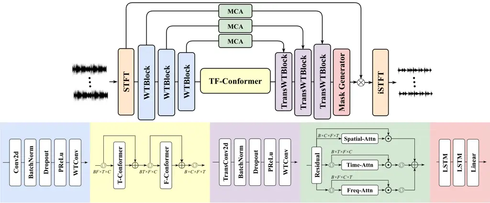
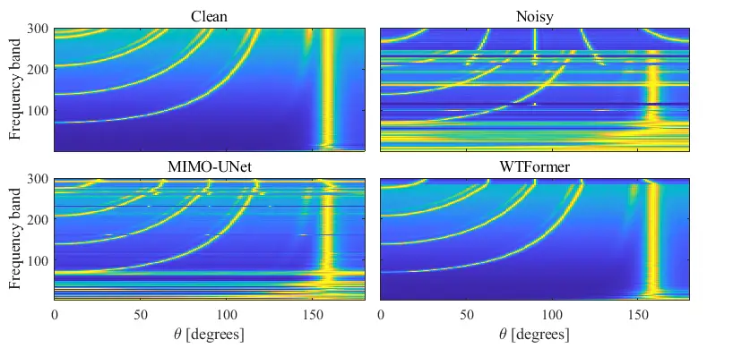

Han Zhao Peng BeijingChina BeijingChina GuildfordUK

# WTFormer: A Wavelet Conformer Network for MIMO Speech Enhancement with Spatial Cues PeservationThanks: ^(∗) Corresponding author

Lu Affiliation: Laboratory of Noise and Audio Research, Institute of
Acoustics, Chinese Academy of Sciences    Junqi Affiliation: University
of Chinese Academy of Sciences    Renhua Affiliation: Centre for Vision,
Speech and Signal Processing (CVSSP), University of Surrey

###### Abstract

Current multi-channel speech enhancement systems mainly adopt
single-output architecture, which face significant challenges in
preserving spatio-temporal signal integrity during multiple-input
multiple-output (MIMO) processing. To address this limitation, we
propose a novel neural network, termed WTFormer, for MIMO speech
enhancement that leverages the multi-resolution characteristics of
wavelet transform and multi-dimensional collaborative attention to
effectively capture globally distributed spatial features, while using
Conformer for time-frequency modeling. A multi task loss strategy
accompanying MUSIC algorithm is further proposed for optimization
training to protect spatial information to the greatest extent.
Experimental results on the LibriSpeech dataset show that WTFormer can
achieve comparable denoising performance to advanced systems while
preserving more spatial information with only 0.98M parameters.

###### keywords

multichannel speech enhancement, MIMO, spatial cues

^(†)^(†)email: {hanlu2023, pengrenhua}@mail.ioa.ac.cn,
junqi.zhao@surrey.ac.uk¹¹footnotetext: Corresponding author.

## 1 Introduction

Speech enhancement aims to recover clean target speech from noisy
mixtures. Traditional single-channel methods \[1, 2\] relied on signal
processing and statistical modeling. However, these algorithms suffer
great performance degradation in non stationary noise and low
signal-noise ration (SNR) scenarios. Multichannel beamforming algorithms
focus on exploiting the spatial properties based on microphone arrays to
suppress noise. Conventional beamforming, such as minimum variance
distortionless response (MVDR) \[3\] and generalized sidelobe cancelers
(GSC) \[4\], enhance signals through adaptive beamforming and noise
covariance matrix estimation. Nevertheless, their performance highly
depends on accurate direction-of-arrival (DOA) estimation and
assumptions regarding noise statistics.

The advent of deep learning has revolutionized speech enhancement
techniques \[5\]. Single-channel deep neural networks can significantly
improve speech quality and intelligibility by learning an end-to-end
mapping from noisy to clean spectra or by predicting time-frequency (TF)
masks. The integration of neural networks with multichannel signal
processing techniques has resulted in the development of hybrid
frameworks. These paradigms can be roughly classified into two main
categories. The first category involves mask-based neural beamformers,
which utilizes deep neural networks (DNNs) \[6, 7\] to predict TF-masks,
thereby improving covariance matrix estimation. Although these methods
can improve the generalization ability of traditional algorithms, they
are still limited by error propagation in cascaded systems. The second
category includes end-to-end neural networks or neural spatio-spectral
filters \[8, 9\] for implicit beamforming. This could theoretically
allow for better performance, but it may also cause greater distortion.

Among these frameworks, the MIMO neural network model can suppress the
unwanted noises while preserving spatial cues, making it well-suited for
pre-processing. However, preserving spatial cues with neural networks is
challenging due to the lack of a clear structural pattern in the phase
spectrum \[10\]. Nerual MIMO framework are often simply extended \[11,
12, 13, 14\] from single-channel configurations or used as the first
stage \[15, 16, 17\] in Multi-Input Single-Output (MISO) model.
Furthermore, current research on speech enhancement that preserves
spatial information mainly focused on binaural aspects \[11, 18\], with
an emphasis on human auditory perception. In contrast, most beamforming
algorithms are highly sensitive to phase, and rely on phase information
for DOA estimation. Multi-channel speech enhancement algorithms
employing microphone arrays face inherent challenges in maintaining
spatial fidelity while achieving noise suppression, particularly in
preserving interaural cues crucial for sound localization in MIMO
systems.

To address these coexisting requirements of MIMO architectures, we
propose WTFormer, a MIMO speech enhancement model combining wavelet
convolution and Conformer. This approach leverages the multi-resolution
properties of wavelet transform to expand the receptive field of the
encoder’s convolution kernel, enhancing the capture of global spatial
features. During the temporal modeling phase, we employ TF-Conformer,
which presents promising results in \[19\]. Additionally,
multi-dimensional collaborative attention (MCA) is utilized to better
integrate time, frequency, and spatial information. A loss function
based on the Multiple Signal Classification (MUSIC) algorithm, combined
with a multi-task loss strategy, is designed to minimize spatial
distortion during optimization. Evaluation on public dataset
LibriSpeech, using a model with a minimal number of parameters,
demonstrates comparable noise reduction performance to current
multi-channel speech enhancement models \[20\], while preserving more
spatial cues.



Figure 1: An overview of the proposed WTFormer architecture.Different
modules are remarked with different colors.

## 2 Signal Model and Problem Formulation

The signal recorded by a uniform linear M-channel microphone array can
be expressed in the short-time Fourier transform (STFT) domain as:

```math
\displaystyle\mathbf{Y}_{f,t}=\mathbf{S}_{f,t}+\mathbf{N}_{f,t}=H_{s}{S}_{f,t}+H_{n}{N}_{f,t}, \tag{1}
```

where$`\{\mathbf{Y}_{f,t},\mathbf{S}_{f,t},\mathbf{N}_{f,t}\}\in\mathbb{C}^{M}`$
denotes the reverberant-noisy mixture speech, target speech and noise
for $`\mathbf{M}`$ channels, with frequency index $`f\in\{1,\cdots,F\}`$
and time index $`t\in\{1,\cdots,T\}`$, respectively. $`H_{s}`$ and
$`H_{n}`$ denote multichannel relative transfer function (RTF)
representing speech and noise. $`{S}_{f,t}`$ and $`{N}_{f,t}`$ represent
speech and noise source signals. Using early-reverberation as learning
target is better than using direct-path and dry clean signal for noise
reduction \[21\], $`H_{s}{S}_{f,t}`$ can be further decomposed as:

```math
\displaystyle H_{s}{S}_{f,t}=\mathbf{S}_{f,t}^{early}+\mathbf{S}_{f,t}^{late}=H_{s}^{early}{S}_{f,t}+H_{s}^{late}{S}_{f,t}, \tag{2}
```

Where $`\mathbf{S}_{f,t}^{early}`$ is early-reverberation speech,
$`H_{s}^{early}`$represents the direct and early responses of the Room
Impulse Response (RIR), $`H_{s}^{late}`$ represents the late
reverberation of the RIR. Early-reverberation speech is set as the
target of model learning, and all other components are regarded as
noise. The proposed approach estimates the clean speech as follow:

```math
\displaystyle\hat{\mathbf{S}}_{t,f}^{early}\ =\mathcal{G}_{\Theta}(\mathbf{Y}_{t,f}), \tag{3}
```

where $`\mathcal{G}_{\Theta}`$ is the estimated MIMO complex masking
filters by our system. In theory, it is possible to retain all spatial
information and perform speech enhancement by learning a complex mask
for each channel.

## 3 Proposed WTFormer

### 3.1 System overview

The model takes multi-channel input in the form of time-frequency domain
representations of noisy speech signals. Initially, the time-domain
signal is processed using the short-time Fourier transform (STFT) to
extract time-frequency features. We adopt convolutional encoder-decoder
(CED) structure with skip connections, which has been proven effective
for speech enhancement. The encoder utilizes multiple layers of wavelet
transform convolution block to progressively capture information in both
the time and frequency domains. An intermediate TF-Conformer module is
employed for time-frequency processing, combining the advantages of
convolution and multi-head attention to efficiently extract and enhance
features. Instead of traditional skip connections, multiple parallel
multi-channel attention (MCA) modules are used. These spatial, temporal,
and frequency attention modules (Spatial-Attn, Time-Attn, and Freq-Attn)
work in parallel to enhance the representations compressed by the
encoder, capturing both local and global dependencies in the feature
space. This approach helps preserve important spatial information from
the microphone array. Finally, a simple multi-layer recurrent neural
network (RNN) predicts the mask and reconstructs the enhanced speech
signal, followed by the application of inverse STFT to obtain the clean
output.

### 3.2 Wavelet Convolutions Block

We introduce a wavelet transform-based waveform module (WTConv) \[22\]
to enhance the spatial information retention capability and
multi-frequency feature efficiency in multi-channel speech signal
processing. WTConv uses Haar wavelet basis to perform multi-level
stratification of the input signal to generate low-frequency
approximation (LL) and high-frequency detail reduction (LH, HL, HH).
This design not only captures long-term dependencies in speech signals
but also enhances the transient noise characteristics by applying
high-frequency gain, thereby improving the robustness of speech
enhancement algorithms in complex acoustic environments. Additionally,
the local temporal characteristics of wavelet transform preserve the
spatio-temporal structure of speech signals and prevent phase
distortion, which can occur in Fourier transforms during frequency
domain operations, thus preserving the spatio-temporal consistency of
multi-channel signals.

In the implementation, WTConv is integrated into the encoder-decoder
layers of a MIMO speech enhancement network, alternating with
traditional 2D convolution modules to expand the receptive field.
Specifically, each WTBlock consists of a Conv2d layer, followed by a
batch normalization layer, a dropout layer, a PReLU activation function,
and a WTConv. The TransWTBlock mirrors the WTBlock structure, replacing
the Conv2D with Transposed Conv2D.

### 3.3 TF-Conformer Block

Although the Conformer architecture \[23\] has demonstrated remarkable
success in speech recognition, it remains underexplored for speech
enhancement tasks. To effectively model both TF dependencies and spatial
characteristics in multi-channel speech enhancement, we employ the
TF-Conformer module, inspired by \[19\], as the intermediate processing
module for embedding. The module sequentially processes time-frequency
features through two cascaded conformer blocks, preserving spatial
correlations across channels, and adaptively fuses the enhanced features
with the original input via residual connections. This dual-scale
paradigm optimizes global temporal-frequency relationships and local
spatial correlations, offering a robust solution for beamforming-free
multi-channel speech enhancement systems.

Each Conformer module contains a half-step feed-forward networks (FFN),
a multi-head self-attention (MHSA) mechanism block, a Conv-block and
another FFN in sequence. The Conv-block architecture comprises: 1) layer
normalization followed by a gated linear unit (GLU)-activated point-wise
convolution, 2) a swish-activated 1D depthwise convolution layer, and 3)
a final point-wise convolution with dropout. All constituent sub-blocks
incorporate residual connections to maintain gradient flow and preserve
original signal fidelity.

### 3.4 MCA Block

In this paper, we proposes to use multidimensional collaborative
attention module (MCA) \[24\] to replace the traditional skip connection
structure. The MCA block utilizes a three-branch architecture that
models attention across the spatial, time, and frequency dimensions in
parallel, dynamically capturing global contextual dependencies of speech
features. Specifically, each branch operates on different dimensions of
the input features, combining global average and standard deviation
pooling information through a Squeeze Transformation to generate an
adaptive multidimensional feature descriptor. The Excitation
Transformation then applies a lightweight local interaction mechanism to
assign dynamic weights to features from different dimensions. Finally,
the outputs of the three attention branches are averaged and aggregated,
then fused with the original features via a sigmoid function to achieve
cross-dimensional collaborative enhancement. This module strengthens the
key time-frequency components and channel correlation of the speech
signal with extremely low computational overhead, while alleviating the
redundancy problem of information transmission in traditional skip
connections.

### 3.5 Mask Generator

The Mask Generator is a crucial component of the proposed model,
responsible for estimating the complex ideal ratio mask (cIRM) \[25\] to
enhance the noisy speech signals while preserving spatial information.
The whole consists of two layers of long short-term memory network
(LSTM) and one linear layer.

| Systems   | Para.(M) | PESQ$`\uparrow`$ | STOI$`\uparrow`$ | eSTOI$`\uparrow`$ | SI-SNR(dB)$`\uparrow`$ | $`\Delta`$ITD($`\mu`$s) $`\downarrow`$ | $`\Delta`$IPD(rad)$`\downarrow`$ | $`\Delta`$ILD(dB)$`\downarrow`$ |
| --------- | -------- | ---------------- | ---------------- | ----------------- | ---------------------- | -------------------------------------- | -------------------------------- | ------------------------------- |
| noisy     | \-       | 1.64             | 0.67             | 0.45              | -0.97                  | 285.22                                 | 0.86                             | 2.94                            |
| Ti-MVDR   | \-       | 2.48             | 0.86             | 0.73              | 7.54                   | \-                                     | \-                               | \-                              |
| MB-MVDR   | \-       | 2.53             | 0.88             | 0.79              | 8.21                   | \-                                     | \-                               | \-                              |
| MIMO-UNet | 1.96     | 2.14             | 0.80             | 0.71              | 6.78                   | 115.93                                 | 0.81                             | 0.89                            |
| EaBNet    | 2.84     | 2.99             | 0.92             | 0.84              | 10.55                  | 231.69                                 | 0.85                             | 1.43                            |
| WTFormer  | 0.98     | 3.02             | 0.92             | 0.84              | 10.31                  | 84.27                                  | 0.75                             | 0.73                            |

Table 2: Results comparison with advanced baselines.

## 4 Experiment

### 4.1 Dataset Preparation

We used the public speech dataset LibriSpeech and multi-channel RIR to
generate microphone-array signals for experiments. The uniform linear
array (ULA) with 4 cm space interval and eight elements was used. The
train-360 corpus was randomly split: 90% for training, 5% for
verification, and 5% for evaluation. The multi-channel RIR was generated
using the image method. The room’s length and width were set randomly
between 5–10 m, and the height between 3–4 m. The microphone array
center was randomly placed in the room, with at least 1 m from each
boundary. Then, randomly rotations are added to the array in the x-y-z
directions.

The speech source is placed 0.75–2 m from the array center, with at
least 0.5 m from each wall. Noise source locations are generated
similarly to the speech source. The SNR of training data ranges from -5
to 20 dB, while the test data ranges from -5 to 5 dB. The sampling rate
is 16 kHz, the speed of sound is 343 m/s, reverberation time is 0.3–0.7
s, and data is chunked into 4 seconds segments. Additionally, the
dynamic range of the audio is reduced within the range of \[0.2, 0.9\]
for all data. A total of 335,735 training samples, 48,651 validation
samples, and 48,652 test samples are obtained.

### 4.2 Expereimental settings

#### 4.2.1 Model Details

In the three-layer WTBlock of the encoder, the kernel size of Conv2d is
set as (6, 2) (7, 2) and (7, 2) with stride (2, 1) in the and frequency
time axes. All dropout rate is 0.2, and WTConv has a kernel size of 5
with a stride of 1. In the Conformer Block, the Conv kernel size is 31
and Multi-head attention uses four heads. The pooling type of MCA block
is selected as Average Pooling.

#### 4.2.2 Training Details

All the utterances are sampled at 16 kHz. The Hanning window is utilized
with 50% overlap between adjacent frames and the frame length is set as
20 ms. After STFT, the real and imaginary parts are obtained, which are
concatenated along the frequency dimension to obtain the time-frequency
representation $`\mathbf{Y}\in\mathbb{C}^{M\times 2F\times T}`$, where
$`M`$=8 is the number of array channels, $`F`$=161 is number of
frequency bins, and $`T`$=401 is the frame number. All the models are
trained with Adam optimizer \[26\], and the learning rate is initialized
at 4e-4 and will be halved if the loss does not decrease for consecutive
four epochs. The batch size is 16 and the number of epochs is 80.
Automatic mixed precision training \[27\] is utilized for efficient
training.

### 4.3 Loss function

From the perspective of loss function, we regard MIMO smpeech
enhancement with spatial cues preservation as a multi-task learning task
\[28\], optimizing both speech enhancement and spatial preservation.
Speech enhancement is prioritized with a higher weight, and two
learnable parameters, $`\sigma_{1}`$ and $`\sigma_{2}`$, dynamically
adjust this weight. The overall formula is as follows:

```math
\displaystyle\vskip-14.22636pt\mathcal{L}_{total}=\frac{10}{2\sigma_{1}^{2}}\mathcal{L}_{ns}+\frac{1}{2\sigma_{1}^{2}}\mathcal{L}_{ps}+\log(\sigma_{1}\sigma_{2}),\vskip-14.22636pt \tag{4}
```

where $`\mathcal{L}{ns}`$ represents the loss for noise suppression, and
$`\mathcal{L}{ps}`$ is the loss for preserving spatial cues. For noise
suppression, we use a loss function based on scale-invariant
signal-to-noise ratio (SI-SNR). SI-SNR Loss \[29\] has been shown to
have good performance in speech enhancement tasks. For spatial
information retention, we use the mean square error (MSE) of the MUSIC
spatial spectrum of the multi-channel signal before and after processing
as the loss function. MUSIC is used for estimating the DOA, which can
effectively capture and decode spatial cues. For wideband speech, we
divide it into 300 narrowband signals of frequency bands. After
calculating a sample of 4 seconds, a spatial spectrum of 300×181
dimensions is obtained. Minimizing the MSE of the MUSIC spatial spectrum
encourages the model to retain the spatial characteristics of the input
signal. This loss function balances speech enhancement and spatial
retention, ensuring the model preserves spatial cues while denoising.

### 4.4 Baseline systems

Four baseline approaches are selected: Ti-MVDR, MB-MVDR \[7\], MIMO-UNet
\[15\], and EaBNet \[20\]. The first two methods are traditional MISO
beamforming, assuming prior knowledge of target speech and noise,
followed by beamforming weight calculation. The last two approaches are
deep neural network based, where the filter-and-sum step is removed for
MIMO comparison. Performance was evaluated using four metrics: PESQ
\[30\], STOI, eSTOI \[31\], and SI-SNR \[32\], where higher values
indicate better performance. The preservation of spatial information is
evaluated using $`\Delta`$ITD, $`\Delta`$IPD, and $`\Delta`$ILD,
commonly used in binaural audio tasks, where smaller values indicate
better capability. We calculate the difference between microphones {1,
5} {2, 6} {3, 7} and {4, 8}, averaging the four groups after subtracting
the target value for evaluation.

## 5 Results and Discussion

### 5.1 Ablation Study

We conduct the ablation study on WTFormer as shown in Table 1, where
WTFormer-WT, WTFormer-MCA, WTFormer-$`\mathcal{L}_{ps}`$ indicate the
removal of the WTConv, MCA, and $`\mathcal{L}_{ps}`$ loss, respectively.
It can be seen that ablation of WTConv slightly degrades the
$`\Delta`$ITD, but greatly affects the PESQ scores. This implies that
WTConv improves the denoising performance through the large receptive
field provided by its wavelet transform, while playing a critical role
in preserving $`\Delta`$ITD information. It can also be seen that the
ablation of MCA degrades both the $`\Delta`$ITD and PESQ, which confirms
its irreplaceable role in capturing cross-channel dependencies. The
$`\mathcal{L}_{ps}`$ loss function ablation results show a significant
reduction in $`\Delta`$ILD and $`\Delta`$ITD, which validates the
effectiveness of $`\mathcal{L}_{ps}`$ loss in preserving spatial cues.

| Systems                       | PESQ$`\uparrow`$ | $`\Delta`$ ITD($`\mu`$s) $`\downarrow`$ | $`\Delta`$ ILD(dB)$`\downarrow`$ |
| ----------------------------- | ---------------- | --------------------------------------- | -------------------------------- |
| WTFormer-WT                   | 2.92             | 96.48                                   | 0.73                             |
| WTFormer-MCA                  | 2.95             | 102.15                                  | 0.75                             |
| WTFormer-$`\mathcal{L}_{ps}`$ | 3.02             | 104.39                                  | 0.82                             |
| WTFormer                      | 3.02             | 84.27                                   | 0.73                             |

Table 1: Ablation study results on the proposed WTFormer

### 5.2 Results Comparison with Advanced Baselines



Figure 2: Spatial spectrum calculated by MUSIC algorithm.

Table 2 compares the proposed WTFormer with advanced baselines in terms
of speech enhancement and spatial cues preservation metrics. The results
demonstrate WTFormer’s superiority in multiple aspects. WTFormer
achieves the highest PESQ score among all systems and is comparable to
EaBNet in terms of STOI (0.92) and eSTOI (0.84), with a slight SI-SNR
degradation. This suggests that WTFormer may perform poorly in
time-domain evaluation metrics, while being generally comparable to
EaBNet in speech enhancement performance. It should be pointed out that
WTFormer achieves this with only 0.98M parameters, which is
significantly fewer than EaBNet and MIMO-UNet, demonstrating its high
parameter efficiency.

WTFormer excels in spatial cues preservation, achieving optimal values
for all related indicators. WTFormer reduces $`\Delta`$ITD by 27.3% and
$`\Delta`$ILD by 18.0% compared to MIMO-UNet. This significant
improvement highlights WTFormer’s ability to preserve spatial
information while enhancing speech quality. It can be seen that
MIMO-UNet can achieve better spatial cues retention than that of EaBNet
at the expense of PESQ score degradation. In contrast, our hybrid
network WTFormer, achieves the best spatial retention without
sacrificing noise reduction by expanding the receptive field and using
multi-dimensional collaborative attention. Figure 2 shows the spatial
spectrum calculated using the MUSIC algorithm. Severe interference in
both high- and low-frequency bands compromises the accuracy of DOA
estimation in noisy signals. The spatial cues recovered by MIMO-UNet is
partially restored, but remains blurred in many low-frequency parts. The
spatial spectrum of WTFormer closely matches the clean speech,
indicating excellent preservation of spatial information. Only slight
distortion appears in the highest frequency band. This may be due to the
few speech components in this frequency band, allowing noise to
dominate.

## 6 Conclusions

This paper introduces WTFormer, a novel MIMO speech enhancement
framework that preserves spatial cues while achieving competitive noise
reduction. By integrating wavelet convolutions for multi-resolution
analysis, TF-Conformer blocks for time-frequency modeling, and
multidimensional collaborative attention for spatial dependency
learning, WTFormer maintains essential inter-channel phase and magnitude
relationships. The use of a MUSIC-based spectral loss further enhances
spatial fidelity. Experimental results show that WTFormer achieves
superior denoising with 0.98M parameters, outperforming baselines in
spatial cues preservation. Future work will explore more interpretable
causal models.

## References

- \[1\] S. Boll, “Suppression of acoustic noise in speech using spectral
  subtraction,” _IEEE Transactions on acoustics, speech, and signal
  processing_, vol. 27, no. 2, pp. 113–120, 1979.
- \[2\] C. Févotte, N. Bertin, and J.-L. Durrieu, “Nonnegative matrix
  factorization with the Itakura-Saito divergence: With application to
  music analysis,” _Neural computation_, vol. 21, no. 3, pp.
  793–830, 2009.
- \[3\] J. Capon, “High-resolution frequency-wavenumber spectrum
  analysis,” _Proceedings of the IEEE_, vol. 57, no. 8, pp.
  1408–1418, 1969.
- \[4\] L. Griffiths and C. Jim, “An alternative approach to linearly
  constrained adaptive beamforming,” _IEEE Transactions on antennas and
  propagation_, vol. 30, no. 1, pp. 27–34, 1982.
- \[5\] C. Zheng, H. Zhang, W. Liu, X. Luo, A. Li, X. Li, and B. C.
  Moore, “Sixty years of frequency-domain monaural speech enhancement:
  From traditional to deep learning methods,” _Trends in Hearing_,
  vol. 27, p. 23312165231209913, 2023.
- \[6\] J. Heymann, L. Drude, and R. Haeb-Umbach, “Neural network based
  spectral mask estimation for acoustic beamforming,” in _International
  Conference on Acoustics, Speech and Signal Processing (ICASSP)_. IEEE,
  2016, pp. 196–200.
- \[7\] H. Erdogan, J. R. Hershey, S. Watanabe, M. I. Mandel, and
  J. Le Roux, “Improved MVDR beamforming using single-channel mask
  prediction networks,” in _Interspeech_, 2016, pp. 1981–1985.
- \[8\] Y. Luo, C. Han, N. Mesgarani, E. Ceolini, and S.-C. Liu,
  “FaSNet: Low-latency adaptive beamforming for multi-microphone audio
  processing,” in _IEEE automatic speech recognition and understanding
  workshop (ASRU)_. IEEE, 2019, pp. 260–267.
- \[9\] K. Tan, Z.-Q. Wang, and D. Wang, “Neural spectrospatial
  filtering,” _IEEE/ACM Transactions on Audio, Speech, and Language
  Processing_, vol. 30, pp. 605–621, 2022.
- \[10\] N. Zheng and X.-L. Zhang, “Phase-aware speech enhancement based
  on deep neural networks,” _IEEE/ACM Transactions on Audio, Speech, and
  Language Processing_, vol. 27, no. 1, pp. 63–76, 2018.
- \[11\] C. Han, Y. Luo, and N. Mesgarani, “Real-time binaural speech
  separation with preserved spatial cues,” in _International Conference
  on Acoustics, Speech and Signal Processing (ICASSP)_. IEEE, 2020, pp.
  6404–6408.
- \[12\] J.-H. Kim, J. Choi, J. Son, G.-S. Kim, J. Park, and J.-H.
  Chang, “MIMO noise suppression preserving spatial cues for sound
  source localization in mobile robot,” in _International Symposium on
  Circuits and Systems (ISCAS)_. IEEE, 2021, pp. 1–5.
- \[13\] M. M. Halimeh and W. Kellermann, “Complex-valued spatial
  autoencoders for multichannel speech enhancement,” in _International
  Conference on Acoustics, Speech and Signal Processing (ICASSP)_. IEEE,
  2022, pp. 261–265.
- \[14\] R. Kimura, T. Nakatani, N. Kamo, D. Marc, S. Araki, T. Ueda,
  and S. Makino, “Diffusion model-based MIMO speech denoising and
  dereverberation,” in _International Conference on Acoustics, Speech,
  and Signal Processing Workshops (ICASSPW)_. IEEE, 2024, pp. 455–459.
- \[15\] X. Ren, X. Zhang, L. Chen, X. Zheng, C. Zhang, L. Guo, and
  B. Yu, “A Causal U-Net Based Neural Beamforming Network for Real-Time
  Multi-Channel Speech Enhancement,” in _Interspeech_, 2021, pp.
  1832–1836.
- \[16\] A. Pandey, B. Xu, A. Kumar, J. Donley, P. Calamia, and D. Wang,
  “TPARN: Triple-path attentive recurrent network for time-domain
  multichannel speech enhancement,” in _International Conference on
  Acoustics, Speech and Signal Processing (ICASSP)_. IEEE, 2022, pp.
  6497–6501.
- \[17\] Z.-Q. Wang, P. Wang, and D. Wang, “Multi-microphone complex
  spectral mapping for utterance-wise and continuous speech separation,”
  _IEEE/ACM transactions on audio, speech, and language processing_,
  vol. 29, pp. 2001–2014, 2021.
- \[18\] V. Tokala, E. Grinstein, M. Brookes, S. Doclo, J. Jensen, and
  P. A. Naylor, “Binaural Speech Enhancement Using Deep Complex
  Convolutional Transformer Networks,” in _International Conference on
  Acoustics, Speech and Signal Processing (ICASSP)_. IEEE, 2024, pp.
  681–685.
- \[19\] S. Abdulatif, R. Cao, and B. Yang, “Cmgan: Conformer-based
  metric-gan for monaural speech enhancement,” _IEEE/ACM Transactions on
  Audio, Speech, and Language Processing_, 2024.
- \[20\] A. Li, W. Liu, C. Zheng, and X. Li, “Embedding and beamforming:
  All-neural causal beamformer for multichannel speech enhancement,” in
  _International Conference on Acoustics, Speech and Signal Processing
  (ICASSP)_. IEEE, 2022, pp. 6487–6491.
- \[21\] H. Wang, A. Pandey, and D. Wang, “A systematic study of DNN
  based speech enhancement in reverberant and reverberant-noisy
  environments,” _Computer Speech & Language_, vol. 89, p. 101677, 2025.
- \[22\] S. E. Finder, R. Amoyal, E. Treister, and O. Freifeld, “Wavelet
  convolutions for large receptive fields,” in _European Conference on
  Computer Vision_. Springer, 2024, pp. 363–380.
- \[23\] A. Gulati, J. Qin, C.-C. Chiu, N. Parmar, Y. Zhang, J. Yu,
  W. Han, S. Wang, Z. Zhang, Y. Wu _et al._, “Conformer:
  Convolution-augmented transformer for speech recognition,” _arXiv
  preprint arXiv:2005.08100_, 2020.
- \[24\] Y. Yu, Y. Zhang, Z. Cheng, Z. Song, and C. Tang, “MCA:
  Multidimensional collaborative attention in deep convolutional neural
  networks for image recognition,” _Engineering Applications of
  Artificial Intelligence_, vol. 126, p. 107079, 2023.
- \[25\] D. S. Williamson, Y. Wang, and D. Wang, “Complex ratio masking
  for monaural speech separation,” _IEEE/ACM transactions on audio,
  speech, and language processing_, vol. 24, no. 3, pp. 483–492, 2015.
- \[26\] D. P. Kingma, “Adam: A method for stochastic optimization,”
  _arXiv preprint arXiv:1412.6980_, 2014.
- \[27\] P. Micikevicius, S. Narang, J. Alben, G. Diamos, E. Elsen,
  D. Garcia, B. Ginsburg, M. Houston, O. Kuchaiev, G. Venkatesh
  _et al._, “Mixed precision training,” _arXiv preprint
  arXiv:1710.03740_, 2017.
- \[28\] A. Kendall, Y. Gal, and R. Cipolla, “Multi-task learning using
  uncertainty to weigh losses for scene geometry and semantics,” in
  _Proceedings of the IEEE conference on computer vision and pattern
  recognition_, 2018, pp. 7482–7491.
- \[29\] Y. Isik, J. L. Roux, Z. Chen, S. Watanabe, and J. R. Hershey,
  “Single-channel multi-speaker separation using deep clustering,”
  _arXiv preprint arXiv:1607.02173_, 2016.
- \[30\] A. W. Rix, J. G. Beerends, M. P. Hollier, and A. P. Hekstra,
  “Perceptual evaluation of speech quality (PESQ)-a new method for
  speech quality assessment of telephone networks and codecs,” in
  _international conference on acoustics, speech, and signal processing
  (ICASSP)_, vol. 2. IEEE, 2001, pp. 749–752.
- \[31\] J. Jensen and C. H. Taal, “An algorithm for predicting the
  intelligibility of speech masked by modulated noise maskers,”
  _IEEE/ACM Transactions on Audio, Speech, and Language Processing_,
  vol. 24, no. 11, pp. 2009–2022, 2016.
- \[32\] J. Le Roux, S. Wisdom, H. Erdogan, and J. R. Hershey,
  “SDR–half-baked or well done?” in _International Conference on
  Acoustics, Speech and Signal Processing (ICASSP)_. IEEE, 2019, pp.
  626–630.
