# SUBARU: A Practical Approach to Power Saving in Hearables Using SUB-Nyquist Audio Resolution Upsampling

Tarikul Islam Tamiti    Sajid Fardin Dipto    Luke Benjamin
Baja-Ricketts    David C Vergano    Anomadarshi Barua    Department of
Cyber Security Engineering    George Mason University    USA

###### Abstract

Hearables are wearable computers that are worn on the ear. Bone
conduction microphones (BCMs) are used with air conduction microphones
(ACMs) in hearables as a supporting modality for multimodal speech
enhancement (SE) in noisy conditions. However, existing works don’t
consider the following practical aspects for low-power implementations
on hearables: (i) They do not explore how lowering the sampling
frequencies and bit resolutions in analog-to-digital converters (ADCs)
of hearables jointly impact low-power processing and multimodal SE in
terms of speech quality and intelligibility. And (iii) They don’t
process signals from ACMs/BCMs at a sub-Nyquist sampling rate because,
in their frameworks, they lack a wideband reconstruction methodology
from their narrowband parts. We propose SUBARU (Sub-Nyquist Audio
Resolution Upsampling), which achieves the following: SUBARU (i)
intentionally uses sub-Nyquist sampling and low bit resolution in ADCs,
achieving a 3.31x reduction in power consumption; and (ii) achieves
streaming operations on mobile platforms and SE in in-the-wild noisy
conditions with an inference time of 1.74ms and a memory footprint of
less than 13.77MB.

###### Index Terms:

hearables, sub-Nyquist sampling, low-power.

## I Introduction

A hearable device is a wearable computer that is worn on the ear.
Initially popularized through earbuds and headphones, the hearables
market has expanded into diverse applications, including health
monitoring, augmented reality, and voice assistance, with a projected
size of \$90 billion by 2030 \[1\].

Traditionally, air conduction microphones (ACMs) are used in hearables
that can easily pick up background noise, degrading speech quality.
Recently, bone conduction microphones (BCMs) and accelerometers are
proposed with ACMs as conditional signal enhancer for multimodal speech
enhancement (SE) in noisy conditions \[2, 3, 4\]. However, any SE
algorithms do not consider the following practical aspects of low-power
and low-memory applications in hearables:

- •
  Lowering sampling frequency and bit resolution: Analog audio or
  vibration signals from ACMs and BCMs, respectively, are first sampled
  and digitized at Nyquist rates (greater than 16 kHz) and over 12-bit
  resolutions by the analog-to-digital converter (ADC). After sampling,
  audio codecs compress data to reduce the bitrate, saving transmission
  energy and bandwidth. Later, multimodal SE algorithms are applied on
  the decompressed data on connected mobile platforms (i.e., cell
  phones, see Fig. 1). However, they do not explore how lowering the
  sampling frequency and bit resolutions in ADCs of hearables jointly
  impact low-power processing and multimodal SE.
- •
  Model complexity: State-of-the-art (SOTA) multimodal SE algorithms use
  generative adversarial networks (GANs) over U-Nets because of GANs’
  promising performance over U-Nets. However, GANs often exhibit high
  complexity with numerous associated parameters (on the order of
  hundreds of millions), thereby imposing significant constraints on
  efficiency in resource-constrained mobile platforms connected to
  hearables.

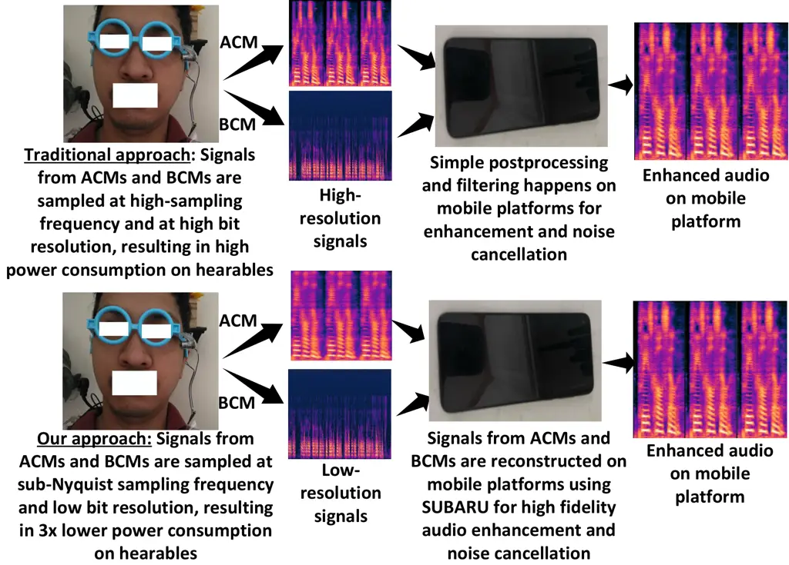

Fig. 1: We propose to use sub-Nyquist sampling and low bit resolution on
hearables in split architecture where audio will be reconstructed with
low latency and high fidelity on mobile platforms.

In this paper, we aim to enable multimodal SE that adapts effectively to
the unique low-power features by jointly reducing the sampling frequency
to the sub-Nyquist range with lower bit resolutions in hearables. We
name our methodology SUBARU (Sub-Nyquist Audio Resolution Upsampling).
SUBARU jointly leverages bandwidth extension (BWE) with multimodal SE to
recover missing high-frequency parts from the sub-Nyquist sampled and
lower bit-resolution audio in noisy conditions, restoring audio quality
and intelligibility (see Fig. 1). SUBARU has the following four key
design elements:

First, SUBARU is designed to be deployed in a split architecture, where
hearables only run sub-Nyquist sampling in low bit resolution on both
ACMs and BCMs, and mobile platforms connected to hearables only run the
joint BWE and multimodal SE algorithms to reconstruct the
high-resolution audio. The low latency of SUBARU while doing joint BWE
and multimodal SE enables streaming enhancement that makes SUBARU
deployable on mobile platforms.

Second, GANs can reconstruct better perceptual audio through adversarial
loss functions, and U-Nets generally have a lower memory footprint and
faster convergence while training. To get the best out of these two
domains, SUBARU adopts multi-scale and multi-period loss functions in
its U-Net architecture. SUBARU achieves similar perceptual quality to
GANs with smaller parameters (saving tens of millions) and stable
training, enabling efficient generation in mobile platforms.

Third, Waveform-based methods are performed at the sample-point level,
leading to a simpler architecture but relatively lower generation
efficiency when compared to spectrum-based methods with frame-level
operations. To get the benefits from both methods, SUBARU adopts a
hybrid architecture by merging both waveform-based and spectrum-based
methods, enabling joint training in both spectrum and raw waveform.

Fourth, As recent research \[5, 6\] highlights the importance of phase
reconstruction for improved perceptual quality, the joint training
feature of SUBARU in both spectrum and waveform domains enables the use
of instantaneous phase and group delay anti-wrapping losses to
reconstruct clean phases in noisy conditions. This also helps to provide
GAN-like perceptual quality in U-Net-based SUBARU, keeping the model
size small and efficient.

This paper implements SUBARU focusing on the above four design elements,
and extensive experiments are conducted to evaluate its performance in
real-time settings. The summary of the evaluations is written below:

- •
  SUBARU has been extensively evaluated against ten baselines. Five of
  them are GAN-based (i.e., SEANet, AERO, HiFi++, EBEN, and NVSR), one
  is diffusion-based (i.e., NU-Wave), and four are U-Net-based models
  (i.e., TFiLM, AFiLM, ATS-UNet, and VibVoice). SUBARU is evaluated
  using six evaluation metrics: LSD, VISQOL, NISQA-MOS, SI-SDR, PESQ,
  and STOI. The full form of the abbreviations is given in Section V-D.
- •
  By reducing the sampling frequency and bit resolution from {24 kHz,
  12-bit} to {4 kHz, 8-bit}, SUBARU achieves a 3.31x reduction in power
  consumption, ideally increasing the battery life by $`\sim`$3.31x for
  hearables.
- •
  SUBARU is evaluated on both speech and music datasets and is superior
  to the SOTA U-Net models. Moreover, SUBARU achieves better performance
  than SOTA GANs under noisy conditions with the lowest inference time
  (i.e., 1.74 ms on a desktop with GPUs). Specifically, SUBARU needs
  3.61x less inference time compared to HiFi++ and AERO (the two
  best-performing models). Thanks to the multi-scale and multi-period
  loss functions.
- •
  SUBARU has an inference time of 71 ms on a mobile platform (i.e.,
  Google Pixel7), which is smaller than the 150 ms threshold set by the
  International Telecommunication Union \[7\], indicating its capability
  of streaming operation from hearables to mobile platforms. The above
  results are further verified by using Samsung Galaxy S21.

## II RELATED WORK

As SUBARU can run both single-modal (i.e., ACM only) and multimodal
(i.e., ACM with accelerometer or BCMs) SE with variable noise, we divide
our discussion into two sections: (i) Bandwidth extension, and (iii)
Multimodal SE.

### II-A Low-power and low-memory BWE on hearables

BWE is an ideal fit for audio reconstruction from sub-Nyquist sampling.
Recently, neural networks become the SOTA solutions for BWE, ranging
from pure feedforward networks \[8, 9, 10, 9, 11, 12, 13, 14, 15, 16,
17, 8\] to generative solutions \[18, 19, 20, 21, 22\]. However, due to
the large memory and power requirements, most of them are not directly
suitable for hearables. To solve this problem, Li et al. proposed
ATS-UNet \[23\], which is built upon the TFiLM \[24\] backbone,
resulting in a smaller footprint by compromising the audio quality. To
improve audio quality, the model size needs to be increased. Therefore,
TRAMBA (IMWUT, 2025) \[2\] deploys BWE models not on hearables but on
mobile platforms, as mobile platforms have higher hardware capabilities
than hearables. TRAMBA is based on U-Net and achieves a smaller size
without sacrificing performance. However, TRAMBA has the following
limitations:

- •
  It operates on raw waveform and performs at the sample-point level,
  leading to relatively lower generation efficiency when compared to
  spectrum-based methods \[25\].
- •
  It does not consider clean phase reconstruction in noisy conditions
  while reconstructing high-resolution audio from a low-resolution
  signal.
- •
  Last and most importantly, TRAMBA and no other SOTA work consider the
  effect of different bit resolutions and quantization noise during
  sub-Nyquist sampling in their BWE algorithms (see Section III-B for
  details).

While recent GANs (i.e., SEANet \[3\], AERO \[25\], EBEN \[26\], NVSR
\[27\]) and diffusion-based BWE methods (i.e., \[28\], NU-Wave \[29\],
NU-Wave 2 \[13\]) have demonstrated promising performance, they still
require numerous time steps, a.k.a. latency, in the reverse process for
waveform reconstruction (on the order of hundreds of milliseconds) and
often exhibit high complexity with numerous associated parameters (on
the order of hundreds of millions), thereby imposing significant
constraints on generation efficiency in low-power and low-memory
resource-constrained systems like hearables. Moreover, they have not
been properly explored for joint BWE and multimodal SE in hearables for
noisy conditions.

### II-B Joint BWE and multimodal SE on hearables

BCMs are commonly used as an accessorial enhancer for ACMs. BCMs can
typically consist of two sensors: vibration sensors and accelerometers.
SEANet \[3\], a GAN model, uses accelerometers only for multimodal SE,
without resorting to explicit joint BWE with SE. HiFi++ \[30\], a GAN
framework, is proposed for joint BWE and SE of ACMs, but has not been
adapted to the multimodal domain (i.e., works with audio signal only).
ClearSpeech \[31\] leverages the different acoustic properties captured
by in-ear and out-ear microphones to enhance ACM’s signals, but does not
consider BWE, hence, it does not work at the sub-Nyquist sampling rate.
EarSpeech \[32\] enhances airborne speech by analyzing the cross-channel
correlation between in-ear and airborne signals. VibVoice \[33\] employs
bone-conducted vibrations, showing potential for environments with heavy
background noise.

All the above models have either one or multiple of the following
limitations for which they are not suitable for our low-power hearables:
(i) The joint BWE and SE models are typically evaluated for single
modality (i.e., audio only) and have not been extended to multimodality.
(ii) The multimodal SE models use narrowband signals from BCMs (i.e.,
sampling frequency 4 kHz or greater) and full wideband (i.e., sampling
frequency 16 kHz or greater) audio signals from ACMs. Therefore, they
cannot handle audio signals at a sub-Nyquist sampling rate because of
the absence of the BWE algorithm in their frameworks. And, (iii) These
methods are not designed to be deployed on split architecture, where
hearables run only sub-Nyquist sampling in both ACMs and BCMs, and
mobile platforms run the BWE and multimodal SE algorithms. A summary of
limitations is shown in Table I. We address all these limitations in our
proposed SUBARU (see Section VI).

|                    |              |     |                 |               |
| ------------------ | ------------ | --- | --------------- | ------------- |
| Model name         | Architecture | BWE | Single-modal SE | Multimodal SE |
| ATS-UNet \[23\]    | U-Net        | ✓   | ✓               | ✗             |
| TFiLM \[24\]       | U-Net        | ✓   | ✓               | ✗             |
| AFiLM \[34\]       | U-Net        | ✓   | ✓               | ✗             |
| TRAMBA \[2\]       | U-Net        | ✓   | ✓               | ✗             |
| ClearSpeech \[31\] | U-Net        | ✗   | ✗               | ✓             |
| VibVoice \[33\]    | U-Net        | ✗   | ✗               | ✓             |
| SEANet \[3\]       | GAN          | ✗   | ✓               | ✓             |
| AERO \[25\]        | GAN          | ✓   | ✓               | ✗             |
| EBEN \[26\]        | GAN          | ✓   | ✓               | ✗             |
| HiFi++ \[30\]      | GAN          | ✓   | ✓               | ✗             |
| NVSR \[27\]        | U-NET + GAN  | ✓   | ✓               | ✗             |
| NU-Wave \[29\]     | Diffusion    | ✓   | ✓               | ✗             |
| Proposed SUBARU    | U-Net        | ✓   | ✓               | ✓             |

TABLE I: A summary of limitations.

Please note that a 4-page version of this manuscript has been submitted
to Interspeech 2026, which is currently under review and is attached as
a supporting document with this manuscript. This manuscript has the
following improvements:

i) We add a new Time Enhancement Network (see Section IV-C) and an
additional Multi-resolution STFT loss (see Section IV-E) to improve the
performance of our framework. We achieve better LSD (0.84 vs 0.87),
VISQL (4.35 vs 4.15), NISQA-MOS (4.19 vs 4.13), SI-SDR (17.94 vs 16.99),
with similar PESQ (3 vs 2.99) and STOI (0.90 vs 0.90).

ii) We use ten different models as baselines for comparison in this
manuscript, compared to only six baselines in the 4-page version (see
Section V-E).

iii) We show a detailed comparison of how Mamba improves efficiency
compared to Transformers in Sections IV-A & IV-C.

iv) In this manuscript, as the collected data amount for ACM, BCM pair
is not sufficient, we create a synthetic dataset for better training
using six different SEANet models for three different bit resolutions of
12, 10, and 8 bits (see Section V-B).

v) We show a detailed breakdown of our model by size, parameters, and
inference time in Section IV-F.

vi) This manuscript shows how SUBARU does streaming operation
frame-by-frame in Section IV-G.

vii) This manuscript shows a detailed evaluation separately on speech
enhancement and bandwidth extension (see Sections VI-D and VI-A), which
are not present in the 4-page version.

viii) This manuscript shows a detailed evaluation separately only on
different sub-Nyquist sampling with music dataset (see Sections VI-E),
which is not present in the 4-page version.

ix) This manuscript shows a detailed evaluation on live noise data
inside and outside of the lab in bus-ride, classroom, and car ride
scenarios (see Section VI-J), which is not present in the 4-page
version.

## III PRELIMINARY

### III-A Power at sub-Nyquist frequencies and bit resolutions

The power consumption of ADCs in hearables increases with higher
sampling rates and resolutions, following $`P=k\cdot f_{s}\cdot 2^{N}`$,
where $`P`$ is the consumed power, $`k`$ is a proportionality constant,
$`N`$ is the bit resolution, and $`f_{s}`$ is the sampling frequency of
ADCs. Traditional methods require ADCs to operate at high sampling
frequencies (i.e., $`>`$16 kHz) and bit resolution (i.e., 12-24 bits) to
accurately capture wideband audio in hearables. However, lowering
sampling frequencies and bit resolution offers a powerful approach to
reducing energy consumption in low-power applications like hearables.

To support this claim, we conduct experiments with an ACM (i.e., part
$`\#`$ B&K Type 4192 \[35\]) and an in-built ADC of NRF52840 \[36\]. We
get a relative power savings of 2.45x between {16 kHz, 12-bits} vs {4
kHz, 8 bits} computations.

Please note that sub-Nyquist sampling and low-resolution bits in ADCs
will reduce the audio quality in hearables. Therefore, our proposed
SUBARU implements joint BWE and multimodal SE in mobile platforms (i.e.,
cell phones) to recover audio at high resolution. The increase in power
consumption on mobile platforms to run additional BWE and SE algorithms
is negligible, as SOTA mobile platforms typically have 100x or more
battery capacity compared to hearables (i.e., Samsung Galaxy Buds2 Pro
has a 50 mAh battery compared to a 5000 mAh battery in Samsung Galaxy
S24 Ultra). An explanation of power performance on both hearables and
mobile platforms is discussed in Section VI-C.

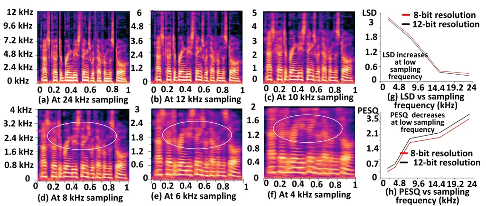

Fig. 2: A 48 kHz sampled reference signal is down sampled at (a) 24 kHz,
(b) 12 kHz, (c) 10 kHz, (d) 8 kHz, (e) 6 kHz, and (f) 4 kHz. (g) The LSD
increases and (h) PESQ decreases from higher to lower sampling
frequencies. (g and h) The 8-bit audio has less quality than 12-bit
audio in terms of PESQ and LSD. The circle marks indicate that
downsampling reduces signal quality.

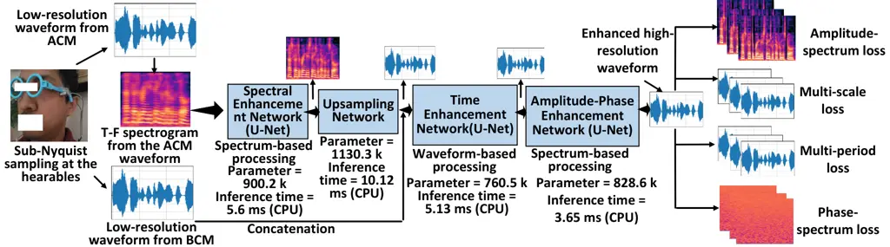

Fig. 3: Overview of the SUBARU architecture.

### III-B Audio at sub-Nyquist frequencies and bit resolutions

To gain an understanding of how the bit resolutions and sub-Nyquist
sampling frequencies impact the audio quality in hearables, we conduct
several pilot studies. Fig. 2 presents time-frequency (T-F) spectrograms
of 1s speech signals while a volunteer speaks wearing hearables at $`N`$
= {12-bit, 8-bit} resolutions for different sampling frequencies,
$`f_{s}`$ = {24 kHz, 12 kHz, 10 kHz, 8 kHz, 6 kHz, 4 kHz}. Fig. 2
indicates that with the decrease of the sampling frequency, the higher
frequency components (a.k.a. formants) of audio are deprecated,
resulting in lower sound quality (i.e., lower Perceptual Evaluation of
Speech Quality (PESQ) and higher Log Spectral Distance (LSD)). Moreover,
the lower bit resolution increases the quantization noise, resulting in
lower audio quality. Therefore, the lower bit resolution of $`N`$ = 8
bits provides lower quality audio compared to the 12-bit resolution.
SUBARU considers the impact of the low bit resolution in BWE algorithms
that is absent in SOTA research.

## IV SUBARU ARCHITECTURE DESIGN

SUBARU is engineered to achieve the following objectives:

- •
  SUBARU will handle dynamic interferences from extremely noisy
  conditions in mobile scenarios using joint BWE and multimodal SE
  algorithms.
- •
  SUBARU will process input audio signals in both the spectrum and
  waveform domains and enhance both the amplitude and phase of the
  time-frequency (T-F) spectrum to output high-quality speech signals
  from sub-Nyquist sampled data (i.e., low-resolution audio).
- •
  SUBARU will enable streaming enhancement and low-power and low-memory
  solutions that will make SUBARU deployable on mobile platforms.

SUBARU adopts a U-Net-based model, which is explained below. Figure 3
illustrates the general framework of SUBARU.

### IV-A Spectral enhancement network

The spectral enhancement network (SEN) is the initial part of SUBARU
that takes the spectrogram of the low-resolution and noisy audio from
ACMs as inputs (see Fig. 3 and 4). The network also works as the initial
stage of converting the spectrogram into a waveform.

The network architecture (see Fig. 4) consists of a 2D convolution
framework in U-Net, featuring 5 residual layers as encoders (Enc), 5
residual layers as decoders (Dec), and a Mamba \[37\] block as a
bottleneck layer. The details of each layer are outlined in Table II.
Each residual layer incorporates batch normalization followed by leaky
ReLU activations. Dilations are used to increase the receptive fields
that help to capture local features over a dilated window, resulting in
capturing inter-phoneme dependencies in audio signals.

|             |      |      |      |      |      |      |      |      |      |      |                   |
| ----------- | ---- | ---- | ---- | ---- | ---- | ---- | ---- | ---- | ---- | ---- | ----------------- |
| Layer       | Enc1 | Enc2 | Enc3 | Enc4 | Enc5 | Dec1 | Dec2 | Dec3 | Dec4 | Dec5 | Bottleneck        |
| Kernels     | 8    | 16   | 24   | 32   | 64   | 64   | 32   | 24   | 16   | 8    |                   |
| Kernel size | 4x4  | 4x4  | 4x4  | 4x4  | 4x4  | 4x4  | 4x4  | 4x4  | 4x4  | 4x4  |                   |
| Dilation    | 1    | 1    | 2    | 3    | 5    |      |      |      |      |      |                   |
| Mamba       |      |      |      |      |      |      |      |      |      |      | Param$`\#`$ 16384 |
| Transformer |      |      |      |      |      |      |      |      |      |      | Param$`\#`$ 49152 |

TABLE II: The details of the spectral enhancement network.

Mamba in the bottleneck layer captures the global correlation among
consecutive phonemes from the spectrogram. Since Mamba is a specific
sequence modeling architecture (originally for 1D sequences), we need to
adapt it to work in the 2D bottleneck context. This can be done by
flattening the spatial dimensions (H, W) into a sequence, applying
Mamba, and then reshaping back. The Mamba is chosen over Transformers
\[38\] because Mamba requires one-third less parameters than
Transformers (i.e., 16384 vs 49152) for the same embedding dimension
(64) and sequence length (16 x 16) in our design (see Table II).

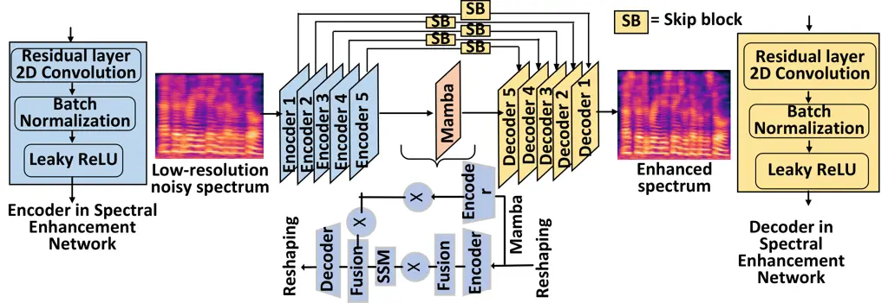

Fig. 4: SEN enhances noisy spectrograms for waveform-based processing.

### IV-B Upsampling network

The upsampling network is inspired by version 2 of HiFi-GAN \[39\],
which takes the enriched spectrogram representation from the spectrum
enhancement network as input and gives a raw waveform at its output. The
input spectrogram for the upsampling network is a $`\sim`$1 second audio
clip. Let’s say, if the target sampling frequency is 16 kHz, the 1s clip
will have 16000 samples. The hop size is 256 for the spectrogram. This
means that there are 16000/256 $`\approx`$ 62 frames in the
spectrograms. Therefore, the upsampling network needs to generate 16000
samples from 62 frames, which means the upsampling network needs
$`\sim`$256x upsampling.

Fig. 5 shows the upsampling network in detail. Each upsampling layer is
a transposed convolution, where the kernel size is twice the stride. A
stack of transposed convolutional layers is used to upsample the input
sequence to 256x. The 256x upsampling is done in 4 stages: 8x, 8x, 2x,
and 2x upsampling. Each transposed convolutional layer is followed by a
residual layer. Each of the residual layers has three dilated
convolutions with dilation 1, 3, and 9, with kernel size 3, having a
total receptive field of 27 timesteps. The receptive field of a stack of
dilated convolution layers increases exponentially with the number of
layers. This effectively implies a larger overlap in the induced
receptive field of far-apart time-steps, leading to better long-range
correlation. Leaky ReLU activation is used in each residual layer after
each dilated convolution.

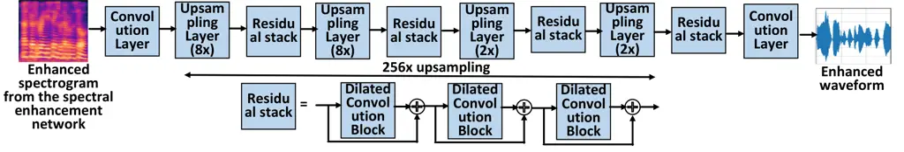

Fig. 5: The upsampling network has a 256 upsampling ratio, which is done
in 4 stages: 8x, 8x, 2x, and 2x upsampling.

### IV-C Time enhancement network

The time enhancement network (see Fig. 6) is designed to fuse features
from both the acoustic (i.e., ACM) and vibration (i.e., BCM) modalities.
As signals from BCMs are less noisy compared to the signals from ACMs,
the enhanced signals of ACMs from the spectrum enhancement network are
further improved using the less noisy signal of BCMs by the time
enhancement network.

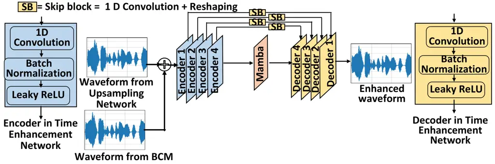

Fig. 6: The time enhancement network is designed to fuse features from
both the acoustic (i.e., ACM) and vibration (i.e., BCM) modalities.

The time enhancement network is inspired by the well-known Wave-U-Net
architecture \[40\], which is a fully convolutional 1D-UNet-like neural
network. This network consists of a 1D convolution framework in U-Net,
featuring 4 full 1D convolution layers as encoders, 4 full 1D
convolution layers as decoders, and a Mamba \[37\] block as a bottleneck
layer (see Table III for details). Each 1D convolution layer
incorporates batch normalization followed by leaky ReLU activations.

|             |      |      |      |      |      |      |      |      |                   |
| ----------- | ---- | ---- | ---- | ---- | ---- | ---- | ---- | ---- | ----------------- |
| Layer       | Enc1 | Enc2 | Enc3 | Enc4 | Dec1 | Dec2 | Dec3 | Dec4 | Bottleneck        |
| Kernels     | 10   | 20   | 40   | 80   | 80   | 40   | 20   | 10   |                   |
| Kernel size | 4x4  | 4x4  | 4x4  | 4x4  | 4x4  | 4x4  | 4x4  | 4x4  |                   |
| Dilation    | 1    | 2    | 3    | 5    |      |      |      |      |                   |
| Mamba       |      |      |      |      |      |      |      |      | Param$`\#`$ 25864 |
| Transformer |      |      |      |      |      |      |      |      | Param$`\#`$ 76895 |

TABLE III: The details of the convolution layers in the time enhancement
network. Here, Enc = encoder and Dec = decoder.

Since Mamba is a specific sequence modeling architecture originally for
1D sequences and the encoders/decoders process 1D sequences, we don’t
need to reshape Mamba. We compare Mamba with Transformers for the same
embedding dimension = 80 and sequence length = 16 x 16 in our time
enhancement network (see Table III). It shows that a roughly one-third
reduction in parameter count happens for Mamba over Transformers (i.e.,
25864 vs 76895).

### IV-D Amplitude-phase enhancement network

The purpose of this module is to remove artifacts and noise in both the
amplitude and phase domains from the output waveform in a learnable way.
This module helps to generate a clean phase from the noisy phase for the
successful reconstruction of audio signals in extremely noisy conditions
(i.e., when both the ACMs and BCMs are noisy).

The network is shown in Fig. 7. The waveform from the time enhancement
network is first subjected to a short-time Fourier transformation (STFT)
that gives an amplitude spectrum $`X_{a}\in\mathbb{R}^{T\times F}`$ and
a wrapped phase spectrum $`X_{p}\in\mathbb{R}^{T\times F}`$, where T =
125 and F = 513 denote the number of temporal frames and frequency bins,
respectively. The amplitude $`X_{a}`$ and phase $`X_{p}`$ streams
utilize an identical network of a series of 1D convolution operations
with mutual coupling between the two streams. The 1D convolution
operations contain a cascade of a large-kernel-sized depth-wise
convolutional layer and a pair of point-wise convolutional layers that
respectively expand and restore feature dimensions. The depth-wise (DW)
convolution is implemented using the Conv1D operation, and the
point-wise convolution is implemented using linear layers (see Table IV
for details). Layer normalization \[41\] and Gaussian error linear unit
(GELU) activation \[42\] are interleaved between the layers. Finally,
the residual connection is added before the output to prevent the
gradient from vanishing.

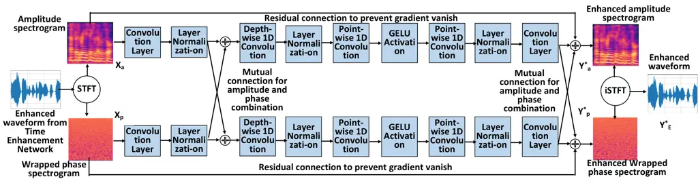

Fig. 7: The amplitude-phase enhancement network helps to generate a
clean phase from the noisy phase for successful reconstruction of audio
signals in noisy conditions (i.e., when both the ACMs and BCMs are
noisy).

The enhanced amplitude spectrum $`Y^{*}_{a}`$ and wrapped phase spectrum
$`Y^{*}_{p}`$ are used together at the end of the amplitude-phase
enhancement network to generate the enhanced waveform $`Y^{*}_{E}`$
using inverse STFT (iSTFT) as follows,
$`Y^{*}_{E}=iSTFT(Y^{*}_{a}\cdot{\rm e}^{jY^{*}_{p}})`$.

|             |        |          |
| ----------- | ------ | -------- |
| Layer       | Conv1D | DWConv1D |
| Kernels     | 512    | 512      |
| Kernel size | 7x1    | 7x1      |
| Dilation    | 1      | 1        |
| Padding     | 1      | 3        |

TABLE IV: The details of the amplitude-phase enhancement network.

### IV-E Loss Functions

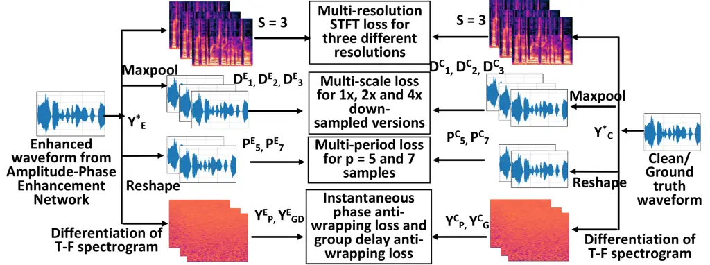

Fig. 8: The multi-scale and multi-period loss functions in SUBARU.

Multi-scale loss function: Inspired by MelGAN \[43\], SUBARU uses a
multi-scale loss function shown in Fig. 8. For that, SUBARU generates
three down-sampled audio $`D^{E}_{1},D^{E}_{2},`$ and $`D^{E}_{3}`$
using three max-pooling layers from the enhanced waveform $`Y^{*}_{E}`$
with 1x, 2x, and 4x downsampling ratio. Parallelly, SUBARU generates
three down-sampled audio $`D^{C}_{1},D^{C}_{2},`$ and $`D^{C}_{3}`$
using three similar max-pooling layers from the clean/ground-truth
waveform $`Y^{*}_{C}`$. Next, SUBARU calculates the mean absolute error
(MAE) expressed by Eqn. 1.

```math
\displaystyle\text{Multi-scale loss}=\frac{1}{3\times N}\sum^{N}|D^{C}_{1}-D^{E}_{1}|+|D^{C}_{2}-D^{E}_{2}|+|D^{C}_{3}-D^{E}_{3}| \tag{1}
```

Multi-period loss function: Initially, SUBARU reshapes the enhanced
waveform $`Y^{*}_{E}`$ (the output of the amplitude-phase enhancement
network) from a 1D waveform into a 2D representation by segmenting it
based on a specific period (p) of 5 and 7 samples. After reshaping, the
dimension of the 2D tensor is (1, T / p, p), where T = number of audio
samples and p = periods. Let us denote these two 2D tensors generated
for p = 5 and 7 samples from the enhanced waveform $`Y^{*}_{E}`$ by
$`P^{E}_{5}`$ and $`P^{E}_{7}`$, respectively. Similarly, SUBARU
generates two 2D tensors for p = 5 and 7 from the clean/ground-truth
waveform $`Y^{*}_{C}`$ and let us denote them by $`P^{C}_{5}`$ and
$`P^{C}_{7}`$, respectively. SUBARU calculates the MAE energy loss
between clean and enhanced audio at each period for 2D tensors (see Eqn.
2).

```math
\displaystyle\text{Multi-period loss}=|\sum_{x,y}P^{C}_{5}-\sum_{x,y}P^{E}_{5}|+|\sum_{x,y}P^{C}_{7}-\sum_{x,y}P^{E}_{7}| \tag{2}
```

SUBARU uses only 2 periods (i.e., p = 5 and 7) compared to 5 periods and
6 convolution layers in \[39\] to keep the network size small without
sacrificing audio quality.

Phase-spectrum loss function: To reconstruct the clean phase when the
BCMs are noisy, SUBARU includes a phase-spectrum loss function to
enhance audio quality. Inspired by \[44\] and considering the phase
wrapping issue, SUBARU proposes to use two anti-wrapping losses: one for
the instantaneous phase and one for group delay. These two anti-wrapping
losses use MAE loss as shown in Eq. 3.

```math
\displaystyle\text{Instantaneous phase anti-wrapping loss}=\frac{1}{TF}\sum^{TF}|f_{AW}(Y^{C}_{P}-Y^{E}_{P})| \tag{3}
```

```math
\displaystyle\text{Group-delay anti-wrapping loss}=\frac{1}{TF}\sum^{TF}|f_{AW}(Y^{C}_{GD}-Y^{E}_{GD})|
```

Where $`Y^{C}_{P}`$ and $`Y^{C}_{GD}`$ are the instantaneous phase and
group delay for the clean/ground-truth wave $`Y^{*}_{C}`$, respectively.
The $`Y^{E}_{P}`$ and $`Y^{E}_{GD}`$ are the instantaneous phase and
group delay for enhanced wave $`Y^{*}_{E}`$, respectively. The group
delay $`Y^{C}_{GD}`$ and $`Y^{E}_{GD}`$ are calculated by taking
differentiation along the frequency axis of the T-F spectrogram. The
$`f_{AW}(x)`$ denotes the anti-wrapping function, which is defined as:
$`f_{AW}(x)=|x-2\pi\cdot\text{round}(\frac{x}{2\pi})|,x\in\mathbb{R}`$.

Multi-resolution STFT loss: To improve the frequency content of the
enhanced wave $`Y^{*}_{E}`$, SUBARU calculates the multi-resolution STFT
loss \[45\] at S = 3 resolutions, such as {frequency bins, hop sizes,
window lengths} = {(256, 128, 256), (512, 256, 512), (1024, 512, 1024)},
following Eq. 4.

```math
\displaystyle\vskip-4.09723pt\text{Multi-resolution STFT loss}=\frac{1}{S}\sum_{s=1}^{S}\Big(L_{\mathrm{SC}}+L_{\mathrm{mag}}\Big) \tag{4}
```

Where, spectral convergence loss $`L_{SC}`$ \[45\] and log STFT
magnitude loss $`L_{mag}`$ \[45\] are calculated for S= 3 resolutions.

Total loss: The total loss is the summation of multi-scale,
multi-period, phase-spectrum, and multi-resolution STFT losses. The
multi-scale and multi-period losses are time-domain loss functions.
Therefore, SUBARU employs training in all three domains: time, phase,
and frequency.

### IV-F Breakdown by size, parameters, and inference time

To facilitate the understanding of SUBARU for real-time streaming
operations, we provide a breakdown of SUBARU by size, parameters,
inference time, and floating-point operations (FLOPs) in Table V.
Inference time is measured on an NVIDIA 4090 GPU, an Intel(R) Xeon(R)
Silver 4310 CPU (2.10 GHz), and Google Pixel7 for an audio frame of 1s.

|                      |           |          |                               |         |
| -------------------- | --------- | -------- | ----------------------------- | ------- |
| Network breakdown    | Parameter | Size     | Inference(GPU/CPU/Pixel7)     | FLOPs   |
| Spectrum enhancement | 900.2 k   | 3.42 MB  | 0.41 ms / 5.6 ms / 16.5 ms    | 3.15 G  |
| Upsampling           | 1130.3 k  | 4.30 MB  | 0.68 ms / 10.12 ms / 27.5 ms  | 3.95 G  |
| Time enhancement     | 760.5 k   | 2.89 MB  | 0.38 ms / 5.13 ms / 15.3 ms   | 2.66 G  |
| Amplitude-phase      | 828.6 k   | 3.15 MB  | 0.27 ms / 3.65 ms / 10.92 ms  | 2.90 G  |
| Total                | 3.61 M    | 13.77 MB | 1.74 ms / 24.54 ms / 70.41 ms | 12.67 G |

TABLE V: Breakdown by size, parameters, and inference time.

### IV-G Streaming operation of SUBARU

The low-resolution audio sampled at the sub-Nyquist frequency in
hearables is transmitted over Bluetooth to the mobile platform for BWE
and multimodal SE. The low-resolution audio transmitted from the
hearables are received by the mobile platforms frame by frame. For
real-time streaming applications, the inference time of each frame must
be less than the frame duration. From Table V, it is clear that SUBARU’s
inference time for both GPUs, CPUs, and Pixel7 is much shorter (i.e.,
1.74 ms/24.54 ms/70.41 ms) than the frame duration of 1s. Therefore,
SUBARU is suitable for streaming audio from hearables to mobile
platforms.

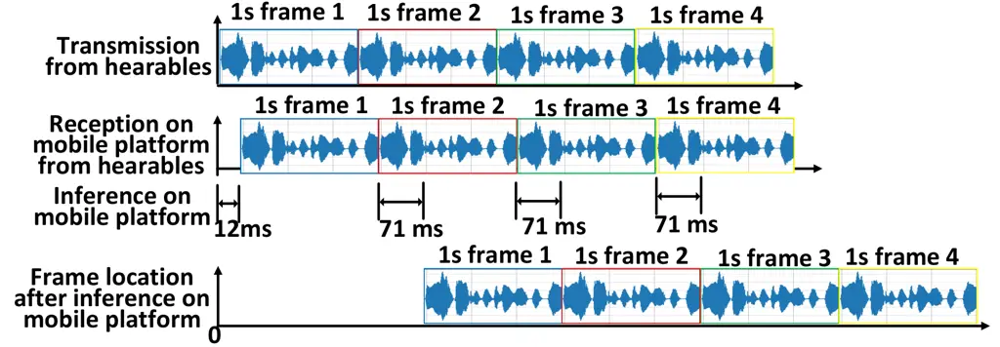

Fig. 9: The frame-by-frame real-time streaming operation of SUBARU.

In Fig. 9, at t = 0, the clock starts and the low-resolution audio from
hearables starts to be transmitted to the mobile platform (i.e., Google
Pixel7). We use the NRF52840 chip with the Bluetooth sniffer to emulate
the streaming operation of SUBARU. At t = 12 ms, low-resolution audio
packets are received and unpacked on the mobile platform. Next, SUBARU
starts audio reconstruction and takes around 71 ms to finish the
reconstruction. Therefore, there is a 12 + 71 = 83 ms latency for each
1s audio frame for the end-to-end BWE + SE operation from hearables to
mobile platforms. Please note that the 71 ms delay is for the actual
model inference, and the 12 ms delay within the 83 ms total latency is
not related to SUBARU, but rather related to the time required for audio
frame packing, transmission, reception, and unpacking. Moreover, similar
latency exists in all the commercial hearables, such as Apple AirPods
Pro (1st & 2nd Gen) has a latency of $`\sim`$120 ms \[46\], and Samsung
Galaxy Buds Pro has a latency of $`\sim`$60 ms \[47\]. For real-world
audio communication, one-way delays up to 150 ms are considered
acceptable for most user applications, including voice calls, according
to the recommendation of the International Telecommunication Union (ITU)
G.114 \[7\]. Please also note that, as the inference time is shorter
than 1s frame duration, the frames are always streaming in real-time.

## V IMPLEMENTATION

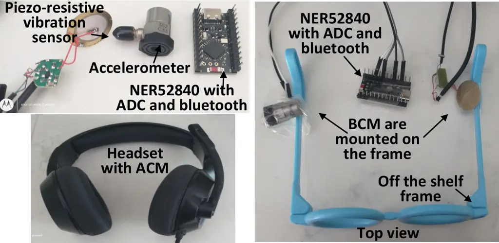

Fig. 10: A prototype of hearable. An off-the-shelf vibration sensor and
an accelerometer are used as BCMs. Built-in ADC from NRF52840 samples
signals from ACMs and BCMs at different Nyquist sampling frequencies and
low-bit resolutions.

### V-A Wearable platform and mobile platform design

We use two analog sensors for BCMs to prove and verify the strength of
SUBARU: one is a piezo-resistive vibration sensor (part# CEB-27032-L100)
\[48\] and another one is an accelerometer (part# 352C33) \[49\]. The
vibration sensor and the accelerometer are attached with an
off-the-shelf plastic frame for collecting vibration near the earbone
(see Fig. 10). As both are analog sensors, the analog output from these
two sensors is sampled and transmitted by the NRF52840 chip over
Bluetooth to a mobile platform. We use the built-in ADC from the
NRF52840 chip to sample the analog signals from the BCMs and transmit
over Bluetooth to a mobile platform. This helps us to control the
sampling frequencies from the sub-Nyquist to Nyquist range and ADC bit
resolution (8 to 12 bits) while sampling from BCMs. We vary the sampling
frequency from 4 kHz to 22 kHz for BCMs and also for ACMs. We use an
off-the-shelf microphone from NUbwo as an ACM.

As our low-resolution audio sampled from BCMs will go through joint BWE
and multimodal SE in a mobile platform, we use two devices as mobile
platforms to compare performance: one is a computer with a 4090 GPU with
Intel(R) Xeon(R) Silver 4310 CPU, and another one is a Google Pixel7
having Google Tensor G2 chipset and Mali-G710 MP7 GPUs.

### V-B Dataset collection

We collect an in-house dataset with our ACMs and BCMs mounted near the
ear bone. Although there are a few datasets \[50, 4\] available for
multimodal SE, those datasets use only one BCM. Therefore, they don’t
have simultaneous data from both vibration and accelerometer sensors
with microphones at different ADC bit resolutions and at different noisy
conditions. Therefore, we ask 20 persons (11 males and 9 females) with
consent for data collection from the ACM and the two BCMs simultaneously
at a 22 kHz sampling frequency. We select text from the VCTK dataset
\[51\], which contains a variety of dialogues. For this purpose, we
convert the VCTK audio to text using Whisper \[52\]. We apply a
high-pass filter with a cut-off frequency of 15 Hz to remove any body
movement from the collected data. The data is then normalized and
clipped within -1 to +1. We collect data from each person for 10 minutes
in a quiet room (no noise) for 3 different bit resolutions - 12, 10, and
8 bits - for the two different BCMs.

As the collected data amount for {ACM, BCM} pair is not sufficient, we
create a synthetic dataset for better model training. To do this, we
first need to model the two BCMs (vibration sensor and accelerometers)
for three different bit resolutions of 12, 10, and 8 bits. We choose
SEANet \[3\] for this purpose. We train six different SEANet models for
six different input-target pairs using our in-house data, shown in Table
VI. Then, we use the six trained SEANets to generate synthetic data for
six {ACM, BCM} pairs by feeding samples from the VCTK dataset.

|                  |                       |                                    |
| ---------------- | --------------------- | ---------------------------------- |
| Name             | Input in-house data   | Target in-house data               |
| $`SEANet_{12V}`$ | 12-bit audio from ACM | 12-bit audio from vibration sensor |
| $`SEANet_{8V}`$  | 8 bit audio from ACM  | 8 bit audio from vibration sensor  |
| $`SEANet_{10V}`$ | 10 bit audio from ACM | 10 bit audio from vibration sensor |
| $`SEANet_{12A}`$ | 12-bit audio from ACM | 12-bit audio from accelerometer    |
| $`SEANet_{8A}`$  | 8 bit audio from ACM  | 8 bit audio from accelerometer     |
| $`SEANet_{10A}`$ | 10 bit audio from ACM | 10 bit audio from accelerometer    |

TABLE VI: Modeling both BCMs - vibration and accelerometer for
generating synthetic data.

Two noise sources are used: non-speech noise and speech noise. For
non-speech noises, we choose from a diverse set of noise types from
\[53\] and randomly mix with the clean audio from the ACM. For speech
noises, we employ speech samples from Librispeech from different
speakers.

### V-C Model training

The training is carried out in an end-to-end fashion. The noisy audio
from the ACM for 12, 10 and 8-bit resolutions is given together as input
to the model in the time domain. The signals from either of the BCMs are
also given as an input in the time domain. For training our proposed
SUBARU, all the audio clips underwent silence trimming and were sliced
into $`\sim 1s`$ clips. Since the synthetic data inevitably slightly
differs from the real data, incorporating all the synthetic data
together into a batch may degrade the model performance. To prevent the
model from degrading during the training phase, we use an equal
proportion of real and synthetic data in the initial training epochs. As
training advances, the ratio of synthetic data is progressively reduced,
eventually transitioning to batches comprised solely of real data.

The key training parameters include a batch size of 8 with $`\sim`$50
epochs, and the Adam optimizer with a learning rate of
$`1\times 10^{-4}`$, weight decay of $`1\times 10^{-5}`$, and momentum
parameters $`\beta_{1}=0.5`$ and $`\beta_{2}=0.999`$. The learning rate
is scheduled using cosine annealing warm restarts (with $`T_{0}=10`$ and
$`T_{\text{mult}}=1`$), gradient clipping (max norm of 10), and gradient
accumulation (over 2 batches) to ensure stability. Training is first
executed on a computer with a 4090 GPU with Intel(R) Xeon(R) Silver 4310
CPU. The trained model is then customized to run on a Google Pixel7
smartphone for inference (see Section VI).

### V-D Evaluation metrics

To comprehensively evaluate in terms of intelligibility, fidelity, and
perceived quality, we use Log-Spectral Distance (LSD), Short-Time
Objective Intelligibility (STOI), Perceptual Evaluation of Speech
Quality (PESQ), Scale-Invariant Signal-to-Distortion Ratio (SI-SDR),
Non-Intrusive Speech Quality Assessment - Mean Opinion Score
(NISQA-MOS), and Virtual Speech Quality Objective Listener (VISQOL).

### V-E Base models

We compare ten base models from Table I with our proposed SUBARU. Four
(ATS-UNet, TFiLM, AFiLM, VibVoice) of the models are pure U-Net based,
four (SEANet, AERO, EBEN, HiFi++) are pure GAN based, one (NU-Wave) is a
diffusion probabilistic model, and one (NVSR) has U-Net with GAN
vocoder. We cannot compare with TRAMBA as it does not have open-source
code available.

## VI Performance evaluation

This section evaluates the performance of SUBARU on two different
platforms: desktop and Google Pixel7 smartphone. The details of both
platforms are explained in Section V-A.

Preparing to evaluate on Google Pixel7: We can evaluate the model on the
desktop platform in a straightforward manner. However, to evaluate the
model on the Google Pixel7, we need to do some extra steps. The training
is first done in PyTorch on the desktop following Sections V-B, and V-C.
The trained model in PyTorch is then exported to the ONNX model and then
converted to TensorFlow Lite (TFLite) via ONNX-TensorFlow \[54\] on the
desktop. Then the TFLite model is integrated into the TensorFlow Lite
Android API. Then we run the TFLite model using TFLite GPU Delegate on
the Google Pixel7 for inference. The TFLite GPU Delegate is used to
utilize the Pixel’s Mali GPU for faster inference.

### VI-A Evaluation for speech enhancement with inference time

We select four SOTA GAN models (SEANet, AERO, HiFi++, and EBEN) and two
U-Net models (VibVoice, TFiLM), for speech enhancement evaluation.
Please note that VibVoice and SEANet are by default multimodal SE
models, whereas TFiLM, AERO, EBEN, and HiFi++ are single-modal speech
enhancement models. To compare our model with the single-modal SE
models, we convert our multimodal SUBARU into a single-modal model by
making it a single-input network (i.e., we don’t feed the BCM signal to
the time enhancement network). We name the single-modal version of
SUBARU as SUBARU-single. We train all multimodal models using noisy
audio from both ACMs and BCMs, and all single-modal models using noisy
audio from the ACM only. To diversify the evaluation, we also introduce
a music dataset MagnaTagATune \[55\]. The results are shown in Table VII
for 4-16 kHz BWE with noisy data having noise in between -7 to 5 dB with
12-bit ADC resolution for the vibration sensor on the desktop only.

Table VII indicates that SUBARU is superior to the SOTA U-Net models for
both the speech and music datasets. Moreover, SUBARU achieves better
performance with the lowest inference time (i.e., 1.74 ms) compared to
the high-resource GAN models in noisy conditions. Specifically, SUBARU
needs 3.61x less inference time compared to HiFi++ and 20.68x less than
AERO (i.e., the two best-performing models). This indicates that SUBARU
achieves better joint BWE and SE under noisy conditions without
sacrificing the perceptual quality and intelligibility of the audio
compared to the GAN counterpart.

Please note that SUBARU is the smallest model with 20x fewer parameters
than HiFi++ GAN and 10x fewer parameters than AERO. The parameter number
of the GAN models includes both the generators and discriminators.

|                 |       |           |           |         |             |                  |                |                |                |                |                 |
| --------------- | ----- | --------- | --------- | ------- | ----------- | ---------------- | -------------- | -------------- | -------------- | -------------- | --------------- |
| Model           | Type  | Param (M) | Size (MB) | Dataset | Infer. (ms) | L $`\downarrow`$ | V $`\uparrow`$ | N $`\uparrow`$ | S $`\uparrow`$ | P $`\uparrow`$ | ST $`\uparrow`$ |
| Unprocessed     |       |           |           | VCTK    |             | 2.78             | 1.84           | 1.27           | 8.54           | 1.11           | 0.79            |
|                 |       |           |           | Magna   |             | 2.85             | 1.62           | 1.21           | 7.28           | 1.03           | 0.78            |
| TFiLM \[24\]    | U-Net | 68.2      | 260.3     | VCTK    | 4.85        | 1.68             | 3.73           | 3.53           | 10.28          | 2.03           | 0.81            |
|                 |       |           |           | Magna   | 4.85        | 1.70             | 3.67           | 3.46           | 9.41           | 1.99           | 0.81            |
| VibVoice \[33\] | U-Net | 23.14     | 5.8       | VCTK    | 17.2        | 3.1              | 2.73           | 2.51           | 12.48          | 2.05           | 0.81            |
|                 |       |           |           | Magna   | 17.2        | 3.28             | 2.66           | 2.43           | 11.21          | 2.01           | 0.80            |
| AERO \[25\]     | GAN   | 36.3      | 138.7     | VCTK    | 36          | 0.97             | 4.16           | 4.03           | 17.03          | 2.93           | 0.89            |
|                 |       |           |           | Magna   | 36          | 0.99             | 4.10           | 3.98           | 16.29          | 2.89           | 0.88            |
| EBEN \[26\]     | GAN   | 29.7      | 113.3     | VCTK    | 12.7        | 1.15             | 3.78           | 3.65           | 14.23          | 2.57           | 0.84            |
|                 |       |           |           | Magna   | 12.7        | 1.17             | 3.76           | 3.63           | 13.13          | 2.54           | 0.88            |
| HiFi++ \[30\]   | GAN   | 72.2      | 259.92    | VCTK    | 6.3         | 0.89             | 4.18           | 4.11           | 17.48          | 2.85           | 0.90            |
|                 |       |           |           | Magna   | 6.3         | 0.91             | 4.13           | 4.07           | 16.65          | 2.83           | 0.89            |
| SEANet \[3\]    | GAN   | 64.9      | 240.13    | VCTK    | 9.18        | 1.39             | 3.89           | 3.78           | 14.31          | 2.43           | 0.89            |
|                 |       |           |           | Magna   | 9.18        | 1.44             | 3.79           | 3.67           | 13.74          | 2.40           | 0.87            |
| SUBARU          | U-Net | 3.61      | 13.77     | VCTK    | 1.74        | 0.84             | 4.35           | 4.19           | 17.94          | 3.00           | 0.90            |
|                 |       |           |           | Magna   | 1.74        | 0.86             | 4.27           | 4.11           | 16.71          | 2.95           | 0.90            |
| SUBARU-         | U-Net | 3.61      | 13.77     | VCTK    | 1.74        | 0.86             | 4.19           | 4.17           | 17.49          | 2.97           | 0.90            |
| single          |       |           |           | Magna   | 1.74        | 0.87             | 4.14           | 4.09           | 16.71          | 2.95           | 0.90            |

TABLE VII: Evaluating SE for 12-bit resolutions on the desktop for 4 -
16 kHz upsampling with noisy data for the vibration sensor. Here, L =
LSD, V = VISQOL, N = NISQA-MOS, S = SI-SDR, P = PESQ, ST = STOI, Param =
Parameter and Infer. = Inference.

|                |         |        |                  |               |               |               |               |                |                 |               |               |               |               |                |
| -------------- | ------- | ------ | ---------------- | ------------- | ------------- | ------------- | ------------- | -------------- | --------------- | ------------- | ------------- | ------------- | ------------- | -------------- |
| Model          | Device  | Infer. | Vibration sensor |               |               |               |               |                | Accelerometer   |               |               |               |               |                |
|                |         | (ms)   | L$`\downarrow`$  | V$`\uparrow`$ | N$`\uparrow`$ | S$`\uparrow`$ | P$`\uparrow`$ | ST$`\uparrow`$ | L$`\downarrow`$ | V$`\uparrow`$ | N$`\uparrow`$ | S$`\uparrow`$ | P$`\uparrow`$ | ST$`\uparrow`$ |
| Unprocessed    | Desktop |        | 2.78             | 1.84          | 1.27          | 8.54          | 1.11          | 0.71           | 2.95            | 1.57          | 1.01          | 7.68          | 1.03          | 0.69           |
|                | Pixel7  |        | 2.79             | 1.83          | 1.26          | 8.52          | 1.10          | 0.70           | 2.96            | 1.56          | 1.00          | 7.65          | 1.02          | 0.69           |
| TFiLM\[24\]    | Desktop | 4.85   | 1.68             | 3.73          | 3.53          | 10.28         | 2.03          | 0.81           | 1.82            | 3.47          | 3.36          | 9.58          | 1.91          | 0.79           |
| (U-Net)        | Pixel7  | 198    | 1.69             | 3.70          | 3.50          | 10.19         | 2.00          | 0.81           | 1.83            | 3.45          | 3.34          | 9.52          | 1.88          | 0.79           |
| VibVoice\[33\] | Desktop | 17.2   | 3.1              | 2.73          | 2.51          | 12.48         | 2.05          | 0.81           | 3.5             | 2.54          | 2.41          | 11.43         | 1.93          | 0.80           |
| (U-Net)        | Pixel7  | 707    | 3.11             | 2.70          | 2.47          | 12.45         | 2.01          | 0.80           | 3.48            | 2.51          | 2.38          | 11.39         | 1.90          | 0.79           |
| AERO\[25\]     | Desktop | 36     | 0.97             | 4.16          | 4.03          | 17.03         | 2.93          | 0.89           | 1.03            | 4.04          | 3.91          | 16.65         | 3.86          | 0.90           |
| (GAN)          | Pixel7  | 1441   | 0.98             | 4.14          | 4.01          | 16.97         | 2.89          | 0.88           | 1.05            | 4.01          | 3.89          | 16.57         | 3.84          | 0.90           |
| EBEN\[26\]     | Desktop | 12.7   | 1.15             | 3.78          | 3.65          | 14.23         | 2.57          | 0.84           | 1.21            | 3.58          | 3.37          | 13.27         | 2.39          | 0.83           |
| (GAN)          | Pixel7  | 520    | 1.17             | 3.76          | 3.63          | 14.19         | 2.56          | 0.84           | 1.22            | 3.54          | 3.33          | 13.21         | 2.35          | 0.83           |
| HiFi++\[30\]   | Desktop | 6.3    | 0.89             | 4.18          | 4.11          | 17.48         | 2.85          | 0.90           | 0.92            | 4.10          | 4.03          | 16.87         | 2.81          | 0.90           |
| (GAN)          | Pixel7  | 258    | 0.91             | 4.15          | 4.09          | 17.43         | 2.83          | 0.90           | 0.94            | 4.07          | 3.98          | 16.71         | 2.78          | 0.90           |
| SEANet\[3\]    | Desktop | 9.18   | 1.39             | 3.89          | 3.78          | 14.31         | 2.43          | 0.89           | 1.51            | 3.67          | 3.42          | 13.24         | 2.31          | 0.87           |
| (GAN)          | Pixel7  | 380    | 1.40             | 3.85          | 3.75          | 14.24         | 2.40          | 0.88           | 1.52            | 3.62          | 3.40          | 13.18         | 2.28          | 0.87           |
| SUBARU         | Desktop | 1.74   | 0.84             | 4.35          | 4.19          | 17.94         | 3.00          | 0.90           | 0.87            | 4.28          | 4.14          | 17.05         | 2.95          | 0.89           |
|                | Pixel7  | 70.41  | 0.85             | 4.31          | 4.15          | 17.71         | 2.97          | 0.90           | 0.87            | 4.25          | 4.11          | 16.78         | 2.91          | 0.89           |
| SUBARU-        | Desktop | 1.74   | 0.86             | 4.19          | 4.17          | 17.49         | 2.97          | 0.90           | 0.89            | 4.15          | 4.10          | 16.97         | 2.92          | 0.89           |
| single         | Pixel7  | 70.41  | 0.86             | 4.14          | 4.14          | 17.31         | 2.95          | 0.90           | 0.90            | 4.11          | 4.05          | 16.58         | 2.87          | 0.89           |

TABLE VIII: Evaluating SE for 12-bit resolutions on the desktop and
Google Pixel7 platforms for 4 - 16 kHz upsampling with noisy data for
both the vibration sensor and the accelerometer.

We further compare our SUBARU for accelerometers on Google Pixel7, and
the results are shown in Table VIII. To maintain simplicity, we only
consider the VCTK dataset. Table VIII indicates that the vibration
sensor provides better results than the accelerometer at hand. The
possible reason may be that the accelerometer is noisier than the
vibration sensors.

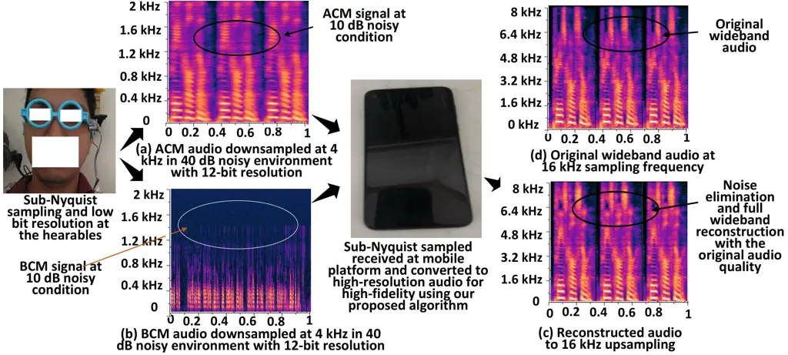

Fig. 11: Demonstration of full wideband reconstructed audio from the
sub-Nyquist sampled and low-resolution audio at noisy conditions for
4-16 kHz. The reconstructed audio is close to the original audio in
terms of all metrics.

### VI-B Evaluation of real-time processing on desktop and Pixel7

We evaluate SUBARU on both desktop and Google Pixel7 platforms for a
better understanding of the real-time behavior of SUBARU, which is
critical for streaming operation of sound from the hearables. The
results are summarized in Table VIII. We keep the model quantization the
same for both desktop and Pixel7 while evaluating the inference time.
All the models in Table VIII are suitable for real-time operation on the
desktop platform, as the inference time is lower than the audio frame
(1s). Moreover, for the streaming operation in audio communication,
one-way delays up to 150 ms are considered acceptable for most user
applications, including voice calls, according to the recommendation of
the International Telecommunication Union (ITU) G.114 \[7\]. Therefore,
all the models in Table VIII except SUBARU are not suitable for
streaming operation on the Pixel7 platform as they have an inference
time higher than 150 ms. In contrast, our proposed SUBARU has inference
time smaller than 150 ms on both desktop and Pixel7, indicating its
capability of streaming operation on both desktop and smartphone
platforms.

|                    |                   |                   |                    |
| ------------------ | ----------------- | ----------------- | ------------------ |
| Sampling Rate (Hz) | Resolution (bits) | Current draw (µA) | Power (mW) @ 3.0 V |
| 4 kHz              | 8-bit             | 234               | 0.702              |
|                    | 10-bit            | 248               | 0.744              |
|                    | 12-bit            | 275               | 0.825              |
| 8 kHz              | 8-bit             | 319               | 0.957              |
|                    | 10-bit            | 338               | 1.014              |
|                    | 12-bit            | 375               | 1.125              |
| 16 kHz             | 8-bit             | 489               | 1 467              |
|                    | 10-bit            | 518               | 1 554              |
|                    | 12-bit            | 575               | 1 725              |
| 24 kHz             | 8-bit             | 659               | 1.977              |
|                    | 10-bit            | 698               | 2.094              |
|                    | 12-bit            | 775               | 2.325              |

TABLE IX: NRF52840 ADC-only power consumption at different sampling
rates and resolutions.

### VI-C Evaluation of power consumption

This work aims to reduce the sampling frequency of hearables so that
hearables can save power, which will eventually extend the battery life.
However, reducing the sampling frequency reduces the audio quality.
Therefore, the mobile platform, such as a smartphone, will use SUBARU to
recover high-fidelity audio from the low-resolution signal received from
hearables, restoring audio quality and intelligibility. Sections VI-A,
VI-B, VI-D, VI-E evaluate the performance of SUBARU to recover
high-fidelity audio in different noisy conditions at different sampling
frequencies for real-time streaming operation. However, this section
will evaluate how much power savings could be possible if we reduce the
sampling frequency and bit resolutions at the ADC of the hearables and
how much power will be additionally required to run SUBARU on mobile
platforms, such as smartphones.

Our wearable platform chip NRF52840 has a built-in ADC peripheral, which
has a variable sampling frequency up to $`\sim`$200 ksps and a variable
bit resolution up to 12 bits. We vary the sampling frequency from 4 kHz
to 24 kHz for 8-bit, 10-bit, and 12-bit resolutions and measure power
for each combination. The results are summarized in Table IX. These
figures are typical averages under continuous sampling at 3.0 V and
assume a single channel with EasyDMA enabled.

To calculate the power consumption in NRF52840’s ADC, we first run a
workload on NRF52840 that does not have any ADC operations. We call this
baseline power. Later, we run the same workload with ADC operations for
different sampling frequencies and bit resolutions. Next, we roughly
estimate the power consumption by the ADC by subtracting the baseline
power from the power found at different sampling frequencies and bit
resolutions.

Table IX indicates that if we use {4 kHz, 8-bit} sampling instead of {24
kHz, 12-bit} sampling in hearables, we can save 2.325/0.702 = 3.31x
power in hearables. That means that we can increase the battery life by
$`\sim`$3.31x for hearables. Therefore, the idea is that SUBARU will
reduce the sampling frequency and bit-resolutions in hearables from {24
kHz, 12-bit} or {16 kHz, 12-bit} to {4 kHz, 8-bit} to save power in
hearables. Later, SUBARU will restore the low-resolution audio from {4
kHz, 8-bit} to {24 kHz, 12-bit} or {16 kHz, 12-bit} on mobile platforms
to provide the same audio quality.

|                   |                       |                                             |               |
| ----------------- | --------------------- | ------------------------------------------- | ------------- |
| Transmission rate | Power for SUBARU only | Power for different transmission rates only | Total power   |
| 64 kbps           | 1.143 W               | 3.54 mW                                     | 1.146 W       |
| 128 kbps          | 1.151 W               | 4.18 mW                                     | 1.155 W       |
| 256 kbps          | 1.187 W               | 5.98 mW                                     | 1.193 W       |
|                   |                       |                                             | Avg. = 1.16 W |

TABLE X: Power consumption in Google Pixel7 at different transmission
rates to run SUBARU.

The next question is how much power is required to restore the audio by
SUBARU on mobile platforms. We evaluate SUBARU on Google Pixel7 for
different transmission rates from hearables to Pixel7 (see Table X). The
second column in Table X indicates the rough estimate of power
consumption to run only the SUBARU model on Pixel7, and the 3rd column
is the power consumption related only to the reception of packets from
the hearables. The power related to only SUBARU increases slightly with
the transmission rates because higher transmission rates mean more
computation for the time-frequency spectrograms and raw waveforms. The
average power consumption of $`\sim`$1.16 W for running SUBARU on
smartphones, such as Pixel7, is trivial compared to the 3.31x increase
of power saving in hearables. Because typically smartphones have a 100x
larger battery compared to hearables. For example, Samsung Galaxy Buds2
Pro has a 50 mAh battery, and Pixel7 has a 4355 mAh battery. The 1.16 W
of power consumption by SUBARU would take around 14 hours to drain the
4355 mAh battery of Pixel7.

### VI-D Evaluation for only BWE with inference time

As our SUBARU can do both the BWE and multimodal SE jointly, here, we
compare SUBARU with only SOTA BWE models separately for a better
understanding of SUBARU’s performance at this task. To evaluate the
performance for only on the BWE task, we convert SUBARU to only the BWE
network by making it a single-input network (i.e., audio from the ACM
only). In other words, we feed nothing as a BCM signal to the time
enhancement network. We use non-noisy VCTK \[51\] audio from ACMs to
evaluate only the BWE task. Three U-Net-based models, three GAN-based
models, one diffusion-based model, and one U-Net + GAN-based model are
chosen for comparison. The comparison is shown for desktop and Google
Pixel7 in Table XI for 4 kHz to 16 kHz BWE task focusing on the
inference time for each model.

|                 |                   |                        |                      |                      |                      |                      |
| --------------- | ----------------- | ---------------------- | -------------------- | -------------------- | -------------------- | -------------------- |
| Model           | Infer. (ms) (D/G) | L $`\downarrow`$ (D/G) | V $`\uparrow`$ (D/G) | N $`\uparrow`$ (D/G) | S $`\uparrow`$ (D/G) | P $`\uparrow`$ (D/G) |
| Unprocessed     |                   | 2.75/2.79              | 1.92/1.90            | 1.41/1.38            | 9.95/9.89            | 1.23/1.20            |
| TFiLM \[24\]    | 4.85/198.87       | 1.65/1.67              | 3.81/3.80            | 3.65/3.63            | 12.58/12.51          | 2.14/2.11            |
| AFiLM\[34\]     | 5.72/235.52       | 1.63/1.66              | 3.82/3.79            | 3.68/3.64            | 12.23/12.17          | 2.12/2.11            |
| ATS-UNet \[34\] | 3.79/159.18       | 1.72/1.74              | 3.62/3.59            | 3.41/3.38            | 10.41/10.35          | 1.65/1.64            |
| AERO \[25\]     | 36/1441.48        | 0.95/0.96              | 4.21/4.19            | 4.12/4.09            | 18.15/18.10          | 2.98/2.96            |
| EBEN \[26\]     | 12.7/520.73       | 1.13/1.16              | 3.93/3.91            | 3.98/3.96            | 16.51/16.23          | 2.85/2.82            |
| HiFi++ \[30\]   | 6.3/258.31        | 0.85/0.87              | 4.26/4.23            | 4.21/4.17            | 18.13/18.08          | 2.90/2.88            |
| NVSR \[27\]     | 54/2268.57        | 0.95/0.98              | 4.11/4.10            | 4.08/4.05            | 17.14/17.11          | 2.64/2.62            |
| NU-Wave \[29\]  | 71/2911.23        | 1.42/1.44              | 3.89/3.85            | 2.35/2.31            | 13.23/13.16          | 2.01/1.99            |
| SUBARU          | 1.74/70.41        | 0.82/0.84              | 4.22/4.19            | 4.19/4.13            | 18.11/18.07          | 3.01/2.99            |

TABLE XI: Evaluating BWE for 4 - 16 kHz upsampling for 12-bit
resolutions for both desktop and Google Pixel7 platforms. Here, D =
Desktop, G = Google Pixel7

Despite being a U-Net-based model, SUBARU achieves the lowest LSD
compared to all GANs, which is an indication that higher-frequency
components are reconstructed in a better way by SUBARU. However, HiFi++
provides slightly better VISQOL and NISQA-MOS, and AERO provides
slightly better SI-SDR compared to SUBARU. However, the difference
between SUBARU and GANs is minimal for VISQOL, NISQA-MOS, and SI-SDR.
Moreover, SUBARU outperforms all GANs in terms of PESQ and STOI. This is
an indication that SUBARU achieves BWE without sacrificing perceptual
quality and intelligibility of the audio.

Please note that every model has a slight performance degradation in
Google Pixel7 compared to the desktop due to hardware differences,
driver differences between CUDA and ONNX modules, and audio frontend
mismatches between the desktop and Pixel7. Despite performance
degradation, SUBARU is still best for LSD with the smallest inference
time compared to the best-performing GAN-based models.

### VI-E Evaluation for only BWE with different sub-Nyquist sampling with music

Section VI-D only considers the evaluation of BWE for 4 kHz to 16 kHz
upsampling. However, here, we vary the sampling in different scales,
such as 4 kHz to 22 kHz and 8 kHz to 22 kHz, to compare SUBARU’s
performance on two different datasets: the VCTK \[51\] (speech data) and
MagnaTagATune \[55\] (music data). The reason for introducing the music
dataset is that music has dominant high-frequency components compared to
speech, and we want to evaluate SUBARU for high upsampling ratios for
both speech and music audio. The detailed comparison is shown in Table
XII.

|               |         |                 |               |               |               |               |                |                 |               |               |               |               |                |
| ------------- | ------- | --------------- | ------------- | ------------- | ------------- | ------------- | -------------- | --------------- | ------------- | ------------- | ------------- | ------------- | -------------- |
| Model         | Dataset | 4 to 22 kHz     |               |               |               |               |                | 8 to 22 kHz     |               |               |               |               |                |
|               |         | L$`\downarrow`$ | V$`\uparrow`$ | N$`\uparrow`$ | S$`\uparrow`$ | P$`\uparrow`$ | ST$`\uparrow`$ | L$`\downarrow`$ | V$`\uparrow`$ | N$`\uparrow`$ | S$`\uparrow`$ | P$`\uparrow`$ | ST$`\uparrow`$ |
| Unprocessed   |         | 2.75            | 1.92          | 1.41          | 9.95          | 1.23          | 0.73           | 1.87            | 2.94          | 2.84          | 12.47         | 1.68          | 0.76           |
| TFiLM \[24\]  | VCTK    | 1.97            | 3.11          | 2.94          | 10.43         | 1.78          | 0.80           | 1.37            | 4.27          | 4.15          | 16.21         | 2.14          | 0.87           |
|               | Magna   | 1.95            | 3.08          | 2.92          | 9.78          | 1.76          | 0.80           | 1.39            | 4.22          | 4.13          | 15.14         | 2.12          | 0.86           |
| AERO \[25\]   | VCTK    | 1.02            | 4.11          | 3.90          | 17.49         | 2.77          | 0.88           | 0.89            | 4.39          | 4.21          | 19.14         | 3.15          | 0.91           |
|               | Magna   | 1.04            | 4.09          | 3.88          | 16.31         | 2.44          | 0.88           | 0.87            | 4.45          | 4.23          | 19.31         | 3.19          | 0.90           |
| EBEN \[26\]   | VCTK    | 1.19            | 3.78          | 3.65          | 14.23         | 2.57          | 0.84           | 1.06            | 4.29          | 4.19          | 17.58         | 3.05          | 0.89           |
|               | Magna   | 1.17            | 3.76          | 3.63          | 13.13         | 2.54          | 0.88           | 1.08            | 4.27          | 4.15          | 16.54         | 3.01          | 0.89           |
| HiFi++ \[30\] | VCTK    | 0.91            | 4.05          | 4.01          | 17.29         | 2.84          | 0.89           | 0.80            | 4.44          | 4.26          | 19.11         | 3.13          | 0.91           |
|               | Magna   | 0.90            | 4.01          | 3.96          | 16.42         | 2.83          | 0.88           | 0.83            | 4.41          | 4.21          | 18.71         | 3.09          | 0.90           |
| NVSR \[27\]   | VCTK    | 1.02            | 3.95          | 3.88          | 16.31         | 2.41          | 0.85           | 0.91            | 4.31          | 4.21          | 17.81         | 3.1           | 0.87           |
|               | Magna   | 1.04            | 3.91          | 3.85          | 15.88         | 2.40          | 0.85           | 0.93            | 4.28          | 4.17          | 16.48         | 3.0           | 0.86           |
| SUBARU        | VCTK    | 0.86            | 4.03          | 3.99          | 17.45         | 2.97          | 0.90           | 0.78            | 4.46          | 4.26          | 19.75         | 3.33          | 0.90           |
|               | Magna   | 0.87            | 4.01          | 3.97          | 16.38         | 2.95          | 0.90           | 0.80            | 4.44          | 4.25          | 18.58         | 3.31          | 0.90           |

TABLE XII: Evaluating for two different datasets for 12-bit resolutions
on the desktop for 4-22 kHz and 8-22 kHz upsampling.

Table XII indicates that SUBARU provides comparable BWE for both speech
and music datasets with the same inference speed. It indicates that
SUBARU can be a generalized solution for both speech and music in
hearables.

Please also note that the metrics improve for 8-22 kHz compared to 4-22
kHz because for 8-22 kHz the upsampling ratio is around 2.75, and for
4-22 kHz the upsampling ratio is 5.5. The lower the upsampling ratio,
the greater the performance gain for the reconstruction model. Table XII
also indicates that our SUBARU outperforms GANs in terms of LSD, PESQ,
and STOI, and has very similar performance in VISQOL and NISQA-MOS for
both the speech and music datasets.

### VI-F Different ADC bit resolutions and sampling frequencies

Please note again that varying bit resolution means varying ADC’s
sampling bit resolution, not changing the model quantization. Here, we
vary the bit resolutions and sampling frequencies of the ADC during
sampling while doing joint BWE and multimodal SE at noisy conditions and
summarize the performance of SUBARU in Table XIII. We vary the bit
resolution from 8 to 12 bits for 4-16 kHz and 4-22 kHz upsampling, and
SUBARU is evaluated on the desktop. Table XIII shows that SUBARU’s
performance degrades at low bit resolutions because of the increase in
the quantization error introduced while sampling. However, SUBARU’s
performance is still better than that of the best-performing models.

|        |         |                                 |                          |                         |                          |                         |                         |
| ------ | ------- | ------------------------------- | ------------------------ | ----------------------- | ------------------------ | ----------------------- | ----------------------- |
| Model  | ADC bit | LSD$`\downarrow`$ (4-16k/4-22k) | VISQOL     (4-16k/4-22k) | NISQA-MOS (4-16k/4-22k) | SI-SDR     (4-16k/4-22k) | PESQ      (4-16k/4-22k) | STOI      (4-16k/4-22k) |
| AERO   | 8       | 0.99/1.04                       | 4.01/3.96                | 3.91/3.80               | 16.03/16.42              | 2.85/2.69               | 0.88/0.87               |
|        | 10      | 0.98/1.03                       | 4.10/4.06                | 3.98/3.86               | 16.69/17.14              | 2.89/2.73               | 0.89/0.88               |
|        | 12      | 0.97/1.02                       | 4.16/4.11                | 4.03/3.90               | 17.03/17.49              | 2.93/2.77               | 0.89/0.88               |
| HiFi++ | 8       | 0.91/93                         | 4.01/3.96                | 3.97/3.93               | 16.28/16.14              | 2.81/2.80               | 0.89/0.88               |
|        | 10      | 0.90/0.92                       | 4.13/3.99                | 4.07/3.97               | 16.95/16.85              | 2.83/2.82               | 0.89/0.88               |
|        | 12      | 0.89/0.91                       | 4.18/4.05                | 4.11/4.01               | 17.48/17.29              | 2.85/2.84               | 0.90/0.89               |
| SUBARU | 8       | 0.85/0.87                       | 4.21/3.91                | 4.05/3.99               | 16.84/16.71              | 2.92/2.90               | 0.90/0.89               |
|        | 10      | 0.84/0.86                       | 4.27/3.99                | 4.11/3.94               | 17.11/17.02              | 2.95/2.93               | 0.90/0.90               |
|        | 12      | 0.84/0.86                       | 4.35/4.03                | 4.19/3.99               | 17.94/17.45              | 3.00/2.97               | 0.90/0.90               |

TABLE XIII: Evaluating SE for 8, 10, and 12-bit ADC resolutions on the
desktop for 4 - 16 kHz and 4 - 22 kHz upsampling with noisy data for the
vibration sensor. Here, Param = Parameter and Infer. = Inference time.

|        |            |                |           |            |                   |                   |                   |
| ------ | ---------- | -------------- | --------- | ---------- | ----------------- | ----------------- | ----------------- |
| Model  | Platform   | ADC resolution | Inference | Avg. Power | LSD$`\downarrow`$ | PESQ $`\uparrow`$ | STOI $`\uparrow`$ |
| SUBARU | Pixel7     | 12-bit         | 70.41 ms  | 1.16 W     | 0.85              | 2.97              | 0.90              |
|        | Galaxy S21 | 12-bit         | 99.3 ms   | 1.24 W     | 0.85              | 2.97              | 0.90              |

TABLE XIV: Evaluation at two different mobile platforms.

### VI-G Evaluation at other mobile platforms

To generalize the performance evaluation of SUBARU, we evaluate SUBARU
on Samsung Galaxy S21 and compare its performance with the Google
Pixel7. The result is summarized in Table XIV. Samsung Galaxy S21 has an
Adreno 660 GPU with 8 GB RAM and supports TensorFlow Lite with GPU
delegate. Therefore, we can infer SUBARU on the Samsung Galaxy S21
similarly to Google Pixel7. The inference speed on the Samsung Galaxy
S21 is 1.41x slower than Google Pixel7, since Pixel7 has a custom tensor
processing unit (TPU) in its Tensor G2 chipset. The evaluation metrics
are similar to Pixel7, as both the Pixel7 and Galaxy S21 use the same
SUBARU model with the same quantization (float 32). The power is
slightly lower for Pixel7 as its TPU processing requires less power
compared to the GPU in Galaxy S21.

### VI-H Ablation study on the model components

In this section, we conduct an ablation study on several important
modules in SUBARU to understand the contribution of each module to
overall performance. We evaluate the impact of the important modules
using the VCTK dataset in noisy conditions, with the results summarized
in Table XV. Table XV shows that replacing Mamba in our spectral
enhancement network and time enhancement network yields similar
performance metrics (LSD, SI-SDR, PESQ, STOI). However, the training
time increases significantly from 232 s to 389 s per epoch, and the
number of parameters increases slightly from 3.61 M to 3.74 M.
Therefore, we keep Mamba in our design as Mamba provides similar
performance with a shorter training time and smaller parameters.

|                                                                               |                  |                |                |                 |           |                      |
| ----------------------------------------------------------------------------- | ---------------- | -------------- | -------------- | --------------- | --------- | -------------------- |
| Method                                                                        | L $`\downarrow`$ | S $`\uparrow`$ | P $`\uparrow`$ | ST $`\uparrow`$ | Parameter | Train time per epoch |
| SUBARU                                                                        | 0.84             | 17.94          | 3.00           | 0.90            | 3.61 M    | 232 s                |
| Replace Mamba with Transformers in the spectral and time enhancement networks | 0.82             | 18.12          | 3.07           | 0.90            | 3.74 M    | 389 s                |
| without time enhancement network                                              | 0.86             | 15.87          | 2.98           | 0.90            | 2.8495 M  | 189 s                |
| without amplitude-phase enhancement network                                   | 1.28             | 8.12           | 2.05           | 0.81            | 2.7814 M  | 155 s                |
| Changing the order of time and amplitude-phase enhancement network            | 0.84             | 17.94          | 3.00           | 0.90            | 3.61 M    | 232 s                |

TABLE XV: Ablation study for model components for 4 - 16 kHz upsampling
on the desktop platform for 12-bit resolutions on the VCTK dataset in
noisy conditions for the vibration sensor.

We can see from Table XV that the time enhancement and amplitude-phase
enhancement networks are two important components, as their absence
notably degrades the model performance for all metrics, and they have an
impact on both the BWE and SE tasks. The reason behind this is that the
time enhancement network improves the low-resolution, noisy data in the
time domain, and the amplitude-phase enhancement network reconstructs
clean phases in noisy conditions. Moreover, as the time enhancement
network and the amplitude-phase enhancement network can take a raw
waveform as input and give a raw waveform as output, we can change the
order of these two networks. However, changing the order of these two
networks does not change the model’s performance.

|                                                                                    |                    |                     |                   |                   |
| ---------------------------------------------------------------------------------- | ------------------ | ------------------- | ----------------- | ----------------- |
| Method                                                                             | LSD $`\downarrow`$ | SI-SDR $`\uparrow`$ | PESQ $`\uparrow`$ | STOI $`\uparrow`$ |
| SUBARU                                                                             | 0.84               | 17.94               | 3.00              | 0.90              |
| Without multi-resolution STFT loss function                                        | 1.75               | 8.57                | 1.85              | 0.82              |
| with only multi-resolution STFT loss                                               | 0.93               | 14.25               | 2.43              | 0.86              |
| with only multi-resolution STFT + multi-scale loss                                 | 0.87               | 15.28               | 2.74              | 0.87              |
| with only multi-resolution STFT + multi-scale + multi-period loss                  | 0.85               | 16.75               | 2.89              | 0.88              |
| with multi-resolution STFT + multi-scale + multi-period loss + phase spectrum loss | 0.84               | 17.94               | 3.00              | 0.90              |

TABLE XVI: Ablation study for loss functions for 4 - 16 kHz upsampling
on the desktop platform for 12-bit resolutions on the VCTK dataset in
the noisy condition.

### VI-I Ablation study on the loss function

We evaluate the impact of the loss functions using the VCTK dataset in
noisy conditions, with the results summarized in Table XVI. If the
multi-resolution STFT loss function is removed, the model performance
degrades drastically. The reason behind this is that the
multi-resolution STFT loss function is the only loss function in the
frequency domain in SUBARU, and without it, the relationship among the
high- and low-frequency components cannot be learned effectively in
noisy conditions between the low-resolution and high-resolution spectral
frames. If multi-scale and multi-period loss functions are added one at
a time with the multi-resolution STFT loss, the performance increases
gradually, similar to multi-scale and multi-point discriminators in
GANs. Multi-scale and multi-period loss functions work in the time
domain and facilitate learning the time-domain low-resolution to
high-resolution mapping effectively.

### VI-J Evaluation on live noise data

In earlier sections, we simulated noisy speech by adding noise directly
to clean recordings. In contrast, this section focuses on evaluating
SUBARU in real-world conditions, where background noise occurs naturally
and continuously. Since clean reference signals are unavailable in such
live settings, we calculate the Character Error Rate (CER) using Whisper
\[56\] to assess performance. We conduct tests using five volunteers per
scenario, each reading 20 consistent sentences. This consistency across
tests allows us to analyze the effect of various environmental
conditions on SUBARU’s accuracy. We test SUBARU inside and outside the
lab in different scenarios.

#### VI-J1 Inside the lab:

We design the following four scenarios to evaluate SUBARU inside the
lab:

- •
  Quiet Room: To provide a baseline for comparison, volunteers speak in
  a quiet environment.
- •
  Live speech: While one volunteer speaks, another volunteer stands one
  meter away and talks simultaneously, simulating a live speech
  interference. The sound pressure level (SPL) for the target and
  interfering speakers are approximately 77 dB and 54 dB, respectively.
- •
  Music: During the speech, two speakers on either side of the
  participant play music with SPLs of 65 dB and 64 dB, respectively.
  This setup introduces multimedia noise to test the system’s
  robustness.
- •
  Mobile scenarios: Volunteers speak while engaging in physical
  activity, such as running on a treadmill, cycling on a stationary
  bike, or walking.

#### VI-J2 Outside the lab:

We design the following three scenarios to evaluate SUBARU outside the
lab:

- •
  Bus ride: The target volunteer reads while sitting on a bus with
  typical background road-noise from the surrounding environment. The
  average SPL is 44 dB.
- •
  Classroom: The target volunteer reads while surrounded by people
  talking in a crowded classroom. The average SPL is 63 dB.
- •
  Car ride: The target volunteer reads in a car with an open window. The
  average SPL is 61 dB.

Table XVII summarizes the results. In all noisy scenarios, the
unprocessed speech signal yields a high CER, particularly in the
presence of competing speech and a car ride with an open window. After
introducing SUBARU, the enhanced signals show a marked improvement in
recognition accuracy, indicating effective suppression of live acoustic
interference. Additionally, in mobile conditions, user movement has some
impacts on the performance because of the presence of vibrations related
to movements. To prevent this, we use a high-pass filter (HPF) with a
cut-off frequency of 15 Hz to remove the movement-induced noises from
the BCM. The results demonstrate that SUBARU can be used in voice
communication in noisy public settings.

|            |                |             |       |                                      |                 |           |          |
| ---------- | -------------- | ----------- | ----- | ------------------------------------ | --------------- | --------- | -------- |
|            | Inside the lab |             |       |                                      | Outside the lab |           |          |
|            | Quiet room     | Live speech | Music | Mobile Scenarios                     | Bus ride        | Classroom | Car ride |
| Raw speech | 0.05           | 0.74        | 0.41  | 0.38 (before HPF) / 0.24 (after HPF) | 0.61            | 0.67      | 0.79     |
| SUBARU     | 0.05           | 0.33        | 0.25  | 0.09 (before HPF) / 0.07 (after HPF) | 0.28            | 0.29      | 0.37     |

TABLE XVII: The CER with live noises for 4 - 16 kHz upsampling for the
vibration sensor only.

### VI-K Subjective Analysis

We conducted a listening study to assess perceived quality across 12-24
kHz extension range for 8 bit resolution using the 5-point Mean Opinion
Score (MOS) ratings. A panel of 12 trained listeners evaluated each
condition—Unprocessed, our Proposed method SUBARU, and the clean
reference—presented in randomized order. For MOS, listeners rated each
sample on a scale from 1 (bad) to 5 (excellent). As shown in Fig. 12,
the unprocessed signals received the lowest MOS across all ranges (mean
scores around 1.3), reflecting severe information loss. Our Proposed
method achieved substantial improvements—mean MOS of approximately 4.55
narrowing the gap to the clean condition.

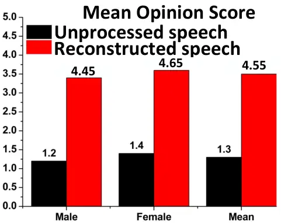

Fig. 12: Results of MOS.

## VII Limitation

### VII-A Encryption and Codec

This work does not consider any encryption of the sampled audio before
transmission to the mobile platform from the hearables. Moreover, we do
not include any codec while evaluating its performance, power, and
efficiency. Our future work will include codec and encryption while
designing a joint BWE and multimodal SE algorithm. However, as a codec
is a compression and decompression algorithm, codec can be used safely
after sub-Nyquist sampling on hearables with our platform.

### VII-B Fine tuning on mobile platform

We fine-tune SUBARU on a desktop with GPU support due to the limitation
of available open-source tools and computational resources for
fine-tuning models on a mobile platform. Our future work will try to
solve this problem by contributing to open-source tool development for
on-device training.

## VIII Conclusion

SUBARU is designed to be deployed in a split architecture, where
hearables run sub-Nyquist sampling in low bit resolution on signals from
both ACMs and BCMs, and mobile platforms connected to hearables run the
joint BWE and multimodal SE algorithms to reconstruct high-resolution,
noise-free audio in noisy conditions. The low latency of SUBARU while
performing joint BWE and multimodal SE enables streaming enhancement,
low power, and low memory solutions, making SUBARU deployable on mobile
platforms. Moreover, SUBARU adopts a hybrid architecture by merging both
waveform-based and spectrum-based methods, enabling joint training in
both spectrum and waveform domains. This joint training also improves
both time and spectral domain features during audio reconstruction. This
joint training also enables the use of instantaneous phase and group
delay anti-wrapping losses to reconstruct clean phases in noisy
conditions. SUBARU provides users with reliable communication while
ensuring real-time performance by extending the battery life of
hearables. Therefore, SUBARU is designed to meet the high demands of
smart hearables in low-power and real-world usage by bridging the gap
between power and the performance of current commercial technologies.

## IX Acknowledgment

The research is supported by the Grant no: N000142612163 from the Office
of Naval Research (ONR).

## References

- \[1\] G. V. Research, “Hearables market size, share and trends
  analysis report, 2024-2030,”
  https://www.grandviewresearch.com/industry-analysis/hearables-market,
  2024, accessed: 2025-04-26.
- \[2\] Y. Sui, M. Zhao, J. Xia, X. Jiang, and S. Xia, “Tramba: A
  hybrid transformer and mamba architecture for practical audio and bone
  conduction speech super resolution and enhancement on mobile and
  wearable platforms,” _Proceedings of the ACM on Interactive, Mobile,
  Wearable and Ubiquitous Technologies_, vol. 8, no. 4, pp. 1–29, 2024.
- \[3\] M. Tagliasacchi, Y. Li, K. Misiunas, and D. Roblek, “Seanet: A
  multi-modal speech enhancement network,” _arXiv preprint
  arXiv:2009.02095_, 2020.
- \[4\] M. Wang, J. Chen, X.-L. Zhang, and S. Rahardja, “End-to-end
  multi-modal speech recognition on an air and bone conducted speech
  corpus,” _IEEE/ACM Transactions on Audio, Speech, and Language
  Processing_, vol. 31, pp. 513–524, 2022.
- \[5\] D. Yin, C. Luo, Z. Xiong, and W. Zeng, “Phasen: A
  phase-and-harmonics-aware speech enhancement network,” in _Proceedings
  of the AAAI Conference on Artificial Intelligence_, vol. 34, no. 05,
  2020, pp. 9458–9465.
- \[6\] Q. Zhang, K. Guo, Y. Yang, and D. Wang, “Wearse: Enabling
  streaming speech enhancement on eyewear using acoustic sensing,”
  _Proceedings of the ACM on Interactive, Mobile, Wearable and
  Ubiquitous Technologies_, vol. 9, no. 1, pp. 1–30, 2025.
- \[7\] International Telecommunication Union, “Recommendation G.114:
  One-way transmission time,” https://www.itu.int/rec/T-REC-G.114, 2003,
  accessed: 2025-04-10.
- \[8\] K. Li and C.-H. Lee, “A deep neural network approach to speech
  bandwidth expansion,” in _2015 IEEE International Conference on
  Acoustics, Speech and Signal Processing (ICASSP)_. IEEE, 2015, pp.
  4395–4399.
- \[9\] V. Kuleshov, S. Z. Enam, and S. Ermon, “Audio super resolution
  using neural networks,” _arXiv preprint arXiv:1708.00853_, 2017.
- \[10\] A. Gupta, B. Shillingford, Y. Assael, and T. C. Walters,
  “Speech bandwidth extension with wavenet,” in _2019 IEEE workshop on
  applications of signal processing to audio and acoustics
  (WASPAA)_. IEEE, 2019, pp. 205–208.
- \[11\] Y. Li, M. Tagliasacchi, O. Rybakov, V. Ungureanu, and D.
  Roblek, “Real-time speech frequency bandwidth extension,” in _ICASSP
  2021-2021 IEEE International Conference on Acoustics, Speech and
  Signal Processing (ICASSP)_. IEEE, 2021, pp. 691–695.
- \[12\] J. Su, Y. Wang, A. Finkelstein, and Z. Jin, “Bandwidth
  extension is all you need,” in _ICASSP 2021-2021 IEEE International
  Conference on Acoustics, Speech and Signal Processing (ICASSP)_. IEEE,
  2021, pp. 696–700.
- \[13\] S. Han and J. Lee, “Nu-wave 2: A general neural audio
  upsampling model for various sampling rates,” in _Interspeech 2022_,
  2022, pp. 4401–4405.
- \[14\] M. Lagrange and F. Gontier, “Bandwidth extension of musical
  audio signals with no side information using dilated convolutional
  neural networks,” in _ICASSP 2020-2020 IEEE International Conference
  on Acoustics, Speech and Signal Processing (ICASSP)_. IEEE, 2020, pp.
  801–805.
- \[15\] S. Li, S. Villette, P. Ramadas, and D. J. Sinder, “Speech
  bandwidth extension using generative adversarial networks,” in _2018
  IEEE International Conference on Acoustics, Speech and Signal
  Processing (ICASSP)_. IEEE, 2018, pp. 5029–5033.
- \[16\] R. Kumar, K. Kumar, V. Anand, Y. Bengio, and A. Courville,
  “Nu-gan: High resolution neural upsampling with gan,” _arXiv preprint
  arXiv:2010.11362_, 2020.
- \[17\] S. E. Eskimez and K. Koishida, “Speech super resolution
  generative adversarial network,” in _ICASSP 2019-2019 IEEE
  International Conference on Acoustics, Speech and Signal Processing
  (ICASSP)_. IEEE, 2019, pp. 3717–3721.
- \[18\] E. Moliner and V. Välimäki, “Behm-gan: Bandwidth extension of
  historical music using generative adversarial networks,” _IEEE/ACM
  Transactions on Audio, Speech, and Language Processing_, vol. 31, pp.
  943–956, 2022.
- \[19\] E. Moliner, J. Lehtinen, and V. Välimäki, “Solving audio
  inverse problems with a diffusion model,” in _ICASSP 2023-2023 IEEE
  International Conference on Acoustics, Speech and Signal Processing
  (ICASSP)_. IEEE, 2023, pp. 1–5.
- \[20\] H. Liu, K. Chen, Q. Tian, W. Wang, and M. D. Plumbley,
  “Audiosr: Versatile audio super-resolution at scale,” in _ICASSP
  2024-2024 IEEE International Conference on Acoustics, Speech and
  Signal Processing (ICASSP)_. IEEE, 2024, pp. 1076–1080.
- \[21\] E. Moliner, F. Elvander, and V. Välimäki, “Blind audio
  bandwidth extension: A diffusion-based zero-shot approach,” _IEEE/ACM
  Transactions on Audio, Speech, and Language Processing_, 2024.
- \[22\] E. Moliner, M. Turunen, F. Elvander, and V. Välimäki, “A
  diffusion-based generative equalizer for music restoration,” _arXiv
  preprint arXiv:2403.18636_, 2024.
- \[23\] Y. Li, Y. Wang, X. Liu, Y. Shi, S. Patel, and S.-F. Shih,
  “Enabling real-time on-chip audio super resolution for bone-conduction
  microphones,” _Sensors_, vol. 23, no. 1, p. 35, 2022.
- \[24\] S. Birnbaum, V. Kuleshov, Z. Enam, P. W. W. Koh, and S. Ermon,
  “Temporal film: Capturing long-range sequence dependencies with
  feature-wise modulations.” _Advances in Neural Information Processing
  Systems_, vol. 32, 2019.
- \[25\] M. Mandel, O. Tal, and Y. Adi, “Aero: Audio super resolution
  in the spectral domain,” in _ICASSP 2023-2023 IEEE International
  Conference on Acoustics, Speech and Signal Processing (ICASSP)_. IEEE,
  2023, pp. 1–5.
- \[26\] J. Hauret, T. Joubaud, V. Zimpfer, and É. Bavu, “Eben: Extreme
  bandwidth extension network applied to speech signals captured with
  noise-resilient body-conduction microphones,” in _ICASSP 2023 - 2023
  IEEE International Conference on Acoustics, Speech and Signal
  Processing (ICASSP)_. IEEE, 2023, pp. 1–5.
- \[27\] H. Liu, W. Choi, X. Liu, Q. Kong, Q. Tian, and D. Wang,
  “Neural vocoder is all you need for speech super-resolution,” in
  _Interspeech_, 2022.
- \[28\] J. Ho, A. Jain, and P. Abbeel, “Denoising diffusion
  probabilistic models,” _Advances in neural information processing
  systems_, vol. 33, pp. 6840–6851, 2020.
- \[29\] J. Lee and S. Han, “Nu-wave: A diffusion probabilistic model
  for neural audio upsampling,” in _Interspeech 2021_, 2021, pp.
  1634–1638.
- \[30\] W. Kim, H. Kang, Y. Kim, K. Jung, J. S. Lee, and S.-H. Lee,
  “HiFi++: Towards perceptually enhanced and computationally efficient
  neural vocoders,” in _Proc. Interspeech_, 2023, pp. 4374–4378.
- \[31\] D. Ma, T. Dang, M. Ding, and R. K. Balan, “Clearspeech:
  Improving voice quality of earbuds using both in-ear and out-ear
  microphones,” _Proceedings of the ACM on Interactive, Mobile, Wearable
  and Ubiquitous Technologies_, vol. 7, no. 4, pp. 170:1–170:25, 2023.
- \[32\] F. Han, P. Yang, Y. Zuo, F. Shang, F. Xu, and X.-Y. Li,
  “Earspeech: Exploring in-ear occlusion effect on earphones for
  data-efficient airborne speech enhancement,” _Proceedings of the ACM
  on Interactive, Mobile, Wearable and Ubiquitous Technologies_, vol. 8,
  no. 3, pp. 104:1–104:30, 2024. \[Online\]. Available:
  https://doi.org/10.1145/3678594
- \[33\] L. He, H. Hou, S. Shi, X. Shuai, and Z. Yan, “Vibvoice:
  Towards bone-conducted vibration speech enhancement on head-mounted
  wearables,” in _Proceedings of the 21st ACM International Conference
  on Mobile Systems, Applications and Services_. ACM, 2023, pp. 356–369.
- \[34\] N. C. Rakotonirina, “Self-attention for audio
  super-resolution,” in _2021 IEEE 31st International Workshop on
  Machine Learning for Signal Processing (MLSP)_. IEEE, 2021, pp. 1–6.
- \[35\] Brüel & Kjær Sound & Vibration Measurement A/S, “Type 4192:
  1/2” Pressure-field Microphone – High Sensitivity,”
  https://www.bksv.com/en/transducers/microphones/microphone-cartridges/4192,
  2002, accessed: 2025-04-10.
- \[36\] N. Semiconductor, “nrf52840 product specification v1.1,”
  https://infocenter.nordicsemi.com/pdf/nRF52840_PS_v1.1.pdf, 2018,
  accessed: 2025-04-26.
- \[37\] A. Gu and T. Dao, “Mamba: Linear-time sequence modeling with
  selective state spaces,” _arXiv preprint arXiv:2312.00752_, 2023.
- \[38\] V. Ashish, “Attention is all you need,” _Advances in neural
  information processing systems_, vol. 30, p. I, 2017.
- \[39\] J. Kong, J. Kim, and J. Bae, “Hifi-gan: Generative adversarial
  networks for efficient and high fidelity speech synthesis,” _Advances
  in neural information processing systems_, vol. 33, pp.
  17 022–17 033, 2020.
- \[40\] D. Stoller, S. Ewert, and S. Dixon, “Wave-u-net: A multi-scale
  neural network for end-to-end audio source separation,” _arXiv
  preprint arXiv:1806.03185_, 2018.
- \[41\] J. L. Ba, J. R. Kiros, and G. E. Hinton, “Layer
  normalization,” _arXiv preprint arXiv:1607.06450_, 2016.
- \[42\] D. Hendrycks and K. Gimpel, “Gaussian error linear units
  (gelus),” _arXiv preprint arXiv:1606.08415_, 2016.
- \[43\] K. Kumar, R. Kumar, T. De Boissiere, L. Gestin, W. Z. Teoh, J.
  Sotelo, A. De Brebisson, Y. Bengio, and A. C. Courville, “Melgan:
  Generative adversarial networks for conditional waveform synthesis,”
  _Advances in neural information processing systems_, vol. 32, 2019.
- \[44\] Y. Ai and Z.-H. Ling, “Neural speech phase prediction based on
  parallel estimation architecture and anti-wrapping losses,” in _ICASSP
  2023-2023 IEEE International Conference on Acoustics, Speech and
  Signal Processing (ICASSP)_. IEEE, 2023, pp. 1–5.
- \[45\] Q. Tian, Y. Chen, Z. Zhang, H. Lu, L. Chen, L. Xie, and S.
  Liu, “Tfgan: Time and frequency domain based generative adversarial
  network for high-fidelity speech synthesis,” _arXiv preprint
  arXiv:2011.12206_, 2020.
- \[46\] S. Coyle, “Airpods pro 2 latency compared,” 2022, accessed:
  2025-04-10. \[Online\]. Available:
  https://stephencoyle.net/airpods-pro-2
- \[47\] RTINGS.com, “Samsung galaxy buds pro truly wireless review,”
  2021, accessed: 2025-04-10. \[Online\]. Available:
  https://www.rtings.com/headphones/reviews/samsung/galaxy-buds-pro-truly-wireless
- \[48\] CUI Devices, “CEB-27032-L100: Contact Microphone,”
  https://www.cuidevices.com/product/audio/speakers/contact-microphones/ceb-27032-l100,
  2023, accessed: 2025-04-10.
- \[49\] PCB Piezotronics, Inc., “352C33: ICP® Quartz Shear
  Accelerometer,” https://www.pcb.com/products?m=352C33, 2024, accessed:
  2025-04-10.
- \[50\] J. Hauret, M. Olivier, T. Joubaud, C. Langrenne, S. Poirée, V.
  Zimpfer, and É. Bavu, “Vibravox: A dataset of french speech captured
  with body-conduction audio sensors,” _arXiv preprint
  arXiv:2407.11828_, 2024.
- \[51\] J. Yamagishi, C. Veaux, K. MacDonald _et al._, “Cstr vctk
  corpus: English multi-speaker corpus for cstr voice cloning toolkit
  (version 0.92),” _University of Edinburgh. The Centre for Speech
  Technology Research (CSTR)_, pp. 271–350, 2019.
- \[52\] A. Radford, J. W. Kim, T. Xu, G. Brockman, C. McLeavey, and I.
  Sutskever, “Whisper: Robust speech recognition via large-scale weak
  supervision,” https://github.com/openai/whisper, 2022, openAI
  Technical Report.
- \[53\] F. Font, G. Roma, and X. Serra, “Freesound technical demo,” in
  _Proceedings of the 21st ACM international conference on Multimedia_,
  2013, pp. 411–412.
- \[54\] O.-T. Community, “Onnx-tensorflow: Open neural network exchange
  (onnx) backend for tensorflow,”
  https://github.com/onnx/onnx-tensorflow, 2024, gitHub repository.
- \[55\] E. Law, M. West, M. Mandel, M. Bay, and J. S. Downie,
  “Evaluation of algorithms using games: The case of music tagging,” in
  _Proceedings of the 10th International Society for Music Information
  Retrieval Conference (ISMIR)_, 2009.
- \[56\] A. Radford, J. W. Kim, T. Xu, G. Brockman, C. McLeavey, and I.
  Sutskever, “Robust speech recognition via large-scale weak
  supervision,” https://openai.com/research/whisper, 2022, accessed:
  2025-04-25.
