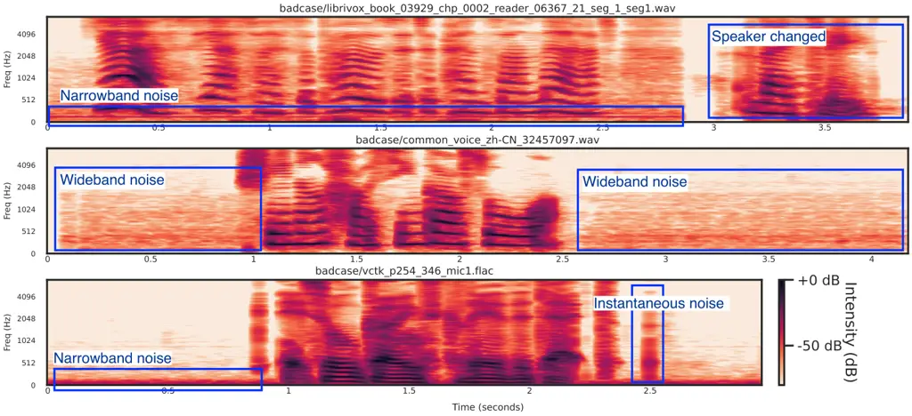

# Less is More: Data Curation Matters in Scaling Speech Enhancement

¹Chenda Li, ¹Wangyou Zhang, ¹Wei Wang, ²Robin Scheibler, ³Kohei Saijo,
⁴Samuele Cornell, ⁵Yihui Fu,  
⁵Marvin Sach, ⁶Zhaoheng Ni, ²Anurag Kumar, ⁵Tim Fingscheidt, ⁴Shinji
Watanabe, ¹Yanmin Qian ^(†)^(†)thanks: This work was supported in part
by the National Key Research and Development Program of China under
Grant 2024YFC2418303, in part by the Shanghai Municipal Science and
Technology Commission Project under Grant 2021SHZDZX0102, and in part by
the Key Research and Development Program of Jiangsu Province, China
(Grant No. BE2022059-4).^(†)^(†)thanks: Robin Scheibler from Google
DeepMind served in an advisory role. Affiliation: ¹Shanghai Jiao Tong
University, China; ²Google DeepMind, Japan; ³Waseda University, Japan;
Affiliation: ⁴Carnegie Mellon University, USA; ⁵Technische Universität
Braunschweig, Germany; ⁶Meta, USA

###### Abstract

The vast majority of modern speech enhancement systems rely on
data-driven neural network models. Conventionally, larger datasets are
presumed to yield superior model performance, an observation empirically
validated across numerous tasks in other domains. However, recent
studies reveal diminishing returns when scaling speech enhancement data.
We focus on a critical factor: prevalent quality issues in “clean”
training labels within large-scale datasets. This work re-examines this
phenomenon and demonstrates that, within large-scale training sets,
prioritizing high-quality training data is more important than merely
expanding the data volume. Experimental findings suggest that models
trained on a carefully curated subset of 700 hours can outperform models
trained on the 2,500-hour full dataset. This outcome highlights the
crucial role of data curation in scaling speech enhancement systems
effectively.

###### Index Terms: 

Speech Enhancement, Speech Restoration, Scaling Law, URGENT Challenge

## I Introduction

Speech enhancement (SE) \[1\] remains a cornerstone of robust speech
processing systems, enabling critical applications from hearing aids to
voice communication devices. Its core objective is to improve speech
quality and intelligibility by removing undesired acoustic components
from degraded signals. Thanks to the power of deep learning, neural
network (NN)-based methods, including discriminative \[2, 3, 4, 5, 6,
7\] and generative \[8, 9, 10, 11\] approaches, have made significant
advances in speech enhancement over the past decade.

Due to the nature of data-driven supervised learning, training data
critically governs system performance. Conventional NN-based SE research
has focused predominantly on narrowly defined tasks (e.g., additive
noise suppression or dereverberation in isolation), typically employing
small-scale, domain-specific datasets like VoiceBank+DEMAND \[12\].
These datasets are often synthetically generated to match controlled
evaluation conditions, which inherently limits their generalizability to
complex, real-world environments where multiple distortions (e.g. noise
and reverberation) coexist.

Increasing the quantity and richness of training data is a
straightforward approach to improve the generalization ability of SE
models. A recent work makes a comprehensive study \[13\] on the
scalability of various discriminative speech enhancement models. It is
observed that the performance of discriminative SE could improve as the
model size, model complexity, and dataset size increase, but tends to
saturate when scaling beyond 157 hours of training data. Meanwhile,
another work \[14\] further investigates the effect on training data
size (3 hours to 300 hours) of state-of-the-art discriminative and
generative SE models. The authors found that the performance improvement
of the discriminative model was significant from 3 to 100 hours, but was
relatively limited when scaled from 100 to 300 hours. For generative
models, the performance differences between systems trained for more
than 10 hours are very minor.

On the other hand, to better explore and extend the generalization
ability of speech enhancement models, the URGENT speech enhancement
challenges \[15, 16\] have encouraged researchers to use more diverse
and larger-scale datasets to build universal and generalizable SE
systems. In URGENT2025, the scope of speech enhancement has been
extended to more complex tasks, including noise suppression,
dereverberation, packet loss concealment, bandwidth extension, codec
loss repair, etc \[16\]. In terms of data amount, the URGENT2025
included more than 2,500 and 60,000 hours of speech source in Track1 and
Track2, respectively, to encourage participants to examine the impact of
data amount. While deep learning has dominated the field of SE, the
data-driven paradigm follows an implicit scaling hypothesis: larger
datasets and increasingly complex models should yield consistent
performance gains. Surprisingly, there is no system in Track2 that
consistently outperforms the best system in Track1, which only utilizes
a subset of the training data from Track2. This suggests that simply
increasing the data scale may not lead to effective performance
improvement.



Fig. 1: Training target of low quality selected from Librivox \[17\],
Common Voice \[18\], and VCKT \[19\] datasets, which are commonly used
in speech enhancement training \[6, 8, 15, 16\]. Audios are resampled to
22,050 Hz and displayed in log-scaled mel-spectrograms.

Based on the findings of the prior works \[13, 14, 16\], this paper
revisits the role of data scaling in speech enhancement from a new
perspective. Acknowledging the known presence of low-quality samples
within the “clean” labels of the URGENT2025 dataset (a key aspect of the
challenge focused on noisy data utilization) \[20\], we first perform a
preliminary analysis on its 2,500-hour training set. Given this context,
our study focuses on investigating the trade-off between data scale and
quality. We assume that these low-quality “clean” speech samples would
have affected the scaling of the training data. To verify this
hypothesis, we apply multiple non-intrusive evaluation metrics to the
2500-hour speech source of the URGENT2025 training set, and select the
top 100-hour, 350-hour, and 700-hour subsets. We reviewed the effect of
training data size on the performance of speech enhancement and compared
it with the uniform random subset selection. Experiments in both
discriminative and generative models show that curated subsets
consistently outperform uniformly random samples of the same size.
Crucially, we discovered that the system trained on a 700-hour optimal
subset outperforms the one trained on the full 2,500-hour set in
multiple evaluation metrics. This paper outlines our methodology and
findings and proposes a data-centric data curation approach to advance
future research on speech enhancement.

The rest of the paper is organized as follows: Section II provides some
preliminary analysis of the URGENT2025 training data, explains our
motivation, and introduces our methods for data curation and
experimental design. We then detail our experimental setup and analyze
the experimental results in Section III. Finally, Section IV concludes
this paper.

## II Experimental Design

### II-A Task Definition

In this work, we formulate the SE task as:

```math
\displaystyle\hat{\mathbf{x}} \displaystyle=\operatorname{SE}(\mathcal{F}(\mathbf{x}))\,, \tag{1}
```

where $`\mathbf{x}`$ is the clean speech signal and $`\hat{\mathbf{x}}`$
is the enhance speech signal. $`\operatorname{SE}`$ is the speech
enhancement system, and $`\mathcal{F}(\cdot)`$ is the distortion model
that degrades the clean speech signal. In most conventional SE works,
the distortion model $`\mathcal{F}(\cdot)`$ typically considers only
additive noise or reverberation in isolation. We follow the extended SE
task in the URGENT challenge \[15, 16\], where $`\mathcal{F}(\cdot)`$
includes seven different distortions: 1) additive noise, 2)
reverberation, 3) clipping, 4) bandwidth limitation, 5) codec loss, 6)
packet loss, and 7) wind noise.

Fig. 2: Histogram of non-intrusive metrics of the target speech source
on the full dataset and Threshold-Based-Filtered (TBF) dataset. It is
noted that the DNSMOS Pro \[21\], VQScore \[22\], and Distill-MOS \[23\]
are not used as a threshold in TBF. After TBF, the median of all metrics
has consistently improved.

### II-B Preliminary Analysis of Training Data

Prior investigations \[13, 14\] have demonstrated that increasing data
amount beyond a certain point yields diminishing performance
improvements. We look into the scalability limitations observed in
large-scale SE training, particularly within the URGENT2025
challenge \[16\]. URGENT25 applied a simple DNSMOS \[24\] and
voice-activity-detection-based filtering on some large-scale subsets of
Track2, and then did random selection to obtain the Track1 training
data. However, the larger dataset (i.e., the 60k-hour Track2) failed to
consistently outperform the smaller, simply curated subset (i.e., the
2,500-hour Track1 data) \[16\], prompting a critical re-examination of
the training data curation.

We conducted a preliminary analysis of the URGENT2025 Track1 training
set (2,500 hours), which comprises several popular datasets for speech
enhancement, as shown in Table II. Consistent with the known quality
variations in this challenge’s data \[20\], our analysis observed that
some segments labeled as “clean” exhibit lower speech quality. Figure 1
shows some of the most common distortions that we found in the target
“clean” speech of the training set:

- •
  Wideband noise. The speech signal is contaminated by some low-energy
  wideband noise during the recording process, as shown in Figure 1.
- •
  Narrowband noise. We found that some of the target “clean” speech
  signals contain high-energy narrowband noise at infrasound
  frequencies. This case is usually found in some samples of the DNS5
  LibriVox \[6\], VCTK \[19\], and EARS datasets \[25\].
- •
  Instantaneous noise. Some speech sources include the clicking sound of
  a button or the sound of hitting an object. For example, as Figure 1
  shows, in some of the speech sources in VCTK \[19\], a relatively
  distinct button sound can be heard near the end of the recording.
- •
  High-frequency distortion. It is usually found in the 48 kHz Common
  Voice \[18\]. This may be attributed to the lossy MP3 encoding format
  adopted by Common Voice.
- •
  Multi-talker speech. Some source signals contain the speech from
  multiple talkers, as found in DNS5 LibriVox \[6\]. Since most speech
  enhancement systems are typically trained only with single-talker
  speech by default, the impact of this case on training the speech
  enhancement model is uncertain. It may be more detrimental to the
  training of generative methods than to that of discriminative methods.

### II-C Data Curation Strategy

To mitigate the detrimental effects of low-quality “clean” targets and
test our hypothesis that data quality is more important than quantity
for scaling SE models, we developed a data curation pipeline focused on
identifying and selecting high-fidelity utterances from the URGENT2025
Track1 training set.

Our core strategy leverages non-intrusive speech quality and
intelligibility metrics. Unlike intrusive metrics (e.g., SDR \[26\],
PESQ \[27\]), which require a ground-truth reference, non-intrusive
metrics predict quality or intelligibility solely from the single audio
signal itself. This is essential for our purpose, as we need to assess
the quality of the supposedly clean target speech files without access
to a higher-quality reference.

| Metric    | EARS\[25\] | Common Voice(ZH)\[18\] | Other |
| --------- | ---------- | ---------------------- | ----- |
| DNSMOS    | 2.5        | 3.0                    | 3.0   |
| SigMOS    | 2.5        | 3.0                    | 3.0   |
| UTMOS     | 2.5        | 3.0                    | 3.0   |
| NISQA     | 3.0        | 4.0                    | 4.0   |
| SQUIM_SDR | 0.0        | 0.0                    | 20    |

TABLE I: Quality Thresholds for Threshold-based Filtering.

[TABLE]

TABLE II: The durations (in hours) of speech source in each subset of
URGENT2025 Track1. The table lists the original and retained durations
before and after filtering, respectively.

Specifically, we employed the following widely used DNN-based
non-intrusive metrics to score each “clean” speech utterance in the
2,500-hour corpus:

- •
  DNSMOS \[24\]: Predicts perceptual quality (MOS) via separate SigMOS
  (speech distortion) and NoiseMOS (background noise) scores,
  specifically optimized for noisy speech conditions.
- •
  NISQA \[31\]: Estimates overall speech quality (MOS) using a
  CNN-SelfAttention architecture, capturing both distortion types and
  speech discontinuity impacts.
- •
  SIGMOS \[32\]: Estimates the P.804 audio quality dimensions score
  non-intrusively, focusing on mimicking human perception of audio
  quality.
- •
  Torchaudio-SQUIM-SDR \[33\]: SI-SDR \[34\] estimated by
  Torchaudio-SQUIM, a multi-task model predicting three key intrusive
  metrics (STOI \[35\], PESQ \[27\], SI-SDR \[34\] ) simultaneously from
  a single waveform.
- •
  UTMOS \[36\]: A transformer-based model predicting MOS, robust to
  diverse languages and acoustic conditions, leveraging large-scale
  pretraining.

To address the issue of suboptimal “clean” targets, we implemented a
two-stage data curation pipeline for the URGENT2025 Track1 training set:

#### II-C1 Threshold-Based Filtering (TBF)

We applied dataset-specific minimum quality thresholds using multiple
non-intrusive metrics. Utterances failing to meet any threshold for
their respective dataset were excluded. Due to the inherent quality
differences across subset data sources, we applied different thresholds
specific to each subset. The specific thresholds used for each dataset
type and metric are detailed in Table I. This initial filtering step
selects a curated subset of approximately 700 hours of higher-quality
“clean” speech. Dataset quantitative changes after TBF are reported in
Table II, while Figure 2 illustrates the distribution of each metric
before and after TBF. We also report three additional metrics not used
in the TBF, which are DNSMOS Pro \[21\], VQScore \[22\], and Distill-MOS
\[23\]. It can be observed that the distribution of all the metrics has
improved significantly and consistently for both used and unused metrics
in the TBF.

#### II-C2 Quality Ranking and Subset Selection

Within the  700-hour TBF dataset, we further refined the selection of
data based on the quality ranking. For each utterance, the scores from
all five metrics are normalized. Normalization is performed by
subtracting the mean and then dividing by the standard deviation
calculated over the entire 700-hour TBF dataset for each metric
individually. The normalized scores for each utterance are summed to an
overall score. The speech sources are ranked by their overall score. We
selected the top-ranked 100-hour, 350-hour, and 700-hour subsets
(including the 700-hour TBF dataset itself) to create three high-quality
subsets, ranging from small-scale to large-scale. To isolate the impact
of our quality-centric curation strategy, we generated uniformly random
subsets of identical sizes (100h, 350h, 700h) from the original,
unfiltered 2,500-hour training set. This experimental design enabled us
to rigorously investigate whether prioritizing data quality through
targeted filtering and selection offers greater performance benefits
than simply increasing data quantity, and to determine if smaller,
high-quality datasets can outperform much larger, uncurated ones.

## III Experiments

[TABLE]

TABLE III: Results Comparison on 2500-hour full training set and
Threshold-Based Filtered (TBF) 700-hour training set. DNSMOS Pro and
DitillMOS are not used in the threshold-based filtering. Except for LSD,
the larger numbers are better for other metrics.

### III-A Datasets and Evaluation

We adapt the Track1 training data from the URGENT2025 challenge \[16\]
to train our models. Its speech source consists of several commonly used
speech enhancement datasets, which are listed in Table II. The noise
source and room impulse response are identical to those in the
URGENT2025 Track1 training data. The dynamic simulation strategy¹¹ 1 The
training data and simulation scripts can be found at
https://github.com/urgent-challenge/urgent2025_challenge is used to
train all models in this paper. We apply an additional high-pass filter
to the clean speech source before simulation, aiming to remove potential
low-frequency, narrow-band noise at infrasound frequencies. The cutoff
frequency of the high-pass filter is $`75`$ Hz.

The blind test set of URGENT 2025 is applied to evaluate the models. We
report six non-intrusive metrics, including DNSMOS \[24\], NISQA \[31\],
UTMOS \[36\], SIGMOS \[32\], DNSMOS Pro \[21\], and Distill-MOS \[23\]
in the evaluation, where the former four are used in the TBF, while the
other two are not. For intrusive metrics, we reported the
signal-to-distortion ratio (SDR) \[38\], perceptual evaluation of speech
quality (PESQ) \[27\], extended short-time objective intelligibility
(ESTOI) \[27\], and log-spectral distance (LSD) \[39\].

### III-B Speech Enhancement Models

The training and evaluation data in URGENT 2025 have various sampling
frequencies (SF) of {8, 16, 22.05, 24, 32, 44.1, 48} kHz, which require
the SE model to be able to handle multiple SF.

#### III-B1 Discriminative Models

We adopt the Band-Split RNN (BSRNN) \[40\] as the discriminative SE
model in this paper. BSRNN has demonstrated its superior performance in
recent source separation \[41\] and SE works \[42\]. It estimates the
enhanced speech in the time-frequency (TF) domain. BSRNN follows the
ideal of the state-of-the-art dual-path design \[43, 37\] in the TF
domain, which typically applies two kinds of sequence modeling modules
alternately to the frequency feature and the time feature in the TF
domain. The BSRNN model supports inputs with different SF and reduces
the frequency dimension by splitting the frequency bins into a
hand-crafted band split, effectively balancing computational efficiency
with performance. We use the BSRNN implementation from the
ESPnet-SE \[44\] toolkit, and an L1-based time-domain plus
frequency-domain multiresolution loss \[45\] is used to train the
discriminative BSRNN SE models. All discriminative BSRNN SE models have
a parameter size of $`38`$ million.

#### III-B2 Generative Models

We follow a recent work named FlowSE \[11\] to build generative SE
models. It extends the flow matching method \[46\] to a conditional flow
matching model that generates clean speech conditioned by the noisy
speech. The original FlowSE applies the Noise Conditional Score Network
(NCSN++) \[47\] as the backbone model. Since our dataset comprises
speech of different sampling frequencies, we reimplement an improved
BSRNN as a replacement for the NCSN++ to estimate the conditional vector
field. In the remainder of this paper, we refer to the BSRNN-based flow
matching SE as BSRNN-Flow. All generative BSRNN-Flow SE models have a
parameter size of $`103`$ million.

Fig. 3: Impact of training data selection and scale on SE performance.
Both discriminative BSRNN and generative BSRNN-Flow are evaluated. The
X-axis is the amount of training speech source. The orange lines mark
the systems trained with selected top-X-hour speech source; the blue
lines mark the systems trained with uniformly sampled X-hour speech
source. Intrusive and non-intrusive metrics are represented in different
background colors.

### III-C Less is More: Experimental Results in TBF

We apply the threshold-based filtering (TBF) introduced in Section II-C
to the 2,500-hour speech sources of the URGENT2025 Track1 training data
(2500h-full). And then, as Figure 2 suggests, a 700-hour subset with a
better metric distribution is obtained, which we refer to as 700h-TBF.
We first train a discriminative SE baseline BSRNN on 2500h-full, and
compare it with the TF-GridNet \[37\] official baseline in URGENT2025.
The results in Table III show that our 2500-full baseline BSRNN achieves
a performance comparable to the official baseline.

We train discriminative BSRNN and generative BSRNN-Flow on both
2500-full and 700h-TBF datasets. Furthermore, we also train a
discriminative BSRNN*(init), which is trained on the 700h-TBF dataset
with initialization from the model trained on 2500-full. Comparing the
results in Table III, there are two findings: First, data quality
matters more than quantity. Both the BSRNN SE and BSRNN-Flow SE, trained
on only 700h-TBF, consistently outperform their 2500h-full counterparts
across all non-intrusive metrics, achieving on-par performance on
intrusive metrics. This indicates that training on a smaller and
higher-quality subset yields better generalization to perceptual quality
metrics than using the larger, unprocessed data. Second, the
initialization provides an approach for the more efficient use of
large-scale data. When initializing from the 2500h-full checkpoint, the
700h-TBF-trained model BSRNN*(init) achieves best performance on
multiple intrusive and non-intrusive metrics. This suggests that
warm-starting from a model pre-trained with large-scale data can extract
maximal value from TBF data.

### III-D Revisit Scaling in SE with Quality-Ranked Speech Source

As introduced in Section II-C, we select the top-ranked 100-hour,
350-hour, and 700-hour (identical to 700h-TBF) subsets from the 700h-TBF
training set. To isolate the impact of our quality-centric curation
strategy and make a controlled comparison, we apply uniform random
sampling to the 2500h-full training set, obtaining a series of subsets
with the same quantity. Figure 3 makes a comprehensive comparison of
both discriminative BSRNN and generative BSRNN-Flow with different
quantities of training speech source.

Fig. 4: Impact of noise source scale in the training data. The X-axis is
the amount of training noise source. Intrusive and non-intrusive metrics
are represented in different background colors. We only report the
non-intrusive metrics for the internal real testing, as the reference
audios are not available.

The most intuitive observation of the results in Figure 3 is that the
top-ranked subsets often surpass their randomly sampled counterparts.
The discriminative BSRNN benefits more than the generative BSRNN-Flow.
For all the metrics, the discriminative BSRNNs trained on selected
top-X-hour subsets outperform those trained on the same quantity of
randomly sampled subsets. The generative BSRNN-Flow trained on selected
top-X-hour subsets exhibits better performance than its counterparts
trained on a randomly sampled subset across all non-intrusive metrics.
The quality ranking method does not show obvious differences in the
intrusive metrics for generative methods. This may be due to the
inherent nature of generative models, that the generated signal can be
regarded as drawn from a probability distribution, and is usually not
well-aligned with the reference signal.

Another finding is that the performance gain of the quality ranking is
more obvious on non-intrusive metrics for both the discriminative and
generative models than on intrusive metrics. It is worth noting that, on
some of the non-intrusive evaluation (e.g., DNSMOS Pro, SIGMOS, NISQA),
the SE models trained on top-100-hour are even better than the 2500-full
training set.

Furthermore, we found that the discriminative method scales better in
terms of data size compared to the generative method. This conclusion is
aligned with a previous study \[14\]. However, in \[14\], the author
reported diminishing returns for diffusion-based generative SE systems
beyond 10 training hours on standard intrusive metrics (PESQ, ESTOI, and
signal-to-noise ratio), while we can still observe a noticeable
performance gain on PESQ, SDR, and ESTOI from 100-hour to 2500-hour
data. Differences in conclusions may arise from inconsistencies in the
datasets and variations in the generative models.

### III-E Scaling Investigation of the Amount of Noise Source

We further conduct experiments on scaling the amount of noise source in
the dynamic simulation. We uniformly sampled 50-hour, 100-hour, and
200-hour noise sources from the original URGRENT2025 442-hour additive
noise sources, and performed the dynamic simulation with the top-ranked
100-hour, 350-hour, and 700-hour speech sources, respectively. The
experiments are conducted using discriminative BSRNN models and
evaluated on the URGENT2025 blind testing set and another internal real
testing set. The internal testing set contains noisy speech recorded in
various environments and can be regarded as an open test set. The
experimental results detailed in 10 evaluation metrics are presented in
Figure 4. Surprisingly, we did not observe a pronounced scaling curve in
either the URGENT2025 blind test set or the internal real test set.

This observed noise-scaling limitation may stem from the extensive
diversity of noise types included within the URGENT2025 dataset. Our
current scaling experiments focused exclusively on quantity via uniform
random sampling, without accounting for potential scaling effects
related to noise type richness \[48\]. Future work should systematically
investigate this dimension, including the curation of noise sources, to
gain a deeper understanding of this aspect.

## IV Conclusion

This paper revisits the diminishing marginal returns observed in speech
enhancement (SE) performance when simply scaling the size of training
data to massive scales. Through a systematic analysis of the URGENT2025
dataset, we introduce a threshold-based filtering approach that
leverages multiple non-intrusive quality metrics. Experiments on
discriminative and generative SE models confirm that quality-curated
subsets consistently outperform uniformly random datasets of identical
size. Crucially, our most significant finding reveals that a rigorously
selected 700-hour subset surpasses models trained on the full 2,500-hour
dataset across multiple evaluation metrics. This discovery enlightens us
that data curation matters in scaling speech enhancement.

The future works include: 1) Applying the proposed data curation methods
to ultra-large datasets like the 60k-hour URGENT2025 Track2 to verify
scalability limits. 2) Conducting targeted experiments on noise scaling
dynamics, particularly how noise diversity (rather than quantity)
affects enhancement performance. It is hoped that this work will inspire
researchers to explore more effective methods for utilizing suboptimal
large-scale data to enhance the performance of SE.

## References

- \[1\] P. C. Loizou, Speech Enhancement: Theory and Practice. CRC
  Press, 2007.
- \[2\] Y. Xu, J. Du, L.-R. Dai, and C.-H. Lee, “A Regression Approach
  to Speech Enhancement Based on Deep Neural Networks,” IEEE/ACM
  Transactions on Audio, Speech, and Language Processing, vol. 23,
  pp. 7–19, Jan. 2015.
- \[3\] D. Wang and J. Chen, “Supervised Speech Separation Based on Deep
  Learning: An Overview,” IEEE/ACM Transactions on Audio, Speech, and
  Language Processing, vol. 26, pp. 1702–1726, Oct. 2018.
- \[4\] Y. Luo and N. Mesgarani, “Conv-TasNet: Surpassing Ideal
  Time–Frequency Magnitude Masking for Speech Separation,” IEEE/ACM
  Transactions on Audio, Speech, and Language Processing, vol. 27,
  pp. 1256–1266, Aug. 2019.
- \[5\] Y. Hu, Y. Liu, S. Lv, M. Xing, S. Zhang, Y. Fu, J. Wu, B. Zhang,
  and L. Xie, “DCCRN: Deep Complex Convolution Recurrent Network for
  Phase-Aware Speech Enhancement,” in Interspeech 2020, pp. 2472–2476,
  ISCA, 2020.
- \[6\] H. Dubey, A. Aazami, V. Gopal, B. Naderi, S. Braun, R. Cutler,
  A. Ju, M. Zohourian, M. Tang, M. Golestaneh, and R. Aichner, “ICASSP
  2023 Deep Noise Suppression Challenge,” IEEE Open Journal of Signal
  Processing, vol. 5, pp. 725–737, 2024.
- \[7\] W. Wang, W. Zhang, C. Li, J. Shi, S. Watanabe, and Y. Qian,
  “Improving speech enhancement with multi-metric supervision from
  learned quality assessment,” arXiv preprint arXiv:2506.12260, 2025.
- \[8\] Y.-J. Lu, Z.-Q. Wang, S. Watanabe, A. Richard, C. Yu, and
  Y. Tsao, “Conditional Diffusion Probabilistic Model for Speech
  Enhancement,” in ICASSP 2022 - 2022 IEEE International Conference on
  Acoustics, Speech and Signal Processing (ICASSP), pp. 7402–7406, 2022.
- \[9\] C. Li, S. Cornell, S. Watanabe, and Y. Qian, “Diffusion-Based
  Generative Modeling With Discriminative Guidance for Streamable Speech
  Enhancement,” in 2024 IEEE Spoken Language Technology Workshop (SLT),
  pp. 333–340, Dec. 2024.
- \[10\] J. Richter, S. Welker, J.-M. Lemercier, B. Lay, and
  T. Gerkmann, “Speech Enhancement and Dereverberation With
  Diffusion-Based Generative Models,” IEEE/ACM Transactions on Audio,
  Speech, and Language Processing, vol. 31, pp. 2351–2364, 2023.
- \[11\] S. Lee, S. Cheong, S. Han, and J. W. Shin, “FlowSE: Flow
  Matching-based Speech Enhancement,” in ICASSP 2025 - 2025 IEEE
  International Conference on Acoustics, Speech and Signal Processing
  (ICASSP), pp. 1–5, Apr. 2025.
- \[12\] C. Valentini-Botinhao, X. Wang, S. Takaki, and J. Yamagishi,
  “Speech Enhancement for a Noise-Robust Text-to-Speech Synthesis System
  Using Deep Recurrent Neural Networks,” in Proc. Interspeech 2016,
  pp. 352–356, 2016.
- \[13\] W. Zhang, K. Saijo, J.-w. Jung, C. Li, S. Watanabe, and
  Y. Qian, “Beyond Performance Plateaus: A Comprehensive Study on
  Scalability in Speech Enhancement,” in Proc. Interspeech 2024,
  pp. 1740–1744, 2024.
- \[14\] P. Gonzalez, Z.-H. Tan, J. Østergaard, J. Jensen, T. S.
  Alstrøm, and T. May, “The Effect of Training Dataset Size on
  Discriminative and Diffusion-Based Speech Enhancement Systems,” IEEE
  Signal Processing Letters, vol. 31, pp. 2225–2229, 2024.
- \[15\] W. Zhang, R. Scheibler, K. Saijo, S. Cornell, C. Li, Z. Ni,
  A. Kumar, J. Pirklbauer, M. Sach, S. Watanabe, T. Fingscheidt, and
  Y. Qian, “URGENT Challenge: Universality, Robustness, and
  Generalizability For Speech Enhancement,” in Interspeech 2024,
  pp. 4868–4872, 2024.
- \[16\] K. Saijo, W. Zhang, S. Cornell, R. Scheibler, C. Li, Z. Ni,
  A. Kumar, M. Sach, Y. Fu, W. Wang, T. Fingscheidt, and S. Watanabe,
  “Interspeech 2025 URGENT Speech Enhancement Challenge,” in Interspeech
  2026, 2026.
- \[17\] J. Kearns, “Librivox: Free public domain audiobooks,” Reference
  Reviews, vol. 28, no. 1, pp. 7–8, 2014.
- \[18\] R. Ardila, M. Branson, K. Davis, M. Kohler, J. Meyer,
  M. Henretty, R. Morais, L. Saunders, F. Tyers, and G. Weber, “Common
  Voice: A Massively-Multilingual Speech Corpus,” in Proceedings of the
  Twelfth Language Resources and Evaluation Conference (N. Calzolari,
  F. Béchet, P. Blache, K. Choukri, C. Cieri, T. Declerck, S. Goggi,
  H. Isahara, B. Maegaard, J. Mariani, H. Mazo, A. Moreno, J. Odijk, and
  S. Piperidis, eds.), pp. 4218–4222, European Language Resources
  Association, 2020.
- \[19\] C. Veaux, J. Yamagishi, and S. King, “The voice bank corpus:
  Design, collection and data analysis of a large regional accent speech
  database,” in 2013 International Conference Oriental COCOSDA Held
  Jointly with 2013 Conference on Asian Spoken Language Research and
  Evaluation (O-COCOSDA/CASLRE), pp. 1–4, 2013.
- \[20\] W. Zhang, K. Saijo, S. Cornell, R. Scheibler, C. Li, Z. Ni,
  A. Kumar, M. Sach, W. Wang, Y. Fu, S. Watanabe, T. Fingscheidt, and
  Y. Qian, “Lessons learned from the URGENT 2024 speech enhancement
  challenge,” Accepted by Interspeech, 2025.
- \[21\] F. Cumlin, X. Liang, V. Ungureanu, C. K. A. Reddy, C. Schüldt,
  and S. Chatterjee, “DNSMOS Pro: A Reduced-Size DNN for Probabilistic
  MOS of Speech,” in Proc. Interspeech 2024, pp. 4818–4822, 2024.
- \[22\] S.-W. Fu, K.-H. Hung, Y. Tsao, and Y.-C. F. Wang,
  “Self-Supervised Speech Quality Estimation and Enhancement Using Only
  Clean Speech,” in The Twelfth International Conference on Learning
  Representations, Oct. 2023.
- \[23\] B. Stahl and H. Gamper, “Distillation and Pruning for Scalable
  Self-Supervised Representation-Based Speech Quality Assessment,” in
  ICASSP 2025 - 2025 IEEE International Conference on Acoustics, Speech
  and Signal Processing (ICASSP), pp. 1–5, Apr. 2025.
- \[24\] C. K. A. Reddy, V. Gopal, and R. Cutler, “Dnsmos: A
  Non-Intrusive Perceptual Objective Speech Quality Metric to Evaluate
  Noise Suppressors,” in ICASSP 2021 - 2021 IEEE International
  Conference on Acoustics, Speech and Signal Processing (ICASSP),
  pp. 6493–6497, June 2021.
- \[25\] J. Richter, Y.-C. Wu, S. Krenn, S. Welker, B. Lay, S. Watanabe,
  A. Richard, and T. Gerkmann, “EARS: An Anechoic Fullband Speech
  Dataset Benchmarked for Speech Enhancement and Dereverberation,” in
  Proc. Interspeech 2024, pp. 4873–4877, 2024.
- \[26\] C. Févotte, R. Gribonval, and E. Vincent, “BSS_EVAL Toolbox
  User Guide – Revision 2.0,” report, 2005.
- \[27\] A. W. Rix, J. G. Beerends, M. P. Hollier, and A. P. Hekstra,
  “Perceptual evaluation of speech quality (PESQ)-a new method for
  speech quality assessment of telephone networks and codecs,” in 2001
  IEEE International Conference on Acoustics, Speech, and Signal
  Processing. Proceedings (Cat. No.01CH37221), vol. 2, (Utah, USA),
  pp. 749–752 vol.2, May 2001.
- \[28\] H. Zen, V. Dang, R. Clark, Y. Zhang, R. J. Weiss, Y. Jia,
  Z. Chen, and Y. Wu, “LibriTTS: A Corpus Derived from LibriSpeech for
  Text-to-Speech,” in Proc. Interspeech 2019, pp. 1526–1530, 2019.
- \[29\] V. Pratap, Q. Xu, A. Sriram, G. Synnaeve, and R. Collobert,
  “MLS: A Large-Scale Multilingual Dataset for Speech Research,” in
  Proc. Interspeech 2020, pp. 2757–2761, 2020.
- \[30\] Garofolo, John S., Graff, David, Paul, Doug, and Pallett,
  David, “CSR-I (WSJ0) Complete,” 2007.
- \[31\] G. Mittag, B. Naderi, A. Chehadi, and S. Möller, “NISQA: A Deep
  CNN-Self-Attention Model for Multidimensional Speech Quality
  Prediction with Crowdsourced Datasets,” in Proc. Interspeech 2021,
  pp. 2127–2131, 2021.
- \[32\] N.-C. Ristea, B. Naderi, A. Saabas, R. Cutler, S. Braun, and
  S. Branets, “ICASSP 2024 Speech Signal Improvement Challenge,” IEEE
  Open Journal of Signal Processing, vol. 6, pp. 238–246, 2025.
- \[33\] A. Kumar, K. Tan, Z. Ni, P. Manocha, X. Zhang, E. Henderson,
  and B. Xu, “Torchaudio-Squim: Reference-Less Speech Quality and
  Intelligibility Measures in Torchaudio,” in ICASSP 2023 - 2023 IEEE
  International Conference on Acoustics, Speech and Signal Processing
  (ICASSP), pp. 1–5, June 2023.
- \[34\] J. L. Roux, S. Wisdom, H. Erdogan, and J. R. Hershey, “SDR –
  Half-baked or Well Done?,” in ICASSP 2019 - 2019 IEEE International
  Conference on Acoustics, Speech and Signal Processing (ICASSP),
  pp. 626–630, May 2019.
- \[35\] C. H. Taal, R. C. Hendriks, R. Heusdens, and J. Jensen, “An
  Algorithm for Intelligibility Prediction of Time–Frequency Weighted
  Noisy Speech,” IEEE Transactions on Audio, Speech, and Language
  Processing, vol. 19, pp. 2125–2136, Sept. 2011.
- \[36\] T. Saeki, D. Xin, W. Nakata, T. Koriyama, S. Takamichi, and
  H. Saruwatari, “UTMOS: UTokyo-SaruLab System for VoiceMOS Challenge
  2022,” in Proc. Interspeech 2022, pp. 4521–4525, 2022.
- \[37\] Z.-Q. Wang, S. Cornell, S. Choi, Y. Lee, B.-Y. Kim, and
  S. Watanabe, “TF-GridNet: Making time-frequency domain models great
  again for monaural speaker separation,” in ICASSP 2023 - 2023 IEEE
  International Conference on Acoustics, Speech and Signal Processing
  (ICASSP), 2023.
- \[38\] E. Vincent, R. Gribonval, and C. Fevotte, “Performance
  measurement in blind audio source separation,” IEEE Transactions on
  Audio, Speech, and Language Processing, vol. 14, pp. 1462–1469,
  July 2006.
- \[39\] A. Gray and J. Markel, “Distance measures for speech
  processing,” IEEE Transactions on Acoustics, Speech, and Signal
  Processing, vol. 24, pp. 380–391, Oct. 1976.
- \[40\] J. Yu and Y. Luo, “Efficient Monaural Speech Enhancement with
  Universal Sample Rate Band-Split RNN,” in ICASSP 2023 - 2023 IEEE
  International Conference on Acoustics, Speech and Signal Processing
  (ICASSP), pp. 1–5, June 2023.
- \[41\] Y. Luo and J. Yu, “Music Source Separation With Band-Split
  RNN,” IEEE/ACM Transactions on Audio, Speech, and Language Processing,
  vol. 31, pp. 1893–1901, 2023.
- \[42\] H. Chen, J. Yu, and C. Weng, “Complexity Scaling for Speech
  Denoising,” in ICASSP 2024 - 2024 IEEE International Conference on
  Acoustics, Speech and Signal Processing (ICASSP),
  pp. 12276–12280, 2024.
- \[43\] L. Yang, W. Liu, and W. Wang, “TFPSNet: Time-Frequency Domain
  Path Scanning Network for Speech Separation,” in ICASSP 2022 - 2022
  IEEE International Conference on Acoustics, Speech and Signal
  Processing (ICASSP), pp. 6842–6846, 2022.
- \[44\] C. Li, J. Shi, W. Zhang, A. S. Subramanian, X. Chang, N. Kamo,
  M. Hira, T. Hayashi, C. Boeddeker, Z. Chen, and S. Watanabe,
  “ESPnet-SE: End-To-End Speech Enhancement and Separation Toolkit
  Designed for ASR Integration,” in 2021 IEEE Spoken Language Technology
  Workshop (SLT), pp. 785–792, Jan. 2021.
- \[45\] Y.-J. Lu, S. Cornell, X. Chang, W. Zhang, C. Li, Z. Ni, Z.-Q.
  Wang, and S. Watanabe, “Towards Low-Distortion Multi-Channel Speech
  Enhancement: The ESPNET-Se Submission to the L3DAS22 Challenge,” in
  ICASSP 2022 - 2022 IEEE International Conference on Acoustics, Speech
  and Signal Processing (ICASSP), pp. 9201–9205, May 2022.
- \[46\] Y. Lipman, R. T. Q. Chen, H. Ben-Hamu, M. Nickel, and M. Le,
  “Flow Matching for Generative Modeling,” in The Eleventh International
  Conference on Learning Representations, Sept. 2022.
- \[47\] Y. Song, J. Sohl-Dickstein, D. P. Kingma, A. Kumar, S. Ermon,
  and B. Poole, “Score-Based Generative Modeling through Stochastic
  Differential Equations,” in 9th International Conference on Learning
  Representations, ICLR 2021, Virtual Event, Austria, May 3-7, 2021,
  OpenReview.net, 2021.
- \[48\] L. Zhang, W. Zhang, C. Li, and Y. Qian, “Scale this, not that:
  Investigating key dataset attributes for efficient speech enhancement
  scaling,” arXiv preprint arXiv:2412.14890, 2024.
