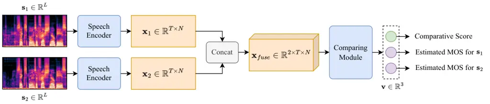

# URGENT-PK: Perceptually-Aligned Ranking Model Designed for Speech Enhancement Competition

¹Jiahe Wang, ¹Chenda Li, ¹Wei Wang, ¹Wangyou Zhang, ²Samuele Cornell,
³Marvin Sach, ⁴Robin Scheibler,  
⁵Kohei Saijo, ³Yihui Fu, ⁶Zhaoheng Ni, ⁴Anurag Kumar, ³Tim Fingscheidt,
²Shinji Watanabe, ¹Yanmin Qian Affiliation: ¹Shanghai Jiao Tong
University, China ²Carnegie Mellon University, USA Affiliation: 
³Technische Universität Braunschweig, Germany ⁴Google DeepMind, Japan
⁵Waseda University, Japan ⁶Meta, USA

###### Abstract

The Mean Opinion Score (MOS) is fundamental to speech quality
assessment. However, its acquisition requires significant human
annotation. Although deep neural network approaches, such as DNSMOS and
UTMOS, have been developed to predict MOS to avoid this issue, they
often suffer from insufficient training data. Recognizing that the
comparison of speech enhancement (SE) systems prioritizes a reliable
system comparison over absolute scores, we propose URGENT-PK, a novel
ranking approach leveraging pairwise comparisons. URGENT-PK takes
homologous enhanced speech pairs as input to predict relative quality
rankings. This pairwise paradigm efficiently utilizes limited training
data, as all pairwise permutations of multiple systems constitute a
training instance. Experiments across multiple open test sets
demonstrate URGENT-PK’s superior system-level ranking performance over
state-of-the-art baselines, despite its simple network architecture and
limited training data.

###### Index Terms: 

speech evaluation, scoring model, Mean Opinion Score, comparison-based
method

## I Introduction

The Mean Opinion Score (MOS) is generally regarded as the gold standard
in speech quality assessment (SQA), with wide applications in speech
synthesis, speech enhancement (SE), and other areas. However, since it
requires subjective evaluation by human listeners, obtaining the MOS
requires substantial human resource expenditure and has relatively low
efficiency. To circumvent this problem, researchers have been developing
neural network (NN) based models for MOS prediction directly from the
speech signal, such as DNSMOS \[1, 2\], UTMOS \[3, 4\] and KyotoMOS
\[5\]. Although effective in SQA for in-domain data, these NN-based
methods are generally sensitive to domain mismatch and suffer from
insufficient labeled data and/or increased cost to collect such data,
which may lead to unreliable predictions in unseen conditions. Although
numerous approaches have been proposed to address this issue, such as
self-supervised learning (SSL) \[3, 4, 6, 5\], ensemble learning \[3, 4,
5\], and introducing prior knowledge \[2, 7\], the data scarcity issue
remains unresolved.

Moreover, MOS labels can themselves be noisy due to the subjective
nature of the listening test. For example, when the ITU-T P.808
standard \[8, 9\] is adopted, subjects are asked to rate a list of given
speech samples with absolute category ratings (from 1 to 5), where the
implicit rating standard can vary significantly depending on the
subjects’ personal preference. This can easily lead to incomparable MOS
ratings across different listening tests, making it less effective to
combine multiple existing SQA datasets for training. In contrast to
absolute rating, humans are better at comparing relative speech quality,
i.e., determining whether one speech sample sounds better than another.
Such a simplified design, also known as the A/B test, can provide a more
consistent scoring across listening tests.

Inspired by the above observation, in this paper, we propose a novel
ranking model leveraging pairwise comparisons, named URGENT-PK (also
abbreviated as ‘UG-PK’ in this paper). ‘PK’ is the abbreviation of the
phrase ‘Player Kill’, where two players compete with each other, and a
winner is determined. URGENT-PK is trained to predict the relative
speech quality from a pair of input speeches. Here, we associate this
model with the speech enhancement (SE) task, where the model is used to
rank various SE models in a strategic manner.

URGENT-PK has two components: an utterance-level pairwise model and a
system-level ranking algorithm. The pairwise model takes paired speech
samples from different enhancement systems processing the same noisy
input, then outputs a comparative score $`p`$ where $`p>0.5`$ indicates
that the first sample has higher quality and $`p<=0.5`$ indicates the
opposite condition. The pairwise learning methodology has been applied
in previous work for channel selection, named MicRank \[10\], and can
also be extended to other tasks, such as speech synthesis \[11\], voice
conversion \[12\], and information retrieval RankNet \[13\]. Unlike
RankNet \[13\] and MicRank \[10\], URGENT-PK explicitly models the
pairwise comparison in the architecture via a comparison module, and
directly estimates the winner of the pairwise input. As such, the
system-level ranking algorithm traverses through all the binary
permutations among the systems, for each pair, the algorithm then
compares all the homologous enhanced speech pairs to accumulate scores
for the systems. Finally, the systems are ranked according to their
accumulated scores. This system-level ranking algorithm is another
crucial difference from RankNet, where inference is instead performed
via the model forward pass.



Fig. 1: The overall structure of the utterance-level pairwise model.

The URGENT-PK models are trained on the urgent24 \[14\] dataset and
tested on the urgent25 \[15\] dataset as well as the CHiME-7 UDASE
dataset \[16\]. The utilized datasets’ information will be detailed in
Section III-A. Two widely used MOS estimation models, DNSMOS \[1, 2\]
and UTMOS \[3\], are chosen as baselines. Experimental results
demonstrate that our proposed URGENT-PK ranking model comprehensively
outperforms the state-of-the-art baseline models, meanwhile showing
stronger generalization capabilities, even with a rather simple and
lightweight model architecture and very limited training data.

## II Pairwise Comparison-based Ranking Model

### II-A Utterance-level Pairwise Model

The utterance-level pairwise model receives a pair of speech samples and
compares their quality through neural networks. We apply a simple and
intuitive Encoder-Comparing Module architecture as shown in Figure 1.
The speech encoder first processes the input pair of speech samples
$`\textbf{s}_{1}`$ and $`\textbf{s}_{2}`$ separately, and extracts a
pair of temporal embeddings $`\textbf{x}_{1}`$ and $`\textbf{x}_{2}`$,
where $`\textbf{s}_{1},\textbf{s}_{2}\in\mathbb{R}^{L}`$ and
$`\textbf{x}_{1},\textbf{x}_{2}\in\mathbb{R}^{T\times N}`$, $`L`$
denotes the speech length, $`T`$ and $`N`$ denote the temporal dimension
and the feature dimension, respectively. The pair of embeddings are
concatenated by an additional channel dimension to form a fused feature
$`\operatorname{Concat}[\textbf{x}_{1},\textbf{x}_{2}]\in\mathbb{R}^{2\times T\times N}`$.
The comparing module is then employed to predict a comparative score
$`\text{SCORE}_{\mathrm{cp}}\in[0,1]`$ from the fused feature. To ensure
that the pairwise model captures knowledge about human ear’s perception
of speech quality, it is designed to additionally predict the MOS of
both input speech samples, denoted as $`\text{MOS}_{\mathrm{pre}}^{1}`$
and $`\text{MOS}_{\mathrm{pre}}^{2}`$. For the sake of clarity, in this
paper, we set $`\text{SCORE}_{\mathrm{cp}}`$,
$`\text{MOS}_{\mathrm{pre}}^{1}`$ and $`\text{MOS}_{\mathrm{pre}}^{2}`$
callable to denote the usage of each output. Note that the use of such a
pairwise comparing module makes the proposed approach fundamentally
differeserent from RankNet \[13\] and MicRank \[10\], which enforce
ranking relationships only implicitly through their loss functions
rather than through dedicated architectural components.

Now, we explain the details about each module:

#### II-A1 Log-mel Spectrum Encoder

Since the proposed model is aimed at simulating the human ear’s
perception, the first choice of the speech encoder in the
utterance-level pairwise model is the log-mel spectrum. Unlike
conventional frequency representations that operate on a linear scale,
the log-mel spectrum employs the mel scale to mimic the way human
perceives pitch differences, where changes in pitch are perceived more
acutely at lower frequencies than at higher frequencies. The number of
mel filters is set to 120 in our experiments.

#### II-A2 UTMOS-based Encoder

UTMOS \[3\] is a state-of-the-art MOS prediction model that employs a
sophisticated ensemble learning framework combining strong and weak
learners to achieve superior performance. At its core, the strong
learner processes raw speech waveforms through a pre-trained
self-supervised learning (SSL) model to extract frame-level features,
which are then passed through a BiLSTM network and linear layer to
predict frame-level MOS rather than using averaged features.
Furthermore, to address the variability in human ear’s perception, UTMOS
incorporates listener-specific embeddings concatenated with SSL
features, while domain IDs help adapt to different datasets. The system
further boosts accuracy through phoneme encoding, where an ASR model
transcribes utterances into phoneme sequences that are processed
alongside clustered reference texts using a dedicated phoneme encoder.
To prevent overfitting, especially for the data-scarce out-of-domain
track, UTMOS also applies carefully calibrated data augmentation
techniques like pitch-shifting and speaking-rate modification.

In this paper, we adopt UTMOS as an alternative encoder, as it was the
top MOS predictor in the VoiceMOS Challenge 2022 \[17\] and has shown
high correlations to MOS obtained from the subjective listening tests in
the URGENT 2024 \[14\] and 2025 \[15\] Challenges, surpassing DNSMOS
\[1\] and NISQA \[18\]. In this way, we can investigate the impact of
incorporating prior knowledge about human perception in the URGENT-PK
model. We remove the final layer of the UTMOS model to extract the
1024-dimensional latent feature.

#### II-A3 ResNet-based Comparing Module

To ensure that the embeddings of the two speech samples,
$`\textbf{x}_{1}`$ and $`\textbf{x}_{2}`$, are sufficiently processed
for accurate comparison, in this paper, we employ the modified
ResNet34 \[19, 20\] architecture as the comparison module. ResNet34 is a
34-layer deep convolutional neural network (CNN) that introduces
residual learning with skip connections, which has been widely utilized
for speech feature processing \[21, 22, 23\].

Considering the input shape $`(2,T,N)`$ of the fused feature as
introduced in Section II-A, the ResNet34 begins with a convolutional
layer equipped with 32 filters and kernel size of $`3\times 3`$,
followed by a batch normalization layer and a Rectified Linear Unit
(ReLU) activation function. This initial layer is designed to capture
basic features from the input data, yielding an output embedding of
$`(32,T,N)`$.

Subsequently, the model undergoes a four-stage processing procedure,
with each stage employing several residual blocks, where the number is
set to $`[3,4,6,3]`$. In each residual block, there are two
convolutional layers, each followed by a batch normalization layer and a
ReLU activation function, the kernel size is set to a fixed shape of
$`3\times 3`$. In the first stage, the stride of all the convolutional
layers is set to 1, whereas in the remaining three stages, the stride of
the first convolutional layer in the first residual block is set to 2
and the rest are set to 1. This four-stage process yields an output
embedding of $`(256,\frac{T}{8},\frac{N}{8})`$.

After that, the model performs both mean pooling and variance pooling
along the temporal dimension and concatenates the outputs together by
the feature dimension. This yields an output embedding of
$`\mathbb{R}^{64\times N}`$. In the end, a linear layer is employed to
obtain the comparative score $`\text{SCORE}_{\mathrm{cp}}`$, as well as
the estimated MOS for both inputs $`\text{MOS}_{\mathrm{pre}}^{1}`$ and
$`\text{MOS}_{\mathrm{pre}}^{2}`$, yielding a final output of
$`\mathbb{R}^{3}`$.

### II-B System-level Ranking Algorithm

In Section II-A, we propose an utterance-level pairwise model that
accepts two homologous speeches as input, and outputs a comparative
score, as well as the estimated MOS. This model is designed to find out
the one with higher speech quality from a speech pair. However, in real
application scenarios, the MOS listening test mainly aims at obtaining
the final system-level rankings instead of utterance-wise comparisons.
To this end, based on the utterance-level comparison, a system-level
Enumerating-Comparing-Scoring (ECS) ranking algorithm is proposed, as
shown in Algorithm 1.

Input: The set of enhanced speeches: $`\{\mathbf{s}_{k}^{i}\}`$, where
$`\mathbf{s}_{k}^{i}`$ denotes the enhanced speech of the $`i^{th}`$
noisy speech in the dataset by the $`k^{th}`$ system.

Output: The accumulated score of each system: $`\{p_{k}\}`$

$`\mathcal{P}=\{(k,w)|k,w\in\{1,2,...,K\},k<w\}`$

$`p_{k}=0,k\in\{1,2,...,K\}`$

for _$`(k,w)\in\mathcal{P}`$_ do

   // compare system $`k`$ and system $`w`$

   for _$`i\in\{1,2,...,M\}`$_ do

      $`score=\text{SCORE}_{\mathrm{cp}}(\mathbf{s}_{k}^{i},\mathbf{s}_{w}^{i})`$

      if _Binary Scoring_ then

         if _$`score>0.5`$_ then

            $`p_{k}=p_{k}+1`$ // system $`k`$ wins

         else

            $`p_{w}=p_{w}+1`$ // system $`w`$ wins

      else

         $`p_{k}=p_{k}+score`$

         $`p_{w}=p_{w}+(1-score)`$

   end for

end for

return $`\{p_{k}\}`$

Algorithm 1 System-level ECS Ranking Algorithm

We assume that there are a total of $`K`$ systems to be ranked, each
producing $`M`$ enhanced speech samples from the same noisy speech
dataset. The enhanced speeches are denoted as
$`\{\mathbf{s}_{k}^{i}\}`$, where $`\mathbf{s}_{k}^{i}`$ denotes the
enhanced speech of the $`i^{th}`$ noisy speech in the dataset by the
$`k^{th}`$ system, $`k\in\{1,2,...,K\}`$ and $`i\in\{1,2,...,M\}`$. The
proposed ECS ranking algorithm first traverses all pairs of the $`K`$
systems, resulting in a total of $`\frac{K\times(K-1)}{2}`$ iterations.
For each pair of systems $`(k,w)`$, the algorithm then traverses each
pair of enhanced speeches $`(\mathbf{s}_{k}^{i},\mathbf{s}_{w}^{i})`$,
produced by the two systems from the same $`i^{th}`$ noisy speech. Each
speech pair is fed into the utterance-level pairwise model to generate a
comparative score, based on which the ranking algorithm then assigns
scores to both of the systems. This yields a total of
$`\frac{K\times(K-1)}{2}\times M`$ iterations. Given that the
comparative score ranges from $`0`$ to $`1`$, we further design two
scoring strategies: a Binary Scoring (BS) strategy and a non-Binary
Scoring (NBS) strategy.

#### II-B1 Binary Scoring Strategy

In the Binary Scoring (BS) strategy, for each pair of input speech
samples, the algorithm assigns one point to the system offering the
higher-quality speech, and zero points to the system offering the
lower-quality speech.

#### II-B2 Non-Binary Scoring Strategy

In the Binary Scoring (BS) strategy, only the system offering the
higher-quality speech receives points, where the quantifiable difference
between the two speech samples is overlooked. In contrast, in the
non-Binary Scoring (NBS) strategy, the algorithm assigns corresponding
scores to both systems based on the comparative result, assigning
$`\text{SCORE}_{\mathrm{cp}}`$ points to the first system and
$`1-\text{SCORE}_{\mathrm{cp}}`$ points to the second.

## III Experiment

### III-A Datasets

In this paper, the challenge submissions in the final blind test phases
of the URGENT Challenge 2024 \[14\] and URGENT Challenge 2025 \[15\], as
well as the CHiME-7 UDASE \[16, 24, 25\] evaluation data, are chosen for
experimental validation. In URGENT Challenge 2024, 22 teams competed by
enhancing a total of 1000 noisy speech samples, among which the
enhancement results of 300 noisy speech samples in English contained MOS
labels, forming an $`\text{urgent24}_{\mathrm{en}}`$ subset. In URGENT
Challenge 2025, 21 teams competed by enhancing a total of 900 noisy
speech samples, among which the enhancement results of 600 noisy speech
samples had MOS labels. These 600 speech samples are further divided
into four subsets based on the four distinct languages. In the CHiME-7
UDASE dataset, four teams competed by enhancing a total of 241 noisy
speech samples, among which the enhancement results of 128 noisy speech
samples contained MOS labels. For each dataset, we include the set of
unprocessed noisy speeches as an additional system. Detailed information
about these datasets is presented in Table I.

|                                   |       |           |              |               |
| --------------------------------- | ----- | --------- | ------------ | ------------- |
| dataset                           | lang. | \#systems | \#utt/system | len(s)/system |
| $`\text{urgent24}_{\mathrm{en}}`$ | en    | 23        | 300          | 2160          |
| $`\text{urgent25}_{\mathrm{en}}`$ | en    | 22        | 150          | 921           |
| $`\text{urgent25}_{\mathrm{de}}`$ | de    | 22        | 150          | 1171          |
| $`\text{urgent25}_{\mathrm{jp}}`$ | jp    | 22        | 150          | 1010          |
| $`\text{urgent25}_{\mathrm{zh}}`$ | zh    | 22        | 150          | 947           |
| CHiME-7                           | en    | 5         | 128          | 606           |

TABLE I: Detailed information of the used datasets. Note that
‘len(s)/system’ denotes the total lengths of enhanced speeches for each
system, measured in seconds.

In this paper, the models are trained on the
$`\text{urgent24}_{\mathrm{en}}`$ dataset (8 utterances for validation
and 292 utterances for training), and all other aforementioned datasets
are used as test sets. In particular, we employed CHiME-7 UDASE and
multiple multilingual test sets from URGENT 2025 to evaluate the model’s
generalization capability to unseen domains and languages, respectively.

### III-B Data cleaning

Although MOS is often considered as the gold standard, this
human-evaluated metric exhibits inherent drawbacks, including subjective
biases and high variability. Firstly, different scorers can assign
divergent quality evaluations to the same speech sample. Secondly,
distinct perceptual sensitivities exist between different scorers when
comparing speech pairs. In addition, intra-scorer inconsistencies may
arise due to poor attitudes and fluctuating attentional states during
the MOS test. Although the impact is negligible when comparing speech
pairs with significant quality discrepancies, they can influence the
comparison between rather similar quality speech pairs, thus confusing
the pairwise model in the training stage. To mitigate this influence
induced by the aforementioned drawbacks, following prior works \[10\],
we implement a data cleaning scheme that ignores, during training,
speech pairs with close MOS values, which can be considered to have
indistinguishable perceptual quality.

Specifically, we set a ‘MOS difference threshold’, $`\delta`$, to filter
the speech pairs in the dataset. For each pair of speech samples, only
when the MOS difference exceeded the threshold $`\delta`$ are they
included in the training data. This filtering strategy can, to some
extent, improve the quality of the training data, but concurrently
results in the loss of data volume. In this paper, we set the score
difference threshold to $`\delta=0.3`$, aiming to reach a tradeoff
between data quality and quantity. Ablation studies in Section III-F4
demonstrate the rationality of this threshold setting.

### III-C Training Details

#### III-C1 Training Objective

Multi-task learning is used in this paper, where the pairwise model is
trained not only to compare the two input speech samples, but also to
predict their MOS. In this way, the model is guided to capture knowledge
about the human ears’ perception of speech quality. We apply the binary
cross-entropy (BCE) loss on the comparative score and the mean square
error (MSE) loss on the estimated MOS. The loss function can be
formulated as follows:

```math
\displaystyle\mathcal{L}_{\mathrm{cp}} \displaystyle=\operatorname{BCE}(\text{SCORE}_{\mathrm{cp}},\operatorname{int}(\mathrm{MOS}_{1}>\mathrm{MOS}_{2})), \tag{1}
```

```math
\displaystyle\mathcal{L}_{\mathrm{sc}} \displaystyle=\operatorname{MSE}([\text{MOS}_{\mathrm{pre}}^{1},\text{MOS}_{\mathrm{pre}}^{2}],[\mathrm{MOS}_{1},\mathrm{MOS}_{2}]), \tag{2}
```

```math
\displaystyle\mathcal{L} \displaystyle=\alpha\times\mathcal{L}_{\mathrm{cp}}+\beta\times\mathcal{L}_{\mathrm{sc}}. \tag{3}
```

where $`\mathrm{MOS}_{1},\mathrm{MOS}_{2}\in[1.0,5.0]`$ denote the
averaged MOS scores annotated by 8 listeners for first and second
speech, respectively. The $`\alpha`$ and $`\beta`$ is set to 0.5 and 0.5
in the experiments.

#### III-C2 Other Training Details

For the UTMOS encoder-based URGENT-PK models, the batch size is set to
4, the initial learning rate is set to $`1.0\times 10^{-5}`$ with weight
decay of $`1.0\times 10^{-6}`$, and the models were trained for 15
epochs. For the log-mel spectrum-based URGENT-PK models, the batch size
is set to 12, the initial learning rate is set to $`1.0\times 10^{-4}`$
with a weight decay of $`1.0\times 10^{-6}`$, and the models were
trained for 30 epochs. These parameters were determined by tuning each
system on the validation set.

### III-D Evaluation Metrics

Following previous works \[3, 4\], in this paper, three correlations are
chosen as the evaluation metrics: the Linear Correlation Coefficient
(LCC), the Spearman Rank Correlation Coefficient \[26\] (SRCC), and the
Kendall Rank Correlation Coefficient \[27\] (KRCC). LCC assumes
normality and linearity, while both SRCC and KRCC serve as
non-parametric alternatives requiring fewer distributional assumptions.
For all metrics, the higher is the better. In the experiments,
system-level correlations are calculated between the accumulated scores
by the ECS ranking algorithm and the oracle average MOS.

### III-E Validation Strategy

Throughout the training stage, we save the best $`9`$ model checkpoints
based on the objective functions on the validation set. For each of the
saved checkpoints, we perform the system-level ECS ranking algorithm on
the validation set and calculate the three above-mentioned correlation,
LCC, SRCC and KRCC. We sum up the three correlations and select the
checkpoint with the highest one for testing.

### III-F Experimental Results

#### III-F1 Comparison with Baselines

In this paper, two widely-used speech quality evaluation model, DNSMOS
\[1\] (overall MOS) and UTMOS \[3\], are chosen as the baselines. To
make a fair comparison, the UTMOS model is also fine-tuned on the
training set $`\text{urgent24}_{\mathrm{en}}`$. Furthermore, since the
proposed ECS ranking algorithm can also combine with other MOS
prediction models by comparing the estimated score, we also build a
$`\text{UTMOS}_{pk}`$ system, which performs the ECS ranking algorithm
and the BS strategy, comparing the UTMOS scores of the two speech
samples each time.

|                                      |          |                                   |       |       |                                   |       |       |                                   |       |       |                |        |        |
| ------------------------------------ | -------- | --------------------------------- | ----- | ----- | --------------------------------- | ----- | ----- | --------------------------------- | ----- | ----- | -------------- | ------ | ------ |
| dataset                              |          | $`\text{urgent25}_{\mathrm{zh}}`$ |       |       | $`\text{urgent25}_{\mathrm{jp}}`$ |       |       | $`\text{urgent25}_{\mathrm{de}}`$ |       |       | CHiME-7 UDASE² |        |        |
| Model                                | Strategy | KRCC                              | SRCC  | LCC   | KRCC                              | SRCC  | LCC   | KRCC                              | SRCC  | LCC   | KRCC           | SRCC   | LCC    |
| DNSMOS                               | /        | 0.472                             | 0.606 | 0.831 | 0.446                             | 0.598 | 0.816 | 0.489                             | 0.612 | 0.795 | 0.000          | -0.100 | -0.140 |
| UTMOS                                | /        | 0.524                             | 0.666 | 0.665 | 0.602                             | 0.775 | 0.822 | 0.671                             | 0.857 | 0.854 | 0.200          | 0.200  | 0.267  |
| $`\text{UTMOS}_{ft}`$                | /        | 0.655                             | 0.824 | 0.899 | 0.686                             | 0.842 | 0.914 | 0.760                             | 0.891 | 0.920 | 0.067          | 0.371  | 0.316  |
| $`\text{UTMOS}_{pk}`$                | /        | 0.567                             | 0.718 | 0.734 | 0.576                             | 0.743 | 0.773 | 0.671                             | 0.829 | 0.821 | 0.000          | -0.100 | 0.100  |
|                                      | BS       | 0.619                             | 0.815 | 0.895 | 0.703                             | 0.857 | 0.920 | 0.749                             | 0.905 | 0.929 | 0.200          | 0.300  | 0.289  |
| $`\text{UG-PK}_{\text{mel}}`$        | NBS      | 0.593                             | 0.791 | 0.896 | 0.723                             | 0.870 | 0.921 | 0.740                             | 0.902 | 0.932 | 0.200          | 0.300  | 0.283  |
|                                      | BS       | 0.628                             | 0.778 | 0.825 | 0.703                             | 0.852 | 0.849 | 0.810                             | 0.944 | 0.905 | 0.400          | 0.500  | 0.402  |
| $`\text{UG-PK}_{\text{UTMOS}(fix)}`$ | NBS      | 0.654                             | 0.797 | 0.850 | 0.714                             | 0.875 | 0.878 | 0.810                             | 0.940 | 0.922 | 0.400          | 0.500  | 0.382  |
|                                      | BS       | 0.706                             | 0.888 | 0.929 | 0.706                             | 0.880 | 0.891 | 0.835                             | 0.951 | 0.933 | 0.400          | 0.500  | 0.489  |
| $`\text{UG-PK}_{\text{UTMOS}(ft)}`$  | NBS      | 0.723                             | 0.893 | 0.930 | 0.732                             | 0.896 | 0.895 | 0.835                             | 0.951 | 0.934 | 0.400          | 0.500  | 0.485  |

- 2
  Note that the calculated KRCC and SRCC exhibit a coarse resolution
  because there are only 5 systems in CHiME-7 UDASE.

TABLE II: Generalization capability of the proposed URGENT-PK model on
multiple out-domain test sets comparing with the baselines, measured by
correlations between the models’ output score and the oracle MOS. Models
are trained on $`\text{urgent24}_{\mathrm{en}}`$.

The models are trained on the $`\text{urgent24}_{\mathrm{en}}`$ dataset.
First, we compare our proposed model with the baselines on the
$`\text{urgent25}_{\mathrm{en}}`$ dataset. As shown in Table III, our
proposed pairwise comparison-based URGENT-PK models consistently
outperform the baselines. Even the $`\text{URGENT-PK}_{\mathrm{mel}}`$
system trained from scratch with limited data shows a better overall
performance than the fine-tuned UTMOS. Note that the latter possesses a
certainly more powerful speech encoder pretrained on thousands of hours
of data. In addition, as for the URGENT-PK models with different
encoders, the mel spectrum-based model shows comparable performance with
the UTMOS-based model, where the former performs better on KRCC and SRCC
and the latter performs better on LCC. These experimental results fully
demonstrate the superiority of our proposed comparison-based ranking
approach, where considerable performance is achieved even with a simple
model architecture and limited training data. Regarding the upper
performance of the URGENT-PK model, the model with fine-tuned UTMOS
achieves the best performance. This is expected as this system
simultaneously possesses the most complex model architecture and has
been trained with the most training data.

|                                      |          |       |       |       |
| ------------------------------------ | -------- | ----- | ----- | ----- |
| Model                                | Strategy | KRCC  | SRCC  | LCC   |
| DNSMOS                               | /        | 0.602 | 0.713 | 0.847 |
| UTMOS                                | /        | 0.835 | 0.951 | 0.894 |
| $`\text{UTMOS}_{ft}`$                | /        | 0.814 | 0.944 | 0.939 |
| $`\text{UTMOS}_{pk}`$                | /        | 0.766 | 0.928 | 0.842 |
| $`\text{UG-PK}_{\text{mel}}`$        | BS       | 0.835 | 0.955 | 0.930 |
|                                      | NBS      | 0.853 | 0.960 | 0.935 |
| $`\text{UG-PK}_{\text{UTMOS}(fix)}`$ | BS       | 0.827 | 0.954 | 0.938 |
|                                      | NBS      | 0.853 | 0.957 | 0.965 |
| $`\text{UG-PK}_{\text{UTMOS}(ft)}`$  | BS       | 0.879 | 0.971 | 0.955 |
|                                      | NBS      | 0.879 | 0.972 | 0.959 |

TABLE III: Experimental results of the proposed URGENT-PK model
comparing with the baselines, measured by correlations between the
models’ output score and the oracle MOS. Models are trained on
$`\text{urgent24}_{\mathrm{en}}`$ and tested on
$`\text{urgent25}_{\mathrm{en}}`$.

Subsequently, more out-of-domain test sets are included to evaluate the
generalization capability of our proposed URGENT-PK model, including
three multilingual subsets from the URGENT Challenge 2025, as well as
the CHiME-7 UDASE evaluation dataset. Experimental results show that our
proposed URGENT-PK model still generally outperforms the baselines,
where the only exception is that the mel spectrogram-based URGENT-PK
model performs slightly worse than the fine-tuned UTMOS on
$`\text{URGENT25}_{\mathrm{zh}}`$. As for different URGENT-PK models, a
similar performance trend is observed, where the mel spectrum-based
model and the UTMOS-based model performs comparably and the model with
fine-tuned UTMOS yields the best performance.

|                              |          |            |            |            |          |      |
| ---------------------------- | -------- | ---------- | ---------- | ---------- | -------- | ---- |
| UG-PK Models                 | \[0,0.4) | \[0.4,0.8) | \[0.8,1.2) | \[1.2,1.6) | \[1.6,2) | Avg  |
| $`\text{MOS}_{\mathrm{cp}}`$ | 0.70     | 0.80       | 0.95       | 1.00       | 1.00     | 0.89 |
| mel                          | 0.75     | 0.55       | 0.85       | 0.85       | 0.95     | 0.79 |
| $`\text{UTMOS}_{(fix)}`$     | 0.85     | 0.70       | 0.80       | 0.95       | 1.00     | 0.86 |
| $`\text{UTMOS}_{(ft)}`$      | 0.80     | 0.65       | 0.90       | 0.95       | 1.00     | 0.86 |

TABLE IV: The A/B Test of the utterance-level pairwise model. The
comparative accuracy of the pairwise models as well as the MOS
comparison are measured referring to the subjective comparative label.
Models are trained on $`\text{urgent24}_{\mathrm{en}}`$ and tested on
$`\text{urgent25}_{\mathrm{en}}`$, and abbreviated by the speech
encoder.

#### III-F2 Subjective A/B Test of the Utterance-level Pairwise Model

The performance of the utterance-level pairwise model is then
investigated by a subjective A/B Test on speech quality comparison.
Specifically, test speech pairs are divided into several groups based on
a different range of MOS differences, where 20 speech pairs are randomly
selected for each group. Subjective A/B test is conducted on these
selected pairs, where 5 human participants listened to and labeled each
pair, selecting the higher-quality speech. The comparison accuracy of
the pairwise model, as well as the MOS comparison, is measured with
reference to the subjective label. Note that speech pairs with MOS
differences larger than 2 are ignored as the comparative accuracy is
consistently $`1.00`$.

The experimental results are shown in Table IV, from which we can
summarize several key findings as follows: Firstly, larger MOS
difference generally brings better performance for the pairwise model,
except for the group with MOS difference in the range of $`[0.4,0.8)`$.
This is acceptable considering that the limited quantity of test data
may cause performance fluctuations. Secondly, the accuracy of MOS
comparison becomes pretty low when the MOS difference is quite small,
even lower than the pairwise model in the range of $`[0.0,0.4)`$. This
finding preliminarily signifies the necessity of training data cleaning,
which will be further investigated in Section III-F4. Lastly, in
general, our proposed pairwise models achieved considerable performance
in the subjective A/B test, with their comparative accuracy reaching a
level comparable to that of the MOS comparison, or even outperforming it
in the range of $`[0.0,0.4)`$.

#### III-F3 Ablation Study on the Predicted MOS

The utterance-level pairwise model not only generates a comparative
score, but also estimates the MOS of the input speech samples. Although
the predicted MOS are primarily designed for multi-task learning, they
enable the model to directly serve as a speech quality evaluation model.
In order to verify whether the pairwise model has learned about human
ear’s perception, we include an ablation study to assess the performance
of MOS prediction. Two strategies are designed to transform the pairwise
model into a speech quality assessment (SQA) model: the Replication
Strategy and the Noisy-Speech Strategy.

In the Replication Strategy, the enhanced speech sample $`\mathbf{s}`$
is replicated and fed into the pairwise model to get the predicted MOS,
the average of both the predicted MOS is used as the final evaluation
score, which can be formulated as
$`\text{MOS}_{\mathrm{pre}}={(\text{MOS}_{\mathrm{pre}}^{1}(\mathbf{s},\mathbf{s})+\text{MOS}_{\mathrm{pre}}^{2}(\mathbf{s},\mathbf{s}))}/{2}`$.

In the Noisy-Speech Strategy, the enhanced speech sample $`\mathbf{s}`$
and its corresponding unprocessed noisy speech $`\mathbf{n}`$ are fed
into the pairwise model. Their positions are swapped to go through the
model twice, thus two predicted MOS are obtained and the average is used
as final evaluation score, which can be formulated as
$`\text{MOS}_{\mathrm{pre}}={(\text{MOS}_{\mathrm{pre}}^{1}(\mathbf{s},\mathbf{n})+\text{MOS}_{\mathrm{pre}}^{2}(\mathbf{n},\mathbf{s}))}/{2}`$,

|                                      |              |       |       |       |
| ------------------------------------ | ------------ | ----- | ----- | ----- |
| Model                                | Strategy     | KRCC  | SRCC  | LCC   |
| DNSMOS                               | /            | 0.602 | 0.713 | 0.847 |
| UTMOS                                | /            | 0.835 | 0.951 | 0.894 |
| $`\text{UG-PK}_{\text{mel}}`$        | Replication  | 0.706 | 0.886 | 0.928 |
|                                      | Noisy-Speech | 0.766 | 0.914 | 0.937 |
| $`\text{UG-PK}_{\text{UTMOS}(fix)}`$ | Replication  | 0.844 | 0.950 | 0.950 |
|                                      | Noisy-Speech | 0.861 | 0.962 | 0.960 |
| $`\text{UG-PK}_{\text{UTMOS}(ft)}`$  | Replication  | 0.905 | 0.974 | 0.987 |
|                                      | Noisy-Speech | 0.887 | 0.971 | 0.966 |

TABLE V: Ablation study of the predicted MOS, measured by the
correlations between the predicted MOS and the oracle MOS. Models are
trained on $`\text{urgent24}_{\mathrm{en}}`$ and tested on
$`\text{urgent25}_{\mathrm{en}}`$

Experimental results are presented in Table V, where several conclusions
can be drawn as follows: Firstly, considerable performance is achieved
when utilizing the utterance-level pairwise model as an utterance
evaluation model, which suggests that the pairwise model has indeed
captured knowledge about human ear’s perception. Secondly, the
UTMOS-based pairwise model significantly outperforms the mel
spectrum-based model. This is predictable since UTMOS is specifically
designed for SQA and has already learned substantial knowledge about
SQA. However, the mel spectrum-based pairwise model still
comprehensively outperforms DNSMOS, and outperforms UTMOS in terms of
LCC, demonstrating the superiority of the proposed pairwise model
despite its limited training data.

#### III-F4 Ablation Study on the Data Cleaning

Finally, the ablation study on the data cleaning introduced in III-B, is
conducted by setting various MOS difference threshold, $`\delta`$, and
testing the model’s performance. Figure 2 shows the experimental
results, where each $`\delta`$ yields a different amount of training
data. The $`\text{URGENT-PK}_{\mathrm{mel}}`$ system and the Binary
Scoring strategy is employed in the ablation study.

Fig. 2: Ablation study of the MOS difference threshold $`\delta`$ in
data cleaning. Models are trained on $`\text{urgent24}_{\mathrm{en}}`$
and tested on $`\text{urgent25}_{\mathrm{en}}`$

Based on the bar graph presented in Figure 2, we can draw the following
conclusions: First, when the difference threshold $`\delta`$ is rather
small, gradually increasing $`\delta`$ consistently produces better
performance, since a larger $`\delta`$ value removes more confusing
training speech pairs from the dataset without losing too much training
data. However, after $`\delta`$ reaches $`0.3`$, which is the
experimental setting in this paper, continuing to increase $`\delta`$
will deteriorate the model’s performance. This is because a larger MOS
difference implies a more evident difference in quality, indicating that
the speech pairs are no more confusing. At this point, increasing
$`\delta`$ only results in the loss of training data, thus reducing the
capability and robustness of the pairwise model.

## IV Conclusion

In this paper, we propose a pairwise comparison-based URGENT-PK ranking
model designed for speech enhancement competitions. URGENT-PK consists
of an utterance-level pairwise model and a system-level ranking
algorithm. The pairwise model takes two homologous speech samples as
input and generates a comparative score. The proposed
Enumerating-Comparing-Scoring ranking algorithm traverses all the system
pairs and accumulates scores for each system. Extensive experiments
demonstrate that URGENT-PK surpasses state-of-the-art NN-based SQA
baselines when facing the real data of speech enhancement competitions,
even with a simple network architecture and limited training data. In
future work, we aim to improve the model’s performance further, as well
as to extend the proposed method to a broader range of tasks.

## References

- \[1\] Chandan KA Reddy, Vishak Gopal, and Ross Cutler. DNSMOS: A
  non-intrusive perceptual objective speech quality metric to evaluate
  noise suppressors. In ICASSP, pages 6493–6497. IEEE, 2021.
- \[2\] Chandan KA Reddy, Vishak Gopal, and Ross Cutler. DNSMOS P.835: A
  non-intrusive perceptual objective speech quality metric to evaluate
  noise suppressors. In ICASSP, pages 886–890. IEEE, 2022.
- \[3\] Takaaki Saeki, Detai Xin, Wataru Nakata, Tomoki Koriyama,
  Shinnosuke Takamichi, and Hiroshi Saruwatari. UTMOS: UTokyo-SaruLab
  system for VoiceMOS challenge 2022. In Interspeech, pages
  4521–4525, 2022.
- \[4\] Kaito Baba, Wataru Nakata, Yuki Saito, and Hiroshi Saruwatari.
  The t05 system for the VoiceMOS Challenge 2024: Transfer learning from
  deep image classifier to naturalness MOS prediction of high-quality
  synthetic speech. In IEEE Spoken Language Technology Workshop
  (SLT), 2024.
- \[5\] Wangjin Zhou, Zhengdong Yang, Sheng Li, and Chenhui Chu.
  KyotoMOS: An automatic MOS scoring system for speech synthesis. In
  Proceedings of the 5th ACM International Conference on Multimedia in
  Asia Workshops, pages 1–3, 2023.
- \[6\] Erica Cooper, Wen-Chin Huang, Tomoki Toda, and Junichi
  Yamagishi. Generalization ability of MOS prediction networks. In
  ICASSP, pages 8442–8446, 2022.
- \[7\] Wen-Chin Huang, Erica Cooper, Junichi Yamagishi, and Tomoki
  Toda. LDNet: Unified listener dependent modeling in MOS prediction for
  synthetic speech. In ICASSP, pages 896–900, 2022.
- \[8\] ITU-T. ITU-T recommendation P.808, subjective evaluation of
  speech quality with a crowdsourcing approach. ITU-T, June 2018.
- \[9\] Babak Naderi and Ross Cutler. An open source implementation of
  ITU-T recommendation P.808 with validation. In Interspeech, pages
  2862–2866, 2020.
- \[10\] Samuele Cornell, Alessio Brutti, Marco Matassoni, and Stefano
  Squartini. Learning to rank microphones for distant speech
  recognition. In Interspeech, pages 3855–3859, 2021.
- \[11\] Yishuang Ning, Sheng He, Zhiyong Wu, Chunxiao Xing, and
  Liang-Jie Zhang. A review of deep learning based speech synthesis.
  Applied Sciences, 9(19):4050, 2019.
- \[12\] Berrak Sisman, Junichi Yamagishi, Simon King, and Haizhou Li.
  An overview of voice conversion and its challenges: From statistical
  modeling to deep learning. IEEE/ACM Transactions on Audio, Speech, and
  Language Processing, 29:132–157, 2020.
- \[13\] Tie-Yan Liu et al. Learning to rank for information retrieval.
  Foundations and Trends® in Information Retrieval, 3(3):225–331, 2009.
- \[14\] Wangyou Zhang, Robin Scheibler, Kohei Saijo, Samuele Cornell,
  Chenda Li, Zhaoheng Ni, Jan Pirklbauer, Marvin Sach, Shinji Watanabe,
  Tim Fingscheidt, and Yanmin Qian. URGENT challenge: Universality,
  robustness, and generalizability for speech enhancement. In
  Interspeech, pages 4868–4872, 2024.
- \[15\] Kohei Saijo, Wangyou Zhang, Samuele Cornell, Robin Scheibler,
  Chenda Li, Zhaoheng Ni, Anurag Kumar, Marvin Sach, Yihui Fu, Wei Wang,
  Tim Fingscheidt, and Shinji Watanabe. Interspeech 2025 URGENT speech
  enhancement challenge. Accepted by Interspeech, 2025.
- \[16\] Simon Leglaive, Matthieu Fraticelli, Hend ElGhazaly, Léonie
  Borne, Mostafa Sadeghi, Scott Wisdom, Manuel Pariente, John Hershey,
  Daniel Pressnitzer, and Jon Barker. CHiME-7 UDASE evaluation data,
  February 2024.
- \[17\] Wen Chin Huang, Erica Cooper, Yu Tsao, Hsin-Min Wang, Tomoki
  Toda, and Junichi Yamagishi. The voicemos challenge 2022. In
  Interspeech 2022, pages 4536–4540, 2022.
- \[18\] Gabriel Mittag, Babak Naderi, Assmaa Chehadi, and Sebastian
  Möller. Nisqa: A deep cnn-self-attention model for multidimensional
  speech quality prediction with crowdsourced datasets. In
  Interspeech, 2021.
- \[19\] Kaiming He, Xiangyu Zhang, Shaoqing Ren, and Jian Sun. Deep
  residual learning for image recognition. In Proceedings of the IEEE
  Conference on Computer Vision and Pattern Recognition (CVPR),
  June 2016.
- \[20\] Shuai Wang, Yexin Yang, Zhanghao Wu, Yanmin Qian, and Kai Yu.
  Data Augmentation Using Deep Generative Models for Embedding Based
  Speaker Recognition. IEEE/ACM Transactions on Audio, Speech, and
  Language Processing, 28:2598–2609, 2020.
- \[21\] Jiahe Wang, Shuai Wang, Junjie Li, Ke Zhang, Yanmin Qian, and
  Haizhou Li. Enhancing speaker extraction through rectifying target
  confusion. In 2024 IEEE Spoken Language Technology Workshop (SLT),
  pages 349–356, 2024.
- \[22\] Yueqing Cheng and Wanjun Yu. Research on resnet34 improved
  model. In 2024 9th International Conference on Intelligent Informatics
  and Biomedical Sciences (ICIIBMS), volume 9, pages 11–14. IEEE, 2024.
- \[23\] Fredrik Cumlin, Xinyu Liang, Victor Ungureanu, Chandan
  K. A. Reddy, Christian Schüldt, and Saikat Chatterjee. DNSMOS Pro: A
  Reduced-Size DNN for Probabilistic MOS of Speech. In Proc. Interspeech
  2024, pages 4818–4822, 2024.
- \[24\] Simon Leglaive, Léonie Borne, Efthymios Tzinis, Mostafa
  Sadeghi, Matthieu Fraticelli, Scott Wisdom, Manuel Pariente, Daniel
  Pressnitzer, and John Hershey. The CHiME-7 UDASE task: Unsupervised
  domain adaptation for conversational speech enhancement. In 7th
  International Workshop on Speech Processing in Everyday Environments
  (CHiME 2023), pages 7–12, 2023.
- \[25\] Simon Leglaive, Matthieu Fraticelli, Hend ElGhazaly, Léonie
  Borne, Mostafa Sadeghi, Scott Wisdom, Manuel Pariente, John R.
  Hershey, Daniel Pressnitzer, and Jon P. Barker. Objective and
  subjective evaluation of speech enhancement methods in the UDASE task
  of the 7th CHiME challenge. Computer Speech & Language,
  89:101685, 2025.
- \[26\] Jerrold H Zar. Spearman rank correlation. Encyclopedia of
  biostatistics, 7, 2005.
- \[27\] Hervé Abdi. The Kendall rank correlation coefficient.
  Encyclopedia of measurement and statistics, 2:508–510, 2007.
