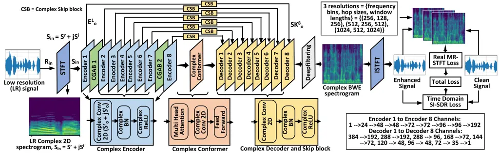

Tamiti Joshi Hasan Hasan Athay Mamun Barua George Mason UniversityUSA
Chittagong University of Engineering & TechnologyBangladesh

# A High-Fidelity Speech Super Resolution Network using a Complex Global Attention Module with Spectro-Temporal Loss

Tarikul Islam    Biraj    Rida    Rashedul    Taieba    Nursad   
Anomadarshi Affiliation: Cyber-Security Engineering
Affiliation: Electronics and Telecommunication Engineering

###### Abstract

Speech super-resolution (SSR) enhances low-resolution speech by
increasing the sampling rate. While most SSR methods focus on magnitude
reconstruction, recent research highlights the importance of phase
reconstruction for improved perceptual quality. Therefore, we introduce
CTFT-Net, a Complex Time-Frequency Transformation Network that
reconstructs both magnitude and phase in complex domains for improved
SSR tasks. It incorporates a complex global attention block to model
inter-phoneme and inter-frequency dependencies and a complex conformer
to capture long-range and local features, improving frequency
reconstruction and noise robustness. CTFT-Net employs time-domain and
multi-resolution frequency-domain loss functions for better
generalization. Experiments show CTFT-Net outperforms state-of-the-art
models (NU-Wave, WSRGlow, NVSR, AERO) on the VCTK dataset, particularly
for extreme upsampling (2 kHz to 48 kHz), reconstructing high
frequencies effectively without noisy artifacts.

###### keywords

Speech Super-resolution, Complex-valued Network, Complex Global
Attention

^(†)^(†)email: abarua8@gmu.edu

## 1 Introduction

Speech super-resolution (SSR), also known as bandwidth extension (BWE)
\[1\], generates missing high frequencies from low-frequency speech
contents to improve speech clarity and naturalness. Therefore, SSR is
making its way into different practical applications, where speech
quality enhancement \[2\] and text-to-speech synthesis \[3\] are
required.

Recently, deep neural networks (DNNs) became the state-of-the-art (SOTA)
solutions for SSR, that operate on raw waveforms in time domains \[4, 5,
1, 6\] or in full spectral domains \[7, 8, 9, 10, 11\]. Both domains
have certain advantages and disadvantages. Time-domain methods don’t
need phase prediction but cannot leverage the known auditory patterns
from a time-frequency (T-F) spectrogram. Moreover, the length of raw
waveforms, especially at high-resolution (HR), is extremely long, hence
its modeling is computationally expensive in time-domains. In contrast,
spectral methods cannot predict phase and hence, need a vocoder to
generate audio from real-valued spectrograms. To solve the problems that
exist in both domains, we propose the Complex Time-Frequency
Transformation Network (CTFT-Net), which receives complex-valued T-F
spectrograms at its input and generates complex-valued T-F spectrograms,
subsequently converted to raw waveform at its output. Moreover,
motivated by the fact that phase plays a crucial role in speech
enhancement \[12\], CTFT-Net adopts joint reconstruction of frequencies
and phases from complex T-F spectrograms, providing better results for
SSR tasks.

We show that our proposed CTFT-Net, a U-Net style model, provides BWE
from the lowest 2 kHz input resolution to 48 kHz target resolution
(i.e., upsampling ratio 24) by outperforming SOTA models \[13, 14, 15,
16, 17\] in terms of log spectral distance (LSD) without causing
artifacts at the verge between existing and generated frequency bands.
Moreover, the proposed model’s ability to joint estimation of complex
phases and frequencies resolves the following three common issues: our
model (i) does not need to utilize the unprocessed phase from the input
speech \[11\] while reconstructing speech in time-domain, (ii) does not
need to reuse the low-frequency bands of the input via concatenation
\[15, 18\] at post-processing, and (iii) does not need to flip the
existing low-resolution (LR) phase \[10\] to reconstruct in time-domain.

This paper designs a dual-path attention block in the full complex
domain to capture long-range correlations along both the time and
frequency axes, referred to as the complex global attention block
(CGAB). The CGAB parallelly pays attention to inter-phoneme and
inter-frequency dependencies in both time and frequency axes of a
complex-valued spectrogram to effectively reconstruct the missing high
frequencies and phases. Therefore, CTFT-Net can be termed as a
cross-domain framework, which directly uses time, phase, and frequency
domain metrics to supervise the network learning. Moreover, a
complex-valued conformer is integrated into the bottleneck layer of our
CTFT-Net to enhance its capability to provide local and global attention
among consecutive spectrograms.



Figure 1: CTFT-Net has complex encoders, decoders, complex skip blocks,
CGAB, and real MR-STFT + SI-SDR loss.

We combine the scale-invariant signal-to-distortion ratio (SI-SDR)
\[19\] loss with real-valued multiresolution short-time Fourier
transform (STFT) loss \[20\] for joint optimization in both time and
frequency domains. We show that this combination provides better results
for SSR in complex domains. Experimental results show that CTFT-Net
outperforms the SOTA baselines, such as NU-Wave, WSRGlow, NVSR, and AERO
on LSD for the VCTK multispeaker dataset. Notably, CTFT-Net ¹¹ 1 Source
code of the model will be available after acceptance.performs better for
extremely LR speech signals, such as upsampling from a minimum of 2 kHz
to 48 kHz.

In a nutshell, the technical contributions of our work are:

- •
  We propose a cross-domain SSR framework that operates entirely in
  complex domains, jointly reconstructing both magnitude and phase from
  the LR speech signal.
- •
  We propose CGAB - a dual-path end-to-end attention block in encoders
  and use conformers in bottleneck layers in the full complex domain to
  capture the long-range correlations along both the time and frequency
  axes.
- •
  We integrate SI-SDR loss in time-domain with multi-resolution STFT
  loss in the frequency domain to capture fine-grained and
  coarse-grained T-F spectral details.
- •
  We perform a comprehensive ablation study and evaluate the proposed
  model on the VCTK multispeaker dataset. Results show that CTFT-Net
  outperforms the SOTA SSR models.

## 2 Methodology

Here, we discuss our proposed modifications on U-Net that construct
complex-valued CTFT-Net for SSR tasks.

### 2.1 Proposed network architecture in complex-domain

The detailed architecture of the proposed CTFT-Net is shown in Fig. 1.
The network consists of four main components: (i) a total of 16 (i.e.,
8 + 8) full complex-valued encoder-decoder blocks, (ii) complex-valued
skip blocks, (iii) complex-valued conformer in the bottleneck layer, and
(iv) complex-valued global attention blocks - CGAB. The complex domain
processing by our proposed CTFT-Net has the potential to adopt best
practices from two different domains that are explained below.

Reasoning behind complex-domain models: Existing SSR methods can be
classified broadly into two domains: (i) spectral methods where
real-valued T-F spectrograms are provided at model’s input, and (ii)
time-domain methods where raw waveforms are provided at model’s input.
Spectral methods cannot predict phase and hence, need a vocoder to
generate audio from the bandwidth-extended spectrograms. Moreover,
spectral methods typically use mean square error (MSE) loss, and cannot
directly use time-domain loss functions, such as SI-SDR loss to improve
the speech quality while performing BWE. In contrast, time-domain
methods avoid phase prediction problems and can include SDR-type loss
function but cannot leverage the known auditory patterns from a T-F
spectrogram.

Our proposed CTFT-Net handles both frequencies and phases simultaneously
by receiving complex T-F spectrograms at its input and generates raw
waveform at its output without any vocoders. Therefore, it is typically
free from the problems that both spectral and time domain methods have
and can deliver superior SSR compared to the SOTA models.

### 2.2 Complex encoders and decoders

Each encoder/decoder block is built upon complex-valued convolution to
ensure successive extraction and reconstruction of both magnitude and
phase from the complex T-F spectrogram. Complex convolution is the key
difference between a complex-valued network and a real-valued network.
Formally, the input LR waveform $`R_{in}`$ is first transformed into
STFT spectrogram, denoted by $`S_{in}`$ in Fig. 1. Here,
$`S_{in}(=S^{r}+jS^{i})\in\mathbb{C}^{F\times T}`$ is a complex-valued
spectrogram, where $`F`$ denotes the number of frequency bins and $`T`$
denotes the number of time frames. $`S_{in}`$ is fed into 2D complex
convolution layers of encoders to produce feature
$`S_{0}\in\mathbb{C}^{F\times T\times C}`$, where C is the number of
channels. If complex kernel is denoted by $`W={W}_{r}+j{W}_{i}`$, the
complex convolution is defined as:

```math
\displaystyle{S}^{r}_{0} \displaystyle={W}_{r}*{S}^{r}_{in}-{W}_{i}*{S}^{i}_{in}+{b}_{r}, \tag{1}
```

```math
\displaystyle{S}^{i}_{0} \displaystyle={W}_{r}*{S}^{i}_{in}-{W}_{i}*{S}^{r}_{in}+{b}_{i},
```

where $`*`$ denotes the convolution, $`S^{r}_{0}`$ $`\&`$ $`S^{i}_{0}`$
are real and imaginary parts of $`S_{0}`$, and $`{b}_{r}`$ $`\&`$
$`{b}_{i}`$ are bias terms. The convolution output is then normalized
using complex batch normalization (BN) for stable training and passed
through a complex ReLU activation for adding non-linearity. Formally,
encoder outputs, denoted by $`E^{n}_{0}`$ =
$`CplxReLU(CplxBN(S^{r}_{0}+jS^{i}_{0}))`$, where n = 1 to 8 and
$`Cplx`$ refers to complex operations. Complex decoders are similar to
complex encoders except complex convolution is substituted by
complex-transpose convolution.

### 2.3 Complex skip block

A skip connection in our proposed CTFT-Net passes high-dimensional
features from the complex-valued encoders to the appropriate decoders.
This enables the model to preserve the spatial features, which may lost
during the down-sampling operation, and guides the network to propagate
from encoders to decoders. CTFT-Net implements skip blocks in complex
domains, inspired by \[21\], to enable the proper flow of complex
features from the encoder’s output to decoders. Each complex skip block
applies a complex convolution on the encoder output $`E^{n}_{0}`$,
followed by a complex BN and a complex ReLU activation. Formally, the
complex skip block’s output, denoted by $`SK^{n}_{0}`$ =
$`CplxReLU(CplxBN(CplxConv(E^{n}_{0})))`$, where the $`CplxConv`$ is
implemented following Eqn.  (1).

### 2.4 Complex global attention block (CGAB)

Long-range correlations exist along both the time and the frequency axes
in a complex T-F spectrogram. As audio is a time series signal,
inter-phoneme correlations exist along the time axis. Moreover, harmonic
correlations also exist among pitch and formants along the frequency
axis. As convolution kernel is limited by their receptive fields,
standard convolutions cannot capture global correlations that exist in
time and frequency axes in a complex T-F spectrogram. Please note that
frequency transformation blocks (FTBs) \[12\] don’t work along both the
T-F axes. Moreover, similar to dual attention blocks (DABs) \[22\], T-F
attention blocks are proposed for speech enhancement \[23, 24, 25\] and
dereverberation tasks \[26\]. However, attention along both the T-F axes
in complex T-F spectrograms is not well explored for the SSR task, to
the best of our knowledge.

The detailed implementation of our proposed CGAB is shown in Fig. 2.
CGAB provides attention to the time and frequency axes of a complex
spectrogram by following two steps:

Step 1 - Reshaping along the T-F axes: The output $`E^{n}_{0}`$ from the
encoder is decomposed in 2 steps by CGAB into two tensors: one along the
time axis and another along the frequency axis. Formally, $`E^{n}_{0}`$,
which has a feature dimension of $`C\times F\times T`$, is given at the
input of CGAB. At the first stage of reshaping, $`E^{n}_{0}`$ parallelly
reshaped into $`C.T`$ vectors with dimension $`C\cdot T\times F`$ and
into $`C.F`$ vectors with dimension $`C\cdot F\times T`$. This reshaping
is done using 2D complex convolution, complex BN, and ReLU activation
followed by vector reshaping. In the second stage of reshaping,
$`C\cdot T\times F`$ is reshaped into $`1\times T\times F`$ and
$`C\cdot F\times T`$ is reshaped into $`1\times F\times T`$ using 1D
complex convolution, complex BN, ReLU activation followed by vector
reshaping. The tensors with dimension $`1\times F\times T`$ capture the
global harmonic correlation along the frequency axis and
$`1\times T\times F`$ capture the global inter-phoneme correlation along
the time axis. The captured features along the T-F axes and the original
features from $`E^{n}_{0}`$ are point-wise multiplied together to
generate a combined feature map with a dimension of
$`C\times T\times F`$ and $`C\times F\times T`$ along T and F axes,
respectively. This point-wise multiplication captures the inter-channel
relationship between the encoder’s output $`E^{n}_{0}`$ and complex time
and frequency axes.

Step 2 - Global attention along the T-F axes: It is possible to treat
the spectrogram as a 2D image and learn the correlations between every
two pixels in the 2D image. However, this is computationally too costly
and is not realistic. On the other hand, ideally, we can use
self-attention \[27\] to learn the attention map from two consecutive
complex T-F spectrograms. But this might not be necessary. Because, on
the time axis in each T-F spectrogram, when calculating signal-to-noise
ratio (SNR), the same set of parameters in recursive relation are used,
which suggests that temporal correlation is time-invariant among
consecutive spectrograms. Moreover, harmonic correlations are
independent in the consecutive spectrograms \[28\].

Figure 2: CGAB captures complex global T-F correlations.

Based on this understanding, we propose a self-attention technique along
the T-F axes within each spectrogram, without considering correlations
among consecutive spectrograms at this stage (see Section 2.5).
Specifically, attention on frequency and time axes are implemented by
two separate fully connected (FC) layers. Along the time path, the input
and output dimensions of FC layers are $`C\times T\times F`$. Along the
frequency path, the input and output dimensions of FC layers are
$`C\times F\times T`$. FC layer learns weights from complex T-F
spectrograms and technically is different from the self-attention \[27\]
operation. To capture interchannel relationships among the input
$`E^{n}_{0}`$ and output of FC layers, concatenation happens followed by
2D complex convolutions, complex BN, and complex ReLU activation.
Finally, the learned weights from the T-F axes are concatenated together
to form a unified tensor, which holds joint information on the T-F
global correlations from each spectrogram.

We use only two CGABs - one in between the 1st and 2nd encoders, and
another one in between the 7th and 8th encoders.

### 2.5 Complex conformer in the bottleneck layer

We use complex-valued conformers in the bottleneck layer of our CTFT-Net
to capture both local and global dependencies among consecutive
spectrograms. Our complex conformer comprises complex multi-head
self-attention, complex feed-forward, and complex convolutional modules,
inspired by \[29\]. The complex conformer optimally balances global
context with fine-grained local information for BWE.

### 2.6 Real Multiresolution STFT Loss + SI-SDR loss

Unlike mean square error (MSE) loss \[15\], we propose multiresolution
STFT (MR-STFT) loss only on the real part of STFT over multiple
resolutions. At first, spectral convergence loss $`L_{SC}`$ \[20\] and
log STFT magnitude loss $`L_{mag}`$ \[20\] are calculated on both the
real and imaginary parts of the input signal’s STFT data. Let’s define
the $`L_{SC}`$ and $`L_{mag}`$ calculated on real and imaginary STFT
data as {$`L^{r}_{SC}`$, $`L^{i}_{SC}`$} and {$`L^{r}_{mag}`$,
$`L^{i}_{mag}`$}, respectively. Assuming we have $`S`$ different STFT
resolutions, we aggregate only the $`L^{r}_{SC}`$ and $`L^{r}_{mag}`$
over $`S`$ resolutions. We define this as real MR-STFT loss,
$`L^{r}_{\mathrm{MR-STFT}}`$, which is:

```math
\displaystyle\vskip-5.0ptL^{r}_{\mathrm{MR-STFT}}=\frac{1}{S}\sum_{s=1}^{S}\Big(L_{\mathrm{SC}}^{r}+L_{\mathrm{mag}}^{r}\Big); \tag{2}
```

We use $`S`$ = 3 different resolutions, such as {frequency bins, hop
sizes, window lengths} = {(256, 128, 256), (512, 256, 512), (1024, 512,
1024)} to calculate $`L^{r}_{MR-STFT}`$. As CTFT-Net can directly
generate raw waveform at its output from complex T-F spectrograms, we
add SI-SDR loss \[19\], $`L_{SISDR}`$, with $`L^{r}_{MR-STFT}`$ to
calculate total loss (i.e., $`L^{r}_{MR-STFT}+L_{SISDR}`$), improving
the audio quality in both T-F domains. This joint optimization in the
complex T-F domain improves the perceptual quality of the
bandwidth-extended speech. We refer to Section 4.2 to understand how
different losses, such as real-valued single resolution STFT loss and
MR-STFT loss influence our complex-valued model.

## 3 Experiments

### 3.1 Speech corpus and preprocessing

We use VCTK (version 0.92) \[30\], a multi-speaker English corpus
containing 110 speakers, for training (i.e., 95 speakers) and testing
(i.e., 11 speakers). Each audio clip has a duration ranging from 2s to
7s. We standardize all audio clips to 4s by either zero-padding or
trimming. Following \[9\], only the mic1 microphone data is used for
experiments, and p280 and p315 are omitted for the technical issues. For
the LR simulation process, we apply a sixth-order low-pass filter to
prevent aliasing and then downsample the original audio from 48 kHz to
different low-sampling frequencies to generate LR samples. We also use
sinc interpolation to upsample before the BWE to ensure the system input
and output have the same shape.

### 3.2 Training, hardware and hyperparameter details

Training data pairs are built and stored for faster processing.
Training, testing, and validation are done in PyTorch Lightning. Key
training parameters include a batch size of 8 with 100 epochs, and the
Adam optimizer with a learning rate of $`1\times 10^{-4}`$, weight decay
of $`1\times 10^{-5}`$, and momentum parameters $`\beta_{1}=0.5`$ and
$`\beta_{2}=0.999`$. The learning rate is scheduled using Cosine
Annealing Warm Restarts (with $`T_{0}=10`$ and $`T_{\text{mult}}=1`$),
gradient clipping (max norm of 10) and gradient accumulation (over 2
batches) to ensure stability. Training is executed in 32-bit precision
on GPUs, utilizing a distributed data-parallel strategy. Our experiments
use AMD Ryzen™ 7950X3D processor (16 cores, 32 threads), 192 GB of RAM,
four NVIDIA® RTX 4090 GPUs, and 10 TB storage.

### 3.3 Comprehensive evaluation metrics

To comprehensively evaluate the reconstructed audio, we use four
evaluation metrics: log spectral distance (LSD) \[15\] for spectral
distortion, short-time objective intelligibility (STOI) \[31\] for
intelligibility, perceptual evaluation of speech quality (PESQ) \[32\]
for perceived quality, and scale-invariant signal-to-distortion ratio
(SI-SDR) \[19\] for overall signal distortion.

## 4 Results

We conduct comprehensive evaluations of CTFT-Net by comparing it with
SOTA models, followed by an ablation study.

### 4.1 Performance analysis

| Model          | 2 kHz | 4 kHz | 8 kHz | 12 kHz | Size (M) |
| -------------- | ----- | ----- | ----- | ------ | -------- |
| Unprocessed    | 3.06  | 2.85  | 2.44  | 1.34   | -        |
| NU-Wave \[13\] | 1.85  | 1.48  | 1.45  | 1.27   | 3        |
| WSRGlow \[14\] | 1.45  | 1.18  | 1.02  | 0.91   | - (40)   |
| NVSR \[15\]    | 1.10  | 0.99  | 0.93  | 0.87   | 99       |
| AERO \[16\]    | 1.15  | 1.09  | 1.01  | 0.93   | - (13)   |
| AP-BWE \[33\]  | 1.016 | 0.92  | 0.84  | 0.78   | - (5)    |
| Proposed       | 1.06  | 0.96  | 0.81  | 0.62   | 61.6     |

Table 1: LSD Comparison for 48 kHz target sampling rate.

Comparison with baselines: We reproduced NU-Wave, NVSR, AERO, and
WSRGlow for baselines with their open-sourced code \[34, 35, 36, 37\]
and default settings for 48 kHz target from 2, 4, 8, and 12 kHz input
(see Table 1). For each LR input, CTFT-Net achieves the lowest LSD
compared to all baselines. Please note that NVSR \[15\] copies the LR
spectrum directly to the output in post-processing steps. CTFT-Net
outperforms the baselines without any NVSR-style post-processing.
Moreover, NVSR largely relies on the neural vocoder, which may become
the bottleneck of NVSR’s performance. CTFT-Net does not need any vocoder
as it can handle magnitude and phase jointly. Hence, CTFT-Net is
objectively improved with respect to the best-evaluated baseline – NVSR.
The improvement is significant for all the input LR frequencies. This is
an indication of CTFT-Net’s strength, which basically comes because of
joint attention on complex T-F domains and joint optimization using
real-valued MR-STFT and SI-SDR losses.

| Bandwidth           | 2 to 16 kHz |          | 4 to 16 kHz |          | 8 to 16 kHz |          |
| ------------------- | ----------- | -------- | ----------- | -------- | ----------- | -------- |
|                     | Unprocessed | Enhanced | Unprocessed | Enhanced | Unprocessed | Enhanced |
| LSD $`\downarrow`$  | 2.95        | 1.01     | 2.30        | 0.98     | 1.20        | 0.72     |
| STOI $`\uparrow`$   | 0.79        | 0.79     | 0.9         | 0.89     | 0.99        | 0.99     |
| PESQ $`\uparrow`$   | 1.14        | 1.46     | 1.32        | 1.95     | 2.33        | 2.99     |
| SI-SDR $`\uparrow`$ | 11.37       | 11.38    | 16.66       | 16.69    | 22.6        | 22.63    |

Table 2: CTFT-Net evaluation for target 16 kHz sampling rate.

Improving perceptual quality with BWE: Table 2 indicates that LSD is
improved by $`\sim`$66%, $`\sim`$57%, and $`\sim`$40% for 16 kHz target
frequency when upsampling from 2, 4, and 8 kHz, respectively. The STOI
remains quite the same for all upsampling frequencies, indicating speech
intelligibility is not sacrificed for SSR tasks at hand. Additionally,
PESQ is also improved by $`\sim`$28%, $`\sim`$47%, and $`\sim`$28% when
upsampling from 2, 4, and 8 kHz, respectively, indicating the model’s
ability to improve perceptual quality. Improving the signal’s perceptual
quality while doing BWE is typically more important when the BWE is done
from a very low sampling frequency of 2 kHz. Please note that SI-SDR is
also slightly increased for all LR input in Table 2. It indicates that
BWE by our model does not add noisy artifacts into the final output.

### 4.2 Ablation study

Study of the proposed CGAB: To justify that attention over both T-F axes
in a complex-valued spectrogram is better than attention over only the
frequency axis, we compare the performance between FTBs \[12\] and CGABs
with our model. From lines $`P_{1}`$ and $`P_{6}`$ of Table 3, it is
clear that the CGAB is better than the FTB for complex-valued
spectrograms as a CGAB has attention on both T-F axes. Moreover, we
evaluate CTFT-Net’s performance by adding CGABs in each encoder (line
$`P_{2}`$). This modification improves LSD slightly by 1.8% (1.06
$`\rightarrow`$ 1.04) but with an increase of the model size by 31%
(61.6 million $`\rightarrow`$ 80.2 million). Therefore, we don’t add
CGABs in each encoder in our current design of CTFT-Net.

|              | Model                          | LSD $`\downarrow`$ | STOI $`\uparrow`$ | PESQ $`\uparrow`$ | SI-SDR $`\uparrow`$ | NISQA-MOS $`\uparrow`$ | Size (M)$`\downarrow`$ |
| ------------ | ------------------------------ | ------------------ | ----------------- | ----------------- | ------------------- | ---------------------- | ---------------------- |
| $`P_{0}`$    | Unprocessed                    | 3.06               | 0.79              | 1.11              | 11.27               | 1.27                   | –                      |
| $`P_{1}`$    | w/ FTB \[12\]                  | 1.32               | 0.78              | 1.15              | 10.54               | 1.02                   | 10.1                   |
| $`P_{2}`$    | w/ CGAB in each encoder        | 1.04               | 0.81              | 1.11              | 11.42               | 1.58                   | 80.2                   |
| $`P_{3}`$    | w/ post-processing             | 1.03               | 0.82              | 1.16              | 10.27               | 1.52                   | 61.6                   |
| $`P_{4}`$    | w/ snake activation            | 1.19               | 0.78              | 1.25              | 11.4                | 1.43                   | 61.6                   |
| $`P_{5}`$    | w/ SR-STFT loss                | 1.4                | 0.73              | 1.13              | 3.06                | 1.22                   | 61.6                   |
| $`P_{7}`$    | w/ complex MR-STFT loss        | 0.98               | 0.81              | 1.11              | 1.55                | 11.47                  | 61.6                   |
| $`P_{8}`$    | w/ transformer in bottleneck   | 1.001              | 0.80              | 1.27              | 1.45                | 11.19                  | 61.6                   |
| $`P_{9}`$    | w/ lattice block in bottleneck | 1                  | 0.81              | 1.14              | 1.57                | 11.47                  | 17                     |
| $`P_{10}`$   | w/o SI-SDR                     | 0.88               | 0.84              | 1.24              | 8.77                | 1.45                   | 61.9                   |
| $`P_{11.1}`$ | w/o CGAB (down-up)             | 0.98               | 0.83              | 1.15              | 11.53               | 1.71                   | 9.3                    |
| $`P_{11.2}`$ | w/o CGAB (filtering)           | 0.98               | 0.87              | 1.18              | 14.5                | 1.84                   | 9.3                    |
| $`P_{12}`$   | series CGAB                    | 1.09               | 0.79              | 1.2               | 11.08               | 1.52                   | 61.6                   |
| $`P_{13}`$   | AP-BWE (2-48 KHz)              | 1.016              | 0.84              | 1.5               | 7.38                | 4.01                   | -(5)                   |
| $`P_{14}`$   | AP-BWE (4-48 KHz)              | 0.92               | 0.94              | 2.32              | 12.4                | 4.01                   | -(5)                   |
| $`P_{15}`$   | NU-Wave (2-48)                 | 1.9                | 0.74              | 1.08              | 4.77                | 1.64                   | 3                      |
| $`P_{16}`$   | NU-Wave (4-48)                 | 1.49               | 0.87              | 1.47              | 11.12               | 2.35                   | 3                      |
| $`P_{17}`$   | NU-Wave (8-48)                 | 1.75               | 0.97              | 2.07              | 15.42               | 2.84                   | 3                      |
| $`P_{18}`$   | NU-Wave (12-48)                | 1.51               | 0.98              | 2.97              | 17.075              | 2.97                   | 3                      |
| $`P_{6.1}`$  | Our CTFT-Net(filtering)        | 1.06               | 0.81              | 1.15              | 11.24               | 1.56                   | 61.6                   |
| $`P_{6.2}`$  | Our CTFT-Net(down-up)          | 1.01               | 0.81              | 1.19              | 11.17               | 1.56                   | 61.6                   |

Table 3: Detailed ablation study for 2 - 48 kHz upsampling where M =
million.

Post processing and snake activation: We experiment with the NVSR-style
post-processing technique (line $`P_{3}`$) discussed in \[15\]. Line
$`P_{3}`$ indicates that CTFT-Net gives better results with the
NVSR-style post-processing. However, we don’t use any post-processing in
our current design to prove that CTFT-Net works much better even without
any post-processing. Moreover, our model gives better results with
simpler ReLU activation compared to snake activation used in \[16\] (see
line $`P_{4}`$).

Real single-resolution STFT (SR-STFT) loss: We experiment with
real-valued SR-STFT loss for different values of {frequency bins, hop
sizes, window lengths}. Experiments find that the real-valued MR-STFT
loss is always better compared to real-valued SR-STFT loss for CTFT-Net
because MR-STFT loss can capture fine and coarse-grained details from
different resolutions. $`P_{5}`$ shows the real-valued SR-STFT loss for
{frequency bins, hop sizes, window lengths} = {320, 80, 320}. We define
real-valued SR-STFT loss, $`L^{r}_{\mathrm{SR-STFT}}`$, as:

```math
\displaystyle\vskip-5.0ptL^{r}_{\mathrm{SR-STFT}}=L_{\mathrm{SC}}^{r}+L_{\mathrm{mag}}^{r} \tag{3}
```

where $`L_{\mathrm{SC}}^{r}`$ and $`L_{\mathrm{mag}}^{r}`$ are
real-parts of the spectral convergence loss \[20\] and log magnitude
loss \[20\], respectively.

Remarks: As CTFT-Net is trained with fixed input resolutions, it is not
tested other than the same input audio resolution. Moreover, CTFT-Net is
not evaluated on other than speech datasets (i.e., music, etc.) as our
goal is SSR.

## 5 Conclusion

This paper presents a novel SSR framework that operates entirely in
complex domains, jointly reconstructing both magnitude and phase from
the LR signal using global attention on T-F axes. It shows strong
performance across a wide range of input sampling rates ranging from 2
kHz to 48 kHz. For the VCTK multi-speaker benchmark, results show that
CTFT-Net outperforms the SOTA SSR models.

## References

- \[1\] J. Su, Y. Wang, A. Finkelstein, and Z. Jin, “Bandwidth extension
  is all you need,” in _ICASSP 2021-2021 IEEE International Conference
  on Acoustics, Speech and Signal Processing (ICASSP)_. IEEE, 2021, pp.
  696–700.
- \[2\] S. Chennoukh _et al._, “Speech enhancement via frequency
  bandwidth extension using line spectral frequencies,” in _2001 IEEE
  International Conference on Acoustics, Speech, and Signal Processing.
  Proceedings_, vol. 1. IEEE, 2001, pp. 665–668.
- \[3\] K. Nakamura, K. Hashimoto, K. Oura, Y. Nankaku, and K. Tokuda,
  “A mel-cepstral analysis technique restoring high frequency components
  from low-sampling-rate speech.” in _Interspeech_, 2014, pp. 2494–2498.
- \[4\] S.-B. Kim, S.-H. Lee, H.-Y. Choi, and S.-W. Lee, “Audio
  super-resolution with robust speech representation learning of masked
  autoencoder,” _IEEE/ACM Transactions on Audio, Speech, and Language
  Processing_, 2024.
- \[5\] Y. Li, M. Tagliasacchi, O. Rybakov, V. Ungureanu, and D. Roblek,
  “Real-time speech frequency bandwidth extension,” in _ICASSP 2021-2021
  IEEE International Conference on Acoustics, Speech and Signal
  Processing (ICASSP)_. IEEE, 2021, pp. 691–695.
- \[6\] S. Han and J. Lee, “Nu-wave 2: A general neural audio upsampling
  model for various sampling rates,” in _Interspeech 2022_, 2022, pp.
  4401–4405.
- \[7\] M. Lagrange and F. Gontier, “Bandwidth extension of musical
  audio signals with no side information using dilated convolutional
  neural networks,” in _ICASSP 2020-2020 IEEE International Conference
  on Acoustics, Speech and Signal Processing (ICASSP)_. IEEE, 2020, pp.
  801–805.
- \[8\] S. Li, S. Villette, P. Ramadas, and D. J. Sinder, “Speech
  bandwidth extension using generative adversarial networks,” in _2018
  IEEE International Conference on Acoustics, Speech and Signal
  Processing (ICASSP)_. IEEE, 2018, pp. 5029–5033.
- \[9\] R. Kumar, K. Kumar, V. Anand, Y. Bengio, and A. Courville,
  “Nu-gan: High resolution neural upsampling with gan,” _arXiv preprint
  arXiv:2010.11362_, 2020.
- \[10\] S. E. Eskimez and K. Koishida, “Speech super resolution
  generative adversarial network,” in _ICASSP 2019-2019 IEEE
  International Conference on Acoustics, Speech and Signal Processing
  (ICASSP)_. IEEE, 2019, pp. 3717–3721.
- \[11\] K. Li and C.-H. Lee, “A deep neural network approach to speech
  bandwidth expansion,” in _2015 IEEE International Conference on
  Acoustics, Speech and Signal Processing (ICASSP)_. IEEE, 2015, pp.
  4395–4399.
- \[12\] D. Yin, C. Luo, Z. Xiong, and W. Zeng, “Phasen: A
  phase-and-harmonics-aware speech enhancement network,” in _Proceedings
  of the AAAI Conference on Artificial Intelligence_, vol. 34, no. 05,
  2020, pp. 9458–9465.
- \[13\] J. Lee and S. Han, “Nu-wave: A diffusion probabilistic model
  for neural audio upsampling,” in _Interspeech 2021_, 2021, pp.
  1634–1638.
- \[14\] K. Zhang, Y. Ren, C. Xu, and Z. Zhao, “Wsrglow: A glow-based
  waveform generative model for audio super-resolution,” in _Interspeech
  2021_, 2021, pp. 1649–1653.
- \[15\] H. Liu, W. Choi, X. Liu, Q. Kong, Q. Tian, and D. Wang, “Neural
  vocoder is all you need for speech super-resolution,” in
  _Interspeech_, 2022.
- \[16\] M. Mandel, O. Tal, and Y. Adi, “Aero: Audio super resolution in
  the spectral domain,” in _ICASSP 2023-2023 IEEE International
  Conference on Acoustics, Speech and Signal Processing (ICASSP)_. IEEE,
  2023, pp. 1–5.
- \[17\] J. Yang, H. Liu, L. Gan, Y. Zhou, X. Li, J. Jia, and J. Yao,
  “Sdnet: Noise-robust bandwidth extension under flexible sampling
  rates,” in _2024 Asia Pacific Signal and Information Processing
  Association Annual Summit and Conference (APSIPA ASC)_. IEEE, 2024,
  pp. 1–6.
- \[18\] H. Liu, K. Chen, Q. Tian, W. Wang, and M. D. Plumbley,
  “Audiosr: Versatile audio super-resolution at scale,” in _ICASSP
  2024 - 2024 IEEE International Conference on Acoustics, Speech and
  Signal Processing (ICASSP)_, 2024, pp. 1076–1080.
- \[19\] J. Le Roux, S. Wisdom, H. Erdogan, and J. R. Hershey,
  “Sdr–half-baked or well done?” in _ICASSP 2019-2019 IEEE International
  Conference on Acoustics, Speech and Signal Processing (ICASSP)_. IEEE,
  2019, pp. 626–630.
- \[20\] Q. Tian, Y. Chen, Z. Zhang, H. Lu, L. Chen, L. Xie, and S. Liu,
  “Tfgan: Time and frequency domain based generative adversarial network
  for high-fidelity speech synthesis,” _arXiv preprint
  arXiv:2011.12206_, 2020.
- \[21\] V. Kothapally, W. Xia, S. Ghorbani, J. H. Hansen, W. Xue, and
  J. Huang, “Skipconvnet: Skip convolutional neural network for speech
  dereverberation using optimally smoothed spectral mapping,” in
  _Interspeech 2020_, 2020, pp. 3935–3939.
- \[22\] C. Tang, C. Luo, Z. Zhao, W. Xie, and W. Zeng, “Joint
  time-frequency and time domain learning for speech enhancement,” in
  _Proceedings of the twenty-ninth international conference on
  international joint conferences on artificial intelligence_, 2021, pp.
  3816–3822.
- \[23\] Q. Zhang, X. Qian, Z. Ni, A. Nicolson, E. Ambikairajah, and
  H. Li, “A time-frequency attention module for neural speech
  enhancement,” _IEEE/ACM Transactions on Audio, Speech, and Language
  Processing_, vol. 31, pp. 462–475, 2022.
- \[24\] F. Dang, H. Chen, and P. Zhang, “Dpt-fsnet: Dual-path
  transformer based full-band and sub-band fusion network for speech
  enhancement,” in _ICASSP 2022-2022 IEEE International Conference on
  Acoustics, Speech and Signal Processing (ICASSP)_. IEEE, 2022, pp.
  6857–6861.
- \[25\] N. Mamun and J. H. Hansen, “Speech enhancement for cochlear
  implant recipients using deep complex convolution transformer with
  frequency transformation,” _IEEE/ACM Transactions on Audio, Speech,
  and Language Processing_, 2024.
- \[26\] V. Kothapally and J. H. Hansen, “Complex-valued time-frequency
  self-attention for speech dereverberation,” in _Interspeech_, 2022.
- \[27\] V. Ashish, “Attention is all you need,” _Advances in neural
  information processing systems_, vol. 30, p. I, 2017.
- \[28\] P. Scalart _et al._, “Speech enhancement based on a priori
  signal to noise estimation,” in _1996 IEEE International Conference on
  Acoustics, Speech, and Signal Processing Conference Proceedings_,
  vol. 2. IEEE, 1996, pp. 629–632.
- \[29\] A. Gulati, J. Qin, C.-C. Chiu, N. Parmar, Y. Zhang, J. Yu,
  W. Han, S. Wang, Z. Zhang, Y. Wu, and R. Pang, “Conformer:
  Convolution-augmented transformer for speech recognition,” in
  _Interspeech 2020_, 2020, pp. 5036–5040.
- \[30\] J. Yamagishi, C. Veaux, K. MacDonald _et al._, “Cstr vctk
  corpus: English multi-speaker corpus for cstr voice cloning toolkit
  (version 0.92),” _University of Edinburgh. The Centre for Speech
  Technology Research (CSTR)_, pp. 271–350, 2019.
- \[31\] C. H. Taal, R. C. Hendriks, R. Heusdens, and J. Jensen, “An
  algorithm for intelligibility prediction of time–frequency weighted
  noisy speech,” _IEEE Transactions on audio, speech, and language
  processing_, vol. 19, no. 7, pp. 2125–2136, 2011.
- \[32\] A. W. Rix, J. G. Beerends, M. P. Hollier, and A. P. Hekstra,
  “Perceptual evaluation of speech quality (pesq)-a new method for
  speech quality assessment of telephone networks and codecs,” in _2001
  IEEE international conference on acoustics, speech, and signal
  processing. Proceedings (Cat. No. 01CH37221)_, vol. 2. IEEE, 2001, pp.
  749–752.
- \[33\] Y.-X. Lu, Y. Ai, H.-P. Du, and Z.-H. Ling, “Towards
  high-quality and efficient speech bandwidth extension with parallel
  amplitude and phase prediction,” _IEEE/ACM Transactions on Audio,
  Speech, and Language Processing_, 2024.
- \[34\] “Nu-wave - official pytorch implementation,”
  [https://github.com/maum-ai/nuwave](https://github.com/maum-ai/nuwave),
  accessed: 2025-02-16.
- \[35\] “Nvsr,”
  [https://github.com/haoheliu/ssr_eval](https://github.com/haoheliu/ssr_eval),
  accessed: 2025-02-16.
- \[36\] “Aero,”
  [https://github.com/slp-rl/aero](https://github.com/slp-rl/aero),
  accessed: 2025-02-16.
- \[37\] “Wsrglow,”
  [https://github.com/zkx06111/WSRGlow](https://github.com/zkx06111/WSRGlow),
  accessed: 2025-02-16.
