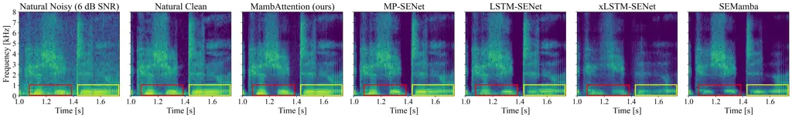
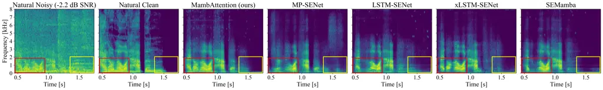
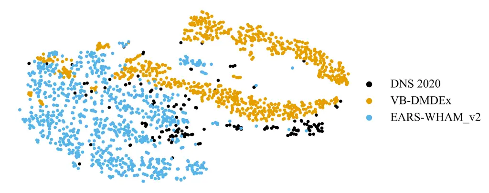
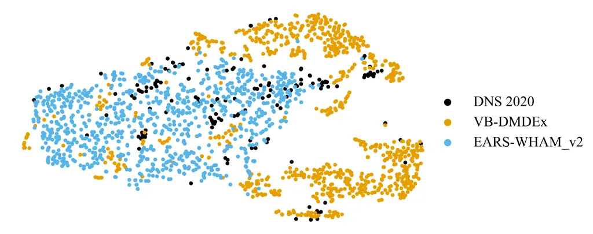
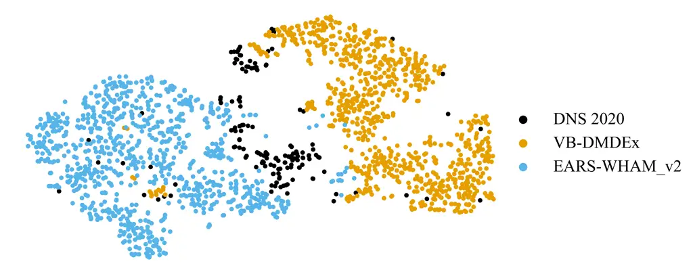
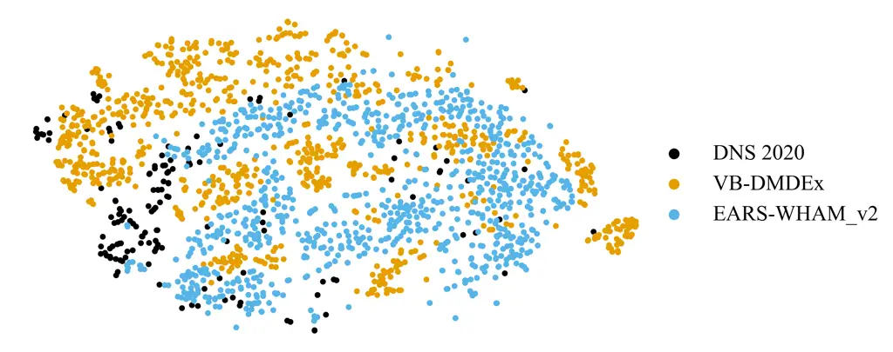
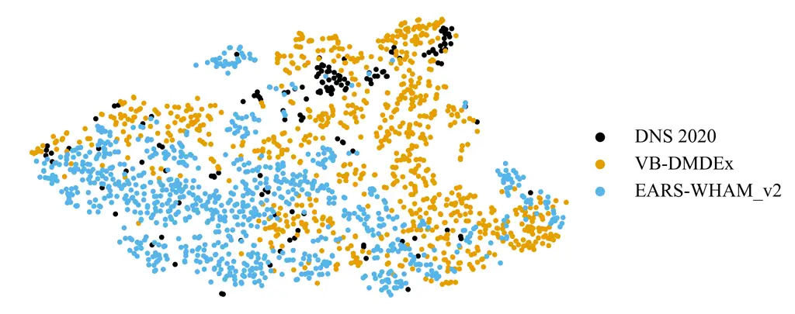
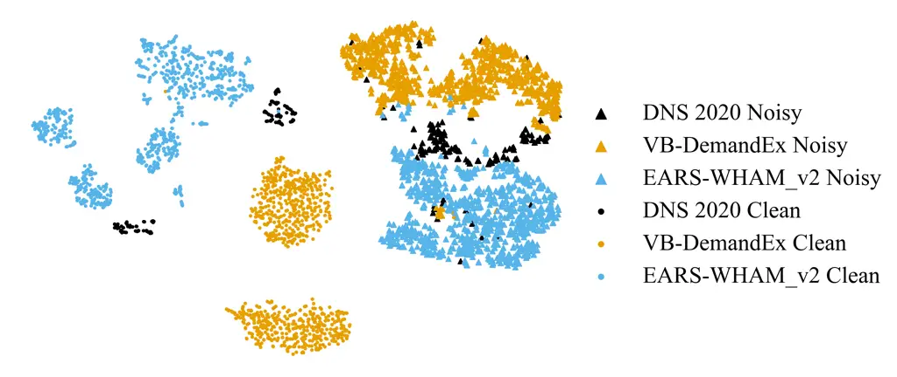
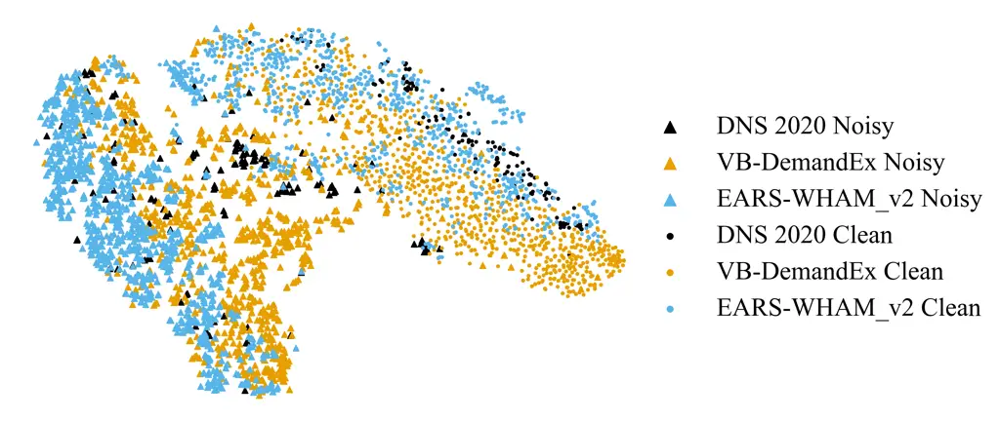

# MambAttention: Mamba with Multi-Head Attention for Generalizable Single-Channel Speech Enhancement

Nikolai Lund Kühne    Jesper Jensen    Jan Østergaard    Zheng-Hua Tan
^(†)^(†)thanks: This work was supported by DeiC by enabling access to
the LUMI supercomputer (g.a. DeiC-AAU-N5-2025126-“Exploring new neural
architectures for deep learning based speech
enhancement”).^(†)^(†)thanks: This work is partially supported by the
William Demant Fonden via the Centre for Acoustic Signal Processing
Research (CASPR).^(†)^(†)thanks: Nikolai Lund Kühne, Jan Østergaard, and
Zheng-Hua Tan are with the Department of Electronic Systems, Aalborg
University, 9220, Denmark (e-mail: nlk@es.aau.dk; jo@es.aau.dk;
zt@es.aau.dk). Zheng-Hua Tan is also with the Pioneer Centre for AI,
1350, Denmark.^(†)^(†)thanks: Jesper Jensen is with the Department of
Electronic Systems, Aalborg University, 9220, Denmark, and also with
Oticon A/S, 2765, Denmark (e-mail: jesj@demant.com).

###### Abstract

With the advent of new sequence models like Mamba and xLSTM, several
studies have shown that these models match or outperform the
state-of-the-art in single-channel speech enhancement and
self-supervised audio representation learning. However, prior research
has demonstrated that sequence models like LSTM and Mamba tend to
overfit to the training set. To address this issue, previous works have
shown that adding self-attention to LSTMs substantially improves
generalization performance for single-channel speech enhancement.
Nevertheless, neither the concept of hybrid Mamba and time-frequency
attention models nor their generalization performance have been explored
for speech enhancement. In this paper, we propose a novel hybrid
architecture, MambAttention, which combines Mamba and shared time- and
frequency-multi-head attention modules for generalizable single-channel
speech enhancement. To train our model, we introduce VB-DemandEx, a
dataset inspired by VoiceBank+Demand but with more challenging noise
types and lower signal-to-noise ratios. Trained on VB-DemandEx,
MambAttention significantly outperforms existing state-of-the-art
discriminative LSTM-, xLSTM-, Mamba-, and Conformer-based systems of
similar complexity across all reported metrics on two out-of-domain
datasets: DNS 2020 without reverberation and EARS-WHAM_v2. MambAttention
also matches or outperforms generative models such as diffusion models
in generalization performance while being competitive with language
model baselines. Ablation studies highlight the importance of weight
sharing between time- and frequency-multi-head attention modules for
generalization performance. Finally, we explore integrating the shared
time- and frequency-multi-head attention modules with LSTM and xLSTM,
which yields a notable performance improvement on the out-of-domain
datasets. However, MambAttention remains superior for cross-corpus
generalization across all reported evaluation metrics.

###### Index Terms:

Attention mechanism, deep learning architecture, generalizable speech
enhancement, Mamba, xLSTM.

## I INTRODUCTION

Speech enhancement aims to improve the speech intelligibility and speech
quality of noisy speech signals, by removing background noise and
recovering the desired speech signal. It is a widely studied subject,
since speech enhancement is both challenging and has a wide array of
applications such as hearing assistive devices, mobile communication
devices, speech recognition systems, and speaker verification systems.

Over the last decade, research on the single-microphone setting, also
known as single-channel speech enhancement, developed from using
classical signal-processing techniques such as Kalman filtering \[1\]
and Minimum Mean Square Error Short-Time Spectral Amplitude estimation
\[2\] to using deep neural networks (DNNs) \[3, 4\]. As the field of
deep learning evolves, new neural architectures emerge. This has led to
a large selection of deep learning-based single-channel speech
enhancement systems using a variety of neural architectures such as deep
denoising autoencoders \[5\], recurrent neural networks (RNNs) and Long
Short-Term Memory (LSTMs) networks \[6, 7\], convolutional neural
networks \[8, 9, 10, 11\], diffusion models \[12, 13, 14, 15\],
generative adversarial networks \[16, 17, 18, 19, 20\], and state-space
models (SSMs) \[21, 22, 23\]. With the advent of the Transformer \[24\],
attention-based speech enhancement systems have achieved
state-of-the-art on several datasets \[25, 26\].

However, scaled dot-product attention-based models like Transformers and
Conformers \[27\] scale poorly with sequence length and require large
training datasets \[28, 29\]. Hence, recent works have focused on
proposing sequence models with linear scalability with respect to
sequence length such as Mamba \[30\] and Extended Long Short-Term Memory
(xLSTM) \[31\]. Mamba and xLSTM have already shown great promise in
natural language processing (NLP) \[30, 31\], computer vision \[32,
33\], and self-supervised audio representation learning \[34, 35\].
Additionally, Mamba and xLSTM have recently been shown to match or
outperform state-of-the-art speech enhancement systems \[36, 37\].
Interestingly, \[37\] also found that a correctly configured LSTM-based
model can actually match Conformer-, Mamba-, and xLSTM-based systems on
the VoiceBank+Demand dataset \[38, 39\]. However, many papers reporting
state-of-the-art performance often only evaluate in-domain speech
enhancement performance. Arguably, in-domain speech enhancement
performance may not be representative of performance in real-world
environments, where speech and noise signals may vary significantly from
the training data. For this reason, we focus on developing a speech
enhancement algorithm that yields superior cross-corpus generalization
performance.

In this paper, we propose MambAttention (Figure 1), which is a novel
hybrid Mamba and multi-head attention (MHA) model for generalizable
single-channel speech enhancement. MambAttention comprises both time-
and frequency-Mamba modules (T- and F-Mamba) as well as time- and
frequency-MHA modules (T- and F-MHA). More importantly, our
MambAttention model shares weights between the T- and F-MHA modules
within each layer. By sharing the weights between the MHA modules in
each layer, our MambAttention model aligns global time- and frequency
content by jointly attending to both temporal and spectral features. We
find that this substantially improves generalization across recording
conditions, speakers and noise types. To the best of our knowledge,
MambAttention is the first model to combine Mamba with MHA across time
and frequency for speech enhancement.

While VoiceBank+Demand \[38, 39\] is a widely-used benchmark for
single-channel speech enhancement, the test set contains neither babble
noise nor speech-shaped noise (SSN) and the signal-to-noise ratios
(SNRs) of both training and test files are not lower than
$`0\text{\mskip 5.0mu plus 5.0mu}\mathrm{d}\mathrm{B}`$. This means
speech enhancement systems trained and tested only on VoiceBank+Demand
are neither exposed to nor evaluated in difficult listening conditions.
Motivated by this, we propose a new benchmark: VoiceBank+Demand Extended
(VB-DemandEx). Compared to the VoiceBank+Demand dataset, our VB-DemandEx
comprises much lower SNRs and a larger variety of noise types.

To evaluate the performance of MambAttention, we train our models on
VB-DemandEx, and test on the in-domain VB-DemandEx test set as well as
out-of-domain test sets from Deep Noise Suppression Challenge 2020
\[40\] (DNS 2020) and EARS-WHAM_v2 \[41\]. Results show that our
MambAttention model significantly outperforms state-of-the-art
discriminative LSTM-, xLSTM-, Mamba-, and Conformer-based systems on the
out-of-domain test sets across all reported evaluation metrics, while
maintaining state-of-the-art performance on the in-domain test set. In
addition, our MambAttention model matches or outperforms diffusion
models and is competitive with language model (LM) baselines on the DNS
2020 real-recordings test set, and the test set without reverberation.
Despite not being trained for reverberation, MambAttention still rivals
some diffusion baselines on this task. Ablation studies on our proposed
MambAttention model shows that the weight sharing mechanism positively
impacts generalization performance. Additionally, we find that placing
the MHA modules before the Mamba blocks significantly improves
generalization performance. Furthermore, we find that augmenting
existing LSTM- and xLSTM-based speech enhancement systems with our
proposed MHA modules also greatly improves generalization performance;
however, our MambAttention model remains superior across all reported
evaluation metrics.

To gain further insights, we visualize the latent features of our
MambAttention model, and the LSTM-, xLSTM-, Mamba-, and Conformer-based
models. Our findings suggest that MHA encourages the model to learn
dataset-invariant representations. Finally, our MambAttention model
shows superior scalability with respect to dataset size compared to
discriminative LSTM, xLSTM, Mamba, and Conformer baseline, when trained
on the large-scale DNS 2020 dataset.

Our major contributions are summarized as follows:

- •
  We propose a novel state-of-the-art hybrid MambAttention model
  combining Mamba and MHA for generalizable single-channel speech
  enhancement.
- •
  We demonstrate that MambAttention outperforms discriminative baselines
  and matches or surpasses generative diffusion models and is
  competitive with large LMs for generalizable speech enhancement.
- •
  We demonstrate that weight sharing between T- and F-MHA modules in our
  MambAttention model contributes to its state-of-art generalization
  performance.
- •
  We show that combining our shared T- and F-MHA modules with LSTM- and
  xLSTM-based models significantly improves their generalization
  performance.
- •
  We propose the VB-DemandEx benchmark, which is inspired by
  VoiceBank+Demand, but features substantially lower SNRs and more noise
  types.

Code for training and inference, audio samples, model weights, and the
proposed dataset are publicly available.¹¹ 1
[https://github.com/NikolaiKyhne/MambAttention](https://github.com/NikolaiKyhne/MambAttention)

## II Related Works

### II-A Generalization Performance of Sequence Models

Prior works have found that LSTMs overfit to the training dataset for
automatic speech recognition in RNN-Transducers, which results in poor
generalization performance \[42, 43\]. To remedy this, \[42\] combines
multiple regularization techniques during training, and uses dynamic
overlapping inference by segmenting long utterances into multiple
fixed-length segments, which are decoded independently. On the other
hand, \[43\] proposes using sparse self-attention layers in the
Conformer RNN-Transducer. Additionally, they hypothesize that during
inference on long utterances, unseen linguistic context accumulate
excessively in the hidden state of the LSTM, which can be mitigated by
resetting the hidden states at silent segments. Similarly, \[44\]
hypothesizes that domain-specific information can potentially be
accumulated or even amplified in hidden states during propagation in the
Mamba architecture, thus resulting in worse generalization performance.
To mitigate this, they propose hidden state suppressing, which reduces
the gap between hidden states across domains, and find that this
improves generalization performance \[44\].

In \[45\], it was concluded that poor generalization performance of
speech enhancement DNNs often stems from different recording conditions
between datasets. It is revealed that the content of a corpus is more
important than its size for generalization performance. To overcome poor
enhancement performance on unseen datasets, self-attending RNNs were
proposed in \[46\]. By adding self-attention to RNNs, cross-corpus
generalization was significantly improved. In \[47\], a generalization
assessment framework that accounts for a potential change in the
difficulty of the speech enhancement task across datasets is presented.
Using this framework, it was found that performance degrades the most in
speech mismatches. Notably, it was revealed that while the most recent
models displayed the best in-domain speech enhancement performance,
their out-of-domain speech enhancement performance was beaten by the
older systems \[47\].


Figure 1: Overall structure of our proposed MambAttention model. $`M`$,
$`K`$, $`T`$, and $`F^{\prime}`$ represent the batch size, the number of
channels, the number of time frames, and the number of frequency bins,
respectively.

### II-B Generalization Performance of Generative Models

While discriminative speech enhancement models learn a direct mapping
between noisy and clean speech, generative models are trained to learn
the distribution of the clean speech signals as a prior for generation
of enhanced speech signals \[48\]. Several works have demonstrated that
generative models such as diffusion models exhibit remarkable
generalization performance for speech enhancement \[12, 49, 50, 48\].
However, diffusion models are computationally expensive during
inference, as they require running the backbone neural network for each
reverse diffusion step \[50\]. Nevertheless, recent work has
demonstrated the potential of causal diffusion models for generalized
speech enhancement \[14\].

Besides diffusion models, SELM was proposed in \[51\] demonstrating the
potential of LMs for denoising and dereverberation. By teaching the LM
to predict the target probability distribution given the input
probability distribution, both denoising and dereverberation are learnt
through a cross-entropy loss function \[51\]. Several papers have
extended the idea of using LMs for speech enhancement, improving both
the performance of the models and the amount of tasks the speech LMs can
handle \[52, 53, 54, 55\]. However, training speech LMs for speech
enhancement often requires several thousand hours of training data \[53,
54, 55\], which comprises multiple clean-speech and noise datasets
covering all tasks. In addition, the model size of the LMs for speech
enhancement is often more than a hundred times larger than specialized
models, leading to high computational complexity. While speech LMs have
demonstrated impressive speech enhancement performance, some models like
UniAudio \[56\] only handle one distortion at a time and requires
task-specific fine-tuning. Recent works, however, have proposed a
unified approch allowing the speech LM to perform multiple tasks at the
same time \[52, 53, 55\].

### II-C Hybrid Sequence Models

Combining Mamba blocks with Transformer or attention blocks has already
shown great promise in NLP \[57, 58\], where the proposed models match
or outperform state-of-the-art models on multiple benchmarks. However,
the large token contexts used in NLP prevent the use of self-attention
and MHA. Similarly, for automatic speech recognition, combining a
Transformer encoder with an SSM results in state-of-the-art performance
\[59\]. Beyond NLP and automatic speech recognition, a hybrid Mamba and
MHA model DeFT-Mamba \[60\] was recently proposed for universal audio
separation in multichannel polyphonic scenarios. By combining a gated
convolution block with a hybrid Mamba and MHA block across frequency-
and time-dimensions, DeFT-Mamba demonstrates state-of-the-art
performance in multichannel separation. Finally, in \[61\], Transformer
and Mamba layers were combined in a U-Net architecture called TRAMBA.
TRAMBA outperforms existing models in practical speech super resolution
and enhancement on mobile and wearable platforms in a self-supervised
setting.

As opposed to \[57, 58, 59\], the MHA modules in MambAttention are
placed before their respective Mamba blocks. Additionally, in contrast
to DeFT-Mamba \[60\], our MambAttention model processes the encoded
input along the time-dimension before the frequency-dimension. As we
will demonstrate, this ordering yields superior out-of-domain speech
enhancement performance. Moreover, while DeFT-Mamba employs a gated
convolution block, which shifts features by one frequency bin or one
time frame before applying the MHA and Mamba blocks to process across
frequency or time, our model does not. Finally, as opposed to most
existing hybrid attention models \[46, 57, 58, 59, 61, 60\],
MambAttention shares the weights of the T- and F-MHA modules in each
layer.

## III PROPOSED METHOD

### III-A State-Space Models and Mamba

Structured SSMs \[62\] and Mamba \[30\] are a family of
sequence-to-sequence models inspired by continuous linear time-invariant
systems. SSMs map an input $`x(t)\in\mathbb{R}`$ to an output
$`y(t)\in\mathbb{R}`$ through a latent state
$`\bm{h}(t)\in\mathbb{R}^{N\times 1}`$ via an evolution parameter
$`\bm{A}\in\mathbb{R}^{N\times N}`$, and projection parameters
$`\bm{B}\in\mathbb{R}^{N\times 1}`$ and
$`\bm{C}\in\mathbb{R}^{1\times N}`$:

```math
\displaystyle\bm{h}^{\prime}(t) \displaystyle=\bm{A}\bm{h}(t)+\bm{B}x(t), \tag{1}
```

```math
\displaystyle y(t) \displaystyle=\bm{C}\bm{h}(t), \tag{2}
```

where $`\bm{h}^{\prime}(t)\in\mathbb{R}^{N\times 1}`$. To make SSMs
applicable in deep neural networks, a time-scale parameter
$`\Delta\in\mathbb{R}`$ is introduced to transform $`\bm{A}`$ and
$`\bm{B}`$ into their discrete-time counterparts
$`\overline{\bm{A}}\in\mathbb{R}^{N\times N}`$ and
$`\overline{\bm{B}}\in\mathbb{R}^{N\times 1}`$ via a zero-order hold
\[63\]:

```math
\displaystyle\overline{\bm{A}} \displaystyle=\mathrm{exp}{(\Delta\bm{A})}, \tag{3}
```

```math
\displaystyle\overline{\bm{B}} \displaystyle=(\Delta\bm{A})^{-1}(\mathrm{exp}(\Delta\bm{A})-\bm{I})\cdot\Delta\bm{B}\approx\Delta\bm{B}. \tag{4}
```

The approximation in (4) becomes increasingly accurate when $`\Delta`$
is small. Thus, the discrete-time versions of (1) and (2) become \[30\]:

```math
\displaystyle\bm{h}_{i} \displaystyle=\overline{\bm{A}}\bm{h}_{i-1}+\overline{\bm{B}}x_{i}, \tag{5}
```

```math
\displaystyle y_{i} \displaystyle=\bm{C}\bm{h}_{i}, \tag{6}
```

where the subscript $`i`$ is the discrete-time index. Mamba improves
upon structured SSMs, by making $`\bm{B},\bm{C},\Delta`$ functions of
the input, resulting in the input-dependent parameters
$`\bm{B}_{i}\in\mathbb{R}^{N\times 1}`$,
$`\bm{C}_{i}\in\mathbb{R}^{1\times N}`$, and
$`\Delta_{i}\in\mathbb{R}`$. Consequently, the discretized
$`\overline{\bm{A}}_{i}=\mathrm{exp}(\Delta_{i}\bm{A})`$,
$`\overline{\bm{B}}_{i}=\Delta_{i}\bm{B}_{i}`$ also become
input-dependent. Additionally, Mamba sets $`\bm{A}`$ and
$`\overline{\bm{A}}_{i}`$ as diagonal; hence, defining the vector
composed of diagonal elements of $`\overline{\bm{A}}_{i}`$ as
$`\tilde{\bm{A}}_{i}=\mathrm{diag}(\overline{\bm{A}}_{i})\in\mathbb{R}^{N\times 1}`$
results in
$`\overline{\bm{A}}_{i}\bm{h}_{i-1}=\tilde{\bm{A}}_{i}\odot\bm{h}_{i-1}`$,
where $`\odot`$ is element-wise multiplication. Moreover, we can write
$`\overline{\bm{B}}_{i}x_{i}=\Delta_{i}\bm{B}_{i}x_{i}=\bm{B}_{i}(\Delta_{i}\odot x_{i})`$
\[63\]. Thus, (5) and (6) become:

```math
\displaystyle\bm{h}_{i} \displaystyle=\tilde{\bm{A}}_{i}\odot\bm{h}_{i-1}+\bm{B}_{i}(\Delta_{i}\odot x_{i}), \tag{7}
```

```math
\displaystyle y_{i} \displaystyle=\bm{C}_{i}\bm{h}_{i}, \tag{8}
```

where $`x_{i},y_{i}\in\mathbb{R}`$, and
$`\bm{h}_{i}\in\mathbb{R}^{N\times 1}`$.

Finally, to operate over an input
$`\bm{X}=[\bm{x}_{1},\bm{x}_{2},\dots,\bm{x}_{L}]^{\top}\in\mathbb{R}^{L\times K}`$,
where each $`\bm{x}_{i}\in\mathbb{R}^{1\times K}`$, Mamba applies (7)
and (8) independently to each channel $`K`$. Thus, the formulation of
Mamba becomes \[63\]:

```math
\displaystyle\bm{h}_{i} \displaystyle=\tilde{\bm{A}}_{i}\odot\bm{h}_{i-1}+\bm{B}_{i}(\bm{\Delta}_{i}\odot\bm{x}_{i}), \tag{9}
```

```math
\displaystyle\bm{y}_{i} \displaystyle=\bm{C}_{i}\bm{h}_{i}, \tag{10}
```

where $`\bm{\Delta}_{i}\in\mathbb{R}^{1\times K}`$,
$`\bm{B}_{i}\in\mathbb{R}^{N\times 1}`$,
$`\bm{C}_{i}\in\mathbb{R}^{1\times N}`$ are derived from the input,
$`\tilde{\bm{A}}_{i},\bm{h}_{i}\in\mathbb{R}^{N\times K}`$, and
$`\bm{y}_{i}\in\mathbb{R}^{1\times K}`$. In Mamba, the parameters
$`\bm{B}\in\mathbb{R}^{N\times L}`$,
$`\bm{C}\in\mathbb{R}^{L\times N}`$, and
$`\bm{\Delta}\in\mathbb{R}^{L\times K}`$ are learned though projections
$`\bm{B}=(\bm{X}\bm{W}_{B})^{\top}`$, $`\bm{C}=\bm{X}\bm{W}_{C}`$, and
$`\bm{\Delta}=\mathrm{Softplus}(\bm{X}\bm{W}_{1}\bm{W}_{2})`$, where
$`\bm{W}_{B},\bm{W}_{C}\in\mathbb{R}^{K\times N}`$,
$`\bm{W}_{1}\in\mathbb{R}^{K\times K_{0}}`$, and
$`\bm{W}_{2}\in\mathbb{R}^{K_{0}\times K}`$ are learnable weight
matrices \[63\], $`\bm{X}`$ is the input, and the $`\mathrm{Softplus}`$
function is defined in \[64\].

### III-B Multi-Head Attention

Attention can be interpreted as a vector of importance weights assigned
to different parts of the input or output based on context derived from
learnable feature spaces \[24\]. Self-attention is an attention
mechanism relating different positions of the same input sequence by
assigning different weights to different parts of the input sequence
\[24\]. Informally, an attention mechanism is a mapping of a query and a
set of key-value pairs to an output. The popular scaled dot-product
attention mechanism is defined as \[24\]:

```math
\displaystyle\mathrm{Attention}(\bm{Q},\bm{K},\bm{V})=\mathrm{Softmax}\left(\frac{\bm{Q}\bm{K}^{\top}}{\sqrt{d_{k}}}\right)\bm{V}, \tag{11}
```

where $`\bm{Q}\in\mathbb{R}^{L\times d_{k}}`$,
$`\bm{K}\in\mathbb{R}^{L\times d_{k}}`$ and
$`\bm{V}\in\mathbb{R}^{L\times d_{v}}`$ is the query, key, and value
matrix, respectively, and $`L`$ is the input sequence length. The query,
key, and value matrices are learned projections of the input
$`\bm{X}\in\mathbb{R}^{L\times d_{m}}`$ to their respective dimensions
and $`d_{m}`$ is the model’s feature dimension. In a single
self-attention computation, all information from the input is averaged.
However, in the MHA mechanism proposed in \[24\], scaled dot-product
attention is computed across $`h`$ attention heads of dimensionality
$`\frac{d_{m}}{h}=d_{k}=d_{v}`$ in parallel. This allows neural networks
utilizing MHA to jointly attend to information from different subspace
representations at different positions, meaning that different attention
heads capture different information. Given
$`\bm{Q},\bm{K},\bm{V}\in\mathbb{R}^{L\times d_{m}}`$, the MHA mechanism
is given by:

```math
\displaystyle\mathrm{MHA}(\bm{Q},\bm{K},\bm{V}) \displaystyle=\mathrm{Concat}(\mathrm{head}_{1},\dots,\mathrm{head}_{h})\bm{W}^{O}, \tag{12}
```

```math
\displaystyle\mathrm{head}_{i} \displaystyle=\mathrm{Attention}(\bm{Q}\bm{W}_{i}^{Q},\bm{K}\bm{W}_{i}^{K},\bm{V}\bm{W}_{i}^{V}), \tag{13}
```

where $`\mathrm{Concat}(\cdot)`$ is the concatenation operation,
$`\bm{W}_{i}^{Q},\bm{W}_{i}^{K}\in\mathbb{R}^{d_{m}\times d_{k}}`$, and
$`\bm{W}_{i}^{V}\in\mathbb{R}^{d_{m}\times d_{v}}`$ are learnable weight
matrices, $`\mathrm{head}_{i}\in\mathbb{R}^{L\times\frac{d_{m}}{h}}`$
denotes the $`i`$th attention head, and $`i\in\{1,2,\dots,h\}`$.
Finally, $`\bm{W}^{O}\in\mathbb{R}^{hd_{v}\times d_{m}}`$ is the output
weight matrix, learning the contribution of each attention head.

### III-C MambAttention: Mamba with Multi-Head Attention

To improve generalization performance for speech enhancement, we propose
the MambAttention block, which is a novel non-causal architectural
component integrating shared MHA modules with Mamba. Figure 1
illustrates our proposed MambAttention block. Each block jointly models
temporal and spectral dependencies, enabling the network to capture
complex structures in speech signals. In each MambAttention block, the
input $`\bm{X}\in\mathbb{R}^{M\times K\times T\times F}`$ is first
reshaped to $`MF\times T\times K`$ before applying a Layer Normalization
(LN), a T-MHA block and a bidirectional T-Mamba block. Here $`M`$,
$`K`$, $`T`$, and $`F`$ represent the batch size, the number of
channels, time frames, and frequency bins, respectively. Subsequently,
the output of the T-Mamba block is reshaped to $`MT\times F\times K`$
before another LN, a F-MHA block, and a bidirectional F-Mamba block is
applied. Finally, the output is reshaped back to
$`{M\times K\times T\times F}`$. Mathematically, given an input
$`\bm{X}`$, the forward pass of a MambAttention block is given by:

```math
\displaystyle\bm{X}_{\mathrm{Time}} \displaystyle=\mathrm{reshape}(\bm{X},[M\cdot F,T,K]), \tag{14}
```

```math
\displaystyle\bm{X}_{1} \displaystyle=\bm{X}_{\mathrm{Time}}+\text{T-MHA}(\mathrm{LN}(\bm{X}_{\mathrm{Time}})), \tag{15}
```

```math
\displaystyle\bm{X}_{2} \displaystyle=\bm{X}_{1}+\text{T-Mamba}(\bm{X}_{1}), \tag{16}
```

```math
\displaystyle\bm{X}_{\mathrm{Freq.}} \displaystyle=\mathrm{reshape}(\bm{X}_{2},[M\cdot T,F,K]), \tag{17}
```

```math
\displaystyle\bm{X}_{3} \displaystyle=\bm{X}_{\mathrm{Freq.}}+\text{F-MHA}(\mathrm{LN}(\bm{X}_{\mathrm{Freq.}})), \tag{18}
```

```math
\displaystyle\bm{X}_{4} \displaystyle=\bm{X}_{3}+\text{F-Mamba}(\bm{X}_{3}), \tag{19}
```

```math
\displaystyle\bm{Y} \displaystyle=\mathrm{reshape}(\bm{X}_{4},[M,K,T,F]), \tag{20}
```

where $`\mathrm{reshape}(\mathrm{input},\mathrm{size})`$ reshapes the
input to a given size. The T- and F-MHA modules only have one input,
since the queries, keys, and values are all derived from the input. We
use the T- and F-Mamba blocks from SEMamba \[36\], hence the output
$`\bm{X}_{\mathrm{out}}`$ of each T- and F-Mamba block is given by:

```math
\bm{X}_{\mathrm{out}}=\mathrm{Conv1D}(\mathrm{Concat}(\mathrm{Mamba}(\bm{X}_{\mathrm{in}}),\\
\mathrm{flip}(\mathrm{Mamba}(\mathrm{flip}(\bm{X}_{\mathrm{in}}))))), \tag{21}
```

where $`\bm{X}_{\mathrm{in}}`$ is the input to the T- and F-Mamba
blocks, and $`\mathrm{Mamba}(\cdot)`$, $`\mathrm{flip}(\cdot)`$, and
$`\mathrm{Conv1D}(\cdot)`$ is the unidirectional Mamba, the sequence
flipping operation, and the 1-D transposed convolution across either
time or frequency.

A key element of our MambAttention block is the use of shared weights
between the T- and F-MHA modules within each MambAttention block. This
weight sharing mechanism allows each layer of the model to
simultaneously attend to both time and frequency content. Importantly,
as we shall see, weight sharing substantially improves the model’s
ability to generalize across recording conditions, speaker, and noise
types. Finally, weight sharing minimizes the increase in model size and
memory cost from adding the MHA modules, resulting in more efficient
training.

## IV EXPERIMENTAL SETUP

### IV-A Datasets

To generate our proposed VB-DemandEx dataset, we use the same clean
speech data as VoiceBank+Demand \[38, 39\], but we leave out speakers
“p282” (female) and “p287” (male) for validation, as the original
VoiceBank+Demand benchmark contains no validation set. Like
VoiceBank+Demand, speakers “p232” and “p257” are used for the test set,
and the remaining 26 speakers are used for training. All audio clips are
downsampled to
$`16\text{\mskip 5.0mu plus 5.0mu}\mathrm{k}\mathrm{H}\mathrm{z}`$. For
noise, we follow \[65\] and use the
$`16\text{\mskip 5.0mu plus 5.0mu}\mathrm{k}\mathrm{H}\mathrm{z}`$
version of the Demand database \[39\], which comprises 6 noise
categories: Domestic, Office, Public, Transportation, Street, and
Nature. In each category, there are 3 subsets of noise recordings. Each
subset of noise recordings contains 16 audio signals that are 15 minutes
long, enumerated from 1 to 16. In VoiceBank+Demand, only selected
subsets of each noise category are present in the training and test
sets. To ensure our speech enhancement systems are trained on a bigger
variety of noise types, we adopt a different approach. For each subset
of noise recordings, we divide the signals into 3 groups of 1-12, 13-14
and 15-16, and concatenate them into training, validation and test
splits, respectively. This ensures no shared realizations of noise types
between the training, validation, and test sets. The subsets of each
noise categories are concatenated further in order to create the splits
of 6 different noise types (e.g.
$`\textrm{Public\_training}=\mathrm{Concat}(\mathrm{PSTATION}[1-12],\mathrm{PCAFETER}[1-12],\mathrm{PRESTO}[1-12])`$).
In addition to the Demand database, we use babble noise and SSN, which
is generated using LibriSpeech \[66\] as a source, in the training,
validation, and test sets. Babble noise is produced by averaging the
waveforms of 6 energy-standardized speech signals with silence detected
by rVAD \[67\] being removed, resulting in a single babble signal. To
create the SSN, audio signals from selected speakers undergo a 12th
order Linear Predictive Coding analysis, yielding coefficients for an
all-pole filter that is applied to Gaussian white noise. The train,
validation, and test set in VB-DemandEx, are generated by sequentially
mixing the clean speech and noise at 7 segmental SNRs (SSNRs) \[68\]
(\[$`-10,-5,0,5,10,15,20`$\] dB), using the officially provided script
from the DNS 2020 dataset \[40\]. This ensures a uniform distribution of
both noise types and SNRs. This results in 10,842 audio clips for
training, 730 for validation, and 826 for testing.

Besides training and testing on our proposed VB-DemandEx dataset, we
also train and test our models on the large-scale DNS 2020 dataset
\[40\]. This dataset contains 500 hours of clean audio clips from 2,150
speakers and over 180 hours of noise audio clips. Since the original DNS
2020 dataset contains no validation set, we set aside female speakers
“reader_01326”, “reader_06709”, “reader_08788” and male speakers
“reader_01105”, “reader_05375”, “reader_11980”, as well as a suitable
amount of noise audio clips for validation. Following the officially
provided script, the remaining clean and noisy audio clips are used to
generate 3,000 hours of noisy-clean pairs of audio clips with SSNRs
ranging from $`-5\text{\mskip 5.0mu plus 5.0mu}\mathrm{d}\mathrm{B}`$ to
$`15\text{\mskip 5.0mu plus 5.0mu}\mathrm{d}\mathrm{B}`$ for training,
resulting in $`1.08\text{\mskip 5.0mu plus 5.0mu}\mathrm{M}`$
$`10\text{\mskip 5.0mu plus 5.0mu}\mathrm{s}`$ noisy audio clips. We
generate the validation set using the same script resulting in 315
$`10\text{\mskip 5.0mu plus 5.0mu}\mathrm{s}`$ audio clips with SSNRs
between $`-5\text{\mskip 5.0mu plus 5.0mu}\mathrm{d}\mathrm{B}`$ and
$`15\text{\mskip 5.0mu plus 5.0mu}\mathrm{d}\mathrm{B}`$, ensuring a
uniform distribution of noise types and SNRs. For evaluation, we use
both the DNS 2020 test set with reverberation (reverb), without reverb,
and the real-recordings test set. The test sets with and without reverb
each contain 150 noisy-clean pairs generated from audio clips spoken by
20 speakers. The real-recordings test set contains 300 audio clips
without clean references.

We also test the generalization performance of our models on the
$`16\text{\mskip 5.0mu plus 5.0mu}\mathrm{k}\mathrm{H}\mathrm{z}`$
version of the EARS-WHAM_v2 dataset \[41, 69\], which comprises clean
audio clips from 107 speakers. The clean speech, which is recorded in an
anechoic chamber, covers a large variety of speaking styles, including
reading tasks in 7 different reading styles, emotional reading and
freeform speech in 22 different emotions, as well as conversational
speech \[41\]. Speakers p001 to p099 are used for training, p100 and
p101 are used for validation, and p102 to p107 are used for testing.
Using the officially provided script \[41\], the clean speech is mixed
with real noise recordings from the WHAM! dataset \[69\] at SNRs
randomly sampled between \[-2.5, 17.5\] dB. The SNRs are computed using
loudness K-weighted relative to full scale standardized in ITU-R BS.1770
\[70\]. This results in 32,485 noisy-clean pairs for training, 632
noisy-clean pairs for validation, and 886 noisy-clean pairs for testing.
The EARS-WHAM_v2 test set contains utterances up to
$`29\text{\mskip 5.0mu plus 5.0mu}\mathrm{s}`$ in length. Hence, to
avoid running out of memory, we perform inference on non-overlapping
chunks of $`10\text{\mskip 5.0mu plus 5.0mu}\mathrm{s}`$ audio clips for
all models on the EARS-WHAM_v2 test set.

### IV-B Model Overview

We integrate our MambAttention block into the widely-used
state-of-the-art dual-path system used in MP-SENet \[25\] (Conformer),
SEMamba \[36\] (Mamba), and xLSTM-SENet \[37\] (xLSTM). Thus, all
pre-processing, feature encoding, final decoding, training
hyperparameters, and loss functions are equivalent for all
discriminative models trained and compared in this paper.

Figure 1illustrates the overall architecture of our MambAttention model.
A complex spectrogram of the noisy speech waveform
$`\bm{y}\in\mathbb{R}^{D}`$ is computed via an STFT. The input to the
feature encoder $`\bm{Y}_{in}\in\mathbb{R}^{T\times F\times 2}`$ is the
compressed magnitude spectrum
$`(\bm{Y}_{m})^{c}\in\mathbb{R}^{T\times F}`$ extracted via power-law
compression \[71\] concatenated with the wrapped phase spectrum
$`\bm{Y}_{p}\in\mathbb{R}^{T\times F}`$. The feature encoder contains
two convolution blocks sandwiching a dilated DenseNet \[72\]. Each
convolution block consists of a 2D convolutional layer, an instance
normalization, and a PReLU activation \[73\]. The feature encoder
increases the number of input channels from $`2`$ to $`K`$ and halves
the frequency dimension from $`F`$ to $`F^{\prime}=F/2`$.

The output of the feature encoder is then processed by $`R`$
MambAttention blocks. It is subsequently fed into the magnitude mask
decoder and the wrapped phase decoder that predicts the clean compressed
magnitude mask
$`\bm{M}^{c}=(\bm{X}_{m}/\bm{Y}_{m})^{c}\in\mathbb{R}^{T\times F}`$ and
the clean wrapped phase spectrum
$`\bm{X}_{p}\in\mathbb{R}^{T\times F}`$, respectively. The enhanced
magnitude spectrum $`\bm{\hat{X}}_{m}\in\mathbb{R}^{T\times F}`$ is
computed as:

```math
\displaystyle\bm{\hat{X}}_{m}=((\bm{Y}_{m})^{c}\odot\bm{\hat{M}}^{c})^{1/c}, \tag{22}
```

where $`\bm{\hat{M}}^{c}`$ denotes the predicted clean compressed
magnitude mask. The magnitude mask decoder comprises a dilated DenseNet,
a 2D transposed convolution, an instance normalization, and a PReLU
activation. This is followed by a deconvolution block reducing the
amount of channels from $`K`$ to 1, and a learnable sigmoid function
with $`\beta=2`$ \[19\] estimating the magnitude mask. Similarly, the
wrapped phase decoder consists of a dilated DenseNet, a 2D transposed
convolution, an instance normalization, and a PReLU activation. This is
followed by two parallel 2D convolutional layers predicting the
pseudo-real and pseudo-imaginary part components. The clean wrapped
phase spectrum is predicted using the two-argument arctangent function
\[25\], yielding the enhanced wrapped phase spectrum
$`\bm{\hat{X}}_{p}`$. The final enhanced waveform
$`\bm{\hat{x}}\in\mathbb{R}^{D}`$ is recovered by applying an iSTFT to
the enhanced magnitude spectrum $`\bm{\hat{X}}_{m}`$ and the enhanced
wrapped phase spectrum $`\bm{\hat{X}}_{p}`$.

Dataset In-Domain       Out-Of-Domain VB-DemandEx DNS 2020 Without
Reverb EARS-WHAM_v2 Model Params PESQ$`\uparrow`$ SSNR$`\uparrow`$
ESTOI$`\uparrow`$ SI-SDR$`\uparrow`$ PESQ$`\uparrow`$ SSNR$`\uparrow`$
ESTOI$`\uparrow`$ SI-SDR$`\uparrow`$ PESQ$`\uparrow`$ SSNR$`\uparrow`$
ESTOI$`\uparrow`$ SI-SDR$`\uparrow`$ Noisy - 1.63 -1.07 0.63 4.98 1.58
6.22 0.81 9.07 1.24 -0.80 0.64 5.36 xLSTM-SENet \[37\]
$`2.20\text{\mskip 5.0mu plus 5.0mu}\mathrm{M}`$
$`2.97\scriptscriptstyle\pm 0.05`$ $`7.93\scriptscriptstyle\pm 0.13`$
$`0.80\scriptscriptstyle\pm 0.01`$ $`16.41\scriptscriptstyle\pm 0.32`$
$`1.72\scriptscriptstyle\pm 0.37`$ $`3.25\scriptscriptstyle\pm 1.33`$
$`0.69\scriptscriptstyle\pm 0.10`$ $`3.41\scriptscriptstyle\pm 3.48`$
$`1.51\scriptscriptstyle\pm 0.15`$ $`0.45\scriptscriptstyle\pm 0.57`$
$`0.56\scriptscriptstyle\pm 0.05`$ $`1.40\scriptscriptstyle\pm 2.14`$
LSTM-SENet \[37\] $`2.34\text{\mskip 5.0mu plus 5.0mu}\mathrm{M}`$
$`3.00\scriptscriptstyle\pm 0.03`$ $`7.98\scriptscriptstyle\pm 0.21`$
$`0.80\scriptscriptstyle\pm 0.00`$ $`16.64\scriptscriptstyle\pm 0.12`$
$`1.98\scriptscriptstyle\pm 0.45`$ $`4.90\scriptscriptstyle\pm 1.66`$
$`0.72\scriptscriptstyle\pm 0.12`$ $`4.75\scriptscriptstyle\pm 3.35`$
$`1.57\scriptscriptstyle\pm 0.18`$ $`0.85\scriptscriptstyle\pm 0.77`$
$`0.57\scriptscriptstyle\pm 0.08`$ $`1.92\scriptscriptstyle\pm 2.89`$
SEMamba \[36\] $`2.25\text{\mskip 5.0mu plus 5.0mu}\mathrm{M}`$
$`3.00\scriptscriptstyle\pm 0.02`$ $`7.59\scriptscriptstyle\pm 0.18`$
$`0.80\scriptscriptstyle\pm 0.00`$ $`16.59\scriptscriptstyle\pm 0.16`$
$`2.28\scriptscriptstyle\pm 0.13`$ $`5.84\scriptscriptstyle\pm 1.03`$
$`0.82\scriptscriptstyle\pm 0.03`$ $`9.30\scriptscriptstyle\pm 1.58`$
$`1.63\scriptscriptstyle\pm 0.05`$ $`0.92\scriptscriptstyle\pm 0.51`$
$`0.60\scriptscriptstyle\pm 0.03`$ $`2.81\scriptscriptstyle\pm 0.52`$
MP-SENet \[25\] $`2.05\text{\mskip 5.0mu plus 5.0mu}\mathrm{M}`$
$`2.94\scriptscriptstyle\pm 0.07`$ $`7.64\scriptscriptstyle\pm 0.28`$
$`0.79\scriptscriptstyle\pm 0.01`$ $`16.20\scriptscriptstyle\pm 0.32`$
$`2.67\scriptscriptstyle\pm 0.01`$ $`7.37\scriptscriptstyle\pm 0.38`$
$`0.88\scriptscriptstyle\pm 0.01`$ $`13.67\scriptscriptstyle\pm 0.89`$
$`1.86\scriptscriptstyle\pm 0.10`$ $`2.11\scriptscriptstyle\pm 0.27`$
$`0.68\scriptscriptstyle\pm 0.03`$ $`6.09\scriptscriptstyle\pm 0.67`$
MambAttention $`2.33\text{\mskip 5.0mu plus 5.0mu}\mathrm{M}`$
$`3.03\scriptscriptstyle\pm 0.01`$ $`7.67\scriptscriptstyle\pm 0.41`$
$`0.80\scriptscriptstyle\pm 0.00`$ $`16.68\scriptscriptstyle\pm 0.10`$
$`2.92\scriptscriptstyle\pm 0.12`$ $`8.13\scriptscriptstyle\pm 0.73`$
$`0.91\scriptscriptstyle\pm 0.01`$ $`15.17\scriptscriptstyle\pm 1.36`$
$`2.01\scriptscriptstyle\pm 0.05`$ $`2.51\scriptscriptstyle\pm 0.22`$
$`0.73\scriptscriptstyle\pm 0.02`$ $`7.35\scriptscriptstyle\pm 0.45`$

Table I: In-domain and out-of-domain speech enhancement performance.
Models are trained and VB-DemandEx.



(a) DNS 2020 without reverb (fileid_90).



(b) EARS-WHAM_v2 (fileid_00040).

Figure 2: Spectrogram visualizations of the noisy speech, clean speech,
and enhanced speech from our proposed MambAttention and the Conformer,
LSTM, xLSTM, and Mamba baselines.

### IV-C Loss Functions

We follow \[25, 36, 37\] and use a linear combination of loss functions.
We use a time loss $`\mathcal{L}_{\mathrm{Time}}`$, magnitude loss
$`\mathcal{L}_{\mathrm{Mag.}}`$, and complex loss
$`\mathcal{L}_{\mathrm{Com.}}`$ defined by:

```math
\displaystyle\mathcal{L}_{\mathrm{Time}} \displaystyle=\mathbb{E}_{\bm{x},\bm{\hat{x}}}[\lVert\bm{x}-\bm{\hat{x}}\rVert_{1}], \tag{23}
```

```math
\displaystyle\mathcal{L}_{\mathrm{Mag.}} \displaystyle=\mathbb{E}_{\bm{X}_{m},\bm{\hat{X}_{m}}}[\lVert{\bm{X}_{m}-\bm{\hat{X}_{m}}}\rVert_{2}^{2}], \tag{24}
```

```math
\displaystyle\mathcal{L}_{\mathrm{Com.}} \displaystyle=\mathbb{E}_{\bm{X}_{r},\bm{\hat{X}_{r}}}[\lVert{\bm{X}_{r}-\bm{\hat{X}_{r}}}\rVert_{2}^{2}]+\mathbb{E}_{\bm{X}_{i},\bm{\hat{X}_{i}}}[\lVert{\bm{X}_{i}-\bm{\hat{X}_{i}}}\rVert_{2}^{2}], \tag{25}
```

where $`\mathbb{E}[\cdot]`$ is the expectation operator,
$`\bm{x}\in\mathbb{R}^{D}`$ is the clean speech,
$`\bm{\hat{x}}\in\mathbb{R}^{D}`$ is the enhanced speech, and the pairs
$`(\bm{X}_{r},\bm{{X}}_{i})`$ and
$`(\bm{\hat{X}}_{r},\bm{\hat{X}}_{i})`$ are the real and imaginary parts
of the clean complex spectrum
$`\bm{X}=\bm{X}_{m}\cdot\mathrm{e}^{j\bm{X}_{p}}\in\mathbb{C}^{T\times F}`$
and the enhanced complex spectrum
$`\bm{\hat{X}}=\bm{X}_{m}\cdot\mathrm{e}^{j\bm{\hat{X}}_{p}}\in\mathbb{C}^{T\times F}`$,
respectively. Additionally, we use the instantaneous phase loss
$`\mathcal{L}_{\mathrm{IP}}`$, group delay loss
$`\mathcal{L}_{\mathrm{GD}}`$, and instantaneous angular frequency loss
$`\mathcal{L}_{\mathrm{IAF}}`$ presented in \[74\] and define the phase
loss as:

```math
\displaystyle\mathcal{L}_{\mathrm{Pha.}}=\mathcal{L}_{\mathrm{IP}}+\mathcal{L}_{\mathrm{GD}}+\mathcal{L}_{\mathrm{IAF}}. \tag{26}
```

To improve training stability, we employ the consistency loss
$`\mathcal{L}_{\mathrm{Con.}}`$ presented in \[75\]:

```math
\mathcal{L}_{\mathrm{Con.}}=\mathbb{E}_{\bm{\hat{X}}_{r}}[\lVert\bm{\hat{X}}_{r}-\mathrm{STFT}(\mathrm{iSTFT}(\bm{\hat{X}}_{r}))\rVert_{2}^{2}]\\
+\mathbb{E}_{\bm{\hat{X}}_{i}}[\lVert\bm{\hat{X}}_{i}-\mathrm{STFT}(\mathrm{iSTFT}(\bm{\hat{X}}_{i}))\rVert_{2}^{2}]. \tag{27}
```

Finally, we use the metric discriminator $`D`$ from \[20\] for
adversarial training, which uses perceptual evaluation of speech quality
(PESQ) as the target objective metric. The PESQ scores are linearly
normalized to $`[0,1]`$. The discriminator loss
$`\mathcal{L}_{\mathrm{D}}`$ and its corresponding PESQ-based generator
loss $`\mathcal{L}_{\mathrm{PESQ}}`$ are given by:

```math
\mathcal{L}_{\mathrm{D}}=\mathbb{E}_{\bm{X}_{m}}[\lVert D(\bm{X}_{m},\bm{X}_{m})-1\rVert_{2}^{2}]\\
+\mathbb{E}_{\bm{X}_{m},\bm{\hat{X}}_{m}}[\lVert D(\bm{X}_{m},\bm{\hat{X}}_{m})-Q_{\mathrm{PESQ}}\rVert_{2}^{2}], \tag{28}
```

and

```math
\displaystyle\mathcal{L}_{\mathrm{PESQ}}=\mathbb{E}_{\bm{X}_{m},\bm{\hat{X}}_{m}}[\lVert D(\bm{X}_{m},\bm{\hat{X}}_{m})-1\rVert_{2}^{2}], \tag{29}
```

where $`Q_{\mathrm{PESQ}}\in[0,1]`$ is the scaled PESQ score between
$`\bm{X}_{m}`$ and $`\bm{\hat{X}}_{m}`$. The final generator loss
$`\mathcal{L}_{\mathrm{G}}`$ then becomes a linear combination of the
above-mentioned loss functions:

```math
\mathcal{L}_{\mathrm{G}}=\alpha_{1}\mathcal{L}_{\mathrm{Time}}+\alpha_{2}\mathcal{L}_{\mathrm{Mag.}}+\alpha_{3}\mathcal{L}_{\mathrm{Com.}}\\
+\alpha_{4}\mathcal{L}_{\mathrm{Pha.}}+\alpha_{5}\mathcal{L}_{\mathrm{Con.}}+\alpha_{6}\mathcal{L}_{\mathrm{PESQ}}. \tag{30}
```

During training, $`\mathcal{L}_{\mathrm{G}}`$ and
$`\mathcal{L}_{\mathrm{D}}`$ are jointly minimized.

### IV-D Hyperparameter Settings

All discriminative baselines are trained using the officially provided
code. To reduce training time and vRAM usage, we follow \[25, 36, 37,
11\] and train all models on randomly cropped
$`2\text{\mskip 5.0mu plus 5.0mu}\mathrm{s}`$ audio clips. Unless audio
files are natively sampled at
$`16\text{\mskip 5.0mu plus 5.0mu}\mathrm{k}\mathrm{H}\mathrm{z}`$, they
are downsampled to
$`16\text{\mskip 5.0mu plus 5.0mu}\mathrm{k}\mathrm{H}\mathrm{z}`$. For
MambAttention, we use an FFT order of 400, a Hann window size of 400,
and a hop size of 100 for all STFTs. Moreover, we use a magnitude
spectrum compression factor of $`c=0.3`$ \[25\]. We follow MP-SENet
\[25\], SEMamba \[36\], and xLSTM-SENet \[37\], and fix the model
feature dimension and number of channels $`d_{m}=K=64`$, the amount of
layers $`R=4`$, and the expansion factor to $`E_{f}=4`$ for our
MambAttention model. Like MP-SENet, we use $`h=8`$ attention heads in
our proposed MambAttention model. We follow \[26\], and set the
hyperparameters in the generator loss function to
$`\alpha_{1}=0.2,\alpha_{2}=0.9,\alpha_{3}=0.1,\alpha_{4}=0.3,\alpha_{5}=0.1,`$
and $`\alpha_{6}=0.05`$. All models trained on VB-DemandEx and DNS 2020
are trained for $`550\text{\mskip 5.0mu plus 5.0mu}\mathrm{k}`$ and
$`950\text{\mskip 5.0mu plus 5.0mu}\mathrm{k}`$ steps respectively, with
a batch size of $`M=8`$ on four AMD MI250X GPUs, as validation
performance stops improving when training longer. For both the generator
and discriminator, we use AdamW \[76\] with an initial learning rate of
0.0005, a weight decay of 0.01, $`\beta_{1}=0.8`$, and
$`\beta_{2}=0.99`$. We use an exponential learning rate scheduler with a
learning rate decay of $`0.99`$. For evaluation, we select the
checkpoint with the highest PESQ score on the validation set, saved
every 250 steps.

### IV-E Evaluation Metrics

To assess the quality of the enhanced speech of discriminative models,
we apply wide-band PESQ \[77\], which reports values between -0.5 (poor)
and 4.5 (excellent). Additionally, we report the standard
waveform-matching-based evaluation metrics SSNR \[68\] and
scale-invariant signal-to-distortion ratio (SI-SDR) \[78\]. Both SSNR
and SI-SDR are reported in dB. To predict the intelligibility of the
enhanced speech, we use extended short-time objective intelligibility
(ESTOI) \[79\], which effectively reports values between 0 and 1.

It is well known that reference-signal based metrics such as PESQ,
ESTOI, SI-SDR, and SSNR may be less suited for assessing the speech
enhancement performance of generative models for example due to the lack
of waveform-level alignment between the reference and enhanced speech
signals \[51, 56\]. Thus, to evalute the quality of the enhanced speech
of generative models, we employ the reference-free perceptual quality
estimator DNSMOS \[80\], which outputs three scores between 1 and 5 for
the signal quality (SIG), the background noise (BAK), and the overall
quality (OVRL).

For all measures, higher values indicate better performance. All models
and baselines trained by us are trained with 5 different seeds, and we
report the mean and standard deviation.

## V RESULTS

Model Type Params Without Reverb Real Recordings With Reverb
SIG$`\uparrow`$ BAK$`\uparrow`$ OVRL$`\uparrow`$ SIG$`\uparrow`$
BAK$`\uparrow`$ OVRL$`\uparrow`$ SIG$`\uparrow`$ BAK$`\uparrow`$
OVRL$`\uparrow`$ Noisy - - 3.39 2.62 2.48 3.05 2.51 2.26 1.76 1.50 1.39
CDiffuse \[12\] Diffusion
$`2.64\text{\mskip 5.0mu plus 5.0mu}\mathrm{M}`$ 3.29 3.64 3.05 3.20
3.10 2.78 2.54 2.30 2.19 SGMSE \[49\] Diffusion
$`3.56\text{\mskip 5.0mu plus 5.0mu}\mathrm{M}`$ 3.50 3.71 3.14 3.30
2.89 2.79 2.73 2.74 2.43 StoRM \[50\] Diffusion
$`27.8\text{\mskip 5.0mu plus 5.0mu}\mathrm{M}`$ 3.51 3.94 3.21 3.41
3.38 2.94 2.95 3.14 2.52 SELM \[51\] LM - 3.51 4.10 3.26 3.59 3.44 3.12
3.16 3.58 2.70 MaskSR \[52\] LM
$`145\text{\mskip 5.0mu plus 5.0mu}\mathrm{M}`$ 3.59 4.12 3.34 3.43 4.03
3.14 3.53 4.07 3.25 AnyEnhance \[53\] LM
$`363.54\text{\mskip 5.0mu plus 5.0mu}\mathrm{M}`$ 3.64 4.18 3.42 3.49
3.98 3.16 3.50 4.04 3.20 GenSE \[54\] LM - 3.65 4.18 3.43 - - - 3.49
3.73 3.19 LLaSE-G1 \[55\] LM
$`1.07\text{\mskip 5.0mu plus 5.0mu}\mathrm{B}`$ 3.66 4.17 3.42 3.41
3.91 3.08 3.59 4.10 3.33 MambAttention (DNS 2020) Regression
$`2.33\text{\mskip 5.0mu plus 5.0mu}\mathrm{M}`$
$`3.62\scriptstyle\pm 0.00`$ $`4.19\scriptstyle\pm 0.00`$
$`3.40\scriptstyle\pm 0.00`$ $`3.46\scriptstyle\pm 0.00`$
$`4.06\scriptstyle\pm 0.01`$ $`3.17\scriptstyle\pm 0.00`$
$`2.88\scriptstyle\pm 0.02`$ $`3.41\scriptstyle\pm 0.02`$
$`2.37\scriptstyle\pm 0.01`$ MambAttention (VB-DemandEx) Regression
$`2.33\text{\mskip 5.0mu plus 5.0mu}\mathrm{M}`$
$`3.57\scriptstyle\pm 0.00`$ $`4.16\scriptstyle\pm 0.00`$
$`3.35\scriptstyle\pm 0.02`$ $`3.25\scriptstyle\pm 0.01`$
$`3.90\scriptstyle\pm 0.01`$ $`2.90\scriptstyle\pm 0.01`$
$`2.66\scriptstyle\pm 0.02`$ $`3.71\scriptstyle\pm 0.03`$
$`2.16\scriptstyle\pm 0.03`$

Table II: DNSMOS scores on the DNS 2020 test set with and without
reverberation and the real-recordings test set. “-” denotes that the
result is not provided in the original paper and could not be
reproduced.

Dataset In-Domain       Out-Of-Domain VB-DemandEx DNS 2020 Without
Reverb EARS-WHAM_v2 Model Params PESQ$`\uparrow`$ SSNR$`\uparrow`$
ESTOI$`\uparrow`$ SI-SDR$`\uparrow`$ PESQ$`\uparrow`$ SSNR$`\uparrow`$
ESTOI$`\uparrow`$ SI-SDR$`\uparrow`$ PESQ$`\uparrow`$ SSNR$`\uparrow`$
ESTOI$`\uparrow`$ SI-SDR$`\uparrow`$ Noisy - 1.63 -1.07 0.63 4.98 1.58
6.22 0.81 9.07 1.24 -0.80 0.64 5.36 MambAttention
$`2.33\text{\mskip 5.0mu plus 5.0mu}\mathrm{M}`$
$`3.03\scriptscriptstyle\pm 0.01`$ $`7.67\scriptscriptstyle\pm 0.41`$
$`0.80\scriptscriptstyle\pm 0.00`$ $`16.68\scriptscriptstyle\pm 0.10`$
$`2.92\scriptscriptstyle\pm 0.12`$ $`8.13\scriptscriptstyle\pm 0.73`$
$`0.91\scriptscriptstyle\pm 0.01`$ $`15.17\scriptscriptstyle\pm 1.36`$
$`2.01\scriptscriptstyle\pm 0.05`$ $`2.51\scriptscriptstyle\pm 0.22`$
$`0.73\scriptscriptstyle\pm 0.02`$ $`7.35\scriptscriptstyle\pm 0.45`$
Attention after $`2.33\text{\mskip 5.0mu plus 5.0mu}\mathrm{M}`$
$`3.03\scriptscriptstyle\pm 0.01`$ $`7.77\scriptscriptstyle\pm 0.16`$
$`0.80\scriptscriptstyle\pm 0.00`$ $`16.71\scriptscriptstyle\pm 0.06`$
$`2.71\scriptscriptstyle\pm 0.20`$ $`7.23\scriptscriptstyle\pm 0.98`$
$`0.87\scriptscriptstyle\pm 0.03`$ $`12.86\scriptscriptstyle\pm 2.30`$
$`1.93\scriptscriptstyle\pm 0.14`$ $`1.70\scriptscriptstyle\pm 0.37`$
$`0.68\scriptscriptstyle\pm 0.05`$ $`4.84\scriptscriptstyle\pm 0.69`$
w/o weight sharing $`2.39\text{\mskip 5.0mu plus 5.0mu}\mathrm{M}`$
$`3.04\scriptscriptstyle\pm 0.01`$ $`7.95\scriptscriptstyle\pm 0.07`$
$`0.80\scriptscriptstyle\pm 0.00`$ $`16.71\scriptscriptstyle\pm 0.10`$
$`2.61\scriptscriptstyle\pm 0.23`$ $`6.76\scriptscriptstyle\pm 1.23`$
$`0.86\scriptscriptstyle\pm 0.05`$ $`11.58\scriptscriptstyle\pm 2.71`$
$`1.88\scriptscriptstyle\pm 0.07`$ $`1.61\scriptscriptstyle\pm 0.32`$
$`0.67\scriptscriptstyle\pm 0.02`$ $`4.45\scriptscriptstyle\pm 1.00`$
w/o MHA modules \[36\] $`2.25\text{\mskip 5.0mu plus 5.0mu}\mathrm{M}`$
$`3.00\scriptscriptstyle\pm 0.02`$ $`7.59\scriptscriptstyle\pm 0.18`$
$`0.80\scriptscriptstyle\pm 0.00`$ $`16.59\scriptscriptstyle\pm 0.16`$
$`2.28\scriptscriptstyle\pm 0.13`$ $`5.84\scriptscriptstyle\pm 1.03`$
$`0.82\scriptscriptstyle\pm 0.03`$ $`9.30\scriptscriptstyle\pm 1.58`$
$`1.63\scriptscriptstyle\pm 0.05`$ $`0.92\scriptscriptstyle\pm 0.51`$
$`0.60\scriptscriptstyle\pm 0.03`$ $`2.81\scriptscriptstyle\pm 0.52`$
Frequency $`\to`$ Time $`2.33\text{\mskip 5.0mu plus 5.0mu}\mathrm{M}`$
$`3.02\scriptscriptstyle\pm 0.03`$ $`7.65\scriptscriptstyle\pm 0.20`$
$`0.80\scriptscriptstyle\pm 0.01`$ $`16.57\scriptscriptstyle\pm 0.17`$
$`2.55\scriptscriptstyle\pm 0.40`$ $`6.27\scriptscriptstyle\pm 1.40`$
$`0.84\scriptscriptstyle\pm 0.07`$ $`11.28\scriptscriptstyle\pm 4.25`$
$`1.85\scriptscriptstyle\pm 0.24`$ $`1.53\scriptscriptstyle\pm 0.80`$
$`0.65\scriptscriptstyle\pm 0.09`$ $`4.30\scriptscriptstyle\pm 3.37`$

Table III: Ablation study. Default configurations for our MambAttention
model are the T- and F-MHA modules before the T- and F-Mamba blocks,
respectively, shared weights between the T- and F-MHA modules, and
processing across the time-dimension before the frequency-dimension.
Models are trained on VB-DemandEx.

### V-A Generalization Performance

In Table I, we report in- and out-of-domain speech enhancement
performance of our MambAttention model as well as the discriminative
state-of-the-art LSTM-, xLSTM-, Mamba-, and Conformer-based baselines
\[37, 36, 25\]. For simplicity, we rename the LSTM baseline to
LSTM-SENet.

We observe that our proposed MambAttention model outperforms all other
discriminative baselines on the out-of-domain datasets on all reported
metrics. This indicates superior generalization performance compared to
existing models, as both recording conditions, noise, and speaker types
are significantly different across both out-of-domain datasets compared
to our VB-DemandEx dataset. Compared to the Mamba-based SEMamba \[36\],
we note that adding the shared MHA modules greatly improves
out-of-domain performance, while only adding approximately
$`3.4\text{\mskip 5.0mu plus 5.0mu}\mathrm{\char 37\relax}`$ additional
parameters. For example, on DNS 2020 without reverb, PESQ increases by
0.64, SSNR increases by 2.29, ESTOI increases by 0.09, and SI-SDR
increases by 5.87 from using our MambAttention model over the pure Mamba
baseline. Moreover, we observe that the recurrent sequence models LSTM
and xLSTM exhibit the worst generalization performance, which could
indicate overfitting to the training set, or domain-specific information
being accumulated in the hidden state as hypothesized in \[43, 44\]. In
fact, both LSTM-SENet and xLSTM-SENet yield worse SSNR, ESTOI, and
SI-SDR scores on the out-of-domain DNS 2020 test set without reverb than
the unprocessed noisy samples from the test set itself. SEMamba, while
still utilizing a sequence model, shows substantially better
generalization performance compared to LSTM-SENet and xLSTM-SENet;
however, only the Conformer-based MP-SENet and our MambAttention model
consistently improve all reported metrics on both out-of-domain
datasets. Additionally, we observe that all models exhibit comparable
performance on the in-domain VB-DemandEx dataset. This aligns with
previous findings on the VoiceBank+Demand dataset, which features higher
SNRs compared to VB-DemandEx \[37\].

To support the claim of superior generalization performance of our
MambAttention model, we visualize spectrograms of clean speech, noisy
speech, and the speech waveforms enhanced by our MambAttention model and
the discriminative LSTM, xLSTM, Mamba, and Conformer baselines on the
out-of-domain DNS 2020 without reverb and EARS-WHAM_v2 test sets. For
each model in Figure 2, we select the seed with the median PESQ score on
each test set to provide a fair comparison. As seen in the yellow and
red boxes in 2(a), our MambAttention model and the Conformer-based model
are the only models that mostly reconstruct the fundamental harmonics.
The red boxes in 2(b) reveal the same effect at a significantly lower
SNR, but to a larger extent. Interestingly, the yellow boxes in 2(b)
show that only our MambAttention model, and to some extent, the xLSTM-
and Mamba-based baselines, almost reconstruct silence, whereas the
Conformer- and LSTM-based baselines do not.

Dataset In-Domain       Out-Of-Domain VB-DemandEx DNS 2020 Without
Reverb EARS-WHAM_v2 Model Params PESQ$`\uparrow`$ SSNR$`\uparrow`$
ESTOI$`\uparrow`$ SI-SDR$`\uparrow`$ PESQ$`\uparrow`$ SSNR$`\uparrow`$
ESTOI$`\uparrow`$ SI-SDR$`\uparrow`$ PESQ$`\uparrow`$ SSNR$`\uparrow`$
ESTOI$`\uparrow`$ SI-SDR$`\uparrow`$ Noisy - 1.63 -1.07 0.63 4.98 1.58
6.22 0.81 9.07 1.24 -0.80 0.64 5.36 xLSTM-Attention
$`2.27\text{\mskip 5.0mu plus 5.0mu}\mathrm{M}`$
$`3.02\scriptscriptstyle\pm 0.01`$ $`7.69\scriptscriptstyle\pm 0.19`$
$`0.80\scriptscriptstyle\pm 0.00`$ $`16.65\scriptscriptstyle\pm 0.11`$
$`2.80\scriptscriptstyle\pm 0.17`$ $`7.19\scriptscriptstyle\pm 0.93`$
$`0.89\scriptscriptstyle\pm 0.03`$ $`13.91\scriptscriptstyle\pm 1.89`$
$`1.93\scriptscriptstyle\pm 0.10`$ $`1.96\scriptscriptstyle\pm 0.38`$
$`0.68\scriptscriptstyle\pm 0.02`$ $`6.14\scriptscriptstyle\pm 1.28`$
LSTM-Attention $`2.48\text{\mskip 5.0mu plus 5.0mu}\mathrm{M}`$
$`3.02\scriptscriptstyle\pm 0.04`$ $`7.65\scriptscriptstyle\pm 0.34`$
$`0.80\scriptscriptstyle\pm 0.01`$ $`16.60\scriptscriptstyle\pm 0.28`$
$`2.55\scriptscriptstyle\pm 0.18`$ $`5.79\scriptscriptstyle\pm 0.88`$
$`0.85\scriptscriptstyle\pm 0.03`$ $`10.96\scriptscriptstyle\pm 1.62`$
$`1.86\scriptscriptstyle\pm 0.16`$ $`1.17\scriptscriptstyle\pm 0.49`$
$`0.66\scriptscriptstyle\pm 0.06`$ $`4.51\scriptscriptstyle\pm 1.81`$
MP-SENet \[25\] $`2.05\text{\mskip 5.0mu plus 5.0mu}\mathrm{M}`$
$`2.94\scriptscriptstyle\pm 0.07`$ $`7.64\scriptscriptstyle\pm 0.28`$
$`0.79\scriptscriptstyle\pm 0.01`$ $`16.20\scriptscriptstyle\pm 0.32`$
$`2.67\scriptscriptstyle\pm 0.01`$ $`7.37\scriptscriptstyle\pm 0.38`$
$`0.88\scriptscriptstyle\pm 0.01`$ $`13.67\scriptscriptstyle\pm 0.89`$
$`1.86\scriptscriptstyle\pm 0.10`$ $`2.11\scriptscriptstyle\pm 0.27`$
$`0.68\scriptscriptstyle\pm 0.03`$ $`6.09\scriptscriptstyle\pm 0.67`$
MambAttention $`2.33\text{\mskip 5.0mu plus 5.0mu}\mathrm{M}`$
$`3.03\scriptscriptstyle\pm 0.01`$ $`7.67\scriptscriptstyle\pm 0.41`$
$`0.80\scriptscriptstyle\pm 0.00`$ $`16.68\scriptscriptstyle\pm 0.10`$
$`2.92\scriptscriptstyle\pm 0.12`$ $`8.13\scriptscriptstyle\pm 0.73`$
$`0.91\scriptscriptstyle\pm 0.01`$ $`15.17\scriptscriptstyle\pm 1.36`$
$`2.01\scriptscriptstyle\pm 0.05`$ $`2.51\scriptscriptstyle\pm 0.22`$
$`0.73\scriptscriptstyle\pm 0.02`$ $`7.35\scriptscriptstyle\pm 0.45`$

Table IV: In-domain and out-of-domain speech enhancement performance of
LSTM- and xLSTM-based models with added MHA modules. Models are trained
on VB-DemandEx.

In Table II, we compare our proposed MambAttention model trained on DNS
2020 and on VB-DemandEx, respectively, to generative diffusion model
\[12, 49, 50\] and LM baselines \[51, 52, 53, 54, 55\]. All diffusion
model and speech LM baselines are trained on several thousand hours of
data, and for at least two tasks (denoising and dereverberation),
whereas MambAttention is only trained for denoising. Results for
CDiffuse, SGMSE, StoRM, and SELM are taken from \[51\]. All other
results are taken from the respective papers, or are replicated using
the official provided code if possible.

Table IIdemonstrates that MambAttention (DNS 2020) substantially
outperforms all diffusion model baselines on the DNS 2020 test set
without reverb and the real-recordings test set. It is also competitive
with the LM baselines on the DNS 2020 test set without reverb and
reaches the highest BAK and OVRL across all models on the real
recordings test set. Moreover, despite not being trained for
dereverberation, MambAttention (DNS 2020) achieves comparable
performance to SGMSE on SIG and OVRL, while outperforming all diffusion
model baselines on BAK. For MambAttention (VB-DemandEx), all test sets
in Table II are out-of-domain and it is trained on a relatively small
dataset ($`<`$$`10\text{\mskip 5.0mu plus 5.0mu}\mathrm{h}`$), yet it
remains comparable to all LM baselines and better than all diffusion
model baselines on the DNS 2020 test set without reverb. On the
real-recordings test set, MambAttention (VB-DemandEx) matches SGMSE on
SIG and OVRL and surpasses all diffusion models on BAK. On the DNS 2020
test set with reverb, MambAttention (VB-DemandEx) performs similar to
CDiffuse on SIG and OVRL and outperforms all diffusion models and SELM
while matching GenSE on BAK, despite not being trained for
dereverberation. In summary, Table II, demonstrates that our
MambAttention model mostly outperforms diffusion model baselines and is
competitive with large LM baselines, despite having significantly fewer
parameters.



(a) LSTM-SENet (LSTM).



(b) xLSTM-SENet (xLSTM).



(c) SEMamba (Mamba).



(d) MP-SENet (Conformer).



(e) MambAttention (ours).

Figure 3: t-SNE visualizations of the VB-DemandEx, DNS 2020 without
reverb, and EARS-WHAM_v2 test sets.

### V-B Ablation Study

To investigate the performance impact of key architectural design
choices, we conduct ablation studies on our proposed MambAttention
block. As shown in Table III, reversing the order of the MHA and Mamba
blocks, negatively affects generalization performance on both
out-of-domain datasets, as all reported performance metrics drop on both
out-of-domain test sets. Hence, the ordering of components in our
proposed MambAttention block affects the model’s ability to generalize
beyond the training distribution. Moreover, assigning separate weights
to each T- and F-MHA module slightly increases parameter count but
degrades generalization performance. This highlights the importance of
the weight sharing mechanism for maintaining robustness to unseen
speakers, noise types, and recording conditions. We hypothesize that
weight sharing across the T- and F-MHA modules acts as a form of
regularization. Instead of each individual MHA module attending to
either time or frequency contents, we believe that the shared MHA
modules force each layer of our MambAttention model to attend to time
and frequency relations simultaneously. Thus, rather than overfitting to
dataset-specific features, we believe the shared MHA modules encourage a
focus on learning time and frequency structures that are more likely to
generalize across various noise and speaker types. Finally, we flip the
order of the time and frequency processing components in our
MambAttention model. Table III (Frequency $`\to`$ Time) demonstrates
that processing along the frequency-dimension before the time-dimension
yields significantly worse generalization performance, as all metrics on
both out-of-domain test sets decrease significantly. These results align
with CMGAN \[20\], which showed that processing across frequency before
time in TS-Conformers yields worse speech enhancement performance. We
remark that although the ablation studies on the MHA modules in Table
III lead to reduced generalization performance, all variants still
outperform the pure Mamba baseline from \[36\].

We also integrate our T- and F-MHA modules into the xLSTM- and
LSTM-based speech enhancement models from \[37\] and denote them
xLSTM-Attention and LSTM-Attention, respectively. For the
xLSTM-Attention model, we replace the T and F-Mamba blocks in Figure 1
with the T- and F-xLSTM blocks from \[37\]. Similarly, for the
LSTM-Attention model, we replace the T- and F-Mamba blocks in Figure 1
with the T- and F-LSTM blocks from \[37\]. Additionally, for the
LSTM-Attention model, we reverse the order of the T-MHA and T-LSTM
blocks and the order of the F-MHA and F-LSTM blocks, respectively. We
choose these configurations for the xLSTM-Attention and LSTM-Attention
models, as we found them to yield the best generalization performance.
We remark that in \[46\], the attention block was also placed after the
LSTM block. In all cases, in-domain performance remains unchanged. As
shown in Table IV, both LSTM-Attention and xLSTM-Attention significantly
outperform their MHA-free counterparts from Table I on the two
out-of-domain test sets. The xLSTM-Attention model consistently
surpasses the Conformer baseline on the DNS 2020 test set without reverb
and the EARS-WHAM_v2 test set across all evaluation metrics except SSNR.
Despite LSTM-Attention significanly surpassing its MHA-free baseline
counterpart, the Conformer baseline remains superior on both
out-of-domain test sets across all evaluation metrics used. These
results are in line with \[46\], where self-attending RNNs also were
shown to improve cross-corpus generalization performance over their
attention-free counterparts. We do, however, observe a significantly
larger increase in generalization performance by adding our shared T-
and F-MHA modules to the LSTM- and xLSTM-based models compared to
\[46\], which only uses a single self-attention block. Nevertheless, our
proposed MambAttention model achieves superior generalization
performance compared to both LSTM-Attention and xLSTM-Attention.

### V-C Inspection of Latent Features

In Table I, we observe that the Conformer-based MP-SENet and our
MambAttention model demonstrate significantly better generalization
performance compared to the purely recurrent LSTM-, xLSTM-, and
Mamba-based baselines. This is also consistently reflected in Table IV
when comparing attention-augmented baseline models with their
attention-free counterparts from Table I. To further understand the
impact MHA has on generalization performance, we visually inspect the
latent features produced by the LSTM-, xLSTM-, Mamba-, and
Conformer-based models as well as our MambAttention model. Using
t-Distributed Stochastic Neighbor Embedding (t-SNE) \[81\], we visualize
the outputs of the final LSTM, xLSTM, Mamba, Conformer, and
MambAttention blocks, before they are passed to the magnitude mask and
wrapped phase decoders. As we train all models with 5 different seeds,
we select the seed with the median PESQ score on the out-of-domain DNS
2020 test set without reverb to provide a fair comparison. The t-SNE
visualizations are done on the VB-DemandEx, DNS 2020, and EARS-WHAM_v2
test sets.

As shown in Figure 3, the t-SNE embeddings for the in-domain and
out-of-domain samples appear less tightly clustered and more
intermingled across domains for the Conformer-based MP-SENet (3(d)) and
our MambAttention model (3(e)), compared to models with poorer
generalization performance: LSTM-SENet (3(a)), xLSTM-SENet (3(b)), and
SEMamba (3(c)). For the LSTM, xLSTM, and Mamba models, the t-SNE
embeddings of the individual test sets are significantly more clustered.
At first sight, Figure 3 may be surprising, however, the features in
3(d) and 3(e) show that after being processed by the Conformer or our
MambAttention blocks, t-SNE embeddings of both the in-domain and
out-of-domain noisy speech are very close. This indicates that the
learned features are less dataset-dependent, which supports our claim of
superior generalization performance. Furthermore, this suggests that MHA
may encourage the model to learn more dataset-invariant representations,
rather than overfitting to dataset-specific patterns.

To gain further insights into the effect of the shared MHA modules in
our MambAttention model compared to the pure Mamba baseline, we
visualize t-SNE embeddings of the in- and out-of-domain VB-DemandEx, DNS
2020 without reverb, and EARS-WHAM_v2 test sets along with their clean
references in Figure 4. In 4(b) we observe that after being processed by
the MambAttention blocks, the t-SNE embeddings of the in- and
out-of-domain clean references are clustered together. Moreover, the
noisy speech is very close to their clean references in the t-SNE
embedding space, suggesting that processed noisy speech and processed
clean speech is similar. This indicates that the denoising process of
the MambAttention blocks is effective, supporting the results presented
in Table I. This is in stark contrast to the pure Mamba model in 4(a),
where we observe that the t-SNE embeddings of both noisy speech and
clean references are clearly separated and far apart.



(a) SEMamba (Mamba).



(b) MambAttention (ours).

Figure 4: t-SNE visualizations of the VB-DemandEx, DNS 2020 without
reverb, and EARS-WHAM_v2 test sets along with their clean references.

### V-D In-Domain Enhancement Results on DNS 2020

As shown in Table I, a range of neural architectures, including our
proposed MambAttention model, achieve similar in-domain speech
enhancement performance on our VB-DemandEx dataset. Hence, in order to
examine whether increased volume and data diversity better differentiate
in-domain model performance, we train on the large-scale DNS 2020
dataset \[40\].

Model Params PESQ$`\uparrow`$ SSNR$`\uparrow`$ ESTOI$`\uparrow`$
SI-SDR$`\uparrow`$ Noisy - $`1.58`$ $`6.22`$ $`0.81`$ $`9.07`$
xLSTM-SENet \[37\] $`2.20\text{\mskip 5.0mu plus 5.0mu}\mathrm{M}`$
$`3.59\scriptstyle\pm 0.02`$ $`14.53\scriptstyle\pm 0.48`$
$`0.95\scriptstyle\pm 0.00`$ $`20.85\scriptstyle\pm 0.23`$ LSTM-SENet
\[37\] $`2.34\text{\mskip 5.0mu plus 5.0mu}\mathrm{M}`$
$`3.60\scriptstyle\pm 0.03`$ $`15.02\scriptstyle\pm 0.17`$
$`0.96\scriptstyle\pm 0.00`$ $`21.00\scriptstyle\pm 0.22`$ SEMamba
\[36\] $`2.25\text{\mskip 5.0mu plus 5.0mu}\mathrm{M}`$
$`3.59\scriptstyle\pm 0.01`$ $`14.83\scriptstyle\pm 0.47`$
$`0.96\scriptstyle\pm 0.00`$ $`21.04\scriptstyle\pm 0.12`$ MP-SENet
\[25\] $`2.05\text{\mskip 5.0mu plus 5.0mu}\mathrm{M}`$
$`3.61\scriptstyle\pm 0.02`$ $`14.97\scriptstyle\pm 0.04`$
$`0.95\scriptstyle\pm 0.00`$ $`20.92\scriptstyle\pm 0.02`$ MambAttention
$`2.33\text{\mskip 5.0mu plus 5.0mu}\mathrm{M}`$
$`3.67\scriptstyle\pm 0.01`$ $`15.12\scriptstyle\pm 0.05`$
$`0.96\scriptstyle\pm 0.00`$ $`21.23\scriptstyle\pm 0.03`$

Table V: Speech Enhancement performance on the DNS 2020 test set without
reverb.

Model Params FLOPs $`\downarrow`$ Training Time (per
dataset)$`\downarrow`$ Inference Time (per dataset)$`\downarrow`$
VB-DemandEx DNS 2020 Without Reverb VB-DemandEx DNS 2020 Without Reverb
EARS-WHAM_v2 xLSTM-SENet \[37\]
$`2.20\text{\mskip 5.0mu plus 5.0mu}\mathrm{M}`$
$`80.71\text{\mskip 5.0mu plus 5.0mu}\mathrm{G}`$ 862 GPU Hours 1499 GPU
Hours $`142\text{\mskip 5.0mu plus 5.0mu}\mathrm{s}`$
$`215\text{\mskip 5.0mu plus 5.0mu}\mathrm{s}`$
$`2580\text{\mskip 5.0mu plus 5.0mu}\mathrm{s}`$ LSTM-SENet \[37\]
$`2.34\text{\mskip 5.0mu plus 5.0mu}\mathrm{M}`$
$`88.59\text{\mskip 5.0mu plus 5.0mu}\mathrm{G}`$ 131 GPU Hours 225 GPU
Hours $`28\text{\mskip 5.0mu plus 5.0mu}\mathrm{s}`$
$`37\text{\mskip 5.0mu plus 5.0mu}\mathrm{s}`$
$`214\text{\mskip 5.0mu plus 5.0mu}\mathrm{s}`$ SEMamba \[36\]
$`2.25\text{\mskip 5.0mu plus 5.0mu}\mathrm{M}`$
$`64.46\text{\mskip 5.0mu plus 5.0mu}\mathrm{G}`$ 187 GPU Hours 325 GPU
Hours $`36\text{\mskip 5.0mu plus 5.0mu}\mathrm{s}`$
$`48\text{\mskip 5.0mu plus 5.0mu}\mathrm{s}`$
$`244\text{\mskip 5.0mu plus 5.0mu}\mathrm{s}`$ MP-SENet \[25\]
$`2.05\text{\mskip 5.0mu plus 5.0mu}\mathrm{M}`$
$`74.29\text{\mskip 5.0mu plus 5.0mu}\mathrm{G}`$ 388 GPU Hours 675 GPU
Hours $`58\text{\mskip 5.0mu plus 5.0mu}\mathrm{s}`$
$`96\text{\mskip 5.0mu plus 5.0mu}\mathrm{s}`$
$`790\text{\mskip 5.0mu plus 5.0mu}\mathrm{s}`$ MambAttention
$`2.33\text{\mskip 5.0mu plus 5.0mu}\mathrm{M}`$
$`65.52\text{\mskip 5.0mu plus 5.0mu}\mathrm{G}`$ 212 GPU Hours 365 GPU
Hours $`43\text{\mskip 5.0mu plus 5.0mu}\mathrm{s}`$
$`68\text{\mskip 5.0mu plus 5.0mu}\mathrm{s}`$
$`697\text{\mskip 5.0mu plus 5.0mu}\mathrm{s}`$

Table VI: Training time on the VB-DemandEx and DNS 2020 training sets
measured in GPU hours (wall clock time $`\times`$ number of GPUs) and
inference time (wall clock time) measured in seconds on the VB-DemandEx,
DNS 2020 without reverb and EARS-WHAM_v2 test sets.

Table Vshows in-domain speech enhancement performance on the DNS 2020
dataset without reverb. We observe that when trained on DNS 2020,
compared to the pure Mamba baseline, our MambAttention model yields a
PESQ score which is bigger by 0.08 and SI-SDR is bigger by 0.19. In
contrast, Table I shows that on VB-DemandEx, compared to SEMamba,
MambAttention yields a PESQ score and SI-SDR which is bigger by only
0.03, and 0.09, respectively. As all models in Table V have comparable
parameter counts, and our MambAttention model also slightly outperforms
the baselines across all reported metrics on the DNS 2020 dataset, we
argue that this indicates that our MambAttention model scales more
effectively with respect to dataset size. This suggests that our
proposed MambAttention block is better suited for leveraging large,
diverse training data for speech enhancement tasks.

### V-E Training and Inference Efficiency

In Table VI, we report training time in GPU hours on the VB-DemandEx and
DNS 2020 training sets and inference time in seconds on the VB-DemandEx,
DNS 2020 without reverb, and EARS-WHAM_v2 test sets for our
MambAttention model and the discriminative baselines trained in this
paper. As NVIDIA GPUs are more common than AMD GPUs in published AI
research, we report training and inference time on NVIDIA GPUs. The
training times for each model are reported by training 1 seed on four
NVIDIA L40S GPUs, and the inference time is computed by running
inference on a single NVIDIA L40S GPU. In addition, we report FLOPs,
which are computed based on processing a single
$`2\text{\mskip 5.0mu plus 5.0mu}\mathrm{s}`$ audio clip on one GPU.

Table VIshows that training our MambAttention model requires
approximately $`13\text{\mskip 5.0mu plus 5.0mu}\%`$ more GPU hours than
the Mamba baseline. For inference, we observe that the difference in
inference time between the Mamba baseline and our MambAttention model
becomes large on the EARS-WHAM_v2 test set. We attribute this to the
fact that the utterances in the EARS-WHAM_v2 test set are considerably
longer than the other test sets. Thus, the quadratic complexity of the
MHA modules has a bigger impact on inference time. Our MambAttention
model remains significantly more efficient that the Conformer- and
xLSTM-based baselines with respect to both training and inference time.
As shown in Table VI, our MambAttention model only requires slightly
more FLOPs than the Mamba baseline, and it requires less FLOPs than the
LSTM, xLSTM, and Conformer baselines.

Since the LSTM-based baseline does not contain any pre-up or post-down
projections, as opposed to the xLSTM, Mamba, and MambAttention models,
we hypothesize that this is the reason for lower training and inference
time.

## VI DISCUSSION AND LIMITATIONS

While our MambAttention model displays superior generalization
performance for speech enhancement compared to discriminative LSTM,
xLSTM, Mamba, and Conformer-based baselines, it does come at a cost. The
addition of MHA adds additional trainable parameters, and due to using
scaled dot-product attention, we no longer have linear scalability with
respect to the input sequence length. This is one of the main advantages
of newer sequence models such as Mamba \[30\] and xLSTM \[31\]. Hence,
Table VI shows an increase in training time by approximately
$`13\text{\mskip 5.0mu plus 5.0mu}\mathrm{\char 37\relax}`$ compared to
the Mamba baseline. However, as we train on
$`2\text{\mskip 5.0mu plus 5.0mu}\mathrm{s}`$ audio clips and run
inference on at most $`10\text{\mskip 5.0mu plus 5.0mu}\mathrm{s}`$
chunks of audio clips, the impact of the quadratic complexity of the MHA
modules becomes less noticeable. Thus, this may only become an issue for
real-time speech enhancement or for processing longer audio clips. To
overcome the quadratic complexity of self-attention, recent works have
introduced IO-aware exact attention algorithms and approximate methods
resulting in significant reductions in runtime \[82, 83\]. These
algorithms potentially counteract the computational downsides of using
MHA.

As observed in Table I, all models perform similar when trained and
evaluated on our proposed VB-DemandEx dataset. This result is in line
with our previous work in \[37\], where we reported that LSTM-, xLSTM-,
Mamba-, and Conformer-based models perform similarly on VoiceBank+Demand
\[38, 39\]. Thus, our results add solid evidence to the conclusions
drawn in \[37\], since our proposed VB-DemandEx dataset features
substantially lower SNRs and more noise types compared to
VoiceBank+Demand. The lack of performance differentiation between
models, despite differences in noise diversity and SNRs across training
datasets, raises concerns about solely using small-scale datasets for
benchmarking speech enhancement performance. Thus, exclusively
presenting performance on such datasets may obscure differences in model
performance that only become apparent on larger and more diverse
datasets or in mismatched speaker, noise, and recording conditions as
observed in Table V and Table I, respectively.

## VII CONCLUSION

In this paper, we proposed a novel MambAttention model that combines
Mamba and shared multi-head attention for generalizable single-channel
speech enhancement. To evaluate its performance, we introduced
VB-DemandEx, a new speech enhancement dataset based on VoiceBank+Demand
but with lower SNRs and more challenging noise types. When trained on
VB-DemandEx, our MambAttention model outperforms state-of-the-art
discriminative LSTM-, xLSTM-, Mamba-, and Conformer-based systems of
similar complexity across all reported metrics when evaluating on the
two out-of-domain datasets: DNS 2020 without reverb and EARS-WHAM_v2,
while matching their performance on the in-domain VB-DemandEx dataset.
Moreover, our MambAttention model matches or ourperforms generative
diffusion models and is comparable with LM-based speech enhancement
systems, further demonstrating its generalization performance. Detailed
ablation studies reveal that the placement of the multi-head-attention
modules significantly affect the generalization performance of our
MambAttention model. Additionally, we found that the weight sharing
mechanism positively affects generalization performance, while slightly
reducing the overall parameter count. We also tested multi-head
attention-augmented LSTM and xLSTM variants, which improved their
generalization performance but remained inferior to our MambAttention
model. Finally, results on the large-scale DNS 2020 dataset demonstrate
that our MambAttention model scales more effectively with dataset size,
achieving superior in-domain performance across all reported metrics
compared to state-of-the-art LSTM-, xLSTM-, Mamba-, and Conformer-based
baselines of similar complexity.

While our MambAttention model matches or outperforms state-of-the-art
baselines in generalization performance, exploring real-time performance
will be the focus of our future work. This will require an update to the
entire MambAttention model, as neither the feature encoder, the time-
and frequency-multi-head attention modules, the time- and
frequency-Mamba blocks, nor the decoders are causal. However, we believe
this would be a feasible research direction, since Mamba- and
attention-based models have already shown potential for real-time speech
enhancement \[84, 85\].

## References

- \[1\] K. Paliwal and A. Basu (1987) A speech enhancement method based
  on kalman filtering. In IEEE International Conference on Acoustics,
  Speech, and Signal Processing, Vol. 12, pp. 177–180. Cited by: §I.
- \[2\] Y. Ephraim and D. Malah (1984) Speech enhancement using a
  minimum-mean square error short-time spectral amplitude estimator.
  IEEE Transactions on Acoustics, Speech, and Signal Processing 32 (6).
  Cited by: §I.
- \[3\] Y. Xu, J. Du, L. Dai, and C. Lee (2014) A regression approach to
  speech enhancement based on deep neural networks. IEEE/ACM
  Transactions on Audio, Speech, and Language Processing 23 (1),
  pp. 7–19. Cited by: §I.
- \[4\] M. Kolbæk, Z. Tan, and J. Jensen (2016) Speech intelligibility
  potential of general and specialized deep neural network based speech
  enhancement systems. IEEE/ACM Transactions on Audio, Speech, and
  Language Processing 25 (1), pp. 153–167. Cited by: §I.
- \[5\] X. Lu, Y. Tsao, S. Matsuda, and C. Hori (2013) Speech
  enhancement based on deep denoising autoencoder. In INTERSPEECH, Vol.
  2013, pp. 436–440. Cited by: §I.
- \[6\] K. Tesch, N. Mohrmann, and T. Gerkmann (2022) On the role of
  spatial, spectral, and temporal processing for dnn-based non-linear
  multi-channel speech enhancement. In INTERSPEECH, pp. 2908–2912. Cited
  by: §I.
- \[7\] X. Hao, X. Su, R. Horaud, and X. Li (2021) Fullsubnet: a
  full-band and sub-band fusion model for real-time single-channel
  speech enhancement. pp. 6633–6637. Cited by: §I.
- \[8\] S. Fu, Y. Tsao, X. Lu, et al. (2016) SNR-aware convolutional
  neural network modeling for speech enhancement. In INTERSPEECH,
  pp. 3768–3772. Cited by: §I.
- \[9\] A. Pandey and D. Wang (2019) A new framework for cnn-based
  speech enhancement in the time domain. IEEE/ACM Transactions on Audio,
  Speech, and Language Processing 27 (7), pp. 1179–1188. Cited by: §I.
- \[10\] M. Kolbæk, Z. Tan, S. H. Jensen, and J. Jensen (2020) On loss
  functions for supervised monaural time-domain speech enhancement.
  IEEE/ACM Transactions on Audio, Speech, and Language Processing 28,
  pp. 825–838. Cited by: §I.
- \[11\] H. Yan, J. Zhang, C. Fan, Y. Zhou, and P. Liu (2025) LiSenNet:
  lightweight sub-band and dual-path modeling for real-time speech
  enhancement. In IEEE International Conference on Acoustics, Speech and
  Signal Processing, pp. 1–5. Cited by: §I, §IV-D.
- \[12\] Y. Lu, Z. Wang, S. Watanabe, A. Richard, C. Yu, and Y.
  Tsao (2022) Conditional diffusion probabilistic model for speech
  enhancement. In IEEE International Conference on Acoustics, Speech,
  and Signal Processing, pp. 7402–7406. Cited by: §I, §II-B, §V-A, Table
  II.
- \[13\] J. Richter, S. Welker, J. Lemercier, B. Lay, and T.
  Gerkmann (2023) Speech enhancement and dereverberation with
  diffusion-based generative models. IEEE/ACM Transactions on Audio,
  Speech, and Language Processing 31, pp. 2351–2364. Cited by: §I.
- \[14\] J. Richter, S. Welker, J. Lemercier, B. Lay, T. Peer, and T.
  Gerkmann (2024) Causal diffusion models for generalized speech
  enhancement. IEEE Open Journal of Signal Processing. Cited by: §I,
  §II-B.
- \[15\] P. Gonzalez, Z. Tan, J. Østergaard, J. Jensen, T. S. Alstrøm,
  and T. May (2024) Investigating the design space of diffusion models
  for speech enhancement. IEEE/ACM Transactions on Audio, Speech, and
  Language Processing. Cited by: §I.
- \[16\] D. Michelsanti and Z. Tan (2017) Conditional generative
  adversarial networks for speech enhancement and noise-robust speaker
  verification. In INTERSPEECH, pp. 2008–2012. Cited by: §I.
- \[17\] S. Pascual, A. Bonafonte, and J. Serrà (2017) SEGAN: speech
  enhancement generative adversarial network. In INTERSPEECH,
  pp. 3642–3646. External Links:
  [Document](https://dx.doi.org/10.21437/Interspeech.2017-1428), ISSN
  2958-1796 Cited by: §I.
- \[18\] S. Fu, C. Liao, Y. Tsao, and S. Lin (2019) MetricGAN:
  generative adversarial networks based black-box metric scores
  optimization for speech enhancement. In International Conference on
  Machine Learning, pp. 2031–2041. Cited by: §I.
- \[19\] S. Fu, C. Yu, T. Hsieh, P. Plantinga, M. Ravanelli, X. Lu,
  and Y. Tsao (2021) MetricGAN+: an improved version of metricgan for
  speech enhancement. In INTERSPEECH, Cited by: §I, §IV-B.
- \[20\] S. Abdulatif, R. Cao, and B. Yang (2024) CMGAN: conformer-based
  metric-gan for monaural speech enhancement. IEEE/ACM Transactions on
  Audio, Speech, and Language Processing 32 (), pp. 2477–2493. Cited by:
  §I, §IV-C, §V-B.
- \[21\] L. Sun, S. Yuan, A. Gong, L. Ye, and E. S. Chng (2024)
  Dual-branch modeling based on state-space model for speech
  enhancement. IEEE/ACM Transactions on Audio, Speech, and Language
  Processing 32, pp. 1457–1467. Cited by: §I.
- \[22\] P. Ku, C. H. Yang, S. Siniscalchi, and C. Lee (2023) A
  multi-dimensional deep structured state space approach to speech
  enhancement using small-footprint models. In INTERSPEECH,
  pp. 2453–2457. External Links:
  [Document](https://dx.doi.org/10.21437/Interspeech.2023-1084), ISSN
  2958-1796 Cited by: §I.
- \[23\] Y. Du, X. Liu, and Y. Chua (2024) Spiking structured state
  space model for monaural speech enhancement. In IEEE International
  Conference on Acoustics, Speech and Signal Processing, pp. 766–770.
  Cited by: §I.
- \[24\] A. Vaswani, N. Shazeer, N. Parmar, J. Uszkoreit, L.
  Jones, A. N. Gomez, Ł. Kaiser, and I. Polosukhin (2017) Attention is
  all you need. Advances in Neural Information Processing Systems 30.
  Cited by: §I, §III-B, §III-B.
- \[25\] Y. Lu, Y. Ai, and Z. Ling (2023) MP-senet: a speech enhancement
  model with parallel denoising of magnitude and phase spectra. In
  INTERSPEECH, pp. 3834–3838. External Links: ISSN 2958-1796 Cited by:
  §I, §IV-B, §IV-B, §IV-C, §IV-D, Table I, §V-A, Table IV, Table V,
  Table VI.
- \[26\] Y. Lu, Y. Ai, and Z. Ling (2025) Explicit estimation of
  magnitude and phase spectra in parallel for high-quality speech
  enhancement. Neural Networks 189, pp. 107562. Cited by: §I, §IV-D.
- \[27\] A. Gulati, J. Qin, C. Chiu, N. Parmar, Y. Zhang, J. Yu, W.
  Han, S. Wang, Z. Zhang, Y. Wu, and R. Pang (2020) Conformer:
  convolution-augmented transformer for speech recognition. In
  INTERSPEECH, pp. 5036–5040. External Links:
  [Document](https://dx.doi.org/10.21437/Interspeech.2020-3015), ISSN
  2958-1796 Cited by: §I.
- \[28\] D. de Oliveira, T. Peer, and T. Gerkmann (2022) Efficient
  transformer-based speech enhancement using long frames and stft
  magnitudes. In INTERSPEECH, pp. 2948–2952. External Links:
  [Document](https://dx.doi.org/10.21437/Interspeech.2022-10781), ISSN
  2958-1796 Cited by: §I.
- \[29\] Y. Gong, Y. Chung, and J. Glass (2021) AST: audio spectrogram
  transformer. In INTERSPEECH, pp. 571–575. Cited by: §I.
- \[30\] A. Gu and T. Dao (2024) Mamba: linear-time sequence modeling
  with selective state spaces. In First Conference on Language Modeling,
  Cited by: §I, §III-A, §III-A, §VI.
- \[31\] M. Beck, K. Pöppel, M. Spanring, A. Auer, O. Prudnikova, M. K.
  Kopp, G. Klambauer, J. Brandstetter, and S. Hochreiter (2024) XLSTM:
  extended long short-term memory. In The Thirty-eighth Annual
  Conference on Neural Information Processing Systems, Cited by: §I,
  §VI.
- \[32\] L. Zhu, B. Liao, Q. Zhang, X. Wang, W. Liu, and X. Wang (2024)
  Vision mamba: efficient visual representation learning with
  bidirectional state space model. In Forty-first International
  Conference on Machine Learning, Cited by: §I.
- \[33\] B. Alkin, M. Beck, K. Pöppel, S. Hochreiter, and J.
  Brandstetter (2025) Vision-lstm: xlstm as generic vision backbone. In
  The Thirteenth International Conference on Learning Representations,
  Cited by: §I.
- \[34\] S. Yadav and Z. Tan (2024) Audio mamba: selective state spaces
  for self-supervised audio representations. In INTERSPEECH,
  pp. 552–556. External Links:
  [Document](https://dx.doi.org/10.21437/Interspeech.2024-1274), ISSN
  2958-1796 Cited by: §I.
- \[35\] S. Yadav, S. Theodoridis, and Z. Tan (2025) Audio xlstms:
  learning self-supervised audio representations with xlstms. In
  INTERSPEECH (Accepted), Cited by: §I.
- \[36\] R. Chao, W. Cheng, M. La Quatra, S. M. Siniscalchi, C. H.
  Yang, S. Fu, and Y. Tsao (2024) An investigation of incorporating
  mamba for speech enhancement. In IEEE Spoken Language Technology
  Workshop, Vol. , pp. 302–308. Cited by: §I, §III-C, §IV-B, §IV-C,
  §IV-D, Table I, §V-A, §V-A, §V-B, Table III, Table V, Table VI.
- \[37\] Kühne, Nikolai Lund and Østergaard, Jan and Jensen, Jesper and
  Tan, Zheng-Hua (2025) xLSTM-SENet: xLSTM for Single-Channel Speech
  Enhancement. In INTERSPEECH, pp. 5148–5152. External Links: ISSN
  2958-1796 Cited by: §I, §IV-B, §IV-C, §IV-D, Table I, Table I, §V-A,
  §V-A, §V-B, Table V, Table V, Table VI, Table VI, §VI.
- \[38\] C. Veaux, J. Yamagishi, and S. King (2013) The voice bank
  corpus: design, collection and data analysis of a large regional
  accent speech database. In IEEE International Conference Oriental
  COCOSDA held jointly with 2013 Conference on Asian Spoken Language
  Research and Evaluation, pp. 1–4. Cited by: §I, §I, §IV-A, §VI.
- \[39\] J. Thiemann, N. Ito, and E. Vincent (2013) The diverse
  environments multi-channel acoustic noise database (demand): a
  database of multichannel environmental noise recordings. In
  Proceedings of Meetings on Acoustics, Vol. 19. Cited by: §I, §I,
  §IV-A, §VI.
- \[40\] C. K.A. Reddy, V. Gopal, R. Cutler, E. Beyrami, R. Cheng, H.
  Dubey, S. Matusevych, R. Aichner, A. Aazami, S. Braun, P. Rana, S.
  Srinivasan, and J. Gehrke (2020) The interspeech 2020 deep noise
  suppression challenge: datasets, subjective testing framework, and
  challenge results. In INTERSPEECH, pp. 2492–2496. External Links: ISSN
  2958-1796 Cited by: §I, §IV-A, §IV-A, §V-D.
- \[41\] J. Richter, Y. Wu, S. Krenn, S. Welker, B. Lay, S. Watanabe, A.
  Richard, and T. Gerkmann (2024) EARS: an anechoic fullband speech
  dataset benchmarked for speech enhancement and dereverberation. In
  INTERSPEECH, pp. 4873–4877. External Links: ISSN 2958-1796 Cited by:
  §I, §IV-A.
- \[42\] C. Chiu, A. Narayanan, W. Han, R. Prabhavalkar, Y. Zhang, N.
  Jaitly, R. Pang, T. N. Sainath, P. Nguyen, L. Cao, et al. (2021) RNN-t
  models fail to generalize to out-of-domain audio: causes and
  solutions. In IEEE Spoken Language Technology Workshop, pp. 873–880.
  Cited by: §II-A.
- \[43\] J. Kim and J. Lee (2022) Generalizing rnn-transducer to
  out-domain audio via sparse self-attention layers. In INTERSPEECH,
  pp. 4123–4127. External Links:
  [Document](https://dx.doi.org/10.21437/Interspeech.2022-581), ISSN
  2958-1796 Cited by: §II-A, §V-A.
- \[44\] S. Long, Q. Zhou, X. Li, X. Lu, C. Ying, Y. Luo, L. Ma, and S.
  Yan (2024) DGMamba: domain generalization via generalized state space
  model. In 32nd ACM International Conference on Multimedia,
  pp. 3607–3616. Cited by: §II-A, §V-A.
- \[45\] A. Pandey and D. Wang (2020) On cross-corpus generalization of
  deep learning based speech enhancement. IEEE/ACM Transactions on
  Audio, Speech, and Language Processing 28, pp. 2489–2499. Cited by:
  §II-A.
- \[46\] A. Pandey and D. Wang (2022) Self-attending rnn for speech
  enhancement to improve cross-corpus generalization. IEEE/ACM
  Transactions on Audio, Speech, and Language Processing 30,
  pp. 1374–1385. Cited by: §II-A, §II-C, §V-B.
- \[47\] P. Gonzalez, T. S. Alstrøm, and T. May (2023) Assessing the
  generalization gap of learning-based speech enhancement systems in
  noisy and reverberant environments. IEEE/ACM Transactions on Audio,
  Speech, and Language Processing 31, pp. 3390–3403. Cited by: §II-A.
- \[48\] J. Lemercier, J. Richter, S. Welker, E. Moliner, V. Välimäki,
  and T. Gerkmann (2025) Diffusion models for audio restoration: a
  review \[special issue on model-based and data-driven audio signal
  processing\]. IEEE Signal Processing Magazine 41 (6), pp. 72–84. Cited
  by: §II-B.
- \[49\] Simon Welker and Julius Richter and Timo Gerkmann (2022) Speech
  Enhancement with Score-Based Generative Models in the Complex STFT
  Domain. In INTERSPEECH, pp. 2928–2932. External Links: ISSN 2958-1796
  Cited by: §II-B, §V-A, Table II.
- \[50\] J. Lemercier, J. Richter, S. Welker, and T. Gerkmann (2023)
  Storm: a diffusion-based stochastic regeneration model for speech
  enhancement and dereverberation. IEEE/ACM Transactions on Audio,
  Speech, and Language Processing 31, pp. 2724–2737. Cited by: §II-B,
  §V-A, Table II.
- \[51\] Z. Wang, X. Zhu, Z. Zhang, Y. Lv, N. Jiang, G. Zhao, and L.
  Xie (2024) Selm: speech enhancement using discrete tokens and language
  models. In IEEE International Conference on Acoustics, Speech, and
  Signal Processing, pp. 11561–11565. Cited by: §II-B, §IV-E, §V-A,
  Table II.
- \[52\] X. Li, Q. Wang, and X. Liu (2024) MaskSR: Masked Language Model
  for Full-band Speech Restoration. In INTERSPEECH, pp. 2275–2279.
  External Links: ISSN 2958-1796 Cited by: §II-B, §V-A, Table II.
- \[53\] J. Zhang, J. Yang, Z. Fang, Y. Wang, Z. Zhang, Z. Wang, F. Fan,
  and Z. Wu (2025) AnyEnhance: a unified generative model with
  prompt-guidance and self-critic for voice enhancement. IEEE
  Transactions on Audio, Speech and Language Processing 33 (),
  pp. 3085–3098. Cited by: §II-B, §V-A, Table II.
- \[54\] J. Yao, H. Liu, C. Chen, Y. Hu, E. Chng, and L. Xie (2025)
  GenSE: generative speech enhancement via language models using
  hierarchical modeling. In The Thirteenth International Conference on
  Learning Representations, Cited by: §II-B, §V-A, Table II.
- \[55\] B. Kang, X. Zhu, Z. Zhang, Z. Ye, M. Liu, Z. Wang, Y. Zhu, G.
  Ma, J. Chen, L. Xiao, C. Weng, W. Xue, and L. Xie (2025) LLaSE-g1:
  incentivizing generalization capability for LLaMA-based speech
  enhancement. In Proceedings of the 63rd Annual Meeting of the
  Association for Computational Linguistics, pp. 13292–13305. Cited by:
  §II-B, §V-A, Table II.
- \[56\] D. Yang, J. Tian, X. Tan, R. Huang, S. Liu, H. Guo, X.
  Chang, J. Shi, J. Bian, Z. Zhao, et al. (2024) Uniaudio: towards
  universal audio generation with large language models. In Forty-first
  International Conference on Machine Learning, Cited by: §II-B, §IV-E.
- \[57\] B. Lenz, O. Lieber, A. Arazi, A. Bergman, A. Manevich, B.
  Peleg, B. Aviram, C. Almagor, C. Fridman, D. Padnos, et al. (2025)
  Jamba: hybrid transformer-mamba language models. In The Thirteenth
  International Conference on Learning Representations, Cited by: §II-C,
  §II-C.
- \[58\] L. Ren, Y. Liu, Y. Lu, C. Liang, W. Chen, et al. (2025) Samba:
  simple hybrid state space models for efficient unlimited context
  language modeling. In The Thirteenth International Conference on
  Learning Representations, Cited by: §II-C, §II-C.
- \[59\] Y. Fathullah, C. Wu, Y. Shangguan, J. Jia, W. Xiong, J.
  Mahadeokar, C. Liu, Y. Shi, O. Kalinli, M. Seltzer, and M. J. F.
  Gales (2023) Multi-head state space model for speech recognition. In
  INTERSPEECH, pp. 241–245. External Links:
  [Document](https://dx.doi.org/10.21437/Interspeech.2023-1036), ISSN
  2958-1796 Cited by: §II-C, §II-C.
- \[60\] D. Lee and J. Choi (2025) DeFT-mamba: universal multichannel
  sound separation and polyphonic audio classification. In IEEE
  International Conference on Acoustics, Speech and Signal Processing,
  Vol. , pp. 1–5. Cited by: §II-C, §II-C.
- \[61\] Y. Sui, M. Zhao, J. Xia, X. Jiang, and S. Xia (2024) TRAMBA: a
  hybrid transformer and mamba architecture for practical audio and bone
  conduction speech super resolution and enhancement on mobile and
  wearable platforms. Proceedings of the ACM on Interactive, Mobile,
  Wearable and Ubiquitous Technologies 8 (4), pp. 1–29. Cited by: §II-C,
  §II-C.
- \[62\] A. Gu, K. Goel, and C. Re (2022) Efficiently modeling long
  sequences with structured state spaces. In International Conference on
  Learning Representations, Cited by: §III-A.
- \[63\] D. Han, Z. Wang, Z. Xia, Y. Han, Y. Pu, C. Ge, J. Song, S.
  Song, B. Zheng, and G. Huang (2024) Demystify mamba in vision: a
  linear attention perspective. In The Thirty-eighth Annual Conference
  on Neural Information Processing Systems, Cited by: §III-A, §III-A,
  §III-A, §III-A.
- \[64\] H. Zheng, Z. Yang, W. Liu, J. Liang, and Y. Li (2015) Improving
  deep neural networks using softplus units. In IEEE International Joint
  Conference on Neural Networks, pp. 1–4. Cited by: §III-A.
- \[65\] I. Stylianou, A. kr. Sarkar, N. Dawalatabad, J. Glass, and Z.
  Tan (2025) LibriVAD: a scalable open dataset with deep learning
  benchmarks for voice activity detection. arXiv preprint
  arXiv:2512.17281. Cited by: §IV-A.
- \[66\] V. Panayotov, G. Chen, D. Povey, and S. Khudanpur (2015)
  Librispeech: an asr corpus based on public domain audio books. In
  International Conference on Spoken Language Processing, pp. 5206–5210.
  Cited by: §IV-A.
- \[67\] Z. Tan N. Dehak et al. (2020) RVAD: an unsupervised
  segment-based robust voice activity detection method. Computer speech
  & language 59, pp. 1–21. Cited by: §IV-A.
- \[68\] J. H. Hansen and B. L. Pellom (1998) An effective quality
  evaluation protocol for speech enhancement algorithms. In
  International Conference on Spoken Language Processing, Vol. 7,
  pp. 2819–2822. Cited by: §IV-A, §IV-E.
- \[69\] G. Wichern, J. Antognini, M. Flynn, L. R. Zhu, E. McQuinn, D.
  Crow, E. Manilow, and J. L. Roux (2019) WHAM!: extending speech
  separation to noisy environments. In INTERSPEECH, pp. 1368–1372.
  External Links: ISSN 2958-1796 Cited by: §IV-A.
- \[70\] International Telecommunication Union (2023) Recommendation
  ITU-R BS.1770-5: Algorithms to measure audio programme loudness and
  true-peak audio level. International Telecommunication Union. Note:
  [https://www.itu.int/rec/R-REC-BS.1770-5-202311-I/en](https://www.itu.int/rec/R-REC-BS.1770-5-202311-I/en)\[Online\]
  Cited by: §IV-A.
- \[71\] S. Wisdom, J. R. Hershey, K. Wilson, J. Thorpe, M. Chinen, B.
  Patton, and R. A. Saurous (2019) Differentiable consistency
  constraints for improved deep speech enhancement. In IEEE
  International Conference on Acoustics, Speech, and Signal Processing,
  Vol. , pp. 900–904. Cited by: §IV-B.
- \[72\] A. Pandey and D. Wang (2020) Densely connected neural network
  with dilated convolutions for real-time speech enhancement in the time
  domain. In IEEE International Conference on Acoustics, Speech, and
  Signal Processing, Vol. , pp. 6629–6633. External Links:
  [Document](https://dx.doi.org/10.1109/ICASSP40776.2020.9054536) Cited
  by: §IV-B.
- \[73\] K. He, X. Zhang, S. Ren, and J. Sun (2015) Delving deep into
  rectifiers: surpassing human-level performance on imagenet
  classification. In IEEE International Conference on Computer Vision,
  pp. 1026–1034. Cited by: §IV-B.
- \[74\] Y. Ai and Z. Ling (2023) Neural speech phase prediction based
  on parallel estimation architecture and anti-wrapping losses. In IEEE
  International Conference on Acoustics, Speech, and Signal Processing,
  pp. 1–5. Cited by: §IV-C.
- \[75\] V. Zadorozhnyy, Q. Ye, and K. Koishida (2023) SCP-gan:
  self-correcting discriminator optimization for training consistency
  preserving metric gan on speech enhancement tasks. In INTERSPEECH,
  pp. 2463–2467. External Links: ISSN 2958-1796 Cited by: §IV-C.
- \[76\] I. Loshchilov and F. Hutter (2017) Decoupled weight decay
  regularization. In International Conference on Learning
  Representations, Cited by: §IV-D.
- \[77\] A. W. Rix, J. G. Beerends, M. P. Hollier, and A. P.
  Hekstra (2001) Perceptual evaluation of speech quality (pesq)-a new
  method for speech quality assessment of telephone networks and codecs.
  In IEEE International Conference on Acoustics, Speech, and Signal
  Processing, Vol. 2, pp. 749–752. Cited by: §IV-E.
- \[78\] J. Le Roux, S. Wisdom, H. Erdogan, and J. R. Hershey (2019) SDR
  – half-baked or well done?. In IEEE International Conference on
  Acoustics, Speech, and Signal Processing, pp. 626–630. Cited by:
  §IV-E.
- \[79\] J. Jensen and C. H. Taal (2016) An algorithm for predicting the
  intelligibility of speech masked by modulated noise maskers. IEEE/ACM
  Transactions on Audio, Speech, and Language Processing 24 (11),
  pp. 2009–2022. Cited by: §IV-E.
- \[80\] C. K. Reddy, V. Gopal, and R. Cutler (2022) DNSMOS p. 835: a
  non-intrusive perceptual objective speech quality metric to evaluate
  noise suppressors. In IEEE International Conference on Acoustics,
  Speech, and Signal Processing, pp. 886–890. Cited by: §IV-E.
- \[81\] M. C. Cieslak, A. M. Castelfranco, V. Roncalli, P. H. Lenz,
  and D. K. Hartline (2020) T-distributed stochastic neighbor embedding
  (t-sne): a tool for eco-physiological transcriptomic analysis. Marine
  genomics 51, pp. 100723. Cited by: §V-C.
- \[82\] T. Dao (2024) FlashAttention-2: faster attention with better
  parallelism and work partitioning. In International Conference on
  Learning Representations, Cited by: §VI.
- \[83\] J. Shah, G. Bikshandi, Y. Zhang, V. Thakkar, P. Ramani, and T.
  Dao (2024) FlashAttention-3: fast and accurate attention with
  asynchrony and low-precision. Advances in Neural Information
  Processing Systems 37, pp. 68658–68685. Cited by: §VI.
- \[84\] S. Groot, Q. Chen, J. C. van Gemert, and C. Gao (2025)
  CleanUMamba: a compact mamba network for speech denoising using
  channel pruning. In IEEE International Symposium on Circuits and
  Systems, Cited by: §VII.
- \[85\] A. Pandey and D. Wang (2021) Dense cnn with self-attention for
  time-domain speech enhancement. IEEE/ACM Transactions on Audio,
  Speech, and Language Processing 29, pp. 1270–1279. Cited by: §VII.
