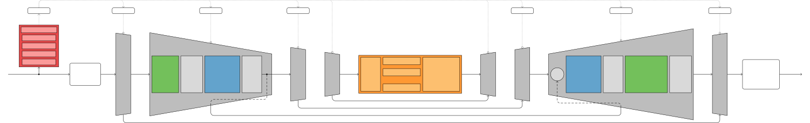
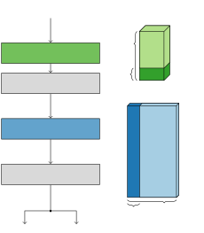
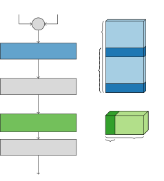
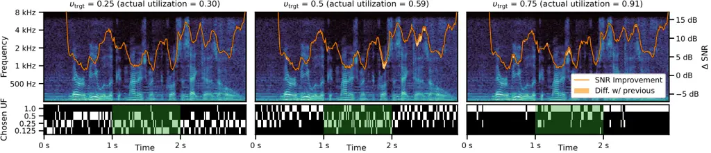

# Adaptive Slimming for Scalable and Efficient Speech Enhancement Thanks: This work has received funding from the European Union’s Horizon research and innovation program under grant agreement No 101070374.

###### Abstract

Speech enhancement (SE) enables robust speech recognition, real-time
communication, hearing aids, and other applications where speech quality
is crucial. However, deploying such systems on resource-constrained
devices involves choosing a static trade-off between performance and
computational efficiency. In this paper, we introduce dynamic slimming
to DEMUCS, a popular SE architecture, making it scalable and
input-adaptive. Slimming lets the model operate at different utilization
factors (UF), each corresponding to a different performance/efficiency
trade-off, effectively mimicking multiple model sizes without the extra
storage costs. In addition, a router subnet, trained end-to-end with the
backbone, determines the optimal UF for the current input. Thus, the
system saves resources by adaptively selecting smaller UFs when
additional complexity is unnecessary. We show that our solution is
Pareto-optimal against individual UFs, confirming the benefits of
dynamic routing. When training the proposed dynamically-slimmable model
to use $`10\text{\,}\mathrm{\%}`$ of its capacity on average, we obtain
the same or better speech quality as the equivalent static
$`25\text{\,}\mathrm{\%}`$ utilization while reducing MACs by
$`29\text{\,}\mathrm{\%}`$.¹¹ 1 Samples at
[https://miccio-dk.github.io/adaptive-slimming-speech-enh/](https://miccio-dk.github.io/adaptive-slimming-speech-enh/)

###### Index Terms: 

speech enhancement, dynamic neural networks, edge AI

|                                                                                                                              |
| ---------------------------------------------------------------------------------------------------------------------------- |
| Riccardo Miccini^(♭♮♯), Minje Kim^(♮), Clément Laroche^(♭), Luca Pezzarossa^(♯), Paris Smaragdis^(♮)                         |
| ^(♭)GN Audio, Denmark;   ^(♮)University of Illinois at Urbana-Champaign, USA;   ^(♯)Technical University of Denmark, Denmark |

## 1 Introduction

Speech enhancement (SE) systems are a crucial part of telecommunication,
teleconferencing, and assistive technology, improving remote
collaboration, user experience, and quality of life. In recent years, SE
solutions based on deep learning made significant progress, thanks to
their ability to learn from vast amounts of data \[1, 2, 3, 4, 5, 6\].
However, deploying these systems on resource-constrained embedded
devices such as headsets, speakerphones, or hearing aids requires a
careful trade-off between denoising performance and computational needs.
This can be challenging to achieve, given the broad range of acoustic
conditions and noise levels experienced in the real world. Because
devices must handle rare but challenging acoustic scenarios without
failing, they require sufficiently large models trained from a large
dataset for worst-case conditions. Consequently, in typical scenarios
that involve relatively clean inputs, SE models are over-provisioned,
wasting computational resources and energy.

Dynamic neural networks (DynNN) offer a solution to this problem,
providing specialized architectures and training strategies to develop
artificial neural networks that can manipulate certain aspects of their
computational graph at inference time, often based on the input \[7\].
DynNNs with scalable depth, width, or adaptive/conditional connections
have been successfully applied to computer vision \[8, 9, 10, 11, 12\]
and, as of recently, are being investigated on audio-processing
tasks \[13, 14, 15, 16\]. In this paper, we introduce dynamic slimming
to DEMUCS \[17\], a popular SE architecture, to make it scalable and
input-adaptive. Slimming is a form of width-wise dynamism that lets the
model operate at different utilization factors (UF), corresponding to
discrete subsets of weights, each providing a different
performance/efficiency trade-off. Intuitively, higher UFs correspond to
larger networks, resulting in better denoising performance, but at
higher computational costs. This is conceptually equivalent to deploying
multiple models of different sizes without incurring the cost of storing
all their weights, such as a sparse mixture of local experts for
SE \[18\], thanks to its structured architecture.

Fig. 1: Relationship between average utilization and SI-SDR improvement
for model trained with $`\upsilon_{\text{trgt}}=0.5`$, showing how our
proposed solution processes noisier input data (lighter points) using
more resources, causing a larger improvement.

We hypothesize that the UF concept is associated with the difficulty of
the SE task. Input noise conditions can range from easy (e.g., high SNR
or static noise) to more challenging (e.g., low SNR, non-stationary, or
speech-like noise). Thus, using a large model across a range of SE tasks
can induce redundancy in its architecture, wasting resources when the
input is trivial. In our work, a routing module estimates the optimal UF
for each utterance based on the input characteristics and a desired
average utilization target, ensuring an advantageous trade-off between
computational efficiency and speech quality by selecting smaller UFs
when larger ones would offer limited additional benefits (as
demonstrated in Fig. 1). The resulting system is an adaptively-slimmable
neural network that can match the denoising performance of a given
static baseline while using fewer computational resources on average. We
also observe that dynamic routing is Pareto-optimal when compared with
statically selecting a specific UF because, by adapting to the input,
the proposed system selects the most advantageous trade-off points,
reducing the average computational costs. We contribute the following:

1.  Performance and efficiency improvements on the DEMUCS baseline and
    architectural adaptations to support multiple performance/efficiency
    trade-offs through slimming; 2) Design of a lightweight routing
    sub-network for input-dependent scalability, along with training
    strategy; 3) Model evaluation with respect to its training
    hyperparameters.



Fig. 2: Overall solution showing DEMUCS backbone with encoder
$`\mathcal{E}_{i}`$ and decoder $`\mathcal{D}_{i}`$ blocks (gray), the
grouped GRU bottleneck (orange), and routing subnet $`\mathcal{R}`$
(red). Connections between blocks are annotated with signal
dimensionality. Dotted connections represent UF arguments.



(a) Encoder block $`\mathcal{E}_{i}`$



(b) Decoder block $`\mathcal{D}_{i}`$

Fig. 3: Slimmable blocks with weight tensors; width, height, and depth
correspond to input channels, output channels, and kernel size,
respectively; $`C=2^{i-2}H`$ for $`i\geq 2`$ is the current hidden size.

## 2 Related Work

Efficient speech enhancement  
Over the years, several deep learning models for SE have demonstrated
real-time capabilities. These efficient SE models may integrate
architectural elements such as multi-path processing \[3, 19, 5\] or
encoder-decoder topology with skip connections \[20, 4, 21, 6\] based on
U-Net \[22\]. Some of these architectures, often based on recurrent
networks \[1\], have been specifically optimized for embedded
devices \[2, 23\].

Dynamic networks  
DynNNs can adapt their structure based on the input \[7\]. Early-exiting
models control how many layers are used \[24\] while recursive networks
can vary how many times they are executed \[8\]. Slimming \[9, 12\] or
channel pruning \[10, 11\] affect the model width, i.e., the number of
active nodes in a given layer. Finally, dynamic routing and the mixture
of experts (MoE) can switch between different weights \[25\] or entire
subnetworks \[26\].

DynNNs for audio  
Several DynNN techniques have been applied to SE and source separation,
including early-exiting \[13, 27, 28, 29\], recursive networks \[14,
30\], slimming \[31, 16\], channel pruning \[15\] and MoE \[18, 32\]. A
recent work on source separation applied dynamic slimming to the
feed-forward layers of transformer blocks \[16\]. In contrast, we slim a
larger part of the network and employ a single router to reduce
overhead. We also propose an improved training scheme based on the
Gumbel-softmax trick \[33, 34\] and demonstrate its effectiveness with
more UFs, resulting in a system that offers greater computational
savings and more versatility.



Fig. 4: Example inference for models trained with
$`\upsilon_{\text{trgt}}\in\left\{0.25,0.5,0.75\right\}`$, showing input
spectrogram along with improvement in instantaneous SNR (orange line,
with yellow regions marking difference with preceding model on the left)
and chosen UFs over time. In the middle portion of the sample (in
green), we deliberately reduce the noise level by
$`10\text{\,}\mathrm{dB}`$ to show how each model reacts by decreasing
its average utilization.

## 3 Dynamic Slimmable DEMUCS

### 3.1 DEMUCS for Speech Enhancement

Given a single-channel noisy audio signal $`x`$ of length $`T`$,
composed of clean speech $`s`$ and additive noise $`n`$, we compute an
estimate of the speech $`\hat{s}`$ using a function $`\mathcal{M}`$ such
that $`\mathcal{M}(x)=\hat{s}`$. Here, our choice of $`\mathcal{M}`$
falls on the DEMUCS architecture, initially developed for music source
separation \[35\] and subsequently adapted for real-time monaural speech
enhancement \[17\]. This architecture consists of an encoder, a
bottleneck, and a decoder, as shown in Fig. 2.

The encoder is composed of $`L`$ blocks, each denoted as
$`\mathcal{E}_{i}`$, featuring 1D convolution with kernel size $`K`$ and
stride $`S`$, ReLU activation, pointwise 1D convolution, and gated
linear unit (GLU) \[36\]. Each encoder block downsamples the signal by a
factor $`S`$ and doubles its channels, starting from an initial value
$`H`$. Following a symmetric structure, decoder blocks
$`\mathcal{D}_{i}`$ feature pointwise 1D convolution, GLU, transposed 1D
convolution and — except for the last block — ReLU activation. In order
to handle waveform input and output, both $`\mathcal{E}_{1}`$ and
$`\mathcal{D}_{1}`$ have a single input and output channel,
respectively.

The bottleneck performs sequence modeling on a high-dimensional space
comprising $`2^{L-1}H`$ features. The original DEMUCS employs two long
short-term memory (LSTM) units spanning the entire feature space. To
reduce the number of trainable parameters and operations, we split the
feature space into $`M`$ equally-sized blocks, assign each block to a
separate gated recurrent unit (GRU), and concatenate the resulting
output activations into a feature vector with the same dimensionality as
the bottleneck input. This is equivalent to employing a single GRU where
non-zero values occur only in blocks along the weight matrix diagonals,
allowing full connectivity within a block and no connectivity across
groups \[37, 4\]. Lastly, we employ skip connections, as popularized by
the U-Net architecture \[22\], between encoder and decoder blocks, and
operate on a version of the input signal $`x`$ that is upsampled by a
factor $`U`$ and subsequently downsampled.

### 3.2 Slimmable Encoder-Decoder Blocks

At the core of our blocks, we use slimmable 1D convolution. Each
convolutional layer maps a utilization factor, denoted as
$`\upsilon_{j}\in\mathbb{U}`$, to a specific portion of convolutional
filters. We define
$`\mathbb{U}=\smash{\left\{\upsilon_{j}\right\}}^{J}_{j=1}`$ as the
discrete set of available UFs of size $`J`$. These factors
$`\upsilon_{j}`$ are fractional values ranging from partial utilization,
i.e., $`\upsilon_{j}<1`$, to full utilization, i.e., $`\upsilon_{J}=1`$,
controlling the proportion of active weights in the layer. Thus,
$`\mathbb{U}`$ can be treated as an architectural hyperparameter. During
inference, the slimmable layers receive a UF as additional input,
determining the subset of active filters. Given the convolutional weight
tensor $`W\in\mathbb{R}^{C_{\text{out}}\times C_{\text{in}}\times K}`$,
slimming can be applied along the output channels, the input channels,
or both. This process involves selecting the first
$`\left\lceil C_{\text{out}}\upsilon_{j}\right\rceil`$ output channels
and/or $`\left\lceil C_{\text{in}}\upsilon_{j}\right\rceil`$ input
channels, depending on the slimming direction.

As shown in Fig. 3(a), we slim the first convolution in the encoder
block (green) along its output and the pointwise convolution (blue)
along its input. Thus, only the block’s internal feature space is
slimmed, while its input and output maintain the same dimensionality
regardless of UF. In this way, we avoid slimming the GLU, which would
cause certain features to be treated as either gating or activation
depending on the UF. The decoder block in Fig. 3(b) follows a similar
scheme, preserving the dimensionality of its input and output while
slimming internally. However, since the GLU is now applied on the
slimmed signal, we employ a slightly different approach for the
pointwise convolution (blue). To comply with the GLU structure, we
retrieve half of the required weights from the start of the tensor and
the other half from the middle, ensuring that the gating portion of the
GLU input is always processed with filters associated with it.

### 3.3 Routing sub-network

The routing module $`\mathcal{R}`$, shown in Fig. 2 (red), is tasked
with selecting a UF based on the input. It comprises 1D convolution,
ReLU activation, diagonal GRU, and point-wise convolution. To limit its
computational overhead, we employ diagonal GRUs \[38\], which can be
seen as an extreme case of grouped GRUs where each hidden feature has a
separate GRU \[37\], effectively replacing all matrix multiplications
with element-wise products. Furthermore, we match stride and kernel size
in the first convolutional layer, decreasing its time resolution and
resulting in the downsampled sequence $`T^{\ast}<T`$.

This subnet computes a score matrix
$`r\in\mathbb{R}^{J\times T^{\ast}}`$, such that the distribution of UFs
for each input frame is given by $`\softmax_{j}(r)`$. Since only one UF
out of the $`J`$ available ones is used at any given time, we must turn
the aforementioned distribution into discrete decisions. The most
straightforward approach involves selecting the UF with the highest
probability using the $`\argmax`$ operator. However, this operation is
not differentiable, preventing end-to-end training. Furthermore, it
results in selections that do not reflect the distribution estimated by
$`\mathcal{R}`$, causing low-probability UFs to never be chosen. To
address both issues, we apply the Gumbel-softmax trick proposed in \[33,
34\]: during training, we sample from the distribution by adding Gumbel
noise to $`r`$, ensuring exploration of all available UFs.
Differentiation is thus supported through the following relaxation:

```math
\mathcal{R}(x)=\begin{cases}\argmax_{j}(r+G)&\text{Forward pass}\\
\softmax_{j}(r+G)&\text{Backward pass}\end{cases} \tag{1}
```

where $`G`$ is a matrix of i.i.d. Gumbel noise samples. This allows the
routing subnet to provide discrete UFs while backpropagating an
estimated gradient. During inference, we omit the noise, i.e., $`G=0`$.

### 3.4 Training Strategy

The training process comprises two stages: firstly, we pre-train the
slimmable DEMUCS architecture to ensure proficiency in the denoising
task for all UFs. Subsequently, we implant the routing subnet
$`\mathcal{R}`$ and train it end-to-end together with the slimmable
backbone.

During the first stage, we predict a signal $`\hat{s}_{j}`$ using each
$`\mathcal{M}_{j}`$, i.e., the model running at utilization
$`\upsilon_{j}`$. We then compute a denoising loss
$`\mathcal{L}_{\text{SE}}`$ for each of the signals $`\hat{s}_{j}`$, and
minimize their sum:

```math
\mathcal{L}_{\text{Slim}}=\sum_{j}\mathcal{L}_{\text{SE}}\left(s,\hat{s}_{j}\right)\qquad\hat{s}_{j}=\mathcal{M}_{j}\left(x\right) \tag{2}
```

We employ the loss described in \[1\], which we found empirically to
yield better results than the one originally used by DEMUCS. It computes
the squared distances between predicted and target signals of their
complex and magnitude STFTs (with $`l`$ and $`f`$ indexing time and
frequency bins), both compressed by $`c`$ and mixed by a factor
$`\alpha`$:

```math
\mathcal{L}_{\text{SE}}=\alpha\sum_{l,f}\left||S|^{c}e^{j\angle_{\lx@scalerel@obj{S\rule{0.0pt}{3.22916pt}}}}-|\hat{S}|^{c}e^{j\angle_{\lx@scalerel@obj{\hat{S}\rule{0.0pt}{3.22916pt}}}}\right|^{\scriptscriptstyle 2}+(1-\alpha)\sum_{l,f}\left||S|^{c}-|\hat{S}|^{c}\right|^{\scriptscriptstyle 2} \tag{3}
```

In the second stage, we minimize an end-to-end loss comprising the
following regularization terms ($`\beta`$ and $`\gamma`$ are weighting
coefficients):

```math
\mathcal{L}_{\text{DynSlim}}=\mathcal{L}_{\text{SE}}(s,\hat{s})+\beta\mathcal{L}_{\text{Eff}}+\gamma\mathcal{L}_{\text{Bal}} \tag{4}
```

The estimated clean speech $`\hat{s}`$ is computed by combining the
output from each UF using using $`\mathbb{1}_{\mathcal{R}(x)=j}`$, an
indicator function that is $`1`$ when UF $`\upsilon_{j}`$ is selected
and $`0`$ otherwise, as gating signal. Since $`\mathcal{R}(x)`$ operates
at a lower resolution $`T^{\ast}`$, we first resample its output to
match the bottleneck resolution $`\frac{UT}{S^{L}}`$ using
nearest-neighbor interpolation, followed by zero-order hold to obtain
the original input length $`T`$:

```math
\hat{s}=\sum_{j}\mathcal{M}_{j}(x)\cdot\upsample_{T^{\ast}\rightarrow T}\left(\mathbb{1}_{\mathcal{R}(x)=j}\right) \tag{5}
```

The loss term $`\mathcal{L}_{\text{Eff}}`$ ensures the learned model
achieves the defined level of efficiency by keeping the overall
utilization close to a target value $`\upsilon_{\text{trgt}}`$.
Meanwhile, the balancing term $`\mathcal{L}_{\text{Bal}}`$, based on
\[25\], prevents the model from favoring only a few UFs. These are:

```math
\mathcal{L}_{\text{Eff}}=\bigg(\sum_{j}\Big(\tilde{\Upsilon}_{j}\upsilon_{j}\Big)-\upsilon_{\text{trgt}}\bigg)^{2},\quad\mathcal{L}_{\text{Bal}}=\frac{1}{J-1}\bigg(J\sum_{j}{\tilde{\Upsilon}_{j}}^{2}-1\bigg) \tag{6}
```

where $`\tilde{\Upsilon}\in\mathbb{R}^{J}`$ represents the relative
occurrence of each UF across a training batch such that
$`\tilde{\Upsilon}_{j}=\mathbb{E}\left(\mathbb{1}_{\mathcal{R}(x)=j}\right)`$.
We use this because, although we want to favor smaller UFs, we still
expect the model to employ bigger UFs on challenging input data, as long
as the target efficiency is maintained globally.

Fig. 5: Pareto fronts given by utilization/MACs (x-axes) vs. speech
quality metrics (y-axis) for static slimmable backbone (light blue empty
squares) and dynamic models trained on a range of
$`\upsilon_{\text{trgt}}`$; the dotted horizontal lines show the
distance between each $`\upsilon_{\text{trgt}}`$ (solid vertical lines)
and actual average utilization. For
$`\upsilon_{\text{trgt}}\in\left\{0.25,0.5\right\}`$, we include results
from the alternative training schedule described in Training.

Fig. 6: For models trained with different regularization coefficients
(one per row), we show the relative occurrence of each UF (i.e.
$`\tilde{\Upsilon}_{j}`$; blue stacked bars) along with their PESQ and
avg. utilization (red and green dots, uppermost x-axes); dashed line
showing $`\upsilon_{\text{trgt}}=0.25`$.

## 4 Experimental Setup

Data  
We perform our experiments on the popular VoiceBank+DEMAND
dataset \[39\]. The training split features $`11\,572`$ utterances from
$`28`$ speakers, corresponding to $`\sim 10`$ hours of data, with
background noise mixed at SNRs ranging from $`0\text{\,}\mathrm{dB}`$ to
$`15\text{\,}\mathrm{dB}`$. We use the utterances from two random
speakers as a validation set. The test split contains $`824`$ utterances
from $`2`$ unseen speakers mixed with unseen noise at SNRs between
$`2.5\text{\,}\mathrm{dB}`$ and $`17.5\text{\,}\mathrm{dB}`$. The data
is downsampled to $`16\text{\,}\mathrm{kHz}`$. During training, we
randomly extract segments of $`4\text{\,}\mathrm{s}`$ and augment them
based on the DEMUCS training recipe \[17\].

Model  
Similarly to the causal variant in the original paper, our DEMUCS
backbone is parameterized by $`L=5`$, $`K=8`$, $`S=4`$, and $`U=4`$. We
decrease the initial hidden channels $`H`$ to $`32`$ and employ the
grouped GRU method described in Section 3.1 with $`M=4`$. For slimming,
we set $`\mathbb{U}=\left\{0.125,0.25,0.5,1.0\right\}`$ and thus
$`J=4`$. The layers in the subnet $`\mathcal{R}`$ have kernel size of
$`256`$ and $`64`$ hidden features/channels, introducing a negligible
$`0.06\text{\,}\mathrm{\%}`$ overhead.

Training  
During the first stage, we pre-train the slimmable backbone for up to
$`400`$ epochs on batches of $`32`$ elements, using a learning rate of
$`1\text{\times}{10}^{-3}`$ that is halved every $`15`$ epochs without
improvement on the validation set. In the second stage, we transfer the
pre-trained backbone weights, randomly initialize the router, and train
both for up to $`250`$ epochs on batches of $`16`$ elements with a
learning rate of $`1\text{\times}{10}^{-3}`$ decaying by a factor of
$`0.99`$ per epoch. We also test a variant where the router is
pre-trained with the backbone frozen, followed by joint fine-tuning at a
learning rate of $`1\text{\times}{10}^{-4}`$ (✖ and ▲ in Fig. 5). We use
$`c=0.3`$, $`\alpha=0.3`$ for the SE loss 3 (as in the original paper),
and set $`\beta=1.0`$, $`\gamma=0.1`$ for the end-to-end loss 4, based
on observations in Fig. 6. In all cases, we use the Adam optimizer and
enable early stopping with a patience of $`35`$ epochs.

Metrics  
We assess speech quality with the perceptual evaluation of speech
quality (PESQ) \[40\], the scale-invariant signal-to-distortion ratio
(SI-SDR) \[41\], the short-time objective intelligibility (STOI) \[42\],
and mean opinion scores predicted using DNSMOS P.808 \[43\]. For
computational efficiency, we estimate multiply-accumulate operations
(MACs) per input sample using fvcore²² 2
[https://github.com/facebookresearch/fvcore/blob/main/docs/flop_count.md](https://github.com/facebookresearch/fvcore/blob/main/docs/flop_count.md).

## 5 Results

Fig. 5 presents Pareto fronts comparing dynamically-slimmable models
trained with different $`\upsilon_{\text{trgt}}`$ against the static
slimmable backbone. The dynamic models consistently achieve Pareto
efficiency across all metrics, demonstrating improved trade-offs between
performance and efficiency. The proposed method is more advantageous
when the system is asked to reduce the complexity. For example, when
training with $`\upsilon_{\text{trgt}}=0.1`$ (smallest dot), performance
is on par with or better than the backbone with static $`0.25`$
utilization (empty square on line at $`0.25`$) for all metrics. With
regularization from $`\mathcal{L}_{\text{Eff}}`$, the actual utilization
is $`0.176`$ on average, resulting in a $`29\text{\,}\mathrm{\%}`$
reduction in MACs when compared to the static backbone at UF = $`0.25`$.
Similarly, when training for $`\upsilon_{\text{trgt}}=0.9`$ (largest
dot), the actual utilization averages $`0.962`$, resulting in a
$`4\text{\,}\mathrm{\%}`$ MACs reduction while improving PESQ by
$`2.2\text{\,}\mathrm{\%}`$ and SI-SDR by $`0.5\text{\,}\mathrm{\%}`$
when compared to the full static backbone (i.e., UF = $`1`$). Notably,
splitting the second training stage into router pre-training followed by
joint fine-tuning achieves better adherence to utilization targets but
proves detrimental to speech quality.

The impact of the regularization coefficients used in 4 is shown in
Fig. 6. Expectedly, higher $`\beta`$ values improve target adherence,
which leads to narrower distributions concentrated around small UFs,
whereas lower values yield a more diverse selection of UFs, improving
PESQ scores despite exceeding $`\upsilon_{\text{trgt}}`$. The choice
$`\gamma`$ has an analogous yet inverse effect: in both cases, a clear
correlation between UF uniformity, average utilization, and speech
quality is observed.

Lastly, Fig. 1 demonstrates how a dynamic model adapts its capacity
based on input difficulty, indicated there by the initial SI-SDR of
noisy inputs. We observe that easier inputs (higher SI-SDR) are
processed using lower UFs on average while more capacity is allocated
for noisier inputs, leading to larger SI-SDR improvements. Intuitively,
this means that resources are spent predominantly on challenging inputs
requiring more enhancement while realizing savings on easier ones,
reflecting the merit of the proposed architecture. This is further
exemplified in Fig. 4, where input regions featuring lower noise levels
or less speech content trigger the selection of lower UFs.

## 6 Conclusion

We introduced dynamic slimming to SE, extending the DEMUCS architecture
with slimmable blocks and a lightweight routing network. The proposed
system dynamically scales to match the complexity of incoming audio,
improving quality on challenging inputs while saving resources on easier
ones. Our method demonstrates Pareto-optimal behavior across speech
quality metrics, offering better trade-offs than static slimming. This
highlights the practical value of input adaptiveness and computational
scalability, as showcased by our dynamically-slimmable networks, in
real-time, resource-constrained settings. We plan to extend this
approach to encompass the recurrent bottleneck, leverage the model’s
internal representations for routing, and verify its applicability on
alternative SE architectures.

## REFERENCES

- \[1\] S. Braun and I. Tashev, “Data Augmentation and Loss
  Normalization for Deep Noise Suppression,” in _Lecture Notes in
  Computer Science_, 2020.
- \[2\] I. Fedorov, M. Stamenovic, C. Jensen, L.-C. Yang, A. Mandell,
  Y. Gan, M. Mattina, and P. N. Whatmough, “TinyLSTMs: Efficient Neural
  Speech Enhancement for Hearing Aids,” in _Interspeech 2020_,
  Oct. 2020.
- \[3\] N. Shankar, G. S. Bhat, and I. M. Panahi, “Real-Time
  Single-Channel Deep Neural Network-Based Speech Enhancement on Edge
  Devices,” in _Interspeech 2020_, Oct. 2020.
- \[4\] S. Braun, H. Gamper, C. K. Reddy, and I. Tashev, “Towards
  Efficient Models for Real-Time Deep Noise Suppression,” in _ICASSP
  2021 - 2021 IEEE International Conference on Acoustics, Speech and
  Signal Processing (ICASSP)_, Jun. 2021.
- \[5\] R. Yu, Z. Zhao, and Z. Ye, “PFRNet: Dual-Branch Progressive
  Fusion Rectification Network for Monaural Speech Enhancement,” _IEEE
  Signal Processing Letters_, 2022.
- \[6\] X. Rong, T. Sun, X. Zhang, Y. Hu, C. Zhu, and J. Lu, “GTCRN: A
  Speech Enhancement Model Requiring Ultralow Computational Resources,”
  in _ICASSP 2024 - 2024 IEEE International Conference on Acoustics,
  Speech and Signal Processing (ICASSP)_, Apr. 2024.
- \[7\] Y. Han, G. Huang, S. Song, L. Yang, H. Wang, and Y. Wang,
  “Dynamic Neural Networks: A Survey,” _IEEE Transactions on Pattern
  Analysis and Machine Intelligence_, Nov. 2022.
- \[8\] Q. Guo, Z. Yu, Y. Wu, D. Liang, H. Qin, and J. Yan, “Dynamic
  Recursive Neural Network,” in _2019 IEEE/CVF Conference on Computer
  Vision and Pattern Recognition (CVPR)_, Jun. 2019.
- \[9\] J. Yu, L. Yang, N. Xu, J. Yang, and T. S. Huang, “Slimmable
  Neural Networks,” in _7th International Conference on Learning
  Representation_, May 2019.
- \[10\] C. Herrmann, R. S. Bowen, and R. Zabih, “Channel Selection
  Using Gumbel Softmax,” in _Computer Vision – ECCV 2020: 16th European
  Conference, Glasgow, UK, August 23–28, 2020, Proceedings, Part XXVII_,
  Aug. 2020.
- \[11\] X. Gao, Y. Zhao, L. Dudziak, R. D. Mullins, and C.-Z. Xu,
  “Dynamic Channel Pruning: Feature Boosting and Suppression,” in _7th
  International Conference on Learning Representations_, May 2019.
- \[12\] C. Li, G. Wang, B. Wang, X. Liang, Z. Li, and X. Chang,
  “Dynamic Slimmable Network,” in _2021 IEEE/CVF Conference on Computer
  Vision and Pattern Recognition (CVPR)_, Jun. 2021.
- \[13\] S. Chen, Y. Wu, Z. Chen, T. Yoshioka, S. Liu, J. Li, and X. Yu,
  “Don’t Shoot Butterfly with Rifles: Multi-Channel Continuous Speech
  Separation with Early Exit Transformer,” in _ICASSP 2021 - 2021 IEEE
  International Conference on Acoustics, Speech and Signal Processing
  (ICASSP)_, Jun. 2021.
- \[14\] D. Bralios, E. Tzinis, G. Wichern, P. Smaragdis, and
  J. Le Roux, “Latent Iterative Refinement for Modular Source
  Separation,” in _ICASSP 2023 - 2023 IEEE International Conference on
  Acoustics, Speech and Signal Processing (ICASSP)_, Jun. 2023.
- \[15\] R. Miccini, C. Laroche, T. Piechowiak, and L. Pezzarossa,
  “Scalable Speech Enhancement With Dynamic Channel Pruning,” in _ICASSP
  2025 - 2025 IEEE International Conference on Acoustics, Speech and
  Signal Processing (ICASSP)_, Apr. 2025.
- \[16\] M. Elminshawi, S. R. Chetupalli, and E. A. P. Habets, “Dynamic
  Slimmable Network for Speech Separation,” _IEEE Signal Processing
  Letters_, 2024.
- \[17\] A. Défossez, G. Synnaeve, and Y. Adi, “Real Time Speech
  Enhancement in the Waveform Domain,” in _Interspeech 2020_, Oct. 2020.
- \[18\] A. Sivaraman and M. Kim, “Sparse Mixture of Local Experts for
  Efficient Speech Enhancement,” in _Interspeech 2020_, Oct. 2020.
- \[19\] J.-M. Valin, U. Isik, N. Phansalkar, R. Giri, K. Helwani, and
  A. Krishnaswamy, “A Perceptually-Motivated Approach for
  Low-Complexity, Real-Time Enhancement of Fullband Speech,” in
  _Interspeech 2020_, Oct. 2020.
- \[20\] D. Stoller, S. Ewert, and S. Dixon, “Wave-U-Net: A Multi-Scale
  Neural Network for End-to-End Audio Source Separation,” in
  _Proceedings of the 19th International Society for Music Information
  Retrieval Conference, ISMIR 2018, Paris, France, September 23-27,
  2018_, 2018.
- \[21\] M. Sach, J. Franzen, B. Defraene, K. Fluyt, M. Strake,
  W. Tirry, and T. Fingscheidt, “EffCRN: An Efficient Convolutional
  Recurrent Network for High-Performance Speech Enhancement,” in
  _Interspeech 2023_, Aug. 2023.
- \[22\] O. Ronneberger, P. Fischer, and T. Brox, “U-Net: Convolutional
  Networks for Biomedical Image Segmentation,” in _Lecture Notes in
  Computer Science_, 2015.
- \[23\] M. Rusci, M. Fariselli, M. Croome, F. Paci, and E. Flamand,
  “Accelerating RNN-Based Speech Enhancement on a Multi-core MCU with
  Mixed FP16-INT8 Post-training Quantization,” in _ECML PKDD_,
  Jan. 2023.
- \[24\] S. Scardapane, M. Scarpiniti, E. Baccarelli, and A. Uncini,
  “Why Should We Add Early Exits to Neural Networks?” _Cognitive
  Computation_, Sep. 2020.
- \[25\] W. Fedus, B. Zoph, and N. Shazeer, “Switch Transformers:
  Scaling to Trillion Parameter Models with Simple and Efficient
  Sparsity,” _J. Mach. Learn. Res._, Jan. 2022.
- \[26\] N. Shazeer, A. Mirhoseini, K. Maziarz, A. Davis, Q. V. Le,
  G. E. Hinton, and J. Dean, “Outrageously Large Neural Networks: The
  Sparsely-Gated Mixture-of-Experts Layer,” in _5th International
  Conference on Learning Representations_, 2017.
- \[27\] A. Li, C. Zheng, L. Zhang, and X. Li, “Learning to Inference
  with Early Exit in the Progressive Speech Enhancement,” in _2021 29th
  European Signal Processing Conference (EUSIPCO)_, Aug. 2021.
- \[28\] S. Kim and M. Kim, “Bloom-Net: Blockwise Optimization for
  Masking Networks Toward Scalable and Efficient Speech Enhancement,” in
  _ICASSP 2022 - 2022 IEEE International Conference on Acoustics, Speech
  and Signal Processing (ICASSP)_, May 2022.
- \[29\] R. Miccini, A. Zniber, C. Laroche, T. Piechowiak, M. Schoeberl,
  L. Pezzarossa, O. Karrakchou, J. Sparsø, and M. Ghogho, “Dynamic
  nsNET2: Efficient Deep Noise Suppression with Early Exiting,” in _2023
  IEEE 33rd International Workshop on Machine Learning for Signal
  Processing (MLSP)_, Sep. 2023.
- \[30\] M. Kim and T. Kristjansson, “Scalable and Efficient Speech
  Enhancement Using Modified Cold Diffusion: A Residual Learning
  Approach,” in _ICASSP 2024 - 2024 IEEE International Conference on
  Acoustics, Speech and Signal Processing (ICASSP)_, Apr. 2024.
- \[31\] M. Elminshawi, S. R. Chetupalli, and E. A. P. Habets,
  “Slim-Tasnet: A Slimmable Neural Network for Speech Separation,” in
  _2023 IEEE Workshop on Applications of Signal Processing to Audio and
  Acoustics (WASPAA)_, Oct. 2023.
- \[32\] R. E. Zezario, C.-S. Fuh, H.-M. Wang, and Y. Tsao, “Speech
  Enhancement with Zero-Shot Model Selection,” in _2021 29th European
  Signal Processing Conference (EUSIPCO)_, Aug. 2021.
- \[33\] C. J. Maddison, A. Mnih, and Y. W. Teh, “The Concrete
  Distribution: A Continuous Relaxation of Discrete Random Variables,”
  in _5th International Conference on Learning Representations_,
  Apr. 2017.
- \[34\] E. Jang, S. Gu, and B. Poole, “Categorical Reparameterization
  with Gumbel-Softmax,” in _5th International Conference on Learning
  Representations_, Apr. 2017.
- \[35\] A. Défossez, N. Usunier, L. Bottou, and F. Bach, “Demucs: Deep
  Extractor for Music Sources with Extra Unlabeled Data Remixed,”
  Sep. 2019.
- \[36\] Y. N. Dauphin, A. Fan, M. Auli, and D. Grangier, “Language
  Modeling with Gated Convolutional Networks,” in _Proceedings of the
  34th International Conference on Machine Learning, ICML 2017, Sydney,
  NSW, Australia, 6-11 August 2017_, 2017.
- \[37\] M. V. Keirsbilck, A. Keller, and X. Yang, “Rethinking Full
  Connectivity in Recurrent Neural Networks,” May 2019.
- \[38\] Y. C. Subakan and P. Smaragdis, “Diagonal RNNs in Symbolic
  Music Modeling,” in _2017 IEEE Workshop on Applications of Signal
  Processing to Audio and Acoustics (WASPAA)_, Oct. 2017.
- \[39\] C. Valentini-Botinhao, X. Wang, S. Takaki, and J. Yamagishi,
  “Investigating RNN-based speech enhancement methods for noise-robust
  Text-to-Speech,” in _9th ISCA Workshop on Speech Synthesis Workshop
  (SSW 9)_, Sep. 2016.
- \[40\] A. Rix, J. Beerends, M. Hollier, and A. Hekstra, “Perceptual
  Evaluation of Speech Quality (PESQ) - a New Method for Speech Quality
  Assessment of Telephone Networks and Codecs,” in _2001 IEEE
  International Conference on Acoustics, Speech, and Signal Processing_,
  May 2001.
- \[41\] J. Le Roux, S. Wisdom, H. Erdogan, and J. R. Hershey, “SDR –
  Half-baked or Well Done?” in _ICASSP 2019 - 2019 IEEE International
  Conference on Acoustics, Speech and Signal Processing (ICASSP)_,
  May 2019.
- \[42\] C. H. Taal, R. C. Hendriks, R. Heusdens, and J. Jensen, “A
  Short-Time Objective Intelligibility Measure for Time-Frequency
  Weighted Noisy Speech,” in _2010 IEEE International Conference on
  Acoustics, Speech and Signal Processing_, 2010.
- \[43\] C. K. A. Reddy, V. Gopal, and R. Cutler, “DNSMOS: A
  Non-Intrusive Perceptual Objective Speech Quality Metric to Evaluate
  Noise Suppressors,” in _ICASSP 2021 - 2021 IEEE International
  Conference on Acoustics, Speech and Signal Processing (ICASSP)_,
  Jun. 2021.
