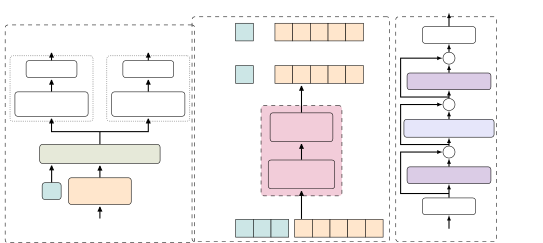
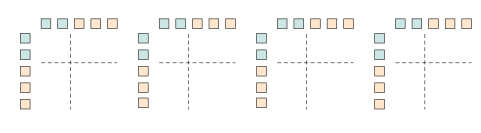

\NoHyper

# FasTUSS: Faster Task-Aware Unified Source Separation

This work was done while F. Paissan was an intern at MERL.

###### Abstract

Time-Frequency (TF) dual-path models are currently among the best
performing audio source separation network architectures, achieving
state-of-the-art performance in speech enhancement, music source
separation, and cinematic audio source separation. While they are
characterized by a relatively low parameter count, they still require a
considerable number of operations, implying a higher execution time.
This problem is exacerbated by the trend towards bigger models trained
on large amounts of data to solve more general tasks, such as the
recently introduced task-aware unified source separation (TUSS) model.
TUSS, which aims to solve audio source separation tasks using a single,
conditional model, is built upon TF-Locoformer, a TF dual-path model
combining convolution and attention layers. The task definition comes in
the form of a sequence of prompts that specify the number and type of
sources to be extracted. In this paper, we analyze the design choices of
TUSS with the goal of optimizing its performance-complexity trade-off.
We derive two more efficient models, FasTUSS-8.3G and FasTUSS-11.7G that
reduce the original model’s operations by 81% and 73% with minor
performance drops of 1.2 dB and 0.4 dB averaged over all benchmarks,
respectively. Additionally, we investigate the impact of prompt
conditioning to derive a causal TUSS model.

| Francesco Paissan^(1,2), Gordon Wichern¹, Yoshiki Masuyama¹, Ryo Aihara¹, _François G. Germain¹, Kohei Saijo³, Jonathan Le Roux¹_ |
| --------------------------------------------------------------------------------------------------------------------------------- |
| ¹Mitsubishi Electric Research Laboratories (MERL), Cambridge, MA, USA                                                             |
| ²University of Trento, Trento, Italy    ³Waseda University, Tokyo, Japan                                                          |

## 1 Introduction

With the advent of neural networks in audio source separation, different
neural network architectures have been explored to solve specific tasks
such as speech enhancement (SE) \[1, 2, 3\], speech separation (SS) \[4,
5, 6, 7, 8\], music source separation (MSS) \[9, 10\], sound event
separation \[11, 12\], and cinematic audio source separation (CASS)
\[13, 14, 15\]. There has recently been a shift towards solving general
audio source separation (GASS) \[16\] by training a single model using
data from multiple audio source separation tasks. Based on the
realization that GASS is an inherently ill-posed problem whose goal is
task-dependent, task-aware unified source separation (TUSS) \[17\]
reformulates GASS as a conditional, task-aware, source separation
problem, thereby solving multiple tasks using a single model. While
conditional models have been used in the audio source separation
literature for target sound extraction (TSE) \[18, 19, 20\], where the
stems to be extracted can be specified by class IDs \[21, 22, 23, 24,
25\], sound examples \[18, 20, 26\], or even text queries \[27, 28,
29\], TSE models only extract one source, or a group of sources, at a
time. Therefore, they do not model the relationship between queries, and
thus are not task-aware. For example, speech sources should be treated
differently when separating two overlapping voices and when separating
all the speech in a podcast from the background music.

Formulating TUSS as a conditional source separation problem requires
designing a model capable of (i) handling a variable number of output
sources and (ii) adapting the source definition depending on the mixture
and the input prompts. The model should also be powerful enough to
handle a wide variety of task scenarios and to learn from large amounts
of data. This made the TF-Locoformer architecture \[30\] an ideal
building block for TUSS: encapsulating the modeling power of
time-frequency (TF)-domain dual-path models for source separation \[9,
8, 31\] within a transformer-based architecture, it reaches
state-of-the-art performance on multiple tasks while making it easy to
introduce prompt tokens as a way to specify the task of interest. Like
all TF dual-path models, however, while TF-Locoformer has relatively few
parameters (11.1M), it requires a considerable amount of operations,
making model training more expensive and incurring high computational
cost at inference time.

In this paper, we explore ways to reduce the computational cost of the
TUSS architecture, and to make it usable in practical real-time
conditions. Analyzing the performance of TUSS over five datasets and
with different continuous source separation (CSS) settings (i.e., block
size for separating long signals), we propose a set of optimizations for
the TUSS architecture and benchmark their impact on the model’s
performance, leading to faster versions of the model, referred to as
_FasTUSS_. Additionally, we perform an extensive study to quantify the
interplay between mixture and prompts in the TUSS architecture. We use
the outcome of these experiments to derive a causal version of TUSS that
can employ common optimizations such as KVCache \[32\].

## 2 Overview of the TUSS Architecture



Fig. 1: TUSS architecture (left panel). Cross-prompt module and
conditioning strategy for $`T=5,N=5`$ (middle panel). Each TF-Locoformer
block has frequency modeling and temporal modeling sub-blocks with the
same architecture (right panel), where $`T^{\prime}=N+T`$ for the
cross-prompt module and $`T^{\prime}=T`$ inside conditional TSE.

The TUSS architecture, depicted in Fig. 1, takes as input a mixture
$`\bm{x}\in\mathbb{R}^{L}`$ of length $`L`$ and a set of $`N`$ prompts
indicating the set of target sources (or stems) that we want to extract
from the mixture. For example, the network can separate a scene into
stems consisting of all speakers, all music, and all sound effects when
prompted with \[Speech, Music-mix, SFX-mix\], but can further separate
the instruments given the prompts \[Speech, Drums, Vocals, Bass, Other
inst., SFX-mix\]. The mixture $`\bm{x}`$ is first processed using a
short-time Fourier transform (STFT) and a band-split encoder as in \[9,
31\], yielding $`\bm{Z}\in\mathbb{R}^{D\times T\times F}`$, where
$`D,T,F`$ represent the number of channels, frames, and frequency bands,
respectively. The encoded mixture $`\bm{Z}`$ is then processed, together
with a set of $`N`$ learned prompt embeddings
$`\bm{P}=[\bm{p}_{1},\dots,\bm{p}_{N}]\in\mathbb{R}^{D\times N}`$
corresponding to the input prompts, in two stages: a cross-prompt module
followed by a conditional TSE module. In the cross-prompt module, the
set of prompts is prepended to the encoded mixture on the frame axis,
yielding
$`\bm{Z^{\prime}}=[\bm{P}\;\bm{Z}]\in\mathbb{R}^{D\times(N+T)\times F}`$
after appropriate broadcasting, and $`\bm{Z^{\prime}}`$ is input to
Transformer-based blocks to model the dependency of the temporal
sequence. The conditioning between prompts and mixture happens
bidirectionally in the multi-head self-attention blocks. Injecting
prompts in this way enables conditioning based on an arbitrary number of
sources and specializing each prompt for the set of prompts and the
mixture currently being processed.

The conditional TSE module then extracts the source specified by each
prompt in parallel. The output
$`\bm{\tilde{Z}^{\prime}}=[\tilde{\bm{P}}\;\tilde{\bm{Z}}]`$ of the
cross-prompt module is split into the encodings of the prompts and the
mixture, which are combined using element-wise product. This results in
a mixture representation conditioned by each prompt,
$`\tilde{\bm{Z}}_{n}=\tilde{\bm{Z}}\odot\tilde{\bm{p}}_{n}`$, depicted
in the middle panel of Fig. 1. Each $`\tilde{\bm{Z}}_{n}`$ is further
processed by a sequence of Transformer blocks, similarly to the
cross-prompt module. The output of the conditional TSE module is fed to
a decoder that processes the sequence via an MLP and inverse STFT,
resulting in a separated signal $`\hat{\bm{s}}_{n}\in\mathbb{R}^{L}`$
for each prompt. The same conditional TSE module and decoder are used
for all prompts.

In both stages, the Transformer-based processing consists in stacks of
TF-Locoformer blocks. As illustrated in the middle panel of Fig. 1 for
the case of the cross-prompt module, within each TF-Locoformer block,
the input is processed frame-wise in a frequency modeling path then
frequency-wise in a temporal modeling path, where both the frequency
modeling and the temporal modeling consist of TF-Locoformer sub-blocks,
depicted in the right part of Fig. 1. Within the cross-prompt module,
the TF-Locoformer sub-blocks on the temporal modeling path process the
mixture using pointwise convolutions (in both FFN1 and FFN2 in the right
part of Fig. 1) to make the network robust to the order of the prompts
in $`\bm{P}`$.

Fig. 2: Compute breakdown of MHSA vs. convolutions for different chunk
lengths.

## 3 Profiling and optimizing TUSS

To derive a faster version of TUSS, we start by analyzing the
computational bottleneck of the original model. We measure the number of
multiply-accumulate (MAC)^(†)^(†) We use MAC as an indirect measure of
inference time. operations in TUSS and analyze the percentage of compute
required by convolutions vs. multi-head self-attention (MHSA) within the
TF-Locoformer block. The results of this profiling, summarized in
Fig. 2, showcase that the percentage varies based on sequence length,
because the computation required to perform a convolution scales
linearly with sequence length, while it scales quadratically for MHSA.
Notably, we find that, especially for short audio chunks, the majority
of the compute is spent for convolutions (90% for
$`1\text{\,}\mathrm{s}`$ of audio), while the contributions of MHSA and
convolutions become more comparable for sequences of
$`30\text{\,}\mathrm{s}`$. Guided by this finding, we focus on
optimizing the convolutional part of the TF-Locoformer block, depicted
in the right part of Fig. 1.

The convolutions inside the TF-Locoformer block are within the
Conv-SwiGLU blocks. Each of these blocks comprises a normalization
layer, one convolution with Swish activation, another convolution used
for gating, and a deconvolution. In the original TUSS paper \[17\], all
convolutions except those processing the frame path in the cross-prompt
module use one-dimensional kernels of size 4, and a hop size of 1. The
deconvolution uses the same parameters to ensure the output
dimensionality matches the input. Recall that the computational cost, in
MAC, of a one-dimensional grouped convolution
$`\Psi:\mathbb{R}^{C_{\text{in}}\times L}\to\mathbb{R}^{C_{\text{out}}\times L^{\prime}}`$
is

```math
\displaystyle L^{\prime}\frac{C_{\text{in}}C_{\text{out}}K}{G}=\left\lfloor\frac{L+2p-K}{S}+1\right\rfloor\frac{C_{\text{in}}C_{\text{out}}K}{G}, \tag{1}
```

where $`G`$ is the number of groups, $`S`$ is the stride, $`p`$ is the
amount of padding applied, and $`K`$ is the kernel size. We leave
$`p=\lfloor(K-1)/2\rfloor,\,K=4`$ to avoid deviating too much from the
original TUSS architecture, and observe that all hyper-parameters
linearly scale the complexity of the convolution. Therefore, to optimize
the overall structure of the FFN blocks, we investigate the impact of
changing (a) the stride: we test configurations with $`S\in\{1,2,4\}`$;
(b) the number of groups: we analyze the impact of grouped convolutions
with $`G=8`$ and channel shuffle, to ensure features are distributed
from one group to the others \[33, 34, 35\], and we test the performance
of depthwise separable convolutions ($`G=C_{\text{in}}`$) followed by a
pointwise convolution ($`K=1`$), a commonly used configuration for
resource-efficient neural networks \[36, 37, 38, 39\]; and (c) the use
of two FFN blocks before and after MHSA: we remove the first or second
FFN block and analyze the performance of combinations of these
optimizations.

We also explore variants of MHSA similar to \[40\] but with more recent
techniques. We tested replacing the MHSA in the TF-Locoformer block with
(a) linear unified nested attention (LUNA) \[41\], (b) cascaded grouped
attention (CGA) \[42\], and (c) a bi-directional GRU. We emphasize that
these optimizations result in minimal improvements in terms of compute,
especially for short audio segments. Nonetheless, they could be
beneficial for reducing the working memory requirement of the
architecture. We observe that reducing the capacity of the TF-Locoformer
block by replacing the MHSA affects its sequence modeling capabilities.
This is most relevant within the temporal modeling path of the
cross-prompt module, which also lacks the convolutional FFNs. To
alleviate this, we propose (d) a prompt-aware Conv-SwiGLU block: this
block is a modified version of the original FFN block, in which we
process the prepended prompts via linear layers, while the mixture is
processed using the original Conv-SwiGLU structure, with $`K=4`$.

Results are discussed in Section 6.1.

## 4 CAUSAL TUSS

To derive a causal version of TUSS, we make all the blocks within the
architecture causal. While the convolutional part is straightforward,
the MHSA inside the cross-prompt module needs special care to ensure the
mixture processing is causal and the prompts are updated without leaking
information during the training stage. For example, we note that using a
standard attention mask on the prompts would lead to the first prompt
(first element of $`\bm{Z}^{\prime}`$) never being updated with
information from other prompts or the mixture. Recall that the attention
map of the $`h`$-th head in MHSA is computed as

```math
\displaystyle\bm{\Lambda}_{h}=\text{Softmax}\left(\frac{\bm{Q}_{h}\bm{K}_{h}^{\top}}{\sqrt{D}}\right)\in\mathbb{R}^{(N+T)\times(N+T)}, \tag{2}
```

where $`\bm{Q}_{h}=\bm{X}\bm{W}_{h}^{Q}`$ and
$`\bm{K}_{h}=\bm{X}\bm{W}_{h}^{K}\in\mathbb{R}^{(N+T)\times D}`$ are
learnable linear projections of the MHSA layer’s input
$`\bm{X}\in\mathbb{R}^{(N+T)\times C_{\text{in}}}`$, and Softmax is
applied row-wise. We want to derive an attention mask
$`\bm{M}\in\mathbb{R}^{(N+T)\times(N+T)}`$ to modify the attention map
via element-wise multiplication, such that $`M_{ij}=1`$ if token $`j`$
influences the update of token $`i`$, $`M_{ij}=0`$ otherwise^(†)^(†) We
will informally say that token $`i`$ ‘sees’ token $`j`$ when
$`M_{ij}=1`$.. Specifically, we want $`\bm{M}`$ to (i) mimic causal
inference, (ii) minimally impact the model’s performance, and (iii)
enable inference using KVCache \[32\]. To achieve the objectives above,
we investigate the impact of the prompts in the mixture’s processing and
vice versa by experimenting with different attention mask designs.


Fig. 3: Attention maps in log scale. Teal, green, and orange tokens
represent the prompts, the \<SOS\> token, and the mixture, respectively.
L\* represent the layers on the temporal modeling path of the
cross-prompt module.

We construct the attention masks for the experiments by splitting them
into four blocks:

```math
\displaystyle\bm{M}=\left(\begin{matrix}\bm{A}&\bm{B}\\
\bm{C}&\bm{D}\\
\end{matrix}\right), \tag{3}
```

where $`\bm{A}\in\mathbb{R}^{N\times N}`$,
$`\bm{B}\in\mathbb{R}^{N\times T}`$,
$`\bm{C}\in\mathbb{R}^{T\times N}`$, and
$`\bm{D}\in\mathbb{R}^{T\times T}`$. $`\bm{A}`$ controls which prompts
are seen during each prompt’s update. $`\bm{B}`$ controls which portions
of the mixture influence the prompts. Finally, $`\bm{C}`$ and $`\bm{D}`$
represent the influence of the prompts and the mixture on the mixture’s
processing, respectively. Based on a qualitative analysis of the
attention masks in TUSS, depicted in Fig. 3, we experiment with three
TUSS variants. Specifically, prompt and mixture updates seem loosely
correlated (i.e., the matrices look roughly block-diagonal). Therefore,
we train the following models: BLINDPROMPT, where the prompts do not see
each other, with $`A_{ij}=\delta_{ij}`$, $`B_{ij}=0`$,
$`C_{ij}=D_{ij}=1`$, illustrated in Fig. 4(a); INDPROMPT, where the
prompts cannot see the mixture (i.e., the prompts are independently
processed), with $`B_{ij}=0`$ and $`A_{ij}=C_{ij}=D_{ij}=1`$, shown in
Fig. 4(b); and INDALL, where the prompts cannot see the mixture and vice
versa (i.e., they are independently processed from each other), with
$`A_{ij}=D_{ij}=1`$, $`B_{ij}=C_{ij}=0`$, shown in Fig. 4(c).

Finally, we derive a causal version of TUSS (CAUSAL) that can work with
KVCache by making the prompts independent of the mixture, and making the
mixture processing causal, as showcased in Fig. 4(d). Formally, the last
configuration is $`B_{ij}=0`$, $`A_{ij}=C_{ij}=1`$,
$`D_{ij}=\mathds{1}_{i\geq j}`$. Using this attention mask is equivalent
to performing inference of the MHSA over the entire sequence of prompts,
then, using the same MHSA weights, process the mixture using KVCache by
feeding one frame at a time, with the first one being appended to the
prompts. This ensures that the prompts are attended to also during
mixture processing, although without being updated.

Results are discussed in Section 6.2.

## 5 Experimental setup

Datasets. We follow the experimental setup presented in TUSS \[17\].
During training, we create mixtures on the fly using samples from VCTK
\[43\], WSJ0 \[44\], LibriVox (from the URGENT challenge) \[45\], FSD50k
\[46\], WHAM! \[47\], DEMAND \[48\], MUSDB-HQ \[49\], MOISESDB \[50\],
and FMA \[51\]. We use eight prompt categories, Speech, SFX, SFX-mix,
Bass, Drums, Vocals, Other inst., and Music-mix. We sample the number of
sources, $`N`$, for each training sequence from a multinomial
distribution with $`P(N=i)=1/3,\,\forall i\in\{2,3,4\}`$. The only stems
that can be repeated in a mixture are Speech and SFX. For validation, we
benchmark on multiple separation tasks using five datasets: VCTK-DEMAND
for SE, WHAM! for noisy SS, FUSS for sound event separation, MUSDB-HQ
for MSS, and DnR for CASS. We used the average SNR on the validation
datasets to analyze the performance-complexity trade-offs of different
architectures. We invite the reader to refer to the original paper
\[17\] for more details on the dynamic mixing and the pre-processing
pipelines.



Fig. 4: Attention masks used to investigate the impact of prompt-mixture
conditioning and to train the causal model. Color coding follows Fig. 1.
We omit the \<SOS\> token from the visualization for brevity.

Hyperparameters. We train all models for 375k steps. We employ the AdamW
optimizer with weight decay set to $`0.01`$. We warm up the learning
rate from $`0`$ to $`0.001`$ over 10k steps. After that, we decrease the
learning rate using a cosine annealing learning rate schedule with
$`\eta_{\text{min}}=$5\text{\times}{10}^{-5}$`$. We found that the
cosine schedule yields more consistent results among different model
scales. We clip the gradients with a maximum $`L\_{2}`$ norm of 5. We use
a batch size of 4 for all models and scale the number of GPUs for the
larger model experiments. We use the signal-to-noise ratio as training
objective. During evaluation, we average the weights of the ten best
checkpoints.

Models. We use a band-split encoder and band-wise decoding module \[9\]
with $`F=61`$ bands to efficiently handle data with high sampling rate,
as in \[17, 31\]. We tested the model optimization strategies described
in Section 3 on the TUSS M5 configuration. Following the TF-Locoformer
paper’s notation \[30\], M5 uses $`B=4`$, $`D=64`$, $`C=384`$, $`K=4`$,
$`S=1`$, $`H=4`$, $`G=8`$, and attention head size $`E=256`$ in the
cross-prompt module. The conditional TSE blocks, instead, use $`B=2`$,
$`C=256`$, and $`E=96`$. To make the experimental setup more complete,
we tested TUSS with and without a start-of-sentence \<SOS\> token
applied between the prompts and the sequence in $`\bm{Z}^{\prime}`$. We
observed a performance decrease without the \<SOS\> token and thus use
it in our experiments. Following \[52\], we also investigate the model’s
performance without rotary positional encoding (RoPE) \[53\] and observe
that positional encoding is beneficial in our setting. For LUNA, we use
a hidden sequence length that scales proportionally to the input
sequence length ($`0.25\times`$ the input length). For grouped
self-attention, we use eight groups. In the GRU tests, we use a 1-layer,
bi-directional GRU with the hidden dimension matching the attention
dimension of the MHSA it replaces.

## 6 Results

|             |       |                             |       |            |          |                                    |
| ----------- | ----- | --------------------------- | ----- | ---------- | -------- | ---------------------------------- |
| ID          | $`S`$ | $`G`$                       | ​FFN1 | Params (M) | MAC (G)  | $`\Delta`$ SNR \[$`\mathrm{dB}`$\] |
| 1           | 1     | 1                           | ✓     | $`11.1`$   | $`43.1`$ | $`0`$                              |
| 2           | 2     | 1                           | ✓     | $`11.1`$   | $`26.2`$ | $`-0.2`$                           |
| 3           | 4     | 1                           | ✓     | $`11.1`$   | $`17.7`$ | $`-0.5`$                           |
| 4           | 1     | 8                           | ✓     | $`10.8`$   | $`40.5`$ | $`-1.6`$                           |
| 5           | 1     | 1                           | ✗     | $`8.9`$    | $`24.4`$ | $`-0.3`$                           |
| 6           | 2     | 1                           | ✗     | $`8.9`$    | $`16.0`$ | $`-0.6`$                           |
| 7           | 4     | 1                           | ✗     | $`8.9`$    | $`11.7`$ | $`-0.4`$                           |
| 7^(¶)       | 4     | 1                           | ✗     | $`9`$      | $`11.7`$ | $`-0.3`$                           |
| 8           | 4     | 8                           | ✗     | $`7.5`$    | $`8.3`$  | $`-1.2`$                           |
| 9           | 4     | $`C_{\text{in}}^{\dagger}`$ | ✗     | $`7.4`$    | $`8.6`$  | $`-1.2`$                           |
| BLINDPROMPT | 1     | 1                           | ✓     | $`11.1`$   | $`43.1`$ | $`-1.3`$                           |
| INDPROMPT   | 1     | 1                           | ✓     | $`11.1`$   | $`43.1`$ | $`-0.2`$                           |
| INDALL      | 1     | 1                           | ✓     | $`11.1`$   | $`43.1`$ | $`-3.2`$                           |
| CAUSAL      | 1     | 1                           | ✓     | $`11.1`$   | $`43.1`$ | $`-1.8`$                           |

Table 1: Comparison of various speedup and conditioning configurations.
^(†) indicates additional use of pointwise convolutions. MAC reported
for $`1\text{\,}\mathrm{s}`$ of audio. ^(¶) refers to the configuration
with prompt-aware FFN.

### 6.1 Model speedup

To evaluate different model optimizations, we consider their impact on
test set SNR averaged over all benchmarks. We report the performance
drop in Table 1 and refer to the different configurations’ IDs during
the presentation of the results^(†)^(†) For the interested reader, we
report the per-benchmark results in the Supplementary Material.. ID1
corresponds to the original M5 TUSS model. We observe that, on
$`1\text{\,}\mathrm{s}`$ of audio, changing the stride (ID2, ID3)
linearly reduces the number of operations required for the model, as
expected from observing that the convolutions account for most of the
compute (Fig. 2) and from 1. This optimization does not harm performance
significantly, with the maximum stride configuration ($`K=S=4`$)
reducing performance by $`0.5\text{\,}\mathrm{dB}`$. A comparable
compute benefit comes from removing the first Conv-SwiGLU block, FFN1,
from the original configuration. This nearly halves the number of
operations, with a minimal SNR drop ($`0.3\text{\,}\mathrm{dB}`$, ID5).
We analyzed the compound effect of these two optimizations by testing
the model without FFN1 for all stride configurations (ID6, ID7). Again,
the impact of the stride is to reduce operations linearly. Even in this
setting, we observe that increasing the stride results in a minimal
performance decrease. Notably, the model without FFN1 and with maximum
stride (ID7) has about $`25\%`$ of the MAC of the original M5
configuration, with a minimal performance reduction of
$`0.4\text{\,}\mathrm{dB}`$. For completeness, even though it is not
standard in the literature, we tested the configuration where we remove
FFN2 instead, which resulted in worse SNR values. Despite the
performance drop that we observe on the M5 configuration with groups and
channel shuffle ($`1.6\text{\,}\mathrm{dB}`$, ID4), we tested the
performance of groups and channel shuffle on the model with maximum
stride and without FFN1. We observe that the drop is lower in this
setting ($`1.2\text{\,}\mathrm{dB}`$, ID8), possibly because of the
specific training hyperparameters that we used. We tested the model with
depthwise-separable (DWS) convolutions (ID9), and observed a slightly
higher number of MAC due to the introduction of the pointwise
convolutions, with a similar drop. Given this analysis, we define
_FasTUSS-11.7G_ as configuration ID7 and _FasTUSS-8.3G_ as configuration
ID8 from Table 1, as both are good options for maintaining strong
performance while reducing compute.

We tested the impact of the prompt-aware FFN block on ID7. Despite a
marginal increase in compute, performance was slightly improved
($`0.3\text{\,}\mathrm{dB}`$ below M5). This likely depends on the local
modeling performed by the convolutions before the MHSA block, similarly
to what was observed in \[30\]. However, we note that this configuration
has more parameters due to the additional linear layers used to process
the prompts independently of the mixture. We used this configuration to
train model variants with LUNA and CGA, which were both outperformed by
MHSA. Notably, both of these attention variants did not even provide
significant computational benefits due to the small percentage of MAC
allocated to attention and the relatively short sequence lengths.

To validate the performance of TUSS in continuous source separation
settings (i.e., when the audio file is chunked and processed using a
sliding window), we used the MUSDB-HQ and DnR benchmarks and report the
average SNR values in Table 2. We observe that TUSS consistently
performs better with smaller window shifts (i.e., higher overlap),
likely due to the correction of border effects using overlap-add. To
validate the choice of optimizing the architecture for shorter chunk
sizes, where more compute goes into convolutions than into attention
(i.e., chunk size less than $`30\text{\,}\mathrm{s}`$), we test with
varying chunk size between $`4\text{\,}\mathrm{s}`$ and
$`12\text{\,}\mathrm{s}`$ and observe that the performance plateaus
after $`6\text{\,}\mathrm{s}`$. This is likely linked to the chunk size
used during training or the use of RoPE in TUSS \[52\].

|                                 |               |          |                         |
| ------------------------------- | ------------- | -------- | ----------------------- |
| Chunk length \[$`\mathrm{s}`$\] | Overlap \[%\] | MAC (T)  | SNR \[$`\mathrm{dB}`$\] |
| $`4`$                           | $`0`$         | $`2.7`$  | $`7.5`$                 |
| $`4`$                           | $`50`$        | $`5.3`$  | $`7.8`$                 |
| $`6`$                           | $`0`$         | $`2.8`$  | $`7.7`$                 |
| $`6`$                           | $`50`$        | $`5.4`$  | 8.0                     |
| $`6`$                           | $`75`$        | $`10.5`$ | 8.0                     |
| $`8`$                           | $`0`$         | $`2.8`$  | $`7.7`$                 |
| $`10`$                          | $`0`$         | $`3.1`$  | $`7.6`$                 |
| $`12`$                          | $`0`$         | $`3.2`$  | $`7.3`$                 |

Table 2: Comparison with ID1 with different CSS settings on MUSDB-HQ and
DnR. MAC are reported for $`60\text{\,}\mathrm{s}`$ audio sequences.

### 6.2 Causality and Conditioning Ablation

Table 1 also shows the results for the models trained with various
attention masks. The BLINDPROMPT model, where the prompts are unable to
see each other, shows a performance drop of $`1.3\text{\,}\mathrm{dB}`$,
suggesting that the prompts do benefit from looking at each other. This
is somewhat expected, especially in the setting with repeated prompts
(e.g., second row of Fig. 3), where the prompts benefit from attending
to each other to indicate different sources of the same type. For the
INDPROMPT model, where the prompts never look at the mixture for their
updates we only observe a minimal performance drop of
$`0.3\text{\,}\mathrm{dB}`$. However, the INDALL model, where the
mixture also never looks at the prompt, does suffer from a significant
performance drop, with average SNR decreasing by
$`3.2\text{\,}\mathrm{dB}`$. This suggests that, while the conditioning
of the mixture based on the prompt is critical, the model is not
benefiting much from the conditioning of the prompts based on the
mixture. We can thus envision a causal model where the prompts never
look at the mixture but the mixture looks at the prompt and is updated
causally. For this CAUSAL model, we observe a total SNR drop of
$`1.8\text{\,}\mathrm{dB}`$.

The minimal drop in performance observed when the prompt sequence is
processed independently of the mixture motivates the exploration of more
resource-efficient sequence models for the mixture processing. We
consider replacing the MHSA block in the ID7 configuration with a
‘hybrid’ block, where MHSA processes the prompts while the mixture (with
the prepended prompts) is processed using a bi-directional GRU. We
observe however that MHSA is key to TUSS’s performance, with performance
dropping by $`0.8\text{\,}\mathrm{dB}`$ from the ID7 model when
replacing MHSA with GRU for mixture processing only in the hybrid model,
and by $`1.4\text{\,}\mathrm{dB}`$ when MHSA is also replaced with GRU
for prompt modeling.

## 7 Conclusion

In this paper, we presented FasTUSS, faster variants of the TUSS model
for task-aware unified source separation. To derive the FasTUSS
configurations, we benchmarked several optimizations of the TUSS
architecture on five source separation tasks. Additionally, we presented
the results of an ablation targeted at quantifying the interplay between
the prompt and the mixture within the cross-prompt module. Using the
results of the ablation, we derived a causal version of TUSS that can be
implemented using modern inference optimizations such as KVCache. Future
work includes exploring device-specific optimization for real-time
inference on edge devices.

## REFERENCES

- \[1\] D. Wang and J. Chen, “Supervised speech separation based on deep
  learning: An overview,” _IEEE/ACM Trans. Audio, Speech, Lang.
  Process._, vol. 26, no. 10, pp. 1702–1726, 2018.
- \[2\] C. K. Reddy, V. Gopal, R. Cutler, E. Beyrami _et al._, “The
  Interspeech 2020 Deep Noise Suppression challenge: Datasets,
  subjective testing framework, and challenge results,” in _Proc.
  Interspeech_, Oct. 2020.
- \[3\] W. Zhang, K. Saijo, Z.-Q. Wang, S. Watanabe, and Y. Qian,
  “Toward universal speech enhancement for diverse input conditions,” in
  _Proc. ASRU_, 2023.
- \[4\] J. R. Hershey, Z. Chen, J. Le Roux, and S. Watanabe, “Deep
  clustering: Discriminative embeddings for segmentation and
  separation,” in _Proc. ICASSP_, 2016.
- \[5\] D. Yu, M. Kolbæk, Z. H. Tan, and J. Jensen, “Permutation
  invariant training of deep models for speaker-independent multi-talker
  speech separation,” in _Proc. ICASSP_, 2017.
- \[6\] Y. Luo, Z. Chen, and T. Yoshioka, “Dual-Path RNN: Efficient long
  sequence modeling for time-domain single-channel speech separation,”
  in _Proc. ICASSP_, 2020.
- \[7\] C. Subakan, M. Ravanelli, S. Cornell, M. Bronzi, and J. Zhong,
  “Attention is all you need in speech separation,” in _Proc.
  ICASSP_, 2021.
- \[8\] Z.-Q. Wang, S. Cornell, S. Choi, Y. Lee _et al._, “TF-GridNet:
  Integrating full-and sub-band modeling for speech separation,”
  _IEEE/ACM Trans. Audio, Speech, Lang. Process._, vol. 31, pp.
  3221–3236, 2023.
- \[9\] Y. Luo and J. Yu, “Music source separation with band-split RNN,”
  _IEEE/ACM Trans. Audio, Speech, Lang. Process._, vol. 31, pp.
  1893–1901, 2023.
- \[10\] R. Sawata, S. Uhlich, S. Takahashi, and Y. Mitsufuji, “All for
  one and one for all: Improving music separation by bridging networks,”
  in _Proc. ICASSP_, Jun. 2021.
- \[11\] I. Kavalerov, S. Wisdom, H. Erdogan, B. Patton _et al._,
  “Universal sound separation,” in _Proc. WASPAA_, 2019.
- \[12\] E. Tzinis, S. Wisdom, J. R. Hershey, A. Jansen, and D. P.
  Ellis, “Improving universal sound separation using sound
  classification,” in _Proc. ICASSP_, 2020.
- \[13\] L. Zhang, C. Li, F. Deng, and X. Wang, “Multi-task audio source
  separation,” in _Proc. ASRU_, 2021.
- \[14\] D. Petermann, G. Wichern, Z.-Q. Wang, and J. Le Roux, “The
  cocktail fork problem: Three-stem audio separation for real-world
  soundtracks,” in _Proc. ICASSP_, 2022.
- \[15\] S. Uhlich, G. Fabbro, M. Hirano, S. Takahashi _et al._, “The
  Sound Demixing Challenge 2023 – Cinematic Demixing Track,”
  _Transactions of the International Society for Music Information
  Retrieval_, Apr. 2024.
- \[16\] J. Pons, X. Liu, S. Pascual, and J. Serrà, “GASS: Generalizing
  audio source separation with large-scale data,” in _Proc.
  ICASSP_, 2024.
- \[17\] K. Saijo, J. Ebbers, F. G. Germain, G. Wichern, and J. Le Roux,
  “Task-aware unified source separation,” in _Proc. ICASSP_, 2025.
- \[18\] K. Žmolíková, M. Delcroix, K. Kinoshita, T. Ochiai _et al._,
  “Speakerbeam: Speaker aware neural network for target speaker
  extraction in speech mixtures,” _IEEE J. Sel. Top. Signal Process._,
  vol. 13, no. 4, pp. 800–814, 2019.
- \[19\] Y. Wang, D. Stoller, R. M. Bittner, and J. P. Bello, “Few-shot
  musical source separation,” in _Proc. ICASSP_, 2022.
- \[20\] K. Chen, X. Du, B. Zhu, Z. Ma _et al._, “Zero-shot audio source
  separation through query-based learning from weakly-labeled data,” in
  _Proc. AAAI_, 2022.
- \[21\] Q. Wang, H. Muckenhirn, K. Wilson, P. Sridhar _et al._,
  “Voicefilter: Targeted voice separation by speaker-conditioned
  spectrogram masking,” in _Proc. Interspeech_, 2019.
- \[22\] P. Seetharaman, G. Wichern, S. Venkataramani, and J. Le Roux,
  “Class-conditional embeddings for music source separation,” in _Proc.
  ICASSP_, 2019.
- \[23\] T. Ochiai, M. Delcroix, Y. Koizumi, H. Ito _et al._, “Listen to
  what you want: Neural network-based universal sound selector,” in
  _Proc. Interspeech_, 2020.
- \[24\] E. Tzinis, G. Wichern, A. Subramanian, P. Smaragdis, and
  J. Le Roux, “Heterogeneous target speech separation,” in _Proc.
  Interspeech_, 2022.
- \[25\] M. Delcroix, J. B. Vázquez, T. Ochiai, K. Kinoshita _et al._,
  “SoundBeam: Target sound extraction conditioned on sound-class labels
  and enrollment clues for increased performance and continuous
  learning,” _IEEE/ACM Trans. Audio, Speech, Lang. Process._, vol. 31,
  pp. 121–136, 2022.
- \[26\] J. H. Lee, H.-S. Choi, and K. Lee, “Audio query-based music
  source separation,” in _Proc. ISMIR_, 2019.
- \[27\] K. Kilgour, B. Gfeller, Q. Huang, A. Jansen _et al._,
  “Text-driven separation of arbitrary sounds,” in _Proc.
  Interspeech_, 2022.
- \[28\] X. Liu, H. Liu, Q. Kong, X. Mei _et al._, “Separate what you
  describe: Language-queried audio source separation,” in _Proc.
  Interspeech_, 2022.
- \[29\] H. Ma, Z. Peng, X. Li, M. Shao _et al._, “Clapsep: Leveraging
  contrastive pre-trained model for multi-modal query-conditioned target
  sound extraction,” _IEEE/ACM Trans. Audio, Speech, Lang. Process._,
  vol. 32, pp. 4945–4960, 2024.
- \[30\] K. Saijo, G. Wichern, F. G. Germain, Z. Pan, and J. Le Roux,
  “TF-Locoformer: Transformer with local modeling by convolution for
  speech separation and enhancement,” _arXiv preprint
  arXiv:2408.03440_, 2024.
- \[31\] W.-T. Lu, J.-C. Wang, Q. Kong, and Y.-N. Hung, “Music source
  separation with band-split rope transformer,” in _Proc. ICASSP_, 2024.
- \[32\] W. Kwon, Z. Li, S. Zhuang, Y. Sheng _et al._, “Efficient memory
  management for large language model serving with PagedAttention,”
  _Proc. SOSP_, 2023.
- \[33\] X. Zhang, X. Zhou, M. Lin, and J. Sun, “ShuffleNet: An
  extremely efficient convolutional neural network for mobile devices,”
  _Proc. CVPR_, 2017.
- \[34\] N. Ma, X. Zhang, H. Zheng, and J. Sun, “Shufflenet v2:
  Practical guidelines for efficient CNN architecture design,” _arXiv
  preprint arXiv:1807.11164_, 2018.
- \[35\] Y. Li, Y. Chen, X. Dai, D. Chen _et al._, “MicroNet: Improving
  image recognition with extremely low FLOPs,” in _Proc. ICCV_, 2021.
- \[36\] F. Chollet, “Xception: Deep learning with depthwise separable
  convolutions,” in _Proc. CVPR_, 2016.
- \[37\] J. Lin, W.-M. Chen, Y. Lin, J. Cohn _et al._, “MCUNet: Tiny
  deep learning on IoT devices,” _arXiv preprint
  arXiv:2007.10319_, 2020.
- \[38\] F. Paissan, A. Ancilotto, and E. Farella, “PhiNets: A scalable
  backbone for low-power AI at the edge,” _ACM Trans. Embed. Comput.
  Syst._, vol. 21, pp. 1 – 18, 2021.
- \[39\] E. Tzinis, Z. Wang, and P. Smaragdis, “Sudo RM -RF: Efficient
  networks for universal audio source separation,” in _Proc.
  MLSP_, 2020.
- \[40\] C. Subakan, M. Ravanelli, S. Cornell, F. Grondin, and
  M. Bronzi, “Exploring self-attention mechanisms for speech
  separation,” _IEEE/ACM Trans. Audio, Speech, Lang. Process._, vol. 31,
  pp. 2169–2180, 2023.
- \[41\] X. Ma, X. Kong, S. Wang, C. Zhou _et al._, “LUNA: Linear
  unified nested attention,” _arXiv preprint arXiv:2106.01540_, 2021.
- \[42\] X. Liu, H. Peng, N. Zheng, Y. Yang _et al._, “EfficientViT:
  Memory efficient vision transformer with cascaded group attention,” in
  _Proc. CVPR_, 2023.
- \[43\] C. Veaux, J. Yamagishi, and S. King, “The Voice Bank corpus:
  Design, collection and data analysis of a large regional accent speech
  database,” in _Proc. O-COCOSDA/CASLRE_, 2013.
- \[44\] J. S. Garofolo _et al._, _CSR-I (WSJ0) Complete LDC93S6A_,
  Linguistic Data Consortium, Philadelphia, 1993, web Download.
- \[45\] W. Zhang, R. Scheibler, K. Saijo, S. Cornell _et al._, “Urgent
  challenge: Universality, robustness, and generalizability for speech
  enhancement,” in _Proc. Interspeech_, 2024.
- \[46\] E. Fonseca, X. Favory, J. Pons, F. Font, and X. Serra, “Fsd50k:
  an open dataset of human-labeled sound events,” _IEEE/ACM Trans.
  Audio, Speech, Lang. Process._, vol. 30, pp. 829–852, 2021.
- \[47\] G. Wichern, J. Antognini, M. Flynn, L. R. Zhu _et al._, “WHAM!:
  Extending speech separation to noisy environments,” in _Proc.
  Interspeech_, 2019.
- \[48\] J. Thiemann, N. Ito, and E. Vincent, “The diverse environments
  multi-channel acoustic noise database (DEMAND): A database of
  multichannel environmental noise recordings,” in _Proc. Mtgs.
  Acoust._, 2013.
- \[49\] Z. Rafii, A. Liutkus, F.-R. Stöter, S. I. Mimilakis, and
  R. Bittner, “MUSDB18-HQ - an uncompressed version of MUSDB18,”
  Dec. 2019. \[Online\]. Available:
  [https://doi.org/10.5281/zenodo.3338373](https://doi.org/10.5281/zenodo.3338373)
- \[50\] I. Pereira, F. Araújo, F. Korzeniowski, and R. Vogl, “MoisesDB:
  A dataset for source separation beyond 4-stems,” _arXiv preprint
  arXiv:2307.15913_, 2023.
- \[51\] M. Defferrard, K. Benzi, P. Vandergheynst, and X. Bresson,
  “FMA: A dataset for music analysis,” _arXiv preprint
  arXiv:1612.01840_, 2016.
- \[52\] K. Saijo and T. Ogawa, “A comparative study on positional
  encoding for time-frequency domain dual-path transformer-based source
  separation models,” _arXiv preprint arXiv:2504.19605_, 2025.
- \[53\] J. Su, Y. Lu, S. Pan, B. Wen, and Y. Liu, “RoFormer: Enhanced
  transformer with rotary position embedding,” _arXiv preprint
  arXiv:2104.09864_, 2021.

## Appendix A Performance breakdown for all benchmarks

|                                                                                           |             |            |                           |                            |                  |          |            |          |          |                |         |         |         |            |           |         |
| ----------------------------------------------------------------------------------------- | ----------- | ---------- | ------------------------- | -------------------------- | ---------------- | -------- | ---------- | -------- | -------- | -------------- | ------- | ------- | ------- | ---------- | --------- | ------- |
|                                                                                           |             |            |                           |                            | VCTK-DEMAND (SE) |          | WHAM! (SS) |          | FUSS     | MUSDB-HQ (MSS) |         |         |         | DnR (CASS) |           |         |
|                                                                                           | MAC (G)     | Params (M) | Chunk                     | Shift                      | Speech           | SFX-mix  | Speech     | SFX-mix  | SFX      | Vocals         | Bass    | Drums   | Other   | Speech     | Music-mix | SFX-mix |
| ID1                                                                                       | $`43.1`$    | $`11.1`$   | $`6\text{\,}\mathrm{s}`$  | $`6\text{\,}\mathrm{s}`$   | $`19.6`$         | $`10.9`$ | $`7.7`$    | $`11.5`$ | $`12.4`$ | $`7.7`$        | $`5.4`$ | $`7.9`$ | $`4.5`$ | $`14.4`$   | $`6.5`$   | $`7.5`$ |
| ID2                                                                                       | $`26.2`$    | $`11.1`$   | $`6\text{\,}\mathrm{s}`$  | $`6\text{\,}\mathrm{s}`$   | $`19.3`$         | $`10.9`$ | $`7.5`$    | $`11.2`$ | $`12.3`$ | $`7.4`$        | $`5.4`$ | $`7.7`$ | $`4.3`$ | $`14`$     | $`6.4`$   | $`7.5`$ |
| ID3                                                                                       | $`17.7`$    | $`11.1`$   | $`6\text{\,}\mathrm{s}`$  | $`6\text{\,}\mathrm{s}`$   | $`19.1`$         | $`10`$   | $`6.7`$    | $`10.9`$ | $`12.4`$ | $`7.1`$        | $`5.2`$ | $`7.4`$ | $`4`$   | $`13.6`$   | $`6.1`$   | $`7.3`$ |
| ID4                                                                                       | $`40.5`$    | $`10.8`$   | $`6\text{\,}\mathrm{s}`$  | $`6\text{\,}\mathrm{s}`$   | $`18.3`$         | $`10`$   | $`4`$      | $`10`$   | $`10.3`$ | $`6.3`$        | $`3.9`$ | $`6.4`$ | $`3`$   | $`13`$     | $`5`$     | $`6.5`$ |
| ID5                                                                                       | $`24.4`$    | $`8.9`$    | $`6\text{\,}\mathrm{s}`$  | $`6\text{\,}\mathrm{s}`$   | $`19.5`$         | $`11`$   | $`7`$      | $`11.2`$ | $`11.9`$ | $`7.5`$        | $`5.1`$ | $`7.6`$ | $`4`$   | $`14`$     | $`6.3`$   | $`7.5`$ |
| ID6                                                                                       | $`16.0`$    | $`8.9`$    | $`6\text{\,}\mathrm{s}`$  | $`6\text{\,}\mathrm{s}`$   | $`19.4`$         | $`10.2`$ | $`7.0`$    | $`11.2`$ | $`9.6`$  | $`8.4`$        | $`5.7`$ | $`8.3`$ | $`4.7`$ | $`14.5`$   | $`5.7`$   | $`7.1`$ |
| ID7                                                                                       | $`11.7`$    | $`8.9`$    | $`6\text{\,}\mathrm{s}`$  | $`6\text{\,}\mathrm{s}`$   | $`19.4`$         | $`10.7`$ | $`6.4`$    | $`10.9`$ | $`11.5`$ | $`7.1`$        | $`5.1`$ | $`7.3`$ | $`4`$   | $`13.7`$   | $`5.9`$   | $`7.2`$ |
| ID7^(¶)                                                                                   | $`11.7`$    | $`8.9`$    | $`6\text{\,}\mathrm{s}`$  | $`6\text{\,}\mathrm{s}`$   | $`19.5`$         | $`11`$   | $`6.7`$    | $`11`$   | $`12.5`$ | $`7.4`$        | $`5.3`$ | $`7.7`$ | $`4.2`$ | $`13.6`$   | $`6.3`$   | $`7.4`$ |
| ID8                                                                                       | $`8.3`$     | $`7.5`$    | $`6\text{\,}\mathrm{s}`$  | $`6\text{\,}\mathrm{s}`$   | $`19`$           | $`10.6`$ | $`6`$      | $`10.7`$ | $`10.9`$ | $`6.8`$        | $`5`$   | $`7.2`$ | $`3.9`$ | $`13.5`$   | $`5.9`$   | $`7.1`$ |
| ID9                                                                                       | $`8.6`$     | $`7.4`$    | $`6\text{\,}\mathrm{s}`$  | $`6\text{\,}\mathrm{s}`$   | $`19.1`$         | $`10.1`$ | $`5.1`$    | $`10.2`$ | $`11.1`$ | $`6.6`$        | $`4.5`$ | $`6.6`$ | $`3.7`$ | $`13`$     | $`5.6`$   | $`6.8`$ |
| Continuous Source Separation - MAC reported for $`60\text{\,}\mathrm{s}`$ audio sequences |             |            |                           |                            |                  |          |            |          |          |                |         |         |         |            |           |         |
| ID1                                                                                       | $`2800`$    | $`43.1`$   | $`6\text{\,}\mathrm{s}`$  | $`6\text{\,}\mathrm{s}`$   | \-               | \-       | \-         | \-       | \-       | $`7.7`$        | $`5.4`$ | $`7.9`$ | $`4.5`$ | $`14.4`$   | $`6.5`$   | $`7.5`$ |
| ID1                                                                                       | $`5400`$    | $`43.1`$   | $`6\text{\,}\mathrm{s}`$  | $`3\text{\,}\mathrm{s}`$   | \-               | \-       | \-         | \-       | \-       | 8              | 5.7     | 8.1     | 4.7     | 14.6       | $`6.9`$   | 8       |
| ID1                                                                                       | $`10\,500`$ | $`43.1`$   | $`6\text{\,}\mathrm{s}`$  | $`1.5\text{\,}\mathrm{s}`$ | \-               | \-       | \-         | \-       | \-       | 8              | 5.7     | 8.1     | 4.7     | 14.6       | 7         | 8       |
| ID1                                                                                       | $`2700`$    | $`43.1`$   | $`4\text{\,}\mathrm{s}`$  | $`4\text{\,}\mathrm{s}`$   | \-               | \-       | \-         | \-       | \-       | $`7.5`$        | $`5.2`$ | $`7.6`$ | $`4.2`$ | $`14.2`$   | $`6.4`$   | $`7.3`$ |
| ID1                                                                                       | $`7500`$    | $`43.1`$   | $`4\text{\,}\mathrm{s}`$  | $`2\text{\,}\mathrm{s}`$   | \-               | \-       | \-         | \-       | \-       | $`7.8`$        | $`5.5`$ | $`7.9`$ | $`4.5`$ | $`14.6`$   | $`6.8`$   | $`7.7`$ |
| ID1                                                                                       | $`7700`$    | $`43.1`$   | $`8\text{\,}\mathrm{s}`$  | $`8\text{\,}\mathrm{s}`$   | \-               | \-       | \-         | \-       | \-       | $`7.7`$        | $`5.5`$ | $`7.9`$ | $`4.6`$ | $`14.4`$   | $`6.3`$   | $`7.3`$ |
| ID1                                                                                       | $`7600`$    | $`43.1`$   | $`10\text{\,}\mathrm{s}`$ | $`10\text{\,}\mathrm{s}`$  | \-               | \-       | \-         | \-       | \-       | $`7.8`$        | $`5.4`$ | $`7.9`$ | $`4.5`$ | $`14.3`$   | $`5.9`$   | $`7.1`$ |
| ID1                                                                                       | $`7300`$    | $`43.1`$   | $`12\text{\,}\mathrm{s}`$ | $`12\text{\,}\mathrm{s}`$  | \-               | \-       | \-         | \-       | \-       | $`7.6`$        | $`4.5`$ | $`7.8`$ | $`4.5`$ | $`14.2`$   | $`5.6`$   | $`7`$   |
| Prompt-Mixture Conditioning Ablation                                                      |             |            |                           |                            |                  |          |            |          |          |                |         |         |         |            |           |         |
| BLINDPROMPT                                                                               | $`43.1`$    | $`11.1`$   | $`6\text{\,}\mathrm{s}`$  | $`6\text{\,}\mathrm{s}`$   | $`19`$           | $`9.7`$  | $`5.4`$    | $`9.7`$  | $`10`$   | $`6.9`$        | $`4.5`$ | $`6.8`$ | $`3.9`$ | $`13.2`$   | $`5.4`$   | $`6.7`$ |
| INDPROMPT                                                                                 | $`43.1`$    | $`11.1`$   | $`6\text{\,}\mathrm{s}`$  | $`6\text{\,}\mathrm{s}`$   | $`19.1`$         | $`10.9`$ | $`7.2`$    | $`11.2`$ | $`12`$   | $`7.7`$        | $`5.4`$ | $`7.7`$ | $`4.5`$ | $`14.2`$   | $`6.3`$   | $`7.3`$ |
| INDALL                                                                                    | $`43.1`$    | $`11.1`$   | $`6\text{\,}\mathrm{s}`$  | $`6\text{\,}\mathrm{s}`$   | $`18`$           | $`9.9`$  | $`4.3`$    | $`9.6`$  | $`9.4`$  | $`3.4`$        | $`1.5`$ | $`2.3`$ | $`0.7`$ | $`11.6`$   | $`3.5`$   | $`4.3`$ |
| CAUSAL                                                                                    | $`43.1`$    | $`11.1`$   | $`6\text{\,}\mathrm{s}`$  | $`6\text{\,}\mathrm{s}`$   | $`18.6`$         | $`10.1`$ | $`5.3`$    | $`10`$   | $`8.6`$  | $`6.4`$        | $`4`$   | $`5.9`$ | $`3.6`$ | $`12`$     | $`4.5`$   | $`5.5`$ |
| Simplified Sequence Modeling                                                              |             |            |                           |                            |                  |          |            |          |          |                |         |         |         |            |           |         |
| ID7 GRU                                                                                   | $`7.2`$     | $`8.8`$    | $`10\text{\,}\mathrm{s}`$ | $`10\text{\,}\mathrm{s}`$  | $`19.1`$         | $`10.7`$ | $`4.2`$    | $`9.3`$  | $`9`$    | $`6.2`$        | $`4.1`$ | $`6.2`$ | $`3.5`$ | $`11.7`$   | $`4.8`$   | $`5.9`$ |
| ID7 Hybrid                                                                                | $`9.2`$     | $`9.2`$    | $`12\text{\,}\mathrm{s}`$ | $`12\text{\,}\mathrm{s}`$  | $`19`$           | $`10.8`$ | $`6.3`$    | $`10.7`$ | $`11.1`$ | $`6.9`$        | $`4.7`$ | $`7.2`$ | $`4`$   | $`13.6`$   | $`6`$     | $`7.2`$ |

Table 3: Evaluation results of the model configurations in Table 1. SNR
\[dB\] is reported for all datasets. We report MAC for
$`1\text{\,}\mathrm{s}`$ except when differently specified.
