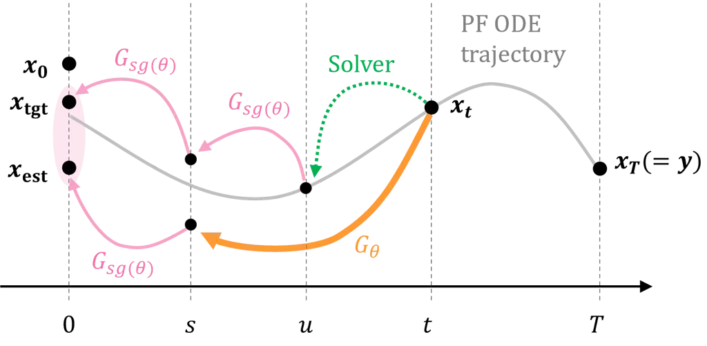
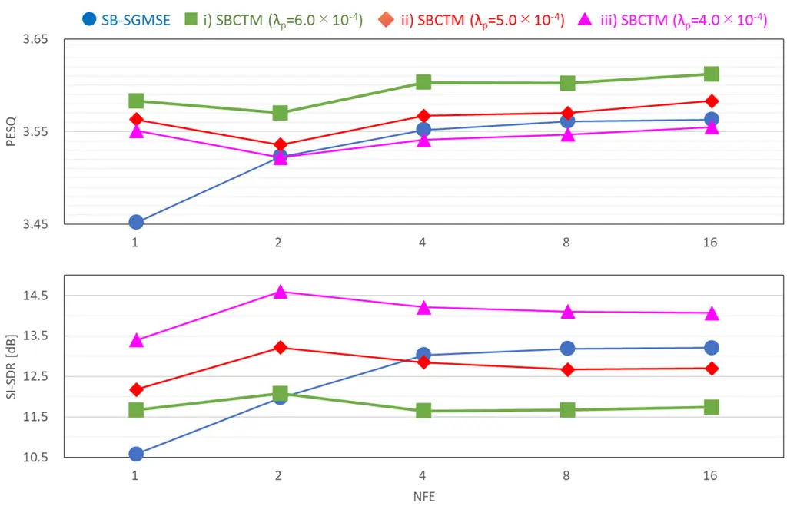

# Schrödinger Bridge Consistency Trajectory Models for Speech Enhancement

Shuichiro Nishigori Affiliation:  Sony Group Corporation, Tokyo, Japan  
   Koichi Saito Affiliation:  Sony AI, New York, USA      Naoki Murata
Affiliation:  Sony AI, Tokyo, Japan    Masato Hirano Affiliation:  Sony
Group Corporation, Tokyo, Japan      Shusuke Takahashi Affiliation: 
Sony Group Corporation, Tokyo, Japan      Yuki Mitsufuji Affiliation: 
Sony Group Corporation, Tokyo, Japan   Affiliation:  Sony AI, New York,
USA  

###### Abstract

Speech enhancement (SE) using diffusion models is a promising technology
for improving speech quality in noisy speech data. Recently, the
Schrödinger bridge (SB) has been utilized in diffusion-based SE to
resolve the mismatch between the endpoint of the forward process and the
starting point of the reverse process. However, the SB inference remains
slow owing to the need for a large number of function evaluations (NFE)
to achieve high-quality results. Although consistency models have been
proposed to accelerate inference, by employing consistency training via
distillation from pretrained models in the field of image generation,
they struggle to improve generation quality as the number of steps
increases. Consistency trajectory models (CTMs) have been introduced to
overcome this limitation, achieving faster inference while preserving a
favorable trade-off between quality and speed. In particular, SoundCTM
applies CTM techniques to sound generation. The SB addresses the
aforementioned mismatch and CTM improves inference speed while
maintaining a favorable trade-off between quality and speed. However, no
existing method simultaneously resolves both issues to the best of our
knowledge. Hence, in this study, we propose Schrödinger bridge
consistency trajectory models (SBCTM), which apply CTM techniques to the
SB for SE. In addition, we introduce a novel auxiliary loss,
incorporating perceptual loss, into the original CTM training framework.
Consequently, SBCTM achieves an approximately $`16\times`$ improvement
in real-time factor compared with the conventional SB for SE.
Furthermore, the favorable trade-off between quality and speed in SBCTM
enables time-efficient inference by limiting multi-step refinement to
cases in which one-step inference is insufficient. SBCTM enables more
practical and efficient speech enhancement by providing fast inference
and a flexible mechanism for further quality improvement. Our codes,
pretrained models, and audio samples are available at
[https://github.com/sony/sbctm/](https://github.com/sony/sbctm/).

## I INTRODUCTION

Speech signals have recently become easily recorded using smartphones
and other recording tools. However, recorded speech signals frequently
contain background noise, which negatively affects speech
intelligibility and sound quality. The primary purpose of speech
enhancement (SE) is to clean noisy speech signals. Deep neural
network-based SE methods generally use deep neural network models to
learn speech signal features from training data. While both
discriminative methods \[1, 2\] and generative models \[3\] are
employed, generative models in particular contribute to improving the
performance by modeling the distribution of clean speech signals in
noisy environments. Recently, diffusion models (DMs) \[4\] have been
used for image generation and SE \[5, 6, 7, 8, 9, 10\]. DMs train on
multiple noise levels, learning robust representations that generalize
across diverse conditions. This regularization effect makes them
well-suited for tasks like SE. Score-based generative model for speech
enhancement (SGMSE+) \[7\] illustrates that DMs have the advantage of a
better generalization performance than other generative models. However,
recent SE methods, particularly diffusion-based methods, have some
limitations: (1) prior mismatch and (2) low inference speed.

Diffusion-based SE is known to suffer from a mismatch between the
endpoint of the forward process and the starting point of the reverse
process (prior mismatch problem) \[9\]. Several approaches have been
proposed to address this issue, including diffusion denoising bridge
models (DDBMs) \[11\] and the Schrödinger bridge (SB) \[12\]. In
particular, the SB, a framework for probabilistic transportation that
seeks an optimal way to transport one probability distribution to
another, has been used in diffusion-based SE \[13\]. The SB can start
the reverse process directly from the noisy speech signal, thereby
avoiding the prior mismatch problem. Furthermore, SB-PESQ \[14, 15\]
achieves improved perceptual quality by incorporating a perceptual loss
during training. While the method is originally proposed in \[14\], the
name ’SB-PESQ’ is later introduced in \[15\]. DMs also exhibit low
inference speed because a sequential reverse diffusion process is
necessary to achieve sufficient quality. Consistency models (CMs) \[16\]
present a distillation training framework for improving the quality of
one-step image generation to accelerate the inference speed of DMs. For
image-to-image tasks, consistency diffusion bridge models (CDBMs) \[17\]
apply the CM training framework to the DDBM to sample images $`4\times`$
to $`50\times`$ faster than the original DDBM. SE-bridge \[18\] utilizes
the CM training framework for SE to accelerate the inference speed by
$`15\times`$ compared with the original SGMSE+ as their primary
baseline. Although consistency training can accelerate the inference
speed, it does not improve the generation quality when the number of
steps increases \[19\]. As a solution to this problem, consistency
trajectory models (CTMs) \[19\] propose a model that not only enables
fast image generation but also achieves a favorable trade-off between
quality and speed. Therefore, multi-step refinement is required only
when one-step inference is insufficient. This selective refinement
strategy significantly reduces the total inference time compared with
always performing multi-step inference. Sound consistency trajectory
models (SoundCTM) \[20\] utilize the CTM technique to text-to-sound
(T2S) generation to achieve both one-step high quality sound generation
and multi-step higher-quality sound generation, demonstrating that the
CTM’s technique can be applied not only to image generation but also to
sound generation.

The SB addresses prior mismatch and CTM improves inference speed while
maintaining a favorable trade-off between quality and speed. However, to
the best of our knowledge, no method exists that resolves both of them
thus far.

In this study, inspired by the achievements of SoundCTM as an
application of the CTM to the field of sound generation, we propose
Schrödinger bridge consistency trajectory models (SBCTM), introducing
the CTM’s training framework into the SB for SE. This contributes to the
SE field by enabling controllability of both quality and speed. Our
contributions can be summarized as follows:

- •
  We introduce the CTM’s technique to the SB for SE, achieving
  approximately $`16\times`$ improvement in the real-time factor (RTF)
  compared with the original SB while maintaining a favorable trade-off
  between quality and speed.
- •
  We introduce a novel auxiliary loss including perceptual loss to the
  training framework of the CTM to achieve high-quality SE.

The remainder of this paper is organized as follows. Section II reviews
the necessary preliminaries, including the SB and CTM. Section III
introduces our proposed model, SBCTM. Section IV describes the
experimental setup used to evaluate the proposed method. Section V
presents and discusses the experimental results. Finally, Section VI
concludes the paper.

## II PRELIMINARIES

### II-A Schrödinger bridge for speech enhancement

As discussed in Section I, standard DMs for SE often suffer from a
distribution mismatch. In these models, the forward process uses an
artificial prior, such as white Gaussian noise, as the terminal
distribution, which differs significantly from real noisy speech \[7\].
This mismatch degrades the performance and increases the inference cost.

The SB framework \[12\] provides a solution by seeking a stochastic
process $`\mathbb{Q}`$, that is, a continuous-time evolution of
probability distributions that transports one realistic distribution to
another. Specifically, given the clean speech distribution $`p_{0}`$ and
noisy speech distribution $`p_{1}`$, SB finds a process that minimizes
the KL divergence from a simple reference process $`\mathbb{P}`$ while
satisfying the marginal constraints, implying that the initial and
terminal distributions must match $`p_{0}`$ and $`p_{1}`$, respectively:

```math
\min_{\mathbb{Q}}\mathrm{KL}(\mathbb{Q}\,\|\,\mathbb{P})\quad\text{subject to}\quad\mathbb{Q}_{t=0}=p_{0},\quad\mathbb{Q}_{t=1}=p_{1}. \tag{1}
```

In the context of DMs, the reference process $`\mathbb{P}`$ is typically
selected as a simple diffusion process, such as Brownian motion.
Standard score-based DMs aim to approximate the reverse-time dynamics of
$`\mathbb{P}`$ perturbed by data-specific noise and effectively solve a
related but different problem: they bridge an artificial prior
distribution (e.g., standard Gaussian noise) to a clean data
distribution, rather than connecting two realistic distributions.

This distinction motivates the use of the SB formulation for SE tasks,
where both endpoints—clean speech and noisy speech—are real and
observable. By directly modeling the stochastic transport between these
two realistic distributions, we can better align the forward and reverse
processes without relying on unrealistic assumptions regarding the data.

This formulation enables the construction of a realistic transformation
path between clean and noisy speech without introducing artificial
priors. Motivated by this property, recent studies applied the SB
framework to SE by designing DMs that operate directly between clean and
noisy data. Rather than training the model to predict the score function
of an artificial noise distribution, it is possible to predict clean
speech samples directly through data prediction loss \[13, 14\]

```math
\mathcal{L}_{\text{data}}=\mathbb{E}_{t\sim\mathcal{U}[0,1],x_{0}\sim p_{0},x_{1}\sim p_{1}}[\|x_{0}-x_{\theta}(x_{t},x_{1},t)\|_{2}^{2}], \tag{2}
```

where $`x_{0}`$ and $`x_{1}`$ are sampled from the start and end
distributions $`p_{0}`$ and $`p_{1}`$, respectively. $`t`$ represents
the time index. The noisy sample $`x_{t}`$ is generated from the clean
sample $`x_{0}`$ through a forward diffusion process. By minimizing this
loss function, the model $`x_{\theta}`$ learns to predict the clean
speech $`x_{0}`$ from the noisy speech $`x_{t}`$. For notational
simplicity, we omit the expectation operator $`\mathbb{E}`$ in
subsequent equations.

By starting the reverse process from actual noisy speech, instead of
from an artificial prior, this approach improves both the quality and
efficiency of the enhancement. Furthermore, it enables the incorporation
of auxiliary objectives, such as time-domain reconstruction \[13, 14\]
or perceptual quality metrics \[14\], to further enhance the
performance.

### II-B Consistency Trajectory Models and SoundCTM

CTM \[19\] predicts points from any given point on the probability flow
ordinary differential equation (PF ODE) trajectory \[21\] expressed as
the deterministic trajectory of the reverse diffusion process.
$`G(x_{t},t,s)`$ is defined as the solution of the PF ODE from the start
time $`t`$ to the end time $`s\leq t`$ and $`G`$ is estimated by a
neural network model $`G_{\theta}`$. For training $`G_{\theta}`$, the
CTM loss \[19\] is calculated by comparing
$`x_{\mathrm{tgt}}=G_{\mathrm{sg(\theta)}}(G_{\mathrm{sg(\theta)}}(\mathrm{Solver}(x_{t},t,u;\phi),u,s),s,0)`$
as the prediction from teacher $`\phi`$ with
$`x_{\mathrm{est}}=G_{\mathrm{sg(\theta)}}(G_{\theta}(x_{t},t,s),s,0)`$
as the prediction from student $`\theta`$, where
$`\mathrm{Solver}(x_{t},t,s;\phi)`$ denotes the pretrained PF ODE
sampler, $`u\in[s,t)`$ denotes the amount of distillation from the
teacher, and $`\mathrm{sg}(\cdot)`$ denotes the exponential moving
average stop gradient
$`\mathrm{sg(\theta)}\leftarrow\mathrm{stopgrad}(\mu\,\mathrm{sg(\theta)}+(1-\mu)\theta)`$.
Furthermore, the denoising score matching (DSM) loss \[19\] and the GAN
loss \[22\] have been introduced as auxiliary losses. By following
SoundCTM \[20\] and eliminating the GAN loss owing to the sensitivity of
the discriminator selection, the losses are defined as follows:

```math
\displaystyle\mathcal{L}_{\mathrm{CTM}} \displaystyle=d_{\text{feat}}(x_{\mathrm{tgt}}(x_{t},t,u,s),x_{\mathrm{est}}(x_{t},t,s)), \tag{3}
```

```math
\displaystyle\mathcal{L}_{\mathrm{DSM}} \displaystyle=\|x_{0}-g_{\theta}(x_{t},t,t)\|_{2}^{2}, \tag{4}
```

where $`d_{\mathrm{feat}}`$ is a function that measures feature
distance. The objectives are defined as follows:

```math
\mathcal{L}=\mathcal{L}_{\mathrm{CTM}}+\lambda_{\mathrm{DSM}}\mathcal{L}_{\mathrm{DSM}}, \tag{5}
```

where $`\lambda_{\mathrm{DSM}}`$ denotes the weight used to balance the
two terms.

SoundCTM \[20\] achieved high-quality sound generation by addressing the
limitations of the CTM’s training framework. It proposes a
domain-agnostic feature distance, methods for distilling classifier-free
guided trajectories, and techniques for text-conditional and
unconditional jumps in sampling.

## III METHODS

### III-A Model training

We trained the SBCTM based on the CTM’s \[19\] training framework to
estimate the complex STFT spectrum $`x_{0}`$ of clean speech from the
complex STFT spectrum $`y`$ of noisy speech, as illustrated in Fig. 1.
To adapt to the SB \[12\], we introduced $`y`$ into $`G_{\theta}`$,
defined as follows:

```math
G_{\theta}(x_{t},y,t,s):=\frac{s}{t}x_{t}+(1-\frac{s}{t})F_{\theta}(x_{t},y,t,s), \tag{6}
```

where $`F_{\theta}`$ denotes the neural network model used to estimate
the process state. We define $`x_{\mathrm{tgt}}`$, $`x_{\mathrm{est}}`$,
and $`x_{\mathrm{self}}`$ as follows:

```math
\displaystyle x_{\mathrm{tgt}} \displaystyle:=G_{\mathrm{sg(\theta)}}(G_{\mathrm{sg(\theta)}}(\mathrm{Solver}(x_{t},y,t,u;\phi),y,u,s),y,s,0), \tag{7}
```

```math
\displaystyle x_{\mathrm{est}} \displaystyle:=G_{\mathrm{sg(\theta)}}(G_{\theta}(x_{t},y,t,s),y,s,0), \tag{8}
```

```math
\displaystyle x_{\mathrm{self}} \displaystyle:=F_{\theta}(x_{t},y,t,t). \tag{9}
```



Fig. 1: SBCTM training overview

We introduce a novel auxiliary loss in addition to existing auxiliary
losses, which comprise a time-domain loss term (TD loss) and a
perceptual loss term (PESQ loss), referring to \[14\] for better
performance. Furthermore, we employ $`\ell_{2}`$-norm for the original
CTM’s $`d_{\mathrm{feat}}`$ in Eq. (3). Therefore, we modify the losses
from the original CTM as follows:

```math
\displaystyle\mathcal{L}_{\mathrm{CTM}}^{\mathrm{SB}} \displaystyle:=\|x_{\mathrm{tgt}}-x_{\mathrm{est}}\|_{2}^{2}+\lambda_{\mathrm{td}}\|\underline{x_{\mathrm{tgt}}}-\underline{x_{\mathrm{est}}}\|_{1}+\lambda_{\mathrm{p}}\mathcal{L}_{\mathrm{PESQ}}(\underline{x_{\mathrm{tgt}}},\underline{x_{\mathrm{est}}}), \tag{10}
```

```math
\displaystyle\mathcal{L}_{\mathrm{DSM}}^{\mathrm{SB}} \displaystyle:=\|x_{0}-x_{\mathrm{self}}\|_{2}^{2}+\lambda_{\mathrm{td}}\|\underline{x_{0}}-\underline{x_{\mathrm{self}}}\|_{1}+\lambda_{\mathrm{p}}\mathcal{L}_{\mathrm{PESQ}}(\underline{x_{0}},\underline{x_{\mathrm{self}}}), \tag{11}
```

where $`\mathcal{L}_{\mathrm{PESQ}}(\cdot,\cdot)`$ represents a
perceptual loss function \[23\] utilizing a differentiable version of
the PESQ metric, and $`\lambda_{\mathrm{td}}`$ and
$`\lambda_{\mathrm{p}}`$ denote the weights of each loss term. In
$`\mathcal{L}_{\mathrm{PESQ}}(\cdot,\cdot)`$, the first input
corresponds to the reference signal, and the second input corresponds to
the signal being evaluated. The underlined characters represent the
corresponding time-domain signals obtained using an inverse STFT.
Summing Eq. (10), and Eq. (11), SBCTM is trained with an objective
defined as follows:

```math
\mathcal{L}:=\mathcal{L}_{\mathrm{CTM}}^{\mathrm{SB}}+\lambda_{\mathrm{DSM}}\mathcal{L}_{\mathrm{DSM}}^{\mathrm{SB}}. \tag{12}
```

Following CTM and SoundCTM \[20\], we employ adaptive weighting with
$`\lambda_{\mathrm{DSM}}=\frac{\|\nabla_{\theta_{L}}\mathcal{L}_{\mathrm{CTM}}^{\mathrm{SB}}\|_{2}^{2}}{\|\nabla_{\theta_{L}}\mathcal{L}_{\mathrm{DSM}}^{\mathrm{SB}}\|_{2}^{2}}`$,
where $`\theta_{L}`$ denotes the last layer of the student’s network.

### III-B Inference

The inference procedure for SBCTM starts by initializing $`x_{t_{N}}`$
with observation $`y`$. Then, for each step $`n=N,N-1,...,1,`$ the model
estimates the state at time $`t_{n-1}`$ by applying the transformation
$`G_{\theta}`$ to $`x_{t_{n}}`$, conditioned on $`y,t_{n},`$ and
$`t_{n-1},`$ that is,

```math
x_{t_{n-1}}\leftarrow G_{\theta}(x_{t_{n}},y,t_{n},t_{n-1}). \tag{13}
```

After iterating all the steps, the final output $`x_{t_{0}}`$ is
returned as an estimation of $`x_{0}`$.

## IV EXPERIMENTAL SETUP

### IV-A Models settings

We employed the NCSN++ architecture \[21\] proposed in \[14\] as the
network model $`F_{\theta}`$ in Eq. (6). We added a new time condition
$`s`$ as the embedding to the model ($`s`$-embedding) as follows \[20\]:
For the input representation, we used complex STFT spectra. We employed
a periodic Hann window with $`510`$ samples as the window length of
$`128`$ samples. We employed the SB with a variance exploding diffusion
coefficient (SB-VE) with the recommended hyperparameters from a previous
study \[13\].

For the teacher model, we selected the M7 model from a group of
pretrained models proposed in \[14\]. We initialized the student model’s
parameters with the teacher model’s parameters, except for the student
model’s $`s`$-embedding, following \[20\]. With respect to
$`\mathrm{Solver}(x_{t},y,t,u;\phi)`$ in Eq. (7), we used the ODE
sampler proposed in \[14\] (see Equation (20) in the paper). We used
$`\mathrm{sg(\theta)}`$ for the inference instead of $`\theta`$,
following the literature \[7\].

### IV-B Training details

We followed the method of \[20\] for timestep sampling. To calculate the
objective of SBCTM, we selected $`t`$ and $`s`$ from the
$`N`$-discretized time steps defined as follows:
$`({\sigma_{\mathrm{max}}}^{\frac{1}{\rho}}+\frac{i}{N-1}({\sigma_{\mathrm{min}}}^{\frac{1}{\rho}}-{\sigma_{\mathrm{max}}}^{\frac{1}{\rho}})^{\rho}`$,
where $`i`$ denotes the index of discretized time steps.

Throughout the experiments, we used $`T=1.0`$, $`N=40`$, $`\mu=0.999`$,
$`\sigma_{\mathrm{min}}=3.0\times 10^{-2}`$,
$`\sigma_{\mathrm{max}}=1.0`$, $`\rho=7`$, and the RAdam
optimizer \[24\] with a learning rate of $`8.0\times 10^{-5}`$.
Regarding the weights for the auxiliary loss, we set
$`1.0\times 10^{-3}`$ for $`\lambda_{\mathrm{td}}`$ and
$`5.0\times 10^{-4}`$ for $`\lambda_{\mathrm{p}}`$. The experimental
results with variations in $`\lambda_{\mathrm{p}}`$ are presented in
Section V-C.

We used VoiceBank+Demand (VB-DMD) \[25\], which is commonly employed as
a benchmark for SE tasks, as the training dataset. The VB-DMD includes
28 speakers’ voices and has approximately 9.5 h of training data. We
used 9 h of data for training and the remaining data for validation. All
audio samples were downsampled to 16 kHz. We trained the model for 100
epochs (69.3 K training steps), except for the ablation study, with a
global batch size of 16, using 8 $`\times`$ NVIDIA A100 GPUs, each of
which had 40 GB memory.

### IV-C Evaluation dataset and metrics

To evaluate the models, we used the official test data of the VB-DMD,
which contained approximately 0.5 h of data. We used PESQ with an
extended bandwidth \[26\] as an intrusive SE metric. We employed the
scale-invariant signal-to-noise ratio (SI-SDR) to observe the similarity
to the waveform of clean speech. Furthermore, we used ESTOI \[27\] as an
instrumental measure of speech intelligibility. As a non-intrusive
metric, we used DNSMOS \[28\] based on ITU-T P.808 \[29\], which
employed a neural network trained on human ratings. For all metrics, it
holds that the higher, the better.

We evaluated each model based on a comprehensive judgment in terms of
each metric while prioritizing PESQ, as PESQ not only has a higher
correlation with our auditory perception compared with other metrics
such as SI-SDR\[30\], but also, to the best of our knowledge, it is the
most commonly used metric in various studies on SE \[1, 31, 3, 7, 2, 14,
32\].

## V RESULTS

### V-A Comparison with teacher model and other consistency-based models

We first compared our SBCTM with the teacher model in terms of the
effectiveness of the CTM training \[19\]. As explained in Section IV-A,
we selected the pretrained model (M7) proposed in SB-PESQ \[14\] as the
teacher model. The teacher model was evaluated to determine the metrics
for each NFE. Regarding the student models, we introduced Schrödinger
bridge consistency models (SBCM) as an additional reference for
comparison. We applied consistency training \[16\] to train the SBCM by
employing the same teacher model as the SBCTM. Furthermore, we included
the SE-Bridge \[18\] in our comparison as a baseline, which introduces
consistency training into the Brownian bridge.

Table I summarizes the results for the SE task using the VB-DMD
dataset \[25\] for both the teacher and student models. PESQ, SI-SDR,
and DNSMOS of the SBCTM outperformed those of the teacher model when
$`\mathrm{NFE}=1`$. Furthermore, the performance of the SBCTM improved
as the NFE increased. Similar to what was reported in \[19\] and \[20\],
this effect was also observed in the SBCTM. Regarding the PESQ in
Table I, the SBCTM achieved a higher score than the teacher model for
all NFEs. This is attributed to the auxiliary loss in Eqs. (10)
and (11), including the PESQ loss added to the original loss \[16\].
Details are presented in Section V-B. Comparing the model with other
consistency-based models, the SE-Bridge achieved a high SI-SDR even with
$`\mathrm{NFE}=1`$, whereas the SBCTM demonstrated superior performance
in terms of PESQ. The SBCM’s SI-SDR outperformed that of the teacher
model when $`\mathrm{NFE}=1`$, but most scores exhibited a decreasing
trend as NFE increased. However, this can be attributed to our simple
training strategies.

Regarding the practical inference speed, we calculated the RTF of both
the SB-PESQ ($`\mathrm{NFE}=16`$) and the SBCTM ($`\mathrm{NFE}=1`$),
which exhibited comparable performance in terms of PESQ, ESTOI, and
DNSMOS metrics. The RTF was measured using a Linux PC equipped with an
NVIDIA GeForce RTX4080 (16 GB) GPU. We evaluated the RTF as the average
over 10 runs using 10-s audio inputs with a batch size of 1. The results
demonstrated that the SB-PESQ achieved an RTF of 0.713, whereas the
SBCTM achieved an RTF of 0.045. This indicates that SBCTM achieves
approximately $`16\times`$ improvement in the inference speed compared
with SB-PESQ.

|              |     |          |          |          |          |
| ------------ | --- | -------- | -------- | -------- | -------- |
| Model        | NFE | PESQ     | SI-SDR   | ESTOI    | DNSMOS   |
| Input        | \-  | $`1.96`$ | $`8.4`$  | $`0.79`$ | $`3.08`$ |
| SB-PESQ¹     | \-  | $`3.50`$ | $`14.1`$ | 0.87     | 3.55     |
| SB-PESQ²     | 1   | $`3.45`$ | $`10.6`$ | 0.87     | $`3.51`$ |
|              | 2   | $`3.52`$ | $`12.0`$ | 0.87     | $`3.52`$ |
|              | 4   | $`3.55`$ | $`13.0`$ | 0.87     | $`3.54`$ |
|              | 8   | $`3.56`$ | $`13.2`$ | 0.87     | $`3.54`$ |
|              | 16  | $`3.56`$ | $`13.2`$ | 0.87     | 3.55     |
| SE-Bridge    | 1   | 2.97     | 19.9     | 0.87     | \-       |
| SBCM         | 1   | $`3.00`$ | $`14.0`$ | $`0.84`$ | $`3.47`$ |
|              | 2   | $`1.71`$ | $`9.2`$  | $`0.74`$ | $`2.89`$ |
|              | 4   | $`1.87`$ | $`5.6`$  | $`0.73`$ | $`3.04`$ |
|              | 8   | $`2.01`$ | $`3.3`$  | $`0.72`$ | $`3.16`$ |
|              | 16  | $`1.97`$ | $`1.6`$  | $`0.71`$ | $`3.16`$ |
| SBCTM (Ours) | 1   | $`3.56`$ | $`12.2`$ | 0.87     | 3.55     |
|              | 2   | $`3.54`$ | $`13.2`$ | 0.87     | $`3.54`$ |
|              | 4   | $`3.57`$ | $`12.8`$ | 0.87     | $`3.54`$ |
|              | 8   | $`3.57`$ | $`12.7`$ | 0.87     | $`3.53`$ |
|              | 16  | 3.58     | $`12.7`$ | 0.87     | $`3.53`$ |

TABLE I: SE performance on the VB-DMD. Each value of the metrics
represents mean score, where higher values indicate better quality.
SB-PESQ¹ refers to the originally proposed model (M7) reported
in \[14\]; the NFE is not specified. SB-PESQ² denotes that the model is
evaluated by us. SE-Bridge refers to the originally proposed model
reported in \[18\]; DNSMOS is not reported.

### V-B Ablation study on effect of auxiliary loss

Table II summarizes the results of an ablation study on the auxiliary
loss in Eqs. (10) and  (11). We trained all models in Table II on the
VB-DMD training dataset with 20 epochs and observed the inference
results when $`\mathrm{NFE}=1`$.

Observing c) in the results, the auxiliary loss significantly
contributes to PESQ, whereas the SI-SDR decreases. a) illustrates that
the auxiliary CTM loss contributes to the SI-SDR; b) shows that the
auxiliary loss of the DSM loss contributes significantly to PESQ while
decreasing the SI-SDR. Furthermore, the results for d) and e) show that
the TD loss contributes to the SI-SDR, whereas the PESQ loss contributes
to PESQ. From these results, it can be observed that all the elements of
the auxiliary loss are necessary to achieve the highest SI-SDR while
ensuring the highest PESQ.

|                                                                                                                         |      |        |
| ----------------------------------------------------------------------------------------------------------------------- | ---- | ------ |
| Method                                                                                                                  | PESQ | SI-SDR |
| Objective $`\mathcal{L}`$ (in Eq. (12))                                                                                 | 3.57 | 12.6   |
| a\) w/o auxiliary loss of $`\mathcal{L}_{\mathrm{CTM}}^{\mathrm{SB}}`$                                                  | 3.57 | 12.2   |
| b\) w/o auxiliary loss of $`\mathcal{L}_{\mathrm{DSM}}^{\mathrm{SB}}`$                                                  | 3.22 | 18.3   |
| c\) w/o auxiliary loss of $`\mathcal{L}_{\mathrm{CTM}}^{\mathrm{SB}}`$ and $`\mathcal{L}_{\mathrm{DSM}}^{\mathrm{SB}}`$ | 3.13 | 18.9   |
| d\) w/o TD loss of $`\mathcal{L}_{\mathrm{CTM}}^{\mathrm{SB}}`$ and $`\mathcal{L}_{\mathrm{DSM}}^{\mathrm{SB}}`$        | 3.57 | 12.0   |
| e\) w/o PESQ loss of $`\mathcal{L}_{\mathrm{CTM}}^{\mathrm{SB}}`$ and $`\mathcal{L}_{\mathrm{DSM}}^{\mathrm{SB}}`$      | 3.19 | 17.3   |

TABLE II: Ablation study on auxiliary loss. Values indicate mean of PESQ
and SI-SDR, where higher values indicate better quality. “w/o” means
without.

### V-C Comparison of weight balance regarding auxiliary loss

We observed the effect of varying the weight balance of the auxiliary
loss on the results. Fig. 2 illustrates PESQ and SI-SDR for each NFE,
including the results of the SB-PESQ as the teacher model, and the SBCTM
when the value of $`\lambda_{\mathrm{p}}`$ in Eqs.  eqs. 10 and 11 were
changed to i) $`6.0\times 10^{-4}`$, ii) $`5.0\times 10^{-4}`$, and iii)
$`4.0\times 10^{-4}`$.

PESQ can be observed to be positively correlated with
$`\lambda_{\mathrm{p}}`$, whereas SI-SDR is negatively correlated. From
the result of Fig. 2, the quality balance between PESQ and SI-SDR can be
controlled by changing $`\lambda_{\mathrm{p}}`$. This enables
task-specific optimization. For instance, PESQ is important for
telephony, where perceptual quality is crucial for user experience. In
contrast, higher SI-SDR benefits downstream tasks such as speech
separation, where signal fidelity plays a more significant role. This
flexibility in adjusting $`\lambda_{\mathrm{p}}`$ for task-specific
objectives extends the utility of SBCTM across a wider range of
applications.



Fig. 2: Comparison between SB-PESQ and variations of SBCTM with changes
in $`\lambda_{\mathrm{p}}`$. Upper chart shows mean of PESQ, lower chart
shows mean of SI-SDR.

### V-D Comparison with other speech enhancement models

Table III summarizes the results of the comparison between SBCTM and
other SE models in terms of the performance of PESQ using the VB-DMD
dataset and the number of model parameters for each model.

Regarding performance metrics, PESQ is only commonly reported in the
original studies of each model. For SEMamba \[32\] and
SEMamba(+PCS) \[32\], the RTF was measured using the method described in
Section V-A and both yielded the same result of 0.059.

From the perspective of RTF, comparing the value of 0.045 for the SBCTM
($`\mathrm{NFE}=1`$) described in Section V-A with the value of 0.059
for SEMamba, the SBCTM ($`\mathrm{NFE}=1`$) demonstrates sufficiently
fast inference despite its large number of parameters. In terms of
quality, its performance is comparable to that of state-of-the-art
methods.

| Model                      | \# of params \[M\] | PESQ |
| -------------------------- | ------------------ | ---- |
| DEMUCS \[1\]               | 33.5               | 3.07 |
| MP-SENet \[2\]             | 2.1                | 3.50 |
| DPT-FSNet \[31\]           | 0.88               | 3.33 |
| CMGAN \[3\]                | 1.8                | 3.41 |
| SGMSE+ \[7\]               | 65.6               | 2.93 |
| SB-PESQ \[14\]             | 65.6               | 3.50 |
| SEMamba \[32\]             | 2.3                | 3.55 |
| SEMamba(+PCS) \[32\]       | 2.3                | 3.69 |
| SBCTM ($`\mathrm{NFE}=1`$) | 66.0               | 3.56 |

TABLE III: SE performance of other conventional models on VB-DMD. Values
indicate mean of PESQ, where higher values indicate better quality. \#
of params represents number of trainable parameters in million. SB-PESQ
refers to the originally proposed model (M7) reported in \[14\]

## VI CONCLUSION

We propose SBCTM, which achieves high-quality one-step inference while
maintaining a favorable trade-off between quality and inference speed in
SE. The proposed auxiliary loss contributes to improving performance.
Experimental results demonstrate that SBCTM achieves approximately
$`16\times`$ improvement in RTF compared with the conventional SB for
SE. The proposed approach enables efficient and practical SE,
particularly in latency-sensitive applications. Furthermore, SBCTM can
potentially be extended to other tasks such as dereverberation and
declipping. By achieving fast and high-quality inference with
controllable trade-offs, our method offers a new direction for SE
research.

## References

- \[1\] A. Defossez, G. Synnaeve, and Y. Adi, “Real time speech
  enhancement in the waveform domain,” in _Interspeech_, 2020, pp.
  3291–3295.
- \[2\] Y.-X. Lu, Y. Ai, and Z.-H. Ling, “MP-SENet: A Speech Enhancement
  Model with Parallel Denoising of Magnitude and Phase Spectra,” in
  _Interspeech_, 2023.
- \[3\] S. Abdulatif, R. Cao, and B. Yang, “CMGAN: Conformer-based
  metric-gan for monaural speech enhancement,” _IEEE/ACM Transactionson
  Audio, Speech, and Language Processing_, vol. 32, pp. 2477–2493, 2024.
- \[4\] J. Sohl-Dickstein, E. A.Weiss, N. Maheswaranathan, and
  S. Ganguli, “Deep unsupervised learning using nonequilibrium
  thermodynamics,” in _ICML_, 2015.
- \[5\] Y.-J. L. et al., “Conditional diffusion probabilistic model for
  speech enhancement,” in _ICASSP_, 2022, pp. 7402–7406.
- \[6\] S. Welker, J. Richter, and T. Gerkmann, “Speech enhancement with
  score-based generative models in the complex STFT domain,” in
  _Interspeech_, 2022.
- \[7\] J. Richter, S. Welker, J.-M. Lemercier, B. Lay, and T. Gerkmann,
  “Speech enhancement and dereverberation with diffusion-based
  generative models,” _IEEE/ACM Transactions on Audio, Speech, and
  Language Processing_, vol. 31, pp. 2351–2364, 2023.
- \[8\] J.-M. L. M. et al., “StoRM: A Diffusion-based Stochastic
  Regeneration Model for Speech Enhancement and Dereverberation,”
  _IEEE/ACM Trans. on Audio, Speech, and Language Process_, vol. 31, pp.
  2724–2737, 2023.
- \[9\] B. L. et al., “Reducing the Prior Mismatch of Stochastic
  Differential Equations for Diffusion-based Speech Enhancement,” in
  _Interspeech_, 2023.
- \[10\] J. M. Lemercier, J. Richter, S. Welker, E. Moliner,
  V. Välimäki, and T. Gerkmann, “Diffusion Models for Audio Restoration:
  A review,” _IEEE Signal Processing Magazine_, vol. 41, pp.
  72–84, 2024.
- \[11\] L. Zhou, A. Lou, S. Khanna, and S. Ermon, “Denoising diffusion
  bridge models,” _arXiv preprint_, 2023.
- \[12\] T. Chen, G.-H. Liu, and E. Theodorou, “Likelihood training of
  Schrödinger bridge using forward-backward SDEs theory,” in
  _ICLR_, 2021.
- \[13\] A. Juki´c, R. Korostik, J. Balam, and B. Ginsburg, “Schrödinger
  bridge for generative speech enhancement,” in _Interspeech_, 2024, p.
  1175–1179.
- \[14\] J. Richter, D. D. Oliveira, and T. Gerkmann, “Investigating
  training objectives for generative speech enhancement,” in
  _ICASSP_, 2025.
- \[15\] J. Richter and T. Gerkmann, “Diffusion-based Speech
  Enhancement: Demonstration of Performance and Generalization,” in
  _Proceedings of the NeurIPS 2024 Workshop on Audio Imagination_, 2024.
  \[Online\]. Available:
  [https://openreview.net/pdf?id=rv5LuElUic](https://openreview.net/pdf?id=rv5LuElUic)
- \[16\] Y. Song, P. Dhariwal, M. Chen, and I. Sutskever, “Consistency
  Models,” in _ICML_, 2023.
- \[17\] G. He, K. Zheng, J. Chen, F. Bao, and J. Zhu, “Consistency
  Diffusion Bridge Models,” in _NeurIPS_, 2024.
- \[18\] Z. Qiu, M. Fu, F. Sun, G. Altenbek, and H. Huang, “SE-Bridge:
  Speech Enhancement with Consistent Brownian Bridge,” _arXiv
  preprint_, 2023.
- \[19\] D. Kim, C.-H. Lai, W.-H. Liao, N. Murata, Y. Takida, T. Uesaka,
  Y. He, Y. Mitsufuji, and S. Ermon, “Consistency trajectory models:
  Learning probability flow ode trajectory of diffusion,” in
  _ICLR_, 2024.
- \[20\] K. Saito, D. Kim, T. Shibuya, C.-H. Lai, Z. Zhong, Y. Takida,
  and Y. Mitsufuji, “SoundCTM: Uniting Score-based and Consistency
  Models for Text-to-Sound Generation,” _arXiv preprint
  arXiv:2405.18503_, 2024.
- \[21\] J. S.-D. Y. Song, D. P. Kingma, A. Kumar, S. Ermon, and
  B. Poole, “Score-based generative modeling through stochastic
  differential equations,” in _International Conference on Learning
  Representations_, 2021.
- \[22\] I. J. Goodfellow, J. Pouget-Abadie, M. Mirza, B. Xu,
  D. Warde-Farley, S. Ozair, A. Courville, and Y. Bengio, “Generative
  adversarial networks,” in _NeurIPS_, 2014.
- \[23\] L. Schmidt, N. Werner, and M. L. Quatra, “Loss function
  inspired by the PESQ score,” 2022. \[Online\]. Available:
  [https://github.com/audiolabs/torch-pesq](https://github.com/audiolabs/torch-pesq)
- \[24\] L. Liu, H. Jiang, P. He, W. Chen, X. Liu, J. Gao, and
  JiaweiHan, “On the variance of the adaptive learning rate and beyond,”
  in _ICLR_, 2020.
- \[25\] C. Valentini-Botinhao, X. Wang, S. Takaki, and J. Yamagishi,
  “Investigating RNN-based speech enhancement methods for noise-robust
  textto-speech,” in _ISCA Speech Synthesis Workshop_, 2016, p. 146–152.
- \[26\] A. Rix, J. Beerends, M. Hollier, and A. Hekstra, “Perceptual
  evaluation of speech quality (PESQ) - a new method for speech quality
  assessment of telephone networks and codecs,” in _ICASSP_, 2001, p.
  749–752.
- \[27\] J. Jensen and C. H. Taal, “An algorithm for predicting the
  intelligibility of speech masked by modulated noise maskers,”
  _IEEE/ACM Transactions on Audio, Speech, and Language Processing_,
  vol. 24, pp. 2009–2022, 2016.
- \[28\] K. Reddy, V. Gopal, and R. Cutler, “DNSMOS: A non-intrusive
  perceptual objective speech quality metric to evaluate noise
  suppressors,” in _ICASSP_, 2021, p. 6493–6497.
- \[29\] I.-T. R. P.808, “Subjective evaluation of speech quality with a
  crowdsourcing approach,” 2021, int. Telecom. Union (ITU). \[Online\].
  Available:
  [https://www.itu.int/rec/T-REC-P.808-202106-I/en](https://www.itu.int/rec/T-REC-P.808-202106-I/en)
- \[30\] M. Torcoli, T. Kastner, and J. Herre, “Objective Measures of
  Perceptual Audio Quality Reviewed: An Evaluation of Their Application
  Domain Dependence,” _IEEE/ACM Trans. on Audio, Speech, and Language
  Processing_, vol. 29, 2021.
- \[31\] F. Dang, H. Chen, and P. Zhang, “DPT-FSNet: Dual-path
  transformer based full-band and sub-band fusion network for
  speechenhancement,” in _ICASSP_, 2022, pp. 6857–6861.
- \[32\] R. Chao, W.-H. Cheng, M. L. Quatra, S. M. Siniscalchi, S.-W. F.
  C.-H. H. Yang, and Y. Tsao, “An investigation of incorporating Mamba
  for speech enhancement,” _IEEE Spoken Language Technology
  Workshop_, 2024.
