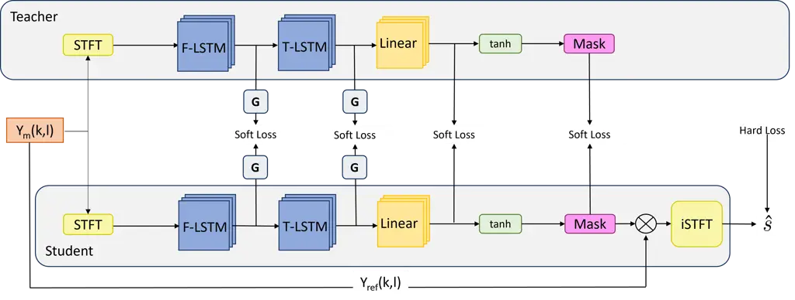
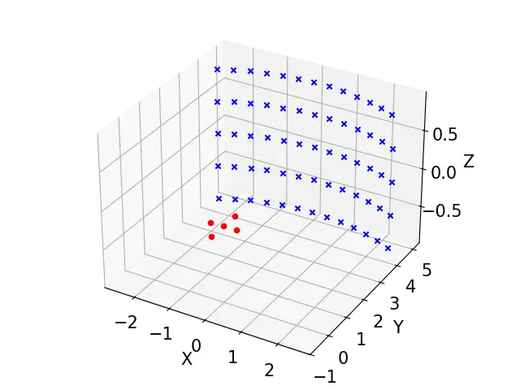
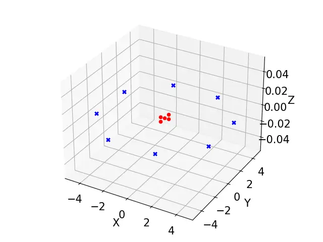

# Comparison of Knowledge Distillation Methods for Low-complexity Multi-microphone Speech Enhancement using the FT-JNF Architecture

Robert Metzger    Mattes Ohlenbusch    Christian Rollwage    Simon Doclo

###### Abstract

Multi-microphone speech enhancement using deep neural networks (DNNs)
has significantly progressed in recent years. However, many proposed
DNN-based speech enhancement algorithms cannot be implemented on devices
with limited hardware resources. Only lowering the complexity of such
systems by reducing the number of parameters often results in worse
performance. Knowledge Distillation (KD) is a promising approach for
reducing DNN model size while preserving performance. In this paper, we
consider the recently proposed Frequency-Time Joint Non-linear Filter
(FT-JNF) architecture and investigate several KD methods to train
smaller (student) models from a large pre-trained (teacher) model. Five
KD methods are evaluated using direct output matching, the
self-similarity of intermediate layers, and fused multi-layer losses.
Experimental results on a simulated dataset using a compact array with
five microphones show that three KD methods substantially improve the
performance of student models compared to training without KD. A student
model with only 25% of the teacher model’s parameters achieves
comparable PESQ scores at 0 dB SNR. Furthermore, a reduction of up to
96% in model size can be achieved with only a minimal decrease in PESQ
scores.

¹ Fraunhofer Institute for Digital Media Technology IDMT, Oldenburg
Branch for Hearing, Speech and Audio Technology HSA  
² OFFIS Institute for Information Technology Oldenburg  
³ Dept. of Medical Physics and Acoustics and Cluster of Excellence
Hearing4all, Carl von Ossietzky Universität Oldenburg  
Email: robert.metzger@offis.de

## 1 Introduction

Environmental noise reduces speech quality and intelligibility and
affects listening efforts in many speech communication applications,
such as voice control, hearing aids, and teleconferencing systems. To
address this issue, several algorithms based on deep neural networks
(DNNs) have been proposed to reduce environmental background noise and
improve speech quality \[1, 2, 3, 4, 5, 6, 7, 8, 9\]. However, the
computational power and memory requirements of many DNN-based speech
enhancement algorithms are too high to be implemented on
resource-constrained devices. Reducing the size of DNNs is a common
strategy to enable deployment on such devices. However, this often comes
at the cost of significant performance degradation \[10\]. To address
this issue, knowledge distillation (KD) has emerged as a promising
solution. KD is a training technique in which a smaller student model
learns to mimic the behavior of a larger, high-performing teacher model
to reduce model complexity while aiming to maintain performance \[11\].
KD can also be used, e.g., to retain part of the performance of a
non-causal teacher for training a causal student DNN \[12\], or for
training smaller models computing auxiliary speaker embeddings for
personalized enhancement models \[13\]. Recent work has explored the use
of KD in the context of speech enhancement, aiming to improve the
efficiency of DNN-based approaches \[14, 15, 16\]. In \[14\] it was
proposed to leverage multiple intermediate layers of a teacher network
for distillation, rather than solely relying on its final outputs, to
train a smaller student model. For this purpose, a method was proposed
that enables the use of KD even with layers of different dimensions. A
central element of this method is the computation of a self-similarity
matrix during training. Similarly, in \[15\] it was proposed a
cross-layer similarity method between different model architectures to
reduce the size of a deep complex convolutional recurrent neural network
by 30% without compromising its performance. In \[16\] several ways of
computing self-similarity between teacher and student models were
investigated, and a two-step training strategy was proposed that
improved the student model performance.

In this paper, we investigate KD for a multi-microphone speech
enhancement system using the Frequency-Time Joint Non-linear Filter
(FT-JNF) architecture \[7\]. A teacher model with 1400k parameters
serves as the performance reference. We evaluate five KD methods using
direct output matching and self-similarity between outputs of
intermediate layers to train student models with reduced complexity. The
student models trained via KD minimized a soft loss function that
measured the difference between intermediate representations from
various student layers and those of a pre-trained, larger teacher model.
In the first experiment, different KD methods are investigated for
training a student model with a size of 44k parameters and compared to a
model trained without KD. In the second experiment, the impact of KD on
performance at different model sizes varying from 13k to 365k parameters
is investigated. All experiments are conducted on simulated
five-microphone data using reverberant speech and directional noise, and
performance is evaluated using PESQ scores across multiple
signal-to-noise ratios (SNRs). Experimental results show that the size
of the student FT-JNF can be reduced by up to 96% compared to the
teacher model while only minimally affecting the PESQ score.

## 2 Signal model

We consider a noisy, reverberant acoustic environment with a single
talker being recorded by a microphone array with $`M`$ microphones. In
the short-time Fourier transform (STFT) domain, the reverberant speech
component $`X_{m}(k,l)\in\mathbb{C}`$ of the $`m`$-th microphone at
frame index $`l`$ and frequency index $`k`$ can be modeled¹¹ 1 This
approximation is valid if the STFT frame is longer than the acoustic
impulse response. as the product of the clean anechoic speech STFT
coefficient $`S(k,l)`$ and the acoustic transfer function $`H_{m}(k)`$
between the talker and the $`m`$-th microphone:

```math
X_{m}(k,l)=S(k,l)\cdot H_{m}(k). \tag{1}
```

The noisy microphone signal consists of the reverberant speech component
and the noise component $`V_{m}(k,l)`$ recorded by the $`m`$-th
microphone, i.e.

```math
Y_{m}(k,l)=X_{m}(k,l)+V_{m}(k,l). \tag{2}
```

## 3 Multi-channel speech enhancement system

In this paper, we consider the multi-microphone speech enhancement
system proposed in \[7\], which is based on the FT-JNF architecture (see
Fig. 1). It takes the real and imaginary parts of noisy STFT
coefficients of all microphones as input. The architecture consists of a
long short-term memory (LSTM) layer operating across frequency (F-LSTM),
an LSTM layer operating across time (T-LSTM), a linear layer and a
$`\tanh`$ activation function. Different from \[7\], no decompression
was applied after the $`\tanh`$ activation. The outputs are the real and
imaginary parts of a single-channel complex-valued mask $`W(k,l)`$ which
is applied to the noisy reference microphone signal
$`Y_{\text{ref}}(k,l)`$, i.e.

```math
\hat{S}(k,l)=W(k,l)\cdot Y_{\text{ref}}(k,l). \tag{3}
```

In this paper, we will consider different model sizes by changing the
number of hidden units in the LSTM layers (see Table 1).

|     | F/T-LSTM  | Param \[$`10^{3}`$\] | MACs \[$`10^{9}`$\] | Size \[MB\] |
| --- | --------- | -------------------- | ------------------- | ----------- |
| A   | 512 / 256 | 1400                 | 34.7                | 9.64        |
| B   | 256 / 64  | 364.9                | 8.9                 | 3.49        |
| C   | 128 / 32  | 92.7                 | 2.3                 | 1.44        |
| D   | 88 / 40   | 56.4                 | 1.4                 | 1.1         |
| E   | 80 / 32   | 44.4                 | 1.1                 | 0.95        |
| F   | 72 / 24   | 33.9                 | 0.85                | 0.65        |
| G   | 64 / 16   | 24.9                 | 0.63                | 0.64        |
| H   | 56 / 8    | 17.4                 | 0.44                | 0.55        |
| I   | 48 / 8    | 13.4                 | 0.34                | 0.48        |

Table 1: Considered model sizes with corresponding numbers of hidden
units in the LSTM layers, number of parameters, number of MACs per
frame, and file size in MB. Size A corresponds to the teacher model;
size E corresponds to the model investigated in Section 6.1.

## 4 Knowledge Distillation Methods

KD \[17\] is a technique to train DNNs, where a (large) teacher model is
used to train a smaller student model, aiming at achieving better
performance than training the student model without the teacher. As the
teacher, the FT-JNF model with size A is trained using the combined
$`L_{1}`$-loss in time and STFT domain (after re-analysis) \[18\]
between the clean anechoic speech signal $`s(n)`$ and the output signal
$`\hat{s}(n)`$, i.e.

```math
\begin{split}L_{\text{hard}}\left(\hat{s}(n),s(n)\right)=\sum_{n}\lvert\hat{s}(n)-&s(n)\rvert\\
+\sum_{k,l}\bigl|\lvert\text{STFT}\{\hat{s}(n)\}(k,l)\rvert-&\lvert\text{STFT}\{s(n)\}(k,l)\rvert\bigr|,\end{split} \tag{4}
```

where $`n`$ denotes the discrete time index. This loss function is
referred to as hard loss. To train the student models, we consider
different KD methods by combining the hard loss in (4) on the output of
the student model with soft losses $`L_{\text{soft}}`$ computed using
intermediate outputs of the teacher model. As intermediate outputs we
will consider the model output, the output of the linear layer, or the
output of the LSTM layers (see Sections 4.1 and 4.2). For all KD
methods, we follow the two-stage training approach proposed in \[16\].
The loss function for this approach is given by

```math
L=\alpha\cdot L_{\text{hard}}+(1-\alpha)\cdot L_{\text{soft}}, \tag{5}
```

where $`\alpha`$ represents a weighting factor. In the first stage, the
student model is pre-trained to minimize the soft loss up to the
selected layers of the student and the teacher models, i.e. using
$`\alpha=0`$. In the second stage, the student model is further trained
by minimizing the hard loss, i.e. using $`\alpha=1`$.



Figure 1: Schematic overview of KD techniques with the FT-JNF
architecture, depicting the teacher model (top) and the student model
(bottom). The hard loss is exclusively computed from the output of the
student model. The soft loss is either computed directly from the
activation outputs of both models, which have identical shape, or from
self-similarity matrices $`\mathbf{G}`$ constructed from intermediate
LSTM outputs, which differ in shape.

### 4.1 KD without fusion method

For some KD methods, the soft loss can be directly computed as

```math
L_{\text{soft}}\left(\mathbf{Z}^{\text{teacher}},\mathbf{Z}^{\text{student}}\right)=\lVert\mathbf{Z}^{\text{teacher}}-\mathbf{Z}^{\text{student}}\rVert_{1}, \tag{6}
```

where $`\mathbf{Z}^{\text{teacher}}`$ and
$`\mathbf{Z}^{\text{student}}`$ denote the intermediate output of the
teacher and the student, respectively, and $`\lVert...\rVert_{1}`$
denotes the $`L_{1}`$-Norm. Since this method requires both intermediate
outputs to have the same shape, this soft loss can only be applied to
the masks at the model output (KD Mask) and the output of the linear
layer (KD Linear) of FT-JNF models with different model sizes.

### 4.2 KD with self-similarity matrix

Unlike the linear layers and the masks, the intermediate outputs of the
LSTM layers have different shapes, i.e. model sizes, between the teacher
and the student. Since it is not possible to compute an element-wise
soft loss, as in (6), it was proposed in \[16\] to compute a soft loss
using self-similarity matrices instead. Consider the outputs of
intermediate layers
$`\mathbf{Z}^{\text{teacher}}\in\mathbb{R}^{(K\cdot L)\times C^{\text{teacher}}}`$
and
$`\mathbf{Z}^{\text{student}}\in\mathbb{R}^{(K\cdot L)\times C^{\text{student}}}`$,
where $`K`$ and $`L`$ denote the number of frequency bins and frames,
and $`C^{\text{teacher}}`$ and $`C^{\text{student}}`$ denote the number
of hidden units for the considered layers of the teacher and student
models (with $`C^{\text{student}}<C^{\text{teacher}}`$). The
self-similarity matrices for teacher and student
$`\mathbf{G}^{\text{teacher}}\in\mathbb{R}^{(K\cdot L)\times(K\cdot L)}`$
and
$`\mathbf{G}^{\text{student}}\in\mathbb{R}^{(K\cdot L)\times(K\cdot L)}`$
can then be computed as the Gram matrices
$`\mathbf{G}^{\text{teacher}}=\mathbf{Z}^{\text{teacher}}\left(\mathbf{Z}^{\text{teacher}}\right)^{T}`$
and
$`\mathbf{G}^{\text{student}}=\mathbf{Z}^{\text{student}}\left(\mathbf{Z}^{\text{student}}\right)^{T}`$,
where $`(\cdot)^{T}`$ denotes the transpose. The soft loss can then be
defined as $`L_{1}`$-loss between the self-similarity matrices, i.e.

```math
L_{\text{soft}}\left(\mathbf{Z}^{\text{teacher}},\mathbf{Z}^{\text{student}}\right)=\lVert\mathbf{G}^{\text{teacher}}-\mathbf{G}^{\text{student}}\rVert_{1}. \tag{7}
```

Since this method does not rely on teacher and student models having the
same intermediate output shapes, it can be used to perform KD on the
output of the F-LSTM layer (KD F-LSTM) and the T-LSTM layer (KD T-LSTM).
In addition, we consider a KD method where the soft losses for both LSTM
layers and the linear layer are added (KD Multi). Following \[11\], we
expect that KD Multi will provide the best results, as most information
is exchanged between the teacher and student models. Table 2 presents an
overview of all considered KD methods and their use of intermediate
layer outputs and fusion methods.

| KD Method | Used Layers            | Fusion method   |
| --------- | ---------------------- | --------------- |
| KD Mask   | Masks                  | -               |
| KD Linear | Linear                 | -               |
| KD F-LSTM | F-LSTM                 | self-similarity |
| KD T-LSTM | T-LSTM                 | self-similarity |
| KD Multi  | F-LSTM, T-LSTM, Linear | self-similarity |

Table 2: KD methods considered for training and the layers and fusion
methods used.

## 5 Experimental setup

To investigate the effectiveness of the considered KD methods in
training the FT-JNF speech enhancement system, an experimental
evaluation was conducted for a compact microphone array with five
microphones at different model sizes and complexities.

### 5.1 Datasets and performance metrics

All simulations were conducted at a sampling frequency of 16 kHz, using
an STFT framework with a frame length of 32 ms, a frame shift of 16 ms,
and a square-root Hann analysis and synthesis window. A part of the
German split of the Common Voice dataset (v11.0) \[19\] was used as
clean speech dataset, split into disjunct subsets of 38 hours for
training, 4.8 hours for validation, and 1.2 hours for testing. The noise
signals from the ICASSP 2023 Deep Noise Suppression Challenge \[20\]
were used as noise dataset for training and evaluation. Room impulse
responses (RIRs) from the open source collection openSLR SLR26 \[21\]
were used to simulate reverberation.





Figure 2: Simulated positions of the target talker (left) and the noise
sources (right) used in training and evaluation.

As shown in Figure 2, the target talker positions were simulated 5 m
from the microphone array at an azimuth of $`\pm 30^{\circ}`$ (steps of
$`5^{\circ}`$) and an elevation of $`\pm 10^{\circ}`$ (steps of
$`5^{\circ}`$), assuming free field propagation between the target
talker and the microphones. This scenario was used in order to achieve a
preferred direction for the speech enhancement system. For the
background noise, eight noise source positions were simulated at an
elevation of $`0^{\circ}`$ around the microphone (azimuth steps
$`45^{\circ}`$). For each example during training as well as evaluation,
a random target talker position and noise source position were selected,
and randomly selected speech and noise signals were convolved with
time-delayed pulses between the source and the microphones and a
randomly selected RIR. The simulated speech and noise components at the
microphones were mixed at SNRs between -5 and 15 dB defined at the front
microphone for training and evaluation. The performance of the models
was evaluated using the wideband PESQ score \[22\] of the output signal,
using the clean anechoic speech signal $`s(n)`$ as the reference signal.
The center microphone of the array was used as the reference microphone
in (3).

### 5.2 Training procedure

All models were trained using the Adam optimizer \[23\] with an initial
learning rate of $`5\cdot 10^{-4}`$. The learning rate was halved
whenever the validation loss did not improve for three consecutive
epochs. The teacher model was trained for a maximum of 100 epochs, and
early stopping was used if the validation loss did not improve for six
consecutive epochs. For the KD-based training of the student models, the
two-stage approach from \[16\] was employed by first training for up to
100 epochs using $`\alpha=0`$ in (5), with the same early stopping
criterion used as for training the teacher model. In the second stage, a
maximum of 100 epochs and the same early stopping criterion were
employed using $`\alpha=1`$ in (5). The learning rate was reset to its
original value at the start of the second training stage. Each training
step employed audio examples with 4 seconds length and a batch size of 4.

## 6 Results

This section presents the results of the experimental evaluation. In
Section 6.1, the performance of different KD methods is compared across
different SNRs for a fixed student model size. In Section 6.2, the
performance for different student model sizes is investigated for a
fixed SNR.

### 6.1 KD methods

Figure 3 presents the median PESQ scores and their variance of various
model configurations for SNRs ranging from -5 to 15 dB. The blue curve
corresponds to the unprocessed noisy reference microphone signal, while
the orange curve corresponds to the teacher model. The other curves
correspond to student models with model size E (see Table 1), either
trained without KD or trained with the KD methods outlined in Section 4.

Figure 3: Median PESQ scores and variance for different SNRs for models
trained using different KD methods (see Table 2). Results are compared
to the teacher model (size A), a student model trained without KD, and
the unprocessed reference microphone signal.

Figure 4: Median PESQ scores and variance as a function of GMACs per
frame for the teacher model (size A) and for student models of varying
sizes, either trained without KD or using KD Linear, KD Multi, and KD
T-LSTM. The SNR was equal to 0 dB. The gray dashed line marks model size
E used in the previous experiment.

First, it can be observed that the PESQ scores of all models increase
with SNR and that the (large) teacher model outperforms all (smaller)
student models. Among the student models, the use of KD during training
results in higher PESQ scores for three of the considered KD methods
(namely KD T-LSTM, KD Linear and KD Multi) compared to the student model
trained without KD. Student KD Linear and T-LSTM yield nearly identical
results, with minor differences despite visual overlap. The student
model trained with KD Mask yielded a similar PESQ score to the student
model trained without KD, presumably because the soft loss on the mask
is very similar to the hard loss on the output signal. The student model
trained with KD F-LSTM even degraded performance compared with the
student model trained without KD, indicating that KD only improves
performance when using layers closer towards the output of the model.
The following section considers only the KD methods that improve
performance over training the student model without KD (KD Linear, KD
T-LSTM, KD Multi).

### 6.2 Model scaling

For an SNR of 0 dB, Figure 4 presents the PESQ score of student models
with various model sizes (B to I, see Table 1), either trained without
KD or trained with KD Linear, KD T-LSTM or KD Multi, as a function of
MACs per frame. Model size E used in the previous section corresponds to
the gray dashed line. The yellow dashed line corresponds to the
performance of the teacher model (size A). An upward trend in PESQ
scores is observed across all models as the model size increases. From
model size F onwards, all KD-trained student models significantly
outperform the student model trained without KD, where only minor
differences can be observed among the considered KD methods. KD-trained
student models of size B (25% of the teacher model size A) achieve a
PESQ score comparable to the PESQ score of the teacher model. KD-trained
student models with a size below F show no advantage over the student
model trained without KD.

## 7 Conclusion

In this paper, we investigated the use of KD for training a
multi-microphone speech enhancement system based on the FT-JNF
architecture with low computational complexity. The KD-trained student
models minimized a soft loss between intermediate outputs of different
layers and those of a pre-trained, larger teacher model. Experimental
results showed that student models trained with KD methods using layers
closer towards the output of the model in the FT-JNF architecture
significantly increased performance relative to the student model
trained without KD. Furthermore, results showed that KD-trained student
models are able to achieve a comparable PESQ score as the teacher model
with a four times smaller model size. If a reduction of 0.1 in the PESQ
score relative to the teacher model is considered acceptable, a model
size reduction of 96% can be achieved by training a student model using
KD.

### Acknowledgment

The Oldenburg Branch for Hearing, Speech and Audio Technology HSA is
funded in the program »Vorab« by the Lower Saxony Ministry of Science
and Culture (MWK) and the Volkswagen Foundation for its further
development. This work was partly funded by the Deutsche
Forschungsgemeinschaft (DFG, German Research Foundation) - Project ID
352015383 - SFB 1330 C1.

## References

- \[1\] R. Haeb-Umbach, T. Nakatani, M. Delcroix, C. Boeddeker, and T.
  Ochiai, “Microphone array signal processing and deep learning for
  speech enhancement: Combining model-based and data-driven approaches
  to parameter estimation and filtering,” IEEE Signal Processing
  Magazine, vol. 41, no. 6, pp. 12–23, 2024.
- \[2\] Z.-Q. Wang, P. Wang, and D. Wang, “Complex spectral mapping for
  single- and multi-channel speech enhancement and robust ASR,” IEEE/ACM
  Trans. on Audio, Speech, and Language Processing, vol. 28, pp.
  1778–1787, 2020.
- \[3\] W. Mack and E. A. P. Habets, “Deep filtering: Signal extraction
  and reconstruction using complex time-frequency filters,” IEEE Signal
  Processing Letters, vol. 27, pp. 61–65, 2020.
- \[4\] Y. Hu, Y. Liu, S. Lv, M. Xing, S. Zhang, Y. Fu, J. Wu, B.
  Zhang, and L. Xie, “DCCRN: Deep complex convolution recurrent network
  for phase-aware speech enhancement,” in Proc. Interspeech, pp.
  2472–2476, Oct. 2020.
- \[5\] Y. Fu, Y. Liu, J. Li, D. Luo, S. Lv, Y. Jv, and L. Xie,
  “Uformer: A unet based dilated complex & real dual-path conformer
  network for simultaneous speech enhancement and dereverberation,” in
  Proc. International Conference on Acoustics, Speech and Signal
  Processing (ICASSP), (Singapore, Singapore), pp. 7417–7421, May 2022.
- \[6\] Z.-Q. Wang, S. Cornell, S. Choi, Y. Lee, B.-Y. Kim, and S.
  Watanabe, “TF-GridNet: Integrating full- and sub-band modeling for
  speech separation,” IEEE/ACM Trans. on Audio, Speech, and Language
  Processing, vol. 31, pp. 3221–3236, 2023.
- \[7\] K. Tesch and T. Gerkmann, “Insights into deep non-linear
  filters for improved multi-channel speech enhancement,” IEEE/ACM
  Transactions on Audio, Speech, and Language Processing, vol. 31, pp.
  563–575, Jan. 2023.
- \[8\] R. Sinha, C. Rollwage, and S. Doclo, “Low-complexity real-time
  single-channel speech enhancement based on Skip-GRUs,” in Proc. ITG
  Conference on Speech Communication, (Aachen, Germany), pp. 181–185,
  Sept. 2023.
- \[9\] M. Tammen and S. Doclo, “Imposing correlation structures for
  deep binaural spatio-temporal wiener filtering,” IEEE Trans. on Audio,
  Speech and Language Processing, vol. 33, pp. 1278–1292, 2025.
- \[10\] W. Zhang, K. Saijo, J. Jung, C. Li, S. Watanabe, and Y. Qian,
  “Beyond Performance Plateaus: A Comprehensive Study on Scalability in
  Speech Enhancement,” in Proc. Interspeech, (Kos, Greece), pp.
  1740–1744, Sept. 2024.
- \[11\] Z. Allen-Zhu and Y. Li, “Towards Understanding Ensemble,
  Knowledge Distillation and Self-Distillation in Deep Learning,” in
  Proc. International Conference on Learning Representations, (Kigali,
  Rwanda), May 2023.
- \[12\] K. Wakayama, T. Ochiai, M. Delcroix, M. Yasuda, S. Saito, S.
  Araki, and A. Nakayama, “Online target sound extraction with knowledge
  distillation from partially non-causal teacher,” in Proc.
  International Conference on Acoustics, Speech and Signal Processing
  (ICASSP), (Seoul, South Korea), pp. 561–565, Apr. 2024.
- \[13\] T. Serre, M. Fontaine, É. Benhaim, and S. Essid, “Contrastive
  knowledge distillation for embedding refinement in personalized speech
  enhancement,” in Proc. International Conference on Acoustics, Speech
  and Signal Processing (ICASSP), (Hyderabad, India), Apr. 2025.
- \[14\] J. Cheng, R. Liang, Y. Xie, L. Zhao, B. Schuller, J. Jia,
  and Y. Peng, “Cross-layer similarity knowledge distillation for speech
  enhancement,” in Proc. Interspeech, (Incheon, Korea), pp.
  926–930, 2022.
- \[15\] R. Han, W. Xu, Z. Zhang, M. Liu, and L. Xie, “Distil-DCCRN: A
  small-footprint DCCRN leveraging feature-based knowledge distillation
  in speech enhancement,” IEEE Signal Processing Letters, vol. 31, pp.
  2075–2079, 2024.
- \[16\] R. D. Nathoo, M. Kegler, and M. Stamenovic, “Two-step
  knowledge distillation for tiny speech enhancement,” in Proc.
  International Conference on Acoustics, Speech and Signal Processing
  (ICASSP), (Seoul, South Korea), pp. 10141–10145, Apr. 2024.
- \[17\] G. Hinton, O. Vinyals, and J. Dean, “Distilling the knowledge
  in a neural network,” in Proc. NeurIPS Workshop Deep Learning and
  Representation Learning, (Montreal, QC, Canada), Dec. 2014.
- \[18\] Z.-Q. Wang, G. Wichern, S. Watanabe, and J. Le Roux,
  “STFT-domain neural speech enhancement with very low algorithmic
  latency,” IEEE/ACM Trans. on Audio, Speech, and Language Processing,
  vol. 31, pp. 397–410, 2023.
- \[19\] R. Ardila, M. Branson, K. Davis, M. Kohler, J. Meyer, M.
  Henretty, R. Morais, L. Saunders, F. Tyers, and G. Weber, “Common
  Voice: A Massively-Multilingual Speech Corpus,” in Proc. 12th Language
  Resources and Evaluation Conference, (Marseille, France), pp.
  4218–4222, May 2020.
- \[20\] H. Dubey, A. Aazami, V. Gopal, B. Naderi, S. Braun, R.
  Cutler, A. Ju, M. Zohourian, M. Tang, M. Golestaneh, and R. Aichner,
  “ICASSP 2023 Deep Noise Suppression Challenge,” IEEE Open Journal of
  Signal Processing, vol. 5, pp. 725–737, 2024.
- \[21\] T. Ko, V. Peddinti, D. Povey, M. L. Seltzer, and S. Khudanpur,
  “A study on data augmentation of reverberant speech for robust speech
  recognition,” in Proc. International Conference on Acoustics, Speech
  and Signal Processing (ICASSP), (New Orleans, LA, USA), pp.
  5220–5224, 2017.
- \[22\] International Telecommunications Union (ITU), “ITU-T P.862,
  Perceptual evaluation of speech quality (PESQ): An objective method
  for end-to-end speech quality assessment of narrow-band telephone
  networks and speech codecs,” International Telecommunications Union,
  Feb. 2001. Geneva, Switzerland.
- \[23\] D. P. Kingma and J. Ba, “Adam: A method for stochastic
  optimization,” in Proc. International Conference on Learning
  Representations, (San Diego, USA), 2015.
