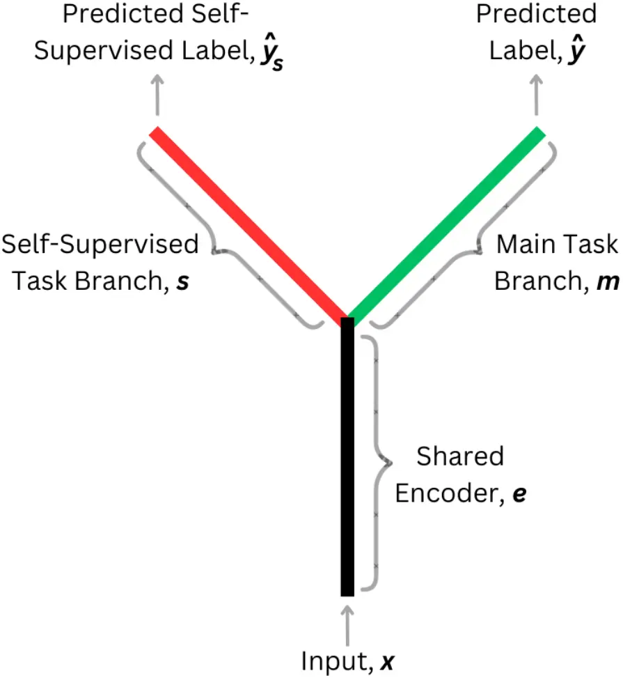
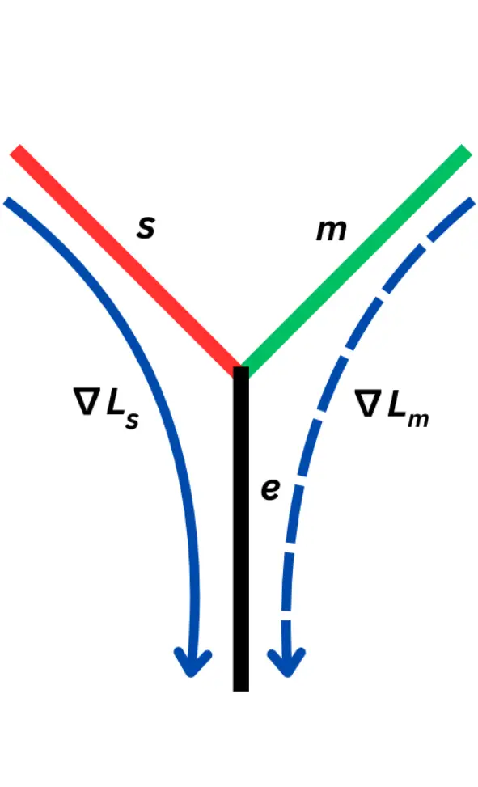

Behera Easow Parvathala Murty nocounter\]Speech Information Processing
Lab, Department of Electrical EngineeringIndian Institute of Technology
HyderabadIndia

# Test-Time Training for Speech Enhancement

Avishkar    Riya Ann    Venkatesh    K. Sri Rama Affiliation: \[

###### Abstract

This paper introduces a novel application of Test-Time Training (TTT)
for Speech Enhancement, addressing the challenges posed by unpredictable
noise conditions and domain shifts. This method combines a main speech
enhancement task with a self-supervised auxiliary task in a Y-shaped
architecture. The model dynamically adapts to new domains during
inference time by optimizing the proposed self-supervised tasks like
noise-augmented signal reconstruction or masked spectrogram prediction,
bypassing the need for labeled data. We further introduce various TTT
strategies offering a trade-off between adaptation and efficiency.
Evaluations across synthetic and real-world datasets show consistent
improvements across speech quality metrics, outperforming the baseline
model. This work highlights the effectiveness of TTT in speech
enhancement, providing insights for future research in adaptive and
robust speech processing.

###### keywords

test-time training, domain adaptation, distribution shifts,
self-supervised, speech enhancement

^(†)^(†)email: {avishkar112behera, riyaann76}@gmail.com,
ee22resch01005@iith.ac.in, ksrm@ee.iith.ac.in

Published in the Proceedings of Interspeech 2025 (DOI:
10.21437/Interspeech.2025-2725)

## 1 Introduction

Speech enhancement (SE) remains a critical challenge in speech signal
processing, tasked with improving the perceptual quality and
intelligibility of speech corrupted by noise. While deep neural networks
(DNNs) have achieved state-of-the-art performance in denoising and
source separation \[1, 2, 3\], their generalization to unseen noise
environments remains limited. Supervised training on paired noisy-clean
datasets yields strong performance under matched conditions, but models
often degrade when encountering noise types absent from training data
due to the domain mismatch between the noisy (simulated or real
acoustic) conditions \[4\].

Zhang et al. addressed partial domain adaptation (target domains with
fewer classes than source domain) using importance-weighted adversarial
networks \[5\]. However, this approach does not mimic the real-world
scenario where the speakers are independent and target domains are
diverse. To solve this, Li et al. proposed a minimax method to transfer
the model from a limited source domain to a rich target domain,
strengthening generalization performance \[6\]. Learning Noise Adapters
(LNAs) leveraged frozen pre-trained models with domain-specific adapters
to incrementally handle new noise distributions while solving the
catastrophic domain forgetting phenomenon \[7\]. However, all the above
methods require some information about the target noise or its
distribution for training.

Recent advances in test-time adaptation (TTA) address the distribution
shift issue through dynamic parameter adjustment during inference. This
method involves adapting model weights without any additional training.
For instance, Single-Utterance Test-Time Adaptation (SUTA) introduced by
Lin et al. reduces ASR word error rates on out-of-domain speech by
applying entropy minimization to adapt models per test utterance \[8\].
Another common TTA approach is to update the batch normalization layer
statistics using a large number of test samples \[9, 10\]. Furthermore,
TTA frameworks like zero-shot knowledge distillation enable compact
student models to adopt recurring noise/speaker patterns using
pseudo-targets from larger teacher models, without clean reference
signals \[11\].

Another paradigm employs weight prediction architectures in which
auxiliary networks generate input-adaptive parameters. Dynamic Filter
Networks (DFN) \[12\] and WeightNet \[13\] exemplify this approach by
generating convolutional filters dynamically and predicting
convolutional weights conditioned on input, respectively. Test-Time
Training (TTT) emerges as a specialized form of this approach where we
update weights through self-supervised objectives, helping in domain
adaptation \[14\]. The basic idea of TTT is to use a self-supervised
task and a main task during training. During inference, the
self-supervised task is used to fine-tune the model using test data,
before making the main prediction. Section 2.1 discusses the TTT
framework in further detail.

Dumpala et al. explored the application of TTT to speech classification
tasks such as speaker identification and emotion detection \[15\]. They
identified key challenges with TTT, including sensitivity to
optimization hyperparameters and scalability issues. To address these
issues, they proposed a parameter-efficient fine-tuning (PEFT) algorithm
that only considered the bias parameters for fine-tuning during TTT.

TTT addresses critical limitations of conventional methods through three
key advantages. First, its domain-agnostic nature circumvents the need
for explicit noise-type priors required by domain adversarial training
(DAT), enabling adaptation to completely unseen noise distributions.
Second, noise/speaker-informed weight prediction adapts models to the
individual noise/speaker domains, giving superior performance even in
challenging environments. Third, resource efficiency can be achieved
through selective updates to bias terms or only a certain portion of the
network, enabling real-time operation on edge devices.

Our goal is to develop a TTT-based SE framework that can generalize
across diverse environments. We investigate different self-supervised
tasks for TTT, analyzing their impact on noise suppression and overall
speech enhancement quality. Additionally, we explore various TTT
strategies, balancing the trade-offs between computational efficiency
and the extent of performance improvement. To comprehensively evaluate
the effectiveness of our approach, we conduct experiments on both
synthetic and real datasets. By leveraging self-supervised learning,
this approach has the potential to bridge the gap between training and
test conditions, enabling more robust speech enhancement.

## 2 Methodology

### 2.1 Test-Time Training (TTT) Framework

As proposed in Sun et al. \[14\], we use an architecture that consists
of a shared encoder $`e`$ as the stem and two branches: a main task
branch $`m`$ and a self-supervised auxiliary task branch $`s`$, thus
giving the architecture a Y-shape as seen in Figure 1(a). Let the
parameters of the shared encoder, main task branch and self-supervised
branch be $`\theta_{e}`$, $`\theta_{m}`$ and $`\theta_{s}`$
respectively. The main task loss ($`\mathcal{L}_{m}`$) is optimized over
the parameters $`\theta_{e}`$ and $`\theta_{m}`$ and requires the input
$`x`$ and label $`y`$. The self-supervised task loss
($`\mathcal{L}_{s}`$) does not use label $`y`$ but rather creates a
pseudo-label $`y_{s}`$ from the unlabeled input $`x`$, and is optimized
over the parameters $`\theta_{e}`$ and $`\theta_{s}`$.

During training, we jointly optimize over both the loss functions,
$`\mathcal{L}_{s}`$ and $`\mathcal{L}_{m}`$ since the main task label
$`y`$ is available to us as part of the training data ($`x`$, $`y`$).
Hence, the training optimization problem becomes Eq.(1) as given in
\[14\].

```math
\min_{\boldsymbol{\theta_{e},\theta_{m},\theta_{s}}}\mathbb{E}\left[\mathcal{L}_{m}(x,y;\boldsymbol{\theta_{e},\theta_{m}})+\mathcal{L}_{s}(x;\boldsymbol{\theta_{e},\theta_{s}})\right] \tag{1}
```

During testing, the main task label $`y`$ is not available but we can
still optimize the self-supervised loss using the pseudo-label
$`y_{s}`$. Hence, the testing optimization problem is the second term
from Eq.(1). After optimization, we get the updated parameters,
$`\theta^{*}_{e}`$ and $`\theta^{*}_{s}`$. Using the updated shared
encoder ($`\theta^{*}_{e}`$) and the main task branch ($`\theta_{m}`$),
we make the prediction i.e. $`\hat{y}=\theta_{e^{*}+m}(x)`$. In short,
test-time training involves using the unlabeled input $`x`$ to update
the model parameters via the self-supervised task, before making a
prediction.

The gradient backpropagation flow is illustrated in Figure 1(b). During
training, gradients propagate from both the main branch $`m`$ and the
self-supervised branch $`s`$ to the shared encoder $`e`$, updating the
entire architecture. During testing, gradients flow only from the
self-supervised branch $`s`$ to the shared encoder $`e`$, updating these
components while keeping the main branch fixed.

We use the following four TTT strategies:

1.  1.  TTT-standalone: This is the standard version of TTT where the model
        is initialized with parameters $`\theta_{e}`$ and $`\theta_{s}`$
        obtained after training i.e. after optimizing Eq.(1). After updating
        the shared encoder using the test sample, we get $`\theta^{*}_{e}`$
        which is used for prediction and then discarded. This is repeated
        for every sample $`x_{i}`$ in the test dataset.
2.  2.  TTT-online: In the online version of TTT, the updated parameters
        $`\theta^{*}_{e}`$ and $`\theta^{*}_{s}`$ are not discarded, but
        instead used as initialization for the next test sample. That is,
        for a particular test sample $`x_{i}`$, the model parameters
        $`\theta^{(i)}_{e}`$ and $`\theta^{(i)}_{s}`$ are initialized using
        the updated parameters from the previous test sample i.e.
        $`\theta^{*(i-1)}_{e}`$ and $`\theta^{*(i-1)}_{s}`$.
3.  3.  TTT-online-batch: This is similar to the TTT-online strategy but
        model parameters are updated using the current test sample as well
        as the previous four test samples. A batch size of 5 was empirically
        chosen as it yielded the highest performance improvement.
4.  4.  TTT-online-batch-bias: Following the approach proposed in \[15\],
        only the bias parameters are updated during test time which reduces
        computational overhead while retaining adaptive capabilities. Here,
        we have implemented bias fine-tuning on top of the TTT-online-batch
        strategy.

In our experiments, the main task is to denoise the noisy input signal
by predicting a mask over the magnitude spectrogram. We have used two
types of self-supervised tasks and analyzed their performances. The
first self-supervised task is masked spectrogram prediction (MSP), where
the model predicts the original spectrogram after random patches are
zeroed out. This is similar to the MAE task proposed in \[16, 17, 18\].
The second type involves adding noise to the already noisy input signal,
similar to the Noisy-target Training (NyTT) method in Fujimura et al.
\[19\]. Hence, we get a noisier signal and the task is to denoise this
augmented signal using the original noisy signal as reference.

### 2.2 Model Architecture

In this paper, we will be using the real-time Neural Time-Varying
Filtering (NTVF) network proposed by Venkatesh et al. in \[20\] for SE
tasks. This network has shown substantial enhancement performance, while
having significantly lower computational complexity. It takes the STFT
log magnitude spectrogram $`\log(|S[t,k]|)`$ of the noisy signal as
input and predicts a mask $`\hat{W}[t,k]`$. By multiplying the mask with
the magnitude spectrogram, we get the enhanced magnitude spectrogram
$`|\hat{S}[t,k]|`$. We reconstruct the enhanced time-domain signal by
taking the inverse STFT using the noisy phase.



(a) TTT architecture



(b) Gradient Flow Diagram

Figure 1: (a) Test-Time Training architecture and (b) Gradient
backpropagation flow during training (both solid and dashed lines) and
during testing (solid line only).

The typical NTVF network consists of a stack of $`L`$ identical blocks.
We modify this network to the Y-shaped TTT framework depending on the
self-supervised task. For the MSP self-supervised task, the shared
encoder consists of $`L`$ = 4 blocks, the main branch consists of $`L`$
= 3 blocks followed by two dense layers with Tanh activation, and the
self-supervised branch is identical to the main branch but uses ReLU
instead.

For the NyTT self-supervised task, the shared encoder has $`L`$ = 6
blocks, the main task branch has a single block followed by two dense
layers with Tanh activation, and the self-supervised task branch is
identical to the main task branch. This is because both tasks are the
same, i.e. to denoise the input signal. Hence, branching is done at a
later stage with smaller main task and self-supervised task branches
because we expect the shared encoder to extract similar features for
both tasks.

### 2.3 Loss Functions

As suggested in \[20\], we use a combination of spectral-related and
perception-related losses to improve the enhancement quality. Namely, we
use mask loss (mean absolute error between estimated and oracle TVF),
SI-SDR loss and PESQ loss. Apart from these, we use the MSE (mean
squared error) between the log magnitude spectrograms of the noisy input
signal and the output of masked spectrogram prediction.

For the main task, we use a combination of mask loss, SI-SDR loss, and
PESQ loss. For the MSP self-supervised task, we use MSE loss. For the
NyTT self-supervised task, we use the same combination of losses as the
main task since both tasks are identical.

```math
\displaystyle\mathcal{L}_{m} \displaystyle=\mathcal{L}_{Mask}+\mathcal{L}_{SI-SDR}+\mathcal{L}_{PESQ} \tag{2}
```

```math
\displaystyle\mathcal{L}_{s,MSP} \displaystyle=\frac{1}{T.K}\sum^{T}_{t=1}\sum^{K}_{k=1}\left[\log|S[t,k]|-\log|\hat{S}[t,k]|\right]^{2} \tag{3}
```

```math
\displaystyle\mathcal{L}_{s,NyTT} \displaystyle=\mathcal{L}_{Mask}+\mathcal{L}_{SI-SDR}+\mathcal{L}_{PESQ} \tag{4}
```

## 3 Experiments and Results

### 3.1 Datasets

#### 3.1.1 Training Data

We use the DNS Challenge 1 dataset \[21\] to train the model. The real
samples of this dataset are taken from the LibriVox corpus \[22\]. The
noises are taken from Audioset \[23\] and Freesound \[24\]. The dataset
has about 150 audio classes including various noise types like music,
wind, dog, etc. 500 hours of data was used to train the models.

#### 3.1.2 Test Data

In our study, we have evaluated the different approaches on two types of
data: synthetic data and real recordings.

For synthetic data, we assess the generalization ability of our model
using the test set from the Valentini dataset \[25\]. The clean speech
samples in this dataset are sourced from the Voice Bank Corpus \[26\],
while the noisy speech signals are generated by adding various
background noises from the DEMAND dataset \[27\] at different
signal-to-noise ratios (SNRs). These include real noises from settings
such as bus, cafeteria, public square, living room and office. Overall,
the 824 audio samples provided in the test set were used during
evaluation. We observe an 8.01% drop in PESQ when models are trained on
the DNS dataset and evaluated on the Valentini test set, compared to
models both trained and tested on Valentini. This highlights the domain
shift between the two datasets.

While evaluating models on synthetic data provides insights, their
performance in real-world scenarios may differ significantly. Therefore,
we also evaluate our models on real recordings provided as part of the
DNS Challenge 1 dataset, ensuring a more realistic assessment of our
approach.

In order to test the extent of distribution shift caused by TTT, we
re-evaluate our models on the DNS no-reverb test samples which consists
of 300 audio samples.

### 3.2 Experiments

We experimented with three different self-supervised auxiliary tasks:

1.  1.  MSP: Masking the spectrogram of the noisy signal and predicting the
        spectrogram.
2.  2.  NyTT-gaussian: Adding Gaussian noise to the noisy signal and
        predicting the original noisy signal.
3.  3.  NyTT-real: Adding real noises from river, park, field, domestic
        washing, and office hallway settings from the DEMAND dataset to the
        noisy signal and predicting the original noisy signal. The noise is
        added to the signal at an SNR randomly sampled between 0 and 15 dB.

For each self-supervised task, we experimented with all the TTT
strategies: TTT-standalone, TTT-online, TTT-online-batch and
TTT-online-batch-bias. These experiments are compared with the NVTF
model (Baseline) that is trained without any self-supervised auxiliary
task and the NVTF model trained jointly with the main task and the
self-supervised task (Joint Training).

### 3.3 Experimental Configuration

The model configuration follows the setup described in Section 2.2. We
use the AdamW optimizer \[28\] for training with an initial learning
rate of 0.001. To adaptively adjust the learning rate based on
performance, we employ a learning rate scheduler to reduce the learning
rate when it plateaus. All models were trained for 100 epochs.

While evaluating the model, we empirically choose a learning rate of
1e-4 for the Valentini dataset and 1e-6 for the real recordings for the
MSP and NyTT-real auxiliary tasks. For NyTT-gaussian, we have chosen a
learning rate of 1e-6 for both the datasets.

### 3.4 Evaluation Metrics

| Experiment Type | Method                | Valentini   |        |       | Real Audios   |       |       |
| --------------- | --------------------- | ----------- | ------ | ----- | ------------- | ----- | ----- |
|                 |                       | PESQ        | STOI   | SSNR  | DSIG          | DBAK  | DOVRL |
| Noisy           | \-                    | 1.971       | 92.099 | 1.680 | 3.053         | 2.509 | 2.255 |
| Baseline        | NVTF                  | 2.961       | 92.972 | 8.684 | 3.290         | 3.950 | 2.984 |
| MSP             | Joint Training        | 2.956       | 92.985 | 8.811 | 3.300         | 3.926 | 2.980 |
|                 | TTT-standalone        | 2.958       | 93.004 | 8.819 | 3.300         | 3.926 | 2.980 |
|                 | TTT-online            | 3.004       | 93.324 | 8.831 | 3.299         | 3.928 | 2.979 |
|                 | TTT-online-batch      | 3.034       | 92.213 | 8.948 | 3.299         | 3.928 | 2.979 |
|                 | TTT-online-batch-bias | 3.015       | 92.049 | 8.969 | 3.300         | 3.927 | 2.980 |
| NyTT-gaussian   | Joint Training        | 2.983       | 93.261 | 9.248 | 3.317         | 3.982 | 3.018 |
|                 | TTT-standalone        | 2.983       | 93.262 | 9.248 | 3.317         | 3.982 | 3.018 |
|                 | TTT-online            | 2.948       | 93.337 | 9.306 | 3.318         | 3.982 | 3.019 |
|                 | TTT-online-batch      | 2.971       | 92.397 | 9.518 | 3.317         | 3.982 | 3.019 |
|                 | TTT-online-batch-bias | 2.999       | 92.276 | 9.457 | 3.317         | 3.981 | 3.019 |
| NyTT-real       | Joint Training        | 2.981       | 93.493 | 9.068 | 3.319         | 3.950 | 3.007 |
|                 | TTT-standalone        | 2.982       | 93.484 | 9.066 | 3.320         | 3.950 | 3.007 |
|                 | TTT-online            | 3.081       | 93.323 | 8.469 | 3.324         | 3.954 | 3.012 |
|                 | TTT-online-batch      | 3.145       | 92.643 | 8.932 | 3.324         | 3.954 | 3.013 |
|                 | TTT-online-batch-bias | 3.088       | 92.515 | 9.038 | 3.321         | 3.951 | 3.008 |

Table 1: Performance comparison across Valentini dataset and real audios
with various TTT strategies.

We evaluate the model using the following measures: Perceptual
Evaluation of Speech Quality (PESQ) \[29\], Short-Time Objective
Intelligibility (STOI) \[30\], and Segmental Signal-to-Noise Ratio
(SSNR) \[31\], all of which require a clean reference signal for
comparison.

We use DSIG (speech quality assessment), DBAK (background noise
suppression evaluation), and DOVRL (overall audio quality assessment)
from DNSMOS \[32\], a non-intrusive neural network based metric for
evaluating speech quality. These scores do not require a reference
signal, making them particularly useful for real-world recordings where
a clean reference may not be available. Each score is rated on a scale
from 1 to 5.

### 3.5 Results

The performance of the proposed methods across various self-supervised
tasks are shown in Table 1.

1.  1.  Valentini dataset: Joint training with auxiliary tasks (except MSP)
        provides slight but consistent gains across all metrics over the
        baseline, suggesting that integrating an auxiliary self-supervised
        objective benefits the main task in generalizing to another domain.

    In the MSP task, TTT and TTT-online lead to an improvement of all
    metrics. For NyTT-gaussian, these strategies cause a slight drop in
    PESQ but improve SSNR. Conversely, for NyTT-real, they slightly
    reduce SSNR but improve PESQ.

    Across all auxiliary tasks, TTT-online-batch enhances both the PESQ
    and SSNR compared to TTT-online but introduces a negligible drop in
    STOI. Further, our experiments indicate that using a batch of the
    previous four samples yields better performance than increasing
    either the number of gradient steps per sample or the learning rate,
    as it allows the model to capture the underlying data distribution
    rather than overfitting to the noise characteristics of a single
    speech sample. TTT-online-batch-bias results in a minor PESQ drop
    but compensates with slight SSNR improvements, indicating that
    restricting adaptation to bias parameters preserves stability while
    offering computation benefits.

2.  2.  Real audios: On the real dataset, the MSP task slightly increases
        the DSIG but fails to suppress the background noise (captured by the
        low DBAK). This results in a lower DOVRL score. This suggests that
        masked spectrogram prediction may not provide meaningful adaptation
        cues in real-world conditions. In contrast, the NyTT-gaussian
        experiment significantly enhances DBAK, leading to the highest DOVRL
        score among all methods. This indicates that adding Gaussian noise
        effectively improves background noise suppression. On the other
        hand, the NyTT-real experiment results in noticeable improvements in
        DSIG, indicating better preservation of speech content. This
        improvement further translates to a higher DOVRL score compared to
        the baseline.

### 3.6 Extent of Distribution Shift after TTT

After evaluating the model on the Valentini dataset, we re-evaluated it
on the DNS test set without any TTT strategy to assess the extent of
distributional shift from the original training data for the various TTT
strategies. We selected the best-performing model on Valentini, the
NyTT-real model, for this experiment.

| Method                          | PESQ  | STOI   | SSNR   |
| ------------------------------- | ----- | ------ | ------ |
| Noisy                           | 1.582 | 91.522 | 5.965  |
| NyTT-real Joint Training        | 3.126 | 96.475 | 10.736 |
| NyTT-real TTT-standalone        | 3.131 | 96.481 | 10.611 |
| NyTT-real TTT-online            | 3.094 | 96.263 | 10.145 |
| NyTT-real TTT-online-batch      | 3.065 | 96.305 | 10.427 |
| NyTT-real TTT-online-batch-bias | 3.093 | 96.421 | 10.623 |

Table 2: Performance of NyTT-real (without weight updation) on the DNS
test set after TTT on the Valentini test set.

As seen in Table 2, performance on the DNS test set degrades after TTT
on the Valentini test set, indicating a shift in distribution. The
smallest drop is observed in TTT-standalone and the largest drop is
observed in TTT-online-batch. This reinforces that a single adaptation
step minimizes deviation from the original model while performing TTT
with more samples leads to greater distributional shift. However,
TTT-online-batch-bias mitigates this drop slightly, reinforcing that
restricting updates to bias parameters helps preserve generalization
while still leveraging test-time adaptation. These results show that our
model does not suffer from the catastrophic domain forgetting
phenomenon, unlike other domain adaptation models.

## 4 Conclusion and Future Work

The integration of test-time training into speech enhancement represents
a paradigm shift from static models to adaptive systems that
continuously refine parameters against real-world variability. Our
experiments show that TTT improves speech quality across both synthetic
(Valentini) and real-world (DNS test) datasets. Among the
self-supervised tasks, NyTT-real excels at preserving speech quality,
while NyTT-gaussian is more effective at suppressing background noise.
This highlights a trade-off between speech quality and noise
suppression, suggesting that task selection should be
application-dependent. For adaptation strategies, TTT-online-batch
provides significant gains reducing the PESQ drop observed when training
on DNS and testing on Valentini from 8.01% to 2.09%, effectively
mitigating the impact of domain shift. On the other hand,
TTT-online-batch-bias offers a computationally efficient alternative. We
have also shown that the model adapted to a new domain using TTT, still
retains significant performance on the source domain. This framework can
be integrated with any SOTA speech enhancement model, and further
extended to tasks like personalized speech enhancement by training on a
single speaker and adapting to new speakers at test time.

## References

- \[1\] H. Yang, J. Su, M. Kim, and Z. Jin, “Genhancer: High-fidelity
  speech enhancement via generative modeling on discrete codec tokens,”
  in _Interspeech 2024_, 2024, pp. 1170–1174.
- \[2\] Y. Yang, N. Trigoni, and A. Markham, “Pre-training feature
  guided diffusion model for speech enhancement,” in _Interspeech 2024_,
  2024, pp. 1185–1189.
- \[3\] Z. Kong, W. Ping, A. Dantrey, and B. Catanzaro, “CleanUNet 2: A
  hybrid speech denoising model on waveform and spectrogram,” in
  _Interspeech 2023_, 2023, pp. 790–794.
- \[4\] J. CUI and S. BLEECK, “From simulation to reality: tackling data
  mismatches in speech enhancement with unsupervised pre-training,”
  _INTER-NOISE and NOISE-CON Congress and Conference Proceedings_, vol.
  270, no. 11, pp. 206–215, 2024.
- \[5\] J. Zhang, Z. Ding, W. Li, and P. Ogunbona, “Importance weighted
  adversarial nets for partial domain adaptation,” in _Proceedings of
  the IEEE conference on computer vision and pattern recognition_, 2018,
  pp. 8156–8164.
- \[6\] Y. Li, Y. Sun, K. Horoshenkov, and S. M. Naqvi, “Domain
  Adaptation and Autoencoder-Based Unsupervised Speech Enhancement,”
  _IEEE Transactions on Artificial Intelligence_, vol. 3, no. 1, pp.
  43–52, 2022.
- \[7\] Z. Yang, X. Song, J. Chen, C. Richard, and I. Cohen, “Learning
  Noise Adapters for Incremental Speech Enhancement,” _IEEE Signal
  Processing Letters_, vol. 31, pp. 2915–2919, 2024.
- \[8\] G.-T. Lin, S.-W. Li, and H. yi Lee, “Listen, Adapt, Better WER:
  Source-free single-utterance test-time adaptation for automatic speech
  recognition,” in _Interspeech 2022_, 2022, pp. 2198–2202.
- \[9\] Z. Su, J. Guo, K. Yao, X. Yang, Q. Wang, and K. Huang,
  “Unraveling batch normalization for realistic test-time adaptation,”
  in _Proceedings of the AAAI Conference on Artificial Intelligence_,
  vol. 38, no. 13, 2024, pp. 15 136–15 144.
- \[10\] H. Lim, B. Kim, J. Choo, and S. Choi, “TTN: A domain-shift
  aware batch normalization in test-time adaptation,” in _Proceedings of
  the 11th International Conference on Learning Representations
  (ICLR)_, 2023.
- \[11\] S. Kim and M. Kim, “Test-time adaptation toward personalized
  speech enhancement: Zero-shot learning with knowledge distillation,”
  in _2021 IEEE Workshop on Applications of Signal Processing to Audio
  and Acoustics (WASPAA)_. IEEE, 2021, pp. 176–180.
- \[12\] X. Jia, B. De Brabandere, T. Tuytelaars, and L. V. Gool,
  “Dynamic filter networks,” _Advances in neural information processing
  systems_, vol. 29, 2016.
- \[13\] N. Ma, X. Zhang, J. Huang, and J. Sun, “WeightNet: Revisiting
  the design space of weight networks,” in _Computer Vision – ECCV
  2020_, A. Vedaldi, H. Bischof, T. Brox, and J.-M. Frahm, Eds. Cham:
  Springer International Publishing, 2020, pp. 776–792.
- \[14\] Y. Sun, X. Wang, Z. Liu, J. Miller, A. A. Efros, and M. Hardt,
  “Test-time training with self-supervision for generalization under
  distribution shifts,” in _Proceedings of the 37th International
  Conference on Machine Learning_, ser. ICML’20. JMLR.org, 2020.
- \[15\] S. H. Dumpala, C. Sastry, and S. Oore, “Test-time training for
  speech,” _arXiv preprint arXiv:2309.10930_, 2023.
- \[16\] K. Zmolikova, M. S. Pedersen, and J. Jensen, “Masked
  spectrogram prediction for unsupervised domain adaptation in speech
  enhancement,” _IEEE Open Journal of Signal Processing_, vol. 5, pp.
  274–283, 2024.
- \[17\] Y. Gandelsman, Y. Sun, X. Chen, and A. A. Efros, “Test-time
  training with masked autoencoders,” in _Advances in Neural Information
  Processing Systems_, A. H. Oh, A. Agarwal, D. Belgrave, and K. Cho,
  Eds., 2022.
- \[18\] Z. Zhong, H. Shi, M. Hirano, K. Shimada, K. Tateishi,
  T. Shibuya, S. Takahashi, and Y. Mitsufuji, “Extending audio masked
  autoencoders toward audio restoration,” in _2023 IEEE Workshop on
  Applications of Signal Processing to Audio and Acoustics (WASPAA)_,
  2023, pp. 1–5.
- \[19\] T. Fujimura and T. Toda, “Analysis of noisy-target training for
  dnn-based speech enhancement,” in _ICASSP 2023 - 2023 IEEE
  International Conference on Acoustics, Speech and Signal Processing
  (ICASSP)_, 2023, pp. 1–5.
- \[20\] V. Parvathala and S. R. M. Kodukula, “Light-weight causal
  speech enhancement using time-varying multi-resolution filtering,” in
  _2024 National Conference on Communications (NCC)_, 2024, pp. 1–6.
- \[21\] C. K. Reddy, V. Gopal, R. Cutler, E. Beyrami, R. Cheng,
  H. Dubey, S. Matusevych, R. Aichner, A. Aazami, S. Braun, P. Rana,
  S. Srinivasan, and J. Gehrke, “The INTERSPEECH 2020 deep noise
  suppression challenge: Datasets, subjective testing framework, and
  challenge results,” in _Interspeech 2020_, 2020, pp. 2492–2496.
- \[22\] J. Kearns, “Librivox: Free public domain audiobooks,”
  _Reference Reviews_, vol. 28, no. 1, pp. 7–8, 2014.
- \[23\] J. F. Gemmeke, D. P. Ellis, D. Freedman, A. Jansen,
  W. Lawrence, R. C. Moore, M. Plakal, and M. Ritter, “Audio set: An
  ontology and human-labeled dataset for audio events,” in _2017 IEEE
  international conference on acoustics, speech and signal processing
  (ICASSP)_. IEEE, 2017, pp. 776–780.
- \[24\] E. Fonseca, J. Pons, X. Favory, F. Font, D. Bogdanov,
  A. Ferraro, S. Oramas, A. Porter, and X. Serra, “Freesound datasets: A
  platform for the creation of open audio datasets.” in _Proceedings of
  the 18th International Society for Music Information Retrieval
  Conference_. ISMIR, Oct. 2017, pp. 486–493. \[Online\]. Available:
  [https://doi.org/10.5281/zenodo.1417159](https://doi.org/10.5281/zenodo.1417159)
- \[25\] C. Valentini-Botinhao, X. Wang, S. Takaki, and J. Yamagishi,
  “Speech Enhancement for a Noise-Robust Text-to-Speech Synthesis System
  Using Deep Recurrent Neural Networks,” in _Interspeech 2016_, 2016,
  pp. 352–356.
- \[26\] C. Veaux, J. Yamagishi, and S. King, “The voice bank corpus:
  Design, collection and data analysis of a large regional accent speech
  database,” in _2013 International Conference Oriental COCOSDA held
  jointly with 2013 Conference on Asian Spoken Language Research and
  Evaluation (O-COCOSDA/CASLRE)_, 2013, pp. 1–4.
- \[27\] J. Thiemann, N. Ito, and E. Vincent, “The diverse environments
  multi-channel acoustic noise database (demand): A database of
  multichannel environmental noise recordings,” in _Proceedings of
  Meetings on Acoustics_, vol. 19, no. 1. AIP Publishing, 2013.
- \[28\] I. Loshchilov and F. Hutter, “Decoupled weight decay
  regularization,” in _International Conference on Learning
  Representations_, 2019.
- \[29\] A. Rix, J. Beerends, M. Hollier, and A. Hekstra, “Perceptual
  evaluation of speech quality (PESQ)-a new method for speech quality
  assessment of telephone networks and codecs,” in _2001 IEEE
  International Conference on Acoustics, Speech, and Signal Processing.
  Proceedings (Cat. No.01CH37221)_, vol. 2, 2001, pp. 749–752 vol.2.
- \[30\] C. H. Taal, R. C. Hendriks, R. Heusdens, and J. Jensen, “A
  short-time objective intelligibility measure for time-frequency
  weighted noisy speech,” in _2010 IEEE international conference on
  acoustics, speech and signal processing_. IEEE, 2010, pp. 4214–4217.
- \[31\] J. H. L. Hansen and B. L. Pellom, “An effective quality
  evaluation protocol for speech enhancement algorithms,” in _5th
  International Conference on Spoken Language Processing (ICSLP 1998)_,
  1998, p. paper 0917.
- \[32\] C. K. Reddy, V. Gopal, and R. Cutler, “DNSMOS P. 835: A
  non-intrusive perceptual objective speech quality metric to evaluate
  noise suppressors,” in _ICASSP 2022-2022 IEEE International Conference
  on Acoustics, Speech and Signal Processing (ICASSP)_. IEEE, 2022, pp.
  886–890.
