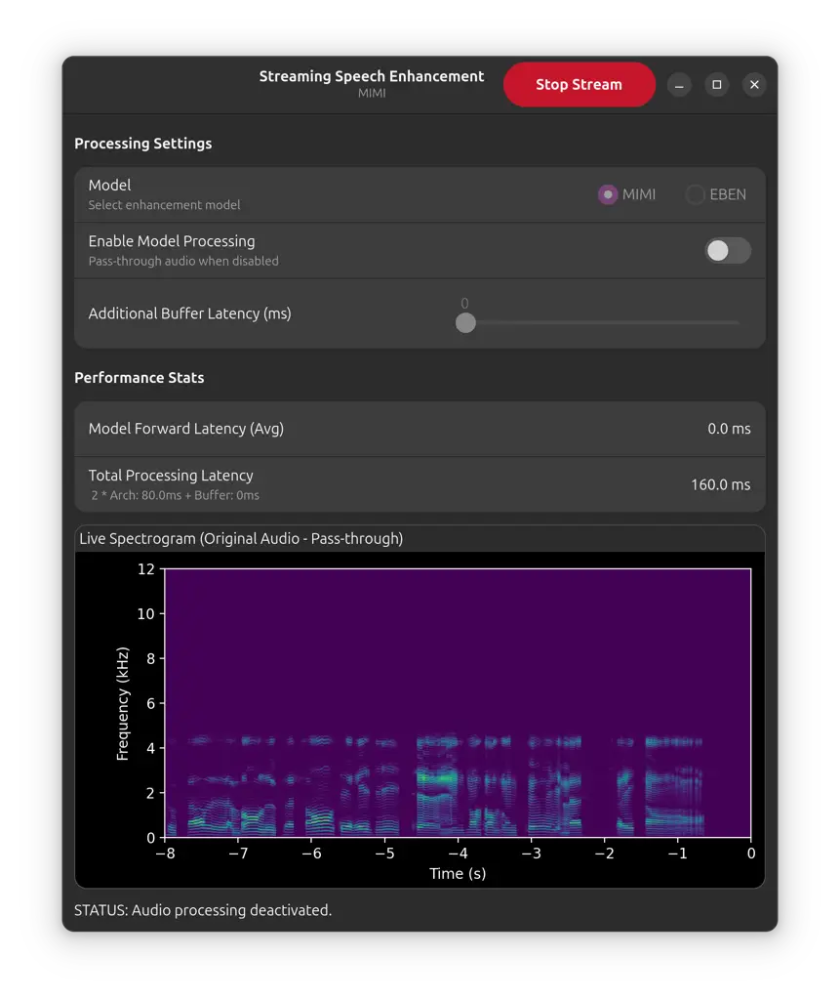
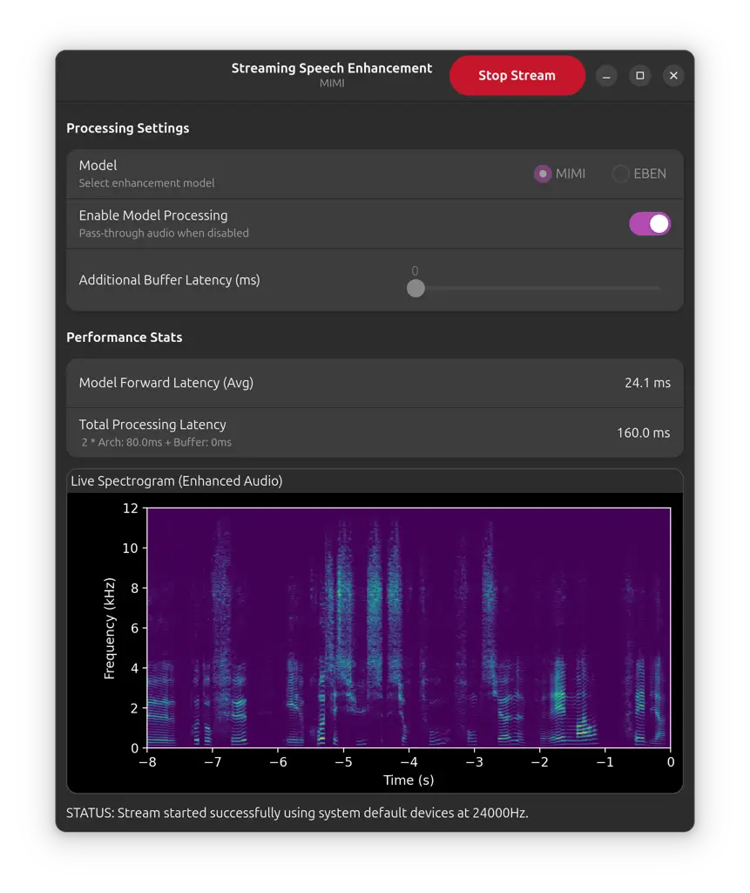

\NoHyper

# Real-time speech enhancement in noise for throat microphone using neural audio codec as foundation model

###### Abstract

We present a real-time speech enhancement demo using speech captured
with a throat microphone. This demo aims to showcase the complete
pipeline, from recording to deep learning-based post-processing, for
speech captured in noisy environments with a body-conducted microphone.
The throat microphone records skin vibrations, which naturally attenuate
external noise, but this robustness comes at the cost of reduced audio
bandwidth. To address this challenge, we fine-tune Kyutai’s Mimi—a
neural audio codec supporting real-time inference—on Vibravox, a dataset
containing paired air-conducted and throat microphone recordings. We
compare this enhancement strategy against state-of-the-art models and
demonstrate its superior performance. The inference runs in an
interactive interface that allows users to toggle enhancement, visualize
spectrograms, and monitor processing latency.

| Julien Hauret¹, Thomas Joubaud², Éric Bavu¹                                                       |
| ------------------------------------------------------------------------------------------------- |
| ¹LMSSC, Conservatoire national des arts et métiers, Paris, France                                 |
| ²Acoustics and Protection of the Soldier, French-German Research Institute of Saint-Louis, France |

## 1 Introduction

In extremely noisy environments, body-conducted microphones have been
shown to outperform traditional air-conducted microphones in terms of
speech intelligibility and quality \[1\]. However, since the human body
acts as a natural low-pass filter, high-frequency components of speech
are severely attenuated, and physiological noises such as heartbeat,
breathing, and swallowing can contaminate the signal. This creates a
clear need for post-processing speech enhancement to restore
intelligibility and quality while preserving speaker identity \[2\].

While lightweight deep learning models have been proposed to enhance
speech from non-conventional microphones \[3, 4, 5, 6\], they remain
limited by the scarcity of real-world training data, as public datasets
never exceed a hundred hours of recordings \[7\]. Inspired by
self-supervised learning strategies \[8, 9, 10\], we propose leveraging
neural audio codecs as foundation models for speech enhancement. These
models, originally trained to approximate the identity function through
a severe bottleneck, inherently learn clean speech patterns that can be
repurposed for downstream enhancement tasks. Additionally, by operating
on discrete token representations of speech rather than continuous
waveforms, this paradigm reduces the dimensionality of the task while
ensuring that the reconstructed output remains within the natural
distribution of clean speech, borrowing the concept of ”regeneration
learning” \[11\].

Our demo builds on this paradigm by fine-tuning the encoder of a neural
audio codec on paired throat and air-conducted recordings, enabling
accurate reconstruction of full-band speech from body-conducted input.
In contrast to prior work that stacks language models on top of acoustic
tokens \[12, 13\], our approach retains the codec’s simplicity. We posit
that the effectiveness of our approach stems from the rich priors
learned during large-scale pretraining, which help compensate for the
spectral limitations inherent to body-conducted speech.

## 2 Experimental setup & Model selection

We conduct experiments on Vibravox \[7\], a dataset of 38 hours of
airborne and body-conducted speech sextuplets from 188 participants. We
focus on the throat microphone for its superior noise robustness and use
only the `speech_clean` subset (recorded in quiet conditions) as mixing
with the `speechless_noisy` split did not yield significant gains in
previous work \[7\]. Three systems were trained until metric
convergence:

- •
  Mimi \[14\]: the system showcased in this demo. We adopt a simple
  regression strategy where the encoder is duplicated: one is frozen to
  extract clean reference embeddings, while the other is initialized
  from the same checkpoint and fine-tuned to minimize the
  $`\mathcal{L}_{1}`$ distance between enhanced and reference
  embeddings.
- •
  EBEN \[1\]: a lightweight model specifically designed for
  body-conducted speech enhancement. It shares architectural
  similarities with Mimi but omits sequence modeling layers to reduce
  complexity.
- •
  Nemo-FlowMatching \[15\]: a flow matching foundation model available
  in NVIDIA NeMo \[16\] ¹¹ 1
  [https://huggingface.co/nvidia/sr_ssl_flowmatching_16k_430m](https://huggingface.co/nvidia/sr_ssl_flowmatching_16k_430m).
  The original model was fine-tuned on bandwidth extension as one of its
  core subtasks, making it suitable for our setup. We retain the same
  fine-tuning and inference procedure as described in the original work.
  This model serves as a large-scale non-streamable state-of-the-art
  reference for comparison.

To evaluate the different approaches, we selected Noresqa-MOS \[17\] and
wideband STOI \[18\], both showing strong agreement with MUSHRA scores
in previous body-conducted speech enhancement work \[1\]. We also
included SI-SDR \[19\], as an indicator of time-domain correlation and
alignment between enhanced and reference signals, though less suited for
assessing perceptual quality. Finally, we reported some
Phoneme-Error-Rate (PER) between the reference phonemized transcription
and the output of the airborne phonemizer ²² 2
[https://huggingface.co/Cnam-LMSSC/phonemizer_headset_microphone](https://huggingface.co/Cnam-LMSSC/phonemizer_headset_microphone)
fed with the enhanced audio. Results are indicated in Table 1.

| Approach    | Params | STOI  | SI-SDR | N-MOS | PER   |
| ----------- | ------ | ----- | ------ | ----- | ----- |
| Throat      | \-     | 0.677 | -7.99  | 3.10  | 50.8% |
| Mimi \[14\] | 96.2M  | 0.841 | 1.37   | 4.112 | 15.1% |
| EBEN \[1\]  | 1.9M   | 0.834 | 3.21   | 3.862 | 18.6% |
| Nemo \[16\] | 430M   | 0.822 | 7.30   | 4.398 | 7.6%  |

Table 1: Test set metrics of Vibravox speech-clean

(a) Without speech enhancement

(b) With speech enhancement

Fig. 1: User interface of the demonstration featuring speech captured
with and without real-time enhancement.

From those results, we see that Mimi achieves the highest STOI score
while maintaining a Noresqa-MOS comparable to the flow matching
foundation model, but exhibits a lower SI-SDR. This decline in SI-SDR is
due to the codec-based approach, which compresses audio into latent
codes, sacrificing temporal coherence while maintaining perceptual
quality. In rare cases, particularly with the most challenging speech
segments, Mimi occasionally introduced minor phoneme hallucinations,
hence a PER slightly below the FlowMatching model. Informal listening
tests confirmed that both the codec-based approach and Nemo produce
high-quality speech, with EBEN also performing strongly, though slightly
below the other two. Overall, these findings are consistent with those
reported in \[20\], underscoring the reliability of the regressive
fine-tuning and further validating the efficacy of neural audio codecs
in serving as reliable foundation models for speech enhancement. These
results, along with the fact that it supports real-time inference, made
us select Mimi for the present demonstration.

## 3 Demo Description

### 3.1 Hardware

The demo employs an XVTM822D-D35 throat microphone, featuring dual
piezoelectric transducers mounted on an adjustable neckband. This
contact-based design captures vibrations from the skin near the vocal
cords while effectively attenuating ambient noise. The microphone
operates without external power and streams audio to a Linux laptop via
a RØDE AI-Micro interface. Real-time enhancement is performed directly
on-device, with the output accessible through a connected headset.

### 3.2 Frontend

As shown in Figure 1, the demo includes a native Linux graphical
interface built with GTK4\[21\] and Python. It displays a live
spectrogram of either the raw or enhanced throat microphone signal,
computed asynchronously in a separate worker thread to ensure smooth
user interface performance. Users can toggle real-time enhancement,
switch between models, and adjust buffer latency. Both model inference
latency and total end-to-end system latency are updated live. The
spectrogram is rendered using matplotlib\[22\], and processing can be
enabled or disabled without interrupting the audio stream.

### 3.3 Backend

The backend is implemented in Python using PyTorch\[23\], and handles
real-time audio acquisition at 24kHz, enhancement, and playback. Audio
input/output is managed by the Sounddevice library\[24\], using
low-latency streams with fixed-size frames aligned to the model’s frame
rate. The Mimi codec processes audio by encoding each frame into
discrete latent tokens and decoding them into full-band speech.
Processing is performed on an NVIDIA GeForce GTX 1650 GPU with
pre-warmed CUDA kernels to reduce startup latency. The end‑to‑end
minimal latency is dominated by two 80 ms Mimi frames. In practice,
additional input/output buffering on the RØDE AI‑Micro can add on the
order of a few‑tens of milliseconds per side (we budget $`\leq`$32 ms
each), for a total $`\approx`$ 160–224 ms. All inference runs in
no-gradient mode, and responsiveness is maintained through careful
resource management using Python’s contextlib and multithreading.

## 4 Conclusion

We present a fine-tuned neural audio codec serving as a foundation model
for real-time speech enhancement from throat microphone recordings. Our
results show that a simple regressive fine-tuning of the codec encoder
yields competitive performance with a non-streamable large-scale flow
matching model and outperforms the specifically body-conducted designed
EBEN model. By using the clean speech patterns acquired on discrete
latent representations, the system increases quality and intelligibility
while enabling efficient real-time inference. The interactive demo
confirms the practical viability of codec-based speech enhancement for
body-conducted microphones and paves the way for audio codec usage for
other data-scarce applications.

## REFERENCES

- \[1\] J. Hauret, T. Joubaud, V. Zimpfer, and É. Bavu, “Configurable
  EBEN: Extreme bandwidth extension network to enhance body-conducted
  speech capture,” _IEEE/ACM Transactions on Audio, Speech, and Language
  Processing_, vol. 31, pp. 3499–3512, 2023.
- \[2\] T. Joubaud, J. Hauret, V. Zimpfer, and É. Bavu, “French
  listening tests for the assessment of intelligibility, quality, and
  identity of body-conducted speech enhancement,” in _Interspeech_,
  Rotterdam, Netherlands, 2025.
- \[3\] J. Hauret, T. Joubaud, V. Zimpfer, and É. Bavu, “Eben: Extreme
  bandwidth extension network applied to speech signals captured with
  noise-resilient body-conduction microphones,” in _International
  Conference on Acoustics, Speech and Signal Processing (ICASSP)_. IEEE,
  2023, pp. 1–5.
- \[4\] C. Yu, K.-H. Hung, S.-S. Wang, Y. Tsao, and J.-w. Hung,
  “Time-domain multi-modal bone/air conducted speech enhancement,” _IEEE
  Signal Processing Letters_, vol. 27, pp. 1035–1039, 2020.
- \[5\] Y. Sui, M. Zhao, J. Xia, X. Jiang, and S. Xia, “Tramba: A hybrid
  transformer and mamba architecture for practical audio and bone
  conduction speech super resolution and enhancement on mobile and
  wearable platforms,” _Proceedings of the ACM on Interactive, Mobile,
  Wearable and Ubiquitous Technologies_, vol. 8, no. 4, pp. 1–29, 2024.
- \[6\] M. Ohlenbusch, C. Rollwage, and S. Doclo, “Low-complexity own
  voice reconstruction for hearables with an in-ear microphone,” in
  _International Conference on Acoustics, Speech and Signal Processing
  (ICASSP)_. IEEE, 2025, pp. 1–5.
- \[7\] J. Hauret, M. Olivier, T. Joubaud, C. Langrenne, S. Poirée,
  V. Zimpfer, and É. Bavu, “Vibravox: A dataset of french speech
  captured with body-conduction audio sensors,” _Speech Communication_,
  vol. 172, p. 103238, 2025.
- \[8\] A. Baevski, Y. Zhou, A. Mohamed, and M. Auli, “wav2vec 2.0: A
  framework for self-supervised learning of speech representations,”
  _Advances in neural information processing systems_, vol. 33, pp.
  12 449–12 460, 2020.
- \[9\] W.-N. Hsu, B. Bolte, Y.-H. H. Tsai, K. Lakhotia,
  R. Salakhutdinov, and A. Mohamed, “Hubert: Self-supervised speech
  representation learning by masked prediction of hidden units,”
  _IEEE/ACM Transactions on Audio, Speech, and Language Processing_,
  vol. 29, pp. 3451–3460, 2021.
- \[10\] S. Chen, C. Wang, Z. Chen, Y. Wu, S. Liu, Z. Chen, J. Li,
  N. Kanda, T. Yoshioka, X. Xiao _et al._, “Wavlm: Large-scale
  self-supervised pre-training for full stack speech processing,” _IEEE
  Journal of Selected Topics in Signal Processing_, vol. 16, no. 6, pp.
  1505–1518, 2022.
- \[11\] X. Tan, T. Qin, J. Bian, T.-Y. Liu, and Y. Bengio,
  “Regeneration learning: A learning paradigm for data generation,” in
  _Proceedings of the AAAI Conference on Artificial Intelligence_,
  vol. 38, no. 20, 2024, pp. 22 614–22 622.
- \[12\] H. Xue, X. Peng, and Y. Lu, “Low-latency speech enhancement via
  speech token generation,” in _International Conference on Acoustics,
  Speech and Signal Processing (ICASSP)_. IEEE, 2024, pp. 661–665.
- \[13\] H. Yang, J. Su, M. Kim, and Z. Jin, “Genhancer: High-fidelity
  speech enhancement via generative modeling on discrete codec tokens,”
  in _Interspeech_, 2024, pp. 1170–1174.
- \[14\] A. Défossez, L. Mazaré, M. Orsini, A. Royer, P. Pérez,
  H. Jégou, E. Grave, and N. Zeghidour, “Moshi: a speech-text foundation
  model for real-time dialogue,” _arXiv preprint
  arXiv:2410.00037_, 2024.
- \[15\] P.-J. Ku, A. H. Liu, R. Korostik, S.-F. Huang, S.-W. Fu, and
  A. Jukić, “Generative speech foundation model pretraining for
  high-quality speech extraction and restoration,” in _International
  Conference on Acoustics, Speech and Signal Processing (ICASSP)_. IEEE,
  2025, pp. 1–5.
- \[16\] O. Kuchaiev, J. Li, H. Nguyen, O. Hrinchuk, R. Leary,
  B. Ginsburg, S. Kriman, S. Beliaev, V. Lavrukhin, J. Cook _et al._,
  “Nemo: a toolkit for building AI applications using neural modules,”
  _arXiv preprint arXiv:1909.09577_, 2019.
- \[17\] P. Manocha, B. Xu, and A. Kumar, “Noresqa: A framework for
  speech quality assessment using non-matching references,” _Advances in
  neural information processing systems_, vol. 34, pp.
  22 363–22 378, 2021.
- \[18\] C. H. Taal, R. C. Hendriks, R. Heusdens, and J. Jensen, “An
  algorithm for intelligibility prediction of time–frequency weighted
  noisy speech,” _IEEE Transactions on Audio, Speech, and Language
  Processing_, vol. 19, no. 7, pp. 2125–2136, 2011.
- \[19\] J. Le Roux, S. Wisdom, H. Erdogan, and J. R. Hershey,
  “Sdr–half-baked or well done?” in _International Conference on
  Acoustics, Speech and Signal Processing (ICASSP)_. IEEE, 2019, pp.
  626–630.
- \[20\] A. H.Liu, Q. Wang, Y. Gong, and J. Glass, “A closer look at
  neural codec resynthesis: Bridging the gap between codec and waveform
  generation,” _arXiv preprint arXiv:2410.22448_, 2024.
- \[21\] “Gtk, version 4.0,”
  [https://www.gtk.org/](https://www.gtk.org/), accessed: July 2025.
- \[22\] J. D. Hunter, “Matplotlib: A 2d graphics environment,”
  _Computing in Science & Engineering_, vol. 9, no. 3, pp. 90–95, 2007.
- \[23\] A. Paszke, S. Gross, S. Chintala, G. Chanan, E. Yang,
  Z. DeVito, Z. Lin, A. Desmaison, L. Antiga, and A. Lerer, “Automatic
  differentiation in pytorch,” in _Conference on Neural Information
  Processing Systems_, 2017.
- \[24\] M. Geier _et al._, “Sounddevice,” 2020. \[Online\]. Available:
  [https://python-sounddevice.readthedocs.io/en/0.3.15/index.html](https://python-sounddevice.readthedocs.io/en/0.3.15/index.html)
