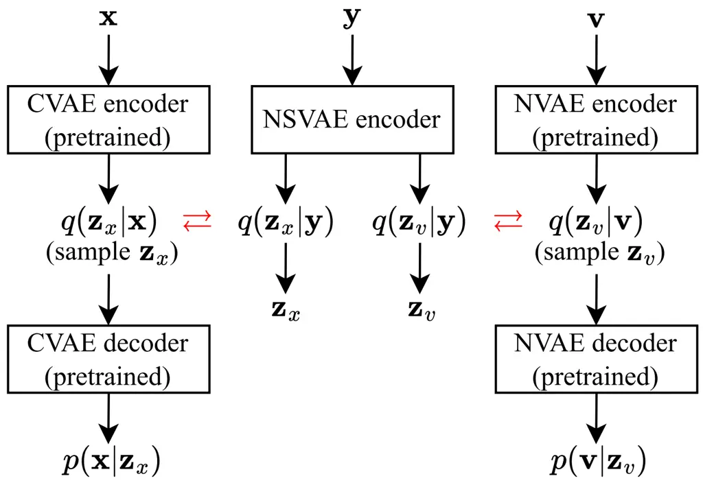

# Investigation of Speech and Noise Latent Representations in Single-channel VAE-based Speech Enhancement

Jiatong Li    Simon Doclo

###### Abstract

Recently, a variational autoencoder (VAE)-based single-channel speech
enhancement system using Bayesian permutation training has been
proposed, which uses two pretrained VAEs to obtain latent
representations for speech and noise. Based on these pretrained VAEs, a
noisy VAE learns to generate speech and noise latent representations
from noisy speech for speech enhancement. Modifying the pretrained VAE
loss terms affects the pretrained speech and noise latent
representations. In this paper, we investigate how these different
representations affect speech enhancement performance. Experiments on
the DNS3, WSJ0-QUT, and VoiceBank-DEMAND datasets show that a latent
space where speech and noise representations are clearly separated
significantly improves performance over standard VAEs, which produce
overlapping speech and noise representations.

Dept. of Medical Physics and Acoustics and Cluster of Excellence
Hearing4all, Carl von Ossietzky Universität Oldenburg, Germany  
Email: {jiatong.li,simon.doclo}@uni-oldenburg.de

^(†)^(†)footnotetext: This work was funded by the Deutsche
Forschungsgemeinschaft (DFG, German Research Foundation) under Germany’s
Excellence Strategy - EXC 2177/1 - Project ID 390895286 and Project ID
352015383 - SFB 1330 B2.

## 1 Introduction

The goal of speech enhancement is to remove background noise from noisy
speech signals, thereby improving speech intelligibility and speech
quality. Recently, several generative models, e.g. based on the
variational autoencoders (VAEs)\[1, 2, 3, 4, 5, 6, 7, 8, 9\], generative
adversarial networks\[10, 11, 12, 13, 14\], and diffusion models\[15,
16, 17, 18\], have been proposed for speech enhancement. VAEs,
consisting of an encoder and a decoder, aim to model high-dimensional
data distributions and are typically trained by maximizing the evidence
lower bound (ELBO)\[19\]. The encoder extracts the information of the
input data into latent representations, while the decoder reconstructs
the data from the latent representations. VAEs have been used in several
speech processing tasks to learn interpretable latent representations.
For example, in voice conversion, VAEs have been used to disentangle
spoken content and speaker identity\[20, 21, 22\], while in speech
synthesis, VAEs have been used to disentangle prosody, content, acoustic
details and timbre\[23\].

Since the VAE framework facilitates efficient posterior inference and
reliable reconstruction, several VAE-based approaches have been proposed
for single-channel speech enhancement. In \[2, 3, 4, 5, 1\], VAEs have
been combined with non-negative matrix factorization (NMF) to model
speech and noise. Since NMF may limit performance compared to deep
learning models, in \[6, 7\] a Bayesian permutation training (PVAE)
speech enhancement system has been introduced (see Fig.1), which uses
two pretrained VAEs to extract latent representations for clean speech
(CVAE) and noise (NVAE). A third VAE, noisy VAE (NSVAE), learns to
generate latent clean speech and noise representations from a noisy
speech by learning the latent speech and noise distributions of the
pretrained CVAE and NVAE. In inference, the NSVAE encoder and the CVAE
and NVAE decoders are then used to estimate clean speech from noisy
speech. In subsequent work, the performance of the PVAE system has been
improved by using adversarial training \[8\] and by adopting the more
advanced DCCRN network architecture \[9\].

In this paper, we consider the PVAE system from \[7\] and focus on
latent speech and noise representations from the pretrained CVAE and
NVAE. Because the latent representations from the pretrained VAEs guide
the behavior of the NSVAE encoder and are hence crucial in estimating
clean speech, we investigate the influence of different pretrained
speech and noise latent representations. Instead of using the standard
VAE and ELBO loss as in \[6, 7\] for the pretrained VAEs, we propose to
use the Disentangled Inferred Prior VAE (DIP VAE) \[24\]. Since each
term in the DIP VAE loss affects the latent representations, we
investigate several modifications of the DIP VAE loss for the pretrained
VAEs and explore how different latent representations influence speech
enhancement performance. Through experiments on a matched dataset (DNS3)
and two mismatched datasets (WSJ0-QUT, VoiceBank-DEMAND), we demonstrate
that the latent representations from the pretrained VAEs significantly
influence the speech enhancement performance of the PVAE system.
Specifically, a latent space where pretrained clean speech and noise
representations are clearly separated improves performance in both
matched and mismatched datasets. In contrast, using the standard VAE as
in \[7\] for the pretrained VAEs turns out to be suboptimal, as it
produces overlapping speech and noise representations in the latent
space.



Figure 1: Overview of the PVAE system, consisting of two pretrained
VAEs, i.e. clean speech VAE (CVAE) and noise VAE (NVAE), and the noisy
VAE (NSVAE).

## 2 VAE-based Speech Enhancement

In this section, the PVAE speech enhancement system from \[7\] is
reviewed. After presenting the signal model, the training of different
VAEs and the inference process are described in more detail.

### 2.1 Signal Model

The PVAE system performs speech enhancement in the short-time Fourier
transform (STFT) domain. In the STFT domain, the observed noisy speech
$`\mathbf{Y}_{n}\in\mathbb{C}^{F}`$ at the time frame $`n\in[1,N]`$,
where $`N`$ and $`F`$ denote the number of time frames and frequency
bins, is given by

```math
\mathbf{Y}_{n}=\mathbf{X}_{n}+\mathbf{V}_{n}, \tag{1}
```

where $`\mathbf{X}_{n}\in\mathbb{C}^{F}`$ and
$`\mathbf{V}_{n}\in\mathbb{C}^{F}`$ denote clean speech and noise,
respectively. The log-power spectrum (LPS) of the noisy speech is
defined as

```math
\mathbf{y}_{n}=\operatorname{log}_{10}|\mathbf{Y}_{n}|^{2}, \tag{2}
```

where $`|\cdot|`$ denotes the magnitude (element-wise) and
$`\mathbf{x}_{n}`$ and $`\mathbf{v}_{n}`$ are defined similarly. For
simplicity, the time frame index $`n`$ is omitted in the following
description.

In \[7\], $`\mathbf{y}`$ is assumed to be generated from a random
process involving the speech latent representation
$`\mathbf{z}_{x}\in\mathbb{R}^{L}`$ and the noise latent representation
$`\mathbf{z}_{v}\in\mathbb{R}^{L}`$, where $`L`$ denotes the dimension
of the latent representations. The prior distributions for the latent
representations $`\mathbf{z}_{x}`$ and $`\mathbf{z}_{v}`$ are denoted as
$`p(\mathbf{z}_{x})`$ and $`p(\mathbf{z}_{v})`$. The generation
processes of $`\mathbf{x}`$ and $`\mathbf{v}`$ from $`\mathbf{z}_{x}`$
and $`\mathbf{z}_{v}`$ are described by the likelihoods
$`p_{\scriptstyle\theta_{x}}(\mathbf{x}|\mathbf{z}_{x})`$ and
$`p_{\scriptstyle\theta_{v}}(\mathbf{v}|\mathbf{z}_{v})`$, and
$`\mathbf{z}_{x}`$ and $`\mathbf{z}_{v}`$ can be sampled from the speech
and noise posterior distributions
$`q_{\scriptstyle\phi_{x}}(\mathbf{z}_{x}|\mathbf{x})`$ and
$`q_{\scriptstyle\phi_{v}}(\mathbf{z}_{v}|\mathbf{v})`$. Assuming that
the above-mentioned distributions are estimated by VAEs, $`\phi_{x}`$
and $`\theta_{x}`$ denote the encoder and decoder parameters of the
clean speech VAE (CVAE), while $`\phi_{v}`$ and $`\theta_{v}`$ denote
the encoder and decoder parameters of the noise VAE (NVAE). Assuming
$`\mathbf{z}_{x}`$ and $`\mathbf{z}_{v}`$ to be independent,
$`\mathbf{z}_{x}`$ and $`\mathbf{z}_{v}`$ can also be sampled from the
noisy posterior distribution,
$`q_{\scriptstyle\phi_{y}}(\mathbf{z}_{x},\mathbf{z}_{v}|\mathbf{y})=q_{\scriptstyle\phi_{y}}(\mathbf{z}_{x}|\mathbf{y})q_{\scriptstyle\phi_{y}}(\mathbf{z}_{v}|\mathbf{y})`$,
where $`\phi_{y}`$ denotes the encoder parameters of the noisy VAE
(NSVAE). In the following, the encoder and decoder parameters are
omitted for simplicity.

### 2.2 System Description

In the causal PVAE speech enhancement system (see Fig.1), the CVAE and
NVAE are pretrained models that extract latent representations for clean
speech $`\mathbf{x}`$ and noise $`\mathbf{v}`$. The NSVAE aims at
disentangling speech and noise latent representations from noisy speech
$`\mathbf{y}`$, which can then be used for speech enhancement.

Pretrained VAEs: The CVAE and NVAE are independently pretrained in an
unsupervised manner using the standard VAE loss, i.e. maximizing the
ELBO \[19\],

```math
\displaystyle\mathbb{E}_{q(\mathbf{z}_{x}|\mathbf{x})}[\log p(\mathbf{x}|\mathbf{z}_{x})]\ \hskip-2.84544pt-\textrm{KL}(q(\mathbf{z}_{x}|\mathbf{x})\|p(\mathbf{z}_{x})), \tag{3}
```

```math
\displaystyle\mathbb{E}_{q(\mathbf{z}_{v}|\mathbf{v})}[\log p(\mathbf{v}|\mathbf{z}_{v})]\ \hskip-2.84544pt-\textrm{KL}(q(\mathbf{z}_{v}|\mathbf{v})\|p(\mathbf{z}_{v})), \tag{4}
```

where $`\mathbb{E}`$ denotes expectation and
$`\textrm{KL}(\cdot\|\cdot)`$ denotes the Kullback-Leibler (KL)
divergence. In \[7\], it is assumed that the posterior distribution and
the likelihood for the CVAE follow a multivariate Gaussian distribution
with a diagonal covariance matrix, i.e.

```math
\displaystyle{q({\bf z}_{x}|{\bf{x}})}=\mathnormal{N}\left({{\bm{\mu}}_{\phi_{x}},\operatorname{diag}(\bm{\sigma}_{\phi_{x}}^{2})}\right), \tag{5}
```

```math
\displaystyle p({\bf{x}}|{\bf z}_{x})=\mathnormal{N}\left({{\bm{\mu}}_{\theta_{x}},\operatorname{diag}({\bm{\sigma}}_{\theta_{x}}^{2})}\right), \tag{6}
```

where the mean and variance vectors $`{\bm{\mu}}_{\phi_{x}}`$ and
$`{\bm{\sigma}}_{\phi_{x}}^{2}`$ are the outputs of the CVAE encoder,
and $`{\bm{\mu}}_{\theta_{x}}`$ and $`{\bm{\sigma}}_{\theta_{x}}^{2}`$
are the outputs of the CVAE decoder. The prior distribution
$`p(\mathbf{z}_{x})`$ is assumed to be a centered isotropic multivariate
Gaussian $`p(\mathbf{z}_{x})=\mathnormal{N}({{\bf{0}},{\bf{I}}})`$,
where $`\bf{I}`$ denotes the identity matrix. The reparameterization
trick \[19\] is used to sample $`\mathbf{z}_{x}`$ from
$`q(\mathbf{z}_{x}|\mathbf{x})`$ to approximate the intractable
expectation in (3). For the NVAE, similar distributions are assumed as
in the CVAE, but these are not explained in detail here.

Noisy VAE: The NSVAE is trained under the supervision of the pretrained
CVAE and NVAE. In \[7\], it has been proposed to only train the NSVAE
encoder and discard the NSVAE decoder. The NSVAE encoder takes the noisy
speech $`\mathbf{y}`$ as input and generates the speech and noise latent
representations $`\mathbf{z}_{x}`$ and $`\mathbf{z}_{v}`$. Aiming at
making the posterior distributions $`q(\mathbf{z}_{x}|\mathbf{y})`$ and
$`q(\mathbf{z}_{v}|\mathbf{y})`$ from the NSVAE encoder similar to the
posterior distributions $`q(\mathbf{z}_{x}|\mathbf{x})`$ and
$`q(\mathbf{z}_{v}|\mathbf{v})`$ from the pretrained VAEs, the NSVAE is
trained by minimizing the loss

```math
\displaystyle\textrm{KL}\left({q({\bf z}_{x}|{\bf{y}})}||{q({\bf z}_{x}|{\bf{x}})}\right)+\textrm{KL}\left({q({\bf z}_{v}|{\bf{y}})}||{q({\bf z}_{v}|{\bf{v}})}\right). \tag{7}
```

Similar to (5), the posterior distributions estimated from the encoder
of NSVAE are assumed to follow a multivariate Gaussian distribution,
i.e.

```math
\displaystyle{q({\bf z}_{x}|{\bf{y}})}=\mathnormal{N}\left({{\bm{\mu}}_{\phi_{yx}},\operatorname{diag}({\bm{\sigma}}_{\phi_{yx}}^{2})}\right), \tag{8}
```

```math
\displaystyle{q({\bf z}_{v}|{\bf{y}})}=\mathnormal{N}\left({{\bm{\mu}}_{\phi_{yv}},\operatorname{diag}({\bm{\sigma}}_{\phi_{yv}}^{2})}\right), \tag{9}
```

where the mean vectors $`{\bm{\mu}}_{\phi_{yx}}`$ and
$`{\bm{\mu}}_{\phi_{yv}}`$, and the variance vectors
$`{\bm{\sigma}}_{\phi_{yx}}^{2}`$ and $`{\bm{\sigma}}_{\phi_{yv}}^{2}`$
are the outputs of the NSVAE encoder. The reparameterization trick is
also used here to sample speech and noise latent representations
$`\mathbf{z}_{x}`$ and $`\mathbf{z}_{v}`$. Assuming that the sampled
latent representations from the posterior distributions
$`q(\mathbf{z}_{x}|\mathbf{y})`$ and $`q(\mathbf{z}_{v}|\mathbf{y})`$
are close to the latent representations from
$`q(\mathbf{z}_{x}|\mathbf{x})`$ and $`q(\mathbf{z}_{v}|\mathbf{v})`$,
the sampled latent speech and noise representations from the NSVAE
encoder are then used as inputs to the CVAE decoder and the NVAE
decoder, respectively. The mean vectors $`{\bm{\mu}}_{\theta_{x}}`$ and
$`{\bm{\mu}}_{\theta_{v}}`$ from the CVAE and NVAE decoders are used as
the estimates of the speech and noise LPS $`\hat{\mathbf{x}}`$ and
$`\hat{\mathbf{v}}`$. Finally, the clean speech STFT is estimated by
applying a real-valued mask to the noisy STFT, i.e.

```math
\mathbf{\hat{X}}=\frac{\mathbf{|\hat{X}|}}{\mathbf{\hat{|X|}}+\mathbf{\hat{|V|}}}\mathbf{Y}, \tag{10}
```

where $`\mathbf{|\hat{X}|}=10^{\hat{\mathbf{x}}/2}`$ and
$`\mathbf{|\hat{V}|}=10^{\hat{\mathbf{v}}/2}`$.

## 3 Loss Function for Pretrained VAEs

By training the NSVAE using (7), the latent representations
$`\mathbf{z}_{x}`$ and $`\mathbf{z}_{v}`$ from the NSVAE are close to
the latent representations $`\mathbf{z}_{x}`$ and $`\mathbf{z}_{v}`$
from the pretrained VAEs, such that the pretrained VAEs play a crucial
role in the complete speech enhancement system. In this paper, we
investigate the influence of different latent speech and noise
representations of the pretrained VAEs on speech enhancement
performance, while keeping the training of the NSVAE unchanged. Instead
of training the CVAE and NVAE using the standard VAE loss in (3) and
(4), we propose to train the CVAE and NVAE using the DIP VAE loss
\[24\]. DIP VAE was proposed to learn disentangled representations,
which may offer several advantages such as transferability and
interpretability \[25\].

Since the pretrained CVAE and NVAE both use the same DIP VAE loss, in
the following we will use $`\mathbf{z}`$ to represent $`\mathbf{z}_{x}`$
and $`\mathbf{z}_{v}`$, and $`\mathbf{s}`$ to represent $`\mathbf{x}`$
and $`\mathbf{v}`$. To learn disentangled representations, DIP VAE
assumes that all elements of the latent representation $`\mathbf{z}`$
are uncorrelated with each other. This is achieved by matching the
covariance of the marginal distribution
$`q(\mathbf{z})\hskip-2.27626pt=\hskip-2.84544pt\int\hskip-1.42271ptq(\mathbf{z}|\mathbf{s})p(\mathbf{s})d\mathbf{s}`$
with the covariance of the prior distribution
$`p(\mathbf{z})\hskip-1.9919pt=\hskip-1.9919pt\mathnormal{N}({{\bf{0}},{\bf{I}}})`$.
According to the law of total covariances, covariance of
$`q(\mathbf{z})`$ can be written as

```math
\displaystyle\operatorname{Cov}_{q(\mathbf{z})}\hskip-1.42271pt\left[\mathbf{z}\right]\hskip-1.42271pt \displaystyle=\hskip-1.9919pt\mathbb{E}_{q(\mathbf{z})}\hskip-1.42271pt\left[\left(\mathbf{z}\hskip-1.42271pt-\hskip-1.42271pt\mathbb{E}_{q(\mathbf{z})}\hskip-1.42271pt\left[\mathbf{z}\right]\right)\left(\mathbf{z}\hskip-1.42271pt-\hskip-1.42271pt\mathbb{E}_{q(\mathbf{z})}\hskip-1.42271pt[\mathbf{z}]\right)^{\hskip-1.42271pt\mathrm{T}}\right] \tag{11}
```

```math
\displaystyle=\hskip-1.42271pt\mathbb{E}_{p(\mathbf{s})}\hskip-0.85355pt\left(\hskip-0.85355pt\operatorname{Cov}_{q(\mathbf{z}|\mathbf{s})}\hskip-1.42271pt[\mathbf{z}]\right)\hskip-1.42271pt+\operatorname{Cov}_{p(\mathbf{s})}\hskip-1.42271pt\left(\mathbb{E}_{q(\mathbf{z}|\mathbf{s})}\hskip-1.42271pt[\mathbf{z}]\right) \tag{12}
```

```math
\displaystyle=\hskip-1.42271pt\mathbb{E}_{p(\mathbf{s})}\left[\operatorname{diag}(\bm{\sigma}^{2})\right]\hskip-1.42271pt+\operatorname{Cov}_{p(\mathbf{s})}\hskip-1.42271pt\left(\bm{\mu}\right), \tag{13}
```

where $`\bm{\sigma}^{2}`$ and $`\bm{\mu}`$ are the outputs of the VAE
encoder, and $`p(\mathbf{s})`$ denotes the probability distribution of
the input signal (omitted in the following for simplicity). Since
$`\mathbb{E}[\operatorname{diag}(\bm{\sigma}^{2})]`$ is a diagonal
matrix, the off-diagonal elements in
$`\operatorname{Cov}_{q(\mathbf{z})}\hskip-1.42271pt[\mathbf{z}]`$ only
come from $`\operatorname{Cov}\hskip-1.42271pt\left(\bm{\mu}\right)`$.
In \[24\], two DIP VAE loss functions were introduced: DIP-VAE-2 aims at
matching
$`\operatorname{Cov}_{q(\mathbf{z})}\hskip-1.42271pt[\mathbf{z}]`$ to
the identity matrix, while DIP-VAE-1 neglects
$`\mathbb{E}[\operatorname{diag}(\bm{\sigma}^{2})]`$ and aims at
matching $`\operatorname{Cov}\hskip-1.42271pt\left(\bm{\mu}\right)`$ to
the identity matrix ¹¹ 1 In this paper, we only consider DIP-VAE-1,
since it yielded better results. This is achieved by penalizing the
off-diagonal elements of
$`\operatorname{Cov}\hskip-1.42271pt\left(\bm{\mu}\right)`$ and
encouraging the diagonal elements of
$`\operatorname{Cov}\hskip-1.42271pt\left(\bm{\mu}\right)`$ to be close
to 1, leading to the disentangling regularizer

```math
\boxed{L_{\textrm{reg}}\hskip-1.42271pt=\hskip-1.42271pt\lambda_{od}\hskip-1.42271pt\sum_{i\neq j}\hskip-1.42271pt\left[\operatorname{Cov}\hskip-0.28436pt(\bm{\mu})\right]_{ij}^{2}\hskip-0.85355pt+\hskip-0.85355pt\lambda_{d}\smash{\sum_{i}}\hskip-0.85355pt\left(\left[\operatorname{Cov}\hskip-0.28436pt(\bm{\mu})\right]_{ii}\hskip-1.42271pt-\hskip-1.42271pt1\right)^{2}} \tag{14}
```

where $`[\cdot]_{ij}`$ represents the $`(i,j)`$-th element of a matrix,
and $`\lambda_{od}`$ and $`\lambda_{d}`$ are weighting factors for the
off-diagonal elements and the diagonal elements. Instead of maximizing
the ELBO, DIP-VAE is trained by maximizing

```math
\boxed{\mathbb{E}_{q(\mathbf{z}|\mathbf{s})}\hskip-0.85355pt[\log\hskip-0.28436ptp(\mathbf{s}|\mathbf{z})]\hskip-1.42271pt-\hskip-1.42271pt\beta\textrm{KL}(q(\mathbf{z}|\mathbf{s})\|p(\mathbf{z}))\hskip-1.42271pt-\hskip-1.42271ptL_{\textrm{reg}}} \tag{15}
```

where $`\beta`$ denotes an additional weighting factor for the KL term.
All terms in (15), including the KL term, the off-diagonal term and the
diagonal term, influence the latent representations of the pretrained
VAEs. In the experiments, we will generate different latent
representations for the pretrained VAEs by varying $`\beta`$,
$`\lambda_{od}`$ and $`\lambda_{d}`$, and investigate their influence on
the speech enhancement performance. It should be noted that when
$`\beta=1,\lambda_{od}=0`$ and $`\lambda_{d}=0`$, the loss in (15)
corresponds to the ELBO for the standard VAE.

## 4 Experiments

This section first presents the experimental setup, namely the training
and evaluation datasets, the network structure and the training
procedure. Then, the experimental results are presented and discussed.

### 4.1 Training and Evaluation Datasets

To pretrain the CVAE and the NVAE and to train the NSVAE, we used
anechoic clean speech and noise from the training set of the DNS3
challenge dataset at a sampling frequency of 16kHz \[26\]. It should be
noted that for clean speech we only considered the read speech (leaving
out emotional speech), while for noise we did not consider the DEMAND
dataset, since it was used for evaluation. We randomly split 50$`\%`$ of
speakers to pretrain the CVAE, 40% of speakers to train the NSVAE and
10% of speakers for validation. The noise data was split similarly to
pretrain the NVAE and train the NSVAE. To train the NSVAE, the clean
speech and noise were randomly mixed using the DNS script at
signal-to-noise ratios (SNRs) between -10 dB and 15 dB. In total, we
generated 30 hours of data for pretraining, 20 hours of data for NSVAE
training and 10 hours of data for validation.

To evaluate the speech enhancement performance, we considered three
datasets. As to the matched evaluation dataset, we used the official
synthetic DNS3 test set at SNRs between 0 dB and 19 dB. To evaluate the
generalization ability, we also considered two mismatched datasets with
different speakers and noise from the training dataset, namely
WSJ0-QUT\[2\] and VoiceBank-DEMAND (VB-DMD)\[27\]. WSJ0-QUT contains 1.5
hours of noisy speech, including cafe, home, street and car noise at
SNRs of -5 dB, 0 dB and 5 dB. The official VB-DMD test set contains 1
hour of noisy speech, including room, office, bus, cafe and public
square noise at SNRs of 2.5 dB, 7.5 dB, 12.5 dB and 17.5 dB.

### 4.2 Network and Training

In the experiments, we used the same setup for the PVAE system as in
\[7\]. All time-domain signals are transformed to the STFT domain using
a Hann window with a frame length of 32 ms and 50% overlap. The CVAE,
NVAE and NSVAE all contain a combination of fully-connected (FC) layers
and a uni-directional gated recurrent unit (GRU) layer. The dimension of
the latent representation is equal to $`L=128`$ for all VAEs. The CVAE
and NVAE encoders contain three FC layers (ReLU activation) with output
dimensions \[512, 512, 512\], followed by a GRU layer with 512 output
units and two parallel FC layers (no activation) to generate the
L-dimensional mean and variance vectors: $`{\bm{\mu}}_{\phi_{x}}`$ and
$`{\bm{\sigma}}_{\phi_{x}}^{2}`$ for the CVAE, and
$`{\bm{\mu}}_{\phi_{v}}`$ and $`{\bm{\sigma}}_{\phi_{v}}^{2}`$ for the
NVAE. The NSVAE encoder has a similar structure as the CVAE and NVAE
encoders. The only difference is that the GRU layer is followed by a FC
layer with an output dimension of 1024, and four parallel FC layers (no
activation) to generate the L-dimensional mean and variance vectors:
$`{\bm{\mu}}_{\phi_{yx}}`$, $`{\bm{\mu}}_{\phi_{yv}}`$,
$`{\bm{\sigma}}_{\phi_{yx}}^{2}`$ and $`{\bm{\sigma}}_{\phi_{yv}}^{2}`$.
The CVAE and NVAE decoders mirror their respective encoders in reverse
order, mapping latent representations to LPS. All networks were trained
for a maximum of 500 epochs. The training was stopped early in case the
validation loss did not decrease for 20 consecutive epochs. The Adam
optimizer with a learning rate of 0.0001 was used. The batch size was
set to 128.

### 4.3 Experimental Results

|            |                                                                  |                       |                      |                       |                      |                       |                      |                       |                      |
| ---------- | ---------------------------------------------------------------- | --------------------- | -------------------- | --------------------- | -------------------- | --------------------- | -------------------- | --------------------- | -------------------- |
|            | Method                                                           | CVAE                  | NVAE                 | DNS3                  |                      | WSJ0-QUT              |                      | VB-DMD                |                      |
|            |                                                                  | SI-SNR                | SI-SNR               | SI-SNR                | PESQ                 | SI-SNR                | PESQ                 | SI-SNR                | PESQ                 |
|            | Noisy                                                            | \-                    | \-                   | 9.10 ($`\pm\,`$0.88)  | 1.58 ($`\pm\,`$0.07) | -2.60 ($`\pm\,`$0.32) | 1.14 ($`\pm\,`$0.01) | 8.40 ($`\pm\,`$0.38)  | 1.97 ($`\pm\,`$0.05) |
| With KL    | (1) $`\beta=1`$, $`\lambda_{od}=0`$, $`\lambda_{d}=0`$           | 14.50 ($`\pm\,`$0.19) | 3.20 ($`\pm\,`$0.38) | 13.10 ($`\pm\,`$0.75) | 2.12 ($`\pm\,`$0.09) | 3.30 ($`\pm\,`$0.35)  | 1.35 ($`\pm\,`$0.02) | 13.30 ($`\pm\,`$0.38) | 2.16 ($`\pm\,`$0.04) |
|            | (2) $`\beta=1`$, $`\lambda_{od}=10^{4}`$, $`\lambda_{d}=10^{2}`$ | 16.40 ($`\pm\,`$0.16) | 5.10 ($`\pm\,`$0.34) | 13.20 ($`\pm\,`$0.75) | 2.12 ($`\pm\,`$0.09) | 3.10 ($`\pm\,`$0.47)  | 1.37 ($`\pm\,`$0.02) | 13.50 ($`\pm\,`$0.37) | 2.13 ($`\pm\,`$0.04) |
| Without KL | (3) $`\beta=0`$, $`\lambda_{od}=0`$, $`\lambda_{d}=0`$           | 17.10 ($`\pm\,`$0.23) | 3.30 ($`\pm\,`$0.42) | 14.10 ($`\pm\,`$0.70) | 2.28 ($`\pm\,`$0.09) | 5.30 ($`\pm\,`$0.37)  | 1.50 ($`\pm\,`$0.03) | 14.80 ($`\pm\,`$0.33) | 2.27 ($`\pm\,`$0.04) |
|            | (4) $`\beta=0`$, $`\lambda_{od}=10^{4}`$, $`\lambda_{d}=10^{2}`$ | 16.50 ($`\pm\,`$0.23) | 3.90 ($`\pm\,`$0.40) | 13.80 ($`\pm\,`$0.71) | 2.22 ($`\pm\,`$0.09) | 5.30 ($`\pm\,`$0.35)  | 1.49 ($`\pm\,`$0.02) | 16.00 ($`\pm\,`$0.27) | 2.22 ($`\pm\,`$0.04) |
|            | Non-causal RVAE\[2\]                                             | \-                    | \-                   | 12.40 ($`\pm\,`$1.30) | 1.98 ($`\pm\,`$0.09) | 2.60 ($`\pm\,`$0.40)  | 1.33 ($`\pm\,`$0.02) | 17.20 ($`\pm\,`$0.28) | 2.41 ($`\pm\,`$0.04) |

Table 1: Average reconstruction SI-SNR (dB) of pretrained CVAE/NVAE
(with 95% confidence interval) on DNS3 dataset, and average SI-SNR (dB)
and PESQ (with 95% confidence interval) of the PVAE system using
different loss functions for pretraining and the non-causal RVAE system
on different datasets.

In the experimental evaluation, we investigate the influence of
different speech and noise latent representations of the pretrained VAEs
on speech enhancement performance. To this end, we consider different
values of $`\beta`$, $`\lambda_{od}`$ and $`\lambda_{d}`$ in the loss
(14) and (15) to pretrain the CVAE and the NVAE. To investigate the
influence of the KL term ($`\beta`$) and the disentangling regularizer
($`\lambda_{od}`$, $`\lambda_{d}`$), we consider the following parameter
settings:

1.  (1)
    Standard VAE\[7\]: $`\beta=1`$, $`\lambda_{od}=0`$,
    $`\lambda_{d}=0`$.
2.  (2)
    DIP VAE: $`\beta=1`$, $`\lambda_{od}=10^{4}`$,
    $`\lambda_{d}=10^{2}`$ (for these values of $`\lambda_{od}`$ and
    $`\lambda_{d}`$, the best speech enhancement performance was
    obtained on the validation set).
3.  (3)
    Standard VAE without KL term: $`\beta=0`$, $`\lambda_{od}=0`$,
    $`\lambda_{d}=0`$.
4.  (4)
    DIP VAE without KL term: $`\beta=0`$, $`\lambda_{od}=10^{4}`$,
    $`\lambda_{d}=10^{2}`$.

In addition to investigating the influence of these parameters on the
performance of the causal PVAE system, we also include the non-causal
unsupervised recurrent VAE (RVAE) proposed in \[2\] as an additional
VAE-based speech enhancement system. The RVAE was trained on the same
clean speech dataset as the CVAE. For evaluation metrics, we considered
the Scale-Invariant Signal-to-Noise Ratio (SI-SNR) and the wide-band
Perceptual Evaluation of Speech Quality (PESQ)\[28\], using clean speech
signal as the reference signal.

For all considered VAE-based speech enhancement systems, Table 1 shows
the speech enhancement performance in terms of average SI-SNR and PESQ
(with 95% confidence interval) for the matched dataset (DNS3) and for
both mismatched datasets (WSJ0-QUT, VB-DMD). In addition, Table 1 also
shows the reconstruction ability of the pretrained VAEs in terms of the
average SI-SNRs (with 95% confidence interval) for the CVAE and NVAE on
the DNS3 dataset. In general, it can be observed that the reconstruction
ability of the CVAE is better than the reconstruction ability of the
NVAE. This can be explained by the fact that clean speech spectrograms
exhibit more regular harmonic structures and temporal patterns than
noise spectrograms, making them easier for VAE to model and reconstruct.
It can be observed that the best reconstruction ability for the CVAE is
obtained by the setting (3), while the best reconstruction ability for
the NVAE is obtained by the setting (2).

For the matched dataset, DNS3 dataset, it can be observed that for all
considered parameter settings the causal PVAE system outperforms the
non-causal RVAE system in terms of SI-SNR and PESQ. A relationship
between the speech enhancement performance of the PVAE system and the
reconstruction ability of the CVAE can be observed. It can also be
observed that the disentangling regularizer in (15) is not able to
significantly improve the speech enhancement performance, i.e. setting
(2) only yields an SI-SNR improvement of 0.1 compared to the standard
VAE setting (1). When comparing setting (3) to setting (1) and setting
(4) to setting (2), it can be observed that the KL term has a large
influence on the speech enhancement performance. More in particular,
omitting the KL term in the loss (15) for pretraining CVAE and NVAE
appears to be advantageous to speech enhancement performance. The best
speech enhancement performance is obtained in setting (3), yielding an
SI-SNR improvement of 1.0 and a PESQ improvement of 0.16 compared to the
standard VAE setting (1) and an SI-SNR improvement of 1.7 and a PESQ
improvement of 0.3 compared to the RVAE system.

To better understand the influence of the KL term, Fig. 2 depicts the
speech and noise latent representations, $`\mathbf{z}_{x}`$ and
$`\mathbf{z}_{v}`$, generated by the NSVAE encoder on the DNS3 dataset
for all considered parameter settings. For visualization purposes, we
used Principle Component Analysis\[29\] to project the high-dimensional
latent representations to a 2-dimensional latent space. It should be
noted that we decided to depict the latent representations from the
NSVAE encoder and not from the pretrained CVAE and NVAE encoders,
since 1) the NSVAE encoder is used for speech enhancement, and 2) the
latent representations from the NSVAE and the CVAE and NVAE are similar
(not shown here). In the top figures ($`\beta=1`$), it can be observed
that the speech and noise latent representations both cluster around the
origin of the latent space. This can be explained by the fact that the
KL term in (15) favors latent representations to have the same
distribution $`p(\mathbf{z})=\mathnormal{N}(\mathbf{0},\mathbf{I})`$ in
the latent space. In the bottom figures ($`\beta=0`$), it can be
observed that omitting the KL term clearly separates the latent
representations of clean speech and noise. In this setting, the
pretrained models are free to use the latent dimensions to encode
detailed information without being penalized by the KL term. This
suggests that the separation of speech and noise in the latent space
contributes to improved speech enhancement performance of the PVAE
system.

\(1\) $`\beta=1`$, $`\lambda_{od}=0`$, $`\lambda_{d}=0`$

\(2\) $`\beta=1`$, $`\lambda_{od}=10^{4}`$, $`\lambda_{d}=10^{2}`$

\(3\) $`\beta=0`$, $`\lambda_{od}=0`$, $`\lambda_{d}=0`$

\(4\) $`\beta=0`$, $`\lambda_{od}=10^{4}`$, $`\lambda_{d}=10^{2}`$

Figure 2: Latent speech and noise representations from the NSVAE encoder
evaluated on the DNS3 dataset using different loss functions for
pretraining the CVAE and the NVAE.

For mismatched datasets, similar findings can be observed as for the
matched dataset. For the WSJ0-QUT dataset, which has a much lower SNR
range than the DNS3 dataset, the causal PVAE system outperforms the
non-causal RVAE system for all considered parameter settings, with
setting (3) yielding the best speech enhancement performance in terms of
SI-SNR and PESQ. For the VB-DMD dataset, the best speech enhancement is
obtained by the non-causal RVAE system. Nevertheless, among the PVAE
systems, the best performance is obtained for parameter settings that
omit the KL term for pretraining, i.e. setting (4) in terms of SI-SNR
and setting (3) in terms of PESQ.

## 5 Conclusions

In this paper, we investigated the influence of different speech and
noise latent representations of pretrained VAEs on the speech
enhancement performance of the PVAE system. More in particular, we
explored how the different terms in the DIP VAE loss affect the latent
representations and hence the speech enhancement performance.
Experimental results on several datasets demonstrate that omitting the
KL term to pretrain the CVAE and the NVAE significantly improves speech
enhancement performance compared to the standard VAE. This separates the
clean speech and noise representations in the latent space, whereas the
standard VAE causes these representations to overlap. In future work,
similar investigations will be conducted on complex-valued VAE-based
speech enhancement systems.

## References

- \[1\] H. Fang, G. Carbajal, S. Wermter, and T. Gerkmann, “Variational
  autoencoder for speech enhancement with a noise-aware encoder,” in
  Proc. IEEE Int. Conf. Acoust., Speech, Signal Process. (ICASSP), pp.
  676–680, Toronto, Canada, Jun. 2021.
- \[2\] X. Bie, S. Leglaive, X. Alameda-Pineda, and L. Girin,
  “Unsupervised speech enhancement using dynamical variational
  autoencoders,” IEEE/ACM Trans. on Audio, Speech, and Language
  Processing, vol. 30, pp. 2993–3007, 2022.
- \[3\] M. Sadeghi and R. Serizel, “Fast and efficient speech
  enhancement with variational autoencoders,” in Proc. IEEE Int. Conf.
  Acoust., Speech, Signal Process. (ICASSP), pp. 1–5, Rhodes Island,
  Greece, Jun. 2023.
- \[4\] A. Golmakani, M. Sadeghi, X. Alameda-Pineda, and R. Serizel, “A
  weighted-variance variational autoencoder model for speech
  enhancement,” in Proc. IEEE Int. Conf. Acoust., Speech, Signal
  Process. (ICASSP), pp. 12451–12455, Seoul, Korea, Apr. 2024.
- \[5\] M. Sadeghi and R. Serizel, “Posterior sampling algorithms for
  unsupervised speech enhancement with recurrent variational
  autoencoder,” in Proc. IEEE Int. Conf. Acoust., Speech, Signal
  Process. (ICASSP), pp. 12466–12470, Seoul, Korea, Apr. 2024.
- \[6\] Y. Xiang, J. L. Højvang, M. H. Rasmussen, and M. G.
  Christensen, “A Bayesian permutation training deep representation
  learning method for speech enhancement with variational autoencoder,”
  in Proc. IEEE Int. Conf. Acoust., Speech, Signal Process. (ICASSP),
  pp. 381–385, Singapore, May 2022.
- \[7\] Y. Xiang, J. L. Højvang, M. H. Rasmussen, and M. G.
  Christensen, “A deep representation learning speech enhancement method
  using $`\beta`$-VAE,” in Proc. European Signal Processing Conference
  (EUSIPCO), pp. 359–363, Belgrade, Serbia, Aug. 2022.
- \[8\] Y. Xiang, J. L. Højvang, M. H. Rasmussen, and M. G.
  Christensen, “A two-stage deep representation learning-based speech
  enhancement method using variational autoencoder and adversarial
  training,” IEEE/ACM Trans. on Audio, Speech, and Language Processing,
  vol. 32, pp. 164–177, 2023.
- \[9\] Y. Xiang, J. Tian, X. Hu, X. Xu, and Z. Yin, “A deep
  representation learning-based speech enhancement method using complex
  convolution recurrent variational autoencoder,” in Proc. IEEE Int.
  Conf. Acoust., Speech, Signal Process. (ICASSP), pp. 781–785, Seoul,
  Korea, Apr. 2024.
- \[10\] S. Pascual, A. Bonafonte, and J. Serrà, “SEGAN: Speech
  enhancement generative adversarial network,” in Proc. Interspeech, pp.
  3642–3646, Stockholm, Sweden, Aug. 2017.
- \[11\] D. Baby and S. Verhulst, “Sergan: Speech enhancement using
  relativistic generative adversarial networks with gradient penalty,”
  in Proc. IEEE Int. Conf. Acoust., Speech, Signal Process. (ICASSP),
  pp. 106–110, Brighton, UK, May 2019.
- \[12\] H. Phan, I. V. McLoughlin, L. Pham, O. Y. Chén, P. Koch, M. De
  Vos, and A. Mertins, “Improving GANs for speech enhancement,” IEEE
  Signal Processing Letters, vol. 27, pp. 1700–1704, 2020.
- \[13\] A. Wali, Z. Alamgir, S. Karim, A. Fawaz, M. B. Ali, M. Adan,
  and M. Mujtaba, “Generative adversarial networks for speech
  processing: A review,” Computer Speech & Language, vol. 72, p.
  101308, 2022.
- \[14\] S. Abdulatif, R. Cao, and B. Yang, “CMGAN: Conformer-based
  metric-GAN for monaural speech enhancement,” IEEE/ACM Trans. on Audio,
  Speech, and Language Processing, vol. 32, pp. 2477–2493, 2024.
- \[15\] Y.-J. Lu, Z.-Q. Wang, S. Watanabe, A. Richard, C. Yu, and Y.
  Tsao, “Conditional diffusion probabilistic model for speech
  enhancement,” in Proc. IEEE Int. Conf. Acoust., Speech, Signal
  Process. (ICASSP), pp. 7402–7406, Singapore, May 2022.
- \[16\] J. Richter, S. Welker, J.-M. Lemercier, B. Lay, and T.
  Gerkmann, “Speech enhancement and dereverberation with diffusion-based
  generative models,” IEEE/ACM Trans. on Audio, Speech, and Language
  Processing, vol. 31, pp. 2351–2364, 2023.
- \[17\] B. Nortier, M. Sadeghi, and R. Serizel, “Unsupervised speech
  enhancement with diffusion-based generative models,” in Proc. IEEE
  Int. Conf. Acoust., Speech, Signal Process. (ICASSP), pp. 12481–12485,
  Seoul, Korea, Apr. 2024.
- \[18\] P. Gonzalez, Z.-H. Tan, J. Østergaard, J. Jensen, T. S.
  Alstrøm, and T. May, “Investigating the design space of diffusion
  models for speech enhancement,” IEEE/ACM Trans. on Audio, Speech, and
  Language Processing, vol. 32, p. 4486–4500, 2024.
- \[19\] D. P. Kingma and M. Welling, “Auto-Encoding Variational
  Bayes,” in Proc. Int. Conf. Learning Representations (ICLR),, Banff,
  Canada, Apr. 2014.
- \[20\] W.-N. Hsu and J. Glass, “Scalable factorized hierarchical
  variational autoencoder training,” in Proc. Interspeech, pp.
  1462–1466, Hyderabad, India, Sep. 2018.
- \[21\] J. Lian, C. Zhang, and D. Yu, “Robust disentangled variational
  speech representation learning for zero-shot voice conversion,” in
  Proc. IEEE Int. Conf. Acoust., Speech, Signal Process. (ICASSP), pp.
  6572–6576, Singapore, May 2022.
- \[22\] H. Lu, D. Wang, X. Wu, Z. Wu, X. Liu, and H. Meng,
  “Disentangled speech representation learning for one-shot
  cross-lingual voice conversion using $`\beta`$-VAE,” in Proc. IEEE
  Spoken Language Technology Workshop (SLT), pp. 814–821, Doha, Qatar,
  Jan. 2023.
- \[23\] Z. Ju, Y. Wang, K. Shen, X. Tan, D. Xin, D. Yang, E. Liu, Y.
  Leng, K. Song, S. Tang, Z. Wu, T. Qin, X. Li, W. Ye, S. Zhang, J.
  Bian, L. He, J. Li, and S. Zhao, “Naturalspeech 3: Zero-shot speech
  synthesis with factorized codec and diffusion models,” in Proc.
  International Conference on Machine Learning (ICML), Vienna, Austria,
  Jul. 2024.
- \[24\] A. Kumar, P. Sattigeri, and A. Balakrishnan, “Variational
  inference of disentangled latent concepts from unlabeled
  observations,” in Proc. International Conference on Learning
  Representations (ICLR), (Vancouver, Canada), Apr. 2018.
- \[25\] X. Wang, H. Chen, S. Tang, Z. Wu, and W. Zhu, “Disentangled
  representation learning,” IEEE Transactions on Pattern Analysis and
  Machine Intelligence, vol. 46, no. 12, pp. 9677–9696, 2024.
- \[26\] C. K. Reddy, H. Dubey, K. Koishida, A. Nair, V. Gopal, R.
  Cutler, S. Braun, H. Gamper, R. Aichner, and S. Srinivasan,
  “Interspeech 2021 deep noise suppression challenge,” in Proc.
  Interspeech, pp. 2796–2800, Brno, Czech Republic, Aug. 2021.
- \[27\] C. Valentini-Botinhao, X. Wang, S. Takaki, and J. Yamagishi,
  “Speech enhancement for a noise-robust text-to-speech synthesis system
  using deep recurrent neural networks,” in Proc. Interspeech, pp.
  352–356, San Francisco, USA, Sep. 2016.
- \[28\] A. Rix, J. Beerends, M. Hollier, and A. Hekstra, “Perceptual
  evaluation of speech quality (PESQ)-a new method for speech quality
  assessment of telephone networks and codecs,” in Proc. IEEE Int. Conf.
  Acoust., Speech, Signal Process. (ICASSP), pp. 749–752, Salt Lake
  City, Utah, USA, May 2001.
- \[29\] F. L. Gewers, G. R. Ferreira, H. F. D. Arruda, F. N.
  Silva, C. H. Comin, D. R. Amancio, and L. D. F. Costa, “Principal
  component analysis: A natural approach to data exploration,” ACM
  Computing Surveys, vol. 54, pp. 1–34, 2021.
